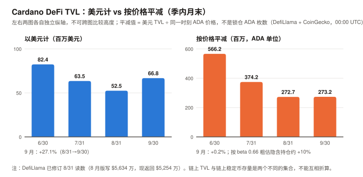
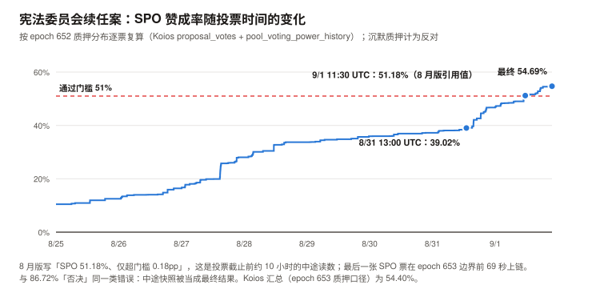
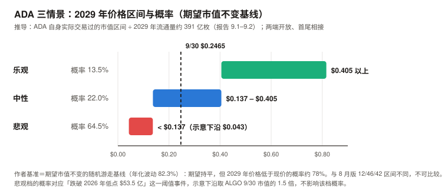

# ADA / Cardano 完整调研与分析报告

> **编写日期**：2026 年 10 月 5 日
> **数据截止**：2026 年 9 月 30 日（9 月与 Q3 完整数据已闭合）；链上快照取自 epoch 659（10/1 起）与 10/5
> **版本**：2026 年 9 月版（第二期）**兼 Q3 季度回顾**
> **研究方法**：沿用 8 月首期框架（治理与国库为核心章）。**本期第一次有上期论点可核对**（A8-1 至 A8-6，见 3.0）。
>
> **本版更新要点**：
>
> 1. **9 月 +24.64%、Q3 +70.94%**（CoinGecko 日线；本系列 ETH 9 月版用币安口径记为 +24.67% / +70.78%），收于 **$0.2465**，市值 **$92.5 亿**。按 beta 扣掉 BTC 的影响，9 月高出预期 **+14.5pp，约 1.25 个标准差**——比 SOL（0.66）大，但**仍不足以排除噪声**。
> 2. **本期最重要的发现：8 月版的治理叙事有两处建立在「中途快照」上，与首期 86.72% 是同一类错误。**
>    ① 8 月版写宪法委员会续任案「SPO 51.18%、仅超门槛 0.18pp」——**逐票复算显示 51.18% 与 9/1 11:30 UTC 前后的中途读数一致；最终值三个来源分别为 54.69%（本报告逐票复算）、54.40%（Koios 汇总）、56.54%（Intersect 周报），差异原因未查明**，但都高于 51%、都不是 51.18%，超门槛约 3.4–5.5pp；
>    ② 8 月版写「IOG 系四笔提案全部通过」——**链上有一笔 4 月提交的 1,229 万 ADA 提案（媒体称 IO 的 Pogun 项目）以 DRep 赞成 35.67% 失败**（64.33% 为「未赞成」，含沉默；明确反对约占分母 40%），投了票的 DRep 中明确反对（16.75 亿 ADA）多于明确赞成（14.81 亿）。8 月版的观察窗口漏掉了它。
> 3. **8 月版论点 A8-6「风险是冷漠而非对立」按检验字面判 ❌**（统计量与论点不完全同构，见 3.0）：9 月到期的 Governance Incentives Framework 2026 被**明确反对票**否决（反对 23.55 亿 vs 赞成 0.74 亿 ADA），即使把全部沉默票算作赞成也只有 45.2%，低于 67% 门槛。**同月另有两笔动议因沉默质押失败——冷漠与明确拒绝同时存在。**
> 4. **国库 9 个 epoch 零新批准，但还不能称为停摆**：epoch 650（8/17–8/22）之后没有一笔国库提取获批；9 月到期两笔失败（其中 Ikigai 是 98.1% 赞成、因沉默失败的冷漠型案例），在投的 OpenZeppelin 提案 DRep 反对 96.57%。**但 epoch 571 以来出现过三次 ≥9 个 epoch 的批准空档**（Koios 一手），本报告自设的「停摆确认」阈值是 18 个 epoch；已批准资金仍在发放（Intersect 9/11 周报：已为 16 份合同拨款）。同期 Hoskinson 9/18 公开表示 **IO 今后不再「Cardano 优先」**（媒体转述，未取得原始视频）。
> 5. **9 月 TVL +27.1% 约六成是价格效应**：按价格平减只增 **+0.2%**，按 TVL 对价格的 beta 0.66 粗估、隐含持仓约 **+10%**；**链上稳定币 9 月「+32%」主要是数据断档**——DefiLlama 对 USDM 的统计在 2026-02-09 至 09-28 之间缺失，9/28 恢复时一次计入约 $1,366 万（9/30 存量 $1,354 万）；剔除 USDM 后其余稳定币增长约 +5.7%。
> 6. **L1 手续费 9 月 $48,848**（DefiLlama），环比 +24.0%，**真同比 –81.9%**；交易笔数 722,433（+11.9%）。**仍在噪声量级。**
> 7. **情景框架重建**：8 月版的中性区间上沿「2026 年高点 $91 亿」是错的（实为 1 月 13 日 $158.3 亿），且三档之间有两段空档。本期改用 ADA 自身实际交易过的市值区间、两端开放、首尾相接；**作者基准 = 「期望市值不变」的随机游走基线，概率 64.5/22.0/13.5（悲观/中性/乐观）：期望持平，但 2029 年价格低于现价的概率约 78%**（初稿的 45/30/25「不给方向」经审查撤回，见 9.2）。
>
> **免责声明**：本报告不构成任何投资建议。所有分析仅供研究参考，投资决策请咨询专业顾问。

---

## 核心结论摘要（一页速览）

| 维度 | 核心判断 |
|------|----------|
| **ADA 是什么** | 一条以学术同行评审方式开发的权益证明公链（Ouroboros + eUTxO），核心卖点是形式化验证与**链上治理**。它的估值既够不着 BTC 的稀缺性锚，也够不着 SOL 的网络收入锚 |
| **当前价格位置** | 9/30 收于 **$0.2465**，市值 **$92.5 亿**；10/5 为 $0.2678、市值第 16（8 月版第 19）。距 ATH $3.09 回撤 **–92.0%**，近 1 年 **–70.6%** |
| **9 月 / Q3 表现** | **9 月 +24.64%、Q3 +70.94%**。beta 1.58，按 BTC 推算的预期 9 月 +10.10%；超额 **+14.5pp ≈ 1.25 个标准差**，Q3 超额只有 0.26 个标准差。**9 月的超额值得记录，但不显著** |
| **本期最重要的发现** | **8 月版的两处治理事实是中途快照或观察窗口不全**：CC 续任案最终 SPO 54.4%–56.5%（三个来源，不是 51.18%）；IOG 系提案并非「全部通过」（Pogun 1,229 万 ADA 失败）。**8 月版把媒体快照标成了一手：86.72% 与 51.18% 是同一类来源分级错误** |
| **治理** | **冷漠与明确拒绝同时存在**：GIF 2026 被明确反对票否决（A8-6 按字面 ❌）；Ikigai 返还（投票者 98.1% 赞成）与参数修改第二部分（投票 SPO 76.8% 赞成）因沉默失败。**国库自 epoch 650 起 9 个 epoch 零新批准**（有先例，尚未达「停摆」阈值）。有效选民很窄：DRep 委托 157.4 亿 ADA 中 103.0 亿是「自动弃权」，国库类动议的有效计票分母约 43 亿 |
| **链上使用** | 9 月 722,433 笔（日均 24,081，0.28 TPS）；L1 费 $48,848，真同比 –81.9%；TVL 按价格平减 +0.2%。**使用量仍在噪声量级，8 月版的判断不变** |
| **核心多头逻辑** | 9 月超额 +14.5pp（不显著）；Cardano Foundation 加入 Mastercard Crypto Partner Program（**媒体转述，无产品、无 ADA 集成**）；Node 11.2 / Dijkstra 在推进，节点 11.3 计划含 Leios（**二手、无主网日期**）；排名回到第 16 |
| **核心空头逻辑** | 国库 9 个 epoch 零新批准；IO 表示不再 Cardano 优先（**媒体转述，未取得原始视频**）；明确反对型否决出现；L1 费真同比 –81.9%；TVL 增长约六成是价格效应；仍零份单一资产 ADA 现货 ETF 申报（SEC EDGAR 一手）；8 月版的治理风险证据（0.18pp）被高估、「IOG 系全过」漏了一笔 |
| **估值立场** | 情景以 ADA 自身实际交易过的市值区间为参照、两端开放；**作者基准 = 期望市值不变的随机游走基线**，概率 **64.5/22.0/13.5**（悲观/中性/乐观）。期望市值持平，但 **2029 年价格低于现价的概率约 78%**。没有可用的现金流锚，这是选锚的结果，不是基本面推导 |
| **风险等级** | 高于 BTC、ETH 与 SOL。年化波动 9 月 76.8%、过去一年 82.3%；对 BTC 的 beta 约 1.4–1.6 |

---

## 1. Cardano 的起源与设计取舍

> 本章与 8 月首期相同，此处只保留理解本期内容必需的部分。完整内容见 `ada_research_report_202608.md` 第 1 章。

| 维度 | Bitcoin | Solana | **Cardano** |
|------|---------|--------|-----------|
| 首要目标 | 抗审查的货币 | 高吞吐执行层 | **形式化验证 + 链上治理** |
| 账本模型 | UTXO | 账户 | **eUTxO**（交易结果可在提交前本地确定性验证） |
| 开发方式 | 开源社区 | 公司主导快速迭代 | **先发论文、过同行评审，再写代码** |
| 代价 | 吞吐低 | 中心化压力 | **产品速度慢；并发争用让 DeFi 开发更难** |

**ADA 的三重角色**：质押品（APY 约 2.1%，见 3.5）、手续费（数量级可忽略，见 3.2–3.3）、**治理票权**（本期核心，见第 5 章）。

**三实体架构**：IOG（研发）/ Cardano Foundation（瑞士非营利）/ EMURGO（商业孵化），另有会员制组织 **Intersect** 负责治理协调与预算流程。本期第 5 章的冲突发生在 IOG 与 DRep 群体之间。

---

## 2. ADA 的发展阶段划分

> 阶段一至四见 8 月首期（Byron / Shelley / Goguen / Basho）。阶段五追加本期事件。

### 阶段五：Voltaire —— 治理落地与压力测试（2024.09– 至今）

| 时间 | 事件 |
|------|------|
| 2026-04-22 | **Pogun 国库提案（1,229 万 ADA）上链**；epoch 633（约 5 月下旬）**以 DRep 赞成 35.67% 过期失败**——8 月版漏记 |
| 2026-08-17 ~ 08-22 | **epoch 650：最后一笔获批的国库提取**（AlphaGrowth 1.2 亿 ADA） |
| **2026-09-01** | 宪法委员会续任案最后一张 SPO 票在 epoch 653 边界前 69 秒（21:43 UTC）上链；最终 SPO 赞成率 **54.69%**（逐票复算）/ 54.40%（Koios）/ 56.54%（Intersect） |
| 2026-09-01 | 参数修改第二部分（minPoolCost 75 + Plutus 内存上限）**过期**：DRep 68.57% 达标，**SPO 32.88% 未达 51%** |
| **2026-09-06** | 新宪法委员会在 epoch 654 边界生效 |
| 2026-09-06 ~ 09-11 | 两笔新动议上链：**OpenZeppelin 工具栈 1,178.7 万 ADA**、**minPoolCost 单独降至 75 ADA**（均于 epoch 661 到期） |
| **2026-09-15** | **Cardano Foundation 加入 Mastercard Crypto Partner Program**（媒体转述）；同日 CLARITY 法案参议院程序性投票 49–50 失败，ADA 收于 9 月低点 **$0.1954** |
| 2026-09-16 | 美联储加息 25bp 至 3.75–4.00% |
| **2026-09-18** | **Hoskinson 直播表示 IO 今后按产品选链、不再「Cardano 优先」**（CryptoSlate 等转述） |
| **2026-09-21** | **epoch 656 结束、提案移除**（Intersect 周报写作「Sep 16, 2026 (Epoch 656)」，指的是到期 epoch 的开始日）：Governance Incentives Framework 2026（420.8 万 ADA）**被明确反对票否决**；Ikigai 押金返还（10.3 万 ADA）**因沉默失败** |
| 2026-09-25 | 9 月高点 **$0.2586** |
| 2026-09-05 / 09-11 | Intersect 周报（**已打开原文**）：节点 11.2「完整 Dijkstra 功能、不含 Leios」，不到 1 个月；**11.3 为含 Leios 的硬分叉候选版本，1–2 个月**；无主网日期 |
| 2026-09-28 | DefiLlama 恢复 USDM 统计，Cardano 链上稳定币一日跳升约 $1,366 万（数据事件，非资金流入） |

---

## 3. ADA 当前现状分析

### 3.0 论点校验：8 月版登记的 6 条

| # | 论点 | 检验条件（摘要） | 9 月读数 | 状态 |
|---|------|------|------|------|
| A8-1 | 链上活动不跟随价格 | 9–12 月中 ≥3 个月「价格与 TVL 同向且均 >5%」则错 | 9 月价格 +24.67%（币安）、TVL +27.1%（DefiLlama）——**计 1 个月**；⚠️ 美元 TVL 对价格的 beta 约 0.66，价格波动超过约 7.6% 的月份会机械地「同向且 >5%」，**本条实际受价格波动污染**，判定时须注明 | ⏳ 1 / 3 |
| A8-2 | L1 收入不会脱离噪声量级 | 2027-06-30 前 L1 30 天费用 >$50 万并维持两个月则错 | 9 月 $48,848 | ⏳ |
| A8-3 | Leios 面对执行风险而非资金风险 | 2027-03-31 前因资金不足延期则错 | 未见资金相关声明；节点 11.2 不含 Leios，11.3 无主网日期（二手） | ⏳ |
| A8-4 | ETF 通道短期不会打开 | 2026 年底前出现单一资产 ADA 现货 ETF 申报则错 | **SEC EDGAR 全文检索 8/1–10/4：零份**；唯一相关文件是 Grayscale 8/7 的撤回（RW） | ⏳ |
| A8-5 | 中性区间 $0.13–$0.26 是最可能结果 | 2026-12 月均价落在区间外则错 | 9 月月均 **$0.2223**；**10/5 已到 $0.2678，高于上沿** | ⏳ 12 月核 |
| **A8-6** | **治理风险是冷漠而非对立** | 任一动议因明确反对超过门槛而失败则错；关键动议因参与率失败则成立 | **两个分支在 9 月同时触发**——GIF 2026 因明确反对失败；Ikigai、参数修改第二部分因沉默失败 | **❌（按检验字面）** |

**A8-6 是本期最有信息量的一条**：它的「成立」与「错误」两个分支不互斥，同月同时触发，而登记时没有规定这种情况怎么判。
本报告按登记的证伪条件字面判 ❌——条件写明「任一动议因明确反对超过门槛而失败则错」，GIF 2026 满足。
**但要同时写明两点限制**（审查后补）：① 8 月版原话是「治理的**主要**风险是冷漠」，这是关于哪种机制占主导的判断；本期 3 笔失败里 2 笔是冷漠型，反而支持「主要是冷漠」——**检验统计量（是否出现一次明确反对型失败）与论点（哪种机制为主）不完全同构（门槛 4）**；要真正检验「主要」，需要把 epoch 626 以来全部过期提案逐笔分类，本期未做。② GIF 2026 被约 97% 的投票票权与宪法委员会 4:1 否决，是**近乎一致的拒绝**，不是「阵营对立」。
**另一处**：Pogun 在 5 月就已失败且投票者多数反对（见 5.4）——若媒体归属正确，8 月版写下这条论点时，一个相关反例已经在链上。

> 检验设计缺陷已补入记分卡门槛 5 的执行细则：**多个判定分支必须互斥，或预先规定同时触发时怎么判。**

### 3.1 价格与市场

> 口径：CoinGecko `market_chart`（365 天、日线；每日 00:00 UTC 数据点视为前一日收盘）。币安 API 本期在作者环境中不可用；**横向对照时引用本系列 ETH 9 月版的币安口径数字，并在表内注明**。两种口径 9 月相差 0.03pp。

| 指标 | 数值 |
|------|------|
| **9/30 收盘** | **$0.2465** |
| 市值（9/30） | **$92.5 亿** |
| 10/5 价格 / 市值 / 排名 | $0.2678 / $100.55 亿 / **第 16**（8 月版为第 19） |
| 流通量 | 375.41 亿（CoinGecko，与 Koios「总供应 – 国库」完全一致，见 4.1） |
| ATH / 距 ATH | $3.09（2021-09-01）/ **–92.0%** |
| 9 月区间 | 低 **$0.1954**（9/15）/ 高 **$0.2586**（9/25） |
| 9 月月均（9/1–9/30 共 30 个 00:00 点） | **$0.2223** |

| 区间 | ADA（CoinGecko） | ADA（币安，ETH 9 月版） | BTC（CoinGecko） |
|------|------|------|------|
| **9 月**（8/31→9/30） | **+24.64%** | +24.67% | +6.39% |
| **Q3**（6/30→9/30） | **+70.94%** | +70.78% | +42.70% |
| YTD | –26.04% | –26.06% | –4.57% |
| 近 1 年（2025-10-05→9/30） | **–70.55%** | — | — |

**beta、R² 与噪声带**（XIN / CKB 期规则：beta 必须与 R² 一起报；超额必须换算成标准差）：

| 窗口 | ADA 年化波动 | beta | R² | beta 预期 | 实际 | 超额 | 1 个标准差 | 约几个标准差 |
|------|------|------|------|------|------|------|------|------|
| **9 月** | 76.8% | 1.580 | 0.722 | +10.10% | +24.64% | **+14.54pp** | 11.6pp | **约 1.25** |
| Q3 | 75.8% | 1.511 | 0.581 | +64.53% | +70.94% | +6.42pp | 24.6pp | 约 0.26 |
| 近 1 年 | 82.3% | 1.381 | 0.569 | –44.62% | –70.55% | –25.93pp | 53.7pp | 约 –0.48 |

> 标准差算法：残差年化波动 = 年化波动 × √(1 − R²)，按窗口天数折算。同期 BTC 年化波动 9 月 41.3%。
> **结论**：9 月 ADA 跑赢 beta 预期 14.5pp，按百分点是本系列 9 月 BTC / ETH / SOL / ADA 里超额最大的（SOL 为 +6.19pp、约 0.66 个标准差）；**但 1.25 个标准差不足以排除噪声**。Q3 与近一年的超额都在噪声内。
> 30 日相关性（vs BTC）：9/15 为 0.869，9/30 为 0.850。

**9 月最大的单一事件是否解释了超额？——事件窗检验**（GRAM 期规则：写进多空表之前先检验是否已被定价）

| 窗口 | ADA | BTC | SOL | ADA/BTC |
|------|------|------|------|------|
| 8/31 → 9/14（宣布前） | +5.44% | –0.48% | –0.48% | **+5.95%** |
| 9/15 → 9/22（Mastercard 宣布后一周） | **+30.03%** | +14.01% | +22.33% | **+14.05%** |
| 9/14 → 9/30 | +18.21% | +6.91% | +15.15% | +10.57% |

> 按 9 月 beta 1.58，9/15→9/22 的预期为 +22.1%，超额约 +7.9pp；一周的残差标准差约 5.6pp，**约 1.4 个标准差**。
> **这条证据不判别**（ZEC 期规则）：9/15 当天同时发生 CLARITY 法案失败（BTC –3.3%），宣布后一周是全市场从该低点的反弹，SOL 同期也跑赢 BTC 8.3pp；**而 ADA/BTC 在宣布前两周已经 +5.95%**。
> **本报告不把 9 月的超额归因于 Mastercard 事件**——能说的只是「时间上重叠、量级在 1–1.5 个标准差」。

### 3.2 链上活动

> Koios 公共 API `epoch_info`（一手）。Cardano 的 epoch 为 5 天，本期取 epoch 653–658（9/1 21:44 → 10/1 21:44 UTC，共 30 天），与 8 月版的 epoch 647–652 首尾相接。

| Epoch | 起始（UTC） | 交易笔数 | 手续费（ADA） |
|:---:|---|---:|---:|
| 653 | 09-01 | 107,090 | 33,855 |
| 654 | 09-06 | 108,500 | 32,556 |
| 655 | 09-11 | 89,353 | 27,291 |
| 656 | 09-16 | 127,132 | 41,273 |
| 657 | 09-21 | 130,442 | 40,053 |
| 658 | 09-26 | 159,916 | 53,506 |

| 指标 | 9 月（epoch 653–658） | 8 月（epoch 647–652） | 变化 |
|------|---:|---:|---:|
| 交易总笔数 | **722,433** | 645,772 | **+11.9%** |
| 日均 / TPS | 24,081 / **0.28** | 21,526 / 0.25 | |
| 手续费 | **228,535 ADA** | 188,805 ADA | +21.0% |
| 平均每笔手续费 | **0.316 ADA** | 0.292 ADA | +8.2% |

> **交叉核对**：228,535 ADA × 9 月月均价 $0.2223 ≈ **$50,800**，DefiLlama 9 月 L1 费 $48,848，相差约 4%（窗口与折算价不同），**数量级一致**。
> **读法**：交易笔数 +11.9% 是一个月的变化，8 月版监控指标 #1 的阈值是「连续一个月日均 >10 万笔」——**9 月的 24,081 笔离它还差约 4 倍**。

### 3.3 费用：真同比 –81.9%

**L1 协议层手续费月度序列**（DefiLlama `summary/fees/cardano`，日度按月加总，一手）：

| 月份 | L1 手续费 | 备注 |
|------|---:|------|
| 2025-07 | $270,673 | |
| 2025-08 | $312,207 | |
| **2025-09** | **$269,935** | 真同比基准 |
| 2025-12 | $159,502 | |
| 2026-01 | $102,318 | **最近一次 ≥ $10 万** |
| 2026-06 | $46,788 | |
| 2026-07 | $40,936 | |
| 2026-08 | $39,380 | |
| **2026-09** | **$48,848** | 环比 **+24.0%** |

| 比较 | 结果 |
|------|------|
| **9 月真同比**（vs 2025-09） | **–81.9%** |
| Q3 2026 合计 | $129,164 |
| Q3 环比（vs Q2 $164,599） | –21.5% |
| **Q3 真同比**（vs 2025 Q3 $852,815） | **–84.9%** |

> **9 月环比 +24.0%：价格与用量大致各占一半**——9 月月均价比 8 月（$0.1961）高 13.4%；以 ADA 计的链上手续费（Koios）环比 +21.0%，其中笔数 +11.9%、每笔费用 +8.2%。**量级没有变化。**
> ⚠️ 两个来源只在**水平**上一致：Koios 手续费 × 月均价得出美元口径约 +37%（$37,025 → $50,800），DefiLlama 为 +24%，**增速相差约 13pp**，原因未查（窗口与折算价不同）。

**生态应用层费用**（DefiLlama `overview/fees/cardano`，一手）：

> ⚠️ **口径说明（本期发现）**：DefiLlama 当前返回的 `overview` 合计**不含** L1 链费——「Cardano Chain」作为协议单列，但不进合计（30 天合计 $496,492 等于其余协议之和）。8 月版写「生态合计 $353,264 **含** L1 $38,275」，**按当前接口无法复现**；8 月版列出的 Strike Finance（$54,691）在当前历史序列中也不再出现。**DefiLlama 对历史数据有修订，8 月版的分项不能与本表直接比较。**

| 协议 | 2026-08 | **2026-09** |
|------|---:|---:|
| Minswap DEX | $103,120 | **$155,002** |
| Liqwid（借贷） | $85,223 | **$110,043** |
| SundaeSwap V2 | $11,383 | $17,976 |
| WingRiders | $12,480 | $15,553 |
| Minswap Aggregator | $3,562 | $6,128 |
| **Dano Finance** | **$78,667** | **$4,116** |
| **应用层合计** | **$301,409** | **$311,514** |
| 加 L1 链费 | $340,789 | **$360,362** |

> **读法**：应用层合计几乎持平（+3.4%），但结构换了——Dano Finance 从 $7.9 万掉到 $4,116，Minswap 与 Liqwid 补上。
> ⚠️ **10 月初的一个异常值，提前标注**：10/4、10/5 两天 SundaeSwap V2 的日费用都是 **$124,555**（9 月日均不到 $600），两日数字完全相同。**疑似数据异常，10 月版需核实后再用。**

### 3.4 生态数据：TVL 与稳定币

**DeFi TVL**（DefiLlama `historicalChainTvl`，一手；「按价格平减」= 美元 TVL ÷ 同一 00:00 UTC 时点的 CoinGecko 价格。⚠️ **这不是锁仓 ADA 的枚数**——TVL 里还有稳定币与其他代币，平减值只是一个购买力单位）：

| 时点 | TVL（美元） | TVL（按价格平减，ADA 单位） |
|------|---:|---:|
| 历史高点 2024-12-07 | $7.21 亿 | — |
| 2026-06-30 | $8,242 万 | 5.662 亿枚 |
| 2026-07-31 | $6,349 万 | 3.742 亿枚 |
| **2026-08-31** | **$5,254 万** | **2.727 亿枚** |
| 2026-09 月内低 / 高 | $5,513 万（9/16）/ $6,928 万（9/26） | — |
| **2026-09-30** | **$6,676 万** | **2.732 亿枚** |

| 变化 | 以美元计 | **按价格平减** |
|------|---:|---:|
| **9 月** | **+27.1%** | **+0.2%** |
| Q3 | –19.0% | **–51.7%** |
| 距历史高点 | –90.7% | — |

> 图中数字：美元 TVL（百万美元）82.4 / 63.5 / 52.5 / 66.8；按价格平减（百万，ADA 单位）566.2 / 374.2 / 272.7 / 273.2（6/30、7/31、8/31、9/30）。左图纵轴 0 / 50 / 100，右图纵轴 0 / 200 / 400 / 600。

**9 月 TVL 的增长约六成是价格效应**：过去 6 个月 TVL 日度对数变动对 ADA 价格的 beta 为 0.66（R² 0.47）——**TVL 的大部分、但不是全部，是 ADA 计价资产**。按这个 beta，持仓不变时 9 月美元 TVL 应涨约 +16%，实际 +27.1%，**隐含持仓约 +10%**；Q3 隐含持仓约 **−43%**。
⚠️ 初稿写「以 ADA 计锁仓没有变化」「锁仓 ADA 季度少了一半」——**用的是平减值，它只在 TVL 100% 为 ADA 时等于锁仓枚数**，与本节自己测出的 beta 0.66 不兼容，审查后改写。按 beta 的粗估同样有误差（R² 只有 0.47）；**根本解法是按协议拆代币构成，本期未做。**

> ⚠️ **更正 8 月版的一处推理**：8 月版用「链上稳定币 $6,411 万 ≈ TVL $6,467 万」推出「TVL 几乎全部是静态存放的稳定币」。
> **两个数接近不等于一个包含另一个**：稳定币存量统计的是链上发行在外的全部稳定币（大部分在钱包里），TVL 统计的是锁在 DeFi 合约里的资产，是两个不同的集合。
> 本期的价格弹性（beta 0.66）说明 TVL 主要是 ADA 计价资产——**与 8 月版的说法方向相反**。另：DefiLlama 已把 8/31 的 TVL 从 $5,634 万修订为 $5,254 万。

**链上稳定币**（DefiLlama stablecoins API，一手）：

| 时点 | 合计 | 其中 USDM | 同口径（剔除 USDM） |
|------|---:|---:|---:|
| 2026-08-31 | $5,091 万 | 未统计 | $5,091 万 |
| 2026-09-27 | $5,383 万 | 未统计 | $5,383 万 |
| **2026-09-28** | **$6,749 万** | **恢复统计** | — |
| **2026-09-30** | **$6,736 万** | $1,354 万 | **$5,382 万** |

| 9 月变化 | 数值 |
|------|---:|
| 表面增长 | **+32.3%** |
| **剔除 USDM 后其余稳定币的增长** | **+5.7%** |
| 其中 USDC（$4,337 万 → $4,658 万） | +7.4% |

> **「9 月链上稳定币 +32%」是数据事件，不是资金流入**：DefiLlama 的 USDM（Moneta）序列在 **2026-02-09 至 2026-09-28 之间整段缺失**（2025-09-30 时为 $1,301 万），9/28 恢复时一次计入约 $1,366 万。
> 这与 CKB 期「数据源可以两端都对、中间一段坏」是同一形态。**任何用 DefiLlama 合计数说「9 月稳定币大增」的报道都是错的。**

**DEX 成交额**：9 月 $6,379 万（日均约 $213 万，DefiLlama `overview/dexs`）。8 月版已指出该接口的 30 天口径自相矛盾，**本期只报月度合计，不做环比**。

### 3.5 质押与验证者经济

| 指标 | 数值 | 来源 |
|------|------|------|
| 质押总量（epoch 658 active stake） | **213.21 亿 ADA** | Koios（一手） |
| 质押率（÷ 流通 375.41 亿） | **56.8%**（8 月版 56.4%–57.0%） | 计算 |
| 注册质押池 | **2,889 个**（8 月版 2,895） | Koios `pool_list`（一手） |
| 有投票权的池（epoch 653） | 2,826 个 | Koios `pool_voting_power_history` |
| **质押者实得毛收益（推算）** | **约 2.11%** | 见下 |

> **毛收益的推算（本期新增，一手）**：epoch 653→659 储备每 epoch 净减少约 984 万 ADA，其中约 368 万进入国库（国库每 epoch 增量），**余下约 616 万分配给质押者与池运营者** → 年化约 4.50 亿 ADA ÷ 质押量 213.21 亿 ≈ **2.11%**。与 StakingRewards 的 2.07%（8 月版）一致。
> 在 10 年期美债 **5.29%** 的环境下（9 月末，美国财政部），质押收益不到无风险利率的四成。

### 3.6 宏观环境

> 与 BTC / SOL 9 月版共用（一手：federalreserve.gov、美国财政部）。

| 因素 | 9 月末 |
|------|------|
| 联邦基金利率 | **3.75–4.00%**（美联储 9/16 加息 25bp，12:0） |
| 10 年期美债 | **5.29%**（年内最高） |
| CLARITY 法案 | 9/15 参议院程序性投票 49–50 失败（需 60 票） |
| 8 月 CPI | 同比 3.4%（转述） |

> **宏观全面偏鹰，ADA 仍涨 24.6%。** 与 BTC 9 月版的观察相同：本报告不把宏观偏鹰直接翻译成偏空。
> **对 ADA 的特殊含义**：CLARITY 失败意味着 SEC 对 ADA 是证券还是商品**仍无定论**——这是单一资产 ADA 现货 ETF 的前提条件之一（见 6.1）。

### 3.7 Q3 季度回顾（本版新增）

| | Q2 2026 | **Q3 2026** |
|------|------|------|
| ADA 季度涨跌（CoinGecko） | — | **+70.94%** |
| L1 手续费 | $164,599 | **$129,164**（–21.5%） |
| 季末 TVL（美元） | $8,242 万 | **$6,676 万**（–19.0%） |
| 季末 TVL（按价格平减） | 5.662 亿 | **2.732 亿**（–51.7%；按 beta 粗估隐含持仓约 −43%） |
| 获批的国库提取（按 enacted_epoch 近似归季） | 14 笔 / 2.63 亿 ADA | **15 笔 / 1.84 亿 ADA，全部在 epoch 650（8/17–8/22）之前；此后为零** |
| 市值排名（季末前后） | 第 19（8 月版） | **第 16**（10/5） |

**一句话**：**Q3 是一个高 beta 资产在 BTC 大涨季度里的表现**——价格超额在噪声内，链上锁仓按 beta 粗估少了四成多，L1 收入环比下降，国库季末起 9 个 epoch 没有新批准。

> 归季口径：Q2 ≈ epoch 622–640（3/30–7/3），Q3 ≈ epoch 641–658（7/3–10/1），epoch 边界与自然季度相差最多 3 天。Q3 的 15 笔里 11 笔集中在 epoch 645–646（7/23–8/2），属于同一批 6 月提交的基础设施提案。

---

## 4. 代币经济学与国库（ADA 特有）

### 4.1 发行实测：总供应年化增速 1.85%

**供应账目**（Koios `totals`，epoch 659，一手）：

| 项目 | 数值 |
|------|---:|
| 总供应（supply） | 389.12 亿 |
| 其中国库 | **13.71 亿** |
| **流通（总供应 – 国库）** | **375.41 亿**（与 CoinGecko 流通量完全一致） |
| 未发行储备（reserves） | **60.88 亿** |
| **合计** | **450.00 亿**（= 硬上限，闭合） |

**发行速度**（epoch 653 → 659，6 个 epoch）：

| 项目 | 每 epoch | 年化（73 个 epoch） |
|------|---:|---:|
| 储备净减少 = 总供应增加 | 约 984 万 ADA | 约 7.18 亿 ADA，**占总供应 1.85%** |
| 其中进入国库 | 约 368 万 | 约 2.69 亿 |
| **进入流通（质押奖励）** | 约 616 万 | 约 4.50 亿，**占流通 1.20%** |

> **8 月版的「通胀 1.47%」来自 StakingRewards，口径未注明**；按 Koios 账目，总供应年化增速 1.85%、流通年化增速 1.20%，**两者都不是 1.47%**。本期起改用链上账目。
> 储备每 epoch 衰减约 0.16%（协议参数 ρ = 0.3% 是上限，按出块表现折算后未分配部分退回储备）。

### 4.2 国库：在增长，新批准暂停

| 项目 | epoch 651（8 月版） | **epoch 659** | 变化 |
|------|---:|---:|---:|
| 国库余额 | 13.41 亿 ADA | **13.71 亿 ADA** | **+2.2%** |
| 折美元 | 约 $2.88 亿 | **约 $3.38 亿**（按 $0.2465） | |
| 期间新获批的国库提取 | AlphaGrowth 1.2 亿（epoch 650） | **零**（已批准资金仍在发放，见 5.6） | |

**国库提取动议的累计战绩**（Koios `proposal_list`，按 proposed_epoch ≥ 626，一手）：

| 状态 | 8 月版 | **本期** |
|------|---:|---:|
| 已批准并执行 | 26 | **26** |
| 过期未通过 | 23 | **25** |
| 投票中 | 2 | **1**（OpenZeppelin） |
| **通过率** | 53.1% | **51.0%** |

> 8 月版的两笔「投票中」（Ikigai、GIF 2026）**都在 9 月失败**；新增的一笔（OpenZeppelin）DRep 反对 96.57%。
> **过去 73 个 epoch（约一年）共批准 32 笔、合计 5.32 亿 ADA**；**而 epoch 650 之后一笔都没有**。**这种空档有先例**：epoch 571 以来出现过三次 ≥9 个 epoch 的批准空档（578→598 共 20 个、606→621 共 15 个、625→634 共 9 个；Koios 一手），批准本来就成批出现（Q3 的 15 笔里 11 笔集中在 epoch 645–646）。8 月版监控指标 #5 的阈值是「通过率跌破 35%」——**累计通过率是一个慢变量，它掩盖了最近 9 个 epoch 的零批准**。本期把监控改为「最近一笔获批距今的 epoch 数」（见 10.3）。

---

## 5. 治理：冷漠与对立同时出现（本期核心章）

### 5.1 9 月结算的治理动议（Koios `proposal_voting_summary` + `proposal_list`，一手）

| 动议 | 类型 | 结果 | DRep 赞成 | SPO 赞成 | 宪法委员会 | **失败原因** |
|------|------|------|---:|---:|---|---|
| Update Constitutional Committee 2026 | 委员会更新 | ✅ epoch 653 批准、654 生效 | 71.95% | **54.40%**（Koios；逐票复算 54.69%；Intersect 周报 56.54%） | — | — |
| 降 minPoolCost 至 75 + 提高 Plutus 内存（第二部分） | 参数修改 | ❌ epoch 653 过期 | 68.57%（门槛 67% ✅） | **32.88%**（门槛 51%） | 71.43% | **SPO 沉默**：投票 SPO 中 76.8% 赞成（37.10 亿 vs 11.21 亿），约 64.5 亿未投票计为反对 |
| Ikigai 押金返还（10.3 万 ADA） | 国库提取 | ❌ epoch 656 过期 | **65.18%**（差 1.82pp） | 不适用 | 5 赞 1 反 | **DRep 沉默**：投票者 98.1% 赞成（28.91 亿 vs 0.55 亿），约 13.50 亿沉默 + 1.39 亿自动不信任计为反对 |
| **Governance Incentives Framework 2026**（420.8 万 ADA） | 国库提取 | ❌ epoch 656 过期 | **1.72%** | 不适用 | **1 赞 4 反** | **明确反对**：98 个 DRep / 23.55 亿 ADA 投反对，12 个 / 0.74 亿投赞成 |

**9 月上链、尚在投票的**（截至 epoch 659）：

| 动议 | 金额 / 内容 | 到期 | 当前 DRep 赞成 |
|------|------|------|---:|
| OpenZeppelin 工具栈（Intersect 管理） | 1,178.7 万 ADA | epoch 661 | **3.43%**（61 个 DRep / 17.19 亿反对） |
| 单独降 minPoolCost 至 75 ADA | 参数修改 | epoch 661 | 26.65% |
| 是否把 k 从 500 提到 1000（SPO 意见调查） | 信息动议 | epoch 663 | 2.83%（SPO 0.72%） |

### 5.2 GIF 2026：一次明确的拒绝

| 项目 | 数值（ADA） |
|------|---:|
| 明确赞成（12 个 DRep） | **0.74 亿** |
| **明确反对（98 个 DRep）** | **23.55 亿** |
| 自动不信任（计为反对） | 1.39 亿 |
| 沉默（活跃 DRep 未投票，计为反对） | 17.29 亿 |
| 有效计票分母 | **42.96 亿** |
| **把沉默与自动不信任全部算成赞成时的上限** | (0.74 + 17.29 + 1.39) ÷ 42.96 = **45.2%**，仍低于 67% |

> **结论**：这笔提案的失败与冷漠无关——**投了票的人里 97% 的票权反对它**，宪法委员会也 4 比 1 反对。
> 它满足 8 月版 A8-6 登记的证伪条件，**本期按字面判 ❌**（限制见 3.0）。
> **但这不等于「Cardano 进入了阵营对立」**：97% 的投票票权加宪法委员会 4:1 是近乎一致的拒绝，不是两个阵营对峙；同月另外两笔是典型的冷漠型失败（投票者 98.1% / 76.8% 赞成）。**正确的描述是冷漠与明确拒绝并存。**

### 5.3 更正 8 月版：「SPO 51.18%、仅超门槛 0.18pp」是中途快照

8 月版第 5.4 节写：宪法委员会续任案「SPO 支持率 51.18%（门槛 51%，仅超 0.18pp）」「SPO 投票率一度仅 39%」，**并在正文标注「（已一手核实）」、在 11.4 标为「✅ 打开原文」**，以此作为「治理风险是冷漠」的核心证据之一。

**本期逐票复算**（Koios `proposal_votes` 的 338 张 SPO 票 × `pool_voting_power_history` 的 epoch 652 质押分布；未投票计反对，「自动弃权」约 95.15 亿从分母中扣除）：

| 时点（UTC） | SPO 赞成率 |
|------|---:|
| 8/31 13:00 | **39.02%** |
| 9/1 00:00 | 46.99% |
| 9/1 11:26 | 首次越过 51% |
| **9/1 11:30** | **51.18%** ← 与 8 月版引用值一致 |
| **9/1 21:43（最后一张 SPO 票，epoch 653 边界前 69 秒）** | **54.69%（最终）** |

> 图中数字：8/31 13:00 UTC 39.02%；9/1 11:30 UTC 51.18%；最终 54.69%；通过门槛 51%；纵轴 0% / 20% / 40% / 60%；横轴刻度 8/25、8/26、8/27、8/28、8/29、8/30、8/31、9/1；Koios 汇总口径 54.40%（Intersect 周报为 56.54%，见下）。

**这说明三件事**：

1. **8 月版犯的是来源分级错误。** 首期的头号更正是「86.72% 反对」是中途快照——那个数字支持的是初稿当时的结论，是被外部审查抓出来的；**同一份报告里的 51.18% 也是媒体快照**，却被标成「已一手核实」「✅ 打开原文」——**打开的是媒体原文，不是链上记录**。两者是同一类来源，前者有人抓、后者没人抓。
2. **「39%」的口径存疑**：8 月版写「SPO 投票率一度仅 39%」；本期复算显示 8/31 13:00 的**赞成率**是 39.02%，但本报告没有计算投票率序列，**无法确认 8 月版是把赞成率写成了投票率，还是另有一个 39% 的投票率时点**。
3. **险情的性质需要重写，但没有消失**：最终超门槛约 3.4–5.5pp（三个来源），**不是 0.18pp**；但最终赞成票权的 **32% 是在截止前最后约 46 小时才到达的**，约 51.9 亿 ADA 的未投票质押仍被计为反对。**「靠最后时刻动员过关」这个描述成立；「险胜 0.18pp」不成立。**

> **最终值有三个来源、三个数**：Koios 汇总端点（epoch 653 质押分布）54.40%；本报告逐票复算（epoch 652 分布）54.69%；**Intersect 9/5、9/11 周报 56.54%（已打开原文）**。前两者的差异来自质押分布取点；与 Intersect 的差异**原因未查明**（可能与 SPO 未投票的默认计票规则或质押快照有关，未验证）。**三者都高于 51%、都不是 51.18%**，结论不受影响；但「51.18% 恰好是 11:30 的读数」只能说「与 11:30 前后的读数一致」——本报告的复算方法与 Koios 相差 0.29pp，精度不足以把时点钉到分钟。

### 5.4 更正 8 月版：「IOG 系四笔提案全部通过」不成立

| 项目 | 数值（Koios，一手） |
|------|---|
| 提案 | 国库提取 **1,229 万 ADA**（链上元数据标题为空；**多家媒体称为 Input Output 的 Pogun 项目**，CryptoSlate 引用了同一组 Koios 数字） |
| 上链 / 到期 | 2026-04-22（proposed epoch 626）/ **epoch 633 过期** |
| DRep 赞成 / 未赞成 | **35.67% / 64.33%**（64.33% 含沉默计反对；明确反对约占分母 40%） |
| 投了票的 DRep | **明确赞成 14.81 亿 vs 明确反对 16.75 亿 ADA** |
| 宪法委员会 | 100% 赞成 |

> **8 月版的观察窗口是「epoch 626 以来」，而这笔提案恰好是 epoch 626 提交的——它在 8 月版自己的样本里，却没有被归入「IOG 系」。**
> 若媒体的归属正确，那么：① 「IOG 系四笔全部通过」应为「五笔中四笔通过」；② **这是一次投票者多数反对的失败，早于 A8-6 登记三个月**——8 月版写「治理风险是冷漠而非对立」时，反例已经在链上。
> ⚠️ **提案人身份未能一手确认**：链上元数据指向 IPFS，本期作者环境无法访问 IPFS 网关。归属依据是媒体的一致报道（CryptoSlate、Blockonomi、cryptonews 等）——**按 ADA 首期规则，多家一致 ≠ 事实**，因此本条标 ⚠️。

### 5.5 有效选民有多窄

| 项目（epoch 658） | 数值 |
|------|---:|
| DRep 委托合计 | **157.4 亿 ADA**（861 个 DRep） |
| 其中「自动弃权」 | **103.0 亿** |
| 其中「自动不信任」 | 1.39 亿 |
| **国库类动议的有效计票分母**（GIF 2026） | **约 43 亿** |
| 占流通量 | **约 11.4%** |

> **ADA 的治理结果由约 43 亿 ADA 的票权决定**，约等于流通量的九分之一。其余要么没委托、要么委托给「自动弃权」——后者在 Cardano 的计票规则里**从分母中扣除**，不影响结果。
> **这对门槛 11 有直接含义**（审查后改写）：左右一笔国库提取所需的票权**取决于提案离门槛多远**。最难翻转的是 GIF（反对方 23.55 亿）；**最容易的是 Ikigai**——赞成 28.91 亿、分母约 44.35 亿，**一个参与者新委托约 2.44 亿 ADA 给赞成方就能把它推过 67%，低于市值 1% 的 3.75 亿 ADA**。初稿只用了最难的案例，得出「远超」，审查后撤回。

### 5.6 国库新批准暂停与 IO 的表态

| 事实 | 来源 |
|------|------|
| **epoch 650 之后零笔国库提取获批**（截至 epoch 659，9 个 epoch、约 45 天）；epoch 571 以来有三次 ≥9 个 epoch 的先例 | Koios ✅ |
| **已批准资金仍在发放**：Intersect 作为国库提取管理方，2026 预算周期已为 16 份合同拨款、9 份待拨，累计转出 7,400 万 ADA 与 2,200 万 USDx | Intersect 9/11 周报 ✅（已打开原文） |
| 9 月两笔到期国库提案失败（GIF 为明确拒绝；Ikigai 为 98.1% 赞成、因沉默失败），在投的 OpenZeppelin 提案 DRep 反对 96.57% | Koios ✅ |
| 9/18 Hoskinson 直播：**IO 今后按产品选择最合适的链，不再「Cardano 优先」**；RealFi 将于 10 月在 Cardano 上线，Pogun 在 90 天内推出 | CryptoSlate 等转述 ⚠️ |

> **该怎么读**：明确被拒的是**新增支出**（激励框架；新的工具栈拨款正在以 96.57% 反对的速度被否），而 Leios 等核心研发的资助已在 6 月到位、已批准合同仍在拨付。**所以这不是「研发资金被切断」。「增量支出被冻结」是推断**——能区分「冻结」与「批次之间的正常空档」的只有 GIF 与尚未结束的 OpenZeppelin 两笔，Ikigai 属于冷漠型失败，不计入；按本报告自设的阈值（>18 个 epoch），停摆尚未确认。
> **但「核心开发实体不再 Cardano 优先」是一个新的、方向明确的风险**——8 月版把它列为「ADA 独有的额外风险」之一（核心开发实体退出），本期它从假设变成了公开表态。**它的实际含义要看 IO 下一个产品选哪条链，本期不推断。**

### 5.7 本章的定性（相对 8 月版的修订）

| 8 月版的说法 | 本期判定 |
|------|---|
| 「治理风险是冷漠，不是对立」 | ❌ **按检验字面判错**：GIF 2026 是明确拒绝型否决；Pogun 早在 5 月就有投票者多数反对。**但「主要风险是冷漠」本期未被检验**（3.0） |
| 「两次险情均由沉默计反对导致」（Summit 差 1.46pp、CC 差 0.18pp） | ⚠️ **CC 那次的 0.18pp 是中途快照**，最终约 3.4–5.5pp；Summit 的 1.46pp 本期未复算 |
| 「IOG 系四笔全部通过」 | ⚠️ **漏了 Pogun**（若媒体归属正确，应为五笔中四笔） |
| 「国库在高强度地花钱」 | ⚠️ **到 8 月中为止成立**；epoch 650 后 9 个 epoch 零新批准，已批准资金仍在发放 |
| 「DRep 批准基础设施、否决市场活动」 | ⚠️ **9 月被否的 GIF 2026 是治理激励，OpenZeppelin 是开发者工具**——后者属于基础设施，正在以 96.57% 反对的速度被否 |
| 「治理即将崩溃」 | **仍然不该说**。CC 续任成功，宪法委员会满员运作，参数与国库机制都在工作——**只是它现在在说「不」** |

> **修正后的核心判断**：**ADA 治理的结果由一个约 43 亿 ADA 的有效选民决定，这个选民群体同时表现出冷漠（沉默计反对导致高支持率提案失败）与对部分新增支出的明确拒绝。** 「支出收紧成为常态」是推断，目前只有 GIF 一个确定样本。
> 8 月版没看到后者，**能解释的是它漏记了 Pogun**；51.18% 是不是中途快照，与它有没有看到明确拒绝型否决无关。

---

## 6. 机构通道与持有者结构

### 6.1 ETF：零份申报，10/23 窗口不会发生任何事

| 检查 | 结果 | 来源 |
|------|------|------|
| SEC EDGAR 全文检索「Cardano」，8/1–10/4，表格 S-1 / S-1/A / 19b-4 | 8 条命中，**全部是多资产产品**（Cryptex Digital Market Cap ETF 的 S-1/A ×4、Canary 的 INJ / PEPE / TRX / SEI 单币 ETF 修订稿） | EDGAR ✅ |
| 检索「Cardano Trust」 | **Grayscale Cardano Trust ETF 8/7 提交 RW（撤回申请）** | EDGAR ✅（8 月版为媒体转述，本期一手确认） |
| 检索「ADA ETF」 | 0 条 | EDGAR ✅ |
| 指数型敞口 | Hashdex Nasdaq Crypto Index ETF 持有 ADA | 媒体转述 ⚠️ |

> **8 月版写的 10/23「理论审查窗口」不会发生任何事**：没有申报就没有审查。A8-4 继续待验。
> ⚠️ **检索的局限**：交易所提交的 19b-4 不一定以 EDGAR 全文形式出现，本检索**不能排除**交易所官网上的 19b-4。

### 6.2 Mastercard：加入一个合作计划，不是一个产品

| 项目 | 内容 |
|------|------|
| 事件 | **Cardano Foundation 于 9/15 加入 Mastercard Crypto Partner Program 的「区块链」赛道**，方向为跨境转账、企业支付与结算 |
| 未披露 | **产品发布、ADA 集成、交易量目标、时间表——均无** |
| 来源 | 多家加密媒体转述；**Cardano Foundation 官网（cardano.org）在作者环境中被网络策略拦截，未能打开原文** ⚠️ |

> **这是一个有多家参与者的合作计划**（媒体称同一计划内还有其他公链与支付公司），**本报告不把它写成「Mastercard 采用 Cardano」**。
> 事件窗检验（3.1）显示宣布后一周 ADA/BTC +14.05%，**但它与 CLARITY 失败后的全市场反弹重叠，且宣布前两周 ADA/BTC 已 +5.95%——不判别**。
> 记分卡已明确拒绝登记「Mastercard 合作会带来链上稳定币支付增长」：前提只有媒体转述（门槛 10），且没有能与其他增长来源区分的统计量（门槛 9）。

### 6.3 Cardano Foundation 与企业储备

**本期无新数据。** Cardano Foundation 的下一份年度报告预计在 2027 年；8 月版的数据（2025 年末总资产 –45%、现金及金融资产占比 22.9%）仍是最新。企业储备渗透率仍近乎为零。

---

## 7. ADA 的核心价值逻辑

> **星级编码证据等级**（ETH 期规则）：全部建立在二手转述上的论据不得高于三星，并在说明栏写明。

### 7.1 多头逻辑

| # | 论点 | 强度 | 说明 |
|---|------|:---:|------|
| 1 | **链上治理真实运转** | ★★★☆☆ | **本期由四星降为三星**：机制在工作（CC 续任成功、委员会满员）；降星理由是 8 月版的「IOG 系四笔全过」漏了 Pogun、国库 9 个 epoch 零新批准。**注意：51.18% 更正为 54.4%–56.5%，说明续任案过得更从容，对本条是利好，不是降星理由。** 它证明的是「治理有效」，不是「治理会持续资助发展」 |
| 2 | **出块层去中心化程度高** | ★★★★☆ | 2,889 个注册池，2,826 个有投票权（Koios 一手） |
| 3 | **安全记录干净** | ★★★★☆ | 主网 2017 年至今无共识层重大事故（不变） |
| 4 | **9 月跑赢 beta 预期 14.5pp** | ★★☆☆☆ | **本月新增**。CoinGecko 一手，但只有约 1.25 个标准差，Q3 与近一年都在噪声内 |
| 5 | **Leios 在推进** | ★★☆☆☆ | **由三星降为两星**：节点 11.2 不含 Leios，含 Leios 的 11.3（硬分叉候选版本）在其后 1–2 个月、无主网日期——**Intersect 9/5、9/11 周报原文已打开（一手）**；降星理由是进度本身，不是证据等级 |
| 6 | **Mastercard 合作计划** | ★★☆☆☆ | **本月新增**。**本报告未取得一手来源**；无产品、无 ADA 集成；事件窗不判别 |
| 7 | **Midnight 有企业节点运营商** | ★★☆☆☆ | **由三星降为两星**：本期无新数据，8 月版来源本身为搜索摘要 |
| — | ~~ETF 窗口在 10 月前存在~~ | **删除** | 零份申报（EDGAR 一手），10/23 不会发生任何事 |

### 7.2 空头逻辑

| # | 论点 | 强度 | 说明 |
|---|------|:---:|------|
| 1 | **网络使用量在数量级上近乎不存在** | ★★★★★ | 9 月 722,433 笔、0.28 TPS；L1 费 $48,848、**真同比 –81.9%**（Koios + DefiLlama 一手，两源在水平上一致、增速相差约 13pp） |
| 2 | **国库新批准暂停，新增支出遭明确拒绝** | ★★★☆☆ | **本月新增**。epoch 650 后 9 个 epoch 零新批准；GIF 明确拒绝、在投的 OpenZeppelin 96.57% 反对（Koios 一手）。**三星而非四星**（审查后下调）：9 个 epoch 的空档有三次先例，未达本报告「停摆」阈值；已批准资金仍在发放；核心研发资助已在 6 月到位 |
| 3 | **治理出现明确拒绝型否决** | ★★★☆☆ | **本月新增**。GIF 2026（Koios 一手）。**三星而非四星**：同月另两笔是冷漠型失败，单次明确拒绝不足以说明阵营化 |
| 4 | **核心开发实体不再 Cardano 优先** | ★★★☆☆ | **本月新增**。Hoskinson 9/18 表态，**媒体转述、本报告未取得原始视频或文字稿**，故三星 |
| 5 | **TVL 增长约六成是价格效应，锁仓季度减少四成多** | ★★★☆☆ | **由 8 月版「TVL –91%」改写**：按 beta 0.66 粗估隐含持仓 9 月约 +10%、Q3 约 −43%（DefiLlama + CoinGecko 一手；粗估，代币构成未拆）。审查后由四星降为三星 |
| 6 | **ETF 通道空白** | ★★★★☆ | 零份单一资产申报、Grayscale 已撤回（EDGAR 一手） |
| 7 | **质押收益不敌无风险利率** | ★★★☆☆ | 实得毛收益约 2.11% vs 10 年期美债 5.29% |
| 8 | **高 beta、高波动** | ★★★☆☆ | 年化波动 76.8%（9 月）/ 82.3%（一年），beta 1.4–1.6 |
| — | ~~「ghost chain」批评已逼近兑现（第 19）~~ | **删除** | 排名回到第 16；**排名主要由价格决定，本身不是使用量证据**——8 月版把它当空头证据、本期若当多头证据同样不对 |

### 7.3 多空同源检查（DOT 期规则）

- **多头 1（治理运转）与空头 2、3（新批准暂停、明确拒绝型否决）是同一个机制的两面**：治理「有效」恰恰体现在它能说「不」。**多头 1 已降为三星，空头 3 只给三星**——同一组 Koios 数据不能同时给两边高星。
- **多头 4（9 月超额）与空头 8（高 beta）同源**：9 月的上涨里约 10pp 是 beta，剩下的 14.5pp 不显著。**多头 4 只给两星。**
- **空头 1（使用量）与空头 5（TVL）同源**：都是「链上没有新增使用」。**空头 5 由「TVL –91%」改写为扣除价格后的锁仓变化**，避免与价格重复计入。
- **多头 6（Mastercard）与多头 4 不能叠加**：事件窗检验已说明两者在时间上重叠，**不能既算一次「合作利好」又算一次「超额表现」**。

### 7.4 多空对照的一句话总结

> **8 月版的问题是「制度做对了一切，为什么还是没有人用」。本期的答案变得更不舒服：制度没有做错，但它开始对部分新增支出说「不」，而据媒体转述，最大的开发实体表示不再 Cardano 优先（未取得原始视频）。**
> **使用这一侧没有变化**——0.28 TPS、L1 月费五万美元、锁仓按粗估季度减少四成多。

---

## 8. ADA 与其他资产的比较

> **口径**：涨幅统一按 CoinGecko 日线（8/31→9/30、6/30→9/30）；市值为 9/30 CoinGecko；SOL 的 TVL 与 L1 费引自 SOL 9 月版（DefiLlama 同一批 API）。**与 ETH 9 月版的币安口径相差 ≤0.16pp。**

### 8.1 横向矩阵

| 指标 | **ADA** | SOL | ETH | BTC | ALGO |
|------|---|---|---|---|---|
| **9 月** | **+24.64%** | +14.59% | +8.84% | +6.39% | **+44.70%** |
| **Q3** | **+70.94%** | +60.46% | +71.02% | +42.70% | +49.54% |
| YTD | –26.04% | –5.20% | –9.61% | –4.57% | +12.35% |
| 市值（9/30） | **$92.5 亿** | $694.1 亿 | $3,277.8 亿 | $1.68 万亿 | $11.2 亿 |
| 年化波动（9 月） | 76.8% | 63.2%（SOL 9 月版） | 43.6%（ETH 9 月版） | 41.3% | — |

### 8.2 ADA vs SOL

| 指标 | **ADA** | SOL | ADA / SOL |
|------|---|---|---:|
| 市值 | $92.5 亿 | $694.1 亿 | **13.3%** |
| 9 月 L1 费用 | $48,848 | $2,498 万 | **0.20%** |
| DeFi TVL（9/30） | $6,676 万 | $65.7 亿 | **1.02%** |

> **8 月版的结论不变**：按市值，市场把 ADA 定价为 SOL 的约七分之一；按 L1 费用，ADA 是 SOL 的五百分之一。

### 8.3 ADA vs ALGO：参照物本身在动

| | 8 月版（9/4） | **本期（9/30）** |
|---|---:|---:|
| ALGO 市值 | $8.22 亿 | **$11.2 亿** |
| ADA / ALGO 市值倍数 | 9.7 倍 | **8.2 倍** |
| ALGO 9 月 | — | **+44.70%** |

> **ALGO 9 月涨了 44.70%，比 ADA 还多 20pp。** 8 月版用 ALGO 市值的 1.5–3.5 倍作悲观地板——**参照物一个月涨 45%，地板就跟着抬高 45%**。这是 8 月版第 9.6 节弱点 1（「参照资产的选择主导了全部结论」）的一次现场演示。本期情景框架改用 ADA 自身的历史区间（见 9.1），ALGO 只用作悲观档的示意下沿。

---

## 9. 关键变量与三种情景推演

### 9.0 未来 3–12 个月的催化剂日历

| 时点 | 事件 | 方向 | 重要性 |
|------|------|:---:|:---:|
| **epoch 661（约 10/11–10/16）** | OpenZeppelin 1,178.7 万 ADA、单独降 minPoolCost 两笔动议到期 | 观察 | ★★★☆☆ |
| **Q4** | **国库是否恢复批准新增支出类拨款**（A9-1） | 决定性 | ★★★★★ |
| 10 月 | 节点 11.2（Dijkstra 区块格式 + Plutus V4，不含 Leios） | 中性 | ★★☆☆☆ |
| 10 月 | IO 的 RealFi 在 Cardano 上线（Hoskinson 表态，转述） | 观察 | ★★☆☆☆ |
| 11.2 后 1–2 个月 | 节点 11.3（含 Leios 的硬分叉候选版本，Intersect 周报一手）；**硬分叉须经治理投票，结果链上可查**（A9-3） | 关键 | ★★★★☆ |
| 约 12 月中 | Pogun 推出、观察它选哪条链（**区分力有限**：它曾被 Cardano 国库否决拨款，去别的链也可能只是针对这个项目的选择） | 观察 | ★★☆☆☆ |
| 10/27–28、12/8–9 | FOMC | 双向 | ★★★☆☆ |
| 持续 | 以 ADA 计的链上手续费是否翻倍（A9-2） | 关键 | ★★★★☆ |

### 9.1 为什么重建情景框架

8 月版的三档（乐观 $294–589 亿 / 中性 $50–100 亿 / 悲观 $12.3–28.8 亿）有三个问题：

1. **中性上沿的依据是错的**：8 月版写「年内高点约 $91 亿（5 月初）」，**CoinGecko 日线显示 2026 年高点是 1 月 13 日的 $158.3 亿**，低点是 6 月 25 日的 $53.5 亿。
2. **三档之间有两段空档**（$28.8–50 亿、$100–294 亿）——按 PONS 期规则，情景必须首尾相接；**而 9/30 的 $92.5 亿离中性上沿只差 8%，10/5 的 $100.55 亿已经落进空档**。
3. **乐观档锚定 SOL、悲观档锚定 ALGO**，两个参照物本身都在剧烈变动（ALGO 9 月 +44.70%，见 8.3）。

**推导方式**（与 SOL / ETH 9 月版相同）：**价格 = 参照市值 ÷ 2029 年流通量**。参照市值取 **ADA 自身实际交易过的市值区间**（CoinGecko 一手），流通量按链上发行速度外推；**三档的划分与概率是作者的选择**。这个方法只说「过去市场给过 ADA 什么价」，不说「应该值多少」。

**ADA 可得的市值区间**（CoinGecko 免费接口只开放最近 365 天）：

| 区间 | 低 | 高 |
|------|---:|---:|
| 2026 年（1/1–9/30） | **$53.5 亿**（6/25） | **$158.3 亿**（1/13） |
| 最近 365 天 | $53.5 亿（6/25） | **$319 亿**（2025-10-06） |

**2029 年流通量**：按 4.1 的发行速度（储备每 epoch 衰减约 0.16%），约 3.25 年（237 个 epoch）共新发行约 19.2 亿 ADA；其中进入流通约 62.6%、其余进国库。**国库不支出时流通约 387.4 亿，国库全部支出时约 394.6 亿；取中 391 亿**（±1%，8 月版为 391.82 亿）。

### 9.2 三种情景（2029 年）

| 情景 | 参照市值 | **2029 年价格** | 相对 9/30 $0.2465 | 概率 |
|------|------|------|------|------|
| **乐观**：回到最近一年的高位区间 | $158.3 亿以上（参照 365 天高点 $319 亿） | **$0.405 以上** | +64% 以上 | **13.5%** |
| **中性**：留在 2026 年交易区间 | $53.5 亿 – $158.3 亿 | **$0.137 – $0.405** | –44% ~ +64% | **22.0%** |
| **悲观**：跌破 2026 年低点 | < $53.5 亿（示意下沿：ALGO 9/30 市值 $11.2 亿 × 1.5 = $16.8 亿） | **< $0.137**（示意下沿 $0.043） | < –44% | **64.5%** |

> 图中数字：乐观 $0.405 以上（13.5%，图中画到 $0.816）、中性 $0.137 – $0.405（22.0%）、悲观 < $0.137、示意下沿 $0.043（64.5%）；虚线为 9/30 收盘 $0.2465；横轴 $0.00 / $0.20 / $0.40 / $0.60 / $0.80；2029 年流通量约 391 亿枚；2026 年低点 $53.5 亿；ALGO 9/30 市值的 1.5 倍；8 月版概率 12/46/42。

**随机游走基线**（起点 $92.5 亿，约 3.25 年；两种漂移假设分别在不同统计量上「中性」）：

| 漂移假设 | 年化波动 | 悲观（< $53.5 亿） | 中性（$53.5–158.3 亿） | 乐观（> $158.3 亿） | 2029 年价格低于现价的概率 |
|------|:---:|---:|---:|---:|---:|
| 中位数不变（零对数漂移） | 82.3% | 35.6% | 28.5% | 35.9% | 51% |
| **期望市值不变**（作者采用） | **82.3%** | **64.5%** | **22.0%** | **13.5%** | **78%** |
| 期望市值不变 | 76.8%（9 月） | 61.7% | 24.3% | 14.0% | 77% |

> 「价格低于现价」⇔ 2029 年市值低于 $0.2465 × 391 亿 ≈ **$96.4 亿**——流通量增长 4.2%，**市值不变时价格约 −4%**（稀释，与 BNB 的销毁方向相反）。

**作者的基准预期（明确写出）**：**采用「期望市值不变」、年化波动 82.3%（过去一年实测）的基线，不作偏离**——概率 **64.5 / 22.0 / 13.5**（悲观 / 中性 / 乐观），未取整。它的含义：
- 三年后**期望市值持平**，但**中位数约低 67%**（约 $31 亿）；
- **2029 年价格低于现价的概率约 78%**；
- **按「期望回报」的定义作者不看空；按「更可能下跌」的定义，这个基准明显偏空**——两者都要告诉读者。

**为什么改**（审查后，方法变更，不是证据变化）：初稿取「中位数不变」与「期望不变」两列的中点 45/30/25，并称其「机械的、不是作者的观点」。推理审查指出：① 45/30/25 只在年化波动取 70% 时成立，而实测是 76.8%–82.3%；② **两列的中点不是中性基线**——它既不保持中位数也不保持期望，按它算期望市值约 +60%~+100%、中位数约 −40%，是一个「多数情形下跌、期望为正」的分布，而初稿没有说出这一点。本系列 BNB 9 月版因同一问题改为明确选锚，本期照做。
**为什么选期望不变**：零对数漂移意味着期望市值三年增长约 2–3 倍，本身是强烈看多的观点；期望不变对应「市场价格已反映全部信息」的通常假设。**这是一个选择**——选另一列，悲观档从 64.5% 变成 35.6%。
**为什么不偏离基线**：有利的证据（9 月超额、Mastercard 合作〔转述〕、Leios 推进）与不利的（使用量在噪声量级、国库 9 个 epoch 零新批准、IO 表态〔转述〕）方向相反，且有利一侧多为二手——作者判断不足以移动一个三年的情景。
**与 8 月版的 12/46/42 不可比较**：区间完全不同；8 月版的中性档宽 2 倍（$50–100 亿），本期宽 3 倍（$53.5–158.3 亿）。

**进出两侧的主要路径是 beta**（ADA 对 BTC 的 beta 1.4–1.6，一年期 R² 0.57）。**下面的叙事只是可能的路径之一，不用来推概率**：

- **乐观**：BTC 继续上涨叠加 1.5 倍 beta；或国库恢复拨款 + Leios 主网激活 + 使用量出现数量级变化（8 月版的乐观条件）。
- **中性**：留在 2026 年的交易区间。
- **悲观**：跌破 2026 年 6 月的低点。可能的加速因素：国库长期不批新支出、IO 把新产品放到其他链。**这一档的概率对应「低于 $53.5 亿」这一阈值事件，示意下沿取多少不影响它。**

### 9.3 敏感性：最大的不确定性在参照区间

| 输入 | 推到哪一端 | 中性档价格 |
|------|------|------|
| 2029 年流通量 391 亿 | 基准 | $0.137 – $0.405 |
| 流通量 387.4 亿（国库不支出） | 下端 | $0.138 – $0.409（+0.9%） |
| 流通量 394.6 亿（国库全部支出） | 上端 | $0.136 – $0.401（–0.9%） |
| 参照区间换成最近 365 天（$53.5–319 亿） | 区间上移 | $0.137 – $0.816 |

> ⚠️ 按 TRX 期教训：各行摆幅之比反映的是作者选的扰动宽度。**能说的只是：选哪一段历史作参照，才是决定区间的那个输入**；流通量的 ±0.9% 是模型结构决定的（市值固定），不是测出来的估值影响。

### 9.4 这套方法的弱点

1. **参照区间不是估值**：它说的是「市场给过什么价」，不是「应该值多少」。ADA 的 L1 收入在噪声量级（$48,848/月），**本报告没有一个能从基本面推出价格的模型**——这一点与 8 月版相同。
2. **历史只取得 365 天**：CoinGecko 免费接口的限制。2021 年 ATH 时期的市值区间（远高于 $319 亿）不在样本内，**乐观档的上沿因此被截断**，「+」号即表示这一点。
3. **悲观档没有可靠下沿**：ALGO 的 1.5 倍只是示意，ALGO 本身一个月可以涨 45%。
4. **概率锚定「期望市值不变」的随机游走基线**，不是从 ADA 的基本面推出的；选锚本身是一个选择（换锚悲观档在 35.6%–64.5% 之间）；**随机游走假设本身也未经检验**（加密资产的收益分布有厚尾）。
5. **流通量假设协议参数不变**：ρ、τ 可以被治理修改；国库支出速度未知（±0.9%）。

---

## 10. 投资与风险启示

### 10.1 ADA 现在处于什么位置

**一句话：价格在 9 月跑赢了 BTC，但链上使用、锁仓、国库与核心开发实体的态度都没有朝同一个方向走。**

- 9 月超额 +14.5pp，约 1.25 个标准差，不显著；
- L1 费真同比 –81.9%，锁仓按粗估季度减少四成多；
- 国库 epoch 650 后 9 个 epoch 零新批准（有先例），出现明确拒绝型否决；
- IO 表示不再 Cardano 优先（媒体转述）。

### 10.2 策略框架

> 以下为研究性质的框架整理，**不构成投资建议**。

| 持有者类型 | 框架 |
|------|------|
| **未持有者** | 作者基准（9.2）：期望市值持平，但 2029 年价格低于现价的概率约 78%。ADA 对 BTC 的 30 日相关 0.85、beta 1.58——若已持有 BTC，ADA 提供的主要是**同向、更高 beta** 的敞口 |
| **已持有者** | 关键问题仍是「当初买入的理由是否还成立」。**若理由是「治理会持续资助发展」——本期数据削弱了它**（新批准暂停、GIF 被明确拒绝、IO 表态〔转述〕），但空档有先例、停摆未确认；若理由是「技术路线会兑现」——本期没有新的一手证据，Leios 仍无主网日期 |
| **质押** | 实得毛收益约 2.11%，对整个持有人群体是转移（来自储备发行），**不是网络创造的价值** |
| **杠杆** | **不适用**。9 月年化波动 76.8%，悲观档对应 –44% 以下 |

**8 月版的承诺是否被触发**：8 月版 10.3 监控指标 #5「通过率跌破 35% → 治理转向紧缩」——累计通过率 51.0%，**字面上未触发**；但最近 9 个 epoch 零批准。**本报告认为字面未触发；是否实质触发要看空档是否超过先例**，并据此把该指标改为「最近一笔获批距今的 epoch 数」（下表 #5）——**这是改指标，不是追溯判定**。

### 10.3 关键监控指标

| # | 指标 | 当前值 | 改变结论的阈值 | 观测方式 |
|---|------|---|---|---|
| 1 | 日均链上交易 | **24,081 笔**（9 月） | 连续一个月日均 >10 万 → 多头实质改善；<1.5 万 → 悲观上调 | Koios `epoch_info` |
| 2 | **链上手续费（以 ADA 计，30 天）** | **228,535 ADA**（美元 $48,848） | ≥ 45.7 万 ADA（翻倍，A9-2）→ 用量出现变化的第一个信号；美元 $50 万并维持两个月（A8-2）才算脱离噪声量级 | Koios `epoch_info` / DefiLlama |
| 3 | 应用层月费用 | $311,514 | >$300 万 → 应用层出现真实需求 | DefiLlama `overview`（**注意不含 L1**） |
| 4 | **TVL（按价格平减）** | **2.732 亿** | 连续两月增长 >10% → 链上资金可能流入（须按代币构成复核）；**美元 TVL 不再单独作判据** | DefiLlama + CoinGecko |
| 5 | **最近一笔国库提取获批距今的 epoch 数** | **9**（epoch 650 → 659） | **>20（超过 epoch 571 以来的最长先例）→ 国库停摆确认**；恢复批准新增支出 → A9-1 成立 | Koios `proposal_list` |
| 6 | **明确反对型否决的次数** | 9 月 1 次（GIF） | 一个季度内 ≥3 次 → 支出收紧成为主导机制 | Koios `proposal_voting_summary` |
| 7 | **有效计票分母** | 约 43 亿 ADA | <30 亿 → 治理结果更容易被少数票权决定 | 同上 |
| 8 | 单一资产 ADA 现货 ETF 申报 | **零** | 任一申报 → 乐观上调 | SEC EDGAR |
| 9 | Leios / 协议版本 12 硬分叉 | 节点 11.3 未发布 | HardForkInitiation 动议 enacted（A9-3） | Koios / Intersect |
| 10 | IO 新产品的链选择 | 约 12 月中 | **未被 Cardano 国库否决过的** IO 新产品首发不在 Cardano → 「核心开发实体退出」风险从表态变为行动（Pogun 曾被国库否决，单看它区分不了两种解释） | IO 公告 |

> 8 月版的 #7（市值排名）已删除：排名主要由价格决定，与 #2–#4 不独立。#5、#6、#7 是本期为治理新增或改写的。

### 10.4 风险提醒

1. **治理风险：两种机制并存**。冷漠（沉默计反对）会否决高支持率的提案，明确拒绝会否决部分新增支出——**本期两者都出现了**；哪种为主，本期没有逐笔分类，不下结论。
2. **核心开发实体风险**：IO 9/18 表示不再 Cardano 优先（媒体转述，未取得原始视频）。8 月版把它列为 ADA 独有的风险之一，本期它有了公开表态。
3. **数据源风险**：本期发现 DefiLlama 的稳定币序列有 7 个半月的断档、`overview` 合计口径与 8 月版不同、8/31 TVL 被修订。**引用 DefiLlama 合计数之前，先看分项和断档。**
4. **流动性与波动**：年化波动 76.8%，beta 1.58。
5. **本报告自身**：**8 月版在头号更正「多家媒体一致 ≠ 事实、必须查最终状态」之后，在同一份报告里又把一个媒体快照（51.18%）标为「已一手核实」「✅ 打开原文」**；本期初稿也在推理审查中被改动了概率框架、停摆措辞与 TVL 读法。ADA 记分卡目前已判定 1 条、正确 0 条。**请以相应的怀疑程度对待本报告。**

### 10.5 长期认知

1. **「打开了媒体原文」不是一手。** 8 月版的 86.72% 与 51.18% 来自同一类媒体快照：前者被外部审查抓出，后者被标成「已一手核实」「✅ 打开原文」后没人再查。**治理数字的一手只有链上最终状态；来源分级必须按「数据从哪来」标，不按「打开了哪个网页」标。** 本期用逐票复算把它找了出来——即便如此，最终值仍有三个来源对不上（5.3）。
2. **治理「有效」不等于治理「慷慨」。** 一个能说「不」的国库，迟早会对你在意的支出说「不」。
3. **TVL 要扣掉价格，但不能简单地除以价格。** 9 月美元 TVL +27.1%，按价格平减 +0.2%，按实测 beta 0.66 粗估隐含持仓约 +10%——**除以价格只在 TVL 全是 ADA 时成立**。

---

## 11. 附录

### 11.1 关键数据速查（截至 2026-09-30）

| 类别 | 指标 | 数值 |
|------|------|------|
| **市场** | 9/30 收盘 / 市值 | $0.2465 / $92.5 亿 |
| | 10/5 价格 / 排名 | $0.2678 / 第 16 |
| | 9 月 / Q3 / YTD / 近 1 年 | **+24.64% / +70.94% / –26.04% / –70.55%** |
| | 距 ATH | –92.0% |
| | beta / R² / 超额（9 月） | 1.580 / 0.722 / +14.54pp（约 1.25σ） |
| **链上** | 9 月交易笔数 / 日均 / TPS | 722,433 / 24,081 / 0.28 |
| | 9 月链上手续费 / 每笔 | 228,535 ADA / 0.316 ADA |
| **费用** | 9 月 L1 费 / 真同比 | **$48,848 / –81.9%** |
| | 9 月应用层费用 | $311,514（不含 L1） |
| **生态** | TVL（美元 / 按价格平减） | $6,676 万 / 2.732 亿 |
| | TVL 9 月（美元 / 平减 / beta 粗估隐含持仓） | +27.1% / +0.2% / **约 +10%** |
| | 链上稳定币（剔除 USDM） | $5,382 万（+5.7%）；含 USDM $6,736 万 |
| **供应** | 总供应 / 流通 / 国库 / 储备 | 389.12 / 375.41 / 13.71 / 60.88 亿 |
| | 年化增速（总供应 / 流通） | 1.85% / 1.20% |
| **质押** | 质押量 / 质押率 | 213.21 亿 / 56.8% |
| | 实得毛收益（推算） | 约 2.11% |
| | 注册池 | 2,889 |
| **治理** | 最近一笔国库提取获批 | **epoch 650**（之后 9 个 epoch 零笔；≥9 个 epoch 的空档 epoch 571 以来有 3 次） |
| | 国库提取通过率（epoch 626 起） | 51.0%（26 / 51） |
| **情景** | 悲观 / 中性 / 乐观（至 2029，期望市值不变基线） | 64.5% / 22.0% / 13.5%；2029 年价格低于现价的概率约 78% |
| | GIF 2026 | ❌ 明确反对 23.55 亿 vs 赞成 0.74 亿 ADA |
| | CC 续任 SPO 最终赞成 | **54.69%（复算）/ 54.40%（Koios）/ 56.54%（Intersect）**；8 月版 51.18% 为中途快照 |
| | DRep 委托 / 自动弃权 / 有效分母 | 157.4 亿 / 103.0 亿 / 约 43 亿 |
| **机构** | 单一资产 ADA 现货 ETF 申报 | **零**（EDGAR） |

### 11.2 数据来源与核实状态

**核实状态标注规则**：✅ = 本报告直接抓取一手来源（API 或原文）；⚠️ = 仅来自搜索摘要或二手转述；❌ = 尝试核实失败。

| 数据 | 来源 | 核实状态 |
|------|------|:---:|
| 价格、市值、涨跌、波动率、beta、R²、相关性、2026 年与 365 天市值区间 | CoinGecko API（`market_chart`、`markets`） | ✅ 一手 API |
| 币安口径的 9 月 / Q3 / YTD 涨幅 | 本系列 ETH 9 月版（币安 `klines`） | ✅ 内部引用（本期币安 API 在作者环境中被代理拦截） |
| 交易笔数、手续费、质押量、epoch 数据 | Koios `epoch_info` | ✅ 一手 API |
| 国库提取批准的历史空档（epoch 571 起） | Koios `proposal_list`（TreasuryWithdrawals 的 enacted_epoch） | ✅ 一手 API（审查阶段补取） |
| 供应、国库、储备 | Koios `totals` | ✅ 一手 API，450 亿闭合 |
| 注册池数、各池投票权 | Koios `pool_list`、`pool_voting_power_history` | ✅ 一手 API |
| **全部治理动议状态、得票、逐票记录、DRep 委托结构** | Koios `proposal_list`、`proposal_voting_summary`、`proposal_votes`、`drep_epoch_summary` | ✅ **一手 API**；CC 续任 SPO 赞成率为本报告逐票复算 |
| Pogun 提案的提案人身份 | CryptoSlate、Blockonomi、cryptonews 等 | ⚠️ **媒体一致报道**；链上元数据在 IPFS，作者环境无法访问网关 ❌ |
| L1 手续费月度序列、应用层费用分项、DEX 成交额 | DefiLlama `summary/fees`、`overview/fees`、`overview/dexs` | ✅ 一手 API（**`overview` 合计不含 L1，与 8 月版不同**） |
| TVL 序列 | DefiLlama `historicalChainTvl` | ✅ 一手 API（8/31 读数已被修订） |
| 链上稳定币分项与 USDM 断档 | DefiLlama stablecoins API（`stablecoins`、`stablecoincharts/Cardano?stablecoin=`） | ✅ 一手 API |
| **ETF 申报** | **SEC EDGAR 全文检索**（efts.sec.gov） | ✅ 一手；不覆盖交易所官网的 19b-4 |
| Hashdex 指数 ETF 持有 ADA | 媒体转述 | ⚠️ 搜索摘要 |
| **Mastercard Crypto Partner Program** | 多家加密媒体 | ⚠️ 转述；cardano.org 被网络策略拦截 ❌ |
| Hoskinson 9/18 直播内容 | CryptoSlate、cryptobenelux 等 | ⚠️ 转述，未取得视频或文字稿 |
| 节点 11.2 / 11.3、Leios 测试网（MusashiNet）；CC 续任案 SPO 56.54%；GIF / Ikigai 到期标注；2026 预算已拨 16 份合同 | **Intersect 9/5（#127）、9/11（#128）周报原文** | ✅ 一手（审查阶段打开；初稿为转述） |
| 宏观（美联储、10 年期美债、CLARITY、CPI） | 本系列 BTC 9 月版（federalreserve.gov、美国财政部一手；CPI 转述） | ✅ 内部引用 |
| SOL 的 TVL、L1 费、年化波动；ETH 的年化波动 | 本系列 SOL / ETH 9 月版 | ✅ 内部引用 |
| 传统金融机构 9 月对 ADA 的研究观点 | 检索 Bernstein / JPMorgan / Standard Chartered / Citi | ❌ **未找到** |
| 开发者活动数据 | — | ❌ 仍缺（8 月版弱点 7） |

### 11.3 来源偏向声明

- **本期核心数据全部为一手**：价格（CoinGecko）、链上与治理（Koios，含逐票复算）、费用与生态（DefiLlama）、ETF（SEC EDGAR）。
- **仍为二手的是本期全部「利好事件」**：Mastercard 合作、Leios 进度、Hashdex 持仓——**这与 8 月版相反**：8 月版的二手部分偏空（治理冲突叙事），本期的二手部分偏多（合作与升级叙事）。**读者应据此调整信任度，本报告已在 7.1 中把这几条压到两星。**
- **传统金融机构的配平**：本期没有找到任何传统机构对 ADA 的 9 月研究观点。能找到的机构行为是 **Grayscale 的撤回（SEC 一手）**、**Mastercard 的合作计划（转述）**、CME 期货与**美联储**加息。**这是一处明确的配平缺口。**
- **本报告作者在本期发现了上一期自己的两处错误**（51.18%、IOG 系全过），并把 A8-6 按字面判 ❌——A8-6 的判定只依赖 GIF 2026，与这两处更正无关。**纠错方向与作者此前的结论相反，读者可以视为对偏向的一个弱检验**。

### 11.4 本版对 8 月版的更正

| # | 8 月版写法 | 更正 | 发现方式 |
|------|------|------|------|
| 1 | 宪法委员会续任案「SPO 51.18%，仅超门槛 0.18pp」，正文标「（已一手核实）」、11.4 标「✅ 打开原文」 | **最终 54.40%–56.54%**（三个来源）；51.18% 与 9/1 11:30 UTC 前后的中途读数一致；**来源分级错误**：打开的是媒体原文 | 逐票复算（Koios）+ Intersect 周报 |
| 2 | 「SPO 投票率一度仅 39%」 | **存疑，不列为更正**：8/31 13:00 的赞成率为 39.02%，但本期未计算投票率序列，无法排除另有一个 39% 的投票率时点 | 同上 |
| 3 | 「IOG 系四笔提案全部通过」 | 漏了 Pogun（1,229 万 ADA，DRep 赞成 35.67%，epoch 633 过期）；**提案人身份为媒体归属** | Koios + 媒体 |
| 4 | 「年内高点约 $91 亿（5 月初）」（中性情景上沿依据） | **2026 年高点为 1 月 13 日 $158.3 亿**，低点 6 月 25 日 $53.5 亿 | CoinGecko |
| 5 | 三档情景之间留有空档（$28.8–50 亿、$100–294 亿） | 本期重建为首尾相接 | PONS 期规则 |
| 6 | 「TVL 几乎全部是静态存放的稳定币」 | 两个数接近不等于包含关系；**TVL 对价格的 beta 为 0.66，主要是 ADA 计价资产** | DefiLlama + CoinGecko |
| 7 | 「生态合计 $353,264 含 L1 $38,275」 | DefiLlama 当前 `overview` 合计不含 L1；8 月版的分项（如 Strike $54,691）已无法复现 | DefiLlama |
| 8 | 8/31 TVL $5,634 万 | DefiLlama 已修订为 **$5,254 万** | DefiLlama |
| 9 | 通胀 1.47%（StakingRewards） | **总供应年化 1.85%、流通年化 1.20%**（Koios 账目） | Koios `totals` |
| 10 | 8 月版第 3.4 节「Volatility Shares 的期货型 ADA ETF」等 ETF 信息为媒体转述 | Grayscale 撤回已在 EDGAR 一手确认（RW，8/7） | EDGAR |
| 11 | 8 月版情景图 `scenarios-202608.svg` 脚注仍写「市场当前定价隐含的乐观概率约 6.1%」 | **该推理在 8 月版 9.7 节已被撤回为循环论证，但图中未删**（ZEC 期「撤回 ≠ 撤回生效」的形态）。历史图表保留原样，在此记录 | 本期回扫 |
| 12 | 同一案的 DRep 赞成率与沉默票 | 8 月版 DRep 69.36%、沉默 53.16 亿；本期复算 **71.95%**、约 **51.9 亿**（同属中途读数） | Koios |

### 11.5 发布前审查记录

| 层 | 执行情况 |
|------|------|
| 第 1 层：脚本（`tools/verify_report.py`） | ✅ 修订后重跑，0 FAIL |
| 第 2 层：`_bian` 审推理 | ✅ **发布前补做**（初稿在云端完成时未执行）：14 条，全部采纳或部分采纳 |
| 第 3 层：Codex 审领域 | ✅ **发布前补做**：5 条，4 条采纳、1 条部分不同意 |
| 第 4 层：_dalin 抽查 | ⏳ |

**_bian 的主要发现（推理层）**：
1. 9.2「概率是机械的、不给方向」名不副实：45/30/25 只在波动率 70% 时成立（实测 76.8%–82.3%）；两种基线的中点既不保持中位数也不保持期望 → **改为明确选「期望市值不变」基线，概率 64.5/22.0/13.5，写出「价格低于现价约 78%」**。
2. 51.18% 的更正被用在相反方向：它对「治理运转」是利好，却被拿来给多头 #1 降星；5.7、11.3、速览都有同类误用 → 已改。
3. 「对不喜欢的数字查了、喜欢的没查 = 确认偏误」与 8 月版记录相反（86.72% 当时支持初稿结论，是被外部审查抓出的）→ **改诊断为来源分级错误**（10.5、本节、记分卡、速查同步改）。
4. A9-1 的门槛 11 被 Ikigai 数字推翻（约 2.44 亿 ADA 即可翻转，低于 3.75 亿）；统计量「任一笔获批」不测论点 → 记分卡重写。
5. 「国库停摆」强于本报告自己的阈值与先验；Ikigai 是冷漠型失败却被算作收紧证据 → 改措辞，补 Koios 空档先例。
6. 「以 ADA 计 TVL」与自测 beta 0.66 不兼容 → 改为平减值 + beta 粗估。
7. A8-6 判 ❌ 的统计量与论点不同构、「对立」含义被换 → 保留 ❌ 并写明限制，「对立」改「明确拒绝」。
8. A9-2 的 $10 万门槛实为价格赌注，且与 A8-2 的「噪声量级」定义冲突 → 改为 ADA 计。
9–14. 3.3 环比主因写反、两源增速相差 13pp；39% 与「恰好 11:30」是用巧合下结论；Hoskinson 转述在总结句丢了标记；「治理无方向性变化」与第 5 章矛盾；Pogun 监控无区分力；USDM 金额、周报日期、对 8 月版的引用不全 → 逐条更正。

**Codex 的主要发现（领域层）**：
1. 逐票复算未对上最终计票：Intersect 周报为 SPO 56.54% → **采纳**，已打开原文核对，三个来源并列、差异原因标未查明。GIF / Ikigai 到期日「应为 9/16」→ **部分不同意**：Intersect 的「Sep 16 (Epoch 656)」是到期 epoch 的开始日，提案在 epoch 656 结束（9/21）时移除，两者是同一事件的两个时点，正文已注明。
2. 64.33% 不全是明确反对；「零批准」不等于资金停止执行（Intersect：已拨 16 份合同）；Hoskinson 只能算转述 → **采纳**。
3. A9-2 的防制造规则执行反了、A9-1「任一笔获批」太宽 → **采纳**（与 _bian 第 4、8 条一致）。
4. 平减 TVL 不是锁仓 ADA 枚数；剔除 USDM 的 +5.7% 只能称「其余稳定币」→ **采纳**。
5. 价格口径（CoinGecko vs 币安，差 0.03pp）、1.25σ 由同一短窗口估计、45/30/25 不是推导 → **采纳**：口径差异不改变任何排序（已在 3.1 与第 8 章注明）；1.25σ 已标「不显著」；概率见 _bian 第 1 条。

**作者自查（初稿时）**：治理数字取最终状态、真同比、价格效应与断档、事件窗、多空同源、beta 配 R²、首尾相接、极值复算——均已执行；**但「情景概率是否有明确的锚」「更正的方向是否与使用它的论点一致」两项不在清单上，初稿两处都出了错。**

**ZEC 期清扫**：撤回的说法（「概率是机械的」「不给方向性判断」「国库停摆」作为结论、「以 ADA 计锁仓」「锁仓 ADA 季度减半」「对立型否决」「确认偏误」「恰好是 9/1 11:30」「投票率口径写错」）已在报告、摘要、记分卡中 grep 清扫。

> **本期最该记住的一条**：**8 月版把「打开了媒体原文」标成了一手。** 86.72% 和 51.18% 是同一类来源——治理数字的一手只有链上最终状态；即使查了链上，最终值也可能有多个来源对不上（本期 54.40% / 54.69% / 56.54%），应当并列而不是挑一个。

---

> **配套文件**：`ada_questions_summary_202609.md`（简明速查）、`../thesis_scorecard.md`（论点滚动记分卡）。
> 本报告不构成投资建议。
