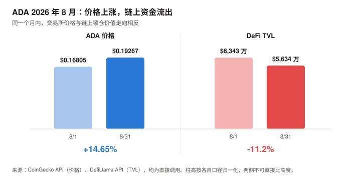
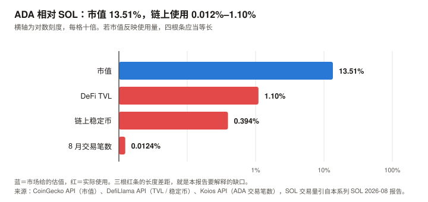

# ADA / Cardano 完整调研与分析报告

> **编写日期**：2026 年 9 月 4 日
> **数据截止**：2026 年 9 月 4 日（8 月完整月度数据已闭合）
> **研究方法**：沿用 BTC / SOL 月报的分析框架（行业概览 / 论点评分卡 / 催化剂日历 / 横向对比）。**章节结构相对 SOL 版再改动约三成**——SOL 版的"网络收入崩塌"叙事在 ADA 身上不成立，因为 ADA 从未有过可观的网络收入；取而代之的核心章是**治理**。
> **本期为 ADA 首期报告**，无上期论点可校验；本期登记的论点将在 10 月版核对。
>
> **本期核心发现**：
> ① ADA 现价 **$0.2145**，市值 **$80.4 亿（全球第 19）**，距 ATH $3.09（2021 年 9 月）回撤 **93.05%**；8 月月度 **+14.65%**，但近一年 **–73.70%**；
> ② **L1 协议层 30 天手续费仅 $38,275**——不是三万八千万，是**三万八千美元**。这是唯一流入 ADA 奖励池与国库的部分；加上应用层（DEX、借贷等）后，**整个生态 30 天费用为 $353,264**，仍极小；
> ③ **链上活动同样微弱**：8 月全月 **645,772 笔**交易（日均 21,526 笔），约合 **0.25 TPS**。同期 SOL 处理 52 亿笔，是 ADA 的约 **8,000 倍**；
> ④ **DeFi TVL 仅 $6,467 万**，距 2024 年 12 月的历史高点 $7.21 亿回撤 **91.0%**；8 月内从 $6,343 万跌至 $5,634 万（**–11.2%**）——**价格涨、链上跌，8 月出现明确背离**；
> ⑤ **治理在高强度运转，风险来自冷漠而非对立**：链上统计显示 epoch 626 以来国库提取动议通过率 **53.1%**（26 笔已拨款 / 23 笔过期），**IOG 系四笔提案全部通过**，含已执行拨款的 **3,291.6 万 ADA** 研究预算；被否的是 Summit 峰会等非必需支出。真正的险情是参与率——9 月 1 日宪法委员会续任案 SPO 支持率 **51.18%**，仅高出门槛 **0.18 个百分点**，且约 **53.16 亿 ADA 的沉默质押被计为反对**；若失败，国库提取、参数修改、硬分叉将**全部冻结**；
> ⑥ **机构通道在 8 月出现最坏时点的巧合**：Grayscale 于 **8 月 7 日**撤回其 ADA 现货 ETF 注册，而 ADA 于 **8 月 9 日**才满足 CME 期货六个月上市门槛——**差两天**。目前**没有任何在申请的单一资产 ADA 现货 ETF**。
>
> **⚠️ 发布前审查更正记录（最重要的一处）**：本报告初稿依据多家媒体一致报道，写成"DRep 以 86.72% 反对否决了 IOG 的研究预算，治理切断了核心研发资金"，并据此构建了一条五星级空头论点与整个悲观情景的概率。
> **链上一手核实推翻了这个结论**：该提案实际以 **74.94% 赞成**通过，已于 epoch 637（2026-06-13）执行拨款。86.72% 是**投票期内的中途快照**——大量投票在后期涌入并翻转了结果。
> **教训**：多家媒体报道一致 ≠ 事实，它们很可能引用同一时点的同一份快照。**凡链上可查的治理结果，必须查最终状态。**（详见 5.3；第 5、7、9、10 章已据此全面修订。）
>
> **⚠️ 本期一手数据还推翻了四处广泛流传的媒体数字**（详见 11.4）：
> ① TVL 历史高点媒体普遍写"2025 年 8 月 $4.372 亿"，DefiLlama 原始序列显示实为 **2024-12-07 的 $7.21 亿**；
> ② 质押率媒体写"63%–70%"，Koios 链上数据与 StakingRewards 双源一致指向 **约 56–57%**；
> ③ 国库规模媒体写"超过 10 亿美元"，链上实为 **13.41 亿 ADA ≈ $2.88 亿**；
> ④ 基金会 BTC 持仓媒体写"上升 25%"，年报原文是**占比**从 14.9% 升至 25.5%，**绝对持仓从 1,054 枚降至 656 枚（–37.8%）**——占比上升源于 ADA 跌得更狠，不是主动增持。
>
> **免责声明**：本报告不构成任何投资建议。所有分析仅供研究参考，投资决策请咨询专业顾问。

---

## 核心结论摘要（一页速览）

| 维度 | 核心判断 |
|------|----------|
| **ADA 是什么** | 一条以**学术同行评审**方式开发的权益证明公链（Ouroboros 共识 + eUTxO 账本模型）。它的定位既非"数字黄金"，也非"高性能执行层"，而是**一个把形式化验证与链上治理当作核心卖点的研究型 L1** |
| **当前价格位置** | $0.2145，市值 $80.4 亿（全球第 19）。距 ATH $3.09 回撤 **93.05%**，近一年 –73.70% |
| **本期最重要的矛盾** | **市值 $80.4 亿，全网月手续费 $38,275。** SOL 的问题是"收入崩了但用量创新高"（价值捕获失败）；ADA 的问题层级更靠前——**用量本身就几乎不存在**。这不是价值捕获失败，是**价值创造尚未开始** |
| **本期最重要的事件** | **链上治理在真实运转，而媒体叙事与链上事实相反。** 国库提取动议通过率 53.1%，IOG 系四笔提案全部获批（含 3,291.6 万 ADA 已拨款）。广泛报道的"86.72% 反对"是投票中途快照，最终为 74.94% 赞成。**真实风险不是阵营对立，是参与率过低**——宪法委员会续任仅以 0.18pp 通过，靠的是"沉默计为反对"的机制 |
| **估值锚的难题** | BTC 靠稀缺性，SOL 靠网络收入，**ADA 两者都不适用**：L1 收入处在噪声量级，任何倍数乘上它都不产生信息；无减半、通胀 1.47%、尚有 61.67 亿 ADA 未发行，稀缺性叙事同样不成立。本报告改用相对市值框架，**但明确声明其分辨率不足以判断"低估"或"高估"**——能说的只有分布形状：**正期望、负中位数**（详见第 9 章） |
| **核心多头逻辑** | 链上治理真正落地且**已被证明能持续资助研发**（通过率 53.1%，IOG 系四笔全过）；2,895 个注册质押池，出块去中心化优于多数 L1；Midnight 侧链有 Google / Vodafone 参与；Leios 目标吞吐提升 10–65 倍（**仍在测试网，未上主网**）；ETF 资格已于 8/9 达成，**但目前零份申请——若无新发行方入场，10/23 不会发生任何事** |
| **核心空头逻辑** | 链上使用量在数量级上近乎不存在（8 月 645,772 笔、L1 月费 $38,275）；TVL 距高点 –91%；无在申请的现货 ETF 且 Grayscale 单独放弃；企业储备渗透率近乎为零；创始人 6/4 宣布休息并警告生态"一波失败"；Nansen CEO 的"ghost chain / 2026 年掉出前 20"预测**已逼近兑现（当前第 19）** |
| **与 BTC / SOL 的根本差异** | BTC 是**货币资产**（锚：稀缺性）；SOL 是**生产性资产**（锚：网络收入）；ADA 目前两条锚都够不着，是**期权型资产**——定价的是"技术路线若兑现"的可能性，而非当下的现金流或稀缺性 |
| **风险等级** | 高于 BTC 与 SOL。除市场风险外，额外承担**治理僵局风险**与**核心开发实体退出风险**，这两项是 ADA 独有的 |

---

## 1. Cardano 的起源与设计取舍

### 1.1 从以太坊出走的那次分歧

Cardano 的起点是一次组织路线之争，不是技术之争。

**Charles Hoskinson** 是以太坊八位联合创始人之一。2014 年，以太坊核心团队就"是否接受风险投资、是否成立营利实体"发生分裂，Hoskinson 主张走营利公司路线，未被采纳，随后离开。2015 年他与 **Jeremy Wood** 创立 **IOHK**（Input Output Hong Kong，后更名 **Input Output Global / IOG**），并以此为工程实体启动 Cardano。

这段历史解释了 Cardano 后来所有的性格特征：

| 特征 | 来源 |
|------|------|
| **学术同行评审开发** | 对"以太坊式快速迭代"的反向选择——先发论文、过评审，再写代码 |
| **三实体架构** | IOG（研发）/ Cardano Foundation（瑞士非营利，品牌与合规）/ EMURGO（商业孵化）。刻意分权，但也埋下了本期第 5 章的冲突伏笔 |
| **节奏慢** | 主网 2017 年上线，智能合约 2021 年才到位，中间隔了四年 |
| **治理是核心叙事而非附属** | 从第一天起，"最终交给社区自治"就写在路线图里 |

> **一个必须点明的取舍**：学术同行评审在**安全性**上是真实优势——Cardano 主网自 2017 年上线以来未发生过共识层重大事故。但它在**产品速度**上的代价同样真实。第 3 章的用量数据是这个取舍累积九年后的结果。

### 1.2 两个与主流不同的技术选择

**① Ouroboros 共识**

Ouroboros 是**第一个附带正式安全性证明并通过同行评审的权益证明（PoS）协议**，论文发表于 2017 年密码学会议 Crypto。与工作量证明（PoW，比特币用的"算力挖矿"）不同，PoS 用"持币质押"决定谁出块，能耗极低。

Cardano 的 epoch（纪元）长度为 **5 天**，每个 epoch 结算一次质押奖励——这个节奏在本报告第 3、4 章的链上数据里会反复出现。

**② eUTxO 账本模型**

这是与以太坊最根本的分歧。

| | 以太坊（账户模型） | Cardano（eUTxO） |
|---|---|---|
| 状态表示 | 全局账户余额 | 一组独立的"未花费输出"（继承自比特币 UTXO 并扩展） |
| 交易结果 | 执行后才知道 | **提交前即可在本地确定性验证** |
| 并发 | 天然串行，需排队 | 天然并行，但**多人竞争同一个状态时会互相冲突** |
| 形式化验证 | 困难 | **相对容易**（这是设计目标） |

eUTxO 的优点是可预测性与可验证性；缺点是**并发争用（concurrency contention）**——早期 Cardano DEX 出现过"多人同时下单只有一人成功"的问题，需要靠批处理（batcher）等中间层绕开。这在很大程度上解释了为什么 Cardano 的 DeFi 生态在开发难度上高于 EVM 链。

### 1.3 ADA 代币的三重角色

| 角色 | 说明 |
|------|------|
| **质押品** | 委托给质押池换取奖励，当前 APY 约 **2.07%** |
| **手续费** | 支付交易费。但如第 3 章所示，这部分需求在数量级上可以忽略 |
| **治理票权** | **本期最重要的一重**：ADA 持有者可委托给 DRep（Delegated Representative，代表投票人）参与链上治理，直接决定国库支出 |

> 注意第三重与 BTC / SOL 的差异：BTC 持有者没有治理权，SOL 持有者的治理权直到 2026 年 8 月才第一次实际行使。**ADA 的治理权已经运行了一年半，并且已经产生了实质后果**——见第 5 章。

---

## 2. ADA 的发展阶段划分

Cardano 官方把路线图分为五个以历史人物命名的时代。本报告按此划分，但补入市场视角。

### 阶段一：Byron —— 基础（2015–2020.07）

- 2015 年 IOHK 成立，ICO 主要面向日本市场销售，这是"日本散户持仓占比高"说法的由来
- **2017 年 9 月 29 日主网上线**，仅支持 ADA 转账，无智能合约
- 网络此时为联邦式运行，出块由官方节点承担

### 阶段二：Shelley —— 去中心化（2020.07–2021.09）

- 2020 年 7 月 Shelley 硬分叉，引入质押池机制
- 质押池数量迅速增长至数千个，出块权从官方节点转移到社区
- **这是 Cardano 去中心化叙事的核心资产**，至今仍是它相对多数 L1 的真实优势

### 阶段三：Goguen —— 智能合约与泡沫顶点（2021.09–2022）

- 2021 年 9 月 **Alonzo 硬分叉**上线智能合约（Plutus）
- **2021 年 9 月 1 日 ADA 触及历史最高价 $3.09**——**注意时点**：ATH 出现在智能合约上线的当月，属于典型的"预期兑现即顶部"
- 此后进入长期下行。**这个 ATH 至今未被挑战过，回撤已达 93.05%**

### 阶段四：Basho —— 扩容与漫长的横盘（2022–2024）

- 2022 年 9 月 Vasil 硬分叉，提升脚本效率
- Hydra（状态通道式二层）与 Mithril（轻客户端）进入开发
- DeFi 生态建立，**TVL 于 2024 年 12 月 7 日触及历史高点 $7.21 亿**
- 市场地位从长期的前 5–8 名逐步下滑

### 阶段五：Voltaire —— 治理落地与第一次压力测试（2024.09– 至今）

这是 ADA 当前所处的阶段，也是本报告的重心。

| 时点 | 事件 |
|------|------|
| 2024-09-01 | **Chang 硬分叉**，CIP-1694 治理框架进入技术引导期 |
| 2025-01-29 | **Plomin 硬分叉**，链上治理全功能启用，DRep 正式生效 |
| 2025-12-04 | Midnight 侧链 NIGHT 代币开始流通 |
| 2026-02-09 | **CME 上线 ADA 期货**（同批还有 LINK、XLM）——ETF 时钟开始计时 |
| 2026-03-31 | **Midnight 联邦主网上线**，Google、Vodafone 等担任节点运营商 |
| 2026-04-02 | Cardano Foundation 发布 2025 年报，总资产同比 **–45%** |
| 2026-06-08 / 06-13 | **IOG「Cardano Vision 2026」3,291.6 万 ADA 研究预算获批并执行拨款**（DRep 赞成 74.94%）。此前投票期内的中途快照曾显示 86.72% 反对，被媒体广泛报道为"否决" |
| 2026-06 | Cardano Summit 2026 提案未获通过、峰会取消，改用规模更小的 TOKEN2049 赞助方案（该方案已获批） |
| 2026-06-04 | **Hoskinson 宣布"休息一段时间"**，此前警告生态将出现"一波失败" |
| 2026-08-07 | **Grayscale 撤回 ADA 现货 ETF 注册** |
| 2026-08-09 | ADA 达成 CME 期货六个月门槛，取得现货 ETF 申报资格——**比 Grayscale 撤回晚两天** |
| 2026-09-01 | 宪法委员会续任案获批，SPO 支持率 **51.18%**，仅超 51% 门槛 **0.18pp** |

> **阶段五的定性**：技术路线图（Leios / Hydra / Midnight）与治理机制同时进入关键期。
> **链上记录显示治理并未削减核心投入**——研发与基础设施类提案通过率高，被否的集中在市场活动类支出。
> 该阶段真正暴露的问题是**治理参与率**：两次关键投票分别以 1.46pp 和 0.18pp 的边际差距决定结果，且均由"沉默计为反对"的机制主导。

---

## 3. ADA 当前现状分析

### 3.1 价格与市场

| 指标 | 数值 | 口径 |
|------|------|------|
| **现价** | **$0.2145** | CoinGecko API，2026-09-04 14:07 UTC |
| 市值 | **$80.41 亿**（全球第 **19**） | 同上 |
| 完全稀释估值（FDV） | $96.48 亿 | 同上 |
| 24 小时成交额 | $7.61 亿 | 同上 |
| 流通量 / 上限 | **375.04 亿 / 450 亿**（83.3%） | 同上 |
| 历史最高价 | **$3.09**（2021-09-01） | 同上 |
| **距 ATH 回撤** | **–93.05%** | 同上 |
| 近 30 日 | **+11.75%** | 同上 |
| 近 200 日 | **–28.55%** | 同上 |
| **近 1 年** | **–73.70%** | 同上 |

**2026 年 8 月月度表现**（CoinGecko 日线序列）：

| 项目 | 数值 |
|------|------|
| 月初（8/1）→ 月末（8/31） | $0.16805 → $0.19267，**+14.65%** |
| 月内最低 / 最高 | $0.16805（8/1）/ **$0.2291（8/22）** |
| 月内振幅 | **36.3%** |
| 最猛的一段 | 8/19 $0.1744 → 8/22 $0.2291，**三天 +31.4%** |

**8 月这波反弹的归因**：与同期 BTC（+25.1%）、SOL（逾 +40%）同源，触发因素是**美国财政部加倍长端国债回购带来的流动性缓和**，不是 ADA 自身基本面改善。三者中 ADA 涨幅最小，这一点值得注意——**ADA 在 8 月的风险偏好回升中，表现弱于同为高 beta 的 SOL**。

**必须与 6 月对照看**：6/1 $0.23549 → 6/30 $0.14558，单月 **–38.2%**。这一跌正对应 Hoskinson 6 月 4 日宣布"休息一段时间"与 IOG 预算被否。**8 月的 +14.65% 尚未收复 6 月跌幅的一半。**

### 3.2 链上活动：本报告最重要的一组数字

这一节是理解 ADA 的关键。以下数据全部来自 **Koios 公共 API 的链上 epoch 记录**（一手），Cardano 的 epoch 长度为 5 天。

| Epoch | 起止 | 交易笔数 | 手续费（ADA） |
|:---:|---|---:|---:|
| 645 | 07-23 ~ 07-28 | 90,444 | 28,277 |
| 646 | 07-28 ~ 08-02 | 98,579 | 30,614 |
| 647 | 08-02 ~ 08-07 | 93,706 | 29,002 |
| 648 | 08-07 ~ 08-12 | 77,380 | 23,270 |
| 649 | 08-12 ~ 08-17 | 73,632 | 21,839 |
| **650** | **08-17 ~ 08-22** | **151,564** | **44,947** |
| 651 | 08-22 ~ 08-27 | 143,328 | 41,214 |
| 652 | 08-27 ~ 09-01 | 106,162 | 28,533 |

**汇总（epoch 647–652，覆盖 8/2–9/1 共 30 天）**：

| 指标 | 数值 |
|------|------|
| 交易总笔数 | **645,772 笔** |
| 日均交易 | **21,526 笔** |
| **日均 TPS** | **0.25** |
| 峰值期 TPS（epoch 650） | 0.35（日均 30,313 笔） |
| 手续费总额 | **188,805 ADA ≈ $40,500** |

**同期对照**（数量级差异，不是百分比差异）：

| 网络 | 2026 年 8 月交易量 | 相对 ADA |
|------|---|---:|
| **Cardano** | **645,772 笔** | 1× |
| Solana | 约 52 亿笔（非投票交易） | **约 8,050×** |

**手续费的绝对值**（DefiLlama API，一手）。**这里必须严格区分两个口径**：

| 周期 | **L1 协议层手续费** | 说明 |
|------|---|---|
| 24 小时 | **$1,194** | 用户为链上交易支付的费用 |
| 7 天 | $8,256 | |
| **30 天** | **$38,275** | |
| 过去 12 个月 | $1,256,210 | |
| 自创世累计 | $27,634,797 | |

| 口径 | 30 天费用 | 归属 |
|------|---:|------|
| **L1 协议层**（上表） | **$38,275** | **进入 ADA 质押奖励池与国库——这是唯一与 ADA 持有者相关的部分** |
| **生态合计**（含应用层协议） | **$353,264** | 归各应用协议所有，**不流向 ADA 持有者** |

生态合计的主要构成：Minswap DEX $98,925、Liqwid（借贷）$93,223、Dano Finance $77,472、Strike Finance（衍生品）$54,691，L1 链费 $38,275 只占 **10.8%**。

> ⚠️ **这个区分是本报告在发布前审查中被指出并修正的**。初稿把 $38,275 称为"全网手续费"，并用它论证"生态几乎没人用"——**这是口径偷换**。
> 正确的用法是：**用 L1 费衡量 ADA 代币的价值捕获**（$38,275），**用生态合计衡量生态活跃度**（$353,264）。
> 这正是 SOL 8 月版报告学到的教训——**网络毛收入不等于持币人现金流**。

> **两个独立数据源交叉验证通过**：Koios 链上记录算出 8 月手续费约 $40,500，DefiLlama 的 30 天口径为 $38,275，差异 5.8%（源于统计窗口与折算价格不同）。**这个数量级是可靠的。**

**这意味着什么**：

| 口径 | 年化 | 市值 / 收入 |
|------|---|---:|
| L1 费（过去 12 个月实际） | $125.6 万 | **6,400 倍** |
| L1 费（最近 30 天年化） | 约 $46.6 万 | **17,300 倍** |
| 生态合计（最近 30 天年化） | 约 $430 万 | 1,870 倍 |

前两行的差距本身是信息：**L1 收入不是持平，是仍在下滑。**

> **但这里不能推得太远。** 分母本身处在**噪声量级**——两个 L1 口径相差 2.7 倍，说明月度波动足以主导年化结果。
> **任何倍数乘上一个噪声量级的分母，都不产生可靠信息。** 这是第 9 章放弃收入法的真正理由，
> 而不是"收入低所以估值低"——后者需要一个可靠的分母才成立。

> **与 SOL 版报告的关键区别必须讲清楚**：SOL 8 月版的核心矛盾是"网络收入同比 –87% 但用量创历史新高"，那是一个**价值捕获**问题——生意还在做，只是收不上钱。
> **ADA 面对的是更靠前一层的问题**：用量本身在数量级上就近乎不存在。这不是价值捕获失败，是**价值创造尚未开始**。
> 任何试图用"网络收入 × 倍数"给 ADA 定价的方法，都会得出接近零的结果——**这正是第 9 章必须换一套估值框架的原因**。

### 3.3 生态数据：TVL 与稳定币

**DeFi TVL**（DefiLlama API，一手抓取）：

| 时点 | TVL |
|------|---|
| **历史高点** | **$7.21 亿（2024-12-07）** |
| 2025-08-01 | $3.60 亿 |
| 2026-01-01 | $1.698 亿 |
| 2026-06-01 | $1.290 亿 |
| 2026-07-01 | $7,384 万 |
| **2026-08-01** | **$6,343 万** |
| 2026-08-20（月内低点） | $5,468 万 |
| **2026-08-31** | **$5,634 万** |
| 2026-09-04（最新） | $6,467 万 |

| 指标 | 数值 |
|------|---|
| **8 月 TVL 变动** | **–11.2%**（$6,343 万 → $5,634 万） |
| **距历史高点** | **–91.03%** |

> ⚠️ **一手数据推翻媒体口径**：多家媒体（含 CryptoRank、TheCryptoBasic）报道 ADA 的 TVL 高点为"2025 年 8 月的 $4.372 亿"。
> DefiLlama 的完整历史序列显示，真实高点是 **2024-12-07 的 $7.21 亿**，媒体引用的是一个局部高点。
> **这直接影响回撤幅度的判断：按媒体口径是 –87.6%，按一手数据是 –91.0%。** 本报告采用后者。

**8 月最值得记录的一件事，是价格与链上的背离**：

| | 8/1 | 8/31 | 变动 |
|---|---|---|---|
| ADA 价格 | $0.16805 | $0.19267 | **+14.65%** |
| DeFi TVL | $6,343 万 | $5,634 万 | **–11.2%** |

**价格涨 14.65%，锁仓资金反而跌 11.2%。** 8 月 20 日更出现单日 TVL 下跌逾 16% 的事件。这说明 8 月的上涨是**交易所层面的宏观 beta 驱动**，链上资金并未跟随——**这是本期登记的第一条待检验论点（A8-1）**。

**稳定币**（DefiLlama stablecoins API，一手）：

| 网络 | 链上稳定币市值 | 相对 ADA |
|------|---|---:|
| **Cardano** | **$6,411 万** | 1× |
| Solana | $162.53 亿 | **约 253×** |
| Algorand（同为学术型 L1 对照） | $3,588 万 | 0.56× |

稳定币占 Cardano 全部 TVL 的绝大部分（$6,411 万 vs 总 TVL $6,467 万）——**这说明 Cardano 上的"锁仓价值"几乎全部是静态存放的稳定币，而非活跃的借贷、衍生品或流动性头寸。**

**DEX 交易量**（DefiLlama API）：24 小时 **$201 万**，7 天 **$624 万**（日均约 89 万）。
主要 DEX 为 SundaeSwap V2、WingRiders、Minswap、Dano Finance。

> ⚠️ **一处数据不自洽，本报告选择弃用**：同一 API 返回的 30 天 DEX 量为 $1.849 亿（折日均 $616 万），与 7 天口径的日均 $89 万相差近 7 倍，无法调和。可能存在单笔异常值或统计口径变更。**本报告只采用 24 小时与 7 天数字，弃用 30 天数字，并在此明确标注。**

### 3.4 质押与验证者经济

| 指标 | 数值 | 来源 |
|------|------|------|
| 质押总量 | **213.7 亿 ADA** | Koios epoch 653（一手）/ StakingRewards，**两源一致** |
| **质押率** | **56.4%–57.0%** | StakingRewards 56.4% / 按 Koios 质押量 ÷ CoinGecko 流通量 = 57.0% |
| **质押 APY** | **2.07%** | StakingRewards（一手抓取） |
| 通胀率 | 1.47% | 同上 |
| 质押市值 | $46 亿 | 同上 |
| **链上注册质押池** | **2,895 个** | Koios API（一手） |
| StakingRewards 口径"活跃验证者" | **937 个** | StakingRewards（一手） |

> ⚠️ **第二处一手数据推翻媒体口径**：多篇 2026 年的中英文报道称 Cardano"超过 70% 供应量被质押"或"超过 63%"。
> **Koios 链上快照与 StakingRewards 两个独立来源一致指向 56%–57%。** 本报告采用 56.4%–57.0%。
> 媒体数字可能沿用了 2021–2023 年的历史水平——ADA 质押率确曾长期在 70% 上方。**若如此，则质押率的下滑本身是一个未被充分报道的趋势。**（此推测**未验证**，仅标记为待观察。）

**注册池 2,895 个与"活跃验证者 937 个"的差距（活跃率 32.4%）值得警惕**，但两个数字来自不同口径，StakingRewards 未公开其"活跃"定义。**本报告不据此下结论**，仅登记为待核实项。

**与 SOL 的对照**：SOL 的 Nakamoto 系数为 19（停摆需串通 19 家验证者），而 Cardano 的注册池数量在 2,895 个量级，**出块层面的去中心化程度显著优于 SOL**。这是 ADA 少数几个真实且可量化的优势之一。

**但要注意 2.07% 的 APY 意味着什么**：在 10 年期美债 4.79% 的环境下，ADA 质押收益率不到无风险利率的一半，**却要承担全部的价格波动风险**。质押在当前不构成持有 ADA 的独立理由。

### 3.5 宏观环境

ADA 与 BTC / SOL 共享同一套宏观驱动，且作为**低流动性、高 beta 的长尾风险资产**，对流动性变化更敏感。

| 因素 | 状态（9 月初） | 影响 |
|------|--------------|------|
| 联邦基金利率 | 3.50–3.75% | — |
| **9 月加息概率** | **65.9%**（CME FedWatch，8/31） | **重大利空** |
| PCE 通胀 | **3.7%**（12 个月）/ **4.1%**（6 个月），均远超 2% 目标 | 支持加息 |
| 美联储主席立场 | Kevin Warsh 在 Jackson Hole 表态鹰派，称通胀数据"令人担忧" | 偏空 |
| 10 年期美债 | 4.79% | 无风险利率竞争，直接压制 2.07% 的质押收益 |
| 美元指数 | >99.7 | 压制风险资产 |
| 8 月流动性事件 | 财政部加倍长端国债回购 → 收益率下行 | **8 月加密普涨的共同触发因素** |

**8 月的一个反复**：8 月 7 日 7 月非农就业数据大幅不及预期，一度令 9 月加息概率骤降；8 月 28 日 Warsh 讲话后重新升温，至 8 月 31 日达 65.9%。**ADA 8 月 19–22 日的三天 +31.4% 正好落在这个预期反复的窗口内**，进一步支持"8 月行情由宏观而非基本面驱动"的判断。

---

## 4. 代币经济学与国库（ADA 特有）

> 本章替代 BTC 版的"减半周期"分析。**ADA 没有减半**，它用的是一条平滑衰减曲线；也不像 SOL 那样有可被治理修改的通胀率——ADA 的发行参数虽然理论上可由治理修改，但至今未被修改过。

### 4.1 储备衰减：一条没有台阶的曲线

| 项目 | 机制 / 数值 |
|------|------|
| 供应上限 | **450 亿 ADA**（硬上限，与 BTC 的 2,100 万同为固定值） |
| 当前流通量 | **375.04 亿**（占上限 **83.3%**） |
| **未发行储备（reserves）** | **61.67 亿 ADA**（占上限 13.7%） |
| 发行机制 | 每个 epoch（5 天）从 reserves 中释放固定比例 **0.3%** |
| 曲线形态 | **指数衰减，无台阶**——与 BTC"每四年砍半"的阶跃式完全不同 |

> **供应量口径闭合说明**（三个数字来自不同口径，容易看不上账）：
> **450 亿上限 = 流通 374.92 亿 + 国库 13.41 亿 + 未发行储备 61.67 亿**（Koios epoch 651 链上快照）。
> 本报告正文使用的"流通 375.04 亿"取自 CoinGecko（时点略晚），与 Koios 的 374.92 亿相差 0.03%。
| 当前通胀率 | **1.47%** |
| 发行去向 | 一部分进入**国库**（协议参数 τ，标称 20%），其余进入质押奖励池 |

**与 BTC / SOL 的三方对照**：

| | BTC | SOL | **ADA** |
|---|---|---|---|
| 供应上限 | 2,100 万 | 无上限 | **450 亿** |
| 发行曲线 | 每 4 年阶跃减半 | 递减至 1.5% 地板 | **每 epoch 衰减 0.3%，平滑** |
| 当前通胀 | 约 0.85% | 约 3.8% | **1.47%** |
| 可被治理修改 | ❌ 代码锁定 | ✅ 已在 2026-08 被投票修改 | ⚠️ 理论可改，**至今未改** |
| 销毁机制 | 无 | 基础费 50% 销毁 | **无销毁**，手续费全额进入奖励池与国库 |

> **对 ADA 稀缺性叙事的一个诚实评价**：ADA 确实有硬上限，通胀率 1.47% 也确实低于 SOL。
> 但**"减半叙事"是 BTC 独有的市场心理资产**——它提供了周期性的、可被媒体反复报道的日程表事件。ADA 的平滑衰减曲线在经济学上更优雅，**在叙事上则完全无法产生同等的注意力**。
> 更关键的是：稀缺性只有在**存在需求**的前提下才转化为价格。第 3.2 节的数据说明 ADA 当前的使用需求处于什么量级。**限量供应一件无人购买的商品，不会产生价值。**

### 4.2 国库：一个真正的链上金库

这是 ADA 相对多数 L1 的**结构性特色**——国库不由基金会自由支配，**必须经链上投票批准才能支取**。

| 项目 | 数值（Koios epoch 651，一手） |
|------|------|
| **国库余额** | **13.41 亿 ADA** |
| 折美元（$0.2145） | **约 $2.88 亿** |
| 占流通量比例 | 3.58% |
| 资金来源 | 每 epoch 发行的一部分 + 全部交易手续费的一部分 |
| 支取方式 | **必须通过 DRep + 宪法委员会投票**（治理动议 Treasury Withdrawal） |

> ⚠️ **第三处一手数据推翻媒体口径**：多家媒体（含 Cardano 生态内部渠道）称国库"价值超过 10 亿美元"。
> 按链上余额 13.41 亿 ADA × 现价 $0.2145 计算，实为 **约 $2.88 亿**。"超过 10 亿美元"对应的是 ADA 在 $0.75 以上时的估值，**已是过时数字**。

**国库机制的双面性**，正是第 5 章的全部内容：

- ✅ **正面**：这是加密行业里少数真正实现"代币持有者控制财政"的 L1。相比之下，多数 L1 的生态基金由基金会单方面决定用途。
- ⚠️ **反面**：一个能否决支出的机制，**也能否决必要的支出**。2026 年，它否决了这条链的核心研发预算。

---

## 5. 治理：Voltaire 的第一次压力测试（本期核心章）

> 本章替代 BTC 版的"上市公司比特币储备"主位。原因很简单：**ADA 的企业储备渗透率近乎为零**（见 6.3），不足以支撑一章；而治理在 2026 年成了决定这个资产走向的第一变量。
>
> ⚠️ **本章是本期发布前审查中改动最大的一章。** 初稿依据多家媒体一致报道，写成"DRep 以 86.72% 反对否决了 IOG 的研究预算，治理切断了核心研发资金"。
> **链上一手核实推翻了这个结论**——该提案实际以 **74.94% 赞成**通过，并已执行拨款。详见 5.3。
> 这个错误若未被发现，会成为本报告最严重的硬伤：它支撑了一条五星级空头论点和整个悲观情景的概率赋值。

### 5.1 CIP-1694：三方制衡的架构

Cardano 于 2025 年 1 月 Plomin 硬分叉后启用完整链上治理，架构由三方组成：

| 主体 | 代表谁 | 职能 |
|------|--------|------|
| **DRep**（Delegated Representative，代表投票人） | ADA 持有者委托的代表 | 对治理动议投票，是主要决策层 |
| **宪法委员会（CC）** | 7 个席位的受托机构 | 审查动议是否**合宪**，具否决权 |
| **SPO**（Stake Pool Operator，质押池运营者） | 出块节点 | 对硬分叉、参数变更等特定类型动议投票 |

不同类型的动议要求不同的通过门槛：国库支取需 DRep **66.67%**；宪法委员会更新需 DRep **67%** 且 SPO **51%**。

> **一个机制细节值得单独记住**：**未投票的质押，在有效计票中被计为反对。** 沉默不是弃权，是否决。
> 该设计意在防止低参与率下的小团体劫持，代价是**任何提案都必须先克服"冷漠"这道额外门槛**。

### 5.2 国库到底在不在花钱：一手链上统计

**这是本章最重要的一组数据，且与媒体给人的印象相反。**

本报告用 Koios API 拉取了 **epoch 626 以来全部国库提取类治理动议**（去重后 51 项），按链上最终状态统计：

| 状态 | 数量 |
|------|---:|
| **已批准并执行拨款**（enacted） | **26** |
| 过期未通过（expired） | 23 |
| 仍在投票中 | 2 |
| **通过率** | **26 / 49 = 53.1%** |

**已执行拨款的代表性项目**（均为链上确认）：

| 提案 | 金额 |
|------|---|
| Withdraw for AlphaGrowth's Cardano PRIME | **1.2 亿 ADA** |
| **Cardano Vision 2026 — IO Research** | **3,291.6 万 ADA** |
| Intersect：治理协调与技术支持 | 2,540 万 ADA |
| Mithril Protocol | 381 万 ADA |
| IO: Hydra | 未单列金额 |
| IO: Developer Experience Initiative | 未单列金额 |
| IO & VacuumLabs: Enhancing Plutus | 未单列金额 |
| Se7en Labs：Daedalus 钱包维护 2026–2027 | 未单列金额 |
| TxPipe 系列工具维护（Pallas / Oura / Dolos / UTxO RPC / Tx3） | 各 54 万–168 万 ADA |

> **结论与初稿完全相反**：国库不仅在花钱，而且在**高强度地花**——一个 epoch（5 天）内批准八笔以上的情况出现过。
> **IOG 系提案在本期观察窗口内全部通过**（Vision 2026、Hydra、Developer Experience、Plutus 增强四笔）。

### 5.3 那个被广泛报道的"86.72% 反对"是什么

**这是本期最重要的方法论教训，值得完整记录。**

2026 年 5–6 月，多家媒体报道 IOG 的「Cardano Vision 2026」提案遭 DRep **86.72% 反对**，Hoskinson 表示若被否将不再提交、可能引发裁员。这些报道在搜索结果中高度一致，**本报告初稿据此写成"提案被否决"**。

**链上最终记录（Koios `proposal_voting_summary`，一手）**：

| 项目 | 数值 |
|------|---|
| 提案 | Cardano Vision 2026: Human Centred, Scalable, Post Quantum Secure — IO Research |
| 金额 | **3,291.6 万 ADA** |
| **DRep 赞成** | **74.94%**（167 票） |
| DRep 反对 | 25.06%（29 票） |
| 宪法委员会 | **7/7 赞成（100%）** |
| 提交 / 批准 / 执行 | epoch 629（5/07 上链）/ **epoch 636（6/08 批准）** / **epoch 637（6/13 执行拨款）** |
| 最终状态 | **✅ 已拨款**（`enacted_epoch = 637`，无 expired / dropped 记录） |

**这意味着**：86.72% 反对是**投票期内的中途快照**。Cardano 的投票期跨越多个 epoch，**大量投票在后期涌入**，最终把结果从压倒性反对翻转为 74.94% 赞成。

> **教训（已建议写入 SKILL.md）**：
> **加密治理投票的中途计票具有极强误导性，且媒体报道的正是中途快照。**
> 多家媒体报道一致 **≠** 事实——它们很可能引用同一个时点的同一份快照。
> **凡涉及链上可查的治理结果，必须查最终状态（`ratified_epoch` / `enacted_epoch`），不得使用任何时点的得票率报道。**

### 5.4 真正被否决的是什么

治理确实在否决提案——通过率 53.1% 意味着近一半被否。**但被否的类别有明显规律**：

| 提案 | 结果 |
|------|---|
| **Revised Cardano Summit 2026 Singapore** | ❌ 未通过（峰会取消） |
| Cardano at TOKEN2049 Singapore：Top-Up 'Title' 赞助升级 | ❌ 未通过 |
| **Cardano at TOKEN2049 Singapore：Baseline 'Platinum' 赞助** | ✅ **通过**（改用规模更小的方案） |
| Rare Evo and Dev Gov Day 2026 冠名赞助 | ❌ 未通过 |
| 多个生态应用类提案（Bifrost、Blockfrost、Cardano Builder DAO 等） | ❌ 未通过 |

> **模式很清楚**：DRep 群体**批准基础设施与核心研发，否决市场活动与非必需支出**。
> Summit 被否后改用更便宜的 TOKEN2049 方案获批——这不是瘫痪，**是一次成本控制**。

**宪法委员会续任案则是另一件事，且险情为真**（已一手核实）：

| 项目 | 数值 |
|------|---|
| DRep 支持率 | 69.36%（门槛 67%） |
| **SPO 支持率** | **51.18%（门槛 51%，仅超 0.18pp）** |
| 沉默质押计入反对 | 约 **53.16 亿 ADA** |
| 时点 | 9/1 批准，epoch 654 边界（9/6）生效 |
| **若失败的后果** | 委员会从 7 席跌至 **3 席**，低于运作所需的 **5 席**——**国库提取、参数修改、硬分叉、新宪法将全部冻结** |

**注意这次险情的性质**：它**不是因为有人反对，是因为大多数人没投票**。SPO 投票率一度仅 39%。

### 5.5 本章的定性

**修正后的图景，比初稿的"内战"叙事更平淡，也更准确**：

| 说法 | 判定 |
|------|---|
| "治理切断了核心研发资金" | ❌ **错误**。IOG 系四笔提案全部通过，Vision 2026 已拨款 3,291.6 万 ADA |
| "治理机制在高强度运转，通过率约一半" | ✅ 链上统计 53.1% |
| "DRep 批准基础设施、否决市场活动" | ✅ 有明确模式 |
| "治理的主要风险是冷漠，不是对立" | ✅ 两次险情（Summit 差 1.46pp、CC 差 0.18pp）均由沉默计反对导致 |
| "Cardano 治理即将崩溃" | ❌ **不该说**。这是本系列记分卡中出现三次的误判模式（把结构性脆弱写成即将断裂），本报告刻意规避 |

> **因此本章的核心判断修正为**：
> **ADA 的治理风险不是"阵营对立切断资金"，而是"参与率低使结果由边际少数决定"。**
> 这两个诊断的可操作含义完全不同——前者该监控 IOG 的去留，后者该监控 **DRep 参与率与沉默质押占比**。
> **10.3 的监控指标已据此重写**（新增第 9 项）。

**Hoskinson 事件需要准确归因**：他于 **2026 年 6 月 4 日**宣布"休息一段时间"，并警告生态将有"一波失败"，当日 ADA 跌约 10%、五年来首次跌破 $0.20。
**但触发因素不是 Vision 2026 被否**（该提案 6/8 才批准、6/13 执行）——据 CoinDesk 报道，直接背景是**分析平台 TapTools 关停**与 **Summit 提案被否**，以及他认为社区不愿动用国库支持生态扩张。

> **一处张力值得记录**：Hoskinson 称"社区没有多少意愿动用国库把这些项目推到下一阶段"，
> 而同期链上数据显示国库通过率 53.1%、26 笔已执行拨款、他自己的机构拿到四笔。
> **本报告不判断谁对**——可能双方说的是不同的事（他指生态应用类救助，链上多数拨款流向基础设施）。
> 但**当事人的公开表述与链上记录之间存在可测量的差距，这件事本身应当被记录**。

## 6. 机构通道与持有者结构

### 6.1 ETF：8 月发生了一次最坏时点的巧合

| 时点 | 事件 |
|------|------|
| 2026-02-09 | **CME 上线 ADA 期货**（与 LINK、XLM 同批）。按 SEC 于 2025 年 9 月通过的通用上市标准（Rule 19b-4 修订），一项加密资产需**先完成六个月 CME 期货交易**，才具备现货 ETF 的快速审查资格 |
| **2026-08-07** | **Grayscale 撤回其 Cardano Trust ETF 注册**，声明"不打算继续推进原定的发行" |
| **2026-08-09** | **ADA 满足六个月期货门槛**，正式取得现货 ETF 申报资格——**比 Grayscale 撤回晚了两天** |
| 理论窗口 | 自 8/9 起 75 天的标准审查上限，落在 **2026-10-23** |

**当前状态**：

| 项目 | 状况 |
|------|------|
| 在申请的**单一资产** ADA 现货 ETF | **零。没有任何一家** |
| 已存在的间接通道 | Volatility Shares 的**期货型** ADA ETF，合计资产仅 **$126 万** |
| 指数型敞口 | Franklin Templeton 加密指数 ETF 中，ADA 权重 **0.69%** |
| 潜在申请方 | Bitwise、Canary Capital 被媒体提及有意，**但截至本报告数据截止日未见正式申报** |

> **一个重要的信号解读**：Grayscale 在撤回 ADA 的同时，**保留了 Bittensor、Aave、BNB、NEAR、Zcash 等其他山寨币的注册**。
> 这说明它不是在收缩整条山寨币产品线，而是**单独选择了放弃 ADA**。
> 这是一家专业资产管理机构对"该产品是否有足够募集需求"的判断——**比任何链上指标都更直接地反映了机构层面对 ADA 的需求预期。**

**对比 SOL**：SOL 的现货 ETF 已上市并于 2026 年 8 月创下最佳月度流入。**ADA 与 SOL 在机构通道上的差距，在 8 月这个月里同时被拉开到最大。**

### 6.2 Cardano Foundation 自己的资产负债表

Cardano Foundation 于 **2026 年 4 月 2 日**发布 2025 年度《活动与财务洞察报告》。这是本报告能拿到的、关于"最了解这条链的机构如何配置自己的钱"的唯一公开证据。

| 项目 | 2024 年末 | 2025 年末 | 变动 |
|------|---|---|---|
| **总资产** | $6.591 亿 | **2.875 亿瑞郎（约 $3.61 亿）** | **–45%** |
| ADA 持仓 | 5.991 亿枚（占 **76.7%**） | **5.614 亿枚（占 51.6%）** | 持仓 **–6.3%** |
| BTC 持仓 | 1,054 枚（占 **14.9%**） | **656 枚（占 25.5%）** | 持仓 **–37.8%** |
| 现金及金融资产 | 占 8.3% | 占 **22.9%** | 占比大幅提升 |

> ⚠️ **第四处一手数据推翻媒体口径，且这一处最容易误导人**：
> 多家媒体的标题写作"基金会比特币持仓上升 25%"。**年报原文说的是 BTC 的资产占比从 14.9% 升至 25.5%，而绝对持仓从 1,054 枚降至 656 枚，减少 37.8%。**
> 占比上升的原因是 **ADA 跌得比 BTC 多得多**，不是主动增持。

**本报告据年报的占比与持仓量反推出隐含价格，用以还原真实图景**（此推算为本报告自行计算，非年报原文）：

| | 2024 年末隐含价 | 2025 年末隐含价 | 变动 |
|---|---|---|---|
| ADA | $0.844 | $0.332 | **–60.7%** |
| BTC | 约 $93,200 | 约 $140,300 | **+50.6%** |

**还原后的准确结论**：2025 年基金会**同时减持了 BTC（–37.8%）和 ADA（–6.3%）**，属于变现支出而非资产轮动；但由于 BTC 涨 50.6%、ADA 跌 60.7%，**BTC 在组合中的占比被动上升**。

**真正值得记录的是另外两点**：

1. **现金及金融资产占比从 8.3% 提升到 22.9%**——年报表述为使基金会获得"一年以上不需变卖加密资产的运营缓冲"。**这是一个为寒冬做准备的动作。**
2. 按现价 $0.2145 计，基金会持有的 5.614 亿 ADA 现值约 **$1.20 亿**，较 2025 年末的约 $1.86 亿又缩水约三分之一。

### 6.3 企业储备：近乎不存在

| 资产 | 上市公司储备渗透率 |
|------|---|
| BTC | 大规模、已成独立赛道（Strategy、Metaplanet、MARA 等） |
| SOL | 上市公司持有 1,791 万 SOL，约占供应量 **3.06%** |
| **ADA** | **接近零** |

已知的唯一案例是 **Reliance Global Group**（纳斯达克上市保险科技公司），其 2025 年 9 月启动的最高 $1.2 亿数字资产国库计划中纳入了 ADA，被报道为"首个正式将 ADA 纳入储备的国库计划"。**未见其披露具体持仓规模。**

> **这一点值得两面看**：
> ⚠️ **负面**：ADA 完全缺席了 2024–2026 年最重要的机构需求来源。
> ✅ **正面**：SOL 8 月版报告记录的头部储备公司 Upexi 股价较高点跌去 96%——**储备公司模式的杠杆风险，ADA 一分也没承担。** ADA 的下跌是纯粹的现货抛压，不含强制平仓的结构性风险。

---

## 7. ADA 的核心价值逻辑

### 7.1 多头逻辑

| # | 论点 | 强度 | 说明 |
|---|------|:---:|------|
| 1 | **链上治理真正落地，且已被证明能持续资助研发** | ★★★★☆ | 不是白皮书承诺：epoch 626 以来 26 笔国库拨款已执行（通过率 53.1%），IOG 系四笔提案全部获批，含 3,291.6 万 ADA 的 Vision 2026 研究预算。多数 L1 的"社区治理"仍是基金会决策的橡皮图章 |
| 2 | **出块层去中心化程度高** | ★★★★☆ | 2,895 个注册质押池。相比 SOL 的 Nakamoto 系数 19，Cardano 在这一维度是真实优势 |
| 3 | **安全记录干净** | ★★★★☆ | 主网 2017 年上线至今未发生共识层重大事故。学术同行评审路线在这一点上兑现了 |
| 4 | **Midnight 有真实的企业背书** | ★★★☆☆ | Google、Vodafone 及一家未披露的 Fortune 500 担任联邦主网节点运营商——这是 ADA 生态里罕见的、来自加密圈外的验证 |
| 5 | **Leios 若兑现，吞吐提升 10–65 倍** | ★★★☆☆ | 技术方案明确，测试网 2026 年 6 月启动，且**资助已到位**（Vision 2026 已拨款）。**保持三星而非更高的原因是执行风险**：仍未上主网，官方目标为 2026 年底 |
| 6 | **ETF 窗口在 10 月前存在** | ★★☆☆☆ | 资格已于 8/9 达成。**但目前无人申请**，需有新发行方入场才成立 |
| 7 | ~~预期极低，估值已充分反映悲观~~ | **已删除** | **本条在发布前审查中被删除。** 它的证据是"距 ATH –93.05%、近一年 –73.70%"两个回撤数字，而本报告 10.2 与 10.5 都明确写了"**回撤幅度从来不是估值依据**"。同一命题不能一边计入多头论据、一边被全称否定。若要论证"低预期"，需要的是持仓与情绪数据（资金费率、未平仓量），**本报告未取得这类数据** |

### 7.2 空头逻辑

| # | 论点 | 强度 | 说明 |
|---|------|:---:|------|
| 1 | **网络使用量在数量级上近乎不存在** | ★★★★★ | 8 月 645,772 笔交易、日均 0.25 TPS；L1 月费 $38,275，**即便按生态合计口径也只有 $353,264**。**这是本报告最硬的一条空头论据，两个独立数据源（Koios 链上 + DefiLlama）交叉验证，且不依赖任何解读** |
| 2 | ~~治理已切断核心研发资金~~ | **已删除（被链上事实证伪）** | **本条初稿为五星级空头论点，是本期被推翻的最重要一条。** 链上记录显示该提案以 74.94% 赞成通过并已拨款（详见 5.3）。**删除它同时移除了悲观情景概率的主要支柱之一，第 9 章已据此重估** |
| 2b | **创始人退场与生态项目关停** | ★★★☆☆ | Hoskinson 于 6/4 宣布"休息一段时间"并警告生态将有"一波失败"，直接背景是分析平台 TapTools 关停与 Summit 提案被否；当日 ADA 跌约 10%、五年来首次跌破 $0.20。**降为三星的原因是：他抱怨的"社区不愿动用国库"与链上 53.1% 通过率存在张力，本报告无法判定哪一方描述更准确** |
| 3 | **TVL 距高点 –91.0%，且 8 月与价格背离** | ★★★★☆ | $6,467 万，且其中绝大部分是静态存放的稳定币。8 月价格 +14.65% 而 TVL –11.2% |
| 4 | **无在申请的现货 ETF，且专业机构主动退出** | ★★★★☆ | Grayscale 在保留其他山寨币产品的同时**单独放弃 ADA**，是需求预期的直接证据 |
| 5 | **"ghost chain"批评已逼近兑现** | ★★★★☆ | Nansen CEO Alex Svanevik 曾预测 ADA 将在 2026 年掉出市值前 20，理由是活跃用户过少。**当前排名第 19** |
| 6 | **质押收益率不敌无风险利率** | ★★★☆☆ | 2.07% vs 10 年期美债 4.79%，且承担全部价格风险 |
| 7 | **企业储备渗透率近乎为零** | ★★★☆☆ | 完全缺席了本轮最重要的机构需求来源 |
| 8 | **宏观逆风** | ★★★☆☆ | 9 月加息概率 65.9%，PCE 3.7%。长尾风险资产在紧缩预期下首当其冲 |

### 7.3 多空对照的一句话总结

> **多头买的是"这条链的制度与技术终将兑现"；空头卖的是"九年过去了，兑现的证据仍然看不到"。**

**发布前审查改变了这一节的措辞。** 初稿写的是"兑现所需的资金已被这条链自己的制度投票否决"——**这句话被链上事实证伪了**，资金没有被否决。

**修正后的多空结构因此更简单，也更尖锐**：

- 制度这一侧，ADA 的证据是**正面**的：治理在运转，研发在拿钱，安全记录干净，出块去中心化程度高。
- 使用这一侧，ADA 的证据是**极度负面**的：日均 2 万笔交易、L1 月费三万八千美元、TVL 距高点 –91%。

> **所以真正的问题不是"制度会不会杀死这条链"，而是"制度做对了一切，为什么还是没有人用"。**
> 这个问题本报告回答不了。**但它比初稿那个被证伪的问题更值得下期继续追踪。**

---

## 8. ADA 与其他资产的比较

> 对照资产数据快照于 **2026-09-04 14:26 UTC**（CoinGecko API，一手）。该时刻 ADA 为 $0.2133 / 市值 $80.02 亿，与本报告主口径（14:07 快照，$0.2145 / $80.41 亿）相差 0.5%，源于取数时刻不同，不影响结论。

### 8.1 ADA vs SOL：本报告最有信息量的一组对照

两者出身相似——都被冠以"以太坊杀手"，都主打高性能与低费用，ATH 都在 2021 年。结局分岔得极为彻底。

| 指标 | **ADA** | **SOL** | ADA / SOL |
|------|---|---|---:|
| 市值 | $80.02 亿（第 19） | $592.46 亿（第 7） | **13.51%** |
| 距 ATH | –93.09% | –65.50% | — |
| 近 30 日 | **+11.0%** | **+37.4%** | — |
| 近 1 年 | –73.7% | –51.2% | — |
| **2026 年 8 月交易笔数** | **645,772** | 约 52 亿 | **0.0124%** |
| **DeFi TVL** | $6,467 万 | $58.92 亿 | **1.10%** |
| **链上稳定币** | $6,411 万 | $162.53 亿 | **0.394%** |

**这张表是理解 ADA 的最短路径**：

> **ADA 的市值是 SOL 的 13.5%，但它的链上交易量是 SOL 的 0.012%，TVL 是 1.1%，稳定币是 0.39%。**
> 换句话说，**按市值，市场把 ADA 定价成 SOL 的七分之一；按实际使用，ADA 是 SOL 的百分之一到八千分之一。**

这个缺口就是本报告要回答的全部问题：它是**市场尚未反应的错误定价**（做空机会），还是**市场为某种非使用价值支付的溢价**（品牌、社群、治理、期权）？第 9 章给出本报告的答案。

**8 月的相对表现也值得单列**：在同一个由宏观流动性驱动的普涨月份里，**SOL +37.4%、ETH +30.8%、ADA 仅 +11.0%**。ADA 在风险偏好回升时的弹性，明显弱于同类。

### 8.2 ADA vs ALGO：一个不舒服但必要的对照

Algorand 由图灵奖得主 Silvio Micali 创立，与 Cardano 同属"学术背景、形式化验证、慢工出细活"的技术路线，是 ADA 最贴切的同类参照。

| 指标 | **ADA** | **ALGO** |
|------|---|---|
| 市值 | $80.02 亿（第 **19**） | **$8.22 亿（第 82）** |
| 距 ATH | –93.09% | **–97.45%** |
| DeFi TVL | $6,467 万 | $3,044 万 |
| 链上稳定币 | $6,411 万 | $3,588 万 |
| 近 30 日 | +11.0% | +2.2% |

**必须正视的一点**：ALGO 的 TVL 和稳定币规模是 ADA 的 **47%** 和 **56%**——**在同一个数量级上**。而 ALGO 的市值只有 ADA 的 **10.3%**。

> **这个对照的含义**：如果市场按链上使用给这两条链定价，**ADA 的市值应该更接近 ALGO，而不是接近 SOL 的七分之一。**
> ADA 比 ALGO 高出的那部分市值（约 $72 亿），买的不是链上使用，**买的是别的东西**——品牌、社群规模、流动性深度，以及"技术路线终将兑现"的预期。
> **这是本报告第 9 章把 ADA 定性为"期权型资产"的直接证据，也是悲观情景的参照系。**

### 8.3 ADA vs BTC / ETH

| | BTC | ETH | **ADA** |
|---|---|---|---|
| 资产性质 | 货币资产 | 生产性资产 + 结算层 | **期权型资产**（见第 9 章） |
| 估值锚 | 稀缺性 | 网络费用 / 质押收益 | **无可用的现金流或稀缺性锚** |
| 距 ATH | 参见 BTC 8 月报 | –50.43% | **–93.09%** |
| 近 1 年 | 参见 BTC 8 月报 | –44.4% | **–73.70%** |
| 机构通道 | 成熟（现货 ETF + 企业储备） | 成熟 | **接近空白** |
| 在组合中的角色 | 核心配置 | 核心配置 | **高波动的卫星仓位或转型下注** |

**在资产组合中的角色**：ADA 与 BTC 的相关性高（同为加密 beta），**同时持有并不构成有效分散**。它唯一可辩护的配置理由是"用小仓位下注一个特定的技术与治理转型"，而非"分散风险"。

---

## 9. 关键变量与三种情景推演

### 9.1 未来 12–18 个月的催化剂日历

| 时点 | 事件 | 方向 | 重要性 |
|------|------|:---:|:---:|
| **2026-09-06** | 宪法委员会 4 个新席位在 epoch 654 边界生效 | 中性 | ★★★☆☆ |
| **2026-09 FOMC** | 加息概率 65.9%（CME FedWatch，8/31） | 利空 | ★★★★☆ |
| **2026-10-23** | ADA 现货 ETF 的理论审查窗口截止日（自 8/9 起 75 天）。**但目前零份申请，除非有新发行方在此前入场，否则该日期不会发生任何事** | 观察 | ★★★☆☆ |
| **2026 Q3–Q4** | Midnight "Hua" 阶段目标集成 LayerZero | 中性偏多 | ★★☆☆☆ |
| **2026 年底** | **Leios 主网目标节点。资助已到位（Vision 2026 已拨款），因此这是纯执行风险，不再是资金风险** | 关键 | ★★★★★ |
| **每个 epoch（5 天）** | 国库提取动议的批准/过期结果。**通过率若从 53.1% 显著下滑，是治理转向紧缩的信号** | 观察 | ★★★☆☆ |
| **持续** | ADA 能否守住市值前 20（当前第 19） | 信号 | ★★★★☆ |
| **持续** | 链上交易量是否脱离 2 万笔/日量级 | 关键 | ★★★★★ |
| **持续** | **DRep 投票参与率与沉默质押占比**——本期两次险情的真实成因 | 关键 | ★★★★☆ |

### 9.2 先回答一个前置问题：ADA 该用什么方法估值？

**这一节是本报告方法论的核心，不能跳过。**

BTC 月报用"已实现价格 × MVRV"，锚是**稀缺性**。SOL 月报用"假设年化收入 × 收入倍数"，锚是**网络收入**。
**这两套方法用在 ADA 身上都失效**，理由如下：

| 方法 | 用在 ADA 上的问题 |
|------|---|
| **现金流 / 收入倍数法** | 失效的原因**不是"收入低"**（低收入照样可以估值），而是**分母处在噪声量级**：L1 年化收入按 30 天口径为 $46.6 万，按 12 个月实际口径为 $125.6 万，**两者相差 2.7 倍**。月度波动足以主导年化结果。**任何倍数乘上一个噪声量级的分母，都不产生可靠信息** |
| **稀缺性 / 减半法** | 450 亿硬上限、通胀 1.47% 确实构成稀缺性设计，但**稀缺性只在存在需求时才转化为价格**，而第 3.2 节显示需求处于什么量级。且 ADA 没有减半这一叙事日程表 |

**因此本报告采用第三种框架：相对市值 + 情景概率。**

> ⚠️ **必须先说清楚这个框架不是什么。** 排除掉 A 和 B，**不等于 C 成立**——这一步在初稿里是缺失的。
> 本报告对 C 的正面辩护只有一条，而且很弱：**当一个资产既无可靠现金流也无稀缺性需求时，市场事实上是在为"未来状态"定价，而相对市值是唯一能把这种定价显性化、并被后续检验的表达方式。**
> **C 的弱点（9.6 列了六条）在严重程度上不弱于用来否决 A 和 B 的那两条。**
> **所以下面的区间是思考脚手架，不是估值结论。** 9.7 会说明本报告因此拒绝给出方向性判断。

**推导方式**（这是给出后续所有价格区间的唯一依据，请连同 9.6、9.7 一起读）：

**第 1 步 · 设定"成功状态"的参照市值。**
以 SOL 当前市值 **$592.46 亿**作为"链上使用已被市场验证的高性能 L1"的定价基准。假设 Cardano 兑现 Leios 承诺并取得可比使用量，参照市值取 SOL 的 **50%–100%**——打折的理由是 ADA 的开发者基数、DeFi 生态成熟度与流动性深度均显著落后。
→ **$294 亿 – $589 亿**

**第 2 步 · 设定"维持现状"的参照市值。**
以 ADA 2026 年实际交易过的市值区间为准：年内低点约 **$54 亿**（6 月底），年内高点约 **$91 亿**（5 月初）。取 **$50 亿 – $100 亿**。
（初稿取的是 $50–120 亿，上沿超出年内实际高点 32%，无依据，**已收窄**。）

**第 3 步 · 设定"边缘化"的参照市值。**
以 **ALGO 当前市值 $8.22 亿**为地板参照（8.2 节论证了它是最贴切的同类），取其 **1.5–3.5 倍**，即 **$12.3 亿 – $28.8 亿**。

> **这一步在审查中被修正过，理由值得记录。** 初稿取的是 ALGO 的 2.4–4.9 倍，依据是"ADA 的社群规模、**交易所覆盖**与流动性深度仍显著优于 ALGO"。
> **但悲观情景的触发条件里恰恰写着"交易所支持收缩"**——不能一边假设交易所支持收缩，一边用交易所覆盖优势来撑地板。
> 修正后的 1.5–3.5 倍反映的是**存量粘性会被侵蚀但不会归零**：持有者基数与品牌认知有粘性，而交易所覆盖与流动性深度在该情景中会同步流失。

**第 4 步 · 折算为每 ADA 价格。**
按当前流通 375.04 亿枚、年通胀 1.47% 推算，**2029 年流通量约 391.82 亿枚**。

### 9.3 乐观情景：技术兑现 + 通道打开（概率 **12%**）

**需要同时发生**：Leios 在 2027 年前上线主网并实际提升吞吐；现货 ETF 有发行方入场并获批；链上交易量脱离 2 万笔/日量级、提升至少一个数量级；生态出现能吸引外部资金的应用。

| 项目 | 数值 |
|------|------|
| 参照市值 | $294 亿 – $589 亿（SOL 当前市值的 50%–100%） |
| **目标价区间** | **$0.75 – $1.50** |
| 相对现价 | +250% – +600% |

> **概率从初稿的 8% 上调至 12%**，唯一理由是**资金前提被链上事实修正**：初稿认为"IOG 获得稳定资助"是低概率事件（因误信提案被否），而链上显示研发资助已到位且 IOG 系四笔全过。**这消除了乐观情景四个前提中的一个。**

### 9.4 中性情景：维持现状，随市场 beta 波动（概率 **46%**）

**特征**：治理继续以约五成通过率运转；Leios 延期但项目继续；链上使用维持在当前量级；价格主要由加密市场整体流动性决定。

| 项目 | 数值 |
|------|------|
| 参照市值 | $50 亿 – $100 亿（2026 年实际交易区间） |
| **目标价区间** | **$0.13 – $0.26** |
| 相对现价 | –39% – +21% |

> **注意中性区间的中值（$75 亿）低于当前市值（$80.41 亿）约 6.7%。** 这一点在 9.7 会再次出现，因为它决定了整个分布的形状。

### 9.5 悲观情景：边缘化（概率 **42%**）

**触发条件**：Leios 无限期延期或上线后未带来使用增长；链上使用继续下滑；ADA 掉出市值前 20 且交易所支持收缩；生态项目持续关停。

| 项目 | 数值 |
|------|------|
| 参照市值 | $12.3 亿 – $28.8 亿（ALGO 当前市值 $8.22 亿 的 1.5–3.5 倍） |
| **目标价区间** | **$0.03 – $0.07** |
| 相对现价 | –86% – –67% |

> **概率从初稿的 47% 下调至 42%**，理由同上——初稿的悲观情景把"IOG 宣布裁员或实质退出"列为首要触发条件，该条件的前提已被证伪，**已从触发条件中移除**。

### 情景对比

| 情景 | 概率 | 参照市值 | 目标价 | 相对现价 |
|------|:---:|---|---|---|
| 乐观 | **12%** | $294 亿 – $589 亿 | **$0.75 – $1.50** | +250% ~ +600% |
| 中性 | **46%** | $50 亿 – $100 亿 | **$0.13 – $0.26** | –39% ~ +21% |
| 悲观 | **42%** | $12.3 亿 – $28.8 亿 | **$0.03 – $0.07** | –86% ~ –67% |

**概率赋值的理由**（首期报告，无先例可循，全部为主观判断）：

| 情景 | 概率 | 主要依据 |
|------|:---:|------|
| 乐观 12% | 低 | 需要**四件事同时发生**。资助障碍已排除，但"链上使用提升一个数量级"这一条，在九年时间里从未发生过 |
| 中性 46% | 最高 | 加密资产维持现状的惯性强。**注意：初稿此处的依据写的是"2,895 个质押池与庞大长期持有者基础"，已删除**——质押池数量是出块去中心化指标，与价格粘性之间本报告未建立任何联系；而"庞大长期持有者基础"全篇无测量，且 3.4 节自己指出质押率可能正在下滑。**用一个方向可能相反的指标当稳定性依据，是错的** |
| 悲观 42% | 接近中性 | 空头一侧仍有一条五星级论据（使用量在数量级上不存在），且它与"TVL –91%""无 ETF 申请"互相强化。**但不再有第二条五星级论据**——原"研发资金被切断"已被证伪删除 |

### 9.6 这套推导方法的七个弱点（必读）

**任何使用上述区间的人都必须先读这一节。给出精确数字而不给出弱点，是给主观判断打包装。**

1. **参照市值的选择主导了全部结论。** 若把成功状态的参照从 SOL 换成 ETH，乐观区间会翻数倍；若换成 ALGO，整个框架会塌陷。**这个选择是主观的，且没有客观标准可依。**
2. **"SOL 当前市值是合理定价"这个前提未经证明。** SOL 自身距 ATH –65.5%，且 SOL 8 月报告指出其网络收入同比 –87%。**用一个自身估值存疑的资产作参照，误差会被完整继承。**
3. **概率是主观赋值，不是计算结果。** 12/46/42 反映的是本报告对证据的权衡。**换一组同样可辩护的赋值（如 20/50/30），结论方向会翻转**——见 9.7 的敏感性测试。
4. **悲观地板的倍数（ALGO 的 1.5–3.5 倍）没有严格推导。** 它是对"存量粘性"的估计，没有可比先例支撑。**这个 42% 权重情景的地板设定，与乐观概率是同一级别的杠杆。**
5. **忽略了情景之间的路径依赖与时间价值。** 框架假设 2029 年一次性实现某个状态，但现实中 ADA 可能先跌到悲观区间再回到中性——**对使用杠杆或有期限约束的持有者，路径比终点更重要，而本框架完全不刻画路径。**
6. **流通量推算简化了。** 使用固定 1.47% 通胀外推三年，未考虑国库支出释放、质押解锁、储备衰减曲线本身的减速。误差量级估计在 ±3% 以内，**但目标价的末位数字不应被当真。**
7. **情景集不完备。** 至少缺失一种现实可能：**"ADA 价格上涨但链上使用继续恶化"**——即被情绪驱动的行情。2026 年 8 月的价格与 TVL 背离（+14.65% vs –11.2%）正是这种模式的小样本。**本框架无法生成这种情景，因为它假设价格最终由使用决定。**

> **这七条没有一条能通过"更努力地分析"解决。** 它们是这个资产当前状态的固有属性——一个没有可靠现金流、没有稀缺性需求、使用量近乎为零的资产，本来就无法被精确估值。

### 9.7 本报告为什么拒绝给出"低估/高估"的方向性结论

**这一节是发布前推理审查的直接产物，初稿没有。**

按 9.3–9.5 的概率与各区间中值计算：

| 指标 | 数值 |
|------|---|
| **期望市值** | 0.12 × $441.5 亿 + 0.46 × $75 亿 + 0.42 × $20.55 亿 = **$96.11 亿** |
| 相对当前市值 $80.41 亿 | **+19.5%** |
| **但概率最高的单一情景（中性 46%）中值** | **$75 亿 → –6.7%** |
| 悲观情景（42%）中值 | $20.55 亿 → **–74.4%** |

**这是一个正期望、负中位数的分布**——即典型的彩票型结构：**多数情形下缓慢失血，少数情形下大幅回报。**

**初稿在这里犯了一个方法论错误，必须公开记录**：

初稿反解出"市场当前定价隐含的乐观概率约 6.1%"，并拿它与自己赋的 8% 相比，得出"分歧只有 1.9 个百分点，价格大致公允"。
**这个推理是循环的。** 反解方程里**只有当前市值 $80.41 亿一个数来自市场**，其余四项（三个参照区间 + 中性与悲观的相对比例）**全部是本报告的输入**。反解出的"市场隐含概率"因此不是市场的观点，**是本报告参数的回声**。拿它印证自己的赋值，是自证。

**两个敏感性测试说明这个框架有多脆弱**：

| 测试 | 结果 |
|------|---|
| 按修正后的参数反解，使框架与市价一致所需的乐观概率 | **8.0%**（本报告赋 12%，差 4pp） |
| **固定乐观 12%、中性 46%，反解市场隐含的悲观地板** | **解为负市值** —— 即该参数组合**在数学上无法与当前市价自洽** |
| 在中性 46% / $75 亿的设定下，即便悲观情景归零，市价对应的乐观概率上限 | **仅 10.4%** |

> **最后一行是关键**：本报告赋的 12% **已经超出了"框架与市价自洽"所允许的上限**。
> 换句话说，**本报告的参数组合本身就隐含着"ADA 被低估"这个结论**——它不是从数据里得出的，是被参数设定预先决定的。
> 而只要把中性区间换回初稿的 $50–120 亿、或把悲观地板换回初稿的 2.4–4.9 倍，同一套概率会给出完全不同的上行幅度。

**因此本报告的结论是**：

> **不给出"低估"或"高估"的判断——这个框架的分辨率不支持任何方向性结论。**
> 在一个自认"换个参照就会塌陷"的框架里，**"+19.5% 上行"与"0"是同一个数。**
>
> **能够负责任地说出口的，只有分布的形状**：
> 期望值由一个 12% 的尾部主导；概率最高的结果是小幅下跌（–6.7%）；有 42% 的概率面对 –67% 至 –86%。
> **这不是"便宜"或"贵"的问题，是"愿不愿意为一个 12% 的可能性，承担 42% 的重度亏损风险"的问题。**
> 这个问题没有客观答案，**取决于持有者的风险承受能力，而不是取决于本报告的任何一个数字。**

## 10. 投资与风险启示

### 10.1 ADA 现在处于什么位置

用一句话概括：**ADA 的制度成熟度远超它的使用成熟度，而本期审查证明，这个错位比初稿以为的更纯粹。**

它拥有加密行业里少见的完整链上治理、干净的安全记录、高度分散的出块结构——**而且本期链上核实证明，这套治理真的在持续给核心研发拨款**（通过率 53.1%，IOG 系四笔全过）。
它同时拥有一条**几乎没有人在用的链**：日均 2 万笔交易、L1 月费三万八千美元、TVL 距高点 –91%。

> **初稿把问题诊断为"治理杀死了技术"。链上事实否定了这个诊断。**
> **修正后的问题更难回答，也更值得问**：制度在运转、研发在拿钱、安全没出过事、去中心化程度高于同行——**九年过去，为什么还是没有人用？**

### 10.2 策略建议

> 以下为研究性质的框架整理，**不构成投资建议**。

| 持有者类型 | 框架 |
|------|------|
| **未持有者** | 第 9.7 节已说明：本报告**不给出"低估/高估"的方向性判断**，框架分辨率不支持。若要建仓，理由应当是"愿意为一个 12% 概率的转型支付期权费，并接受 42% 概率的重度亏损"，而非"跌了 93% 所以便宜"——**回撤幅度从来不是估值依据** |
| **已持有者** | 关键问题是**"当初买入的理由是否还成立"**。若买入理由是"技术路线终将兑现"，那么本期的链上事实**对你有利**（资助到位，是执行风险不是资金风险）；若买入理由是"生态即将起量"，那么本期数据**没有提供任何支持** |
| **仓位建议** | 若配置，应作为**小比例卫星仓位**。它与 BTC 高度相关，不提供分散价值；其独特风险（治理参与率过低导致的随机否决）是 BTC / SOL 都不具备的额外风险，**而非额外收益来源** |
| **杠杆** | **不适用。** 42% 概率的悲观情景对应 –67% 至 –86%，且流动性深度远低于 BTC / SOL |

### 10.3 关键监控指标

**每一项都可被客观观测，且能改变结论。** 这是下期报告核对的依据。

| # | 指标 | 当前值 | 改变结论的阈值 | 观测方式 |
|---|------|---|---|---|
| 1 | **日均链上交易笔数** | **21,526 笔** | **连续一个月日均 >10 万笔** → 多头论点实质改善；**连续一个月日均 <1.5 万笔** → 悲观情景概率上调 | Koios API（免费） |
| 2 | **L1 30 天手续费** | **$38,275** | **>$50 万** → 出现数量级级别的改善信号。**注意：这不等于"收入法开始适用"**——$50 万年化后市值/收入仍达 1,340 倍，要让收入法真正有意义需约 $660 万（当前的 172 倍） | DefiLlama API |
| 3 | **生态合计 30 天费用** | **$353,264** | **>$300 万** → 应用层出现真实需求 | DefiLlama API |
| 4 | **DeFi TVL** | **$6,467 万** | **>$1.5 亿** → 生态复苏；**<$4,000 万** → 加速边缘化 | DefiLlama API |
| 5 | **国库提取动议通过率** | **53.1%**（epoch 626 起） | **跌破 35%** → 治理转向紧缩，研发资助风险重新出现 | Koios `proposal_list` |
| 6 | **是否有新的现货 ETF 申报** | **零** | **任一发行方正式申报（S-1 或 19b-4）** → 乐观概率上调 | SEC EDGAR |
| 7 | **市值排名** | **第 19** | **跌出前 20 并连续一个月未回** → 兑现"ghost chain"预测 | CoinGecko |
| 8 | **Leios 主网进度** | 测试网阶段，年底为目标，**资助已到位** | **2027 年 Q1 仍未上主网** → 技术路线可信度受损 | 官方路线图 |
| 9 | **DRep 投票参与率 / 沉默质押占比** | CC 投票时 SPO 投票率一度仅 39%，沉默质押约 **53.16 亿 ADA** | **关键治理动议的 SPO 或 DRep 参与率跌破 35%** → 随机否决风险显著上升 | Koios `proposal_voting_summary` |
| 10 | **质押率** | **56.4%–57.0%** | **跌破 50%** → 长期持有者信心瓦解的信号 | Koios / StakingRewards |

> **第 5、9 两项是本期审查新增的。** 初稿把第 5 章称为"本期核心章"，却没有任何一项监控指标测量治理——**一个被列为头号风险的东西，在监控表里不存在**。已修正。

### 10.4 风险提醒

1. **治理参与率风险（ADA 独有，且是本期修正后的头号风险）**：宪法委员会续任案以 **0.18pp** 险胜，Summit 案差 **1.46pp** 未过，**两次都由"沉默计为反对"主导，而非由反对阵营主导**。若某次关键换届失败，国库支出、参数修改、硬分叉将全部冻结。**这个风险不是理论上的，但它的性质是冷漠，不是对立**——因此该监控的是参与率（10.3 #9），不是某一方的去留。
2. **执行风险（已从"资金风险"修正而来）**：Leios 的资助已到位，因此它能否在 2026 年底上主网，是纯粹的工程执行问题。**本报告初稿把这写成资金风险，是错的。**
3. **创始人与生态信心风险**：Hoskinson 于 6/4 宣布休息并警告"一波失败"，生态已有项目（TapTools）关停。**但他对国库的抱怨与链上 53.1% 通过率之间存在张力，本报告无法判定哪一方描述更准确。**
4. **流动性风险**：24 小时成交额 $7.61 亿看似充足，但相对 $80 亿市值且集中在少数交易所，**压力情形下的实际可退出深度低于表面数字**。
5. **宏观风险**：9 月加息概率 65.9%。**8 月 ADA 仅涨 11.0% 而 SOL 涨 37.4%，说明它在上行时弹性不足；没有证据表明它在下行时会更抗跌。**
6. **本报告自身的风险（本期尤其要读）**：这是 ADA 首期报告，**没有任何过往论点可供检验准确率**。BTC 系列已检验的 8 个论点只说对 1 个。
   **更重要的是：本报告在发布前的领域审查中，被发现有一处核心事实完全写反**（IOG 提案由"被否决"更正为"已通过并拨款"），该错误曾支撑一条五星级空头论点和整个悲观情景的概率赋值。
   **这处错误是被外部审查抓到的，不是自查发现的。** 请以相应的怀疑程度对待本报告的其余判断。

### 10.5 长期认知

**第一，要分清"这条链好不好"和"这个代币值不值这个价"。**
Cardano 的工程质量、安全记录、治理设计在行业内站得住，**而且本期证明它的治理还能自我供给研发资金**。但这些优点没有一项能自动转化为 ADA 的价格。九年时间、450 亿枚代币、$80 亿市值，换来一条日均 2 万笔交易的链——**技术优秀与商业失败可以长期共存。**

**第二，去中心化治理的真实教训，比"它会自毁"更微妙。**
初稿写的是"治理可以正确地做出让这条链变弱的决定"——**链上数据否定了这个说法**。真实情况是：治理在批准基础设施、否决市场活动，看起来相当理性。
**真正的教训是另一个**：这套机制的结果由**投票率**而非**偏好**决定。两次险情都不是因为有人反对，是因为大多数人没投票。**一个"沉默即反对"的系统，在冷漠面前会系统性地偏向否决——包括否决对自己有利的议案。**

**第三，多家媒体报道一致，不等于事实。**
本期最有价值的发现不是任何一个数字，而是一个方法：**IOG 提案的"86.72% 反对"被几乎所有中英文媒体报道，而链上最终结果是 74.94% 赞成通过。** 它们引用的是同一个投票中途快照。
**凡是链上可查的东西，就去查链上。** 本期用一手 API 推翻了五处广泛流传的说法（治理结果、TVL 高点、质押率、国库规模、基金会持仓），**没有一处是靠"多找几篇报道"能发现的。**

**第四，回撤 93% 不是买入理由。**
ALGO 已经跌了 97.45%，且仍在继续。**"跌得够多"从来不是估值方法**——它只在你能独立论证价值下限时才有意义，而 ADA 恰恰是本系列覆盖的三个资产里**最难论证价值下限**的一个。

## 11. 附录

### 11.1 Cardano 发展阶段速查

| 时代 | 时间 | 标志 | 市场结果 |
|------|------|------|---|
| Byron | 2015–2020.07 | 主网上线（2017-09-29），仅支持转账 | 2018 泡沫与破裂 |
| Shelley | 2020.07–2021.09 | 质押池机制，出块去中心化 | 上行周期启动 |
| Goguen | 2021.09–2022 | Alonzo 硬分叉，智能合约上线 | **ATH $3.09（2021-09-01）后长期下行** |
| Basho | 2022–2024 | Vasil 硬分叉、Hydra、Mithril | **TVL 高点 $7.21 亿（2024-12-07）** |
| **Voltaire** | 2024.09– 至今 | Chang / Plomin 硬分叉，链上治理全功能启用 | **治理落地并持续拨款（通过率 53.1%），但两次关键投票以 1.46pp / 0.18pp 边际差决定** |

### 11.2 关键数据速查（截至 2026-09-04）

| 类别 | 指标 | 数值 |
|------|------|------|
| **市场** | 价格 | $0.2145 |
| | 市值 / 排名 | $80.41 亿 / 第 19 |
| | 距 ATH（$3.09, 2021-09-01） | –93.05% |
| | 8 月月度涨幅 | +14.65% |
| | 近 1 年 | –73.70% |
| **链上** | 8 月交易总笔数 | 645,772 |
| | 日均交易 / TPS | 21,526 笔 / 0.25 |
| | 8 月手续费（链上，L1） | 188,805 ADA ≈ $40,500 |
| | **L1 协议层 30 天手续费** | **$38,275**（唯一流向 ADA 持有者的部分） |
| | **生态合计 30 天费用** | **$353,264**（含应用层，不流向 ADA 持有者） |
| | 过去 12 个月 L1 手续费 | $1,256,210 |
| **生态** | DeFi TVL | $6,467 万（距高点 –91.03%） |
| | 链上稳定币 | $6,411 万 |
| | DEX 量（24h / 7d） | $201 万 / $624 万 |
| **质押** | 质押总量 | 213.7 亿 ADA |
| | 质押率 | 56.4%–57.0% |
| | APY / 通胀 | 2.07% / 1.47% |
| | 注册质押池 | 2,895 个 |
| **供应** | 流通 / 上限 | 375.04 亿 / 450 亿 |
| | 未发行储备 | 61.67 亿 ADA |
| | **国库** | **13.41 亿 ADA ≈ $2.88 亿** |
| **治理** | **IOG「Vision 2026」提案** | ✅ **通过，DRep 赞成 74.94%，3,291.6 万 ADA 已于 epoch 637 拨款**（媒体广传的"86.72% 反对"是投票中途快照） |
| | **国库提取动议通过率** | **53.1%**（epoch 626 起，26 笔已拨款 / 23 笔过期） |
| | Summit 2026 | ❌ 未通过（改用较小的 TOKEN2049 方案，该方案已获批） |
| | 宪法委员会续任 | ✅ 通过，SPO 51.18%（超 0.18pp），沉默质押约 53.16 亿 ADA 计为反对 |
| **机构** | 在申请的现货 ETF | **0 个** |
| | 基金会 ADA 持仓 | 5.614 亿枚（现值约 $1.20 亿） |

### 11.3 三个资产的分析框架差异

| 维度 | BTC | SOL | **ADA** |
|------|-----|-----|------|
| 资产性质 | 货币资产 | 生产性资产 | **期权型资产** |
| 估值锚 | 稀缺性 | 网络收入 | **无可用锚，改用相对市值 + 隐含概率** |
| 情景推导方法 | 已实现价格 × MVRV | 假设收入 × 收入倍数 | **参照资产市值 × 成功概率** |
| 核心特有章节 | 减半周期、算力、企业储备 | 通胀销毁、验证者经济、网络稳定性 | **国库与链上治理** |
| 本期核心矛盾 | ETF 流入与宏观紧缩的拉锯 | 收入崩塌 vs 用量新高 | **制度在运转、研发在拿钱、安全没出事——却没有人用** |

### 11.4 数据来源与核实状态

**核实状态标注规则**：✅ = 本报告直接抓取一手来源（API 或原文页面）；⚠️ = 仅来自搜索摘要或二手转述，未打开原文；❌ = 尝试核实失败。

| 数据 | 来源 | 核实状态 |
|------|------|:---:|
| 价格、市值、排名、ATH、涨跌幅 | CoinGecko API（`coins/cardano`、`markets`） | ✅ 直接调用 |
| 8 月日线价格序列 | CoinGecko API（`market_chart/range`） | ✅ 直接调用 |
| 链上交易笔数、手续费、质押量、epoch 数据 | **Koios 公共 API**（`epoch_info`、`totals`、`pool_list`） | ✅ 直接调用 |
| DeFi TVL、历史 TVL 序列、L1 手续费 | **DefiLlama API**（`v2/chains`、`historicalChainTvl`、`summary/fees`） | ✅ 直接调用 |
| **生态合计费用 $353,264 及各协议分项**（Minswap / Liqwid / Dano / Strike 等） | DefiLlama API `overview/fees/cardano` | ✅ 直接调用。**此项修正了初稿把 L1 链费称作"全网手续费"的口径错误** |
| 链上稳定币规模 | DefiLlama stablecoins API | ✅ 直接调用 |
| DEX 交易量 | DefiLlama dexs API | ✅ 直接调用（**30 天数字自相矛盾，已弃用并标注**） |
| 质押率、APY、通胀率、活跃验证者数 | StakingRewards | ✅ 打开原页 |
| Grayscale 撤回 ETF、CME 期货门槛、10/23 窗口、Volatility Shares 资产规模、Franklin Templeton 权重 | CryptoSlate | ✅ 打开原文 |
| 宪法委员会投票结果、53.16 亿沉默质押、失败后果 | CryptoSlate | ✅ 打开原文 |
| Cardano Foundation 2025 年报数据（总资产、ADA / BTC 持仓与占比） | CryptoSlate 对年报的报道 | ✅ 打开原文（**年报 PDF 本身未打开**） |
| 基金会隐含持仓价格（$0.844 → $0.332；$93,200 → $140,300） | **本报告自行推算**（据年报占比 ÷ 持仓量） | ⚠️ 计算结果，非原文披露 |
| **IOG「Vision 2026」提案最终结果**：DRep 赞成 74.94% / 反对 25.06%、宪法委员会 7/7 赞成、金额 3,291.6 万 ADA、`ratified_epoch=636` / `enacted_epoch=637` | **Koios API** `proposal_voting_summary` + `proposal_list` | ✅ **直接调用链上记录。此项推翻了初稿依据媒体摘要写下的"86.72% 反对否决"** |
| **国库提取动议通过率 53.1%**（epoch 626 起 26 通过 / 23 过期 / 2 进行中）及各提案标题与最终状态 | Koios API `proposal_list` | ✅ 直接调用链上记录 |
| "86.72% 反对"这一媒体数字本身 | openPR、cryptonews、Grafa 等多家一致 | ❌ **经链上核实为投票中途快照、非最终结果，本报告不再采用** |
| Cardano Summit 2026 未通过、改用较小的 TOKEN2049 方案 | **链上状态已核实**（`Revised Cardano Summit 2026 Singapore` 为 expired；`TOKEN2049 Baseline Platinum` 为 enacted）；65.21% 这一得票率来自 CoinDesk 转述 | ✅ 状态一手 / ⚠️ 得票率仅摘要 |
| Hoskinson 2026-06-04 宣布"休息"、警告"一波失败"、TapTools 关停、当日 ADA 跌约 10% 并五年来首破 $0.20 | CoinDesk 及多家转载 | ⚠️ 仅搜索摘要。**其归因已据链上时序修正**——初稿归因于"Vision 2026 被否"，而该提案 6/8 才批准，时序不成立 |
| Midnight 主网时间、节点运营商（Google / Vodafone）、NIGHT 代币 | Midnight 官方博客等的搜索摘要 | ⚠️ 仅搜索摘要 |
| Leios 路线图（测试网 2026-06、吞吐 10–65 倍、年底主网目标） | 多个二手来源 | ⚠️ 仅搜索摘要 |
| Nansen CEO 的"ghost chain"预测 | 二手转述 | ⚠️ 仅搜索摘要，**未找到原始发言出处** |
| Chang（2024-09-01）/ Plomin（2025-01-29）硬分叉日期 | Cardano 官方文档站的搜索摘要 | ⚠️ 仅搜索摘要 |
| Reliance Global Group 的 ADA 储备 | MEXC 转载 | ⚠️ 仅搜索摘要，**未见持仓规模披露** |
| 宏观：9 月加息概率 65.9%、PCE 3.7% / 4.1%、Warsh 立场 | **CME** FedWatch 经 CNBC / Forbes 转述；**美联储**官员公开讲话 | ⚠️ 转述，未直接打开 CME 工具 |
| 10 年期美债 4.79%、美元指数 >99.7、8 月财政部回购 | 沿用本系列 SOL 2026-08 报告（数据截止 9/2） | ⚠️ 内部引用，本期未重新核实 |
| SOL 2026 年 8 月 52 亿笔交易、上市公司持 1,791 万 SOL、Upexi –96% | 本系列 SOL 2026-08 报告 | ⚠️ 内部引用 |
| Electric Capital 开发者数据 | 尝试打开 developerreport.com | ❌ **抓取失败（页面仅返回导航结构）。本报告因此未使用任何开发者活动数据** |
| Cardano Foundation 年报 PDF 原件 | — | ❌ 未获取，仅通过媒体转述 |
| DefiLlama 网页版 | defillama.com | ❌ 网页被网络策略拦截，**改用其公开 API 取得一手数据** |

### 11.5 来源偏向声明

**本期的来源偏向与 SOL 首期不同，方向相反。**

SOL 首期的问题是数据大量来自生态内部（Helius、Solana Compass 等），结构性偏多。
**本期 ADA 报告的核心数据（价格、链上活动、TVL、手续费、质押）全部来自中立的第三方 API**（CoinGecko、Koios、DefiLlama、StakingRewards），不经生态内部渠道，**这一层偏向基本被消除**。

**但引入了两个新的偏向，必须声明**：

1. **治理事件的叙述高度依赖 CryptoSlate 一家媒体**（宪法委员会投票、ETF 撤回、基金会年报三处关键事实均来自该来源）。虽然三处均已打开原文，**但单一媒体的选题与措辞倾向无法通过"打开原文"消除**。
2. **本报告未能取得任何 Cardano 生态内部对治理争议的完整陈述**（如 IOG 的正式回应全文、反对方 DRep 的公开理由汇总）。第 5.4 节结尾已尽量补入反方立场，但**这部分的证据强度弱于本报告其余部分**。

**传统金融机构视角的配平**：本期引用了 **CME**（期货上市与 FedWatch 利率预期）、**美联储**政策立场、Grayscale 与 Franklin Templeton 的实际产品配置决策。其中 **Grayscale 撤回 ADA ETF 同时保留其他山寨币产品**这一事实，是本报告最有力的非加密原生空方证据。

---

### 11.6 发布前审查记录（本期必读）

本报告按流程走了四层审查（脚本核查 → 推理审查 → 领域审查 → 人工抽查）。**审查改变了本报告的核心结论**，过程记录如下。

**领域审查抓到的三处**：

| # | 问题 | 严重度 | 核实方式与处理 |
|---|------|:---:|---|
| 1 | **治理主轴写反了**——初稿称 IOG 研究预算遭 86.72% 反对否决、"治理切断核心研发资金"。实为 **74.94% 赞成通过，已于 epoch 637 拨款** | **极高** | ✅ 已用 Koios `proposal_voting_summary` + `proposal_list` 核实链上最终状态。**第 5 章整章重写；7.2 的五星级空头论点删除；第 9 章概率重估（悲观 47%→42%、乐观 8%→12%）；第 2、10 章及全部附录同步修订** |
| 2 | **口径偷换**——把 DefiLlama 的 **L1 链费** $38,275 称作"全网手续费"，并据此论证"生态几乎没人用"。生态合计实为 **$353,264**（约 9.2 倍） | 高 | ✅ 已用 DefiLlama `overview/fees` 核实分项。**3.2 节改为双口径并列**：L1 费衡量代币价值捕获，生态费衡量生态活跃度 |
| 3 | **"期权估值"缺乏经济约束**——参照倍数与概率均为主观赋值 | 中 | 部分采纳。**9.2 增补了对该框架的正面辩护（初稿缺失），9.7 新增一整节说明为何拒绝给出方向性结论** |

**推理审查抓到的、且已修正的**：

| 发现 | 处理 |
|------|------|
| **"市场隐含概率 6.1%"是自设参数的回声，不是市场观点**；拿它印证自己赋的 8% 属于自证 | 已在 9.7 完整承认，并给出三个敏感性测试——其中一个显示本报告的参数组合**在数学上无法与当前市价自洽** |
| 悲观地板用"交易所覆盖优于 ALGO"支撑，而该情景的触发条件恰恰包含"交易所支持收缩" | 地板从 ALGO 的 2.4–4.9 倍下调至 **1.5–3.5 倍**，并说明理由 |
| 第 5 章自称核心章，但监控指标与记分卡对治理零覆盖 | 10.3 新增第 5、9 项（国库通过率、DRep 参与率）；记分卡新增治理类论点 A8-6 |
| 多头 #7"预期极低"用回撤当证据，与 10.2 / 10.5 的"回撤从来不是估值依据"直接冲突 | **该条已删除** |
| 摘要的多头逻辑丢掉了正文的取消性限定（Leios 仍在测试网、ETF 零申请） | 摘要已补回限定语 |
| 监控指标 #1 的下行分支缺"持续一个月"，按字面在报告发布时已被自己表格里的数据触发 | 已补限定 |
| 中性概率的依据（质押池数量、长期持有者基础）与 3.4 / 10.3 中同一指标的方向相反 | 该依据已删除并说明理由 |
| 摘要 ③ 写 0.38 TPS，与 3.2 节自算的 0.25 不一致 | 已改为 0.25 |
| 4.1 表的供应量三口径不闭合 | 已加闭合说明（450 亿 = 流通 374.92 + 国库 13.41 + 未发行 61.67） |
| A8-1 的检验条件可能把一个正确的论点判成错误；A8-2 近乎恒真；A8-5 的证伪带比论点区间宽三成 | 记分卡三条检验条件已重写 |

> **这轮审查证明了什么**：
> **自写自查发现不了第 1 类错误。** 它不是笔误——是整章分析建立在一个"我不知道自己不知道"的事实上。
> 更该记住的是：本报告在 11.4 里**自己把这条数字标注为"仅搜索摘要、未打开一手投票记录"**，
> 在记分卡里**自己写了"这是本期最重要却核实等级最低的数字，下期必须补一手核实"**——
> **风险被准确识别了，却没有当场消除。识别风险不等于处理风险。**
> 已据此修改流程：**凡链上可查的事实，写作阶段就必须查链上，不得留到"下期补"。**

---

> **配套文件**：`ada_questions_summary_202608.md`（简明速查）、`thesis_scorecard.md`（论点滚动记分卡）。
> 本报告不构成投资建议。
