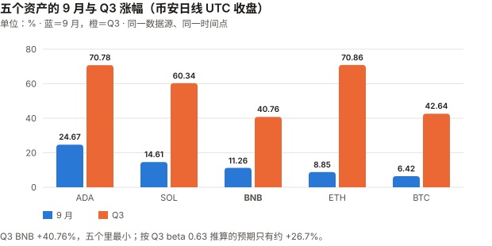
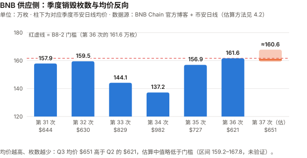
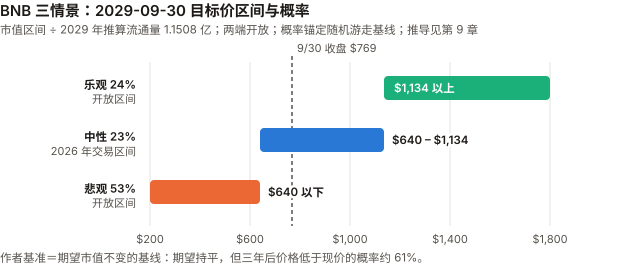

# BNB / BNB Chain 完整调研与分析报告

> **编写日期**：2026 年 10 月 5 日
> **数据截止**：2026 年 9 月 30 日（9 月与 Q3 完整数据已闭合）；供应量与生态 30 天窗口取到 10/4
> **版本**：2026 年 9 月版（第二期）**兼 Q3 季度回顾**
> **研究方法**：沿用 8 月首期的准股权框架。本期第一次有上期论点可核对（B8-1 至 B8-6，见 3.0）。
> **口径**：本期起价格统一用**币安日线 UTC 收盘**（BNBUSDT、BTCUSDT、ETHUSDT、SOLUSDT、ADAUSDT），与 BTC / ETH / SOL 9 月版相同；8 月首期用的是 CoinGecko 00:00 快照，两者不可混比。
>
> **本版更新要点**：
>
> 1. **9 月 +11.26%，Q3 +40.76%**——收于 $769.27。**Q3 BNB 是本系列五个资产里涨幅最小的**（BTC +42.64%、SOL +60.34%、ADA +70.78%、ETH +70.86%）。这正是低 beta 资产在普涨季该有的样子：Q3 对 BTC 的 beta 只有 0.63。
> 2. **本期最重要的发现：BSC 费用的回升几乎全部跟着 meme 协议走。** Flap sh + GMGN 的月度费用从 6 月 $323 万涨到 9 月 **$5,376 万（16.6 倍）**，占生态费用比重从 **10.0% 升到 48.4%**；同期 BSC L1 费用从 $1,085 万涨到 $2,178 万。**8 月版的「五个资产里唯一费用同比增长」在 9 月消失了**：9 月 $2,178 万对 2025-09 的 $2,190 万，真年同比 **−0.6%**（8 月 +62.6% 是低基数）。
> 3. **第 37 次 Auto-Burn（10 月）的枚数，按本报告的公式拟合，中值略低于第 36 次**——约 160.6 万枚，低于 B8-2 的门槛 161.6 万枚；**但门槛落在拟合区间内，把握有限**。原因很机械：公式里价格在分母上，**Q3 均价 $651 高于 Q2 的 $621**。公式的确切形式**未验证**（见 4.2）。
> 4. **机构通道远比 8 月版写的窄**：VanEck VBNB 的 10-K（SEC 一手）显示 6/30 净资产只有 **$214 万**（3,887.70 BNB），**约 40% 是 VanEck 自己的种子资金**；8/31 份额从 10 万降到 9 万。最大上市公司持有者 BNB Standard Corp（原 CEA Industries，9/29 更名）持有 51.6 万枚，**mNAV 约 0.78（计入名义行权价权证）、持仓浮亏约 11%**。
> 5. **8 月版的八处更正**（见 11.5），影响最大的是**三情景重构**：两端开放、对照随机游走基线，概率由 25/50/25 改为 24/23/53；其余：8 月涨幅按币安口径为 **+17.79%**（原 +16.71%）；「机构通道已打开」过度表述；3 年期美债实际是 **4.40%（8/31）→ 5.00%（9/30）**，销毁带来的年化供应缩减约 5.0% 与之持平（在作者采用的锚下溢价约 0，见 9.4），不是 8 月版估计的 100–130bp；稳定币规模两个 DefiLlama 端点差 $31 亿，8 月版只报了其中一个；欧洲 MiCA「仍在进行中」不准确——据报道 Binance 已于 6 月撤回希腊申请。
>
> **免责声明**：本报告不构成任何投资建议。所有分析仅供研究参考，投资决策请咨询专业顾问。

---

## 核心结论摘要（一页速览）

| 维度 | 核心判断 |
|------|----------|
| **BNB 是什么** | 交易所平台币 + BSC 的 gas 代币 + 持续季度销毁的准股权凭证。**理解它从第一重身份开始** |
| **当前价格位置** | $769.27（9/30 币安收盘），市值约 **$1,024.4 亿**（CoinGecko 排名第 4）。距 ATH（$1,375.11，币安 2025-10-13 盘中）**−44.1%**；YTD **−11.00%** |
| **9 月 / Q3 表现** | **9 月 +11.26%、Q3 +40.76%**。9 月高于 BTC beta 预期 +7.0pp（约 0.73 个标准差），Q3 高 +14.0pp（约 1.15 个标准差）——**都不能排除噪声** |
| **本期最重要的发现** | **费用回升 = meme 回升**。Flap sh + GMGN 占生态费用 6 月 10.0% → 9 月 **48.4%**；L1 费用 9 月真年同比 **−0.6%**，8 月版「唯一增长的链」的结论不再成立 |
| **销毁** | 第 37 次（10 月）按拟合公式估约 **160.6 万枚（区间 159.2–167.8 万，未验证）**，**中值低于第 36 次的 161.6 万**；BEP-95 实时销毁 9 月约 2,923 枚，Q3 约 7,392 枚——**量级是季度销毁的 0.5%** |
| **单币层回报** | 销毁带来的年化供应缩减 **约 4.98%**（三年 +15.7%），与 **3 年期美债 5.00%** 持平；在作者采用的「期望市值不变」锚下溢价约 0（**换锚结论会变**，见 9.4）。8 月版估计 100–130bp |
| **机构通道** | VBNB 净资产 **$214 万**（6/30），约占 BNB 市值的 0.002%；**本期首次取得一手数据，结论是「通道开了，但几乎没人走」**。VBNB 9/25 签约由 Figment 做质押验证者（费率 4%） |
| **核心多头逻辑** | 唯一供应真实减少（年化约 4.53%）；beta 低（近 1 年 0.88、Q3 0.63）；FDV ≈ 市值、无解锁；L1 费用 Q3 比 Q2 高 57.7% |
| **核心空头逻辑** | 费用回升由 meme 驱动；单一实体依赖；**ECB 行长据报介入阻止 Binance 的 MiCA 牌照**（WSJ 报道，二手）；储备公司折价；销毁带来的供应缩减与 3 年期美债持平 |
| **估值立场** | 情景**两端改为开放**；**作者的基准预期 = 随机游走基线（期望市值不变）**，概率 乐观 24 / 中性 23 / 悲观 53。期望市值持平，但**三年后价格低于现价的概率约 61%**。8 月版「中性概率最高」撤回 |
| **风险等级** | 风险结构不同于另外四个：市场风险较低（beta <1），但承担单一实体与监管风险。**近 1 年年化波动 51.6%，仍高于 BTC 的 44.9%** |

---

## 1. BNB 的起源与设计取舍

> 本章与 8 月首期相同，此处只保留理解本期内容必需的部分。完整内容见 `bnb_research_report_202608.md` 第 1 章。

| 身份 | 内容 | 本期相关性 |
|------|------|------|
| 交易所平台币 | Binance 手续费折扣与生态权益 | 第 5 章：欧洲牌照受阻直接影响这一身份 |
| BSC gas 代币 | PoSA 共识；VanEck 10-K 描述验证者集合为 **45 个活跃验证者，其中 21 个出块（cabinet）、24 个候补** | 3.3：费用回升的来源 |
| 准股权凭证 | 季度 Auto-Burn + BEP-95 实时销毁 10% gas | 第 4 章：第 37 次销毁的估算 |

---

## 2. BNB 的发展阶段划分

> 阶段一至四见 8 月首期。

### 阶段五：机构化与链上放量（2026 至今）——9 月的修订

8 月版把 2026 年定性为「机构化与链上放量」。**9 月的一手数据要求把这两个词都打折扣**：

- **「机构化」**：VBNB 净资产 $214 万，其中约 40% 是发行商种子资金（6.1）。**通道存在，资金几乎没有进来。**
- **「链上放量」**：放量是真的，但 Q3 增量几乎全部来自两个 meme 协议（3.3）。**这与 SOL 2024–2025 年的路径相似，而 SOL 后来经历了网络收入同比 −87% 的退潮。**

---

## 3. BNB 当前现状分析

### 3.0 论点校验：8 月版登记的 6 条

> 8 月首期登记的 B8-1 至 B8-6 中，**没有一条在 9 月到达检验窗口**（B8-2 在 10 月第 37 次销毁时判定，其余截止 2026-12-31）。下表记录中期读数，**不做判定**。

| # | 论点 | 检验条件（摘要） | 9 月读数 | 状态 |
|---|------|------|------|------|
| B8-1 | 8 月 $1,836 万是阶段性高点，不是新常态 | 9–12 月中 ≥3 个月 L1 费用 ≥$1,500 万则错 | **9 月 $2,178 万**（1/4 个月已 ≥$1,500 万） | ⏳ **方向不利**：9 月比 8 月更高 |
| B8-2 | 销毁枚数会继续上升 | 第 37 次 <1,615,828 枚则错 | 尚未执行；**拟合估算中值约 160.6 万枚，低于门槛**（4.2） | ⏳ **倾向判错，把握有限**（门槛落在拟合区间内），10 月中核 |
| B8-3 | meme 协议费用占比不会显著下降 | 年底前任一 30 天窗口 Flap sh + GMGN 占比 <35% 则错 | **48.2%**（30 天至 10/4，与 8 月版同口径） | ⏳ 读数上升；但见下方提醒 |
| B8-4 | beta <1 的特征会延续 | 9/5–12/31 日收益率 beta ≥1.0 则错 | **0.593**（9/5–9/30，25 个观测，R² 0.444） | ⏳ |
| B8-5 | 单币层溢价不足 300bp | 12/31 重算溢价 ≥300bp 则错 | 随方法与锚在约 −500bp 到 +1,490bp 之间（9.4）；**8 月版自己的敏感性 35/50/15 即给出约 +363bp** | **⊘ 检验失效**：登记时没有指定重算方法与锚。**注意：按 8 月版原方法，本条在展示的多数参数下会判 ✅——⊘ 放弃的是一个赢面，不是在回避一个要输的论点** |
| B8-6 | 单一实体风险四个月内不以可观测方式兑现 | 新的 >$1 亿处罚 / 主要辖区牌照吊销 / 销毁暂停或公式实质变更，任一发生则错 | **未触发**。ECB 介入 MiCA 的报道（5.2）是**申请被搁置后撤回**，不是吊销，且撤回发生在 6 月 | ⏳ |

**两条需要特别提醒**：

1. **B8-2 倾向判错，但把握有限。** 8 月版的论点是「枚数会继续上升」，依据是三次枚数 137.2 万 → 156.9 万 → 161.6 万的趋势。**但这个趋势本身是价格下跌的结果**：公式里价格在分母，34–36 次对应的季度均价是 $982 → $727 → $621。**8 月版把一个价格效应读成了趋势。** Q3 均价回升到 $651，枚数就该回落。**但门槛 161.6 万枚落在本报告的拟合区间（159.2–167.8 万）之内**，且官方用的价格采样（链上预言机）与本报告的币安日线均价不同、参数调整后未公布——见 4.2。
2. **B8-3 的 43.0% 基准是一个刚起来的峰值，不是常态。** 按自然月，Flap sh + GMGN 占比 6 月只有 10.0%、7 月 18.4%、8 月 38.1%、9 月 48.4%。**8 月版没有看这条序列，就把 35% 设成「显著下降」的门槛**——而三个月前的水平只有它的三分之一。读数现在在上升，但 meme 热度回落时，跌破 35% 是很现实的。

### 3.1 价格与市场

> **口径变更**：8 月首期用 CoinGecko 的 00:00 UTC 快照，本期起改用**币安日线 UTC 收盘**。8 月涨幅按新口径为 **+17.79%**（7/31 → 8/31），原口径为 +16.71%。

| 指标 | 数值 | 口径 |
|------|------|------|
| **9/30 收盘** | **$769.27** | 币安 BNBUSDT 日线 |
| 市值 | **约 $1,024.4 亿**（全球第 4） | 收盘价 × 9/30 总供应约 1.33159 亿（CoinGecko 10/4 总供应 133,159,089.69 加回 10/1–10/3 的 BEP-95 销毁） |
| FDV / 市值 | ≈ 1.0（CoinGecko 流通量 = 总供应） | CoinGecko API |
| 历史最高价 | $1,375.11（2025-10-13 盘中，币安）；CoinGecko 口径 $1,369.99 | — |
| **距 ATH** | **−44.1%** | 币安 |
| 9 月区间 | 低 $674.60（9/1）/ 高 **$807.49**（9/21） | 币安日线盘中 |
| 2026 年收盘高 / 低 | $948.47（1/14）/ **$546.52（6/30）** | 币安日线 |

| 区间 | BNB | BTC |
|------|------|------|
| **9 月**（8/31→9/30） | **+11.26%** | +6.42% |
| **Q3**（6/30→9/30） | **+40.76%** | +42.64% |
| Q2（3/31→6/30） | −11.48% | −14.15% |
| YTD | −11.00% | −4.59% |
| 近 1 年（2025-09-30 起） | **−23.72%** | −26.68% |

**beta 与 R² 一起读，以及 beta 残差**：

| 窗口 | 年化波动 | 对 BTC 的 beta | R² | beta 预期涨幅 | 实际 | **自身成分** | 1σ 噪声带 | 标准差倍数 |
|------|------|------|------|------|------|------|------|------|
| 9 月 | 43.6% | 0.66 | 0.41 | +4.26% | +11.26% | **+7.0pp** | 9.6pp | 0.73 |
| Q3 | 34.3% | 0.63 | 0.50 | +26.74% | +40.76% | **+14.0pp** | 12.2pp | 1.15 |
| 近 1 年 | 51.6% | 0.88 | 0.58 | −23.36% | −23.72% | −0.4pp | 33.4pp | −0.01 |

> **噪声带算法**：残差年化波动 = 年化波动 × √(1 − R²)，再乘 √(天数/365)。例：Q3 为 34.3% × √(1 − 0.50) × √(92/365) ≈ 12.2pp。改用对数收益，beta 与 R² 几乎不变（Q3 0.632 / 0.501）。
> **所以 9 月和 Q3 的「自身成分」都在 1.2 个标准差以内，不能说 BNB 有独立于 BTC 的行情。**
> **R² 只有 0.41–0.58**，比 ETH（Q3 0.76）、SOL（0.69）低——**BNB 的价格有较大一块不由 BTC 解释，但这一块在 9 月和 Q3 都没有显著地偏向一边。**

**波动率的读法要和 8 月版一致**：近 1 年 BNB 年化波动 51.6%，**高于 BTC 的 44.9%**；但 Q3 BNB 34.3% 低于 BTC 的 38.8%，9 月 43.6% 略高于 BTC 的 41.9%。**「beta 低」与「波动低」仍是两个统计量。**

**9 月最大的四个单日变动**：9/5 **+6.26%**、9/3 +5.28%、9/9 −3.91%、9/21 +3.48%。**本报告没有找到这四天的 BNB 专属原因的一手来源，不做归因。**

### 3.2 五个资产的横向对照（统一币安口径）

> ⚠️ **口径声明**：下表全部为**币安日线 UTC 收盘**，五个资产同一数据源、同一时间点。8 月版的五资产表是 CoinGecko 快照口径，**两张表不可直接对照**。

| 资产 | **9 月** | **Q3** | YTD | **近 1 年** | 近 1 年 beta | 近 1 年年化波动 |
|------|---:|---:|---:|---:|---:|---:|
| ADA | **+24.67%** | +70.78% | −26.06% | −69.45% | 1.42 | 79.0% |
| SOL | +14.61% | +60.34% | −5.24% | −43.40% | 1.31 | 67.7% |
| **BNB** | **+11.26%** | **+40.76%** | **−11.00%** | **−23.72%** | **0.88** | **51.6%** |
| ETH | +8.85% | **+70.86%** | −9.61% | −35.20% | 1.29 | 63.8% |
| BTC | +6.42% | +42.64% | −4.59% | −26.68% | 1.00 | 44.9% |

- **Q3 BNB 涨幅五个里最小**，比 BTC 还低 1.9pp。**这不是坏消息，是低 beta 的直接后果**：beta 0.63 × BTC 42.64% ≈ 26.7%，BNB 实际还多涨了 14pp。
- **「近 1 年最抗跌」在币安口径下仍成立**：−23.72%，好于 BTC 的 −26.68%。但差距从 8 月版的近 19pp 缩到 **3pp**——8 月版的 CoinGecko 快照窗口（2025-09-05 → 2026-09-05）起点正好避开了 2025-10 的高点前段。
- **近 1 年 beta 0.88 仍是五个里唯一低于 1 的**（8 月版 CoinGecko 口径为 0.921）。

> 图中数字（%）：9 月 ADA 24.67 / SOL 14.61 / BNB 11.26 / ETH 8.85 / BTC 6.42；Q3 ADA 70.78 / SOL 60.34 / BNB 40.76 / ETH 70.86 / BTC 42.64。纵轴刻度 0、20、40、60、80；+26.7% 为 Q3 beta 预期涨幅（3.1 表中 +26.74%）。

### 3.3 链上活动与费用：回升了，但跟着 meme 一起回升

**BSC 的 L1 费用月度序列**（DefiLlama API 日度数据按月聚合，一手）：

| 月份 | L1 费用 | 月份 | L1 费用 |
|------|---|------|---|
| 2025-07 | $10,875,150 | 2026-02 | $8,331,844 |
| 2025-08 | $11,292,440 | 2026-03 | $10,588,119 |
| **2025-09** | **$21,901,137** | 2026-04 | $10,149,492 |
| 2025-10 | $70,688,146 | 2026-05 | $10,171,792 |
| 2025-11 | $14,609,281 | 2026-06 | $10,851,381 |
| 2025-12 | $14,665,705 | 2026-07 | $9,027,849 |
| 2026-01 | $20,242,227 | 2026-08 | $18,360,725 |
| | | **2026-09** | **$21,779,755** |

| 比较 | 结果 |
|------|---|
| **真年同比（2026-09 vs 2025-09）** | **−0.6%**（8 月为 +62.6%） |
| 环比（vs 2026-08） | +18.6% |
| Q3 合计 vs Q2 合计 | **$4,917 万 vs $3,117 万，+57.7%** |
| Q3 合计 vs 2025 Q3 合计（$4,407 万） | +11.6% |
| 同期对照：ETH 9 月 L1 费用 $1,591 万 | **BSC 是 ETH 的 1.37 倍**（8 月 1.77 倍） |

> **8 月版「五个资产里唯一 L1 费用同比增长」的结论，在 9 月不再成立。** 8 月的 +62.6% 是因为 2025-08 本身是低点（$1,129 万）；**2025-09 已经是 $2,190 万，9 月同比就变成了持平。** 季度口径上 Q3 仍同比 +11.6%，所以准确的说法是「**同比大致持平到小幅增长**」，不是「增长六成」。

**生态费用的构成**（DefiLlama `overview/fees/bsc`，一手）：

| 协议 | 30 天费用（至 10/4） | 类别 | 占生态合计 |
|------|---|---|---:|
| **Flap sh** | **$41,188,940** | Launchpad（发币平台） | **36.5%** |
| BSC 链本身 | $22,238,970 | Chain | — |
| PancakeSwap AMM V3 | $15,556,336 | DEX | 13.8% |
| **GMGN** | **$13,211,253** | Trading App（交易机器人） | **11.7%** |
| Uniswap V4 | $6,858,749 | DEX | 6.1% |
| Predict Fun | $5,920,514 | 预测市场 | 5.2% |

> **口径**：「生态合计」取 DefiLlama 该端点的 `total30d` = **$1.129 亿**，与 8 月版计算 43.0% 时的分母同口径。**按自然月拆分（`totalDataChartBreakdown`）时，该口径不含 BSC 链本身那一行**——表中链本身一行因此不给占比。
> **Flap sh + GMGN 30 天合计占 48.2%**（8 月版 43.0%）。**若分母加上链本身的费用**，9 月自然月占比为 $5,376 万 ÷（$11,101 万 + $2,178 万）≈ **40.5%**——两个口径都写出，记分卡 B8-3 沿用不含链费的口径。

**本期最重要的一张表——按自然月看 meme 协议与 L1 费用**：

| 2026 年 | BSC L1 费用 | Flap sh + GMGN | 生态合计（不含链本身） | **meme 占比** |
|------|---:|---:|---:|---:|
| 6 月 | $1,085 万 | $323 万 | $3,237 万 | **10.0%** |
| 7 月 | $903 万 | $617 万 | $3,364 万 | **18.4%** |
| 8 月 | $1,836 万 | $2,551 万 | $6,695 万 | **38.1%** |
| 9 月 | $2,178 万 | $5,376 万 | $11,101 万 | **48.4%** |

**怎么读这张表**：

- **生态合计从 6 月到 9 月增加了 $7,864 万，其中 $5,053 万（64%）来自 Flap sh 与 GMGN 两家。** L1 费用同期翻倍。
- **这是同步，不是已证明的因果**：meme 发币与交易机器人会产生大量链上交易，从而推高 gas 费，机制上说得通；但本报告没有做交易级别的拆分，**不能说 L1 费用增量的百分之几来自 meme**。
- **它改变的是 8 月版多头 #2 的性质**：「费用增长」的需求来源，是本系列见过的最不稳定的那一类（SOL 8 月版：pump.fun 主导的网络收入同比 −87%）。

> **2025-10 的 $7,069 万异常仍未查明**（8 月版遗留）。本期仍排除该月作为基准。

### 3.4 生态数据：TVL 与稳定币

**DeFi TVL**（DefiLlama API，一手）：

| 时点 | TVL |
|------|---|
| 历史最高 | $217.8 亿（2021-05-05） |
| 2025-09-30 | $78.0 亿 |
| 2026-06-30 | $48.4 亿 |
| 2026-08-31 | $54.5 亿 |
| **2026-09-30** | **$56.7 亿** |
| 2026-10-04 | $58.2 亿 |

| 指标 | 数值 |
|------|---|
| 9 月 TVL 变动 | +3.9% |
| Q3 TVL 变动 | +17.1%（同期价格 +40.8%） |
| **真年同比** | **−27.3%** |
| 距 2021 年高点 | −74.0% |

> **TVL 以美元计，主要随价格变动。** Q3 TVL 只涨了价格的四成——**按 BNB 计价，链上锁仓在 Q3 是减少的**。8 月版「TVL 与价格同向」的多头论据在 Q3 尺度上不成立。

**链上稳定币：两个 DefiLlama 端点给出不同的数字**（均为一手 API 调用，10/4）：

| 端点 | BSC 稳定币 | 说明 |
|------|---:|---|
| `stablecoinchains` | **$138.3 亿** | 8 月版用的是这个端点（当时 $133.1 亿） |
| `stablecoincharts/BSC`（`totalCirculatingUSD`） | **$169.3 亿** | 其中原生发行 $59.3 亿、跨链桥入 $110.0 亿 |

> **两者差 $31 亿，本报告没有查明原因**（可能与跨链桥入资产的计入方式有关——**未验证**）。8 月版只报了一个端点，**本期两者并列**。
> 按后一个端点的序列：9/30 $168.8 亿，比 6/30 的 $177.8 亿**下降 5.1%**，比一年前的 $139.6 亿高 20.9%。**Q3 稳定币在流出，与价格方向相反。**

### 3.5 宏观环境

> BNB 与 BTC 共享宏观驱动，详细数据见 BTC 9 月版 3.4。以下只列对 BNB 有特别含义的几项。

| 因素 | 9 月末 | 对 BNB 的含义 | 来源 |
|------|------|------|------|
| 联邦基金利率 | **3.75–4.00%**（9/16 加息 25bp） | — | 美联储（federalreserve.gov）✅ |
| **3 年期美债** | **5.00%**（8/31 为 4.40%，6/30 为 4.15%） | **第 9 章单币层回报的期限匹配基准**。一个月上升 60bp，单币层溢价被压到约 0 | 美国财政部 ✅ |
| 10 年期美债 | 5.29% | 已高于 BNB 的销毁收益率 4.33%–4.53% | 美国财政部 ✅ |

> **3 年期美债一个月涨 60bp，是第 9 章结论本月变化的主要来源**——但这部分是方法的性质：第 9 章只对比供应缩减与美债，费用、meme、监管等基本面按构造进不了这个数字。 8 月版没有取得 3 年期数据，用「曲线中段」估计出 100–130bp 的溢价——**实际 8/31 的 3 年期是 4.40%，按本期方法当时溢价约 60bp，到 9/30 降到约 0。**

### 3.6 Q3 季度回顾（本版新增）

| | Q2 2026 | **Q3 2026** |
|------|------|------|
| BNB 季度涨跌（币安） | −11.48% | **+40.76%** |
| 对 BTC 的超额 | +2.7pp | **−1.9pp**（但比 beta 预期高 14.0pp） |
| L1 季度费用 | $3,117 万 | **$4,917 万（+57.7%）** |
| meme 占比（季末月） | 10.0%（6 月） | **48.4%**（9 月） |
| 季末 TVL | $48.4 亿 | $56.7 亿 |
| 季末稳定币（charts 端点） | $177.8 亿 | $168.8 亿 |
| 季度销毁 | 第 36 次 161.6 万枚（7/15 执行，对应 Q2） | **第 37 次待 10 月执行**；BEP-95 约 7,392 枚 |
| VBNB 净资产 | $214 万（6/30） | 份额 10 万 → 9 万（8/31） |

**Q3 最突出的一组对照**：**费用 +57.7%、价格 +40.8%——但费用增量来自 meme，TVL 按币计在减少，稳定币在流出，机构产品没有资金进来。** 价格上涨主要可以用 beta 0.63 × BTC 解释，剩余 14pp 在 1.15 个标准差内。

---

## 4. 销毁机制与「准回购」

### 4.1 两套并行的销毁机制

| 机制 | 频率 | 规模（本期） |
|------|------|------|
| **Auto-Burn（季度销毁）** | 每季度中月执行（1/4/7/10 月），按**上一季度**的出块数与均价计算 | 第 36 次 1,615,827.795 BNB（7/15） |
| **BEP-95（实时销毁）** | 每个区块，10% gas 费 | 9 月约 2,923 枚，Q3 约 7,392 枚 |

**BEP-95 的数字怎么来的**：DefiLlama 的 BSC 适配器源码（`dimension-adapters/fees/bsc.ts`，本报告已打开）把收入定义为 `dailyFees.clone(0.1)`——**即 gas 费 × 10%，是按 BEP-95 规则推算的，不是逐块测量的销毁量**。本报告再按币安日线逐日换算成 BNB。

**交叉验证**（两组独立来源）：

| 区间 | 总供应减少（官方 / CoinGecko） | DefiLlama 推算的 BEP-95 | 差 |
|------|---:|---:|---:|
| 7/15（官方博客 133,166,127.91）→ 10/4（CoinGecko 133,159,089.69） | **7,038** | 6,929（7/15–10/3） | 1.5% |
| 9/5（8 月版 CoinGecko 133,161,962）→ 10/4 | **2,872** | 2,856（9/5–10/3） | 0.6% |

> **两组都吻合到 2% 以内——这是量级检查，不是逐块验证**：DefiLlama 的数字是「gas × 10%」的模型值；BEP-95 原文（GitHub 一手）规定的 `burnRatio` 初始为 10%、**可由验证者投票修改**，且部分 gas 会先转入 System Reward 合约（余额低于 100 BNB 时转 1/16）。**当前 `burnRatio` 是否仍为 10%，本期未验证**；两个供应量读数也来自不同口径（官方博客与 CoinGecko）。官方博客第 34、36 次累计 BEP-95 销毁「约 28.1 万」→「约 29.1 万」，半年约 1 万枚，也与 DefiLlama 推算的 2026 年 1–6 月合计 10,225 枚一致。
> **量级**：Q3 的 7,392 枚只是一次季度销毁的约 0.5%。**BNB 的通缩几乎全部来自 Auto-Burn，BSC 费用增长对供应的直接影响可以忽略。**

### 4.2 第 37 次销毁的估算：公式与它的不确定性

**官方博客（第 34–36 次）只说**：销毁量「根据 BNB 价格与当季 BSC 出块数调整」；且因 Lorentz、Maxwell、Fermi 升级提高了出块频率，「**公式中的参数已调整，以保持原意**」——**调整后的参数没有公布**。

**公式文本有两个版本，本报告无法一手确认哪个正确**：

| 来源 | 公式 | 能否复现实际销毁量 |
|------|------|---|
| Binance Academy 页面（经网页抓取工具转述，原页面 curl 返回空） | B = N / (100 × P) × K，K = 1,000 | **不能**：按任何合理的出块数，量级都差一个数量级以上；且实际数据里 B × P 不稳定（见下） |
| 二手转述（多家摘要）及 bnbburn.info 的变量说明 | B = N × 1,000 / (P + K)，K = 1,000 | **能**（见下表） |

**本报告的做法：用六次一手销毁数据反推。** 若 B = N' × 1,000 / (P + 1,000)，那么 **B × (P + 1,000) ÷ 季度天数** 应当是常数（等于每天的「等效出块数」）：

| 次序 | 执行 | 销毁量（官方博客） | 对应季度币安日线均价 | 天数 | **B×(P+1000)/天数** | 对照：B×P/天数 |
|------|------|---:|---:|---:|---:|---:|
| 第 31 次 | 2025-04 | 1,579,207.72 | $643.5 | 90 | **28,838 千** | 11.29 百万 |
| 第 32 次 | 2025-07 | 1,595,470.69 | $629.5 | 91 | **28,569 千** | 11.04 百万 |
| 第 33 次 | 2025-10 | 1,441,281.41 | $828.8 | 92 | **28,650 千** | 12.98 百万 |
| 第 34 次 | 2026-01 | 1,371,703.67 | $981.9 | 92 | **29,550 千** | 14.64 百万 |
| 第 35 次 | 2026-04 | 1,569,307.34 | $727.3 | 90 | **30,118 千** | 12.68 百万 |
| 第 36 次 | 2026-07 | 1,615,827.80 | $621.1 | 91 | **28,785 千** | 11.03 百万 |

> 第 32、34 次为「实际销毁」部分（不含 Pioneer Burn 的 129.10 / 100.1 枚）。
> **P + K 形式的常数在 2.86–3.01 万之间（相差 5%）；纯 1/P 形式在 1,103–1,464 万之间（相差 33%）。** 数据明显支持 P + K 形式。
> 一个旁证：28,800 恰好是 3 秒出块时一天的区块数（86,400 ÷ 3）——**像是「把出块数换算回 3 秒等效」后代入原公式**。这是推测，**未验证**。

**第 37 次的估算**（Q3 币安日线均价 **$650.9**，92 天）：

| 用哪个常数 | 估算枚数 |
|------|---:|
| 六次中最低（第 32 次） | 1,592 千 |
| 第 36 次（最近一次） | 1,604 千 |
| **六次中位数（28,810 千）** | **约 1,606 千** |
| 六次中最高（第 35 次） | 1,678 千 |
| 对照：纯 1/P 形式按第 36 次外推 | 1,559 千 |

> 图中单位为万枚：第 31–36 次 157.9 / 159.5 / 144.1 / 137.2 / 156.9 / 161.6；第 37 次估算 ≈160.6（区间 159.2–167.8）。柱下均价 $644 / $630 / $829 / $982 / $727 / $621 / $651 为四舍五入值。纵轴刻度 120、140、160、180。

**结论**：

- **要达到 B8-2 的门槛 1,615,828 枚，常数需要 ≥ 28,995 千。** 六次里只有两次（第 34、35 次）达到。**两种公式形式下中值都低于门槛。**
- **本报告对 B8-2 的判断：按六次常数的分布，约三分之二落在门槛下方——前提是参数未再调整、官方价格采样与币安日线均价一致。两个前提都未验证，所以只能说「倾向判错」。** 官方原始说明用的是链上价格预言机采样，第 36 次公告明说「参数已调整」但未公布新值。 不确定性来自三处：① 公式形式未经一手确认；② 官方的「均价」用什么数据源、什么时段不清楚（本报告用币安日线收盘均价）；③ 出块参数在 Q3 是否又有调整。
- **以 $769.27 计，160.6 万枚约值 $12.4 亿**——高于第 36 次的 $9.32 亿。**美元额回升、枚数下降，这正是公式设计的反向调节**：价格越高，烧得越少。

### 4.3 回购收益率：重算

| 口径 | 计算 | 结果 |
|------|------|---|
| 过去四次 Auto-Burn（第 33–36 次）合计 | 1,441,281 + 1,371,804 + 1,569,307 + 1,615,828 | **5,998,220 BNB** |
| 加 BEP-95（Q3 × 4） | 7,392 × 4 | 29,568 BNB |
| **年化销毁量** | — | **约 602.7 万 BNB** |
| **占 9/30 供应比例** | 602.7 万 ÷ 1.33159 亿 | **4.53%** |
| 过去四次 Auto-Burn 的执行时美元值 | $12.08 亿 + $12.77 亿 + $10.20 亿 + $9.32 亿 | $44.37 亿 |
| **相对市值 $1,024.4 亿** | — | **4.33%** |

**本期回购收益率区间：4.33%–4.53%**（8 月版 4.20%–4.56%）。

> **方法改动**：8 月版用「2026 年前三次 × 4/3」年化，本期改用**过去四次实际值**——不再需要外推，且自动覆盖一整年的价格周期。
> **与 10 年期美债的关系已经反转**：8 月版写「4.20%–4.56% vs 10 年期 4.79%，大致相当」；**9 月末 10 年期 5.29%、3 年期 5.00%，都已高于 BNB 的销毁收益率。**

### 4.4 这个收益率的三个限定条件（沿用 8 月版，状态更新）

1. **它是公式的产物，不是承诺。** 本期新增的认识：**公式让美元额与价格同向、枚数与价格反向**，所以「回购收益率」按市值算相当稳定（4.33%–4.53%），这是设计使然，不是需求的证明。
2. **它有终点。** 距 1 亿枚目标还剩约 3,316 万枚，按每年约 603 万枚约 5.5 年。
3. **执行依赖 Binance 的持续意愿。** 参数调整不公开（4.2）——**这本身就是 B8-6「公式被实质性变更」难以判定的原因**：若参数再调，外部只能从结果反推。

---

## 5. 对 Binance 的依赖

### 5.1 依赖的四个环节（沿用 8 月版）

需求侧（手续费折扣）、供应侧（销毁公式与预留）、链（45 个验证者、21 个出块）、机构通道（ETF 底层市场）——**四个环节共享同一个单点**。本期没有改变这一结构判断。

### 5.2 Binance 经营与监管：9 月的新信息

**欧洲 MiCA 牌照**（**二手**：CoinDesk 9/18 转述《华尔街日报》报道，本报告未打开 WSJ 原文）：

- 据 WSJ，**欧洲央行（ECB）行长拉加德亲自介入**，要求希腊监管机构推迟批准 Binance 的 MiCA 申请，理由是担心 Binance 的规模会加速美元稳定币在欧元区的使用、削弱数字欧元。**ECB 在 MiCA 下没有正式的发牌权。**
- **Binance 已于 6 月中撤回希腊申请**并开始收缩当地业务；Binance 欧洲负责人称申请「完整、无缺项」。WSJ 还报道 ESMA 私下建议各国监管机构拒绝 Binance 的申请。
- Binance 发言人：「不评论猜测」，仍在争取 MiCA 授权。**拉加德、ECB 与希腊监管机构均未公开确认。**

> **对 8 月版的更正**：8 月版写「MiCA 框架下的进展仍在进行中」。**据报道希腊申请已撤回；Binance 在其他成员国是否有在审申请，本报告未核实。** 若报道属实，阻力来自 ECB 层面而非合规缺项——**这比「进展受阻」更结构性**：问题不在 Binance 做得够不够，而在欧元区货币当局是否愿意放行一家美元稳定币分发渠道。
> **对 B8-6 的影响**：撤回申请不是「牌照吊销」，且发生在 6 月（B8-6 登记之前），**不触发**。

**市场份额**：本期**没有取得** CoinGlass 原始季度报告。8 月版的衍生品 34.9%、现货 34% 仍是二手转述，**本期不更新**。

### 5.3 本章的定性（更新）

8 月版的定性「结构性依赖，不是即将断裂」**不变**。本期新增的一点是：**Binance 的监管风险来源在变化**——2023 年是美国执法（DOJ $43 亿和解），2026 年是**欧元区货币主权**层面的阻力。**若报道属实，后者不会以罚款形式出现，也不会触发 B8-6 的任何一条，但它限制了 Binance 在全球第二大加密市场的增长空间。**

---

## 6. 机构通道与持有者结构

### 6.1 VBNB：一手数据显示规模极小

**VanEck BNB ETF 10-K**（财年截至 2026-06-30，SEC EDGAR 一手）：

| 项目 | 内容 |
|------|------|
| **6/30 净资产** | **$2,140,751** |
| 持有 BNB | **3,887.70 枚**（成本 $2,450,388，公允价值 $2,141,463，浮亏 12.6%） |
| 份额 / 每份净值 | 100,000 份 / $21.41 |
| **8/31 份额** | **90,000 份**（较 6/30 减少 10%） |
| 种子资金 | VanEck 母公司的种子创设篮子 $100 万（换得 1,555.16 BNB），**6/30 约占净资产 40%** |
| 赞助费 | 0.39% |
| 托管 | Anchorage Digital Bank（第一托管人）；**8/5 与 BitGo 签第二托管协议** |

**VBNB 8-K（9/25 事件，SEC 一手）**：与 BitGo 的托管协议修订，**指定 Figment 为 BNB 质押的验证者，验证者费用为质押资产的 4%**。10-K 写明信托目标包括「质押部分 BNB 的奖励」，前提是赞助人认为没有不当的法律或监管风险。

> **量级**：3,887.70 BNB 约占 BNB 总供应的 **0.003%**；$214 万约占 BNB 市值的 **0.002%**。**扣掉 40% 的种子资金，外部投资者的钱约 $130 万。**
> **8 月版写「机构通道已打开」，并把 VBNB 列为多头 #7（两星）——一手数据显示该表述过度。** 准确的说法是：**通道已建成，几乎没有外部资金通过。**

### 6.2 上市公司储备：BNB Standard Corp（原 CEA Industries，代码 BNC）

**10-Q（季度截至 2026-07-31）与 8-K（9/29），SEC EDGAR 一手**：

| 项目 | 数值 |
|------|---|
| 持有 BNB | **515,544 枚**（约占总供应 0.39%） |
| 买入加权均价 / 成本 | **$865.99** / $4.465 亿 |
| 7/31 公允价值 | $3.023 亿（$586.36/枚） |
| 质押借款 | 44,198 BNB（$2,590 万）抵押换得 $1,500 万净借款 |
| 普通股（7/31） | 41,173,850 股；5–7 月以均价 $2.63 回购 1,434,112 股 |
| 更名 | **9/29 起由 CEA Industries 更名为 BNB Standard Corporation**，代码仍为 BNC |
| 公司自述 | 「全球最大的企业 BNB 储备」；仍有资产管理协议诉讼待决 |

**按 9/30 计算**：

| 指标 | 计算 | 结果 |
|------|------|---|
| 持仓价值 | 515,544 × $769.27 | $3.966 亿 |
| 持仓相对成本 | $769.27 ÷ $865.99 − 1 | **−11.2%** |
| 股票市值 | 41,173,850 股 × $5.89（Yahoo Finance，9/30 收盘） | $2.425 亿 |
| mNAV（只算 BNB、只算普通股） | $2.425 亿 ÷ $3.966 亿 | 约 0.61（偏低） |
| **mNAV（只算 BNB、计入名义行权价权证）** | （41,173,850 + 预融资权证 7,750,510 + 顾问权证 3,564,362）× $5.89 ÷ $3.966 亿 | **约 0.78** |

> ⚠️ **初稿只报了 0.61，审查（Codex）指出漏了行权价仅 $0.00001 的两类权证**：10-Q 的权证表（7/31 未行权）列有预融资权证 7,750,510 份、战略顾问权证 3,564,362 份，本期已打开原文核对。计入后约 **0.78**。完整 mNAV 还应计入 $1,500 万借款等负债与其他资产，本期未做；**能说的是「mNAV 低于 1」**。
> **与 SOL 的储备公司同一模式**：持有人持仓浮亏、股票按净资产折价交易、公司在回购股票而不是买币。**它们不是 BNB 的边际买家。**

### 6.3 持有者结构小结

| 类别 | 状态 |
|------|------|
| 流通量 | 1.33159 亿枚，与总供应相等——无锁仓 |
| ETF | VBNB 3,887.70 枚（6/30），**约 0.003%** |
| 最大上市公司储备 | BNC 515,544 枚，**约 0.39%**，mNAV <1 |

> **对照 ETH**：BitMine 一家持有约 4.9% 供应量、ETF 一季流入 $30.5 亿。**BNB 的机构持有比 ETH 低一到两个数量级。** 这同时是风险（没有边际买家）和保护（没有单一大户抛压）。

---

## 7. BNB 的核心价值逻辑

### 7.1 多头逻辑

| # | 论点 | 强度 | 说明（9 月更新） |
|---|------|:---:|------|
| 1 | **唯一实现真实通缩** | ★★★★☆ | 年化销毁 4.53%（按枚数），无对应增发。**从五星降为四星**：与美债的对照见空头 #3，此处不重复计分 |
| 2 | **L1 费用 Q3 环比 +57.7%** | ★★☆☆☆ | **从五星降为两星，标题改写**：9 月真年同比 −0.6%，「唯一同比增长」不成立；增量与 meme 协议同步（3.3） |
| 3 | **估值倍数最低** | ★★★☆☆ | 市值 / 过去 12 个月 L1 费用 **467 倍**；按 9 月年化 392 倍 |
| 4 | **beta <1** | ★★★☆☆ | 近 1 年 0.88，Q3 0.63，9/5 以来 0.59（R² 0.44）。**年化波动仍高于 BTC**（51.6% vs 44.9%） |
| 5 | **供应侧最干净** | ★★★☆☆ | FDV ≈ 市值，无解锁 |
| 6 | **机构通道** | ★☆☆☆☆ | **从两星降为一星**：VBNB 净资产 $214 万，40% 是种子资金（6.1）。删除「已打开」的表述 |

> **同源检验**：多头 1、3、4 全部可归结到「Binance 持续运营、公式持续执行」这一个分母；多头 2 来自 meme 需求。**六条里真正独立的证据源只有三个：公式、meme 需求、价格行为。**
> 8 月版多头 #5「8 月 TVL 与价格同向」**已删除**：Q3 TVL 只涨价格的四成，按币计在减少（3.4）。

### 7.2 空头逻辑

| # | 论点 | 强度 | 说明（9 月更新） |
|---|------|:---:|------|
| 1 | **价值链依赖单一实体** | ★★★★★ | 不变 |
| 2 | **费用回升由 meme 驱动** | ★★★★☆ | meme 占比 6 月 10.0% → 9 月 48.4%；生态费用增量 64% 来自两家 meme 协议。**一手 API，证据等级高** |
| 3 | **销毁带来的供应缩减与美债持平** | ★★★★☆ | **本期新增**。年化供应缩减约 4.98% vs 3 年期美债 5.00%——两个可观测量的比较；「溢价约 0」则依赖作者采用的锚（9.4） |
| 4 | **欧元区监管阻力** | ★★★☆☆ | ECB 行长据报介入 MiCA（**二手**，WSJ 经 CoinDesk 转述）。**因证据为二手，不给四星** |
| 5 | **储备公司折价** | ★★☆☆☆ | BNC mNAV 约 0.78（计入名义行权价权证）、浮亏 11%；**但它只持有 0.39% 供应，传导有限** |
| 6 | **TVL 与稳定币在 Q3 按实际量收缩** | ★★★☆☆ | TVL 按币计减少；稳定币 Q3 −5.1% |
| 7 | **回购收益率有终点** | ★★★☆☆ | 约 5.5 年；且价格越高枚数越少 |

### 7.3 一句话总结

> **多头买的是「一个真实通缩、beta 低的资产」；空头指出「通缩收益率已低于美债，费用回升靠 meme，机构没有进来」。**
> **8 月版的问法仍然对——「这个回报率配不配得上这个风险」——9 月的变化是：销毁带来的回报没变，无风险利率涨了 60bp。**

---

## 8. BNB 与其他资产的比较

> 横向表见 3.2（统一币安口径）。

| 资产 | 9 月 | Q3 | 近 1 年 beta | 持有人回报来源 | 本期核心发现 |
|------|---:|---:|---:|------|------|
| BTC | +6.42% | +42.64% | 1.00 | 无 | — |
| ETH | +8.85% | +70.86% | 1.29 | 质押，绝大部分来自增发 | blob 塌陷是供给侧原因 |
| SOL | +14.61% | +60.34% | 1.31 | 质押，来自增发 | 「加倍减发」投票通过但未生效 |
| ADA | +24.67% | +70.78% | 1.42 | 质押，来自增发 | — |
| **BNB** | **+11.26%** | **+40.76%** | **0.88** | **销毁，供应真实减少** | **费用回升与 meme 同步；第 37 次销毁倾向少于第 36 次** |

**BNB vs SOL：同一种需求，不同的持有人捕获**。两条链 Q3 的费用回升都跟着 meme 走（SOL 9 月版：pump.fun 收入 +58%、链上费用 +53%）。**差别在于持有人拿到多少**：SOL 的销毁只抵消增发的 1.41%；BNB 的 BEP-95 销毁 10% gas，但量级只有季度 Auto-Burn 的 0.5%——**两者的持有人回报都几乎不来自 meme 费用**，BNB 的回报来自一个与链上费用无关的公式。

---

## 9. 关键变量与三种情景推演

### 9.1 未来 3–12 个月的催化剂日历

| 时点 | 事件 | 重要性 |
|------|------|:---:|
| **2026-10 中** | **第 37 次 Auto-Burn**：枚数判定 B8-2（门槛 1,615,828）；登记 B9-1 区间 | ★★★★★ |
| 持续 | **meme 占比能否维持在 35% 以上**（B8-3） | ★★★★☆ |
| 持续 | 10–12 月 L1 费用是否再有两个月 ≥$1,500 万（B8-1） | ★★★★☆ |
| 未定 | Binance 新的 MiCA 申请或 ESMA 接管发牌权的立法进展 | ★★★★☆ |
| 未定 | VBNB 开始质押（Figment）后的资金流 | ★★☆☆☆ |
| 2026-12 FOMC | 点阵图指向年内再加一次 | ★★★☆☆ |

### 9.2 估值方法：准股权框架（沿用）

**总回报只有一个口径：单币层 = 市值层 × 供应缩减（相乘，不相加）**——这是 8 月版审查抓到的最重要的重复计算错误，本期继续执行。

**第 1 步 · 2029 年流通量**：9/30 供应 1.33159 亿 − 3 年 × 年化 602.7 万 = **约 1.1508 亿枚**。供应缩减因子 1.33159 ÷ 1.1508 = **1.1571（+15.71%）**。

> **这一步推导的方向性偏差**：公式让枚数随价格上涨而减少。若乐观情景兑现（价格翻倍），三年的实际销毁会明显少于 1,808 万枚，乐观档目标价被高估；悲观档相反。**本报告没有把这个反馈建进情景里**（见 9.5 弱点 2）。

**第 2 步 · 参照市值**（CoinGecko 2022 年至今日线，沿用 8 月版）：2023 年低点 $315 亿（DOJ 和解期）、2026 年交易区间 $736 亿–$1,305 亿、2025-10-09 市值历史最高 $1,819 亿。

### 9.3 三种情景（期限：2029-09-30，三年）

**本期的方法变更**（不是证据变化，也不是价格变动带来的机械变化）：
1. **两端改为开放**：8 月版三档封闭在 $315 亿–$1,819 亿，等于默认三年后不会离开这个区间。按 BNB 近 1 年年化波动 51.6%，三年后落在区间之外的概率约 33%–35%。**本期乐观档改为「$1,305 亿以上」、悲观档改为「$736 亿以下」**，三档首尾相接、覆盖全部结果，当前市值 $1,024.4 亿落在中性档内。
2. **概率对照随机游走基线**：8 月版中性 50% 的依据（beta 低、2026 年在区间内往返）没有和基线对照。按 BNB 自己的波动，三年后仍在中性档的概率只有 23%–25%——**beta 低已经体现在 51.6% 的波动里，不能再额外加分**。
3. **代价**：三档改成纯价格带后，丢掉了 8 月版的情景叙事（如「悲观 = 单点风险兑现」）。本期悲观档只表示「市值低于 $736 亿」，不论原因。

**随机游走基线**（起点 $1,024.4 亿，年化波动 51.6%，三年；两列分别在不同统计量上「中性」）：

| 情景 | 市值区间 | 目标价（2029 年，÷ 1.1508 亿枚） | 相对现价 $769.27 | 零对数漂移（**中位数**不变） | 期望市值不变（**均值**不变） | **本期采用** | 8 月版 |
|------|---|---|---|:---:|:---:|:---:|:---:|
| 乐观 | **$1,305 亿以上**（参照 ATH $1,819 亿） | **$1,134 以上** | +47% 以上 | 39.3% | 23.6% | **24%** | 25% |
| 中性 | $736 亿 – $1,305 亿（2026 年交易区间，CoinGecko 口径） | $640 – $1,134 | −17% ~ +47% | 25.1% | 23.3% | **23%** | 50% |
| 悲观 | **$736 亿以下**（参照 2023 年低点 $315 亿） | **$640 以下** | −17% 以下 | 35.6% | 53.1% | **53%** | 25% |

> 图中横轴刻度 $200、$600、$1,000、$1,400、$1,800；虚线为 9/30 收盘 $769（$769.27 四舍五入）；乐观、悲观两档为开放区间，图中画到 $1,800 与 $200 为止；概率 24% / 23% / 53%。
> 2026 年交易区间下沿 $736 亿是 CoinGecko 市值口径；按本期统一的币安收盘价，6/30 $546.52 对应约 $728 亿，略低于这个下沿。

**作者的基准预期（明确写出）**：**采用「期望市值不变」那一列，不作偏离。** 它的含义是：
- 三年后**期望市值持平**；
- 但**中位数约低 33%**（约 $687 亿），**三年后价格低于现价的概率约 61%**（价格低于 $769.27 ⇔ 市值低于约 $885 亿）；
- 悲观档 53% 是这个分布的直接结果。**按「期望回报」的定义作者不看空；按「更可能下跌」的定义，这个基准是偏空的**——两者都要告诉读者。

**为什么不偏离基线**：有利的（Q3 费用 +57.7%、真实通缩）与不利的（费用增量与 meme 同步、ETF 渠道几乎没有外部资金、欧元区阻力〔二手〕）方向相反，作者判断不足以移动一个三年的情景。
**为什么选均值不变而不是中位数不变**：零对数漂移意味着期望市值三年增长约 49%（年化约 14%），这本身是一个看多的观点；均值不变则对应「市场价格已反映全部信息」的通常假设。**这是一个选择，不是推导**——选另一列，结论会大幅改变（见 9.4）。
**撤回**：8 月版写「中性情景概率最高（50%）」，本期撤回。

### 9.4 回报拆解：销毁能带来多少

**本期不再报「期望市值 × 概率」的期望回报**，原因：两端开放后，开放区间的代表值决定结果。按 24/23/53 与各档的条件均值，期望市值 = 当前（按构造）；只要把概率取整成 25/25/50，期望就变成 +3.7%；改用 8 月版的区间中点代表开放区间，则变成约 −13%。**同一个分布，处理细节就能移动十几个百分点，这个数字没有信息量。**

**能确定的只有供应这一侧**：

| 项目 | 计算 | 结果 |
|------|------|---:|
| 年化销毁量（过去四次 Auto-Burn + BEP-95） | 4.3 | 约 602.7 万枚 |
| 三年供应缩减 | 1.33159 亿 → 1.1508 亿 | **+15.71%** |
| **折合年化** | 1.1571^(1/3) | **约 4.98%** |

**含义：如果三年后 BNB 的市值不变，持有人每年得到约 5.0% 的价格回报，全部来自销毁。** 这是一个条件回报，**不是预期回报**——销毁不向持有人支付现金，价格上涨仍需要市场维持市值；而且价格越高、每季烧得越少（4.2），这个 5.0% 本身也随价格变化。

| 锚（对市值的假设） | 单币层年化 | 相对 3 年期美债 5.00% |
|------|---:|---:|
| 期望市值不变（作者采用） | 约 4.98% | **约 0** |
| 期望价格不变 | 0% | 约 −500bp |
| 零对数漂移（中位数不变） | 约 19.9% | 约 +1,490bp |

> **头条结论依赖锚的选择**：「溢价约 0」只在作者采用的锚下成立。**锚无关的部分**是：**销毁带来的年化供应缩减约 5.0%，与 3 年期美债 5.00% 持平**——这是两个可观测量的比较。

### 9.5 这套推导方法的弱点

1. **销毁收益率不是契约性的**，参数调整不公开（4.2）。
2. **年化销毁量假设不变**，未建入「价格高 → 枚数少」的反馈。
3. **公式形式未经一手确认**（4.2）。若 1/P 形式才对，枚数对价格更敏感，弱点 2 更严重。
4. **基线对波动率的选择敏感**：近 1 年 51.6%；若改用 Q3 的 34.3%，留在中性档的概率会升高。
5. **结论依赖锚**（9.4 表）：本期选了「期望市值不变」，这是一个选择。
6. **情景失去了叙事**：三档是纯价格带，「Binance 稳健但 BSC 生态萎缩」「单点风险兑现」等情形不再对应任何一档。

### 9.6 无风险利率对照

| | 收益率 | 期限 | 风险 |
|---|---:|---|---|
| 3 年期美债 | **5.00%**（9/30） | 3 年 | 无风险 |
| **BNB 销毁带来的年化供应缩减**（市值不变时的价格回报） | **约 4.98%** | 3 年 | 年化波动 51.6% + 单一实体风险 + 监管风险 |
| **差** | **约 0** | — | 在作者采用的锚下 |

### 9.7 本报告的结论

> **BNB 销毁带来的年化供应缩减约 5.0%，与 3 年期美债 5.00% 持平。** 在作者采用的基准（期望市值不变）下，这就是持有 BNB 的全部期望超额来源——**溢价约为零**。
> **8 月版「溢价 100–130bp」有两处错误**：① 3 年期美债是估的（实际 8/31 为 4.40%）；② 溢价来自 +0.7% 的期望市值，而 8 月版自己的敏感性就显示它随概率在 −9.4% 到 +10.8% 之间变动，没有信息量。
>
> **这仍然不是看空期望回报**：买 BNB 的理由应当是「我认为它的市值会涨」，即对 Binance 与 BSC 的前景有正面观点。**「它有收益」这个理由，在 3 年期美债 5.00% 时已经不成立**——销毁带来的回报与无风险利率持平，承担的却是 51.6% 的波动与单一实体风险。
> **但读者应知道**：作者采用的基准分布下，三年后价格低于现价的概率约 61%。

---

## 10. 投资与风险启示

### 10.1 BNB 现在处于什么位置

**一句话**：一个**低 beta、真实通缩、但溢价已被美债吃掉**的准股权资产；**链上热度在回升，但回升来自最不稳定的那类需求**。

### 10.2 策略框架

> 以下为研究性质的框架整理，**不构成投资建议**。

| 持有者类型 | 框架 |
|------|------|
| **未持有者** | 销毁带来的年化供应缩减约 4.98% vs 3 年期美债 5.00%。**唯一成立的买入理由是「我认为 BNB 会涨」**，不是「它便宜」或「它有收益」 |
| **已持有者** | 若持有理由是「BSC 生态增长」：增量 64% 来自两家 meme 协议。若是「机构会进来」：VBNB 外部资金约 $130 万。若是「通缩」：仍成立，但收益率已低于美债 |
| **仓位角色** | beta 0.88（近 1 年），**在加密内部提供相对分散**；但年化波动 51.6% 高于 BTC |
| **杠杆** | 单一实体风险的兑现通常是突发的（2023 年先例）；**杠杆头寸没有反应时间** |

### 10.3 关键监控指标

| # | 指标 | 当前值 | 改变结论的阈值 | 观测方式 |
|---|------|---|---|---|
| 1 | **第 37 次销毁枚数** | 估约 160.6 万 | <1,615,828 → B8-2 判错；**落在 B9-1 区间外 → 本报告的公式拟合失效** | BNB Chain 官方博客 |
| 2 | **meme 占比**（Flap sh + GMGN） | 48.2%（30 天） | **<35% → B8-3 判错**；>60% → 需求质量继续恶化 | DefiLlama API |
| 3 | BSC 月度 L1 费用 | $2,178 万 | 10–12 月中再有 ≥2 个月 ≥$1,500 万 → B8-1 判错 | DefiLlama API |
| 4 | 3 年期美债 | 5.00% | 降回 4.40% 以下 → 溢价回到约 60bp 以上 | 美国财政部 |
| 5 | 欧洲牌照 | 希腊申请已撤回（二手） | 任一成员国批准 MiCA → 欧元区阻力消除 | 官方公告 |
| 6 | VBNB 份额 | 9 万份（8/31） | **>100 万份（约 $2,000 万）→ 才值得重新讨论「机构需求」** | SEC 10-Q / 发行商网站 |
| 7 | BNC mNAV | 约 0.78 | 回到 1 以上 → 储备公司重新具备买币能力 | SEC + 股价 |
| 8 | 稳定币（两个端点） | $138.3 亿 / $169.3 亿 | 查明端点差异 | DefiLlama |

### 10.4 风险提醒

1. **单一实体风险**：结构不变。
2. **监管风险来源在变**：从美国执法转向欧元区货币当局（二手）。
3. **需求质量风险**：meme 占比 48.2%，且三个月前只有 10%。
4. **利率风险**：3 年期美债一个月上升 60bp，单币层溢价约 0。
5. **本报告自身的风险**：8 月版八处需要更正（11.5），其中「机构通道已打开」与「溢价 100–130bp」是方向性错误；**B8-2 倾向判错**。本期公式形式与稳定币端点差异两处**未解决**。

### 10.5 长期认知

**第一，一个「趋势」可能只是公式对价格的反应。** 8 月版看到三次销毁枚数上升，就登记「会继续上升」；实际上公式让枚数与价格反向，**那三次上升是价格连续下跌（$982 → $727 → $621）的镜像**。**在下结论前，先问这个数是怎么算出来的。**

**第二，一个只对利率敏感的结论，可能是方法造成的。** 第 9 章把市值锚定为期望不变后，数字里只剩供应缩减和美债；本月结论变化几乎全部来自美债上升 60bp。**这是方法的性质，不说明基本面不重要。**

**第三，「通道打开」与「资金进来」是两件事。** VBNB 上市是真的，但 10-K 显示外部资金约 $130 万。**一个事件发生了，不等于它的预期后果发生了。**

---

## 11. 附录

### 11.1 关键数据速查（截至 2026-09-30）

| 类别 | 指标 | 数值 |
|------|------|------|
| **市场** | 9/30 收盘 / 市值 | $769.27 / 约 $1,024.4 亿（第 4） |
| | 9 月 / Q3 / YTD / 近 1 年 | **+11.26% / +40.76% / −11.00% / −23.72%** |
| | beta（9 月 / Q3 / 近 1 年） | 0.66 / 0.63 / 0.88；R² 0.41 / 0.50 / 0.58 |
| | 距 ATH | −44.1%（币安） |
| **费用** | L1 9 月 / Q3 | $2,178 万（真年同比 −0.6%）/ $4,917 万（环比 +57.7%） |
| | meme 占比 | 48.2%（30 天）；自然月 10.0% → 18.4% → 38.1% → 48.4% |
| **生态** | TVL | $56.7 亿（真年同比 −27.3%） |
| | 稳定币 | $138.3 亿（chains 端点）/ $169.3 亿（charts 端点） |
| **销毁** | 第 37 次估算 | 约 160.6 万枚（159.2–167.8 万，未验证） |
| | BEP-95 9 月 / Q3 | 约 2,923 / 7,392 枚 |
| | 回购收益率 | 4.33%–4.53% |
| **估值** | 销毁带来的年化供应缩减 / 3 年期美债 | 约 4.98% / 5.00% |
| **情景** | 乐观 / 中性 / 悲观（至 2029-09-30，两端开放） | 24% / 23% / 53%；三年后价格低于现价的概率约 61% |
| **机构** | VBNB 净资产（6/30） | $214 万（3,887.70 BNB，约 40% 种子资金） |
| | BNC | 515,544 BNB，mNAV 约 0.78（计入名义行权价权证），浮亏 11.2% |

### 11.2 数据来源与核实状态

**标注规则**：✅ = 本报告直接抓取一手来源；⚠️ = 仅搜索摘要或二手转述；❌ = 核实失败。

| 数据 | 来源 | 核实状态 |
|------|------|:---:|
| 价格、月/季涨跌、波动率、beta、R² | 币安 API `klines`（BNB / BTC / ETH / SOL / ADA 兑 USDT） | ✅ 一手 API |
| 市值排名、总供应、ATH（CoinGecko 口径） | CoinGecko API `coins/binancecoin`（10/4） | ✅ 一手 API |
| BSC L1 费用月度序列、生态费用分项与自然月拆分 | DefiLlama API（`summary/fees/bsc`、`overview/fees/bsc`） | ✅ 一手 API |
| **BEP-95 销毁 = gas 费 × 10% 的口径** | **DefiLlama `dimension-adapters/fees/bsc.ts` 源码** | ✅ **已打开源码**（是推算，不是逐块测量） |
| TVL、稳定币（两个端点） | DefiLlama API | ✅ 一手 API（**两端点差异未查明**） |
| **第 31–36 次销毁的枚数、美元值、销毁后供应** | **BNB Chain 官方博客（6 篇原文）** | ✅ **打开原文**（8 月版第 34、35 次为摘要，本期补齐） |
| 第 37 次是否已执行 | BNB Chain 博客 `37th-bnb-burn`（10/4 访问为空页） | ✅ 尚未发布 |
| **Auto-Burn 公式的确切形式** | Binance Academy（网页工具转述）与二手摘要两个版本冲突 | ❌ **未能一手确认**；本报告用六次一手数据反推（4.2） |
| **VBNB 净资产、持仓、份额、种子资金、托管** | **SEC EDGAR：VanEck BNB ETF 10-K（财年至 2026-06-30）** | ✅ 一手 |
| **VBNB 质押验证者 Figment、4% 费率** | **SEC EDGAR：VBNB 8-K（9/25 事件）** | ✅ 一手 |
| **BNC 持仓、成本、借款、股数、回购** | **SEC EDGAR：BNC 10-Q（至 7/31）、8-K（9/29 更名）** | ✅ 一手 |
| BNC 股价 | Yahoo Finance API | ✅ API |
| BSC 验证者 45 个 / 21 个出块 | VBNB 10-K 中赞助人的描述 | ✅ 一手文件（**但是发行商的描述，不是链上测量**） |
| 宏观（FOMC、3 年期与 10 年期美债） | 美联储、美国财政部（见 BTC 9 月版） | ✅ 一手 |
| **ECB 行长介入 Binance 的 MiCA 申请、Binance 6 月撤回希腊申请** | CoinDesk 9/18 文章（已打开）转述《华尔街日报》 | ⚠️ **二手**（WSJ 原文未打开；当事方均未公开确认） |
| Binance 市场份额 | — | ❌ **本期未取得 CoinGlass 原始报告**；8 月版的二手数字不更新 |
| 9 月大涨大跌日的 BNB 专属原因 | — | ❌ 未找到一手来源，不做归因 |
| 2025-10 费用异常成因 | — | ❌ 仍未查明 |
| BSC 历史区块的黑洞地址余额 | BSC 公共 RPC `eth_getBalance` | ❌ 历史状态被裁剪（「missing trie node」），改用供应量差额交叉验证 |

### 11.3 来源偏向声明

- **8 月版声明的「多头一手、空头二手」不对称，本期部分扭转**：机构侧（VBNB、BNC）改为 SEC 一手，而一手数据**削弱**了多头（机构通道）；空头 #2（meme 依赖）是一手 API。**本期证据等级大致对称。**
- **仍为二手的**：欧洲监管（WSJ 经 CoinDesk）、市场份额（未更新）。空头 #4 因此限制在三星。
- **传统金融机构**：本期引用了 **VanEck**（VBNB 的 SEC 文件）、**美联储**与美国财政部（利率）、BitGo 与 Figment（VBNB 托管与质押）、ECB 与 ESMA（经 WSJ 转述）。**本期没有找到一份 9 月发布的传统机构 BNB 研究报告**——这是配平缺口。

### 11.4 与 BTC / ETH / SOL 9 月版共用的口径

价格统一用币安日线 UTC 收盘（五个资产同一数据源）；宏观数据与 BTC 9 月版共用同一批抓取。

### 11.5 本版对 8 月版的更正

| # | 8 月版写法 | 更正 | 发现方式 |
|------|------|------|------|
| 1 | 8 月涨幅 +16.71%（CoinGecko 8/1→8/31） | 该口径为 00:00 快照；**币安 UTC 收盘 7/31→8/31 为 +17.79%** | 币安日线 |
| 2 | 「机构通道已打开」；多头 #7 两星 | **VBNB 净资产 $214 万，约 40% 是种子资金**；改为「通道已建成，几乎没有外部资金」，多头降为一星 | SEC 10-K 一手 |
| 3 | 单币层溢价「大致在 100–130bp」，3 年期用「曲线中段」估计 | **实际 3 年期 8/31 为 4.40%**；按本期方法当时溢价约 60bp，9/30 约 0 | 美国财政部 |
| 4 | BSC 稳定币 $133.1 亿 | 只是 `stablecoinchains` 端点；`stablecoincharts` 端点为 $169 亿量级，**两者并列，差异未查明** | DefiLlama 两端点 |
| 5 | 欧洲「MiCA 框架下的进展仍在进行中」 | 据报道 Binance **6 月已撤回希腊申请**，阻力来自 ECB 层面（二手） | CoinDesk 转述 WSJ |
| 6 | 第 34、35 次销毁「多个二手来源一致，未打开官方原文」 | **已打开官方博客原文，数字一致**；第 34 次「实际销毁」为 1,371,703.67（另含 Pioneer Burn 100.1） | BNB Chain 博客 |
| 7 | 「近 1 年最抗跌」，领先第二名近 19pp | 币安口径下仍成立，**但差距只有 3pp**（−23.72% vs BTC −26.68%）；近 1 年 beta 0.88（原 0.921） | 币安日线 |
| 8 | 三情景区间封闭、中性 50% 未对照随机游走基线；期望市值 +0.7% 被当作有方向含义的数字；「中性概率最高」 | 两端开放；作者基准 = 期望市值不变的随机游走基线，概率 24/23/53；不再报期望市值；「中性概率最高」撤回（9.3–9.4） | 本期作者自查 + 推理审查 |

**B8-2 论点本身的问题**（不是数据更正，是推理更正）：8 月版把「三次枚数上升」读成趋势，而公式让枚数与价格反向——**那是价格连续下跌的结果**（见 3.0、4.2）。

### 11.6 发布前审查记录

| 层 | 审查者 | 结果 |
|---|---|---|
| 0 | 作者自查（送审前） | 发现三情景区间封闭、中性 50% 未对照基线，重写第 9 章初版 |
| 1 | `tools/verify_report.py` 机械核查 | 修订后重跑，见下 |
| 2 | **_bian**（推理审查） | 13 条，全部采纳或部分采纳 |
| 3 | **Codex**（领域审查） | 5 条，全部采纳 |

> 初稿由分身在后台完成时曾写「第 2 层本期未执行」；**本期最终两层审查都已执行**，该说法作废。

**_bian 对作者自查版第 9 章的批评（最重要）**：
1. 公布的 25/25/50 按报告自己的方法算出来是期望市值 +3.7%、溢价约 +125bp，不是「≈0」；53→50 也不是四舍五入 → **改为公布未取整的 24/23/53**，9.4 不再报期望市值。
2. B8-5 改判 ⊘ 的理由（「统计量由作者建模选择决定」）同样适用于本期头条结论 → **头条改为锚无关的「供应缩减 ≈ 美债」，「溢价约 0」明确标为依赖锚**；B8-5 的 ⊘ 理由改为「登记时未指定重算方法与锚」，并写明 ⊘ 放弃的是一个赢面。
3. 「悲观 50% 不是看空」与采纳的分布矛盾（三年后价格低于现价的概率约 61%）、「不给基准预期」名不副实 → **改为明确写出作者基准 = 期望市值不变的基线，并报出 61%**。
4. 「无风险利率是估值的一半」是构造的同义反复，被写成了长期认知 → 10.5 第二条改写，3.5 加限定。
5. B9-2 的排查会把 meme 活动本身扣掉、只在 ❌ 一侧有出口、论点含未检验的因果 → 记分卡改写。
6. B9-1 区分不了「公式成立」与「和上次差不多」→ 记分卡注明只能排除 1/P 形式。
7. 「概率变化全部是机械的」→ 改为「方法变更」；B8-6 的先验推导已失效 → 记分卡注明。
8–13. 撤回引用对不上 8 月原文（「基准预期是中性」8 月原文没有这句）、+0.76% 应为 +0.7%、卷首 $310 亿应为 $31 亿、更正条数、MiCA「没有任何一个申请」超出报道、同一事实多空两侧各计一次、「三连跌」实为两次下跌等 → 逐条更正。

**Codex 的五条（领域层）**：
1. 第 9 章「把假设写成了收益率」→ **采纳**（与 _bian 第 2 条一致）：9.4 改为条件回报，明确「不是预期回报」。
2. 公式拟合被赋予过高预测力；官方用链上预言机价格、参数调整未公布 → **采纳**：B8-2 由「大概率判错」降为「倾向判错，把握有限」；B9-1 先验 71% → 60%。
3. meme 占比的分母不含链费，含链费为 40.5%；B9-2 检验不了因果，多地址刷量过滤不掉 → **采纳**。
4. BEP-95 交叉验证只是量级检查；`burnRatio` 可治理 → **采纳**，已打开 BEP-95 原文核对。
5. BNC 漏了名义行权价权证，mNAV 应约 0.78 → **采纳**，已打开 10-Q 权证表核对（7,750,510 + 3,564,362 份）。

**分歧**：无实质分歧。两位审查者在第 9 章上的意见方向一致；作者唯一保留的选择是「期望市值不变」这个锚，理由与代价已写入 9.3、9.4。

**ZEC 期清扫**：撤回的说法（「溢价约 25bp」「期望市值 +0.76%」「基准预期是中性」「不对市值表态」「25/25/50」「三连跌」「mNAV 约 0.61」作为结论）已在报告、摘要、记分卡中 grep 清扫。
---

> **配套文件**：`bnb_questions_summary_202609.md`（简明速查）、`../thesis_scorecard.md`（论点滚动记分卡）。
> 本报告不构成投资建议。
