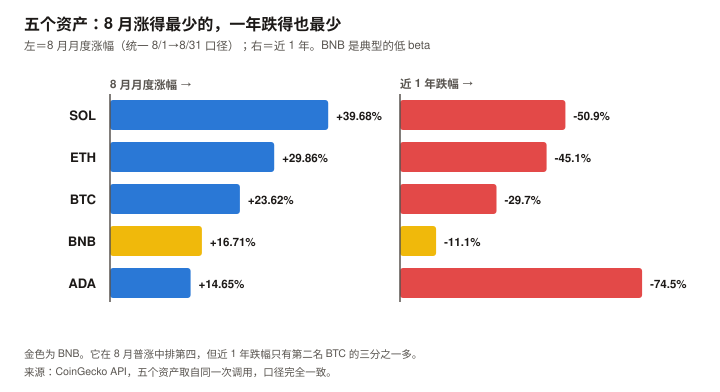
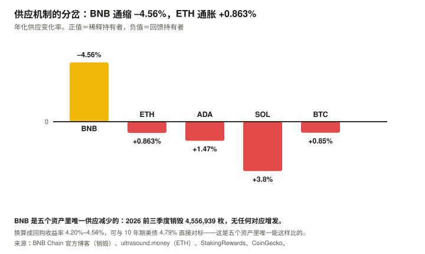
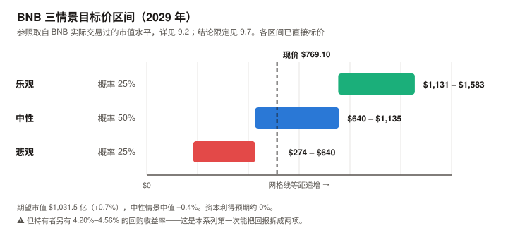

# BNB / BNB Chain 完整调研与分析报告

> **编写日期**：2026 年 9 月 5 日
> **数据截止**：2026 年 9 月 5 日（8 月完整月度数据已闭合）
> **研究方法**：沿用 BTC / SOL / ADA / ETH 月报的分析框架。**但本期的框架改动是五期以来最大的一次**——
> BNB 是本系列覆盖的第一个**非纯 L1 资产**：它首先是交易所平台币，其次才是公链代币。
> 因此新增「销毁机制与准回购」「对 Binance 的依赖」两个特有章节，**估值方法也换成了第五种：准股权框架**。
> **本期为 BNB 首期报告**，无上期论点可校验；本期登记的论点将在 10 月版核对。
>
> **本期核心发现**：
> ① BNB 现价 **$769.10**，市值 **$1,024.1 亿（全球第 4）**。距 ATH $1,369.99（2025-10-13）**–43.86%**，年初至今 **–10.85%**；
> ② **它是五个资产里最抗跌的**：近 1 年 **–11.1%**，而 BTC –29.7%、ETH –45.1%、SOL –50.9%、ADA –74.5%；
> ③ **BSC 是五个资产里唯一 L1 费用同比增长的**：2026-08 **$1,836 万** vs 2025-08 $1,129 万，**真年同比 +62.6%**。**同期它已是 ETH（$1,038 万）的 1.77 倍**；
> ④ **BNB 是唯一实现真实通缩的**：2026 年前三季度三次季度销毁合计 **4,556,939 BNB**，执行时价值约 **$32.3 亿**，且**没有任何对应的增发**。累计已销毁 **6,684 万枚（供应上限的 33.4%）**；
> ⑤ **换算成「回购收益率」是 4.20%–4.56%**——这是五个资产里**唯一由供应实际减少（而非增发转移）产生**的持有人回报。⚠️ **但它只能通过价格实现，不是可单独收到的票息，与债券收益率并非同质**（见 9.7）；
> ⑥ **机构通道已打开**：VanEck 的 **VBNB** 于 2026-05-29 在 Nasdaq 上市，是首个美国现货 BNB ETF，赞助费 0.39%；
> ⑦ **估值倍数是五个里最低的**：市值 / L1 年化费用 **465–699 倍**（区间取决于年化口径，见 8.1 注），ETH 与 ADA 高出一到两个数量级。
>
> **本期最重要的判断**：**在 8 月这个窗口内，BNB 是五个资产里基本面指标改善最多的**——费用同比增长、TVL 与价格同向、真实通缩、ETF 落地。
> ⚠️ **但「同时改善」只在短窗口成立**：**BSC 的 TVL 同比仍是 –25.3%，距 2021 年高点 –73.4%**（见 3.4）。
> **而它也是唯一一个价值高度依赖单一中心化实体的。** 这三句话必须一起读，第 5 章解释为什么。
>
> **免责声明**：本报告不构成任何投资建议。所有分析仅供研究参考，投资决策请咨询专业顾问。

---

## 核心结论摘要（一页速览）

| 维度 | 核心判断 |
|------|----------|
| **BNB 是什么** | **本系列覆盖的第一个非纯 L1 资产。** 它有三重身份：① Binance 交易所的**平台币**（手续费折扣、生态权益）；② BNB Chain（BSC）的 **gas 代币**；③ 一个**持续回购销毁**的准股权凭证。**理解它必须从第一重身份开始，而不是把它当成又一条公链** |
| **当前价格位置** | $769.10，市值 $1,024.1 亿（全球第 4）。距 ATH $1,369.99（2025-10-13）–43.86%，YTD –10.85% |
| **本期最突出的对照** | **五个资产里最抗跌**：近 1 年 –11.1%，而 BTC –29.7%、ETH –45.1%、SOL –50.9%、ADA –74.5%。**8 月月度 +16.71%，在五个里排第四**（统一 8/1→8/31 口径） |
| **最重要的发现（一）** | **BSC 是五个里唯一 L1 费用同比增长的链**：真年同比 **+62.6%**，且 2026-08 的 $1,836 万**已是 ETH 的 1.77 倍**。作为对照，同期 ETH 是 –73.8% |
| **最重要的发现（二）** | **BNB 是唯一实现真实通缩的资产。** 2026 前三季度销毁 4,556,939 BNB（约 $32.3 亿），**无任何对应增发**。而 ETH 同期净通胀 +0.863%、SOL 约 3.8%、ADA 1.47% |
| **估值锚（第五种）** | **准股权框架**。BNB 的销毁在经济实质上**接近**股票回购（三处差异见 4.3），可算「回购收益率」：**年化 4.20%–4.56%**。**这是五个资产里唯一由供应实际减少产生的回报**。⚠️ **但它只能通过价格实现，与债券票息不同质；且本报告持有期是 3 年，严格对应的基准是 3 年期美债而非 10 年期**（见 9.7） |
| **估值倍数** | 市值 / L1 年化费用 **465–699 倍**（区间取决于年化口径），**五个资产里最低**，ETH 与 ADA 高出一到两个数量级。⚠️ **初稿只用 8 月单月年化得出 486 倍，而 8 月是 BSC 全年第二高的月份** |
| **核心多头逻辑** | 费用同比 +62.6% 且已超 ETH；真实通缩且回购收益率对标美债；8 月 TVL +12.4% 与价格 **同向**（ADA 是背离）；VanEck VBNB 现货 ETF 已上市；Binance 在衍生品与现货均占约 35% 份额，护城河极深 |
| **核心空头逻辑** | **单一实体依赖**——销毁公式、验证者集合、生态资金、ETF 底层资产全部绕不开 Binance；**生态活跃度 43% 来自 meme 币相关协议**（Flap sh + GMGN）；TVL 距 2021 年 ATH **–73.4%**、同比 **–25.3%**；监管未了结（$43 亿 DOJ 和解、欧洲牌照申请受阻） |
| **与另外四个的关系** | BTC 靠稀缺性、ETH 是混合型（现金流锚已失效）、SOL 靠网络收入、ADA 是期权型（无锚）；**BNB 是准股权型——它的价值与一家公司的经营状况挂钩，这在本系列里是第一次** |
| **风险等级** | **风险结构与另外四个不同**，不是简单的高低之分。它的市场风险较低（最抗跌），但**承担了另外四个都没有的单一实体风险与监管风险** |

---

## 1. BNB 的起源与设计取舍

### 1.1 它先是一张折扣券，后来才是一条链

BNB 的起点与本系列另外四个资产**完全不同**：它不是为了实现某种技术理想而发行的，**它是 Binance 交易所 2017 年 ICO 的产物**，最初的用途只有一个——**在 Binance 上交易可以用 BNB 抵扣手续费，享受折扣**。

| 阶段 | BNB 是什么 |
|------|-----------|
| 2017 | 以太坊上的一枚 **ERC-20 代币**，用途是交易手续费折扣 |
| 2019 | 迁移到 Binance Chain（自有链），成为链上 gas |
| 2020 | **Binance Smart Chain（BSC）**上线，兼容 EVM，BNB 成为智能合约平台的 gas |
| 2022 至今 | 更名 **BNB Chain**，BNB 定位为「Build aNd Build」的生态代币 |

> **这段历史决定了本报告的分析方法**：
> 另外四个资产的价值论证都从「这条链有什么用」开始，**BNB 必须从「Binance 这家公司做得怎么样」开始。**
> 把它当成第五条公链来分析，会漏掉它价值的主要来源。

### 1.2 三个与主流不同的设计选择

**① 明确的中心化取舍**

BSC 采用 **PoSA（Proof of Staked Authority，权益授权证明）**——验证者数量被刻意限制在几十个量级，由质押量选出。

| | 以太坊 | **BSC** |
|---|---|---|
| 验证者数量 | 795,000–903,000 | **数十个量级** |
| 出块时间 | 12 秒 | **约 0.75–1.5 秒**（经多次升级后） |
| 交易成本 | 视拥堵而定 | **极低，长期稳定** |
| 抗审查性 | 高 | **低** |

> **这是一个坦率的取舍，不是缺陷伪装。** BSC 从未声称自己比以太坊更去中心化——
> 它用去中心化程度换取了速度与成本。**本报告的立场是：这个取舍在商业上成功了**（见第 3 章的费用数据），
> **但它同时是第 5 章要讲的全部风险的来源。**

**② 供应只减不增**

BNB **没有任何增发机制**。初始 2 亿枚，此后只有销毁，**目标降至 1 亿枚**。
截至本报告数据截止，已销毁 **6,684 万枚**，占初始供应的 **33.4%**。

**③ 销毁与网络活动挂钩，而非与利润直接挂钩**

Auto-Burn 的公式**基于 BNB 价格与当季 BSC 出块数**，官方称其为「可独立审计的客观流程」。
2026 年因 Lorentz、Maxwell、Fermi 三次升级提升了出块频率，**公式参数已相应调整**。

> **一个必须点明的细节**：销毁现在**直接在 BSC 链上通过黑洞地址执行**
> （`0x000000000000000000000000000000000000dEaD`），**独立于 Binance 的中心化交易所**。
> 这提高了可验证性——**但被销毁的 BNB 来自预留供应，这个预留由谁控制，仍是第 5 章的问题。**

### 1.3 BNB 代币的四重角色

| 角色 | 说明 | 本期状态 |
|------|------|---------|
| **交易所权益** | 手续费折扣、Launchpad 参与权、生态活动 | ✅ Binance 在衍生品与现货均占约 35% 份额 |
| **链上 gas** | 支付 BSC 交易 | ✅ **L1 费用真年同比 +62.6%，五个资产里唯一增长** |
| **质押品** | BSC 的 PoSA 质押 | ⚠️ 验证者集合小，质押的去中心化意义有限 |
| **准股权凭证** | 通过季度销毁获得「回购收益」 | ✅ **年化 4.20%–4.56%，本报告第 9 章的估值核心** |

---

## 2. BNB 的发展阶段划分

### 阶段一：交易所折扣券（2017–2019）

- 2017 年 7 月 ICO，作为 ERC-20 代币发行，初始供应 2 亿枚
- 唯一用途是 Binance 手续费折扣
- **首次季度销毁启动**，机制沿用至今

### 阶段二：自有链与 DeFi 爆发（2019–2021）

- 2019 年迁移至 Binance Chain
- **2020 年 9 月 BSC 上线**，兼容 EVM，开发者可直接移植以太坊应用
- 借助以太坊高 gas 的痛点，BSC 承接大量外溢需求
- **2021-05-05 BSC 的 TVL 触及历史最高 $217.8 亿**——这个纪录至今未被打破

### 阶段三：监管风暴（2022–2024）

- 2023 年美国 SEC、CFTC 相继对 Binance 提起诉讼
- **2023 年 11 月与美国司法部达成 $43 亿和解，创始人 CZ 认罪并卸任 CEO**
- BNB 价格与 BSC 生态在此期间承压
- **这段历史是理解 BNB 风险溢价的关键**

### 阶段四：合规重建与生态复苏（2024–2025）

- 新 CEO 就任，实施季度储备证明（Proof of Reserves）
- 在迪拜（VARA）、法国（PSAN）、意大利（OAM）、西班牙、波兰、萨尔瓦多等地取得牌照
- **2025-12-08 取得 ADGM 框架下首个加密交易所全球牌照**，覆盖交易所、清算、经纪三类实体
- **2025-10-13 BNB 触及历史最高价 $1,369.99**

### 阶段五：机构化与链上放量（2026 至今）

| 时点 | 事件 |
|------|------|
| 2026-01-15 | 年内最高价 **$947.70**（市值 $1,305 亿） |
| **2026-05-29** | **VanEck 的 VBNB 在 Nasdaq 上市**，首个美国现货 BNB ETF，赞助费 0.39%，Anchorage Digital Bank 冷存储托管 |
| 2026-06-16 | 欧洲监管申请受阻的报道出现，Binance 回应称其申请「完全合规」 |
| **2026-07-01** | 年内最低价 **$545.86**（市值 $736 亿） |
| **2026-07-15** | **第 36 次季度销毁**：1,615,827.795 BNB，约 $9.32 亿 |
| 2026-08-14 | 新安全框架上线，代币化股票市值接近 $9 亿 |
| **2026-08-25** | **Pasteur 硬分叉**：BEP-682（桥验证增强）、BEP-695（验证者密钥安全退役）、BEP-675（更满的区块）。测试网吞吐从 1,237 提升至 2,324 TPS |
| 2026-08 | 月度 **+16.71%**；**BSC 月度 L1 费用 $1,836 万，真年同比 +62.6%** |

> **阶段五的定性**：**这是 BNB 从「交易所附属品」向「独立可投资产」转变的阶段。**
> ETF 上市意味着不通过 Binance 账户也能持有 BNB 敞口；链上费用增长意味着它不再只靠交易所权益支撑。
> **但第 5 章会说明，这个转变远未完成。**

---

## 3. BNB 当前现状分析

### 3.1 价格与市场

| 指标 | 数值 | 口径 |
|------|------|------|
| **现价** | **$769.10** | CoinGecko API，2026-09-05 14:55 UTC |
| 市值 | **$1,024.1 亿**（全球第 **4**） | 同上 |
| 完全稀释估值（FDV） | **≈ 市值**（无锁仓，全流通） | 同上 |
| 24 小时成交额 | $18.0 亿 | 同上 |
| 流通量 / 初始上限 | **1.3316 亿 / 2 亿**（已销毁 33.4%） | 同上 |
| **历史最高价** | **$1,369.99（2025-10-13）** | 同上 |
| **距 ATH** | **–43.86%** | 同上 |
| 近 30 日 | **+29.64%** | 同上 |
| 近 200 日 | +23.20% | 同上 |
| **近 1 年** | **–11.1%** | 同上 |

**2026 年内轨迹**（CoinGecko 日线，一手）：

| 时点 | 价格 | 市值 |
|------|------|------|
| 1/1 | $862.69 | $1,188 亿 |
| **1/15（年内最高）** | **$947.70** | **$1,305 亿** |
| 3/1 | $617.71 | $842 亿 |
| 6/1 | $709.75 | $957 亿 |
| **7/1（年内最低）** | **$545.86** | **$736 亿** |
| 8/1 | $586.46 | $781 亿 |
| **8/31** | **$684.48** | $911 亿 |

| 指标 | 数值 |
|------|------|
| **年初至今（YTD）** | **–10.85%** |
| 从 7/1 年内低点反弹 | **+40.9%** |
| 距 1/15 年内高点 | –18.8% |

**2026 年 8 月月度表现**：**$586.46 → $684.48，+16.71%**

### 3.2 五个资产的横向对照

> ⚠️ **口径声明**：下表**全部统一为 8/1→8/31 的月度涨幅**（CoinGecko 一手）。
> **本系列在 ETH 期出过一次口径混用的错误**（把月度涨幅与「近 30 天」涨幅混比，得出了错误的排名），
> **本表已避免该问题。** 当前快照统一取自 2026-09-05 14:55 UTC 的同一次调用。

| 资产 | **8 月月度** | 市值 | 排名 | 距 ATH | **近 1 年** |
|------|---:|---|:---:|---:|---:|
| SOL | **+39.68%** | $602.2 亿 | 7 | –64.93% | –50.9% |
| ETH | **+29.86%** | $2,997.8 亿 | 2 | –50.33% | –45.1% |
| BTC | **+23.62%** | $1.601 万亿 | 1 | –36.76% | –29.7% |
| **BNB** | **+16.71%** | **$1,024.1 亿** | **4** | **–43.86%** | **–11.1%** |
| ADA | **+14.65%** | $81.6 亿 | 19 | –92.95% | –74.5% |

**这张表里最值得注意的不是 8 月，是最后一列**：

> **BNB 近 1 年只跌 11.1%，是五个资产里跌幅最小的**，第二名 BTC 是 –29.7%，差距近 19 个百分点。
> **8 月它排第四（低于 ADA 之外的所有资产），一年下来它跌得最少。**

**但「跌幅小」不等于「波动率低」，这是两个统计量。**
初稿在此处直接把前者当作后者，**审查指出后，本报告实际计算了风险指标**：

**五资产风险指标**（CoinGecko 近一年日线 365 个观测，**本报告自行计算**）：

| 资产 | 日收益率标准差 | **年化波动率** | 最大回撤 | **Beta（相对 BTC）** |
|------|---:|---:|---:|---:|
| BTC | 2.312% | **44.2%** | –53.0% | 1.000 |
| **BNB** | **2.754%** | **52.6%** | **–58.3%** | **0.921** |
| ETH | 3.348% | 64.0% | –66.7% | 1.301 |
| SOL | 3.562% | 68.0% | –74.9% | 1.321 |
| ADA | 4.237% | 81.0% | –84.6% | 1.374 |

> ⚠️ **计算结果部分推翻了初稿的说法，必须明确记录**：
> **初稿写「BNB 的波动性是五个资产里最低的」——这是错的。BTC 的年化波动率 44.2% 才是最低的，BNB 的 52.6% 排第二。**
> 最大回撤同样是 BTC（–53.0%）优于 BNB（–58.3%）。
>
> **但「低 beta」这个论断在正确的统计量上成立**：**BNB 相对 BTC 的 beta 为 0.921，是五个资产里唯一低于 1 的**
> （ETH 1.301、SOL 1.321、ADA 1.374）。**它确实随大盘波动更小，但它的绝对波动率高于 BTC。**
>
> **两个说法的差别是实质性的**：「波动率最低」意味着它可以替代 BTC 作为低风险配置；
> **「beta 低于 1 但绝对波动率高于 BTC」意味着它只在加密资产内部提供相对分散，不能与 BTC 比稳健。**

### 3.3 链上活动与费用：五个资产里唯一增长的

**BSC 的 L1 费用月度序列**（DefiLlama API 日度数据按月聚合，一手）：

| 月份 | L1 费用 | 月份 | L1 费用 |
|------|---|------|---|
| 2025-07 | $10,875,150 | 2026-02 | $8,331,844 |
| **2025-08** | **$11,292,440** | 2026-03 | $10,588,119 |
| 2025-09 | $21,901,137 | 2026-04 | $10,149,492 |
| 2025-10 | $70,688,146 | 2026-05 | $10,171,792 |
| 2025-11 | $14,609,281 | 2026-06 | $10,851,381 |
| 2025-12 | $14,665,705 | 2026-07 | $9,027,849 |
| 2026-01 | $20,242,227 | **2026-08** | **$18,360,725** |

| 比较 | 结果 |
|------|---|
| **真年同比（2026-08 vs 2025-08）** | **$18,360,725 vs $11,292,440 = +62.6%** |
| **同期对照：ETH** | **–73.8%** |
| **2026-08 的 BSC 费用相对 ETH（$10,382,162）** | **1.77 倍** |

> **这是本报告最有力的一组数字，且完全一手可复现。**
> **在五个资产里，BSC 是唯一 L1 费用同比增长的链**——而且增长了六成。
> **更值得注意的是绝对值**：BSC 8 月的 L1 费用已经是以太坊的 1.77 倍。
>
> ⚠️ **但必须指出一处异常，不能忽略**：**2025-10 的 $7,069 万是一个孤立的极值**，
> 是相邻月份的 3–5 倍。**本报告未能查明该异常的成因**，因此：
> ① 同比基准刻意选用 2025-08（正常月份）而非 2025-10；
> ② **不使用任何包含 2025-10 的滚动均值**。这处异常的存在，说明 BSC 的费用序列波动性高于表面。

**生态合计费用**（DefiLlama API，一手）：**30 天 $67,428,659**

| 协议 | 30 天费用 | 类别 |
|------|---|---|
| **BSC 链本身** | **$17,335,973** | Chain |
| **Flap sh** | **$17,134,946** | Launchpad |
| **GMGN** | **$11,891,720** | Telegram Bot |
| PancakeSwap AMM V3 | $10,386,643 | DEX |
| PancakeSwap AMM | $5,237,448 | DEX |
| Uniswap V4 | $4,753,002 | DEX |
| Predict Fun | $3,785,084 | 预测市场 |

> **口径纪律**（沿用 ADA / ETH 期的教训）：**L1 费衡量 BNB 代币的价值捕获，生态合计衡量生态活跃度。**
>
> ⚠️ **但这里有一个必须点明的质量问题**：**Flap sh（Launchpad）与 GMGN（Telegram 交易机器人）合计 $2,903 万，占生态费用的 43.0%。**
> 这两类协议的收入**高度依赖 meme 币投机**。
> **这意味着 BSC 的活跃度中，有相当大一部分是投机性的，而非应用型的。**
> **本报告不认为这使费用数字失效**（投机也是真实需求、真实付费），
> **但它使「+62.6% 的增长能否持续」成为一个开放问题**——meme 币热度是本系列见过的最不稳定的需求来源（参见 SOL 8 月版：网络收入同比 –87%，主因正是 meme 币退潮）。

### 3.4 生态数据：TVL 与稳定币

**DeFi TVL**（DefiLlama API，一手）：

| 时点 | TVL |
|------|---|
| **历史最高** | **$217.8 亿（2021-05-05）** |
| 2025-08-31 | $72.8 亿 |
| 2026-08-01 | $48.4 亿 |
| **2026-08-31** | **$54.4 亿** |
| 2026-09-05（最新） | $58.0 亿 |

| 指标 | 数值 |
|------|---|
| **8 月 TVL 变动** | **+12.4%** |
| **同比（2026-08-31 vs 2025-08-31）** | **–25.3%** |
| **距 2021 年历史高点** | **–73.4%** |

> **8 月的一个正面信号，值得与 ADA 对照**：
> **BNB 价格 +16.71%，TVL +12.4%——两者同向。**
> 而 ADA 8 月版记录的是价格 +14.65%、TVL **–11.2%**（背离）。
> **同向意味着这次上涨有链上资金跟随，不是纯交易所层面的情绪。**
>
> **但长周期看仍是收缩的**：TVL 同比 –25.3%，距 2021 年高点 –73.4%。**8 月的改善是短周期的。**

**链上稳定币**（DefiLlama API，一手）：

| 链 | 稳定币规模 |
|------|---|
| Ethereum | $1,472.6 亿 |
| Tron | $937.8 亿 |
| Solana | $162.8 亿 |
| **BSC** | **$133.1 亿** |

BSC 的稳定币规模在主要链中排第四，**是 ADA（$6,411 万）的约 208 倍**。

### 3.5 宏观环境

BNB 与另外四个资产共享同一套宏观驱动，**但它对宏观的敏感度是五个里最低的**（见 3.2 的近 1 年数据）。

| 因素 | 状态（9 月初） | 影响 |
|------|--------------|------|
| 联邦基金利率 | 3.50–3.75% | — |
| **9 月加息概率** | **65.9%**（CME FedWatch，8/31） | 利空 |
| PCE 通胀 | 3.7%（12 个月）/ 4.1%（6 个月） | 支持加息 |
| **10 年期美债** | **4.79%** | **本报告第 9 章的关键对照基准**——BNB 的回购收益率 4.20%–4.56% 与之直接可比 |
| 8 月流动性事件 | 财政部加倍长端国债回购 | 8 月普涨的共同触发因素 |

---

## 4. 销毁机制与「准回购」（本期核心章之一）

> 本章替代 BTC 版的「减半周期」与 ETH 版的「发行与销毁」。
> **BNB 的情况比两者都简单，也比两者都干净：它只有销毁，没有发行。**

### 4.1 两套并行的销毁机制

| 机制 | 频率 | 来源 | 规模 |
|------|------|------|------|
| **Auto-Burn（季度销毁）** | 每季度一次 | 预留供应，销毁量由公式决定 | **主体，2026 前三季度合计 455.7 万枚** |
| **BEP-95（实时销毁）** | 每个区块 | 部分 gas 费 | 量级很小 |

**Auto-Burn 的公式**依据两个变量：**BNB 价格**与**当季 BSC 出块数**。官方称其为「可独立审计的客观流程」。
2026 年因 Lorentz、Maxwell、Fermi 三次升级提升出块频率，**公式参数已相应调整**以保持机制原意。

**销毁现在直接在 BSC 链上通过黑洞地址执行**（`0x000000000000000000000000000000000000dEaD`），**独立于 Binance 的中心化交易所**——这提高了可验证性。

### 4.2 2026 年的三次销毁（一手核实）

| 次序 | **执行日期** | 销毁量 | 执行时价值 |
|------|------|---:|---:|
| 第 34 次 | 2026 年 1 月 | **1,371,803.77 BNB** | 约 **$12.77 亿** |
| 第 35 次 | **2026-04-15** | **1,569,307.34 BNB** | 约 **$10.20 亿** |
| **第 36 次** | **2026-07-15** | **1,615,827.795 BNB** | 约 **$9.32 亿** |
| **合计（2026 年已执行三次）** | — | **4,556,938.9 BNB** | **约 $32.29 亿** |

> ⚠️ **初稿把三次销毁标注为「Q1 / Q2 / Q3」，审查指出这个标注不准确，已改为执行日期。**
> BNB 的季度销毁在每季度中月执行（1 月、4 月、7 月、10 月），**而 Auto-Burn 公式统计的是上一个季度的出块数**——
> 因此「执行于 Q3」与「对应 Q3」是两件事。**本报告改为只标执行日期，避免这个混淆。**
> **2026 年计划四次销毁，已执行三次，第 37 次预计在 10 月**——这也是 4.3 用「× 4/3」年化的依据。

**第 36 次销毁后总供应为 133,166,127.91 BNB**（官方博客一手）。

> **交叉验证通过**：CoinGecko 显示当前总供应 **133,161,962 BNB**，比官方 7/15 的数字少约 **4,166 枚**——
> 这个差额正是 **BEP-95 实时销毁**在此后 50 天的累计效果，**两个数据源自洽**。

**累计销毁进度**：

| 项目 | 数值 |
|------|---|
| 初始供应 | 2 亿枚 |
| 当前供应 | **1.3316 亿枚** |
| **已销毁** | **6,684 万枚（初始供应的 33.4%）** |
| 目标供应 | 1 亿枚 |
| 距目标还需销毁 | 3,316 万枚 |

> ⚠️ **「已销毁 33.4%」这个数字需要三处限定，否则会被高估。这三处都是发布前审查指出的。**
>
> **① 初始分配的构成。** ICO 公售 1 亿枚（50%）、创始团队 8,000 万枚（40%，四年归属）、天使投资人 2,000 万枚（10%）。
> 团队部分按每年 20% 释放，归属期已于 2021 年结束。**2017–2021 年基于 Binance 季度利润 20% 的销毁中，有一部分销毁的可能是当时尚未流通的份额**——
> **因此「销毁了初始供应的 33.4%」不等于「流通盘减少了 33.4%」。**
>
> **② 2022 年桥漏洞曾额外铸造 200 万枚 BNB。** 2022 年 10 月，BSC Token Hub 跨链桥被利用漏洞，
> 攻击者**凭空铸造了 200 万 BNB**（当时约 $5.7 亿），其中约 $1.37 亿流出至其他链，其余在 BSC 上被冻结；
> Binance 当时提出用 Auto-Burn 销毁被盗部分。
> **这意味着历史总供应一度超过 2 亿枚**，因此**「2 亿 − 当前供应 = 已销毁」这个减法混入了对漏洞铸造的修复**，
> **它不全是回购性质的销毁。** 本报告无法从公开数据中精确拆分这部分。
>
> **③ 但以上两点都不影响本报告的核心计算。** CoinGecko 显示当前 **流通量 = 总供应 = 1.3316 亿枚，FDV ≈ 市值，无任何锁仓**——
> **从现在起每一次销毁都直接减少流通量**。
> **而 4.3 节的回购收益率只使用 2026 年的三次销毁**（2026 年 1 月、4 月、7 月），
> **全部发生在「流通量 = 总供应」的状态下，且远晚于 2022 年的事件，因此该计算不受上述限定影响。**
>
> **本报告因此保留「已销毁初始供应的 33.4%」这个描述，但它只应被读作「当前总量相对初始 2 亿的减少幅度」，
> 不应被读作「回购规模」或「流通盘减少幅度」。**

### 4.3 换算成「回购收益率」：本报告的估值核心

**BNB 的销毁在经济实质上接近股票回购**——它减少流通份额，提高每一枚的相对权益，且**没有任何对应的增发来稀释它**。

> **「接近」而非「等同」，差别在于三点**（这三点在 9.6 的弱点里会再次出现）：
> ① **股票回购的资金来自公司利润，是可审计的财务支出**；BNB 的销毁量由公式决定（BNB 价格 × BSC 出块数），**与 Binance 的当期利润没有直接的、可验证的对应关系**。
> ② **股票回购有法定的信息披露要求**；Auto-Burn 的公式参数可由 Binance 调整（2026 年因出块提速已调整过一次）。
> ③ **股票回购减少的份额此前由市场持有**；BNB 销毁减少的是总供应——**在当前「流通量 = 总供应」的状态下两者一致，但这个状态是 2021 年归属期结束后才成立的**（见 4.2 的限定）。
>
> **本报告使用「准回购」这个措辞，而非「回购」，正是为了保留这三点差异。**

因此可以计算一个在本系列前四期都无法计算的指标：

| 口径 | 计算 | 结果 |
|------|------|---|
| 年化销毁量 | 455.7 万 × 4/3 | **607.6 万 BNB** |
| **占当前供应量比例** | 607.6 万 ÷ 1.3316 亿 | **4.56%** |
| 年化销毁额（按执行时美元值） | $32.29 亿 × 4/3 | $43.05 亿 |
| **相对市值 $1,024.1 亿** | — | **4.20%** |
| 年化销毁额（按现价 $769.10 计） | 607.6 万 × $769.10 | $46.73 亿 |
| **相对市值** | — | **4.56%** |

**因此本报告给出的「回购收益率」区间是 4.20%–4.56%。**

**这个数字的意义，在于它可以和什么比**：

| 对照项 | 收益率 | 性质 |
|------|---:|---|
| **10 年期美债** | **4.79%** | 无风险 |
| **BNB 回购收益率** | **4.20%–4.56%** | **真实减少供应，无对应增发** |
| ETH 质押 APY | 2.59% | **其中绝大部分来自增发**，是持有者之间的转移 |
| ADA 质押 APY | 2.07% | 同上，来自增发 |

> **这是本系列五期以来第一次，一个加密资产的持有人回报可以与无风险利率直接对标。**
>
> **必须讲清楚它与 ETH 质押收益的本质差异**：
> ETH 的 2.59% 中约 96% 来自新发行——**它是从不质押的人转移给质押的人，对整体持有者净额为零**。
> **BNB 的销毁不同：它减少的是总量，收益归属于每一个持有者，无需任何操作，也不稀释任何人。**
> **在经济实质上，前者是分配问题，后者是真实的股东回报。**

### 4.4 但这个收益率的三个限定条件

**给出一个可以对标美债的数字，就必须同时给出它不成立的条件。**

1. **它不是承诺，是公式的产物。** Auto-Burn 依据 BNB 价格与出块数计算，**两者都会变**。价格下跌时销毁的枚数会变化，出块数取决于链上活动。**过去三个季度的美元销毁额是逐季递减的**（$12.77 亿 → $10.20 亿 → $9.32 亿），这个趋势本身值得警惕。
2. **它有终点。** 目标供应 1 亿枚，**距今只剩 3,316 万枚可销毁**。按当前年化 607.6 万枚的速度，**约 5.5 年后销毁将结束**。届时这条估值逻辑消失，BNB 必须靠别的东西支撑。
3. **被销毁的 BNB 来自预留供应，而预留由谁控制是第 5 章的问题。** 销毁的执行是链上可验证的，**但「继续按此公式销毁」这个承诺，依赖于 Binance 的持续意愿与能力**。

> **本报告的立场**：4.20%–4.56% 是一个**真实的、可验证的、当前正在发生的**持有人回报，
> **但它不具备美债那样的契约性**。把它当作「加密资产里少见的、有现金流特征的回报」是合理的；
> **把它当作「无风险收益」是错的。**

---

## 5. 对 Binance 的依赖：BNB 最根本的结构特征（本期核心章之二）

> 本章是 BNB 独有的，另外四个资产都没有对应章节。
> **它讨论的不是「Binance 会不会出事」这种预测，而是一个结构事实：BNB 价值链的每一环都绕不开同一个实体。**

### 5.1 依赖的四个环节

| 环节 | 依赖内容 | 若该环节变化 |
|------|---------|------------|
| **需求侧** | BNB 的核心用途之一是 Binance 手续费折扣与生态权益 | 交易所份额下滑 → 折扣价值下降 |
| **供应侧** | 销毁公式由 Binance 定义与执行，被销毁的 BNB 来自预留供应 | 公式变更或停止 → 第 4 章的估值逻辑消失 |
| **链的层面** | BSC 采用 PoSA，验证者集合仅数十个，生态基金与主要激励由 Binance 及关联方主导 | 治理与安全性高度集中 |
| **机构通道** | VBNB 等 ETF 的底层资产、流动性、定价，最终仍依赖 Binance 主导的市场 | 交易所出现问题 → 传导至 ETF |

> **四个环节共享同一个单点。** 这在本系列覆盖的五个资产里是**独一份**：
> BTC 与 ETH 没有单一控制实体；SOL 与 ADA 有强势的基金会，但基金会不经营交易所，也不控制代币的主要需求来源。

### 5.2 Binance 目前的经营状况

**市场份额（第三方统计，非一手）**：

| 市场 | Binance 份额 | 规模 |
|------|---:|---|
| **衍生品**（2026 Q1，前十交易所口径） | **约 34.9%** | 约 $4.9 万亿 |
| **现货**（2026 Q1） | **约 34%** | 约 $6,399 亿 |

据 CoinGlass 的 2026 Q1 报告，Binance 的衍生品交易量**超过第二名 OKX（$2.19 万亿）与第三名 Bybit（$1.49 万亿）之和**，且在四个核心子市场中均排第一。

**监管状况**：

| 项目 | 状态 |
|------|------|
| 美国 | **$43 亿司法部和解**（2023 年），创始人 CZ 认罪并卸任；现由新 CEO 管理，实施季度储备证明 |
| **阿布扎比（ADGM）** | **2025-12-08 取得该框架下首个加密交易所全球牌照**，覆盖交易所、清算、经纪三类实体 |
| 欧洲 | 2026-06 有报道称其在希腊的申请被拒，**Binance 回应称申请「完全合规」**。MiCA 框架下的进展仍在进行中 |
| 其他 | 迪拜（VARA）、法国（PSAN）、意大利（OAM）、西班牙、波兰、萨尔瓦多等地持牌 |

> **公平的评价**：**Binance 在 2024–2026 年的合规重建是有实质进展的**——ADGM 全球牌照是行业首个，
> 多辖区持牌与季度储备证明都是可验证的动作。**它不再是 2023 年那个监管黑箱。**
> **但欧洲进展受阻说明这个过程远未结束**，而欧洲是全球第二大加密市场。

### 5.3 本章的定性：结构性依赖，不是即将断裂

> **该说的是**：**BNB 的价值链高度集中于单一实体，这是一个结构事实，不因 Binance 经营好坏而改变。**
> 它意味着 BNB 承担了另外四个资产**都不承担**的一类风险：一家公司的经营、合规与声誉风险。
>
> **也该说的是**：**该实体目前的经营状况是强的。** 三分之一的市场份额、行业首个 ADGM 全球牌照、
> 链上费用同比 +62.6%——**这些都是可验证的正面证据，不能因为「中心化」这个标签就忽略。**
>
> **不该说的是**：「Binance 出事 BNB 就归零」。这是本系列记分卡中反复出现的误判模式——
> **把「结构性脆弱」写成「即将断裂」**（BTC 期出现过 3 次）。**本报告刻意规避这个表述。**
> 2023 年 $43 亿和解与创始人认罪，是比多数人预想更严重的冲击，**而 BNB 与 BSC 都活了下来**。

**因此本报告对这一章的结论是**：

> **不要把「中心化」当作一个道德判断或自动的减分项，要把它当作一个可定价的风险因子。**
> **具体地说**：BNB 的回购收益率 4.20%–4.56% 与 10 年期美债 4.79% 相当接近，
> **而它承担了单一实体风险、监管风险与加密资产的全部波动率。**
> **收益率大致相当而风险显著更高——这个对照本身，就是本报告对 BNB 估值最有信息量的一句话。**

---

## 6. 机构通道与持有者结构

### 6.1 ETF：五个资产里的第三个

**2026 年 5 月 29 日，VanEck 的 VBNB 在 Nasdaq 上市，是首个美国现货 BNB ETF。**

| 项目 | 内容 |
|------|------|
| 代码 / 交易所 | **VBNB / Nasdaq** |
| 上市日 | **2026-05-29** |
| 赞助费 | **0.39%** |
| 托管 | **Anchorage Digital Bank**，冷存储 |
| 申请历程 | VanEck 于 **2025 年 5 月**首次提交申请，历时一年余 |

**五个资产的 ETF 通道对照**：

| 资产 | 现货 ETF 状态 |
|------|---|
| BTC | 成熟，规模最大 |
| ETH | 成熟，且有质押型产品 |
| **BNB** | **已上市（VBNB，2026-05-29），单一发行方** |
| SOL | 已上市 |
| ADA | **零份在申请**（Grayscale 于 2026-08-07 撤回） |

> **VBNB 的意义**：它让 BNB 敞口**可以不通过 Binance 账户获得**。
> 对一个价值高度依赖单一交易所的资产而言，**这是分散该依赖的第一步**——
> **但只是第一步**：ETF 的底层资产、流动性与定价，最终仍依赖 Binance 主导的市场（见 5.1）。
>
> ⚠️ **本报告未获取 VBNB 的资产规模（AUM）与资金流数据**，这是一处明确的证据缺口。
> **因此本报告不对「机构需求有多强」下任何结论**，只记录通道已经打开这个事实。

### 6.2 持有者结构

| 类别 | 状态 |
|------|------|
| **流通量** | **1.3316 亿枚，与总供应相等——无锁仓、无线性解锁** |
| FDV / 市值 | **≈ 1.0**（另外四个资产中，ADA 的 FDV/市值为 1.20） |
| 企业储备 | **本报告未发现规模化的上市公司 BNB 储备案例** |
| ETF 持有 | VBNB，**规模未获取** |

> **一个容易被忽略的正面结构特征**：**BNB 没有未来解锁压力。**
> 它的 FDV 等于市值，意味着**不存在「早期投资者代币解锁」这类悬在头上的抛压**——
> 而这是 SOL、ADA 等资产历史上反复出现的问题。
> **叠加只减不增的销毁机制，BNB 的供应侧是五个资产里最干净的。**

---

## 7. BNB 的核心价值逻辑

### 7.1 多头逻辑

| # | 论点 | 强度 | 说明 |
|---|------|:---:|------|
| 1 | **唯一实现真实通缩，且回购收益率可对标美债** | ★★★★★ | 2026 前三季度销毁 455.7 万枚（约 $32.3 亿），**无任何对应增发**。年化回购收益率 **4.20%–4.56%** vs 10 年期美债 4.79%。**这是五个资产里唯一具备此性质的** |
| 2 | **五个资产里唯一 L1 费用同比增长的链** | ★★★★★ | 真年同比 **+62.6%**，且 2026-08 的 $1,836 万**已是 ETH 的 1.77 倍**。**数据来自 DefiLlama 月度序列，一手可复现** |
| 3 | **估值倍数五个里最低** | ★★★☆☆ | 市值 / L1 年化费用 **465–699 倍**（区间取决于年化口径，见 8.1 注），ETH 与 ADA 高出一到两个数量级。**从四星降为三星**：初稿只用 8 月单月年化得出 486 倍，**而 8 月是 BSC 全年第二高的月份**；改用 2026 年 1–8 月均值口径为 **699 倍** |
| 4 | **beta 是五个里唯一低于 1 的** | ★★★☆☆ | 相对 BTC 的 **beta 0.921**（ETH 1.301、SOL 1.321、ADA 1.374），近 1 年跌幅 –11.1% 为五个最小。**从四星降为三星，且标题已修正**：初稿写「最抗跌」并归因于「销毁提供持续买盘」——**但年化波动率 52.6% 高于 BTC 的 44.2%，且销毁是供应端注销、并无买单进入市场**（见 3.2） |
| 5 | **8 月 TVL 与价格同向** | ★★★☆☆ | 价格 +16.71%、TVL +12.4%。**对照 ADA 8 月的价格 +14.65% / TVL –11.2% 背离**，本次上涨有链上资金跟随 |
| 6 | **供应侧最干净** | ★★★☆☆ | FDV ≈ 市值，无锁仓解锁压力，且只减不增 |
| 7 | **机构通道已打开** | ★★☆☆☆ | VBNB 于 2026-05-29 上市。**降为两星的原因**：单一发行方，且**本报告未获取其 AUM 与资金流**，无法判断需求强度 |

### 7.2 空头逻辑

| # | 论点 | 强度 | 说明 |
|---|------|:---:|------|
| 1 | **价值链的每一环都依赖同一个实体** | ★★★★★ | 需求（手续费折扣）、供应（销毁公式与预留）、链（PoSA 数十个验证者）、机构通道（ETF 底层市场）——**四个环节共享同一个单点**。这在五个资产里独一份 |
| 2 | **生态活跃度 43% 来自 meme 币相关协议** | ★★★★☆ | Flap sh（$1,713 万）+ GMGN（$1,189 万）合计占生态费用 43.0%。**SOL 8 月版的教训是：meme 热度退潮可致网络收入同比 –87%** |
| 3 | **回购收益率有终点且正在递减** | ★★★★☆ | 距 1 亿枚目标仅剩 3,316 万枚，**按当前速度约 5.5 年后销毁结束**；且三次销毁的美元额逐季递减（$12.77 亿 → $10.20 亿 → $9.32 亿） |
| 4 | **TVL 长周期仍在收缩** | ★★★☆☆ | 同比 **–25.3%**，距 2021 年高点 **–73.4%**。8 月的 +12.4% 是短周期改善 |
| 5 | **监管未了结** | ★★★☆☆ | $43 亿 DOJ 和解的后续义务仍在履行；欧洲牌照进展受阻，而欧洲是全球第二大加密市场 |
| 6 | **费用序列波动性高** | ★★☆☆☆ | 2025-10 出现 $7,069 万的孤立极值（相邻月份的 3–5 倍），**成因本报告未能查明**，说明该序列不如表面稳定 |
| 7 | **宏观逆风** | ★★★☆☆ | 9 月加息概率 65.9%；且 10 年期美债 4.79% **直接与 BNB 的回购收益率竞争** |

### 7.3 多空对照的一句话总结

> **多头买的是「一个有真实回购收益、费用还在增长、估值倍数最低的资产」；
> 空头卖的是「这一切的前提，是同一家公司持续做好同一件事」。**

**两者都成立，而且它们指向同一个判断方法**：

> **BNB 的分析不该问「这条链好不好」，而该问「这个回报率，配不配得上这个风险」。**
> 回购收益率 4.20%–4.56%，10 年期美债 4.79%。**收益率大致相当，风险显著更高。**
> **第 9 章会把这句话变成可检验的数字。**

---

## 8. BNB 与其他四个资产的比较

> **口径声明**：市值、排名、距 ATH、近 1 年均取自 2026-09-05 14:55 UTC 的同一次 API 调用；
> 8 月月度涨幅统一为 8/1→8/31。**费用为各链 2026-08 的月度实际值。**

### 8.1 五资产核心矩阵

| 指标 | **BNB** | BTC | ETH | SOL | ADA |
|------|---|---|---|---|---|
| 市值 / 排名 | **$1,024.1 亿 / 4** | $1.601 万亿 / 1 | $2,997.8 亿 / 2 | $602.2 亿 / 7 | $81.6 亿 / 19 |
| 距 ATH | –43.86% | –36.76% | –50.33% | –64.93% | –92.95% |
| **近 1 年** | **–11.1%** | –29.7% | –45.1% | –50.9% | –74.5% |
| 8 月月度 | +16.71% | +23.62% | +29.86% | +39.68% | +14.65% |
| **2026-08 L1 费用** | **$1,836 万** | — | $1,038 万 | — | $3.8 万 |
| **L1 费用真年同比** | **+62.6%** | — | **–73.8%** | — | — |
| **年通胀 / 通缩** | **–4.56%（通缩）** | 约 +0.85% | **+0.863%** | 约 +3.8% | +1.47% |
| DeFi TVL | $58.0 亿 | — | $491.3 亿 | $58.8 亿 | $0.6 亿 |
| **市值 / L1 年化费用** | **465–699 倍** | — | 约 2,400 倍 | — | 约 17,500 倍 |
| 现货 ETF | 已上市 | 成熟 | 成熟（含质押型） | 已上市 | **零申请** |

> ⚠️ **估值倍数的口径说明（审查指出后补入）**：上表 BNB 的区间对应两种年化方式——
> **465 倍**用过去 12 个月实际费用（$220,295,457），**699 倍**用 2026 年 1–8 月的月均值（$1,221.5 万）年化。
> **初稿只给 486 倍（30 天口径年化），而 8 月是 BSC 全年第二高的月份**，单月年化会系统性低估倍数。
> ETH 与 ADA 的倍数同样随口径变动，**因此本表只保留量级比较，不做精确排序。**
> **「BNB 的倍数比 ETH 低一个数量级」在所有口径下都成立；「只有 ETH 的五分之一」则依赖口径选择。**

### 8.2 BNB vs ETH：同为「有收入的链」，结论相反

这是本期最有信息量的一组对照——**两条链都有真实的费用收入，但方向完全相反**。

| 指标 | **BNB / BSC** | **ETH** |
|------|---|---|
| 2026-08 L1 费用 | **$1,836 万** | $1,038 万 |
| **真年同比** | **+62.6%** | **–73.8%** |
| 供应变化 | **通缩 –4.56%/年** | **通胀 +0.863%/年** |
| 持有人回报机制 | **销毁（回馈全体持有者）** | 质押（**其中约 96% 来自增发，是持有者间转移**） |
| 持有人回报率 | **4.20%–4.56%** | 2.59%（名义） |
| 市值 / L1 年化费用 | **465–699 倍** | 约 2,400 倍 |
| 架构 | 单体，PoSA 数十个验证者 | 模块化，执行外包给 L2 |

> 

**这组对照的含义需要小心表述。**
>
> **能说的是**：**按 L1 费用与供应机制这两项客观指标，BNB 在本期优于 ETH**——
> 2026-08 的费用是它的 1.77 倍且年同比方向相反，估值倍数低一个数量级，且一个通缩一个通胀。
> ⚠️ **但「1.77 倍」用的是 BSC 的全年次高月对 ETH 的低谷月，这个比值不应被外推为常态。**
>
> **不能说的是**「所以 BNB 比 ETH 好」。两者的**风险结构完全不同**：
> ETH 的价值不依赖任何单一实体，BNB 的每一环都依赖 Binance；
> ETH 的 TVL 是 BNB 的 **8.5 倍**，抵押品层地位不可比。
> **本报告的立场是：这是一个「更高的确定性回报 vs 更低的单点风险」的取舍，而不是优劣排序。**

### 8.3 BNB vs SOL：两种「高性能链」的不同问题

| | **BNB / BSC** | SOL |
|---|---|---|
| 近 1 年 | **–11.1%** | –50.9% |
| DeFi TVL | $58.0 亿 | $58.8 亿（**几乎相同**） |
| 供应 | **通缩 –4.56%** | 通胀约 +3.8% |
| 投机性收入占比 | meme 相关约 **43%** | SOL 8 月版记录：收入崩塌主因正是 meme 退潮 |

> **两者 TVL 几乎相同（$58.0 亿 vs $58.8 亿），而 BNB 市值是 SOL 的 1.70 倍。**
> 差异主要来自 BNB 的交易所权益与通缩机制——**这部分溢价是否合理，取决于你如何给单一实体风险定价。**
>
> ⚠️ **一处必须点明的共同风险**：**两者都高度依赖 meme 币投机需求。**
> **SOL 已经演示过这个需求崩塌时会发生什么（网络收入同比 –87%）。**
> BSC 目前 43% 的生态费用来自同类协议——**这是本报告对 BNB「+62.6% 增长可持续性」持保留的核心理由。**

### 8.4 BNB vs ADA：证明「有人用」和「没人用」的极端差距

| 指标 | **BNB** | ADA | 倍数 |
|------|---|---|---:|
| 市值 | $1,024.1 亿 | $81.6 亿 | 12.5× |
| **2026-08 L1 费用** | **$1,836 万** | **$3.8 万** | **约 483×** |
| DeFi TVL | $58.0 亿 | $0.6 亿 | 约 97× |
| 稳定币 | $133.1 亿 | $0.64 亿 | 约 208× |

> **市值只差 12.5 倍，L1 费用差约 483 倍。**
> **ADA 8 月版的结论是「制度在运转、研发在拿钱、安全没出事——却没有人用」；BNB 是它的镜像**：
> 中心化、被诟病、学术光环为零，**但链上有人真金白银地付费。**

---

## 9. 关键变量与三种情景推演

### 9.1 未来 12–18 个月的催化剂日历

| 时点 | 事件 | 方向 | 重要性 |
|------|------|:---:|:---:|
| **2026-09 FOMC** | 加息概率 65.9% | 利空 | ★★★★☆ |
| **2026 年 10 月前后** | **第 37 次季度销毁**。**销毁的美元额能否止住逐季递减**（$12.77 亿 → $10.20 亿 → $9.32 亿）是本期第一观察点 | 关键 | ★★★★★ |
| **持续** | **BSC 月度 L1 费用能否守住 $1,800 万量级**（2026-08 为 $1,836 万） | 关键 | ★★★★★ |
| **持续** | **meme 相关协议（Flap sh、GMGN）的费用占比变化**——当前 43.0% | 关键 | ★★★★☆ |
| **持续** | VBNB 的 AUM 与资金流（**本期未获取**） | 观察 | ★★★☆☆ |
| **未定** | 欧洲 MiCA 牌照进展 | 关键 | ★★★★☆ |
| **持续** | Binance 的市场份额（当前衍生品与现货均约 35%） | 关键 | ★★★★☆ |
| **已发生** | Pasteur 硬分叉（2026-08-25），测试网吞吐 1,237 → 2,324 TPS | 中性偏多 | ★★☆☆☆ |

### 9.2 估值方法：第五种框架

本系列前四期分别用了四种方法，**它们用在 BNB 身上都不合适**：

| 资产 | 方法 | 用在 BNB 上的问题 |
|------|------|---|
| BTC | 已实现价格 × MVRV | BNB 不是货币资产，无此类链上成本基准叙事 |
| SOL | 假设收入 × 收入倍数 | 可用，但会漏掉 BNB 价值的主要来源（交易所权益 + 回购） |
| ADA | 参照资产市值 × 概率 | ADA 用它是因为无锚可用；**BNB 有锚，不必退到这一步** |
| ETH | 自身实际市值区间 × 概率 | 部分可用，但同样漏掉回购这条现金流特征 |

**BNB 的特殊之处在于：它是五个资产里唯一有「类现金流」的。** 因此本报告采用**准股权框架**：

> **总回报 = 资本利得（由情景决定）+ 回购收益率（由销毁机制决定）**
>
> **这是本系列第一次可以把一个加密资产的回报拆成这两项。**

**第 1 步 · 回购收益率**（第 4.3 节已推导）：**年化 4.20%–4.56%**。

**第 2 步 · 情景参照市值**，全部取自 BNB 实际交易过的水平（CoinGecko 2022-01 至今日线，一手）：

| 年份 | 最低市值 | 最高市值 |
|------|---|---|
| 2022 | $322 亿（6/19，$197.19） | $893 亿 |
| **2023** | **$315 亿（10/13，$205.26）** | $550 亿 |
| 2024 | $450 亿 | $1,095 亿 |
| **2025** | $775 亿 | **$1,819 亿（10/09，市值历史最高）** |
| 2026 | **$736 亿（7/1）** | $1,305 亿（1/15） |

> **2023 年的 $315 亿低点具有特殊参照价值**：它对应的正是 **$43 亿司法部和解、创始人认罪**那段时期。
> **换言之，本报告的悲观情景下限，是一个「重大监管冲击已经发生过」的真实定价。**

**第 3 步 · 折算价格。** **BNB 是五个资产里唯一流通量会减少的**：按当前年化销毁 607.6 万枚推算，
**2029 年流通量约 1.1493 亿枚**（当前 1.3316 亿）。
（作为对照：ETH 的 2029 年推算流通量是**增加**到 1.2520 亿。）

### 9.3 乐观情景：增长持续 + 单点风险未兑现（概率 **25%**）

**需要发生**：L1 费用守住并继续增长；meme 依赖度下降而非上升；欧洲牌照取得进展；Binance 份额稳定；销毁按公式持续。

| 项目 | 数值 |
|------|------|
| 参照市值 | **$1,300 亿 – $1,819 亿**（上限为 2025-10-09 的市值历史最高） |
| **目标价（2029 年）** | **$1,131 – $1,583** |
| 相对现价 | +47% – +106% |

### 9.4 中性情景：区间震荡，靠回购收益(概率 **50%**)

**特征**：费用在当前量级波动；监管无重大进展也无重大恶化；价格随加密市场 beta 波动，**而持有者主要靠销毁获得回报**。

| 项目 | 数值 |
|------|------|
| 参照市值 | **$736 亿 – $1,305 亿**（2026 年实际交易区间） |
| **目标价（2029 年）** | **$640 – $1,135** |
| 相对现价 | –17% – +48% |

> ⚠️ **本节初稿在此写「即便价格原地不动，持有者仍在获得 4.20%–4.56% 的回购收益」，这是重复计算，已删除。**
> **销毁效应已经全额包含在上表的目标价里了**——目标价 = 参照市值 ÷ **2029 年缩减后的流通量 1.1493 亿枚**，
> 而供应从 1.3316 亿缩减到 1.1493 亿，本身就贡献了 **+15.86%** 的单币价格。
> **把它再作为独立的第二项收益相加，会重复计入约 16 个百分点。**
>
> **更根本的一点**：**价格原地不动 = 持有者的美元价值原地不动。** 你的币数没有增加，只是总量变小了。
> 销毁的价值**只能通过价格实现**，它不是一笔可以单独收到的现金流。**这是它与债券票息的本质差异**（见 9.7）。

### 9.5 悲观情景：单点风险兑现（概率 **25%**）

**触发条件**：Binance 遭遇新的重大监管行动或份额显著下滑；meme 热度退潮导致费用大幅回落（参照 SOL 的 –87%）；销毁公式变更或暂停。

| 项目 | 数值 |
|------|------|
| 参照市值 | **$315 亿 – $736 亿**（下限为 2023 年监管风暴时的实际低点） |
| **目标价（2029 年）** | **$274 – $640** |
| 相对现价 | –64% – –17% |

### 情景对比

> ⏱️ **时间范围：以下目标价均为 2029 年水平**，按 2029 年推算流通量 1.1493 亿枚折算。
> **这不是 12 个月目标价。** 9.1 的催化剂日历是 12–18 个月尺度，记分卡检验条件是 2026-12 尺度，三者不可混用。

| 情景 | 概率 | 参照市值 | 目标价（**2029 年**） | 相对现价 |
|------|:---:|---|---|---|
| 乐观 | **25%** | $1,300 – $1,819 亿 | **$1,131 – $1,583** | +47% ~ +106% |
| 中性 | **50%** | $736 – $1,305 亿 | **$640 – $1,135** | –17% ~ +48% |
| 悲观 | **25%** | $315 – $736 亿 | **$274 – $640** | –64% ~ –17% |

**概率赋值依据**（**只用可观测的外部证据，不用本报告自己的星级评分**）：

| 情景 | 概率 | 依据 |
|------|:---:|------|
| 乐观 **25%** | 中等 | 费用 +62.6%、TVL 8 月 +12.4%、ETF 已上市——**这些是已发生的事实**。但乐观情景要求「meme 依赖度下降」，**而这一条目前没有任何证据支持** |
| 中性 **50%** | 最高 | **BNB 相对 BTC 的 beta 为 0.921，是五个里唯一低于 1 的**（实测值，见 3.2），随大盘波动较小，这类资产的重估通常缓慢。⚠️ **初稿此处的依据是「波动性五个里最低」，经实测为错**（BNB 年化波动率 52.6%，高于 BTC 的 44.2%），已改用 beta |
| 悲观 **25%** | 中等 | **2023 年已经发生过一次**（$43 亿和解 + 创始人认罪），说明该风险是真实且有先例的。**但也正因发生过一次而未致命**，本报告不把它设得更高 |

### 9.6 这套推导方法的六个弱点（必读）

1. **回购收益率不是契约性的。** 它由公式产生，公式由 Binance 定义并可调整（2026 年已因出块提速调整过参数）。**把它与美债并列是为了提供量级参照，不意味着两者性质相同。**
2. **销毁的美元额正在逐季递减**（$12.77 亿 → $10.20 亿 → $9.32 亿）。本报告用「前三季度 × 4/3」年化，**若递减持续，实际年化会低于 4.20%**。
3. **2029 年流通量推算假设销毁速度不变。** 但公式与价格挂钩，且距 1 亿枚目标只剩 3,316 万枚——**销毁必然在某个时点放缓**。误差方向是流通量被低估、目标价被高估。
4. **参照区间的选择主导结论。** 悲观下限取 2023 年的 $315 亿——那是**尚无 ETF、尚无 ADGM 牌照、合规重建尚未开始**时的定价。用它作 2029 年地板，隐含「结构性改善可被完全抹去」，未经论证。
5. **概率是主观赋值。** 敏感性测试：15/50/35 → 期望市值 $928 亿（**–9.4%**）；25/50/25 → $1,032 亿（**+0.7%**）；35/50/15 → $1,135 亿（**+10.8%**）。**仅调概率就能在 ±10% 间移动。**
6. **情景集不完备。** 缺失一种现实可能：**「Binance 稳健但 BSC 生态萎缩」**——即交易所业务照常、销毁照常，而链上活动因 meme 退潮大幅回落。**本框架把两者绑在同一情景里，而 SOL 的先例说明它们可以分离。**

### 9.7 本报告的结论

**资本利得部分**：

| 指标 | 数值 |
|------|---|
| **期望市值** | 0.25 × $1,559.5 亿 + 0.50 × $1,020.5 亿 + 0.25 × $525.5 亿 = **$1,031.5 亿** |
| 相对当前市值 $1,024.1 亿 | **+0.7%** |
| 概率最高的中性情景中值 | $1,020.5 亿 → **–0.4%** |

> **和 ETH 期一样，本报告不给出「低估/高估」的方向性判断**——**+0.7% 完全落在框架误差之内**
> （9.6 弱点 5 显示仅调概率就能移动 ±10%）。

**但必须区分两个分析层次，否则会重复计算**（这是本期审查抓到的最重要一处错误）：

| 层次 | 口径 | 三年期望 |
|------|------|---:|
| **市值层** | 期望市值 $1,031.5 亿 ÷ 当前 $1,024.1 亿 | **+0.7%** |
| **供应缩减** | 流通量 1.3316 亿 → 1.1493 亿 | **+15.86%** |
| **单币层（两者相乘，非相加）** | 1.0070 × 1.1586 | **+16.67%** |
| **折合年化** | — | **约 +5.3%** |

> ⚠️ **初稿把它写成「资本利得约 0% + 回购收益率 4.20%–4.56%」两项相加，这是错的。**
> **销毁效应已经包含在目标价里**（目标价除的是缩减后的流通量），**再加一次就重复计入约 16 个百分点**。
> **修正后的正确表述只有一个数字：单币层三年期望回报约 +16.67%，年化约 +5.3%。**

**而这个结论真正的落点，是一个对照**：

| | 收益率 | 期限 | 风险 |
|---|---:|---|---|
| **美债** | 联邦基金 3.50–3.75%；**10 年期 4.79%** | — | 无风险 |
| **BNB（单币层期望年化）** | **约 5.3%** | **3 年** | 年化波动率 **52.6%** + **单一实体风险** + 监管风险 |

> ⚠️ **期限匹配的说明（审查指出后补入）**：本报告的持有期是**约 3 年**（至 2029 年），
> **因此严格对应的基准是 3 年期美债，而非 10 年期。** 本报告**未获取 3 年期美债收益率**，
> 但已知联邦基金利率 3.50–3.75%、10 年期 4.79%，**曲线中段大致落在两者之间**。
> **初稿只用 10 年期的 4.79% 做对照，是在收益率曲线上选取了对结论最不利的一点——这个选择当时没有被论证。**
>
> **修正后的判断**：BNB 的单币层期望年化约 **5.3%**，相对曲线中段的无风险利率，**溢价大致在 100–130 个基点量级**。
> **这个溢价，要覆盖 52.6% 的年化波动率、单一实体风险与监管风险。**
>
> **本报告认为它偏薄，但这个判断需要一个门槛才能被检验**——见下方。
>
> **所以本报告对 BNB 的判断是**：它是五个资产里**基本面证据最强、估值倍数最低、且唯一供应真实减少**的；
> **但它提供的约 100–130 个基点的溢价，本报告认为不足以补偿其额外承担的单点风险。**
>
> ⚠️ **「不足以」需要一个门槛，否则不可证伪。本报告给出的门槛是**：
> **单一实体风险 + 监管风险合计，应至少要求 300 个基点的溢价**（参照单一发行人高收益债的信用利差量级）。
> **按此门槛，BNB 当前的 100–130bp 明显不足。**
> **若你认为 100bp 就够（即认为 Binance 的单点风险接近投资级），那么结论会翻转为「大致合理」。**
> **本报告的立场因此可以被具体地反驳——这正是给出门槛的目的。**
>
> **这不是看空。** 它意味着：**买 BNB 的理由不该是「它便宜」或「它有收益」，
> 而应该是「我认为乐观情景的概率高于 25%」**——即你对 Binance 的前景比本报告更乐观。
> **这是一个关于一家公司的判断，不是关于一条链的判断。** 这也是 BNB 与另外四个资产最根本的差异。

---

## 10. 投资与风险启示

### 10.1 BNB 现在处于什么位置

用一句话概括：**BNB 是五个资产里基本面数据最好的一个，也是唯一一个「基本面」这个词需要加引号的。**

数据一侧占优：L1 费用真年同比 **+62.6%**（五个里唯一增长）；**唯一供应真实减少**，回购收益率 4.20%–4.56%；估值倍数 465–699 倍，比 ETH、ADA 低一到两个数量级；**相对 BTC 的 beta 0.921，是五个里唯一低于 1 的**。

**但这些数据的分母都是同一家公司。** 需求、供应、链、机构通道——四个环节共享同一个单点。

> **所以对 BNB 的分析必须换一个问法。** 另外四个资产问的是「这条链能不能成」，
> **BNB 问的是「这家公司能不能持续做好这件事，以及这个回报率配不配得上这个风险」。**

### 10.2 策略建议

> 以下为研究性质的框架整理，**不构成投资建议**。

| 持有者类型 | 框架 |
|------|------|
| **未持有者** | 9.7 已说明：**总回报预期约 4.2%–5.3%，而 10 年期美债 4.79%**。**收益率相当而风险显著更高。** 若要配置，理由应当是「我认为乐观情景概率高于 25%」——**这是对 Binance 前景的判断，不是对区块链技术的判断。 别用「它便宜」或「它有收益」当理由** |
| **已持有者** | 关键问题不是价格，而是**你的持仓理由是否与第 5 章的依赖结构一致**。若你买入是因为「BSC 生态好」，请注意 43% 的生态费用来自 meme 相关协议；若因为「有销毁」，请注意它约 5.5 年后结束且美元额正逐季递减 |
| **仓位角色** | **BNB 相对 BTC 的 beta 为 0.921**，是五个资产里唯一低于 1 的——**在加密内部它确实提供了一定的相对分散**。⚠️ **但它的绝对年化波动率 52.6% 高于 BTC 的 44.2%，最大回撤 –58.3% 也差于 BTC 的 –53.0%**——**它不能替代 BTC 作为组合里的稳健仓位**。且这份相对分散是以承担单一实体风险换来的，不是免费的 |
| **杠杆** | 悲观情景（25%）对应 2029 年 –17% 至 –64%。**更重要的是**：单一实体风险的兑现方式通常是**突发的**（2023 年的和解公告即是先例），**杠杆头寸没有反应时间** |

### 10.3 关键监控指标

| # | 指标 | 当前值 | 改变结论的阈值 | 观测方式 |
|---|------|---|---|---|
| 1 | **季度销毁的美元额** | Q1 $12.77 亿 → Q2 $10.20 亿 → **Q3 $9.32 亿** | **第 37 次销毁若低于 $8 亿** → 递减趋势确立，回购收益率下修；**若回升至 $11 亿以上** → 趋势逆转 | BNB Chain 官方博客 |
| 2 | **BSC 月度 L1 费用** | **$1,836 万**（2026-08） | **连续两月 <$1,000 万** → +62.6% 的增长被证伪；**连续两月 >$2,000 万** → 增长确立 | DefiLlama API |
| 3 | **meme 相关协议费用占比** | **43.0%**（Flap sh + GMGN） | **>60%** → 需求质量恶化；**<25%** → 生态多元化改善 | DefiLlama API |
| 4 | **BSC TVL** | **$58.0 亿** | **>$80 亿** → 长周期收缩逆转；**<$40 亿** → 收缩加速 | DefiLlama API |
| 5 | **Binance 市场份额** | 衍生品约 34.9%、现货约 34% | **任一跌破 25%** → 需求侧论据受损 | 第三方季度报告 |
| 6 | **欧洲牌照进展** | 受阻，Binance 称申请合规 | 取得 MiCA 牌照 → 监管风险显著下降 | 官方公告 |
| 7 | **VBNB 的 AUM** | **本期未获取** | — | **本期证据缺口，下期必须补** |
| 8 | **总供应量** | **1.3316 亿枚** | 接近 1 亿时销毁必然放缓——**届时第 9 章的估值逻辑需要重建** | CoinGecko / 链上 |

### 10.4 风险提醒

1. **单一实体风险（BNB 独有）**：需求、供应、链、机构通道四个环节共享同一个单点。**这不是「Binance 会不会出事」的预测，是一个结构事实。**
2. **它的兑现方式通常是突发的**：2023 年 $43 亿和解与创始人认罪是先例。**该事件当时把 BNB 市值打到 $315 亿**（本报告悲观情景的下限即取自此）。
3. **需求质量风险**：43% 的生态费用来自 meme 相关协议。**SOL 8 月版记录过这类需求崩塌的后果：网络收入同比 –87%。**
4. **回购收益率会结束**：距 1 亿枚目标仅剩 3,316 万枚，约 5.5 年。**且美元额正逐季递减。**
5. **宏观风险**：10 年期美债 4.79% **直接与 BNB 的回购收益率竞争**——这是五个资产里唯一存在直接收益率竞争关系的。
6. **本报告自身的风险**：这是 BNB 首期报告，**无过往论点可校验**。BTC 系列已检验的 8 个论点只说对 1 个；**ADA 首期有一处核心事实被外部审查发现完全写反**；**ETH 首期有三处口径错误被审查抓出**（其中一处的反证就写在同一段落里）。请以相应的怀疑程度对待本报告。

### 10.5 长期认知

**第一，「中心化」是一个可定价的风险因子，不是一个道德标签。**
本系列覆盖的五个资产里，BNB 的中心化程度最高，**而它的链上费用增长最快、估值倍数最低、持有人回报最真实**。
**把中心化当作自动的减分项，会漏掉这些事实；把它当作无所谓，会漏掉第 5 章的全部内容。** 正确的做法是问：**这个风险，市场给了多少折价？** 本报告的答案是：**折价存在，但不算充分。**

**第二，真实的回报和名义的回报，差别可以很大。**
ETH 质押 2.59%、ADA 质押 2.07%，看起来都是收益——**但它们的绝大部分来自增发，是持有者之间的转移。**
BNB 的销毁不同：**它减少总量，回报归属每一个持有者，无需任何操作。**
**同样叫「收益」，一个是分配问题，一个是真实的股东回报。** 这个区分在本系列做到第五期才第一次能清晰地做出来。

**第三，最好的数据也可能有最差的分母。**
BNB 的每一项数据都是五个资产里最好的之一。**但把这些数据放在一起，它们衡量的其实是同一件事——Binance 做得好不好。**
**五个独立的正面指标，如果都源自同一个分母，它们提供的信息量远少于五个。** 这是本期在方法论上最该记住的一点。

**第四，五个资产做下来，本系列没有找到一套能直接套用于全部五个的估值方法。**
BTC 靠稀缺性、SOL 靠网络收入、ADA 无锚可用、ETH 的现金流锚在本期失效、**BNB 是准股权**。

> ⚠️ **初稿写「没有一套方法能套用全部五个，任何声称有统一框架的说法都站不住」——审查指出两处问题，已收窄。**
> ① **前提是「我五次各选了一种方法」，这是关于本报告方法选择过程的证据，不是资产本身的属性。** 换一位分析师五次都用同一框架，同样的样本会给出相反的「结论」。
> ② **本报告在否认统一框架的同时，恰恰展示了一个**：11.3 的表把五个资产排在同两个维度上——**能把五个对象排进同一张表的两列，本身就是一个框架**，即「代币持有者能捕获多少价值、以什么形式捕获」：BTC 零、ADA 近零、SOL 与 ETH 来自增发的转移、**BNB 来自供应实际减少**。**这是一个连续谱，不是五个不可通约的类别。**
>
> **准确的表述是**：本报告在五次实践中**没有找到可直接套用的统一方法**（可辩护的经验陈述）；
> **但「不存在统一框架」是更强的全称命题，五个非随机样本不足以支撑。**
> 并且必须指出：**这个结论恰好豁免了对本系列最自然的一条批评——「你五期用了五套方法，方法本身不一致」。一个能免疫针对自己的批评的结论，需要比五个样本更强的支撑。**

---

## 11. 附录

### 11.1 BNB 发展阶段速查

| 阶段 | 时间 | 标志 | 对代币的影响 |
|------|------|------|---|
| 交易所折扣券 | 2017–2019 | ICO 发行，ERC-20，手续费折扣 | 季度销毁机制确立 |
| 自有链与 DeFi | 2019–2021 | BSC 上线（2020-09） | **TVL 触及 $217.8 亿（2021-05-05）**，至今未破 |
| 监管风暴 | 2022–2024 | **$43 亿 DOJ 和解、创始人认罪** | **市值最低至 $315 亿（2023-10-13）** |
| 合规重建 | 2024–2025 | ADGM 全球牌照（2025-12-08） | **ATH $1,369.99（2025-10-13）**，市值 ATH $1,819 亿 |
| **机构化与链上放量** | 2026 至今 | **VBNB 上市（05-29）**、Pasteur 硬分叉（08-25） | **L1 费用真年同比 +62.6%** |

### 11.2 关键数据速查（截至 2026-09-05）

| 类别 | 指标 | 数值 |
|------|------|------|
| **市场** | 价格 | $769.10 |
| | 市值 / 排名 | $1,024.1 亿 / 第 4 |
| | ATH | **$1,369.99（2025-10-13）**，距其 –43.86% |
| | 8 月月度（8/1→8/31） | **+16.71%** |
| | YTD / **近 1 年** | –10.85% / **–11.1%（五资产最抗跌）** |
| **供应** | 流通 = 总供应 | **1.3316 亿枚**（FDV ≈ 市值） |
| | 初始供应 / 目标 | 2 亿 / 1 亿 |
| | **已销毁** | **6,684 万枚（33.4%）** |
| | **年化通缩率** | **–4.56%** |
| **销毁** | 2026 前三季度合计 | **4,556,939 BNB ≈ $32.29 亿** |
| | 第 36 次（2026-07-15） | 1,615,827.795 BNB ≈ $9.32 亿 |
| | **回购收益率** | **4.20%–4.56%** |
| **费用** | **2026-08 L1 费用** | **$18,360,725** |
| | **真年同比** | **+62.6%**（2025-08 为 $11,292,440） |
| | 生态合计 30 天 | $67,428,659 |
| | **meme 相关占比** | **43.0%** |
| | **市值 / L1 年化费用** | **486 倍（五资产最低）** |
| **生态** | TVL | **$58.0 亿**（8 月 +12.4%，同比 –25.3%，距 2021 高点 –73.4%） |
| | 稳定币 | $133.1 亿 |
| **机构** | 现货 ETF | **VBNB（Nasdaq，2026-05-29，费率 0.39%）** |
| | Binance 份额 | 衍生品约 34.9%、现货约 34%（2026 Q1） |

### 11.3 五个资产的分析框架差异

| 维度 | BTC | ETH | SOL | ADA | **BNB** |
|------|-----|-----|-----|-----|------|
| 资产性质 | 货币资产 | 混合型 | 生产性资产 | 期权型 | **准股权型** |
| 估值锚 | 稀缺性 | 现金流锚**已失效** | 网络收入 | **无可用锚** | **回购收益 + 交易所业务** |
| 情景推导 | 已实现价格 × MVRV | 自身市值区间 × 概率 | 收入 × 倍数 | 参照资产市值 × 概率 | **自身市值区间 × 概率 + 回购收益率** |
| 特有章节 | 减半、算力 | 发行销毁、L2 价值捕获 | 验证者经济、网络稳定性 | 国库与链上治理 | **销毁与准回购、对 Binance 的依赖** |
| 本期核心矛盾 | ETF 与紧缩拉锯 | 网络越有用、代币越收不到钱 | 收入崩塌 vs 用量新高 | 制度在运转却没人用 | **数据全面最优，而分母只有一个** |
| **持有人回报性质** | 无 | 质押（**96% 来自增发**） | 质押（来自增发） | 质押（来自增发） | **销毁（真实减少供应）** |

### 11.4 数据来源与核实状态

**标注规则**：✅ = 本报告直接抓取一手来源；⚠️ = 仅搜索摘要或二手转述；❌ = 核实失败。

| 数据 | 来源 | 核实状态 |
|------|------|:---:|
| 价格、市值、排名、ATH、供应量、2026 日线序列 | CoinGecko API | ✅ 直接调用 |
| **2022–2026 年度市值高低点**（情景推导的全部参照） | CoinGecko API `market_chart/range` | ✅ 直接调用 |
| **五资产 8 月月度涨幅（统一 8/1→8/31）与当前快照** | CoinGecko API，**同一次调用取全部五个资产** | ✅ 直接调用 |
| **BSC L1 费用月度序列与真年同比 +62.6%** | DefiLlama API 日度数据按月聚合 | ✅ 直接调用 |
| 生态合计费用与各协议分项（Flap sh / GMGN / PancakeSwap 等） | DefiLlama API `overview/fees/bsc` | ✅ 直接调用 |
| BSC TVL、历史 TVL、稳定币规模 | DefiLlama API | ✅ 直接调用 |
| **第 36 次销毁：1,615,827.795 BNB / $9.32 亿 / 销毁后供应 133,166,127.91 / Auto-Burn 公式说明 / 黑洞地址** | **BNB Chain 官方博客** | ✅ 打开原文 |
| 第 34、35 次销毁的数量与金额 | 多个二手来源一致 | ⚠️ 仅摘要，**未打开官方原文** |
| VanEck VBNB：上市日 2026-05-29、Nasdaq、费率 0.39%、Anchorage 托管 | CoinDesk / VanEck 新闻稿的搜索摘要 | ⚠️ 仅摘要（**SEC 备案链接已见于搜索结果但未打开**） |
| Binance 市场份额（衍生品 34.9%、现货 34%） | CoinGlass 2026 Q1 报告的转述 | ⚠️ 仅摘要 |
| 监管：$43 亿和解、ADGM 牌照、欧洲受阻 | 多家媒体转述 | ⚠️ 仅摘要 |
| Pasteur 硬分叉（BEP-682/695/675，吞吐 1,237→2,324 TPS） | 二手来源 | ⚠️ 仅摘要 |
| 宏观：9 月加息概率 65.9%、PCE、10 年期美债 4.79% | **CME** FedWatch 经媒体转述；沿用本系列 ETH / ADA 期 | ⚠️ 转述 |
| BTC / ETH / SOL / ADA 的对照数据 | 本系列各资产 2026-08 报告 + 本期 API 快照 | ✅/⚠️ 混合 |
| **VBNB 的 AUM 与资金流** | — | ❌ **未获取。因此本报告不对 BNB 的机构需求强度下任何结论** |
| **2025-10 月度费用异常（$7,069 万）的成因** | — | ❌ **未查明。已据此排除该月作为同比基准，并禁用含该月的滚动均值** |
| 上市公司 BNB 储备 | — | ❌ 未发现规模化案例 |

### 11.5 来源偏向声明

**本期的证据结构与 ETH 期相反，这一点必须明确指出。**

**ETH 期的问题是**：空头论据来自一手 API，多头论据几乎全是二手转述，**导致空头证据等级系统性高于多头**。

**本期恰好相反**：**本报告最强的多头论据（费用 +62.6%、真实通缩、回购收益率、估值倍数最低）全部来自一手 API 与官方原文**；
而**最强的空头论据（单一实体依赖、监管状况、市场份额）大量依赖二手转述**。

> ⚠️ **因此读者应当注意**：**本期的证据等级偏向多头一侧。**
> 具体地说，第 5 章（对 Binance 的依赖）——本报告的核心空头章——**其中的市场份额、监管进展、牌照状况全部是媒体转述，没有一项打开了一手文件**。
> **本报告已据此把多头 #7（机构通道）降为两星**，但**无法通过降星弥补空头侧的证据不足**——那需要下期补一手来源。

**三处证据缺口**（均已列入 10.3 监控指标）：VBNB 的 AUM 与资金流、2025-10 费用异常的成因、Binance 财务与储备的一手文件。

**传统金融机构视角的配平**：本期引用了 **CME**（FedWatch）、**美联储**政策立场、**VanEck**（VBNB 的实际产品发行与费率设计）、**Nasdaq**（上市）、以及美国司法部的和解事实。
其中 **VanEck 发行首个美国现货 BNB ETF** 这一事实，是本报告最有力的非加密原生正面证据；
而 **$43 亿司法部和解**是最有力的非加密原生风险证据。**两者方向相反，构成了本期的主要配平。**

---

### 11.6 发布前审查记录（本期必读）

本报告按流程走了四层审查。**审查修正了本报告估值链条上的一处逻辑错误、两处口径错误，并把一个悬空的论断变成了实测数据。**

**推理审查抓到的（改变结论的六条）**：

| # | 问题 | 严重度 | 处理 |
|---|------|:---:|---|
| 1 | **重复计算**——初稿写「即便价格原地不动，持有者仍获得 4.20%–4.56% 回购收益」，并把总回报写成「资本利得 + 回购收益率」两项相加。**但目标价除的就是缩减后的流通量，销毁效应已全额包含在内**（贡献 +15.86%），再加一次重复计入约 16 个百分点 | **极高** | ✅ 9.4、9.7 重写。改为单一口径：**单币层三年期望回报 +16.67%，年化约 +5.3%**（市值层 +0.7% × 供应缩减 +15.86%，**相乘而非相加**） |
| 2 | **把「跌幅小」当成「波动率低」**，而报告从未计算过波动率 | 高 | ✅ **实际计算了五资产近一年的日收益率标准差、最大回撤与 beta**。结果部分推翻初稿：**BNB 年化波动率 52.6%，高于 BTC 的 44.2%，不是最低**；**但 beta 0.921 确实是五个里唯一低于 1 的**。多头论据降星并改名 |
| 3 | **估值倍数只用 8 月单月年化**（486 倍），**而 8 月是 BSC 全年第二高的月份**；同时报告对 2025-10 的异常值执行了排除规则——**同一方法论规则的不对称使用** | 高 | ✅ 改为区间 **465–699 倍**（12 个月实际 / 2026 年月均两种口径），并加口径说明。多头论据从四星降为三星 |
| 4 | **「折价不充分」这个最终判断没有门槛**，因而不可证伪，且未进记分卡——**而它是全报告被重复最多的判断（七处）** | 高 | ✅ 9.7 给出具体门槛（**要求至少 300bp 溢价**），并登记为记分卡 B8-5 |
| 5 | **与 10 年期美债对标存在期限错配**——本报告持有期是 3 年，且 10 年期是收益率曲线上对结论最不利的一点 | 中 | ✅ 已说明应对应 3 年期美债，并承认本报告未获取该数据；结论改为「溢价约 100–130bp」 |
| 6 | **「销毁提供与市场情绪无关的持续买盘」是机制虚构**——销毁是供应端注销，没有任何买单进入市场；且恒定买盘应抬高价格中枢，解释不了低 beta | 中 | ✅ 该表述已删除 |

**领域审查抓到的两处（均经核实后采纳）**：

| # | 问题 | 处理 |
|---|------|---|
| 1 | **2022 年桥漏洞曾额外铸造 200 万枚 BNB**（BSC Token Hub 被利用，约 $5.7 亿），**因此「2 亿 − 当前供应 = 已销毁」这个减法混入了对漏洞铸造的修复，不全是回购性销毁** | ✅ 4.2 已加限定。**但已说明它不影响 4.3 的核心计算**——后者只用 2026 年的三次销毁 |
| 2 | **销毁的季度归属标注不准确**——初稿标为「Q1 / Q2 / Q3」，而销毁在每季度中月执行（1/4/7/10 月），**Auto-Burn 公式统计的是上一季度的出块数** | ✅ 改为只标执行日期（2026 年 1 月、04-15、07-15） |

**记分卡六条检验条件全部重写**，并新增第 5 条门槛：**证伪区间必须覆盖论点为假的全部情形，不留与论点方向相反的灰区**。
初稿六条里有四条存在这类灰区——例如 B8-2 论点说「回购收益率会继续递减」，而证伪线设在 $10.20 亿，
**若下次销毁是 $10.19 亿（相对 Q3 上升 9.3%）仍会被记为 ✅**。

> **本期最该记住的一条**：
> **前四期的错误都是「数据或口径出错」，本期的最严重错误是「模型内部的重复计算」**——
> 销毁效应已经在目标价的分母里了，我又把它当成一项独立收益加了一遍。
> **两处单独看都正确的计算，组合起来就成了错误。** 这是随着框架变复杂而出现的新错误类型。

---

> **配套文件**：`bnb_questions_summary_202608.md`（简明速查）、`thesis_scorecard.md`（论点滚动记分卡）。
> 本报告不构成投资建议。
