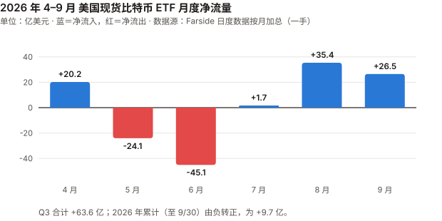
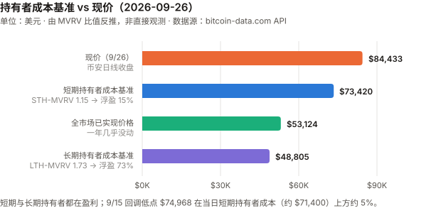
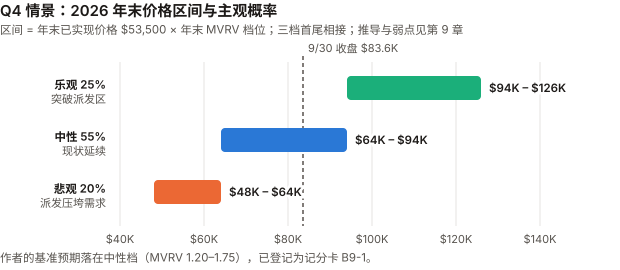

# BTC / Bitcoin 完整调研与分析报告

> **编写日期**：2026 年 10 月 3 日
> **数据截止**：2026 年 9 月 30 日（9 月与 Q3 完整数据已闭合）；10/1–10/2 的个别数据仅作参考
> **版本**：2026 年 9 月版 **兼 2026 年 Q3 季度报告**
> **研究方法**：基于 `anthropics/financial-services` 插件的行业概览（sector-overview）、投资论点追踪（thesis-tracker）、催化日历（catalyst-calendar）、竞争分析（competitive-analysis）四个框架。
>
> **本版更新要点**：
>
> 1. **9 月 +6.42%，Q3 +42.64%**——收于 $83,623.60（币安日线），Q3 是 2024 年 Q4 以来最好的季度，终结了连续三个季度的下跌。
> 2. **本季最重要的发现：BTC 在宏观收紧中上涨。** 9/16 美联储加息 25 基点（三年来首次），10 年期美债从 4.75% 升到 **5.29%（年内最高）**，美元指数走强、黄金跌 6.6%——**BTC 却涨了 6.4%**。
>    Q3 全季 10 年期收益率上行 85 基点，BTC 上涨 42.6%。
> 3. **因此撤回 8 月版的长期认知「BTC 最直接的定价锚是长端美债收益率」。** 过去 12 个月 BTC 日收益与 10 年期收益率日变化的相关系数是 **−0.04**；8 月 BTC +25% 那个月，10 年期收益率月度变化是 **0 基点**（见 3.1）。
> 4. **8 月版的三处数据错误**，本版更正：
>    ① 把 8/8 的 STH-MVRV 0.96、LTH-MVRV 1.32 写成「8 月底」——8/31 实际是 **1.12 / 1.61**，「短期持有者整体浮亏」的结论不成立；
>    ② 写 Strategy「8 月未买卖任何比特币」——8-K 显示它 **8/24–8/30 买入了 4,603 枚**；
>    ③ 8 月版自己表里的 845,050 > 840,447 本应暴露第 ② 条。
> 5. **CLARITY 法案 9/15 参议院程序性投票 49–50 失败**（需 60 票），2026 年通过的可能性基本消失。
> 6. **Strategy 9 月恢复买币（2,615 枚），同时回购自家 STRC 优先股 $6.41 亿**——按 9 月窗口是买币额的 2.9 倍，按 8/24–9/27 窗口是 1.09 倍；美元储备与现金合计一个月减少 $6.9 亿。
> 7. **ETF 9 月净流入 $26.5 亿，Q3 合计 $63.6 亿，2026 年累计由负转正（+$9.7 亿）**——本版起 ETF 流量改用 Farside 日度一手数据。
>
> **本版方法论改进**：
> ⑧ 价格改用币安日线（UTC 收盘），ETF 改用 Farside 日度表，链上指标改用 Coin Metrics 与 bitcoin-data.com 两家数据商的 API，宏观收益率改用美国财政部官方数据——**此前这四类全是搜索摘要**；
> ⑨ 情景推演新增 **Q4 价格区间**（比 2030 区间更可检验），三档按 MVRV 首尾相接，覆盖「现状延续」；
> ⑩ BTC 记分卡升级到本系列的 **11 条检验门槛**，按统一标准复核全表（累计正确率改为 **11%**），并补登作者的基准预期。
>
> **免责声明**：本报告不构成任何投资建议。所有分析仅供研究参考，投资决策请咨询专业顾问。

---

## 核心结论摘要（一页速览）

| 维度 | 核心判断 |
|------|----------|
| **BTC 是什么** | 数字黄金 + 去中心化结算网络 + 货币实验 + 宏观风险资产，四重属性并存 |
| **当前所处阶段** | 第四个减半周期第 29 个月。9/30 收于 **$83,623.60**，距 ATH $126,199.63（币安，2025-10-06 盘中）回撤 **33.7%** |
| **Q3 发生了什么** | **+42.64%**：7 月 +7.27%、8 月 +24.95%、9 月 +6.42%。同期出现的是 **ETF 资金回流（Q3 +$63.6 亿）与空头回补**，起点是深度低估区（6/30 MVRV 1.10）——**不是宏观放松**：同期美联储加息、10 年期收益率 +85 基点。这些是相关，**不是已证明的原因** |
| **9 月发生了什么** | 前半月下跌（9/15 低点 $74,968，当天 CLARITY 投票失败、ETF 流出 $4.5 亿），后半月反弹（9/18 +5.85%、9/21 +6.70%，9/21 ETF 单日流入 **$9.99 亿**，为 2025 年 10 月以来最大） |
| **最重要的认知变化** | **撤回 8 月版「BTC 定价锚是长端美债」**——它唯一的论据（8 月回购压低收益率）经不起端点检验（8 月 10 年期月度变化 0bp）。**但 Q3 的数据也无法证明利率不重要**：同期有更大的力量在起作用，日度上 7、9 月仍有约 −0.4 的相关 |
| **核心多头逻辑** | 绝对稀缺；ETF 在加息月仍净流入 $26.5 亿；Strategy 恢复买币且 mNAV（EV）回到 1.15；算力回升到峰值的 85% |
| **核心空头逻辑** | 价格已回到长期持有者的派发区（Glassnode 标注 $81K–$86K，转述）；CLARITY 年内无望；点阵图中位数指向年内再加息一次；10 年期 5.29%；**已实现价格一年没涨**（但见顶后一年横盘是历史常态，见 9.3） |
| **短期催化剂** | 10/27–28 FOMC；10/28 Strategy 股东特别会议（优先股改为每日派息）；12/8–9 FOMC（含点阵图） |
| **估值立场** | MVRV 1.56，处于 2022-10 以来的 **44% 分位**——不便宜也不贵。**作者的基准预期：Q4 末（12/25–12/31 七日均价）落在 $64K–$94K（MVRV 1.2–1.75），概率 55%**，已登记为记分卡 B9-1。**这组概率（20/55/25）几乎等于随机游走的机械基线**，作者的增量判断很小 |
| **风险等级** | 极高——建议作为资产组合中 1–5% 的「非对称回报」配置 |

---

## 1. BTC 的起源与历史背景

### 1.1 密码朋克的思想遗产（1980s–2007）

比特币不是凭空出现的，而是**密码朋克运动（Cypherpunk Movement，1980 年代末兴起的密码学家与自由意志主义者社群）** 数十年积累的产物。

| 年份 | 里程碑 | 对比特币的影响 |
|------|--------|---------------|
| **1982** | David Chaum 发表"盲签名"论文 | 匿名数字现金的概念奠基 |
| **1997** | Adam Back 发明 Hashcash（工作量证明） | 直接成为比特币的挖矿机制 |
| **1998** | Wei Dai 提出 b-money | 匿名分布式电子现金的蓝图 |
| **1998** | Nick Szabo 提出 Bit Gold | 比特币最直接的概念前身 |
| **2004** | Hal Finney 创建 RPoW（可复用工作量证明） | 首次实现可复用的 PoW 系统 |

这些探索都卡在同一个难题上：**如何在没有可信第三方的条件下解决双重支付（Double-Spending）**——即防止同一笔钱被花两次。

### 1.2 2008 年金融危机：催化剂

2008 年 9 月 15 日雷曼兄弟破产。10 月 31 日，化名 **Satoshi Nakamoto（中本聪）** 的匿名作者在密码学邮件列表发表了 9 页白皮书《Bitcoin: A Peer-to-Peer Electronic Cash System》。

### 1.3 比特币网络的诞生（2009）

- **1 月 3 日**：创世区块诞生，Coinbase 字段嵌入当日《泰晤士报》头条 "The Times 03/Jan/2009 Chancellor on brink of second bailout for banks"（财政大臣濒临对银行的第二轮救助）
- **1 月 12 日**：中本聪向 Hal Finney 发送 10 BTC——人类第一笔比特币交易

### 1.4 最初要解决的四个问题

1. **信任**：无需信任中介即可转移价值
2. **通胀**：央行可无限印钞 vs 比特币硬顶 2100 万枚
3. **审查**：任何人无需许可即可收发
4. **双重支付**：通过 PoW + 最长链共识首次在去中心化网络中解决

### 1.5 与传统货币、银行、黄金的关系

| 维度 | 法定货币（美元） | 黄金 | 比特币 |
|------|-----------------|------|--------|
| **发行机制** | 央行酌情印钞 | 开采（年增 1–2%） | 算法固定，每 4 年减半 |
| **总供应量** | 无限 | 有限但总量未知 | 硬顶 2100 万枚 |
| **保管** | 银行存款 | 实物 / ETF | 自托管 / 托管 |
| **转移** | 银行系统（慢、可审查） | 物理运输 | 互联网（快、无需许可） |
| **对手方风险** | 银行破产、政府违约 | 低 | 自托管时为 0 |
| **历史** | 50 余年（后布雷顿森林） | 5000 年 | 17 年 |

---

## 2. BTC 的发展阶段划分

### 阶段一：诞生与极早期实验（2008–2012）

| 时间 | 事件 |
|------|------|
| 2008.10.31 | 白皮书发布 |
| 2009.1.3 | 创世区块 |
| 2010.5.22 | "比特币披萨日"——1 万 BTC 换两块披萨 |
| 2010.8.15 | 1840 亿 BTC 溢出漏洞被利用并紧急修复（史上唯一一次重大协议事故） |
| 2010.12 | 中本聪最后一次公开留言后消失 |
| 2011.6 | 首次泡沫破裂：$30 → $0.01（Mt. Gox 被黑） |
| 2012.11.28 | 第一次减半：50 → 25 BTC |

### 阶段二：交易所、矿业与投机市场成形（2013–2016）

| 时间 | 事件 |
|------|------|
| 2013.4 | 塞浦路斯银行危机，BTC 一个月内 $30 → $260 |
| 2013.11 | 首破 $1,000 |
| 2014.2 | **Mt. Gox 倒闭**，85 万 BTC 失踪 |
| 2015.7 | Ethereum 主网上线 |
| 2016.7.9 | 第二次减半：25 → 12.5 BTC |

### 阶段三：牛熊周期与扩容内战（2017–2020）

| 时间 | 事件 |
|------|------|
| 2017 | ICO 泡沫，12 月见顶 $19,783 |
| 2017.8 | **Bitcoin Cash 硬分叉**；SegWit（隔离见证）激活 |
| 2017.12 | CME、Cboe 推出比特币期货 |
| 2018 | 加密寒冬，跌至 $3,200 |
| 2020.3.12 | "黑色星期四"，单日腰斩至 $3,800 |
| 2020.5.11 | 第三次减半：12.5 → 6.25 BTC |

### 阶段四：机构入场与 ETF 推进（2020–2024）

| 时间 | 事件 |
|------|------|
| 2020.8–12 | MicroStrategy（现 Strategy）大规模购入，**上市公司储备时代开端** |
| 2021.5 | 中国全面禁止挖矿，算力"大迁移" |
| 2021.11 | ATH $69,000 |
| 2022.11 | **FTX 崩溃**——行业的"雷曼时刻" |
| 2024.1.10 | **美国 SEC 批准 11 支现货比特币 ETF** |
| 2024.4.20 | 第四次减半：6.25 → 3.125 BTC |

### 阶段五：ETF 后周期、主权叙事与 AI 冲击（2024–至今）

| 时间 | 事件 |
|------|------|
| 2025.3 | 特朗普签署行政令建立美国战略比特币储备（SBR） |
| 2025.7 | GENIUS 法案（稳定币框架）签署；CLARITY 法案众议院通过 294–134 |
| 2025.10.6 | **ATH**（币安盘中 $126,199.63）——减半后 18 个月，符合历史节奏 |
| 2025.Q4–2026.Q2 | 连续三个季度下跌（−23.1% / −22.1% / −14.1%） |
| 2026.5 | Kevin Warsh 就任美联储主席（鹰派） |
| 2026.6 | ETF 单月流出 $45.1 亿（Farside），BTC 6/30 收于 $58,624.71 |
| 2026.7.29 | FOMC 维持 3.50–3.75%，三人主张加息 |
| 2026.8 | BTC +24.95%；ETF 净流入 $35.4 亿 |
| **2026.9.15** | **CLARITY 法案参议院程序性投票 49–50 失败**；BTC 当日 −3.25%，收于 $75,644 |
| **2026.9.16** | **FOMC 加息 25 基点至 3.75%–4.00%，12:0 全票**——2023 年 7 月以来首次加息 |
| **2026.9.21** | ETF 单日净流入 $9.99 亿，BTC 单日 +6.70%，盘中高点 $87,395.67 |
| **2026.Q3** | **+42.64%**，2024 年 Q4 以来最好的季度 |

---

## 3. BTC 当前现状分析

### 3.0 论点校验：8 月版哪里对了、哪里错了

> 逐条核对 8 月版登记在 `thesis_scorecard.md` 的 5 个论点。完整判定见记分卡。

| # | 8 月版论点 | 检验条件 | 9 月实际 | 判定 |
|---|---|---|---|---|
| 8-1 | 8 月涨势为流动性驱动，缺乏基本面地板 | 若 9 月在无宏观利好下继续上涨 >10%，则存疑 | 9 月在宏观利空下上涨 **6.42%**，同样伴随 ETF 流入与空头强平 | ⊘ **检验失效**：未触发证伪，价格也没跌到能检验「地板」的位置 |
| 8-2 | 9 月加息是首要风险 | 若 9 月 FOMC 未加息，则本条高估 | **加息兑现**；会后两周 BTC **+9.73%**（会前 8/31→9/15 为 −3.7%，可能部分提前定价） | ⚠️ **事件对，后果未兑现** |
| 8-3 | 「被迫卖出」不应作为基准情景 | 若 Strategy 在 Q4 前净减持 >2 万 BTC，则错 | Strategy **净买入**（8/24–9/27 共 7,218 枚） | ✅ |
| 8-4 | AI Agent 支付对 BTC 的利好被高估 | 年内出现比特币原生 Agent 支付规模化落地则错 | 未见 | ⏳ 年底核 |
| 8-5 | 算力下滑是趋势而非噪音 | 9–10 月算力回升至峰值 95% 以上则错 | 9/30 七日均值为峰值的 **85.1%**，较 8 月底回升 6 个百分点 | ⏳ 10 月核（方向已转为回升） |

**8-1 与 8-2 的共同问题**：两条的检验条件都没有测论点真正承重的前提——「宏观收紧 → BTC 下跌」。
8-1 只在「上涨超过 10%」时判错，9 月在利空下涨 6.42% 落在了检验盲区里（违反门槛 5）；8-2 只测了事件、没测价格后果（违反门槛 4）。
**BTC 记分卡在 8 月时还没有采用这些门槛，本版起补上**，并按统一标准复核了全表：6-1 改回待验、7-1 改判 ❌，**累计正确率由此变为 11%（1/9）**。

### 3.1 资产属性：「利率锚」的检验

8 月版的长期认知第 4 条写道：「**BTC 现在最直接的定价锚是长端美债收益率。** 8 月财政部回购压低 30 年期收益率 → BTC 涨 25%。」
本版用美国财政部的官方收益率与币安日线，做了一次能区分对错的检验：

| 区间 | BTC | 10 年期收益率变化 | 30 年期收益率变化 | 纳斯达克 | 黄金 |
|------|------|------|------|------|------|
| 8 月（7/31→8/31） | **+24.95%** | **+0bp**（4.75%→4.75%） | −2bp | +3.93% | +9.12% |
| 9 月（8/31→9/30） | **+6.42%** | **+54bp**（4.75%→5.29%） | +39bp | +1.86% | **−6.58%** |
| Q3（6/30→9/30） | **+42.64%** | **+85bp**（4.44%→5.29%） | +73bp | +2.47% | +3.67% |

| 日度统计（BTC 对数收益 vs 10 年期收益率日变化） | 相关系数 | 交易日 |
|------|------|------|
| 过去 12 个月（2025-10 至 2026-09） | **−0.04** | 248 |
| 7 月 | −0.40 | 21 |
| 8 月 | −0.09 | 20 |
| 9 月 | −0.39 | 20 |

> 口径：美国财政部每日收益率曲线（一手）；BTC 用币安 UTC 收盘，与美国收益率的取值时点不同步（相差约数小时，**未精确核实**）。
> **这种不同步对月度结论无影响，但会把日度相关系数压向零**——所以 12 个月的 −0.04 应读作「测不出稳定的线性关系」，而不是「没有关系」。

**能得出的结论**：

1. **在月度和季度尺度上，长端收益率没有表现出锚定作用。** 8 月 BTC +25% 时 10 年期收益率月度没动；Q3 收益率上行 85 基点，BTC 上涨 42.6%。
2. **在日度尺度上有影响，但不稳定。** 7 月、9 月日度相关约 −0.4（收益率上升的日子 BTC 偏弱），8 月几乎为零，12 个月合计接近零。
3. **8 月版那句话的错误在于把一个月内的叙事（「回购压低了收益率」）当成了月度因果**——而那个月的月末收益率与月初相同。

**本版撤回「定价锚」的说法**，但**不走到反面**：12 个月相关 −0.04 只否定了一个简单、稳定的线性关系；7 月与 9 月约 −0.4 的日度相关说明利率仍有影响，**只是在月度和季度上被其他因素盖过了**。
准确的表述是：**8 月版的因果说法没有得到数据支持；「利率无关」同样没有被证明。**
Q3 的方向由什么决定，本报告只能给出相关而非因果的描述——ETF 资金流与价格同向（Q3 +$63.6 亿），但 ETF 流量本身是同步指标（记分卡模式二），不能当作原因。

| 属性 | 本季证据 | 反证 |
|------|---------|------|
| **宏观流动性资产** | 日度上对收益率仍敏感（9 月相关 −0.39） | **季度上与收益率反向运动 42.6% vs +85bp** |
| **数字黄金** | 9 月黄金 −6.58% 时 BTC +6.42% | 两者 Q3 都涨，且 8 月黄金也涨了 9% |
| **高 beta 科技股** | 9 月对纳斯达克 beta 2.09、R² 0.51 | 8 月 R² 只有 0.003；12 个月 R² 0.24 |
| **商品** | CLARITY 拟归类为「数字商品」 | **法案 9/15 在参议院失败** |

> **按 XIN 期规则 beta 与 R² 一起报**：9 月 BTC 对纳斯达克的 beta 2.09、R² 0.51——一半的日波动可以用纳斯达克解释；
> 但 8 月 R² 只有 0.003。**单月的 beta 不稳定到不能当作资产属性。**

### 3.2 市场结构：ETF

> **本版起使用 Farside 的日度一手数据**（farside.co.uk，直接抓取并逐日加总）。8 月版用的 $35.2 亿来自媒体转述，Farside 口径为 $35.4 亿。

| 指标 | 数据 |
|------|------|
| **9 月净流入** | **+$26.48 亿**（21 个交易日中 13 日净流入） |
| 其中 IBIT / FBTC / GBTC | +$18.08 亿 / +$6.82 亿 / −$2.59 亿 |
| 最大单日 | **9/21 +$9.99 亿**（2025 年 10 月以来最大） |
| 最大流出日 | 9/15 −$4.50 亿、9/16 −$2.96 亿（CLARITY 失败与加息两日） |
| **Q3 合计** | **+$63.60 亿**（7 月 +$1.73 亿、8 月 +$35.39 亿、9 月 +$26.48 亿） |
| **2026 年累计（至 9/30）** | **+$9.70 亿**——年内首次由负转正 |
| 自上市累计净流入 | $575.6 亿 |
| 总资产规模 | 约 $1,084 亿（9/26，The Block 转述，**未取得一手**） |

**9 月最值得注意的不是流入总量，而是流入的时点**：9/15–9/16 两天（CLARITY 失败 + 加息）合计流出 $7.46 亿，
**之后 9/17–9/29 连续 9 个交易日净流入，合计 $30.75 亿。** 资金在两个利空落地后立刻回流。

可以有两种读法，**本报告无法区分**：
① 利空出尽（「卖预期、买事实」）；② 与利空无关的配置性资金在月中后段集中进场（例如季末调仓）。
两者都与「加息压制 BTC 需求」的 8 月版前提不符。

**市场参与者变化**（链上数据来自媒体转述 Glassnode / CryptoQuant，**未取得一手**）：

| 参与者 | 9 月行为 |
|--------|---------|
| **ETF** | 净流入 $26.5 亿，是边际买家 |
| **长期持有者（LTH）** | 约一个月内派发约 26 万枚后，9 月中旬净头寸转为中性（Glassnode 转述） |
| **交易所余额** | 9/17–9/23 净流出 12,153 枚（CryptoQuant 转述） |
| **上市公司** | Strategy 买入 2,615 枚；见第 4 章 |
| **衍生品** | 9/21 突破 $84K–$85K 时以空头强平为主；永续合约未平仓量接近 2025 年 10 月水平（转述） |

### 3.3 链上数据

> **本版起用两家数据商的 API**：Coin Metrics 社区版（MVRV、市值、供应、算力）与 bitcoin-data.com（MVRV、已实现价格、STH/LTH-MVRV、Z-Score；免费版延迟 7 天，最新为 9/26）。
> **两家各自计算 MVRV，相差约 1%**——它们读同一条链，所以这只是实现层面的一致，不是独立测量。

| 指标 | 6/30 | 8/31 | 9/26 | 9/30 | 来源 |
|------|------|------|------|------|------|
| **MVRV** | 1.10 | 1.48 | 1.58 | **1.56** | Coin Metrics |
| MVRV（对照） | 1.11 | 1.49 | 1.59 | — | bitcoin-data |
| **已实现价格** | $53,070 | $53,076 | $53,536 | **$53,612** | Coin Metrics 推算（市值 ÷ MVRV ÷ 供应） |
| **STH-MVRV** | 0.84 | **1.12** | **1.15** | — | bitcoin-data |
| **LTH-MVRV** | 1.19 | **1.61** | **1.73** | — | bitcoin-data |
| **MVRV Z-Score** | 0.25 | 0.85 | **1.02** | — | bitcoin-data |

> ⚠️ **8 月版的更正**：8 月版把 STH-MVRV **0.96**、LTH-MVRV **1.32** 标为「8 月底」。bitcoin-data 的序列显示这是 **8/8** 的读数，8/31 实际为 **1.12 / 1.61**。
> 因此 8 月版「短期持有者整体浮亏」「STH 成本 $81,821」都不成立——**8/31 时短期持有者整体浮盈约 12%**，成本约 $70,200。

**三个读数，按重要性排**：

1. **MVRV 1.56 处于 2022-10 以来日度序列的 44% 分位**（1,455 天；中位数 1.75；最低 0.76，2022-11；最高 2.78，2024-03）。**不是低估区，也不是过热区。** 6/30 的 1.10 才是低估区。**注意这不是 Q3 上涨的原因**：已实现价格几乎不动时，价格上涨与 MVRV 上升是同一件事的两种说法。
2. **已实现价格一年几乎没动**：2025-09-30 $53,943 → 2026-09-26 $53,124（bitcoin-data），**−1.5%**。
   全市场的平均持币成本停滞了一年。**但这在见顶后一年是常态**（2017 周期 +1.7%、2021 周期 −12.2%），不能据此削弱 8 月版的长期假设，见 9.3。
3. **STH-MVRV 1.15**：短期持有者平均浮盈 15%，成本基准约 **$73,400**（9/26 价格 ÷ 1.15）。9/15 回调低点 $74,968 在当日短期持有者成本（约 $71,400，按当日 STH-MVRV 1.06 反推）上方约 5%——**回调没有触及这条线**。

> 上图的成本基准由 MVRV 比值反推（现价 ÷ MVRV），**不是链上直接观测值**；STH/LTH 是按币龄（155 天）划分的群组估算成本，**不是真实持仓成本，也不是止损线**。具体数值（均为 9/26）：
> 现价 **$84,433**；短期持有者成本 **$73,420**（÷1.15）；全市场已实现价格 **$53,124**；长期持有者成本 **$48,805**（÷1.73）。

### 3.4 宏观环境

| 因素 | 8/31 | 9/30 | 来源 |
|------|------|------|------|
| **联邦基金利率** | 3.50–3.75% | **3.75–4.00%**（9/16 加息 25bp，12:0） | federalreserve.gov ✅ |
| 2 年期美债 | 4.34% | **4.88%** | 美国财政部 ✅ |
| **10 年期美债** | 4.75% | **5.29%**（2026 年最高） | 美国财政部 ✅ |
| 30 年期美债 | 5.25% | **5.64%**（2026 年最高） | 美国财政部 ✅ |
| 美元指数 DXY | 99.43 | **101.45** | Yahoo Finance |
| 黄金（期货） | $4,481.5 | **$4,186.7**（−6.58%） | Yahoo Finance |
| WTI 原油 | $85.76 | **$90.42** | Yahoo Finance；布伦特 9/14 一度接近 $110（Motley Fool 转述） |
| 标普 500 | 7,686 | 7,652（−0.45%） | Yahoo Finance |
| 8 月 CPI（9/11 公布） | — | 同比 **3.4%**，环比 0.4% | CNBC / Morningstar 转述，**未打开 bls.gov 原文** |

**9/16 FOMC 声明原文**（federalreserve.gov，一手）：「通胀仍然偏高（Inflation remains elevated）。今天的政策行动将支持更及时地回到委员会 2% 的目标。**委员会将实现价格稳定**（The Committee will deliver price stability）。」

**9 月经济预测摘要**（SEP，federalreserve.gov，一手）：

| 中位数 | 2026 | 2027 | 2028 | 长期 |
|------|------|------|------|------|
| 联邦基金利率（年末） | **4.1%**（6 月预测 3.8%） | 4.1% | 3.9% | 3.2% |
| PCE 通胀 | 3.7% | 2.3% | 2.1% | 2.0% |
| 核心 PCE | 3.4% | 2.5% | 2.2% | — |
| 失业率 | 4.1% | 4.1% | 4.1% | 4.2% |

**2026 年末利率中位数 4.1%（即区间中点 4.125%）比当前中点 3.875% 高 25 基点——中位数委员认为年内还要再加一次。**
剩下两次会议：10/27–28、12/8–9。

> **宏观对 BTC 的读法要和 3.1 一起看**：这些读数全部偏鹰，而 BTC 9 月上涨。
> **本报告不再把「宏观偏鹰」直接翻译成「BTC 偏空」**——Q3 的数据不支持这个翻译。

### 3.5 技术与生态

**算力：从熊市中回升**

| 指标 | 数据 | 来源 |
|------|------|------|
| 7 日均算力（9/30） | **979.5 EH/s**，为峰值的 **85.1%** | Coin Metrics |
| 历史峰值（7 日均） | 1,151.5 EH/s（2025-10-18） | Coin Metrics |
| 8 月底 7 日均 | 922.9 EH/s（峰值的 80.2%） | Coin Metrics |
| 难度 | **132.76T**（9/19 上调 4.16%） | mempool.space ✅ |
| 近 30 天手续费占矿工收入 | **0.65%**（88.1 BTC / 13,588 BTC） | mempool.space ✅ |

> 8 月版写「约 932 EH/s，较峰值 −17%（推算峰值约 1,120）」，来自媒体。按 Coin Metrics 的 7 日均口径，8 月底是峰值的 80.2%（−19.8%）。
> **两者口径不同，本版起统一用 Coin Metrics 7 日均。**

**手续费占矿工收入只有 0.65%**——矿工收入的 99% 以上来自区块补贴。这是 BTC 长期安全预算问题的当前读数：
每次减半补贴减半，而手续费目前不足以补位。**这不是本月新出现的问题，但本版第一次用一手数据量化它。**

**量子抗性：BIP-360（P2MR）仍在修订**

GitHub `bitcoin/bips` 仓库显示，BIP-360 的修订 PR 在 9/21 仍在合并（#2273，限定 Merkle 深度并替换参考实现中的断言）。
**它是一份进入 BIPs 仓库的草案，不是已激活的软分叉。** 媒体称约 651 万枚 BTC 位于对量子攻击脆弱的地址（转述，未核实）。

**AI Agent 支付**：9 月未见比特币原生 Agent 支付的规模化落地新证据，维持 8 月版判断（见 5.2）。

---

## 3.6 Q3 季度回顾（本版新增）

### 季度表现

| | Q4 2025 | Q1 2026 | Q2 2026 | **Q3 2026** |
|------|------|------|------|------|
| BTC 季度涨跌 | −23.1% | −22.1% | −14.1% | **+42.6%** |
| ETF 季度净流量（Farside） | −$11.3 亿 | −$5.0 亿 | −$48.9 亿 | **+$63.6 亿** |
| 季末 MVRV（Coin Metrics） | — | — | 1.10 | **1.56** |
| 季末 10 年期美债 | — | — | 4.44% | **5.29%** |
| 季末联邦基金利率上限 | — | — | 3.75% | **4.00%** |

> 季度涨跌按币安月线开盘/收盘计算；ETF 季度净流量为 Farside 日度数据按月加总后合并。

**Q3 是 2024 年 Q4（+47.8%）以来最好的季度**，终结了连续三个季度的下跌。季内高点 $87,395.67（9/21），低点 $57,800.19（7/1）。

### Q3 的三段

| 阶段 | 时间 | 价格 | 特征 |
|------|------|------|------|
| 底部 | 7/1–7/31 | $58.6K → $62.9K（+7.3%） | MVRV 1.10–1.20，深度低估区；ETF 基本持平（+$1.7 亿）；FOMC 三票主张加息 |
| 修复 | 8/1–8/31 | $62.9K → $78.6K（+25.0%） | ETF +$35.4 亿；空头强平；Strategy 8 月下旬买入 4,603 枚 |
| 拉锯 | 9/1–9/30 | $78.6K → $83.6K（+6.4%） | 加息 + CLARITY 失败 + 收益率新高，前半月跌至 $75K，后半月反弹至 $87K |

### Q3 对本系列判断的检验

**Q2 末（7 月版）的三情景是：乐观 15–20% / 中性 55–60% / 悲观 25–30%，中性区间预判 2026 下半年 $58K–$72K。**
**Q3 末 $83,624 高于中性区间上沿 16%，落在 7 月版的乐观情景里。**

| 7 月版的判断 | Q3 结果 |
|------|------|
| 「宏观为 2022 年以来最不利」 | 宏观确实继续收紧（加息兑现、收益率新高）——**但 BTC 涨了 42.6%** |
| 「ETF 持续失血」 | Q3 净流入 $63.6 亿 |
| 「被迫卖出螺旋已启动」 | Strategy Q3 净买入 |
| 「CLARITY 可能推迟到 2027」 | **9/15 参议院失败，事实上兑现了**——7 月版这条在 8 月被判错，现在看是时点错、方向对 |

**一个季度的结论**：本系列在 Q2 末对 Q3 的判断整体偏空且错了，错的根源不是数据，而是**把「宏观收紧」当成了 BTC 下跌的充分条件**。
Q3 的宏观比 Q2 末预期的还要紧，BTC 却走出了两年来最好的一个季度之一。

---

## 4. 上市公司比特币储备

### 4.1 整体规模

| 口径 | 数据 | 来源 |
|------|------|------|
| 上市公司合计持仓 | **1,275,684 BTC**（$1,079.5 亿，197 家） | bitcointreasuries.net（10/3 抓取，价格 $84,623） |
| Strategy 持仓 | **847,666 BTC**（9/27），占总供应约 4.04% | SEC 8-K ✅ |
| Strategy 总成本 / 均价 | $639.5 亿 / **$75,437** | SEC 8-K ✅ |

### 4.2 Strategy：恢复买币，同时大额回购自家优先股

**全部来自 Strategy 向 SEC 提交的每周 8-K（一手）：**

| 期间 | 买入 BTC | 均价 | 资金来源 | 回购 STRC 优先股 |
|------|------|------|------|------|
| 8/24–8/30 | **4,603** | $80,318 | MSTR 普通股 ATM | — |
| 8/31–9/7 | 0 | — | — | $1.763 亿 |
| 9/8–9/13 | 0 | — | — | $1.393 亿 |
| 9/14–9/20 | **950** | $79,670 | USD Cash（美元现金） | $1.740 亿 |
| 9/21–9/27 | **1,665** | $85,681 | MSTR 普通股 ATM | $1.517 亿 |
| **9 月合计（8/31–9/27）** | **2,615 枚，约 $2.18 亿** | | | **$6.413 亿** |

| 美元储备 | 8/30 | 9/13 | 9/20 | 9/27 |
|------|------|------|------|------|
| USD Reserve（用于优先股股息与债息） | $51.0 亿 | $51.0 亿 | $50.4 亿 | **$50.2 亿** |
| USD Cash（一般用途） | $16.1 亿 | $13.0 亿 | $10.5 亿 | **$10.0 亿** |
| **合计** | **$67.1 亿** | $64.0 亿 | $60.9 亿 | **$60.2 亿** |

> ⚠️ **8 月版的更正**：8 月版 4.2 写 Strategy「8 月未买卖任何比特币」。8-K 显示它 **8/24–8/30 用 ATM 募资买入了 4,603 枚**。
> 8 月版同一节写的「9 月初持仓 845,050，**高于** 8/16 的 840,447」恰好就是这 4,603 枚——**报告自己的表已经包含了反证。**

**这张表说明了什么**：

1. **9 月（8/31–9/27）Strategy 回购 STRC 的钱是买币的 2.9 倍；但把窗口放到 8/24–9/27（与记分卡 8-3 相同），买币 $5.88 亿、回购 $6.41 亿，只有 1.09 倍。** 这个比值对窗口很敏感。 STRC 股息率维持在 12%，公司声明「在 STRC 持续健康地交易在 $100 附近之前」维持这个利率——
   **这意味着 STRC 目前交易在面值以下**（推断，本报告未取得 STRC 行情）。在面值以下回购 12% 股息的优先股，**既可以读作托底，也可以读作退掉高成本资金**。
2. **USD Cash 一个月从 $16.1 亿降到 $10.0 亿。** 但不能机械外推成「几周后耗尽」：回购是可随时调整的主动决策，而且 9/21–9/27 那周的 $1.517 亿回购里**只有 $4,810 万来自 USD Cash，$1.035 亿来自卖 MSTR 普通股**——公司已经在用发股而不是现金托底。
3. **数字信用证券回购授权从 $10 亿提高到 $20 亿**（9/8 8-K），9/27 剩余 $7.235 亿。
4. **10/28 股东特别会议**表决把四种优先股改为**每日派息**（9/24 8-K）——意在提高优先股对收益型投资者的吸引力。

**判断**：Strategy 的融资飞轮没有断；9 月的资金**主要流向了回购优先股而不是买币**。这是一个月的数据——**它是资本配置的主动选择还是承压信号，本报告无法区分**，列为监控项。
它 9 月买币 2,615 枚，按 8 月版的语言是「恢复增持」，**但规模只有 2024–2025 年单周常见买入量的零头**（本句为定性比较，未逐周核对历史数据）。

### 4.3 mNAV：三个口径都修复了

| 口径 | 8 月版（8/31–9/3） | **本版（10/3，BTC $84,623）** |
|------|------|------|
| 企业价值基准（EV） | 1.00× | **1.15×** |
| 基本（市值 / BTC NAV） | 0.72× | **0.94×** |
| 摊薄 | 0.73× | **0.96×** |

> 来源：bitcointreasuries.net（两次均直接抓取）。MSTR 股价 9 月 +15.2%（$132.94 → $153.09，Yahoo Finance），高于 BTC 的 +6.4%。

**普通股折价从 28% 收窄到 6%**。这让卖普通股募资重新变得不那么稀释——也解释了为什么 9 月下旬 Strategy 重新用 ATM 买币。

### 4.4 其他头部公司

| 排名 | 公司 | 持有 BTC | mNAV | 来源 |
|------|------|------|------|------|
| 2 | Twenty One Capital（XXI） | 43,514 | 0.72× | bitcointreasuries.net |
| 3 | Metaplanet（3350.T） | 43,000 | 0.78× | 同上；9/30 董事会为争议性的第 10 期认股权证辩护（新闻标题） |
| 4 | MARA Holdings | 35,577 | — | 同上 |
| 5 | Strive（ASST） | 27,462 | 1.64× | 同上 |

**除 Strategy 与 Strive 外，头部储备公司的 mNAV 仍低于 1**——它们发股买币会稀释股东，增持能力受限。

---

## 5. AI 科技对 BTC 的多维影响

### 5.1 矿业迁移：算力回升，但产业转向没有停

| 指标 | 数据 | 来源 |
|------|------|------|
| 算力 | 7 日均 979.5 EH/s，峰值的 85.1%（8 月底 80.2%） | Coin Metrics |
| 上市矿企已披露 AI/HPC 合同 | 超过 $700 亿（9 月初） | 媒体转述 |
| JPMorgan 估算的挖矿成本 | 约 **$84,948**（9/23 报告） | The Block 转述 |

**JPMorgan 9/23 的报告把挖矿成本称为「软地板」**：BTC 在成本以下待了约 280 天，矿工被迫卖币或转产 AI；
9 月下旬价格回到成本附近（$85,795 vs $84,948），卖压可能缓解。**这是一个机构给出的、可检验的价格锚**——但本报告未取得原报告。

**9 月算力回升 6 个百分点**与价格回升同步，**不足以说明矿工回流**：难度调整与币价回升本身就会让边际矿机重新开机。
8 月版 8-5「算力下滑是趋势」的检验窗口到 10 月底。

### 5.2 AI Agent 支付：维持下调

9 月没有新证据。维持 8 月版判断：方向成立、兑现遥远，主导协议 x402 结算的是稳定币而非比特币。

### 5.3 AI 影响汇总

| 维度 | 方向 | 强度 | 相比 8 月版 |
|------|------|------|-----------|
| 矿业转 AI / 算力 | 负 | ★★★☆☆ | **↓ 下调**（算力回升至峰值 85%） |
| AI Agent 支付 | 正 | ★★☆☆☆ | 不变 |
| 能源竞争 | 负 | ★★★☆☆ | 不变 |
| 加速量子威胁 | 负（尾部） | ★★★☆☆ | 不变（BIP-360 仍为草案） |
| AI 诈骗 | 负（用户层） | ★★★☆☆ | 不变 |

---

## 6. BTC 的核心价值逻辑

### 6.1 多头逻辑

| # | 逻辑 | 强度 | 说明 |
|---|------|------|------|
| 1 | **绝对稀缺** | ★★★★★ | 2100 万硬顶，年通胀约 0.85%，低于黄金 |
| 2 | **在宏观收紧中录得两年来最好的季度之一** | ★★☆☆☆ | **本月新增**。加息 + 收益率新高 + CLARITY 失败，Q3 仍 +42.6%。**与空头 4、5 同源——同一个「BTC 对紧缩有韧性」的推断已在那里通过降星计入**，这里只给两星，避免重复计分；且这是一次观测（10.4） |
| 3 | **ETF 在利空落地后立刻回流** | ★★★★☆ | 9/15–16 流出 $7.5 亿后，连续 9 日流入 $30.8 亿；2026 年累计转正（Farside 一手） |
| 4 | **储备公司 mNAV 修复，Strategy 恢复买币** | ★★★☆☆ | EV mNAV 1.15、基本 0.94；**但 9 月买币规模小，回购优先股的钱是买币的 2.9 倍（8/24 起算为 1.09 倍）**（见空头 6） |
| 5 | **去中心化与抗审查** | ★★★★☆ | 17 年不间断运行 |
| 6 | **网络效应** | ★★★★★ | 最大、最安全的区块链，品牌不可复制 |
| 7 | **对抗法币贬值** | ★★★★☆ | 全球债务不可持续；JPMorgan 9/17 报告称「贬值交易」在 7 月 FOMC 后回归（转述） |
| 8 | **算力回升** | ★★☆☆☆ | **本月新增**。峰值的 85%，但与币价同步，不足以说明矿工回流 |

### 6.2 空头逻辑

| # | 逻辑 | 强度 | 说明 |
|---|------|------|------|
| 1 | **价格进入长期持有者的派发区** | ★★★★☆ | Glassnode 标注 $81K–$86K 为 LTH 供应密集区（转述）；8 月中至 9 月中 LTH 派发约 26 万枚（转述）。**链上来源均为二手**，故不给五星 |
| 2 | **已实现价格一年没涨** | ★★☆☆☆ | **本月新增**。−0.6%（Coin Metrics）。全市场平均持币成本没有抬升。**但见顶后一年横盘是历史常态**（见 9.3），对长期假设判别力很弱，故两星 |
| 3 | **CLARITY 年内无望** | ★★★★☆ | **本月升级**。9/15 程序性投票 49–50 失败（多源转述；senate.gov 返回 403 未能核实原文） |
| 4 | **年内大概率再加息一次** | ★★★☆☆ | **本月降级**（从 ★★★★★）。点阵图中位数指向年末 4.125%；但 9 月的加息并未压制 BTC（见 3.1），这条的后果量级要下调 |
| 5 | **长端收益率 5.29%** | ★★★☆☆ | **本月降级**（从 ★★★★☆）。无风险收益率创年内新高，对零息资产不利；但 Q3 的数据显示它不是季度方向锚 |
| 6 | **Strategy 的资金更多流向回购优先股而非买币** | ★★☆☆☆ | **本月新增**。9 月回购 STRC $6.41 亿、买币 $2.18 亿；USD Cash $16.1 亿 → $10.0 亿。**可能是理性的资本配置**（退掉 12% 股息的高成本资金），只有一个月数据，故两星 |
| 7 | **手续费只占矿工收入 0.65%** | ★★☆☆☆ | **本月新增**。长期安全预算问题，与本季价格无关 |
| 8 | **高波动** | ★★★☆☆ | 9 月年化波动 41.2%（币安日线）；对纳斯达克 beta 2.09 |

> **多空同源检查（DOT 期规则）**：多头 2「宏观收紧中仍上涨」与空头 4/5「加息 / 收益率新高」是**同一组事实的两面**——
> 本版据此把空头 4、5 各降一星：**一个已经发生、且没有造成预期后果的利空，不能按前瞻风险的满额计分。**
> 多头 4 与空头 6 同样同源（都是 Strategy 9 月的资金动作），**本版把多头 4 控制在三星、空头 6 控制在两星**。

### 6.3 机构观点分布

> 前几版的数据高度依赖加密原生媒体，这类媒体**在结构上是看多的**。本节固定纳入传统金融机构的判断作为配平。
> **本月所有机构观点均经媒体转述，本报告未取得任何一份原报告。**

| 机构 | 9 月立场 / 动作 | 关键论据 |
|------|-----------|---------|
| **JPMorgan**（Panigirtzoglou 团队） | 对 2026 年加密市场「保持正面」 | 9/23：挖矿成本约 $84,948 是「软地板」；9/17：IBIT 的做空与对冲仓位接近年内高点，说明投资者对 BTC 仍比对黄金谨慎——**若对冲减少，BTC 可能获得更多支撑** |
| **Deutsche Bank** | **动作而非观点**：9/16 宣布 2026 年底前为欧洲机构客户提供 BTC、ETH 与稳定币托管（尚需监管审查） | 8 月版引用其「2026 年加息两次」的宏观预期——**9 月已兑现第一次** |
| **Standard Chartered** | 年末目标 $100,000（2026 年内第二次下调后） | 转述，下调日期为 2 月 |
| **Citi** | 年末目标 $143,000 | 搜索摘要，**日期未核实** |
| **Morgan Stanley / Bernstein** | 本月未找到新观点 | — |

**配平说明**：四条里**只有 JPMorgan 是 9 月的观点**，Deutsche Bank 是动作而非观点，Standard Chartered 的下调在 2 月、Citi 日期未核实——**这组样本不足以判断机构观点的重心是否相对 8 月移动**，本报告不下这个结论。
但要注意两点：① JPMorgan 的「软地板」是一个**有条件的**支撑（以挖矿成本为锚，而该成本会随难度上升而上升）；
② Standard Chartered 的 $100,000 年末目标意味着 Q4 要再涨约 20%，**它在 2026 年已下调过两次**。

---

## 7. BTC 与其他资产的比较

### 7.1 横向对比

> 口径：统一按月末收盘（8/31→9/30、6/30→9/30）。BTC 用币安日线；其余用 Yahoo Finance 日收盘；收益率用美国财政部数据。

| 资产 | 9 月 | Q3 | 年化波动（9 月） | 主要风险 |
|------|------|------|------|---------|
| **BTC** | **+6.42%** | **+42.64%** | 41.2% | 派发压力、监管停滞 |
| **黄金（期货）** | −6.58% | +3.67% | — | 实际利率上行 |
| **标普 500** | −0.45% | +2.03% | — | 估值、利率 |
| **纳斯达克** | +1.86% | +2.47% | — | 估值、利率 |
| **美元指数** | +2.03% | +0.26% | — | — |
| **10 年期美债** | 收益率 +54bp（价格下跌） | 收益率 +85bp | — | 通胀、供给 |
| **WTI 原油** | +5.43% | +30.10% | — | 地缘冲突 |

### 7.2 BTC vs 黄金

**9 月出现了本系列观察以来最清楚的一次分化：黄金 −6.58%、BTC +6.42%。**
8 月版写过「BTC 的利率敏感度远大于黄金」——**9 月的观测与这句话不符**：收益率上行 54 基点时，下跌的是黄金。但单月涨跌不能度量敏感度，黄金同月下跌还有美元走强这个共同原因，**一个月不足以更正它**。

**但不能据此说 BTC 重获「数字黄金」地位**：同一个季度里两者都涨（BTC +42.6%、黄金 +3.7%），8 月黄金也涨了 9%。
**一个月的反向运动是一次观测，不是一个属性。**

### 7.3 资产组合建议

| 投资者类型 | 建议配置 | 理由 |
|-----------|---------|------|
| **保守型** | 0–1% | 波动仍然过大 |
| **平衡型** | 1–3% | 法币体系尾部对冲 |
| **成长型** | 3–5% | 非对称回报 |
| **激进型** | ≤10% | 需要严格纪律 |

---

## 8. BTC 未来 1–5 年的关键变量（催化剂日历）

| 时间 | 催化剂 | 影响 | 方向 | 置信度 |
|------|--------|------|------|--------|
| **2026.10.27–28** | **FOMC**（无点阵图） | 点阵图中位数指向年内再加一次；10 月或 12 月 | ↓（但见 3.1：后果量级不确定） | 高（日程已定） |
| **2026.10.28** | **Strategy 股东特别会议**：优先股改为每日派息 | 若通过，STRC 首次每日派息在 11/2；影响 STRC 对收益型投资者的吸引力，从而影响公司继续回购它的必要性 | ↑/↓ | 高（日程已定） |
| **持续** | **Strategy 的回购资金来源**（9/27 USD Cash $10.0 亿） | 回购继续时，资金来自 USD Cash 还是卖 MSTR 普通股；后者在 mNAV 回落时会更稀释 | 关键变量 | 高（每周 8-K 可观测） |
| **持续** | **$81K–$86K 的 LTH 派发区能否被消化** | 9/21 一度突破至 $87.4K，月末回到 $83.6K | 关键变量 | 中（链上数据为二手） |
| **2026.12.8–9** | **FOMC + 点阵图** | 年末利率与 2027 年路径 | 关键变量 | 高 |
| **2026 年底** | Deutsche Bank 托管上线 | 欧洲机构通道 | ↑ | 中（需监管审查） |
| **2027** | CLARITY 是否在新一届国会重启 | 9/15 失败后需重新走程序 | ↑ | 低 |
| **2028** | 第五次减半 | 补贴再减半，而手续费只占矿工收入 0.65% | ↑（供给）/ ↓（安全预算） | 低 |
| **2028–2033** | 量子威胁时间窗 | BIP-360 仍为草案 | ↓ | 中 |

---

## 9. BTC 未来的情景推演

### 9.1 本版的两个改动

1. **新增 Q4 末（2026-12-31）的价格区间**。2030 年的区间无法在可见的时间内被检验；Q4 的区间三个月后就能对账。
2. **三档按 MVRV 首尾相接，覆盖全部取值**（PONS 期规则）——上一版的三档在 2026 Q4 上有重叠（中性 $65K–$85K 与悲观 $50K–$68K），且没有明说「现状延续」属于哪一档。

### 9.2 Q4 情景：推导方式

**价格 = 年末已实现价格 × 年末 MVRV。**

> ⚠️ **这不是一个预测模型**（Codex 审查指出）：MVRV 本来就是市值 ÷ 已实现市值，这个公式只是把价格区间翻译成 MVRV 区间，**方便和历史分布对照**。
> 它不产生方向判断；**下面的概率是作者的判断**，依据是每一档需要什么条件，而不是这个公式。

- **年末已实现价格取 $53,500**：过去 12 个月已实现价格在 $52,644–$56,463 之间横盘（Coin Metrics 推算），9/30 为 $53,612。**这是本推导里最稳的一个输入。**
- **MVRV 分三档，以 2022-10 至今 1,455 个交易日的分布定标**（10% 分位 1.16、25% 分位 1.33、中位数 1.75、75% 分位 2.16、最高 2.78）：

| 情景 | 年末 MVRV | 依据 | **推出价格** | 主观概率 |
|------|:---:|------|------|------|
| **悲观：派发压垮需求** | 0.90–1.20 | 回到 2026 年 6 月（1.10）附近；下沿 0.90 接近 2022 年熊市底部（0.76）之上 | **$48K–$64K** | **20%** |
| **中性：现状延续 / 区间震荡** | 1.20–1.75 | 覆盖当前 1.56；上沿 1.75 是 2022-10 以来的中位数 | **$64K–$94K** | **55%** |
| **乐观：突破派发区** | 1.75–2.35 | 2025 年 MVRV 在 1.53–2.52 之间；上沿对应约 ATH | **$94K–$126K** | **25%** |

**三档首尾相接，覆盖 MVRV 0.90–2.35**；低于 0.90 或高于 2.35 的尾部并入相邻档。现价 $83,624（MVRV 1.56）落在中性档内。

**先给一个机械基线**（_bian 审查后新增）：假设价格是无漂移的随机游走、年化波动 41%–60%（9 月实测 41.2%，过去一年 45.0%），从 9/30 的 $83,624 出发 92 天，三档的机械概率是：

| | 悲观（< $64K） | 中性（$64K–$94K） | 乐观（> $94K） |
|------|------|------|------|
| 机械基线（波动 41% / 45% / 60%） | 11.6% / 14.2% / 23.0% | 63.3% / 59.4% / 47.5% | 25.1% / 26.4% / 29.5% |
| **本版主观概率** | **20%** | **55%** | **25%** |

**本版的概率与机械基线几乎重合**——作者在基线之上的主观调整很小，**方向上略偏空**（悲观 20% 高于 41%–45% 波动下的 12%–14%）。
**这意味着「作者的基准预期在中性档」在信息量上接近「价格大致随机游走」。** 本报告不假装它比这更多。

**每一档需要什么条件**（概率已在记分卡下注——见 B9-1）：

- **中性 55%**：不需要任何新事件。价格在 LTH 派发区与短期持有者估算成本（约 $73K）之间来回，ETF 流量正负摆动。**作者的基准预期在这一档。**
- **乐观 25%**：需要 MVRV 越过 2022-10 以来的中位数 1.75，即 ETF 延续 9 月下旬的流入速度、LTH 派发结束（9 月中旬已有转为中性的迹象，转述）。
- **悲观 20%**：需要 ETF 持续流出、价格跌破短期持有者的估算成本（约 $73K）。**作者把它放在基线之上**，理由是价格正处在 LTH 派发区（转述）、CLARITY 年内无望、点阵图指向再加息一次。

> **相比 8 月版的调整说明**：悲观 28% → 20%，乐观 20% → 25%，中性 52% → 55%。**这个变化主要是机械的，不是证据更新**：
>
> 1. **机械部分**：现价从 $78.6K 升到 $83.6K、悲观上沿从 $68K 降到 $64K、期限从约 4 个月缩到 3 个月。按同一基线，8 月版的「悲观 < $68K」约为 31%–40%，本版的「悲观 < $64K」约为 12%–23%——**单是机械变化就足以让悲观档下降 12–17 个百分点，比本版实际下调的 8 个百分点还多。**
> 2. **两版不能逐档相减**：8 月版的三档在 2026 Q4 上有重叠（中性 $65K–$85K 与悲观 $50K–$68K），本来就不是一组互斥事件的概率。
> 3. **8 月版悲观情景的五个触发条件里，约四条在 9 月已发生或部分发生**（加息并释放继续紧缩信号、油价一度逼近 $110、CLARITY 失败、LTH 派发），**价格却上涨了**。这说明 8 月版的情景映射本身错了，不只是「一个利空没起作用」。
>
> **初稿写的是「把一个被证伪的利空从悲观权重里拿掉」——这是错的**：加息只是一次没有产生预期后果的观测（见 10.4），它仍在空头表里（空头 4），记分卡也仍在押下一次加息（B9-2）。

### 9.3 长期情景（2030）：区间保留，但「已实现价格一年没涨」不能用来削弱它

8 月版的 2030 区间（乐观 $250K–$450K / 中性 $140K–$230K / 悲观 $40K–$90K）建立在**「已实现价格每年抬升 15%–25%」**这个假设上。过去 12 个月的实测是 −0.6%（Coin Metrics，9/30 对 9/30）。

**初稿据此写「核心假设被削弱」。补做历史对照后，这个推理不成立**（Coin Metrics 推算，一手 API）：

| 周期 | 见顶日 | 见顶后 12 个月已实现价格 | 同期价格 |
|------|------|------|------|
| 2017 周期 | 2017-12-17 | **+1.7%**（$4,527 → $4,606） | −81.8% |
| 2021 周期 | 2021-11-10 | **−12.2%**（$23,798 → $20,885） | −72.9% |
| **本轮** | 2025-10-06 | **−1.7%**（$54,577 → $53,637，至 10/1） | −32.1% |
| 顶到顶年化增速 | 2017-12 → 2021-11 | **53.0%/年** | |
| | 2021-11 → 2025-10 | **23.7%/年** | |

**见顶后一年已实现价格横盘或下跌是历史常态**，而前两个周期的顶到顶年化增速（53%、24%）正是包含了这样的熊市年份算出来的。
**所以「本轮一年没涨」对「15%–25% 的周期均值假设」几乎没有判别力**（ZEC 期规则：在两个假设下都会出现的证据，不能用来表态）。

**能说的只是**：顶到顶增速从 53% 降到 24%，**在递减**；8 月版的 15%–25% 已经低于上一个周期，**与这个递减趋势一致**。

### 9.4 敏感性：已实现价格增速决定 2030 中性区间的一切

按 TRX 期规则，把最主观的输入推到它合理区间的两端（中性情景 MVRV 固定为 1.5–1.8，起点为 9/30 的 $53,500，到 2030 年底约 4.25 年）：

| 已实现价格年化增速 | 2030 年末已实现价格 | **2030 中性区间** |
|------|------|------|
| 0%（把一个熊市年份外推 4.25 年——基本等于假设价格四年不动） | $53,500 | $80K–$96K |
| 10% | $80,200 | $120K–$144K |
| 20%（8 月版假设的中段） | $116,100 | $174K–$209K |
| 23.7%（上一个周期的顶到顶增速） | $132,100 | $198K–$238K |

**同一个 MVRV、只改增速假设，2030 中性区间从 $80K 移到 $238K。** 8 月版的 $140K–$230K 对应约 15%–25% 的增速。

> ⚠️ 按 TRX 期教训：这张表的摆幅反映的是作者给增速选的区间宽度，**不能据此说「增速比 MVRV 重要几倍」**。
> 能说的只是：**2030 区间的数字几乎完全由增速假设决定，而增速只有两个周期的样本，且在递减。**

**本版处理**：保留 8 月版 2030 区间作为参考，**不放进摘要**；摘要只给可在三个月内检验的 Q4 区间。

### 9.5 这套方法的弱点

1. **MVRV 的分布只有约 4 年（2022-10 起）**，覆盖一个完整的熊转牛，但只有一个 ETF 时代的周期。
2. **已实现价格横盘一年，不保证继续横盘**——大幅上涨会抬高已实现价格，使上沿的价格高于表中数字。
3. **Q4 只有三个月，MVRV 跨越 0.35（约 22% 价格）就能换档**；9 月一个月的价格振幅（$74,968–$87,396）就有 16.6%。
4. **完全没有考虑外生冲击**——监管、量子、重大安全事件。
5. **主观概率几乎等于机械基线**（见 9.2），作者的增量判断很小。截至本期，BTC 记分卡已检验论点的正确率是 **11%（1/9）**——**本版没有据此再做系统性折扣，这是已知缺陷**。

---

## 10. 投资与风险启示

### 10.1 当前周期位置

第四个减半周期第 29 个月。6 月末的深度低估区（MVRV 1.10）已在 Q3 修复到 1.56（44% 分位）。
**价格回到了长期持有者的派发区和机构估算的挖矿成本附近（约 $85K）**——上方有供给，下方有 STH 成本（约 $73K）。

### 10.2 策略建议

| 策略 | 适合人群 | 说明 |
|------|---------|------|
| **定投（DCA）** | 普通投资者 | 估值处于中位附近，分批优于择时 |
| **长期持有** | 能承受 50%+ 回撤者 | 历史上持有 4 年以上未有亏损记录 |
| **战略配置** | 机构 / 高净值 | 1–5%，作为非对称回报敞口 |

**当前阶段的具体提醒**：**不要用「宏观偏鹰」作为卖出理由，也不要用「Q3 涨了 42%」作为追高理由。**
前者在 Q3 没有得到支持；后者的起点是低估区，**而 MVRV 已经回到 2022-10 以来的中位附近**（1.10 → 1.56，44% 分位）。

### 10.3 关键监控指标

**周期位置**：
- **MVRV**（9/30 1.56；三档边界 1.20 / 1.75）
- **STH-MVRV**（9/26 1.15；跌破 1.0 意味着短期持有者整体浮亏）
- 已实现价格是否恢复增长（9/30 $53,612）

**本月重点新增监控**：
- **Strategy 每周 8-K 的 USD Cash 余额**（9/27 $10.0 亿）与 STRC 回购金额
- **ETF 日度流量**（Farside；10/1 +$1.03 亿、10/2 +$0.32 亿）
- **10/27–28 FOMC 是否再加息**——以及**加息后 BTC 的反应是否再次与 9 月相同**（记分卡 B9-5：会后第 10 日跌幅 ≥ 10% 即判错）
- 算力是否达到峰值的 95%（1,094 EH/s，记分卡 8-5 的门槛）

### 10.4 风险提醒

1. **9 月的「加息中上涨」是一次观测，不是规律。** 本版撤回了「利率锚」，但同样不能反过来断言「BTC 对利率免疫」。
2. **MVRV 已回到中位附近**；若已实现价格继续不动，再上涨就意味着 MVRV 进入上半区，这在 2022-10 以来只有约一半的时间出现过。
3. **Strategy 9 月回购优先股的金额是买币的 2.9 倍（8/24 起算为 1.09 倍）**。这可以是理性的资本配置（在面值以下回购 12% 股息的优先股，等于退掉高成本资金），也可以是融资工具承压的信号——**本报告无法区分**，只把它列为监控项，不当作结构性结论（模式一）。
4. **本系列在 Q2 末对 Q3 的判断整体错了**——记分卡正确率 11%（1/9）。

### 10.5 长期认知

1. **BTC 是对法币体系尾部风险的非对称赌注。** 法币体系运转良好时它表现平庸甚至糟糕。
2. **持有周期决定结果。** 4 年以上历史无亏损，但中途需承受 50–80% 的账面回撤。
3. **仓位管理重于方向判断。** 1–5% 才是可持续的配置。
4. ~~BTC 现在最直接的定价锚是长端美债收益率~~ —— **本版撤回**。Q3 收益率 +85 基点、BTC +42.6%；12 个月日度相关 −0.04。
   **替换为：8 月版的因果说法没有得到数据支持；利率在日度上仍有影响（7、9 月相关约 −0.4），在月度和季度上被其他因素盖过。「利率无关」同样没有被证明。BTC 的季度方向，本系列目前没有找到一个可靠的单一锚。**
5. **本月新增的认知：已实现价格是比 MVRV 更慢、也更重要的变量。** MVRV 告诉你现在贵不贵，已实现价格告诉你有没有新钱进来；过去一年它没涨。

---

## 11. 附录

### 11.1 关键阶段速查

| 阶段 | 时间 | 起点 | 高点 | 核心叙事 |
|------|------|------|------|---------|
| 极早期 | 2008–2012 | $0 | $30 | 密码朋克实验 |
| 市场形成 | 2013–2016 | $13 | $1,100 | 数字黄金雏形 |
| 主流冲击 | 2017–2020 | $1,000 | $19,783 | 投机 + 扩容内战 |
| 机构化 | 2020–2024 | $7,200 | $73,000 | 机构 + 宏观资产 |
| ETF 时代 | 2024–至今 | $45,000 | $126,200 | ETF + 主权 + AI |

### 11.2 减半周期对比

| 减半年份 | 减半时价格 | 周期顶部 | 顶部涨幅 | 见顶后最大回撤 |
|----------|----------|---------|---------|--------------|
| 2012 | $12.35 | $1,100 | ~8,900% | −85% |
| 2016 | $650 | $19,783 | ~2,950% | −84% |
| 2020 | $8,800 | $69,000 | ~680% | −77% |
| 2024 | $63,000 | $126,200 | ~100% | −54%（币安 2026 年 6 月日线低点，以盘中高点计） |

### 11.3 2026 年月度回顾

> 口径：BTC 月末收盘（币安日线，UTC）；ETF 净流量为 Farside 日度数据按月加总。

| 月份 | BTC 月末收盘 | 月涨跌 | ETF 净流（Farside） | 关键事件 |
|------|------|------|------|---------|
| 1 月 | $78,741.09 | −10.16% | −$16.0 亿 | — |
| 2 月 | $66,973.26 | −14.94% | −$2.1 亿 | — |
| 3 月 | $68,284.48 | +1.96% | +$13.2 亿 | — |
| 4 月 | $76,346.57 | +11.81% | +$20.2 亿 | — |
| 5 月 | $73,674.39 | −3.50% | −$24.1 亿 | Warsh 就任 |
| 6 月 | $58,624.71 | −20.43% | −$45.1 亿 | 史上最大单月流出 |
| 7 月 | $62,887.88 | +7.27% | +$1.7 亿 | FOMC 三票主张加息 |
| 8 月 | $78,581.29 | +24.95% | +$35.4 亿 | 空头强平；Strategy 买入 4,603 枚 |
| **9 月** | **$83,623.60** | **+6.42%** | **+$26.5 亿** | **加息 25bp；CLARITY 失败；ETF 单日 $9.99 亿** |

> 8 月版用的 8 月收盘 $78,548.63 来自 Fortune / StatMuse 的搜索摘要；本版改用币安日线 $78,581.29，相差 0.04%。

### 11.4 数据来源与核实状态

| 数据 | 来源 | 核实方式 |
|------|------|---------|
| BTC 价格、月/季涨跌、波动率 | 币安 API `klines`（BTCUSDT，日线 / 月线） | ✅ **一手 API** |
| ETF 日度净流量 | farside.co.uk 全量数据页 | ✅ **一手抓取，逐日加总** |
| ETF 总资产规模 $1,084 亿 | The Block 转述 | ⚠️ 搜索摘要 |
| FOMC 声明、投票、SEP 点阵图、会议日历 | federalreserve.gov | ✅ **已直接抓取原文** |
| Warsh 记者会表述 | The Block / Yahoo Finance 转述 | ⚠️ 原文 PDF 已下载但未能解析文字 |
| 美债收益率 | 美国财政部每日收益率曲线 CSV | ✅ **一手** |
| 美元指数、黄金、股指、原油、IBIT、MSTR | Yahoo Finance chart API | ✅ API（非官方发布方） |
| 8 月 CPI | CNBC / Morningstar 转述 | ⚠️ 未打开 bls.gov 原文 |
| MVRV、市值、供应、算力、活跃地址 | Coin Metrics 社区 API | ✅ **一手 API** |
| MVRV、已实现价格、STH/LTH-MVRV、Z-Score | bitcoin-data.com API（免费版延迟 7 天） | ✅ API；**SOPR、Puell 等返回 429 限流，未取得** |
| 难度、手续费、矿工收入 | mempool.space API | ✅ **一手 API** |
| LTH 派发、交易所余额、LTH 供应密集区 | Glassnode / CryptoQuant 经媒体转述 | ⚠️ **二手** |
| Strategy 持仓、买入、回购、美元储备 | SEC EDGAR 8-K（8/31–10/1 共 8 份） | ✅ **一手** |
| 上市公司合计、mNAV | bitcointreasuries.net | ✅ 直接抓取 |
| CLARITY 9/15 投票 49–50 | 多家媒体（Coinpedia、cryptotimes 等） | ⚠️ **senate.gov 返回 403，未能核实原文** |
| 9/18、9/21 上涨原因 | Motley Fool、cryptotimes 转述 | ⚠️ 搜索摘要 / 单篇文章 |
| BIP-360 修订状态 | GitHub `bitcoin/bips` API | ✅ **一手** |
| 机构观点（JPMorgan、Deutsche Bank、Standard Chartered、Citi） | The Block、cryptonomist 等转述 | ⚠️ **未取得任何原报告** |
| 恐惧贪婪指数 | — | 各家方法论不同，**未采用** |

> **关于来源偏向的说明**：本版的价格、ETF、宏观、链上核心指标均已改为一手数据，**这是本系列 BTC 报告第一次做到**。
> 仍为二手的部分集中在三处：链上行为分析（Glassnode / CryptoQuant）、事件归因（9/18、9/21 为何上涨）、机构观点。
> **其中事件归因来自加密原生媒体，结构上偏多**；机构观点本月偏中性到偏多，但全部未见原文。

### 11.5 本版对 8 月版的更正

| # | 8 月版写法 | 更正 | 发现方式 |
|------|------|------|------|
| 1 | STH-MVRV 0.96、LTH-MVRV 1.32 为「8 月底」读数；「短期持有者整体浮亏」 | **8/8 的读数**；8/31 为 1.12 / 1.61，短期持有者整体浮盈约 12% | 拉 bitcoin-data 完整序列 |
| 2 | 图表成本基准 STH $81,821 / LTH $59,506 | 按 8/31 读数应为约 $70,200 / $48,800 | 同上 |
| 3 | Strategy「8 月未买卖任何比特币」 | **8/24–8/30 买入 4,603 枚**（$3.697 亿，均价 $80,318） | SEC 8-K |
| 4 | 「BTC 最直接的定价锚是长端美债收益率」；「8 月财政部回购压低 30 年期收益率 → BTC 涨 25%」 | 8 月 30 年期收益率月度变化 −2bp、10 年期 0bp；12 个月日度相关 −0.04 | 美国财政部收益率 + 币安日线 |
| 5 | 「BTC 的利率敏感度远大于黄金」 | **不更正，只标注**：9 月收益率 +54bp 时黄金 −6.58%、BTC +6.42%，与该说法不符，但单月不足以更正 | 同上 |
| 6 | ETF 8 月 +$35.2 亿 | Farside 口径 +$35.4 亿 | Farside 日度数据 |

### 11.6 发布前审查记录

本期走了四层审查中的三层：**第 1 层脚本**（`verify_report.py`，0 FAIL / 0 WARN）、**第 2 层 `_bian`（推理审查，15 条）**、**第 3 层 Codex（领域审查，3 条）**。
每条发现都由作者对照一手数据复核后才采纳。**下表分开记录出处**。

| # | 发现 | 出处 | 作者复核 | 处理 |
|---|------|------|------|------|
| 1 | **Q4 概率调整的理由归因错了**：8 月与 9 月的区间定义不同、不能逐档相减；价格上移和期限缩短本身就会让悲观档下降 | `_bian`（第 2 条） | ✅ **成立，且比审查估计的更彻底**：作者补算无漂移基线，**本版 20/55/25 与基线（12–23 / 48–63 / 25–30）几乎重合**，8 个百分点的下调全部可由机械变化解释 | 9.2 重写：先给基线，再给主观偏离；删除「被证伪的利空」 |
| 2 | **「已实现价格一年没涨」不能用来削弱 2030 假设**：熊市年份横盘可能是常态，似然比约为 1 | `_bian`（第 12 条） | ✅ **成立**：补算 Coin Metrics 历史，**2017 周期见顶后 12 个月 +1.7%、2021 周期 −12.2%** | 9.3 撤回「削弱」；空头 2 从四星降到两星；摘要与速查同步 |
| 3 | **撤回「利率锚」成立，但「推翻」和替换说法「利率只是噪声 / 不是季度锚」犯了同类错误**：Q3 有更大的力量同时起作用；7、9 月日度相关约 −0.4 | Codex（第 2 条）与 `_bian`（第 3 条）**独立提出** | ✅ 成立；`_bian` 另指出收盘时点不同步会把日度相关压向零 | 3.1、10.5、摘要、速查统一为「原因果说法没有得到支持；利率无关同样没被证明」；口径注释补上不同步的影响 |
| 4 | **Strategy「约 7 周用完 USD Cash」是机械外推**：9/21–27 那周的回购里 $1.035 亿来自卖普通股，只有 $4,810 万来自 USD Cash | Codex（第 3 条） | ✅ **核对 8-K 后成立** | 删除「7 周」；第 8 章催化剂改为「回购资金来源」 |
| 5 | **「2.9 倍 → 托底者 → 结构性变化」对窗口敏感**：用记分卡 8-3 的窗口（8/24–9/27）只有 1.09 倍；且回购折价优先股可以是理性配置 | `_bian`（第 4 条）与 Codex（第 3 条） | ✅ 成立（1.09 倍为作者按 8-K 复算） | 两个窗口并列；删除「结构性」「托底者」的定性；空头 6 降为两星 |
| 6 | **MVRV 修复不是上涨的原因**：已实现价格不动时，价格涨与 MVRV 涨是同一件事；STH/LTH 成本是币龄群组估算，不是止损线；情景公式不是预测模型 | Codex（第 1 条） | ✅ 成立 | 摘要、3.3、9.2 补上这三处限定 |
| 7 | **同一次观测（加息后上涨）在多头 2、空头 4/5、情景概率里计了三次** | `_bian`（第 6 条） | ✅ 成立 | 保留空头降星，多头 2 降为两星并注明同源 |
| 8 | **摘要写因果（「驱动是…」），正文只给相关** | `_bian`（第 7 条） | ✅ 成立 | 摘要改为「同期出现…相关，不是已证明的原因」 |
| 9 | **记分卡判定标准不一致**：8-1 判 ⚠️ 不符合 ⚠️ 的定义；6-1 早于窗口结束就判 ✅；7-1 与模式四矛盾 | `_bian`（第 8 条） | ✅ 成立 | 新增 ⊘「检验失效」；6-1 → ⏳、7-1 → ❌、8-1 → ⊘；**正确率由 18% 改为 11%（1/9）** |
| 10 | **B9-3 统计量与论点不同构**（买币、付息、ATM 补充都会移动美元储备合计） | `_bian`（第 10 条） | ✅ 成立 | 改为「Q4 STRC 回购累计 < $10 亿则错」，先验 40% |
| 11 | **B9-4 的排查规则无法操作；门槛可及性用了另一家数据商的区间** | `_bian`（第 11 条） | ✅ 成立：**Coin Metrics 口径 12 个月最高 $56,463，原门槛 $56,000 在区间之内** | 门槛改为 $57,000；排查规则写死为「单日已实现市值增幅 > 0.5%」 |
| 12 | **本期核心认知（利率与 BTC）没进记分卡；B9-2 违反同页刚写的「事件与后果同时登记」** | `_bian`（第 5 条） | ✅ 成立 | 新增 B9-5：若 Q4 加息，会后第 10 日跌幅 ≥ 10% 则错 |
| 13 | **B9-1 的门槛 11 靠断言通过，拒绝 ETF 条目也靠断言** | `_bian`（第 9 条） | ✅ 成立 | B9-1 / B9-5 标为「⚠️ 未量化通过」，并写明两者用的不是同一个统计量 |
| 14 | **7.2 同段双重标准**（用一个月更正 A，又说一个月不足以支持 B） | `_bian`（第 13 条） | ✅ 成立 | 11.5 第 5 条改为「不更正，只标注」 |
| 15 | **6.3 机构观点时效混杂，「与 8 月版不同」缺乏依据** | `_bian`（第 14 条） | ✅ 成立 | 删除该结论 |
| 16 | **9.5「读者应据此折扣」又把修正动作交给读者** | `_bian`（第 15 条） | ✅ 成立 | 改为明说本版没有做系统性折扣，这是已知缺陷 |
| 17 | 速查第 3 句「继续上涨需要已实现价格增长」与乐观档（已实现价格不变、MVRV 扩张）矛盾 | `_bian`（第 1 条） | ✅ 成立 | 正文 10.4 与速查第 3 句改写 |

**分歧**：`_bian` 认为门槛 11 的单向规则（排查做不到判「不可判」）只在输的一侧开了出口；作者保留该规则（它来自 PONS 期、已写进技能文件），**但把 B9-4 的排查改成了可计算的、且排查后仍超门槛就判 ❌**。
**超出本期范围、未处理**：`_bian` 提示 SOL / ADA 的 8 月版仍把 8 月上涨归因于财政部回购，与本版撤回的机制不一致。

---

> **最后提醒**：本报告尽力呈现多角度分析，不构成投资建议。加密资产投资风险极高，请基于独立研究和自身风险承受能力做出决策。
