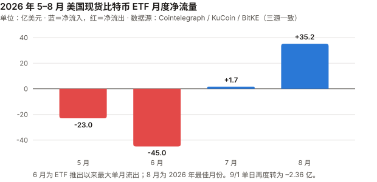
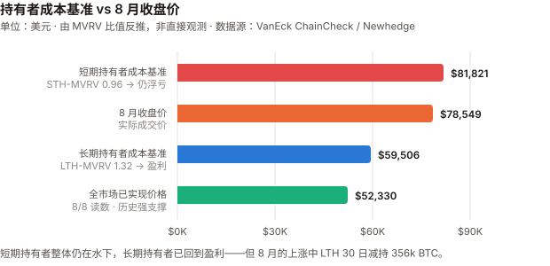
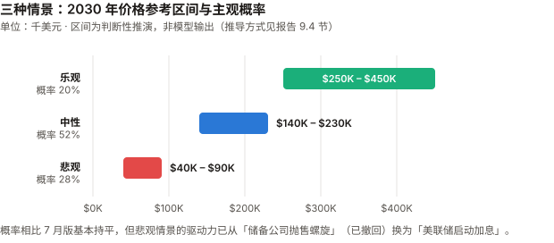

# BTC / Bitcoin 完整调研与分析报告

> **编写日期**：2026 年 9 月 3 日
> **数据截止**：2026 年 9 月 2 日（8 月完整月度数据已闭合）
> **研究方法**：基于 `anthropics/financial-services` 插件的行业概览（sector-overview）、投资论点追踪（thesis-tracker）、催化日历（catalyst-calendar）、竞争分析（competitive-analysis）四个框架。
>
> **本版更新要点**：
> ① **8 月大幅反弹**——收于 $78,548.63，单月 **+25.1%**，为 2024 年 11 月以来最强月份；
> ② **ETF 单月净流入 $35.2 亿**，年内最佳，AUM 从 $762.9 亿升至 $996.1 亿（+30.6%）；
> ③ **7 月版的偏空判断被部分证伪**，本版专设一节做论点校验（第 3.0 节）；
> ④ 三个待决催化剂已揭晓：FOMC 维持利率但**三票主张加息**、CLARITY 法案错过休会窗口但改期 **9/15 程序性投票**、BLS 年度修订**上修**（2022 年以来首次）；
> ⑤ **算力首次进入熊市**——约 932 EH/s，较峰值下跌 17%，矿工转投 AI；
> ⑥ **9 月初已再度转弱**——CME 显示 9 月加息概率升至 **66%**，ETF 9/1 净流出 $2.36 亿。
>
> **本版方法论改进**（应 CEO 要求）：
> ⑦ 新增三张图表（ETF 月度流量、持有者成本基准、三情景区间）；
> ⑧ 新增 **9.4 节**明确交代情景价格区间的推导方式与三个已知弱点——此前的区间数字看起来像模型输出，实际是判断性推演；
> ⑨ 新增 **6.3 节**纳入 Deutsche Bank、Citi、Standard Chartered、Bernstein 等传统机构的空方观点，配平此前对加密原生媒体的过度依赖；
> ⑩ 论点检验从正文一次性章节改为**跨期滚动记分卡**（见 `thesis_scorecard.md`）。
>
> **免责声明**：本报告不构成任何投资建议。所有分析仅供研究参考，投资决策请咨询专业顾问。

---

## 核心结论摘要（一页速览）

| 维度 | 核心判断 |
|------|----------|
| **BTC 是什么** | 数字黄金 + 去中心化结算网络 + 货币实验 + 宏观风险资产，四重属性并存 |
| **当前所处阶段** | 第四个减半周期第 23 个月。8 月收于 $78,548.63，距 ATH $126,080 回撤 **37.7%**（较 7 月的 –48% 明显收窄） |
| **8 月发生了什么** | 一次由**流动性事件**驱动的强力反弹：美国财政部宣布加倍长端国债回购 → 30 年期收益率下行 → 美元走弱 → BTC 冲高，约 **$15 亿空头被强平**。ETF 21 个交易日中 16 日净流入，8/17–8/27 连续 9 日流入 |
| **但 9 月已转向** | CME FedWatch 显示 9 月**加息**概率从一周前的约 40% 升至 **66%**；10 年期美债 4.79%；DXY 突破 99.7；ETF 9/1 净流出 $2.36 亿 |
| **最重要的认知变化** | 8 月证明了**需求侧弹性远比 7 月版假设的强**——宏观稍一松动，ETF 资金立刻回流。但也证明这轮行情是**流动性驱动而非基本面驱动**，来得快去得也快 |
| **核心多头逻辑** | 绝对稀缺、三层结构性买盘（ETF + 上市公司 + 主权）、8 月已验证的需求弹性、Strategy 未被迫抛售且现金储备增至 $48 亿 |
| **核心空头逻辑** | **9 月加息概率 66%**（若兑现将是本轮首次加息，属政策转向）、算力 –17% 进入熊市、LTH 30 日减持 356k BTC、AI Agent 支付真实需求被证伪过半 |
| **短期催化剂** | 9/15 CLARITY 法案程序性投票、9 月 FOMC、油价（美伊冲突）、ETF 能否守住 8 月的流入势头 |
| **风险等级** | 极高——建议作为资产组合中 1–5% 的"非对称回报"配置 |

---

## 1. BTC 的起源与历史背景

### 1.1 密码朋克的思想遗产（1980s–2007）

比特币不是凭空出现的，而是**密码朋克运动（Cypherpunk Movement，1980 年代末兴起的密码学家与自由意志主义者社群）** 数十年积累的产物。

| 年份 | 里程碑 | 对比特币的影响 |
|------|--------|---------------|
| **1982** | David Chaum 发表"盲签名"论文 | 匿名数字现金的概念奠基 |
| **1997** | Adam Back 发明 Hashcash（工作量证明） | 直接成为比特币的挖矿机制 |
| **1998** | Wei Dai 提出 b-money | 匿名分布式电子现金的蓝图 |
| **1998** | Nick Szabo 提出 Bit Gold | 比特币最直接的概念前身 |
| **2004** | Hal Finney 创建 RPoW（可复用工作量证明） | 首次实现可复用的 PoW 系统 |

这些探索都卡在同一个难题上：**如何在没有可信第三方的条件下解决双重支付（Double-Spending）**——即防止同一笔钱被花两次。

### 1.2 2008 年金融危机：催化剂

2008 年 9 月 15 日雷曼兄弟破产。10 月 31 日，化名 **Satoshi Nakamoto（中本聪）** 的匿名作者在密码学邮件列表发表了 9 页白皮书《Bitcoin: A Peer-to-Peer Electronic Cash System》。

### 1.3 比特币网络的诞生（2009）

- **1 月 3 日**：创世区块诞生，Coinbase 字段嵌入当日《泰晤士报》头条 "The Times 03/Jan/2009 Chancellor on brink of second bailout for banks"（财政大臣濒临对银行的第二轮救助）
- **1 月 12 日**：中本聪向 Hal Finney 发送 10 BTC——人类第一笔比特币交易

### 1.4 最初要解决的四个问题

1. **信任**：无需信任中介即可转移价值
2. **通胀**：央行可无限印钞 vs 比特币硬顶 2100 万枚
3. **审查**：任何人无需许可即可收发
4. **双重支付**：通过 PoW + 最长链共识首次在去中心化网络中解决

### 1.5 与传统货币、银行、黄金的关系

| 维度 | 法定货币（美元） | 黄金 | 比特币 |
|------|-----------------|------|--------|
| **发行机制** | 央行酌情印钞 | 开采（年增 1–2%） | 算法固定，每 4 年减半 |
| **总供应量** | 无限 | 有限但总量未知 | 硬顶 2100 万枚 |
| **保管** | 银行存款 | 实物 / ETF | 自托管 / 托管 |
| **转移** | 银行系统（慢、可审查） | 物理运输 | 互联网（快、无需许可） |
| **对手方风险** | 银行破产、政府违约 | 低 | 自托管时为 0 |
| **历史** | 50 余年（后布雷顿森林） | 5000 年 | 17 年 |

---

## 2. BTC 的发展阶段划分

### 阶段一：诞生与极早期实验（2008–2012）

| 时间 | 事件 |
|------|------|
| 2008.10.31 | 白皮书发布 |
| 2009.1.3 | 创世区块 |
| 2010.5.22 | "比特币披萨日"——1 万 BTC 换两块披萨 |
| 2010.8.15 | 1840 亿 BTC 溢出漏洞被利用并紧急修复（史上唯一一次重大协议事故） |
| 2010.12 | 中本聪最后一次公开留言后消失 |
| 2011.6 | 首次泡沫破裂：$30 → $0.01（Mt. Gox 被黑） |
| 2012.11.28 | 第一次减半：50 → 25 BTC |

价格：$0 → $30 → $2 → $13。叙事：密码朋克实验。

### 阶段二：交易所、矿业与投机市场成形（2013–2016）

| 时间 | 事件 |
|------|------|
| 2013.4 | 塞浦路斯银行危机，BTC 一个月内 $30 → $260 |
| 2013.11 | 首破 $1,000 |
| 2014.2 | **Mt. Gox 倒闭**，85 万 BTC 失踪 |
| 2015.7 | Ethereum 主网上线 |
| 2016.7.9 | 第二次减半：25 → 12.5 BTC |

价格：$13 → $1,100 → $200 → $650。叙事从"数字现金"扩展到"数字黄金"。

### 阶段三：牛熊周期与扩容内战（2017–2020）

| 时间 | 事件 |
|------|------|
| 2017 | ICO 泡沫，12 月见顶 $19,783 |
| 2017.8 | **Bitcoin Cash 硬分叉**；SegWit（隔离见证）激活 |
| 2017.12 | CME、Cboe 推出比特币期货 |
| 2018 | 加密寒冬，跌至 $3,200 |
| 2020.3.12 | "黑色星期四"，单日腰斩至 $3,800 |
| 2020.5.11 | 第三次减半：12.5 → 6.25 BTC |

**扩容战争**确立了比特币"保守、缓慢、不轻易改变"的治理哲学——这个基因至今影响它面对量子威胁等挑战时的反应速度。

### 阶段四：机构入场与 ETF 推进（2020–2024）

| 时间 | 事件 |
|------|------|
| 2020.8–12 | MicroStrategy（现 Strategy）大规模购入，**上市公司储备时代开端** |
| 2021.5 | 中国全面禁止挖矿，算力"大迁移" |
| 2021.11 | ATH $69,000 |
| 2022.11 | **FTX 崩溃**——行业的"雷曼时刻" |
| 2024.1.10 | **美国 SEC 批准 11 支现货比特币 ETF** |
| 2024.4.20 | 第四次减半：6.25 → 3.125 BTC |

### 阶段五：ETF 后周期、主权叙事与 AI 冲击（2024–至今）

| 时间 | 事件 |
|------|------|
| 2025.3 | 特朗普签署行政令建立美国战略比特币储备（SBR） |
| 2025.7 | GENIUS 法案（稳定币框架）签署；CLARITY 法案众议院通过 294–134 |
| 2025.10 | **ATH $126,080**（减半后 18 个月，符合历史节奏） |
| 2025.Q4 | 大幅回落，年度收跌——史上首个负收益的后减半年份 |
| 2026.5 | Kevin Warsh 就任美联储主席（鹰派） |
| 2026.6 | ETF 单月流出 $45 亿（史上最大），BTC 触及 21 个月低点 |
| 2026.7 | Strategy 单日抛售 $2.16 亿 BTC；CLARITY 通过概率跌至 31–37% |
| **2026.7.29** | **FOMC 维持 3.50–3.75%，但 Hammack、Kashkari、Logan 三人主张加息**；道指跌 1,153 点，30 年期美债收益率创 2007 年来新高 |
| **2026.8** | **BTC +25.1% 收于 $78,548.63**；ETF 净流入 $35.2 亿（年内最佳）；财政部加倍长端回购触发 $15 亿空头强平 |
| **2026.8.28** | **BLS 年度基准修订上修**——2022 年以来首次上修（偏鹰） |
| **2026.9.1** | ETF 净流出 $2.36 亿；CME 显示 9 月加息概率 66% |

---

## 3. BTC 当前现状分析

### 3.0 论点校验：7 月版哪里错了

> 本节为本版新增。报告若只更新数据而不检验上期判断，就退化成了每月一次的情绪复读。以下是逐条对账。

7 月版给出的三情景概率为**乐观 15–20% / 中性 55–60% / 悲观 25–30%**，中性情景对 2026 下半年的价格区间预判是 **$58K–$72K**。

**实际结果：8 月最高触及 $81,455，收于 $78,548.63——突破了中性区间上沿。**

逐条校验：

| 7 月版的判断 | 实际发生 | 判定 |
|---|---|---|
| "宏观为 2022 年以来最不利" | 方向对但**时点错**。8 月因财政部回购操作出现流动性缓和，BTC 反弹 25%；宏观压力到 9 月才真正兑现（加息概率 66%） | **早了一个月** |
| FOMC "偏↓、置信度高" | 部分对。会议本身维持利率但出现三票加息异议，道指跌 1,153 点——**当日市场反应确实偏空**，但未能压制 8 月后续反弹 | **部分正确** |
| CLARITY "若错过 8/10 窗口可能推迟到 2027" | **错**。确实错过了休会前投票，但参议院多数党领袖 Thune 已安排 **9/15 程序性投票**，法案未死 | **过度悲观** |
| "被迫卖出螺旋已启动" | **错**。Strategy 8 月**没有卖出任何比特币**，而是出售了 $3.34 亿的**自家股票**（MSTR）来补充现金，美元储备升至 $48 亿 | **误判性质** |
| ETF "持续失血" | **错**。8 月净流入 $35.2 亿，为 2026 年最佳月份，年内累计流出从 $52.9 亿收窄至 $17.7 亿 | **明显错误** |

**这次错在哪里——三个可复用的教训：**

1. **把"结构性风险"和"即将发生"混为一谈。** Strategy 的 mNAV 折价、ETF 失血都是真实的结构性脆弱性，但脆弱 ≠ 立刻断裂。7 月版把一个可能需要数季度才兑现的风险，写成了下季度的基准情景。

2. **低估了需求侧的弹性。** 7 月看到 6 月 $45 亿的创纪录流出，默认这是趋势。实际上 ETF 资金对宏观信号的反应是**双向且迅速**的——财政部一个技术性操作就让它在两周内转向。

3. **忽略了"被迫卖出"存在替代路径。** 我假设 mNAV < 1 时 Strategy 只能卖币。实际它选择了卖股票、发优先股、囤现金。**公司在压力下的选择空间，比外部推演的要大。**

**对本版的影响**：不因为一个月的反弹就翻多，也不坚持已被证伪的路径。下文的概率调整会明确区分"结构性脆弱"与"触发时点"。

### 3.1 资产属性

| 属性 | 8 月的证据 | 反证 |
|------|---------|------|
| **宏观流动性资产** | 8 月反弹的直接触发是**财政部债券回购**——一个纯粹的流动性事件，与比特币自身毫无关系 | —— |
| **数字黄金** | 8 月 BTC +25% 时黄金相对平淡；9 月两者又因加息预期同步走弱 | 危机中仍不可靠 |
| **高 beta 风险资产** | 30 年期美债收益率下行 → BTC 涨；加息概率上升 → BTC 跌。**利率的杠杆化表达** | —— |
| **商品** | CLARITY 法案拟归类为"数字商品"（CFTC 监管） | 法案尚未通过 |

**本月判断**：8 月这轮把 BTC 的属性暴露得很清楚——**它现在最像一个对全球美元流动性高杠杆的多头头寸**。财政部延长端回购这种技术性操作都能引发 25% 的月涨幅，说明定价权在宏观流动性，不在比特币的基本面。

### 3.2 市场结构：ETF 的反转与再反转

| 指标 | 数据 |
|------|------|
| **8 月净流入** | **+$35.2 亿**（2026 年最佳月份） |
| 对比 7 月 | 仅 +$1.72 亿 |
| **总净资产** | 7 月底 $762.9 亿 → 8 月底 **$996.1 亿**（+30.6%） |
| **年内累计** | 从 –$52.9 亿收窄至 **–$17.7 亿**（改善 67%） |
| 流入天数 | 21 个交易日中 16 日净流入；8/17–8/27 连续 9 日 |
| **9 月首日** | **–$2.36 亿**（9/1，转为净流出） |

> 数据来源：Cointelegraph、KuCoin、BitKE 等报道口径一致（三个来源均给出 $3.52B 与 $99.61B）。CoinGlass 官网页面抓取时仅返回模板占位，未能作为一手核对。




**市场参与者变化**：

| 参与者 | 8 月行为 |
|--------|---------|
| **ETF 机构** | 大举回流，是本月上涨的主要边际买家 |
| **长期持有者（LTH）** | **30 日内减持 356k BTC**——在反弹中派发，而非追涨 |
| **短期持有者（STH）** | STH-MVRV 0.96，仍在成本线下方 |
| **上市公司** | Strategy 未动比特币；Metaplanet 保持 43,000 BTC |
| **空头** | 约 **$15 亿**头寸在 8 月下旬被强平，放大了涨幅 |
| **矿工** | 算力较峰值下降 17%，产业重心转向 AI |

**关键结构性观察**：8 月的上涨中，**LTH 在卖、ETF 在买**。这是一次持有者结构的置换——筹码从长期持有者手中转移到 ETF 通道。这类置换在历史上是中性偏正面的（供应进入更"粘"的载体），但短期意味着上方存在持续的派发压力。

### 3.3 链上数据

| 指标 | 读数 | 时点 | 信号 |
|------|------|------|------|
| **MVRV** | 1.24 → **~1.5** | 8/8 → 8 月底 | 从"勉强高于成本线"回升，仍低于长期均值 |
| **MVRV Z-Score** | 0.42 → **~1.0** | 8/8 → 8 月底 | 脱离底部区，但远未到过热 |
| **已实现价格** | ~$52,330 | 8/8 | 全市场平均成本，强支撑 |
| **STH-MVRV** | **0.96** | 8 月底 | 短期持有者仍浮亏 |
| **LTH-MVRV** | **1.32** | 8 月底 | 长期持有者盈利，但幅度不大 |
| **LTH-SOPR** | **0.98**（区间 0.88–1.19） | 9 月初 | 获利了结有限 |
| **LTH 持仓变动** | **–356k BTC / 30 日** | 8 月 | 显著派发 |
| **已实现波动率** | **27.2%** | 8 月 | 处于历史低位 |
| **投降信号** | 12 个中 **8 个**触发 | 8 月低点区 | 底部特征在 8 月低位曾出现 |

**解读**：8 月低点（$62,290）附近，12 个投降指标触发了 8 个，MVRV Z-Score 一度低至 0.42——这是**教科书式的底部区域读数**。随后的反弹在链上得到确认。

但要同时看到两点：一是 LTH 30 日减持 356k BTC，说明老手在这个价位选择兑现而非持有；二是 MVRV 回到 1.5、Z-Score 回到 1.0，**估值折价已经修复掉一部分**，继续上行需要新的增量资金而非估值修复。



> 上图的成本基准由 MVRV 比值反推（现价 ÷ MVRV），**不是链上直接观测值**，用于呈现相对位置而非精确报价。
> 具体数值：短期持有者成本基准约 **$81,821**（$78,549 ÷ 0.96），长期持有者成本基准约 **$59,506**（$78,549 ÷ 1.32）。
> 现价 $78,549 位于两者之间——**短期持有者整体浮亏，长期持有者浮盈**。


### 3.4 宏观环境

> ⚠️ **本月最重要的变化**：市场定价从"是否降息"彻底转向"何时加息"。CME FedWatch 显示 **9 月加息概率 66%**（一周前约 40%）。若兑现，将是本轮周期的首次加息。

| 因素 | 状态（9 月初） | 对 BTC 的影响 |
|------|---------------|--------------|
| **联邦基金利率** | 维持 **3.50–3.75%**（7/29 会议） | 中性 |
| **FOMC 内部分歧** | **三人主张加息**：Hammack、Kashkari、Logan | 偏空 |
| **官方措辞** | "通胀相对 2% 目标仍然偏高，部分反映了能源等领域的供给冲击。**委员会将实现价格稳定**" | 强硬 |
| **9 月加息概率** | **66%**（CME FedWatch，一周前约 40%） | **重大利空** |
| **10 年期美债** | **4.79%**（7 月为 4.63%） | 无风险利率竞争加剧 |
| **30 年期美债** | 7/29 后创 2007 年以来最高 | 长端定价通胀风险 |
| **DXY 美元指数** | **>99.7**（三周高位） | 压制 BTC |
| **黄金** | ~$4,300（跌破 $4,400，三周低位） | 硬资产同步承压 |
| **原油** | 连续三日上涨，美伊冲突升级 | 推升通胀 → 加息压力 |
| **BLS 年度修订** | 8/28 **上修**就业数据，2022 年以来首次 | 劳动力市场强于预期 → **偏鹰** |

**核心判断**：8 月的反弹建立在一个**技术性的流动性缓和**之上（财政部加倍长端回购压低了 30 年期收益率）。进入 9 月，这个支撑正在被三件事侵蚀：油价推升通胀预期、BLS 上修显示劳动力市场并不弱、加息概率跳升至 66%。

关于 BLS 修订：多个报道称这是 2022 年以来首次上修，理由是 QCEW（就业与工资季度普查）数据强于月度调查。**但 bls.gov 官方页面抓取时返回 403，未能直接核实原文，此条为单一转述来源，请留意。**

### 3.5 技术与生态

**算力首次进入熊市——本月最重要的结构性变化：**

| 指标 | 数据 |
|------|------|
| 7 日均算力 | **约 932 EH/s**（2026 年 8 月初） |
| 距历史峰值 | **–17%**（推算峰值约 1,120 EH/s） |
| 挖矿难度 | 126.23 万亿 |
| 性质 | 被多家媒体称为比特币**首次"算力熊市"** |
| 原因 | 矿工把电力和场地转向 AI / 高性能计算（HPC） |

这是 7 月版标记为"有下降压力"的风险的**量化兑现**。算力下降本身不直接威胁网络安全（难度会自动调整），但它意味着：矿工对"持有并挖比特币"的经济信心在减弱，产业资本正在流向别处。

**闪电网络与 AI Agent 支付——需要下调预期：**

7 月版把 Cloudflare 集成 x402 协议称为"长期最大的机遇"。本月的数据要求做一次修正：

| 数据 | 含义 |
|------|------|
| x402 累计交易 | 1.65 亿笔以上，6.9 万个活跃 agent（截至 2026 年 4 月） |
| **但** | **约一半的交易量被判断为测试而非真实商业行为** |
| CoinDesk 评价（2026.3） | "需求根本还没起来"（demand is just not there yet） |
| L402 vs x402 | L402 走闪电网络（比特币原生），x402 主要走 USDC（EVM 链）——**AI Agent 支付的主战场并不在比特币上** |

**修正后的判断**：AI Agent 支付作为叙事仍然成立，但① 真实需求被高估了约一半；② 主导协议 x402 结算的是稳定币而非比特币。**7 月版"长期最大机遇"的措辞给高了，本版下调为"方向正确但兑现遥远，且比特币未必是受益者"。**

---

## 4. 上市公司比特币储备

### 4.1 整体规模

| 口径 | 数据 |
|------|------|
| 全部储备公司持仓市值 | **$1,090 亿**（8/28，随 BTC 反弹回升） |
| Strategy 持仓 | **845,050 BTC**（8/31，占总供应 **4.02%**） |
| Strategy 总成本 | $637.3 亿，**平均 $75,416/枚** |
| Strategy 市值（所持币） | $657 亿，浮盈约 **$19.7 亿（+3.1%）** |

> 数据来源：`bitcointreasuries.net`（已直接抓取核实，数据日期 8/31–9/3）。另有报道给出 762,099 BTC 的数字，与该追踪站及 Strategy 8/16 的 8-K 文件（840,447 BTC）均不符，判断为错误或陈旧数据，不予采用。

### 4.2 头部公司

| 排名 | 公司 | 持有 BTC | 8 月动向 |
|------|------|---------|---------|
| 1 | **Strategy（MSTR）** | **845,050** | **未买卖任何比特币**；8/10–8/16 出售 $3.34 亿 MSTR 股票，美元储备升至 **$48 亿** |
| 2 | Twenty One Capital（XXI） | 43,514 | 未见变动 |
| 3 | **Metaplanet（3350.T）** | **43,000** | Q1 已购 5,075 BTC、6 月再购 1,005 BTC；8 月辟谣了"抛售 $3.2 亿"的传闻 |

### 4.3 mNAV：口径分歧必须说清楚

7 月版说"Strategy 的 mNAV 持续低于 1.0"，这个说法**不够严谨**。实测三个口径差异很大：

| 口径 | 读数 | 含义 |
|------|------|------|
| **企业价值基准（EV）** | **1.00×** | 计入债务与优先股后，恰好等于所持比特币价值 |
| **基本（市值 / BTC NAV）** | **0.72×** | 普通股市值仅为所持比特币的七成 |
| **摊薄** | **0.73×** | 计入潜在稀释 |

> 来源：`bitcointreasuries.net`（已直接抓取）。另一站点 `mnav.com` 在 9/3 显示 1.05×，与 EV 口径接近；7 月引用的 0.61× 来自 techtimes 对 8 月中旬的报道，属基本口径且当时币价更低。**三者并不矛盾，是口径与时点差异。**

**这个区别有实质意义**：EV 口径 1.00× 说明 Strategy 并没有资不抵债——它的债务加优先股正好被比特币覆盖。真正被折价的是**普通股股东权益**。这解释了为什么 Strategy 8 月选择卖股票而不是卖币——**卖币会同时打击资产端和市场信心，卖股票只稀释股东**。

### 4.4 "被迫卖出螺旋"——需要撤回

7 月版的核心警告之一是"被迫卖出螺旋已启动"。8 月的事实要求撤回这个判断：

- Strategy **整个 8 月没有卖出一枚比特币**
- 反而通过出售自家股票把美元储备提高到 **$48 亿**
- 9 月初持仓 845,050 BTC，**高于** 8/16 的 840,447 BTC

**修正后的判断**：储备公司的财务压力是真实的（普通股折价 28%），但它们的应对工具箱比"卖币"宽得多——卖股、发优先股、囤现金、暂停增持都在选项内。**在 mNAV 的 EV 口径跌破 1.0 之前，"被迫卖币"不应作为基准情景。** 这是本版对 7 月版的一次实质性下调。

---

## 5. AI 科技对 BTC 的多维影响

### 5.1 矿业迁移：从"压力"到"兑现"

| 指标 | 数据 |
|------|------|
| 算力 | 约 932 EH/s，**较峰值 –17%** |
| 性质 | 首次算力熊市 |
| Hut 8 已签 AI 基础设施合同 | **$266 亿** |
| 全行业 AI/HPC 累计合同 | **超 $700 亿** |
| CoinShares 预测 | 上市矿企 AI/HPC 收入占比到 2026 年底可达 **70%**（年初约 30%） |

**影响**：短期是净负面——矿工卖币融资、算力下降削弱"最安全网络"的叙事强度。中长期偏中性——矿企财务更健康，但它们对比特币的"信仰式持有"在减弱，产业与资产的绑定在松动。

### 5.2 AI Agent 支付：下调预期

见 3.5 节。核心修正：真实商业需求约为表观交易量的一半，且主导协议 x402 用 USDC 结算而非比特币。**比特币未必是 AI 支付浪潮的主要受益者。**

### 5.3 AI 影响汇总

| 维度 | 方向 | 强度 | 相比 7 月版 |
|------|------|------|-----------|
| 矿业转 AI / 算力下降 | 负 | ★★★★☆ | **↑ 上调**（从"有压力"变为 –17% 已兑现） |
| AI Agent 支付 | 正 | ★★☆☆☆ | **↓ 下调**（从 ★★★★☆，因需求证伪过半 + 主战场不在 BTC） |
| 能源竞争 | 负 | ★★★☆☆ | 不变 |
| 加速量子威胁 | 负（尾部） | ★★★☆☆ | 不变 |
| AI 诈骗 | 负（用户层） | ★★★☆☆ | 不变 |

---

## 6. BTC 的核心价值逻辑

### 6.1 多头逻辑

| # | 逻辑 | 强度 | 说明 |
|---|------|------|------|
| 1 | **绝对稀缺** | ★★★★★ | 2100 万硬顶，年通胀约 0.85%，低于黄金 |
| 2 | **需求侧弹性已被验证** | ★★★★☆ | **本月新增**。8 月证明宏观稍松，ETF 资金两周内即可从创纪录流出转为年内最大流入 |
| 3 | **三层结构性买盘** | ★★★★☆ | ETF（$996 亿 AUM）+ 上市公司（$1,090 亿）+ 美国 SBR |
| 4 | **储备公司未被迫抛售** | ★★★☆☆ | **本月新增**。Strategy 现金储备 $48 亿，工具箱远比"卖币"宽 |
| 5 | **去中心化与抗审查** | ★★★★☆ | 17 年不间断运行 |
| 6 | **网络效应** | ★★★★★ | 最大、最安全的区块链，品牌不可复制 |
| 7 | **对抗法币贬值** | ★★★★☆ | 全球债务不可持续，去美元化长期利好硬资产 |
| 8 | **CLARITY 法案未死** | ★★★☆☆ | 9/15 程序性投票已排期 |

### 6.2 空头逻辑

| # | 逻辑 | 强度 | 说明 |
|---|------|------|------|
| 1 | **9 月加息概率 66%** | ★★★★★ | **本月升级**。若兑现是本轮首次加息，属政策方向转变 |
| 2 | **纯流动性驱动，无基本面支撑** | ★★★★★ | **本月新增**。8 月 25% 的涨幅源自财政部回购这一技术操作，来得快去得也快 |
| 3 | **算力进入熊市（–17%）** | ★★★★☆ | **本月升级**。产业资本正在流出比特币 |
| 4 | **LTH 在反弹中派发** | ★★★★☆ | **本月新增**。30 日减持 356k BTC，老手不认同这个价位 |
| 5 | **高波动 + 利率杠杆化** | ★★★★☆ | 10 年期 4.79%、DXY 99.7 双重压制 |
| 6 | **AI Agent 支付需求被高估** | ★★★☆☆ | **本月新增**。约一半交易量是测试，且主协议不走比特币 |
| 7 | **CLARITY 仍未通过** | ★★★☆☆ | 9/15 只是程序性投票，仍需 60 票 |
| 8 | **普通股折价 28%** | ★★★☆☆ | 储备公司增持能力受限，飞轮停转 |
| 9 | **油价推升通胀** | ★★★☆☆ | 美伊冲突持续 |

### 6.3 机构观点分布：主流预测的重心正在下移

> 本节为本版新增。前几版的数据高度依赖加密原生媒体（Cointelegraph、CoinDesk、KuCoin 等），
> 而这类媒体**在结构上是看多的**——行业媒体依赖行业繁荣生存。本节刻意纳入传统金融机构的判断作为配平。

| 机构 | 2026 年立场 | 关键论据 |
|------|-----------|---------|
| **Deutsche Bank** | **明确看空** | 经济学家预期美联储 **2026 年加息两次**（此前预期宽松）；消费者调查结果偏空；将 6 月跌破 $60,000 归因于鹰派美联储、创纪录 ETF 流出、杠杆化企业持有者的隐忧 |
| **Citi** | 下调目标 | 2026 年内已下调 |
| **Standard Chartered** | 下调目标 | 2026 年内已下调（此前为 $150K 多头） |
| **Bernstein** | 下调目标 | 2026 年内已下调 |
| **JPMorgan** | 长期偏多、短期保留 | $266,000 是**长期理论值**，明确表示"近期不现实" |
| **Tom Lee（Fundstrat）** | 看多 | 主流预测者中近乎唯一坚持明确近期多头目标的 |

**这张表本身就是一个信号**：Citi、Standard Chartered、Bernstein 在 2026 年内**全部下调了目标**，Deutsche Bank 从预期宽松转为预期加息两次。**主流预测者的重心自年初以来已明显向空方移动**，而这在加密原生媒体的报道中很少被完整呈现。

同时值得注意的一个共同论据：**资金正在从加密轮动至 AI 相关股权与基础设施**，多家机构将其视为对加密需求的"更持久的逆风"（durable headwind）——这与本报告第 5 章中矿工转向 AI、AI Agent 支付主战场不在比特币上的观察，指向同一个结构性问题：**AI 正在同时争夺比特币的算力、电力和资金。**

**对本报告的意义**：Deutsche Bank"加息两次"的预期，与 CME 显示的 9 月加息概率 66% 相互印证。本版悲观情景的 28% 概率，某种程度上仍可能是**偏低**的——如果德银的路径成立，2026 年将出现两次加息，而这是 ETF 上市以来 BTC 从未经历过的环境。

---

## 7. BTC 与其他资产的比较

### 7.1 横向对比

| 资产 | 稀缺性 | 波动率 | 8 月表现 | 主要风险 |
|------|--------|--------|---------|---------|
| **BTC** | 绝对（2100 万） | ~52%（已实现波动率降至 27.2%） | **+25.1%** | 加息、流动性周期、算力外流 |
| **黄金** | 有限（年增 1–2%） | ~15% | 相对平淡，9 月初跌破 $4,400 | 加息预期、实际利率上行 |
| **美元现金** | 无限 | ~0% | DXY 走强 | 通胀侵蚀购买力 |
| **美债（10Y）** | 无 | ~5–10% | 收益率升至 4.79%（价格下跌） | 通胀、供给 |
| **ETH** | 无固定硬顶 | ~60–80% | 跟随 BTC | 竞争链、监管 |

### 7.2 BTC vs 黄金

8 月出现了一个值得注意的分化：**BTC +25% 而黄金相对平淡**，这与 2025 年"黄金大涨、BTC 下跌"的格局相反。但进入 9 月，两者又因加息预期同步走弱。

**判断**：这不能说明 BTC 重获"数字黄金"地位。更合理的解释是——**8 月的驱动因素（长端收益率下行）对 BTC 这类零息、高久期资产的边际影响远大于黄金**。它证明的是 BTC 的利率敏感度，不是它的避险属性。

### 7.3 资产组合建议

| 投资者类型 | 建议配置 | 理由 |
|-----------|---------|------|
| **保守型** | 0–1% | 波动仍然过大 |
| **平衡型** | 1–3% | 法币体系尾部对冲 |
| **成长型** | 3–5% | 非对称回报 |
| **激进型** | ≤10% | 需要严格纪律 |

---

## 8. BTC 未来 1–5 年的关键变量（催化剂日历）

| 时间 | 催化剂 | 影响 | 方向 | 置信度 |
|------|--------|------|------|--------|
| **2026.9.15** | **CLARITY 法案参议院程序性投票** | 需 60 票；未决议题包括政府伦理条款、执法条款、稳定币收益 | ↑/↓ | 高（日程已定） |
| **2026.9 FOMC** | **加息与否**（当前概率 66%） | 若加息 = 本轮首次，重大利空；若维持 = 短期解压 | **关键变量** | 高 |
| **持续** | 油价与美伊冲突 | 推升通胀 → 强化加息路径 | ↓ | 中 |
| **持续** | ETF 流量能否延续 8 月势头 | 9/1 已转为流出，需观察是否只是月初调仓 | 关键变量 | 高 |
| **持续** | 算力是否继续下滑 | –17% 后若持续下探，将动摇安全叙事 | ↓ | 中 |
| **2026.Q4** | Strategy 是否恢复增持 | 现金 $48 亿，若重启买入是强信号 | ↑ | 中 |
| **2027** | 美联储政策转向 | 若通胀受控转向降息，BTC 最受益 | ↑ | 中 |
| **2028** | 第五次减半 | 边际影响继续递减 | ↑ | 低 |
| **2028–2033** | 量子威胁时间窗 | 迁移方案的治理考验 | ↓ | 中 |

---

## 9. BTC 未来的三种情景推演

### 9.1 乐观情景：加息落空 + 监管突破

**触发**：9 月 FOMC 维持不动、通胀因油价回落而降温；CLARITY 法案 9 月底前通过；ETF 延续 8 月流入节奏；Strategy 恢复增持。

```
2026 Q4: $85K–$100K（加息落空 + CLARITY 通过）
2027:    $100K–$150K（降息预期重启 + 减半前积累）
2028:    $150K–$250K（第五次减半）
2030:    $250K–$450K
```

**概率：20%**（较 7 月版持平。8 月证明了上行弹性，但 9 月加息概率 66% 抵消了这一改善）

### 9.2 中性情景：高利率持久化，宽幅震荡

**触发**：美联储加息一次后停止，或维持不动但拒绝转鸽；CLARITY 拖至 2027；ETF 流量在正负间摆动；算力企稳。

```
2026 Q4: $65K–$85K（宽幅震荡）
2027:    $80K–$120K
2028:    $110K–$170K（减半催化）
2030:    $140K–$230K
```

**概率：52%**

### 9.3 悲观情景：加息周期启动

**触发**：9 月加息并释放继续紧缩信号；油价站上 $100 推升通胀；CLARITY 在参议院失败；算力持续下滑引发安全性质疑；LTH 派发加速。

```
2026 Q4: $50K–$68K
2027:    $40K–$65K
2028:    $35K–$60K
2030:    $40K–$90K
```

**概率：28%**

### 情景对比

| 维度 | 乐观 | 中性 | 悲观 |
|------|------|------|------|
| 2030 价格参考 | $250K–$450K | $140K–$230K | $40K–$90K |
| 9 月 FOMC | 维持 | 加息一次后停 | 加息并延续 |
| CLARITY | 9 月通过 | 拖至 2027 | 失败 |
| ETF 流量 | 延续流入 | 正负摆动 | 持续流出 |
| 算力 | 企稳回升 | 横盘 | 继续下滑 |
| **概率** | **20%** | **52%** | **28%** |



> **相比 7 月版的调整说明**：三档概率数值几乎未变（20/52/28 vs 15-20/55-60/25-30），但**内部构成发生了实质变化**。7 月版的悲观情景主要由"储备公司被迫卖出螺旋"驱动，该路径已被 8 月事实证伪并撤回；本版悲观情景改由"美联储实际启动加息"驱动——这是一个概率更高（66%）但影响路径更清晰的风险。**换句话说：风险的量级相当，但来源换了。**

### 9.4 价格区间是怎么推出来的

上面那些区间看起来像模型输出，其实不是。**必须说清楚它们的来源，否则就是用精确的数字给一个主观判断打包装。**

推导方式如下——三步，全部是判断性的：

**第一步：锚定当前的估值位置。** 8 月末 MVRV 约 1.5，即市值是链上总成本的 1.5 倍。历史上周期顶部的 MVRV 在 3.5–5 之间，深熊底部在 0.7–1.0。

**第二步：估计 2030 年的链上成本基准。** 当前全市场已实现价格约 $52,330。若未来四年新增资金以每年 15–25% 的速度推高平均成本（这是本推导中**最主观的假设**，参考过去三个周期的已实现价格年化增速 20–40%，考虑到体量增大而下调），2030 年已实现价格落在 $91K–$128K。

**第三步：乘以情景对应的 MVRV。**

| 情景 | 假设的 2030 年 MVRV | 依据 | 推出的价格区间 |
|------|:---:|------|------|
| 乐观 | 2.8–3.5 | 接近但不及历史顶部，反映成熟化后的估值压缩 | $250K–$450K |
| 中性 | 1.5–1.8 | 与当前水平相当，即估值不扩张、仅随成本抬升 | $140K–$230K |
| 悲观 | 0.45–0.7 | 低于历史深熊，反映叙事受损后的结构性折价 | $40K–$90K |

**这个方法的三个已知弱点，必须讲明白：**

1. **已实现价格增速的假设是拍脑袋的。** 20% 和 25% 得出的 2030 年结果相差近 $15K，而我没有可靠依据在这两者间取舍。
2. **MVRV 的历史区间只有三个周期的样本**，且每个周期的市场结构都不同（散户 → 机构 → ETF）。用三个样本推第四个周期，统计意义很弱。
3. **完全没有考虑外生冲击**——监管禁令、量子突破、更好的替代品出现，任何一个都会让上述框架失效。

**结论**：这些区间应当被读作"在一组明确假设下的算术结果"，而不是预测。如果你只记住一件事：**中性情景的 $140K–$230K 本质上是在说"估值倍数不变、成本基准按历史增速下沿抬升"**，仅此而已。

---

## 10. 投资与风险启示

### 10.1 当前周期位置

第四个减半周期第 23 个月。8 月低点（$62,290）附近曾出现教科书式的底部读数——MVRV Z-Score 0.42、12 个投降指标触发 8 个。随后的 25% 反弹在链上得到确认。

但**估值折价已修复一部分**（MVRV 回到 1.5、Z-Score 回到 1.0），继续上行需要新增资金而非估值回归。而 9 月的宏观环境（66% 加息概率）恰恰不利于增量资金入场。

### 10.2 策略建议

| 策略 | 适合人群 | 说明 |
|------|---------|------|
| **定投（DCA）** | 普通投资者 | 当前宏观方向未明，分批优于择时 |
| **长期持有** | 能承受 50%+ 回撤者 | 历史上持有 4 年以上未有亏损记录 |
| **战略配置** | 机构 / 高净值 | 1–5%，作为非对称回报敞口 |

**当前阶段的具体提醒**：8 月的反弹很容易诱发"底部已过"的判断。但这轮上涨的驱动是**财政部一个技术性操作**，而非基本面改善——LTH 在派发、算力在下滑、加息概率在上升。**不宜在 9 月 FOMC 之前重仓加码。**

### 10.3 关键监控指标

**周期底部信号**（8 月低点曾满足，现已部分修复）：
- MVRV Z-Score < 0.5（8/8 曾达 0.42）
- 投降指标触发比例（8 月低点 8/12）
- LTH-SOPR 持续 < 1.0（当前 0.98）

**本月重点新增监控**：
- **CME FedWatch 的 9 月加息概率**（当前 66%）——单一最重要的短期变量
- **算力是否止跌**（当前 932 EH/s，–17%）
- **ETF 9 月全月流量**（9/1 已流出 $2.36 亿）
- **Strategy 是否恢复买入**（现金 $48 亿待命）

### 10.4 风险提醒

1. **加息是本轮未曾经历的场景。** 2024 年 ETF 上市以来，BTC 从未在加息周期中运行过。历史类比在这里失效。
2. **8 月证明反弹可以很快，也说明回撤可以同样快。** 流动性驱动的行情没有基本面地板。
3. **算力 –17% 是慢变量但方向明确。** 产业资本流向 AI，比特币在与自己的矿工争夺资源。
4. **不要因为一次上修就重估整个趋势**——这正是 7 月版犯的镜像错误（因一次下跌而重估整个趋势）。

### 10.5 长期认知

1. **BTC 是对法币体系尾部风险的非对称赌注。** 法币体系运转良好时它表现平庸甚至糟糕。
2. **持有周期决定结果。** 4 年以上历史无亏损，但中途需承受 50–80% 的账面回撤。
3. **仓位管理重于方向判断。** 1–5% 才是可持续的配置。
4. **本月新增的认知**：**BTC 现在最直接的定价锚是长端美债收益率。** 8 月财政部回购压低 30 年期收益率 → BTC 涨 25%；9 月加息预期推高收益率 → BTC 回落。想判断 BTC，先看利率曲线。

---

## 11. 附录

### 11.1 关键阶段速查

| 阶段 | 时间 | 起点 | 高点 | 核心叙事 |
|------|------|------|------|---------|
| 极早期 | 2008–2012 | $0 | $30 | 密码朋克实验 |
| 市场形成 | 2013–2016 | $13 | $1,100 | 数字黄金雏形 |
| 主流冲击 | 2017–2020 | $1,000 | $19,783 | 投机 + 扩容内战 |
| 机构化 | 2020–2024 | $7,200 | $73,000 | 机构 + 宏观资产 |
| ETF 时代 | 2024–至今 | $45,000 | $126,080 | ETF + 主权 + AI + 利率杠杆 |

### 11.2 减半周期对比

| 减半年份 | 减半时价格 | 周期顶部 | 顶部涨幅 | 见顶后最大回撤 |
|----------|----------|---------|---------|--------------|
| 2012 | $12.35 | $1,100 | ~8,900% | −85% |
| 2016 | $650 | $19,783 | ~2,950% | −84% |
| 2020 | $8,800 | $69,000 | ~680% | −77% |
| 2024 | $63,000 | $126,080 | ~100% | −54%（6 月低点） |

### 11.3 2026 年月度回顾

| 月份 | BTC 表现 | ETF 净流 | 关键事件 |
|------|---------|---------|---------|
| 5 月 | 下跌 | –$23 亿 | Warsh 就任 |
| 6 月 | 触及 21 个月低点 | **–$45 亿**（史上最大） | 恐慌 |
| 7 月 | 弱势反弹 | +$1.72 亿 | FOMC 三票主张加息；Strategy 抛售 $2.16 亿 |
| **8 月** | **+25.1%，收 $78,548.63** | **+$35.2 亿**（年内最佳） | 财政部加倍长端回购；$15 亿空头强平；BLS 上修 |
| 9 月（截至 9/2） | 回落 | –$2.36 亿（9/1） | 加息概率升至 66% |

### 11.4 数据来源与核实状态

| 数据 | 来源 | 核实方式 |
|------|------|---------|
| FOMC 决议与异议名单 | federalreserve.gov | ✅ **已直接抓取原文** |
| Strategy 持仓与 mNAV | bitcointreasuries.net | ✅ **已直接抓取** |
| ETF 8 月流量 | Cointelegraph / KuCoin / BitKE | ⚠️ 三源一致，但未取得一手数据页 |
| BTC 8 月收盘价 | Fortune / StatMuse | ⚠️ 搜索摘要，未直接核对 |
| 链上指标 | VanEck ChainCheck / Newhedge / AhaSignals | ⚠️ VanEck 原文抓取失败（重定向循环） |
| BLS 年度修订 | 多家转述 | ❌ **bls.gov 返回 403，未能核实原文** |
| 算力数据 | news.bitcoin.com / CoinShares | ⚠️ 搜索摘要 |
| 恐惧贪婪指数 | 多源分歧（50 / 58 / 69） | ⚠️ **各家方法论不同，未采用** |
| 机构空方观点 | Deutsche Bank / Citi / Standard Chartered / Bernstein / JPMorgan | ⚠️ 经 Yahoo Finance、CoinDesk 转述 |

> **关于来源偏向的说明**：本报告的市场与链上数据大量来自加密原生媒体，这类来源**在结构上倾向看多**。
> 本版起固定纳入传统金融机构的判断（见 6.3 节）作为配平。读者在引用本报告数据时应意识到这一偏向仍未完全消除。

---

> **最后提醒**：本报告尽力呈现多角度分析，不构成投资建议。加密资产投资风险极高，请基于独立研究和自身风险承受能力做出决策。
