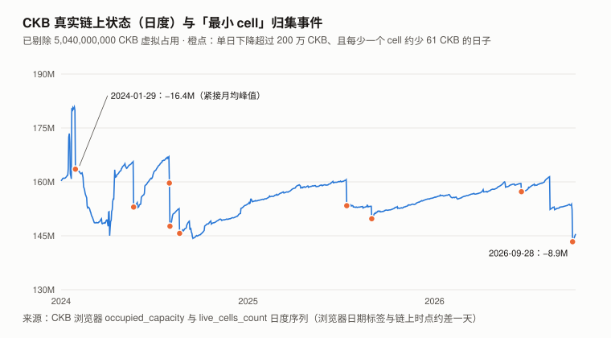
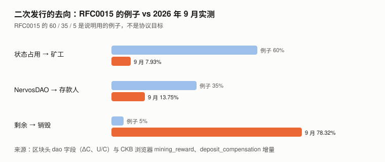
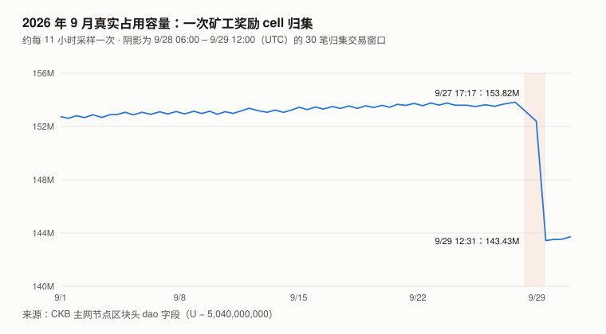

# CKB / Nervos 完整调研与分析报告

> **版本**：2026 年 9 月（兼 Q3 回顾）
> **完成日期**：2026-10-06
> **本系列第十二个资产**的第二期
>
> **本版更新要点**：
>
> 1. **9 月真实链上状态单月 −5.89%（152,741,969 → 143,732,036 CKB），其中 99.8% 来自同一个出块奖励地址的净变化。**
>    用 indexer 拉出该地址（`0xeb0c…e7d6`）9 月全部进出记录：**新增 182,060 个 cell、消耗 329,446 个，净 −147,386 个 × 61 CKB = −8,990,546 CKB**；全链真实状态同期 −9,009,933。
>    消耗的主体是 9/28–29 的一次大归集（30 笔交易、178,945 个输入，随机抽查 300 个全部是该地址的出块奖励 cell），**归集掉的是此前数月积压的奖励 cell**。
>    **四个最大出块奖励地址合计净变化约 −910 万 CKB，全链其余部分 9 月约 +9.5 万、基本持平——这个月的「状态塌方」是同一个出块奖励地址在整理挖矿收入，不是使用量下降。**
> 2. **8 月版的「税基见顶」叙事，在可比口径下无法判定。** 2024 年以来真实状态有 9 次「每少一个 cell 约少 61 CKB」的大跌，**本期逐笔核实了其中 2 次，都是出块奖励 cell 归集**。
>    再用 indexer 倒推奖励地址的逐日持有量：**8 月版月均峰值所在的 2024-01，一个奖励地址（`0xdde7801c…`）就持有至少 1,449 万 CKB 的奖励 cell；扣掉后 1 月月均最多约 1.524 亿**，
>    **而 2026 年 6、7 月扣掉当期最大的奖励地址后是 1.525 亿、1.516 亿——两者几乎相同。**「31 个月未创新高」既证实不了也推翻不了。
>    8 月版核心论点 C8-1 本期判 **⊘**：理由是**构念效度**——这条序列的月度变化可以被一个地址的日常记账主导。
> 3. **同一个奖励地址的出块份额：6 月 37.2%、7 月 54.5%（抽样）→ 8 月 ≤ 57.6%、9 月 ≤ 64.7%（按该地址收到的奖励 cell 数普查）。**
>    **8、9 月都过半且仍在上升**；7 月抽样的 95% 区间 45.7%–63.1%，不能确认过半。同期全网算力月均从一年前约 245 PH/s 降到 70–90 PH/s。
>    **一个地址不等于一个实体（可能是矿池）**，但这是 8 月版完全没有测过的安全议题。
> 4. **8 月版欠下的「成本基准法」本期做了。** 枚举约 100 万个活跃 cell，按区块桶近似每个 cell 最后一次移动当日的价格：
>    **已实现价格（均值）$0.00526，按容量的中位成本 $0.00159**；9/30 市价 $0.001317 是前者的 0.25 倍、后者的 0.83 倍。
>    **两种统计量都显示市价低于全网成本，但只有一个时点、没有历史序列给区间定标**，换算不成目标价——「不给目标价」从「未尝试」推进到「**尝试了，卡在定标**」。
> 5. **9 月 +27.49%（BTC +6.42%），比 beta 预期多 19.6 个百分点。** 同口径下其余 8 个山寨资产的 9 月超额中位数是 10.9 个百分点：
>    **约 10.9pp 属板块普涨，约 8.7pp 是 CKB 自身的部分——大约补回了 7 月自身落后（−17.3pp）的一半。** Q3 相对对照组仍落后约 8.4pp。
>
> ---
>
> **本报告不给目标价。** 理由与成本基准法的尝试见第 10 章。
>
> **利益冲突声明**：作者未持有 CKB，与 Nervos 基金会、Cryptape 及任何 CKB 生态项目无雇佣、
> 顾问或投资关系。本报告的链上数据全部由作者从 CKB 主网节点与 GitHub 一手仓库直接抓取。

---

## 核心结论摘要（一页速览）

| 维度 | 观测 | 判断 |
|------|------|------|
| **价格（9/30）** | $0.001317，9 月 **+27.49%**（BTC +6.42%）；Q3 **+51.21%**（BTC +42.64%）；beta 1.226、R² 0.469 | 9 月超出 beta 预期 19.6pp，**与 7、8 月的 −19.4pp 几乎抵消**；Q3 残差 −1.1pp |
| **真实链上状态** | 9/01 **152,741,969** → 10/01 **143,732,036**（**−5.89%**） | **≈ 全部来自一个出块奖励地址的净变化**（−8,990,546 CKB）；四个最大奖励地址之外约 +9.5 万，基本持平 |
| **8 月版「税基见顶」** | 2024-01 峰值月里一个奖励地址至少持有 1,449 万 CKB 奖励 cell；扣掉后 ≤ 1.524 亿，2026-06/07 扣掉后 1.525 / 1.516 亿 | **可比口径下无法判定**；C8-1 判 ⊘ |
| **出块集中度** | 同一奖励地址 **37.2% → 54.5%（抽样）→ ≤ 57.6% → ≤ 64.7%（普查）**（6–9 月） | **8、9 月过半且仍在上升**；地址 ≠ 实体，未识别其身份 |
| **全网算力** | 10/01 **79.8 PH/s**（一年前月均约 245 PH/s） | 集中度上升与算力下降同时发生 |
| **成本基准法** | 已实现价格（均值）**$0.00526**；中位成本 **$0.00159**；按容量 **41% 浮盈 / 59% 浮亏** | **两者都高于市价**；无历史序列定标，不能换算成目标价 |
| **二次发行去向** | 矿工 **7.93%** / DAO **13.75%** / **销毁 78.32%** | 与 8 月（7.97 / 13.97 / 78.06）几乎相同 |
| **流通量增速** | 9 月 +0.3789%（月初分母），复利年化 **4.71%** | 8 月 4.69% |
| **NervosDAO** | 10/06 合计 **90.41 亿**（流通量 18.21%），其中 9.21 亿在退出队列 | 9 月存款中部分**净流出 1.92 亿**，是 8 月的 3.44 倍 |
| **手续费** | 9 月合计 **1,121.93 CKB = $1.34** | 占矿工收入 0.00062% |
| **安全预算** | 日均 **$7,198**，年化占市值 4.02% | |
| **Fiber** | FundingLock **38 个 cell、43,889 CKB**（10/06） | 9/09 为 34 个、39,691 CKB |
| **本报告给目标价** | **否** | 见第 10 章 |

> **一句话**：**8 月版把真实链上状态当作 CKB 的需求锚；9 月这个锚的月度变化几乎全部是同一个出块奖励地址在记账——
> 而这个地址从 8 月起已经拿下全网一半以上的区块。**

---

## 1. CKB 是什么

协议层面与 8 月版相同，不再重复。三个要点：

| | 内容 |
|---|---|
| 代币用途 | **占用状态空间的凭证**：存 1 字节状态要持有并锁定 1 CKB；最小 cell 61 字节，即至少 61 CKB |
| 发行 | 一次发行 336 亿封顶、约 4 年减半，全给矿工；二次发行恒定 13.44 亿 CKB / 年，按 RFC0015 分给矿工、NervosDAO 存款人与国库（目前即销毁） |
| 一手数据源 | 区块头 32 字节 `dao` 字段：C（累计发行）/ AR（累计利率）/ S（DAO 与国库池）/ U（占用容量），字节序 `c, ar, s, u` |

> **本期用到的一条协议事实**（Codex 审查时对照 CKB 源码确认）：非创世区块的 cellbase 输出由共识要求**无 type、data 为空**；
> 奖励锁为 secp256k1（args 20 字节）时，每个奖励 cell 占 **8 + 32 + 1 + 20 = 61 字节**。奖励在出块约 11 个区块后发放，成熟期 4 个 epoch（约 16 小时）。

### 1.1 本期补：「中本聪礼物」那枚 cell 的来历（8 月版下期清单第三优先）

8 月版发现 `dao` 字段的 U 有 97% 来自创世那枚 84 亿 CKB cell 的「虚拟占用」（按 `SATOSHI_CELL_OCCUPIED_RATIO = 6/10` 计 50.4 亿），
但没找到设计记录。**本期找到了原始 PR**：

| 来源 | 内容 |
|---|---|
| `nervosnetwork/ckb` **PR #1576**（2019-09-10 创建，2019-09-16 合并） | 「主网上线时这个 cell 发行创世容量的 1/4，**其中 60% 的容量按已占用计算，这会影响 Nervos DAO 合约的利息**」 |
| 同一 PR 的前身 PR #1491（2019-08-27，未合并） | 「`virtual occupied` 会计入区块头 `dao` 字段的已用容量」，目的是「不必真的写入那么多字节」 |

**这解开了一半**：设计意图有了一手记录——**60% 的虚拟占用是有意用来影响 NervosDAO 利息分配的**，
与 8 月版 5.2.1 的重构方向一致。**但 PR 里没有解释为什么是 0.6。**

> ⚠️ **一处与 8 月版的表述需要对齐**：PR #1576 写「中本聪可以用私钥签名花费这个 cell」。
> 而主网创世块第 6 个输出（8,400,000,000 CKB）的锁脚本 `code_hash` 是 32 字节全零、`hash_type = data`——
> **没有任何程序的哈希会恰好是全零，因此它实际上不可花费**（本期 `get_live_cell` 确认仍是活跃 cell）。
> **8 月版「永久不可花费」的结论成立，但它是由锁脚本推出来的，不是协议的明文规定；PR 说明里的设想没有落实到主网配置。**

---

## 2. CKB 的发展阶段划分

阶段一到四与 8 月版相同（创世 2019-11 / 状态积累 2020–2023-09 / 首次减半 2023-11-19 / RGB++ 叙事 2024–2025）。
**本期要修订的是阶段五的读法。**

### 阶段五：状态见顶与 RGB++ 退潮（2024-01 – 至今）——本期修订

**月均序列本身没有错**（本期复读一致，并补上 9 月）：

| 月份（月均，CKB 浏览器口径） | 真实占用容量 |
|---|---|
| **2024-01** | **166,852,970** ← 月均峰值 |
| 2025-08 | 152,958,239 |
| 2026-06 | 158,630,597 |
| 2026-07 | 159,019,263 |
| 2026-08 | 156,235,117 |
| **2026-09** | **152,282,221** |
| 2026-10（1–4 日，不完整） | 144,942,792 |

**要修订的是「这个序列测的是什么」。** 第 5 章证明：**这条序列里混着出块奖励 cell 的积攒与归集**。
本期用 indexer 拉出奖励地址的全部进出记录，倒推它们每天日末持有多少奖励 cell（每个 61 CKB），两侧都扣：

| 月份 | 浏览器月均（8 月版口径） | 当期最大奖励地址持有的奖励 cell（月均） | 扣掉后 |
|---|---:|---:|---:|
| **2024-01**（8 月版的「峰值」） | 166,852,970 | `0xdde7801c…` **≥ 14,488,793** | **≤ 1.524 亿** |
| 2026-06 | 158,630,597 | `0xeb0c…` 6,147,773 | **1.525 亿** |
| 2026-07 | 159,019,263 | `0xeb0c…` 7,417,443 | **1.516 亿** |
| 2026-08 | 156,235,117 | `0xeb0c…` 8,789,024 | 1.474 亿 |
| 2026-09 | 152,282,221 | `0xeb0c…` 9,484,613 | 1.428 亿 |

> **2024 侧是下限扣法**：以 1/30 归集完成后持有量为 0 倒推，真实持有只会更多；`0xdde7801c…` 在 2023-12-01 就已持有至少 163,597 个奖励 cell，1/29 增至约 26 万个，1/30 一次归集清零。
> **2026 侧以 10/06 的实际持有量为锚倒推**。另有 `0x8805…` 一个奖励地址长期持有约 18.5 万个奖励 cell（约 1,130 万 CKB）且从不归集——**2024 年有没有同类地址，本期没有测**。



> 图中数字：纵轴刻度 130M / 145M / 160M / 175M / 190M（百万 CKB）；横轴 2024 / 2025 / 2026；
> 标注 2024-01-29 −16.4M（即 −1,638 万，浏览器日期标签；链上为 2024-01-30）与 2026-09-28 −8.9M（链上为 9/28–29）。

**修订后的读法**：

| 8 月版的说法 | 本期 | 理由 |
|---|---|---|
| 「2024-01 见顶后 31 个月未创新高」 | **可比口径下无法判定** | 各扣掉当期最大的一个奖励地址后，2024-01（≤ 1.524 亿）与 2026-06（1.525 亿）、2026-07（1.516 亿）几乎相同；要下结论，必须把两期**所有**奖励 cell 都扣掉 |
| 「较峰值 −6.36%」「近三年年化 +1.25%」 | **不再引用** | 端点与峰值都混有奖励 cell |
| 「税基停滞」作为需求证据 | **撤下** | 这条序列不是干净的需求指标；**初稿曾以「污染只能抹平下降、变不出增长」保留它，推理审查指出那是只扣一侧，实测证实两侧扣后不可区分** |

---

## 3. CKB 当前现状

### 3.0 论点校验：8 月版登记的 5 条（待 2027-08 核）

| # | 论点 | 证伪条件（摘要） | 9 月读数 | 判定 |
|---|------|------|------|------|
| **C8-1** | CKB 的真实链上状态不会开始显著增长 | 2027-06、07、08 月均连续 ≥ 168,000,000 CKB 则错 | 9 月月均 152,282,221 | **⊘ 检验条件有缺陷**（见下） |
| C8-2 | 国库分配机制不会在一年内落地 | 2027-08-31 前 `nervosnetwork/ckb` 发布含国库分配的主网共识变更则错 | 9/17 发布 **v0.210.0**：「常规小版本」，主网共识仍为 ckb2023；`ckb-treasury-lab` 9 月 6 次提交（投票方案草案），README 仍写「不是生产项目」 | ⏳ |
| C8-3 | Fiber 的链上规模不会起量 | 2027-08-31 FundingLock 活跃容量 ≥ 1,000,000 CKB 则错 | **43,889 CKB / 38 个 cell**（10/06） | ⏳ |
| C8-4 | CKB 未来一年不会相对 BTC 显著跑赢 | 2027-08-31 CKB/BTC 比价 ≥ 起点的 1.30 倍则错 | **1.198 倍**（起点已更正，见 3.2） | ⏳ |
| C8-5 | NervosDAO 锁仓比例不会明显上升 | 2027-08-31 DAO 全部 cell ÷ 流通量 ≥ 20.53% 则错 | **18.21%**（10/06） | ⏳ |

> **C8-1 为什么判 ⊘——构念效度，不是「可被操纵」**：
> - **统计量的月度变化可以被一个地址的日常记账主导，且这与需求无关。** 9 月真实状态 −9,009,933 CKB，**其中 −8,990,546（约 100%）来自同一个出块奖励地址的净变化**（第 5 章）。
>   该地址每天产生约 6,000 个奖励 cell、每天小批量归集约 5,500 个，再隔一段时间做一次大归集——**它何时、归集多少，决定了这条序列的月度走势。**
> - 反方向同样成立：该地址若停止归集约 5 个月（约 2 个月积累到 1.62 亿以上，再维持 3 个月检验窗口），三个月月均都会过 168,000,000 的门槛——与应用需求无关。
> - **「奖励 cell 机制会主导这条序列」在登记时（9/09）未知**（「真实占用 ≠ 需求」这一更宽的构念缺口 8 月版已承认），属于「检验条件有缺陷」，不是门槛 9（已知取不到的数据源），**也不是登记时已声明的门槛 11 缺陷**（记分卡本期新增规则：已声明的门槛 11 缺陷不作为日后判 ⊘ 的理由）。
> - **为什么不改统计量而判 ⊘**：在得知统计量失效之后再换一个，就是「信息到达后改口径」——XIN 9 月版、ZEC Z8-3 的同一教训。
>   （推理审查指出另一条也说得通的路：现在补一条「排除 cellbase 产出、从未移动的 cell」的规则——结果在 2027 年，现在补不算事后。本报告选 ⊘，属取舍。）
> - **落点不可知**：结果尚未发生。**本报告承诺 2027-08 照常读数，并在战绩表附注记下「若不判 ⊘，本应判 ✅ 还是 ❌」。**
>   这次 ⊘ 吃掉的是作者自评 75% 的那一侧，**对作者的战绩不利**。

> **本期新登记两条论点（C9-1 CKB 会回吐 9 月的相对涨幅、C9-2 NervosDAO 存款比例继续下降），并明确拒绝登记两类论点（以真实状态为统计量、以奖励地址为单位的出块集中度），见 `../thesis_scorecard.md`。**

### 3.1 价格与市场

> **口径**：CKB 与 BTC 均取**币安 UTC 日收盘价**。9 月 = 2026-08-31 收盘 → 2026-09-30 收盘；Q3 = 06-30 → 09-30。

| 指标 | 值 |
|------|-----|
| **9/30 收盘** | **$0.001317** |
| 10/06 价格 / 市值 / FDV（CoinGecko） | $0.00133279 / **$66,179,496** / $67,313,935 |
| CoinGecko 排名 | **第 404 位**（8 月版 421） |
| 流通量（10/06，链上 C − S − 销毁 − 赏金地址） | 49,654,971,759 CKB（CoinGecko 49,654,765,136，差 0.0004%） |
| **9 月 / Q3** | **+27.49% / +51.21%**（BTC +6.42% / +42.64%） |
| 9 月盘中区间 | $0.00099（9/02）– **$0.001468（9/26）** |
| 年初至今 / 近一年 | −44.31% / −68.47%（BTC −4.59% / −26.68%；**未做板块调整**） |
| 距 ATH | **−96.99%**（$0.04370633，2021-03-31） |
| 历史最低 | $0.00079635，2026-08-14（CoinGecko，与 8 月版一致） |

**按月拆开的超额（beta 1.226、R² 0.469，365 天）：**

| | 7 月 | 8 月 | 9 月 | **Q3** |
|---|---:|---:|---:|---:|
| BTC | +7.27% | +24.95% | +6.42% | +42.64% |
| CKB 实际 | −5.74% | +25.82% | +27.49% | +51.21% |
| **残差（实际 − beta × BTC）** | **−14.7pp** | **−4.8pp** | **+19.6pp** | **−1.1pp** |

**再扣掉板块（其余 8 个山寨资产的残差中位数，同口径币安收盘、各自 365 天 beta）：**

| | 7 月 | 8 月 | 9 月 | Q3 |
|---|---:|---:|---:|---:|
| 对照组残差中位数（ZEC / UNI / DOT / ADA / SOL / BNB / ETH / TRX） | +2.6pp | −4.1pp | +10.9pp | +7.3pp |
| CKB 残差 | −14.7pp | −4.8pp | +19.6pp | −1.1pp |
| **CKB − 对照组中位数** | **−17.3pp** | **−0.7pp** | **+8.7pp** | **−8.4pp** |

> **读法**：9 月的 +19.6pp 里，**约 10.9pp 与板块共有，约 8.7pp 是 CKB 自身的部分**——大约补回了 7 月自身落后（−17.3pp）的一半；Q3 整季相对对照组仍落后约 8.4pp。
> ⚠️ **初稿写「9 个山寨中位数 +15.6pp、CKB 只高 4pp」，那个中位数把 CKB 自己也算了进去**，已更正。对照组是本系列的大市值资产，CKB 市值约 $0.66 亿，属方便样本。
> 上表的年初至今、近一年与记分卡 C8-4 / C9-1 都直接对 BTC 比，没有做板块调整。
>
> ⚠️ 二手资料里有「9/25 某钱包上线 CKB 换 BTC」的说法，时间正好在 9/26 的价格高点之前。
> **本报告打开了该钱包官网首页，没有找到这条信息或日期，未采用，也不据此做归因。**

### 3.2 数据口径：两处 8 月版的错误，与价格序列的选择

**① C8-4 的起点用错了 BTC 价格。**
8 月版记分卡写「口径：币安 UTC 日收盘价，起点 0.00103300 ÷ 77,658.231」。
**本期核对：77,658.231 不是币安的收盘价，而是 CoinGecko 在 2026-08-31 00:00 UTC 的数据点——那个点代表的是 8/30 的收盘。**
币安 BTCUSDT 8/31 收盘是 **78,581.29**。

| 起点口径 | 起点比价 | 9/30 比价 | 倍数 |
|---|---|---|---|
| 8 月版写下的数（CKB 币安 8/31 ÷ BTC CoinGecko 8/30） | 1.3302e-8 | 1.5749e-8 | 1.184 |
| **按登记口径更正（两者均为币安 8/31 收盘）** | **1.3146e-8** | 1.5749e-8 | **1.198** |

> **本报告按登记的口径更正。** 更正后的倍数更接近 C8-4 的判错线 1.30，**对作者更不利**。
> **这是 XIN 9 月版刚发现的同一个错**（「CoinGecko 的 00:00 点是前一日收盘」），**在 CKB 8 月版里也存在**。

**② CKB 浏览器日度序列的日期标签。** Codex 本期对照浏览器源码指出：**浏览器的日度统计按标签日的日末计算**。
因此「9 月」应取标签 8/31 → 9/30 的差。本报告初稿用了 9/01 → 10/01，**DAO 净流出、DAO 计提、流通量增量三项已按正确窗口重算**（见 4.2、5.5）；
**8 月版同样用了错位的窗口**，其 DAO 净流出 −55,216,610 应为 −55,796,777（见 11.4）。

**③ 价格序列。** 8 月版发现 CoinGecko 的 CKB 序列在 2026-01 至 05 是坏的，本期价格一律用币安。
**成本基准法需要 2019-11 起的全历史价格，币安不覆盖，本期改用 Gate.io 日线**（2019-11-16 起）：
与币安重叠 432 天，**日收盘偏差中位数 0.08%、最大 1.07%**，且在 CoinGecko 坏掉的 2026-01 至 05 也与币安一致。

> **8 月版下期清单第四优先（补查其余 8 个资产的 CoinGecko 与交易所序列一致性）本期没有做。** 继续列入下期。

**④ 风险特征（币安，2025-09-30 至 2026-09-30，365 天日对数收益）：**

| 指标 | CKB | BTC |
|---|---|---|
| 年化波动率 | **80.6%** | 45.0% |
| beta | **1.226** | 1.000 |
| R² | **0.469** | — |

> 校验：R² = (1.226 × 45.0% ÷ 80.6%)² = 0.469 ✓

### 3.3 流动性

| 口径 | 9 月 | 8 月版 |
|---|---|---|
| 币安 CKBUSDT 日成交额中位数 / 均值 | **$373,211** / $463,750 | $153,486 / $239,910 |
| 币安订单簿 ±1%（买方挂单 / 卖方挂单） | $43,236 / **$9,585** | $35,156 / $12,403 |
| 币安订单簿 ±2%（买方挂单 / 卖方挂单） | $48,731 / **$12,818** | $37,601 / $22,594 |
| 500 档双边合计 | $279,730 = 市值的 0.42% | $259,092 = 0.46% |
| 买一卖一价差 | 0.15% | 0.087% |

> 订单簿为 **10/06 单一时点快照**。**读法**：卖出吃的是买方挂单，买入吃的是卖方挂单。
> **按 ±2% 深度，卖出约 4.9 万美元可把币安价格打下 2%，买入约 1.3 万美元可把价格推高 2%。**
> 成交额翻了 2.4 倍，**但卖方挂单（决定买入冲击）从 $22,594 降到 $12,818——向上推价格变得更便宜了。**
> ⚠️ **更正 8 月版**：8 月版写「卖出约 2.3 万美元就会把币安价格打下 2%」，用的是卖方挂单 $22,594，**方向用反了**；按买方挂单应为约 3.8 万美元。

### 3.4 宏观环境

> 与 BTC 9 月版共用（美联储 9/16 加息 25bp 至 3.75–4.00%）。**CKB 的 R² 为 0.469，宏观通过 BTC 传导可以解释它不到一半的日波动。**

---

## 4. 九月的货币流

### 4.1 测量方法与端点

取两个区块头的 `dao` 字段直接相减，方法与 8 月版相同。**8 月版的两个端点区块（20,025,197 / 20,321,726）本期复现一致。**

| | 起点 | 终点 |
|---|---|---|
| 时点（UTC） | 2026-09-01 00:00 | 2026-10-01 00:00 |
| 区块高度 | 20,321,726 | 20,603,010 |
| epoch | 14,847 | 15,027 |
| **C** | 65,349,752,951 | 65,632,250,104 |
| **S** | 7,415,902,821 | 7,511,094,165 |
| **U** | 5,192,741,969 | 5,183,732,036 |
| **AR** | 1.202838 | 1.204864 |

180 个 epoch 覆盖 30 天，**平均 4.00 小时 / epoch**。

### 4.2 分解

| 项 | CKB | 占 |
|---|---:|---:|
| **总发行 ΔC** | **+282,497,152** | 100% |
| ├ 一次发行（全部给矿工） | +172,254,361 | 60.98% |
| └ 二次发行 | +110,242,791 | 39.02% |

| 二次发行的去向 | CKB | 占二次发行 | 对照 |
|---|---:|---:|---|
| **→ 矿工（状态租金）** | +8,740,751 | **7.93%** | ✅ 独立：浏览器 `mining_reward` 增量（标签 8/31 → 9/30）8,740,932，差 **0.002%** |
| → NervosDAO 存款人计提 | +15,159,009 | **13.75%** | ⚪ 直接取用浏览器 `deposit_compensation` 增量（同窗口） |
| **→ 国库（即销毁）** | +86,343,031 | **78.32%** | 二次发行 − 前两项 |

区间内 U/C 均值 **7.9286%**（其中真实状态只占 0.2328 个百分点）。
**S 的变化**：进入 S 的 101,502,040，实测 ΔS +95,191,344，**差额 6,310,696 CKB 为 9 月存款人提走的利息**（8 月 4,735,549）。



> 图中数字：RFC0015 的例子 60% / 35% / 5%；9 月实测 7.93% / 13.73% / 78.34%（初稿按错位窗口计算；按正确窗口为上表的 7.93% / 13.75% / 78.32%，差异在 0.02 个百分点以内，图未重绘）。

### 4.3 进入流通的量

```
ΔC − ΔS = 282,497,152 − 95,191,344 = +187,305,808 CKB
```

**月增速 +0.3789%（以 9/01 流通量 49,430,849,359 为分母，与 8 月版同口径），复利年化 4.71%**（8 月 4.69%）。
浏览器 `circulating_supply` 同窗口增量 187,328,019，差 0.012%——**但 8 月版已证明它由 `C − S − 常数` 派生，不是独立测量**，只作恒等式自洽。

---

## 5. 九月底的「状态塌方」：一个出块奖励地址的记账（本期核心章之一）

### 5.1 事件

| 采样时点（UTC） | 区块 | 真实占用容量 |
|---|---|---|
| 09-01 00:00 | 20,321,726 | 152,741,969 |
| **09-27 17:17** | 20,574,878 | **153,818,804** ← 9 月采样最高 |
| 09-28 06:22 | 20,579,566 | 153,203,537 |
| 09-28 23:07 | 20,584,254 | 152,390,264 |
| **09-29 12:31** | 20,588,942 | **143,434,943** |
| 10-01 00:00 | 20,603,010 | 143,732,036 |



> 图中数字：纵轴刻度 140M / 144M / 148M / 152M / 156M；横轴 9/1、9/8、9/15、9/22、9/29；标注 9/27 17:17 的 153.82M（即 153,818,804）与 9/29 12:31 的 143.43M（即 143,434,943）。
> **图文件名沿用 8 月版的 `rgbpp-unwind` 以保持两期对应；本期这张图画的不是 RGB++。**

**下降集中在两簇**：9/28 06:00–08:00 约 170 万，**9/29 10:36–11:56 约 700 万——80 分钟**。
以 20 个区块为步长扫描 20,574,878–20,588,942，**降幅超过 50,000 CKB 的区段共 24 个，合计 −10,861,963 CKB**。

### 5.2 归因：交易全部定位，输入来源抽查，再用整月进出账直接核对

**第一步：定位交易。** 把 24 个下降段的全部区块取回，**筛出输入数 ≥ 100 的交易：共 30 笔，合计 178,945 个输入**，区块 20,579,427（9/28）到 20,588,719（9/29）。

| 检查 | 结果 |
|---|---|
| 每笔取首尾两个输入，查其前序交易 | 60 个里 59 个来自 cellbase（出块奖励）交易，全部属于同一地址 |
| **在全部 178,945 个输入里随机抽 300 个** | **300 个全部来自 cellbase、全部无 type 无 data、全部属于同一地址**——按「三法则」，非奖励 cell 的占比在 95% 置信度下低于 1% |
| 地址 | secp256k1 锁，args `0xeb0c00079f76e90b970d236bbf845d9a501de7d6` |
| 输入形态 | 多数单个容量约 560–890 CKB（例：886.89 CKB）；另有 1 个 4,000,000 CKB 的输入（推断为此前一次归集的产物） |
| 输出 | 合计 106,346,742 CKB 打回同一个地址；典型一笔：区块 20,588,700，**5,513 个输入 → 2 个输出** |
| 数量核对 | 178,945 × 61 CKB ≈ 1,091.6 万，下降段合计 −1,086.2 万，差 0.5% |

**第二步：整月进出账（推理审查提出的直接检验）。** 推理审查质疑：该地址 9 月本身就在产出约 18 万个奖励 cell，
如果它 9 月初没有存量，大归集只是把当月产出吐回去，**对整月的净贡献接近零，−5.89% 就要另找来源**。
**本报告用 indexer `get_transactions` 拉出该地址 2026-08-01 至 10-01 的全部 cell 进出记录：**

| 该地址 | 8 月 | **9 月** |
|---|---:|---:|
| 新增 cell（奖励发放 + 归集输出） | 170,781 | **182,060** |
| 消耗 cell | 143,695 | **329,446** |
| **净变化** | **+27,086** | **−147,386** |
| × 61 CKB | +1,652,246 | **−8,990,546** |

| 9 月真实状态变化的拆分 | cell 净变化 | CKB（× 61） |
|---|---:|---:|
| 全链 | — | −9,009,933 |
| **`0xeb0c…e7d6`** | **−147,386** | **−8,990,546** |
| `0x8805…`（9 月出块第二） | −2,140 | −130,540 |
| `0xeaa1…` | +201 | +12,261 |
| `0x4a33…` | +63 | +3,843 |
| **四个最大奖励地址之外的全部 cell** | — | **约 +95,000** |

> 「× 61」对奖励 cell 由共识保证；这些地址里另有少量归集输出 cell（同为无 type、无 data 的 secp256k1 cell，也是 61 字节，**这一点按锁类型推断，未逐个核对**）。
> 因此「99.8%」宜读作「≈ 全部」，不宜拿小额残差做推论。

> **结论**：**9 月真实状态的下降，几乎全部是这一个出块奖励地址的净变化；四个最大奖励地址之外，全链其余部分约 +9.5 万 CKB、基本持平。**
> 推理审查的推算错在一个前提：**该地址并非月初零存量**——它 9 月每天都在小批量归集（9/01–9/26 每天消耗约 5,100–6,600 个，与每天约 6,000 个的产出相当），
> 9/28–29 那次大归集吃掉的主体是**此前数月积压的奖励 cell**（8 月就净增了 27,086 个）。
> **但这条质疑本身是对的：只核实「那两天的骤降」不足以解释「整个月」；整月进出账是本期补上的直接证据。**

**与 8 月 RGB++ 解绑的对照**：

| | 8 月（RGB++ 解绑） | 9 月（矿工归集） |
|---|---|---|
| 真实状态降幅 | 两天多 −9,018,873 | 两天 −10,383,861（扫描窗口净值） |
| 被消耗的 cell | RGB++ lock + xUDT，容量中位数 254 CKB | **cellbase 奖励 cell，无 type 无 data** |
| 持币地址数（浏览器，事件当日） | **−58,392** | **+58** |
| 活跃 cell 数（浏览器，事件当日） | −56,385 | **−146,699** |
| RGB++ lock 存量 | 约 1,763 万 → 214 万 | **2,139,213 → 2,139,822，不变** |

> **8 月那次是真实的应用退出（几万个 RGB++ 地址消失），9 月这次是一个账户的内部整理。两者在真实状态序列上长得几乎一样。**
> **8 月版没有报告持币地址数；RGB++ 解绑当天少了 58,392 个持币地址，是本期从浏览器序列补出来的。**

### 5.3 回看历史：最小 cell 归集不是第一次

**判据**：单日真实状态下降超过 200 万 CKB，且「真实状态降幅 ÷ 活跃 cell 减少数」落在 55–67 CKB 之间（最小 cell 为 61）。
CKB 浏览器日度序列，2024-01-01 至 2026-10-04：

| 浏览器日期 | 真实状态变化 | 活跃 cell 变化 | 每个 cell | 来源 |
|---|---:|---:|---:|---|
| **2024-01-29** | **−16,383,715** | −267,054 | 61.3 | **✅ 本期逐笔核实：奖励 cell 归集**（见下） |
| 2024-05-22 | −12,623,621 | −207,069 | 61.0 | 形态推断 |
| 2024-07-31 | −7,345,594 | −121,140 | 60.6 | 形态推断 |
| 2024-08-01 | −11,989,976 | −197,833 | 60.6 | 形态推断 |
| 2024-08-20 | −6,849,652 | −112,147 | 61.1 | 形态推断 |
| 2025-07-13 | −7,232,310 | −118,662 | 60.9 | 形态推断 |
| 2025-08-31 | −3,471,078 | −56,842 | 61.1 | 形态推断 |
| 2026-06-20 | −2,277,013 | −37,334 | 61.0 | 形态推断 |
| **2026-09-28** | **−8,938,815** | −146,699 | 60.9 | **✅ 逐笔核实：奖励 cell 归集**（5.2） |

> **9 次，合计约 7,711 万 CKB。逐笔核实 2 次，均为出块奖励 cell 归集；其余 7 次按形态推断**（2024-01 那次的地址持有量倒推见第 2 章）——最小 cell 也可能是普通用户的零钱整理或交易所归集，**不能都算作矿工**。
>
> **2024-01-29 的核实**（推理审查指出这一行承担着修订 8 月版旗舰结论的分量，却没有核实，本期补做）：
> 链上下降集中在 **2024-01-30 12:53–15:08 UTC**（区块 12,088,275–12,089,275，三个 200 块窗口各约 −455 万至 −487 万）。
> 最大那个窗口里有 **11 笔归集交易、78,870 个输入**；随机抽 120 个，**119 个来自 cellbase、无 type，属于同一奖励地址（args 以 `0xdde7801c073d` 开头，与 9 月那个地址不同）**。

### 5.4 这对「税基」的读法意味着什么

| 8 月版的读法 | 本期修订 |
|---|---|
| 真实状态 = CKB 被设计来定价的东西（状态存储）的需求 | **它还包含出块奖励 cell 的积攒**；9 月一个地址的净变化就占了全链月度变化的 99.8% |
| 「31 个月未创新高」说明需求停滞 | **可比口径下无法判定**：两侧各扣掉最大的奖励地址后几乎相同（第 2 章） |
| 「较峰值 −6.36%」、近三年年化 +1.25%、近一年 +2.14% | **不再引用**：端点与峰值都混有奖励 cell |
| C8-1 作为状态需求的检验 | **该统计量的月度走势由一个地址的日常记账驱动，与是否有意制造无关**（C8-1 判 ⊘，构念效度，见 3.0） |

> **本报告目前拆不开「应用状态」与「奖励 cell」。** 要拆，需要逐 cell 区分「cellbase 产出、从未移动」的 cell 与其余 cell——
> 本期的全网枚举（10.1）只记录了容量与创建区块，没有记录来源交易类型。**下期第一优先。**
> 已知的量：四个最大奖励地址 9 月月均合计持有约 2,100 万 CKB 的奖励 cell（约占真实状态的 14%），其中 `0x8805…` 约 1,130 万、`0xeb0c…` 约 948 万。

### 5.5 状态租金与 NervosDAO

**状态租金的结构没有变**：U/C 7.9286%，其中真实状态 0.2328 个百分点、虚拟基数约 7.70 个百分点。
**真实状态那一部分给矿工的租金 9 月约 256,644 CKB，加上手续费 1,122 CKB，只占矿工收入的 0.142%**（8 月 0.143%）。

**NervosDAO（链上 indexer 全量遍历，10/06）：**

| 口径 | cell 数 | CKB | 9/09（8 月版） |
|---|---:|---:|---:|
| 阶段一（存款中） | 20,727 | **8,119,611,057** | 8,347,466,893 |
| 阶段二（取款中） | 1,872 | **920,986,091** | 812,109,529 |
| **合计** | 22,599 | **9,040,597,148** | 9,159,576,422 |
| ÷ 流通量 | | **18.21%** | 18.53% |

| 浏览器，仅阶段一（标签 8/31 → 9/30） | 9 月 | 8 月（同口径重算） |
|---|---:|---:|
| 存款净变化 | **−192,020,121** | −55,796,777 |
| 新增存入 | +110,385,885 | +131,481,506 |
| 隐含提取 | −302,406,006 | −187,278,283 |
| 累计存款人数 | 80,086 → 80,202 | 79,962 → 80,086 |
| 期末阶段一存量 | 8,123,378,265 | 8,315,398,386 |

| | 9 月 | 年化 |
|---|---|---|
| NervosDAO 名义收益（AR 增长） | +0.1685% | **+2.07%** |
| 流通量增长 | +0.3789% | **+4.71%** |
| **存款人相对份额** | | **−2.52%** |

> **9 月 DAO 阶段一净流出是 8 月的 3.44 倍，退出队列从 8.12 亿增至 9.21 亿（流通量的 1.85%）。**
> 同月价格 +27.49%——**这与「价格上涨时存款人取出卖出」相容，但本报告没有追踪取出后的去向，不作因果判断。**

---

## 6. 出块集中度（本期核心章之二）

### 6.1 测量

每个区块 cellbase 交易的第一个输出是出块奖励的接收锁。**按月均匀抽 121 个区块，统计奖励锁的 args：**

| 月份 | 第一 | 第二 | 第三 | 第四 | HHI |
|---|---|---|---|---|---|
| 2026-06 | **`0xeb0c…` 37.2%** | `0xeaa1…` 18.2% | `0xed99…` 15.7% | `0x4a33…` 13.2% | 0.226 |
| 2026-07 | **`0xeb0c…` 54.5%** | `0xeaa1…` 20.7% | `0x8805…` 11.6% | `0x4a33…` 9.1% | 0.363 |
| 2026-08 | **`0xeb0c…` 64.5%** | `0xeaa1…` 12.4% | `0x8805…` 11.6% | `0x4a33…` 8.3% | 0.452 |
| 2026-09 | **`0xeb0c…` 64.5%** | `0x8805…` 14.0% | `0xeaa1…` 9.9% | `0x4a33…` 7.4% | 0.452 |
| 10/06 前 2,000 块（抽 500） | **`0xeb0c…` 62.2%** | `0x8805…` 12.6% | `0x4a33…` 11.4% | `0xeaa1…` 10.4% | — |
| **普查（该地址当月新增 cell ÷ 当月区块数）** | **8 月 ≤ 57.6%（170,781 ÷ 296,529）；9 月 ≤ 64.7%（182,060 ÷ 281,284）** | | | | |

> HHI（赫芬达尔指数）= 各份额平方和，0 到 1，越高越集中。
> **抽样误差**：n = 121 时一个标准误约 4.4–4.5pp；7 月 95% 区间（Wilson）45.7%–63.1%，不能确认过半。
> **8、9 月以普查为准**（新增 cell 里含少量归集输出，所以是上界，误差约 0.1pp）：**8 月 ≤ 57.6%、9 月 ≤ 64.7%，两个月都过半，且 8→9 月仍上升约 7pp**——初稿用抽样写的「8、9 月都是 64.5%、已持平」不成立。
> **口径说明**（Codex 审查补充）：高度 h 的 cellbase 发放的是 h − 11 那个区块的奖励，奖励接收者与出块者有约 11 个块的错位；
> **这不改变月度份额的估计**（每月约 28 万个区块，错位只影响月界附近的 11 个），但严格做法应按奖励对应的区块归月。
> **`0xeb0c…e7d6` 就是第 5 章那个出块奖励地址。**

| 全网算力（CKB 浏览器 `avg_hash_rate`，月均） | PH/s |
|---|---:|
| 2025-09 | 244.7 |
| 2025-12 | 164.3 |
| 2026-03 | 109.9 |
| 2026-06 | 83.7 |
| 2026-08 | 71.5 |
| **2026-09** | **87.6** |

### 6.2 这意味着什么，不意味着什么

| 能说的 | 不能说的 |
|---|---|
| **一个奖励地址 8、9 月拿下全网一半以上的区块**（普查 57.6% → 64.7%），7 月抽样点估计 54.5% | 它是一个实体——**矿池用一个奖励地址收款很常见**，背后可能是许多独立矿工 |
| 份额上升与全网算力下降同时发生 | 因果方向（是别人退出、还是它扩张） |
| 若它是单一实体，它具备 PoW 意义上的多数算力 | 它有任何恶意行为——本报告没有观察到重组或审查 |

> 第 5 章「一个地址的记账驱动了真实状态」这个论证里，归集交易由一把私钥签名，**单一控制者在那个层面成立**；
> **但「这个控制者是一个矿工还是一个矿池的收款账户」本报告不知道。**
> **8 月版第 7 章只算了安全预算的美元规模（日均 $5,388），没有看预算被谁拿走。PoW 资产的安全不只取决于预算多大，还取决于算力有多分散。**
> **本报告未能识别 `0xeb0c…e7d6` 属于哪个矿池**（浏览器无标签，本期未检索矿池公开地址）。下期补。

### 6.3 RGB++、Fiber 与开发活动

| 项（10/06 链上实时） | 本期 | 9/09（8 月版） |
|---|---:|---:|
| RGB++ lock 活跃容量 | 2,139,822 CKB | 2,139,213 |
| BTC time lock | 65,169 CKB | 65,169 |
| xUDT type（全部） | 8,946,177 CKB | 9,007,830 |
| **Fiber FundingLock** | **43,889 CKB / 38 个 cell** | 39,691 / 34 |

| 仓库（默认分支，9 月提交数） | 9 月 | 8 月 | 最近发版 |
|---|---:|---:|---|
| `nervosnetwork/fiber` | 22 | 40 | **v0.9.1（9/11）、v0.10.0-rc1（9/25，预发布）** |
| `nervosnetwork/ckb` | 26 | 1 | **v0.210.0（9/17）**：「常规小版本」，共识版本不变 |
| `nervosnetwork/rfcs` | 0 | 0 | — |
| `nervosnetwork/ckb-treasury-lab` | 6 | — | 9/14 加入设计与规格文档、9/17「solution1 草案实现」、9/28 加入最低投票额 |

> **国库方向本期有实质进展**：`ckb-treasury-lab` 从 8 月的空壳变成有投票方案草案、SDK 端到端测试的实验仓库。
> **但 README 第一行仍是「This is not a production project」，与主网共识变更（C8-2 的判定对象）还有距离。**

---

## 7. 矿工经济与安全预算

| 项 | CKB | 美元（按 9 月币安均价 $0.0011931） |
|---|---:|---:|
| 一次发行 | 172,254,361 | $205,517 |
| 二次发行中的状态租金 | 8,740,751 | $10,429 |
| **区块奖励合计** | **180,995,112** | **$215,945** |
| **交易手续费合计（全月）** | **1,121.93** | **$1.34** |
| 手续费占矿工收入 | | **0.00062%** |

| 派生指标 | 9 月 | 8 月 |
|---|---|---|
| 日均安全预算 | **$7,198** | $5,388 |
| 年化安全预算 / 市值 | **4.02%** | 3.56% |
| 交易笔数（日均） | 491,895（16,397） | 539,286（17,396） |
| 单笔平均手续费 | 0.00228 CKB | 0.00241 CKB |
| 全网算力（10/01） | 79.8 PH/s | 86.3 PH/s（9/01） |

> **安全预算的美元规模涨了 34%，几乎全部来自价格**（CKB 计的区块奖励按减半表缓慢下降）。
> **这份预算约 65% 流向同一个奖励地址**（9 月普查上界 64.7%，见 6.1）。

**一次发行进度**：截至 10/01 累计 22,810,422,298 CKB（**67.89%**），剩余 10,789,577,702。
当前 epoch 15,027，**第二次减半在 epoch 17,520，还差 2,493 个**；按实测 4.00 小时 / epoch，**约 2027-11-20**（与 8 月版一致）。

---

## 8. CKB 与其他资产的比较

> **口径声明**：9 月涨幅统一为**币安 8/31 → 9/30 日收盘**；波动率 / beta / R² 为币安 365 天日对数收益（2025-09-30 至 2026-09-30）。
> **XIN 不在币安，用其 9 月版的 CoinGecko 口径，不严格可比；HYPE 在币安 9/24 才有日线，本表不列。**
> 8 月版本表用 CoinGecko 口径，**两期不可逐格对比**。

| 指标 | **CKB** | ZEC | UNI | DOT | ADA | SOL | BNB | ETH | TRX | BTC | XIN ⚠️ |
|------|---|---|---|---|---|---|---|---|---|---|---|
| 9 月涨幅 | **+27.49%** | +69.60% | +69.76% | +45.60% | +24.67% | +14.61% | +11.26% | +8.85% | +1.44% | +6.42% | −3.19% |
| 年化波动率 | **80.6%** | 156.2% | 99.8% | 87.6% | 79.3% | 68.0% | 51.6% | 63.7% | 24.4% | 45.0% | — |
| beta | **1.226** | 1.523 | 1.403 | 1.247 | 1.419 | 1.311 | 0.883 | 1.283 | 0.238 | 1.000 | — |
| R² | **0.469** | 0.193 | 0.401 | 0.412 | 0.649 | 0.755 | 0.594 | 0.823 | 0.193 | 1.000 | — |
| **9 月残差（实际 − beta × BTC）** | **+19.6pp** | +59.8pp | +60.7pp | +37.6pp | +15.6pp | +6.2pp | +5.6pp | +0.6pp | −0.1pp | — | — |

> **CKB 9 月涨幅排第 4（11 个里），残差排第 4（9 个山寨里）。** 其余 8 个山寨的残差中位数 +10.9pp（初稿写的 +15.6pp 把 CKB 自己算了进去）。

---

## 9. 核心价值逻辑

> **评分规则**：星级编码**证据等级**，另列「后果量级」；同源论据必须标注。

### 9.1 多头逻辑

| # | 论据 | 证据等级 | 后果量级 | 说明 |
|---|------|:---:|:---:|------|
| 1 | **实际稀释低于名义**：流通量年化 4.71%，二次发行 78.32% 被销毁 | ★★★★ | 中 | 一手，dao 字段直读。**与 #2 同源**（都在说发行端）。**与空头 #7 是同一次测量的两侧** |
| 2 | **第二次减半约 14 个月后**（约 2027-11-20），一次发行减半 | ★★★★ | 中 | 一手，协议常量 + epoch 计数。**与 #1 同源** |
| 3 | **市价低于两种口径的全网成本**：已实现价格 $0.00526、中位成本 $0.00159，按容量 59% 浮亏 | ★★★ | 未知 | 一手（全网枚举）。**⚠️ 只有一个时点、无法定标（10.1）**；低于成本本身不等于低估——它同时是「持有人整体亏损」的读法 |
| 4 | **国库方向有了实质代码**：`ckb-treasury-lab` 9 月加入投票方案草案与端到端测试 | ★★★ | 小（当前） | 一手（GitHub）。**仍自称非生产项目**，距主网共识变更很远 |
| 5 | **Fiber 在持续发版**：v0.9.1、v0.10.0-rc1；链上足迹 38 个 cell、43,889 CKB（+10.6%） | ★★★ | 小（当前） | 一手。链上规模仍很小 |
| 6 | **流动性改善**：币安日成交中位数 $373,211（8 月 2.4 倍），CoinGecko 排名 421 → 404 | ★★★ | 小 | 一手。**⚠️ 与价格上涨同源；且卖方挂单反而变薄**（空头 #6） |

### 9.2 空头逻辑

| # | 论据 | 证据等级 | 后果量级 | 说明 |
|---|------|:---:|:---:|------|
| 1 | **出块集中度**：单一奖励地址 8 月 ≤ 57.6%、9 月 ≤ 64.7%（普查），仍在上升 | ★★★★ | **大（若为单一实体）** | **一手**：奖励 cell 普查（8、9 月）+ cellbase 抽样（6、7 月）。**⚠️ 地址 ≠ 实体**，未识别矿池身份，后果量级按「若为单一实体」标注 |
| 2 | **算力一年降约 64%**（月均 244.7 → 87.6 PH/s） | ★★★★ | 中 | 一手（浏览器）。**与 #1 可能同源**（他人退出抬高了留下者的份额） |
| 3 | ~~税基 31 个月未创新高~~ | **不计入评级** | — | **⚠️ 8 月版为五星；初稿降为三星，复审后撤下**：两侧各扣掉最大的奖励地址后，2024-01 峰值（≤ 1.524 亿）与 2026-06/07（1.525 / 1.516 亿）几乎相同，**可比口径下无法判定**（第 2 章） |
| 4 | **NervosDAO 加速净流出**：9 月阶段一 −1.92 亿（8 月 3.44 倍），退出队列 9.21 亿 | ★★★★ | 中 | 一手（indexer 遍历 + 浏览器）。**去向未追踪** |
| 5 | **手续费全月 $1.34**，随使用增长的收入只占矿工收入 0.142% | ★★★★★ | 小 | 一手。诊断性，CKB 设计本不靠手续费 |
| 6 | **流动性仍极薄**：±2% 内买方挂单 $48,731、卖方挂单 $12,818——卖出约 4.9 万美元即可打下 2%，买入约 1.3 万美元即可推高 2% | ★★★★ | 大（对可执行性） | 一手，**单一时点快照**。**⚠️ 薄的卖方挂单也意味着价格容易被向上推动** |
| 7 | **年增发 4.71%** | ★★★★ | 中 | 一手。**与多头 #1 是同一次测量的两侧，不要双重计数** |

> **多空同源检查**：
> - 多头 #6（成交放大）与空头 #6（挂单深度仍薄、卖方挂单变薄）看似矛盾，其实同时成立——成交额由短期交易驱动，深度由做市挂单决定；**两者都与价格上涨同源**。
> - 多头 #3（市价低于成本）与「59% 的容量浮亏」是同一个测量；它是多头还是空头，取决于读者认为成本基准会把价格拉回去，还是会形成解套抛压——**本报告不判断**。

### 9.3 多空之间真正的分歧点

8 月版的分歧点是「低估值是未被发现的期权，还是已被正确定价的失效机制」。**本期它没有被回答，而且证据变弱了**——
8 月版用来支持空头读法的最强一手指标（真实状态见顶），在可比口径下无法判定，本期撤下。

> **本期新增的分歧点是安全性**：**一个从 8 月起拿下一半以上出块、且份额仍在上升的奖励地址**，对多头而言是「矿池化是 PoW 的常态，BTC 也有过」，
> 对空头而言是「在算力一年降六成之后，51% 的门槛离单一实体只差一步」。
> **两种读法都需要一个本报告没有的信息：这个地址背后是谁。**

---

## 10. 估值：本报告给什么、不给什么

### 10.1 成本基准法：本期第一次尝试（8 月版下期清单第一优先）

**方法**：CKB 是 Cell 模型，每个活跃 cell 都带着创建区块（indexer `get_cells` 的 `block_number`）。
**已实现市值 ≈ Σ（每个活跃 cell 的容量 × 它被创建那天的价格）**，即 BTC「已实现价格」在 CKB 上的同构——cell 的创建等于「最后一次移动」。
**实际计算是近似的**（Codex 审查指出初稿的方法描述过于精确）：容量按每 1,000 个区块分桶汇总，取桶中点，在每 20,000 个区块一个的时间锚之间线性插值估算日期，再配当日价格；
跨日的桶会有价格错配。脚本可复现下表全部数字。

**覆盖率**（枚举于区块 20,655,737–20,655,800，10/06）：

| 锁脚本 | cell 数 | CKB |
|---|---:|---:|
| secp256k1（sighash） | 776,185 | 46,642,516,109 |
| multisig | 1,706 | 1,246,952,163 |
| JoyID | 161,077 | 463,016,777 |
| PW-lock | 29,246 | 310,637,203 |
| Omnilock | 25,442 | 57,205,102 |
| 其余（ACP / cheque / RGB++ / BTC time lock / Fiber） | 7,765 | 7,274,332 |
| **成本样本合计** | **1,001,421** | **48,727,601,685** |
| 中本聪礼物（不可花费，不计入成本基准） | 1 | 8,400,000,000 |
| **对照：区块头 C − S（区块 20,655,800）** | | **58,157,972,530** |
| **未覆盖容量及待核对差额** | | **1,030,370,845** |

> **两个覆盖率要分开报**：含销毁 cell 的容量解释率 (48,727,601,685 + 8,400,000,000) ÷ 58,157,972,530 = **98.23%**；
> **成本样本对可计价容量的覆盖率** 48,727,601,685 ÷ (58,157,972,530 − 8,400,000,000) = **97.93%**。
> 差额不能全部认定为「未识别的锁」：奖励 cell 延迟约 11 个块生成、枚举期间快照在变，C − S 与活跃 cell 容量并非严格闭合（Codex 审查）。
>
> 价格：Gate.io CKB_USDT 日线（2019-11-16 起，与币安重叠段偏差中位数 0.08%，见 3.2）。创世 cell（2019-11-15）按第一个交易日 2019-11-16 的价格 $0.010594 计。

**结果：**

| 统计量 | 值 | 9/30 市价 $0.001317 ÷ 该值 |
|---|---|---|
| **已实现市值** | **$256,110,928** | 市值 / 已实现市值 ≈ 0.25 |
| **已实现价格（容量加权均值，即 BTC 的标准定义）** | **$0.00526** | 0.25 倍 |
| **中位成本（按容量）** | **$0.00159** | 0.83 倍 |
| 按容量计处于浮盈的比例 | **41.0%** | |
| 只看 2022 年后最后移动的 cell | 已实现价格 $0.00473 | |

**按最后移动年份拆开：**

| 最后移动年份 | 容量（亿 CKB） | 成本（百万美元） | 平均成本 | 占已实现市值 |
|---|---:|---:|---:|---:|
| 2019 | 17.0 | 17.1 | $0.01007 | 6.7% |
| 2020 | 21.2 | 10.4 | $0.00491 | 4.1% |
| 2021 | 9.1 | 20.4 | $0.02245 | 8.0% |
| 2022 | 16.3 | 9.0 | $0.00551 | 3.5% |
| 2023 | 14.3 | 5.8 | $0.00403 | 2.2% |
| **2024** | **75.8** | **122.9** | **$0.01623** | **48.0%** |
| 2025 | 77.5 | 39.5 | $0.00510 | 15.4% |
| 2026 | 256.2 | 31.0 | $0.00121 | 12.1% |

**能得出的结论**：**两种统计量都显示 9/30 市价低于全网持有成本**（0.25 倍到 0.83 倍），按容量约 59% 处于浮亏。这是本期从这个方法得到的唯一定性结果。

**为什么换算不成目标价——卡在定标：**
BTC 的「已实现价格 × MVRV 区间」之所以能用，是因为有多年的 MVRV 序列告诉我们这个比值通常在什么区间波动。
**CKB 的 indexer 只能查当前活跃 cell，要得到历史序列必须重放全链。**没有历史，就不知道 0.25 对 CKB 而言是「极端低位」还是「常态」。

> **测量误差（不改变上述定性结论）**：
> ① 约 2% 的可计价容量未覆盖；
> ② **成本被某一时期的 cell 主导**——已实现市值的 48% 来自 2024 年最后移动的 75.8 亿 CKB（RGB++ 叙事最热、平均成本 $0.0162）。
>    这正是已实现市值要测的东西，但若其中有 RGB++ 跨链、归集这类非经济性的重建，它们的成本被重置为当时价格，会抬高均值；本期未拆分；
> ③ 归集重置成本：9/28–29 归集的约 1.06 亿 CKB 的成本被重置为 9/28 价格。被归集的是此前数月的积压，按近一年最高约 $0.0042 估上限约 $30 万，**不到已实现市值的 0.12%**；
> ④ 按区块桶近似日期带来的价格错配（见上）。
>
> **结论**：「不给目标价」从 8 月的「未尝试」推进到「**尝试了，卡在定标**」。
> 均值（BTC 的标准定义）与中位数都给出低于 1 的比值；**两者的差别是幅度，不是方向**。

### 10.2 不给目标价，理由（更新）

| # | 理由 | 本期变化 |
|---|------|------|
| 1 | 收入倍数法不可用（持有人对手续费与区块奖励无索取权）——**本条不判别**，BTC 同样如此 | 不变 |
| 2 | **唯一的链上需求锚（真实状态）混有出块奖励 cell 的积攒与归集，目前拆不开** | **加重**：8 月版用它做分母，本期发现分母本身不干净 |
| 3 | 相对市值法退化：无同构的可比对象 | 不变 |
| 4 | 任何「市值 = 状态 × 倍数」都会让价格在两边约掉（TRX 期教训） | 不变 |
| 5 | **成本基准法本期已尝试，卡在定标（10.1）** | **从「未尝试」改为「尝试了、无历史序列定标」** |

### 10.3 反解式约束（沿用 8 月版，更新数字）

| # | 约束 | 9 月 |
|---|------|------|
| A | 要让 RFC0015 举例的「60% 的 CK Byte 用于存状态」成立 | 真实状态需从 1.437 亿涨到约 0.60 × 656.3 亿 ≈ 393.8 亿，**约 274 倍**。**⚠️ 分子里混有奖励 cell，「274 倍」只是量级** |
| B | 要让「随使用增长的收入」（手续费 + 真实状态租金）撑起当前安全预算 | 9 月两项合计 257,766 CKB，矿工收入 180,995,112，**需增长约 702 倍** |
| C | 要让 NervosDAO 存款人份额不再缩水 | 恒等式外推仍在 2031 年前后第三次减半后自然发生（8 月版 5.4） |

### 10.4 这套判断的弱点

1. **出块集中度 6、7 月只抽了 121 个区块**，7 月是否过半不能确认（8、9 月为普查）；**未识别 `0xeb0c…` 的身份**。
2. **5.3 的 9 次历史归集只有 2 次逐笔核实**，其余 7 次按「每个 cell 61 CKB」的形态推断。
3. **只扣了每期最大的奖励地址**：2026 年扣了四个，2024 年只扣了一个（另一个可忽略）；2024 年其余矿工的奖励 cell 未测，「31 个月未创新高」因此判为「无法判定」而不是「不成立」。
4. **成本基准法是区块桶近似**，约 2% 的可计价容量未覆盖，且没有历史序列。
5. **NervosDAO、RGB++、Fiber、xUDT 读数是 10/06 的实时值**，indexer 不能查 9/30 的历史快照。
6. **订单簿深度是单一时点快照。**
7. **本报告只在 9 月价格这一处用了板块对照**，年初至今、近一年与 C8-4 / C9-1 都直接对 BTC 比。
8. **未联系 Nervos 基金会、Cryptape 或任何矿池求证。**

---

## 11. 附录

### 11.1 关键数据速查（截至 2026-09-30，链上快照到 10/06）

| 项 | 值 | 来源 |
|---|---|---|
| 9/30 收盘 / 9 月 / Q3 | $0.001317 / +27.49% / +51.21% | 币安 |
| 市值 / 排名（10/06） | $66,179,496 / 404 | CoinGecko |
| 累计发行 C（10/01） | 65,632,250,104 CKB | 区块头 dao |
| 流通量（10/06） | 49,654,971,759 CKB | 链上 C − S − 销毁 − 赏金地址 |
| **真实状态（10/01）** | **143,732,036 CKB**（9/01 为 152,741,969） | dao 的 U − 5,040,000,000 |
| 9 月月均真实状态 | 152,282,221 CKB | CKB 浏览器 |
| 9 月奖励地址 `0xeb0c…e7d6` 净变化 | −147,386 个 cell = −8,990,546 CKB（≈ 全链变化的全部）；四个最大奖励地址之外约 +9.5 万 | indexer `get_transactions` |
| 9/28–29 归集 | 30 笔、178,945 个输入；随机抽 300 个全部为该地址奖励 cell | 节点逐块 |
| 出块集中度（8、9 月） | `0xeb0c…e7d6` ≤ 57.6% / ≤ 64.7% | 奖励 cell 普查 |
| 全网算力（10/01） | 79.8 PH/s | CKB 浏览器 |
| NervosDAO 合计（10/06） | 9,040,597,148 CKB（18.21%） | indexer 遍历 |
| NervosDAO 阶段一（浏览器标签 9/30） | 8,123,378,265 CKB | CKB 浏览器 |
| 持币地址数（10/01） | 358,380 | CKB 浏览器 |
| 活跃 cell 数（10/01） | 1,337,291 | CKB 浏览器 |
| Fiber FundingLock | 43,889 CKB / 38 个 cell | indexer |
| 已实现价格 / 中位成本 | $0.00526 / $0.00159 | 本报告全网枚举（区块桶近似） |

### 11.2 数据来源与核实状态

| 数据 | 来源 | 核实状态 |
|---|---|---|
| 区块头 dao 字段 | CKB 主网节点 `mainnet.ckb.dev/rpc` | ✅ 一手；8 月版端点复现一致 |
| 9/28–29 归集交易 | 同上，`get_block_by_number` + `get_transaction` | ✅ 一手；30 笔全部定位，输入来源首尾抽 60 个 + 随机抽 300 个 |
| 奖励地址进出账与逐日持有量（2023-12 – 2024-01、2026-06 – 10） | indexer `get_transactions`（按区块范围过滤） | ✅ 一手；cell 计数全量，× 61 为按锁类型的推断 |
| 2024-01-30 归集 | 同上，200 块窗口扫描 + 随机抽 120 个输入 | ✅ 一手；抽样 |
| 出块集中度 | 同上，cellbase 第一个输出 | ✅ 一手；**抽样** |
| 全网活跃 cell 枚举 | 节点 indexer `get_cells` 分页 | ✅ 一手；可计价容量覆盖 97.93% |
| NervosDAO 分阶段 | indexer 全量遍历 | ✅ 一手（10/06） |
| 日度占用 / 持币地址 / cell 数 / 算力 / 手续费 / DAO | CKB 浏览器 API | ✅ 一手 API；**标签日 = 当日日末** |
| PR #1576 / #1491 | GitHub | ✅ 一手，打开了原文 |
| 仓库活跃度 / 发版 | GitHub REST API | ✅ 一手 |
| 价格 / 波动率 / beta / 深度 | 币安 API | ✅ 一手；深度为单一时点 |
| 全历史价格（成本基准法） | Gate.io API | ✅ 一手；与币安交叉核对 |
| 市值 / 排名 / ATL / 8/31 的 BTC 点 | CoinGecko API | ✅ 一手 API |
| 「9/25 钱包上线 CKB 换 BTC」 | 搜索摘要 | ❌ 官网未找到，**未采用** |
| 宏观 | 与 BTC 9 月版共用 | ⚠️ 本期未重新核实 |

### 11.3 来源偏向声明

1. **本期最重要的发现（矿工记账、出块集中度）都来自节点数据，没有立场；但本报告选择去测它们，是因为 8 月版的核心指标出了问题。**
   一个同样诚实的多头分析可以去测 Fiber 的路由量、xUDT 持有人分布、矿池的公开身份——本报告都没有测。
2. **第 2、5 章的修订对 8 月版的空头叙事不利**（空头「税基见顶」由五星撤下，可比口径下无法判定），**第 6 章的新发现对多头不利**（新增空头 #1）。
   **这条修订来回了两次**：初稿整条撤下；第一轮复审指出「污染只能抹平下降」，恢复为三星；第二轮复审指出那是只扣一侧，**实测两侧扣后几乎相同，最终撤下**。「地址 ≠ 实体」写在摘要、6.2、空头 #1 与速查。
3. 传统金融机构对 CKB 仍无覆盖（8 月版已检索），本期未重新检索。

### 11.4 本版对 8 月版的更正

| # | 8 月版写法 | 更正 | 发现方式 |
|---|------|------|------|
| 1 | 「税基自 2024-01 见顶后 31 个月未创新高」，五星空头 | **可比口径下无法判定，撤下**：峰值月里一个奖励地址至少持有 1,449 万 CKB 奖励 cell；两侧各扣最大奖励地址后几乎相同 | 奖励地址逐日持有量倒推 |
| 2 | C8-1 作为状态需求的检验 | **⊘（构念效度）**：月度变化可被一个地址的日常记账主导 | 奖励地址整月进出账 |
| 3 | C8-4 起点「币安收盘 … 77,658.231」 | 77,658.231 是 **CoinGecko 8/31 00:00 点（= 8/30 收盘）**；币安 8/31 收盘为 78,581.29 | 本期复算 |
| 4 | 第 7 章只算安全预算规模 | **补出块集中度**：单一奖励地址 8 月 ≤ 57.6%、9 月 ≤ 64.7% | 本期新增测量 |
| 5 | RGB++ 解绑只报了状态与 cell | **补持币地址数**：事件当日 −58,392 | CKB 浏览器 `holder_count` |
| 6 | 「中本聪礼物」设计记录未找到 | **PR #1576**：60% 虚拟占用意在影响 NervosDAO 利息；0.6 的取值无解释 | GitHub 检索 |
| 7 | 「不给目标价站在『未尝试』上」 | **成本基准法已尝试，卡在定标（10.1）** | 本期执行 |
| 8 | 3.3「卖出约 2.3 万美元就会把币安价格打下 2%」 | **方向用反**：卖出吃买方挂单（8 月 ±2% 为 $37,601），应为约 3.8 万美元 | Codex 本期审查 |
| 9 | 5.5「八月存款净变化 −55,216,610」 | 浏览器标签为日末，8 月应取标签 7/31 → 8/31：**−55,796,777** | Codex 本期审查 |

### 11.5 发布前审查记录

**第 1 层 `verify_report.py`**：初稿 2 处 FAIL（两张图的数字在正文无出处），补图注后 0 FAIL / 1 WARN（来源偏向，各资产共有）。极值断言逐条回表复算。

**第 2 层 _bian（推理）与第 3 层 Codex（领域，首轮因额度中断、重置后完整复审）：**

| # | 意见 | 出处 | 处理 |
|---|------|:---:|------|
| 1 | **整月 −5.89% 可能另有来源**：该地址 9 月自身产出约 18 万个奖励 cell，若月初零存量，大归集对整月净贡献接近零 | _bian | **用实测检验，推断不成立**：该地址 9 月净 −147,386 个 cell = −8,990,546 CKB，占全链变化 99.8%；月初并非零存量（每日小批量归集 + 此前数月积压）。**但质疑方向正确，整月进出账已作为直接证据写入 5.2** |
| 2 | 修订 8 月版「税基见顶」改过头；2024-01-29 未核实；「矿工」定性渗进摘要 | _bian | ✅ 补核实 2024-01-30（另一奖励地址的归集）；空头 #3 恢复为三星；「未创新高」保留、降幅不再引用；未核实的 7 次标「形态推断」 |
| 3 | ⊘ 理由应是构念效度，「方向就错了」是假的自我批评；锁定成本口径不一致；先例风险 | _bian | ✅ 改为构念效度；删去「方向就错了」；记分卡新增「登记时已声明的门槛 11 缺陷不作为 ⊘ 理由」；制造成本统一为锁定资本额口径 |
| 4 | C9-1 被标为「核心判断」却自称无依据；50% 用了无差别原则 | _bian | ✅ 随机游走模拟基率 26%–31%，自评改为 30%；取消「核心判断」标签 |
| 5 | 「8 月 + 9 月 ≈ Q3」算术不对，漏了 7 月 | _bian | ✅ 补 7 月残差 −14.7pp；写明「补回落后」的读法对 C9-1 不利 |
| 6 | 成本基准法：失败点 #1、#2 不是失败点；「均值对多头有利」不成立；「量级不可忽略」未计算 | _bian | ✅ 结论改为「两者都显示市价低于成本，卡在定标」；#1 并入测量误差；归集重置估上限 <0.03% |
| 7 | 7 月份额的 95% 区间含 50%；「这个矿工」在一句话里漏了「地址 ≠ 实体」 | 两者 | ✅ 改为「8、9 月过半（95% 置信），7 月不能确认」；一句话改为「同一个出块奖励地址」 |
| 8 | 浏览器日度统计按标签日的日末计算，9 月窗口错位 | Codex | ✅ 重算 DAO 净流出（−1.92 亿）、DAO 计提、流通量；8 月同样更正（11.4 #9） |
| 9 | 「链上任何统计量都过不了门槛 11」过强；C9-2 的 3.51 亿是余额不是成本 | 两者 | ✅ 收窄为「本期评估的候选在够得着的幅度上未能满足」；成本口径统一 |
| 10 | C9-2 到期时无法复原 3/31 的遍历快照 | Codex | ✅ 改用浏览器可回溯的阶段一日度序列 ÷ 区块头流通量，并扣除机械下降 |
| 11 | 成本基准法的方法描述过于精确（实为区块桶 + 插值）；覆盖率混用了销毁 cell | Codex | ✅ 改写方法描述；分列 98.23% 与 97.93% |
| 12 | C8-1「三个月不归集即可触发」的演算不对（原条件是三个月月均） | 两者 | ✅ 改为约 5 个月（约 2 个月积累 + 3 个月窗口） |
| 13 | 摘要「连续三个月六成以上」；订单簿方向用反（8 月版同错） | Codex | ✅ 已改，8 月版更正列入 11.4 #8 |
| 14 | beta 未配 R² | _bian | ✅ 摘要与 3.1 补 R² 0.469 |
| 15 | C9-x2 的门槛 11 理由是单向的 | _bian | ✅ 只保留门槛 4 作为拒绝理由 |

**第二轮复审（修订稿）——第 2 层 _bian；第 3 层由 OpenCode 只读代审（Codex 额度用尽，按 _dalin 指示改派；OpenCode 无联网、无 shell，协议细节靠其知识，缓存数字未能独立复算）：**

| # | 意见 | 出处 | 处理 |
|---|------|:---:|------|
| R1 | **第 2 章「峰值最多被抬高约 370 万」违反协议事实**（26.7 万个奖励 cell 至少要攒约 28 天），且只扣一侧 | _bian | ✅ **实测两侧**：2024-01 一个奖励地址至少持有 1,449 万；扣后 ≤ 1.524 亿 vs 2026-06/07 1.525 / 1.516 亿——**「未创新高」改为可比口径下无法判定，空头 #3 撤下** |
| R2 | 8、9 月集中度手上有普查却用抽样，且普查与「持平」矛盾 | _bian | ✅ 改用普查：8 月 ≤ 57.6%、9 月 ≤ 64.7%，仍上升 |
| R3 | 「一个矿工」残留 4 处 | _bian | ✅ 统一为「同一个出块奖励地址」 |
| R4 | C8-1 ⊘ 理由里残留门槛 11 语言（「连资本都不需要另筹」）；「未知」应限定为奖励 cell 机制 | _bian | ✅ 删去并收窄 |
| R5 | 「其余 cell」含其他矿工的奖励 cell，「不是使用量下降」只在反事实意义上成立 | _bian | ✅ 实测另外三个奖励地址：四个之外约 +9.5 万，基本持平 |
| R6 | 对照组中位数把 CKB 自己算进去；两种读法可以用对照组 7、8 月残差分开 | _bian | ✅ 改为 8 个对照资产（9 月 +10.9pp），逐月拆出 CKB 特质部分 |
| R7 | C9-1 两个概率的标签标反；「对 C9-1 不利」不成立 | _bian | ✅ 记分卡更正 |
| R8 | C9-2 缺历史基率；标题比条件宽 | _bian | ✅ 历史基率 58.3%（2021 年以来 1,921 个 6 个月窗口）；标题补「额外净流出约 1.5 亿以上」 |
| R9 | 10.1 测量误差 ③ 的价格区间与「数月积压」矛盾 | _bian | ✅ 放宽到近一年高点，上限 <0.12% |
| R10 | 记分卡 C8-4 行内仍是错的起点 | OpenCode | ✅ 行内改正 |
| R11 | 9 月增速用了月末分母，与 8 月不同口径 | OpenCode | ✅ 改为月初分母：0.3789%、年化 4.71% |
| R12 | C9-2 应为 0.30pp、约 1.53 亿 | OpenCode | ✅ 更正 |
| R13 | 二次发行去向图未按更正值重绘 | OpenCode | ✅ 已重绘（13.75% / 78.32%） |
| R14 | 「奖励延迟 11 块、成熟期 4 epoch」不符 | OpenCode | ❌ **不成立**：上一轮 Codex 已对照 CKB 源码确认 |
| R15 | ΔC 差 1；成本基准脚本的创世 cell 处理与正文矛盾 | OpenCode | ❌ 不成立：端点为四舍五入显示（精确差 282,497,152.14）；脚本两分支结果相同 |

**分歧（未采纳）**：_bian 认为 C8-1 也可以现在补一条「排除 cellbase 产出、从未移动的 cell」的规则而不判 ⊘（结果在 2027 年，不算事后）。本报告选 ⊘，理由见 3.0；_bian 本人将此列为口味分歧。

**第 4 层 _dalin**：待审。

---

> **配套文件**：`ckb_questions_summary_202609.md`（简明速查）、`../thesis_scorecard.md`（论点滚动记分卡）。
> **免责声明**：本报告是研究记录，不是投资建议。CKB 是一个市值约 $0.66 亿、币安 ±2% 双边挂单合计约 6.2 万美元的资产，
> **任何有意义规模的买卖都会显著移动价格。** 本报告的全部结论都可能是错的。
