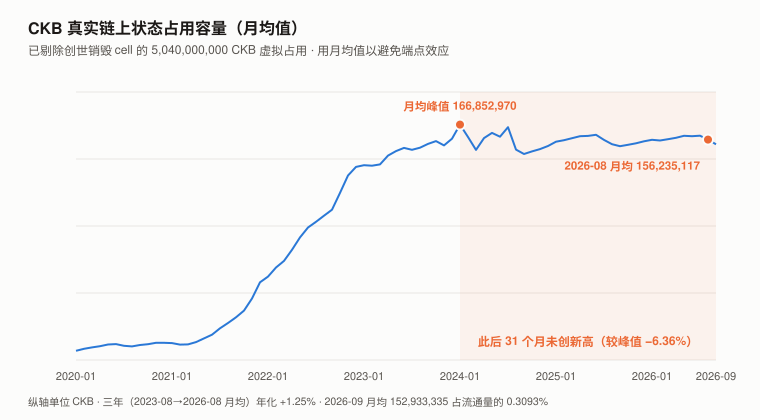
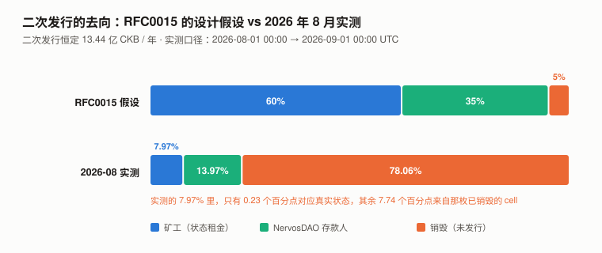
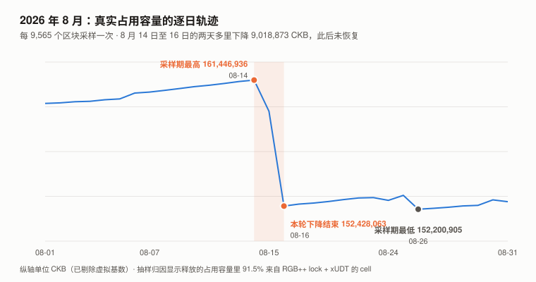

# CKB / Nervos 完整调研与分析报告

> **版本**：2026 年 8 月（首期）
> **完成日期**：2026-09-09
> **本系列第十二个资产**（BTC / SOL / ADA / ETH / BNB / HYPE / UNI / TRX / XIN / DOT / ZEC / **CKB**）
>
> **本版更新要点（首期，故为「本期确立了什么」）**：
>
> 1. **本期把 CKB 区块头的 `dao` 字段解出来了，并用它做出一份逐项的月度货币流分解。**
>    八月总发行 `ΔC` = +292,369,042 CKB，进入 DAO/国库池 `ΔS` = +100,267,109 CKB，
>    进入流通 **+192,101,933 CKB**。
>    **⚠️ 初稿把它称为「本系列第一个完全闭合的分解」并以浏览器流通量序列为证，这是错的，已撤回**——
>    浏览器的 `circulating_supply` 在源码里就是 `C − S − 常数`，与本推导是同一个式子（见 4.3）。
>    **本报告真正独立的交叉核对有五处，列在 4.3.1。**
> 2. **`dao` 字段里的「占用容量」`U` 有 97.06% 是一个硬编码的虚拟数**——
>    创世那枚 84 亿 CKB 的销毁 cell 被按 `SATOSHI_CELL_OCCUPIED_RATIO = 6/10` 记作 50.4 亿的占用。
>    剔除它之后，**CKB 真实的链上状态是 1.529 亿 CKB（2026-09 月均），占流通量的 0.3093%。**
> 3. **这个真实状态的月均值在 2024 年 1 月见顶 166,852,970 CKB，此后 31 个月未创新高；
>    2026 年 8 月月均 156,235,117，较峰值 −6.36%，近三年月均年化 +1.25%。**
>    CKB 的整套经济模型是向状态收租，而这个税基已经两年半没有创新高。
>    **⚠️ 初稿写的是「三年增长 0.38%」，那是拿两个 9 月 1 日的快照相减得出的端点假象**——
>    同一序列在 1,103 天里有 878 天高于那个起点。**已全部改用月均口径，见第 2 章与图 1。**
> 4. **RGB++ 在 8 月 14–17 日的两天多里解绑掉约 88% 的链上足迹。**
>    抽样归因（22/51 个下降段，覆盖降幅 36.8%）显示释放的占用容量里 **91.5% 来自 RGB++ lock + xUDT 的 cell**。
>    其官方工具链三个主仓库全部处于 archived 状态。
> 5. **本期发现 CoinGecko 的 CKB 价格序列在 2026-01 至 2026-05 是坏的**（四月隐含年化波动率 632%，
>    而币安同期是 68%）。**对照检查了 DOT / ZEC / TRX 三个资产，均正常。**
>    **⚠️ 三个不足以断言「前十一期都没被污染」——余 8 个未查（XIN 最该查）。**
>
> ---
>
> **本报告不给目标价。** 理由写在第 10 章，并给出可替代的反解式约束。
>
> **利益冲突声明**：作者未持有 CKB，与 Nervos 基金会、Cryptape 及任何 CKB 生态项目无雇佣、
> 顾问或投资关系。本报告的链上数据全部由作者从 CKB 主网节点与 GitHub 一手仓库直接抓取。

---

## 核心结论摘要（一页速览）

| 维度 | 观测 | 判断 |
|------|------|------|
| **价格（8/31）** | $0.001033，八月 **+25.82%**（BTC +24.95%） | **beta 预期是 +30.7%（1.231 × 24.95%），实际 +25.82%——特质成分约 −4.9pp** |
| **历史最低点** | **$0.000796，2026-08-14**——就在本报告期内 | 两个独立来源（CoinGecko / 币安）吻合到 0.04% |
| **距 ATH** | **−97.40%**（$0.04370633，2021-03-31） | 十二个资产里第二深，仅次于 DOT |
| **真实链上状态（存储字节折 CKB）** | **1.529 亿 CKB = 流通量的 0.3093%**（2026-09 月均 ÷ 2026-09-01 流通量） | **这是状态租金机制的全部税基**。⚠️ 它测字节数，不等于「被应用锁住的 CKB」 |
| **状态的长期轨迹（月均）** | 2024-01 见顶 **166,852,970** → 2026-08 **156,235,117**，**31 个月未创新高**；近三年年化 **+1.25%** | 增长在 2024 年初停下，此后在 −6% 的区间内震荡 |
| **协议记的「占用容量」** | 51.93 亿 CKB，其中 **97.06% 是虚拟的** | 硬编码常量，非真实状态 |
| **二次发行去向** | 矿工 7.97% / DAO 13.97% / **销毁 78.06%** | RFC0015 举例设想的是 60% / 35% / 5%（**是例子，不是协议要求**） |
| **八月手续费** | **全月合计 1,298.74 CKB = $1.16** | 占矿工收入的 **0.000693%** |
| **安全预算** | 日均 **$5,388**，年化占市值 3.56% | |
| **NervosDAO** | 91.60 亿 CKB（流通量 18.53%），其中 8.12 亿已在退出队列 | 八月净流出 5,522 万 CKB |
| **DAO 名义收益** | **2.06%/年**，而流通量年增 4.69% | **存款人份额仍在以 −2.49%/年缩水** |
| **RGB++** | 活跃容量剩 **2,139,213 CKB** | 官方 SDK / API / 浏览器三个仓库均已归档 |
| **在建的东西** | **Fiber**（支付通道网络），主网脚本 2025-02-28 已部署 | **链上 34 个通道、39,691 CKB**——只有 RGB++ 残余量的 1/54 |
| **本报告给目标价** | **否** | 理由与替代约束见第 10 章 |

> **一句话**：**CKB 的设计是一台向链上状态收租的机器，而它要收租的那个状态，
> 折合供应量的 0.31%、且已经三年没有长大；
> 机器仍在付钱给矿工，只是 97% 的付款依据是一枚 2019 年就写死的虚拟占用。**

---

## 1. CKB 是什么

### 1.1 一个把「存储」而不是「计算」定价的链

CKB（Common Knowledge Base）是 Nervos 网络的 L1，2019-11-15 创世，PoW（Eaglesong 算法）。
它与主流 L1 最根本的差别不在性能，而在**代币的用途定义**：

| | 以太坊 | CKB |
|---|---|---|
| 代币主要用途 | 支付**计算**（gas） | **占用状态空间的凭证** |
| 存 1 字节状态要 | 一次性 gas | **持有并锁定 1 CKB**，只要状态在就一直锁着 |
| 状态膨胀的代价 | 由全节点承担，用户不直接付 | **用户以「持有代币的机会成本」持续支付** |

CKB 的账本模型叫 **Cell 模型**（UTXO 的泛化）。每个 Cell 有一个 `capacity` 字段，
单位是 CKB；一个 Cell 实际占用多少字节，就必须至少持有多少 CKB。
**一个最小的 Cell 是 61 字节，因此至少要 61 CKB。**

**这套设计的经济含义是：链上状态越多，被锁住的 CKB 越多，流通中的 CKB 越少。**
本报告第 5 章要做的事，就是把「链上状态」这个量真正测出来。

### 1.2 两种发行：一次发行有上限，二次发行永续

| | 一次发行（base issuance） | 二次发行（secondary issuance） |
|---|---|---|
| 总量 | **336 亿 CKB 封顶** | **无上限，恒定 13.44 亿 CKB / 年** |
| 节奏 | 每 8,760 个 epoch（约 4 年）减半 | 永不改变 |
| 去向 | **全部给矿工** | **分给三方**，见下 |
| 源码常量 | `INITIAL_PRIMARY_EPOCH_REWARD = 1,917,808.21917808` CKB/epoch | `DEFAULT_SECONDARY_EPOCH_REWARD = 613,698.63013698` CKB/epoch |

二次发行的分配规则写在 RFC0015 里，**原文（第 136 行）给的例子是**：

> 假设在一次二次发行时，全部 CK Byte 的 **60% 用于存储状态**、**35% 存入 NervosDAO 锁定**、
> **5% 保持流动**。那么二次发行的 60% 归矿工，35% 归 NervosDAO 按锁定量比例分配。
> 剩下的部分（本例中的 5%）如何使用由社区通过治理机制决定；
> **在社区达成一致之前，这部分二次发行将被销毁。**

**这段话是本报告的锚。** 第 5 章会把「60% / 35% / 5%」这三个假设逐一与 2026 年 8 月的实测对齐。

### 1.3 三个账都写在区块头里

CKB 每个区块头有一个 32 字节的 `dao` 字段，装着四个小端序 u64。
**这是本报告全部供应量分析的一手数据源，不经过任何第三方统计。**

| 偏移 | 含义 | 2026-09-01 的值 |
|---|---|---|
| `[0..8]` | **C** — 累计发行量 | 65,349,752,951 CKB |
| `[8..16]` | **AR** — 累计利率（创世值恰为 10^16） | 1.202838（÷10^16 后） |
| `[16..24]` | **S** — 累计进入 NervosDAO/国库池的二次发行，减去已提取利息 | 7,415,902,821 CKB |
| `[24..32]` | **U** — 占用容量 | 5,192,741,969 CKB |

> ⚠️ **一个必须记下的坑**：CKB 官方库的解码函数 `extract_dao_data` 的**返回值签名是 `(ar, c, s, u)`，
> 而它读取的字节顺序是 `c, ar, s, u`。**
> **只看返回值的变量名会把 C 和 AR 解反。**
> 本报告是用两个不依赖任何命名的实测证据定序的：
> ① 创世块 `[8..16]` 恰好等于 `10,000,000,000,000,000` = 10^16，而只有 AR 的定义初值是这个数；
> ② 创世块 `[0..8]` 折合 33,600,001,452 CKB，与文档记载的 336 亿创世发行量一致。
> 事后在 `ckb-dao-utils` 源码中确认，字节顺序确实是 `c, ar, s, u`。

---

## 2. CKB 的发展阶段划分

### 阶段一：创世与「不做通用计算」的路线（2019-11 – 2020）

CKB 主网 2019-11-15 上线。创世分配 336 亿 CKB，其中 **84 亿（25%）打入一个 `code_hash` 全零的锁**——
永久不可花费，即所谓「中本聪的礼物」（Satoshi's Gift），
其锁参数 `0x62e907b15cbf27d5425399ebf6f0fb50ebb88f18` 与源码常量 `SATOSHI_PUBKEY_HASH` 逐字节相同。

**这枚销毁 cell 在第 5 章会重新出现，而且是本期最重要的发现的核心。**

### 阶段二：状态快速积累（2021 – 2023-09）

链上真实占用容量从 2020-09 的 1,048 万 CKB 涨到 2023-09 的 1.522 亿 CKB，**三年 14.5 倍**。
这是 CKB 唯一一段「税基真的在长」的时期。2021-03-31 价格见 ATH $0.04370633。

### 阶段三：首次减半（2023-11-19）

epoch 8760、区块 11,487,788、2023-11-19 17:23 UTC，一次发行从每 epoch 1,917,808 CKB 减半到 958,904 CKB。

### 阶段四：RGB++ 叙事（2024 – 2025）

RGB++ 是把比特币 UTXO 与 CKB Cell 做同构绑定的协议，让比特币上的资产用 CKB 做验证层。
这是 CKB 在 2024–2025 年的主叙事，也是本期第 6 章的对象。

### 阶段五：状态见顶与 RGB++ 退潮（2024-01 – 至今）

> ⚠️ **本节的口径经过一次修订，修订本身值得记录。**
> **初稿用「每年 9 月 1 日」的年度快照，得出「三年 +0.38%，不是放缓是停止增长」。**
> **推理审查指出这是端点选择**：终点 2026-09-01 恰好在本报告自己判定「不应外推为趋势」的
> RGB++ 解绑事件之后。**复核浏览器 1,103 天的日度序列后，初稿的描述不成立**——
> 该窗口内有 878 天高于那个起点，且序列在 2024-01-22 至 01-28 曾连续七天站上 1.80 亿。
> **本节改用月均值，它对端点不敏感。**

| 月份（月均） | 真实占用容量 |
|---|---|
| 2023-08 | 150,526,365 CKB |
| 2023-12 | 156,920,036 CKB |
| **2024-01** | **166,852,970 CKB** ← 月均峰值 |
| 2024-09 | 146,032,169 CKB ← **峰值后的月均低点**（2023-01 之前另有更低的月份） |
| 2025-08 | 152,958,239 CKB |
| 2026-07 | 159,019,263 CKB |
| **2026-08** | **156,235,117 CKB**（较峰值 **−6.36%**） |
| 2026-09 | 152,933,335 CKB |

| 口径（月均） | 变化 | 年化 |
|---|---|---|
| 2023-08 → 2026-08（三年） | +3.79% | **+1.25%** |
| 2024-08 → 2026-08（两年） | +4.76% | **+2.35%** |
| 2025-08 → 2026-08（一年） | +2.14% | **+2.14%** |



**修订后的判断**：**不是「三年零增长」，而是「2024 年 1 月见顶后 31 个月没有创新高，
期间以每年 1–2% 的速度在一个约 ±6% 的带内震荡」。**

> **阶段四和阶段五在时间上是重叠的**——RGB++ 叙事最热的两年，
> **链上状态从 2024 年初的峰值一路走平并小幅回落。**
> **这两件事同时为真，本身就是本报告要解释的东西。**

---

## 3. CKB 当前现状

### 3.1 价格与市场

> **口径**：CKB 与 BTC 均取**币安 UTC 日收盘价**，八月定义为 2026-07-31 收盘 → 2026-08-31 收盘。
> 原因见 3.2——CoinGecko 的 CKB 序列在今年前五个月不可用。

| 指标 | 值 |
|------|-----|
| 价格（2026-09-09） | **$0.00113774**（CoinGecko）/ 币安中间价 $0.0011465 |
| 市值 / FDV | **$56,300,510** / $57,257,710 |
| CoinGecko 排名 | **第 421 位** |
| 流通量 / 总量 | 49,486,923,659 / 50,328,778,792（**无上限**，二次发行永续） |
| **八月涨幅** | **+25.82%**（BTC +24.95%） |
| 八月盘中区间 | **$0.000796（8/14）– $0.001129（8/20）**，振幅 41.8% |
| **历史最低** | **$0.000796，2026-08-14** — 就在本报告期内 |
| 距 ATH | **−97.40%**（$0.04370633，2021-03-31） |
| 近一年 / 年初至今 | **−77.60%** / **−54.01%**（BTC −30.75% / −11.17%） |

**八月是 CKB 近 13 个月里第二个上涨的月份**（另一个是 2026-04 的 +0.62%），
而它与 BTC 同月的 +24.95% 几乎同步——**8/20–8/22 三天 BTC 从 $64,686 涨到 $78,318，CKB 同步跳升。**

> **八月的上涨里，CKB 自身贡献的部分是负的。**
> **正确的算法不是看 R²**（R² = 46.2% 的字面含义是「53.8% 的日波动不由 BTC 解释」，
> **拿它来论证「没有自己的信息」是把反证当证据，初稿这么写过，已更正**），
> **而是看 beta 预期与实际的残差**：
>
> | | 值 |
> |---|---|
> | BTC 八月（币安口径） | +24.95% |
> | CKB 的 beta | 1.231 |
> | **beta 预期涨幅** | **+30.71%** |
> | CKB 实际涨幅 | +25.82% |
> | **特质（残差）成分** | **约 −4.89 个百分点** |
>
> 用 CoinGecko 口径（CKB +20.15% / BTC +23.62%，beta 预期 +29.08%）算，残差约 **−8.9pp**，**方向相同**。
> **这与第 6 章的叙事一致**：八月中旬 CKB 链上发生的唯一大事是 RGB++ 资产被大规模解绑。

### 3.2 一个必须先说明的数据问题：CoinGecko 的 CKB 序列在今年前五个月是坏的

本报告在计算年化波动率时得到 **234.2%** 和一个近乎为零的 R²（0.008），这个结果不可信，
因此回到交易所一手数据对质。**币安 CKBUSDT 日线与 CoinGecko 逐月对照：**

| 月份 | CoinGecko 隐含年化波动率 | 币安 | 月均价偏差 |
|---|---|---|---|
| 2025-09 至 2025-12 | 64%–149% | 63%–150% | **0.2%–1.0%** |
| **2026-01** | 111% | 86% | **+6.4%** |
| **2026-02** | 183% | 96% | **+22.6%** |
| **2026-03** | 322% | 49% | **+36.8%** |
| **2026-04** | **632%** | 68% | **+41.7%** |
| **2026-05** | 252% | 54% | **+33.8%** |
| 2026-06 至 2026-09 | 44%–77% | 44%–65% | **0.7%–2.9%** |

**这是本系列第一次遇到「数据源在窗口两端都对、中间一段坏掉」的情况。**
前几期遇到的是「数据源在测另一条链」（DOT）或「数据源的模型不适用」（ZEC），
那两种错误在整个窗口内一致；**这一次的错误只在特定时段出现，因此任何只看首尾的核对都发现不了它。**

**排他性检查**：用同一方法对照了 **DOT / ZEC / TRX 三个资产**的 CoinGecko 与币安序列，
**三者在全部 13 个月内均一致**（波动率比值 < 1.5 倍、月均价偏差 < 5%）。

> ⚠️ **这三个不足以支持「前十一期都没被污染」的全称结论，初稿这么写过，已收窄。**
> **已查 3 个（DOT / ZEC / TRX），均正常；余 8 个（BTC / SOL / ADA / ETH / BNB / HYPE / UNI / XIN）未查。**
> **按本报告自己的诊断逻辑（流动性越低的资产，聚合报价越容易坏），
> XIN（八月日成交中位数 $10,878）恰恰是最该查而没查的那一个。下期补。**

**修正后的风险特征（币安，2025-09-10 至 2026-09-09，365 天日对数收益）：**

| 指标 | CKB | BTC |
|---|---|---|
| 年化波动率 | **80.3%** | 44.3% |
| beta（相对 BTC） | **1.231** | 1.000 |
| 相关系数 / R² | 0.680 / **0.462** | — |

> 校验：R² = (β × σ_BTC ÷ σ_CKB)² = (1.231 × 44.3% ÷ 80.3%)² = 0.462 ✓

### 3.3 流动性：这是本系列见过的最薄的可交易资产

| 口径 | 值 |
|---|---|
| 币安 CKBUSDT 八月日成交额（中位数 / 均值） | **$153,486** / $239,910 |
| CoinGecko 全站八月日成交额中位数 | $1,464,833 |
| 币安订单簿 ±1%（买 / 卖） | $35,156 / **$12,403** |
| 币安订单簿 ±2%（买 / 卖） | $37,601 / **$22,594** |
| 500 档双边深度合计 | **$259,092 = 市值的 0.46%** |
| 买一卖一价差 | 0.087% |

**卖出约 2.3 万美元就会把币安价格打下 2%。**

| 交易对状态（币安 `exchangeInfo`，一手） | |
|---|---|
| CKBUSDT | **TRADING**（现货 + 杠杆） |
| CKBBTC | **BREAK**（暂停），最后一根日线成交在 **2022-05-14** |

CKB 目前不在币安的 Monitoring Tag（观察名单）上（2026-09-04 那批加入的是 AVA / GNS / SCR / TOWNS）。
**⚠️ 该条与「KuCoin 于 2026-05-20 将 CKB 移出全仓杠杆」一样，来源为搜索摘要，本报告未打开一手公告，核实等级低。**

### 3.4 宏观环境

| 因素 | 状态（9 月初） | 影响 |
|------|--------------|------|
| 联邦基金利率 | 3.50–3.75% | — |
| 9 月加息概率 | **65.9%**（CME FedWatch，8/31） | 利空 |
| PCE 通胀 | 3.7%（12 个月）/ 4.1%（6 个月） | 支持加息 |
| 10 年期美债 | 4.79% | — |

> 本节沿用与本系列 TRX / UNI / XIN / DOT / ZEC 期同一时点的宏观快照。
> **CKB 的 R² 为 46.2%，在十二个资产里居中——宏观通过 BTC 的传导可以解释它约四成六的波动。**

---

## 4. 八月的货币流：逐项分解（本期核心章之一）

### 4.1 测量方法

取两个区块头的 `dao` 字段直接相减。**没有第三方统计参与。**

| | 起点 | 终点 |
|---|---|---|
| 时点（UTC） | 2026-08-01 00:00 | 2026-09-01 00:00 |
| 区块高度 | 20,025,197 | 20,321,726 |
| epoch | 14,661 | 14,847 |
| **C**（累计发行） | 65,057,383,909 | 65,349,752,951 |
| **S**（DAO/国库池） | 7,315,635,712 | 7,415,902,821 |
| **U**（占用容量） | 5,199,777,992 | 5,192,741,969 |
| **AR**（累计利率） | 1.200735 | 1.202838 |

区间跨 296,529 个区块、186 个 epoch。实测出块间隔 **9.03 秒**（协议目标 8 秒），
epoch 长度因此被调到约 1,594 块，**epoch 实际时长正好 4.00 小时**（协议目标 4 小时）。

### 4.2 分解

一次发行与二次发行的比例由源码常量固定：当前处于第一次减半之后，
每 epoch 一次发行 958,904.109589 CKB、二次发行 613,698.630137 CKB，
即一次发行占总发行的 **60.9754%**。

| 项 | CKB | 占总发行 |
|---|---:|---:|
| **总发行 ΔC** | **+292,369,042** | 100% |
| ├ 一次发行（全部给矿工） | +178,273,806 | 60.98% |
| └ 二次发行 | +114,095,236 | 39.02% |

二次发行按共识规则拆分。矿工那一份的公式在 `ckb/util/dao/src/lib.rs` 里写得很直白：

```rust
miner_issuance = g2 × parent_u / parent_c      // g2 = 该块的二次发行
nervosdao_issuance = g2 − miner_issuance       // 其余全部进入 S
current_s = parent_s + nervosdao_issuance − withdrawed_interests
```

区间内 U/C 的均值为 **7.9693%**，据此：

| 二次发行的去向 | CKB | 占二次发行 | 对照 |
|---|---:|---:|---|
| **→ 矿工（状态租金）** | +9,092,578 | **7.97%** | ✅ **独立**：浏览器 `mining_reward` = 逐块 `secondary_reward` 求和，增量 **9,089,920**，差 **0.03%** |
| **→ NervosDAO 存款人计提** | +15,937,324 | **13.97%** | ⚪ **直接取用**浏览器 `deposit_compensation` 增量，非本报告独立推导 |
| **→ 国库（未发行，即销毁）** | +89,065,334 | **78.06%** | ⚠️ **不独立**：浏览器 `treasury_amount` 由 `S` 派生（见 4.4），增量 95,802,883，差 +7.6% |

**S 的变化**：进入 S 的是 114,095,236 − 9,092,578 = **105,002,658**；
实测 ΔS = **+100,267,109**；**差额 4,735,549 CKB 就是八月 NervosDAO 存款人实际提走的利息。**

### 4.3 闭合检验

进入流通的量 = 总发行 − 留在 S 里的量：

```
ΔC − ΔS = 292,369,042 − 100,267,109 = +192,101,933 CKB
```

| 口径 | 八月流通量增量 |
|---|---|
| **本报告（区块头 dao 字段推导）** | **+192,101,933 CKB** |
| CKB 浏览器 `circulating_supply` 日度序列 | +192,142,780 CKB |
| 差额 | 40,847 CKB（0.021%） |

> ⚠️ **本报告初稿把这一行写成「两条独立路径的核对」，这是错的，现予撤回。**
>
> **打开 CKB 浏览器源码 `app/models/market_data.rb` 后可以看到，它的 `circulating_supply` 是：**
>
> ```ruby
> parsed_dao.c_i - parsed_dao.s_i - BURN_QUOTA
>   - ecosystem_locked - team_locked - private_sale_locked
>   - founding_partners_locked - foundation_reserve_locked - bug_bounty_locked
> ```
>
> **即 `C − S − 84 亿 − 各归属锁定 − 赏金地址余额`。** 而全部归属锁定的最后一档在 2022-12-31 释放完毕，
> 赏金地址（`ckb1qyqy6mtud5sgctjwgg6gydd0ea05mr339lnslczzrc`）**余额 103,000,771 CKB、历史上只有 1 笔交易、
> 当前 1 个活跃 cell**，八月未发生变化。
>
> **所以浏览器算的就是 `C − S − 常数`，与本报告的 `ΔC − ΔS` 在代数上是同一个量，不是独立测量。**
> **那 40,847 CKB 的差额也不是「两个方法吻合」，它对应约 9.5 分钟的区块边界漂移**
> （本报告取的是 20,025,197 与 20,321,726 两个块，浏览器取的是它自己日度快照时刻的 tip）。
>
> **这是本系列 UNI 期「把拟合报成了验证」的同型错误，只是更彻底——那次是拟合，这次是恒等式。**

**本报告因此把这一条降级为「恒等式自洽」，不作为交叉验证。**
**八月的流通量增速仍然成立：+0.3901%（月），年化 4.59%（简单）/ 4.69%（复利）**，
因为它只依赖 `ΔC` 与 `ΔS` 两个链上直读值，不依赖浏览器。

### 4.3.1 本报告真正独立的五处交叉核对

**撤回上面那一条之后，需要说清楚哪些核对是真的独立的**（判据：两条路径不共用同一个输入字段）：

| # | 被核对的量 | 路径一 | 路径二 | 残差 |
|---|---|---|---|---|
| 1 | **真实占用容量** | 区块头 `dao` 的 U 减虚拟基数 | 浏览器 `occupied_capacity` = **对全部活跃 cell 的 `occupied_capacity` 求和**（源码 `daily_statistic.rb`，与 dao 字段无关） | **0.0015% / 0.0092%** |
| 2 | **二次发行给矿工的部分** | 本报告按 `g2 × U/C` 推导 | 浏览器 `mining_reward` = **逐块 `secondary_reward` 求和**（来自节点的 block economic state） | **0.03%** |
| 3 | **NervosDAO 存量** | 本报告用 indexer `get_cells` 全量遍历 22,675 枚 cell | 浏览器 `total_dao_deposit`（基于其自建的 DaoEvent 索引） | **0.003%** |
| 4 | **八月总发行 ΔC** | 区块头 C 相减 = 292,369,042 | 186 个 epoch × 每 epoch 1,572,602.74 CKB = 292,504,109 | **0.05%** |
| 5 | **累计一次发行** | `C(9/1) − C(创世) − epoch × 二次发行常量` | era0 + era1 分档累加 | **0.01%** |

> **第 1 项是本报告最重要的核对**，因为第 5 章的全部结论都建立在它上面，
> **而它确实是两条不共用输入的路径。**

### 4.4 国库项的残差：成因已定位

上表里 `treasury_amount` 一项与本报告的推导差 **+7.6%**；
浏览器三项加总（95,802,883 + 15,937,324 + 9,089,920 = 120,830,127）比区间实际的二次发行 114,095,236
**多出 6,731,020 CKB（5.9%）——一个正确的分解不可能大于被分解的总量。**

**初稿把这归因于「日度边界对齐」，这是猜测。领域审查（Codex）提出了一个具体假说，
本报告打开浏览器源码 `app/models/daily_statistic.rb` 核实，假说成立：**

```ruby
define_logic :deposit_compensation do
  unclaimed_compensation.to_i + claimed_compensation.to_i     # 全部未领取 + 已领取
end

define_logic :treasury_amount do
  parse_dao = CkbUtils.parse_dao(current_tip_block.dao)
  parse_dao.s_i - unmade_dao_interests                        # S 减去「阶段一未领取」
end

def unmaed_cells
  DaoEvent...deposit_to_dao.created_before(ended_at).unconsumed_at(ended_at)   # 只含阶段一
end
```

**`treasury_amount` 只从 S 里减掉「阶段一存款 cell 的未领取利息」，
而 `deposit_compensation` 把阶段一、阶段二、已领取的全部计入。
因此「阶段二（取款中）cell 的未领取利息」同时落在两项里，被重复计算。**

**本报告 5.5 测出阶段二 cell 有 812,109,529 CKB，占 DAO 总量的 8.9%——
这个量级与 6,731,020 CKB 的超额是相容的。**

> **两条要记住的**：
> **① 浏览器的 `treasury_amount` 不是独立测量**——它由 `S` 派生，而 `S` 正是本报告用的那个字段。
> **② 初稿说「浏览器有问题，本报告没问题」是不成立的**——在没有读源码之前，
> 本报告没有任何依据把误差归到对方身上。**这个判断是被外部审查纠正的。**

---

## 5. 状态租金：设计与实测之间有多远（本期核心章之二）

### 5.1 协议记的「占用容量」有 97% 是一个虚拟数

`dao` 字段里的 U 在 2026-09-09 是 **5,193,042,382 CKB**。
按字面理解，这意味着 CKB 链上有 51.93 亿字节（约 5.2 GB）的状态。**这个数是假的。**

**证据一：创世块的 U 就已经是 50.41 亿。**

| | CKB |
|---|---|
| 创世块 `dao` 字段的 U | **5,041,203,089** |
| 本报告遍历创世块 673 个输出、逐个按 `8 + lock脚本 + type脚本 + data` 字节数算出的真实占用 | **1,203,211** |
| 差额 | **5,039,999,878** |

**证据二：这个差额等于 84 亿 × 0.6。**

CKB 源码 `spec/src/consensus.rs`：

```rust
// Ratio of satoshi cell occupied of capacity,
// only affects genesis cellbase's satoshi lock cells.
pub(crate) const SATOSHI_CELL_OCCUPIED_RATIO: Ratio = Ratio::new(6, 10);
```

而 `spec/src/lib.rs` 里这个字段的文档注释是：

> `/// The burned cell virtual occupied, design for NervosDAO`
> （被销毁 cell 的**虚拟占用**，为 NervosDAO 而设计）

**即：创世那枚 84 亿 CKB 的永久销毁 cell，被协议按 60% 记作 50.4 亿 CKB 的「占用容量」。**
84 亿 × 0.6 = **5,040,000,000**，与上表差额 5,039,999,878 相差 122 CKB
（这 122 来自本报告对创世 cell 占用字节数的近似算法，误差 0.01%）。

**证据三：剔除虚拟基数后，与浏览器独立索引的结果吻合。**

| | 2026-08-01 | 2026-09-01 |
|---|---|---|
| `dao` 字段 U | 5,199,777,992 | 5,192,741,969 |
| **减去虚拟基数 5,040,000,000** | **159,777,992** | **152,741,969** |
| CKB 浏览器 `occupied_capacity`（独立索引全部活跃 cell） | **159,780,423** | **152,727,921** |
| 残差 | **−0.0015%** | +0.0092% |

**结论：CKB 真实的链上状态是 1.527 亿 CKB。协议记的 51.93 亿里，97.06% 是那枚销毁 cell 的虚拟占用。**

### 5.2 RFC0015 的三个假设，逐一对照

RFC0015 的分配例子假设 60% 存状态 / 35% 存 DAO / 5% 流动。**2026 年 8 月的实测：**

| | **RFC0015 的例子** | **2026-08 实测** | 差距 |
|---|---|---|---|
| 状态占用 → 矿工 | **60%** | **7.97%** | **7.5 倍** |
| └ 其中来自真实状态 | — | **0.23 个百分点** | |
| └ 其中来自虚拟销毁 cell | — | **7.74 个百分点** | |
| NervosDAO → 存款人 | **35%** | **13.97%** | 2.5 倍 |
| 剩余 → 销毁 | **5%** | **78.06%** | **15.6 倍** |



> **这张表是本报告最重要的一张。**
>
> **① 状态租金这条腿几乎没有在工作。** 矿工拿到的 7.97% 里，只有 0.23 个百分点对应真实状态；
> 其余 7.74 个百分点是在为一枚 2019 年就被销毁、永远不会变化的 cell 付租金。
> **如果没有这个虚拟基数，矿工的状态租金收入会是现在的 1/34。**
>
> **② 「在社区达成一致之前销毁」这个临时安排，运行到今天已经烧掉了约 67 亿 CKB**
> （浏览器 `treasury_amount` 累计值 6,698,061,406 CKB），**八月一个月就烧掉 8,907 万 CKB。**
> 而截至 2026-09，Nervos 官方唯一与国库有关的仓库是 `nervosnetwork/ckb-treasury-lab`，
> **建于 2026-07-02，README 第一行写着「NOTE This is not a production project.」**
> ——距 RFC0015 写下这个「临时安排」已经过去八年。

### 5.2.1 虚拟占用不是「白记的账」——它是一笔从持有人到矿工的转移

**初稿把「97.06% 是虚拟的」当成纯粹的诊断性发现。推理审查指出它有可量化的经济后果，且方向与本报告的另一处叙述冲突。**

假设把虚拟基数取消、U 只记真实状态：

| | 现状（含虚拟基数） | 假想（只记真实状态） |
|---|---|---|
| U / C | **7.9693%** | **0.2342%** |
| 八月矿工的状态租金 | **9,092,578 CKB** | **267,199 CKB** |
| 八月进入销毁的部分 | 89,065,334 CKB | **97,890,713 CKB** |
| **销毁占二次发行** | **78.06%** | **85.80%** |

**差额 8,825,379 CKB/月、年化 105,904,545 CKB（流通量的 0.214%），
是虚拟基数把本应销毁的部分转给了矿工。**

> **这个发现纠正了本报告 9.1/9.2 两张表里的一处不一致**：
> **多头 #1「78.06% 被销毁，实际稀释低」与空头 #2「97.06% 的占用是虚拟的」是同一枚硬币的两面**——
> **正是那个虚拟基数把销毁比例从 85.80% 压到了 78.06%。**
> **对持有人而言，虚拟占用等于每年多 0.214% 的稀释；对矿工而言是一笔补贴。**
>
> **同时也要给这个设计一个公允的读法**（本报告未找到设计文档，以下是重构，**未经核实**）：
> 创世那 84 亿销毁币仍然计在 C 里。**若不给它记虚拟占用，它对应的那份二次发行会被永久销毁**——
> 协议按 60% 把它当作一个「平均参与者」对待，是一个可以争论但并非无理的选择。
> **下期需核实：`SATOSHI_CELL_OCCUPIED_RATIO = 6/10` 是否有对应的 RFC / issue / PR 讨论记录。**

### 5.3 反解：要让 RFC0015 的假设成立，需要什么

**不给目标价，改给约束**（本系列 DOT 期确立的做法：反解比单边区间敏感性有信息量）。

要让「60% 的 CK Byte 用于存储状态」成立，真实状态需要达到 0.60 × C = **392.10 亿 CKB**，
即当前 1.527 亿的 **257 倍**。

| 按什么增速外推 | 实测增速 | 达到 257 倍需要 |
|---|---|---|
| 近 12 个月 | **+1.90% / 年** | **295 年** |
| 近 36 个月年化 | **+0.13% / 年** | **4,429 年** |

> **这个反解不是修辞。** 它说明的是：**RFC0015 设想的那个均衡状态，在当前的采用轨迹上不可达，
> 因此「状态租金」不是一个即将启动的机制，而是一个需要重新设计的机制。**
> 而重新设计需要治理，治理需要国库，国库还停在 lab 阶段。

### 5.4 NervosDAO 保护了什么，没保护什么

RFC0015 第 138 行写：

> 对长期持币者而言，只要把代币锁进 NervosDAO，二次发行的通胀效应就只是名义上的。
> 对他们来说就像二次发行不存在一样，**他们持有的是像比特币那样有硬顶的代币。**

**这句话在它自己的范围内成立，但读者很容易把它理解成「存进 DAO 就不被稀释」，那是错的。**

AR 的更新公式（源码）是 `ar_increase = parent_ar × g2 / parent_c`——
**存款人按「二次发行 ÷ 累计发行」的全额计息，因此二次发行对他们确实是中性的。**
**但一次发行不在补偿范围内。**

| | 八月实测 | 年化 |
|---|---|---|
| NervosDAO 名义收益（AR 增长） | +0.1751% | **+2.06%** |
| 流通量增长 | +0.3901% | **+4.69%** |
| **存款人相对份额变化** | | **−2.49%** |

**所以：把 CKB 存进 NervosDAO，仍然每年损失约 2.5% 的网络份额。**
这不是设计缺陷——RFC0015 从没承诺补偿一次发行，就像比特币持有者也承受比特币的区块奖励稀释。
**它是「像比特币一样有硬顶」这个类比在读者端的失真。**

**这个缺口会随减半收敛。** 按当前参数外推（假设 U/C 与 DAO 占比不变）：

| 时点 | 一次发行 | 流通量年增 | DAO 收益率 | 存款人份额年变 |
|---|---|---|---|---|
| 现在 | 21.0 亿/年 | 4.72% | 1.95% | **−2.64%** |
| 2027-11 第二次减半后 | 10.5 亿/年 | 2.53% | 1.89% | **−0.63%** |
| 2031-11 第三次减半后 | 5.25 亿/年 | 1.34% | 1.64% | **+0.29%** |

> **一个可检验的推论：NervosDAO 存款人的份额侵蚀会在 2031 年前后由负转正。**
> **⚠️ 这是一个恒等式外推，不是预测**——它假设 U/C、DAO 占比、提取行为都不变，
> 而这三个量在过去 12 个月都在变。它的用途是给出量级，不是给出时点。

### 5.5 NervosDAO 的存量与口径

| 口径 | 数量 | CKB |
|---|---|---|
| **阶段一（存款中）cell** | 20,776 枚 | **8,347,466,893** |
| **阶段二（取款中）cell** | 1,899 枚 | **812,109,529** |
| **合计（链上 indexer 遍历）** | 22,675 枚 | **9,159,576,422** |
| 对照：`get_cells_capacity` 一次性查询 | — | 9,159,593,814（差 0.0002%） |
| 对照：CKB 浏览器 `total_dao_deposit` | — | 8,347,705,393（**只数阶段一**，差 0.003%） |

> **口径差异必须说明**：CKB 浏览器报的「NervosDAO 存款」只包含阶段一，
> **漏掉了 8.12 亿 CKB（占合计的 8.9%）已经进入取款流程的部分。**
> 本报告在讲「锁仓比例」时用合计口径，在与浏览器序列做增量对照时用阶段一口径。

| 指标 | 值 |
|---|---|
| 锁仓 / 流通量（合计口径） | **18.53%** |
| 锁仓 / 流通量（仅阶段一） | 16.88% |
| **八月存款净变化（浏览器口径）** | **−55,216,610 CKB** |
| 八月新增存入合计 | +131,481,506 CKB |
| **隐含提取** | **−186,698,116 CKB** |
| 累计存款人数 | 79,965 → 80,087 |

**八月 NervosDAO 是净流出的**，且 8.12 亿 CKB 还排在取款队列里（占流通量 1.64%）。

---

## 6. RGB++ 的收缩：一次可以被逐块测量的解绑（本期核心章之三）

### 6.1 事件

第 5 章测出的真实状态在八月从 1.598 亿掉到 1.527 亿（**−4.40%**），
但这个下降不是渐进的——**它集中在 8 月 14 日到 17 日的两天多里。**

| 采样时点（UTC） | 区块 | 真实占用容量 |
|---|---|---|
| 08-13 17:39 | 20,149,542 | 161,347,500 |
| **08-14 18:53** | 20,159,107 | **161,446,936** ← 采样期最高 |
| 08-15 20:30 | 20,168,672 | 159,211,023 |
| **08-16 21:49** | 20,178,237 | **152,428,063** ← 本轮下降结束 |
| 08-17 21:27 | 20,187,802 | 152,567,815 |
| **08-26 03:05** | 20,264,322 | **152,200,905** ← 采样期最低 |
| 08-31 23:58 | 20,321,712 | 152,741,115 |

> 采样步长为 **9,565** 个区块（约一日），共 32 个采样点。

**这次下降从 08-14 18:53 的 161,446,936 到 08-16 21:49 的 152,428,063，
两天多下降 9,018,873 CKB，此后没有恢复。**

> ⚠️ **口径提醒**：**08-16 是这一轮下降的终点，不是八月的最低点。**
> 采样期的最低点是 **08-26 03:05 的 152,200,905 CKB**，比 08-16 又低 227,158 CKB。
> **从采样期最高到采样期最低是 −9,246,031 CKB。**
> 本报告在描述这次事件时用 08-14 → 08-16 的区间，因为归因分析只覆盖这个窗口；
> **两个数不可互换使用。**



### 6.2 归因：抽样分类，不做推断

以 10 个区块为步长扫过 20,159,107–20,178,237 这 19,130 个区块的 U 序列，
得到 **51 个降幅超过 50,000 CKB 的下降段，合计 −9,453,316 CKB**。

**在「下降段」这个总体里随机抽 22 段**（覆盖总降幅的 **36.8%**），
把这些区块的全部非 cellbase 交易的输入 cell 取回来，按 lock + type 脚本分类：

| 输入 cell 的 lock + type | 释放的占用容量 | 占比 | 释放的容量 |
|---|---:|---:|---:|
| **RGB++ lock + xUDT** | **3,264,442 CKB** | **91.5%** | 5,847,291 CKB |
| secp256k1 + 无 type | 279,136 CKB | 7.8% | 4,669,045 CKB |
| 其余四类合计 | 25,971 CKB | 0.7% | 115,772 CKB |

**样本自洽性检验**（220 个区块、674 笔非 cellbase 交易，与上表同一次运行）：
逐笔算出的占用容量净变化为 **−3,488,043 CKB**（释放 3,569,549 − 新增 81,506），
而这些区块 `dao` 字段 U 的实测净变化是 **−3,474,623 CKB**，**残差 +0.39%**
（残差方向与创世块那 122 CKB 一致，来自本报告对 occupied 字节数的近似算法）。

**脚本身份用一手来源核对**（`ckb-cell/rgbpp-sdk` 的 `MainnetInfo` 常量表）：

| 脚本 | code_hash | 来源 |
|---|---|---|
| RGB++ lock | `0xbc6c568a1a0d0a09f6844dc9d74ddb4343c32143ff25f727c59edf4fb72d6936` | `MainnetInfo.RgbppLockScript.codeHash` |
| xUDT type | `0x50bd8d6680b8b9cf98b73f3c08faf8b2a21914311954118ad6609be6e78a1b95` | `MainnetInfo.XUDTTypeScript.codeHash` |

**典型交易形态**：40 个 RGB++ lock + xUDT 的 cell（每枚容量中位数 254 CKB）作为输入，
输出 1 个 61 字节的标准 secp256k1 裸 cell。**即：把绑定在比特币 UTXO 上的资产解绑，换回普通 CKB。**
样本内共消耗 **20,661 枚** 这样的 cell。

**外推到整个窗口**（按 91.5% 的占比）：RGB++ 释放的占用容量约 **864.5 万 CKB**，
对应释放的容量约 **1,549 万 CKB**，约 **5.6 万枚 cell**。

> ⚠️ **外推的精度声明**：抽样覆盖降幅的 36.8%，抽样框是「下降段」而非全部区块。
> **本报告不声称 91.5% 是全窗口的精确占比**，只声称 RGB++ 是这次收缩的主要来源，
> 且其量级在千万 CKB 级。

### 6.3 收缩之后剩下多少

| 脚本（`get_cells_capacity`，2026-09-09 实时） | 活跃容量 |
|---|---|
| **RGB++ lock** | **2,139,213 CKB** |
| BTC time lock（RGB++ 跨链的等待锁） | 65,169 CKB |
| xUDT type（全部 xUDT 资产，含非 RGB++） | 9,007,830 CKB |
| NervosDAO type | 9,159,593,814 CKB |

**八月之前 RGB++ 的链上足迹约为 1,549 万 + 214 万 ≈ 1,763 万 CKB，现在剩 214 万。
两天多里缩掉约 87.9%。**

> ⚠️ **这些数字量的是「作为存储抵押被锁在这些 cell 里的 CKB」，不是「这些 cell 承载的资产的价值」。**
> 一枚 RGB++ 的 xUDT cell 锁着 254 CKB 的容量，而它记账的那笔 token 可以值任意金额（或零）。
> **本报告没有、也无法从链上直接读出 RGB++ 所承载资产的美元价值**，
> 因此不把 2,139,213 CKB 折成美元来代表「RGB++ 生态的规模」。**初稿这样做过，已删除。**

### 6.4 工具链状态：三个官方仓库都归档了

`ckb-cell/rgbpp-sdk` 现在重定向到 `utxostack/rgbpp-sdk`。**该组织下与 RGB++ 相关的仓库：**

| 仓库 | 最后推送 | 状态 |
|---|---|---|
| `utxostack/rgbpp-sdk`（官方 SDK，58 stars） | 2025-05-27 | **archived（归档只读）** |
| `utxostack/btc-assets-api`（资产 API） | 2025-09-13 | **archived** |
| `utxostack/rgbpp-explorer`（浏览器） | 2025-01-07 | **archived** |
| `utxostack/RGBPlusPlus-design`（设计文档，41 stars） | 2025-04-09 | 未归档但停更 |
| `utxostack/ckb-bitcoin-spv-service` | 2025-01-09 | 未归档但停更 |
| **整个组织最近一次推送** | **2025-10-27** | 且是一个 0 star 的边缘仓库 |

**排他性检查（避免把「搬家」误判成「停摆」）**：
在 GitHub 全站搜索名称含 `rgbpp` 的仓库，共 **20 个**。
近期有推送的只有 `oxdev6/fiber-rgbpp-swap`（2026-09-02，0 stars）与
`fghdotio/rgbpp-indexer`（2026-08-26，0 stars）两个个人仓库。
**没有找到任何机构维护的接班项目。**

### 6.5 与此同时，Nervos 在建的是另一个东西

| 仓库 | 2026-08 提交数 | 最近发版 |
|---|---|---|
| `nervosnetwork/fiber`（支付通道网络） | **40** | **v0.9.0，2026-08-06** |
| `nervosnetwork/ckb`（L1 核心） | **1** | v0.209.0，2026-07-29 |
| `nervosnetwork/rfcs`（协议提案） | 0（近 13 个月共 3 次提交） | — |

`nervosnetwork/fiber` 的仓库描述是 "A scalable, privacy-by-default payment & swap network"，
v0.9.0 的发版说明全部是可靠性与安全加固条目（数据库迁移、通道恢复、强制关闭结算、路由重试、
gossip 校验与限流、watchtower 清理）。

**Fiber 主网的状态（一手核实，初稿在此处出过错）**：

初稿写「未能从一手来源确认 Fiber 主网上线时间」，并据此拒绝采用搜索摘要里的「十一月上线」。
**打开仓库之后发现，一手证据是充分的，初稿只是没有查到位：**

| 证据 | 内容 |
|---|---|
| `nervosnetwork/fiber` README（develop 分支） | 直接给出**主网安装命令**：`FNN_VERSION=0.9.0 NETWORK=mainnet`，并要求填入可信的主网 CKB RPC |
| `config/mainnet/config.yml` | 存在，且注明脚本部署记录为 `fiber-scripts/deployment/mainnet/migrations/**2025-02-28**-114908.json` |
| FundingLock code_hash | `0xe45b1f8f21bff23137035a3ab751d75b36a981deec3e7820194b9c042967f4f1` |

**即：Fiber 的主网脚本早在 2025-02-28 就部署在 CKB 主网上，主网不是「计划中」，而是已经在跑。**

**因此本报告直接去链上量它的规模（`get_cells_capacity`，2026-09-09）：**

| | 值 |
|---|---|
| **Fiber FundingLock 活跃 cell 数** | **34** |
| **Fiber FundingLock 活跃容量** | **39,691 CKB** |
| 同期 RGB++ lock 活跃容量 | 2,139,213 CKB（**是 Fiber 的 54 倍**） |
| 同期 NervosDAO | 9,159,593,814 CKB |

> **这个结果对多空两边都重要**：
> **多头方向**——Fiber 主网确实存在，不是 PPT；
> **空头方向**——它上线一年半之后，全网 34 个通道、锁定 39,691 CKB。
> **而 RGB++ 在经历八月那次 88% 的收缩之后，剩下的量仍然是 Fiber 的 54 倍。**

> **第 6 章的结论**：**CKB 在 2024–2025 年的主叙事（RGB++）在链上和代码库两个维度同时退潮，
> 而八月的价格上涨与此完全无关**——它发生在 BTC 三天涨 21% 的同一个窗口里。
> **一个网络的叙事换轨本身不是坏消息**（Fiber 是真实的、主网已上线、在被认真开发），
> **但接班者目前的链上规模是 34 个通道、39,691 CKB。**
> **这意味着 2024–2025 年基于 RGB++ 给 CKB 的任何估值都需要重做，
> 而重做时能拿来替换的东西，量级还非常小。**

---

## 7. 矿工经济与安全预算

### 7.1 八月矿工收入的构成

| 项 | CKB | 美元（按八月均价 $0.00089145） |
|---|---:|---:|
| 一次发行 | 178,273,806 | $158,922 |
| 二次发行中的状态租金 | 9,092,578 | $8,106 |
| **区块奖励合计** | **187,366,384** | **$167,028** |
| **交易手续费合计（全月）** | **1,298.74** | **$1.16** |
| **手续费占矿工收入** | | **0.000693%** |

| 派生指标 | 值 |
|---|---|
| 日均安全预算 | **$5,388** |
| 年化安全预算 / 市值 | **3.56%** |
| 八月交易笔数 | 539,286（日均 17,396） |
| **单笔平均手续费** | **0.002408 CKB = $0.00000215** |
| 全网算力（Eaglesong） | 96.57 PH/s |

> **「手续费全月 1.16 美元」这个数字需要正确理解，不要当成笑话读。**
> CKB 的设计本来就不指望手续费——RFC0015 明说矿工的长期收入来自**状态租金**而非交易费。
>
> ⚠️ **初稿在这里写「状态租金也没有实质内容，支撑安全的实际上只有一次发行」，这是错的，现予更正。**
> **虚拟的是计算基数，不是支付。** 矿工确实按 `g2 × U/C` 收到了 9,092,578 CKB，这笔钱真实入账。
> **而且因为那 50.4 亿的虚拟占用是永久的、写死在创世里的，它构成一条永不消失的状态租金底线：**
>
> | | 当前 | C 增长到 1,000 亿时 |
> |---|---|---|
> | U/C | **7.97%** | **5.19%** |
> | 对应的年度状态租金 | **107,107,392 CKB** | **69,793,920 CKB** |
>
> **即使一次发行在未来某天全部发完、真实状态仍然是零，矿工每年仍会从二次发行里拿到这一笔。**
> **它随 C 增长而缓慢摊薄，但不会归零。**
>
> **另需注意「已用掉 67.38%」不是跑道剩余。** 一次发行是几何衰减序列（每约 4 年减半），
> 剩余的 109.6 亿是一个收敛级数，**永远发不完**；「用掉 67.38%」的正确读法是
> **「发行速率将每四年砍半」**，不是「还剩三分之一的时间」。
>
> **因此正确的表述是**：CKB 的长期安全预算不是零，
> **但它的三个来源里有两个与采用度无关**——一次发行按固定表减半，
> 状态租金的 97.06% 挂在一个 2019 年就固定下来的常数上；
> **只有手续费和那 0.23 个百分点对应的真实状态租金会随使用增长——
> 后者八月约 266,640 CKB，加上手续费 1,299 CKB，合计只占矿工收入的 0.143%。**

### 7.2 一次发行的剩余额度与减半时点

| | 值 |
|---|---|
| 一次发行总额度 | **336 亿 CKB**（与创世的 336 亿是两笔，互不重叠） |
| 已发行（截至 2026-09-01） | **22,638,167,937 CKB（67.38%）** |
| **剩余** | **10,961,832,063 CKB（32.62%）** |
| 首次减半 | epoch 8,760，区块 11,487,788，**2023-11-19 17:23 UTC** |
| 当前 epoch | 14,898 |
| **第二次减半** | epoch 17,520，还差 **2,622 个 epoch** |
| 按协议目标 4 小时/epoch 推算 | **≈ 2027-11-20（437 天后）** |

**累计一次发行用两条独立路径核对**：① 减法 `C(2026-09-01) − C(创世) − epoch 数 × 二次发行常量`
= **22,638,167,937 CKB**；② 分档累加 era0（epoch 0–8,760）@1,917,808.219 + era1（8,760–14,847）@958,904.110
= **22,636,849,315 CKB**。**两者差 0.01%。**

> **推算口径说明**：CKB 的 epoch **长度是可变的**（协议调整区块数以逼近 4 小时），
> 因此不能用「当前出块间隔 × 1800 块」外推——那会得到 2028-01-07，是错的。
> 用实测校准：本报告期内 186 个 epoch 恰好覆盖 31 天，**平均 4.00 小时/epoch**，
> 与协议目标一致，故采用 4 小时口径。

---

## 8. CKB 与其他十一个资产的比较

> **口径声明**：8 月涨幅统一为 CoinGecko 口径的 8/1→8/31，日成交额为 2026 年 8 月的日成交额中位数，
> 十二个资产在同一查询窗口内取得。
> **⚠️ CKB 一行的波动率 / beta / R² 用的是币安数据，其余十一个用 CoinGecko**——
> 因为 CoinGecko 的 CKB 序列在 2026-01 至 2026-05 不可用（见 3.2）。
> **这一行因此与其余十一行不严格可比，读者应据此打折。**

### 8.1 十二资产矩阵

| 指标 | **CKB** | ZEC | DOT | XIN | TRX | UNI | HYPE | BNB | ETH | SOL | ADA | BTC |
|------|---|---|---|---|---|---|---|---|---|---|---|---|
| 市值 | **$0.563 亿** | $204.8 亿 | $18.4 亿 | 无法计算 | $318.1 亿 | $44.0 亿 | $196.5 亿 | $1,009 亿 | $3,052 亿 | $622.7 亿 | $82.7 亿 | $16,047 亿 |
| 8 月涨幅 | **+20.15%** | +82.88% | +8.07% | +9.67% | +3.14% | +18.06% | +52.40% | +16.71% | +29.86% | +39.68% | +14.65% | +23.62% |
| **距 ATH** | **−97.40%** | −62.09% | −98.03% | −96.75% | −22.31% | −84.30% | −0.26% | −44.66% | −49.43% | −63.73% | −92.86% | −36.62% |
| 8 月日成交中位数 | **$146.5 万** | $2.091 亿 | $7,974 万 | $10,878 | $3.709 亿 | $2.456 亿 | $3.062 亿 | $6.399 亿 | $70.41 亿 | $14.35 亿 | $3.804 亿 | $217.09 亿 |
| 年化波动率 | **80.3%** ⚠️ | 152.2% | 81.5% | 177.3% | 26.6% | 97.1% | 93.6% | 52.9% | 63.8% | 67.9% | 80.9% | 44.2% |
| beta | **1.231** ⚠️ | 1.549 | 1.15 | 0.63 | 0.247 | 1.329 | 1.076 | 0.920 | 1.300 | 1.319 | 1.375 | 1.000 |
| R² | **46.2%** ⚠️ | 19.9% | 38.3% | 2.4% | 16.8% | 36.6% | 25.8% | 59.1% | 81.1% | 73.7% | 56.4% | 100% |
| **年增发** | **+4.69%** | +3.87% | +3.30% | 无机制 | +0.519% | 总减流增 | 待定 | −4.56% | +0.863% | 递减 | +1.47% | +0.83% |

> **三个位次值得单独指出**：
> ① **CKB 的年增发 +4.69% 是十二个资产里给出了数值的八个当中最高的**，超过 ZEC 的 3.87% 和 DOT 的 3.30%。
>    **⚠️ 另外四个（XIN「无机制」、UNI「总减流增」、HYPE「待定」、SOL「递减」）本系列未给出可比数值，
>    因此不能断言 CKB 是全局最高。**
> ② **距 ATH −97.40% 是第二深的**，仅次于 DOT 的 −98.03%；
> ③ **市值 $0.563 亿是十二个里除 XIN（无法计算）外最小的**，仅为 DOT 的 3.1%。

### 8.2 一个跨期观察：本系列见过的「采用度指标」又多了一个

ZEC 期确立了一条：**最有价值的采用度指标是节点自己的记账项，不依赖第三方统计。**
ZEC 的屏蔽池占比是第一个，**CKB 的真实占用容量是第二个**——而且它比屏蔽占比更直接。

| 资产 | 有没有节点原生的采用度指标 | 本期读数 |
|---|---|---|
| BTC | 无（它的产品就是它自己） | — |
| TRX | 有（稳定币存量） | — |
| UNI | 部分（DEX 份额与费用） | — |
| DOT | 弱（coretime 售出数 35/89） | — |
| XIN | **无可验证的** | — |
| **ZEC** | **有——屏蔽池占比** | 28.85% |
| **CKB** | **有——真实占用容量 ÷ 流通量** | **0.3093%** |

> **两者的差别在于「分母的含义」**：ZEC 的屏蔽占比问的是「已有的币里有多少用了隐私功能」，
> **CKB 的占用比问的是「链上活跃状态的字节总量，折合成 CKB 后相当于流通量的多大比例」。**
> **答案是 0.3093%。**
>
> ⚠️ **这个指标有一个 ZEC 的屏蔽占比没有的局限，必须写清楚**：
> **它测的是「状态字节数」，不是「被应用占用的 CKB 数量」。**
> 一枚 cell 的容量可以远大于其占用字节（本报告 6.2 实测的 RGB++ cell：容量中位数 254 CKB、占用约 158 字节）。
> **因此不能用它直接断言「只有 0.31% 的 CKB 在发挥用途」——那是过度解读。**
> **它能支持的是一个更窄但仍然重要的结论：CKB 被设计来定价的那个东西（状态存储）的需求，
> 三年没有增长。**

---

## 9. 核心价值逻辑

> **评分规则（ETH 期确立）**：星级编码**证据等级**，不是后果量级。
> **全部建立在二手转述上的论据不得给到五星**，并在说明栏注明本报告是否取得一手来源。
>
> ⚠️ **本期按推理审查加两条限定**：
> **① 列名改为「证据等级」**——初稿列名写「强度」而规则说「证据等级」，两者不是一回事。
> 一个证据完美但后果微小的发现（空头 #2，年化 0.214%）会与一个证据完美且决定性的发现（空头 #1）
> 拿同样的五星。**因此本期加一列「后果量级」。**
> **② 同源论据必须标注**——多头 #1 / #2 / #4 后半说的都是「发行在下降」，不构成三份独立支持。

### 9.1 多头逻辑

| # | 论据 | 证据等级 | 后果量级 | 说明 |
|---|------|:---:|:---:|------|
| 1 | **实际稀释远低于名义**：名义年增发 **7.22%**，扣掉从未进入流通的部分后 **实际 4.69%**（月 0.5937% / 0.3901%，复利年化同口径） | ★★★★ | **中** | **一手**：dao 字段直读。**⚠️ 不再以「与浏览器序列闭合」为佐证**（见 4.3，那是同一个式子）。**⚠️ 与 #2、#4 后半同源**（都在说「发行在下降」），不构成独立支持。**⚠️ 与空头 #9 不是重复计算**：4.69% 已是净值 |
| 2 | **减半在 14 个月内**：一次发行从 21.0 亿/年降到 10.5 亿/年，年增发降到约 2.5% | ★★★★ | **中** | **一手**：协议常量与 epoch 计数，确定性事件。**与 #1、#4 后半同源** |
| 3 | **估值极低且无解锁悬挂**：市值 $0.563 亿，FDV/市值 = 1.017 | ★★★ | **中** | **一手**：CoinGecko + 链上供应量交叉核对。**⚠️ 低估值本身不是论据**，它同时是空头论据的结果 |
| 4 | **NervosDAO 锁住 18.53% 的流通量**，且份额侵蚀随减半收敛、2031 年前后转正 | ★★★ | **中** | **一手**（存量）+ **恒等式外推**（收敛路径，假设 U/C 与 DAO 占比不变，而两者都在变）。**⚠️ 后半段与 #1、#2 同源。⚠️ 且八月 DAO 是净流出 5,522 万 CKB、另有 8.12 亿在退出队列（见 5.5），本条只说了存量** |
| 5 | **Fiber 主网已上线且在被认真开发**：八月 40 次提交、v0.9.0 发版，主网脚本 2025-02-28 已部署 | ★★★ | **小（当前）** | **一手**（代码活跃度 + 主网配置 + 链上脚本实测）。**⚠️ 链上足迹 34 个通道 / 39,691 CKB，见 6.5。⚠️ 但本报告的核心指标（占用容量）在结构上测不到支付通道的活跃度——见 10.3 第 2 条** |
| 6 | 抗量子叙事（CoinGecko 归入 "Quantum-Resistant" 分类） | ★ | **未知** | **本报告未核实此说法的技术依据，仅记录分类标签的存在** |

### 9.2 空头逻辑

| # | 论据 | 证据等级 | 后果量级 | 说明 |
|---|------|:---:|:---:|------|
| 1 | **税基自 2024-01 见顶后 31 个月未创新高**：月均 166,852,970 → 156,235,117（−6.36%），近三年年化 +1.25% | ★★★★★ | **大** | **一手，三路径核对**：dao 字段减虚拟基数、浏览器 1,103 天日度序列独立索引、创世块逐 cell 复算。**⚠️ 初稿写「三年零增长」是端点假象，已改用月均口径** |
| 2 | **状态租金的计算基数 97.06% 是虚拟的**：源码常量把 84 亿销毁 cell 按 60% 计入占用 | ★★★★★ | **小（0.214%/年）** | **一手**：源码 + 链规范 + 创世块实测三处互证。**⚠️ 后果量级已按 5.2.1 量化**：取消它会把销毁从 78.06% 推到 85.80%，对持有人相当于每年 0.214% 的额外稀释。**⚠️ 它与多头 #1 是同一枚硬币的两面** |
| 3 | **手续费全月 $1.16**，占矿工收入 0.000693% | ★★★★★ | **小** | **一手**：浏览器日度序列求和。**⚠️ 后果量级标「小」是因为 CKB 的设计本就不指望手续费**（见 7.1），本条的价值是诊断性的 |
| 4 | **RGB++ 退潮**：八月中旬链上足迹缩约 88%，官方 SDK/API/浏览器三仓库均已归档 | ★★★★★ | **大** | **一手**：链上抽样归因（覆盖 36.8%，残差 0.39%）+ GitHub 全站排他性检索 |
| 5 | **流动性极薄**：币安 ±2% 深度买 $37,601 / 卖 $22,594，500 档双边仅占市值 0.46% | ★★★★ | **大（对可执行性）** | **一手**：币安订单簿快照（**单一时点，未做日内多次采样**） |
| 6 | **治理与国库八年未落地**：唯一相关仓库建于 2026-07-02 且自称「不是生产项目」 | ★★★★ | **中** | **一手**：RFC0015 原文 + 仓库 README |
| 7 | **安全预算 $5,388/天**，其中随使用增长的部分只占 0.143% | ★★★★ | **中** | **一手**：发行分解 + 手续费序列。**⚠️ 已按领域审查更正**：状态租金是**真实支付**，只是计算基数虚拟，不能说它「没有实质内容」（见 7.1） |
| 8 | **L1 核心开发放缓**：`nervosnetwork/ckb` 八月 1 次提交（fiber 40 次） | ★★★ | **小** | **一手**，但**单月样本小**：该仓库 2025-12 有 134 次、2026-06 有 70 次，波动很大 |
| 9 | **年增发 4.69%**，是十二个资产里给出数值的八个中最高的 | ★★★★ | **中** | **一手**。**⚠️ 另外四个未给出可比数值，不能断言全局最高。⚠️ 与多头 #1 是同一次测量的两侧，不要双重计数** |

### 9.3 多空之间真正的分歧点

**多空双方对事实没有分歧**——上面两张表里的一手数据都不可争议。**分歧在一个问题上：**

> **CKB 的低估值，是「一个还没被发现的期权」，还是「一个已经被正确定价的、失效的机制」？**

| 多头读法 | 空头读法 |
|---|---|
| 状态没增长是因为**还没有杀手级应用**，机制本身是好的，一旦有应用，锁仓需求是非线性的 | 状态没增长是因为**「用代币换存储」这个定价方式本身没有需求**——七年、三次叙事（通用 L1 / RGB++ / Fiber）都没验证出来 |
| 78% 的销毁说明实际稀释很低，是隐藏的通缩 | 78% 的销毁说明**这套分配规则的两个接收方都名存实亡**，销毁是失败的副产品而非设计目标 |
| 减半临近，供给冲击 | 减半降低的是稀释率，**不创造需求**；而 CKB 的问题在需求端 |

> **本报告的立场**：**两种读法都无法被 2026 年 8 月的数据证伪，因此本报告不在其间下注。**
> 但要指出一个不对称：**多头读法需要一个未来事件（杀手级应用），
> 空头读法只需要现状延续。** 第 10 章据此不给目标价。

---

## 10. 估值：本报告给什么、不给什么

### 10.1 本报告不给目标价，理由

| # | 理由 |
|---|------|
| 1 | **收入倍数法不可用**：手续费（全月 $1.16）全额归矿工；二次发行的三个接收方是矿工、DAO 存款人、销毁——**没有一项是「按持币比例分给全体持有人」**。**⚠️ 但这条理由本身不判别**：BTC 持有人同样对手续费与区块奖励没有索取权，而本系列给了 BTC 目标价——用的是「已实现价格 × MVRV」这类**不需要持有人现金流**的成本基准法。**因此本条只能排除收入倍数法，不能排除定价本身。** 真正承重的是下面第 2、3 条。 |
| 2 | **唯一的需求锚是状态占用，而它是流通量的 0.3093%，且月均自 2024-01 见顶后 31 个月未创新高。** 用它做分母会得到一个分辨率完全不够的比值（市值 ÷ 真实状态 = $0.368/CKB），**而且没有任何可比对象**——本系列另外十一个资产都没有同构的指标。 |
| 3 | **相对市值法在 CKB 上退化。** 与谁比？RGB++ 已退潮，Fiber 主网虽已上线但链上足迹只有 39,691 CKB，通用 L1 的对标（ETH/SOL/ADA）在架构与用途上都不同构。**任何选定的对标都是在偷偷假设结论。** |
| 4 | **本系列 TRX 期的教训**：一个估值结构如果价格能从等式两边约掉，它就不是估值。CKB 上任何「市值 = 状态占用 × 倍数」的写法都会犯这个错，因为状态占用本身以 CKB 计价。 |
| **5** | **⚠️ 一条本报告没有尝试的路径，必须声明**：CKB 是完全透明的 Cell 账本，
BTC 那套「已实现价格 / 持有者成本基准」在原理上可以做——Σ(逐块净流入 × 当日价格)。
**本报告本期没有做这个尝试**（工作量在逐块遍历七年全部 cell），
**因此「不给目标价」目前站在「未尝试」而非「尝试失败」上，这是本期最大的方法论欠账。下期第一优先。** |

### 10.2 改给三个反解式约束

**反解不是预测，它把「需要发生什么」写成数字，让读者自己判断概率。**

| # | 约束 | 计算 |
|---|------|------|
| **A** | **要让 RFC0015 举例中的那个世界成立**（60% 的 CK Byte 用于存状态） | 真实状态需从 1.529 亿（2026-09 月均）涨到 **392.10 亿 CKB（约 256 倍）**。按月均口径：近 12 个月年化 +2.14% 需 **261 年**，近 24 个月 +2.35% 需 **238 年**，近 36 个月 +1.25% 需 **445 年**。**⚠️ 见下方两条限定** |
| **B** | **要让「随使用增长的收入」撑起当前的安全预算**（手续费 + 真实状态租金，**合并计算**） | 两项八月合计 1,299 + 266,640 = **267,939 CKB**，而矿工总收入 187,366,384 CKB。**需要增长约 699 倍。** 两个极端：**全靠状态**，则真实状态需增长约 **703 倍**（与约束 A 的 256 倍同量级，差别在靶子——A 是「达到 60% 占比」，B 是「覆盖全部矿工收入」）；**全靠手续费**且交易量不变，则单笔需从 $0.00000215 涨到 **$0.3097**。**⚠️ 初稿只单列手续费、得出「14.4 万倍」，那是把一个联合条件拆成了看起来更荒谬的独立条件**——RFC0015 明说 CKB 不指望手续费，单独反解它等于打一个设计上就不存在的靶子；**而且 A 与 B 不独立，读者不应把 256 倍与 14.4 万倍相乘理解难度。** |
| **C** | **要让 NervosDAO 存款人的份额不再缩水** | 需要 DAO 收益率（= 二次发行 ÷ 累计发行）≥ 流通量增速。按恒等式外推，**这在 2031 年前后第三次减半后自然发生**，无需任何采用度改善。 |

> ⚠️ **约束 A 的两条限定（分别来自领域审查与推理审查）**：
>
> **① 60/35/5 是例子，不是目标。** RFC0015 那段是说明分配规则用的数字例子，
> 协议在任何比例下都能正常运行——比例只决定钱流向谁。
> **因此「差 256 倍」不能读成「机制违约」，它衡量的是文档举例时设想的世界与七年后实际世界的距离。**
> **一个部分反驳**：`SATOSHI_CELL_OCCUPIED_RATIO` 恰好是 `6/10`，与例子里的 60% 是同一个数，
> 说明 0.6 未必是随手写的——但「本例中的 5%」这个限定语是 RFC 原文自己写的，
> **因此拿 5% 当基准算出的「15.6 倍」不具备基准地位。**
>
> **② 这条约束不是本章的承重墙。** 「U/C = 7.97%，其中只有 0.23 个百分点来自真实状态」
> 是一个自足的事实，**不需要任何外部基准**。约束 A 只提供量级直觉。

> **约束 C 是三个里唯一「不需要任何人做任何事」就会满足的**——
> 它靠的是一次发行减半，不是靠 CKB 被更多人使用。
> **本报告认为这是理解 CKB 的关键：它的通缩改善路径是机械的，
> 而需求改善路径在本报告能观测到的范围内没有出现。**

### 10.3 这套判断的五个弱点

1. **单月样本。** 本期是 CKB 首期，除状态占用有七年序列外，发行分解只有一个月的实测。
   八月中旬的 RGB++ 解绑是一次性事件，**它对状态占用的影响不应被外推为趋势**。
2. **占用容量测的是「状态字节数」，不是「被应用锁住的 CKB」——这两个量差很多，本报告在多处把它们混用了。**
   一枚 cell 的容量可以远大于它的占用字节：本报告 6.2 抓到的 RGB++ cell 容量中位数 254 CKB，
   而占用只有约 158 字节。**因此「真实状态只占流通量的 0.3093%」这句话的严格含义是
   「链上活跃 cell 的存储字节总量折合 CKB 后占流通量的 0.3093%」，
   它支持「存储需求疲弱」，但不支持「只有 0.31% 的 CKB 在发挥用途」。**
   作为对照，本报告实测的另外两个「被锁住」的量级是：
   **NervosDAO 9,159,576,422 CKB（流通量的 18.53%）、带 xUDT type script 的 cell 9,007,830 CKB。**
   **⚠️ 本条是领域审查（Codex）指出的，初稿在摘要与第 8 章确实作了过强的表述，已回改。**
3. **「状态没增长」不等于「没人用」。** 高频交易、Fiber 这类链下扩展、
   以及不占用新状态的 cell 更新，都不会体现在占用容量上。
   **本报告用了交易笔数（日均 17,396）做侧证，但这个指标同样低，
   不能排除「有大量价值活动但不落在这两个指标上」的可能。**
4. **订单簿深度是单一时点快照。** 未做日内多次采样，不能代表全天流动性。
5. **Fiber 的价值本报告没有评估。** 本报告只测到它的链上足迹（34 个通道、39,691 CKB），
   **没有测路由量、支付笔数、节点数**——这些需要 Fiber 网络自身的 gossip 数据，本报告未取得。
   **如果 Fiber 产生真实支付量，本报告第 9.3 节的「不对称」判断需要重估。**
6. **初稿的一个方法论错误已被审查抓到并撤回**：把浏览器的 `circulating_supply` 当成对
   `ΔC − ΔS` 的独立验证，而它在代数上就是同一个式子（见 4.3）。
   **这类错误的共同形态是「拿一个派生量去验证它的来源」，本系列 UNI 期已经犯过一次。**

---

## 11. 附录

### 11.1 CKB 发展阶段速查

| 阶段 | 时间 | 标志 |
|---|---|---|
| 一 · 创世 | 2019-11-15 | 336 亿创世发行，84 亿打入零地址销毁 |
| 二 · 状态积累 | 2020 – 2023-09 | 占用容量 1,048 万 → 1.522 亿（14.5 倍）；2021-03-31 见 ATH |
| 三 · 首次减半 | 2023-11-19 | epoch 8,760，一次发行减半至 958,904 CKB/epoch |
| 四 · RGB++ 叙事 | 2024 – 2025 | 比特币 L2 叙事；官方 SDK 于 2025-05 停更并归档 |
| 五 · 见顶与退潮 | 2024-01 – 至今 | 状态月均在 2024-01 见顶 166,852,970，此后 31 个月未创新高；2026-08 RGB++ 链上足迹缩约 88%；主力开发转向 Fiber |

### 11.2 关键数据速查（截至 2026-09-09）

| 项 | 值 | 来源 |
|---|---|---|
| 价格 / 市值 / 排名 | $0.00113774 / $56,300,510 / 421 | CoinGecko |
| ATL | **$0.000796，2026-08-14** | 币安盘中 + CoinGecko，两源吻合 0.04% |
| 累计发行 C | 65,429,549,473 CKB | 区块头 dao |
| 流通量 | 49,486,923,659 CKB | CoinGecko；链上 49,482,380,991（差 0.009%） |
| 占用容量 U（协议记） | 5,193,042,382 CKB | 区块头 dao |
| **其中虚拟基数** | **5,040,000,000 CKB（97.06%）** | 源码 `SATOSHI_CELL_OCCUPIED_RATIO = 6/10` |
| **真实状态** | **153,042,382 CKB** | dao 减虚拟基数；浏览器独立索引 153,059,665 |
| 活跃 cell 数 | 1,480,776 | CKB 浏览器 |
| NervosDAO 锁仓 | 9,159,576,422 CKB（22,675 枚 cell） | indexer 遍历 |
| AR（累计利率） | 1.203411 | 区块头 dao |
| RGB++ lock 活跃容量 | 2,139,213 CKB | indexer |
| **Fiber FundingLock 活跃容量 / cell 数** | **39,691 CKB / 34 个** | indexer |
| 全网算力 | 96.57 PH/s（Eaglesong） | CKB 浏览器 |
| 当前 epoch | 14,898 | 节点 RPC |

### 11.3 数据来源与核实状态

| 数据 | 来源 | 核实状态 |
|---|---|---|
| 区块头 dao 字段（C / AR / S / U） | CKB 主网节点 `https://mainnet.ckb.dev/rpc` | ✅ **一手直读**，字节序经创世块双重实测定序并在源码确认 |
| 创世块 673 个输出的逐 cell 占用容量 | 同上，`get_block_by_number(0)` | ✅ **一手**，本报告自行计算 |
| `SATOSHI_CELL_OCCUPIED_RATIO` / 发行常量 | `nervosnetwork/ckb` 源码 `spec/src/consensus.rs` | ✅ **一手**，打开了原文件 |
| 二次发行分配公式 | `nervosnetwork/ckb` 源码 `util/dao/src/lib.rs` | ✅ **一手**，打开了原文件 |
| dao 字节序 | `util/dao/utils/src/lib.rs` 的 `extract_dao_data` | ✅ **一手**，打开了原文件 |
| RFC0015 的 60/35/5 假设 | `nervosnetwork/rfcs` 原文第 136 行 | ✅ **一手**，打开了原文件 |
| 创世销毁 cell 与 `satoshi_pubkey_hash` | `resource/specs/mainnet.toml` | ✅ **一手**，打开了原文件 |
| 日度占用容量 / 手续费 / 交易数 / mining_reward | CKB 浏览器 `mainnet-api.explorer.nervos.org` | ✅ **一手 API**，且已读源码确认其计算路径（`daily_statistic.rb` / `market_data.rb`），区分了哪些独立于 dao 字段、哪些由它派生 |
| 浏览器 `circulating_supply` / `treasury_amount` | 同上 | ⚠️ **由 dao 字段派生，非独立测量**——本报告不再用它们做交叉验证（见 4.3、4.4） |
| NervosDAO cell 分阶段统计 | 节点 indexer `get_cells` 全量分页遍历 | ✅ **一手**，22,675 枚逐枚分类 |
| RGB++ / xUDT 脚本身份 | `ckb-cell/rgbpp-sdk` 的 `MainnetInfo` 常量 | ✅ **一手**，打开了原文件 |
| RGB++ 解绑归因 | 节点区块与前置交易全量取回，抽样分类 | ✅ **一手**，覆盖降幅 36.8%，残差 0.39% |
| 仓库活跃度 / 归档状态 / 发版 | GitHub REST API | ✅ **一手** |
| 价格 / 波动率 / beta | **币安 `api/v3/klines`** | ✅ **一手交易所**（因 CoinGecko 序列在 1–5 月不可用） |
| 订单簿深度 | 币安 `api/v3/depth` | ⚠️ **一手但单一时点快照**，未做日内多次采样 |
| 市值 / 排名 / ATH / ATL | CoinGecko API | ✅ 一手 API |
| 宏观快照 | 沿用本系列同期数据 | ⚠️ 未在本期重新核实 |
| KuCoin 全仓杠杆移除 CKB | 搜索摘要 | ❌ **未打开一手公告** |
| 币安 Monitoring Tag 名单 | 搜索摘要 | ❌ **未打开一手公告** |
| **Fiber 主网状态与足迹** | 仓库 README + `config/mainnet/config.yml` + 链上 `get_cells_capacity` | ✅ **一手**。**初稿曾误判为「无法确认」，经复查更正** |
| RGB++「400+ dApp」等生态数字 | 搜索摘要 | ❌ **未核实，本报告未使用** |

### 11.4 来源偏向声明

**本期的偏向与前十一期相反，需要读者反向校正。**

前几期的结构性问题是「数据来自生态内部来源，结构上看多」。
**本期的绝大多数数据来自 CKB 节点和 Nervos 自己的代码仓库——它们没有立场，但本报告对它们的选择有立场：**

1. **本报告主动去测的三个量（状态占用、二次发行去向、RGB++ 存量）都是空头方向的。**
   一个同样诚实的多头分析可以去测本报告没测的量，例如 Fiber 的通道数与路由量、
   xUDT 资产的持有人分布、CKB 在中文社区的开发者活跃度。**本报告没有测这些，因此不能声称覆盖完整。**
2. **传统金融机构对 CKB 没有覆盖。** 本报告以 "Nervos CKB research coverage Deutsche Bank
   JPMorgan VanEck Bernstein institutional report" 检索，**返回结果里没有任何一家传统机构的 CKB 研究**；
   唯一出现的研究方是 **Messari**（加密原生研究机构，且该条为一则无日期的新闻稿，本报告未采用）。
   **一个市值 $0.563 亿、排名 421 的资产不在这些机构的覆盖范围内，这本身是一条信息。**
   本报告因此只能用 CME FedWatch 与美联储的宏观数据做配平，
   **无法用传统机构的资产层观点来对冲加密原生来源的看多倾向。**
3. **本报告未联系 Nervos 基金会或任何生态项目求证。** 上述所有「未落地 / 已归档」的判断
   都基于公开可查的仓库状态，**不排除存在未公开的开发工作。**

### 11.5 发布前审查记录

见本期 `thesis_scorecard.md`。

---

> **免责声明**：本报告是研究记录，不是投资建议。
> CKB 是一个市值 $0.563 亿、币安 ±2% 深度不足 $4 万的资产，
> **任何有意义规模的买卖都会显著移动价格。** 本报告的全部结论都可能是错的。
