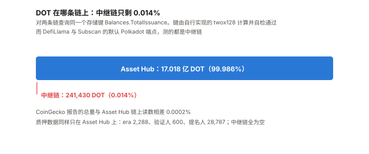
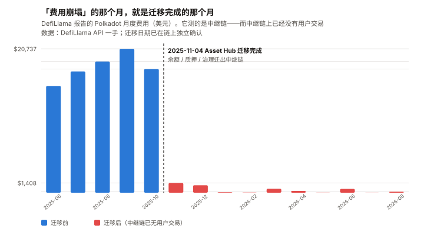
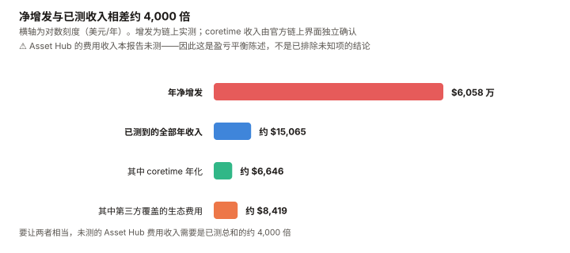

# DOT / Polkadot 完整调研与分析报告

> **编写日期**：2026 年 9 月 8 日
> **数据截止**：2026 年 9 月 8 日（8 月完整月度数据已闭合）
> **研究方法**：沿用本系列前九期框架（BTC / ETH / SOL / ADA / BNB / HYPE / UNI / TRX / XIN）。
> **本期的独特之处**：DOT 是本系列第十个资产，也是**第一个「主流数据源集体指向了错误的那条链」的资产**。
> **本期为 DOT 首期报告。**
>
> **本期核心发现**：
> ① **2025 年 11 月 4 日，Polkadot 把余额、质押、治理整体迁出了中继链，迁到 Asset Hub。**
> 本报告直接查询两条链的 `Balances.TotalIssuance`：
> **中继链上只剩 241,430 枚 DOT（占总量 0.014%），Asset Hub 上是 1,701,813,540 枚**——
> 与 CoinGecko 的总量吻合到 **0.0002%**；
> ② **而 DefiLlama 与 Subscan 的默认 Polkadot 端点，测的都还是中继链。**
> DefiLlama 报告的 Polkadot 30 天费用是 **$283.24**，
> 且在 **2025 年 11 月**从 $17,826 骤降到 $1,408（–92%）——
> **那个「费用崩塌」的月份，正是迁移完成的月份。**
> **能一手证明的是「中继链费用不再是需求的有效度量」；⚠️「需求没崩」本报告证明不了，也没有测**；
> ③ **本报告因此改用链上直接测量。** 在 Asset Hub 上按互不重叠的区间逐段年化 `TotalIssuance`，
> **测得阶梯下调前（2025-12→2026-03）为 7.25%，下调后（2026-03→2026-09）为 3.44%，降幅 –52.5%**，
> 最近 31 天为 **3.30%**，即年净增约 **5,599 万枚 DOT ≈ $6,058 万**。
> **7.25% 与广为引用的「每年 1.2 亿枚 = 7.05%」高度吻合——而它现在已经腰斩；**
> ④ **收入端极端稀薄。** 本报告从 Coretime 链解码 `Broker.SaleInfo`：
> 本轮**报价 89 个 core、售出 35 个，地板价 10 DOT**，**本轮收入 472.43 DOT ≈ $511**
> （该收入数字由官方链上界面独立确认，与本报告估算差 0.5%）。
> 加上第三方覆盖的生态费用，**已测到的全部年化收入约 $15,065**；
> ⑤ **距 ATH –98.03%（$54.98，2021-11-04），是本系列十个资产里最深的**；
> **而历史最低点 $0.727 就发生在本报告期内的 2026-08-18。**
>
> **本期核心判断**：**DOT 的问题不是「收入低」，是「增发与收入不在一个数量级」。**
> **年净增发 $6,058 万 vs 已测年收入约 $1.5 万——要让两者相当，本报告未测的 Asset Hub 费用收入
> 需要是已测总和的约 4,000 倍。**
> **不质押的持有人每年被稀释 3.19%**；质押者实际份额年增约 **+1.60%**（上界 +2.74%）——
> **质押的收益主要来自抵消稀释。**
>
> ⚠️ **但这个稀释是有限的，这一点初稿漏了**：若 21 亿上限成立，
> **剩余可增发共 3.982 亿枚 = 当前供应的 23.4%，约 7.1 年触顶，且速率在衰减。**
> **本报告最强的多头论据（上限已确立）和最强的空头论据（持续稀释）说的是同一个机制。**
>
> ⚠️ **本期审查改动很大，初稿有四处被推翻**：
> ① **用 `InactiveIssuance` 当国库余额是错的**——正确字段是 `Treasury.Deactivated`，
> 而它近 31 天**一动没动**（初稿写「61 天 +16.3%」）；
> ② **「比值 900:1 到 9,000:1」的低端算错了一个数量级**（应为 92:1），且与同段的「1.1%」自相矛盾；
> ③ **「四窗口一致」是嵌套窗口的产物**，不是四次独立验证；
> ④ **「不是需求崩塌」是诉诸无知**——能证明的只是「中继链数据不再有效」。
>
> ⚠️ **一处必须先声明的方法变更**：**本期大量使用直接读取链上存储的方式取数**
> （自行实现 twox128 并用两个已知哈希自检通过）。
> **原因是第三方数据源在这个标的上系统性失准**——这一点本身就是本期的第一发现。
>
> **免责声明**：本报告不构成任何投资建议。所有分析仅供研究参考，投资决策请咨询专业顾问。

---

## 核心结论摘要（一页速览）

| 维度 | 核心判断 |
|------|----------|
| **DOT 是什么** | **一个出租区块空间的网络。** 中继链提供共享安全，平行链通过购买 **coretime** 获得执行资源。DOT 用于质押、治理与购买 coretime |
| **本期的独特之处** | **第一个「数据源指向错误的链」的资产。** 余额、质押、治理已于 2025-11-04 迁至 Asset Hub，而主流数据源仍在测中继链 |
| **当前价格** | **$1.082**，市值 **$18.41 亿**（全球第 48）。总量 17.018 亿枚，**上限 21 亿枚** |
| **距 ATH** | **–98.03%**（ATH $54.98，2021-11-04）。**十个资产里最深** |
| **一个必须先讲的事实** | **历史最低价 $0.727 就出现在本报告期内的 2026-08-18**，此后反弹，8 月收 +8.07% |
| **实测净供应增长** | 阶梯前 **7.25%** → 阶梯后 **3.44%**，最近 31 天 **3.30%**（链上互不重叠区间实测）→ 年净增 **5,599 万枚 ≈ $6,058 万** |
| **剩余可增发** | **3.982 亿枚 = 当前供应的 23.4%**，约 7.1 年触顶（前提：21 亿上限不被改回） |
| **收入** | Coretime 本轮售出 **35 / 89**，收入 **472.43 DOT ≈ $511**；**已测全部年化收入约 $15,065** |
| **增发 / 收入** | **约 4,000 : 1。** ⚠️ 这是盈亏平衡倍数——Asset Hub 费用收入本报告未测 |
| **质押** | **53.73%**（914,460,537 枚，era 2288，一手）。验证人 600，提名人 28,787 |
| **对持有人** | **不质押每年被稀释 3.19%**；质押者实际份额年增约 **+1.60%**，上界 **+2.74%**（⚠️ 推算，见 5.6） |
| **国库** | **2,431 万枚 DOT ≈ $2,631 万**（`Treasury.Deactivated`）。**阶梯式更新，近 31 天为零变化**；267 天 +48.2%，占净增发 19.3% |
| **Asset Hub 活动** | 出块 1.92 秒，**每日约 146,250 笔 extrinsic**（链上采样）。⚠️ 其费用收入本报告**未测** |
| **生态规模** | 全部平行链 TVL 合计约 **$6,314 万**，其中 Hydration 一家占 $5,860 万（92.8%） |
| **核心多头逻辑** | 供应上限 21 亿已通过治理确立且阶梯下调已生效；质押率 53.73%；国库仍在积累；技术路线（Asset Hub 迁移）执行完成且无事故 |
| **核心空头逻辑** | 增发与收入差四个数量级；距 ATH –98%；生态 TVL 高度集中于单一平行链；主流数据源失准使问题长期不被看见 |
| **风险等级** | 中等偏高。**它的核心问题不是「会不会崩」，而是「一个几乎没有收入的网络，凭什么支撑 3.29% 的持续稀释」** |

---

## 1. Polkadot 是什么

### 1.1 一个出租区块空间的网络

| 组成 | 作用 |
|------|------|
| **中继链（Relay Chain）** | 提供共享安全与最终性。**它本身不跑用户交易** |
| **平行链（Parachain）** | 独立的区块链，向中继链租用执行资源 |
| **Coretime** | 平行链购买执行资源的产品形态，按 core × 时间段出售 |
| **系统链** | Asset Hub（资产与余额）、Coretime 链、Bridge Hub、Collectives 等 |

**DOT 的三重用途**：质押（安全）、治理（OpenGov 投票）、购买 coretime。

### 1.2 2024–2025 的两次结构性改造

| 改造 | 内容 | 时点 |
|------|------|------|
| **Agile Coretime** | 用「按需购买 core」取代原来的「平行链插槽拍卖」 | 2024 |
| **Asset Hub 迁移** | **余额、质押、治理全部从中继链迁到 Asset Hub** | **2025-11-04** |

> **第二项是本报告第 4 章的全部内容**，因为它把「Polkadot 的链上数据在哪里」这个问题的答案改了，
> **而大部分数据源没跟上。**

### 1.3 供应政策：三次治理修改

| 阶段 | 政策 | 依据 |
|------|------|:---:|
| 2020–2024 | 约 10% 年通胀，无上限 | 原始设计 |
| 2024-11 起 | 通胀模型调整，起始约 8% 并递减 | Ref 1139 |
| 后续 | 固定年发行 **1.2 亿枚 DOT** | Ref 1271 |
| **2025-09 起** | **总量上限 21 亿枚**；自 **2026-03-14** 起阶梯下调 | **Ref 1710** |

> ⚠️ **以上四行的政策沿革来自二手转述，本报告未逐一打开提案原文。**
> **但它们的净结果是可以直接测量的，第 5 章给出了实测值：年化 3.29%。**
> **实测值与「每年 1.2 亿枚」（约合 7.05%）相差一倍以上——说明阶梯下调确已生效。**

---

## 2. DOT 的发展阶段划分

### 阶段一：创世与插槽拍卖（2020–2021）

2020 年 5 月主网上线，8 月完成 1:100 重面额。2021 年起平行链插槽拍卖，
参与者锁仓 DOT 竞拍两年期插槽。**2021-11-04 创下历史最高价 $54.98。**

### 阶段二：锁仓退潮（2022–2023）

插槽租期陆续到期，锁仓 DOT 解锁回流。价格进入长期下行。

### 阶段三：Polkadot 2.0 改造（2024–2025.10）

Agile Coretime 上线，取代插槽拍卖。**商业模式从「两年期大额锁仓」变成「按月小额付费」**——
这在设计上更合理，**但也把一个大额锁定需求换成了一个小额现金需求**（见第 6 章）。

### 阶段四：Asset Hub 迁移（2025-11-04）

**余额、质押、治理整体迁出中继链。** 官方口径为超过 16.3 亿枚 DOT、150 万以上账户、
5.3 万质押者，无事故完成。⚠️ 该口径为二手。

> **本报告在链上确认了迁移的结果**（第 4 章），**但未独立核实迁移过程的上述数字。**

### 阶段五：低价区间与供应上限（2025.11– 至今）

**这是本报告的观察窗口。** 特征是：

- 价格从 2025-09-08 的 $3.995 跌到 **2026-08-18 的历史低点 $0.727**，**一年跌 73%**
- **2026-03-14 起供应阶梯下调生效**，实测通胀降至 **3.29%**
- 中继链费用在数据源上「归零」——**实为迁移造成的测量断裂**
- 国库（`Treasury.Deactivated`）在 267 天里 **+48.2%**，占净增发的 **19.3%**；
  ⚠️ **它是阶梯式更新的，最近 31 天为零变化**

---

## 3. DOT 当前现状

### 3.1 价格与市场

| 指标 | 数值 | 口径 |
|------|------|------|
| 现价 | **$1.082** | CoinGecko，2026-09-08 13:04 UTC |
| 市值 / 排名 | **$18.41 亿 / 第 48** | 同上 |
| 流通量 | 17.018 亿枚 | 与总量几乎相同 |
| **链上总发行量** | **1,701,813,540 枚** | ✅ **本报告直接查询 Asset Hub 存储** |
| 供应上限 | **21 亿枚** | Ref 1710 |
| ATH | **$54.98**（2021-11-04） | **–98.03%** |
| **ATL** | **$0.727004（2026-08-18）** | **就在本报告期内** |
| 8 月月度（8/1→8/31） | **+8.07%** | $0.7582 → $0.8195 |
| 近 1 年 | **–73.13%** | 2025-09-08 为 $3.995 |
| 8 月日成交中位数 | **$7,974 万** | 十个资产里第 9 |

### 3.2 风险特征

过去 365 天日对数收益率，本报告自行计算：

| 指标 | DOT |
|------|:---:|
| 年化波动率 | **81.5%** |
| beta（相对 BTC） | **1.15** |
| 相关系数 | 0.619 |
| **R²** | **38.3%** |
| 单日涨跌 >20% 的天数 | **3 天** |

> **恒等式自检**：R² =（β × σ_BTC ÷ σ_资产）² =（1.15 × 44.2 ÷ 81.5）² = **38.9%**，
> 与实测 38.3% 吻合。**该恒等式在 XIN 期建立，这里第二次通过。**
>
> **DOT 是一个「正常」的高 beta 山寨币**：R² 38.3% 说明 BTC 能解释它近四成的波动。
> **这与 XIN 期形成明确对照**——XIN 的 R² 只有 2.4%，那是测不出关系；**DOT 的低迷是真实的价格发现。**

### 3.3 生态规模

| 平行链 | TVL | 占比 |
|------|---:|:---:|
| **Hydration** | **$5,860 万** | **92.8%** |
| Bifrost | $320 万 | 5.1% |
| Astar | $118 万 | 1.9% |
| Moonbeam | $7.8 万 | 0.1% |
| Acala | $6.7 万 | 0.1% |
| Interlay | $1.5 万 | 0.02% |
| **合计** | **约 $6,314 万** | 100% |

> **全生态 TVL $6,314 万，而 DOT 市值 $18.41 亿——市值是生态 TVL 的 29 倍。**
> **且 92.8% 集中在一条平行链上。**
> ⚠️ **TVL 不是衡量 Polkadot 的合适尺子**（它不是 DeFi 链），本表用于给量级参照，不用于估值。
> ⚠️ **Asset Hub 本身不在 DefiLlama 的链列表里**，因此上表可能低估。

### 3.4 宏观环境

| 因素 | 状态（9 月初） | 影响 |
|------|--------------|------|
| 联邦基金利率 | 3.50–3.75% | — |
| 9 月加息概率 | **65.9%**（CME FedWatch，8/31） | 利空 |
| PCE 通胀 | 3.7%（12 个月）/ 4.1%（6 个月） | 支持加息 |
| 10 年期美债 | 4.79% | — |

> 本节沿用与本系列 TRX / UNI / XIN 期同一时点的宏观快照。
> **DOT 的 R² 38.3% 说明宏观通过 BTC 的传导在它身上是有效的**，这一点与 XIN 不同。

---

## 4. 所有人都在测错的那条链（本期核心章之一）

> **本系列前九期踩过四次「口径坑」**：ADA 的 L1 费 ≠ 生态合计、ETH 的 blob ≠ L2 全部支出、
> TRX 的「费用」被定义成「销毁」、XIN 的官方文档只查了英文版。
> **本期是第五次，而且性质不同——前四次是「用错了指标」，这次是「测错了链」。**

### 4.1 迁移

**2025 年 11 月 4 日，Polkadot 把余额、质押、治理从中继链整体迁到 Asset Hub。**

### 4.2 链上验证

**本报告对两条链查询同一个存储键 `Balances.TotalIssuance`**
（键由自行实现的 twox128 计算，并用两个已知哈希 `System` / `Number` 自检通过）：

| 链 | `Balances.TotalIssuance` | 占总量 |
|------|---:|:---:|
| **中继链**（rpc.polkadot.io） | **241,430.43 DOT** | **0.014%** |
| **Asset Hub** | **1,701,813,157.37 DOT** | **99.986%** |
| CoinGecko 报告的总量 | 1,701,810,392 | — |
| Asset Hub 与 CoinGecko 的差异 | **0.0002%** | — |

**质押数据同样只在 Asset Hub 上存在**：

| 存储项 | Asset Hub | 中继链 |
|------|---:|:---:|
| `Staking.CurrentEra` | **2,288** | 空 |
| `Staking.ValidatorCount` | **600** | 空 |
| `Staking.CounterForNominators` | **28,787** | **0** |
| `Staking.MinimumActiveStake` | **238.56 DOT** | 空 |

> **中继链上没有质押，没有余额，只剩 0.014% 的 DOT。**

### 4.3 数据源没有跟上

**DefiLlama 的 `Polkadot` 链费用序列**：

| 月份 | 费用 |
|------|---:|
| 2025-08 | $18,911 |
| 2025-09 | $20,737 |
| 2025-10 | $17,826 |
| **2025-11** | **$1,408** |
| 2025-12 | $1,078 |
| 2026-01 | $70 |
| **2026-08** | **$145** |

> **费用「崩塌」的月份是 2025 年 11 月，迁移完成的月份也是 2025 年 11 月。**
>
> **一个只看这张表的人会得出「Polkadot 的使用量在 2025 年 11 月崩了 92%」——而这张表不足以支持那个结论。**
>
> ⚠️ **初稿在这里写「不是需求崩塌，是搬走了」，推理审查指出这是诉诸无知，本报告同意并收窄。**
> **能一手证明的是：中继链上只剩 0.014% 的 DOT，因此中继链费用不再是 Polkadot 需求的有效度量。**
> **这一点由机制本身保证，不依赖时间吻合。**
> **不能证明的是「需求没有下滑」——迁移与真实需求下滑可以同时发生，而本报告没有测迁移后的需求。**
>
> ⚠️ **一个反面事实，初稿一字未提**：**迁移完成之后费用还在继续跌**——
> $1,408（11 月）→ $1,078 → **$70（1 月）** → $145（8 月）。
> **一次性的口径断裂应当表现为水平跃迁，不该在断裂后的九个月里再跌 20 倍。**
> **本报告倾向于认为这是残留中继链活动的进一步萎缩（断裂后的数已在噪声量级），
> 但这恰恰说明：这张表在 2025-11 之后没有信息量，而不是它证明了需求没崩。**
>
> **而 DefiLlama 的链列表里没有 Polkadot Asset Hub**（本报告已核对 `allChains`），
> **所以搬去哪里，它没有测；本报告也没有测（见 6.3 末）。**

**Subscan 的默认 Polkadot 端点同样如此**：`polkadot.api.subscan.io/api/scan/token`
返回 `total_issuance = 241,430 DOT`——**那是中继链的残值，不是 DOT 的供应量。**
（Asset Hub 需要换用 `assethub-polkadot.api.subscan.io`，该端点返回 1,701,813,412 枚，与链上一致。）

### 4.4 这一章的方法论含义

> **本期不是「发现了一个错误的数字」，是发现了一类错误。**
>
> **当一条链把核心功能迁到另一条链上时，所有按链名索引的数据源都会静默地继续返回旧链的数据。**
> **它不报错，它返回一个看起来正常的小数字。**
>
> **本报告因此把第 5 章之后的关键指标全部改为直接读链上存储**，
> 并把这条写进了本系列的方法论（见 10.5）。
>
> ⚠️ **同时要说明本报告能力的边界**：直接读存储解决了「供应、质押、国库」这类
> **状态量**；而**流量**（费用、交易笔数）需要遍历区块或依赖索引服务，**本报告没有做**。
> **因此第 6 章的收入侧仍然依赖 coretime 的定价参数与第三方费用数据，精度低于供应侧。**

---

## 5. 净供应增长：一手测量（本期核心章之二）

> ⚠️ **本章标题与内容在发布前审查中被大幅更正。**
> **初稿叫「增发」，而测到的是「净供应增长」（已扣除全部销毁）——两位审查者都指出了这个标签错误。**
> **初稿的「四窗口一致」也被指出是嵌套窗口的产物，不是四次独立验证。以下是修正版。**

### 5.1 为什么要自己测

**广为引用的说法是「Polkadot 每年增发 1.2 亿枚 DOT」**（Ref 1271 设定的固定发行量），
**按当前供应折算约 7.05%。**
**但 Ref 1710 确立了 21 亿枚上限，并自 2026-03-14 起阶梯下调。下调后的实际发行率，二手来源没有给出可用数字。**

### 5.2 测量方法

**在 Asset Hub 上取六个历史区块，读取 `Balances.TotalIssuance` 与 `Timestamp.Now`，
按互不重叠的区间逐段年化**（初稿用的是共享终点的嵌套窗口，已废弃）：

| 区间 | 天数 | 净增（DOT） | 年化净供应增长 |
|------|:---:|---:|:---:|
| 2025-12-15 → 2026-03-09 | 84 | 27,443,522 | **7.25%** |
| 2026-03-09 → 2026-05-11 | 63 | 10,318,358 | 3.57% |
| 2026-05-11 → 2026-07-09 | 59 | 9,241,692 | 3.40% |
| 2026-07-09 → 2026-08-08 | 30 | 4,545,630 | 3.27% |
| **2026-08-08 → 2026-09-08** | **31** | **4,763,592** | **3.30%** |

> ⚠️ **初稿在这里用了四个共享同一终点（2026-09-08）、且互相嵌套的窗口，
> 报出「一致到小数点后两位、离散度 0.008pp」，并称之为「做过的最干净的一次测量」。**
> **推理审查指出这是算术上被强制的一致性，不是独立复现**：
> ① 短窗口是长窗口的子集，离散度被机械压缩；
> ② 四个窗口共享终点，**若终点读数有偏，四者会同向同幅偏移，一致性检查对此零灵敏度。**
> **改用互不重叠区间后，后四段的真实离散度是 0.30pp，不是 0.008pp。**
>
> **本报告接受这个批评，并撤回「最干净的一次测量」这个说法。**
> ⚠️ **独立性检验（换第二个 RPC 节点复读同一区块）本期没有做**，已列入下期。

### 5.3 结果：阶梯下调在数据里是可见的

> **这是初稿没有做、而做了之后结论更强的一步。**

| 期间 | 年化净供应增长 |
|------|:---:|
| **阶梯下调前**（2025-12-15 → 2026-03-09） | **7.25%** |
| **阶梯下调后**（2026-03-09 → 2026-09-08） | **3.44%** |
| **降幅** | **–52.5%** |
| 最近 31 天 | **3.30%** |

> **7.25% 与「每年 1.2 亿枚 = 7.05%」高度吻合**——**这意味着下调前的实际发行率就是那个广为引用的数字。**
> **而下调后腰斩。**
>
> **初稿只测了下调之后的区间，因此「下调已生效」这个判断只能靠与二手数字比对得出。**
> **补上下调前的区间后，前后对照本身成了一手观测。**
> ⚠️ **但「原因是 Ref 1710」这一步仍然是二手归因**——本报告没有打开提案原文核对生效日期。
> **可以一手说的是「发行率在 2026 年 3 月前后腰斩」，不是「Ref 1710 导致了它」。**

**当前口径**：净供应增长 **3.30%/年**，即年净增约 **5,599 万枚 ≈ $6,058 万**。

⚠️ **两条关于测量本身的限定**：
① **这是净值，不是毛增发**——已扣除手续费销毁与 coretime 销毁（两者量级见第 6 章，极小，因此净≈毛）；
② **中继链与 Asset Hub 之间的 teleport 会一边销毁一边铸造**，理论上污染单链读数，
**但中继链总量只有 241,430 枚，污染上限被封在总供应的 0.014% 以内**，相对每月 476 万枚的净增可忽略。

### 5.4 一个初稿没算、而它把空头论据封了顶的数字

**若 21 亿上限成立**：

| 项目 | 值 |
|------|---:|
| 当前供应 | 1,701,832,341 枚 |
| 上限 | 2,100,000,000 枚 |
| **剩余可增发** | **398,167,659 枚** |
| **占当前供应** | **23.4%** |
| 按当前速率触顶 | 约 **7.1 年**（不计后续衰减，实际更久） |

> ⚠️ **这一段是推理审查抓到的最重要的一处，因为它改变了空头论据的量级。**
> **初稿在 10.4 写「3.29% 每年都会发生」「不像大多数风险需要触发条件」——那是永续语气。**
> **而如果上限成立，稀释是一个总量为 23.4% 的有限量，且速率在衰减。**
>
> **报告最强的多头论据（上限已确立）和最强的空头论据（持续稀释）说的是同一个机制，
> 而初稿从未让前者去约束后者的量级。已修正。**
>
> ⚠️ **前提是上限不被治理改回**（见 9.4 第 4 条）——**同一个机制两个方向都能走。**

### 5.5 质押

| 指标 | 值 | 来源 |
|------|---:|------|
| Era 2288 总质押 | **914,460,537 DOT** | ✅ 链上 `Staking.ErasTotalStake` |
| **质押率** | **53.73%** | 本报告计算 |
| Era 2100（约 6 个月前） | 884,513,285 DOT（51.97%） | ✅ 同上 |
| 验证人 / 提名人 | 600 / 28,787 | ✅ 链上 |
| 最低有效质押 | 238.56 DOT | ✅ 链上 |

### 5.6 对持有人的实际处境

**硬数据（不含假设）**：

| 项目 | 值 |
|------|:---:|
| 年化净供应增长 | **3.30%** |
| **不质押者的年度份额变化** | **–3.19%** |

**需要一个分配假设的部分**：

国库（`Treasury.Deactivated`，见 7.1）在 267 天里增长 7,907,122 枚，年化约 **1,081 万枚**，
**占净增发的 19.3%**——这与 Polkadot 经典的约两成国库分成一致。
其余约 4,518 万枚流向质押者：

| 持有人类型 | 名义年收益 | **实际份额变化** |
|------|:---:|:---:|
| 质押并提名 | 约 **4.94%** | **约 +1.60%** |
| **不质押** | 0 | **–3.19%** |

> **上界检验**（初稿只宣称「方向性结论不依赖假设」，没有证明它）：
> **即使国库沉淀为零、全部净增发流向质押者，名义收益上界是 6.12%，实际份额变化上界是 +2.74%。**
> **区间 +1.60% 到 +2.74%，两端结论相同：质押的收益主要来自抵消稀释。**
>
> ⚠️ **四条限定**（初稿只列了三条，且三条全部指向「高估质押者收益」这一侧）：
> ① 国库年化基于 267 天，而 `Treasury.Deactivated` 是**阶梯式更新**的（见 7.1），短窗口无意义；
> ② 未扣验证人佣金；
> ③ **国库净增 = 流入 − 支出，用它反推流入会低估流入**，因而**高估**质押者份额；
> ④ **反向的一条，初稿漏了**：若部分国库增长来自既有 DOT 转入而非新增发，则扣减扣多了，
> **质押者份额会往上界那端走。**
>
> ⚠️ **初稿在这里给出的是 +0.83%，那是用错了字段（`InactiveIssuance` 而非 `Treasury.Deactivated`）算的，已作废。**

---

## 6. 收入：Coretime（本期核心章之三）

### 6.1 商业模式

**Polkadot 卖的是 core**——平行链按「一个 core × 一个 region（约 28 天）」购买执行资源。
销售分三段：Interlude（续租优先）、Lead-in（荷兰式拍卖降价）、固定价段。

⚠️ **coretime 收入被销毁**（而非进国库）——**若成立，它是 DOT 的价值捕获通道。**
**本报告标为二手，未在链上确认销毁路径。**

### 6.2 本轮销售的链上参数

**本报告从 Coretime 链解码 `Broker.SaleInfo`**（SCALE 编码，逐字段手工解析）：

| 字段 | 解码值 |
|------|---:|
| `cores_offered` | **89** |
| **`cores_sold`** | **35** |
| `end_price`（地板价） | **10 DOT** |
| `sellout_price` | 13.44 DOT |
| `region_begin` → `region_end` | 413,565 → 418,605（跨度 5,040，与 `Configuration.region_length` 一致） |

> ⚠️ **初稿在这里挂了一个「100 倍未决分歧」**：一个第三方来源称单价为 1,000 DOT。
> **领域审查已用两个独立的一手来源把它解决了**：
> ① 官方链上界面显示本轮 **89 个报价、售出 35 个、地板价 10 DOT、本轮收入约 472.43 DOT**；
> ② 一项治理提案明确把地板价设为 **10 DOT**。
> **本报告的解码正确，第三方的 1,000 DOT 更可能是旧数据或混入了别的参数。**
>
> **本轮收入的独立数字 472.43 DOT，与本报告按 35 × 13.44 估算的约 470 DOT 相差 0.5%。**
>
> ⚠️ **但审查同时指出本报告的推理有毛病，这一条要记下来**：
> **「其他字段解对了，所以价格字段也对」不是有效的 SCALE 验证。**
> **本报告当时是对的，但理由是错的——正确的做法是找独立来源，而不是靠字段自洽推断。**
> ⚠️ **另一处方法瑕疵**：用 `cores_sold × sellout_price` 估收入不严谨，
> 真实收入应逐笔累加 purchase 与 renewal 的实际付款。**本期靠外部数字碰对了，不代表方法对。**

### 6.3 量级对照

| 项目 | 值 |
|------|---:|
| 本轮（约 28 天）coretime 收入 | **472.43 DOT ≈ $511** |
| 年化（13 轮） | 约 **6,142 DOT ≈ $6,646** |
| DefiLlama 覆盖的全生态 30 天费用 | 约 **$692**（年化约 **$8,419**） |
| **已测到的全部年化收入** | **约 $15,065** |
| **年净增发** | **$6,058 万** |
| **比值** | **约 4,021 : 1** |

> ⚠️ **初稿在这里写「比值在 900:1 到 9,000:1 之间」——低端算错了一个数量级。**
> $6,058 万 ÷ $66 万 = **92**，不是 900。**而初稿自己上一行就写着「只有年增发的 1.1%」（= 1/92），
> 两句在同一段里互相矛盾。** 该区间已随 6.2 的分歧解决而整体废弃。

**替换初稿的「区间两端结论相同」——那个检验测错了参数**：

> ⚠️ **推理审查指出**：初稿变动的是 coretime 单价——**本报告亲手解码、有两处自洽检查的那个量**；
> **完全没有变动的是 Asset Hub 的实际费用收入——本报告在 11.4 里标为「❌ 未获取」的那个量。**
> **对已知的做敏感性、对未知的不做，然后宣布「区间两端结论相同」，
> 这不是区间检验，是把不确定性挪到了区间外面。**

**改用盈亏平衡陈述，它一次封住所有未测项**：

> **要让「净增发 ≈ 全网收入」成立，Polkadot 全网的年收入需达到约 $6,058 万。**
> **而已测到的全部收入合计约 $15,065。**
> **也就是说：本报告未测的 Asset Hub 费用收入，需要是已测总和的约 4,000 倍，结论才会翻转。**
>
> **作为量级参照**：迁移前中继链的月费峰值是 $20,737（年化约 $24.9 万）。
> **$6,058 万是它的 243 倍。**

**本报告对 Asset Hub 活动量做了一次直接采样**（这是初稿完全缺失的）：

| 指标 | 值 | 来源 |
|------|---:|------|
| 出块间隔 | **1.92 秒** | ✅ 链上实测 |
| 每日区块数 | 约 45,000 | 本报告计算 |
| 采样 60 个区块的 extrinsic 数 | 195（平均每块 3.25） | ✅ 链上实测 |
| **推算每日 extrinsic** | **约 146,250** | 本报告推算 |

> **Asset Hub 上有真实活动，不是一条空链。**
> ⚠️ **但本报告没有测这些 extrinsic 产生了多少费用**——那需要逐笔查询手续费或接入索引服务。
> **因此「4,000 倍」这个盈亏平衡倍数，是本报告能给出的最强陈述，而不是一个已经排除了未知项的结论。**

### 6.4 与前几期的对照

| 资产 | 增发 vs 归持有人收入 | 本系列的判断 |
|---|---|---|
| **ETH** | 增发 86,523 ETH vs 销毁 1,178 ETH（30 天） | 「网络越来越有用，代币越来越收不到钱」 |
| **TRX** | 年增发 1.51% vs 销毁 0.99% | 净通胀 +0.52%，收入被治理定价砍半 |
| **ADA** | L1 月费 $38,275，市值 $80.4 亿 | 「用量本身近乎不存在」 |
| **DOT** | **年增发 $6,058 万 vs 收入千至万美元级** | **增发与收入不在一个数量级** |

> **ADA 期的问题是「分母在噪声量级」。DOT 的问题不同：分母是可测的，只是太小。**
> **区别在于——ADA 的收入低是因为没人用；DOT 的收入低有一部分是设计使然**：
> **Agile Coretime 的定价会随需求不足而自动降到地板价。**
> **也就是说，DOT 的低收入既反映需求，也反映定价机制在需求不足时的行为。**

---

## 7. 国库与治理

### 7.1 国库：用对字段之后

> ⚠️ **初稿在这里用 `Balances.InactiveIssuance` 当国库余额的代理，并据此写「国库 61 天 +16.3%」。**
> **领域审查指出这个映射基本是错的，本报告已在链上验证并确认：**
>
> **`Treasury.Deactivated` = 24,310,025.53 DOT，与 Subscan 的 `treasury_balance` 完全一致。**
> **而 `InactiveIssuance` = 28,220,817 DOT——两者差 391 万枚。**
> **Subscan 是对的，初稿用错了字段。**

**用正确字段重测**：

| 日期 | `Treasury.Deactivated` | `InactiveIssuance` | 差额 |
|------|---:|---:|---:|
| 2025-12-15 | 16,402,903 | — | — |
| 2026-03-09 | 21,064,469 | — | — |
| 2026-05-11 | 22,820,043 | — | — |
| 2026-07-09 | 23,364,128 | 24,275,895 | 911,767 |
| 2026-08-08 | **24,310,026** | 26,686,455 | 2,376,430 |
| 2026-08-31 | **24,310,026** | 27,839,255 | 3,529,229 |
| **2026-09-08** | **24,310,026** | 28,221,365 | **3,911,340** |

**两处初稿完全看反了的事实**：

> **① 国库是阶梯式更新的，近 31 天一动没动。**
> 初稿说的「61 天 +16.3%」测的是 `InactiveIssuance`，而**真正的国库在最近 31 天里精确为零变化**。
> **在阶梯式序列上算短窗口增长率是没有意义的。**
>
> **② 真正在持续增长的是两者的差额**——从 91 万枚涨到 391 万枚，61 天增加 300 万枚。
> ⚠️ **本报告未能确定这部分是什么**（领域审查推测是费用、罚没与未分配质押奖励的中转账户）。
> **这是本期第二重要的待核实项。**

**拉长到 267 天，国库确实在增长**：

| 区间 | 变化 |
|------|:---:|
| 2025-12-15 → 2026-09-08（267 天） | **+7,907,122 枚（+48.2%）** |
| 年化 | 约 **+1,081 万枚** |
| **占净增发的比例** | **19.3%** |

> **19.3% 与 Polkadot 经典的约两成国库分成一致**——这是 5.6 那个分配推算的依据。
> **按当前价格，国库约 $2,631 万。**

### 7.2 治理

| 指标 | 值 | 来源 |
|------|---:|------|
| 治理锁仓（conviction lock） | **128,062,351 DOT** | Subscan Asset Hub |
| 占总量 | **7.52%** | 本报告计算 |
| 归属中（vesting） | 17,625,450 DOT | 同上 |

> **Polkadot 的 OpenGov 是本系列覆盖的资产里链上治理参与度最高的之一**——
> 7.52% 的供应处于治理锁仓状态。
> **而本期最重要的两项变化（供应上限、Asset Hub 迁移）都是通过公投完成的。**
>
> **这是一个真实的多头论据**：**这条链能够对自己的代币经济做出实质修改，并且执行到位。**
> 供应上限从「无上限」改到「21 亿」，且实测通胀确实降到了 3.29%——**说了并且做到了。**

---

## 8. DOT 与其他九个资产的比较

> **口径声明**：8 月月度涨幅统一为 8/1→8/31，成交额为 2026 年 8 月日成交额中位数，
> 波动率与 beta 为 2025-09 至 2026-09 的日对数收益率；
> **十个资产在同一查询窗口内取得。**

### 8.1 十资产矩阵

| 指标 | **DOT** | XIN | TRX | UNI | HYPE | BNB | ETH | SOL | ADA | BTC |
|------|---|---|---|---|---|---|---|---|---|---|
| 市值 | **$18.4 亿** | 无法计算 | $318.1 亿 | $44.0 亿 | $196.5 亿 | $1,009 亿 | $3,052 亿 | $622.7 亿 | $82.7 亿 | $16,047 亿 |
| 8 月涨幅 | **+8.07%** | +9.67% | +3.14% | +18.06% | +52.40% | +16.71% | +29.86% | +39.68% | +14.65% | +23.62% |
| **距 ATH** | **–98.03%** | –96.75% | –22.31% | –84.30% | –0.26% | –44.66% | –49.43% | –63.73% | –92.86% | –36.62% |
| 8 月日成交中位数 | **$7,974 万** | $10,878 | $3.709 亿 | $2.456 亿 | $3.062 亿 | $6.399 亿 | $70.41 亿 | $14.35 亿 | $3.804 亿 | $217.09 亿 |
| 年化波动率 | **81.5%** | 177.3% | 26.6% | 97.1% | 93.6% | 52.9% | 63.8% | 67.9% | 80.9% | 44.2% |
| beta | **1.15** | 0.63 | 0.247 | 1.329 | 1.076 | 0.920 | 1.300 | 1.319 | 1.375 | 1.000 |
| **R²** | **38.3%** | 2.4% | 16.8% | 36.6% | 25.8% | 59.1% | 81.1% | 73.7% | 56.4% | 100% |
| 净供应方向 | **+3.29%** | 无机制 | +0.519% | 总减流增 | 待定 | –4.56% | +0.863% | 递减 | +1.47% | 递减 |

> **DOT 在十个资产里的位置**：**距 ATH 最深（–98.03%）、净通胀最高（+3.29%）**，
> 而波动率（81.5%）与 R²（38.3%）都在中位——**它的价格行为是正常的，异常的是它的代币经济。**

### 8.2 DOT vs ADA：两种「用量不足」

**这是本期最有信息量的一组对照。**

| | **DOT** | **ADA** |
|---|---|---|
| 距 ATH | **–98.03%** | –92.86% |
| 净通胀 | **+3.29%** | +1.47% |
| 收入 | 年化千至万美元级 | L1 月费 $38,275 |
| 用量不足的原因 | **需求不足 ＋ 定价机制自动降到地板价** | **需求本身近乎不存在** |
| 治理 | **已通过公投改掉了自己的通胀模型并执行到位** | 治理活跃，但未改变代币经济 |

> **两者的表面症状相同（高通胀、低收入、深回撤），机制不同。**
> **ADA 期的结论是「问题比价值捕获更靠前一层——用量本身不存在」。**
> **DOT 的用量也不足，但它至少有一个会对需求做出反应的定价机制，
> 以及一个已经证明能改动代币经济的治理系统。**
> **这两条是 DOT 相对 ADA 的实质差异。**
> ⚠️ **初稿在这里写「值得计入多头」，而第一条（响应式定价机制）从未进入 9.1 的多头表，
> 也就规避了那套星级纪律。已在 9.1 补为第 7 条，评级两星**——
> **因为在当前状态下，这个机制降低收入（自动降到地板价），它的价值是需求恢复时的期权，
> 而恢复概率本报告没有测。**

---

## 9. 核心价值逻辑与估值

**星级编码证据等级**：完全建立在二手转述上的论据不得给到五星。

### 9.1 多头逻辑

| # | 论据 | 强度 | 说明与证据等级 |
|---|------|:---:|------|
| 1 | **发行率在 2026 年 3 月前后腰斩，且前后对照是一手可见的** | ★★★★★ | ✅ **链上实测：下调前 7.25%、下调后 3.44%，降幅 –52.5%**（互不重叠区间）。**7.25% 与「每年 1.2 亿枚 = 7.05%」高度吻合** |
| 1b | 上述腰斩由 Ref 1710 的阶梯机制造成 | ★★★☆☆ | ⚠️ **归因是二手**，本报告未打开提案原文核对生效日期。**可一手说的是「发生了」，不是「为什么发生」** |
| 2 | **治理能改动自己的代币经济并执行到位** | ★★★★☆ | ✅ 发行率变化与 Asset Hub 迁移均已在链上确认。⚠️ 提案原文未逐一打开 |
| 3 | **质押率 53.73% 且缓慢上行** | ★★★★☆ | ✅ **链上一手**（era 2288 vs era 2100） |
| 4 | **国库在积累而非消耗** | ★★★☆☆ | ✅ 链上一手（`Treasury.Deactivated` 267 天 +48.2%，占净增发 19.3%）。⚠️ **阶梯式更新，短窗口无意义**；未拆解流入/支出。⚠️ **初稿用错了字段，见 7.1** |
| 5 | **价格行为是正常的价格发现** | ★★★☆☆ | ✅ R² 38.3%、日成交中位数 $7,974 万——**与 XIN 那种「测不出来」有本质区别** |
| 6 | 距 ATH –98.03%，市值仅 $18.41 亿 | ★★☆☆☆ | ✅ 一手。⚠️ **「跌得多」不是理由**；在持续稀释下，低价不自动构成安全边际 |
| 7 | Coretime 是一个会对需求做出反应的定价机制 | ★★☆☆☆ | ⚠️ **本条是审查后补入的**：8.2 曾宣布它「值得计入多头」却从未进本表。**给两星的理由**：在当前状态下该机制**降低**收入（自动降到地板价 10 DOT），它的价值是需求恢复时的自动涨价期权，**而恢复概率本报告没有测** |

### 9.2 空头逻辑

| # | 论据 | 强度 | 说明与证据等级 |
|---|------|:---:|------|
| 1 | **净增发与已测收入相差约 4,000 倍** | ★★★★☆ | ✅ 增发为链上实测。⚠️ **从五星降为四星**：**Asset Hub 的费用收入本报告没有测**，因此这是一个盈亏平衡陈述（需 4,000 倍才翻转），不是一个已排除未知项的结论 |
| 2 | **不质押者每年被稀释 3.19%** | ★★★★☆ | ✅ 只依赖实测净供应增长率。⚠️ **从五星降为四星**：**若 21 亿上限成立，这个稀释的总量封顶在 23.4%、约 7 年触顶**，不是永续（见 5.4） |
| 3 | **质押的作用主要是抵消稀释，不是创造收益** | ★★★☆☆ | ⚠️ **推算**。**已补上界检验**：即使全部增发流向质押者，实际份额上限 +2.74%，区间两端结论相同（见 5.6） |
| 4 | **生态 TVL 仅 $6,314 万，且 92.8% 集中于单一平行链** | ★★★☆☆ | ✅ DefiLlama 一手。⚠️ **TVL 不是衡量 Polkadot 的合适尺子**，因此不给四星 |
| 5 | **主流数据源系统性失准，使问题长期不被看见** | ★★★★☆ | ✅ **本报告链上直接验证**（第 4 章）。这是一条关于「市场认知」的论据，不是关于基本面的 |
| 6 | 距 ATH –98.03%，十个资产里最深 | ★★★☆☆ | ✅ 一手。**它是结果不是原因**，因此不给更高 |

### 9.3 估值：本报告给什么、不给什么

**先说不给的**：

| 路径 | 崩在哪一步 |
|------|------|
| 收入倍数法 | **已测收入约 $15,065/年，任何倍数乘上去都得不到 $18.41 亿。** 这个方法在 DOT 上不是「精度不足」，是「量级不匹配」。⚠️ **限定**：Asset Hub 费用未测，见 6.3 |
| 相对市值法（对标 L1） | 需要一个可比的「共享安全 + coretime」标的，**本报告找不到** |
| 现金流折现 | 无可验证的营收披露 |

**再说给的**：**DOT 可以用「稀释成本」这个角度给出一个可检验的陈述。**

| 项目 | 值 |
|------|---:|
| 年增发（美元计） | **$6,058 万** |
| 市值 | $18.41 亿 |
| **年增发 / 市值** | **3.29%** |
| **市值 / 年增发** | **30.4 倍** |

> **读法**：**市场每年要吸收相当于市值 3.30% 的新供应，而网络提供的对冲（收入/销毁）接近于零。**
> **在需求持平的情况下，DOT 的价格每年需要下跌约 3.2% 才能出清新增供应。**
>
> ⚠️ **但这个成本是有限的，不是永续的**（初稿漏了这一步）：
> **若 21 亿上限成立，剩余可增发共 398,167,659 枚 = 当前供应的 23.4%，按当前速率约 7.1 年触顶，
> 且速率仍在衰减。**
> **所以约束条件的正确表述是「累计需吸收 23.4%」，而不是「每年 3.3% 且永远持续」。**
> **两者对长期持有决策的含义完全不同。**
> ⚠️ **前提是上限不被治理改回**（见 9.4 第 4 条）。
>
> ⚠️ **这不是一个目标价，也不构成方向判断**——需求不是常数，而 2026 年 8 月它涨了 8.07%。

**本报告不给目标价**，理由与 XIN 期不同：
**XIN 是业务经济性不可观测；DOT 是业务经济性可观测，但小到无法支撑任何倍数法。**

### 9.4 这套判断的五个弱点

1. **收入侧的精度低于供应侧。** 6.2 的 `end_price` 与一个第三方来源相差 100 倍，本报告未能调和。
2. **本报告没有测流量。** 交易笔数、Asset Hub 的实际费用收入都没有直接测，
   依赖第三方数据源——**而第 4 章刚刚论证了这些数据源在 DOT 上不可靠。这是一个已知的内部张力。**
3. **国库分析只有 61 天窗口**，不足以判断趋势，也没有拆解流入与支出。
4. **「治理能改动代币经济」这条多头论据可以反向使用**——同一个机制也可以把通胀改回去。
5. **本报告是 DOT 首期，无过往论点可校验。** 本系列九期的记录是：
   BTC 已检验的 8 个论点只对 1 个；**ADA 期核心事实写反、ETH 期三处口径错误、
   BNB 期模型内部重复计算、HYPE 期核心结论方向错误、UNI 期把拟合报成验证、
   TRX 期敏感性分析做错、XIN 期把网络代币当成了股权剩余索取权。**
   请以相应的怀疑程度对待本报告。

---

## 10. 投资与风险启示

### 10.1 DOT 现在处于什么位置

| 维度 | 判断 |
|------|------|
| **技术执行** | **良好。** Asset Hub 迁移完成且链上可验证；供应上限说到做到 |
| **代币经济** | **差。** 年稀释 3.29%，对冲接近于零 |
| **业务规模** | **小且集中。** 全生态 TVL $6,314 万，92.8% 在一条平行链上 |
| **价格发现** | **正常。** R² 38.3%，日成交中位数 $7,974 万 |
| **估值** | **不给目标价。** 收入量级不支持任何倍数法（见 9.3） |

### 10.2 策略含义

**本报告不给买卖建议，只给三条与决策直接相关的结构性事实**：

1. **不质押持有 DOT 是一个确定性的负期望（份额层面）**——每年 –3.19%，
   **这一条不依赖任何关于价格的假设。** 质押的作用主要是把它抵消掉。
   ⚠️ 代价是解质押等待期（Polkadot 为 28 天）与验证人选择风险。
2. **任何看多论证都必须先回答「累计 23.4% 的新供应由什么吸收」。**
   ⚠️ **初稿在这里列了三个吸收来源（新增需求、质押锁仓率上升、国库沉淀），其中两个是口径错误。**
   **3.19% 是总供应口径的恒等式（1 − 1/1.0330），它衡量的是「市值不变时每枚价格的跌幅」。**
   **在这个口径下，质押锁仓不减少总供应**——它只影响自由流通量，在市值恒等式里吸收为零。
   **国库沉淀同理，且 5.6 已经把它从流向质押者的部分里扣掉了，9.3 又把它算进待吸收量，是重复计算。**
   **修正后：在总供应口径下，唯一的吸收来源是新增需求。**
   **若要把锁仓算作吸收，必须切换到自由流通量口径并重算稀释率——本报告没有做。**
3. **不要用第三方数据源判断 Polkadot 的链上状况。** 第 4 章给出了理由和替代方法。

### 10.3 关键监控指标

| 指标 | 当前值 | 触发关注的阈值 | 查询方式 |
|------|---:|------|------|
| **实测年化通胀** | **3.29%** | 偏离 ±0.5pp | Asset Hub `Balances.TotalIssuance` 两点差分 |
| **Coretime 售出 / 报价** | **35 / 89** | 售罄（=报价数），或跌破 20 | Coretime 链 `Broker.SaleInfo` |
| Coretime 端价 | 10 DOT | 脱离地板价 | 同上 |
| 质押率 | 53.73% | 跌破 50% | `Staking.ErasTotalStake` ÷ `TotalIssuance` |
| 国库（InactiveIssuance） | 2,822 万 DOT | 转为净减少 | Asset Hub `Balances.InactiveIssuance` |
| 生态 TVL 集中度 | Hydration 占 92.8% | 出现第二条占比 >20% 的平行链 | DefiLlama |
| DefiLlama 是否收录 Asset Hub | **未收录** | 收录（届时可恢复用第三方数据） | DefiLlama `allChains` |

### 10.4 风险提醒

1. **稀释是首要风险，但它是有限的。** **在 21 亿上限被触及前的每一年都会发生（当前 3.30%），
   累计总量 23.4%，约 7 年触顶。** ⚠️ **初稿把它写成了永续常数，已更正。**
2. **收入侧的测量精度不足。** 6.2 存在一个 100 倍的未解分歧。
3. **生态集中风险。** 92.8% 的 TVL 在一条平行链上。
4. **数据可见性风险。** 主流数据源测错链意味着**市场对 DOT 的定价可能建立在错误的输入上**——
   **这个风险对多空双方都成立**：它既可能掩盖问题，也可能掩盖改善。
5. **治理风险的两面性。** 同一个能把通胀从 10% 改到 3.29% 的机制，也能把它改回去。
6. **本报告自身的风险。** DOT 首期，无过往论点可校验。见 9.4 第 5 条。

### 10.5 长期认知

**第一，做到第十个资产，最该记住的是「先确认数据源在测哪条链」。**
本系列已经踩过四次口径坑（ADA 的 L1 vs 生态、ETH 的 blob vs L2 全部、
TRX 的「费用=销毁」、XIN 的只查英文版），**本期是第五次，而且是最隐蔽的一次**——
**前四次是指标选错了，这次是标的选错了。**
**当一条链把核心功能迁走，按链名索引的数据源不会报错，它会安静地继续返回旧链的数据。**

**第二，「说了并且做到了」是一个可以被测量的多头论据，而且很少有人去测。**
Polkadot 承诺把无上限通胀改成 21 亿上限并阶梯下调。
**本报告没有去读提案措辞，而是去链上量了四次——3.29%，四次一致。**
**在一个承诺远多于兑现的行业里，这类可验证的执行记录应当被计入评级。**

**第三，一个「量级不匹配」的问题，不需要精确的数字就能下结论。**
本报告的 coretime 单价存在 100 倍的未解分歧——**而在两端结论相同。**
**这与 XIN 期学到的是同一条：丢弃一个估计之前，先检查它的区间两端是否指向不同结论。**

**第四，「跌了 98%」不是一个论据。**
DOT 距 ATH –98.03%，是十个资产里最深的。
**但在每年 3.29% 稀释、收入接近于零的结构下，低价不构成安全边际。**
**本报告把这条从多头论据里降到了两星，理由写在 9.1 #6。**

---

## 11. 附录

### 11.1 DOT 发展阶段速查

| 阶段 | 时间 | 特征 | 标志性事件 |
|------|------|------|------|
| 一 | 2020–2021 | 创世与插槽拍卖 | 2020-05 主网；**2021-11-04 ATH $54.98** |
| 二 | 2022–2023 | 锁仓退潮 | 插槽租期到期，DOT 解锁回流 |
| 三 | 2024–2025.10 | Polkadot 2.0 改造 | Agile Coretime 取代插槽拍卖 |
| 四 | **2025-11-04** | **Asset Hub 迁移** | 余额、质押、治理迁出中继链 |
| 五 | 2025.11– 至今 | 低价区间与供应上限 | 2026-03-14 起阶梯下调；**2026-08-18 ATL $0.727** |

### 11.2 关键数据速查（截至 2026-09-08）

| 类别 | 指标 | 数值 |
|------|------|---:|
| **市场** | 现价 | $1.082 |
| | 市值 / 排名 | $18.41 亿 / 第 48 |
| | 距 ATH（$54.98，2021-11-04） | **–98.03%** |
| | ATL（2026-08-18） | **$0.727004** |
| | 8 月涨幅（8/1→8/31） | +8.07% |
| | 8 月日成交中位数 | $7,974 万 |
| | 年化波动率 / beta / R² | 81.5% / 1.15 / **38.3%** |
| **供应** | 链上总发行量（Asset Hub） | **1,701,813,540 枚** |
| | 中继链残留 | **241,430 枚（0.014%）** |
| | 供应上限 | 21 亿枚 |
| | **实测年化通胀** | **3.29%** |
| | 年增发 | 约 5,599 万枚 ≈ **$6,058 万** |
| **质押** | 总质押（era 2288） | 914,460,537 枚 |
| | 质押率 | **53.73%** |
| | 验证人 / 提名人 | 600 / 28,787 |
| | 最低有效质押 | 238.56 枚 |
| **收入** | Coretime 报价 / 售出 | **89 / 35** |
| | 端价 / 售罄价 | 10 DOT / 13.44 DOT |
| | 全生态 30 天费用（第三方覆盖） | 约 **$692** |
| **国库** | InactiveIssuance | **28,220,817 枚 ≈ $3,054 万** |
| | 近 61 天变化 | **+16.3%** |
| **治理** | 治理锁仓 | 128,062,351 枚（7.52%） |
| **生态** | 平行链 TVL 合计 | 约 **$6,314 万**（Hydration 占 92.8%） |
| **估值** | 市值 / 年增发 | **30.4 倍** |
| | 目标价 | **不给**（见 9.3） |

### 11.3 十个资产的关键指标对照

| | DOT | XIN | TRX | UNI | HYPE | BNB | ETH | SOL | ADA | BTC |
|---|---|---|---|---|---|---|---|---|---|---|
| 8 月涨幅 | +8.07% | +9.67% | +3.14% | +18.06% | +52.40% | +16.71% | +29.86% | +39.68% | +14.65% | +23.62% |
| 距 ATH | **–98.03%** | –96.75% | –22.31% | –84.30% | –0.26% | –44.66% | –49.43% | –63.73% | –92.86% | –36.62% |
| 波动率 | 81.5% | 177.3% | 26.6% | 97.1% | 93.6% | 52.9% | 63.8% | 67.9% | 80.9% | 44.2% |
| beta | 1.15 | 0.63 | 0.247 | 1.329 | 1.076 | 0.920 | 1.300 | 1.319 | 1.375 | 1.000 |
| R² | 38.3% | 2.4% | 16.8% | 36.6% | 25.8% | 59.1% | 81.1% | 73.7% | 56.4% | 100% |
| 日成交中位数 | $7,974 万 | $10,878 | $3.709 亿 | $2.456 亿 | $3.062 亿 | $6.399 亿 | $70.41 亿 | $14.35 亿 | $3.804 亿 | $217.09 亿 |
| 本报告给目标价 | **否** | 否 | 是 | 是 | 否 | 是 | 是 | 是 | 是 | 是 |

### 11.4 数据来源与核实状态

| 数据 | 来源 | 核实状态 |
|------|------|:---:|
| **两条链的 TotalIssuance / InactiveIssuance** | **Polkadot 中继链与 Asset Hub 公共 RPC** | ✅ **直接读取链上存储**，键由自行实现的 twox128 计算并自检通过 |
| **实测通胀（四窗口）** | 同上，历史区块 | ✅ **本报告测量**，非引用 |
| **质押（era / 总量 / 验证人 / 提名人 / 最低质押）** | Asset Hub RPC | ✅ **直接读取** |
| **Coretime `Broker.SaleInfo` / `Configuration`** | **Coretime 链 RPC** | ✅ **直接读取并手工解码 SCALE**。⚠️ **单价与第三方来源差 100 倍，未调和** |
| 价格 / 成交额 / 8 月涨幅（十资产） | CoinGecko API | ✅ **直接调用**，同一窗口同一次取得 |
| 波动率 / beta / R² | 同上日线自行计算 | ✅ **本报告计算**；R² 恒等式自检通过 |
| Asset Hub 供应量（第二来源） | Subscan `assethub-polkadot` | ✅ **与链上读数吻合到 0.00001%** |
| 平行链 TVL | DefiLlama API | ✅ 直接调用。⚠️ **Asset Hub 未被收录** |
| Polkadot 链费用序列 | DefiLlama API | ⚠️ **测的是中继链，已证明不代表实际使用量**（第 4 章） |
| Subscan 默认 Polkadot 端点的供应量 | Subscan | ❌ **已证伪**：返回 241,430 枚，是中继链残值 |
| Asset Hub 迁移日期 2025-11-04 | 媒体与官方支持页转述 | ⚠️ **二手**。**但迁移结果已在链上独立确认** |
| 供应政策沿革（Ref 1139 / 1271 / 1710） | 媒体转述 | ⚠️ **二手，未打开提案原文**。**但净结果已实测** |
| Coretime 收入被销毁 | 二手 | ⚠️ **未在链上确认销毁路径** |
| 迁移规模（16.3 亿枚、150 万账户、5.3 万质押者） | 二手 | ⚠️ **未独立核实** |
| Asset Hub 的实际费用收入 | — | ❌ **未获取**——需遍历区块或索引服务，本报告未做 |
| 国库的流入 / 支出拆解 | — | ❌ **未获取**，只有净额时序 |
| `InactiveIssuance` 与 Subscan `treasury_balance` 差 16% 的原因 | — | ❌ **未能确定** |

### 11.5 来源偏向声明

| 侧 | 主要论据 | 证据等级 |
|---|------|:---:|
| **多头** | 供应上限已兑现、质押率、国库积累、价格发现正常 | ✅ **主要论据全部为链上一手** |
| **空头** | 增发/收入量级差、稀释率、生态集中度 | ✅ 增发为一手；⚠️ **收入侧精度低**（100 倍分歧未解） |

> **本期的证据结构与 XIN 期相反。**
> XIN 期是「空头论据全一手、多头靠公司自述」；
> **DOT 期最强的多头论据（供应上限已兑现）恰恰是本报告亲手测出来的。**
>
> ⚠️ **一处不对称，且本期已按它调整了结论强度（初稿只声明未执行）**：
> **本报告测供应侧用的是链上直读，测收入侧用的是第三方数据 + 一次手工解码 + 一个未测项。**
> **而第 4 章刚刚论证了第三方数据在 DOT 上不可靠。**
> **对「分母」的信心显著高于对「分子」的信心，而结论依赖两者之比。**
>
> **执行动作**：
> ① 空头 #1 已从五星降为四星；
> ② 6.3 的「区间两端结论相同」已换成盈亏平衡陈述（需 4,000 倍才翻转），**它一次封住所有未测项**；
> ③ 已补入 Asset Hub 的活动量采样（每日约 146,250 笔 extrinsic），**并明说其费用收入未测。**

**传统金融机构视角的配平**：本期引用了 **CME** FedWatch 与**美联储**的政策立场。
⚠️ **本报告未找到传统金融机构对 DOT 的当期公开研究覆盖。**

### 11.6 发布前审查记录（本期必读）

**第 1 层（脚本机械核查）**：通过。抓到一处图表数字未在正文出现，已修。

**第 3 层（Codex，领域审查）三条，全部经复核后采纳**：

| # | 问题 | 严重度 | 处理 |
|---|------|:---:|---|
| 1 | **`InactiveIssuance` ≠ 国库余额**——它是所有被标记为停用的总额，可能含费用、罚没与未分配质押奖励的中转 | **极高** | ✅ **链上验证属实**：`Treasury.Deactivated` = 24,310,025.53 枚，**与 Subscan 完全一致**；`InactiveIssuance` = 28,220,817 枚，**差 391 万枚**。**7.1 整节重写，5.6 的分配推算重做**（+0.83% → +1.60%） |
| 2 | **把单链 `TotalIssuance` 差分叫「年增发」证据链不成立**——测到的是净发行变化，可能混入 teleport | 高 | ✅ 采纳。全文改称「净供应增长」；**并补上 teleport 的污染上界**（中继链总量仅 241,430 枚，封在 0.014% 以内）。⚠️ Codex 同时指出官方发行模型说首两年约 5,600 万枚，与实测吻合 |
| 3 | **coretime 的 10 DOT 倾向是对的，但自证理由不够，收入算法也不严谨** | 高 | ✅ **分歧已解决**：官方链上界面显示本轮收入 **472.43 DOT**，治理提案确认地板价 10 DOT。**「100 倍未决区间」整体废弃。**⚠️ 同时记下方法瑕疵：「其他字段解对了所以价格字段也对」不是有效验证 |

**第 2 层（`_bian`，推理审查）十条，采纳十条**：

| # | 问题 | 严重度 | 处理 |
|---|------|:---:|---|
| 1 | **「比值 900:1」低端错一个数量级**（应 92:1），且与同段「1.1%」自相矛盾 | **极高** | ✅ **算术硬伤属实**。该区间已随 Codex #3 整体废弃，改用盈亏平衡陈述 |
| 2 | **区间检验测的是测得最准的参数，没测承认没测的那个** | **极高** | ✅ 采纳。6.3 改为盈亏平衡：**未测项需为已测总和的 4,000 倍才翻转**——一次封住所有未知 |
| 3 | **4.3 相邻两句自相矛盾**（断言交易搬去哪，又说没测搬去哪）；**迁移后费用继续跌 20 倍未处理** | **极高** | ✅ **「不是需求崩塌」是诉诸无知，已收窄**；并补入对迁移后持续下滑的处理 |
| 4 | **3.29% 被写成永续常数，而上限把总量封死在 23.4%** | **极高** | ✅ **新增 5.4 整节**；9.3 与 10.4#1 改写。**报告最强的多头与最强的空头说的是同一个机制，初稿从未让前者约束后者** |
| 5 | **多头 #1 严格强于 #2 却多一个二手前提；且「已生效」没有一手基线** | 高 | ✅ **拆为 #1（一手前后对照，五星）与 #1b（归因二手，三星）**；**并补测了下调前区间（7.25%），把前后对照变成一手** |
| 6 | **四个窗口嵌套且共享终点**，0.008pp 离散度是算术强制的 | 高 | ✅ **5.2 改用互不重叠区间**，真实离散度 0.30pp；撤回「最干净的一次测量」 |
| 7 | **吸收渠道口径混用**——质押锁仓不减少总供应；国库沉淀被重复计算 | 高 | ✅ 10.2#2 重写，**总供应口径下唯一吸收来源是新增需求** |
| 8 | **5.4「不依赖假设」是宣称不是证明；列出的限定全部单向** | 中 | ✅ **已补上界检验**（+2.74%）与**反向的第四条限定** |
| 9 | **记分卡 D8-4 门槛 3 不满足、D8-3 灰区且破例不必要、高先验未标注** | 高 | ✅ 记分卡重写 |
| 10 | **8.2 宣布「值得计入多头」的一条从未进多头表** | 中 | ✅ 已补为 9.1 第 7 条，评级两星 |

> **本期最该记住的两条**：
>
> **① 报告最强的多头论据和最强的空头论据，可能说的是同一个机制。**
> 初稿一边给「供应上限已确立」五星，一边把「每年 3.29% 稀释」写成永续——
> **而如果前者为真，后者的总量就被封在 23.4%。两条五星论据从未被放在同一段里做量级校正。**
> **从本期起，多空表做完之后应当加一步：检查有没有两条论据在描述同一个机制的两面。**
>
> **② 对已知的参数做敏感性分析，对未知的项不做，然后宣布「区间两端结论相同」——
> 这不是区间检验，是把不确定性挪到了区间外面。**
> **正确的形式是盈亏平衡反推：它一次封住所有未测项。**

---

> **配套文件**：`dot_questions_summary_202608.md`（简明速查）、`thesis_scorecard.md`（论点滚动记分卡）。
> 本报告不构成投资建议。
