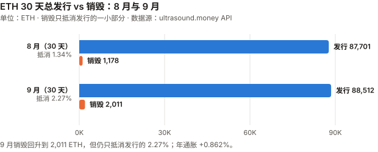
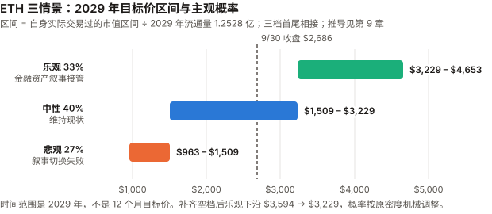

# ETH / Ethereum 完整调研与分析报告

> **编写日期**：2026 年 10 月 3 日
> **数据截止**：2026 年 9 月 30 日（9 月与 Q3 完整数据已闭合）；链上滚动窗口取到 10/3
> **版本**：2026 年 9 月版（第二期）**兼 Q3 季度回顾**
> **研究方法**：沿用 8 月首期框架。本期第一次有上期论点可核对（E8-1 至 E8-6，见 3.0）。
>
> **本版更新要点**：
>
> 1. **9 月 +8.85%，Q3 +70.86%**——收于 $2,686.01（币安日线）。Q3 是 ETH 在本系列 BTC / ETH / SOL / ADA 四个资产里涨幅最大的（与 ADA +70.78% 并列），ETH/BTC 比价 Q3 **+19.8%**。
> 2. **本期最重要的发现：8 月版留下的「blob 收入塌陷是需求侧还是供给侧」有答案了——是供给侧。**
>    逐块读取链上数据：每块 blob 用量从 2025-04 的 2.73 个升到 2026-09 的 **5.56 个（翻倍）**，而供给目标从 3 个上调到 **14 个（4.7 倍）**。
>    **需求在增长，只是供给扩得更快**，价格因此跌到地板。Fusaka 的 **EIP-7918** 把这个地板从 1 wei 抬到了执行层 base fee 的 1/16——2026 年 blob 价格一直贴着这条线，**blob 销毁 ≈ 下限价格 × 用量**。
> 3. **L1 费用 9 月回升到 $1,591 万**（环比 +53%），真年同比 **−55.4%**；销毁抵消发行的比例从 1.34% 升到 **2.27%**——**方向改善，量级仍可忽略**。年通胀 **+0.862%**，与 8 月几乎相同。
> 4. **机构侧首次取得一手数据**：ETF 改用 Farside 日度表——9 月净流入 **$8.31 亿**，Q3 **$30.5 亿**；质押型 ETF **ETHB** 9 月流入 $1.91 亿，占当月流入的 **23%**。
>    BitMine 每周 8-K：ETH 持仓从 590.1 万枚升到 **600.1 万枚**（约 4.9% 供应量），其中 **84% 已质押**。
> 5. **Glamsterdam**：以太坊基金会 9/17 公告测试网 Sepolia 于 **10/6** 激活，**主网日期未定**。
> 6. **8 月版的四处更正**（见 11.5）：base fee「0.3115 gwei」是单点快照，8 月月均为 **0.173 gwei**；ETF 8 月净流入按 Farside 全月为 **$18.5 亿**；8 月涨幅改按币安 UTC 收盘为 **+32.48%**（原 CoinGecko 零点快照口径 +29.86%）；情景区间之间的空档补齐。
>
> **免责声明**：本报告不构成任何投资建议。所有分析仅供研究参考，投资决策请咨询专业顾问。

---

## 核心结论摘要（一页速览）

| 维度 | 核心判断 |
|------|----------|
| **ETH 是什么** | 一条**可编程结算层**：把执行外包给 L2，自己保留结算与数据可用性 |
| **当前价格位置** | $2,686.01（9/30 币安收盘），市值约 **$3,279 亿**（全球第 2）。距 ATH（$4,956.78，币安 2025-08-24 盘中）**−45.8%**；YTD −9.61% |
| **9 月 / Q3 表现** | **9 月 +8.85%、Q3 +70.86%**。Q3 比 BTC beta 预期高约 17–19pp，**约 1–1.5 个标准差，不能排除噪声**；9 月的 +2.6pp 在噪声范围内 |
| **本期最重要的发现** | **blob 收入塌陷是供给侧原因**：每块 blob 用量一年半翻倍（2.73 → 5.56），供给目标涨 4.7 倍（3 → 14），价格跌到地板。**EIP-7918 把地板从 1 wei 抬到执行层 base fee 的 1/16**；用量低于目标期间，**blob 销毁 ≈ 下限价格 × 用量，L2 增长通过用量线性传导，但不推高单价**。用量要再涨约 2.5 倍，blob 才会重新进入市场定价 |
| **发行与销毁** | 30 天销毁 2,010.7 ETH vs 总发行 88,512 ETH，**抵消 2.27%**（8 月 1.34%）；年通胀 **+0.862%**。「超声波货币」仍然失效 |
| **L1 费用** | 9 月 **$1,591 万**，环比 +53%、真年同比 −55.4%。月均 base fee 0.173 → **0.289 gwei**。**回升，但仍在 8 月版登记的 $2,000 万门槛之下** |
| **机构通道** | ETF 9 月 +$8.31 亿（Farside 一手），**放缓到 8 月的 45%**；质押型 ETF ETHB 9 月流入 $1.91 亿、资产 $11.76 亿（BlackRock 一手）。BitMine 9 月增持 10.0 万枚，持有约 4.9% 供应量 |
| **核心多头逻辑** | 抵押品层地位（L1 TVL $533 亿，第二名的 8.0 倍）；质押型 ETF 规模在增长；BitMine 84% 持仓已质押、持续增持；Q3 跑赢 BTC 19.8% |
| **核心空头逻辑** | 销毁只抵消发行的 2.27%；L1 费用真年同比 −55.4%；**blob 供给目标（14 个/块）远高于用量（5.56），blob 价格贴地板、销毁很少**；BitMine 单一实体约 4.9% 供应量；ETF 流入放缓 |
| **估值立场** | 现金流（50 倍市盈率）只能解释市值的 **约 3%**。情景框架沿用 8 月版，补齐区间空档后概率**机械调整为 33/40/27**（不是观点变化，见 9.4）；**作者的基准预期是中性情景**（2026 年实际交易区间内震荡） |
| **风险等级** | 低于 SOL 与 ADA，高于 BTC。年化波动 9 月 43.6%、过去一年 63.7% |

---

## 1. Ethereum 的起源与设计取舍

> 本章与 8 月首期相同，此处只保留理解本期内容必需的部分。完整内容见 `eth_research_report_202608.md` 第 1 章。

| | Bitcoin | Ethereum |
|---|---|---|
| 目标 | 点对点电子现金 | **可编程的世界状态机** |
| 代币角色 | 就是资产本身 | **是资产，也是使用网络的燃料** |
| 供应规则 | 硬编码 2,100 万 | **没有硬上限**，发行规则随共识升级变化 |

**改变 ETH 资产性质的升级**：

| 升级 | 时间 | 改变了什么 |
|------|------|-----------|
| EIP-1559 | 2021-08-05 | base fee 销毁——「ETH 可能通缩」叙事的起点 |
| The Merge | 2022-09-15 | PoW → PoS，发行降约 90%，ETH 成为有收益的资产 |
| EIP-4844（Dencun） | 2024-03 | blob——给 L2 的廉价数据通道 |
| **Fusaka** | **2025-12-03** | gas limit 默认 60M（EIP-7935）、PeerDAS（EIP-7594）、**blob 价格下限（EIP-7918）**、BPO 分叉机制（EIP-7892，单独上调 blob 容量） |

> **本期新增的一行理解**：Fusaka 不只是扩容。它的 **EIP-7918 改变了 blob 的定价规则**——
> 在需求不足时，blob 价格不再跌到 1 wei，而是停在执行层 base fee 的 1/16。**第 5 章会说明这对价值捕获意味着什么。**
> （Fusaka 包含的 EIP 清单取自 GitHub `ethereum/EIPs` 的元 EIP-7607 原文。）

---

## 2. ETH 的发展阶段划分

> 阶段一至四见 8 月首期。阶段五追加本期事件。

### 阶段五：叙事切换与机构接管（2025.12– 至今）

| 时点 | 事件 |
|------|------|
| 2025-12-03 | **Fusaka 激活**：gas limit 60M、PeerDAS、blob 价格下限（EIP-7918） |
| 2026-01-15 | 年内最高市值 **$4,045 亿**（CoinGecko） |
| 2026-03 | **BlackRock ETHB（质押型 ETF）上线**；Farside 显示 3 月流入 $3.06 亿 |
| 2026-06-26 | 年内最低市值 **$1,890 亿** |
| 2026-07 | ETF 净流入 $3.67 亿，**高于同期 BTC ETF 的 $1.73 亿**（Farside 一手核实了 8 月版的这条说法） |
| 2026-08 | **+32.48%**（币安 UTC 收盘口径）；ETF 净流入 $18.5 亿 |
| **2026-09-04** | BitMine 终止与 Ethereum Tower 的质押管理协议（8-K Item 1.02） |
| **2026-09-15/16** | CLARITY 法案参议院程序性投票失败、美联储加息 25bp；**两日 ETF 合计流出 $3.66 亿**，ETH 9/15 单日 −4.67% |
| **2026-09-17** | 以太坊基金会公告 **Glamsterdam 测试网（Sepolia）10/6 激活**，主网未定 |
| **2026-09-21** | ETH 盘中高点 **$2,807.34**；ETF 单日流入 $2.70 亿 |
| **2026-09-28** | BitMine 持仓**突破 600 万枚**（6,001,302） |
| **2026-Q3** | **+70.86%**；ETH/BTC +19.8% |

---

## 3. ETH 当前现状分析

### 3.0 论点校验：8 月版登记的 6 条

> 8 月首期登记的 E8-1 至 E8-6 中，**没有一条在 9 月到达检验窗口**——它们的截止日在 2026-12 至 2027-06。
> 下表记录 9 月的中期读数，**不做判定**。

| # | 论点 | 检验条件（摘要） | 9 月读数 | 状态 |
|---|------|------|------|------|
| E8-1 | 销毁不再能有意义地抵消发行 | 年底前任一月 销毁 ÷ 总发行 >15% 则错 | **2.27%**（30 天窗口，9/3–10/3） | ⏳ 距门槛约 6.6 倍 |
| E8-2 | Glamsterdam 会压低 L1 单位费用 | 上线后满一月，月均 base fee 高于上线前一月则错 | **主网未上线**（Sepolia 10/6） | ⏳ 未到窗口 |
| E8-3 | blob 销毁塌陷不会自行恢复 | 2027-03-31 前任一 30 天 blob 销毁 >80 ETH 则错 | **2.98 ETH** | ⏳ 距门槛约 27 倍；**本期查清塌陷是供给侧原因**：用量翻倍、目标涨 4.7 倍（见 5.1） |
| E8-4 | L1 费用下行是结构性的 | 9–12 月任一月 L1 费用 >$2,000 万则错 | **9 月 $1,591 万**，环比 +53% | ⏳ **9 月未触发，但已走到门槛的 80%** |
| E8-5 | 中性情景是最可能的单一结果 | 2026 年 12 月月均市值落在 $2,055 亿–$3,727 亿之外则错（区间按登记时 1–8 月月均的最低、最高月写死，见记分卡） | 9 月月均市值 $3,115 亿 | ⏳ 在区间内 |
| E8-6 | 企业储备集中度会以可观测方式兑现风险 | BitMine/SharpLink 单次减持 >5%、mNAV 连续一月 <1、或被迫融资，任一发生则成立 | BitMine **增持** 10.0 万枚；mNAV 只能算出下限 0.97（见 6.2） | ⏳ 未见触发事件 |

**最需要注意的是 E8-4**：9 月 L1 费用已到 $1,591 万，**距 $2,000 万门槛只差 26%**，而 2026 年 4 月曾到过 $2,443 万。
**Q4 任一月触发，本条就判错**——这是 8 月版两个核心章（L1 费用、价值捕获）里最可能先被证伪的一条。

### 3.1 价格与市场

> **口径变更**：8 月首期用 CoinGecko 的「日期值」（实为当日 00:00 UTC 快照）。本期起改用**币安日线 UTC 收盘**，与 BTC 报告统一，便于横向对照。
> 8 月涨幅按新口径为 **+32.48%**（7/31 收 $1,862.60 → 8/31 收 $2,467.65），原口径为 +29.86%。

| 指标 | 数值 | 口径 |
|------|------|------|
| **9/30 收盘** | **$2,686.01** | 币安 ETHUSDT 日线 |
| 市值 | **约 $3,279 亿**（全球第 2） | 收盘价 × 流通量 1.2209 亿（ultrasound.money） |
| 历史最高价 | $4,956.78（2025-08-24 盘中，币安）；CoinGecko 口径 $4,946.05 | — |
| **距 ATH** | **−45.8%** | 币安 |
| 9 月区间 | 低 **$2,356.41**（9/2）/ 高 **$2,807.34**（9/21） | 币安日线盘中 |

| 区间 | ETH | BTC | ETH/BTC 比价 |
|------|------|------|------|
| **9 月**（8/31→9/30） | **+8.85%** | +6.42% | 0.03140 → 0.03212（**+2.29%**） |
| **Q3**（6/30→9/30） | **+70.86%** | +42.64% | 0.02681 → 0.03212（**+19.81%**） |
| YTD | −9.61% | −4.59% | −5.25% |
| 近 1 年（2025-09-30 起） | −35.20% | −26.68% | −11.64% |

**beta 与 R² 一起读**（XIN 期规则），以及 beta 残差（CKB 期规则）：

| 窗口 | 年化波动 | 对 BTC 的 beta | R² | beta 预期涨幅 | 实际 | **自身成分** |
|------|------|------|------|------|------|------|
| 9 月 | 43.6% | 0.98 | 0.86 | +6.30% | +8.85% | **+2.55pp** |
| Q3 | 52.6% | 1.21 | 0.77 | +51.69% | +70.86% | **+19.17pp** |
| 近 1 年 | 63.7% | 1.28 | 0.82 | −34.22% | −35.20% | −0.98pp |

> **Q3 的自身成分有多大把握**（`_bian` 审查后补算）：残差年化波动 = 52.6% × √(1 − 0.77) ≈ 25%，一个季度的 1 个标准差约 **12.7pp**——+19.2pp 约 **1.5 个标准差**；改用对数收益计算约 0.8 个标准差。**9 月的 +2.55pp 约 0.55 个标准差，在噪声范围内。**
> **所以只能说 Q3 高于 beta 预期约 17–19pp，不能排除噪声，不能说「ETH 不只是跟涨」。**
> **同期的 ETH 专属事件**：ETF 流入 $30.5 亿、BitMine 持续增持、L1 TVL 从 $374 亿升到 $533 亿。
> **这些是相关，不是已证明的原因**——ETF 流量与价格同步（BTC 记分卡模式二），BitMine 的买入量相对日成交额有多大，本报告没有测。

**9 月的两个大涨日**：9/18 **+6.74%**、9/21 **+4.95%**——与 BTC 同一天（BTC +5.85%、+6.70%），对应 9/18 原油回落与 SEC 对代币化股票交易的有限放行、9/21 ETF 大额流入（事件归因见 BTC 9 月版，为媒体转述）。
**9/15 −4.67%**——CLARITY 法案程序性投票失败当日。

### 3.2 L1 活动与费用

**L1 月度费用序列**（DefiLlama API 日度数据按月聚合，一手）：

| 月份 | L1 费用 | 月份 | L1 费用 |
|------|---|------|---|
| 2025-07 | $49,497,182 | 2026-02 | $15,187,083 |
| 2025-08 | $39,587,105 | 2026-03 | $10,580,034 |
| **2025-09** | **$35,661,007** | 2026-04 | $24,425,831 |
| 2025-10 | $41,181,773 | 2026-05 | $16,579,471 |
| 2025-11 | $23,438,885 | 2026-06 | $10,777,326 |
| 2025-12 | $11,470,440 | 2026-07 | $8,314,396 |
| 2026-01 | $13,960,819 | 2026-08 | $10,382,162 |
| | | **2026-09** | **$15,905,378** |

| 比较 | 结果 |
|------|---|
| **真年同比（2026-09 vs 2025-09）** | **−55.4%**（8 月为 −73.8%） |
| 环比（vs 2026-08） | **+53.2%** |
| 过去 12 个月合计（2025-10 至 2026-09） | **$2.022 亿** |
| 其中归入「收入」（即销毁部分，DefiLlama `dailyRevenue`） | 9 月 **$487.9 万** |

**月均 base fee**（ultrasound.money 日度序列取月均，一手）：

| 月份 | 月均 base fee |
|------|------|
| 2025-08 | 0.646 gwei |
| 2026-06 | 0.278 gwei |
| 2026-07 | 0.168 gwei |
| **2026-08** | **0.173 gwei** |
| **2026-09** | **0.289 gwei**（+67%） |

> ⚠️ **8 月版的更正**：8 月版写「当前 base fee 0.3115 gwei」，那是一个单点快照；**8 月的月均是 0.173 gwei**。
> 本期起统一用月均——**base fee 一天之内可以相差数倍**（10/3 快照为 0.062 gwei），单点不适合做月度对比。

**9 月费用回升的读法**：费用以美元计，**同时受 ETH 价格（+8.85%）和 gas 单价（+67%）影响**。
按 EIP-1559，base fee 只在区块使用率高于 50% 目标时上升——**月均 base fee 上升是需求相对容量上升的间接信号**，不是交易量的直接测量（Codex）。**而且 $1,591 万仍是一年前同月的 45%**。

**生态合计费用**（DefiLlama `overview/fees/ethereum`，30 天）：**$3.507 亿**。前列为 Lido $5,141 万、Aave V3 $2,831 万、Sky Lending $2,686 万、Ethena USDe $2,353 万、Binance staked ETH $1,786 万；**L1 链本身（DefiLlama 记为「Ethereum」）$1,652 万，占 4.7%**。

> **口径纪律**（ADA 期）：L1 费衡量 ETH 代币的价值捕获，生态合计衡量生态活跃度，不能混用。

### 3.3 质押

| 指标 | 数值 | 来源 |
|------|------|------|
| 质押总量 | **4,370 万 ETH** | validatorqueue.com（数据来自 beaconcha.in） |
| **质押率** | **35.78%**（8 月 35.08%） | 同上 |
| 年化 APR | **2.63%** | 同上 |
| 活跃验证者 | 873,849 | 同上 |
| **进入队列** | **154.5 万 ETH**，等待约 26 天 20 小时 | 同上 |
| 退出队列 | 80.5 万 ETH，等待约 14 天 | 同上 |

> **验证者数量不能和 8 月版直接比**：8 月版的 795,000（StakingRewards）与约 903,000（Beacon Chain）两个口径本就有分歧；
> 且 Pectra 升级后单个验证者的有效余额上限提高到 2,048 ETH，**合并验证者会让数量下降而质押量不变**。本期只用质押量。

**进入队列是退出队列的约 1.9 倍**：净排队约 74 万 ETH 等待进入质押。若全部完成，质押率将升到约 36.4%——**而质押越多，发行越多**（见 4.3）。

### 3.4 生态数据：TVL 与 L2

**TVL**（DefiLlama API，一手，10/3 快照）：

| 链 | TVL |
|------|---|
| **Ethereum（L1）** | **$534.5 亿**（9/30 $532.9 亿；8/31 $487.7 亿；6/30 $373.5 亿） |
| Solana | $66.4 亿 |
| Base | $63.5 亿 |
| BSC | $57.2 亿 |
| Tron | $56.4 亿 |
| Arbitrum | $14.1 亿 |
| OP Mainnet | $4.9 亿 |

**L1 TVL 是第二名（Solana）的 8.0 倍**（8 月版为 8.5 倍）。L1 TVL Q3 增长 42.7%，**低于 ETH 价格的 70.9%**——TVL 以美元计，主要随价格变动，不应把它的增长读成独立的需求证据。

**主要 L2 的 9 月费用**（DefiLlama API）：Base **$470 万**（8 月 $303 万）、Arbitrum $61 万（8 月 $37 万）。

### 3.5 宏观环境

> ETH 与 BTC 共享宏观驱动，详细数据见 BTC 9 月版 3.4。以下只列对 ETH 有特别含义的几项。

| 因素 | 9 月末 | 对 ETH 的含义 | 来源 |
|------|------|------|------|
| 联邦基金利率 | **3.75–4.00%**（9/16 加息 25bp，12:0） | 点阵图中位数指向年内再加一次 | federalreserve.gov ✅ |
| **10 年期美债** | **5.29%**（年内最高） | **是 ETH 质押 APR 2.63% 的约 2 倍**——买 ETH 的人不是为了质押收益 | 美国财政部 ✅ |
| 美元指数 | 101.45 | — | Yahoo Finance |

> **与 BTC 9 月版同一个观察**：9 月宏观全面偏鹰，ETH 仍涨 8.85%、Q3 涨 70.9%。
> **本报告不把「宏观偏鹰」直接翻译成「ETH 偏空」**——Q3 的数据不支持这个翻译；但也不反过来说利率无关（见 BTC 9 月版 3.1）。

### 3.6 Q3 季度回顾（本版新增）

| | Q2 2026 | **Q3 2026** |
|------|------|------|
| ETH 季度涨跌（币安） | **−25.34%**（3/31 收 $2,105.43 → 6/30 收 $1,572.01） | **+70.86%** |
| ETH/BTC | 0.02681（6/30） | **0.03212（+19.8%）** |
| ETF 季度净流量（Farside） | **−$7.16 亿**（4 月 +3.56、5 月 −5.41、6 月 −5.30） | **+$30.50 亿** |
| L1 季度费用（DefiLlama） | $5,178 万 | **$3,460 万** |
| 季末 L1 TVL | $373.5 亿 | **$532.9 亿** |
| 季末质押率 | — | 35.78% |

**Q3 最突出的一组对照**：**价格 +70.9%、ETF +$30.5 亿、TVL +42.7%——而 L1 费用比 Q2 低 33%。**
**这正是 8 月版 9.6 弱点 6 预先指出的那种情景**：「ETH 价格上涨，同时 L1 价值捕获继续恶化」——完全由金融配置驱动、与网络费用脱钩。
**Q3 把它从一个弱点变成了已发生的事实**，见 9.3 对情景集的处理。

> Q2 的 L1 季度费用为 4–6 月合计（$2,443 万 + $1,658 万 + $1,078 万）；Q3 为 7–9 月合计（$831 万 + $1,038 万 + $1,591 万）。

---

## 4. 发行与销毁

> 本章全部数据来自 ultrasound.money 公开 API（一手直接调用）。

### 4.1 9 月的供应变化

| 30 天窗口（9/3 06:00 → 10/3 06:11 UTC） | ETH |
|------|---:|
| 起点供应 | 122,008,832.71 |
| 终点供应 | 122,095,334.29 |
| **净增** | **+86,501.58** |
| 销毁 | **2,010.68**（≈ $531 万） |
| **推算总发行（= 净增 + 销毁）** | **88,512.26**（含罚没等调整，量级可忽略；严格说是「净发行 + 销毁」） |
| **销毁 ÷ 总发行** | **2.27%**（8 月 1.34%） |
| **年通胀率** | **+0.862%**（8 月 +0.863%） |

> 图中数字（ETH，取整）：8 月总发行 87,701、销毁 1,178（取自 8 月版）；9 月总发行 88,512、销毁 2,011。

**交叉核对**：ultrasound.money 的 `issuance-estimate` 接口给出当前每个 slot 发行 0.40996 ETH，折合 30 天 **88,551 ETH**，与上表的 88,512 ETH 相差 0.04%。
**这两个数来自同一个数据源**，一致只说明内部自洽，**不构成独立验证**（CKB 期规则）。

**长周期视角**：合并以来（2022-09-15）总供应 120,521,140.92 → 122,095,334.29，**+1.31%**（约四年）。

> **「超声波货币」仍然失效**：销毁抵消发行的比例从 1.34% 升到 2.27%，**方向改善但量级仍可忽略**。
> 要回到 2021–2023 年的净通缩，销毁需要再涨约 44 倍。

### 4.2 质押收益的来源

| 步骤 | 计算 | 结果 |
|------|------|------|
| 年化总发行 | 0.40996 ETH/slot × 7,200 × 365 | **约 1,077,400 ETH** |
| 质押总量 | validatorqueue.com | 4,370 万 ETH |
| **仅由发行贡献的收益率** | 1,077,400 ÷ 43,700,000 | **约 2.47%** |
| 报告的实际 APR | validatorqueue.com | **2.63%** |
| 差额（隐含执行层收益：优先费 + MEV） | 2.63% − 2.47% | **约 0.17pp** |

> **8 月版指出的三处方法缺陷仍然存在**（两个口径不同、MEV-Boost 的 builder→proposer 支付不在链上 gas 里、质押数据为二手），
> **所以本期同样只给方向：质押收益的绝大部分来自新发行。** 差额 0.17pp 比 8 月的 0.10pp 大，与 9 月 base fee 回升方向一致，但精度不足以下结论。

**对不质押的持有者**：每年被稀释约 **0.862%**，无补偿（含所有非质押型 ETF 的持有人）。

---

## 5. L2 与价值捕获（本期核心章）

### 5.1 blob 收入为什么塌了——8 月版问题的答案

8 月版 5.1 留下了一个问题：blob 销毁从历史月均 158.6 ETH 塌到 1.81 ETH，是**需求侧**（L2 用得少了）还是**供给侧**（blob 供给目标上调、价格触及地板）？**两种解释的政策含义相反——前者是结构性的，后者是可逆的价格现象。**

> **本节在发布前审查后重写**（见 11.6）。初稿只用价格数据就宣布了答案，**而价格贴地板这个状态，两种解释都会产生**——它区分不了两者（`_bian`）。
> 初稿还把 EIP-7918 写成了塌陷的原因，**方向反了**：它是把地板抬高的那个机制。重写后补上了能真正区分两种解释的数据：**每个区块实际用了多少 blob**。

**第 1 步 · 供给目标被上调了三次**（GitHub `ethereum/EIPs` 原文，一手）：

| 时间 | 升级 | 每块 blob 目标 / 上限 | 来源 |
|------|------|------|------|
| 2024-03 | Dencun（EIP-4844） | 3 / 6 | EIP-4844 |
| **2025-05-07** | Pectra（EIP-7691） | **6** / 9 | 元 EIP-7600 激活表、EIP-7691 常数 |
| **2025-12-09** | BPO1 | **10** / 15 | 元 EIP-7607 激活表；目标值取自 EIP-7892 的配置示例 |
| **2026-01-07** | BPO2 | **14** / 21 | 同上 |

> BPO1、BPO2 的激活时间来自 EIP-7607 的激活表（一手）；**10 / 15、14 / 21 这组参数取自 EIP-7892 原文的配置示例，本报告未在客户端配置里逐一核对**，但它与下面测到的「上限 21」一致（2026-02 抽样中出现过 21 个 blob 的区块）。

**第 2 步 · 实际用量翻了一倍，目标涨了 4.7 倍**（以太坊公共 RPC 节点，逐块读取 `blobGasUsed ÷ 131,072`，每月均匀抽样 240 个区块，一手）：

| 月份 | 每块平均 blob 数 | 中位数 | 当时的目标 | **用量 ÷ 目标** | blob 价格状态 |
|------|------|------|------|------|------|
| 2025-04（Pectra 前） | 2.73 | 3 | 3 | **91%** | 市场定价（月均 54.8 亿 wei） |
| 2025-06（Pectra 后） | 3.76 | 3 | 6 | **63%** | **跌到 1 wei** |
| 2025-11 | 5.68 | 6 | 6 | **95%** | 回升（4,710 万 wei） |
| 2026-02（BPO2 后） | 4.52 | 4 | 14 | **32%** | 贴在下限 |
| **2026-09** | **5.56** | 5 | 14 | **40%** | 贴在下限 |

**答案：是供给侧，不是需求侧。** 从 2025-04 到 2026-09，每块 blob 用量从 2.73 升到 5.56（**+104%**），而供给目标从 3 升到 14（**4.7 倍**）。
**需求在增长，供给增长得更快**——每次目标上调后，用量落到目标之下，价格就跌到地板：
2025-06（Pectra 后一个月）用量只有目标的 63%，价格跌到 1 wei；2025-11 用量追到目标的 95%，价格回升；BPO1、BPO2 之后又落到 32%–40%。

> ⚠️ **限度**：每月只抽 240 个区块、只用一个 RPC 节点，用量是抽样估计，不是全量；但需求翻倍与目标 4.7 倍之间的差距远大于抽样误差。
> **初稿用 Base 的 L2 手续费（9 月 $470 万）来论证「L2 活动没减少」——那是 L2 向用户收的钱，不是 blob 用量，已删除这条论据。**

**第 3 步 · EIP-7918 做了什么：把地板从 1 wei 抬到执行费的 1/16**（GitHub `ethereum/EIPs` 原文，一手）：

- Fusaka（元 EIP-7607）包含 **EIP-7918「Blob base fee bounded by execution cost」**，状态 Final。
- 原文规则：当 `BLOB_BASE_COST × 执行层 base fee` 高于 `GAS_PER_BLOB × blob base fee` 时，**`excess_blob_gas` 停止下调**（`BLOB_BASE_COST = 2^13`，`GAS_PER_BLOB = 2^17`，原文称「这个比例是 1/16」）。
- **它是一条「停止下调」的软规则，不是把价格直接设为 1/16**（Codex 指出）：价格低于这条线时，`excess_blob_gas` 按实际用量上升，价格被推回线上；高于这条线且用量低于目标时，价格回落。**均衡结果是价格围绕这条线波动**。
- 原文动机：旧机制下价格「可能反复下调，直到最终停在 1 wei」——**2024-07 至 09、2025-06 至 08 正是这种情况**。

**数据**（ultrasound.money `base-fee-over-time`，日度均值按月平均后相除，一手）：

| 时期 | blob base fee 月均 | blob ÷ 执行层 base fee |
|------|------|------|
| 2024-03 | 69.4 亿 wei | 0.158 |
| 2024-07 至 09 | 1–41 wei | ≈ 0（1 wei 地板） |
| 2024-11 至 2025-04 | 15.7 亿–131 亿 wei | 0.43–4.61（用量高于目标，市场定价） |
| 2025-06 至 08 | 1 wei | ≈ 0（1 wei 地板） |
| **2026-01 至 09** | 680 万–3,170 万 wei | **0.053–0.067**（围绕 1/16 = 0.0625） |

> 比值是「月均 blob 价 ÷ 月均执行价」，不是逐日比值的平均；比值略低于 0.0625 与软规则的波动一致。**月均看不到月内的短时脱离**，所以只能说「平均而言」贴着下限。

**第 4 步 · 这对价值捕获意味着什么**

| | Fusaka 之前（2025 年中） | **Fusaka 之后（2026 年）** |
|------|------|------|
| 用量低于目标时的 blob 价格 | 1 wei | **约为执行层 base fee 的 1/16** |
| blob 销毁 | ≈ 0 | **≈ 下限价格 × 用量**——随用量**线性**增长 |
| 用量超过目标时 | 价格被推高（市场定价） | 同左，EIP-7918 不改变这一段 |

- **需求低于目标时，单价不随 L2 用量上涨——这是 EIP-4844 以来 blob 市场的性质，不是 EIP-7918 造成的。**
- **EIP-7918 让销毁至少随用量线性增长**，而在它之前，同样的状态下销毁约等于零。**相对 Fusaka 之前，它恢复了一部分传导，而不是切断。**
- **当前离「价格脱离下限」有多远**：9 月用量 5.56 个/块，目标 14——**用量要再涨约 2.5 倍，blob 才会重新进入市场定价**。在那之前，blob 销毁 ≈ 执行层 base fee ÷ 16 × 用量。

**本期 blob 销毁**（ultrasound.money `fees/all`，一手）：

| 周期 | blob 销毁 | 折美元 |
|------|------|------|
| 24 小时 | 0.068 ETH | $183 |
| 7 天 | 1.18 ETH | $3,174 |
| **30 天** | **2.98 ETH** | **$7,848**（8 月 1.81 ETH / $4,436） |
| EIP-4844 以来累计 | 4,722.06 ETH | $1,485 万 |

**对 E8-3（2027-03 前 blob 销毁回到 80 ETH/30 天）的含义**：要从 2.98 ETH 到 80 ETH，**要么执行层 base fee 涨约 27 倍（约 7.8 gwei，接近 2025-01 的月均 10.1 gwei），要么用量涨约 2.5 倍、让 blob 重新进入市场定价**。

### 5.2 这是不是设计意图？

**是，而且是两个独立的设计选择。**

1. **上调 blob 目标（Pectra、BPO1、BPO2）**：明确目标是降低 L2 成本、为 L2 扩容。**供给跑在需求前面是这一路线的预期结果**——EIP-7892 原文说 BPO 是为了「根据真实需求和网络条件」快速扩容。
2. **EIP-7918**：原文目标是让 blob 的「费用更新机制能正常运作」，并让 blob 使用者「至少支付节点计算成本的一部分」。**它不是为提高 ETH 的价值捕获设计的**——原文还讨论了下限「过高」的情形，认为在当前路线上不会发生。

> **本报告的立场**：ETH 用 L1 收入换取了 L2 成本下降与生态规模，这是战略选择，8 月版的判断不变。
> **本期更正的一点**：blob 收入塌陷**不是「L2 不用 ETH 了」**——L2 对 blob 的用量一年多翻了一倍。**是供给扩得比需求快**，这在需求追上目标之后是可逆的（2025-11 就短暂发生过）。

### 5.3 供给侧：Glamsterdam

- **Glamsterdam**（以太坊基金会 9/17 公告，一手）：Sepolia 于 **2026-10-06 13:53:36 UTC** 激活；「Hoodi 与主网的激活时间将由客户端团队决定……本公告不安排主网升级」。
  包含 ePBS（EIP-7732）、区块级访问列表（BALs，EIP-7928）、状态相关 gas 重新定价（EIP-8037/8038）等。
  公告提到客户端激活后默认 60M gas limit、**需显式配置才是 200M**——**「200M」不是一个已确定的网络目标**。
- **联动**：执行层 base fee 若被压低，**blob 下限也会同比例降低**——两条销毁路径会一起变薄（E8-2 检验的就是执行层这一半）。

---

## 6. 机构通道与持有者结构

### 6.1 ETF：9 月放缓，质押型产品占比上升

> **本期起使用 Farside 的日度一手数据**（farside.co.uk，直接抓取并逐日加总）。8 月版这一项全部来自媒体转述，是多头论据证据等级偏低的主因。

| 月份 | 净流量 | 净流入天数 | 其中 ETHB（质押型） |
|------|------|------|------|
| 2026-04 | +$3.56 亿 | 12/21 | +$1.89 亿 |
| 2026-05 | −$5.41 亿 | 5/20 | +$0.36 亿 |
| 2026-06 | −$5.30 亿 | 4/21 | 0 |
| 2026-07 | +$3.67 亿 | 17/22 | +$0.24 亿 |
| 2026-08 | **+$18.52 亿** | 17/21 | +$1.49 亿 |
| **2026-09** | **+$8.31 亿** | 13/21 | **+$1.91 亿** |

| 指标 | 数值 |
|------|------|
| 9 月分项 | ETHA +$4.93 亿、**ETHB +$1.91 亿**、FETH +$1.06 亿、ETH（迷你）+$0.96 亿、ETHE −$0.74 亿 |
| **ETHB 占 9 月净流入** | **23.0%**；占「当月净流入为正的基金」合计（$9.09 亿）的 **21.1%** |
| **ETHB 资产规模 / 费率**（BlackRock 官网，一手） | **$11.76 亿**（10/2）；费率 0.25%，上线首 12 个月对前 $25 亿资产减至 **0.12%**；10/2 质押收益率 **1.32%** |
| ETHB 自上市累计净流入（至 10/2） | **$8.85 亿**，占全部现货 ETH ETF 累计净流入（$138.5 亿）的 6.4% |
| **Q3 合计** | **+$30.50 亿** |
| 2026 年累计（至 9/30） | +$15.76 亿 |
| 9/15–9/16 | −$1.42 亿、−$2.24 亿（CLARITY 失败与加息两日） |
| 总资产规模 | 约 $176 亿、占市值 5.37%（9/30，KuCoin 转述，**未取得一手**） |

> ⚠️ 搜索中还出现一个「$240.9 亿、591 万 ETH」的总资产数字。**591 万 ETH × $2,686 ≈ $159 亿，与它自报的 $240.9 亿对不上**，本报告不采用。

**9 月读法**：
1. **流入放缓到 8 月的 45%**，但仍为正，Q3 三个月全部净流入。
2. **质押型 ETF 有迁移迹象，但「占比」会被分母放大**（`_bian`）：ETHB 绝对流入 8 月 $1.49 亿 → 9 月 $1.91 亿（+28%）；它占净流入的比例从 8% 升到 23%，**其中约 10 个百分点来自总流入减半**（若 ETHB 维持 8 月的 $1.49 亿，9 月占比也有 17.9%）。
   **ETHB 的资产 $11.76 亿约占现货 ETH ETF 总资产（约 $176 亿，二手）的 6.7%**。
   **ETHB 对持有人意味着什么**：质押收益率 1.32% − 优惠期费率 0.12% ≈ 1.2%，高于 0.862% 的稀释——**净正约 0.34pp**；非质押型 ETF 则是 −0.862% 再减去费率。ETHB 的 1.32% 约为全网 APR 2.63% 的一半，说明它只质押了部分持仓（推断，未逐项核实）。

### 6.2 企业储备：BitMine 的一手数据

**全部来自 BitMine 向 SEC 提交的每周 8-K 附件（Exhibit 99.1，即公司新闻稿）**。⚠️ **这是公司自述，SEC 不核验其内容**（Codex）；它是一手来源，但不是独立审计：

| 8-K 日期 | ETH 持仓 | 周增量 |
|------|------|------|
| 8/31 | 5,901,112 | — |
| 9/8 | 5,929,198 | +28,086 |
| 9/14 | 5,956,378 | +27,180 |
| 9/21 | 5,983,940 | +27,562 |
| **9/28** | **6,001,302** | +17,362 |
| **9 月合计** | | **+100,190** |

| 指标 | 数值 |
|------|------|
| 占 ETH 供应量 | 约 **4.9%**（公司口径，按 1.221 亿枚） |
| **已质押** | **5,067,309 ETH（持仓的 84.4%）**——原文：「一部分」质押在自建的 MAVAN 平台上，其余通过质押合作方 |
| 加密资产 + 现金 + 有价证券合计 | **$172 亿**（9/28 口径，ETH 按 $2,698） |
| 「Alchemy of 5%」进度 | 公司称 98% |
| 9/4 | **终止与 Ethereum Tower 的质押管理服务协议**（8-K Item 1.02）。原协议 2026-03-24 签订、为期十年，对方按质押净收入抽成 |

**mNAV：只能给出一个下限**

| 输入 | 数值 | 来源 |
|------|------|------|
| 流通股数 | 603,226,394 股（**截至 2026-07-09**） | SEC XBRL（10-Q 封面） |
| 股价 | $27.56（9/25） | Yahoo Finance |
| 市值下限 | ≥ $166.2 亿 | 相乘 |
| 资产 | $172 亿 | 9/28 8-K |
| **mNAV 下限** | **≥ 0.97 倍** | |

> **为什么只能给下限**：BitMine 7 月以来一直在通过 ATM 发行新股买 ETH，**股数只会比 7/9 更多**，所以真实市值和 mNAV 都只会更高。
> 这是一个**界**，不是点估计（XIN 期规则：两端结论不同时不能丢弃区间，但也不能当点用）。
> **对 E8-6 的含义**：「mNAV 连续一月低于 1」**无法用这个下限判断**——它只排除了 mNAV 远低于 1 的情形。

**集中度**：BitMine 一家约 4.9% 供应量，仍是本系列所有资产中单一实体持仓占比最高的。
**它的买入在放缓**：9 月最后一周只增加 1.7 万枚，此前三周每周约 2.8 万枚。**它离自己宣称的 5% 目标只差约 10 万枚**——目标达成之后是否继续买，公司没有说明。

### 6.3 持有者结构小结

| 类别 | 规模 | 占流通量 |
|------|---|---|
| 质押锁定 | 4,370 万 ETH | 35.78% |
| ETF 持有 | 约 $176 亿（二手） | 约 5.4% |
| BitMine | 600.1 万 ETH | 约 4.9% |

> 三者部分重叠（BitMine 的 507 万已质押 ETH 计入质押总量），不可简单相加。

---

## 7. ETH 的核心价值逻辑

### 7.1 多头逻辑

| # | 论点 | 强度 | 说明 |
|---|------|:---:|------|
| 1 | **机构通道持续净流入** | ★★★☆☆ | Farside 一手，Q3 +$30.5 亿、三个月全部净流入。**但 9 月放缓到 8 月的 45%；且记分卡自己写明「单一大型配置者就能决定一个季度的符号」**（拒登 ETF 条目的理由）——**流入不能直接读成「多主体的广泛需求」**，故三星 |
| 2 | **质押型 ETF 有迁移迹象** | ★★★☆☆ | ETHB 绝对流入 9 月 +28%，资产 $11.76 亿、优惠期费率 0.12%，**扣费后质押收益仍高于稀释约 0.34pp**（BlackRock、Farside 一手）。**占比上升有一部分是分母缩小造成的**，故三星 |
| 3 | **抵押品层地位稳固** | ★★★★☆ | L1 TVL $533 亿，第二名的 8.0 倍。**TVL 主要随价格变动**，不是独立的需求证据 |
| 4 | **Q3 跑赢 BTC** | ★★☆☆☆ | **本月新增**。ETH/BTC Q3 +19.8%；高于 beta 预期约 17–19pp，**但只有约 1–1.5 个标准差，不能排除噪声**，原因也未能确定，故两星 |
| 5 | **企业储备在质押、产生真实收入** | ★★★☆☆ | **本期升为三星**：BitMine 持仓与质押量改为其提交给 SEC 的 8-K 附件（公司自述；8 月版为二手追踪站）；84% 已质押 |
| 6 | **供应纪律仍远好于多数 PoS** | ★★★☆☆ | 合并以来约四年净增 1.31% |
| 7 | **L1 费用 9 月回升 53%** | ★★☆☆☆ | **本月新增**。月均 base fee +67%。**但只有一个月，且仍是一年前的 45%** |

### 7.2 空头逻辑

| # | 论点 | 强度 | 说明 |
|---|------|:---:|------|
| 1 | **稀缺性叙事仍被链上数据证伪** | ★★★★★ | 销毁抵消发行 2.27%；年通胀 +0.862% |
| 2 | **blob 供给远超需求，blob 销毁很少** | ★★★☆☆ | **本月改写，替代 8 月的「blob 几乎不产生销毁」**。用量 5.56 个/块 vs 目标 14（RPC 抽样 + EIP 原文，一手）。**但这是可逆的**——需求翻倍的趋势若延续，用量追上目标后 blob 会重新进入市场定价（2025-11 发生过），故三星 |
| 3 | **L1 费用真年同比 −55.4%** | ★★★★☆ | **本月降为四星**（8 月五星）：9 月环比 +53%，且距 E8-4 的 $2,000 万门槛只差 26%——**结构性下行的判断正面临第一次实际检验** |
| 4 | **质押收益的绝大部分来自增发** | ★★★★☆ | 发行贡献约 2.47pp / APR 2.63%。MEV 未能独立测量，精度不足，故四星 |
| 5 | **单一实体集中度最高** | ★★★☆☆ | BitMine 约 4.9%，mNAV 下限 0.97，**且买入在放缓、接近其 5% 目标** |
| 6 | **ETF 流入放缓** | ★★☆☆☆ | **本月新增**。9 月为 8 月的 45%。**一个月的放缓不是趋势**（BTC 记分卡模式二：ETF 流量是同步指标） |
| 7 | **质押收益不敌无风险利率** | ★★★☆☆ | APR 2.63% vs 10 年期 5.29%（差距从 8 月的 2.2pp 扩大到 2.7pp） |

> **多空同源检查（DOT 期规则）**：
> - 多头 7（费用回升）与空头 3（费用真年同比 −55.4%）是同一条序列的两个读法——**已据此把空头 3 从五星降为四星、多头 7 只给两星**。
> - 多头 1（ETF 持续流入）与空头 6（ETF 放缓）同源——**两者合起来的含义是「仍在流入、速度减半」**，空头 6 只给两星。
> - 空头 2（blob 由下限决定）与 8 月版的「blob 几乎不产生销毁」是同一件事的机制解释与现象描述，**本期用前者替代后者，不重复计分**。

### 7.3 一句话总结

> **ETH 的金融资产身份在 Q3 跑赢了它的使用型代币身份**：价格 +70.9%、ETF +$30.5 亿，而 L1 季度费用比 Q2 低 33%、blob 供给远超需求、价格贴地板。
> **9 月的费用回升是这一季里唯一一个反向信号，它还需要至少再一个月才能说明什么。**

---

## 8. ETH 与其他资产的比较

> **口径**：涨幅统一按币安日线 UTC 收盘（8/31→9/30、6/30→9/30）；TVL 与费用为 DefiLlama 同一批 API 快照。

### 8.1 四个资产的横向矩阵

| 指标 | **ETH** | BTC | SOL | ADA |
|------|---|---|---|---|
| **9 月** | **+8.85%** | +6.42% | +14.61% | **+24.67%** |
| **Q3** | **+70.86%** | +42.64% | +60.34% | +70.78% |
| YTD | −9.61% | −4.59% | −5.24% | −26.06% |
| DeFi TVL | **$534.5 亿** | — | $66.4 亿 | — |
| L1 9 月费用 | **$1,591 万** | —（手续费占矿工收入 0.65%） | $2,498 万 | — |
| 年通胀 | +0.862% | 约 0.8% | 约 3.8%（沿用 8 月） | 1.47%（沿用 8 月） |

> **9 月的排序与 8 月不同**：8 月（同口径）SOL +41.43% > ETH +32.48% > BTC +24.95% > ADA +17.60%，大致按 beta 排序；
> **9 月 ADA 第一（+24.67%）、ETH 只排第三**。**Q3 合计 ETH 与 ADA 并列第一**——两个月的排序不同，说明不能用一个月的排名推断相对偏好（8 月版 3.1 的教训）。
> **另一个横向事实**：SOL 9 月 L1 费用 $2,498 万，**高于 ETH 的 $1,591 万**，而 SOL 市值约为 ETH 的五分之一（SOL 市值本期未重新核实）。

### 8.2 ETH vs BTC：收益率与相对强弱

| | BTC | **ETH** |
|---|---|---|
| 年通胀 | 约 0.8%（硬编码递减） | +0.862%（随质押量上升） |
| 收益属性 | 无 | 质押 APR 2.63%（绝大部分来自增发） |
| Q3 | +42.64% | **+70.86%** |
| ETH/BTC | — | Q3 +19.8%，**但近 1 年仍 −11.6%** |

> Q3 的 ETH/BTC 反弹，**只收复了过去一年跌幅的一部分**：0.03635（2025-09-30）→ 0.02681（6/30）→ 0.03212（9/30）。

---

## 9. 关键变量与情景推演

### 9.1 未来 3–12 个月的催化剂日历

| 时点 | 事件 | 方向 | 重要性 |
|------|------|:---:|:---:|
| **2026-10-06** | **Glamsterdam 在 Sepolia 激活**（一手公告） | 观察 | ★★★☆☆ |
| **未定（路线图 Q4）** | **Glamsterdam 主网**——检验 E8-2，并通过 EIP-7918 联动 blob 下限 | **双向** | ★★★★★ |
| **10/27–28、12/8–9** | FOMC；点阵图中位数指向年内再加一次 | 双向（9 月加息后 ETH 上涨） | ★★★☆☆ |
| **持续** | **L1 月度费用是否突破 $2,000 万**（E8-4 门槛；9 月 $1,591 万） | **关键** | ★★★★★ |
| **持续** | **blob ÷ 执行层 base fee 是否脱离 1/16**（脱离 = blob 需求超过目标） | 关键 | ★★★★☆ |
| **持续** | BitMine 达到 5% 后是否继续买入（距目标约 10 万枚） | 风险 | ★★★★☆ |
| **持续** | ETHB 等质押型 ETF 的流入占比（9 月 23%） | 观察 | ★★★☆☆ |
| **持续** | 质押进入队列 154.5 万 ETH 完成后质押率升至约 36.4%——**发行随之上升** | 观察 | ★★☆☆☆ |

### 9.2 估值：现金流能解释多少

| 口径 | 年化 | 给 **50 倍** | 占市值 $3,279 亿 |
|------|---|---|---:|
| L1 费用（过去 12 个月实际） | $2.022 亿 | $101.1 亿 | **3.1%** |
| L1 费用（9 月 × 12） | $1.909 亿 | $95.4 亿 | **2.9%** |
| **仅销毁部分**（30 天 × 365/30） | $6,460 万 | $32.3 亿 | **1.0%** |

> ⚠️ **哪一行才算持有人现金流**（Codex）：L1 用户付的总费用里，只有被销毁的部分回馈全体持有人；优先费与 MEV 归验证者。**所以「仅销毁部分」那一行（约 1%）才是对全体持有人的直接价值捕获**，前两行是上限。
> **结论与 8 月版相同**：市值的 97%–99% 无法用 L1 现金流解释。**这不代表高估**——市场买的主要不是现金流。

### 9.3 三种情景（2029 年）

**本期对 8 月版框架的一处修正**：8 月版的乐观区间从 $4,500 亿起，与中性上沿 $4,045 亿之间**留了一个 $455 亿的空档**——ETH 落在 $4,045 亿–$4,500 亿时不属于任何情景。
**按 PONS 期规则（情景区间首尾相接），本期把乐观下沿改为 $4,045 亿。** 其余区间不变。

**推导方式**（与 8 月版相同）：参照市值全部取自 ETH 自身实际交易过的水平（CoinGecko 2022-01 至今日线），按年通胀 0.862% 推算 **2029 年流通量约 1.2528 亿枚**，折算为每 ETH 价格。

| 情景 | 概率 | 参照市值 | 目标价（**2029 年**） | 相对现价（$2,686） |
|------|:---:|---|---|---|
| **乐观**：金融资产叙事完全接管 | **33%** | $4,045 亿 – $5,829 亿（上限为 2025-08 市值历史最高） | **$3,229 – $4,653** | +20% ~ +73% |
| **中性**：维持现状、随宏观 beta 波动 | **40%** | $1,890 亿 – $4,045 亿（2026 年实际交易区间） | **$1,509 – $3,229** | −44% ~ +20% |
| **悲观**：叙事切换失败 | **27%** | $1,207 亿 – $1,890 亿（下限为 2022-06 五年最低） | **$963 – $1,509** | −64% ~ −44% |

> 图中横轴刻度为 $1,000 / $2,000 / $3,000 / $4,000 / $5,000；虚线为 9/30 收盘价。

> ⏱️ **时间范围是 2029 年，不是 12 个月目标价。** 三档首尾相接，覆盖 $1,207 亿–$5,829 亿；低于或高于这个范围的尾部并入相邻档。
> 当前市值 $3,279 亿落在中性区间内。

### 9.4 概率为什么从 25/45/30 变成 33/40/27——这是机械调整，不是观点变化

> **本节在发布前审查后重写**（`_bian`）。初稿保留 25/45/30，理由是「一个月的数据不应该移动 2029 年的情景」——
> **但乐观档的事件已经从「≥ $4,500 亿」变成「≥ $4,045 亿」，概率仍写 25%，等于暗中把「≥ $4,500 亿」的概率下调了约 9 个百分点**，恰好违反了「不该移动」这条理由。

**本期的做法**：保持 8 月版对每一段市值的判断不变，只把空档补进来。

1. 8 月版给 $4,500 亿–$5,829 亿（宽 $1,329 亿）赋了 25%，密度约每 $100 亿 1.9 个百分点；
2. 把同一密度延伸到空档 $4,045 亿–$4,500 亿（宽 $455 亿），**约值 8.6 个百分点**；
3. 三档合计变成 108.6%，按比例从中性、悲观两档扣除（保持两者 45:30 的比例）：**33.6 / 39.9 / 26.6，取整 33 / 40 / 27**。

**这个调整没有使用任何 9 月的新信息**——9 月的变化（价格 +8.85%、ETF 流入减半、费用回升 53%、blob 成因查清）方向互相抵消，且都是单月读数，**本报告认为它们不足以移动 2029 年的情景**。

**期望市值**（各档取区间中值）：0.33 × $4,937 亿 + 0.40 × $2,967.5 亿 + 0.27 × $1,548.5 亿 = **$3,234 亿**，相对当前 $3,279 亿 **−1.4%**——落在框架误差之内（8 月版 9.6 弱点 3：仅调整概率就能移动 −9% 到 +15%），**本报告不据此给方向性判断**。

**Q3 的「价格涨、费用跌」**：8 月版 9.6 弱点 6 指出框架缺少「价格涨、价值捕获继续恶化」这种情景。**Q3 说明这种状态可以持续一整个季度。**
情景按市值划分、与费用无关，所以它在本框架里是中性或乐观情景的一个允许状态，**不新增一档**。

**作者的基准预期**：**中性情景**（40%，三档中最高）——2029 年 ETH 市值仍在 2026 年实际交易区间内。
**近端检验是 E8-5**，但要注意它检验的是 **2026 年末**（12 月月均市值是否在 $2,055 亿–$3,727 亿），**不是 2029 年**。

### 9.5 这套推导方法的弱点

1. **参照区间的选择主导结论**（悲观下限是 2022-06 PoS 合并前、ETF 前的市场结构）。
2. **50 倍市盈率门槛是主观的**；改用 200 倍，可解释比例升至约 12%，结论方向不变。
3. **概率是主观赋值**：8 月版已做过敏感性（15/45/40 → −8.8%，35/45/20 → +15.3%），本期未重算；本期的 33/40/27 是补齐空档的机械结果。
4. **通胀外推未刻画反馈**：质押进入队列 154.5 万 ETH 完成后，发行会上升。
5. **路径依赖未刻画**——对杠杆持有者，路径比终点重要。
6. **情景按市值划分，与价值捕获无关**——Q3 证明价格与费用可以长时间背离（见 9.4 第 2 条）。

---

## 10. 投资与风险启示

### 10.1 ETH 现在处于什么位置

**一句话：金融资产身份在 Q3 明显占了上风，使用型代币身份在 9 月出现了第一个反向信号。**

- 金融资产侧：价格 +70.9%、ETF +$30.5 亿、BitMine 增持并质押 84%、质押型 ETF 占比上升。
- 使用型代币侧：L1 季度费用比 Q2 低 33%、销毁只抵消发行的 2.27%、blob 供给远超需求——**但 9 月费用环比 +53%，月均 base fee +67%；blob 用量一年半翻倍**。

### 10.2 策略框架

> 以下为研究性质的框架整理，**不构成投资建议**。

| 持有者类型 | 框架 |
|------|------|
| **未持有者** | 本报告不给方向性判断。配置理由应当是「认同 ETH 会成为机构抵押品层」，**而不是「它会通缩」** |
| **已持有且未质押** | 每年被稀释约 **0.862%**、无补偿。质押 APR 2.63%，**毛利差约 1.77pp**；扣除流动性质押服务商约一成抽成后约 1.5pp。**质押仍是占优选择**，但质押进入队列 154.5 万 ETH 完成后，APR 会被摊薄 |
| **通过 ETF 持有** | 非质押型 ETF 让持有人承担全部 0.862% 的稀释再加费率；**ETHB 扣除优惠期费率（0.12%）后质押收益约 1.2%，净正约 0.34pp**（BlackRock 官网）。优惠期为上线首 12 个月，之后费率 0.25% |
| **杠杆** | 9/15 单日 −4.67%、9/18 单日 +6.74%——**双向波动都很剧烈** |

### 10.3 关键监控指标

| # | 指标 | 当前值 | 改变结论的阈值 | 观测方式 |
|---|------|---|---|---|
| 1 | **L1 月度费用** | **$1,591 万**（9 月） | **任一月 >$2,000 万** → E8-4 判错，「结构性下行」需修正 | DefiLlama API |
| 2 | **销毁 ÷ 总发行（30 天）** | **2.27%** | >15% → E8-1 判错 | ultrasound.money API |
| 3 | **blob ÷ 执行层 base fee（月均）** | **约 0.063** | **明显高于 0.0625（如 >0.10）** → blob 需求超过目标，价格脱离下限 | ultrasound.money API |
| 4 | 月均 base fee | 0.289 gwei | Glamsterdam 上线后月均低于上线前一月 → E8-2 成立 | ultrasound.money API |
| 5 | **ETF 月度净流量** | +$8.31 亿 | 连续两个月净流出 → 金融资产叙事受挫（**注意：单一大型配置者就可能决定一个月的符号**） | **Farside**（一手） |
| 6 | ETHB 绝对流入 / 资产 | +$1.91 亿 / $11.76 亿 | — | Farside / BlackRock |
| 7 | **BitMine 周增量** | 9 月最后一周 1.7 万枚 | 达到 5% 后停止增持，或出现减持（记分卡 E9-4） | BitMine 8-K 附件 |
| 8 | 质押率 / 进入队列 | 35.78% / 154.5 万 ETH | 质押率上升 → 发行上升（负反馈） | validatorqueue.com |

### 10.4 风险提醒

1. **「超声波货币」仍然失效**——销毁只抵消发行的 2.27%。
2. **blob 用量低于目标期间，blob 单价由 L1 执行费决定**：若 Glamsterdam 压低执行层 base fee，blob 下限会同比例降低，两条销毁路径一起变薄。
3. **单一实体集中度**：BitMine 约 4.9% 供应量，mNAV 下限 0.97，买入在放缓。
4. **ETF 流入放缓**——一个月不是趋势。Q3 高于 beta 预期的部分（约 1–1.5 个标准差，可能是噪声）与 ETF 流入、BitMine 增持同步出现，**若这两股资金同时减速，这部分可能反转**（推断，未验证）。
5. **本报告自身的风险**：ETH 记分卡尚无已判定的论点；本系列 BTC 记分卡已检验论点的正确率为 11%（1/9）。

### 10.5 长期认知

**第一，收入塌陷时，先分清是需求变了还是供给变了。**
8 月版看到 blob 收入塌了 88 倍，留下「需求侧还是供给侧」的问题；本期初稿只看价格就下了结论，**而价格贴地板这个状态，两种解释都会产生**。
**真正能区分的是用量**：需求一年半翻倍，供给目标涨了 4.7 倍。**一个看起来像「没人用了」的数字，实际是「供给扩得太快」。**
**另一半教训**：协议规则（EIP-7918）决定了地板在哪里，**但它抬高了地板，不是造成了塌陷**——初稿把因果写反了。

**第二，金融资产身份与使用型代币身份可以长期背离。**
Q3 价格 +70.9%、L1 费用比 Q2 低 33%。**8 月版把这种情形列为框架的弱点，Q3 把它变成了事实。**

**第三，一手数据会改变论据的证据等级，进而改变星级。**
本期 ETF 与 BitMine 改用一手数据后，多头 5 从两星升到三星；而 8 月版在一手 API 上给五星的空头 3（L1 费用），因为 9 月的反向读数降到四星。**星级跟着证据走，不跟着立场走。**

---

## 11. 附录

### 11.1 关键数据速查（截至 2026-09-30）

| 类别 | 指标 | 数值 |
|------|------|------|
| **市场** | 9/30 收盘 / 市值 | $2,686.01 / 约 $3,279 亿（第 2） |
| | 9 月 / Q3 / YTD | **+8.85% / +70.86% / −9.61%** |
| | ETH/BTC | 0.03212（Q3 +19.8%） |
| | 距 ATH | −45.8%（币安） |
| **发行与销毁**（30 天） | 净增 / 销毁 / 总发行 | +86,501.58 / 2,010.68 / 88,512.26 ETH |
| | 销毁 ÷ 总发行 | **2.27%** |
| | 年通胀 | **+0.862%** |
| **费用** | L1 9 月 | **$1,591 万**（真年同比 −55.4%，环比 +53.2%） |
| | 月均 base fee | 0.289 gwei（8 月 0.173） |
| | blob 30 天 | 2.98 ETH（$7,848） |
| | blob ÷ 执行层 base fee | 2026 年各月 0.053–0.067（EIP-7918 下限 0.0625） |
| | 每块 blob 用量 / 目标 | 5.56 / 14（2025-04 为 2.73 / 3） |
| **质押** | 质押量 / 质押率 / APR | 4,370 万 ETH / 35.78% / 2.63% |
| | 进入 / 退出队列 | 154.5 万 / 80.5 万 ETH |
| **生态** | L1 TVL | $534.5 亿（第二名的 8.0 倍） |
| **机构** | ETF 9 月 / Q3 | +$8.31 亿 / +$30.50 亿（Farside） |
| | ETHB 占 9 月流入 | 23.0% |
| | BitMine | 6,001,302 ETH（约 4.9%），质押 84.4%，mNAV ≥ 0.97 |

### 11.2 数据来源与核实状态

| 数据 | 来源 | 核实状态 |
|------|------|:---:|
| 价格、月/季涨跌、波动率、beta | 币安 API `klines`（ETHUSDT、ETHBTC、BTCUSDT、SOLUSDT、ADAUSDT） | ✅ 一手 API |
| 市值排名、ATH（CoinGecko 口径）、2022 年以来市值高低点 | CoinGecko API | ✅ 一手 API |
| 供应量、销毁、发行估计、base fee 与 blob base fee 日度序列、blob 销毁 | ultrasound.money API | ✅ 一手 API |
| **EIP-7918 原文（1/16 下限）、Fusaka 包含的 EIP 清单** | GitHub `ethereum/EIPs`（`eip-7918.md`、`eip-7607.md`） | ✅ **一手** |
| L1 / L2 费用月度序列、生态合计、TVL | DefiLlama API | ✅ 一手 API |
| **ETF 日度净流量（含 ETHB 分项）** | farside.co.uk 全量数据页 | ✅ **一手抓取，逐日加总**（8 月版为二手） |
| ETF 总资产 $176 亿 / 5.37% | KuCoin 转述 | ⚠️ 搜索摘要 |
| **BitMine 持仓、质押量、资产合计、协议终止** | SEC EDGAR 8-K（8/31 至 9/30 共 6 份，含 Exhibit 99.1） | ✅ 一手文件，**但附件是公司新闻稿，SEC 不核验内容** |
| BitMine 流通股数 | SEC XBRL `dei:EntityCommonStockSharesOutstanding` | ✅ 一手（但截至 7/9，偏旧） |
| BitMine 股价 | Yahoo Finance | ✅ API |
| 质押量、质押率、APR、验证者数、进入/退出队列 | validatorqueue.com（标注数据来自 beaconcha.in） | ⚠️ 聚合站（beaconcha.in 自身 API 需付费密钥，返回 401） |
| Glamsterdam 测试网日期、包含的 EIP | blog.ethereum.org（2026-09-17） | ✅ **一手** |
| 宏观（FOMC、收益率） | 见 BTC 9 月版 | ✅ 一手（federalreserve.gov、美国财政部） |
| 9/18、9/21 上涨归因 | 见 BTC 9 月版 | ⚠️ 媒体转述 |
| SharpLink 持仓 | SEC 提交记录中未找到 8 月下旬以来的 8-K | ❌ **未获取** |
| **ETHB 资产规模、费率、质押收益率** | BlackRock 官网基金页 | ✅ **一手**（初稿误标为未获取） |
| **每块 blob 用量（五个月份各抽样 240 块）** | 以太坊公共 RPC 节点 `eth_getBlockByNumber` 的 `blobGasUsed` | ✅ **一手**（抽样，非全量） |
| **blob 目标的三次上调（Pectra、BPO1、BPO2）** | GitHub `ethereum/EIPs`（EIP-7600、7607、7691、7892） | ✅ 一手；BPO 参数取自 EIP-7892 配置示例 |
| 质押运营方集中度 | — | ❌ 未获取（与 8 月相同） |
| 机构观点（Standard Chartered、Citi） | 搜索摘要，日期混杂 | ⚠️ **本期未采用**：找到的 ETH 目标价均非 9 月发布，无法作为本月机构观点 |

### 11.3 来源偏向声明

- **本期多头论据的证据等级明显提高**：ETF（Farside）、ETHB（BlackRock）与 BitMine（8-K 附件，公司自述）改为一手。8 月版声明的「空头一手、多头二手」不对称**已大部分消除**，多头 5 据此升星。
- **仍为二手的**：ETF 总资产规模、质押数据（聚合站）、事件归因。
- **传统金融机构观点**：本期搜索到的 Standard Chartered（年末目标经多次下调）与 Citi 的 ETH 目标价**均不是 9 月发布的**，本报告不把它们当作本月机构观点使用。**本期没有找到一份 9 月发布的传统机构 ETH 研究**——这是一处配平缺口，读者应意识到本报告的事件归因来自加密原生媒体。
  传统机构的**动作**（而非观点）本期有两条一手可查：BlackRock 的 ETHB 资金流（Farside）、Deutsche Bank 9/16 宣布将为欧洲机构客户提供 ETH 托管（见 BTC 9 月版 6.3，转述）。

### 11.4 BTC / ETH 共用的口径

本期 ETH 报告的宏观数据、事件归因与 BTC 9 月版共用同一批抓取。**两份报告的价格均为币安 UTC 收盘**，可直接对照。

### 11.5 本版对 8 月版的更正

| # | 8 月版写法 | 更正 | 发现方式 |
|------|------|------|------|
| 1 | 「当前 base fee 0.3115 gwei」，并在 E8-2、10.3 中当作基准 | 单点快照；**8 月月均 0.173 gwei**。本期起用月均 | ultrasound.money 日度序列 |
| 2 | ETF「8/17 起 9–10 个交易日 $14.2 亿」 | Farside 全月 **+$18.52 亿** | Farside 一手 |
| 3 | 8 月涨幅 +29.86%（CoinGecko「8/1→8/31」） | 该口径实为 7/31 零点 → 8/30 零点快照；**币安 UTC 收盘 7/31→8/31 为 +32.48%** | 币安日线 |
| 4 | 乐观情景参照市值 $4,500 亿–$5,829 亿，概率 25/45/30 | 与中性上沿 $4,045 亿之间有空档；**下沿改为 $4,045 亿**（目标价下沿 $3,594 → $3,229），概率按原密度机械调整为 **33/40/27** | PONS 期规则；`_bian` |
| 5 | blob 塌陷「原因本报告未能确定」 | **供给侧**：每块用量 2.73 → 5.56（翻倍），目标 3 → 14（4.7 倍）；价格贴地板（2025 年中 1 wei，Fusaka 后为执行层 base fee 的 1/16） | RPC 逐块抽样 + EIP 原文（初稿只用了价格，审查后补测用量） |
| 6 | 「7 月 ETH ETF 净流入首次超过 BTC ETF」（二手） | **一手核实成立**：ETH +$3.67 亿 vs BTC +$1.73 亿（Farside） | Farside |

### 11.6 发布前审查记录

本期走了三层审查：**第 1 层脚本**（`verify_report.py`，0 FAIL / 0 WARN）、**第 2 层 `_bian`（推理审查，11 条）**、**第 3 层 Codex（领域审查，3 条）**。
每条发现都由作者对照一手数据复核后才采纳。**本期核心发现在审查中被改写了两次**——这一节值得读。

| # | 发现 | 出处 | 作者复核 | 处理 |
|---|------|------|------|------|
| 1 | **把缓解问题的机制写成了问题的原因**：EIP-7918 是把 blob 地板从 1 wei 抬高的机制，初稿却写成「塌陷是协议规定的」「传导被切断了一半」 | `_bian`（第 1 条） | ✅ 成立，报告自己的数据（1 wei → 1,000 万–3,000 万 wei）就是反证 | 5.1–5.2 重写；删除「切断」「钉住」「一半」；摘要、速查、10.5 同步 |
| 2 | **「答案是需求低于目标」对两个假设都成立**：价格贴地板既可能是需求降、也可能是供给升，初稿用的判别证据（Base 的 L2 手续费）不是 blob 用量 | `_bian`（第 2 条） | ✅ 成立。**作者补做判别性测量**：RPC 逐块读 `blobGasUsed`，五个月份各抽样 240 块——**用量 2.73 → 5.56（翻倍），目标 3 → 14（4.7 倍）**；并从 EIP 原文取得三次目标上调的时间 | **结论确定为「供给侧」**；删除 Base 那条论据；11.5 第 5 条改写 |
| 3 | **EIP-7918 的 1/16 是「停止下调」的触发条件，不是把价格直接设为 1/16**；月均比值不能排除短时高峰 | Codex（第 1 条）；`_bian`「需要核实」第 1 条 | ✅ 成立（读 EIP-7918 原文的 `calc_excess_blob_gas`） | 5.1 改为「软规则，价格围绕这条线波动」，注明月均的局限 |
| 4 | **摘要删掉了正文公式里的「用量」因子**：「blob 销毁不反映 L2 需求」与正文「销毁 = 执行费 × 1/16 × 用量」矛盾 | `_bian`（第 3 条） | ✅ 成立 | 摘要、空头 2、10.4 改为「L2 增长通过用量线性传导，但不推高单价」 |
| 5 | **估值把 L1 全部费用当成持有人现金流**；「净增 + 销毁」严格说不是总发行；base fee 上升不是交易量的直接证据 | Codex（第 2 条） | ✅ 成立 | 9.2 注明只有销毁那一行是对全体持有人的直接捕获；4.1 改称「推算总发行」；3.2 改为「需求相对容量的间接信号」 |
| 6 | **ETHB 的费率与规模 BlackRock 已公布**，报告却写「未取得」；BitMine 8-K 附件是公司新闻稿、SEC 不核验；原文说只有「一部分」ETH 在 MAVAN 上 | Codex（第 3 条） | ✅ **全部成立**：BlackRock 官网显示资产 $11.76 亿、优惠期费率 0.12%、质押收益率 1.32%；BitMine 原文核对无误 | 6.1、6.2、7.1、10.2、11.2 改写；新增「ETHB 扣费后净正约 0.34pp」 |
| 7 | **「ETHB 占比 8% → 23%」被分母放大**：约 10 个百分点来自总流入减半 | `_bian`（第 8 条）、Codex（第 3 条）**独立提出** | ✅ 成立（作者另算：占「净流入为正的基金」为 21.1%） | 改报绝对流入并注明分母效应 |
| 8 | **「Q3 不只是跟涨」落在噪声带内**：Q3 自身成分约 1.5 个标准差，9 月约 0.55 个 | `_bian`（第 6 条） | ✅ 成立 | 摘要、3.1、多头 4、速查改写；多头 4 降为两星 |
| 9 | **「概率不变」暗中改变了信念**：乐观档事件变宽而概率仍写 25%，等于把「≥ $4,500 亿」下调约 9pp | `_bian`（第 7 条） | ✅ 成立 | 按原密度补齐空档，**机械调整为 33/40/27**；9.4 重写并重算期望值 |
| 10 | **拒登 ETF 条目的理由（单一配置者可决定季度符号）没有执行到正文** | `_bian`（第 5 条） | ✅ 成立 | 多头 1 从四星降为三星，监控 #5 加注 |
| 11 | **E8-5 证伪条件里有两个区间** | `_bian`（第 9 条） | ✅ 成立 | 写死为 $2,055 亿–$3,727 亿（1–8 月月均），判定用 12 月月均 |
| 12 | **E9-1 的「刷量排查」出口自相矛盾；可及性先例跨制度；成本算术差 1,000 倍** | `_bian`（第 4 条） | ✅ 成立 | 删除出口；补用量 / 目标的可及性分析（Q4 大概率够不着，明说）；算术更正 |
| 13 | **「BitMine 达到 5% 后是否继续买」是四星风险却没进记分卡** | `_bian`（第 10 条） | ✅ 成立 | 新增 E9-4（50%） |
| 14 | **记分卡旧弱点一节与 9 月状态冲突** | `_bian`（第 11 条） | ✅ 成立 | 标注期别、逐条写明 9 月状态 |

**分歧**：`_bian` 认为 E9-2（Glamsterdam 年内上主网）给 55% 还是 40% 是品味问题；作者保留 55%。

**本期最该记住的一条**：初稿拿一个**两种解释都会产生的现象**（价格贴地板）宣布了答案，又把**抬高地板的机制**写成了**塌陷的原因**。
**能区分两种解释的数据（逐块用量）用公共 RPC 半小时就能取到，初稿没有去取**——这是 ZEC 期「不判别的证据不能用来表态」的又一次复现。

---

> **配套文件**：`eth_questions_summary_202609.md`（简明速查）、`../thesis_scorecard.md`（论点滚动记分卡）。
> 本报告不构成投资建议。
