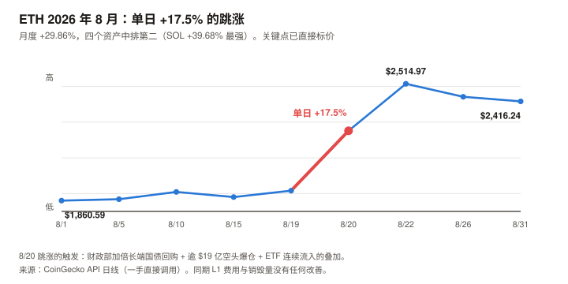
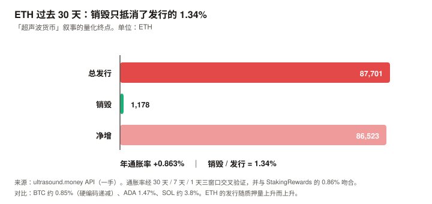
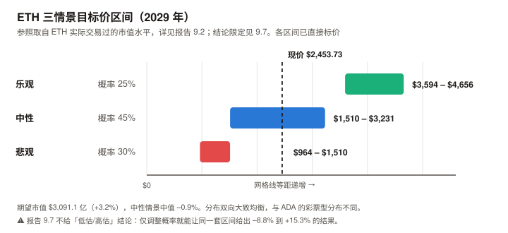

# ETH / Ethereum 完整调研与分析报告

> **编写日期**：2026 年 9 月 4 日
> **数据截止**：2026 年 9 月 4 日（8 月完整月度数据已闭合）
> **研究方法**：沿用 BTC / SOL / ADA 月报的分析框架。**章节结构相对 SOL 版改动约三成**——ETH 有真实且可精确计量的发行与销毁数据，因此新增「发行与销毁」独立章节；并把 **L2 与价值捕获**单列一章，因为它是理解 ETH 当前处境的第一变量。
> **本期为 ETH 首期报告**，无上期论点可校验；本期登记的论点将在 10 月版核对。
>
> **本期核心发现**：
> ① ETH 现价 **$2,453.73**，市值 **$2,993.9 亿（全球第 2）**。**ATH $4,946.05 出现在 2025 年 8 月 24 日——正好一年前**，如今距其 **–50.39%**；年初至今 **–17.4%**；
> ② **8 月月度 +29.86%**（8 月 20 日单日 +17.5%），在四个资产中**排第二，低于 SOL 的 +39.68%**，高于 BTC +23.62%、ADA +14.65%（统一按 8/1→8/31 口径）。从 6 月 26 日年内低点 $1,566.01 算起已反弹 **+56.7%**；
> ③ **「超声波货币」（ultrasound money）叙事已经失效，且可以被精确计量**：过去 30 天全网销毁 **1,178.26 ETH**，同期净增发 **86,522.84 ETH**——**销毁只抵消了发行的 1.34%**。ETH 当前年通胀 **+0.863%**；
> ④ **质押收益的 96% 来自增发，不是来自网络赚到的钱**：质押 APY 2.59%，其中约 **2.49pp 来自新发行**（对非质押者是稀释），仅约 **0.10pp** 来自真实费用收入；
> ⑤ **L2 几乎不向 L1 付费**：过去 30 天 L2 支付的 blob 数据费用合计仅 **1.81 ETH（约 $4,436）**，占 L1 销毁量的 **0.153%**。同期 Base 一条链自己收了 **$319 万**手续费；
> ⑥ **但机构通道是四个资产里最强的**：8 月为 ETH 现货 ETF 自产品站稳以来最强月份，8/17 起连续 9–10 个交易日净流入 **$14.2 亿**，BlackRock 的 ETHA 占 72%；ETF 总净资产 **$152.3 亿**，占 ETH 市值 **5.09%**。企业储备合计约 **748 万 ETH（供应量 6.13%，含二手追踪值）**；**若只用 SEC 已核实的 BitMine 持仓重算则为 5.42%**。
>
> **本期最重要的判断**：ETH 是本系列覆盖的四个资产里，**唯一曾经拥有真实、可计量的持币人现金流，而这条现金流已在本期萎缩到可以忽略**的资产。
> 用最慷慨的 50 倍市盈率计算，L1 费用只能解释当前市值的 **2.1%–3.6%**。**其余 96% 以上，市场买的是别的东西**——详见第 9 章。
>
> **免责声明**：本报告不构成任何投资建议。所有分析仅供研究参考，投资决策请咨询专业顾问。

---

## 核心结论摘要（一页速览）

| 维度 | 核心判断 |
|------|----------|
| **ETH 是什么** | 一条**可编程结算层**。它既不是纯货币资产（BTC），也不是单纯的高性能执行层（SOL）——**它把执行外包给了 L2，自己保留结算与数据可用性**。这个选择是理解本报告全部内容的起点 |
| **当前价格位置** | $2,453.73，市值 $2,993.9 亿（全球第 2）。**ATH $4,946.05 恰在一年前（2025-08-24）**，现距其 –50.39%，YTD –17.4% |
| **8 月表现** | **+29.86%，四个资产中排第二**（SOL +39.68% 最强，BTC +23.62%、ADA +14.65%）。8/20 单日 +17.5%，触发因素是财政部加倍长端国债回购 + 逾 $19 亿空头爆仓 + ETF 连续流入的叠加 |
| **本期最重要的发现** | **「超声波货币」叙事已被自己的链上数据证伪。** 30 天销毁 1,178 ETH vs 净增发 86,523 ETH——销毁只抵消发行的 **1.34%**，年通胀 **+0.863%**。ETH 现在的通胀率与 BTC 大致相当，**但 BTC 的是硬编码递减，ETH 的取决于质押量** |
| **第二重要的发现** | **质押 APY 2.59% 里约 96% 是增发。** 它是非质押者向质押者的**财富转移**，不是网络创造的外部现金流。真实费用只贡献约 0.10pp。**这与 SOL 期的教训同源，但 ETH 这里可以精确算出来** |
| **L2 的结构问题** | L2 生态 TVL $83.6 亿、Base 月费 $319 万，**而 blob 路径 30 天在 L1 产生的销毁只有 $4,436**（仅为 EIP-4844 以来月均 158.6 ETH 的 1.14%）。Standard Chartered 的 Geoff Kendrick 曾估算「Base 一家就从 ETH 市值里拿走了 $500 亿」——**本报告不为该估算背书**：$4,436 只能说明 L1 收到的少，**不能区分「价值被转移走」与「这些活动本来就不会在 L1 发生」**（详见 5.2） |
| **估值锚的处境** | ETH 曾是四个资产里唯一能用现金流法的。**本期它也失效了**——不是因为方法错，是因为分子太小：50 倍市盈率只能解释市值的 2.1%–3.6% |
| **核心多头逻辑** | 机构通道四个资产里最强（ETF 净资产占市值 5.09%、8 月创最强月）；质押型 ETF（BlackRock ETHB）提供了 BTC 没有的收益属性；企业储备达供应量 5.42%–6.13% 且靠质押产生真实营收；稳定币与 RWA 的主导结算层；Glamsterdam 目标把 gas limit 从 60M 推向 200M |
| **核心空头逻辑** | 销毁归零、通胀转正，稀缺性叙事失效；**L1 费用真年同比 –73.8%**（2026-08 $1,038 万 vs 2025-08 $3,959 万），16 个月序列显示为持续下台阶；blob 路径几乎不产生销毁；质押收益绝大部分靠稀释；企业储备高度集中（BitMine 一家 4%+ 供应量） |
| **与另外三个资产的关系** | BTC 是货币资产（锚：稀缺性）；SOL 是生产性资产（锚：网络收入）；ADA 是期权型（无锚）；**ETH 是混合型——曾经的生产性锚已经失效，正在向「货币 + 抵押品」叙事迁移，而这次迁移尚未完成** |
| **风险等级** | 低于 SOL 与 ADA，高于 BTC。流动性与机构接受度是四个资产里仅次于 BTC 的，但**叙事正处在切换中途**，这是它独有的不确定性 |

---

## 1. Ethereum 的起源与设计取舍

### 1.1 一个「不只是钱」的构想

2013 年，19 岁的 **Vitalik Buterin** 提出一个论点：比特币的脚本语言太受限，无法表达任意逻辑；应该有一条链，让开发者能在上面部署**图灵完备**的程序。2015 年 7 月主网上线。

与 BTC 的根本分歧不在技术，在**目的**：

| | Bitcoin | Ethereum |
|---|---|---|
| 目标 | 点对点电子现金 | **可编程的世界状态机** |
| 代币角色 | 就是资产本身 | **是资产，也是使用网络的燃料** |
| 变更哲学 | 极端保守，宁可不改 | **持续升级**，路线图跨十余年 |
| 供应规则 | 硬编码 2,100 万，不可改 | **没有硬上限**，发行规则随共识升级变化 |

> **最后一行是理解 ETH 估值的关键。** ETH **没有供应上限**——它的稀缺性不来自代码承诺，而来自**发行与销毁的动态平衡**。
> 这个平衡在 2021–2023 年一度产生净通缩（「超声波货币」叙事的由来），而**本报告第 4 章将用一手链上数据说明它现在处于什么状态**。

### 1.2 三次改变资产性质的升级

| 升级 | 时间 | 改变了什么 |
|------|------|-----------|
| **EIP-1559** | 2021-08-05 | 引入 **base fee 销毁**。从此每笔交易都会**永久销毁**一部分 ETH——这是「ETH 可能通缩」叙事的起点 |
| **The Merge（合并）** | 2022-09-15 | 从工作量证明（PoW，挖矿）转为权益证明（PoS，质押）。**发行量骤降约 90%**，且 ETH 从此成为**有收益的资产** |
| **EIP-4844（Dencun）** | 2024-03 | 引入 **blob** —— 给 L2 的廉价数据通道。L2 成本降低约两个数量级，**但 L1 从 L2 身上赚到的钱也同步塌陷**（见第 5 章） |

**再加上一次容量升级**：**Fusaka 于 2025 年 12 月 3 日激活**，把 L1 区块 gas limit 的默认值标准化为 **60M**（此前社区已从 30M 提升）；同时引入 EIP-7825，规定单笔交易 gas 上限 1,678 万，防止单笔交易占满整个区块。

> **一个必须点明的因果链**：gas limit 从 30M 翻倍到 60M，意味着**区块空间供给翻倍**。
> 在需求没有同步翻倍的情况下，**费用价格必然下跌**——本报告数据截止时 base fee 仅 **0.3115 gwei**（历史上 ETH 常在 20–100 gwei 区间）。
> **这是 ETH 主动做出的取舍：用更低的费用换取更强的可用性，代价是销毁量与稀缺性叙事。** 第 4 章会给出这个代价的确切数字。

### 1.3 ETH 代币的四重角色

| 角色 | 说明 | 本期状态 |
|------|------|---------|
| **燃料（gas）** | 支付 L1 交易与合约执行 | ⚠️ 需求萎缩，**L1 费用真年同比 –73.8%** |
| **质押品** | 质押换取出块权与收益，APY **2.59%** | ✅ 质押率 35.08%，4,280 万 ETH |
| **DeFi 抵押品** | 借贷、稳定币、再质押的底层资产 | ✅ L1 TVL $499.0 亿，四链中最高 |
| **储备资产** | ETF 与企业资产负债表持有 | ✅ **本期最强的一环**，见第 6 章 |

> **注意四者的分化**：**作为燃料的需求在萎缩，作为抵押品与储备资产的需求在增强。**
> ETH 正在从「使用型代币」转向「金融资产」，**而这两种身份对应的估值方法完全不同**。这是第 9 章的核心难题。

---

## 2. ETH 的发展阶段划分

### 阶段一：世界计算机的承诺（2015–2017）

- 2015 年 7 月主网（Frontier）上线
- 2016 年 **The DAO 事件**：约 360 万 ETH 被利用漏洞取走，社区选择硬分叉回滚，导致链分裂为 ETH 与 ETC。**这次事件确立了「社会共识可以覆盖代码」的先例**，至今仍是 ETH 与 BTC 哲学差异的分水岭
- 2017 年 ICO 狂潮，ETH 成为发币的默认平台

### 阶段二：DeFi 之夏与 gas 危机（2018–2021）

- 2020 年 DeFi 爆发，Uniswap、Aave、Compound 把 ETH 变成金融基础设施
- **代价是费用失控**：高峰期单笔转账成本可达数十美元，**L1 被自己的成功挤爆**
- 这个痛点直接催生了 L2 路线——**把执行搬走，L1 只做结算**
- **2021-08-05 EIP-1559 上线**，销毁机制启动

### 阶段三：合并与「超声波货币」（2021–2023）

- **2022-09-15 The Merge**，PoS 切换成功，发行量降约 90%
- 在高 gas 需求下，**销毁一度超过发行，ETH 出现净通缩**——「ultrasound money」叙事达到顶峰
- 这一时期 ETH 确实是**唯一有真实现金流、且现金流为正向通缩的主流加密资产**

### 阶段四：L2 落地与费用外流（2024–2025）

- **2024-03 EIP-4844（Dencun）** 上线 blob，L2 成本降约两个数量级
- L2 生态起飞：Base、Arbitrum 等承接了绝大多数交易活动
- **但 L1 的费用收入与销毁量同步塌陷**——这是本报告第 5 章的主题
- **2025-08-24 ETH 创下历史最高价 $4,946.05**

### 阶段五：叙事切换与机构接管（2025.12– 至今）

| 时点 | 事件 |
|------|------|
| 2025-08-24 | **ETH 触及 ATH $4,946.05** |
| 2025-12-03 | **Fusaka 升级激活**，L1 gas limit 默认标准化为 60M |
| 2026-01-15 | 年内最高价 **$3,351.82**（市值 $4,045 亿） |
| 2026-03-12 | **BlackRock 推出 ETHB——质押型 ETH ETF，按月分配收益** |
| 2026-04-20 | BitMine 按 SEC 文件披露持有 **4,976,485 ETH**，占供应量 4.12% |
| 2026-06-26 | **年内最低价 $1,566.01**（市值 $1,890 亿） |
| 2026-07 | ETH ETF 单月净流入 $3.65 亿，**首次超过同期 BTC ETF** |
| **2026-08-20** | **单日 +17.5%**：财政部加倍长端国债回购 + 逾 $19 亿空头爆仓 + ETF 连续流入 |
| 2026-08 | ETF 自 8/17 起连续 9–10 个交易日净流入 **$14.2 亿**，为产品站稳以来最强月份 |

> **阶段五的定性**：**ETH 的价格支撑正在从「网络使用」切换到「金融配置」。**
> 一边是 L1 费用真年同比 –73.8%、销毁近乎归零；另一边是 ETF 与企业储备创纪录。
> **这两股力量指向完全不同的估值方法，而市场目前同时定价了它们。**

---

## 3. ETH 当前现状分析

### 3.1 价格与市场

| 指标 | 数值 | 口径 |
|------|------|------|
| **现价** | **$2,453.73** | CoinGecko API，2026-09-04 15:27 UTC |
| 市值 | **$2,993.9 亿**（全球第 **2**） | 同上 |
| 24 小时成交额 | **$194.89 亿** | 同上 |
| 流通量 | **1.22018 亿 ETH**（无供应上限） | 同上 |
| **历史最高价** | **$4,946.05（2025-08-24）** | 同上 |
| **距 ATH** | **–50.39%** | 同上 |
| 近 30 日 | **+30.89%** | 同上 |
| 近 60 日 | +40.23% | 同上 |
| 近 200 日 | +23.99% | 同上 |
| 近 1 年 | **–43.50%** | 同上 |

**2026 年内轨迹**（CoinGecko 日线，一手）：

| 时点 | 价格 | 市值 |
|------|------|------|
| 1/1 | $2,970.03 | $3,585 亿 |
| **1/15（年内最高）** | **$3,351.82** | **$4,045 亿** |
| 3/1 | $1,966.72 | $2,374 亿 |
| 5/1 | $2,256.95 | $2,724 亿 |
| **6/26（年内最低）** | **$1,566.01** | **$1,890 亿** |
| 7/1 | $1,569.83 | $1,895 亿 |
| 8/1 | $1,860.59 | $2,245 亿 |
| **8/31** | **$2,416.24** | $2,916 亿 |

| 指标 | 数值 |
|------|------|
| **年初至今（YTD）** | **–17.4%** |
| **从 6/26 年内低点反弹** | **+56.7%** |
| 距 1/15 年内高点 | –26.8% |

**2026 年 8 月月度表现**：

| 项目 | 数值 |
|------|------|
| 月初（8/1）→ 月末（8/31） | $1,860.59 → $2,416.24，**+29.86%** |
| 月内最低 / 最高 | $1,843.44（8/2）/ **$2,514.97（8/22）** |
| 月内振幅 | **36.4%** |
| **最猛的一段** | **8/19 $1,916.40 → 8/20 $2,251.73，单日 +17.5%**；至 8/22 累计 **+31.2%** |

**8 月 20 日单日 +17.5% 的归因**（多因素叠加，非单一原因）：

| 因素 | 说明 |
|------|------|
| **宏观触发** | 美国财政部宣布**至少加倍**其长端流动性支持国债回购规模（至每次 $40 亿以上），长端收益率大幅下行，美元指数跌约 0.8% |
| **空头挤压** | 24 小时内加密市场空头爆仓逾 **$19 亿**，ETH 占其中主要份额 |
| **ETF 流入** | 截至 8/21 的五个交易日净流入 **$6.972 亿**，为 2026 年最强周 |
| **流动性结构** | 大量 ETH 锁定在 L2、流动性质押与再质押协议中，交易所现货深度处于低位，**放大了上行滑点**（此项为媒体分析，**本报告未独立验证交易所余额数据**） |

> **与本系列其他资产的横向印证**（**全部统一为 8/1→8/31 的月度口径，CoinGecko 一手**）：

| 资产 | 2026 年 8 月月度涨幅 |
|------|---:|
| **SOL** | **+39.68%** |
| **ETH** | **+29.86%** |
| BTC | +23.62% |
| ADA | +14.65% |

> ⚠️ **本段在发布前审查中被更正过，且更正推翻了初稿的结论。**
> 初稿称「ETH 涨幅最大」，**这是错的**——它把 ETH 的月度涨幅（+29.86%）与 SOL 的「近 30 天」涨幅（+37.4%）混用比较。
> **统一口径后 SOL +39.68% 最强，ETH 排第二。**
>
> **修正后能说的是**：四个资产同源上涨，**涨幅大致按 beta 排序**（SOL > ETH > BTC > ADA）。
> **不能说的是**「市场明显更愿意买 ETH」——ETH 排在第二，这个排序说明的是风险敞口大小，**不是相对偏好**。

### 3.2 L1 活动与费用：一组正在萎缩的数字

**手续费**（DefiLlama API，一手；口径区分见下）：

| 周期 | **L1 协议层费用** |
|------|---|
| 24 小时 | $418,671 |
| 7 天 | $2,329,524 |
| **30 天** | **$10,515,111** |
| **过去 12 个月** | **$214,704,808** |

| 口径 | 30 天费用 | 归属 |
|------|---:|------|
| **L1 协议层** | **$10,515,111** | 其中 base fee 部分**销毁**（回馈全体持有者），优先费与 MEV 归验证者 |
| **生态合计**（含应用层协议） | **$295,190,785** | 归各应用协议，**不流向 ETH 持有者** |

生态合计的主要构成：Lido（流动性质押）$4,182 万、Sky Lending $2,713 万、Aave V3 $2,526 万、Ethena USDe $1,995 万、Binance staked ETH $1,657 万——**L1 链本身的 $1,051 万只占生态合计的 3.56%**。

> **口径纪律**（沿用 ADA 期的教训）：**用 L1 费衡量 ETH 代币的价值捕获，用生态合计衡量生态活跃度。**
> 混用两者是口径偷换。注意 ETH 的生态合计里**排名前列的多是质押与借贷协议**，它们的收入建立在 ETH 作为抵押品的角色上——**这本身是 ETH 与 ADA 的实质差异**。

**最重要的一个趋势**：

> ⚠️ **本节的口径在发布前审查中被更正过，更正后的结论比初稿严重得多。**
> 初稿用「最近 30 天年化 vs 过去 12 个月总额」算出 –40.4%，并称之为「同比」。
> **这不是同比**——它比较的是当前月度运行率与包含该月在内的 12 个月月均值，且未控制价格与季节性。
> 下表改用 **DefiLlama 的月度费用序列做真正的年同比**。

**ETH L1 月度费用序列**（DefiLlama API 日度数据按月聚合，一手）：

| 月份 | L1 费用 | 月份 | L1 费用 |
|------|---|------|---|
| 2025-06 | $38,842,491 | 2026-01 | $13,960,819 |
| 2025-07 | **$49,497,182** | 2026-02 | $15,187,083 |
| **2025-08** | **$39,587,105** | 2026-03 | $10,580,034 |
| 2025-09 | $35,661,007 | 2026-04 | $24,425,831 |
| 2025-10 | $41,181,773 | 2026-05 | $16,579,471 |
| 2025-11 | $23,438,885 | 2026-06 | $10,777,326 |
| 2025-12 | $11,470,440 | 2026-07 | $8,314,396 |
| — | — | **2026-08** | **$10,382,162** |

| 比较 | 结果 |
|------|---|
| **真年同比（2026-08 vs 2025-08）** | **$10,382,162 vs $39,587,105 = –73.8%** |
| 2026-08 相对 2025-07 峰值 | –79.0% |

> **修正后的结论更强，不是更弱**：L1 费用真同比萎缩 **–73.8%**，远超初稿错算的 –40.4%。
> **而且 16 个月的连续序列证明这是趋势而非噪声**——2025-10 之后逐月下台阶，2025-12 起再未回到 $2,500 万以上。
> 这是第 5 章要解释的结构性现象：**L2 承接了交易，Fusaka 又把 L1 区块空间供给翻倍，需求外流与供给增加同时发生。**

**用于估值的年化口径**（第 9 章使用）：

| 口径 | 年化 L1 费用 | 市值 / 费用 |
|------|---|---:|
| 过去 12 个月实际 | **$214,704,808** | **1,394 倍** |
| 最近 30 天年化 | **$127,933,850** | **2,340 倍** |

**当前 base fee 水平**：**0.3115 gwei**（ultrasound.money 一手快照）。作为参照，ETH 在 2021 年 DeFi 高峰期常处于 20–100 gwei 区间。

### 3.3 质押：规模巨大，但收益来自哪里？

| 指标 | 数值 | 来源 |
|------|------|------|
| 质押总量 | **4,280 万 ETH** | StakingRewards（一手抓取） |
| **质押率** | **35.08%** | 同上 |
| **质押 APY** | **2.59%** | 同上 |
| **通胀率** | **0.86%** | 同上 |
| 活跃验证者 | **795,000**（StakingRewards 口径） | 同上。⚠️ **Beacon Chain 链上记录 8 月下旬约 903,000，两源存在分歧，本报告未能一手核实** |

> **三源交叉验证通过**：StakingRewards 报告的通胀率 **0.86%**，与本报告用 ultrasound.money 的供应量序列**独立算出的 0.863%** 一致（算法见 4.2）。**这个数字是可靠的。**

**验证者集合的规模**：无论按 StakingRewards 的 795,000 还是 Beacon Chain 的约 903,000，**这都是所有权益证明网络中最大的验证者集合**——这一点在两个口径下都成立。

> ⚠️ **但初稿据此推出「ETH 去中心化程度显著领先」，这个推理不成立，已删除。**
> 初稿拿 ETH 的**验证者数量**去比 SOL 的 **Nakamoto 系数**——**前者是分子，后者是集中度比率，两者不可比**。
> 这违反了本报告 3.2 节自己立下的口径纪律。
>
> **更关键的是方向可能相反**：ETH 的验证者是以 32 ETH 为单位的记账凭证，**单一运营方可以控制其中数十万个**。
> 本报告 3.2 节自己列出「Lido（流动性质押）$4,182 万」为生态费用第一名——**它的规模本身就说明质押高度集中于少数运营方。**
> **本报告未获取 ETH 的 Nakamoto 系数或质押运营方集中度数据**，因此**不对 ETH 与 SOL 的去中心化程度做任何排序**。

**但收益的来源必须拆开看**——这是第 4.3 节的内容，也是本期第二重要的发现。

### 3.4 生态数据：TVL 与 L2 分布

**TVL 对照**（DefiLlama API，一手）：

| 链 | TVL |
|------|---|
| **Ethereum（L1）** | **$499.0 亿** |
| Base | $56.1 亿 |
| Arbitrum | $14.3 亿 |
| Polygon | $8.1 亿 |
| OP Mainnet | $4.4 亿 |
| Scroll / Linea / Blast | 各 $0.1–0.3 亿 |
| **主要 L2 合计** | **$83.6 亿（为 L1 的 16.8%）** |

**横向对照**（同一 API 快照）：Solana $58.9 亿、BSC $56.2 亿、Tron $54.2 亿。
**ETH L1 的 $499.0 亿，是第二名的约 8.5 倍**——这是 ETH 最稳固的护城河，也是它作为抵押品层地位的直接证据。

### 3.5 宏观环境

ETH 与另外三个资产共享同一套宏观驱动。

| 因素 | 状态（9 月初） | 影响 |
|------|--------------|------|
| 联邦基金利率 | 3.50–3.75% | — |
| **9 月加息概率** | **65.9%**（CME FedWatch，8/31） | **重大利空** |
| PCE 通胀 | **3.7%**（12 个月）/ **4.1%**（6 个月） | 支持加息 |
| 美联储主席立场 | Kevin Warsh 在 Jackson Hole 表态鹰派 | 偏空 |
| 10 年期美债 | 4.79% | **直接与 ETH 的 2.59% 质押收益竞争** |
| 美元指数 | >99.7 | 压制风险资产 |
| **8 月流动性事件** | 财政部加倍长端国债回购 | **8 月普涨的共同触发因素** |

> **一个对 ETH 特别不利的对照**：10 年期美债 4.79% vs ETH 质押 2.59%。
> **无风险利率接近 ETH 质押收益的两倍，而 ETH 还要承担全部价格波动。**
> 这意味着**当前买 ETH 的人不是为了那 2.59% 的收益**——他们买的是价格上涨的可能性。第 9 章会回到这一点。

---

## 4. 发行与销毁：「超声波货币」叙事的终结（本期核心章之一）

> 本章替代 BTC 版的「减半周期」。ETH 没有减半，也没有供应上限——它的稀缺性完全取决于**发行与销毁的动态平衡**。
> **本章的全部数据来自 ultrasound.money 的公开 API（一手直接调用），并与 StakingRewards 交叉验证。**

### 4.1 机制：钱从哪来，到哪去

| 方向 | 机制 | 受益方 |
|------|------|--------|
| **发行（+）** | 每个 epoch 向验证者发放质押奖励，发行量随质押总量增加而增加 | 质押者 |
| **销毁（–）** | EIP-1559 的 **base fee 全额销毁**；EIP-4844 的 **blob base fee 也销毁** | **全体持有者**（供应减少） |
| 优先费 / MEV | 用户为插队支付的额外费用，**不销毁** | 验证者 |

> **必须分清「销毁」与「优先费」**——这是 SOL 期学到的教训在 ETH 上的对应：
> **只有销毁是回馈全体持有者的**（它减少供应，抬高每一枚的相对价值）；
> **优先费和 MEV 归验证者**，对不质押的持有者没有任何回报。

### 4.2 一手数据：ETH 现在是通胀的

**供应量净变化**（ultrasound.money `supply-over-time`，一手直接调用）：

| 窗口 | 起点 | 终点 | 净变化 | 年化 | 年通胀率 |
|------|---|---|---|---|---|
| **30 天** | 121,926,338.57（8/05） | **122,012,861.41**（9/04） | **+86,522.84 ETH** | 1,052,695 ETH | **+0.863%** |
| 7 天 | 121,992,512.14（8/28） | 同上 | +20,349.28 ETH | 1,061,070 ETH | +0.870% |
| 1 天 | 122,009,965.95（9/03） | 122,012,849.30 | +2,883.35 ETH | 1,052,423 ETH | +0.863% |

**三个独立时间窗口给出的年通胀率高度一致（0.863%–0.870%），且与 StakingRewards 的 0.86% 吻合。**

**销毁量**（ultrasound.money `fees/all`，一手）：

| 周期 | 销毁量 |
|------|---|
| 24 小时 | **44.41 ETH** |
| 7 天 | 208.60 ETH |
| **30 天** | **1,178.26 ETH ≈ $289 万** |
| 自 EIP-1559 上线累计 | 4,638,197.96 ETH |

**把两者放在一起，就是本期最重要的一张表**：

| 30 天 | ETH |
|------|---:|
| 总发行 | **87,701** |
| 销毁 | **1,178** |
| **净增** | **+86,523** |
| **销毁抵消了发行的** | **1.34%** |

> **「超声波货币」叙事到此为止。** 它成立于 2021–2023 年的高 gas 环境，当时销毁一度超过发行。
> **现在销毁只抵消发行的 1.34%，ETH 是一个年通胀 0.863% 的资产。**

**长周期视角**（同一数据源）：

| 起点 | 供应量 | 至今变化 |
|------|---|---|
| 2021-08-06（EIP-1559 上线） | 117,205,464.83 | **+4.10%** |
| 2022-09-15（The Merge） | 120,521,140.92 | **+1.24%**（年均约 +0.31%） |

> **公允地说**：合并四年来 ETH 总供应只增加 1.24%，**这个纪律性仍然远好于绝大多数 PoS 资产**（SOL 约 3.8%、ADA 1.47%）。
> **但它与 BTC 的约 0.85% 已经在同一量级**——而 BTC 的发行是硬编码递减的，ETH 的取决于质押量，**质押越多，发行越多**。
> **「ETH 比 BTC 更稀缺」这个论断，在当前数据下不成立。**

### 4.3 质押收益的真实来源：绝大部分是增发

> ⚠️ **本节的论证方法在发布前审查中被指出有缺陷，已改写。**
> 初稿声称用「两条独立路径互相验证」得出「96% 来自增发」。**这两条路径并不独立，且都低估了 MEV**——
> 详见下方的方法缺陷说明。**结论方向不变，但精度主张已撤回。**

**主推导（发行侧）**：

| 步骤 | 计算 | 结果 |
|------|------|------|
| 年化总发行 | 87,701 ETH × 365/30 | **1,067,030 ETH** |
| 质押总量 | StakingRewards | 4,280 万 ETH |
| **仅由发行贡献的收益率** | 1,067,030 ÷ 42,800,000 | **约 2.49%** |
| StakingRewards 报告的实际 APY | — | **2.59%** |
| 差额（隐含的执行层收益） | 2.59% – 2.49% | **约 0.10pp** |

**这个推导的三处缺陷，必须和结论一起读**：

1. **两个数字口径不同。** 分子（发行量）来自 30 天供应量变化，分母口径（APY）是 StakingRewards 的短窗口年化综合收益（含共识层 + 优先费 + MEV）。**用一个口径的值去减另一个口径的值，差额的含义不严格。**
2. **MEV 被系统性低估。** 大量 MEV 通过 MEV-Boost 的 **builder → proposer 直接转账**支付，**不体现在链上 gas fee 里**。本报告初稿曾用「L1 费用减销毁」做第二条路径反推出 0.088pp，**但那条路径按定义就抓不到 builder 支付，因此它不是对主推导的独立验证，只是同一盲区的重复。**
3. **验证者数量存在来源分歧。** StakingRewards 报 **795,000**，而 Beacon Chain 链上记录在 8 月下旬已达 **约 903,000**。本报告未能一手核实（beaconcha.in API 需付费密钥），**该分歧不影响本节结论的方向，但说明质押侧的数据一致性弱于发行侧。**

**因此，本报告能够负责任给出的结论是**：

> **质押 APY 2.59% 中，绝大部分（约 2.49pp）来自新发行；来自网络真实费用收入的部分很小。**
> **本报告不再声称「精确 96%」**——精确比例取决于 MEV 如何计量，而本报告**未能独立测量 MEV**。
> （公开的第三方收益分拆数据同样显示共识层占绝大多数，**但那是外部来源，不是本报告算出来的。**）
>
> **方向性结论不受影响**：新发行不是外部现金流，**它是从不质押的持有者向质押者的财富转移**。
> 对整个 ETH 持有者群体而言，这部分收益**净额为零**——它只改变分配，不创造价值。
>
> **这与 SOL 8 月版报告的核心教训同源**（网络毛收入 ≠ 持币人现金流）。
> **但 ETH 这里比 SOL 更容易说清楚，因为发行量与销毁量链上可查——只有 MEV 那一块是黑箱。**

**这个发现的实际含义**：

- 对**质押者**：2.59% 的名义收益里，大部分是稀释别人得来的，**但只要你质押，你就在得到的一侧**
- 对**不质押的持有者**（包括大部分 ETF 持有人）：**你每年被稀释约 0.86%，且没有任何补偿**
- **这解释了为什么 BlackRock 要推出质押型 ETF（ETHB）**——不质押的 ETF 结构对持有人是净损失的

---

## 5. L2 与价值捕获：ETH 最根本的结构问题（本期核心章之二）

> 本章是 ETH 独有的，另外三个资产都没有对应章节。它回答一个问题：
> **ETH 把执行外包给了 L2，那么 L2 赚的钱，有多少回到了 ETH？**

### 5.1 一手数据：L2 付给 L1 的钱少到可以忽略

> ⚠️ **本节的口径在发布前审查中被更正过，且更正削弱了初稿的论断强度。**
> 初稿称「L2 每月只付给 L1 四千多美元」，用的是 blob base fee 的销毁量。
> **这个数字只是 L2 向 L1 支付的一个分项，不是全部**——L2 还通过 blob 交易的执行费与优先费、
> calldata、状态提交、证明验证等路径向 L1 付费。**本报告未能获得完整的 L2→L1 成本分解**
> （L2BEAT 与 Dune 提供该口径，但其 API 均需付费密钥，本期无法一手取得）。
> **因此下面的数字只能证明「blob 这条路径几乎不产生销毁」，不能证明「L2 总共只付了这么多」。**

**L2 通过 blob 路径向 L1 支付并被销毁的部分**（ultrasound.money `blobFeeBurns`，一手）：

| 周期 | blob 销毁量 | 折美元 |
|------|---|---|
| 24 小时 | 0.0857 ETH | **$210** |
| 7 天 | 0.3243 ETH | $796 |
| **30 天** | **1.8079 ETH** | **$4,436** |
| 自 EIP-4844 上线累计 | 4,719.20 ETH | $1,158 万 |

**对照同期各 L2 自己收到的费用**（DefiLlama API，一手）：

| 链 | 30 天费用 | 说明 |
|------|---|---|
| **Ethereum L1** | **$10,515,111** | 基准 |
| Base | **$3,191,504** | L2（OP Stack rollup） |
| Arbitrum | $375,469 | L2 |
| Linea | $43,427 | L2 |
| Scroll / Blast | 各 $1,081–1,593 | L2 |

> ⚠️ **初稿把 Polygon（30 天费用 $2,146,935）计入了 L2 对比，这是错的**——**Polygon PoS 按其官方文档定义是 sidechain，不是 rollup**，它有自己的验证者集合与安全模型，不依赖以太坊结算。**已从本节移除。**

**修正后能够成立的结论，比初稿窄**：

| | 金额 |
|---|---|
| Base 一条链 30 天自己收到的手续费 | **$3,191,504** |
| **全部 blob 路径 30 天在 L1 产生的销毁** | **$4,436** |
| **blob 销毁占 L1 总销毁的比例** | **0.153%** |

> **能说的是**：**blob 这条路径当前几乎不为 ETH 产生任何销毁。**
>
> **不能说的是**：「L2 总共只付给 L1 四千多美元」。**L2 还有 calldata、状态提交、证明验证等付费路径，本报告未能测量**（L2BEAT 与 Dune 提供该分解，但其 API 均需付费密钥）。
> 初稿据此推出的「L2 收 570 万、只回流四千」是**口径偷换**，已删除。

**还有一个初稿完全漏掉的对照，它改变了这件事的性质**：

| 口径 | blob 销毁 |
|------|---|
| EIP-4844 上线（2024-03）至今累计 | **4,719.20 ETH**（约 29.8 个月） |
| **折合历史月均** | **约 158.6 ETH** |
| **最近 30 天** | **1.8079 ETH** |
| **当前为历史月均的** | **1.14%（即塌陷约 88 倍）** |

> **这说明 blob 收入不是「一直就这么低」，而是「近期塌下来的」。**
> **初稿把一个近期发生的价格现象，讲成了 L2 的长期行为特征。**
>
> **而塌陷的原因，本报告未能确定。** 至少有两种互斥的解释：
> ① **需求侧**——L2 活动本身减少或迁移；
> ② **供给侧**——blob 目标数量上调后供给增加，blob base fee 触及地板价。
> **5.3 节对 L1 gas 恰恰做了供给侧分析（Fusaka 把 gas limit 翻倍），却没有对 blob 做同样的分析。这是本报告的一处推理不一致，在此明确标出。**
> **两种解释的政策含义完全相反**：前者是结构性的，后者是可逆的价格现象。

### 5.2 这是不是设计意图？必须公平地讲两面

**必须承认的是：这在很大程度上是有意为之，不是失败。**

EIP-4844 的**明确目标**就是把 L2 成本降低数个数量级。它成功了。如果 blob 很贵，L2 就无法提供低费用体验，用户会流向别的链。**ETH 用 L1 收入换取了生态规模，这是一个战略选择。**

**支持这个选择的证据**：
- L1 TVL $499.0 亿，是第二名（Solana $58.9 亿）的 **8.5 倍**
- 稳定币与代币化资产的主要结算层地位稳固
- 质押安全预算规模是全行业最大（795,000–903,000 个验证者，两源有分歧）

**反对这个选择的证据**：
- L1 费用真年同比 **–73.8%**
- 销毁只抵消发行的 **1.34%**，稀缺性叙事失效
- **Standard Chartered 的分析师 Geoff Kendrick 曾估算，Base 一家就从 ETH 的市值中拿走了约 $500 亿**，并据此在 2025 年 3 月将年底目标从 $10,000 下调至 $4,000，理由是 L2 造成的「结构性衰退」

> **本报告的立场**：这两面都是真的，**它们不矛盾**。
> ETH 确实换来了生态规模，**也确实牺牲了代币的直接价值捕获**。
> **争论的实质不是「哪个说法对」，而是「生态规模最终会不会转化为代币价值」——这个问题目前没有答案，第 9 章会把它作为情景分歧的核心。**

### 5.3 供给侧的另一半：Fusaka 把 L1 空间翻倍了

讨论 L1 费用下跌时，**只讲 L2 分流是不完整的**。

**2025 年 12 月 3 日 Fusaka 激活**，把 L1 区块 gas limit 的默认值标准化为 **60M**（社区此前已从 30M 提升）。这意味着**区块空间供给翻倍**。

> **简单的供需逻辑**：需求外流（L2 承接）+ 供给翻倍（gas limit 60M）**同时发生**，
> 费用价格下跌是必然结果。当前 base fee **0.3115 gwei**。
>
> **所以 L1 费用萎缩至少有两个原因，而本报告无法定量拆分二者的贡献。** 这是一处明确的分析局限。

**下一步会让这个问题更尖锐**：下一次重大升级 **Glamsterdam** 通过 EIP-7928（BALs）把 gas limit 目标推向 **200M**。

> **如果 60M 已经让 base fee 跌到 0.31 gwei，200M 会发生什么？**
> 多头的回答是「更多交易量会补上」；空头的回答是「单价还会跌」。
> **这是本报告登记的核心待验论点之一（E8-2）。**

---

## 6. 机构通道与持有者结构

> **这是 ETH 四个资产中最强的一环**，与第 4、5 章的负面结论形成直接张力。本章不回避这个张力。

### 6.1 ETF：8 月是产品站稳以来最强的一个月

| 指标 | 数值 |
|------|------|
| **8 月连续净流入** | 自 **8/17** 起 9–10 个交易日累计 **$14.2 亿** |
| 其中 BlackRock ETHA | 约 **$10.2 亿（占 72%）** |
| 截至 8/21 的五个交易日 | **$6.972 亿**（2026 年最强周） |
| 8/27 单日 | **$2.258 亿**（2025-10-28 以来最强单日） |
| **ETF 总净资产** | **$152.3 亿** |
| **占 ETH 市值** | **5.09%** |
| 7 月净流入 | $3.65 亿，**首次超过同期 BTC ETF** |

**一个结构性新事物**：**BlackRock 于 2026 年 3 月 12 日推出 ETHB——质押型 ETH ETF，按月分配质押收益**。

> **为什么这件事重要**：结合 4.3 节的结论——不质押的持有者每年被稀释约 0.86%。
> **非质押型 ETF 让持有人承担全部稀释却拿不到任何补偿；质押型 ETF 修复了这个缺陷。**
> **这也是 ETH 相对 BTC 的核心差异化**：ETH 可以质押生息，BTC 不能。资金在两者之间轮动时，收益率差是真实的驱动因素。

**与另外三个资产的对照**：

| 资产 | 现货 ETF 状态 |
|------|---|
| BTC | 成熟，规模最大 |
| **ETH** | **成熟，且有质押型产品；ETF 净资产占市值 5.09%** |
| SOL | 已上市，8 月创最佳月度流入 |
| ADA | **零份在申请**，Grayscale 于 8/7 撤回 |

### 6.2 企业储备：规模巨大，集中度也巨大

| 公司 | ETH 持仓 | 核实状态 |
|------|---|---|
| **BitMine Immersion（NYSE: BMNR）** | **4,976,485 ETH**（占供应量 **4.12%**，按当时 1.207 亿计） | ✅ **SEC 文件一手核实（2026-04-20）**，总加密+现金 $129 亿 |
| BitMine（当前追踪值） | 5,847,611 ETH | ⚠️ 二手追踪器，**未一手核实** |
| SharpLink（SBET） | 888,938 ETH | ⚠️ 二手 |
| Dynamix（ETHM） | 496,712 ETH | ⚠️ 二手 |
| Coinbase（COIN） | 150,193 ETH | ⚠️ 二手 |
| Galaxy Digital（GLXY） | 97,764 ETH | ⚠️ 二手 |
| **合计（含二手追踪值）** | **约 748 万 ETH ≈ 供应量 6.13%** | ⚠️ |
| **合计（仅用 SEC 已核实的 BitMine 值）** | **约 661 万 ETH ≈ 供应量 5.42%** | ✅/⚠️ 混合 |

**BitMine 的公开目标是「Alchemy of 5%」**——持有 ETH 供应量的 5%。按 SEC 4 月文件，它在 9 个月内已完成该目标的 82%。SharpLink 同样宣称最终目标为 5%。

**一个与 BTC / SOL 储备公司不同的关键点**：

> **SharpLink 2026 年初季度营收 $1,210 万，几乎全部来自质押**，而一年前不足 $100 万。
> **ETH 储备公司持有的是生息资产，BTC 储备公司不是。** 这让它们的商业模式在结构上更能自洽。

**但集中度风险必须点明**：

> BitMine 一家持有约 **4%–4.8%** 的 ETH 供应量。**这是本系列覆盖的四个资产中，单一实体持仓占比最高的。**
> SOL 8 月版记录过储备公司模式的风险如何兑现——头部公司 Upexi 股价较高点跌去 96%，
> 而其归因是**发行溢价崩塌**（净资产 +63% 而股价 –96%），不是杠杆。
>
> **本报告不预测 BitMine 会发生什么**——它的 mNAV、负债结构与融资方式本期**未获取**，这是一处证据缺口。
> 但**「单一实体持有 4%+ 流通供应」这个事实本身就是风险敞口**，无论该公司经营状况如何。

### 6.3 持有者结构小结

| 类别 | 规模 | 占流通量 |
|------|---|---|
| **质押锁定** | 4,280 万 ETH | **35.08%** |
| ETF 持有 | $152.3 亿 | **5.09%** |
| 企业储备 | 661 万–748 万 ETH | **5.42%–6.13%**（视是否采用二手追踪值） |

> 三者存在部分重叠（ETF 与企业储备中有一部分已质押），**不可简单相加**。
> 但方向是清楚的：**ETH 的流通盘正在被结构性锁定**，这是 8 月上涨中「现货深度不足放大滑点」说法的基础。
> **本报告未能独立验证交易所余额数据**，因此对该机制只作记录，不作为论据使用。

---

## 7. ETH 的核心价值逻辑

### 7.1 多头逻辑

| # | 论点 | 强度 | 说明 |
|---|------|:---:|------|
| 1 | **机构通道四个资产中最强** | ★★★★☆ | ETF 净资产占市值 5.09%，8 月为产品站稳以来最强月（$14.2 亿连续流入）；7 月净流入首次超过 BTC ETF。**从五星降为四星**：该论据的全部数字来自媒体转述，**本报告未取得 ETF 流量的一手来源**（见 11.5 偏向声明） |
| 2 | **质押型 ETF 修复了结构缺陷** | ★★★☆☆ | BlackRock ETHB（2026-03-12）按月付收益。**这是 BTC 结构上无法提供的属性**。**从四星降为三星**：产品细节为二手转述，**其费率与规模占比本报告均未获取**——而费率差足以吃掉大部分质押净利差（见 10.2） |
| 3 | **抵押品层地位稳固** | ★★★★☆ | L1 TVL $499.0 亿，是第二名 Solana（$58.9 亿）的 8.5 倍。稳定币与 RWA 的主要结算层 |
| 4 | **安全预算规模行业第一** | ★★★☆☆ | 验证者集合是所有 PoS 网络中最大的（795,000–903,000，两源有分歧）。**从四星降为三星，且标题已从「去中心化程度」改为「安全预算规模」**——验证者数量不等于去中心化程度，**本报告未获取质押运营方集中度数据，不对此排序**（见 3.3） |
| 5 | **企业储备持有生息资产** | ★★☆☆☆ | 约 661 万–748 万 ETH（**5.42%–6.13%**），SharpLink 季度营收 $1,210 万几乎全部来自质押。**从三星降为两星**：该论据的全部数字（BitMine 当前值除 SEC 4 月文件外、SharpLink、营收）**均为二手转述，未一手核实** |
| 6 | **供应纪律仍远好于多数 PoS** | ★★★☆☆ | 合并四年净增 1.24%（年均 0.31%），对比 SOL 约 3.8%、ADA 1.47% |
| 7 | **Glamsterdam 目标把 gas limit 推向 200M** | ★★☆☆☆ | 若吞吐量提升能带来交易量的等比例增长，费用总额可能回升。**降为两星的原因是：这正是 60M 时期已经证伪过一次的逻辑** |

> ⚠️ **本表的星级在发布前审查中被系统下调过。**
> 本报告 11.5 声明了「空头论据来自一手 API、多头论据几乎全是二手转述」，
> **但初稿并未把这个声明执行到星级上**——多头侧仍有两条五星/四星建立在纯二手数据上。
> **推理审查指出：报告在别处（7.2 第 5 条、7.1 第 7 条）确实会因证据缺口调星，说明星级本就编码证据质量，只是没用在多头侧。**
> **已按同一标准下调多头 #1、#2、#4、#5 共四条。** 空头侧未调，因其数据全部来自一手 API。

### 7.2 空头逻辑

| # | 论点 | 强度 | 说明 |
|---|------|:---:|------|
| 1 | **稀缺性叙事已被自己的链上数据证伪** | ★★★★★ | 30 天销毁 1,178 ETH vs 净增发 86,523 ETH，**销毁只抵消 1.34%**；年通胀 +0.863%，已与 BTC 同量级，**而 BTC 是硬编码递减** |
| 2 | **质押收益 96% 来自增发** | ★★★★★ | APY 2.59% 中约 2.49pp 是稀释非质押者，仅约 0.10pp 来自真实费用。**对不质押的持有者（含多数 ETF 持有人）是净损失** |
| 3 | **L1 费用真年同比萎缩 –73.8%** | ★★★★★ | 2026-08 $10,382,162 vs 2025-08 $39,587,105，**16 个月连续序列显示为逐月下台阶，非月度噪声**。**从四星升为五星**：初稿用错误口径算出 –40.4%，真实萎缩远大于此。原因至少有两个（L2 分流 + Fusaka 供给翻倍），**本报告无法定量拆分** |
| 4 | **blob 路径几乎不为 ETH 产生销毁** | ★★★☆☆ | 30 天 blob 销毁 **$4,436**，占 L1 总销毁 0.153%，且仅为 EIP-4844 以来月均的 1.14%。**从四星降为三星**：本报告只测到 blob 一条路径，**未能获得 L2 的完整 L1 成本**（calldata、状态提交、证明验证），且无法区分「价值被转移」与「活动本不会在 L1 发生」 |
| 5 | **企业储备集中度是四个资产中最高的** | ★★★☆☆ | BitMine 一家持有 4%–4.8% 供应量。**其 mNAV 与负债结构本期未获取**，是一处证据缺口 |
| 6 | **质押收益率不敌无风险利率** | ★★★☆☆ | 2.59% vs 10 年期美债 4.79%，且承担全部价格风险 |
| 7 | **宏观逆风** | ★★★☆☆ | 9 月加息概率 65.9%，PCE 3.7% |

### 7.3 多空对照的一句话总结

> **多头买的是「ETH 正在成为全球金融的抵押品与结算层」；空头卖的是「这条链每年多印 0.86% 的币，而它从生态里收回来的钱正在减少四成」。**

**两者可以同时成立**，因为它们讲的是**两种不同的资产**：

| | 使用型代币 | 金融资产 |
|---|---|---|
| 价值来源 | 网络费用、销毁 | 抵押品需求、储备配置、收益率 |
| 本期证据 | **全面恶化**（费用真同比 –73.8%、销毁归零、通胀转正） | **全面改善**（ETF 最强月、企业储备 5.42%–6.13%、TVL 领先 8.5 倍） |

> **ETH 当前的处境，是这两种身份正在交接班的中途。**
> **第 9 章要回答的就是：市场现在给这两种身份分别定了多少价？**

---

## 8. ETH 与其他资产的比较

> 对照数据取自同一批 API 快照（CoinGecko / DefiLlama，2026-09-04）。

### 8.1 四个资产的横向矩阵

| 指标 | **ETH** | BTC | SOL | ADA |
|------|---|---|---|---|
| 市值 | **$2,993.9 亿（第 2）** | 第 1 | $592.5 亿（第 7） | $80.4 亿（第 19） |
| 距 ATH | **–50.39%** | 参见 BTC 8 月报 | –65.50% | –93.09% |
| **8 月月度（统一 8/1→8/31 口径）** | **+29.86%** | **+23.62%** | **+39.68%** | **+14.65%** |
| 近 1 年 | **–43.50%** | 参见 BTC 8 月报 | –51.2% | –73.70% |
| **DeFi TVL** | **$499.0 亿** | — | $58.9 亿 | $0.647 亿 |
| **L1 30 天费用** | **$10,515,111** | — | 参见 SOL 8 月报 | $38,275 |
| **年通胀率** | **+0.863%** | 约 0.85% | 约 3.8% | 1.47% |
| 质押率 / APY | **35.08% / 2.59%** | 不适用 | 64% | 56.4%–57.0% / 2.07% |
| 现货 ETF | **成熟，含质押型** | 成熟 | 已上市 | **零份申请** |

### 8.2 ETH vs BTC：收益率是核心分歧

| | BTC | **ETH** |
|---|---|---|
| 资产性质 | 货币资产 | **混合型（结算层 + 抵押品 + 生息资产）** |
| 估值锚 | 稀缺性 | **本期两条锚都在弱化**（见第 9 章） |
| 供应规则 | **硬编码 2,100 万，不可改** | **无上限，发行随质押量变动** |
| 年通胀 | 约 0.85% | **+0.863%** |
| 收益属性 | **无** | **质押 2.59%（但 96% 来自增发）** |

> **本期最需要修正的一个流行观念**：「ETH 比 BTC 更稀缺，因为它会销毁」。
> **在当前数据下这个说法不成立**——两者通胀率已在同一量级，而 BTC 的是代码锁定、单向递减，ETH 的是**质押越多、发行越多**。
> **ETH 相对 BTC 的真实优势不是稀缺性，是收益属性和可编程性。** 用稀缺性论证 ETH 的人，用错了论据。

### 8.3 ETH vs SOL：同为生产性资产，问题不同

| | **ETH** | SOL |
|---|---|---|
| 架构 | **模块化**（执行外包给 L2） | 单体（全部在主链） |
| 本期核心问题 | **价值捕获外流到 L2** | **网络收入同比 –87%** |
| TVL | **$499.0 亿** | $58.9 亿 |
| 通胀 | +0.863% | 约 3.8% |

> **两者的问题形似而实不同**：SOL 是**自己的收入崩了**；ETH 是**把收入让给了 L2**。
> **SOL 的问题若解决，收入会回到 SOL 自己身上；ETH 的问题即便 L2 繁荣，钱也不一定回到 L1。**
> 这是模块化架构的固有代价，也是第 9 章情景分歧的核心。

### 8.4 ETH vs ADA：证明「有生态」和「没生态」的差距

| 指标 | **ETH** | ADA | 倍数 |
|------|---|---|---:|
| 市值 | $2,993.9 亿 | $80.4 亿 | **37×** |
| DeFi TVL | $499.0 亿 | $0.647 亿 | **771×** |
| L1 30 天费用 | $10,515,111 | $38,275 | **275×** |
| 生态合计 30 天费用 | $295,190,785 | $353,264 | **836×** |

> **ADA 8 月版的核心矛盾是「制度在运转、研发在拿钱、安全没出事——却没有人用」。**
> **ETH 是那个「有人用」的反面样本**：市值只有 ADA 的 37 倍，生态费用却是它的 836 倍。
> **这个对照说明市值与使用量的脱节可以有多严重**，也反过来印证 ETH 的估值中确实包含大量非使用型溢价。

---

## 9. 关键变量与三种情景推演

### 9.1 未来 12–18 个月的催化剂日历

| 时点 | 事件 | 方向 | 重要性 |
|------|------|:---:|:---:|
| **2026-09 FOMC** | 加息概率 65.9%（CME FedWatch，8/31） | 利空 | ★★★★☆ |
| **持续** | **ETF 净流入能否延续 8 月节奏**（$14.2 亿/9–10 个交易日） | 关键 | ★★★★★ |
| **持续** | **质押型 ETF（ETHB 等）的规模占比**——它决定 ETF 持有人是否还在被稀释 | 关键 | ★★★★☆ |
| **未定** | **Glamsterdam 升级**：gas limit 目标 60M → **200M**（EIP-7928 BALs） | **双向** | ★★★★★ |
| **持续** | **L1 费用能否止跌**（2026-08 为 $1,038 万，真年同比 –73.8%） | 关键 | ★★★★★ |
| **持续** | **blob 费用是否脱离四位数量级**（当前 30 天 $4,436） | 关键 | ★★★★☆ |
| **持续** | BitMine 能否达成「5% 供应量」目标，及其 mNAV 状况 | 风险 | ★★★☆☆ |
| **持续** | 质押率变动（当前 35.08%）——**质押越多，发行越多，通胀越高** | 观察 | ★★★☆☆ |

> **Glamsterdam 被标为「双向」而非利好，理由在 5.3**：gas limit 从 30M 提到 60M 之后，
> base fee 跌到 **0.3115 gwei**、L1 费用真年同比 –73.8%。**再提到 200M，同样的机制会再作用一次。**
> 多头认为吞吐提升会带来交易量的等比例增长从而补上，**但这正是 60M 时期已经被证伪过一次的逻辑。**

### 9.2 先回答一个前置问题：ETH 该用什么方法估值？

**ETH 是本系列四个资产里，唯一曾经真正适用现金流法的。** 因此本章的做法与前三个资产都不同：
**先用现金流法算出它能解释多少，再看剩下的部分是什么。**

**第 1 步 · 现金流能解释多少市值？**

| 口径 | 年化 | 给 **50 倍**（对成长型资产已属慷慨） | 占当前市值 $2,993.9 亿 |
|------|---|---|---:|
| L1 费用（过去 12 个月实际） | $2.147 亿 | $107.4 亿 | **3.6%** |
| L1 费用（最近 30 天年化） | $1.279 亿 | $64.0 亿 | **2.1%** |
| **仅销毁部分**（真正回馈全体持有者） | $3,518 万 | $17.6 亿 | **0.6%** |

> **结论**：**ETH 当前市值的 96.4%–99.4%，无法用 L1 现金流解释。**
>
> **这不代表 ETH 被高估。** 它代表**市场买的主要不是现金流**——而是抵押品地位、结算层网络效应、
> 储备资产属性，以及「未来价值捕获会改善」的预期。**这些都是真实的东西，但它们无法用市盈率衡量。**

**第 2 步 · 因此本报告采用「实际交易市值区间 + 情景概率」框架。**

> ⚠️ **必须说清这个框架不是什么。** 排除现金流法**不等于**这个框架成立。
> 它唯一的辩护是：**当一个资产的定价主要由非现金流因素驱动时，用它自己历史上实际成交过的市值区间做参照，
> 至少比凭空构造一个倍数更可检验。** 它的弱点见 9.6，结论限定见 9.7。

**三个情景的参照市值，全部来自 ETH 实际交易过的水平**（CoinGecko 2022-01 至今日线，一手）：

| 年份 | 最低市值 | 最高市值 |
|------|---|---|
| 2022 | **$1,207 亿**（6/19，$995.97） | $4,569 亿 |
| 2023 | $1,442 亿 | $2,855 亿 |
| 2024 | $2,655 亿 | $4,889 亿 |
| 2025 | $1,775 亿 | **$5,829 亿（8/23，市值历史最高）** |
| 2026 | $1,890 亿（6/26） | $4,045 亿（1/15） |

**第 3 步 · 折算为每 ETH 价格。**
按当前流通 1.22018 亿枚、年通胀 **0.863%**（本报告 4.2 节实测值）推算，**2029 年流通量约 1.2520 亿枚**。

### 9.3 乐观情景：金融资产叙事完全接管（概率 **25%**）

**需要发生**：ETF 流入延续甚至加速，质押型产品成为主流；企业储备继续按 5% 目标推进；ETH 在稳定币与 RWA 结算中的地位转化为持续的机构配置需求。**注意：这个情景不要求 L1 费用改善**——它假设市场彻底按「抵押品/储备资产」而非「现金流资产」给 ETH 定价。

| 项目 | 数值 |
|------|------|
| 参照市值 | **$4,500 亿 – $5,829 亿**（上限为 2025-08-23 的市值历史最高） |
| **目标价区间** | **$3,594 – $4,656** |
| 相对现价 | +46% – +90% |

### 9.4 中性情景：维持现状，随宏观 beta 波动（概率 **45%**）

**特征**：ETF 流入与 L1 费用萎缩两股力量继续对冲；价格主要由加密市场整体流动性决定；叙事切换未完成也未失败。

| 项目 | 数值 |
|------|------|
| 参照市值 | **$1,890 亿 – $4,045 亿**（2026 年实际交易区间） |
| **目标价区间** | **$1,510 – $3,231** |
| 相对现价 | –38% – +32% |

> **注意中性区间的中值 $2,967.5 亿，比当前市值 $2,993.9 亿低 0.9%。**
> 本报告**没有**把中性区间人为设在现价上方——它就是 2026 年实际走过的范围。

### 9.5 悲观情景：叙事切换失败（概率 **30%**）

**触发条件**：ETF 流入转为净流出；L1 费用在 Glamsterdam 后继续下探；「ETH 是通胀资产且质押靠稀释」被市场广泛认知；企业储备出现被迫减持。

| 项目 | 数值 |
|------|------|
| 参照市值 | **$1,207 亿 – $1,890 亿**（下限为 2022-06-19 的五年最低市值，上限为 2026 年低点） |
| **目标价区间** | **$964 – $1,510** |
| 相对现价 | –61% – –38% |

### 情景对比

> ⏱️ **时间范围：以下所有目标价均为 2029 年的水平**（流通量按 2029 年推算，见 9.2 第 3 步）。
> **这不是 12 个月目标价。** 乐观情景的 +46%～+90% 若在三年内实现，年化约为 13%–24%；
> 请与 10 年期美债 4.79% 对照阅读。**9.1 的催化剂日历是 12–18 个月尺度，记分卡的检验条件是 2026-12 尺度，三者不同，不可混用。**

| 情景 | 概率 | 参照市值 | 目标价（**2029 年**） | 相对现价 |
|------|:---:|---|---|---|
| 乐观 | **25%** | $4,500 – $5,829 亿 | **$3,594 – $4,656** | +46% ~ +90% |
| 中性 | **45%** | $1,890 – $4,045 亿 | **$1,510 – $3,231** | –38% ~ +32% |
| 悲观 | **30%** | $1,207 – $1,890 亿 | **$964 – $1,510** | –61% ~ –38% |

**概率赋值的依据**（首期报告，主观判断，依据须公开）：

| 情景 | 概率 | 依据（**只用可观测的外部证据，不用本报告自己的星级评分**） |
|------|:---:|------|
| 乐观 **25%** | 中等偏高 | ETF 需求**已经在发生**，不是预测：8 月为产品站稳以来最强月（$14.2 亿连续流入）、7 月净流入首次超过 BTC ETF、总净资产已占市值 5.09%。企业储备有明确的公开目标（BitMine「5% 供应量」，已完成 82%） |
| 中性 **45%** | 最高 | ETH 拥有四个资产中最深的流动性与最广的机构接受度，**这类资产的重估通常是缓慢的**。且两股力量（ETF 流入 vs 费用萎缩）方向相反、量级相当，对冲结果就是区间震荡 |
| 悲观 **30%** | 中等 | **L1 费用真年同比 –73.8% 是已发生的事实，不是预测**；Glamsterdam 将 gas limit 推向 200M，会让供给侧压力再来一次。**但它低于 ADA 悲观情景的 42%**，因为 ETH 有 $499 亿 TVL 和成熟 ETF 通道作为需求底盘，边缘化的路径比 ADA 长得多 |

### 9.6 这套推导方法的六个弱点（必读）

1. **参照区间的选择主导结论。** 悲观下限取 2022-06 的 $1,207 亿——**那是 PoS 合并之前、ETF 之前、企业储备之前的市场结构**。用它作为 2029 年的地板，隐含假设「结构性改善可以被完全抹去」，这个假设未经论证。
2. **50 倍市盈率这个门槛是主观的。** 9.2 用它论证「现金流只能解释 2.1%–3.6%」。若改用 200 倍（早期高增长资产并非没有先例），可解释比例会升至 8.5%–14.3%——**结论方向不变，但「几乎全部是溢价」的措辞会失去部分力度**。
3. **概率是主观赋值。** 敏感性测试：概率取 15/45/40 → 期望市值 $2,729 亿（**–8.8%**）；取 25/45/30 → $3,091 亿（**+3.2%**）；取 35/45/20 → $3,453 亿（**+15.3%**）。**在同一套区间下，仅调整概率就能让结论在 ±9% 到 +15% 之间移动。**
4. **通胀率外推简化了。** 用当前 0.863% 外推三年，但**发行量随质押量变化**——若质押率从 35.08% 继续上升，通胀会更高，流通量会更大，同一市值对应的价格更低。本框架未刻画这个反馈。
5. **忽略路径依赖。** 框架假设 2029 年一次性到达某状态，不刻画中途路径。**对有杠杆或期限约束的持有者，路径比终点更重要。**
6. **情景集不完备。** 至少缺失一种现实可能：**「ETH 价格上涨，同时 L1 价值捕获继续恶化」**——即完全由金融配置驱动、与网络基本面脱钩的行情。**2026 年 8 月本身就是这种模式的样本**（月度 +29.86%，而同期 L1 费用与销毁毫无改善）。本框架无法生成这种情景，因为它把两者的分歧放进了不同情景。

### 9.7 本报告的结论限定

按 9.3–9.5 的概率与各区间中值计算：

| 指标 | 数值 |
|------|---|
| **期望市值** | 0.25 × $5,164.5 亿 + 0.45 × $2,967.5 亿 + 0.30 × $1,548.5 亿 = **$3,091.1 亿** |
| 相对当前市值 $2,993.9 亿 | **+3.2%** |
| **概率最高的中性情景中值** | **$2,967.5 亿 → –0.9%** |
| 悲观情景（30%）中值 | $1,548.5 亿 → **–48.3%** |
| 乐观情景（25%）中值 | $5,164.5 亿 → **+72.5%** |

> **本报告不给出「低估」或「高估」的方向性结论**——理由与 ADA 8 月版相同：**+3.2% 落在框架自身误差之内**。
> 9.6 弱点 3 已经证明，仅调整概率就能让同一套区间给出 –8.8% 到 +15.3% 的结论。**在这个分辨率下，+3.2% 与 0 没有区别。**
>
> ⚠️ **本报告刻意不做「反解市场隐含概率」的计算。**
> ADA 8 月版做过一次，并在推理审查中被判定为**循环论证**——反解方程里只有市值一个数来自市场，
> 其余参数全是报告自己的输入，**反解出的不是市场观点，是自己参数的回声**。该做法不再使用。

**能够负责任说出口的，是分布的形状与它的成因**：

> ETH 的分布比 ADA **对称得多**：乐观 +72.5%、悲观 –48.3%，概率 25% vs 30%，中位数几乎持平。
> **这不是彩票型分布，是一个双向风险大致均衡的资产。**
>
> **而这个均衡的成因值得单独指出**：它来自两股方向相反、量级相当的力量——
> **一边是本报告第 4、5 章记录的基本面恶化**（销毁归零、通胀转正、L1 费用真年同比 –73.8%、blob 路径几乎不产生销毁）；
> **另一边是第 6 章记录的机构需求增强**（ETF 最强月、质押型产品、企业储备 5.42%–6.13%）。
>
> **所以对 ETH 的判断，本质上是在回答一个问题**：
> **当「网络越来越有用但代币越来越收不到钱」时，代币的价格由哪一边决定？**
> **本报告没有答案。** 但它把这个问题的两侧都量化了，并登记为可检验的论点（见记分卡 E8-1 至 E8-6）。

---

## 10. 投资与风险启示

### 10.1 ETH 现在处于什么位置

用一句话概括：**ETH 正处在两种资产身份的交接班中途，而交接尚未完成。**

作为**使用型代币**，本期的每一项指标都在恶化：L1 费用真年同比 –73.8%、销毁只抵消发行的 1.34%、年通胀转正至 +0.863%、blob 路径 30 天只产生 $4,436 销毁。
作为**金融资产**，本期的每一项指标都在改善：ETF 创产品站稳以来最强月、质押型 ETF 落地、企业储备达 5.42%–6.13% 供应量、L1 TVL 是第二名的 8.5 倍。

> **8 月的行情本身就是这个错位的样本**：ETH 上涨 29.86%，**而同期它的费用、销毁、blob 收入没有任何改善。**
> 这次上涨由宏观流动性与资金流驱动。**但要注意 ETH 在四个资产中只排第二（SOL +39.68%）**——
> **这说明 8 月更像是一次按 beta 排序的普涨，而不是市场对 ETH 的特别偏好。**
> 金融资产叙事在当前占上风，**但 8 月这一个样本并不能单独证明这一点。**

### 10.2 策略建议

> 以下为研究性质的框架整理，**不构成投资建议**。

| 持有者类型 | 框架 |
|------|------|
| **未持有者** | 9.7 已说明本报告不给方向性判断。ETH 的风险回报比另外三个资产**对称**（+72.5% / –48.3%，概率 25% / 30%）。若配置，理由应当是「认同 ETH 会成为机构抵押品层」，**而不是「它会通缩」——第 4 章已证伪后者** |
| **已持有者且未质押** | **这是本报告最具操作性的一条**：不质押的持有者每年被稀释约 **0.863%**，且**没有任何补偿**。质押 APY 2.59% 中虽然绝大部分来自增发，**但只要你在质押的一侧，你就是被稀释的对立面**。**毛利差约 1.73pp**（2.59% – 0.863%）。⚠️ **但必须扣除成本**：流动性质押服务商通常抽成约一成、存在退出队列与罚没风险、LST 合约风险，且多数税辖区把质押奖励按收入课税而稀释不构成应税事件——**扣除抽成后净利差约 1.4pp**。**结论仍成立（质押是占优选择），但幅度比毛数字小** |
| **通过 ETF 持有** | 同上逻辑：**非质押型 ETF 让持有人承担全部稀释而无补偿**。BlackRock ETHB 这类质押型产品修复了该缺陷，**值得比较两者的费率差与收益差** |
| **仓位建议** | ETH 与 BTC 高度相关，同持不构成有效分散。它相对 BTC 的差异化**不是稀缺性**（两者通胀已同量级），**而是收益属性与可编程性** |
| **杠杆** | 悲观情景（30% 概率）对应 **2029 年**的 –38% 至 –61%——**注意这是三年期的终点，不是路径**。9.6 弱点 5 已指出本框架不刻画路径，**而对杠杆持有者路径比终点更重要**。8 月 20 日的单日 +17.5% 由逾 $19 亿空头爆仓推动——**这个市场的双向清算都很剧烈** |

### 10.3 关键监控指标

**每一项都可被客观观测，且能改变结论。** 这是下期报告核对的依据。

| # | 指标 | 当前值 | 改变结论的阈值 | 观测方式 |
|---|------|---|---|---|
| 1 | **L1 30 天费用** | **$10,515,111** | **连续两个月 >$2,000 万** → 费用萎缩趋势逆转；**连续两个月 <$700 万** → 恶化加速 | DefiLlama API |
| 2 | **30 天销毁量 / 净发行比** | **1,178 / 86,523 = 1.34%** | **>15%** → 稀缺性叙事重新有基础；**<1%** → 彻底失效 | ultrasound.money API |
| 3 | **年通胀率** | **+0.863%** | **转负** → 重回通缩，多头论点实质改善 | ultrasound.money（供应量序列自算） |
| 4 | **blob 30 天费用** | **$4,436** | **>$50 万** → L2 开始实质付费（仍仅为 L1 的 5%，但方向变了） | ultrasound.money API |
| 5 | **ETF 月度净流入** | 8 月 **$14.2 亿**（9–10 个交易日） | **连续两个月净流出** → 金融资产叙事受挫，悲观概率上调 | ETF 流量追踪 |
| 6 | **质押型 ETF 占 ETF 总资产比** | 本期**未获取** | — | **本期证据缺口，下期必须补** |
| 7 | **质押率** | **35.08%** | 上升 → 通胀同步上升（**注意这是负反馈，不是利好**） | StakingRewards / 链上 |
| 8 | **Glamsterdam 上线后的 base fee** | 当前 **0.3115 gwei** | 上线后若跌破 0.1 gwei → 供给侧压力论成立 | ultrasound.money API |
| 9 | **BitMine 持仓与 mNAV** | 4,976,485 ETH（SEC 4/20）；**mNAV 未获取** | 出现减持或 mNAV 持续 <1 → 集中度风险兑现 | SEC EDGAR |

### 10.4 风险提醒

1. **稀缺性论据已经失效，但它仍被广泛引用。** 「ETH 会通缩」「ETH 比 BTC 更稀缺」在当前数据下**都不成立**。若你的持仓理由包含这一条，**它需要被替换，而不是被淡化**。
2. **不质押 = 持续被稀释。** 年 0.863%，无补偿。
   ⚠️ **初稿在此写「这是 ETH 独有的、BTC 不存在的持有成本」，这是错的**——本报告 8.1、8.2 两张表自己写着 BTC 年通胀约 0.85%，**BTC 持有者同样被增发稀释，且没有任何对冲手段。**
   **修正后的准确表述是**：稀释本身两者都有且量级相当；**真正的差异是 ETH 提供了对冲工具（质押），BTC 没有。**
   **这实际上是一条多头论据，初稿把它误放进了风险提醒。**（两者的性质仍有区别：BTC 的增发付给矿工，对应真实的电力与安全支出；ETH 的付给质押者，是持有者之间的转移。但**从付款方视角看，成本是一样的**。）
3. **企业储备集中度风险**：BitMine 一家 4%–4.8% 供应量，是四个资产中最高的。**其 mNAV 与负债结构本期未获取**——SOL 期的 Upexi 教训（发行溢价崩塌导致股价 –96%）说明这类风险不体现在持仓量上，而体现在融资结构上。
4. **Glamsterdam 是双向的。** 市场普遍视其为利好，**但 60M 那次的结果是 base fee 跌到 0.31 gwei、L1 费用真年同比 –73.8%**。
5. **宏观风险**：9 月加息概率 65.9%，且 10 年期美债 4.79% 直接与 ETH 的 2.59% 质押收益竞争。
6. **本报告自身的风险**：这是 ETH 首期报告，**无过往论点可校验准确率**。BTC 系列已检验的 8 个论点只说对 1 个；**ADA 首期在发布前审查中被发现一处核心事实完全写反**（媒体一致报道的治理投票结果与链上最终记录相反）。请以相应的怀疑程度对待本报告的前瞻性判断。

### 10.5 长期认知

**第一，要分清「网络成功」和「代币捕获价值」。**
ETH 的 L2 战略在**产品意义上成功了**——生态规模、TVL、结算地位都是行业第一。**但它同时让 L1 每月只从 L2 收到四千多美元。**
**一条链可以越来越有用，同时它的代币越来越收不到钱。** 这不是矛盾，是模块化架构的固有代价。

**第二，「超声波货币」是一个已经过期的叙事，而它仍在流通。**
它在 2021–2023 年的高 gas 环境下是真的。**现在销毁只抵消发行的 1.34%。**
**一个叙事从「真」变成「假」时，市场往往还会引用它很久**——本报告能做的是把数字摆出来，让它可以被独立验算。

**第三，收益率叙事需要拆开看才有意义。**
「ETH 有 2.59% 收益，BTC 没有」是对的。**但其中绝大部分来自增发，是持有者之间的转移，不是网络创造的财富。**
**这不意味着质押没有意义**——恰恰相反，它意味着**不质押的一方在为质押的一方买单**。

> ⚠️ **但初稿在此写「代价是确定的」「必须质押」，措辞过强，已修正。**
> 这笔利差**恰恰来自那 65% 不质押的人**，因此它会自我消解：**质押率越高 → 发行越高 → APY 越低 → 利差越窄**。
> 本报告 10.3 第 7 项与 9.6 弱点 4 都指出了这个负反馈，**结论段却写成了永久规则。**
> **准确的表述是**：在当前质押率下，质押相对不质押的净利差约 1.4pp（已扣服务商抽成）；
> **它是当下的占优选择，但不是一个恒定的、确定的数字。**

**第四，四个资产做下来，最重要的方法论收获是同一条。**
BTC 的稀缺性、SOL 的网络收入、ADA 的治理、ETH 的销毁——**每一次，流行叙事与链上一手数据都存在可测量的差距。**
SOL 期是「网络毛收入 ≠ 持币人现金流」；ADA 期是「多家媒体一致 ≠ 事实」；**ETH 期是「一个曾经为真的叙事，不会在失效时发出通知」。**

---

## 11. 附录

### 11.1 Ethereum 发展阶段速查

| 阶段 | 时间 | 标志 | 对代币的影响 |
|------|------|------|---|
| 世界计算机的承诺 | 2015–2017 | 主网上线、The DAO 分叉、ICO 狂潮 | 确立「社会共识可覆盖代码」的先例 |
| DeFi 之夏与 gas 危机 | 2018–2021 | DeFi 爆发，L1 被自己的成功挤爆 | 催生 L2 路线 |
| 合并与「超声波货币」 | 2021–2023 | EIP-1559（2021-08-05）、The Merge（2022-09-15） | **发行降约 90%，一度净通缩** |
| L2 落地与费用外流 | 2024–2025 | EIP-4844（2024-03）、**ATH $4,946.05（2025-08-24）** | **L1 费用与销毁同步塌陷** |
| **叙事切换与机构接管** | 2025.12– 至今 | Fusaka（2025-12-03，gas limit 60M）、质押型 ETF（2026-03-12） | **稀缺性失效，金融资产属性增强** |

### 11.2 关键数据速查（截至 2026-09-04）

| 类别 | 指标 | 数值 |
|------|------|------|
| **市场** | 价格 | $2,453.73 |
| | 市值 / 排名 | $2,993.9 亿 / 第 2 |
| | ATH | **$4,946.05（2025-08-24）**，距其 –50.39% |
| | 8 月月度 | **+29.86%**（8/20 单日 +17.5%） |
| | YTD / 近 1 年 | –17.4% / –43.50% |
| | 2026 区间 | 低 $1,566.01（6/26）/ 高 $3,351.82（1/15） |
| **发行与销毁** | 30 天净增发 | **+86,523 ETH** |
| | 30 天销毁 | **1,178 ETH（≈$289 万）** |
| | **销毁 / 发行** | **1.34%** |
| | **年通胀率** | **+0.863%** |
| | 合并以来净增 | +1.24%（年均 +0.31%） |
| **费用** | **L1 30 天费用** | **$10,515,111** |
| | **L1 真年同比** | **2026-08 $10,382,162 vs 2025-08 $39,587,105 = –73.8%** |
| | L1 过去 12 个月 | $214,704,808 |
| | 生态合计 30 天 | $295,190,785 |
| | **blob 30 天** | **$4,436**（占 L1 销毁 0.153%） |
| | 当前 base fee | **0.3115 gwei** |
| **质押** | 质押量 / 质押率 | 4,280 万 ETH / **35.08%** |
| | **APY** | **2.59%**（其中约 2.49pp 来自增发） |
| | 活跃验证者 | **795,000** |
| **生态** | L1 TVL | **$499.0 亿**（第二名 Solana $58.9 亿的 8.5 倍） |
| | 主要 L2 TVL 合计 | $83.6 亿（L1 的 16.8%） |
| **机构** | ETF 总净资产 | **$152.3 亿（占市值 5.09%）** |
| | 8 月 ETF 净流入 | **$14.2 亿**（9–10 个交易日，BlackRock 占 72%） |
| | 企业储备合计 | 661 万–748 万 ETH（**5.42%–6.13%**） |
| | BitMine（SEC 一手） | **4,976,485 ETH**（4.12%，2026-04-20） |

### 11.3 四个资产的分析框架差异

| 维度 | BTC | SOL | ADA | **ETH** |
|------|-----|-----|-----|------|
| 资产性质 | 货币资产 | 生产性资产 | 期权型 | **混合型（结算层 + 抵押品 + 生息资产）** |
| 估值锚 | 稀缺性 | 网络收入 | 无可用锚 | **曾有现金流锚，本期失效（只能解释 2.1%–3.6%）** |
| 情景推导方法 | 已实现价格 × MVRV | 假设收入 × 倍数 | 参照资产市值 × 概率 | **自身实际交易过的市值区间 × 概率** |
| 核心特有章节 | 减半、算力、企业储备 | 通胀销毁、验证者经济、网络稳定性 | 国库与链上治理 | **发行与销毁、L2 与价值捕获** |
| 本期核心矛盾 | ETF 流入与宏观紧缩拉锯 | 收入崩塌 vs 用量新高 | 制度在运转却没人用 | **网络越来越有用，代币越来越收不到钱** |

### 11.4 数据来源与核实状态

**标注规则**：✅ = 本报告直接抓取一手来源（API 或原文页面）；⚠️ = 仅来自搜索摘要或二手转述；❌ = 尝试核实失败。

| 数据 | 来源 | 核实状态 |
|------|------|:---:|
| 价格、市值、排名、ATH、涨跌幅、2026 日线序列 | CoinGecko API（`coins/ethereum`、`market_chart/range`） | ✅ 直接调用 |
| **2022–2026 年度市值高低点**（情景推导的全部参照） | CoinGecko API `market_chart/range`（1,708 个日度数据点） | ✅ 直接调用 |
| **供应量序列、净发行、年通胀率 0.863%** | **ultrasound.money API** `v2/fees/supply-over-time`（30 天 / 7 天 / 1 天三窗口交叉验证） | ✅ 直接调用 |
| **销毁量（1,178.26 ETH / 30 天）、base fee 0.3115 gwei** | **ultrasound.money API** `fees/all` | ✅ 直接调用 |
| **blob 销毁（1.8079 ETH / 30 天 = $4,436）** | 同上 `blobFeeBurns` | ✅ 直接调用 |
| L1 费用、生态合计费用、各协议分项 | DefiLlama API（`summary/fees`、`overview/fees`） | ✅ 直接调用 |
| L1 与各 L2 的 TVL | DefiLlama API `v2/chains` | ✅ 直接调用 |
| 各 L2 的 30 天费用（Base / Arbitrum / Linea / Scroll / Blast） | DefiLlama API `summary/fees/<chain>` | ✅ 直接调用。**Polygon 已从 L2 对比中移除**——其官方文档定义为 sidechain，非 rollup |
| **L1 月度费用序列（2025-06 至 2026-09）与真年同比 –73.8%** | DefiLlama API 日度数据按月聚合 | ✅ 直接调用。**此项推翻了初稿错算的「同比 –40.4%」** |
| **四资产 8 月月度涨幅统一口径（8/1→8/31）** | CoinGecko API `market_chart/range` | ✅ 直接调用。**此项推翻了初稿「ETH 涨幅最大」的说法**——SOL +39.68% 才是最强 |
| L2 的完整 L1 成本分解（calldata / 状态提交 / 证明验证） | L2BEAT、Dune | ❌ **两者 API 均需付费密钥，本期无法取得。因此第 5 章只能论证 blob 一条路径** |
| ETH 的质押运营方集中度 / Nakamoto 系数 | — | ❌ **未获取。因此本报告不对 ETH 与 SOL / ADA 的去中心化程度做排序** |
| 验证者数量 903,000（Beacon Chain 口径） | beaconcha.in | ❌ **API 需付费密钥，未能一手核实。与 StakingRewards 的 795,000 存在分歧，两个数字均已标注** |
| 质押率 35.08%、APY 2.59%、通胀 0.86%、验证者 795,000 | StakingRewards | ✅ 打开原页。**其通胀率与本报告独立算出的 0.863% 吻合** |
| **BitMine 持仓 4,976,485 ETH（4.12% 供应量，$129 亿）** | **SEC EDGAR 原始文件（2026-04-20）** | ✅ 打开原文 |
| BitMine 当前追踪值 5,847,611 ETH；SharpLink / Dynamix / Coinbase / Galaxy 持仓 | 二手追踪器（bitcoinminingstock、datawallet 等） | ⚠️ 仅摘要，**未一手核实。企业储备合计 6.13% 系基于这些二手值** |
| ETF 8 月流量、总净资产 $152.3 亿、BlackRock 占比 | CryptoBriefing、crypto.news、KuCoin 等转述 | ⚠️ 仅搜索摘要，**未打开 ETF 发行方或 Farside 一手数据** |
| BlackRock ETHB（2026-03-12 上线，质押型，按月分配） | 同上 | ⚠️ 仅搜索摘要 |
| 8/20 单日 +17.5% 的归因（财政部回购、$19 亿爆仓） | 多家媒体一致 | ⚠️ 仅搜索摘要。**价格数据本身为一手** |
| SharpLink 季度营收 $1,210 万几乎全部来自质押 | Yahoo Finance / Decrypt 转述 | ⚠️ 仅搜索摘要 |
| **Standard Chartered** 的 L2 虹吸论、Base 拿走 $500 亿、目标价调整 | The Block / Yahoo Finance 转述 | ⚠️ 仅搜索摘要，**未打开该行研报原件** |
| Fusaka（2025-12-03 激活、gas limit 60M、EIP-7825）、Glamsterdam（目标 200M） | ethereum.org、Consensys 等的搜索摘要 | ⚠️ 仅搜索摘要 |
| 宏观：9 月加息概率 65.9%、PCE 3.7%/4.1%、Warsh 立场 | **CME** FedWatch 经 CNBC / Forbes 转述；**美联储**官员公开讲话 | ⚠️ 转述，未直接打开 CME 工具 |
| 10 年期美债 4.79%、美元指数 >99.7、财政部回购 | 沿用本系列 SOL / ADA 2026-08 报告 | ⚠️ 内部引用，本期未重新核实 |
| BTC / SOL / ADA 的对照数据 | 本系列各资产 2026-08 报告 + 本期 CoinGecko / DefiLlama 快照 | ✅/⚠️ 混合 |
| 交易所 ETH 余额处于「历史低位」 | 媒体分析 | ❌ **未独立验证，本报告仅作记录、不作为论据** |
| 质押型 ETF 占 ETF 总资产的比例 | — | ❌ **未获取，已列入监控指标待补** |
| BitMine 的 mNAV 与负债结构 | — | ❌ **未获取，是集中度风险评估的证据缺口** |

### 11.5 来源偏向声明

**本期的来源结构是本系列四期中最好的一次。**

**核心结论全部建立在一手 API 上**：发行、销毁、通胀率、blob 费用、L1/L2 费用、TVL、质押数据——**没有一项依赖媒体摘要**。
其中**最关键的一条（年通胀 0.863%）由两个独立来源交叉验证**：ultrasound.money 的供应量序列（本报告自算）与 StakingRewards 的公开值（0.86%）。

**但必须声明三处偏向与缺口**：

1. **机构侧数据几乎全部是二手。** ETF 流量、企业储备（BitMine 除外）、BlackRock 产品细节均来自媒体转述。**而第 6 章正是本报告多头论据最集中的一章**——**这意味着本报告的空头论据（一手 API）比多头论据（二手摘要）证据等级更高**。读者应据此调整对两侧的信任度。
2. **Standard Chartered 的观点来自转述，未打开研报原件。** 它是本报告唯一的传统金融机构深度观点，**且其结论（L2 虹吸导致结构性衰退）恰好支持本报告第 5 章的判断**——**这种"恰好印证"的引用需要额外警惕**，因为它容易让人放松对来源等级的要求。
3. **五处明确的证据缺口**（均已列入 10.3 监控指标或记分卡弱点）：质押型 ETF 的规模占比与费率、BitMine 的 mNAV 与负债结构、交易所余额、L2 的完整 L1 成本分解、ETH 的质押运营方集中度。

> ⚠️ **本节的声明在发布前审查中被指出「写了但没执行」，已修正。**
> 初稿准确地声明了「空头论据证据等级高于多头论据，读者应据此调整信任度」，
> **但把修正动作外包给了读者——7.1 的多头星级没有做任何折扣。**
> 而报告在别处（7.2 第 5 条、7.1 第 7 条）确实会因证据缺口调星，说明星级本就编码证据质量。
> **已按同一标准下调多头四条星级**（#1 五→四星、#2 四→三星、#4 四→三星、#5 三→两星）。

**传统金融机构视角的配平**：本期引用了 **CME**（FedWatch 利率预期）、**美联储**政策立场、**BlackRock**（ETHA / ETHB 的实际产品设计与资金流）、**Standard Chartered**（L2 虹吸论与目标价）、以及 **SEC** 备案文件。其中 Standard Chartered 的「Base 一家拿走 $500 亿市值」是本报告最有力的非加密原生空方论据，**且它与本报告一手算出的 blob 费用 $4,436 互相印证**。

---

### 11.6 发布前审查记录（本期必读）

本报告按流程走了四层审查（脚本核查 → 推理审查 → 领域审查 → 人工抽查）。**审查改变了本报告的多处核心表述**。

**领域审查抓到的三处（全部经一手数据复核后采纳）**：

| # | 问题 | 严重度 | 处理 |
|---|------|:---:|---|
| 1 | **「L2 每月只付给 L1 $4,436」是口径错误。** 1.81 ETH 只是 blob base fee 销毁，**不等于 L2 支付给 L1 的总额**——还有 calldata、状态提交、证明验证等路径。**且 Polygon PoS 是 sidechain 不是 L2**，不该计入 L2 对比 | 高 | ✅ 5.1 整节重写，论断收窄为「blob 这一条路径几乎不产生销毁」；Polygon 已移除；明确标注 L2BEAT / Dune 需付费密钥、本期无法取得完整分解 |
| 2 | **「L1 费用同比 –40.4%」根本不是同比。** 它比较的是最近 30 天年化与包含该 30 天在内的 12 个月总额 | 高 | ✅ 已用 DefiLlama 月度序列算**真年同比**：**2026-08 vs 2025-08 = –73.8%**，并附 16 个月连续序列证明是趋势而非噪声。**修正后结论比初稿更强** |
| 3 | **「质押收益 96% 经双路径验证」不成立。** 两条路径不独立，且都抓不到 MEV-Boost 的 builder→proposer 支付；验证者数量 795,000 与 Beacon Chain 的约 903,000 存在分歧 | 中 | ✅ 4.3 撤回精度主张，改为只给方向；三处方法缺陷已明写；验证者数量分歧已标注 |

**推理审查抓到的十三处，全部采纳**（以下为改变了结论或方向的六条）：

| 发现 | 处理 |
|------|------|
| **「8 月四个资产中最强」被自己的表格推翻**——同一句里就写着 SOL +37.4%，而 ETH 是 +29.86%。根因是混用了「月度」与「近 30 天」两种口径 | ✅ 已统一为 8/1→8/31 口径重算：**SOL +39.68% > ETH +29.86% > BTC +23.62% > ADA +14.65%**。「ETH 最强」及由此推出的「市场明显更愿意买 ETH」**全部删除**（四处） |
| **「不质押被稀释是 BTC 不存在的成本」符号反了**——报告自己两张表都写着 BTC 通胀约 0.85% | ✅ 已改。真实差异是「ETH 有对冲工具、BTC 没有」——**这实际是多头论据，初稿误放进风险提醒** |
| **「本报告一手数据支持 Base 拿走 $500 亿」过度声称**——$4,436 与「这些活动本来就不会在 L1 发生」同样相容，而 5.2 自己承认了后者 | ✅ 已改为「本报告不为该估算背书」 |
| **blob 塌陷是近期现象，初稿讲成了长期特征**——报告自己给了累计值 4,719.20 ETH，却从未除以月数 | ✅ 已补：历史月均 **158.6 ETH**，当前 1.81 ETH 为其 **1.14%（塌陷约 88 倍）**；并承认本报告对 L1 gas 做了供给侧分析、却没对 blob 做同样分析 |
| **用验证者数量比 SOL 的 Nakamoto 系数**——分子比比率，不可比；且 ETH 质押高度集中于 Lido 等少数运营方 | ✅ 「去中心化程度领先」的结论**已删除**，多头论据降星并改名为「安全预算规模」 |
| **声明了证据等级不对称，却没在星级上执行** | ✅ 已下调多头四条星级 |

**记分卡的六条检验条件全部重写**，并新增第 4 条门槛：**检验的统计量必须与论点的统计量相同**——本期 E8-5 用日线极值造区间、用月均价做判定，是前三条门槛都拦不住的新漏洞。

> **本期最该记住的一条**：
> **ADA 期的错误是被外部媒体误导，本期的错误是没看自己的表。**
> 「ETH 涨幅最大」这句话，在同一段落里就有反证，在 8.1 的对照表里也有反证。
> **一手数据抓得再全，不去交叉核对自己写下的内容，一样会出错。**

---

> **配套文件**：`eth_questions_summary_202608.md`（简明速查）、`thesis_scorecard.md`（论点滚动记分卡）。
> 本报告不构成投资建议。
