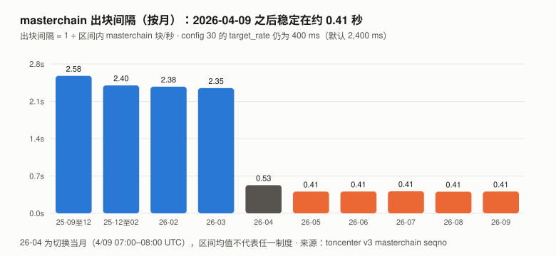
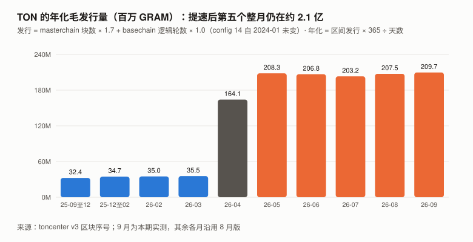
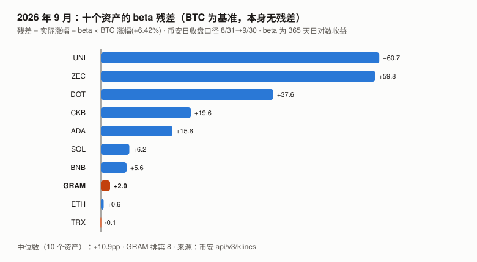

# GRAM / TON 完整调研与分析报告

> **版本**：2026 年 9 月（兼 Q3 回顾）
> **完成日期**：2026-10-06
> **本系列第十三个资产**的第二期
>
> **代号说明**：标的是 The Open Network（TON）的原生代币，2026 年 6 月由 Toncoin（TON）更名为 Gram（GRAM）。
> 本报告用 **GRAM** 指代币、**TON** 指区块链。
>
> **本版更新要点**：
>
> 1. **8 月版最大的未核实项本期一手解决：Telegram 原生钱包 8/31 小范围上线，而且它的代码住在网络配置里。**
>    本期自建了 TON 配置字典的 BoC 解析器，读出 8 月版读不到的 **`config -123`**：
>    **它在 2026-08-28 09:13 UTC 首次写入，2026-09-30 18:15 UTC 第 1 次升级（验证者投票）**。
>    官方仓库 `ton-blockchain/tg-wallet-contract` 的 README 写明：**每个 Telegram 钱包只是一个跳转到 `config[-123]` 的「蹦床」合约，
>    钱包逻辑「只能由验证者投票更新」、「对所有用户一次生效」、「没有『关闭更新』的选项」。**
>    Durov 8/31 在其 Telegram 频道宣布钱包「对一小部分用户开放」（一手）。
> 2. **验证者配置投票的管辖范围扩大到了钱包代码。** 钱包在设计上覆盖全部 Telegram 用户（当前为小范围开放，规模未测）；
>    一次投票可让所有钱包免迁移升级，也意味着一次投票改变所有钱包的逻辑。**与 8 月版的增发问题不同，这一后果是公开宣传的**（README、Durov 都把它当作卖点）。
> 3. **发行机制没有变化，第五个整月仍是约 2.1 亿 GRAM / 年**：9 月毛发行 17,231,135 GRAM（年化 4.00%），
>    `config 14` 与 `config 30` 9 月均未变。**9 月两路核对的残差 29,291 GRAM，与抽样估计的手续费销毁（95% 区间 17,675–36,805）相容**；
>    **但用同一方法回测 8 月，8 月残差 70,527 约为当月销毁估计（36,948）的 1.9 倍、在其 95% 区间之外——残差里还有与销毁同量级的其他成分，未解释。**
> 4. **价格：9 月 +8.15%（BTC +6.42%），残差 +2.0pp，与本系列 10 个山寨资产的残差中位数（+10.9pp）不可区分（相差约 0.5 个月度标准差）；**
>    **Q3 −6.25%（BTC +42.64%），残差 −46.8pp，同口径 10 个资产的中位数为 +3.8pp，GRAM 排最后。**
> 5. **8 月版 G8-5 的起点用错了 BTC 价格**（CoinGecko 8/31 00:00 点 = 8/30 收盘，与 XIN、CKB 9 月版同一个错），本期按登记口径更正。
>
> ---
>
> **本报告不给目标价。** 理由见第 10 章。
>
> **利益冲突声明**：作者未持有 GRAM，与 TON 基金会、Telegram 及任何 TON 生态项目无雇佣、顾问或投资关系。
> 本报告的链上数据全部由作者从 TON 公开节点 API（toncenter / tonapi）与 GitHub 一手仓库直接抓取。

---

## 核心结论摘要（一页速览）

| 维度 | 观测 | 判断 |
|------|------|------|
| **价格（9/30）** | $1.5000；**9 月 +8.15%**（BTC +6.42%）；**Q3 −6.25%**（BTC +42.64%） | 9 月残差 +2.0pp，与板块中位数不可区分；Q3 残差 −46.8pp（板块中位数 +3.8pp） |
| **Telegram 钱包** | `config -123` **8/28 首次写入、9/30 第 1 次升级**；Durov 8/31 宣布小范围开放 | **8 月版的搜索摘要本期得到两条一手证据**；采用规模未测 |
| **钱包代码的治理** | 钱包逻辑存在 `config[-123]`，**只能由验证者投票更新，对所有用户一次生效** | 验证者配置投票的管辖范围扩大到钱包代码；**这一后果是公开宣传的** |
| **发行** | 9 月毛发行 **17,231,135 GRAM**，年化 **2.096 亿 / 4.00%** | 与 8 月（2.075 亿 / 3.97%）基本相同 |
| **两路核对** | 模型 − 链上净增 = **29,291 GRAM（0.17%）** | 9 月与销毁估计相容；**8 月同法回测约为销毁的 1.9 倍，未解释** |
| **手续费（抽样估计）** | 9 月约 **54,480 GRAM**（95% 区间 35,350–73,609），**约一半被销毁** | 约为毛发行的 0.32% |
| **USD₮ on TON** | **1,429,976,003 枚（取整），与 9/11 读数相同**；持有人 3,451,380（+0.8%） | 9 月稳定币存量没动 |
| **质押** | Elector **13.61 亿**（流通量 48.27%）；384 个验证者；前 10 名 4.51% | 与 8 月相近 |
| **质押池 APY** | 12.78%–17.05% | 8 月 13.29%–17.72% |
| **本报告给目标价** | **否** | 见第 10 章 |

> **一句话**：**Telegram 钱包的逻辑放在 TON 的网络配置里，由验证者投票更新——对用户是免迁移的升级，对治理是一次投票改变全部钱包；
> 设计上覆盖全部 Telegram 用户，当前为小范围开放，规模未测。与 8 月版的增发不同，这一安排是公开宣传的。**

---

## 1. GRAM 是什么

协议层面与 8 月版相同，三个要点：

| | 内容 |
|---|---|
| 发行 | `config 14`：每个 masterchain 区块 1.7 GRAM、每个 basechain 逻辑轮 1.0 GRAM；**按块发放，发行速率 = 每块奖励 × 出块速率** |
| 出块 | `config 30`（Simplex 共识）的 `target_rate` 自 2026-04-09 由默认 2,400 ms 设为 400 ms |
| 配置治理 | 配置变更：每轮需质押加权 3/4 赞成；普通参数需赢 min_wins = 2 轮、关键参数 3 轮（`config 11`；源码 `crypto/smartcont/config-code.fc` 第 285、236 行）。关键参数表见 `config 10`（10/01 链上读数：−1001、−1000、0、1、9、10、12、14、15、16、17、32、34、36）|

### 1.1 本期补：`config -123` 读出来了（8 月版下期清单第一优先）

8 月版尝试读 `config -123` 失败：toncenter 拒绝负数索引，tonapi 只解码非负键。**本期自建了 BoC 反序列化器与 `HashmapE 32` 解析器**，
直接解析 toncenter `getConfigAll` 返回的整个配置字典：

| 时点（UTC） | masterchain 区块 | 负数参数 | `config -123` 的单元哈希 |
|---|---|---|---|
| 2026-08-01 00:00 | 83,218,323 | −1000 / −999 / −90 / −71 | **不存在** |
| **2026-08-28 09:13**（首次写入） | **89,030,998** | 新增 **−123** | `6f177fd8…6c4406` |
| 2026-09-01 00:00 | 89,799,586 | 同上 | `6f177fd8…6c4406` |
| **2026-09-30 18:15**（第 1 次升级） | **96,085,082** | | **`e3091142…a70e2c`** |
| 2026-10-01 00:00 | 96,135,401 | | `e3091142…a70e2c` |
| 2026-10-06 | 当前 | | `e3091142…a70e2c` |

> **解析器的独立核对**：本报告算出的 8 月版本哈希 `6f177fd8…` **与 vote.ton.org（官方文档链接的配置投票面板）脚本里硬编码的「WalletTg revision 00」常量逐位相同**；
> 9/30 之后的 `e3091142…` 与该面板标注为「Adds external-out key rotation events」的版本逐位相同。**两个外部常量都对上，说明解析与哈希算法是对的。**
>
> ⚠️ **一个本报告修过的错**：初版的单元哈希缓存以 Python 对象 `id()` 为键，跨多次解析时 id 被复用，**二分查找一度给出错误时点**（9/01、9/18）。
> 修正后重跑，时点为上表的 8/28 09:13 与 9/30 18:15。

**写入时点与 8 月版的观测对齐**：8 月版第 5 章记录「2026-08-28 09:00 `config 30` 72 → 96 字节」——**`config -123` 的首次写入在同一小时**，
**推断为同一轮配置变更**（同一小时内的两处变更，本报告未取得提案记录）。

---

## 2. GRAM 的发展阶段划分

| 阶段 | 时间 | 标志 |
|---|---|---|
| 一 · Telegram 立项与 SEC 叫停 | 2018 – 2020 | 代币原名 Gram |
| 二 · 社区接手与 PoW 分发 | 2020 – 2022 | 更名 Toncoin，PoW 挖矿分发 |
| 三 · Telegram 生态回归 | 2023 – 2024-06 | 2024-06-14 ATH $8.25 |
| 四 · 回落与共识重写 | 2024-07 – 2026-03 | Catchain → Simplex |
| **五 · 提速、更名与钱包** | **2026-04 – 至今** | 04-09 出块提速 6 倍（发行随之 5.85 倍）；06 月更名 Gram；**08-28 钱包代码写入配置、08-31 小范围开放、09-30 首次投票升级** |

---

## 3. GRAM 当前现状

### 3.0 论点校验：8 月版登记的 6 条（待 2027-08 核）

| # | 论点 | 证伪条件（摘要） | 9 月读数 | 判定 |
|---|------|------|------|------|
| G8-1 | TON 不会下调区块奖励来抵消增发 | 2027-08-31 前 `masterchain_block_fee` 曾 < 1.7 GRAM 则错 | `config 14` 10/06 仍为 `…6b46553f10043b9aca00…`（1.7 / 1.0） | ⏳ |
| G8-2 | 出块速率还会继续提高 | 2027-08 区间 masterchain 平均 < 2.703 块/秒则错 | 9 月 **2.444 块/秒**（8 月 2.457） | ⏳ |
| G8-3 | USD₮ 规模不会因 Telegram 钱包出现数量级增长 | 2027-08-31 USD₮ ≥ 2,144,964,004 则错 | **1,429,976,003（取整），与 9/11 读数相同** | ⏳ |
| G8-4 | 质押率不会显著上升 | 2027-08-31 Elector ÷ 流通量 ≥ 58.0% 则错 | **48.27%**（10/06） | ⏳ |
| G8-5 | GRAM 未来一年不会相对 BTC 显著跑赢 | 2027-08-31 比价 ≥ 起点 1.30 倍则错 | **1.016 倍**（起点已更正，见 3.2） | ⏳ |
| G8-6 | 那次发行变更不会被追认为货币政策决定 | 找到 4/09 变更的提案记录且提及发行影响 / 官方把它作为发行变更说明 / `config 14` 因此下调，任一则错 | 9 月未见任一项：配置投票面板只显示活跃提案；`ton-blockchain/docs` 9 月 22 次提交中唯一涉及区块奖励的一条（9/16）只是通用描述 | ⏳ |

> **本期新登记两条论点（G9-1：12 月 GRAM/BTC 月均比价较 9 月再跌 ≥5%；G9-2：`config -123` 会继续被频繁升级。**本期没有核心判断条目**），拒绝登记两类（钱包数量、手续费规模），见 `../thesis_scorecard.md`。**

### 3.1 价格与市场

> **口径**：币安 UTC 日收盘价。9 月 = 8/31 → 9/30；Q3 = 6/30 → 9/30（6/30 为 TONUSDT 最后一根，收 $1.6000；GRAMUSDT 7/02 首根开 $1.6000，1:1 连续）。

| 指标 | 值 |
|------|-----|
| **9/30 收盘** | **$1.5000** |
| 10/06 价格 / 市值 / 排名（CoinGecko） | $1.56 / **$43.998 亿** / **第 32 位**（8 月版 28） |
| 流通量 / 总供应量（CoinGecko，10/06） | 2,820,409,257 / 5,261,538,536 |
| **9 月 / Q3** | **+8.15% / −6.25%**（BTC +6.42% / +42.64%） |
| 9 月盘中区间 | **$1.286（9/16）– $1.74（9/28）** |
| 年初至今 / 近一年 | −9.58% / −44.65%（BTC −4.59% / −26.68%） |
| 距 ATH | −81.82%（$8.25，2024-06-14） |
| 币安 9 月日成交额（中位 / 均值） | **$909.2 万** / $1,221.5 万（8 月 $512.7 万 / $712.8 万） |

**Q3 逐月残差（beta 0.951）：**

| 月份 | GRAM | BTC | 残差 |
|---|---:|---:|---:|
| 7 月 | −12.13% | +7.27% | **−19.0pp** |
| 8 月 | −1.35% | +24.95% | **−25.1pp** |
| 9 月 | +8.15% | +6.42% | **+2.0pp** |
| **Q3** | **−6.25%** | **+42.64%** | **−46.8pp** |

> **9 月残差 +2.0pp，同月本系列 10 个山寨资产的残差中位数 +10.9pp（见 8.2）。** GRAM 过去 12 个月的月度残差标准差约 18.1pp，
> 两者相差约 0.5 个标准差——**与板块中位数不可区分**，本报告不据此做任何解读。
> **Q3 同口径（6/30 → 9/30，各资产自身 beta）**：10 个资产残差中位数 +3.8pp，**GRAM −46.8pp 排最后**；按月度标准差折算的季度标准差约 31pp，相差约 1.6 个标准差。
> 盘中高点 $1.74 出现在 9/28，**二手报道称当天钱包开始全面推送，本报告未取得一手确认**（Durov 频道 9/11 之后没有新帖），不作归因。

### 3.2 数据口径：G8-5 起点更正

8 月版记分卡写「起点 0.0000178603（GRAMUSDT ÷ BTCUSDT，币安 UTC 日收盘）」。
**本期复算：0.0000178603 = $1.3870 ÷ 77,658.231，而 77,658.231 是 CoinGecko 2026-08-31 00:00 UTC 的数据点（= 8/30 收盘），不是币安 8/31 收盘 78,581.29。**

| 起点口径 | 起点比价 | 9/30 比价 | 倍数 |
|---|---|---|---|
| 8 月版写下的数 | 1.78603e-5 | 1.79375e-5 | 1.004 |
| **按登记口径更正（均为币安 8/31 收盘）** | **1.76505e-5** | 1.79375e-5 | **1.016** |

> **按登记口径更正**；更正后的倍数离判错线 1.30 更近，**对作者不利**。**这是 XIN、CKB 9 月版发现的同一个错，在 GRAM 8 月版里同样存在。**

### 3.3 风险特征（币安拼接序列，2025-09-30 至 2026-09-30）

| 指标 | GRAM | BTC |
|---|---|---|
| 年化波动率 | **80.5%** | 45.0% |
| beta | **0.951** | 1.000 |
| R² | **0.283** | — |

> 校验：R² = (0.951 × 45.0% ÷ 80.5%)² = 0.283 ✓。拼接序列缺 2026-07-01 一天（代号迁移），该日两侧的收益不计入。

### 3.4 宏观环境

> 与 BTC 9 月版共用（美联储 9/16 加息 25bp 至 3.75–4.00%）。GRAM 的 R² 为 0.283，宏观经 BTC 传导只能解释其不到三成的日波动。

---

## 4. 发行：第五个整月，机制未变

### 4.1 9 月的出块与发行

| 端点（UTC） | masterchain seqno | basechain seqno（单分片 `8000000000000000`） |
|---|---|---|
| 2026-09-01 00:00 | 89,799,586 | 94,181,404 |
| 2026-10-01 00:00 | 96,135,401 | 100,641,653 |
| **差** | **6,335,815** | **6,460,249** |

> **8 月版的两个端点（83,218,323 → 89,799,586；87,749,789 → 94,181,404）本期复现一致。**

| 项 | 值 |
|---|---|
| masterchain 块/秒 | **2.444**（出块间隔 0.41 秒） |
| basechain 逻辑轮/秒 | 2.492 |
| **毛发行（区块数 × `config 14`）** | 6,335,815 × 1.7 + 6,460,249 × 1.0 = **17,231,135 GRAM** |
| **年化** | **2.096 亿 GRAM**，对 9/01 总供应量 5,241,171,395 为 **4.00%** |

> 图中数字：各月出块间隔 2.58 / 2.40 / 2.38 / 2.35 / 0.53 / 0.41（2026-05 至 09 各月均为 0.41）秒；纵轴 0.0s / 0.7s / 1.4s / 2.1s / 2.8s。

> 图中数字：年化毛发行 32.4 / 34.7 / 35.0 / 35.5 / 164.1 / 208.3 / 206.8 / 203.2 / 207.5 / 209.7（百万 GRAM）；纵轴 0M / 60M / 120M / 180M / 240M。9 月为本期实测，其余沿用 8 月版。

**9 月配置变更**：逐项比对 0–45、71–81 号参数在 9/01 与 10/01 的取值，**只有 `config 32 / 34`（每轮必换的验证者集）变化**；
`config 14`（区块奖励）、`config 30`（共识节奏）、`config 31`（基础合约白名单，仍为 9 个）均未变。**唯一的协议级变更是负数参数 `-123`（第 5 章）。**

### 4.2 两路核对：9 月与销毁相容，8 月仍未解释

| 路径 | 值 |
|---|---|
| ① 区块数 × `config 14` | **17,231,135 GRAM**（毛发行） |
| ② 链上余额加总（masterchain + basechain 的 `from_prev_blk`，10/01 − 9/01） | 5,258,373,238 − 5,241,171,395 = **+17,201,843 GRAM** |
| **残差** | **29,291 GRAM = 毛发行的 0.17%**（8 月 70,527 / 0.40%） |

**本期补测了手续费**（8 月版下期清单第三优先）：在 9 月 6,335,815 个 masterchain 区块里随机抽 300 个，读每块 `ValueFlow`：

| 项 | 每块均值 | × 6,335,815 块 | 95% 区间 |
|---|---:|---:|---|
| 手续费（basechain 导入部分 + masterchain 自身部分） | 0.008599 GRAM | **约 54,480 GRAM** | 35,350 – 73,609 |
| **其中销毁（`burned`）** | 0.004299 GRAM | **约 27,240 GRAM** | **17,675 – 36,805** |

> **方法说明**：masterchain 块的 `fees_imported` = 导入的 basechain 区块奖励（每逻辑轮 1.0 GRAM）+ basechain 手续费；
> 本期取其小数部分作为 basechain 手续费。**这一前提已独立检验**：从 300 个样本中随机取 80 个，用 toncenter `masterchainBlockShards` 数出每个 masterchain 块导入的 basechain 块并按分片深度扣除奖励（1 ÷ 2^深度），**两法逐块结果完全相同（最大差 0）**，单块手续费最大 0.0905 GRAM；
> masterchain 自身手续费 = `fees_collected + burned − created − fees_imported`。**销毁约为手续费的一半**，与实测样本块（`burned` 1,237,334 nanogram ÷ 导入手续费 2,474,669 = 50.0%）一致。
>
> **9 月**：路径 ② 少掉的 29,291 GRAM，落在销毁估计的 95% 区间内。销毁正是会让余额加总低于发行的那一项。

**用同一套方法回测 8 月**（8 月 6,581,263 个 masterchain 块中随机抽 300 个）：

| 8 月 | 估计 | 95% 区间 |
|---|---:|---|
| 手续费 | 约 73,896 GRAM | 40,467 – 107,326 |
| 销毁 | 约 36,948 GRAM | 20,233 – 53,663 |
| **两路核对残差（8 月版）** | **70,527 GRAM** | — |

> ⚠️ **本表初版的 8 月手续费是 298,756 GRAM，算错了，已更正**：8/08–8/13 basechain 分片期间，导入的子分片块奖励是 0.5 或 0.25 GRAM，「取小数部分」会把它当成手续费（300 个样本中 20 个块受影响）。
> 改为「对 0.25 取余」（深度 ≤ 2 的分片奖励都是 0.25 的倍数）后，**8 月、9 月的「销毁 ÷ 手续费」都等于 0.5000**——`burned` 是独立字段，这个比值是对手续费口径的内部核对。
> 9 月没有分片，两种取法结果相同。**前文「小数部分法已独立检验」只覆盖 9 月样本；8 月的检验就是这次发现错误的过程。**

> **8 月残差约为销毁估计的 1.9 倍，落在销毁的 95% 区间之外。** 两个月对「残差是什么」给出的答案不同：
> **9 月残差与销毁相容；8 月残差里还有与销毁同量级的其他成分**（候选：在途消息价值、`total_validator_fees` 的变动、8/08–8/13 分片期间的逻辑轮计数误差），**本报告没有分开测量，8 月版那个缺口仍未解释**——
> 本期只是把 8 月版的量级推算（$0.0003/笔）换成了实测分布（8 月约 0.000698 GRAM/笔，与 9 月的 0.000638 一致），**没有关闭它**。
> ⚠️ **9 月的「相容」也不能说成「残差就是销毁」**：上述其他成分在 9 月同样没有单独测量，只是在抽样精度内看不出它们。

---

## 5. Telegram 钱包：代码在配置里（本期核心章）

### 5.1 一手证据

| 证据 | 内容 | 等级 |
|---|---|---|
| **Durov 频道 2026-07-21** | 「今年夏天将是人类历史上最大规模的非托管加密钱包推送……我们将把原生非托管 Gram 钱包带到每一个 Telegram 应用」 | ✅ 一手（`t.me/s/durov`，帖 533） |
| **Durov 频道 2026-08-31 16:30 UTC** | 「Telegram 里的 Gram 钱包已就绪，**现在对一小部分用户开放**。我们会在接下来几周内逐步推送给十亿以上用户。**感谢批准了驱动它的智能合约的验证者**，钱包未来的升级将不需要痛苦的迁移。」 | ✅ 一手（帖 546） |
| **`ton-blockchain/tg-wallet-contract`** | 2026-08-27 13:43 创建；描述「**Bytecode stays in config and is updated by validator voting**」 | ✅ 一手（GitHub） |
| **`config -123`** | 8/28 09:13 写入，9/30 18:15 更新（1.1 节） | ✅ 一手（链上） |
| 「9/28 全面推送」 | 若干报道 | ❌ **二手**；Durov 频道 9/11 之后无新帖，**未采用** |

> **8 月版第 5.2 节把「2026-08-31 Telegram 开始推送原生钱包」标为「搜索摘要，未取得一手确认」，并把它列为下期第二优先。本期两条一手证据坐实了「8/31 小范围开放」。**
> **采用规模（多少个钱包、多少活跃）本期未测**——见 5.4。

### 5.2 架构：每个钱包是一个蹦床，逻辑在 `config[-123]`

仓库 README 原文（节译）：

> 每个已部署的钱包**并不把 `WalletTg` 存为自己的账户代码**，而是存一个极小的、不可变的蹦床合约。
> 蹦床只做一件事：**`JMP` 到 `config[-123]`**，真正的 `WalletTg` 字节码放在那里——**所有 Telegram 用户共用**。
> - 所有 Telegram 钱包使用同一份最新的钱包逻辑；
> - 蹦床永不改变，只有配置里的字节码会变；
> - **`WalletTg` 的改进一次性作用于所有 Telegram 用户**；
> - **用户没有「更新」动作，也没有「关闭更新」的选项。**
>
> **配置里的字节码只能由验证者投票更新。** 一旦验证者投票通过，所有钱包立即获得新功能。

蹦床源码（`contracts/WalletTrampoline.fif`）的注释：「如果一百万个用户创建钱包，就会部署一百万个小蹦床合约，**它们都跳到配置里的字节码**……
新版本做好后，**验证者投票通过新配置，新字节码原子性地更新所有用户的钱包逻辑**。」

### 5.3 这对治理意味着什么

| 问题 | 答案（一手） |
|---|---|
| 谁能改 Telegram 钱包的逻辑？ | **验证者，按配置变更程序：每轮需质押加权 3/4 赞成；普通参数需赢 min_wins = 2 轮、关键参数 3 轮（`config 11`；源码 `crypto/smartcont/config-code.fc` 第 285、236 行）。`-123` 不在 `config 10` 的关键参数表里（10/01 链上读数），属普通参数，需赢 2 轮** |
| 用户能拒绝升级吗？ | **不能**（README：「没有『关闭更新』的选项」） |
| 9 月改过吗？ | **改过一次**：9/30 18:15，`6f177fd8…` → `e3091142…` |
| 新版本做了什么？ | 据 vote.ton.org 面板注释：「为共享的 WalletTg 代码加入外发的密钥轮换事件」 |
| 链上字节码与公开源码对得上吗？ | **⚠️ 本报告未自行编译核对。** 同一面板注释写着「**下方的相关提交使用了不同的事件标签，产生的字节码与本提案不同**」；仓库 9/29 有一次提交「update rev00: emit ext-out on ChangePublicKeyRequest」 |

> **验证者配置投票的管辖范围扩大到了钱包代码**：原本管共识节奏、验证者集的同一套投票程序，现在也决定所有 Telegram 钱包的逻辑。
> **这与 8 月版的增发问题不同类**：8 月的问题是发行后果没有被任何一方当作货币政策提出；**而钱包代码由验证者投票更新这一后果，是 README 和 Durov 公开宣传的设计。**
>
> **能说的**：这是公开、可审计、有一手文档的设计选择，**README 自己把「不需要迁移」列为优点**，Durov 也把它当作卖点。
> **不能说的**：它是否安全、验证者是否会审查每一次字节码——**本报告只观察到一次升级，且没有读到对应的提案讨论**（配置投票面板只显示活跃提案）。
> **但面板注释本身是一条「有人在投票前比对字节码」的部分证据**：它把提案字节码与源码提交逐一对照，并指出两者不一致。
> **⚠️ 面板注释里「提交与提案字节码不一致」那一句是第三方面板的说法**，本报告没有用 Tolk / Acton 自行编译验证，**列入下期核对**。

### 5.4 采用规模：本期没有测到

- **钱包数量**：每个 Telegram 钱包是一个蹦床合约，原理上可以按蹦床代码哈希枚举；**toncenter v3 与 tonapi 的公开接口都没有按代码哈希检索账户的入口**，本期未做。
- **USD₮ 存量**：10/06 为 1,429,976,002.51 枚（取整 1,429,976,003），**与 8 月版 9/11 的读数相同**；持有人 3,423,842 → **3,451,380（+0.8%）**。
- **8 月版 5.1 的 `9234809b…` 合约**（8/20 被写入 `config 31` 的特殊合约）：代码哈希 `10b3b24d…24cac`，**与 `config -123` 的两个版本都不同**，
  余额 0.995 GRAM，无已知接口。**它与钱包的关系本期仍无法证明。**

---

## 6. 质押、验证者与安全预算

| 口径 | 10/06 | 8 月版（9/11） |
|---|---:|---:|
| Elector 合约余额 | **1,361,340,435 GRAM** | 1,337,746,378 |
| ÷ 流通量 | **48.27%** | 48.0% |
| 当前轮有效质押 | 667,200,634 GRAM | 659,467,380 |
| 验证者数 | **384** | 390 |
| 前 10 / 前 50 名占质押 | 4.51% / 21.09% | 3.99% / 19.70% |
| 单个验证者质押 最大 / 最小 | 3,051,426 / 757,563 | 2,680,089 / 686,401 |

| 质押池（tonapi，10/06） | 规模（GRAM） | 池数 | APY |
|---|---:|---:|---|
| TF 提名池 | 205,492,716 | 1,073 | 17.05% |
| Tonstakers（liquidTF） | 135,653,191 | 1 | 12.99% |
| Whales / Tonkeeper | 29,964,368 | 6 | 12.78% – 13.98% |
| **合计** | **371,110,276** | **1,080** | **12.78% – 17.05%** |

> APY 仍按 8 月版的限定读：**不是 1,080 份独立测量**（TF 与 Whales 共用同一上游取值），只作一致性检查。

**安全预算**：9 月毛发行 17,231,135 GRAM × 9 月均价 $1.4119 ≈ **$2,433 万**；年化约 $2.96 亿，**约为 9/30 市值的 7.0%**（8 月版 7.59%）。
**手续费（约 54,480 GRAM ≈ $7.7 万）约为区块奖励的 0.32%**——安全预算几乎全部来自发行，即来自未质押者的稀释。

---

## 7. 网络使用与开发

| 指标 | 9 月 | 口径 |
|---|---|---|
| basechain 交易数 | **约 8,537 万笔**（日均约 285 万） | 抽样估计：200 个随机区块（每块均值 13.2 笔）× 6,460,249 个逻辑轮；95% 区间 7,399 万 – 9,675 万 |
| USD₮ on TON | 1,429,976,003 枚 / 3,451,380 持有人 | jetton master 直读 |
| 手续费 | 约 54,480 GRAM（4.2 节） | 300 个 masterchain 区块抽样 |

| 仓库（9 月提交数） | 9 月 | 8 月 |
|---|---:|---:|
| `ton-blockchain/ton`（L1 核心） | 22 | 62 |
| `ton-blockchain/acton`（合约工具链） | **501** | 184 |
| `ton-blockchain/docs` | 22 | 26 |
| `ton-blockchain/tg-wallet-contract` | 1（9/29） | 1（8/27 初版） |

> **与 8 月（约 1.059 亿，95% 区间 7,461 万 – 1.371 亿）的区间重叠，不能说 9 月交易数下降。** **单笔手续费（同一口径：当月手续费抽样估计 ÷ 当月交易数抽样估计）**：9 月约 0.000638 GRAM（约 $0.0009），8 月约 0.000698 GRAM；8 月版的「$0.0003/笔」是另一口径（`fees_collected − created` 的量级推算，美元计），不可逐格比较。

**9 月没有节点发版**（最近一版仍是 `v2026.08`，08-17）；10/03 发布了合约语言 `tolk-1.5`。
**8 月版担心的「collator 分离会继续抬高出块能力、从而抬高发行」9 月没有发生**：出块速率 2.444 块/秒，略低于 8 月。

---

## 8. GRAM 与其他资产的比较

> **口径声明**：9 月涨幅统一为**币安 8/31 → 9/30 日收盘**；波动率 / beta / R² 为币安 365 天日对数收益（2025-09-30 至 2026-09-30）。
> **XIN 不在币安、HYPE 在币安 9/24 才有日线，本表不列。** 8 月版本表用 CoinGecko 口径，两期不可逐格对比。

### 8.1 矩阵

| 指标 | **GRAM** | UNI | ZEC | DOT | CKB | ADA | SOL | BNB | ETH | TRX | BTC |
|------|---|---|---|---|---|---|---|---|---|---|---|
| 9 月涨幅 | **+8.15%** | +69.76% | +69.60% | +45.60% | +27.49% | +24.67% | +14.61% | +11.26% | +8.85% | +1.44% | +6.42% |
| 年化波动率 | **80.5%** | 99.8% | 156.2% | 87.6% | 80.6% | 79.3% | 68.0% | 51.6% | 63.7% | 24.4% | 45.0% |
| beta | **0.951** | 1.403 | 1.523 | 1.247 | 1.226 | 1.419 | 1.311 | 0.883 | 1.283 | 0.238 | 1.000 |
| R² | **0.283** | 0.401 | 0.193 | 0.412 | 0.469 | 0.649 | 0.755 | 0.594 | 0.823 | 0.193 | 1.000 |

### 8.2 9 月的 beta 残差

> 图中数字：UNI +60.7、ZEC +59.8、DOT +37.6、CKB +19.6、ADA +15.6、SOL +6.2、BNB +5.6、**GRAM +2.0**、ETH +0.6、TRX −0.1（百分点）；中位数 +10.9pp。

> **8 月 GRAM 的残差是十二个资产里最负的（8 月版排名用 CoinGecko 口径 −27.78pp；币安口径 −25.48pp）；9 月是十个里第 8。** 9 月是一个「山寨普遍跑赢 BTC」的月份；**GRAM 的 +2.0pp 与中位数 +10.9pp 相差约 0.5 个月度标准差，不可区分。**

---

## 9. 核心价值逻辑

> **评分规则**：星级编码证据等级，另列后果量级；同源论据必须标注。

### 9.1 多头逻辑

| # | 论据 | 证据等级 | 后果量级 | 说明 |
|---|------|:---:|:---:|------|
| 1 | **Telegram 原生钱包 8/31 小范围上线**；按官方计划将逐步推送（**未核实**）；代码 8/28 首次写入配置、9/30 第 1 次升级 | ★★★★ | **大（若采用起量）** | **一手**：Durov 频道 + 链上 `config -123` + 官方仓库。**由 8 月版的 ★★ 升级**。⚠️ **采用规模未测**，后果量级按「若起量」标注 |
| 2 | **钱包升级不需要用户迁移**：一次投票，所有钱包同时获得新功能 | ★★★★ | 中 | 一手（README）。**⚠️ 与空头 #2 是同一机制的两面** |
| 3 | **稳定币规模真实**：USD₮ 14.30 亿枚、345 万持有人 | ★★★★★ | 中 | 一手。**⚠️ 9 月一枚未增**（空头 #4） |
| 4 | **验证者集分散**：384 个，前 10 名 4.51% | ★★★★★ | 中 | 一手 |
| 5 | **成交放大**：币安日成交中位数 $909 万（8 月 1.8 倍） | ★★★ | 小 | 一手。与 9 月价格上涨同源 |

### 9.2 空头逻辑

| # | 论据 | 证据等级 | 后果量级 | 说明 |
|---|------|:---:|:---:|------|
| 1 | **发行第五个整月维持约 2.1 亿 / 年（4.00%）**，安全预算几乎全部来自稀释，手续费只占约 0.32% | ★★★★ | 大 | 一手：区块数 × `config 14` + 余额加总 + 手续费抽样。**⚠️ 8 月版事件窗未观测到市场对 4/09 提速的负面反应，本条是「已发生、定价状态不明」的事实** |
| 2 | **验证者投票同时控制全部 Telegram 钱包的代码**，用户不能拒绝升级 | ★★★★ | **大（前瞻）** | 一手（README + 链上）。**⚠️ 与多头 #2 同源**。**这是风险面，不是已发生的损失**——本报告没有观察到任何恶意升级 |
| 3 | **Q3 −6.25%，残差 −46.8pp**，同口径 10 个资产中位数 +3.8pp，排最后 | ★★★★★ | 中 | 一手。9 月残差 +2.0pp 与板块中位数不可区分，不作论据 |
| 4 | **9 月 USD₮ 存量未变** | ★★★★ | 中 | 一手。**⚠️ 一个月样本；钱包为小范围开放，不能读作「采用效应没有出现」** |

> **多空同源检查**：多头 #2 与空头 #2 是同一个设计——「一次投票更新所有钱包」，对用户是免迁移，对治理是单点。
> **后果量级保留「中 / 大」，理由是尾部损失不对称**：免迁移升级的好处是逐次、增量的；而一次有缺陷或恶意的升级会同时作用于所有钱包，损失集中在尾部。
> **这是对后果分布形状的判断，不是对发生概率的判断——本报告没有观察到任何有问题的升级。**

### 9.3 多空之间真正的分歧点

8 月版的分歧点（「发行涨 6 倍是货币政策问题，还是会被增长掩盖的会计细节」）**本期不变**——增长还没出现在本报告测得到的指标上（USD₮ 未变、出块未再提速）。

> **本期新增的分歧点**：**把设计上覆盖全部 Telegram 用户的钱包逻辑交给验证者配置投票，是「无迁移升级」的工程优势，还是「单点治理」的系统性风险？**
> **两种读法都需要一个本报告没有的完整信息：每一次 `config -123` 提案是谁提出的、验证者在投票前审查了什么。**
> 已有的部分证据是 vote.ton.org 面板对提案字节码与源码提交的逐一比对（5.3）——**说明至少有人在审，但审到什么程度、是否影响投票，本报告不知道。**

---

## 10. 估值：本报告给什么、不给什么

### 10.1 不给目标价

| # | 理由 | 本期变化 |
|---|------|------|
| 1 | **钱包采用规模未测**：本期确认了钱包存在，没有测到用了多少 | **由「事件未核实」改为「规模未测」** |
| 2 | 发行路径由一个工程参数（`target_rate`）决定，可再次调整 | 不变 |
| 3 | 持有人对网络收入无索取权，除非质押——**本条不判别**（BTC 同样如此） | 不变 |
| 4 | **成本基准法本期未尝试**（8 月版下期清单第四优先） | **说明失败点**：TON 是账户模型，没有 CKB / BTC 那样「每个币的最后移动时间」；要做需重放全部转账，本期未做 |

### 10.2 反解式约束（更新数字）

| # | 约束 | 9 月 |
|---|------|------|
| A | 要让发行回到提速前的稀释水平 | `config 14` 需除以约 5.9（`masterchain_block_fee` 1.7 → 约 0.29） |
| B | 要让手续费「买单」新增发行 | **口径：毛发行 ÷ 手续费（同月，抽样估计）**。9 月 17,231,135 ÷ 54,480 ≈ **316 倍**；8 月 17,619,762 ÷ 73,896 ≈ **238 倍**。8 月版的「约 767 倍」是另一口径（每笔所需美元 ÷ 推算单笔费），**不可逐格比较** |

### 10.3 这套判断的弱点

1. **钱包采用规模未测**（蹦床合约无法用公开接口枚举）。
2. **链上钱包字节码与公开源码的对应未自行编译核对**——只有第三方面板一句注释称不一致（本期由空头表移入此处：这是本报告的能力缺口，不是网络的缺陷）。
3. **配置提案的历史记录仍取不到**，`config -123` 两次变更的提案人与讨论未知。
4. **手续费与交易数是抽样估计**，区间见 4.2 与第 7 章。
5. **质押两个口径的分解仍是推断**。
6. **「9/28 全面推送」只有二手报道**，未采用。

---

## 11. 附录

### 11.1 关键数据速查（截至 2026-09-30，链上快照到 10/06）

| 项 | 值 | 来源 |
|---|---|---|
| 9/30 收盘 / 9 月 / Q3 | $1.5000 / +8.15% / −6.25% | 币安 |
| 市值 / 排名（10/06） | $43.998 亿 / 32 | CoinGecko |
| 总供应量（链上加总，10/01） | 5,258,373,238 GRAM | `from_prev_blk` 两链相加 |
| 9 月毛发行 / 净增 | 17,231,135 / 17,201,843 GRAM | 区块数 × `config 14` / 余额加总 |
| 年化发行率 | 4.00% | |
| `config 14` | 1.7 / 1.0 GRAM，自 2024-01 未变 | toncenter `getConfigAll` |
| **`config -123`** | **8/28 09:13 首次写入（`6f177fd8…`），9/30 18:15 第 1 次升级（`e3091142…`）** | 本报告 BoC 解析 |
| Elector / 流通量 | 1,361,340,435 / 48.27% | tonapi |
| 验证者 | 384 | tonapi |
| USD₮ on TON | 1,429,976,003 / 3,451,380 持有人 | jetton master |
| 9 月手续费 / 销毁（抽样） | 约 54,480 / 约 27,240 GRAM | 300 个 masterchain 区块 |

### 11.2 数据来源与核实状态

| 数据 | 来源 | 核实状态 |
|---|---|---|
| 区块序号 / 时间 | toncenter v3 `blocks` | ✅ 一手；8 月版端点复现 |
| `ValueFlow`（余额 / 手续费 / 销毁） | tonapi `blockchain/blocks` | ✅ 一手；手续费为抽样 |
| 配置参数 0–45、71–81 | toncenter v2 `getConfigParam` | ✅ 一手 |
| **`config -123`** | toncenter v2 `getConfigAll` + **本报告自建 BoC / Hashmap 解析器** | ✅ 一手；**哈希与 vote.ton.org 面板的两个常量逐位一致** |
| `config 31` 地址与 `9234809b…` 代码哈希 | 同上 + toncenter v3 `accountStates` | ✅ 一手 |
| Durov 频道帖 533 / 546 | `t.me/s/durov` 网页预览 | ✅ 一手 |
| 钱包架构 | `ton-blockchain/tg-wallet-contract` README 与蹦床源码 | ✅ 一手 |
| 「提交与提案字节码不一致」 | vote.ton.org 面板脚本注释 | ⚠️ 第三方面板，**未自行编译核对** |
| 验证者 / 质押 / 质押池 | tonapi | ✅ 一手 API |
| 价格 / 波动率 / beta | 币安（TONUSDT + GRAMUSDT 拼接） | ✅ 一手 |
| 市值 / 排名 / 流通量 | CoinGecko | ✅ 一手 API |
| GitHub 提交与发版 | GitHub REST API | ✅ 一手 |
| 「9/28 全面推送」 | 搜索摘要 | ❌ **未采用** |
| 宏观 | 与 BTC 9 月版共用 | ⚠️ 本期未重新核实 |

### 11.3 来源偏向声明

1. **本期最重要的证据来自 Telegram 与 TON 官方自己**（Durov 频道、官方仓库 README）——它们对钱包有明确的推广立场。
   **本报告只采用其中可被链上交叉核对的部分**（`config -123` 的写入与更新时点），「十亿用户」「最大规模推送」等表述未作为事实使用。
2. **第 5.3 节的治理风险框架本身带价值判断。** 同样的事实可以表述为「一次投票即可为所有用户修补漏洞」。**读者应两种都读一遍。**
3. 未联系 TON 基金会、Telegram 或任何验证者求证。

### 11.4 本版对 8 月版的更正

| # | 8 月版写法 | 更正 | 发现方式 |
|---|------|------|------|
| 1 | G8-5 起点「GRAMUSDT ÷ BTCUSDT（币安），0.0000178603」 | 分母 77,658.231 是 **CoinGecko 8/31 00:00 点（= 8/30 收盘）**；币安 8/31 收盘 78,581.29，起点应为 1.76505e-5 | 本期复算 |
| 2 | 「2026-08-31 Telegram 钱包推送」为搜索摘要、未取得一手确认 | **Durov 频道 8/31 帖 546 一手确认「小范围开放」**；`config -123` 8/28 写入 | `t.me/s/durov` + 本期 BoC 解析 |
| 3 | `config -123` 无法读取 | **已读取**，写入与更新时点见 1.1 | 自建解析器 |
| 4 | 残差 70,527 与按 $0.0003/笔推算的手续费差约 3 倍、未获解释 | **用同法回测 8 月（分片期按对 0.25 取余修正）：手续费约 73,896、销毁约 36,948 GRAM，残差约为销毁的 1.9 倍，仍未解释**；9 月残差 29,291 与销毁相容。约束 B 改为两个月同口径（8 月约 238 倍、9 月约 316 倍） | 8 月、9 月各 300 块 `ValueFlow` 抽样 |

### 11.5 发布前审查记录

**第 1 层 `verify_report.py`**：0 FAIL / 1 WARN（来源偏向，本系列通病）。

**第 2 层 _bian（推理审查）14 条，全部接受：**

| # | 意见 | 处理 |
|---|------|------|
| 1 | 多空同源检查写「不打折」，而多头 #2 标中、空头 #2 标大，自相矛盾 | ✅ 保留中 / 大，删「不打折」，写明理由（尾部损失不对称） |
| 2 | 用 9 月的吻合关闭 8 月的缺口是跨期替换；小数部分法的前提不能自证 | ✅ 同法回测 8 月：残差约为销毁 1.9 倍、未解释；前提用 shard 描述独立检验（80 块逐块一致） |
| 3 | G9-1 的 45% 就是随机游走零模型；不应标核心判断；与 G8-5 同一统计量 | ✅ 路径模拟得零模型 40.0%–46.4%，改写为「无倾向」；撤销核心标签；战绩合并计一条 |
| 4 | G9-1 标题与条件不同构，且隐含钱包归因 | ✅ 标题改为「12 月 GRAM/BTC 月均比价较 9 月再跌 ≥5%」 |
| 5 | 钱包治理与 8 月「增发没人讨论」是假类比；面板注释本身是审查证据 | ✅ 改为「管辖范围扩大；后果是公开宣传的」；9.3 写入面板注释 |
| 6 | 「十亿用户」只在风险侧当量级 | ✅ 改为「设计上覆盖全部用户；当前小范围开放，规模未测」，一句话补免迁移一面 |
| 7 | 门槛 11 成本口径与 CKB 9 月版不统一 | ✅ 记分卡统一：G9-1「未估计」；G9-2「门槛 11 不适用」；版本数与变更次数统一口径 |
| 8 | +2.0 vs +10.9 只差约 0.5σ；Q3 缺同口径板块；隐含钱包归因 | ✅ 改为「不可区分」；补 Q3 板块中位数 +3.8pp；删归因 |
| 9 | 多头 #1「在推送」无一手支撑 | ✅ 改为「小范围上线；按官方计划逐步推送（未核实）」 |
| 10 | 速查把面板注释标成链上一手 | ✅ 拆开标注 |
| 11 | 「同一轮配置变更」是推断 | ✅ 标推断 |
| 12 | 「8 月版已证明」过强 | ✅ 改为「8 月版事件窗未观测到」 |
| 13 | 记分卡弱点清单未标期别、已解决项未标注 | ✅ 已改 |
| 14 | 空头 #5 是本报告的能力缺口 | ✅ 移入 10.3 弱点 |

**第 3 层 Codex（领域审查）**：**因额度上限中途中断**，只留下两条阶段性意见——记分卡把投票代表的质押市值当作制造成本不对；G9-2 混用「新版本数」与「变更次数」。**两条已并入第 7 条处理。完整领域审查待额度恢复后补。**

**第 3 层（续）由 OpenCode 只读代审**（Codex 无额度；OpenCode 无联网，协议细节靠其已有知识）。8 条，协调者逐条裁定：

| # | 意见 | 裁定 / 处理 |
|---|------|------|
| 1 | 「3/4 加权多数」与 8 月版 min_wins 矛盾 | **不成立**（协调者查一手源码 `config-code.fc`：3/4 是每轮门槛，min_wins 是需赢轮数）；**表述改精确**，并补「`-123` 属普通参数」（`config 10` 链上读数） |
| 2 | 8 月手续费回测与「销毁约一半」矛盾 | **成立。** 原因是分片期把 0.5 / 0.25 的子分片块奖励当成手续费；改为对 0.25 取余，8 月手续费 298,756 → **73,896**，两月销毁 ÷ 手续费都等于 0.5000；8 月残差约为销毁 1.9 倍的结论不变 |
| 3 | 记分卡「三条通过、三条不适用」与表内不符 | ✅ 改为四条通过、两条不适用 |
| 4 | 8 月市值 1% 线标「本期」 | ✅ 标「2026-08 期」 |
| 5 | 约束 B 两月口径不同 | ✅ 统一为「毛发行 ÷ 手续费」：9 月 316 倍、8 月 238 倍；8 月版 767 倍标「不可逐格比较」 |
| 6 | G9-1 在恰好 0.95 倍处论点与证伪同时成立 | ✅ 证伪改为「> 0.95 倍」 |
| 7 | 单笔手续费三个值并存 | ✅ 统一口径：9 月 0.000638、8 月 0.000698 GRAM（同法）；8 月版 $0.0003 标为另一口径 |
| 8 | USD₮ 两处写法与「1.9 倍 / 约 2 倍」不一 | ✅ 统一 |

Codex 的两条阶段性意见保留原记录（见上）。

**第 4 层 _dalin**：待审。

---

> **配套文件**：`gram_questions_summary_202609.md`（简明速查）、`../thesis_scorecard.md`（论点滚动记分卡）。
> **免责声明**：本报告是研究记录，不是投资建议。本报告的全部结论都可能是错的。
