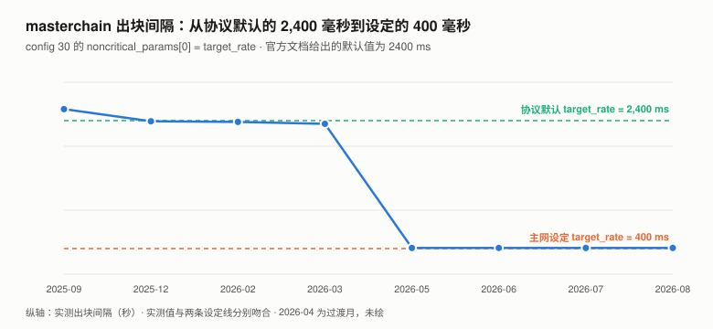
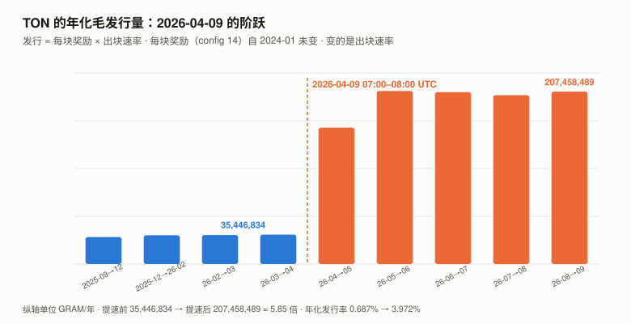
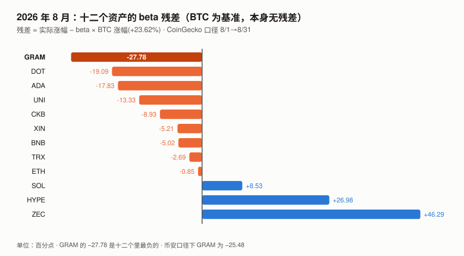

# GRAM / TON 完整调研与分析报告

> **版本**：2026 年 8 月（首期）
> **完成日期**：2026-09-11
> **本系列第十三个资产**（BTC / SOL / ADA / ETH / BNB / HYPE / UNI / TRX / XIN / DOT / ZEC / CKB / **GRAM**）
>
> **代号说明**：本报告的标的是 The Open Network（TON）的原生代币。
> **它在 2026 年 6 月从 Toncoin（TON）更名为 Gram（GRAM）**，仅改名称、代号与图标，
> **没有换币、没有迁移合约**。本报告统一用 **GRAM** 指代该代币，用 **TON** 指代区块链本身。
>
> **本版更新要点（首期）**：
>
> 1. **本期最重要的发现：TON 在 2026-04-09 把出块速率提高了约 5.9 倍，
>    而按块发放的区块奖励一个字没改，于是年化发行量从约 3,500 万 GRAM 跳到约 2.07 亿 GRAM。**
>    **它走的是配置参数变更的治理程序（`config 30`，需验证者按质押加权 3/4 多数通过），
>    但没有以货币政策的形式被讨论过——没有任何一方把它作为发行量变更提出。**
> 2. **切换时点精确到小时**：2026-04-09 **07:00–08:00 UTC**，masterchain 出块速率从 0.423 块/秒
>    跳到 2.070 → 2.502 块/秒。前一天（2026-04-08）发布了节点版本 **v2026.04**，
>    其发版说明自己写着「**anti-spam measures that could affect block rate**」。
> 3. **发行机制已用两条路径量化并闭合**：区块数 × 配置常量 = 17,619,762 GRAM（八月毛发行），
>    链上逐块余额加总实测净增 17,549,235 GRAM，**残差 70,527 GRAM（毛发行的 0.40%）**。
>    ⚠️ **这个残差不能简单称为「销毁」**，它同时含在途消息、验证者费用项与分片轮次计数误差（见 4.6）。
> 4. **总供应量可以从链上直接加总并与外部口径对上**：
>    masterchain 余额 + basechain 余额 = **5,246,916,594 GRAM**，
>    CoinGecko 报告的总供应量 **5,247,067,410**，**相差 0.0029%**。
> 5. **八月的价格表现是本期十二个资产里最负的特质成分**（BTC 为基准，本身无残差）：BTC +24.95%（2017 年以来最好的八月），
>    **GRAM −1.35%**，beta 0.967 对应的预期是 +24.13%，**特质残差 −25.48 个百分点**。
> 6. **实测质押池 APY 13.29%–17.72%**（Tonstakers 13.52%，TF 池 17.72%），与发行量跳升**量级相容**。
>    ⚠️ **初稿称它为「独立证实」，已按领域审查降级为一致性检查**——这些 APY 并非 1,082 份独立测量，
>    且其分母与发行率的分母不是同一个口径（见 4.7）。
>
> ---
>
> **利益冲突声明**：作者未持有 GRAM，与 TON 基金会、Telegram 及任何 TON 生态项目无雇佣、
> 顾问或投资关系。本报告的链上数据全部由作者从 TON 公开节点 API（toncenter / tonapi）
> 与 GitHub 一手仓库直接抓取。

---

## 核心结论摘要（一页速览）

| 维度 | 观测 | 判断 |
|------|------|------|
| **价格（8/31）** | $1.3870，**八月 −1.35%**（BTC **+24.95%**） | **特质残差 −25.48pp（币安口径）/ −27.78pp（CoinGecko 口径，8.2 排名用此口径）**，**十二个资产里最负** |
| 距 ATH | **−83.59%**（$8.25，2024-06-14） | |
| 近一年 | **−57.30%**（BTC −32.15%） | |
| **发行速率** | **2026-04-09 起年化约 2.07 亿 GRAM，此前约 3,500 万** | **5.9 倍，且无配置变更、无治理投票** |
| **年化发行率** | **约 0.68% → 约 3.97%** | 对总供应量 52.2 亿 |
| **八月净增发** | **+17,549,235 GRAM（+0.3360%）** | 链上逐块余额加总实测 |
| **两路核对的残差** | **70,527 GRAM = 毛发行的 0.40%** | ⚠️ 含销毁、在途资金、分片计数误差，未分离 |
| **质押** | Elector 余额 **13.38 亿 GRAM（流通量 48.0%）** | 当前轮有效质押 6.59 亿（23.7%） |
| **质押 APY（实测）** | **13.29%–17.72%** | 与发行跳升**量级相容**（非独立验证，见 4.7） |
| **验证者** | **390 个**（masterchain 100 个） | 前 10 名仅占质押的 3.99% |
| **网络使用** | 八月 basechain 交易约 **1.059 亿笔**（95% 区间 7,461 万–1.371 亿） | 日均约 341 万笔 |
| **USDT on TON** | **14.30 亿枚**，持有人 **342 万** | |
| **八月最大事件** | **2026-08-31 Telegram 开始向部分用户推送原生自托管 Gram Wallet** | ⚠️ 该条为搜索摘要，本报告未取得一手确认 |
| **本报告给目标价** | **否** | 理由见第 10 章 |

> **一句话**：**TON 把出块目标间隔从协议默认的 2,400 毫秒改成 400 毫秒，
> 而它的区块奖励是按「块」发的、两年半没改过——于是发行量也涨了 5.85 倍。
> 这次修改本身走了配置变更的治理程序（验证者 3/4 加权投票），
> 但它从未被作为一次货币政策变更来讨论：官方文档把两个参数分别写得很清楚，从不把它们相乘。**
>
> ⚠️ **而市场没有把它当坏消息**：提速后一周 GRAM/BTC 比价 **+9.80%**，一个月 **+80.62%**（见 4.9）。

---

## 1. GRAM 是什么

### 1.1 一个代币，两个名字

| | |
|---|---|
| 区块链 | **The Open Network（TON）**，2018 年由 Telegram 立项，2020 年社区接手 |
| 原生代币 | **Gram（GRAM）**，2026 年 6 月由 Toncoin（TON）更名而来 |
| 共识 | PoS，Simplex 共识（2026 年引入），**390 个验证者** |
| 结构 | masterchain（wc = −1）+ basechain（wc = 0），支持动态分片 |
| 初始分发 | PoW 挖矿（2020–2022），**非 ICO** |

**更名的核实状态**：

| 事实 | 核实状态 |
|---|---|
| 更名已完成、仅改名称/代号/图标 | ✅ **一手**：ton.org 官网现称 "Gram is the native coin of the TON blockchain" |
| 币安已完成迁移 | ✅ **一手**：`exchangeInfo` 显示 **8 个 TON\* 交易对全部 `status=BREAK`，7 个 GRAM\* 全部 `TRADING`** |
| 无换币、价格连续 | ✅ **一手**：TONUSDT 最后一根日线 2026-06-30 收 **$1.6000**，GRAMUSDT 首根 2026-07-02 开 **$1.6000** |
| 更名生效日 2026-06-15 | ⚠️ **仅搜索摘要**，本报告未打开一手公告 |
| 「社区投票以 **81.22%** 通过」 | ❌ **未核实，本报告不使用**。见下 |

> ⚠️ **关于那个 81.22%**：多篇报道引用这个数字，**但没有一篇给出一手来源**
> （本报告打开了其中一篇完整核对，它「引用推文但不提供任何官方公告、治理文档或链接」）。
> 本报告另行检索了 TON 的链上治理平台 `api.ton.vote`，**其 104 个 DAO 中没有任何官方治理实体**。
> **按本系列 ADA 期确立的规则——治理类得票率必须查最终状态、不得采信报道——本条不予使用。**

### 1.2 发行机制：两个常量，一个乘数

TON 的新币发行**完全**由网络配置参数 14 决定。官方文档（`content/foundations/config.mdx` 第 233 行）原文：

> **Param 14: block reward** — This parameter controls the Gram rewards for producing blocks.
> The `masterchain_block_fee` is applied to each masterchain block, while the `basechain_block_fee`
> applies to a workchain. If there is a split in the workchain, the `basechain_block_fee` is
> distributed among its shard blocks based on their depth.

| 参数 | 值 |
|---|---|
| `masterchain_block_fee` | **1.7 GRAM / 每个 masterchain 区块** |
| `basechain_block_fee` | **1.0 GRAM / 每个 basechain 区块** |

**关键结构**：**奖励是按「区块」发的，不是按「时间」发的。**
因此**发行速率 = 每块奖励 × 出块速率**。**出块变快多少倍，发行就变快多少倍。**

> **这不是一个隐藏机制，它写在公开文档里。**
> **但文档里没有任何一句话提到「出块速率变化会等比例改变发行量」**——
> 第 4 章要说的就是这件事在 2026 年 4 月真的发生了。

### 1.3 总供应量可以从链上直接加总

TON 没有一个「总供应量」字段。但每个区块的 `ValueFlow` 结构里有 `from_prev_blk`，
**它是该链上全部账户余额的合计**。
**basechain 会动态分片**（本报告实测 2026-08-08 至 08-13 就分过），
**但下表取的五个快照时点经逐一核实全部为单一分片**
（2026-03-01 / 04-01 / 08-01 / 09-01 / 09-11），因此两条链相加即可：

```
总供应量 = masterchain 的 from_prev_blk + basechain 的 from_prev_blk
```

| | 值（2026-09-11） |
|---|---|
| masterchain 余额 | 2,464,048,218.30 GRAM |
| basechain 余额 | 2,782,868,375.67 GRAM |
| **合计** | **5,246,916,593.97 GRAM** |
| **对照：CoinGecko 报告的总供应量** | **5,247,067,410** |
| **差** | **0.0029%** |

> ⚠️ **这个等式不是 TON 协议定义的总供应量，初稿把它当成了，已更正。**
>
> **协议自己的总供应量在 `McStateExtra` 的 `global_balance` 字段里**（`block.tlb` 第 583 行），
> 而 `from_prev_blk` 只是**该链上账户余额的合计**，**不含**：
> ① 已离开账户、尚未入账的在途消息价值；② 单独记账的 `total_validator_fees`；
> ③ 分片时必须覆盖同一 masterchain 确认边界下的**全部**分片。
> **另外 `CurrencyCollection` 里的 extra currencies 应按币种分开，不能并入原生币。**
>
> **本报告已尝试读取 `global_balance` 并失败**：它在 ShardState 而非 Block 里，
> toncenter 与 tonapi 的区块接口都不提供，读它需要完整的 TON lite-client。**下期补。**
>
> **因此这一行的正确表述是**：**本报告的加总值与 CoinGecko 的口径相差 0.0029%，
> 这是一个经验上的吻合，不是对等式的证明。** 上述三项遗漏在当前规模下显然很小
> （否则不会只差 15 万枚），**但它们的大小本报告没有测量。**

---

## 2. GRAM 的发展阶段划分

| 阶段 | 时间 | 标志 |
|---|---|---|
| 一 · Telegram 立项与 SEC 叫停 | 2018 – 2020 | 代币原名 **Gram**；SEC 执法后 Telegram 退出 |
| 二 · 社区接手与 PoW 分发 | 2020 – 2022 | 社区以 The Open Network 重启，代币更名 Toncoin；**通过 PoW 挖矿分发，非 ICO** |
| 三 · Telegram 生态回归 | 2023 – 2024-06 | 小程序/钱包生态爆发，**2024-06-14 见 ATH $8.25** |
| 四 · 回落与 Simplex 共识开发 | 2024-07 – 2026-03 | 价格从 ATH 回落逾八成；共识协议重写（Catchain → Simplex） |
| **五 · 提速、更名与钱包推送** | **2026-04 – 至今** | **2026-04-09 出块提速 6 倍（发行随之 5.9 倍）**；2026-06 更名 Gram；**2026-08-31 Telegram 开始推送原生钱包** |

> **第五阶段的三件事都发生在 2026 年，而其中第一件——出块提速——没有被当作货币政策事件讨论过。**
> **本报告第 4 章就是在做这件事。**

---

## 3. GRAM 当前现状

### 3.1 价格与市场

> **口径**：GRAM 与 BTC 均取**币安 UTC 日收盘价**，八月定义为 2026-07-31 收盘 → 2026-08-31 收盘。
> **代号迁移的拼接**：2025-09-10 至 2026-06-30 用 TONUSDT，2026-07-02 起用 GRAMUSDT。
> **两段无重叠日，且 TON 最后一根收 $1.6000、GRAM 首根开 $1.6000，为 1:1 连续，中间缺 2026-07-01 一天。**

| 指标 | 值 |
|------|-----|
| 价格（2026-09-11） | **$1.3540** |
| 市值 / 排名 | **$37.73 亿** / **第 28 位** |
| 流通量 / 总供应量 | 2,786,316,316 / **5,247,067,410**（**无上限**，发行永续） |
| **八月涨幅** | **−1.35%**（BTC **+24.95%**） |
| 八月盘中区间 | **$1.2940（8/18）– $1.5600（8/22）**，振幅 20.6% |
| 距 ATH | **−83.59%**（$8.25，2024-06-14） |
| 近一年 / 年初至今 | **−57.30%** / **−20.07%**（BTC −32.15% / −12.96%） |
| 八月币安日成交额（中位 / 均值） | **$512.7 万** / $712.8 万 |

### 3.2 八月：BTC 最好的八月，GRAM 反而跌了

| | 值 |
|---|---|
| BTC 八月涨幅 | **+24.95%**（2017 年以来最好的八月） |
| GRAM 的 beta（对 BTC，365 天） | **0.967** |
| **beta 预期涨幅** | **+24.13%** |
| GRAM 实际涨幅 | **−1.35%** |
| **特质（残差）成分** | **约 −25.48 个百分点** |

**用 CoinGecko 口径（GRAM −4.94% / BTC +23.62%）算，残差约 −28.1pp，方向相同、幅度更大。**

> **在 2026 年 8 月的十三个资产里，这是最负的特质成分（见 8.2 的完整对照）。**
> ⚠️ **本报告没有计算过往各月的残差，因此不声称它是「本系列历史最大」。**
> **不要用 R² 来论证这件事**——GRAM 的 R² 是 29.2%，字面含义是「70.8% 的日波动不由 BTC 解释」，
> 拿它当「没有自身信息」的依据是把反证当证据（**本系列 CKB 期犯过这个错，已固化为规则**）。
> **正确的统计量是 beta 残差，而它给出的结论比「没有自身信息」强得多：八月 GRAM 自己的贡献是显著为负的。**

### 3.3 风险特征

| 指标 | GRAM | BTC |
|---|---|---|
| 年化波动率（365 天） | **79.6%** | 44.4% |
| beta | **0.967** | 1.000 |
| 相关系数 / R² | 0.540 / **29.2%** | — |

> **数据源一致性检查（CKB 期教训的例行项）**：逐月对照 CoinGecko 与币安的 GRAM 序列，
> **13 个月全部一致**（波动率比值 < 1.5 倍、月均价偏差 < 5%），**本期无 CKB 那类数据源污染问题。**

### 3.4 宏观环境

| 因素 | 状态（9 月初） | 影响 |
|------|--------------|------|
| 联邦基金利率 | 3.50–3.75% | — |
| 9 月加息概率 | **65.9%**（CME FedWatch，8/31） | 利空 |
| PCE 通胀 | 3.7%（12 个月）/ 4.1%（6 个月） | 支持加息 |
| 10 年期美债 | 4.79% | — |

> 本节沿用与本系列 TRX / UNI / XIN / DOT / ZEC / CKB 期同一时点的宏观快照。
> **但八月 GRAM 与宏观完全脱钩**——BTC 在同样的宏观环境下涨了 24.95%。

---

## 4. 一次把发行量放大 5.85 倍的性能升级（本期核心章之一）

### 4.1 出块速率的历史

按 masterchain 区块序号在各时点相减：

| 区间 | masterchain 块/秒 | 出块间隔 |
|---|---|---|
| 2025-09-01 → 2025-12-01 | 0.388 | **2.58 秒** |
| 2025-12-01 → 2026-02-01 | 0.417 | 2.39 秒 |
| 2026-02-01 → 2026-03-01 | 0.421 | 2.38 秒 |
| 2026-03-01 → 2026-04-01 | 0.426 | 2.35 秒 |
| **2026-04-01 → 2026-05-01** | **1.894** | **（过渡）** |
| 2026-05-01 → 2026-06-01 | 2.454 | **0.41 秒** |
| 2026-06-01 → 2026-07-01 | 2.441 | 0.41 秒 |
| 2026-07-01 → 2026-08-01 | 2.417 | 0.41 秒 |
| **2026-08-01 → 2026-09-01** | **2.457** | **0.41 秒** |

### 4.2 切换时点：精确到一小时

| 时点（UTC） | masterchain seqno | 前一小时的块/秒 |
|---|---|---|
| 2026-04-09 04:00 | 59,233,192 | — |
| 2026-04-09 05:00 | 59,234,722 | 0.425 |
| 2026-04-09 06:00 | 59,236,243 | 0.422 |
| **2026-04-09 07:00** | **59,237,767** | **0.423** |
| **2026-04-09 08:00** | **59,245,220** | **2.070** ← 切换 |
| 2026-04-09 09:00 | 59,254,229 | 2.502 |
| 2026-04-09 12:00 | 59,281,200 | 2.501 |

**切换发生在 2026-04-09 07:00–08:00 UTC 之间。**

### 4.3 是什么把它切过去的：`config 30`

**初稿在这里判断错了一次，值得记录**：本报告最初查了 config 28 / 29 / 20 / 21 / 8 在切换前后是否变化，
结果都没变，于是写下「这次提速没有任何配置参数变更」。
**读官方文档时才发现漏查了 `config 30`——而它恰恰就是那个参数。**

官方文档（`content/foundations/config.mdx`，Param 30 段）原文标注：

> - **TON v2026.03**: `ConfigParam 30` introduced on testnet.
> - **TON v2026.04**: `ConfigParam 30` **enabled on mainnet**.

**实测 `config 30` 的出现与变化：**

| 时点（UTC） | `config 30` |
|---|---|
| 2026-03-01 | **不存在** |
| 2026-04-01 | **不存在** |
| 2026-04-08 | **出现**，49 字节（根 `10 60`：仅 masterchain） |
| 2026-04-09 07:00 | 49 字节 |
| **2026-04-09 08:00** | **62 字节**（根 `10 e0`：**masterchain + 分片链**） |
| 2026-04-15 | 62 字节 |

**`config 30` 是 Simplex（Catchain 2.0）共识的配置，其中带一张可调参数表 `noncritical_params`。
官方文档给出该表的键定义：**

| 键 | 名称 | 默认值 | 含义（官方原文译） |
|---|---|---|---|
| **`0`** | **`target_rate`** | **`2400 ms`** | **目标出块/时隙间隔；用于领导者节奏、出块时机与跳过调度** |
| `1` | `first_block_timeout` | `1000 ms` | 领导者窗口内首个缺失区块开始跳过投票前的基础超时 |
| `13` | `min_block_interval` | `0 ms` | 父区块时间与下一个本地生成区块之间的最小间隔 |

**主网当前实测值**（tonapi 解码）：

```json
mc:    {"use_quic": true, "slots_per_leader_window": 4,  "noncritical_params": {"0": 400, "1": 700, "13": 300}}
shard: {"use_quic": true, "slots_per_leader_window": 16, "noncritical_params": {"0": 400, "1": 700, "10": 64, "13": 300}}
```

**即 `target_rate` 被从默认的 2,400 毫秒改为 400 毫秒。**



| | 设定值 | 实测出块间隔 |
|---|---|---|
| 提速前 | 默认 **2,400 ms** | **2.35 – 2.58 秒** ✓ |
| 提速后 | **400 ms** | **0.41 秒** ✓ |
| **比率** | **6.00 倍** | **约 5.9 倍** |

### 4.4 而区块奖励一个字没改

TON 的新币发行由 `config 14` 的两个常量决定（见 1.2）。**本报告查了它在六个历史时点的值：**

| 时点 | `config 14` 原始字节 |
|---|---|
| 2024-01-01 | `…6b46553f10043b9aca00…` |
| 2024-09-01 | 同上 |
| 2025-03-01 | 同上 |
| 2025-09-01 | 同上 |
| 2025-12-01 | 同上 |
| 2026-03-01 | 同上 |
| 2026-06-01 | 同上 |
| 2026-08-01 | 同上 |
| **当前** | **同上** |

解码：`6b`（tag）+ `4`+`6553f100` = **1,700,000,000 nanoton = 1.7 GRAM** + `4`+`3b9aca00` = **1,000,000,000 = 1.0 GRAM**。
与 tonapi 的 JSON 解码一致（两路互证）。

> ⚠️ **一个必须做的对照实验**：toncenter 的 `getConfigParam` 接受 `seqno` 参数，
> **但「六个时点返回相同字节」也可能是接口忽略了 `seqno`。**
> 本报告因此拿一个**每 18 小时必变**的参数（`config 34` 验证者集）做对照：
> **当前值与 2025-12-01 的值确实不同**，证明 `seqno` 被真正使用。
> **「config 14 从未改变」这个结论因此成立。**

### 4.5 结果：发行量跟着出块速率走

| 区间 | masterchain 块/秒 | basechain 逻辑轮/秒 | **年化毛发行（GRAM）** |
|---|---|---|---|
| 2025-09-01 → 2025-12-01 | 0.388 | 0.369 | **32,425,696** |
| 2025-12-01 → 2026-02-01 | 0.417 | 0.390 | 34,690,019 |
| 2026-02-01 → 2026-03-01 | 0.421 | 0.395 | 35,002,804 |
| 2026-03-01 → 2026-04-01 | 0.426 | 0.400 | **35,446,834** |
| 2026-04-01 → 2026-05-01 | 1.894 | 1.984 | 164,116,235 |
| 2026-05-01 → 2026-06-01 | 2.454 | 2.434 | 208,290,601 |
| 2026-06-01 → 2026-07-01 | 2.441 | 2.407 | 206,762,970 |
| 2026-07-01 → 2026-08-01 | 2.417 | 2.334 | 203,158,223 |
| **2026-08-01 → 2026-09-01** | **2.457** | **2.401** | **207,458,489** |

> ⚠️ **basechain 的计数需要一个额外说明（领域审查指出，本报告据此补做了实证检验）。**
>
> 官方文档写的是「`basechain_block_fee` **applies to a workchain**；分片时按深度在各分片块之间分摊」，
> 共识代码里每个分片块的奖励是 `basechain_create_fee >> shard_prefix_length`，即除以 2^深度。
> **因此「分片块数 × 1.0」只有在区间内始终未分片时才成立，而本报告实测八月并非如此**：
> **2026-08-08 至 08-13 之间，basechain 多次分裂为 2–3 个分片**（6 小时粒度采样中，24 个时点有 13 个处于分片状态）。
>
> **本报告因此直接去分片期读了各分片块的 `created` 字段：**
>
> | 2026-08-09 06:00 UTC | 深度 | `created` |
> |---|---|---|
> | shard `4000000000000000` | 1 | **0.500000000 GRAM** |
> | shard `C000000000000000` | 1 | **0.500000000 GRAM** |
> | **合计** | | **1.000000000 GRAM** |
>
> **即每个「逻辑轮」的 basechain 发行恒为 1.0 GRAM，与分片数无关。**
> **而本报告用的 seqno 差正是逻辑轮数**（TON 的分裂/合并规则使合并后的 seqno 承接子分片的最大值）。
> ⚠️ **这仍是一个近似**：子分片的 seqno 会互相漂移（实测同一时刻两个子分片相差 7），
> **跨分裂/合并边界的轮数计数因此有小幅误差。4.6 的 0.40% 残差给出了这个误差的上界。**



**提速前（2026-03 → 04）年化 3,544 万 GRAM，提速后（2026-08）年化 2.075 亿 GRAM——5.85 倍。**

对各自时点的总供应量：**年化发行率从 0.687%（2026-04-01 的 5,158,349,660 GRAM）
升到 3.972%（2026-08-01 的 5,223,622,160 GRAM）——5.78 倍。**

**一个额外的独立佐证**：提速前的 2026 年 3 月，实测总供应量从 5,155,462,700 增至 5,158,349,660，
**净增 2,886,960 GRAM**；而按区块数 × 常量的模型预测是 **2,953,903 GRAM**，**两者差 2.3%**。
**模型在提速前后都成立。**

### 4.6 八月发行量的两路核对

| 路径 | 计算 | 结果 |
|---|---|---|
| **① 区块数 × 配置常量** | masterchain 6,581,263 块 × 1.7 + basechain 6,431,615 **逻辑轮** × 1.0 | **17,619,762 GRAM**（毛发行） |
| **② 链上余额加总实测** | （masterchain + basechain 余额）9/1 − 8/1 | **+17,549,235 GRAM**（净增） |
| **差额** | | **70,527 GRAM = 毛发行的 0.40%** |

> ⚠️ **「差额即手续费销毁」是初稿的说法，已按领域审查撤回。**
> **这 70,527 GRAM 是一个残差项，它里面至少混着四样东西**：
> ① 手续费销毁（`burned`）；② 路径 ② 遗漏的在途消息价值与 `total_validator_fees` 的变化；
> ③ 跨分裂/合并边界的逻辑轮计数误差；④ 两个时点的区块边界不完全对齐。
> **本报告没有把它们分开，因此只能说「残差占毛发行 0.40%」，不能说「销毁了 70,527 枚」。**
>
> ⚠️ **这两条路径的独立性也要说清楚，不能重复 CKB 期的错误。**
> **路径 ② 的余额与路径 ① 的单价 `created` 在同一个 `ValueFlow` 结构里，由块内会计恒等式相连**——
> **这不是两次完全独立的测量。**
> **但它仍有约束力**：路径 ① 的**区块数**是独立输入（序号相减），单价来自 `config 14`。
> **若区块数错了 20%，残差会是 7.3% 而不是 0.40%。**
> **因此 0.40% 的残差主要证明的是「区块计数是对的」，
> 而不是「净发行全部来自 `config 14`」——后者需要直接累加 `created` 与 `burned` 才能证明，本期未做。**

### 4.7 第三条路：质押收益率

**如果发行量真的涨了近 6 倍，质押收益率应当同步跳升。这条检验不经过本报告的任何模型。**

实测质押池 APY（tonapi `/v2/staking/pools`，1,082 个池）：

| 池 / 类型 | 规模（GRAM） | APY |
|---|---|---|
| **Tonstakers**（最大流动性质押池） | 131,263,562 | **13.52%** |
| Whales Club 队列 | 6,766,963 – 7,150,649 | 14.53% |
| Tonkeeper 队列 | 6,807,945 | 13.29% |
| TF 提名池（1,075 个） | 合计 211,098,478 | **17.72%** |
| **全部池合计** | **372,344,234**（占 Elector 余额 27.8%） | **区间 13.29% – 17.72%** |

**当前实测 13–18%。**

> ⚠️ **初稿把这一条称为「唯一完全独立的验证」，并写「TON 历史质押收益率在 3–5% 量级」。
> 领域审查指出两处问题，本报告接受并降级这条证据：**
>
> **① 这 1,082 个数不是 1,082 份独立测量。** 审查读了 `tonkeeper/opentonapi` 的实现：
> **TF 池与 Whales 池共用同一个 `GetAPY()`，其取值来自同一个上游接口**；
> Tonstakers 走另一条统计路径并乘费用系数。**实质上只有两到三个独立来源。**
> **⚠️ 本报告未独立复核该源码，此处采信领域审查的结论。**
>
> **② 分母口径不配平。** APY 的分母是投入质押的本金（且受双轮资金占用、费用、复利影响），
> 而发行率的分母是全网供应量。**用本报告自己的数**：年发行 2.075 亿 ÷ Elector 余额 13.38 亿 = **15.5%**，
> ÷ 单轮有效质押 6.59 亿 = **31.5%**。**实测的 13–18% 落在这两个口径之间，
> 只能说「量级相容」，不能说「确认了 5.85 倍」。**
>
> **③ 「历史 3–5%」这个对照值本报告没有一手来源，已从正文结论中移除。**
>
> **结论**：这条证据**不是独立验证，是一致性检查**。**它能排除「发行其实没变」，
> 不能单独支撑「涨了 5.85 倍」。真正支撑 5.85 倍的是 4.5 与 4.6。**

### 4.8 这件事的性质

> ⚠️ **本节经过一次实质更正。** 初稿写的是「这次变更没有经过任何治理程序」。
> **推理审查指出这与本报告自己在记分卡里给 G8-1 写的豁免理由（「配置变更需验证者多数同意」）互斥。
> 复核官方文档后确认：初稿错了。**

**TON 有配置变更的链上治理机制，写在 `config 11` 里。官方文档原文：**

> **Param 11: config params** — This parameter indicates under what conditions **proposals to change
> the TON configuration are accepted**……`min_wins`: **3/4 of validators by the sum of the pledges
> must vote in favor**.

实测当前值：普通参数 `min_wins = 2`、`max_tot_rounds = 6`；关键参数 `min_wins = 3`、`max_tot_rounds = 7`。

| 问题 | 答案 |
|---|---|
| 有没有改货币参数？ | **没有。`config 14` 自 2024-01 起未动。** |
| 有没有改配置参数？ | **改了。`config 30` 在 2026-04-09 07:00–08:00 那一小时里变更。** |
| **有没有治理程序？** | **有。** 配置变更需通过 `config 11` 定义的验证者投票（按质押加权 3/4 多数） |
| **本报告找到那次提案的记录了吗？** | **没有。** 配置合约（`-1:5555…`）的 `list_proposals` 当前返回空——**它只保存活跃提案，历史提案已过期。本报告无法取得 2026-04-09 那次变更的提案与投票记录。** |
| 是不是「意外」？ | **不是。** `target_rate` 被从默认 2,400 ms 显式设为 400 ms，这是一次刻意的参数设置 |
| 官方文档有没有提到发行量影响？ | **没有。** Param 14 段只描述机制，Param 30 段只描述共识；**两段都不提两者相乘的后果** |

> **因此本报告的正确表述是**：
> **这次变更走了「配置参数变更」的治理程序，但没有走「货币政策变更」的讨论程序。**
> **验证者们批准的是一个共识节奏参数；没有任何公开材料显示，有人在批准时把它作为
> 「把年化发行率从 0.687% 提到 3.972%」的决定来讨论。**
>
> **一个把出块速率当作工程参数、把区块奖励当作货币参数的治理结构，
> 在这两者相乘的地方没有设岗。**
> **⚠️ 但「没有设岗」是本报告在公开材料范围内的判断**——
> 验证者的内部讨论、基金会的事前沟通，本报告都没有渠道核实。

### 4.9 市场有没有把它当回事？（推理审查指出本报告漏了这个检验）

**初稿把「发行量放大 5.85 倍」登记为空头论据，却从未检验它是否已经反映在价格里。
而检验所需的数据本报告一直拿在手上。**

**GRAM/BTC 比价在提速前后（币安 UTC 日收盘）：**

| 窗口 | 比价变化 | GRAM | BTC | z 值 |
|---|---|---|---|---|
| 04-08 → 04-09（当日） | **−0.04%** | +0.97% | +1.01% | **−0.02** |
| 04-08 → 04-16（+1 周） | **+9.80%** | +16.11% | +5.75% | +1.32 |
| 04-08 → 04-23（+2 周） | −2.05% | +7.85% | +10.11% | −0.21 |
| **04-08 → 05-08（+1 月）** | **+80.62%** | **+103.81%** | +12.84% | — |
| 04-08 → 2026-09-11（至今） | +0.77% | +9.64% | +8.80% | — |

> z 值以提速前 90 天的比价日对数变动标准差（2.51%）为尺度。

**结论：市场对这次发行量变更没有可观测的负面反应，提速后一个月 GRAM 相对 BTC 反而大涨 80.62%。**

**这个结果对本报告的两个方向都有影响：**

| 读法 | 含义 |
|---|---|
| **A：市场没注意到** | 支持本报告「它没有被当作货币政策事件讨论」的判断，**但同时说明「发行量涨了 5.85 倍」是一条尚未被定价的信息，而不是已经兑现的利空** |
| **B：市场注意到了但不在意** | 则「发行量涨了 5.85 倍」已在四个月前被定价，**空头论据 #1 就是历史事实而非前瞻判断** |

> **本报告无法区分 A 与 B，也不主张其中任何一个。**
> **但必须明确一件事：本报告没有把八月 −25.48pp 的负特质归因于四个月前的发行变更。**
> **两者相隔四个多月，中间 GRAM 还大幅跑赢过 BTC，任何因果连接都需要本报告没有的证据。**
>
> **这个检验是推理审查提出的，初稿完全没有做。**
> **它把空头 #1 的性质从「前瞻风险」改成了「已发生但定价状态不明的事实」——这是一个实质降级。**

---

## 5. 八月的链上协议变更（本期核心章之二）

本报告逐项比对了 **37 个网络配置参数**在 2026-08-01 与 2026-09-01 的取值：
**31 项未变**，6 项变化，其中 3 项（`config 32/34/36`）是每轮必换的验证者集，属预期内。
**真正的协议变更有三次**，时点用二分法收敛到小时：

| 时点（UTC） | 参数 | 变化 |
|---|---|---|
| **2026-08-04 21:00** | `config 30`（Simplex 共识） | 62 → 72 字节 |
| **2026-08-20 01:00** | `config 31`（基础合约白名单） | **304 → 344 字节：新增 1 个合约** |
| **2026-08-20 01:00** | `config 29`（共识配置） | 同时变更，长度不变 |
| **2026-08-28 09:00** | `config 30` | 72 → 96 字节 |

### 5.1 八月新增的那个基础合约

`config 31` 是「免收 gas 与存储费、可发起 tick-tock 交易」的合约白名单。
官方文档：**「验证者把位于 masterchain 且地址出现在本参数中的账户归类为 special……
只有 special 账户享有相关协议特权，包括修改公共库的权限。」**

当前白名单有 **9 个合约**。本报告逐个查了它们的最早交易时间：

| 地址（前 20 位） | 最早交易 | 说明 |
|---|---|---|
| `0000000000000000…` | 2019-11-15 | 配置合约 |
| `3333333333333333…` | 2019-11-15 | **Elector（选举/质押）** |
| `dd24c4a1f2b88f8b…` | 2021-08-16 | ETH Bridge |
| `4d5c0210b35dadda…` | 2021-09-30 | BSC Bridge |
| `ead7da389bde317c…` | 2025-06-30 | — |
| `c50f890366c81f5c…` | 2026-05-25 | — |
| `b74dd9593f9bd8ea…` | 2026-05-25 | — |
| `a8ce6c36aa8ba536…` | 2026-05-25 | — |
| **`9234809b5b02186e…`** | **2026-08-18 10:47** | **唯一在八月出现的** |

**该合约的链上时间线：**

| 时点（UTC） | 事件 |
|---|---|
| **2026-08-18 10:47** | 合约首笔交易（部署） |
| **2026-08-20 00:59** | 收到 op `0x32b85a9b`，随后连续多笔 op `0xcdb9d286` |
| **2026-08-20 01:00** | **被写入 `config 31`；`config 29` 同时变更** |
| 2026-09-11 00:44 | 仍有活动；当前余额 0.995 GRAM |

### 5.2 与 Telegram 原生钱包的关系：本报告能说什么、不能说什么

**能说的（一手）**：

1. TON 官方文档的「负数参数」表中明确列有：
   **`-123` | Telegram wallet contract bytecode used by the Telegram's native Gram wallet.**
   **即 TON 协议里确实有一个专门存放 Telegram 原生钱包合约字节码的配置槽位。**
2. 上述 `9234809b…` 合约于 2026-08-18 部署、08-20 获得 special 特权（含**修改公共库的权限**）。
3. 八月的三次协议变更中，两次集中在 08-20 与 08-28。

**不能说的**：

- ❌ **本报告没有读到 `config -123` 的值，因此无法确认它何时被写入、写的是什么。**
  **已尝试且失败**：toncenter 的 `getConfigParam` 明确拒绝负数索引
  （返回 `param should be non-negative`）；tonapi 的解码结果只含非负键；
  原始配置 BoC 需要自行实现 Hashmap 解析器，本期未做。**下期补。**
- ❌ **本报告无法证明 `9234809b…` 就是 Telegram 钱包相关合约。**
  证据只有「八月唯一新增」与「时间邻近」，**这两条都不具排他性。**
- ⚠️ **「2026-08-31 Telegram 开始向部分用户推送原生自托管 Gram Wallet」这条为搜索摘要，
  本报告未取得一手确认。** 它若为真，是本期最重要的基本面事件；
  **但本报告的价格分析（3.2）不依赖它。**

> **第 5 章的意义在于：它给出了一条可以在下期被证实或证伪的链上线索。**
> **如果 Telegram 钱包确实在推进，`config -123` 与 `9234809b…` 的后续变化会记录下来；
> 如果没有，它们会停在那里。**

---

## 6. 质押、验证者与安全预算

### 6.1 质押的两个口径

| 口径 | 数量 | 占流通量 |
|---|---|---|
| **Elector 合约余额** | **1,337,746,378 GRAM** | **48.0%** |
| 当前验证轮的有效质押（`total_stake`） | **659,467,380 GRAM** | **23.7%** |

**两者差约 2.03 倍。** 机制解释：验证轮长 `validators_elected_for` = **65,536 秒（18.2 小时）**，
质押在轮次结束后还要锁 `stake_held_for` = **32,768 秒（9.1 小时）**，
且下一轮的质押在本轮结束前就已提交。**因此 Elector 在任意时刻大致持有两轮的质押。**

> ⚠️ **上述分解是本报告的推断，未逐项验证。**
> **本报告在讲「锁仓比例」时用 Elector 口径，在讲「当前在保护网络的质押」时用 `total_stake` 口径，
> 两个数不可互换。**

### 6.2 验证者结构

| 指标 | 值 |
|---|---|
| 验证者总数 | **390**（`config 34`，上一轮 386） |
| 其中 masterchain 验证者 | **100** |
| 最小 / 最大质押（`config 17`） | 300,000 / 10,000,000 GRAM |
| 单个验证者实际质押 最大 / 中位 / 最小 | 2,680,089 / 1,613,334 / 686,401 |
| **前 10 名占总质押** | **3.99%** |
| **前 50 名占总质押** | **19.70%** |

> **按质押集中度衡量，TON 的验证者集是本系列见过最分散的之一**——
> 前 10 名不到 4%，且协议用 `max_stake = 1,000 万 GRAM` 设了硬上限。

### 6.3 质押的委托层

| 类型 | 规模（GRAM） | 池数 |
|---|---|---|
| `tf`（TON Foundation 提名池） | 211,098,478 | 1,075 |
| `liquidTF`（Tonstakers） | 131,263,562 | 1 |
| `whales`（Whales / Tonkeeper） | 29,982,194 | 6 |
| **合计** | **372,344,234** | **1,082** |
| **占 Elector 余额** | **27.8%** | |

**即约 72% 的质押是验证者自有资金或未通过公开池委托。**

### 6.4 安全预算与财富转移

| | 值 |
|---|---|
| 八月发行给验证者的区块奖励 | **17,619,762 GRAM** |
| 按八月均价 $1.3809 折美元 | **$2,433 万** |
| 年化 | **$2.865 亿** |
| 年化安全预算 / 市值 | **7.59%** |

**这笔钱的来源是全体持有人的稀释，去向是质押者。**

| | 年化 |
|---|---|
| 总供应量增长 | **+3.97%** |
| 质押者名义收益（实测 APY 区间） | **13.29% – 17.72%** |
| **未质押者的份额变化** | **−3.97%** |
| **质押者的份额变化**（取 TF 池 17.72%） | **+13.22%** |
| **质押者的份额变化**（取 Tonstakers 13.52%） | **+9.18%** |

> ⚠️ **初稿在这里写「这是本系列见过的最大的一笔质押者 vs 非质押者财富转移」，已撤回——那是一个未复算的最高级断言。**
>
> **按「年增发率 × 未参与分配的比例」这个口径复算：**
>
> | 资产 | 年增发 | 质押/参与率 | **年度转移规模** |
> |---|---|---|---|
> | **GRAM** | 3.97% | 48.0% | **2.06%** |
> | DOT | 3.30% | 53.73% | **1.53%** |
> | ADA | 1.47% | 约 56.5% | 0.64% |
> | ETH | 0.863% | 35.08% | 0.56% |
>
> **GRAM 在这四个可比的 PoS 资产里确实最高，但与 DOT 的差距只有 0.53 个百分点，不是数量级差异。**
> **⚠️ 更重要的是：这个口径无法跨机制比较。** CKB 的 NervosDAO 只补偿二次发行、SOL 的通胀递减、
> ZEC 是 PoW 无质押——**本报告没有为它们建立同构的口径，因此不做十三资产的排名。**
>
> **本节能说的是**：**GRAM 的这笔转移在 2026-04-09 那一小时里放大了约 6 倍，
> 而 Elector 口径下 48.0% 的流通量在质押，非质押的 52.0% 承担全部稀释。**

---

## 7. 网络使用

| 指标 | 值 | 口径 |
|---|---|---|
| **八月 basechain 交易数** | **约 1.059 亿笔** | **抽样估计**，120 个随机区块 |
| **95% 置信区间** | **[7,461 万, 1.371 亿]** | 分布高度右偏（均值 16.46，标准差 27.15） |
| 日均 | 约 **341 万笔** | |
| 对照：ton.org 官网称「24h 330 万笔」 | **差 3%** | ✅ 独立吻合 |
| **USDT on TON 流通量** | **1,429,976,003 USD₮** | ✅ 一手（jetton master 合约） |
| USDT 持有人数 | **3,423,842** | |
| 对照：ton.org 官网称「约 14 亿 USDt」 | **吻合** | ✅ |
| 智能合约数（官网） | 1.808 亿 | ⚠️ 未独立验证 |
| 月活钱包（官网） | 230 万 | ⚠️ **链下指标，本报告无法验证** |

> **交易数的置信区间很宽（±30%），报告中不应把 1.059 亿当作精确值使用。**
> 它足以支撑「日均在三百万笔量级」这个量级判断，不足以支撑任何逐月比较。

### 7.1 开发活跃度（一手，GitHub API）

| 仓库 | 2026-07 | 2026-08 | 2026-09（至 11 日） |
|---|---|---|---|
| `ton-blockchain/ton`（L1 核心） | 147 | **62** | — |
| `ton-blockchain/acton`（合约工具链） | — | **184** | **216** |
| `ton-blockchain/docs` | 25 | 26 | 7 |

**八月发版**：`v2026.07`（08-03，QUIC 性能）、**`v2026.08`（08-17，
「Added collators to Simplex protocol, allowing offloading block generation to specialized nodes」）**。

> **v2026.08 把出块生成拆分给专门的 collator 节点**——**这是继续提高出块能力的方向。**
> **按第 4 章的机制，出块能力的任何进一步提升都会等比例提高发行量，除非同时下调 `config 14`。**
> **这是本报告认为下期最需要盯的一件事。**

---

## 8. GRAM 与其他十二个资产的比较

> **口径声明**：8 月涨幅统一为 CoinGecko 口径的 8/1→8/31，日成交额为 2026 年 8 月的日成交额中位数，
> 波动率与 beta 为 2025-09 至 2026-09 的日对数收益率。
> **GRAM 一行的波动率 / beta / R² 用币安拼接序列（TONUSDT + GRAMUSDT）**，
> 已验证 CoinGecko 与币安逐月一致，**口径差异不影响结论**。

### 8.1 十三资产矩阵

| 指标 | **GRAM** | CKB | ZEC | DOT | XIN | TRX | UNI | HYPE | BNB | ETH | SOL | ADA | BTC |
|------|---|---|---|---|---|---|---|---|---|---|---|---|---|
| 市值 | **$37.73 亿** | $0.563 亿 | $204.8 亿 | $18.4 亿 | 无法计算 | $318.1 亿 | $44.0 亿 | $196.5 亿 | $1,009 亿 | $3,052 亿 | $622.7 亿 | $82.7 亿 | $16,047 亿 |
| **8 月涨幅** | **−4.94%** | +20.15% | +82.88% | +8.07% | +9.67% | +3.14% | +18.06% | +52.40% | +16.71% | +29.86% | +39.68% | +14.65% | +23.62% |
| 距 ATH | −83.59% | −97.40% | −62.09% | −98.03% | −96.75% | −22.31% | −84.30% | −0.26% | −44.66% | −49.43% | −63.73% | −92.86% | −36.62% |
| 8 月日成交中位数 | **$512.7 万** | $146.5 万 | $2.091 亿 | $7,974 万 | $10,878 | $3.709 亿 | $2.456 亿 | $3.062 亿 | $6.399 亿 | $70.41 亿 | $14.35 亿 | $3.804 亿 | $217.09 亿 |
| 年化波动率 | **79.6%** | 80.3% | 152.2% | 81.5% | 177.3% | 26.6% | 97.1% | 93.6% | 52.9% | 63.8% | 67.9% | 80.9% | 44.2% |
| beta | **0.967** | 1.231 | 1.549 | 1.15 | 0.63 | 0.247 | 1.329 | 1.076 | 0.920 | 1.300 | 1.319 | 1.375 | 1.000 |
| R² | **29.2%** | 46.2% | 19.9% | 38.3% | 2.4% | 16.8% | 36.6% | 25.8% | 59.1% | 81.1% | 73.7% | 56.4% | 100% |
| **年增发** | **+3.97%** | +4.69% | +3.87% | +3.30% | 无机制 | +0.519% | 总减流增 | 待定 | −4.56% | +0.863% | 递减 | +1.47% | +0.83% |

> **两个位次值得单独指出**：
> ① **GRAM 是十三个资产里八月唯一下跌的**（−4.94%，CoinGecko 口径；币安口径 −1.35%），
>    **而同月 BTC +23.62%**；
> ② **年增发 3.97% 在已给出数值的九个里排第三**，仅次于 CKB 的 4.69% 与 ZEC 的 3.87%。
>    **⚠️ 另外四个（XIN / UNI / HYPE / SOL）本系列未给出可比数值，不能断言全局位次。**

### 8.2 八月的 beta 残差：十二个资产的横向对照

**同一个月、同一个 BTC（+23.62%，CoinGecko 口径），除 BTC 自身（基准，残差恒为 0）外十二个资产的特质成分：**

| 资产 | 八月实际 | beta | beta 预期 | **残差（百分点）** |
|---|---:|---:|---:|---:|
| **GRAM** | **−4.94%** | 0.967 | +22.84% | **−27.78** |
| DOT | +8.07% | 1.150 | +27.16% | −19.09 |
| ADA | +14.65% | 1.375 | +32.48% | −17.83 |
| UNI | +18.06% | 1.329 | +31.39% | −13.33 |
| CKB | +20.15% | 1.231 | +29.08% | −8.93 |
| XIN | +9.67% | 0.630 | +14.88% | −5.21 |
| BNB | +16.71% | 0.920 | +21.73% | −5.02 |
| TRX | +3.14% | 0.247 | +5.83% | −2.69 |
| ETH | +29.86% | 1.300 | +30.71% | −0.85 |
| SOL | +39.68% | 1.319 | +31.15% | +8.53 |
| HYPE | +52.40% | 1.076 | +25.42% | +26.98 |
| ZEC | +82.88% | 1.549 | +36.59% | +46.29 |



> **口径提醒**：各资产的 beta 取自其所在期报告（2025-09 至 2026-09 的日对数收益率）。
> **本表只比较「同一个月内的横向位置」，不构成对任何资产的时序判断。**

### 8.3 一个跨期观察：本系列见过的「发行量变更」

| 资产 | 发行量的变更方式 | 是否经过治理 |
|---|---|---|
| BTC | 减半，写死在代码里 | 不需要 |
| ETH | EIP-1559 / 合并 | **经过 EIP 流程与长期公开讨论** |
| BNB | 季度销毁，按公式 | 公司决定 |
| TRX | **治理提案 #104 调能量单价**，间接使净供应转正 | **✅ 有提案、有投票** |
| DOT | 通胀曲线阶梯下调 | **✅ 有公投** |
| CKB | 二次发行分配比例随 U/C 漂移 | 无需治理（机制内生） |
| **GRAM** | **出块速率 ×6 → 发行量 ×5.85** | **❌ 本报告未发现任何治理记录** |

> **CKB 期与本期的对照很有意思**：
> **CKB 的发行分配比例也在无人决策的情况下漂移，但那是机制内生的、缓慢的；
> GRAM 是一次性的、6 倍的、由一个可调参数在一小时内完成的。**
> **两者都说明同一件事：当货币参数被表述成工程参数时，它就不在治理的视野里。**

---

## 9. 核心价值逻辑

> **评分规则**：星级编码**证据等级**（不是后果量级），二者分列。
> 全部建立在二手转述上的论据不得给到五星。**同源论据必须标注。**

### 9.1 多头逻辑

| # | 论据 | 证据等级 | 后果量级 | 说明 |
|---|------|:---:|:---:|------|
| 1 | **Telegram 分发渠道是真实且独一无二的**：原生自托管钱包面向 10 亿+ 用户推送 | ★★ | **大（若成真）** | ⚠️ **推送一事为搜索摘要，未取得一手确认。** 官方文档确有 `config -123`（Telegram 钱包合约字节码槽位）**这一条是一手的**；但 08-18/08-20 的新基础合约登记，**本报告在 5.2 已明确声明「不具排他性、无法证明与 Telegram 钱包有关」，因此不作为本条的支撑** |
| 2 | **稳定币规模真实**：TON 上 USD₮ **14.30 亿枚、342 万持有人** | ★★★★★ | **中** | **一手**：jetton master 合约直读，与官网数字独立吻合 |
| 3 | **验证者集分散**：390 个验证者，前 10 名仅占质押 3.99%，协议设 1,000 万 GRAM 硬上限 | ★★★★★ | **中** | **一手**：`config 34` + `config 17` |
| 4 | **技术路线在真实推进**：Simplex 共识落地，出块间隔 2.4 秒 → 0.4 秒，八月又上线 collator 分离 | ★★★★★ | **大** | **一手**：链上实测 + 发版记录。**⚠️ 与空头 #1 是同一件事的两面，后果量级已对齐为「大」**——本报告在 9.3 声明「不在其间下注」，就不能给同一事实的两面赋不同的量级 |
| 5 | **质押收益率 13.29%–17.72%**，远高于稀释率 3.97% | ★★★ | **中** | **一手 API**，**但已按领域审查下调**：这 1,082 个数并非 1,082 份独立测量（TF 与 Whales 共用同一上游取值）。**⚠️ 这不是「凭空的收益」，来源就是非质押者的稀释（见 6.4），与空头 #1 同源** |
| 6 | 交易量真实：日均约 341 万笔，与官网口径独立吻合到 3% | ★★★ | **中** | **一手抽样**，但 95% 区间 ±30%，精度有限 |

### 9.2 空头逻辑

| # | 论据 | 证据等级 | 后果量级 | 说明 |
|---|------|:---:|:---:|------|
| 1 | **发行量在 2026-04-09 一小时内放大 5.85 倍**（年化 3,545 万 → 2.075 亿 GRAM），**年化发行率 0.687% → 3.972%** | ★★★★ | **大** | **一手**：区块数（seqno 相减，独立）× `config 14` 常量（经对照实验确认自 2024-01 未变），与链上余额加总的残差 0.40%。**⚠️ 已按领域审查从五星下调**：余额加总与 `created` 由块内恒等式相连、质押 APY 不是独立测量（见 4.6/4.7）。**未做的是直接累加 `created` 与 `burned`，下期补** |
| 2 | **这次变更走了配置变更的程序，但没有走货币政策的讨论程序**；官方文档不提两个参数相乘的后果 | ★★★ | **中** | **一手**：`config 11` 原文（验证者 3/4 加权投票）+ Param 14/30 文档原文。**⚠️ 星级已从四星下调**：本条的后半段是一个否定性结论，而本报告**没能取到那次变更的提案与投票记录**（配置合约只保存活跃提案），**证据等级不可能是四星** |
| 3 | **八月是十二个资产里最负的特质成分**：BTC +24.95%，GRAM −1.35%，**残差 −25.48pp** | ★★★★★ | **大** | **一手**：币安日线 + beta 实测。**⚠️ 仅限本期横向比较（BTC 为基准无残差），未与历史各月比较** |
| 4 | **非质押者承担全部稀释**：流通量的 52.0% 未质押，年化被稀释 3.97% | ★★★★ | **大** | **一手**：Elector 余额 / 流通量 |
| 5 | **继续提速的方向已经确定**：`v2026.08` 上线 collator 分离；**按现有机制，出块能力每提高一分，发行量等比例提高** | ★★★★ | **大（前瞻）** | **一手**：发版说明 + 机制推导。**这是推论不是观测** |
| 6 | **距 ATH −83.59%，近一年 −57.30%**，跑输 BTC 25 个百分点 | ★★★★★ | **中** | **一手** |
| 7 | **本报告未能读取 `config -123`**，因此 Telegram 钱包的链上进展无法独立核实 | ★★★ | **中** | 这是本报告的能力缺口，不是网络的缺陷 |

### 9.3 多空之间真正的分歧点

**多空双方对第 4 章的事实没有分歧。分歧在这里：**

> **「发行量涨了 6 倍」是一个货币政策问题，还是一个会被增长掩盖的会计细节？**

| 多头读法 | 空头读法 |
|---|---|
| 年化 2.07 亿 GRAM 的发行，若换来 10 亿 Telegram 用户的分发渠道，是极便宜的获客成本 | 这笔钱**不是花在获客上，是发给验证者的**。它买到的是出块速度，不是用户 |
| 质押率 48% 意味着大部分持有人已经在接收这笔发行，净稀释有限 | **52% 没有质押，他们承担全部稀释**；且质押需要锁仓与技术门槛 |
| 出块提速是实打实的性能提升，对支付场景有价值 | **0.4 秒与 2.4 秒对支付体验的差别，值不值每年多发 1.7 亿 GRAM？这个问题从未被问过** |

> **本报告的立场**：**「值不值」无法用 2026 年 8 月的数据判定，本报告不在其间下注。**
> **但要指出一个不对称：多头读法依赖一个尚未发生（或本报告未能核实）的事件——Telegram 钱包的实际采用；
> 空头读法只需要现状延续。**

---

## 10. 估值：本报告给什么、不给什么

### 10.1 本报告不给目标价

| # | 理由 |
|---|------|
| 1 | **本期最大的变量（Telegram 钱包推送）本报告未能一手核实。** 它若成真，是数量级的基本面变化；本报告不做没有证据的假设。 |
| **1b** | **⚠️ 而本期最响的那个发现（发行量 ×5.85）已经发生四个月，市场无负面反应（见 4.9）。** 这意味着它是「已发生但定价状态不明」，**不是一条可以直接折进目标价的前瞻利空。** |
| 2 | **发行端刚刚发生 6 倍变化，且变化机制是可被再次调整的一个参数。** 任何折现模型都需要一个发行路径假设，**而这个路径现在由一个非货币性质的工程参数决定，不可预测。** |
| 3 | **持有人对网络收入没有索取权，除非质押。** 手续费与区块奖励全部归验证者（`ValueFlow` 的 `recovered` 即 `fees_collected`）。**质押收益是可得的，但它是稀释的再分配，不是外部现金流。** |
| 4 | **⚠️ 但必须声明：理由 3 本身不判别。** BTC 持有人同样对区块奖励无索取权，而本系列给了 BTC 目标价（用「已实现价格 × MVRV」这类不依赖持有人现金流的成本基准法）。**真正承重的是理由 1 与 2。** |
| 5 | **⚠️ 一条本报告没有尝试的路径**：TON 是完全透明的账本，成本基准法原理上可做。**本期未做，因此「不给目标价」站在「未尝试」而非「尝试失败」上。下期第一优先。** |

### 10.2 改给反解式约束

**初稿写了三条，其中 C 在推理审查后被撤回，实际留下两条。**

| # | 约束 | 计算 |
|---|------|------|
| **A** | **要让当前的发行回到提速前的稀释水平** | 需 `config 14` 的 `masterchain_block_fee` 从 1.7 降到约 **0.29 GRAM**、`basechain_block_fee` 从 1.0 降到约 **0.17 GRAM**（即除以 5.85）。**这是一次单参数修改，技术上是最简单的动作。** |
| **B** | **要让新增发行被使用量「买单」** | 八月发行 17,619,762 GRAM（$2,433 万）。若由交易费承担，**按八月约 1.059 亿笔交易计，需每笔约 $0.23**。**而本报告按区块 `ValueFlow` 的 `fees_collected − created` 推算，TON 的单笔手续费在 $0.0003 量级——相差约 767 倍，即近三个数量级。** ⚠️ **$0.0003 是量级推算，不是月度累计实测**（下期第三优先），但它足以说明这条约束的距离有多远 |
| ~~**C**~~ | ~~**要让 Telegram 钱包的分发「值回」发行**~~ | **本条已撤回，不作为约束。** 理由见下 |

> ⚠️ **约束 C 已撤回（推理审查指出，本报告接受）。** 初稿写的是：
> 「年化发行 $2.865 亿，按 Telegram 的 10 亿用户计为每用户 $0.29/年，按 342 万 USD₮ 持有人计为每人 $83.7/年，
> 两个分母差 292 倍」。**三个问题**：
> **① 它的前提被本报告自己否定**——9.3 的空头读法明写「这笔钱不是花在获客上，是发给验证者的」；
> **② 两个分母不是同一个量的区间两端**（10 亿是 Telegram 全球用户，342 万是 USD₮ 持有人，定义不同构）；
> **③ 本报告自己第 7 节列的「月活钱包 230 万」落在声明区间之外**（对应每用户 $124.6/年，高于所谓上沿）。
> **一个不排除任何取值的比较不是约束，是修辞。** 相关讨论保留在 9.3 的多空分歧里。

> **约束 A 是两个里唯一「一次参数修改就能完成」的。**
> **它之所以重要，不是因为本报告建议这么做，而是因为：
> 既然把发行量放大 6 倍只需要改一个参数，把它调回去也只需要改一个参数。
> 这件事有没有被讨论过，是观察 TON 治理成熟度的一个直接指标。**

### 10.3 这套判断的七个弱点

1. **八月最重要的事件（Telegram 钱包推送）没有一手确认**，它若为真会改变第 9.3 节的不对称判断。
2. **`config -123` 未能读取**，Telegram 钱包的链上进展缺一条关键证据。
3. **交易数是抽样估计，95% 区间 ±30%**，不足以支撑逐月比较。
4. **质押的两个口径（Elector 1.338 亿 vs 当前轮 6.59 亿）的分解是推断，未逐项验证。**
5. **手续费只有量级推算（$0.0003/笔），没有月度累计实测**，因此约束 B 的对照分母精度有限。
   ⚠️ **且这里有一处本报告自己的数对不上**：4.6 的残差 70,527 GRAM ≈ **$97,381**，
   而按 $0.0003/笔 × 1.059 亿笔推算的手续费约 **$31,770**，**相差约 3 倍**。
   4.6 已说明残差含四项（销毁、在途资金、分片轮次误差、边界对齐），**但本报告没有把它们分开，这个 3 倍差距未获解释。**
6. **配置变更的治理记录未能取得**。本报告确认了 `config 11` 定义的验证者投票机制存在，
   **但配置合约只保存活跃提案，2026-04-09 那次变更的提案与投票记录已过期、取不到。**
   **因此「没有以货币政策形式讨论」是在公开材料范围内的判断。**
7. **提速对价格的影响本报告只做了事件窗检验，没有做归因**。4.9 的结论是「市场无负面反应」，
   **本报告不主张它意味着「已定价」或「未定价」中的任何一个。**

---

## 11. 附录

### 11.1 GRAM / TON 发展阶段速查

| 阶段 | 时间 | 标志 |
|---|---|---|
| 一 · Telegram 立项与 SEC 叫停 | 2018 – 2020 | 代币原名 Gram |
| 二 · 社区接手与 PoW 分发 | 2020 – 2022 | 更名 Toncoin，PoW 挖矿分发 |
| 三 · 生态爆发 | 2023 – 2024-06 | 2024-06-14 ATH $8.25 |
| 四 · 回落与共识重写 | 2024-07 – 2026-03 | Catchain → Simplex |
| 五 · 提速、更名与钱包 | 2026-04 – 至今 | **04-09 出块提速 6 倍**；06 月更名 Gram；08-31 钱包推送 |

### 11.2 关键数据速查（截至 2026-09-11）

| 项 | 值 | 来源 |
|---|---|---|
| 价格 / 市值 / 排名 | $1.3540 / $37.73 亿 / 28 | CoinGecko + 币安 |
| ATH | $8.25（2024-06-14），**−83.59%** | CoinGecko |
| 总供应量（本报告加总口径） | 5,246,916,594 GRAM | masterchain + basechain 的 `from_prev_blk`。⚠️ **不是协议定义的总供应量**（那是 `McStateExtra.global_balance`，本期未能读取），见 1.3 |
| 对照：CoinGecko 总供应量 | 5,247,067,410（差 **0.0029%**） | |
| 流通量 | 2,786,316,316 | CoinGecko |
| **八月净增发** | **+17,549,235 GRAM（+0.3360%）** | 链上余额加总 |
| **年化发行率** | **3.972%**（提速前 0.687%） | |
| `masterchain_block_fee` / `basechain_block_fee` | **1.7 / 1.0 GRAM**，自 2024-01 未变 | `config 14` |
| **`target_rate`** | **400 ms**（默认 2,400 ms） | `config 30`, `noncritical_params[0]` |
| 实测出块间隔 | **0.41 秒**（提速前 2.35–2.58 秒） | masterchain seqno |
| Elector 余额 | 1,337,746,378 GRAM（流通量 48.0%） | 链上 |
| 当前轮有效质押 | 659,467,380 GRAM（23.7%） | `config 34` |
| 验证者数 | 390（masterchain 100） | `config 34` |
| **质押池 APY 实测** | **13.29% – 17.72%** | tonapi，1,082 个池 |
| USD₮ on TON | 1,429,976,003 枚 / 342 万持有人 | jetton master |
| 八月 basechain 交易 | 约 1.059 亿 [7,461 万, 1.371 亿] | 抽样 120 块 |
| 基础合约白名单 | 9 个（八月新增 1 个） | `config 31` |

### 11.3 数据来源与核实状态

| 数据 | 来源 | 核实状态 |
|---|---|---|
| 区块 `ValueFlow`（余额 / `created` / `burned`） | tonapi `blockchain/blocks` | ✅ **一手直读** |
| masterchain / basechain 区块序号与时间 | toncenter v3 `blocks` | ✅ **一手** |
| `config 14` 的历史值 | toncenter v2 `getConfigParam` + seqno | ✅ **一手**，且做了 `config 34` 对照实验证明 seqno 生效 |
| `config 30` 的出现与变化 | 同上 | ✅ **一手** |
| `config 29 / 30 / 31` 的八月变更时点 | 同上，二分法收敛到小时 | ✅ **一手** |
| `noncritical_params` 键定义与默认值 | `ton-blockchain/docs` 的 `config.mdx` | ✅ **一手**，打开了原文件 |
| Param 14 的官方描述 | 同上，第 233–235 行 | ✅ **一手** |
| `config -123` 的用途（Telegram 钱包字节码） | 同上，Negative parameters 表第 884 行 | ✅ **一手（用途）** |
| **`config -123` 的取值与写入时点** | — | ❌ **已尝试失败**：toncenter 拒绝负数索引（`param should be non-negative`）；tonapi 解码只含非负键；原始 BoC 需自建 Hashmap 解析器。**下期补** |
| 验证者集与质押 | tonapi `blockchain/validators` + `config 17/34` | ✅ **一手** |
| 质押池 APY | tonapi `staking/pools` | ✅ **一手 API**（APY 由池自行计算，独立于本报告模型） |
| 基础合约的最早交易时间 | toncenter v3 `transactions?sort=asc` | ✅ **一手** |
| USD₮ on TON | tonapi `jettons/{master}` | ✅ **一手** |
| 八月交易数 | toncenter v3，随机抽 120 个 basechain 区块 | ⚠️ **一手抽样**，95% 区间 ±30% |
| 价格 / 波动率 / beta | 币安 `api/v3/klines`（TONUSDT + GRAMUSDT 拼接） | ✅ **一手交易所** |
| 代号迁移状态 | 币安 `api/v3/exchangeInfo` | ✅ **一手** |
| 市值 / 排名 / ATH / 流通量 | CoinGecko API | ✅ 一手 API |
| 发版记录与提交数 | GitHub REST API | ✅ **一手** |
| 更名生效日 2026-06-15 | 搜索摘要 | ⚠️ **未打开一手公告** |
| **「社区投票 81.22% 通过」** | 搜索摘要 | ❌ **无一手来源，本报告不使用**（已打开其中一篇报道逐项核对，其不提供任何官方链接） |
| **2026-08-31 Telegram 钱包推送** | 搜索摘要 | ❌ **未取得一手确认**；本报告的价格与发行分析不依赖它 |
| ton.org 的「2.3M 月活钱包」「1.808 亿智能合约」 | 官网营销页 | ⚠️ **未独立验证**（同页的「390 验证者」「330 万笔/24h」「~14 亿 USDt」**已独立验证通过**） |
| 宏观快照 | 沿用本系列同期数据 | ⚠️ 未在本期重新核实 |

### 11.4 来源偏向声明

1. **本期绝大多数结论来自 TON 自己的节点与官方文档**，这类来源没有立场，但**本报告对测什么有立场**：
   本报告主动去测的三个量（发行速率、出块速率、稀释分配）**都指向空头方向**。
   **一个同样诚实的多头分析可以去测本报告没测的量**：Telegram 钱包的实际安装量、
   小程序的日活、TON Connect 的调用量、手续费收入的绝对规模。**本报告都没有测。**
2. **传统金融机构对 GRAM 的覆盖**：本报告未做针对性检索，**因此不声称「无覆盖」。**
   本报告用 CME FedWatch 与美联储数据做宏观配平，**未引用任何机构的资产层观点。**
3. **本报告未联系 TON 基金会或 Telegram 求证。** 所有「未发现治理记录」的判断
   基于公开可查的链上与仓库状态，**不排除存在未公开的决策过程。**
4. **本期有一处需要特别声明的偏向风险**：第 4 章的叙述框架（「一次没有治理的 6 倍增发」）
   **本身带有价值判断**。同样的事实可以被表述为「一次把出块延迟降低 83% 的性能升级，
   其成本是每年多发 1.7 亿 GRAM」。**本报告认为后一种表述同样准确，读者应当两种都读一遍。**

### 11.5 发布前审查记录

见本期 `thesis_scorecard.md`。

---

> **免责声明**：本报告是研究记录，不是投资建议。
> 本报告最重要的基本面变量（Telegram 原生钱包的推送与采用）**未能取得一手确认**，
> 这意味着本报告对 GRAM 的整体判断可能因为一条本报告没看到的证据而完全改变。
