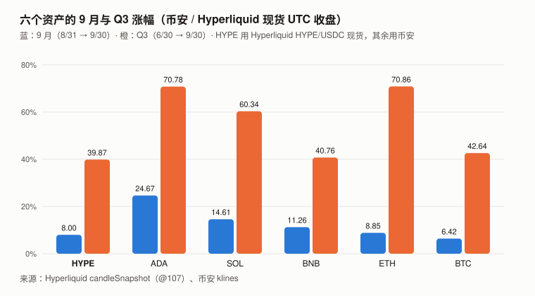
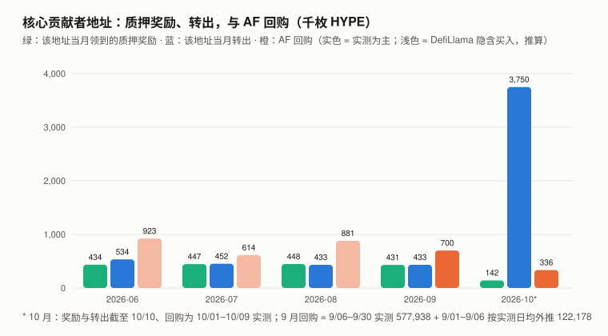
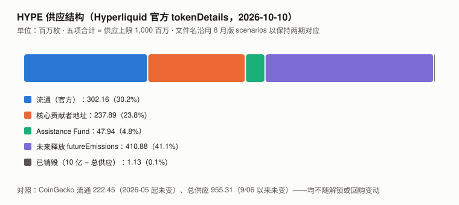

# HYPE / Hyperliquid 完整调研与分析报告

> **版本**：2026 年 9 月（兼 Q3 回顾）
> **编写日期**：2026 年 10 月 10 日
> **数据截止**：2026-09-30（链上与官方接口快照到 10/10）
> **研究方法**：沿用 8 月首期框架。**本期第一次有上期论点可核对。**
>
> **本期核心发现**：
>
> 1. **8 月版和市场一直称为「核心贡献者解锁」的转出，累计量几乎被同一地址的质押奖励抵消。**
>    核心贡献者地址（`0x43e9abea…`）创世收到 238,000,000 枚，全部质押；截至 10/10 累计领到质押奖励 **9,429,967**、累计对外转出 **9,542,470**——**累计转出只比累计奖励多 112,503 枚**。
>    6–9 月每月转出 43–53 万，同月奖励 43–45 万；10/07 那 375 万枚，在量上约等于此前累积未转出的奖励（约 350 万）。
>    ⚠️ **奖励自动复投、与本金混在同一笔委托余额里，链上不能识别转出的币是「奖励」还是「本金」**——**观测**（与读法无关）：该地址的 HYPE 总额截至 10/10 只比创世时少约 11 万枚；**读法**：「本金基本未动」是「奖励优先抵扣」的会计读法。它是「未归属」还是「已归属未转出」，链上同样分不出来。
> 2. **质押奖励是 `futureEmissions` 的一条持续释放通道，而且可以估算**：官方文档写明质押奖励来自该储备；
>    按 10/10 全网质押约 4.40 亿枚与文档公式，**当前奖励排放速度约年化 2.26%、每月约 83 万枚**（估算；奖励自动复投，**不等于同额进入流通**）。
> 3. **Assistance Fund 的回购也测出来了：9 月约 70.0 万枚**（9/06–9/30 实测 577,938 + 9/01–9/06 按实测日均外推）。
>    **与当前奖励排放速度（约 83 万/月）同一量级**；与核心贡献者地址的转出（43.3 万）相比为 **约 162%**——8 月版 H8-3（不会超过 150%）**按推算判 ❌**（实测部分为 133%，触线依赖 9/01–9/06 的外推）。
> 4. **两处更正必须说清方向**：① **AF 就是销毁**——官方文档原文：「HYPE in the assistance fund is burned, removing the tokens permanently from the circulating and total supply」；
>    但官方 `tokenDetails` 接口的 `totalSupply` 没有扣 AF，**两个官方口径不一致**；CoinGecko 的总供应 9/06 以来没动过。
>    ② **初稿一度写「实际进入 AF 的只有 DefiLlama 口径的 81%」——撤回**：10/01–10/09 的样本外检验得到 1.557，两窗口合计 0.985；**结果与时点错配的解释相容，但不能据此识别原因**。
> 5. **价格：9 月 +8.00%（BTC +6.42%），Q3 +39.87%（BTC +42.64%），9/23 创历史新高 $97.89。** 一年 beta 1.061、R² 0.262。
>    **8 月版的 +52.42% 是 7/31 → 8/30（CoinGecko 00:00 点代表前一日收盘），按 7/31 → 8/31 收盘应为 +60.30%。**
>
> **本期核心判断**：**核心贡献者地址和 AF 这两块，用官方接口测得准；8 月版没去测。**
> 测准之后：**当前约 83 万/月的奖励排放估计与约 70 万/月的回购同一量级**；而**真正悬着的是那 2.38 亿——按会计读法它至今基本没有流出**。
> **若按解锁日历的名义节奏（每月约 992 万枚）开始流出，每月约 992 万，约为当前全网奖励排放估计（约 83 万）的 12 倍；若不流出，回购与奖励排放同一量级。本报告不知道是哪一个。**
>
> ⚠️ **本报告仍不给目标价**，见第 9 章。
>
> **免责声明**：本报告不构成任何投资建议。所有分析仅供研究参考。

---

## 核心结论摘要（一页速览）

| 维度 | 核心判断 |
|------|----------|
| **当前价格位置** | 9/30 收盘 **$90.89**；10/10 CoinGecko $83.69、市值 $186.2 亿（第 11）、FDV $799.5 亿。**9/23 创 ATH $97.89**（Hyperliquid 现货盘中） |
| **9 月 / Q3** | **+8.00% / +39.87%**（BTC +6.42% / +42.64%）；beta 1.061、**R² 0.262**；9 月较 beta 缩放的 BTC 收益高约 1.2pp，Q3 低约 5.4pp |
| **供应结构（官方接口）** | 流通 3.022 亿 / 核心贡献者地址 2.379 亿 / AF 0.479 亿 / `futureEmissions` 4.109 亿 / 已销毁 0.011 亿（接口口径，AF 未计入销毁） |
| **核心贡献者地址** | 累计转出 9,542,470 ≈ 累计质押奖励 9,429,967；**HYPE 总额只比创世少 112,503**（观测） |
| **当前奖励排放速度（全网，估算）** | 10/10 全网质押约 4.40 亿 → 年化约 2.26% → **每月约 83 万枚**（自动复投，不等于同额进入流通） |
| **AF 回购** | **9 月约 70.0 万枚**（其中 57.8 万实测）；10/01–10/09 实测 33.6 万 |
| **回购 vs 排放** | 9 月回购 ÷ 当前月均排放估计 ≈ **85%**；9 月回购 ÷ 核心地址转出 ≈ **162%**（推算） |
| **归持有人收入（DefiLlama）** | 9 月 **$7,419 万**（2025-12 以来最高）；12 个月 **$7.140 亿**；9/06–10/09 合计比值约 0.99，**端点时点差可造成约 ±15% 偏差，只能说同一量级** |
| **业务规模（官方 API，10/10 单点）** | OI **$118.9 亿**、24h 名义成交 **$30.3 亿**、234 个永续市场 |
| **竞争** | Aster + Lighter 9 月归持有人收入合计为 Hyperliquid 的 **9.1%** |
| **估值锚** | FDV ÷ 12 个月归持有人收入：**121.6 倍**（CoinGecko 总供应）/ **127.2 倍**（官方接口总供应），9/30 价格 |
| **本报告给目标价** | **否**，见第 9 章 |

---

## 1. Hyperliquid 的起源与设计取舍

起源与三个技术取舍（自建 L1、全链上订单簿、协议收入回购代币）与 8 月版相同，不再重复。

### 1.4 本期补：供应结构的官方拆分（8 月版下期清单第二优先）

8 月版写道：「未流通份额中除核心贡献者约 2.37 亿枚外，其余约 6 亿枚的类别与释放时间表完全未获取」。
**Hyperliquid 官方接口 `info` 的 `tokenDetails`（tokenId `0x0d01dc56dcaaca66ad901c959b4011ec`）直接返回：**

| 字段（2026-10-10） | HYPE | 占上限 |
|---|---:|---:|
| `maxSupply` | 1,000,000,000 | 100% |
| `totalSupply` | 998,870,656 | 99.89% |
| **`circulatingSupply`** | **302,164,310** | **30.2%** |
| `futureEmissions` | 410,875,058 | 41.1% |
| `nonCirculatingUserBalances`：`0x43e9abea…f8a251`（核心贡献者，见第 5 章） | 237,887,493 | 23.8% |
| `nonCirculatingUserBalances`：`0xfefe…fefe`（Assistance Fund） | 47,942,119 | 4.8% |
| `nonCirculatingUserBalances`：零地址与 `0x…dead` | 1,676 | 0.0% |

> **接口自洽**：302,164,310 + 285,831,288（非流通合计，含 1,676）+ 410,875,058 = 998,870,656（原始精度下差约 7×10⁻⁸）。
> ⚠️ **这是接口的定义恒等式（流通 = 总供应 − 非流通 − 未来排放），不是独立验证。**
> 上限与 `totalSupply` 之差 1,129,344 是接口口径的已销毁量——**它没有计入 AF**，与官方文档「AF 中的 HYPE 已销毁」的定义不一致（第 4 章）。
>
> **`futureEmissions` 不是「静止的储备」**：官方质押文档写明「Staking rewards come from the future emissions reserve. Rewards are accrued every minute and distributed to stakers every day」——
> **它每天都在以质押奖励的形式释放**（第 5.3 节测算）。其余用途（社区奖励等）的构成与节奏，接口未给出。

---

## 2. HYPE 的发展阶段划分

阶段一（空投与冷启动，2024.11–2025 上半年）、阶段二（永续 DEX 份额争夺，2025）与 8 月版相同。

### 阶段三：cliff 到期之后（2025.11– 至今）——本期更正

| 时点 | 事件 | 来源 |
|------|------|------|
| 2024-11-29 | 核心贡献者地址创世收到 238,000,000 枚，此后全部质押，每月领约 44 万枚奖励 | 链上一手 |
| 2025-11 | cliff 到期，该地址**首次转出 1,745,745 枚**（此前已累计约 491 万枚奖励未动） | 链上一手 |
| 2026-01 | 转出 1,125,766 枚 | 链上一手 |
| 2026-02 至 09 | 每月转出 14.0 万 → 53.4 万，**与当月奖励（40–45 万）同一水平** | 链上一手 |
| **2026-09-23** | **ATH $97.89**（Hyperliquid 现货盘中；CoinGecko 记 $97.96） | 一手 |
| **2026-10-07** | **一天转出 3,750,000 枚**，在量上超过此前累积未转出的奖励（约 350 万）约 15.5 万 | 链上一手 |

> ⚠️ **更正 8 月版**：8 月版阶段三写「同期每个月都有约 992 万枚解锁」——那是第 5 章已撤回的机械平均。
> **本期进一步发现：「175 万」「120 万」这些被当作实测解锁的转出，在累计量上都被同一地址的质押奖励覆盖——不能证明它们是本金归属。**

---

## 3. HYPE 当前现状分析

### 3.0 论点校验：8 月版登记的 6 条

| # | 论点 | 检验条件（摘要） | 9 月读数 | 判定 |
|---|------|------|------|------|
| **H8-1** | AF 的买入等同销毁，且总供应量会随之持续下降 | 若 2026-12-31 CoinGecko 总供应 > 9.5531 亿则错 | CoinGecko 总供应 **9/06 以来未变**（同期 AF +917,143）；官方文档定义 AF 为销毁，官方接口 `totalSupply` 不扣 AF | **⊘ 检验条件有缺陷**（见下） |
| H8-2 | 实际月度解锁显著低于 992 万枚 | 2026-09 至 12 任一月核心贡献者实际分发 ≥ 500 万则错 | 9 月该地址转出 **433,419**；**10 月截至 10/10 已 3,750,000** | ⏳（10 月须核） |
| **H8-3** | 回购与解锁同一量级（37%–70%） | 2026-12-31 前任一月回购 ÷ 解锁 < 15% 或 > 150% 则错 | **9 月约 700,116 ÷ 433,419 ≈ 162%**（实测部分 133%） | **❌（推算）** |
| H8-4 | 业务不会因竞争快速流失 | 连续两月归持有人收入 < $3,000 万，或 Aster + Lighter > Hyperliquid 的 30% 则错 | 9 月 $7,419 万；Aster + Lighter = **9.1%** | ⏳ |
| H8-5 | FDV / 年化归持有人收入在 80–170 倍 | 2026-12-31 落在区间外则错 | **121.6 倍**（9/30，CoinGecko 总供应口径） | ⏳ |
| H8-6 | 框架存在方向性偏差 | — | 8 月期已判 ❌，并注明需重新设计 | ❌（见记分卡） |

> **H8-3 为什么判 ❌**：
> - **回购**：AF 余额 9/06 05:39 UTC 为 47,024,976（8 月版官方接口读数），**9/30 日末 47,602,914**（官方成交记录的 `startPosition`），**实测增量 577,938**（24.8 天，日均 23,337）；
>   9/01–9/06 05:39（5.235 天）**按同月实测日均外推 122,178**。合计约 **700,116**。
> - **解锁**：按登记时的操作口径（「核心贡献者实际分发量」，8 月版以该地址的转出为观测），9 月转出 **433,419**。**比值约 162%，超过 150%。**
> - **稳健性**：只用实测部分为 133%；要不触线，那 5 天的回购须少于 72,191，即日均低于 13,790，**比同月实测日均低 41%**。改用 DefiLlama 隐含买入（不打折）外推那 5 天，比值为 168%。
> - **判定强度**：实测部分（133%）未触线，**❌ 依赖 9/01–9/06 的外推**——记分卡把它记为「推算判错」，与实测判定分开计。
> - **错在对 HYPE 有利的方向**（回购超过了被称为「解锁」的那部分转出）。
> - ⚠️ **登记时手里就有反向信号**：8 月版 5.2 写着「领域审查称近期单月分发已降至约 43–53 万枚……若属实，回购销毁将超过解锁」——
>   **标了「未验证」，却把论点登记在它的反面（37%–70%）**。教训见 10.3。
>
> **H8-1 为什么判 ⊘**：
> - **登记时就违反门槛 5**：论点说「持续下降」，条件却是「高于 9.5531 亿才错」——**持平也算对**。这个缺陷在登记时就写在记分卡的门槛表里。
> - **统计量失效**：CoinGecko 总供应 9/06 至 10/10 一枚未变，同期 AF +917,143——它不跟踪 AF。
> - **落点无法确定**：登记的统计量是 CoinGecko 总供应，它不动；**换用其他供应口径来判胜负属于事后改口径，本报告不做**。（初稿写「文档 ✅ / 接口 ❌」，被 Codex 指出是事后换口径，已删。）**AF 按官方文档属于销毁，作为独立的机制事实陈述。**
> - ⚠️ **「登记时未知」不成立**：`tokenDetails` 在 9/06 同样可读——**是「可得未查」**。⊘ 的理由是门槛 5 的缺陷 + 统计量失效，不是「未知」。

> **本期新登记两条论点（H9-1 Q4 核心贡献者地址不出现名义节奏量级的流出、H9-2 Q4 每月归持有人收入守住 $5,000 万），拒绝登记一条，见 `../thesis_scorecard.md`。**

### 3.1 价格与市场

> **口径**：HYPE 用 **Hyperliquid 官方 HYPE/USDC 现货（`@107`）UTC 日收盘**（`candleSnapshot`，一手）；BTC 等用币安 UTC 日收盘。HYPE 在币安 9/24 才有日线。

| 指标 | 数值 |
|------|------|
| **9/30 收盘** | **$90.89** |
| 10/10 CoinGecko | 价格 $83.69 / 市值 **$186.2 亿（第 11）** / FDV $799.5 亿 |
| **ATH** | **$97.89（9/23 盘中，Hyperliquid 现货）**；CoinGecko 记 $97.96（9/23 05:16 UTC） |
| 9 月盘中区间 | $74.48（9/17）– $97.89（9/23） |
| **9 月 / Q3** | **+8.00% / +39.87%**（BTC +6.42% / +42.64%） |
| 年初至今 / 近一年 | +257.41% / +101.03%（BTC −4.59% / −26.68%） |

**更正 8 月版的月度涨幅**：

| | 8 月版 | 本期（Hyperliquid 现货收盘） |
|---|---|---|
| 8 月终点 | $80.05（CoinGecko 8/31 00:00 点 = **8/30 收盘**） | **8/31 收盘 $84.16** |
| **8 月涨幅** | +52.42% | **+60.30%** |

> 本期用 Hyperliquid 日线复算 7/31 → 8/30 正好是 +52.42%，支持「终点差了一天」。**XIN、CKB、GRAM 9 月版刚发现同一个错。**
> 8 月版的六资产对照表全部用这个口径，其余五个资产同样受影响。

**风险特征**（2025-09-30 至 2026-09-30，365 天日对数收益）：年化波动率 **93.4%**（BTC 45.0%）、beta **1.061**、**R² 0.262**。

**按月拆开**：

| | 7 月 | 8 月 | 9 月 | **Q3** |
|---|---:|---:|---:|---:|
| BTC | +7.27% | +24.95% | +6.42% | +42.64% |
| HYPE | −19.21% | +60.30% | +8.00% | +39.87% |
| **实际 − beta × BTC** | **−26.9pp** | **+33.8pp** | **+1.2pp** | **−5.4pp** |

> **9 月收益较 beta 缩放的 BTC 收益高约 1.2pp**——这只是累计收益的比较，不是回归预测；R² 0.262 下单月特质波动约 ±23pp，**+1.2pp 不说明「被 BTC 解释」，只说明与 beta 预期吻合**。

### 3.2 六个资产的横向对照

> **口径**：9 月 = 8/31 → 9/30 收盘，Q3 = 6/30 → 9/30，近一年 = 2025-09-30 → 2026-09-30；HYPE 用 Hyperliquid 现货，其余用币安。**8 月版本表用 CoinGecko 00:00 点，两期不可逐格对比。**

| 资产 | **9 月** | **Q3** | 近一年 | beta | R² | 9 月残差 |
|------|---:|---:|---:|---:|---:|---:|
| **HYPE** | **+8.00%** | **+39.87%** | **+101.03%** | 1.061 | 0.262 | **+1.2pp** |
| ADA | +24.67% | +70.78% | −69.45% | 1.419 | 0.649 | +15.6pp |
| SOL | +14.61% | +60.34% | −43.40% | 1.311 | 0.755 | +6.2pp |
| BNB | +11.26% | +40.76% | −23.72% | 0.883 | 0.594 | +5.6pp |
| ETH | +8.85% | +70.86% | −35.20% | 1.283 | 0.823 | +0.6pp |
| BTC | +6.42% | +42.64% | −26.68% | 1.000 | 1.000 | — |

> 图中数字：纵轴 0% / 20% / 40% / 60% / 80%；柱顶为上表的 9 月与 Q3 涨幅。
> **HYPE 仍是六个里唯一近一年为正的（+101.03%），但 Q3 是六个里最低的（+39.87%）。** 9 月各资产残差的差距都在单月噪声范围内。

### 3.3 业务规模（Hyperliquid 官方 API，10/10 单点）

| 指标 | 本期 | 8 月版（9/06 单点） |
|------|---:|---:|
| 永续市场数 | **234** | 233 |
| **全市场未平仓合约** | **$118.9 亿** | $109.53 亿 |
| **24h 名义成交** | **$30.3 亿** | $29.52 亿 |

> 两个单日快照都高于 8 月版，**不足以说明趋势**。

### 3.4 收入（DefiLlama，月度）

| 月份 | 归持有人收入 | 总费用 |
|---|---:|---:|
| 2025-10 | $9,720 万 | $1.248 亿 |
| 2025-11 | $7,765 万 | $1.014 亿 |
| 2026-07 | $3,842 万 | $5,514 万 |
| 2026-08 | $6,136 万 | $7,777 万 |
| **2026-09** | **$7,419 万** | **$9,133 万** |
| **12 个月（2025-10 至 2026-09）** | **$7.140 亿** | |

> **9 月是 2025-12 以来最高的一个月**（2025-11 为 $7,765 万）。
> **DefiLlama 口径与 AF 实测在 9/06–10/09 窗口内同一量级**（合计比值约 0.99；两个单窗口分别偏离约 −13 万、+12 万 HYPE，窗口终点同样受时点差影响，误差约 ±15%；第 4.3 节，描述性结果，不是资金流审计）。

### 3.5 宏观环境

> 与 BTC 9 月版共用（美联储 9/16 加息 25bp 至 3.75–4.00%）。

---

## 4. 回购：Assistance Fund 的实测（本期核心章之一）

### 4.1 余额序列（一手）

| 时点（UTC） | AF 余额 | 来源 |
|---|---:|---|
| 2026-09-06 05:39 | 47,024,976 | 8 月版官方接口读数（本期未保存原始快照） |
| 2026-09-28 19:45 | 47,551,025 | 官方成交记录 `startPosition` |
| **2026-09-30 日末** | **47,602,914** | 同上（10/01 第一笔成交） |
| 2026-10-09 日末 | 47,939,198 | 同上（最后一笔成交后） |
| 2026-10-10 | 47,942,119 | 官方 `tokenDetails` |

| 区间 | 增量 | 日均 |
|---|---:|---:|
| **9/06 05:39 → 9/30 日末**（24.8 天） | **577,938** | **23,337** |
| 10/01 → 10/09 日末 | 336,283 | 37,365 |

> **方法限制**：官方成交接口只返回最近约 1 万笔；9 月只覆盖到 9/28 之后。月末余额可以一手读出（成交附带成交前余额），**月中逐笔不行**；
> 缓存的逐笔成交序列有三处余额连续性缺口（合计 196 枚），**端点余额法可用，逐笔闭合未完成**。

### 4.2 AF 是销毁——但两个官方口径不一致

**官方文档（Trading / Fees 页）原文**：

> 「The assistance fund uses the system address 0xfefefefefefefefefefefefefefefefefefefefe. It converts trading fees to HYPE in a fully automated manner as part of the L1 execution. **HYPE in the assistance fund is burned, removing the tokens permanently from the circulating and total supply.**」

**而官方接口 `tokenDetails` 的 `totalSupply`（998,870,656）没有扣除 AF，把它列在「非流通用户余额」里。**

| 口径 | AF 的处理 | 总供应 |
|---|---|---:|
| 官方文档定义 | 已销毁，移出流通与总供应 | 约 9.509 亿（10 亿 − 接口已销毁 1,129,344 − AF 47,942,119，本报告计算） |
| 官方接口 `totalSupply` | 非流通余额 | 998,870,656 |
| CoinGecko | 不明 | 955,307,079（9/06 以来未变） |

> **所以**：**销毁机制本身成立**（官方文档）；**不能用接口的 `totalSupply` 或 CoinGecko 的总供应去检验它**——前者不扣 AF，后者不动。
> **8 月版用「10 亿 − AF ≈ CoinGecko 总供应（差 0.24%）」证明 CoinGecko 已扣除 AF，这个论证撤回**：
> 一个月后 AF 涨了 92 万，CoinGecko 一枚未动——**它要么是巧合，要么是某个时点人工扣过一次之后冻结，本报告未区分**。
> 初稿据此写「协议自己没有把 AF 当作销毁」——**这是错的，被领域审查（Codex）用官方文档纠正，已撤回。**

### 4.3 实测与 DefiLlama 口径的对照（初稿的「81%」撤回）

| 窗口 | AF 实测增量 | DefiLlama 归持有人收入 ÷ 当日现货开收均价 | 实测 ÷ 隐含 |
|---|---:|---:|---:|
| 9/06 05:39 → 9/30（9/06 收入按 1101/1440 计） | 577,938 | 712,263 | 0.811 |
| 10/01 → 10/09 | 336,283 | 216,013 | **1.557** |
| **合计（约 34 天）** | **914,221** | **928,276** | **0.985** |

> **初稿只用第一个窗口，写「实际进入 AF 的只有 DefiLlama 口径的约 81%」——撤回。**
> 样本外的 10 月窗口给出 1.557，两窗口合计 0.985：**单窗口的偏离与「收入入账与 AF 买入之间存在时点差」的解释相容，但本报告不能据此识别原因**——分母用开收均价折算、首日按时间比例分摊，都是近似。
> **能说的**：在这个约 34 天的窗口里，**合计比值约 0.99，但窗口终点同样受时点差影响（两个单窗口各偏离约 13 万枚，约占合计的 14%），误差约 ±15%——只能说同一量级**；**不能说**「81% 被截留」，也不能说「已完成资金流审计」。
> 官方文档另写「fees are entirely directed to the community (HLP, the assistance fund, and deployers)」——手续费有一部分进入 HLP 与资产部署方；**这与「归持有人收入 ≈ AF 买入」不矛盾，说明 DefiLlama 的归持有人口径已扣除了这些部分（推断）**。

### 4.4 逐月回购

| 月份 | 回购（HYPE） | 口径 |
|---|---:|---|
| 2026-06 | 约 923,373 | DefiLlama 隐含（推算） |
| 2026-07 | 约 613,795 | 同上 |
| 2026-08 | 约 881,340 | 同上 |
| **2026-09** | **约 700,116** | **实测 577,938 + 外推 122,178** |
| 2026-10（1–9 日） | 336,283 | 实测 |

---

## 5. 解锁与释放：核心贡献者地址的账本（本期核心章之二）

### 5.1 8 月版为什么没去测

8 月版第 5 章引用 The Block 的两个数（175 万、120 万），并写「完整归属时间表未公开，任何未来解锁速率都无法测算」。
**核心贡献者地址的进出记录（官方 `userNonFundingLedgerUpdates`，310 条）与质押奖励记录（官方 `delegatorRewards`，651 条）都可以直接拉出来。**

### 5.2 转出几乎等于质押奖励

| 月份 | 该地址质押奖励 | 该地址对外转出 | 累计奖励 − 累计转出 |
|---|---:|---:|---:|
| 2024-12 至 2025-10（11 个月） | 合计 4,466,466 | 0 | 4,466,466 |
| 2025-11 | 444,220 | **1,745,745** | 3,164,940 |
| 2025-12 | 450,889 | 0 | 3,615,829 |
| 2026-01 | 445,515 | **1,125,766** | 2,935,578 |
| 2026-02 | 400,314 | 140,333 | 3,195,559 |
| 2026-03 | 443,788 | 173,217 | 3,466,130 |
| 2026-04 | 431,958 | 333,335 | 3,564,754 |
| 2026-05 | 445,260 | 421,879 | 3,588,135 |
| 2026-06 | 433,874 | 533,752 | 3,488,257 |
| 2026-07 | 446,717 | 452,000 | 3,482,974 |
| 2026-08 | 447,611 | 433,024 | 3,497,561 |
| **2026-09** | **431,099** | **433,419** | 3,495,241 |
| **2026-10（至 10/10）** | 142,256 | **3,750,000** | **−112,503** |
| **累计** | **9,429,967** | **9,542,470** | |

> **对账**：创世 238,000,000 + 质押奖励 9,429,966.70 − 转出 9,542,470 + 流入 0.01 = 237,887,496.72，与官方 `delegatorSummary.delegated` 237,887,492.71 **相差约 4 枚，原因未解释**（再计现货 0.003 枚仍差约 4 枚）。**近似对上，不是严格闭合**；该残差不影响量级判断。
> 初稿把约 943 万的差额写成「疑为质押口径，未解释」——**推理审查指出「943 万 ≈ 累计转出 954 万」本身就是警报**；本期用 `delegatorRewards` 证实：**差额就是累计质押奖励**。
>
> **读法**：
> - **2025-11 至 2026-09，累计转出始终小于累计奖励**（差额约 290 万–360 万）。奖励自动复投、与本金混在同一委托余额里，**链上不能识别转出的是奖励还是本金**——「转出的是奖励」只是「奖励优先抵扣」的会计读法。
> - **10/07 的 375 万**（15 笔：5 笔 × 1 枚测试、5 笔 × 374,999、5 笔 × 375,000，五个新地址各 75 万）在量上超过此前累积的约 350 万奖励——**10/07 转出当时的缺口约 155,113**，此后 10/08–10/10 又到账奖励 42,610，**截至 10/10 缺口为 112,503**。
> - **观测：该地址的 HYPE 总额截至 10/10 只比创世少 112,503 枚**（官方接口可直接读，与读法无关）；**读法：按奖励优先抵扣，本金基本未动。**
> - ⚠️ **不论贴哪个标签，每月转出都是先解除质押、再分给多个个人地址**（8/06 分 9 个、9/06 分 11 个、10/07 分 5 个新地址）——**经济上都是向个人分发、进入流通**，不能因为「在量上是奖励」就打折看待。
>
> ⚠️ **「转出」不等于「解锁」，「本金未动」也不等于「未归属」**：归属是合同层面的，链上看不到；**本金可能已部分归属但仍质押在同一地址**。本报告只能说「它没有流出该地址」。

### 5.3 真正的新增供应：质押奖励

**官方质押文档**：「Staking rewards come from the future emissions reserve... The staking reward rate formula is inspired by Ethereum, where the reward rate is inversely proportional to the square root of total HYPE staked. **At 400M total HYPE staked, the reward rate is approximately 2.37% per year**.」

| 项 | 数值 |
|---|---:|
| 全网质押（官方 `validatorSummaries`，35 个验证者，10/10） | **440,034,967** |
| 按文档公式的年化奖励率（2.37% × √(400M ÷ 440.0M)） | **2.26%** |
| **年化释放 / 月均释放（推算）** | **约 994 万 / 约 83 万** |
| 对照：核心贡献者地址 6–9 月奖励 ÷ 创世本金（近似年化） | 2.22% |

> **核心贡献者地址的近似年化（2.22%，以创世本金为分母）与公式推算（2.26%）接近**，支持这一推算；但验证者佣金、各人质押时长不同，**全网数为推算，未逐个地址加总**。
> **这每月约 83 万枚是按 10/10 质押量估算的当前奖励排放速度**——发给全体质押者，核心贡献者地址约占一半（每月约 44 万）。⚠️ **奖励自动复投；发给被接口列为「非流通」的地址（如核心贡献者地址）的那部分，不等于同额进入流通。**

### 5.4 回购 vs 释放

> 图中数字（千枚）：奖励 434 / 447 / 448 / 431 / 142；转出 534 / 452 / 433 / 433 / 3,750；回购 923 / 614 / 881 / 700 / 336（6–8 月为 DefiLlama 隐含推算，9 月实测为主，10 月为 1–9 日实测）；纵轴 0 / 1,000 / 2,000 / 3,000 / 4,000。

| 9 月 | HYPE |
|---|---:|
| AF 回购 | 约 700,116 |
| 当前月均奖励排放估计（10/10 质押量，非 9 月实际奖励总额） | 约 828,592 |
| **9 月回购 ÷ 当前月均排放估计** | **约 85%** |
| 核心贡献者地址转出 | 433,419 |
| 回购 ÷ 该地址转出 | 约 162% |

> **8 月版的框架是「回购 vs 核心贡献者解锁」。两种分母回答两个问题**：
> - **回购 ÷ 该地址分发（162%，推算）**——对应「进入流通的分发 vs 回购」；
> - **回购 ÷ 全网奖励排放（9 月约 85%，同一量级）**——对应「总供应的增减」（质押奖励发给全体质押者，不只核心贡献者地址）。
> 8 月版只回答了前一个问题，**不是分母选错，是漏了后一个问题**。⚠️ 这是排放量的比较，**不是流通量或卖压的平衡**——奖励自动复投，进入流通的部分未测。
>
> **悬着的是 2.38 亿**：多个解锁日历把它写成「每月名义 992 万枚」（2.38 亿 ÷ 24），**链上至今没有按这个节奏流出**（该地址 HYPE 总额只比创世少约 11 万）。
> 若某天开始按名义节奏流出，每月约 992 万，约为当前全网奖励排放估计（约 83 万）的 12 倍；**若继续不流出，回购与奖励排放同一量级**。

### 5.5 关于 10/07 那笔的二手说法

| 说法 | 来源 | 等级 |
|---|---|:---:|
| 「Hyperliquid Labs 自 9/30 起解除质押 375 万枚用于 10 月团队分配」 | FinanceFeeds、Gate 等报道 | ⚠️ 二手；与链上「10 月质押取出 3,750,000」一致（质押取出有 7 天队列） |
| 「这 375 万全部通过场外协议卖给单一机构买家」（报道称引自联合创始人） | 同上 | ❌ **原帖未打开，本报告不采用**；**即便属实，也只影响二级市场卖压，不影响流通核算** |
| 多个解锁日历把 10/06 列为「名义解锁 992 万枚」 | 解锁日历类网站 | ❌ **正是 8 月版初稿那个机械平均**；链上实际转出 375 万，该地址总额截至 10/10 只比创世少约 11 万 |

---

## 6. 竞争格局

| 协议（DefiLlama 归持有人收入） | 6 月 | 7 月 | 8 月 | **9 月** |
|------|---:|---:|---:|---:|
| **Hyperliquid（全协议）** | $5,996 万 | $3,842 万 | $6,136 万 | **$7,419 万** |
| Aster | $206 万 | $385 万 | $436 万 | $410 万 |
| Lighter | $282 万 | $211 万 | $264 万 | $266 万 |
| **(Aster + Lighter) ÷ Hyperliquid** | 8.1% | **15.5%** | 11.4% | **9.1%** |

> 竞争者份额 7 月升到 15.5% 后回落；H8-4 的判错线（30%）远未触及。三个月序列不足以下结论。

---

## 7. HYPE 的核心价值逻辑

> **评分规则**：星级编码**证据等级**，另列后果量级；同源论据须标注；后果量级依赖未知前提时写成条件式。

### 7.1 多头逻辑

| # | 论据 | 证据等级 | 后果量级 | 说明 |
|---|------|:---:|:---:|------|
| 1 | **归持有人收入规模领先**：9 月 $7,419 万，12 个月 $7.140 亿；**9/06–10/09 合计与 AF 实测买入同一量级（比值约 0.99，误差约 ±15%）** | ★★★★ | 大 | 收入规模为 DefiLlama 一手；与 AF 的对照**只到同一量级** |
| 2 | **9 月回购约为当前奖励排放估计的 85%**，同一量级 | ★★★ | 中 | 回购 9 月实测为主；排放为公式估算。**⚠️ 排放 ≠ 进入流通** |
| 3 | **核心贡献者地址的 HYPE 总额至今几乎未减少**（比创世少 112,503） | ★★★★ | **若持续则大** | 链上一手，对账差约 4 枚。**⚠️ 「本金未流出」是会计读法；不等于未归属**；它是多头，也是空头 #1 的另一面 |
| 4 | **业务规模**：OI $118.9 亿、24h 成交 $30.3 亿 | ★★★ | 中 | 官方 API，**两个单日快照，不说明趋势** |
| 5 | **竞争者份额未扩大**：9 月 9.1% | ★★★★ | 中 | DefiLlama 一手 |

### 7.2 空头逻辑

| # | 论据 | 证据等级 | 后果量级 | 说明 |
|---|------|:---:|:---:|------|
| 1 | **2.38 亿本金悬着**：名义节奏每月约 992 万，约为当前全网奖励排放估计的 12 倍 | ★★★ | **若开始流出则大；不流出则无** | 存量一手；**节奏无任何一手依据**。**与多头 #3 是同一事实的两面** |
| 2 | **`futureEmissions` 4.11 亿**中，除质押奖励（每月约 83 万）外的用途与节奏未知 | ★★★ | 若有其他大额释放则大 | 官方接口给存量、文档给奖励机制；其余未获取 |
| 3 | **Q3 是六个资产里最低的**（+39.87%） | ★★★★ | 小 | 一手；R² 0.262，单季信息量有限 |
| 4 | **收入依赖交易活跃度**：7 月比 9 月低 48% | ★★★★ | 中 | DefiLlama 一手 |
| 5 | **AF 的销毁在两个官方口径里不一致**（文档：销毁；接口：非流通余额） | ★★★★ | 小 | 一手。**只是记账口径冲突，销毁机制本身由文档确认** |

> **多空同源检查**：多头 #3 与空头 #1 是**同一个事实**（按会计读法，2.38 亿至今基本未流出）；多头 #2 的分母就是空头 #2 中已知的那部分释放。

### 7.3 多空之间真正的分歧点

> **8 月版的分歧是「最强现金流 vs 测不准的供应」。本期测准了两块（核心贡献者地址、AF），图景变成：**
> **当前的奖励排放估计（约 83 万/月）与回购（约 70 万/月）同一量级；分歧点是 2.38 亿何时、以什么节奏流出，以及 `futureEmissions` 其余部分的用途。**
> **前者链上可以逐月观察（H9-1），后者本期没有信息。**

---

## 8. HYPE 与其他五个资产的比较

| 指标 | **HYPE** | BTC | ETH | BNB | SOL | ADA |
|------|---|---|---|---|---|---|
| 9 月 | **+8.00%** | +6.42% | +8.85% | +11.26% | +14.61% | +24.67% |
| Q3 | **+39.87%** | +42.64% | +70.86% | +40.76% | +60.34% | +70.78% |
| 近一年 | **+101.03%** | −26.68% | −35.20% | −23.72% | −43.40% | −69.45% |
| beta / R² | 1.061 / 0.262 | 1.000 / 1.000 | 1.283 / 0.823 | 0.883 / 0.594 | 1.311 / 0.755 | 1.419 / 0.649 |
| 回购 / 销毁机制 | **当期收入回购并销毁（文档）** | 无 | 基础费销毁 | 季度库存销毁 | 基础费部分销毁 | 无 |

> 口径同 3.2。**8 月版六资产表须更正**：月度涨幅的 CoinGecko 日界线错误（3.1），以及「净供应方向：可能大幅为正」——已撤回的 992 万/月的残留（11.4）。

---

## 9. 估值：仍不给目标价

### 9.1 FDV 口径

| 口径（9/30 价格 $90.89 × 10/10 供应快照） | FDV | ÷ 12 个月归持有人收入 $7.140 亿 |
|---|---:|---:|
| CoinGecko 总供应 955,307,079 | $868.3 亿 | **121.6 倍**（H8-5 登记口径） |
| 官方接口 `totalSupply` 998,870,656 | $907.9 亿 | **127.2 倍** |
| 官方文档定义（扣除 AF）约 950,928,537 | 约 $864.3 亿 | 约 121.1 倍 |

### 9.2 为什么仍不给目标价

| 8 月版的理由 | 本期状态 |
|---|---|
| ① CoinGecko 流通量不跟踪解锁 | **已绕开**：官方 `circulatingSupply` 一手可读 |
| ② 官方归属时间表未公开 | **转化了**：链上显示核心贡献者地址的 HYPE 总额至今几乎未减少——**问题从「测不准」变成「不知道何时开始」** |
| ③ 约 6 亿枚其余未流通份额未获取 | **大部分解决**：4.11 亿为 `futureEmissions`，已知其通过质押奖励持续排放（当前约 83 万/月，估算）；其余用途未知 |

> **本期不给目标价的理由**：FDV 倍数（约 121–127 倍）给出的是一个**位置**，不是一个**目标**——**本系列没有任何依据确定 HYPE 的「合理倍数」**；
> 而决定单币层结果的最大变量（2.38 亿何时开始流出，名义节奏下每月约为当前全网奖励排放估计的 12 倍）**链上可观察；一个季度以后的时点无法预测**。
> **8 月版 9.4 的情景概率（20/45/35）与 9.5 的「2029 年流通量」表本期不沿用**——它们建立在 CoinGecko 流通口径与已撤回的 992 万/月上。

---

## 10. 投资与风险启示

### 10.1 关键监控指标（本期起全部为一手）

| # | 指标 | 当前值 | 观测方式 |
|---|------|---|---|
| 1 | **核心贡献者地址的 HYPE 总额** | 237,887,493 | 官方 `delegatorSummary`（`delegated` + `undelegated` + `totalPendingWithdrawal`）+ 现货余额——**它若持续下降，就是会计读法下的本金流出** |
| 2 | 该地址月度转出 vs 月度奖励 | 9 月 433,419 vs 431,099 | 官方账本 + `delegatorRewards` |
| 3 | **AF 月末余额** | 9/30 日末 47,602,914 | 官方成交 `startPosition` / `tokenDetails` |
| 4 | **全网质押量与奖励率** | 440,034,967 / 约 2.26% | 官方 `validatorSummaries` |
| 5 | **`futureEmissions`** | 410,875,058 | 官方 `tokenDetails`——**下降速度若明显快于质押奖励，就有其他释放** |
| 6 | 月度归持有人收入 | 9 月 $7,419 万 | DefiLlama |
| 7 | 竞争者份额 | 9.1% | DefiLlama |

### 10.2 风险提醒

1. **2.38 亿的流出时点**（第 5 章）：按会计读法至今几乎未动；若按名义节奏开始，每月约为当前全网奖励排放估计的 12 倍。
2. **`futureEmissions` 除质押奖励外的用途未知。**
3. **收入依赖交易活跃度**：7 月比 9 月低 48%。
4. **本报告自身**：撤回了 8 月版「CoinGecko 已扣除 AF」的验证与初稿的「81%」；更正了 8 月版的月度涨幅与多处 992 万残留（11.4）；**H8-3 判 ❌、H8-1 判 ⊘**。

### 10.3 长期认知

**第一，「转出」不一定是「本金归属」——先查奖励流。** 本期初稿把核心贡献者地址的转出直接读成「实际解锁」，并据此推出「10 月解锁跳升」；
**而 `delegatorRewards` 一查就知道，累计转出几乎被累计奖励抵消。**（第二轮审查又指出：奖励与本金混在同一余额里，「转出的是奖励」也只是会计读法。）推理审查在看到「943 万差额 ≈ 954 万累计转出」时就拉了警报——和 HYPE 首期「992 万 = 2.38 亿 ÷ 24」同型：**完美吻合本应是警报。**

**第二，标了「未验证」的反向信号，不等于可以把论点登记在它的反面。** 8 月版 5.2 写着「近期单月约 43–53 万，若属实回购将超过解锁」，却把 H8-3 登记成「37%–70%」。
**正确做法是先验证它，或至少不把论点押在与它相反的一侧。**

**第三，单窗口的校准系数要做样本外检验。** 初稿的「81%」只用了 24.8 天，10 月 9 天的样本外检验给出 1.557——**一个比例换个窗口就翻转，单窗口比例不能读成结构；偏离与时点差的解释相容，原因未识别。**

**第四，CoinGecko 的 00:00 点是前一日收盘。** 本系列四份报告（XIN、CKB、GRAM、HYPE）的 8 月版都受影响。

---

## 11. 附录

### 11.1 关键数据速查（截至 2026-09-30，快照到 10/10）

| 类别 | 指标 | 数值 | 来源 |
|------|------|------|------|
| 价格 | 9/30 收盘 / 9 月 / Q3 | $90.89 / +8.00% / +39.87% | Hyperliquid 现货 |
| | ATH | $97.89（9/23） | 同上 |
| | 10/10 市值 / FDV / 排名 | $186.2 亿 / $799.5 亿 / 11 | CoinGecko |
| 供应（官方接口） | 总供应 / 流通 | 998,870,656 / 302,164,310 | `tokenDetails` |
| | 核心贡献者 / AF / 未来排放 | 237,887,493 / 47,942,119 / 410,875,058 | 同上 |
| 核心贡献者地址 | 累计奖励 / 累计转出 / 总额较创世 | 9,429,967 / 9,542,470 / −112,503 | 官方账本与 `delegatorRewards`（对账差约 4 枚） |
| 质押 | 全网质押 / 奖励率 / 当前月均排放 | 440,034,967 / 约 2.26% / 约 83 万 | `validatorSummaries` + 文档公式（估算，10/10 快照） |
| 回购 | 9 月 / 10/01–10/09 | 约 700,116 / 336,283 | AF 余额（9 月含外推 122,178） |
| 收入 | 9 月 / 12 个月归持有人 | $7,419 万 / $7.140 亿 | DefiLlama |
| 业务 | OI / 24h 成交 / 市场数 | $118.9 亿 / $30.3 亿 / 234 | 官方 API |
| 估值 | FDV / 12 个月归持有人收入 | 121.6 倍（CoinGecko）/ 127.2 倍（接口） | 计算 |
| 风险 | 波动率 / beta / R² | 93.4% / 1.061 / 0.262 | 365 天 |

> 图中数字（百万枚，括号内为占上限比例）：流通 302.16（30.2%）/ 核心贡献者地址 237.89（23.8%）/ AF 47.94（4.8%）/ 未来释放 410.88（41.1%）/ 已销毁 1.13（0.1%）；对照 CoinGecko 流通 222.45（2026-05 起未变）、总供应 955.31（9/06 以来未变）。
> **图文件名沿用 8 月版的 `scenarios` 以保持两期对应；本期这张图画的是接口口径的供应结构，不是情景**。按官方文档，AF 那一段应视为已销毁。

### 11.2 数据来源与核实状态

| 数据 | 来源 | 核实状态 |
|------|------|:---:|
| 供应拆分 | Hyperliquid 官方 `info` / `tokenDetails` | ✅ 一手（接口自洽，非独立验证） |
| AF 是否销毁 | 官方文档 Trading / Fees 页原文 | ✅ 一手，**与接口 `totalSupply` 口径不一致** |
| 核心贡献者地址账本与奖励 | 官方 `userNonFundingLedgerUpdates`、`delegatorRewards`、`delegatorSummary` | ✅ 一手，**近似对上（差约 4 枚，未解释）** |
| 质押奖励机制与公式 | 官方文档 Staking 页原文 | ✅ 一手 |
| 全网质押量 | 官方 `validatorSummaries` | ✅ 一手；**月释放量为公式推算** |
| AF 月末余额 | 官方 `userFillsByTime` 的 `startPosition`、`tokenDetails` | ✅ 一手；**9/01–9/06 为外推** |
| 价格 | 官方 `candleSnapshot`（`@107`）；其余币安 | ✅ 一手 |
| OI / 成交 / 市场数 | 官方 `metaAndAssetCtxs` | ✅ 一手，单一时点 |
| 收入 / 竞争者 | DefiLlama API | ✅ 一手 API；**与 AF 实测在 34 天合计上同一量级（误差约 ±15%）** |
| 市值 / FDV / CoinGecko 供应 | CoinGecko API | ✅ 一手 API；供应数**不跟踪链上** |
| 10 月「场外卖给单一机构」 | 媒体转述联合创始人 | ❌ **未打开原帖，未采用** |
| `futureEmissions` 除质押奖励外的用途 | — | ❌ 未获取 |
| 2.38 亿本金的归属状态 | — | ❌ **链上不可见**（只能看到未流出） |
| 宏观 | 与 BTC 9 月版共用 | ⚠️ 未重新核实 |

### 11.3 来源偏向声明

1. **本期多空两侧的主要论据都来自 Hyperliquid 官方接口与文档**。**偏向主要来自本报告选择测什么**：我测了核心贡献者地址、AF 与全网质押，**没有测其他大户的流向，也没有测 `futureEmissions` 除质押奖励外的去向**。
2. **初稿的两处撤回方向相同，都已纠正**：初稿「协议不把 AF 当销毁」（对多头不利，错了）、初稿「只有 81% 进入 AF」（对多头不利，错了）——**两处都是被审查纠正的，说明初稿在这一期偏空**。
3. 传统金融机构对 HYPE 的覆盖本期未重新检索。

### 11.4 本版对 8 月版的更正

| # | 8 月版写法 | 更正 | 发现方式 |
|---|------|------|------|
| 1 | 8 月 +52.42%（$52.52 → $80.05） | CoinGecko 00:00 点 = 前一日收盘；**7/31 → 8/31 收盘为 +60.30%**。六资产表全部受影响 | Hyperliquid 现货日线复算 |
| 2 | 4.2「10 亿 − AF ≈ CoinGecko 总供应（差 0.24%），强力支持 AF 已被扣除」 | **撤回该论证**：CoinGecko 总供应一个月不动；**但销毁机制本身成立**（官方文档） | 官方文档 + CoinGecko 复读 |
| 3 | 5.1–5.2「实际分发 175 万、120 万」被当作核心贡献者解锁 | **这些转出在累计量上被同一地址的质押奖励覆盖**；该地址总额截至 10/10 只比创世少 112,503 | `delegatorRewards` 对账 |
| 4 | 5.2「回购 ÷ 解锁 37%–70%」 | 9 月回购 ÷ 该地址转出约 162%（推算）；÷ 当前奖励排放估计约 85% | 链上账本 + 文档公式 |
| 5 | 「官方完整归属时间表未公开 → 无法测算解锁」 | **链上可测「是否流出」；不可测「是否归属」** | 官方账本接口 |
| 6 | 「约 6 亿枚未流通份额类别未获取」 | 4.11 亿 `futureEmissions`（通过质押奖励每日释放）+ 2.38 亿核心贡献者 + 0.48 亿 AF | 官方 `tokenDetails` + 文档 |
| 7 | **第 5 章已撤回 992 万/月，但 2 章阶段三、9.1 催化剂日历、10.1、10.2、10.4、11.2、11.3、8.1/8.2 仍在使用**（「每月约 992 万枚解锁」「回购只能吸收 6.4%–8.5%」「维持现价需市值 3 倍」「净供应可能大幅为正」「期望价格 −63%」） | **全部作废**——本系列 ZEC 期记下的「撤回一个结论 ≠ 让撤回生效」在 HYPE 8 月版再次出现 | 本期回扫 |
| 8 | 记分卡 H8-1 用 CoinGecko 总供应检验「AF 销毁」 | 登记时即违反门槛 5，统计量又失效，**判 ⊘** | 同 #2 |

### 11.5 发布前审查记录

**第 1 层 `verify_report.py`**：初稿 1 处 FAIL（供应结构图的 0.1% 在正文无出处），补图注后 0 FAIL / 1 WARN（来源偏向，各资产共有）。极值断言复算时自查出「9 月收入为 2025-10 以来最高」不成立（2025-11 更高），已改为 2025-12 以来。

**第 2 层 _bian（推理）与第 3 层 Codex（领域，读本地原始数据缓存复算）——第一轮：**

| # | 意见 | 出处 | 处理 |
|---|------|:---:|------|
| 1 | **「协议自己没有把 AF 当作销毁」与官方文档直接冲突** | Codex | ✅ **一手核实官方 Fees 页原文后撤回**；改为「文档定义为销毁，接口 `totalSupply` 不扣，两个官方口径不一致」 |
| 2 | **「转出」被升级为「实际解锁」再升级为「流通量增速」**；943 万差额 ≈ 累计转出 954 万本应是警报 | 两者 | ✅ **用官方 `delegatorRewards` 证实：转出几乎全是质押奖励，本金净减少仅 112,503**——**第 5 章与第 9 章重写**，「10 月解锁跳升」改为「累积奖励清偿」 |
| 3 | 「`futureEmissions` 节奏全然未知」不对：官方文档写明质押奖励来自它 | Codex | ✅ 一手核实质押文档；新增 5.3 测算全网释放（每月约 83 万，推算） |
| 4 | **0.811 是单窗口系数，不能读作资金流审计** | 两者 | ✅ **做了样本外检验**：10/01–10/09 为 1.557，两窗口合计 0.985——**「81%」撤回**；9 月外推改用同月实测日均 |
| 5 | H8-3 的 ❌ 依赖推算 | Codex | 部分接受：外推改用实测日均（162%）；另给 DefiLlama 外推（168%）与「本金」读法（无穷大），**三种都超过 150%，维持 ❌**；_bian 判断推算不循环、稳健性足够 |
| 6 | **H8-1 落点写成「空洞的 ✅」不对**；登记时即违反门槛 5；「登记时未知」应为「可得未查」 | _bian | ✅ 落点改为「取决于官方口径（文档 ✅ / 接口 ❌）」；补门槛 5 缺陷；改「可得未查」 |
| 7 | **第 9 章新理由（流通增速 13% 差）与 FDV 锚矛盾** | _bian | ✅ 撤下该理由；改为「倍数给位置不给目标 + 2.38 亿本金流出时点不可预测」 |
| 8 | **H9-1 又犯无差别原则**（连续第三期） | _bian | ✅ 原论点前提随第 2 条失效，**撤回重写**为「本金 2026 年内不会开始实质流出」（70%，附依据） |
| 9 | H9-2 基率算错（12 个月只有 10 个三月窗口，4 个达标） | 两者 | ✅ 改为 40% |
| 10 | 卷首「测得准」强于正文 | _bian | ✅ 收窄为「核心贡献者与 AF 两块测得准」 |
| 11 | 「9 月几乎完全由 BTC 解释」超出回归结果 | 两者 | ✅ 改为「较 beta 缩放的 BTC 收益高约 1.2pp，与 beta 预期吻合」；对照资产补 R² |
| 12 | H8-3「登记时就已存在的信息」漏了 8 月版自己写的 43–53 万反向信号 | _bian | ✅ 引用 8 月版 5.2 原句，教训改写（10.3 第二） |
| 13 | 10/07 是 15 笔不是 10 笔；「每月等额」过度概括；33.9 万应为 33.6 万；「低于 30%」与正文不一致 | Codex、_bian | ✅ 全部更正 |
| 14 | 「0.24% 吻合是巧合」无判别力 | _bian | ✅ 改为「巧合或一次性人工扣除后冻结，未区分」 |
| 15 | 空头量级未写成条件式；多头 #3 两个快照给五星；接口闭合当成独立验证 | _bian | ✅ 改为条件式、降星、改称「接口自洽」 |
| 16 | SOL 回购 / 销毁机制写「无」 | _bian（事实待核） | ✅ 改为「基础费部分销毁」 |

**第 3 层 Codex——第二轮（复审第一轮修订稿）：**

| # | 意见 | 处理 |
|---|------|------|
| 1 | 「转出全是奖励」过强：奖励自动复投、与本金混在同一余额里，只能说累计量被抵消 | ✅ 全文改为「累计转出 ≈ 累计奖励」+「奖励优先抵扣的会计读法」；补 10/07 当时缺口约 155,113 |
| 2 | H9-1 统计量漏了 `undelegated`，且未写读数方法 | ✅ 补 `undelegated`；写明存量检验、快照或回推方法 |
| 3 | H8-3 的 ❌ 仍依赖外推；「本金读法比值无穷大」不成立 | ✅ 标为「推算判错」（实测部分 133%），与实测判定分开计；删无穷大论证 |
| 4 | 83 万/月是按 10/10 质押量估算的排放速度，不是 9 月实际奖励、也不是净新增流通；「接近平衡」过强 | ✅ 改称「当前月均排放估计」，注明排放 ≠ 进入流通；删「接近平衡」「大致相抵」 |
| 5 | 1.5% 只是描述性吻合，不能证明时点差是原因；记分卡残留「高约 23%」 | ✅ 改为「与时点错配解释相容，不能识别原因」；删残留 |
| 6 | H8-1「文档 ✅ / 接口 ❌」是事后换口径判胜负 | ✅ 删除，落点改为「无法确定」 |
| 7 | 「账闭合了」不准确，仍有约 4 枚未解释 | ✅ 改为「近似对上」 |
| 8 | 速查「各项相加等于总供应」错：已销毁项不在其中 | ✅ 改为「除已销毁项外」 |
| 9 | 第 9 章估值未写明价格与供应的时点 | ✅ 注明「9/30 价格 × 10/10 供应快照」 |

**第 2 层 _bian——第二轮（审 Codex 第二轮修订后的稿子）：**

| # | 意见 | 处理 |
|---|------|------|
| 1 | HTML 是第二轮修订之前生成的，撤回的说法在交付物里还在 | ✅ 重新生成，并对 md、html、svg 做了旧说法 grep |
| 2 | 「8 月版选错了分母」「转出不是解锁」与 H8-2、H8-3 用的操作口径自相矛盾；每月转出都是分给多个个人地址，经济上就是进入流通 | ✅ 改为「两种分母回答两个问题」；10.3 改为「转出不一定是本金归属」；5.2 补分发结构 |
| 3 | H9-1 论点比判错条件宽，「无反向灰区」不成立（11、12 月各 375 万仍判 ✅） | ✅ 论点收窄为「Q4 不出现名义节奏量级的流出」，写明它分不开「没开始」与「小规模开始」；先验 70% → 80% |
| 4 | 「相差 1.5%」精度是虚的：窗口终点同样受时点差影响，误差约 ±15% | ✅ 全文改为「合计比值约 0.99，只能说同一量级」 |
| 5 | 10.3 与速查仍把偏离归因于时点差 | ✅ 改为「与时点差的解释相容，原因未识别」 |
| 6 | 「13 倍」的基数是排放量，却叫「进入可流通的量」 | ✅ 改为数量比较：992 万约为当前全网排放估计的 12 倍 |
| 7 | 「按会计读法」挂在了可观测的地址总额上 | ✅ 观测（总额 −112,503）与读法（本金未动）分开写 |
| 8 | 「无法预测」与 H9-1 的 80% 并存 | ✅ 收窄为「一个季度以后的时点无法预测」 |
| 9 | H9-2 的 40% 没用登记时已有的 10 月前 9 天数据 | ✅ 补上（日均 $214 万 vs 判错线所需 $161 万）与 2025-01 起算的基率 9/19；先验 40% → 50% |
| 10 | 10.4「两处撤回方向相反」与紧接着的「都对多头不利」矛盾 | ✅ 改为「方向相同」 |

_bian 判「无问题」的维度：H8-3 推算判错、H8-1 ⊘、85% 的分子分母可比性（_bian 用该地址 9 月实际奖励按份额放大复算得 85%–88%）。

> 第一轮表中第 2、5、6、8 条与 Codex 第二轮表的「处理」列是当时的写法，已被后续轮次取代，保留原文作为记录。

**第 4 层 _dalin**：待审。

---

> **配套文件**：`hype_questions_summary_202609.md`（简明速查）、`../thesis_scorecard.md`（论点滚动记分卡）。
> 本报告不构成投资建议。
