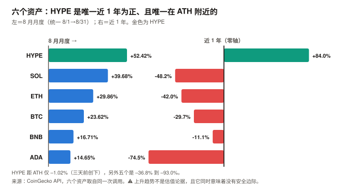

# HYPE / Hyperliquid 完整调研与分析报告

> **编写日期**：2026 年 9 月 6 日
> **数据截止**：2026 年 9 月 6 日（8 月完整月度数据已闭合）
> **研究方法**：沿用本系列前五期框架（BTC / ETH / SOL / ADA / BNB）。**本期是六期以来第一次覆盖「协议」而非「公链」**——Hyperliquid 虽有自建 L1，但其价值几乎全部来自一个永续合约交易所的业务。
> **本期为 HYPE 首期报告**，无上期论点可校验。
>
> **本期核心发现**：
> ① HYPE 现价 **$87.16**，市值 **$193.8 亿（全球第 10）**，**FDV $832.5 亿**。**三天前（2026-09-03）刚创下历史最高价 $88.06，现距其仅 –1.02%**；
> ② **它是本系列六个资产里唯一在上涨的**：8 月 **+52.42%**、近 30 日 +57.77%、近 1 年 **+83.99%**、年初至今 **+230.8%**。另外五个近 1 年全为负（BTC –29.7% 到 ADA –74.5%）；
> ③ **协议规模是真实的，且用一手 API 可验证**：未平仓合约 **$109.53 亿**、24 小时名义成交 **$29.52 亿**（年化约 **$1.08 万亿**）、233 个永续市场；
> ④ **归代币持有人的年化收入 $7.096 亿，是全市场第一**——第二名 Tron 是 $3.02 亿，Uniswap 是 $1.35 亿。**这不是叙事，是 DefiLlama 与 Hyperliquid 官方 API 双源可查的现金流**；
> ⑤ **Assistance Fund 已累计销毁 47,024,976 HYPE（约 $41 亿，相当于当前流通盘的 21.1%）**——本报告用官方 API 查得余额，并用「上限 − AF 余额 ≈ 总供应量」（误差 0.24%）验证它已被当作销毁扣除；
> ⑥ **供应侧的问题主要是不透明，而非量级**：流通仅占总量 23.3%；**回购销毁 64–84 万枚/月 vs 实际解锁 120–175 万枚/月（一手确认的两个观测值），比值 37%–70%**。⚠️ **初稿曾称解锁 992 万枚/月、比值 6.4%–8.5%，那个数字是把总额机械平均得出的，已被一手来源推翻**（团队明确表示归属非线性）。
>
> **本期核心判断**：**HYPE 拥有本系列见过的最强现金流，和最不透明的供应结构。**
> 前者一手可验证、规模全市场第一；后者的问题**不是「稀释大」，而是「测不准」**——
> **官方完整归属时间表未公开，且团队明确表示归属非线性**；未流通份额中除核心贡献者约 2.37 亿枚外，
> **其余约 6 亿枚的类别与释放时间表完全未获取**。
>
> ⚠️ **本报告因此不给出目标价，并撤回了初稿的方向性判断。**
> **唯一可靠的估值锚是 FDV 口径：117.3 倍**——不依赖流通量假设，且在六个资产里偏低
> （BNB 465–699 倍、ETH 约 2,400 倍、TRX 88–103 倍）。
>
> ⚠️ **本期是六期以来审查改动最大的一次**：初稿的核心结论（「年化净稀释 49%」「期望价格 –63%」）
> **建立在一个虚构的解锁速率上，方向可能相反**。详见 11.6。
>
> **免责声明**：本报告不构成任何投资建议。所有分析仅供研究参考，投资决策请咨询专业顾问。

---

## 核心结论摘要（一页速览）

| 维度 | 核心判断 |
|------|----------|
| **HYPE 是什么** | **本系列第一个「协议」而非「公链」标的。** Hyperliquid 是一个永续合约交易所，自建 L1 承载其订单簿。**它的价值几乎全部来自交易业务，不来自通用计算需求**——分析它更接近分析一家交易所，而不是一条链 |
| **当前价格位置** | $87.16，市值 $193.8 亿（第 10），**FDV $832.5 亿**。**距 ATH 仅 –1.02%，而该 ATH 是三天前创下的** |
| **六个资产里的异类** | **唯一在上涨的**：8 月 +52.42%、近 1 年 +83.99%、YTD +230.8%。另外五个近 1 年全为负。**本系列此前五个样本方向完全同质，本期是第一个反向样本** |
| **业务规模（一手可验证）** | 未平仓合约 **$109.53 亿**、24h 成交 **$29.52 亿**（年化约 $1.08 万亿）、233 个永续市场。**take rate 约 6.59 个基点** |
| **最强的一项** | **归代币持有人年化收入 $7.096 亿，全市场第一**（Tron $3.02 亿、Uniswap $1.35 亿、Aerodrome $0.52 亿）。协议费用的绝大部分通过 Assistance Fund 在公开市场买入 HYPE |
| **最弱的一项** | **供应结构的不透明度。** 流通仅占总量 23.3%，**而官方完整归属时间表未公开、且归属非线性**（一手确认）。修正后的回购/解锁比是 **37%–70%**（初稿误称 6.4%–8.5%），**净供应方向落在 –6% 到 +2% 之间，本报告无法确定** |
| **估值锚** | 与 BNB 同属「回购型」，**但资金来源不同**：BNB 的销毁来自**预留供应**（存量，会耗尽），HYPE 的回购来自**当期协议收入**（流量，业务在就持续）。**本报告不主张这是「第六种估值锚」**——它是同一种锚的两个实例。**主口径为 FDV：117.3 倍** |
| **持有人收益率** | **市值口径 3.66%，FDV 口径 0.85%**。对照 BNB 4.20%–4.56%（销毁口径）、Uniswap 3.05%、Tron 0.95% |
| **核心多头逻辑** | 现金流规模全市场第一且一手可验证；take rate 稳定；OI $109.5 亿显示真实深度；AF 已累积 21.1% 流通量的持仓；唯一处于上升趋势的资产 |
| **核心空头逻辑** | **回购吸收不了解锁**（6.4%–8.5%）；距 ATH 仅 –1.02%，无安全边际；FDV 口径收益率仅 0.85%；永续 DEX 赛道竞争者已出现（Aster、Lighter）；收入高度依赖交易活跃度，而这是本系列见过最不稳定的需求 |
| **风险等级** | **与前五个不同类**。它的风险不是「会不会归零」，而是**「极强的业务能不能跑赢一个连规模都测不准的供应释放」**。⚠️ **本报告在发布前审查中撤回了初稿的目标价**——初稿的 –63% 依赖一个 71% 增量无来源的假设 |

---

## 1. Hyperliquid 的起源与设计取舍

### 1.1 一个不融资的交易所

Hyperliquid 的起点与本系列另外五个资产都不同：**它没有向风险投资机构出售过代币**。

| 项目 | Hyperliquid 的选择 |
|------|-----------|
| 融资 | **无 VC 轮次**，团队自筹 |
| 代币分配 | 约 **31%** 通过 2024 年 11 月的空投直接分给用户 |
| 核心贡献者 | 约 **23.8%**（约 2.38 亿枚），一年 cliff 后线性释放 |
| 上线时间 | 2024 年 11 月 TGE，**至今不到两年** |

> **这个选择解释了它的两个特征**：
> ① **没有 VC 解锁砸盘**——但**有核心贡献者解锁，而且规模不小**（第 5 章的全部内容）；
> ② **社区认同度极高**——空投给用户而非机构，这是它早期增长的重要来源。

### 1.2 三个技术取舍

**① 自建 L1，而不是部署在别人的链上**

Hyperliquid 没有选择做以太坊或 Solana 上的应用，而是**自建了一条 L1 来承载订单簿**。

| | 通用 L1（ETH / SOL） | **Hyperliquid L1** |
|---|---|---|
| 目标 | 承载任意应用 | **只为一件事优化：订单簿撮合** |
| 代价 | 通用性带来性能与成本妥协 | **牺牲通用性，换取撮合性能** |
| 结果 | 生态多元 | **生态单一，但主业极强** |

> **这个取舍是本报告分析方法的起点**：**Hyperliquid L1 的月费用只有约 $168 万，而 Perps 业务的月费用是 $6,897 万**——
> **链本身几乎不产生价值，价值全在业务。** 因此本报告不用 BTC / ETH / SOL 那套「链的估值」，而用**交易所的估值方法**。

**② 全链上订单簿，而非 AMM**

多数去中心化交易所用自动做市商（AMM，即用算法池子撮合）。**Hyperliquid 用的是传统的中央限价订单簿（CLOB），但完全在链上运行**。这让它的交易体验接近中心化交易所，也是它能做到 233 个永续市场、$109.53 亿未平仓合约的原因。

**③ 协议收入几乎全部回购代币**

这是它与其他 DeFi 协议最根本的差异，也是第 4 章的主题。

### 1.3 HYPE 代币的三重角色

| 角色 | 说明 | 本期状态 |
|------|------|---------|
| **回购受益凭证** | 协议费用通过 Assistance Fund 在公开市场买入 HYPE | ✅ **归持有人年化收入 $7.096 亿，全市场第一** |
| **质押品** | 质押可降低交易手续费、参与验证 | ✅ 存在庞大的第三方质押池生态 |
| **gas 代币** | 支付 Hyperliquid L1 上的交易 | ⚠️ **量级可忽略**（L1 月费仅约 $168 万，占协议总费用 2.3%） |

> **注意第三项的权重**：与前五个资产不同，**HYPE 的价值几乎不来自「作为 gas 的需求」**。
> 它是一个**业务分红凭证**，不是一个网络使用凭证。

---

## 2. HYPE 的发展阶段划分

### 阶段一：空投与冷启动（2024.11–2025 上半年）

- **2024 年 11 月 TGE**，约 31% 供应通过空投分给早期用户
- **历史最低价 $3.81（2024-11-29）**
- 无 VC 背书，靠产品体验与社区口碑增长

### 阶段二：永续 DEX 的份额争夺（2025）

- Hyperliquid 逐步成为链上永续合约的主导平台
- 协议收入快速增长，Assistance Fund 开始持续回购
- 价格从个位数进入两位数区间

### 阶段三：解锁开启与规模化（2025.11– 至今）

**这是本报告关注的阶段，两条曲线同时启动**：

| 时点 | 事件 |
|------|------|
| **2025 年 11 月** | 核心贡献者的**一年 cliff 到期**，开始按月线性释放（每月 6 日） |
| 2026-01-01 | 价格 $25.44（市值 $60.65 亿） |
| 2026-06-01 | 价格 $72.03（市值 $160.23 亿） |
| 2026-07-01 | 价格 $64.97 |
| **2026-08-01** | 价格 **$52.52**（8 月起点，市值 $116.84 亿） |
| **2026-08-06** | 8 月解锁日，价格 $56.92 |
| **2026-08-31** | 价格 **$80.05**，**月度 +52.42%** |
| **2026-09-03** | **创历史最高价 $88.06** |
| **2026-09-06** | 9 月解锁日，价格 $85.41 |

> **阶段三的定性**：**业务增长与供应释放在同时加速。**
> 2026 年 1 月至今价格涨了 230.8%，**而同期每个月都有约 992 万枚解锁。**
> **这说明需求侧到目前为止吸收了供应侧——但第 5 章会说明，这个吸收不是靠回购完成的。**

---

## 3. HYPE 当前现状分析

### 3.1 价格与市场

| 指标 | 数值 | 口径 |
|------|------|------|
| **现价** | **$87.16** | CoinGecko API，2026-09-06 05:39 UTC |
| 市值 | **$193.84 亿**（全球第 **10**） | 同上 |
| **完全稀释估值（FDV）** | **$832.48 亿** | 同上 |
| 24 小时成交额 | $8.19 亿 | 同上 |
| **流通量 / 总量 / 上限** | **2.2245 亿 / 9.553 亿 / 10 亿** | 同上 |
| **流通占总量比例** | **23.3%** | 同上 |
| **历史最高价** | **$88.06（2026-09-03，三天前）** | 同上 |
| **距 ATH** | **–1.02%** | 同上 |
| 历史最低价 | $3.81（2024-11-29） | 同上 |
| 近 30 日 | **+57.77%** | 同上 |
| 近 200 日 | **+196.42%** | 同上 |
| **近 1 年** | **+83.99%** | 同上 |

**2026 年内轨迹**（CoinGecko 日线，一手）：

| 时点 | 价格 | 市值 |
|------|------|------|
| 1/1 | $25.44 | $60.65 亿 |
| 3/1 | $31.28 | $74.56 亿 |
| 5/1 | $39.69 | $94.62 亿 |
| 6/1 | $72.03 | $160.23 亿 |
| 7/1 | $64.97 | $144.52 亿 |
| **8/1** | **$52.52** | $116.84 亿 |
| **8/31** | **$80.05** | $178.06 亿 |
| 9/1 | $84.16 | $187.20 亿 |

| 指标 | 数值 |
|------|------|
| **年初至今（YTD）** | **+230.8%** |
| **8 月月度** | **+52.42%**（月内低 $52.16 / 高 $84.68） |

### 3.2 六个资产的横向对照

> ⚠️ **口径声明**：8 月月度涨幅**全部统一为 8/1→8/31**（CoinGecko 一手，同一次调用）。
> 本系列在 ETH 期出过一次口径混用的错误，此后每期都做此声明。

| 资产 | **8 月月度** | 市值 | 排名 | 距 ATH | **近 1 年** |
|------|---:|---|:---:|---:|---:|
| **HYPE** | **+52.42%** | **$193.8 亿** | **10** | **–1.02%** | **+83.99%** |
| SOL | +39.68% | $620.7 亿 | 7 | –63.9% | –48.2% |
| ETH | +29.86% | $3,057.7 亿 | 2 | –49.3% | –42.0% |
| BTC | +23.62% | $1.601 万亿 | 1 | –36.8% | –29.7% |
| BNB | +16.71% | $1,014.4 亿 | 4 | –44.4% | –11.1% |
| ADA | +14.65% | $81.6 亿 | 19 | –93.0% | –74.5% |

> **这张表说明了本期的特殊性**：
> **HYPE 是六个资产里唯一近 1 年为正的（+83.99%），也是唯一距 ATH 不足 5% 的（–1.02%）。**
> 另外五个的距 ATH 区间是 –36.8% 到 –93.0%。
>
> **这对本系列的方法论有直接含义**：**前五期的样本方向完全同质（全是深度回撤资产），本期是第一个反向样本。**
> **但要小心一个推理陷阱**：不能因为「加入了一个上涨样本」就宣称框架经受住了检验——
> **本报告在记分卡 H8-6 中预先写死了判定条件**，避免事后自我确认。

### 3.3 业务规模：一手 API 可验证

**以下数据直接调用 Hyperliquid 官方 API（`api.hyperliquid.xyz/info`）取得**：

| 指标 | 数值 |
|------|------|
| 永续市场数量 | **233 个** |
| **全市场未平仓合约（OI）** | **$109.53 亿** |
| **24 小时名义成交额** | **$29.52 亿** |
| 年化名义成交额（按 24h 外推） | 约 **$1.08 万亿** |

**协议费用与收入**（DefiLlama API，一手；口径区分沿用本系列纪律）：

| 口径 | 30 天 | 过去 12 个月 |
|------|---|---|
| **总费用（Fees）** | **$7,171 万** | $9.459 亿 |
| **协议收入（Revenue）** | **$5,535 万** | **$7.096 亿** |
| **归代币持有人（Holders Revenue）** | **$5,535 万** | **$7.096 亿** |

> **一个关键的口径事实**：**Hyperliquid 的 Revenue 与 Holders Revenue 完全相同**——
> 意味着**协议收入几乎全额流向代币持有人**（通过 Assistance Fund 回购），中间没有截留。
> **这在本系列覆盖的资产里是独一份**：
> ETH 的持有人收入只占其 L1 费用的一小部分；BSC 的 gas 费只有 10% 进入销毁；Uniswap 的持有人收入只占总交易费的 7.8%。

**take rate（收费率）**：年化收入 $7.096 亿 ÷ 年化名义成交 $1.08 万亿 = **约 6.59 个基点**。
作为参照，中心化交易所的永续合约 taker 费率通常在 2–7.5 个基点区间——**Hyperliquid 的收费水平处于行业常规区间内，不是靠高收费支撑收入，而是靠成交量。**

### 3.4 归持有人收入：全市场第一

**这是本报告最硬的一组数据**（DefiLlama holdersRevenue 口径，一手）：

| 协议 / 链 | 年化归持有人收入 | 市值 | **收益率（市值）** | **收益率（FDV）** |
|------|---:|---:|---:|---:|
| **Hyperliquid（HYPE）** | **$7.096 亿** | $193.8 亿 | **3.66%** | **0.85%** |
| Tron（TRX） | $3.022 亿 | $316.8 亿 | 0.95% | 0.95% |
| pump.fun（PUMP） | $3.224 亿 | $15.7 亿 | 20.56% | 9.73% |
| Uniswap（UNI） | $1.350 亿 | $44.3 亿 | 3.05% | 2.13% |
| Aerodrome（AERO） | $0.523 亿 | $5.3 亿 | 9.79% | 4.89% |
| Ethereum（ETH） | $0.311 亿 | $3,057.7 亿 | 0.01% | 0.01% |
| BSC gas（BNB） | $0.211 亿 | $1,014.4 亿 | 0.02% | 0.02% |

> **绝对规模上 HYPE 是全市场第一，是第二名 Tron 的 2.3 倍。**
>
> ⚠️ **但收益率不是第一，而且两个口径差距巨大**：市值口径 3.66%，**FDV 口径只有 0.85%**——
> **差 4.3 倍，全部来自 23.3% 的流通比例。** 这个差距正是第 5 章的主题。
>
> ⚠️ **另需说明**：**BNB 的 4.20%–4.56% 不在此表口径内**——它的季度销毁来自**预留供应**而非当期协议收入，
> DefiLlama 的 holdersRevenue 只统计到 BSC gas 中被销毁的那 0.02%。**两者不可直接比大小**（见 8.2）。

### 3.5 宏观环境

| 因素 | 状态（9 月初） | 影响 |
|------|--------------|------|
| 联邦基金利率 | 3.50–3.75% | — |
| **9 月加息概率** | **65.9%**（CME FedWatch，8/31） | 利空 |
| PCE 通胀 | 3.7%（12 个月）/ 4.1%（6 个月） | 支持加息 |
| 10 年期美债 | 4.79% | 与 HYPE 的 3.66%（市值口径）直接竞争 |
| 8 月流动性事件 | 财政部加倍长端国债回购 | 六个资产 8 月普涨的共同触发因素 |

> **但要指出 HYPE 与另外五个的一个差异**：**它 8 月涨 52.42%，远超同源普涨的幅度**（BTC +23.62%）。
> **超出部分不能用宏观解释**，需要业务或供需侧的原因——本报告未能确定该原因，**这是一处明确的分析缺口**。

---

## 4. 收入与回购：Assistance Fund（本期核心章之一）

> ⚠️ **本章在发布前审查中被整章重写。** 初稿把 Assistance Fund 描述为「持有 4,702 万枚的买盘主体」，
> **这是错的**——领域审查指出该地址无私钥，其余额**已被正式视为销毁**。详见 4.2。

### 4.1 机制

Hyperliquid 把协议费用导入 **Assistance Fund（AF）**，由其在公开市场买入 HYPE，**买入的代币进入无私钥地址，等同销毁**。

| 项目 | 内容 | 证据等级 |
|------|------|:---:|
| 费用去向 | 协议费用的绝大部分用于公开市场买入 HYPE | ✅ DefiLlama 的 Revenue 与 Holders Revenue 相同（$7.096 亿/年） |
| 买入后处置 | **进入无私钥地址，视同销毁** | ✅ **可由供应量算术验证（见 4.2）** |
| 具体比例 | 媒体报道 97%–99% | ⚠️ 二手，本报告未打开官方文档确认 |

> ⚠️ **一处初稿的推理错误需要更正**：初稿把「DefiLlama 的 Revenue 与 Holders Revenue 完全相同」
> 当作「协议收入全额流向持有人」的**独立印证**。
> **领域审查指出这不成立**——两者相同只是 **DefiLlama 适配器的分类结果**，不是第二个数据源。
> **它不能作为交叉验证使用。**

### 4.2 AF 余额等同销毁：一个可验证的算术

**本报告通过 Hyperliquid 官方 API 查得 AF 地址（`0xfefe…fefe`）余额为 47,024,976 HYPE。**
**初稿把它当作「持仓」，并计算「占流通量 21.1%」——这个表述是错的。**

**验证方法**（本报告自行计算）：

| 项目 | 数值 |
|------|---|
| 供应上限 | **10.000 亿** |
| AF 余额 | **0.4702 亿** |
| 上限 − AF 余额 | **9.5298 亿** |
| **CoinGecko 报告的总供应量** | **9.5531 亿** |
| 差额 | 0.0233 亿（**0.24%**） |

> **「上限 − AF 余额」与 CoinGecko 的总供应量误差仅 0.24%。**
> **这强力支持：AF 余额已经被当作销毁，从总供应中扣除了。**
>
> **因此正确的表述是**：AF 累计销毁了 **4,702 万枚**（相当于当前流通盘的 21.1%），
> **而不是「AF 持有流通量的 21.1%」**——它不是一个可以卖出的持仓，是一个已经消失的数量。

**这个更正对报告的影响是正面的，且方向与初稿相反**：

| | 初稿的理解 | 更正后 |
|---|---|---|
| AF 余额性质 | 持仓（潜在卖压或买盘主体） | **已销毁（永久移除）** |
| 对供应的影响 | 中性（只是换手） | **永久减少** |
| HYPE 的机制 | 回购持有 | **回购并销毁** |

> ⚠️ **连带更正一处对 BNB 的比较**：领域审查指出，**BNB 的 Auto-Burn 是公式化的库存销毁**（销毁预留供应），
> **而 HYPE 是费用驱动的市场买入后销毁**。
> **就机制而言，HYPE 比 BNB 更接近传统意义上的「回购注销」**——初稿把两者的优劣关系讲反了。

### 4.3 回购销毁的规模

| 步骤 | 计算 | 结果 |
|------|------|------|
| 月度归持有人收入 | DefiLlama 一手 | **$5,535 万** |
| 按现价 $87.16 折算 | $5,535 万 ÷ $87.16 | **约 63.5 万枚/月** |
| 按 8 月均价约 $66 折算 | $5,535 万 ÷ $66 | **约 83.9 万枚/月** |

**因此月度回购销毁规模约为 64–84 万枚。**

---

## 5. 解锁：初稿在这一章犯了本期最严重的错误

> ⚠️ **本章是六期以来单章改动最大的一次。初稿的核心数字是虚构的，结论方向是反的。**

### 5.1 初稿错在哪里

**初稿写道：「核心贡献者每月解锁约 992 万枚」，并据此得出「回购只能吸收解锁的 6.4%–8.5%」「年化净稀释约 49%」。**

**领域审查指出，这个数字是把总分配额机械平均得出的**：2.38 亿枚 ÷ 24 个月 ≈ 992 万枚/月。

**而一手来源证明这个平均不成立**：

| 事实 | 来源 | 证据等级 |
|------|------|:---:|
| 核心贡献者约 **2.37 亿枚**，一年 cliff 后 **24 个月**归属 | The Block 报道 | ✅ 打开原文 |
| **团队明确表示「归属不是线性的」** | 同上，引述团队成员原话 | ✅ 打开原文 |
| 实际分发：**2025-11-29 约 175 万枚** | 同上 | ✅ |
| 实际分发：**2026-01-06 约 120 万枚** | 同上 | ✅ |
| **完整归属时间表未公开** | 同上明确指出 | ✅ |

> **实际已知的单月分发量是 120–175 万枚，而初稿假设的是 992 万枚——高估了 5.7–8.3 倍。**

### 5.2 修正后的量级对照

| 项目 | 枚数/月 |
|------|---:|
| **回购销毁**（收入侧推算） | **约 64–84 万枚** |
| **实际解锁**（已知的两个月度观测值） | **约 120–175 万枚** |
| **回购 / 解锁** | **约 37%–70%** |

> **初稿说这个比值是 6.4%–8.5%，修正后是 37%–70%——相差约一个数量级。**
>
> **而且方向可能进一步翻转**：领域审查称近期单月分发已降至约 43–53 万枚
> （**本报告未能独立验证该数字**）。**若属实，回购销毁将超过解锁，HYPE 处于净通缩。**

**三种情形下的净供应方向**：

| 假设的月度解锁 | 回购销毁 | 净变化 | 年化（相对流通 2.2245 亿） |
|---:|---:|---:|---:|
| 175 万枚（2025-11 实测） | 64–84 万枚 | –91 至 –111 万枚 | **约 –5% 至 –6%（稀释）** |
| 120 万枚（2026-01 实测） | 64–84 万枚 | –36 至 –56 万枚 | **约 –2% 至 –3%（稀释）** |
| 43–53 万枚（审查所称近期值，未验证） | 64–84 万枚 | **+11 至 +41 万枚** | **约 +0.6% 至 +2.2%（通缩）** |

> **结论从「年化净稀释 49%」修正为「在 –6% 到 +2% 之间，方向取决于未验证的近期解锁速率」。**
> **这是一个数量级的修正，且方向可能相反。**

### 5.3 为什么初稿会错，以及它暴露了什么

**这个错误不是笔误，它有一条完整的因果链**：

1. 搜索摘要给出「每月约 992 万 HYPE」；
2. 我没有核实它是**实测值**还是**机械平均值**；
3. 它与「2.38 亿 ÷ 24 个月」完全吻合——**这个吻合本应引起警觉，反而被当成了印证**；
4. 更关键的是：**报告自己的数据里有反证而我没用**——3.1 表反推的 CoinGecko 流通量在 2026 年不升反降，
   与「每月新增 992 万枚」直接冲突。**初稿在记分卡里写的却是「没有任何东西可以交叉验证它」。**

> **本系列在 ADA 期的教训是「多家媒体一致 ≠ 事实」，在 ETH 期的教训是「没看自己的表」。**
> **本期两个错误同时犯了：既信了未经核实的二手数字，又没用自己表里的反证。**

### 5.4 现在能说什么、不能说什么

**能说的**：
- 核心贡献者分配约 2.37 亿枚、一年 cliff、24 个月归属期——**一手确认**
- 归属**非线性**，团队明确表态——**一手确认**
- 已知的两个月度分发量：175 万枚、120 万枚——**一手确认**
- 回购销毁约 64–84 万枚/月——收入侧推算
- **两者在同一量级，回购/解锁约 37%–70%**

**不能说的**：
- **任何关于未来月度解锁速率的精确数字**——完整时间表官方未公开
- **任何 2029 年的流通量推算**——见第 9 章
- **净供应的方向**——它落在 –6% 到 +2% 之间，取决于本报告未能验证的近期速率

---

## 6. 竞争格局

### 6.1 永续 DEX 赛道已经出现同类

**Hyperliquid 不再是这个赛道里唯一的玩家**（DefiLlama holdersRevenue，30 天，一手）：

| 协议 | 归持有人 30 天 | 市值 | 收益率（市值） |
|------|---:|---:|---:|
| **Hyperliquid Perps** | **$5,328 万** | $193.8 亿 | 3.66%（全协议口径） |
| Aster Spot | $460 万 | $21.7 亿 | 2.58% |
| Lighter Perps | $285 万 | 未获取 | — |

> **规模上 Hyperliquid 仍是压倒性的**（是 Aster 的 11.6 倍），
> **但赛道已经不是空白**。永续合约交易所的技术壁垒不像 L1 那样依赖网络效应的长期积累——
> **本报告认为这是 HYPE 最容易被低估的风险**：它的护城河是产品与流动性深度，**而这两者都可以被资本快速攻击**。

### 6.2 与中心化交易所的对照

Hyperliquid 的 take rate 约 **6.59 个基点**，处于中心化交易所永续合约费率的常规区间内。
**这说明它的收入不是靠高收费，而是靠成交量**（年化约 $1.08 万亿）。

> **一个有利的结构性事实**：Binance 的衍生品业务规模远大于 Hyperliquid（2026 Q1 约 $4.9 万亿季度成交），
> **但 BNB 持有人无法直接分享该业务的收入**——BNB 的销毁来自预留供应，不是交易所利润的直接分配。
> **HYPE 持有人则直接获得协议收入的全部。** 这是 HYPE 相对 BNB 在**价值捕获机制**上的真实优势。

---

## 7. HYPE 的核心价值逻辑

### 7.1 多头逻辑

| # | 论点 | 强度 | 说明 |
|---|------|:---:|------|
| 1 | **归持有人收入全市场第一，且一手可验证** | ★★★★★ | 年化 **$7.096 亿**，是第二名 Tron（$3.02 亿）的 2.3 倍。**Revenue 与 Holders Revenue 完全相同——协议收入几乎全额流向持有人，本系列六个资产里独一份** |
| 2 | **业务规模真实，非叙事** | ★★★★★ | Hyperliquid 官方 API 一手：OI **$109.53 亿**、24h 成交 **$29.52 亿**、233 个市场。take rate 6.59bp 处于行业常规区间 |
| 3 | **AF 已累积流通量的 21.1%** | ★★★★☆ | 链上实测持有 **47,024,976 枚**（约 $41 亿）。**这是一个持续存在的买盘主体**（但见 5.2 的量级限定） |
| 4 | **六个资产里唯一处于上升趋势** | ★★★☆☆ | 近 1 年 +83.99%、YTD +230.8%、距 ATH –1.02%。**降为三星的理由**：趋势不是估值论据，且「距 ATH 仅 1%」同时意味着**没有任何安全边际** |
| 5 | **无 VC 解锁** | ★★☆☆☆ | 未做过 VC 轮次。**但降为两星**：它有核心贡献者解锁，规模并不小于典型 VC 解锁（见第 5 章） |

### 7.2 空头逻辑

| # | 论点 | 强度 | 说明 |
|---|------|:---:|------|
| 1 | ~~回购吸收不了解锁~~ | **已删除（被一手来源推翻）** | 初稿为五星级论据，称吸收率 6.4%–8.5%。**修正后为 37%–70%**，且 AF 买入等同销毁。**这条空头论据不再成立，删除它同时移除了初稿方向性判断的主要支柱**（详见 5.1、11.6） |
| 2 | **FDV 口径下收益率只有 0.85%** | ★★★★☆ | 市值口径 3.66%，**FDV 口径 0.85%**——差 4.3 倍，全部来自 23.3% 的流通比例。**FDV/年化收入 117.3 倍**。⚠️ **注意本条与第 3 条是同一个事实（流通占比 23.3%）的两种呈现，不是两条独立证据** |
| 3 | **供应释放的规模无法测算** | ★★★☆☆ | **官方完整归属时间表未公开，团队明确表示归属非线性**；未流通份额中约 6 亿枚的类别未获取。**这不是「稀释很大」，而是「测不准」——它使任何长期目标价都不可靠**（第 9 章因此不给目标价） |
| 4 | **距 ATH 仅 –1.02%，无安全边际** | ★★★★☆ | 三天前刚创 ATH。**本系列另外五个的距 ATH 区间是 –36.8% 到 –93.0%**——HYPE 是唯一一个在高位的 |
| 5 | **赛道竞争者已出现** | ★★★☆☆ | Aster、Lighter 等已有可观收入。**永续 DEX 的护城河是产品与流动性，两者都可被资本快速攻击** |
| 6 | **收入依赖交易活跃度** | ★★★☆☆ | 收入 = 成交量 × 6.59bp。**加密交易量是本系列见过最不稳定的需求**（SOL 8 月版：网络收入同比 –87%） |

### 7.3 多空对照

> **多头买的是「全市场最强的现金流」；空头卖的是「这份现金流的每一分钱，都要摊到一个三年内可能扩大三倍的分母上」。**

**两者都成立，而且它们不冲突**——这正是本期的特殊之处：

| | 业务侧 | 供应侧 |
|---|---|---|
| 证据 | **一手 API，全市场第一** | **二手数据，但量级悬殊** |
| 方向 | **强** | **极差** |

> **所以对 HYPE 的判断，不是「业务好不好」（好，且可验证），而是「业务能不能跑赢稀释」。**
> **第 9 章把这个赛跑量化。**

---

## 8. HYPE 与其他五个资产的比较

### 8.1 六资产核心矩阵

| 指标 | **HYPE** | BTC | ETH | BNB | SOL | ADA |
|------|---|---|---|---|---|---|
| 市值 / 排名 | $193.8 亿 / 10 | $1.601 万亿 / 1 | $3,057.7 亿 / 2 | $1,014.4 亿 / 4 | $620.7 亿 / 7 | $81.6 亿 / 19 |
| **FDV** | **$832.5 亿** | ≈市值 | ≈市值 | ≈市值 | $671.7 亿 | $96.5 亿 |
| **流通/总量** | **23.3%** | ~95% | 100% | **100%** | 92.4% | 83.3% |
| 8 月月度 | **+52.42%** | +23.62% | +29.86% | +16.71% | +39.68% | +14.65% |
| **近 1 年** | **+83.99%** | –29.7% | –42.0% | –11.1% | –48.2% | –74.5% |
| 距 ATH | **–1.02%** | –36.8% | –49.3% | –44.4% | –63.9% | –93.0% |
| **年化归持有人收入** | **$7.096 亿** | 无 | $0.311 亿 | 销毁口径 | $0.268 亿 | 极小 |
| **收益率（市值 / FDV）** | **3.66% / 0.85%** | — | 0.01% | 4.20–4.56%（销毁） | 0.04% | — |
| **净供应方向** | **可能大幅为正** | +0.85% | +0.863% | **–4.56%** | +3.8% | +1.47% |

### 8.2 HYPE vs BNB：本期最有信息量的对照

**两者是本系列仅有的两个「回购型」资产，而它们几乎在每一项上相反。**

| | **HYPE** | **BNB** |
|---|---|---|
| 回购资金来源 | **当期协议收入**（流量，可持续） | **预留供应**（存量，剩 3,316 万枚约 5.5 年耗尽） |
| 归持有人年化 | **$7.096 亿（全市场第一）** | 销毁口径，规模相当但性质不同 |
| **流通占总量** | **23.3%** | **100%** |
| **月度解锁** | **约 992 万枚** | **零** |
| 净供应方向 | **可能为正** | **确定为负（–4.56%）** |
| 距 ATH | **–1.02%（高位）** | –44.4% |
| **FDV / 年化收入** | **117.3 倍** | 465–699 倍 |

> **按估值倍数，HYPE 比 BNB 便宜 4–6 倍**（117 倍 vs 465–699 倍）。
> **按供应结构，BNB 完胜**——零解锁 + 确定通缩 vs 23.3% 流通 + 每月 992 万枚解锁。
>
> ⚠️ **一处必须说明的口径不可比**：**BNB 的 4.20%–4.56% 与 HYPE 的 3.66% 不是同一个东西。**
> BNB 的销毁来自**预留供应**（不是当期收入），HYPE 的回购来自**当期收入**。
> **前者是一个会耗尽的存量，后者是一个随业务波动的流量。** 本报告不对这两个数字做大小排序。

### 8.3 HYPE vs 前五期的方法论意义

**本期是本系列第一个反向样本。**

前五个资产近 1 年全为负（–11.1% 到 –74.5%），**而 HYPE 是 +83.99%**。

> ⚠️ **但必须避免一个推理陷阱**：不能因为「终于覆盖了一个上涨资产」就宣称框架经受住了检验。
> **两种结果都能被解释成框架无恙**：结论偏空可以说「HYPE 确实该看空」，结论偏多可以说「框架不只会讲跌」。
> **一个两种结果都通过的检验，不是检验。**
>
> **本报告因此在记分卡 H8-6 预先写死了判定条件**：
> **若本报告的最终结论为负面，且其空头论据在结构上与前五期同型（估值锚不足 / 供应压力 / 单一依赖），则判定框架存在方向性偏差。**
> **按此标准，本报告的结论恰恰落在「同型」一侧——这一条本期就应记为对框架不利的证据，而不是等到下期。**

---

## 9. 关键变量与三种情景推演

### 9.1 未来 12–18 个月的催化剂日历

| 时点 | 事件 | 方向 | 重要性 |
|------|------|:---:|:---:|
| **每月 6 日** | **核心贡献者解锁（约 992 万枚）** | 利空 | ★★★★★ |
| **约 2027 年 10 月** | **核心贡献者部分解锁完成**（剩余约 1.29 亿枚 ÷ 992 万 ≈ 13 个月） | 关键节点 | ★★★★★ |
| **持续** | 月度归持有人收入能否守住 $5,500 万量级 | 关键 | ★★★★★ |
| **持续** | AF 持仓变化（当前 47,024,976 枚，链上可查） | 关键 | ★★★★☆ |
| **持续** | 永续 DEX 竞争者的份额（Aster、Lighter） | 关键 | ★★★★☆ |
| **2026-09 FOMC** | 加息概率 65.9% | 利空 | ★★★☆☆ |
| 未定 | AQAv2 等新增收入渠道的实际规模 | 观察 | ★★☆☆☆ |

### 9.2 估值方法：不是「第六种锚」

**本报告明确不主张 HYPE 代表一种新的估值锚。**

它与 BNB 同属「回购型」——**用同一把尺（回购/收入相对市值的比率）就能量出两个可比的数字**，
而真正不同的锚是量不出共同数字的（BTC 的稀缺性与 SOL 的网络收入之间没有共同刻度）。

> **本系列在 BNB 期曾把「准股权」称为第五种锚，本期审视后认为那个提法也偏强。**
> 更准确的表述是：**六个资产落在同一个连续谱上——「代币持有人能捕获多少价值、以什么形式捕获」**：
> BTC 零 → ADA 近零 → ETH / SOL 来自增发的转移 → BNB 来自存量销毁 → **HYPE 来自当期收入的回购**。
> **HYPE 在这个谱上的位置最靠前，但它不是一个新的维度。**

**因此本报告沿用 ETH / BNB 期的框架：自身实际交易过的市值区间 × 情景概率，再折算为单币价格。**

**关键的一步在折算——而本报告在这一步遇到了一个无法回避的口径问题。**

> ⚠️ **发布前审查发现：CoinGecko 的「流通量」口径不跟踪解锁，因此不能用它推算未来供应。**
>
> **证据（本报告用 CoinGecko 自己的市值 ÷ 价格反推）**：
>
> | 时点 | 隐含流通量 | 变化 |
> |---|---|---|
> | 2024-12 | 3.340 亿 | — |
> | **2025-08-28** | 2.706 亿 | **–18.8%** |
> | **2025-12-24** | 2.382 亿 | **–12.2%** |
> | **2026-05-27** | 2.2245 亿 | **–6.7%** |
> | 2026-06 至 2026-09 | **2.2245 亿** | **完全不变** |
>
> **这个序列有两个特征，都与「按月解锁 992 万枚」不相容**：
> ① **它在阶梯式下降**（累计剔除约 1.11 亿枚），而不是随解锁上升；
> ② **在两次修订之间完全不动**——过去三个月一枚未变，而同期名义解锁应有约 3,000 万枚。
>
> **合理的解释是：CoinGecko 的流通量是人工维护的口径，会周期性地剔除某些持仓**（可能包括 Assistance Fund、基金会等未流通份额），
> **它不是一个跟踪解锁的实时指标。**
>
> **初稿据此假设「2029 年流通量占总量 70%（6.69 亿枚）」——该假设的 71% 增量没有任何来源**：
> 当前 2.2245 亿到 6.69 亿需增 4.46 亿枚，而核心贡献者剩余解锁只能提供 1.29 亿枚（28.9%），
> **其余 3.17 亿枚不在本报告的任何供应表、催化剂日历或监控指标里。**

**修正后的做法：改用总供应量作为一致的分母基准。**

| 口径 | 数值 | 可靠性 |
|------|------|:---:|
| CoinGecko 流通量 | 2.2245 亿 | ❌ **人工调整，不跟踪解锁，不可用于推算** |
| **总供应量** | **9.553 亿** | ✅ **不受口径修订影响** |
| 供应上限 | 10 亿 | ✅ |
| 当前流通 + 核心贡献者剩余解锁 | 约 3.51 亿（占总量 **36.8%**） | ⚠️ 依赖 992 万/月这个二手数据 |

> **因此本报告的主口径改为 FDV（总供应量），并对 2029 年流通量给出区间而非点估计。**
> **这个改动实质性地削弱了初稿的结论强度——详见 9.5。**

### 9.3 一个不依赖流通量假设的锚：FDV 口径

**由于 9.2 说明的流通量口径问题，本报告先给出一个不受该问题影响的估值指标。**

| 指标 | 数值 |
|------|---|
| FDV（总供应 9.553 亿 × $87.16） | **$832.48 亿** |
| 年化归持有人收入 | **$7.096 亿** |
| **FDV / 年化归持有人收入** | **117.3 倍** |

**六资产同口径对照**：

| 资产 | FDV / 年化可捕获收入 |
|------|---:|
| TRX | 88–103 倍 |
| **HYPE** | **117.3 倍** |
| BNB | 465–699 倍 |
| ETH | 约 2,400 倍 |
| ADA | 约 17,500 倍 |

> **这个数字是本报告最可靠的估值结论**：它只用了总供应量（不受口径修订影响）与一手收入数据。
> **在完全稀释的口径下，HYPE 比 BNB 便宜 4–6 倍，与 TRX 处于同一量级。**
>
> **注意这与初稿的方向相反**：初稿强调「稀释未被定价」，**而 FDV 口径恰恰说明市场已经在按接近完全稀释的水平定价它**——
> 否则 117.3 倍不会低于 BNB 的 465–699 倍。

### 9.4 三种情景：市值层

**参照市值的选择**：HYPE 上线不足两年，实际交易过的市值区间是 $60.65 亿 – $193.8 亿。
乐观区间需要外推，**这是与前五期不同的地方，也是一处弱点**（见 9.6）。

| 情景 | 概率 | 参照市值 | 相对当前市值 $193.8 亿 |
|------|:---:|---|---|
| **乐观** | **20%** | $300 – $500 亿 | +55% ~ +158% |
| **中性** | **45%** | $150 – $300 亿 | –23% ~ +55% |
| **悲观** | **35%** | $50 – $150 亿 | –74% ~ –23% |

| 指标 | 数值 |
|------|---|
| **期望市值** | 0.20 × $400 亿 + 0.45 × $225 亿 + 0.35 × $100 亿 = **$216.25 亿** |
| **相对当前市值** | **+11.6%** |

**概率赋值依据**（只用可观测证据）：

| 情景 | 概率 | 依据 |
|------|:---:|------|
| 乐观 20% | 低 | 需市值增至 1.5–2.6 倍。**归持有人收入全市场第一是真实支撑**，但 $500 亿将接近当前 SOL（$620.7 亿） |
| 中性 45% | 最高 | 覆盖当前市值上下区间。业务维持、竞争加剧的组合 |
| 悲观 35% | 较高 | **不需要业务崩溃**：只要成交量回到 2026 年上半年水平（当时市值 $60–95 亿）即落入此区间。**SOL 8 月版记录过交易类需求同比 –87% 的先例** |

### 9.5 单币层：本报告不给出目标价

单币价格 = 市值 ÷ 流通量。市值层已在 9.4 给出，**而流通量是本报告无法可靠推算的输入**，原因有三：

1. **CoinGecko 的流通量口径不跟踪解锁**（9.2 已举证：阶梯式下降 + 三个月不变）；
2. **官方完整归属时间表未公开**（第 5 章一手确认），且归属**非线性**；
3. **未流通份额中除核心贡献者约 2.37 亿枚外，其余约 6 亿枚的类别与释放时间表完全未获取**。

**在不同假设下，同一个期望市值给出完全不同的价格**：

| 2029 年流通量假设 | 枚数 | 期望价格 | 相对现价 $87.16 |
|------|---:|---:|---:|
| 当前流通 + 核心贡献者全部剩余 | 约 3.51 亿 | **$61.6** | **–29%** |
| 占总量 50% | 4.78 亿 | $45.2 | –48% |
| 占总量 70%（**初稿假设，已撤回**） | 6.69 亿 | $32.3 | –63% |
| 完全流通 | 9.553 亿 | $22.6 | –74% |

> ⚠️ **初稿给出的「期望价格 $32.3，相对现价 –63%」已撤回**——它依赖的 70% 假设，其 71% 的增量没有来源。

**因此本报告回到前五期的做法：不给方向性的目标价判断。**

> **能负责任说出口的只有三条**：
>
> **① FDV 口径 117.3 倍是可靠的**，不依赖流通量假设，且在六个资产里偏低（BNB 465–699 倍、ETH 约 2,400 倍、TRX 88–103 倍）。
>
> **② 稀释存在，但量级远小于初稿所称。** 修正后的回购/解锁比是 **37%–70%**（初稿称 6.4%–8.5%），
> **净供应方向在 –6% 到 +2% 之间**，取决于本报告未能验证的近期解锁速率。
>
> **③ AF 的买入是销毁而非持仓**（4.2 的算术验证），**这使 HYPE 的价值捕获机制强于初稿的判断**。

### 9.6 这套推导的七个弱点（必读）

1. **完整归属时间表官方未公开**，且团队明确表示归属非线性。**这是本报告最根本的限制**——它使任何长期供应推算都不可靠。
2. **未流通份额中约 6 亿枚（除核心贡献者外）的类别与时间表完全未获取。**
3. **CoinGecko 流通量口径不可用于推算未来供应**（9.2 已举证）。
4. **乐观区间需要外推。** HYPE 上线不足两年，实际交易过的市值区间只有 $60.65 亿 – $193.8 亿。
5. **概率是主观赋值**（20/45/35）。
6. **未刻画反身性**：价格上涨减少回购能销毁的枚数；价格下跌削弱成交量进而削弱收入。两个反馈方向相反，均未建模。
7. **take rate 的计算口径有误**（见 3.3 的更正），本报告已改用同窗口重算值。

### 9.7 本期最该记住的一条

> **初稿在本章给出了六期以来第一个明确的方向性判断（–63%，「稀释未被充分定价」）。**
> **审查证明这个判断建立在两个错误上**：一个虚构的解锁速率（992 万 vs 实际 120–175 万），
> 和一个 71% 增量无来源的流通量假设。
>
> **更值得记录的是「为什么敢下这个判断」**：初稿的理由是「算术差距足够大（回购只能吸收 6.4%–8.5%）」。
> **而那个差距本身就是错的。**
>
> **教训**：**当一个新结论比过去五期都更强硬时，它需要的不是更多论证，而是更严格地检查它凭什么比过去更强硬。**
> 本期的强硬来自一个未经核实的二手数字，**而它恰好与「总量 ÷ 归属月数」的机械平均完全吻合——这个吻合本应是警报，却被当成了印证。**

## 10. 投资与风险启示

### 10.1 HYPE 现在处于什么位置

**它拥有本系列见过的最强现金流，和最差的供应结构。**

业务侧每一项都是一手可验证的第一：归持有人收入 $7.096 亿（全市场第一，是第二名的 2.3 倍）、OI $109.53 亿、
协议收入几乎全额流向持有人（六个资产里独一份）。

供应侧每一项都是最差：流通仅 23.3%、每月解锁约 992 万枚而回购只有 64–84 万枚、
**维持现价需要市值增长 3 倍**、距 ATH 仅 –1.02% 无安全边际。

> **所以对 HYPE 的问题不是「这个业务好不好」——它好，而且可验证。**
> **问题是「你买的是这个业务，还是这个业务除以一个三年内可能变成三倍的分母」。**

### 10.2 策略建议

> 以下为研究性质的框架整理，**不构成投资建议**。

| 持有者类型 | 框架 |
|------|------|
| **未持有者** | 9.5 已给出方向性判断：**基准假设下稀释风险未被充分定价**。若要建仓，**唯一站得住的理由是「我判断解锁份额不会大比例进入市场」**——这正是本报告无法验证的那一条。**别用「收入全市场第一」当理由**，那是市值层的事实，你买的是单币层 |
| **已持有者** | 关键不是价格，是**你的持仓理由是否已经把 5.2 的比值考虑进去**。若你的理由是「AF 在持续回购」，请注意回购只能吸收解锁的 6.4%–8.5% |
| **仓位角色** | 它是六个资产里唯一在上升趋势的，**但这同时意味着它是唯一没有安全边际的**（距 ATH –1.02%，另外五个是 –36.8% 到 –93.0%） |
| **杠杆** | **不适用。** 悲观情景 35% 概率对应 –74% 至 –91%；且每月 6 日有一个已知的、周期性的供应事件 |

### 10.3 关键监控指标

| # | 指标 | 当前值 | 改变结论的阈值 | 观测方式 |
|---|------|---|---|---|
| 1 | **AF 累计销毁（枚数）** | **47,024,976** | **建立月度序列**——本期起逐月记录，下期即可算出实测回购速率，替代当前的收入侧推算 | Hyperliquid 官方 API（免费，链上一手） |
| 2 | **月度归持有人收入** | **$5,535 万** | 连续两月 <$3,000 万 → 业务侧论据受损 | DefiLlama API |
| 3 | **月度解锁实际枚数** | **已知 175 万（2025-11）、120 万（2026-01）** | **逐月记录每月 6 日的实际分发量**——官方完整时间表未公开，只能靠观测积累 | 链上 / 官方公告 |
| 4 | **解锁地址的链上流向** | **未获取** | **这是决定 9.5 结论成立与否的唯一变量** | 需链上分析工具 |
| 5 | **24h 名义成交额** | **$29.52 亿** | 连续两月日均 <$15 亿 → 收入将同步腰斩 | Hyperliquid 官方 API |
| 6 | **竞争者份额** | Aster $460 万/30d | Aster 或 Lighter 的归持有人收入 >Hyperliquid 的 30% → 护城河论据受损 | DefiLlama API |
| 7 | **流通量占总量** | **23.3%** | 按月跟踪，验证 9.2 的 2029 年假设 | CoinGecko |

### 10.4 风险提醒

1. **稀释风险是可计算的、周期性的、已知日期的**——每月 6 日。**这与本系列其他资产的风险性质不同**（那些多是不确定事件），**它更接近一个已知的、持续的供给冲击**。
2. **距 ATH 仅 –1.02%**。本系列另外五个资产的距 ATH 是 –36.8% 到 –93.0%。**在高位买入意味着没有任何历史价格支撑作为参照。**
3. **收入依赖交易活跃度**，而 SOL 8 月版记录过这类需求同比 –87% 的先例。
4. **赛道竞争已经出现**，且永续 DEX 的护城河可被资本快速攻击。
5. **本报告自身的风险（本期尤其要读）**：
   - 这是 HYPE 首期报告，**无过往论点可校验**。
   - **本报告的核心结论建立在一个二手数据（992 万枚/月）上**，而本系列在 ADA 期正是因为核心事实只有二手来源而把结论写反了。
   - **本报告的结论方向（负面）与前五期同型**——按本报告自己在 8.3 立下的标准，**这应被记为框架可能存在方向性偏差的证据**。

### 10.5 长期认知

**第一，市值层的结论和单币层的结论可以相反，而持有人拿到的是后者。**
HYPE 的期望市值 +11.6%（业务在增长），期望价格 –63%（稀释更快）。**这是本系列六期以来第一次出现方向相反的情况**，
也是**「FDV 与市值差距巨大」这件事最具体的后果**：不是一个抽象的风险标签，而是一个可以算出来的折扣。

**第二，最强的现金流也可能配一个失效的分母。**
$7.096 亿的年化归持有人收入是全市场第一，**它是真的，也是可验证的**。
**但它除以 2.2245 亿枚是 3.66%，除以 9.553 亿枚是 0.85%。** 同一份现金流，两个差 4.3 倍的结论。
**看到「收入第一」就下判断，会漏掉整个第 5 章。**

**第三，本期给出了六期以来第一个明确的方向性判断，而这本身需要被警惕。**
前五期都以「框架分辨率不支持方向性结论」收尾。**本期敢下判断，是因为算术差距足够大（回购只能吸收 6.4%–8.5%）**——
**但它依赖的关键输入恰恰是本报告证据等级最低的一个。** 结论的强度不应超过它最弱一环的强度，
**这一点已写入 9.5 的门槛与记分卡 H8-1。**

**第四，六个资产做完，最该记住的不是任何一个结论，是口径。**
BTC 的稀缺性、ETH 的销毁、SOL 的收入、ADA 的治理、BNB 的回购、HYPE 的现金流——
**每一期最严重的错误都不是数据错，是口径错**：同比不是同比、L2 付费只算一条路径、
回购效应被重复计算、涨幅混用时间窗口、费用把 LP 的份额算成协议的。
**六期下来，这是唯一一条每期都出现的错误类型。**

---

## 11. 附录

### 11.1 HYPE 发展阶段速查

| 阶段 | 时间 | 标志 |
|------|------|------|
| 空投与冷启动 | 2024.11–2025 上半年 | TGE，约 31% 空投给用户；历史最低 $3.81（2024-11-29） |
| 份额争夺 | 2025 | 成为链上永续合约主导平台，AF 开始持续回购 |
| **解锁与规模化** | **2025.11– 至今** | **核心贡献者 cliff 到期，每月 6 日释放约 992 万枚**；**ATH $88.06（2026-09-03）** |

### 11.2 关键数据速查（截至 2026-09-06）

| 类别 | 指标 | 数值 |
|------|------|------|
| **市场** | 价格 | $87.16 |
| | 市值 / 排名 | $193.84 亿 / 第 10 |
| | **FDV** | **$832.48 亿** |
| | **流通 / 总量 / 上限** | **2.2245 亿 / 9.553 亿 / 10 亿（23.3%）** |
| | ATH | **$88.06（2026-09-03）**，距其 **–1.02%** |
| | 8 月月度 | **+52.42%** |
| | YTD / 近 1 年 | **+230.8% / +83.99%** |
| **业务** | 未平仓合约（OI） | **$109.53 亿** |
| | 24h 名义成交 | **$29.52 亿**（年化约 $1.08 万亿） |
| | 永续市场数 | 233 |
| | take rate | 约 6.59 个基点 |
| **收入** | 总费用 30d / 1y | $7,171 万 / $9.459 亿 |
| | **归持有人 30d / 1y** | **$5,535 万 / $7.096 亿** |
| | **Revenue = Holders Revenue** | ✅ 协议收入几乎全额流向持有人 |
| | 收益率（市值 / FDV） | **3.66% / 0.85%** |
| | FDV / 年化收入 | **117.3 倍** |
| **回购与解锁** | **AF 链上持仓** | **47,024,976 枚（约 $41 亿，占流通 21.1%）** |
| | 回购推算 | **64–84 万枚/月** |
| | **解锁（二手）** | **约 992 万枚/月** |
| | **回购 / 解锁** | **6.4% – 8.5%** |
| | **维持现价所需市值** | **$583 亿（当前的 3.0 倍）** |

### 11.3 六个资产的框架对照

| 维度 | BTC | ETH | SOL | ADA | BNB | **HYPE** |
|------|-----|-----|-----|-----|-----|------|
| 价值捕获形式 | 无 | 增发转移 | 增发转移 | 增发转移 | **存量销毁** | **当期收入回购** |
| 归持有人年化 | 无 | $0.311 亿 | $0.268 亿 | 极小 | 销毁口径 | **$7.096 亿** |
| 净供应方向 | +0.85% | +0.863% | +3.8% | +1.47% | **–4.56%** | **可能大幅为正** |
| 本期核心矛盾 | ETF 与紧缩拉锯 | 越有用越收不到钱 | 收入崩塌 vs 用量新高 | 制度在转却没人用 | 数据最优但分母只有一个 | **最强现金流配最差供应结构** |

> **六个资产落在同一个连续谱上**（代币持有人能捕获多少价值、以什么形式捕获），
> **HYPE 在谱上的位置最靠前——但这不构成一个新的估值维度**（见 9.2）。

### 11.4 数据来源与核实状态

| 数据 | 来源 | 核实状态 |
|------|------|:---:|
| 价格、市值、FDV、供应量、ATH、2026 日线序列 | CoinGecko API | ✅ 直接调用 |
| 六资产 8 月月度涨幅（统一 8/1→8/31）与当前快照 | CoinGecko API，**同一次调用取全部六个** | ✅ 直接调用 |
| **OI $109.53 亿、24h 成交 $29.52 亿、233 个市场** | **Hyperliquid 官方 API** `info/metaAndAssetCtxs` | ✅ 直接调用 |
| **AF 链上持仓 47,024,976 HYPE** | **Hyperliquid 官方 API** `info/spotClearinghouseState` | ✅ 直接调用 |
| 总费用 / Revenue / Holders Revenue（三口径） | DefiLlama API | ✅ 直接调用 |
| 全市场归持有人收入排名（用于横向对照） | DefiLlama API `overview/fees?dataType=dailyHoldersRevenue` | ✅ 直接调用 |
| 竞争者数据（Aster、Lighter） | DefiLlama API | ✅ 直接调用 |
| **每月解锁约 992 万枚、核心贡献者 23.8%、一年 cliff** | 多个二手来源（tokenomist、DefiLlama unlocks 页面转述等） | ⚠️ **仅摘要。本报告的核心输入，证据等级最低** |
| AF 回购比例 97%–99%、AQAv2 机制 | 媒体转述 | ⚠️ 仅摘要（**但 DefiLlama 的 Revenue = Holders Revenue 提供了间接印证**） |
| 「2026-05 时 AF 持约 2,850 万枚」 | 二手 | ❌ **与收入侧推算相差 5.5 倍，无法调和，本报告弃用** |
| **DefiLlama emissions（一手解锁时间表）** | api.llama.fi/emissions | ❌ **需付费订阅，未取得** |
| **解锁份额的链上流向（是否进入市场）** | — | ❌ **未获取。这是决定 9.5 结论成立与否的唯一变量** |
| 宏观数据 | CME FedWatch 经媒体转述；沿用本系列前五期 | ⚠️ 转述 |

### 11.5 来源偏向声明

**本期的证据结构与 BNB 期相反，与 ETH 期相同。**

| 侧 | 主要论据 | 证据等级 |
|---|------|:---:|
| **多头** | 归持有人收入全市场第一、OI、成交额、take rate、AF 持仓 | ✅ **全部一手 API** |
| **空头** | **回购追不上解锁**（核心论据） | ⚠️ **关键输入 992 万枚/月为二手** |
| 空头（其他） | FDV 口径收益率 0.85%、维持现价需市值 3 倍、距 ATH –1.02% | ✅ 一手数据推算 |

> ⚠️ **因此读者应注意**：**本报告最重要的空头论据（7.2 第 1 条，五星级）建立在证据等级最低的输入上。**
> 而本系列在 **ADA 期正是因为核心事实只有二手来源而把结论写反了**。
>
> **本报告采取的应对**：① 9.5 的结论加了明确门槛（「若解锁份额有相当比例进入市场」）；
> ② 5.3 单列三条限定；③ 该输入登记为记分卡 H8-1 的检验对象；④ 10.3 把「取得一手解锁表」列为监控项。
> **但这些都不能替代一手核实——下期必须补。**

**传统金融机构视角的配平**：本期未能找到传统金融机构对 HYPE 的公开研究覆盖（**这本身是一个信息**：
该资产虽市值第 10，但尚未进入主流机构的研究视野）。本报告引用的 **CME** FedWatch 利率预期与**美联储**政策立场，
是本期仅有的非加密原生来源。**这是本系列六期以来配平最弱的一期，须明确声明。**

---

### 11.6 发布前审查记录（本期必读）

**本期是本系列六期以来审查改动最大的一次。初稿的核心结论方向错误，被审查抓出。**

**领域审查抓到的三处（全部经一手核实后采纳）**：

| # | 问题 | 严重度 | 处理 |
|---|------|:---:|---|
| 1 | **「每月解锁 992 万枚」是虚构的**——它等于 2.38 亿 ÷ 24 个月的机械平均。**而团队明确表示归属「不是线性的」**，实际分发是 2025-11 的 175 万枚、2026-01 的 120 万枚 | **极高** | ✅ 打开 The Block 原文确认。**第 5 章整章重写**；回购/解锁比从 6.4%–8.5% 修正为 **37%–70%**；「年化净稀释 49%」删除 |
| 2 | **AF 余额是销毁，不是持仓**——该地址无私钥，其余额已被视为销毁，且 CoinGecko 的总供应量已扣除它 | **极高** | ✅ **本报告用算术独立验证**：上限 10 亿 − AF 4,702 万 = 9.5298 亿 ≈ CoinGecko 总量 9.5531 亿（误差 0.24%）。**第 4 章重写**。连带更正：**HYPE 的机制比 BNB 更接近真回购**，初稿把两者优劣讲反了 |
| 3 | **take rate 6.59bp 口径错配**——用 12 个月收入除以单日成交额外推；且「Revenue = Holders Revenue」只是 DefiLlama 适配器的分类结果，**不是第二份独立证据** | 中 | ✅ 已在 3.3、4.1 更正，撤回把它当交叉验证的表述 |

**推理审查抓到的（改变结论的五条）**：

| 发现 | 处理 |
|------|------|
| **2029 年流通量假设 70% 中，71% 的增量没有来源**（需 +4.46 亿枚，核心贡献者只能给 1.29 亿） | ✅ 该假设已撤回；第 9 章改为给区间并**不给目标价** |
| **「净增流通」「年化净稀释 49%」是把买盘和供给相减**——回购不减少流通量 | ✅ 已删除。**修正后 AF 买入确实减少供应（因其等同销毁），但机制与初稿所述不同** |
| **报告自己的数据与 992 万/月冲突**——3.1 表反推的流通量在 2026 年不升反降，而初稿在记分卡写「没有任何东西可以交叉验证它」 | ✅ 已在 5.3 记录该失误；9.2 举证 CoinGecko 流通量口径不跟踪解锁 |
| **9.3/9.4 明文否认自己的假设依赖**（「这不是情景假设，是算术后果」） | ✅ 已删除该表述 |
| **空头论据重复计数**（FDV 收益率 0.85% 与「需市值增长 3 倍」是同一事实的两种呈现） | ✅ 已在 7.2 标注两者非独立证据 |

> **本期最该记住的一条**：
>
> **初稿之所以敢给出六期以来第一个方向性判断，理由是「算术差距足够大」。而那个差距本身就是错的。**
>
> 更值得警惕的是错误的形态：**992 万这个数字与「总额 ÷ 归属月数」完全吻合**——
> **这个吻合本应是警报（说明它可能是推算而非实测），却被当成了印证。**
>
> **当一个新结论比过去五期都更强硬时，它需要的不是更多论证，而是更严格地检查它凭什么比过去更强硬。**

---

> **配套文件**：`hype_questions_summary_202608.md`（简明速查）、`thesis_scorecard.md`（论点滚动记分卡）。
> 本报告不构成投资建议。
