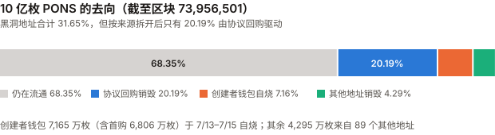
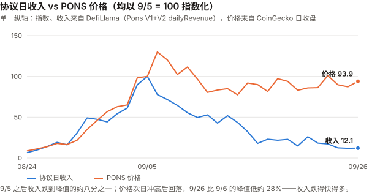
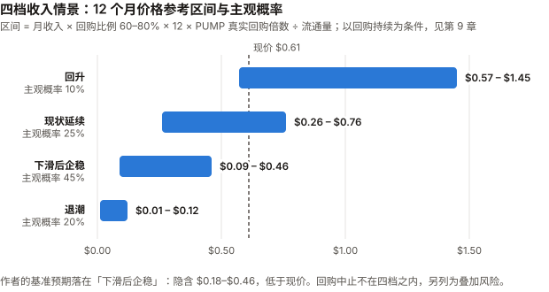

# PONS / Pons 完整调研与分析报告

> **版本**：2026 年 9 月（首期）
> **完成日期**：2026-09-27
> **数据截止**：2026-09-27。**9 月尚未闭合**，本期覆盖 9/1–9/27；收入类日度数据截至 9/26（最后完整日）。
> **本系列第十四个资产**（BTC / SOL / ADA / ETH / BNB / HYPE / UNI / TRX / XIN / DOT / ZEC / CKB / GRAM / **PONS**）
>
> **本版更新要点（首期）**：
>
> 1. **PONS 是一个发射台（launchpad）的代币，而且它自己就是在这个发射台上发行的。**
>    2026-07-13 在 Robinhood Chain 上一笔交易铸造 10 亿枚、全部注入流动性池，无团队分配、无解锁表。
>    上线约 11 周，从历史最低价 $0.00331678 涨到 $0.6098，约 184 倍。
> 2. **本期最重要的发现：收入与价格在 9 月初之后脱钩——收入周均跌了约 80%，价格从 9/6 收盘跌了 33%。**
>    协议周日均收入从 9/1–9/7 的 **$146.5 万**跌到 9/22–9/26 的 **$29.7 万**（–79.8%；单日峰值口径 –87.8%）；
>    价格从 9/6 收盘 $0.9146 跌到 9/27 的 $0.6147（–32.8%；距盘中高点 –37.2%）。两者都在跌，**收入跌得快得多**。
> 3. **「31.65% 的供应已被销毁」这个数字需要拆开看。** 由协议回购驱动的只有 **20.19%**；
>    **7.16%** 是创建者钱包在上线头三天自己烧掉的，**4.29%** 来自 89 个其他地址。
>    而且全部销毁量的 74% 发生在 7 月、币价只有几美分时——按当日价格只值 $364 万。
> 4. **回购是一项由单把私钥控制、可升级、没有文件约束 V2 收入的政策，不是持有人的权利。**
>    V1 文档写「协议手续费的 80%」用于回购；V2 文档对 PONS 回购只字未提——而 V2 贡献了 79% 的累计收入。
>    **「是否低于承诺」取决于 80% 覆盖哪个分母**：只算 V1 收入，实际回购是承诺的 3.44 倍；算全部收入，实际是 58.9%。
>    回购合约的升级权限已用模拟调用确认**只在一个普通钱包手里**。已读的 4 份官方文件均未赋予持有人权利；第 5 份（MiCA 白皮书）未能读取。
> 5. **估值结论在审查后翻转**：初稿以「PUMP 倍数 3.0–6.6 倍」判定现价「不贵不便宜」，但那个区间是用 PUMP **当前**市值除以**历史**收入得到的假想值。
>    改用 PUMP 各月月末的真实市值后，PUMP 的收入倍数只有 **1.91–2.54 倍**（近 30 天 3.28 倍），
>    **按收入口径 PONS（3.85–4.56 倍）比 PUMP 的每一个真实观测都贵**；按回购口径，是否落在区间内取决于集中回购能否持续（见 9.3）。
> 6. **三个数据源的成交量差了约 30 倍，已用链上 Swap 事件解决。**
>    HoodScan 只统计了发行池（$74.28 万/日），链上 5 个 V3 类池的真实成交约 **$1,503 万/日**；
>    发行池里 JIT 套利者加入的流动性是真实成交的 **182 倍**。
> 7. **9 月 16 日 FOMC 加息 25 基点至 3.75%–4.00%**（三年来首次）。
>    **9 月 29 日 Robinhood Chain 的 gas 补贴到期**（多家媒体一致，未找到官方原文）。
>
> ---
>
> **利益冲突声明**：作者未持有 PONS，与 Pons Labs, LLC、Robinhood 及 Robinhood Chain 生态项目
> 无雇佣、顾问或投资关系。本报告的链上数据全部由作者通过 Robinhood Chain 公开 RPC 节点直接读取，
> 收入数据取自 DefiLlama 公开 API，价格取自 CoinGecko API。
>
> **免责声明**：本报告不构成任何投资建议。PONS 上线不足三个月，是本系列迄今历史最短、波动最大的资产。

---

## 核心结论摘要（一页速览）

| 维度 | 核心判断 |
|------|----------|
| **PONS 是什么** | Robinhood Chain 上 Pons 发射台的代币。发射台按交易收取 1% 手续费（V1），V1 文档写明协议手续费的 80% 用于回购销毁 PONS。**已读 4/5 份官方文件均未赋予持有人对收入的权利**，回购是运营方的自主政策 |
| **价格位置** | $0.6098，市值 $4.17 亿（CoinGecko 第 126 位）。距 9/5 盘中高点 $0.971034 回撤 **37.2%**，距 9/6 收盘 **–32.8%**；8 月 **+891.3%**，9 月至今 **+89.1%** |
| **本期最重要的事实** | **收入与价格脱钩**：收入周均从 9 月第一周跌去约 80%，价格从 9/6 收盘跌去 33%。按收入口径，PONS 市值约为当前年化收入的 **3.85–4.56 倍**，**高于 PUMP 各月真实倍数（1.91–2.54 倍）和近 30 天（3.28 倍）**——**按收入口径，PONS 比 PUMP 贵** |
| **价值捕获** | 协议回购 2.019 亿枚（**20.19%** 的供应，按当日价 **$1,971 万**）。回购/收入累计 **58.9%**（含 8 月手动期的 26.8%）；9/2 自动化以来 **72.1%**。**平日回购额几乎恒定（约 $12–14 万/日），比例高低主要由几笔集中回购决定** |
| **控制权** | 回购由一个可升级代理合约执行；模拟调用确认**只有 owner——单签钱包 `0xda4b…3968`——能升级它**；该钱包本身只持有 22 万枚 PONS（0.03%） |
| **收入质量** | 95.9% 的 9 月收入来自 V2（其他代币的交易），PONS 自身交易的自我循环部分约 **3.0%**——**收入不是 PONS 自己的交易产生的**；但付费者是否独立、交易能否持续，**本期未验证** |
| **近期最大变量** | ① 9/29 gas 补贴到期；② 收入下滑是否止步；③ 回购政策是否被维持 |
| **估值立场** | **以回购为估值基础**（持有人只通过回购连接到收入）。现价要求月回购 **$470 万–$835 万**（PUMP 真实回购倍数 7.39–4.16 倍）；PONS 平日回购节奏约 **$390 万/月，低于区间**，计入集中回购后约 $660–764 万/月，落在区间内。**本报告的基准预期（10 月收入 $400–600 万）下，隐含价格 $0.18–$0.46，低于现价** |
| **风险等级** | **极高**。年化波动率 392%（BTC 41%），与 BTC 的 R² 仅 0.046——BTC 只能解释约 5% 的日波动，**真正的驱动因素本期未能识别** |

---

## 1. PONS 是什么

### 1.1 一个发射台的代币，发射在自己的发射台上

Pons 是一个**代币发射台（launchpad）**：任何人付 0.0005 ETH，就能在 Robinhood Chain 上一键发行一个固定供应的代币，
合约自动把全部供应注入 Uniswap 流动性池并锁定流动性，此后所有买卖都在池子里进行。

发射台的收入来自**这些代币的交易手续费**：

| 版本 | 机制 | 手续费 | 分配（按官方文档） |
|------|------|--------|------|
| **V1**（2026-07 起） | 发行即进 Uniswap V3 池，流动性锁定 | 每笔交易 1% | 创建者 70% / 协议 30%（区块 8,991,118 之后；此前 90/10） |
| **V2**（DefiLlama 数据自 2026-08-04 起） | 先走联合曲线（bonding curve），达标后「毕业」进入 Uniswap V4 | 曲线费 + 钩子费，上限合计 20% | 协议先取一份，创建者可选开启回购，余下归创建者 |

**PONS 代币本身就是 V1 发射台上发行的一个代币**（发行池 `0x10cc…26ba`，WETH/PONS，1% 费率）。
V1 文档写明：**协议手续费的 80% 以 TWAP（时间加权均价，即分批小额执行）方式回购并销毁 PONS，20% 用于基础设施与团队运营。**

> **注意 V2 与 PONS 的关系**：V2 的官方 README 明确写着 V2 的回购是**针对被发行的代币**、
> 买回后**进入五年线性释放的金库，「不销毁」**。**V2 的协议收入流向 PONS 回购这一步，
> 没有写在任何合约或文档里**——链上数据显示它确实在发生（见 4.3），但它是运营方的决定。

### 1.2 Robinhood Chain：它生长的土壤

| 事实 | 数值 |
|------|------|
| 主网上线 | **2026-07-01**（Robinhood 官方与 Arbitrum 公告，多源一致） |
| 技术栈 | Arbitrum Orbit，以太坊二层，gas 以 ETH 支付，出块约 100 毫秒 |
| 定位 | 为代币化股票而建 |
| 实际主力 | **memecoin**。媒体援引数据称 memecoin 占早期成交的 93.5%（未取得原始数据） |
| 全链 TVL | **$10.3 亿**（DefiLlama `v2/chains`，2026-09-27） |
| 全链 30 天费用 | **$3.75 亿**（DefiLlama，含所有协议） |

**Pons 在主网上线 12 天后（7/13）出现。** 它的全部历史都发生在这条链的第一个季度里——
这意味着 Pons 的任何增长数据，都同时混杂着「这条链本身在冷启动」的效应。

### 1.3 发行：一笔交易铸造全部供应

从 Robinhood Chain 公开 RPC 直读合约 `0x39dbed3a2bd333467115de45665cc57f813c4571`：

| 事实 | 链上读数 |
|------|---------|
| `totalSupply()` | **1,000,000,000**（不可升级：非代理合约、无 `owner()`） |
| 铸造 | 区块 **8,963,150**（**2026-07-13 20:42 UTC**），唯一一笔 mint，10 亿枚铸给发射台工厂 `0x0c37…77a4` |
| 同一分钟 | 工厂把 10 亿枚全部转入发行池 `0x10cc…26ba` |
| 发行池当前余额 | 376 万枚（初始池已卖出 99.6%） |
| **同一区块的首购** | `0xf89f…892a` 买入 **68,057,245** 枚（6.81%）——文档规定发行后头两个区块**只允许创建者首购**成交，**因此该钱包就是创建者** |

**无团队分配、无投资人、无解锁表。** Tokenomist 的记录是「一笔 Launchpool 分配，发行时全部释放」（经 unlocks.app 转述）。

**所有权的来历**：创始人 Ozzy（@MEADGod）2026-07-13 公开称：
「$PONS 的部署者把所有权和手续费转给了我的钱包，今后我会用 WETH 手续费回购 $PONS，并销毁我收到的所有 $PONS 手续费。」
（引自 unlocks.app 2026-09-08 文章；**原推文未直接打开**。）创始人为化名。

### 1.4 三个默认是否成立（XIN 期检查）

| 检查 | 结果 | 依据 |
|------|------|------|
| **流通量已知吗** | ✅ **已知且可链上复算** | 10 亿 − 黑洞地址 316,509,721 = **683,490,279**；CoinGecko 报 683,553,425，**相差 0.009%** |
| **价格是可用的测量吗** | ⚠️ **可用但噪声极大** | 日成交额中位数 **$1,449 万**（足够）；但上线以来 73 个交易日里有 **26 天**单日涨跌超过 20%；链上流动性约 **$430 万**，约为市值的 1% |
| **代币持有人是剩余索取权人吗** | ❌ **没有找到赋权文件** | 已读 4 份官方文件：V1 文档、V2 文档、GitHub README、使用条款（Pons Labs, LLC，适用特拉华州法律，2026-07-16 生效）——**均未赋予 PONS 持有人任何权利**，也**没有一份把回购写成义务**。第 5 份 MiCA 白皮书页面的正文由客户端动态加载，**未能读取** |

> **这里有一个本期差点犯的错误**：链上 `totalSupply()` 恒为 10 亿，而 CoinGecko 显示 6.84 亿，
> 我一度认为 CoinGecko 少算了 3.16 亿、FDV 应为 $6.23 亿。**这是错的**——该合约的销毁方式是
> **转入黑洞地址 `0x…dEaD`**，而不是调用 `burn` 减少总量，所以 `totalSupply()` 永远不变。
> **CoinGecko 的口径是对的。** 这是 DOT 期「供应量要链上对账」的检查，方向反过来的一次：
> **链上直读的字段也需要理解它的语义才能用。**

---

## 2. 发展阶段划分（11 周，四阶段）

| 阶段 | 时间 | 价格（日收盘） | 协议月收入 | 标志事件 |
|------|------|------|------|------|
| **一、公平发行与创建者自烧** | 7/13–7/31 | $0.0113 → $0.0414（7/17 盘中最低 $0.00331678） | 7 月 $405 万 | 7/13 发行；创建者钱包 7/13–7/15 烧掉 7,165 万枚；**7 月销毁 2.34 亿枚，占全部销毁 74%** |
| **二、沉寂** | 8/1–8/23 | 在 $0.017–$0.047 之间震荡 | — | 8/4 起 V2 开始产生收入；8 月回购/收入仅 **26.8%** |
| **三、爆发** | 8/24–9/5 | **$0.0619 → $0.7042（9/5 收盘），13 天约 11.4 倍**；次日 9/6 收盘 $0.9146 为日收盘最高 | 9/5 单日收入峰值 **$206 万** | 9/2 Binance Alpha 上线；9/2 回购改由合约 `0x5795` 自动执行；9/5 盘中历史高点 $0.971034 |
| **四、收入回落、价格回撤** | 9/6–9/27 | **$0.9146 → $0.6147，–32.8%**；后三周在 $0.55–$0.71 震荡 | 周日均收入 $106 万 → $47 万 → $30 万 | 9/15 OKX 现货上线；9/16 FOMC 加息；收入跌去 87.8% |

> **一个区分**：阶段三的上涨与收入上涨**同步**（见第 5 章的图），阶段四则**脱钩**。
> 本报告不把阶段三解读为「收入驱动」——两者同时受 Robinhood Chain 链上 memecoin 热度这一共同因素推动，
> **本期没有能区分「收入推高价格」与「共同因素同时推高两者」的检验**。

---

## 3. PONS 当前现状

### 3.1 价格与市场

| 指标 | 数值（2026-09-27） |
|------|------|
| 价格 | **$0.6098** |
| 市值 | **$4.17 亿**（CoinGecko 第 126 位） |
| 流通量 | 683,490,279（链上复算） |
| 历史高点 | $0.971034（2026-09-05 盘中）；日收盘最高 $0.9146（9/6） |
| 历史低点 | $0.00331678（2026-07-17） |
| 8 月 | 8/1 收盘 $0.0328 → 8/31 **$0.3251**，**+891.3%** |
| 9 月至今 | 8/31 $0.3251 → 9/27 **$0.6147**，**+89.1%** |
| 24 小时成交（CoinGecko 总计） | 约 $4,008 万 |

**交易场所**（CoinGecko tickers API，一手）：链上有 Ramses V3、Uniswap V3/V4、GIGA V3 等 Robinhood Chain DEX；
中心化交易所有 **Gate、OKX、Bybit、MEXC、Kraken、Crypto.com、BTSE、BloFin、KCEX**。
Binance 目前只在 **Binance Alpha**（9/2 上线，经 Binance Wallet 官方 X 帖子的搜索摘要转述），**未上 Binance 现货**。

### 3.2 成交量：三个数据源差了约 30 倍——链上解析的结果

| 来源 | 口径 | PONS 24 小时成交 |
|------|------|------|
| HoodScan | 链上 DEX | **$73.65 万** |
| CoinGecko 列出的 DEX 交易对合计 | 链上 DEX | 约 $2,500 万（含 Uniswap V4） |
| CoinGecko 总计 | 含中心化所 | 约 $4,008 万 |

同样是链上 DEX，前两者差了约 30 倍。本报告**不在两个二手口径之间挑一个**，而是直接解析最近 24 小时
（区块 73,109,126–73,964,829）内 5 个 V3 类池子的 **Swap 事件**：

| 池子 | 交易对 / 费率 | Swap 笔数 | 真实成交（PONS） | ≈ 美元（×$0.62） | 同期**加入**的流动性（PONS） |
|------|------|------|------|------|------|
| `0x10cc`（**发行池**） | WETH / 1% | 1,744 | 1,197,988 | **$74.28 万** | **217,870,117** |
| `0xed50` | WETH / 0.3% | 6,150 | 7,331,695 | $454.57 万 | 3,420,313 |
| `0xf2a0` | USDG / 动态 | 12,249 | 12,462,163 | $772.65 万 | 0 |
| `0x2f39` | USDG / 动态 | 3,943 | 3,118,669 | $193.36 万 | 1,287,547 |
| `0x25c9` | WETH / 1% | 335 | 130,816 | $8.11 万 | 10,039,234 |
| **合计（不含 Uniswap V4）** | | 24,421 | **24,241,332** | **约 $1,503 万** | 232,617,211 |

**三个结论：**

1. **HoodScan 的 $73.65 万与发行池单池的 $74.28 万几乎一致**——它只统计了发行池。
2. **链上真实成交约 $1,503 万/日**（不含 V4），与 CoinGecko 的 DEX 合计同一量级。
3. **发行池里被加入的流动性是真实成交的 182 倍**（217,870,117 ÷ 1,197,988）。
   同一笔交易内先加入、再撤出流动性的次数：发行池 117 次、`0x25c9` 592 次——这是 **JIT（即时流动性）**：
   套利者在大额买单成交前一刻挤进池子、吃掉手续费、随即撤出（见 4.6）。
   **因此按转账量统计 PONS 的「流量」会被严重注水**：同一 24 小时内 PONS 共发生 141,519 笔转账、
   转账总量 8.03 亿枚，超过流通量本身。

### 3.3 风险特征

| 指标 | PONS | BTC |
|------|------|------|
| 年化波动率（7/18–9/27 日收益） | **392%** | 41% |
| 年化波动率（9 月） | 266% | 44% |
| 对 BTC 的 beta（7/18–9/27，n=71） | 2.08 | — |
| **R²** | **0.046** | — |
| 9 月 beta / R²（n=26） | 1.98 / 0.108 | — |
| 单日 \|涨跌\| > 20% 的天数 | 26 / 73 | — |

**按 XIN 期规则，beta 必须和 R² 一起读**：2.08 的 beta 看起来像「BTC 的两倍杠杆」，但 R² 只有 0.046——
**BTC 只能解释 PONS 约 5% 的日波动**。9 月 BTC 上涨 9.2%，对 PONS 的解释力依然很弱。

**但按 CKB 期规则，低 R² 不能反过来证明驱动因素是什么**——它只说明「不是 BTC」，
**不能据此推断是「收入」「回购」或「上币」在驱动**，本期没有做能区分这些的检验。

### 3.4 宏观环境

| 事件 | 状态 |
|------|------|
| **9/16 FOMC** | **加息 25 基点至 3.75%–4.00%，12:0 全票**，三年多来首次加息；点阵图中位数指向年内再加一次（CNBC、Schwab、KPMG 等多源一致，未打开美联储原文） |
| BTC | 8/31 $77,658 → 9/27 $84,836，**+9.2%** |
| ETH | $2,706.8（Robinhood Chain 的 gas 与 Pons 大部分手续费以 ETH 计价） |

宏观对 PONS 的直接解释力很弱（R² 0.046），但**利率上升对投机性 memecoin 交易热度的压制**
是影响 Pons 收入的一条间接渠道——本期无法量化这条渠道的强度。

---

## 4. 价值捕获：承诺的、执行的、可被强制的（本期核心章之一）

### 4.1 31.65% 被销毁——但这个数字由最便宜的那段时间主导

黑洞地址 `0x…dEaD` 在区块 73,956,501 时持有 **316,505,371 枚**（10 亿的 **31.65%**），共 19,857 笔转入、92 个来源地址。

| 月份 | 销毁枚数 | 按当日收盘价折美元 |
|------|------|------|
| 7 月 | 234,119,401（占全部销毁 **74%**） | **$364 万** |
| 8 月 | 57,081,509 | $231 万 |
| 9 月（至 9/27） | 25,304,461 | **$1,645 万** |

**以枚数计的「销毁比例」被 7 月币价只有几美分时的销毁主导。** 按美元计，9 月一个月的销毁额是 7 月的 4.5 倍，
但烧掉的枚数只有 7 月的 11%。**读到「近三分之一供应已销毁」时，应当同时读到「其中四分之三只花了 $364 万」。**



10 亿枚中：**仍在流通 68.35%**（683,494,629 枚，区块 73,956,501 快照），协议回购 20.19%，创建者钱包自烧 7.16%，其他地址约 4,295 万枚（4.29%）。

### 4.2 销毁的三种来源

逐个追踪每个销毁地址的 PONS 从哪里来：

| 类别 | 地址 | 销毁枚数 | 占 10 亿 | 按当日价 | 币从哪里来 |
|------|------|------|------|------|------|
| **协议回购** | `0xda4b…3968`（EOA，7/13–9/2，1,532 笔）+ `0x5795…c324`（合约，9/2–9/27，11,855 笔） | 201,909,213 | **20.19%** | **$1,971 万** | `0xda4b` 转入的 PONS：75.0% 是在发行池的 **1,668 笔买入**（Swap 事件收款人即 `0xda4b`）；**22.4%（4,031 万枚）来自 `0x31ca…54b5`**——它是发行池流动性头寸的**手续费领取地址**（池子 Collect 事件的收款人，共领走 5,208 万枚 PONS 与 161 ETH），即 **PONS 计价的手续费、收到即烧**（见 5.3）；`0x5795` 每笔都是「用 WETH 在发行池买入 → 转入黑洞」 |
| **创建者钱包自烧** | `0xf89f…892a`（EIP-7702 委托钱包，3 笔） | 71,648,377 | **7.16%** | $81 万 | 其中 **6,806 万枚是铸造区块内的首购**，其余 359 万枚为后续买入 |
| **其他地址** | 89 个地址 | 42,947,782 | **4.29%** | $187 万 | 49 个地址只烧过一次 |

**只有第一类与「协议收入回馈持有人」有关。** 创建者自烧是一次性的承诺性动作，不代表收入；
其他地址的销毁是个人行为。**把 31.65% 全部归功于「收入驱动的通缩」是错的**——对应收入的是 20.19%。

**交叉核对**：DefiLlama 记录的 PONS 回购（`dailyHoldersRevenue`）累计 **$1,936 万**，
本报告按日收盘价折算的协议回购 **$1,971 万**，相差 1.8%（来自日线价格粒度）。
**按 CKB 期规则说明**：两者读的是同一批链上事件，一致只证明本报告的解析没有算错，**不构成对回购事实的独立验证**——
回购本身是链上事实，不需要独立验证。

### 4.3 回购的资金链：链上看到的

解码 `0x5795` 的交易，每一笔回购都是同一个模式：

```
收取各发行代币池的协议手续费（代币 + WETH）
  → 把收到的发行代币换成 WETH
  → 用 WETH 在 PONS 发行池 0x10cc 买入 PONS
  → 转入 0x…dEaD
```

合约存储里记着每次买入的切片大小 **0.5 ETH**——与交易里观察到的每笔买入量一致，这就是文档说的 TWAP。

**这说明 V2 的收入确实在流向 PONS 回购**：9 月 V1 协议收入只有 $92 万，而 9 月回购 $1,571 万——
**回购额是 V1 收入的 17 倍，只能来自 V2**。但如 1.1 所述，**没有任何文件规定这一步**。

### 4.4 承诺 80%：分母是什么，决定了「高于」还是「低于」

| | 7 月 | 8 月 | 9 月（至 9/27） | 累计 |
|---|---|---|---|---|
| 协议收入（V1+V2，DefiLlama） | $404.9 万 | $619.0 万 | $2,264.7 万 | **$3,288.6 万** |
| 其中 V1 收入 | $404.9 万 | $205.7 万 | $92.5 万 | **$703.1 万** |
| 其中 V2 占比 | 0% | 66.8% | **95.9%** | 78.6% |
| PONS 回购（DefiLlama） | $199.2 万 | $165.7 万 | $1,570.7 万 | **$1,935.7 万** |
| **回购 / 全部收入** | 49.2% | **26.8%** | 69.4% | **58.9%** |

**V1 文档的原话**（docs.ponsfamily.com，本期直接抓取）：手动回购「via an automated TWAP using **80% of protocol fees**」
（用协议手续费的 80% 以 TWAP 方式执行），并注明「This amount is **not immutable yet**」（这个比例尚未不可变）。
**V2 文档对 PONS 回购只字未提**——V2 的「buyback」指的是被发行代币的回购，买回后进五年释放金库、不销毁。

所以「80%」有两种读法，**两种都说得通，本报告不替运营方选**：

| 读法 | 应回购 | 实际 $1,935.7 万是它的 |
|------|------|------|
| **只覆盖 V1 收入**（文档写在 V1 页面，V2 文档未提） | $703.1 万 × 80% = **$562.5 万** | **3.44 倍** |
| **覆盖全部协议收入**（「protocol fees」按字面泛指） | $3,288.6 万 × 80% = **$2,630.9 万** | **73.6%**（少 $695.2 万） |

**能确定的只有**：V2 收入流向 PONS 回购这一步**没有任何文件约定**（见 4.3），回购强度是运营方的选择。
回购合约 `0x5795` 当前还持有 **286.01 ETH**（约 $77 万）待用；另有一个 2/3 多签 `0x29b7…15bc` 持有 **742.61 ETH**（约 $201 万），
**但这个多签的角色本期未能确认**，它只是出现在回购合约的存储槽 0 里。

**比例本身也不稳定——而且主要由几笔集中回购决定：**

| 窗口 | 回购 / 收入 |
|------|------|
| 累计（含 8 月手动期） | 58.9% |
| 9/2 自动化以来 | 72.1% |
| 9/8–9/26 | 87.5% |
| 9/23–9/26（无集中回购的 4 天） | **45.8%**（日回购 $12.2 万–$13.2 万） |

9/19–9/26 里，除 9/22 一天回购 $75.0 万外，**每天的回购额都落在 $12.2 万–$14.0 万之间，几乎不随当天收入变化**。
这更像一个**按固定节奏执行的 TWAP**，外加不定期的集中回购，而不是「每天按收入的固定比例」。
（这是从日度数据推断的执行形态，**合约的节奏参数本期未解码，未验证**。）

**准确的说法是**：**回购强度由运营方的节奏和集中回购的时点决定；按不同窗口可以是 46% 也可以是 87.5%；没有机制把它固定在任何比例上。**

### 4.5 一把私钥：回购由谁控制

| 事实 | 链上读数 |
|------|------|
| 回购合约 `0x5795` 的类型 | **ERC-1967 代理合约**，自身 130 字节，逻辑在 `0x1c65…1748`（22,999 字节）；逻辑合约含 `upgradeToAndCall` 与 `proxiableUUID`（返回 ERC-1967 实现槽）→ **UUPS 模式**（升级函数写在逻辑合约里） |
| **谁能升级（模拟调用）** | 以 `0xda4b` 身份 `eth_call` 模拟 `upgradeToAndCall(当前逻辑地址, 空)`：**成功**；以任意其他地址模拟：**回滚**，错误码 `0x118cdaa7` = `OwnableUnauthorizedAccount`（「调用者不是授权账户」）→ **升级权限由 `owner()` 独占** |
| `owner()` | **`0xda4b…3968`——一个普通钱包（EOA）** |
| 该钱包的历史 | 7/13–9/2 手动执行了全部 1.786 亿枚回购销毁；9/2 起为回购合约的 owner；按创始人 7/13 的公开表述，它应是接收 PONS 发行池手续费的钱包 |

**含义**：回购的执行逻辑可以被一把私钥**整体替换**（升级即可改参数或停止）。持有人没有任何机制阻止这件事。

> **但承重的不是这把私钥，而是资金路由**：即使回购合约不可升级，运营方照样可以不再把 V2 收入送进来（4.3）——
> 迁入多签或时间锁之后，持有人拿到的**依然是承诺而不是权利**。单私钥额外带来的是一个**独立的安全风险**：
> 私钥一旦被盗，攻击者可以升级合约、转走合约里的 286 ETH，并改写回购逻辑。

> **这不是一个关于「会不会被滥用」的判断**——本报告没有任何证据表明运营方有此意图，
> 截至 9/27 回购每天都在执行。**这是一个关于「持有人拿到的是什么」的描述**：
> 他们拿到的是**一个人正在履行的公开承诺**，而不是**一项可以被执行的权利**。
> 两者在运营方意愿不变时表现完全相同，**区别只在意愿改变的那一天才显现。**

### 4.6 回购被套利者包裹（JIT）

回购合约**任何人都可以触发**。链上观察到套利者（如 `0x9f76…` 通过 `0x147c…`、`0x2737…` 通过 `0x0c63…`）
把「向发行池加入大额流动性 → 触发多笔回购买入 → 撤出流动性并收走手续费」打包在同一笔交易里执行。

**经济影响很小**：回购买入的 1% 池费本应部分归入锁定的流动性头寸（创建者与协议），
现在被 JIT 流动性分走一部分，**损耗上限约为回购额的 1%**。
**但它对「成交量」统计的影响很大**——见 3.2，发行池加入的流动性是真实成交的 182 倍。

### 4.7 团队几乎不持有 PONS

| 钱包 | PONS 余额 | 占流通量 |
|------|------|------|
| `0xda4b`（回购 owner / 创始人手续费钱包） | 221,540 | 0.03% |
| `0xf89f`（创建者） | 126,835 | 0.02% |

**已识别的两个团队钱包合计持有约 0.05% 的流通量。**（团队可能有其他钱包，**本期无法识别，未验证**。）

**这对持有人意味着两面**：好的一面是没有团队解锁抛压；
坏的一面是**团队的经济利益主要来自手续费（创建者分成 + 协议 20%），而不是 PONS 的价格**——
回购是团队把自己的一部分收入让渡给持有人，**这种让渡在团队自身利益上没有强制理由**。

### 4.8 这件事的性质

**本报告能说的：**
- PONS 的回购是**真实发生、链上可复现**的，资金来自其他代币的交易手续费；
- 回购强度**没有被任何文件约束到 V2 收入上**，按窗口在 46%–87.5% 之间，**由运营方的节奏决定**；
- 回购的存续**依赖运营方的意愿**，升级权限在单个私钥手里；已读 4/5 份官方文件均未赋予持有人权利。

**本报告不能说的：**
- 不能说「回购会停止」——没有任何证据；
- 不能说「运营方违约」——没有约束性文件；
- 不能说「PONS 的价值由回购决定」——3.3 已说明本期无法区分价格驱动因素。

---

## 5. 平台经济：收入的峰值与衰减（本期核心章之二）

### 5.1 Pons 是 Robinhood Chain 上费用最高的协议

DefiLlama `overview/fees/robinhood chain`（30 天，2026-09-27）：

| 协议 | 类别 | 24 小时费用 | 30 天费用 |
|------|------|------|------|
| **Pons V2** | 发射台 | $154.4 万 | **$1.407 亿** |
| Uniswap V4 | DEX | $141.9 万 | $1.091 亿 |
| Robinhood Chain（链本身） | 链 | $9.1 万 | $3,952 万 |
| Uniswap V3 | DEX | $24.3 万 | $3,569 万 |
| GMGN | 交易应用 | $18.6 万 | $3,112 万 |
| **Pons V1** | 发射台 | $3.6 万 | $624 万 |
| NOXA Fun | 发射台 | $1.7 万 | $316 万 |
| o1 Launchpad | 发射台 | $0.2 万 | $313 万 |

**Pons V1+V2 占 Robinhood Chain 全链 30 天费用的 39.2%。** 在同链发射台里没有接近的对手。

> ⚠️ **本报告在调研中曾错误地写下「Pons 不在 DefiLlama 上」**——第一次查询只打印了前 25 条，
> Pons 排在后面。**这是「否定性结论必须检查搜索范围」的教训的一次险些复现**，已在成稿前更正。

### 5.2 收入从峰值下跌 87.8%

| 周（不重叠） | 用户支付的费用 | 协议收入 | 日均协议收入 | 较上周 | 回购 | 回购/收入 |
|------|------|------|------|------|------|------|
| 9/1–9/7 | $5,470 万 | $1,025.8 万 | **$146.5 万** | — | $506.7 万 | 49% |
| 9/8–9/14 | $4,507 万 | $741.5 万 | $105.9 万 | **–28%** | $685.5 万 | 92% |
| 9/15–9/21 | $2,107 万 | $326.6 万 | $46.7 万 | **–56%** | $252.9 万 | 77% |
| 9/22–9/26（5 天） | $1,013 万 | $148.3 万 | **$29.7 万** | **–36%** | $125.6 万 | 85% |

**单日协议收入峰值是 9/5 的 $2,056,973，9/24–9/26 日均 $250,251——跌去 87.8%。**



以 9/5 = 100 指数化：9/26 **收入指数 12.1，价格指数 93.9**。价格指数最高 129.9（9/6）。

> ⚠️ **基期选择会放大观感**：9/5 是收入的单日峰值，却不是价格的峰值（价格次日才见顶）。
> 按各自的峰值算，收入周均 –80%（单日 –87.8%），价格 –33% 到 –37%。**脱钩依然明显，但价格不是「没动」。**

**两条线在 8/24–9/5 几乎同步上升，9/5 之后分道扬镳。** 这是本报告估值章（第 9 章）要回答的核心问题：
**收入跌去约八成而价格只跌三成，有三种解释**：① 市场在看穿短期波动；② 价格还没跟上；③ **PONS 的价格本来就不由收入定价**——
而是由上币（9/2 Binance Alpha、9/15 OKX）、渠道和链上热度决定。**本期数据无法区分这三者。**
第三种如果成立，会削弱第 9 章整个收入/回购型估值框架——这一点在 9.6 列为弱点。

### 5.3 收入的构成：不是 PONS 自己的交易产生的

**三个担心，前两个基本不成立，第三个本期无法回答：**

1. **「PONS 交易产生的手续费又去买 PONS」的自我循环有多大？**
   PONS 发行池 24 小时真实成交 $74.28 万 × 1% ≈ **$7,428/日**，相对当前协议日收入约 $25 万，
   **当前最多约 3.0%**（且这 1% 里还有一部分被 JIT 流动性分走）。**当前的回购资金主体来自其他代币的交易。**
   **7 月不是这样**：见 4.2，`0xda4b` 销毁的 1.786 亿枚里有 **4,031 万枚（22.6%）是直接从 PONS 发行池收取的 PONS 计价手续费**，
   收到即烧——这部分就是 PONS 自己的交易产生的。按到账当日价约 **$65 万**（7/13–7/14 到账的 2,990 万枚按 7/15 价格近似），
   只占累计回购美元额的约 3%，但**占协议回购枚数的约五分之一**。
2. **收入是否以 PONS 计价（TRX/BNB/HYPE 期的退化陷阱）？** 当前不是。V2 的费用**始终以报价资产（ETH 或 USDG）收取**，
   9/2 以后回购合约把收到的发行代币换成 WETH 再买 PONS。**收入以美元/ETH 计，不含 PONS 价格。**（例外即上一条的 7 月实物手续费。）
3. **付费者是不是独立的、交易能不能持续？** **本期未验证。** 排除「PONS 自己的交易」只排除了一条很窄的自循环；
   V2 其他代币的手续费仍可能来自同一批地址的反复交易、创建者刷量（1:1 成本，见记分卡门槛 11 说明）或回购激励。
   要回答它需要对 V2 前几大费用来源代币做地址聚类、资金来源和留存分析，本期没有做。
   **所以本报告只说「收入不是 PONS 自己的交易产生的」，不说「收入是外生的」。**

### 5.4 9/29：gas 补贴到期

多家媒体（KuCoin、crypto.news、cryptoticker、cryptonews）一致报道：Robinhood 随主网推出的 **90 天 gas 补贴在 2026-09-29 到期**，
8 月中旬起已从单笔 $5.00 下调到 $0.50。**未找到 Robinhood 官方原文，按硬规则标为多源一致但非一手。**

**一个关键限定**：补贴只覆盖**通过 Robinhood Wallet 执行的交易**，不是全链。
**Pons 用户中有多少比例走 Robinhood Wallet，本报告没有数据**，因此**无法估计补贴到期对 Pons 收入的冲击幅度**。

**时间顺序值得注意**：Pons 收入的 87.8% 下跌**发生在补贴到期之前**。补贴到期是「还没发生的下行风险」，
不是「已发生下跌的解释」——**已发生的下跌需要另外的解释，本期没有找到能区分原因的数据。**

### 5.5 可比：Pump.fun 的收入曲线

Pump.fun（Solana 上最大的发射台，代币 PUMP）是最直接的参照：同一业务、同样用收入回购、历史长得多。

| | PUMP | PONS |
|------|------|------|
| 市值 | $21.06 亿 | $4.17 亿 |
| 近 30 天协议收入 | $5,271.7 万 | $2,537.1 万（8/28–9/26） |
| 近 30 天回购 | $2,341.6 万（占收入 44%） | $1,594.0 万（占收入 63%） |
| 协议月收入（2026 年） | 6 月 $2,662 万、7 月 $3,371 万、8 月 $5,811 万 | 7 月 $405 万、8 月 $619 万、9 月 $2,265 万 |
| 可用的收入历史 | 18 个月以上 | **11 周** |

**PUMP 2026 年的协议月收入**（DefiLlama）：5 月 $3,439 万、6 月 $2,662 万、7 月 $3,371 万、8 月 $5,811 万、9 月（至 9/27）$4,347 万——
**在 $2,600 万–$5,800 万之间起伏，没有归零。** 这是本报告「收入回落后企稳」情景的唯一历史参照，
但要注意两点：**它是 N=1**，而且 PUMP 是这类发射台里**活下来的那一个**（幸存者偏差）；
这几个月展示的是「起伏」，**并没有给出「峰值后跌多少才企稳」的量化锚点**。

---

## 6. 核心价值逻辑

### 6.1 多头逻辑

| # | 逻辑 | 强度 | 说明 |
|---|------|------|------|
| 1 | **收入真实，且不是 PONS 自己的交易产生的** | ★★★☆☆ | 上线 11 周累计协议收入 $3,289 万；9 月 95.9% 来自 V2（其他代币交易）；当前自我循环约 3.0%。**付费者独立性未验证**（见 5.3 第 3 条），故不给四星 |
| 2 | **同链份额领先** | ★★★★☆ | 占 Robinhood Chain 30 天全链费用 39.2%，同链发射台无接近对手 |
| 3 | **回购真实执行** | ★★★☆☆ | 协议回购 2.019 亿枚（20.19%），链上可逐笔复现。**但见空头 2、3** |
| 4 | **无解锁抛压** | ★★★☆☆ | 公平发行、无团队分配；已识别团队钱包只持有约 0.05% |
| 5 | **按回购口径，估值可以落在 PUMP 的真实区间内** | ★★☆☆☆ | 计入集中回购时，PONS 市值/年化回购 4.55–5.24 倍，PUMP 各月真实值 4.16–5.44 倍、当前 7.39 倍。**但只看平日回购节奏则为 8.91 倍，高于 PUMP 所有观测**（见 9.3） |
| 6 | **交易场所快速扩张** | ★★☆☆☆ | 11 周内上了 Gate、OKX、Bybit、MEXC、Kraken 等及 Binance Alpha |

### 6.2 空头逻辑

| # | 逻辑 | 强度 | 说明 |
|---|------|------|------|
| 1 | **收入三周跌去 87.8%，且仍在下降** | ★★★★★ | 周日均 $146.5 万 → $29.7 万；最近一周 –36%。**现价需要的是止跌，而趋势还没给出止跌信号** |
| 2 | **回购是自主政策，不是权利** | ★★★★☆ | 已读 4/5 份官方文件均未赋权；V2 收入流向回购无文件约定；强度按窗口 46%–87.5%，文档自称「尚未不可变」 |
| 3 | **单私钥的密钥安全风险** | ★★★☆☆ | 模拟调用确认升级权限由 EOA `owner()` 独占；私钥被盗即可升级合约、转走 286 ETH。**与空头 2 不同**：空头 2 是意愿风险，这条是安全风险 |
| 4 | **按收入口径，比 PUMP 所有真实观测都贵** | ★★★☆☆ | 市值/当前年化收入 3.85–4.56 倍，PUMP 6–8 月月末 1.91–2.54 倍、近 30 天 3.28 倍（见 9.3） |
| 5 | **依附于一条三个月大的链的一个热点** | ★★★★☆ | Robinhood Chain 上线 88 天；成交主力是 memecoin；9/29 gas 补贴到期 |
| 6 | **历史极短，统计推断能力极弱** | ★★★☆☆ | 11 周数据，所有倍数、比率都可能只是一个冷启动季度的特征 |
| 7 | **流动性薄、波动极大** | ★★★☆☆ | 链上流动性约 $430 万（市值 1%）；年化波动 392% |
| 8 | **化名团队 + V2 未经审计** | ★★★☆☆ | V2 文档原话：「没有任何审计已完成，请把 V2 视为未经审计」 |

> **按 ZEC 期「声明了偏向，就要在评分里执行」**：空头 1 是 ★★★★★，因为它是本期唯一**已发生且仍在持续**的负面事实；
> 空头 2 是 ★★★★☆ 而非 ★★★★★，因为它描述的是「持有人拿到的是什么」，**本期没有任何它已造成损失的证据**；
> 空头 3 是 ★★★☆☆，因为它是尾部安全风险，发生概率本期无法估计。

### 6.3 传统机构视角

**本期没有找到任何传统金融机构对 PONS 本身的覆盖。** 能找到的都是对 Robinhood（HOOD）与 Robinhood Chain 的评论：

| 机构 | 观点（经媒体转述，未打开原报告） | 与 PONS 的关系 |
|------|------|------|
| **Bernstein** | 重申 HOOD 买入评级、目标价 $160；指出 Robinhood Chain 早期成交由 memecoin 主导 | 间接：确认 Pons 所在生态的主力是 memecoin |
| **StoneX**（Mark Palmer） | Robinhood Chain 增长来自四个因素：品牌、无需许可、**补贴的 gas 费**、memecoin 与代币化股票的飞轮 | **直接相关**：把 gas 补贴列为增长驱动之一——而它 9/29 到期 |
| **Morgan Stanley** | 上调 HOOD 评级，理由是公司整体产品线增长，**与链无关** | 无 |

**配平说明**：这些机构评论的对象是 Robinhood 公司，它们看多 HOOD **不等于**看多 PONS。
StoneX 把 gas 补贴列为驱动因素之一，是本报告找到的唯一一条与 PONS 近期风险直接相关的机构观点。

---

## 7. 与其他资产的比较

### 7.1 与 Pump.fun（PUMP）

| 维度 | PUMP | PONS |
|------|------|------|
| 业务 | Solana 发射台 | Robinhood Chain 发射台 |
| 市值 / 近 30 天年化收入 | 3.28 倍 | 1.35 倍（含峰值的 30 天窗口） |
| 市值 / 年化月收入（**月末真实市值**） | 6 月 1.91 倍、7 月 1.95 倍、8 月 2.54 倍 | — |
| 市值 / 当前运行速率年化收入 | — | **3.85 倍**（9/22–9/26）/ **4.56 倍**（9/24–9/26） |
| 回购 / 收入（近 30 天） | 44% | 63% |
| 市值 / 年化回购 | 当前 7.39 倍；6 月 4.16、7 月 4.17、8 月 5.44 倍 | 4.55 倍（5 天）/ 5.24 倍（7 天）/ **8.91 倍（3 天，无集中回购）** |
| 收入历史 | 18 个月以上 | 11 周 |

**用哪个窗口、哪个分子，结论都不同**（见 9.2、9.3）。按含峰值的 30 天窗口，PONS 看起来只有 PUMP 倍数的四成；
按当前运行速率的收入，PONS 比 PUMP 每一个真实观测都贵；按回购，结论取决于是否计入集中回购。

### 7.2 在 Robinhood Chain 发射台中

同链发射台 30 天费用：Pons V2 $1.407 亿、Pons V1 $624 万、NOXA Fun $316 万、o1 Launchpad $313 万。
**Pons 合计是其余发射台之和的 23 倍以上。** Flap sh、clanker 等多链发射台也已部署到 Robinhood Chain，
但 DefiLlama 未单列它们在该链的费用。

### 7.3 与 BTC

beta 2.08、R² 0.046（见 3.3）。**PONS 与 BTC 的关系弱到不适合用 BTC 做它的对冲或参照。**

---

## 8. 未来关键变量（催化剂日历）

| 时间 | 事件 | 可能影响 | 方向 | 置信度 |
|------|------|------|------|------|
| **2026-09-29** | **Robinhood Chain gas 补贴到期** | 交易成本上升可能压低发射台活跃度；冲击幅度取决于 Pons 用户中 Robinhood Wallet 的占比（**未知**） | ↓ | 中（日期多源一致，影响幅度未知） |
| **10 月** | **收入是否止跌、回购是否跟上** | 第 9 章的反解门槛：月回购 **$639 万**（PUMP 8 月回购倍数 5.44 倍）；按 80% 比例约等于月收入 $800 万 | 决定性 | 高（可观测） |
| 持续 | 回购/收入比与回购合约 owner | 回购强度可调；owner 若迁入多签或时间锁，是控制权风险的实质改善 | ↑/↓ | 中 |
| 待定 | **V2 审计报告发布** | V2 贡献 95.9% 的收入却未经审计 | ↑ | 低（无时间表） |
| 待定 | 更多中心化交易所上市（如 Binance 现货） | 本期**没有任何迹象**，仅列为可能性 | ↑ | 低 |
| 年内 | 美联储是否再次加息 | 点阵图指向年内再加一次 | ↓ | 中 |
| 持续 | Robinhood Chain 代币化股票与 memecoin 的结构变化 | 若链上活跃度从 memecoin 转向股票代币，发射台收入可能结构性下降 | ↓ | 低 |

---

## 9. 估值：反解与情景

> **本章在发布前审查后重写**（见 11.6）。初稿以收入为分子、以一个假想的 PUMP 倍数区间（3.0–6.6 倍）为参照，
> 得出「不贵也不便宜」。两处都被推翻：分子应是回购（持有人只通过回购连接到收入，第 4 章），参照应是 PUMP 的**真实**历史倍数。

### 9.1 估值结构的退化检验（TRX 期规则）

本章用「稳态月回购 × 12 × 倍数 ÷ 流通量」。**回购额以 ETH 计、换算为美元，不含 PONS 价格**；
流通量用链上复算的 683,490,279（**不预估未来回购带来的缩减**，按公允价格回购对每枚价值中性）。
**价格不会在等式两边约掉。** ✅

**为什么用回购而不用收入**：第 4 章的结论是持有人与收入之间唯一的连接是回购——收入里没有进入回购的部分（按窗口 13%–54%），
持有人一分也拿不到。**用收入做分子，等于把平台的收入当成 PONS 的现金流。** 收入口径保留为对照（9.3 下半）。

### 9.2 窗口选择决定倍数（XIN 期「查询窗口长度会改变返回值」）

| 口径 | 年化值 | 市值 / 年化值 |
|------|------|------|
| 收入，近 30 天（8/28–9/26，含峰值） | $3.087 亿 | 1.35 倍 |
| 收入，9/22–9/26 日均 × 365 | $1.082 亿 | **3.85 倍** |
| 收入，9/24–9/26 日均 × 365 | $0.913 亿 | **4.56 倍** |
| **回购，9/20–9/26 日均 × 365**（含 9/22 集中回购） | $7,957 万 | **5.24 倍** |
| **回购，9/22–9/26 日均 × 365**（含 9/22 集中回购） | $9,168 万 | **4.55 倍** |
| **回购，9/24–9/26 日均 × 365**（平日节奏） | $4,677 万 | **8.91 倍** |

**同一天，倍数从 1.35 到 8.91——全部来自口径和窗口。** 本报告不采用含峰值的 30 天窗口（CKB 期规则）；
回购口径下，**是否计入 9/22 那笔 $75 万的集中回购**，让倍数相差近一倍。

### 9.3 反解：当前价格要求什么

**参照：PUMP 各月月末的真实倍数**（CoinGecko 月末市值 ÷ DefiLlama 当月协议收入/回购 × 12）：

| | 6 月 | 7 月 | 8 月 | 当前（近 30 天） |
|------|------|------|------|------|
| PUMP 月末市值 | $6.09 亿 | $7.87 亿 | $17.71 亿 | $21.06 亿 |
| **市值 / 年化回购** | **4.16 倍** | **4.17 倍** | **5.44 倍** | **7.39 倍** |
| 市值 / 年化收入 | 1.91 倍 | 1.95 倍 | 2.54 倍 | 3.28 倍 |

**PONS 现价（市值 $4.1686 亿）要求的稳态月回购：**

| 若市场给的回购倍数是 | 所需月回购 | PONS 当前 |
|------|------|------|
| 7.39 倍（PUMP 当前） | **$470 万** | 平日节奏 **$390 万/月**（9/24–9/26） |
| 5.44 倍（PUMP 8 月） | **$639 万** | 计入集中回购 **$663 万–$764 万/月**（7 天 / 5 天） |
| 4.16 倍（PUMP 6–7 月） | **$835 万** | |

**收入口径对照**：按 PUMP 真实收入倍数 3.28 / 2.54 / 1.91 倍，现价要求月收入 **$1,059 万 / $1,368 万 / $1,819 万**；
PONS 当前运行速率 $761 万–$902 万/月，**低于所有三个要求**。

**结论（两句，不合成一句）：**

1. **按收入口径，PONS 比 PUMP 的每一个真实观测都贵。** 这一条不依赖窗口选择——即使用最有利的 5 天窗口也是 3.85 倍，高于 PUMP 的 3.28 倍。
2. **按回购口径，现价是否落在 PUMP 区间内，取决于集中回购能否持续。** 只算平日节奏（$390 万/月），低于区间下沿；
   计入 9/22 那样的集中回购（$663–764 万/月），落在 PUMP 8 月倍数附近。**PONS 回购口径比收入口径便宜，是因为它最近把更高比例的收入送进了回购（63% 对 PUMP 的 44%）——而这个比例是运营方随时可调的。**

**本报告的基准预期**：10 月协议收入 **$400 万–$600 万**（延续 9 月后三周的下降但减速），回购比例 60%–80%，
即月回购 $240 万–$480 万。按 PUMP 6–8 月的回购倍数（4.16–5.44 倍），隐含价格 **$0.18–$0.46，低于现价 25%–71%**。
**这是作者的判断，不是模型输出**；它已登记为记分卡 P9-5。

### 9.4 四档收入情景（12 个月）

**推导方式**：价格 = 假设稳态月收入 × 回购比例 × 12 × 假设回购倍数 ÷ 683,490,279。回购比例统一取 60%–80%（9/2 以来 72.1%）。
四档收入**首尾相接，覆盖 $50 万以上的全部区间**（低于 $50 万并入「退潮」）。

| 情景 | 稳态月收入 | 月回购 | 回购倍数 | 推出市值 | **推出价格** | 主观概率 |
|------|------|------|------|------|------|------|
| **回升** | ≥ $1,000 万（取 $1,000–1,400 万） | $600–1,120 万 | 5.44–7.39 倍（PUMP 8 月至当前） | $3.92 亿–$9.93 亿 | **$0.57–$1.45** | **10%** |
| **现状延续** | $600 万–$1,000 万 | $360–800 万 | 4.16–5.44 倍（PUMP 6–8 月） | $1.80 亿–$5.22 亿 | **$0.26–$0.76** | **25%** |
| **下滑后企稳** | $200 万–$600 万 | $120–480 万 | 4.16–5.44 倍 | $0.60 亿–$3.13 亿 | **$0.09–$0.46** | **45%** |
| **退潮** | $50 万–$200 万 | $30–160 万 | 2.0–4.16 倍 | $720 万–$7,990 万 | **$0.01–$0.12** | **20%** |



图中横轴刻度 $0.00 / $0.50 / $1.00 / $1.50。现价 **$0.61** 落在「现状延续」区间内、「回升」区间下沿之上。

**这四个百分比是作者的主观概率**（不是校准过的，但作者按它们下注——见记分卡 P9-1、P9-5）。每一档需要什么：

- **回升 10%**：收入在 9/29 gas 补贴到期后**反转回升**，日均回到约 $33 万以上（9/22–9/26 为 $29.7 万，9 月第三周为 $46.7 万）。需要一个新的需求来源，本期没有看到。
- **现状延续 25%**：收入停在 9/22–9/26 的水平附近（$761–902 万/月）。需要过去三周 –28%、–56%、–36% 的周环比**立即归零**。
- **下滑后企稳 45%**：收入从当前运行速率再降约 30%–75% 后停住。**作者的基准预期落在这一档**：它不需要任何反趋势事件，只需要下降减速。
- **退潮 20%**：Robinhood Chain 的 memecoin 热度大幅退潮（一条上线 88 天、成交主力是 memecoin 的链），收入回到 V1 单独运行时的量级（7 月 $405 万的一半以下）。
  倍数下沿 2.0 倍**是判断，不是测量**——PUMP 没有给出过这个收入水平上的倍数。

**不在四档之内的叠加风险：回购中止或大幅下调。** 它与收入是两个维度——任何一档里都可能发生，一旦发生，本框架失去锚
（持有人与收入之间唯一的连接断开）。**本报告不给它概率**：没有证据表明运营方有此意图（4.5），也没有可比样本。
上表的概率是**以回购持续为条件**的。

### 9.5 敏感性（每个输入推到区间两端，TRX 期规则）

| 月回购 \ 回购倍数 | 4.16 倍（下端） | 5.44 倍（上端） |
|------|------|------|
| **$240 万**（基准预期下端） | $0.175 | $0.229 |
| **$800 万**（现状延续上端） | $0.584 | $0.764 |

- 月回购从 $240 万推到 $800 万（倍数固定）：价格变为 **3.33 倍**；
- 倍数从 4.16 推到 5.44（回购固定）：价格变为 **1.31 倍**。

> ⚠️ **按 TRX 期教训，这两个数字的比值反映的是作者选的扰动宽度之比**，不能据此说「回购比倍数重要 2.5 倍」。
> 能说的只是：**在本报告选定的范围内，回购额（也就是收入 × 运营方选择的比例）是价格区间最宽的来源。**

### 9.6 这套方法的弱点

1. **11 周的历史不足以定义「稳态」。** 所有「稳态月收入」都是在一个冷启动季度上的外推。
2. **PUMP 是唯一的可比对象，N=1，且是幸存者。** 它的倍数反映的是 Solana 发射台龙头的市场待遇，不一定适用于一条 88 天的链上的发射台。
3. **没有纳入收入与价格的反身性**：若价格下跌引发 memecoin 热度下降，收入会继续下降——情景之间不独立。
4. **没有纳入回购带来的流通量缩减**（假设按公允价格回购对价值中性）。
5. **主观概率没有校准依据**，只给出了每档需要的条件。
6. **gas 补贴到期的冲击幅度未知**，没有进入任何情景的参数。
7. **如果 PONS 的价格本来就不由收入/回购定价**（5.2 第三种解释），整个第 9 章的框架失效——价格可以长期停在任何回购倍数上。
8. **回购比例 60%–80% 是假设**：平日节奏只有约 46%，集中回购的时点无法预测。

---

## 10. 投资与风险启示

### 10.1 PONS 现在处于什么位置

**一个收入真实、同链领先的业务，正在经历第一次大幅回落；一个从高点回撤了三成、但按收入口径仍比 PUMP 贵的代币；
以及两者之间一条由单个私钥维持的连接。**

### 10.2 本报告的立场

**不给目标价。给出的是：**

- **观察门槛**：10 月月回购能否达到 **$639 万**（PUMP 8 月回购倍数 5.44 倍对应的现价要求；平日节奏只有约 $390 万）；
- **控制权门槛**：回购合约 owner 是否迁入多签或时间锁；
- **承诺门槛**：运营方是否把回购比例（对全部收入）写成文件或合约约束。

**本报告的判断**：按收入口径 PONS 比 PUMP 贵；按回购口径，现价需要集中回购成为常态。作者的基准预期（10 月收入 $400–600 万）下，隐含价格 $0.18–$0.46，低于现价。
**控制权与承诺两个门槛不进入估值模型**——它们改变的是「回购持续」这个条件的可信度，而不是倍数。

### 10.3 关键监控指标

| 指标 | 当前值 | 来源（全部可复算） |
|------|------|------|
| 协议日收入（V1+V2） | 9/24–9/26 日均 $250,251 | DefiLlama `summary/fees/pons-v1`、`pons-v2`，`dataType=dailyRevenue` |
| 回购 / 收入；平日回购额 | 累计 58.9%，9/2 以来 72.1%；平日约 $12–14 万/日 | DefiLlama `dailyHoldersRevenue` |
| 黑洞地址余额 | 316,509,721 | RPC `balanceOf(0x…dEaD)` |
| 回购合约 owner 类型 | EOA | RPC `owner()` + `eth_getCode` |
| 回购合约 ETH 余额 | 286.01 ETH | RPC `eth_getBalance` |
| Pons 在 Robinhood Chain 费用份额 | 39.2%（30 天） | DefiLlama `overview/fees/robinhood chain` |
| **不要用**：转账量、发行池流量 | — | JIT 严重注水（见 3.2） |

### 10.4 风险提醒

1. **这是本系列历史最短的资产。** 11 周的数据，任何统计结论都可能只是冷启动的特征。
2. **持有人拿到的是一个承诺，不是一项权利。** 在运营方意愿不变时两者无差别，差别只在意愿改变的那一天显现。
3. **价格与收入已经脱钩。** 这可以是市场在看穿短期波动、价格尚未跟上，或价格本来就不由收入定价——本期数据无法区分。
4. **9/29 之后的数据是第一次「无补贴」的测试。**

### 10.5 本期新增的认知

**「已销毁 X%」这类以枚数计的指标，会被代币最便宜的那段时间主导。**
PONS 74% 的销毁发生在 7 月、只花了 $364 万。**读销毁比例时要同时读它的美元成本，并按来源拆开**——
只有协议回购那一部分才与收入回馈有关。

---

## 11. 附录

### 11.1 发展阶段速查

| 阶段 | 时间 | 起点 → 终点（日收盘） | 核心叙事 |
|------|------|------|------|
| 公平发行 | 7/13–7/31 | $0.0113 → $0.0414 | 创建者自烧、7 月烧掉全部销毁量的 74% |
| 沉寂 | 8/1–8/23 | $0.0328 → $0.0394 | V2 上线，回购/收入仅 26.8% |
| 爆发 | 8/24–9/5 | $0.0619 → $0.7042 | 收入与价格同步冲高，Binance Alpha 上线 |
| 脱钩 | 9/6–9/27 | $0.9146 → $0.6147 | 收入周均跌去约 80%，价格跌去 32.8% |

### 11.2 关键数据速查（截至 2026-09-27）

| 项目 | 数值 |
|------|------|
| 价格 / 市值 | $0.6098 / $4.17 亿 |
| 流通量 | 683,490,279（10 亿 − 黑洞 316,509,721） |
| 黑洞地址（区块 73,956,501 快照） | 316,505,371（31.65%），19,857 笔，92 个来源 |
| 协议回购 / 创建者自烧 / 其他 | 20.19% / 7.16% / 4.29% |
| 累计协议收入 / 累计回购 | $3,288.6 万 / $1,935.7 万（58.9%） |
| 收入峰值日 / 最近三日日均 | $2,056,973（9/5）/ $250,251 |
| 回购合约 | `0x5795…c324`，ERC-1967 代理，owner `0xda4b…3968`（EOA），持 286.01 ETH |
| 24 小时链上真实成交（5 池，不含 V4） | 24,241,332 枚 ≈ $1,503 万 |
| 与 BTC：beta / R² | 2.08 / 0.046 |
| 年化波动率 | 392% |

### 11.3 数据来源与核实状态

| 数据 | 来源 | 核实状态 |
|------|------|------|
| 总供应、铸造区块、黑洞余额、各钱包余额 | Robinhood Chain 公开 RPC（`rpc.mainnet.chain.robinhood.com`） | ✅ **链上直读** |
| 全部 19,857 笔销毁及来源追踪 | 同上，`eth_getLogs` | ✅ **链上直读** |
| 回购合约结构、owner、参数、多签 | 同上，`eth_getCode` / `eth_getStorageAt` / `eth_call` | ✅ **链上直读**；多签角色 ❌ **未确认** |
| 24 小时 Swap / Mint / Burn 事件 | 同上 | ✅ **链上直读**（Uniswap V4 未解析） |
| 协议费用 / 收入 / 回购（日度） | DefiLlama API `summary/fees/pons-v1`、`pons-v2` | ✅ **一手 API**（适配器读取同一链上事件，见 4.2 说明） |
| Robinhood Chain 费用分布、TVL | DefiLlama API | ✅ **一手 API** |
| 价格、市值、成交、交易场所 | CoinGecko API（MCP） | ✅ **一手 API** |
| PUMP 市值与收入 | CoinGecko API、DefiLlama API `summary/fees/pump` | ✅ **一手 API** |
| 发射台机制与费用分配 | docs.ponsfamily.com（V1、V2） | ✅ **已抓取官方文档** |
| 合约架构 | GitHub `ponsdotdev/pons-labs` README | ✅ **已读官方仓库** |
| 使用条款、法律主体 | ponsfamily.com/terms | ✅ **已抓取** |
| **MiCA 白皮书** | ponsfamily.com/mica | ❌ **正文未能读取**（客户端动态加载，前端包中未找到正文） |
| 创始人 7/13 声明、Tokenomist 分配记录 | unlocks.app（2026-09-08） | ⚠️ **二手转述**，原推文未直接打开 |
| V1 文档「80% of protocol fees」「not immutable yet」原文 | docs.ponsfamily.com | ✅ **发布前审查阶段直接抓取** |
| PUMP 6–8 月月末市值 | CoinGecko API `coins/pump-fun/market_chart` | ✅ **一手 API** |
| 回购合约升级权限 | RPC `eth_call` 模拟 `upgradeToAndCall`（owner 与非 owner 各一次） | ✅ **链上模拟** |
| Binance Alpha 9/2 上线、OKX 9/15 上线 | 搜索摘要（Binance Wallet X 帖、OKX 公告页） | ⚠️ 搜索摘要，未打开原页；**当前上市场所已由 CoinGecko API 确认** |
| HoodScan 成交与流动性 | hoodscan.co（Markdown 接口） | ✅ 已抓取；**其口径只含发行池**（见 3.2） |
| Robinhood Chain 主网日期、gas 补贴到期 | 多家媒体 | ⚠️ **多源一致，未找到 Robinhood 官方原文** |
| 9/16 FOMC | CNBC、Schwab、KPMG 等 | ⚠️ 多源一致，未打开美联储原文 |
| 机构观点（Bernstein、StoneX、Morgan Stanley） | 媒体转述 | ⚠️ 未打开原报告 |
| **持有人集中度（前 N 大持有人、持有人数）** | — | ❌ **未获取**。已尝试：Blockscout API（Cloudflare 拦截）、robinscan（404）、hoodscan（无持有人接口）、全量 Transfer 重建（到区块 1,450 万时已 42.6 万条、按密度估算需数小时，放弃） |

### 11.4 来源偏向声明

- **收入与回购数据只有一个来源体系**（DefiLlama 的适配器读取链上事件）。本报告用自己的链上解析做了计算核对，
  但**两者读的是同一批事件**——没有第二个独立来源。
- **所有关于 Pons 的叙事性文章都来自加密原生媒体**，结构上偏多；本期没有找到任何传统机构对 PONS 本身的覆盖。
- **项目方文档是唯一的机制描述来源**，本报告对其关键承诺（80% 回购）用链上数据做了执行层面的核对。
- **持有人集中度缺失**意味着本报告无法评估「少数大户可以制造多大的价格变动」——这是一个已知的盲区。

### 11.5 成稿前的自我更正记录

本期在调研过程中写下过、后被数据推翻的判断，全部列出：

| # | 初始判断 | 更正 | 发现方式 |
|------|------|------|------|
| 1 | 「CoinGecko 少算了 3.16 亿，FDV 应为 $6.23 亿」 | **错**。销毁方式是转入黑洞，`totalSupply()` 不变；CoinGecko 口径正确 | 查黑洞地址余额 |
| 2 | 「Pons 不在 DefiLlama 上，没有独立收入口径」 | **错**。列为 Pons V1 / Pons V2，第一次查询只打印了前 25 条 | 查询 Robinhood Chain 链内费用分布 |
| 3 | 「PONS 只有 1.4 倍收入、不到 PUMP 一半，市场在定价衰减所以便宜」 | **方向反了**。那是含峰值的 30 天窗口；按当前运行速率为 3.85–4.56 倍。**但这条更正本身又错了一半**：初稿接着写「与 PUMP 3.0–6.6 倍同一区间」，而那个区间是假想值——见 11.6 | 拉日度收入；发布前审查 |
| 4 | 「发行池 JIT 流动性是真实成交的约 290 倍」 | **算错了**。217,870,117 ÷ 1,197,988 = **182 倍** | 成稿前复算 |
| 5 | 「9 月每周收入环比」用了重叠窗口（9/15–21 与 9/20–26 重叠两天） | 改为不重叠的四段 | 成稿前复算 |
| 6 | 图表脚注「90 个其他地址」 | **错**。92 个来源 − 协议 2 − 创建者 1 = **89** | 成稿前复算 |

### 11.6 发布前审查记录

本期走完四层审查中的两层外部审查：**第二层 `_bian`（推理审查）** 与 **第三层 Codex（独立模型）**。
每条发现都由作者对照一手来源复核后才采纳；下表分开记录出处。

| # | 发现 | 出处 | 作者复核 | 处理 |
|---|------|------|------|------|
| 1 | **「PUMP 经验倍数 3.0–6.6」不是经验值**：用 PUMP 当前市值除以历史收入，6.6 倍的含义是「假如 PUMP 收入跌回 6 月而价格不动」——正是要在 PONS 身上检验的现象 | `_bian`（F2） | ✅ **成立，且比 `_bian` 估计的更严重**：用 CoinGecko 月末市值重算，PUMP 真实收入倍数只有 1.91–2.54 倍 | 第 9 章重写；「不贵也不便宜」撤回；$526 万门槛撤回 |
| 2 | **估值把平台收入当成 PONS 的现金流**，应以回购为基础 | Codex（#1）；`_bian`（F10）独立提出同一方向 | ✅ 成立：第 4 章自己的结论就是持有人只通过回购连接到收入 | 第 9 章改为回购口径，收入口径保留为对照 |
| 3 | **「管理员槽为空 → UUPS」推得太快**，也不能证明 owner 能升级 | Codex（#3） | ✅ 推理缺口成立；**结论经补测后成立**：逻辑合约含 `upgradeToAndCall`/`proxiableUUID`，模拟调用 owner 成功、非 owner 回滚（`OwnableUnauthorizedAccount`） | 4.5 补上模拟调用证据 |
| 4 | **「收入外生」证据不足**：只排除了 PONS 自身交易这一条窄的自循环 | Codex（#2）；`_bian` 列为措辞分歧 | ✅ 成立 | 改为「不是 PONS 自己的交易产生的」；付费者独立性列为未验证；多头 1 降为 ★★★ |
| 5 | **80% 承诺的分母前后矛盾**：同一节既用全口径算「少 $695 万」，又以「80% 只写在 V1」为由说不是违约 | `_bian`（F1） | ✅ 成立。直接抓取 V1 文档原文；V1 收入 $703.1 万，按 V1 口径实际回购是承诺的 **3.44 倍**（`_bian` 估算为 2.76 倍，算术有误） | 4.4 重写为两种读法并列，不替运营方选 |
| 6 | **情景表不穷尽**：当前运行速率与现价都落在情景空档里；悲观情景标签写「或」、数字按「且」算；「通路数」不是概率理由 | `_bian`（F3） | ✅ 成立 | 改为首尾相接的四档收入情景；回购中止作为不计权重的叠加风险单列 |
| 7 | **「价格只跌约 6% / 横盘」锚定在收入的单日峰值** | `_bian`（F4） | ✅ 成立：价格从 9/6 收盘 –32.8% | 卷首、摘要、第 2 章、11.1 改写 |
| 8 | **自我限制「无法区分驱动因素」被摘要和 10.2 的方向性措辞违反**；基准预期只藏在记分卡里 | `_bian`（F5） | ✅ 成立 | 基准预期写进 9.3 与 10.2，并登记为 P9-5 |
| 9 | **「看穿 vs 没跟上」是虚假二分**，漏了「价格本来就不由收入定价」 | `_bian`（F6） | ✅ 成立 | 5.2、10.4、9.6 改为三种解释 |
| 10 | **「无任何法定权利」超出搜索范围**；空头 2、3、4 是同一事实计三次 | `_bian`（F7） | ✅ 成立 | 改为「已读 4/5 份」；空头 3 改写为密钥安全风险，空头 4 并入空头 2 |
| 11 | **「58.9% 低于承诺」被当作当前状态**，最近比例在另一边（9/8 以来 87.5%） | `_bian`（F8） | ⚠️ **部分成立**：87.5% 复核无误，但作者补查日度数据发现**平日回购几乎恒定、只有约 46%**，高比例来自几笔集中回购 | 4.4 改为按窗口列出，并记录集中回购现象 |
| 12 | **记分卡 P9-1 有灰区、门槛 11 贴反、与 P9-x1 双重标准**；P9-3 构念不同构；P9-4 论点与检验不同构 | `_bian`（F9） | ✅ 成立 | 记分卡按单向可操纵规则重写，见记分卡审查记录 |
| 13 | **需核实：`0xda4b` 销毁的币里有多少是 PONS 计价手续费** | `_bian`（需要核实 #1） | ✅ **核实后成立**：4,031 万枚（22.6%）来自发行池手续费领取地址 `0x31ca`，收到即烧；按美元约 $65 万，占累计回购约 3% | 4.2、5.3 补充 |

**分歧**：`_bian` 认为情景权重若不是概率就应改为排序；作者选择**明写为主观概率并在记分卡上下注**（P9-1、P9-5），而不是去掉百分号。
Codex 建议「做不到付费者聚类就把收入质量列为未验证」——采纳；Codex 未对情景表、记分卡提出意见。

**本期仍未做**：V2 付费者地址聚类；持有人集中度；MiCA 白皮书正文；回购合约节奏参数解码。
