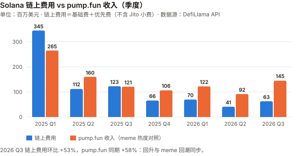
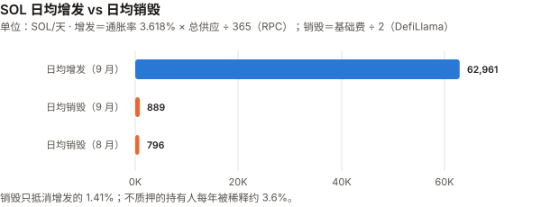
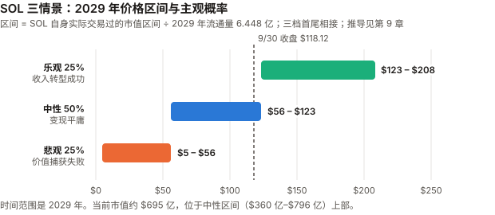

# SOL / Solana 完整调研与分析报告

> **编写日期**：2026 年 10 月 5 日
> **数据截止**：2026 年 9 月 30 日（9 月与 Q3 完整数据已闭合）；链上快照取自 10/5
> **版本**：2026 年 9 月版（第二期）**兼 Q3 季度回顾**
> **研究方法**：沿用 8 月首期框架。**本期第一次有上期论点可核对**（S8-1 至 S8-5，见 3.0）。
>
> **本版更新要点**：
>
> 1. **9 月 +14.61%，Q3 +60.34%**——收于 $118.12（币安日线）。按 beta 扣掉 BTC 的影响，9 月与 Q3 多出来的部分都只有约 0.6 个标准差，**属于噪声范围**。
> 2. **本期最重要的发现：8 月通过的「加倍减发」（SIMD-0550）至今没有在链上生效。**
>    Solana 官方 RPC 的 `getInflationGovernor` 显示通胀递减率仍为 **0.15**（提案要改为 0.30）；提案原文状态仍是「Review」，激活所需的 feature key 一栏为空。
>    **8 月版写「减发提速已通过」，混淆了「治理投票通过」与「协议已执行」。**
> 3. **链上费用 Q3 回升 53%**（DefiLlama，$4,110 万 → $6,290 万）——**但同期 meme 币发行平台 pump.fun 的收入也回升了 58%**。8 月版登记的 S8-1 要求「meme 币未复苏的情况下」收入回升，**Q3 的回升与 meme 复苏同步，不能算作「实用崛起」的证据**。
> 4. **SOL ETF 9/25 单日净流入 $8,670 万，为上市以来最高**（Farside 全历史统计行，一手）；9/21–25 一周 $1.88 亿（Farside 逐日加总），**「周度纪录」为媒体转述**；全月约 $2.72 亿（二手）。
> 5. **储备公司首次取得一手数据**（SEC 8-K / 10-K）：Forward Industries Q3 增持 94.9 万枚至 **850.1 万枚**，**公司自披露 mNAV：基本 0.684、完全摊薄 0.946**（已扣 $1.675 亿借款）；Upexi 234 万枚中 **108.4 万枚是可转债的抵押 SOL**（未转股须交还），扣除后净资产与市值大致相当（mNAV 约 1.0）。
> 6. **8 月版的多处数据被一手数据更正**（见 11.5）：质押量 3.75 亿 → **4.418 亿 SOL**（RPC）；通胀「约 3.8%」→ **3.618%**；验证者「906 个」→ RPC 显示有质押的为 **685 个**（口径不同，不能据此判断下降）；收入口径（21Shares 含 Jito 小费，DefiLlama 不含）。
> 7. **情景框架重建**：8 月版三档价格沿用自被推翻的收入倍数法，且档间有重叠和空档。本期改用 SOL 自身实际交易过的市值区间，三档首尾相接；**概率经审查后改为 35/30/35**（随机游走基线下中性档只有约 25%–30%），**本期不给单一基准预期**。
>
> **免责声明**：本报告不构成任何投资建议。所有分析仅供研究参考，投资决策请咨询专业顾问。

---

## 核心结论摘要（一页速览）

| 维度 | 核心判断 |
|------|----------|
| **SOL 是什么** | 一条**高性能单体区块链**（所有交易在主链完成），定位是**消费级应用的执行层** |
| **当前价格位置** | $118.12（9/30 币安收盘），市值约 **$695 亿**（CoinGecko 第 7）。距 ATH（$295.83，币安 2025-01-19 盘中）**−60.1%** |
| **9 月 / Q3 表现** | **9 月 +14.61%、Q3 +60.34%**。高于 BTC beta 预期 9 月 +6.2pp、Q3 +8.7pp，**都只有约 0.6 个标准差，不能排除噪声** |
| **本期最重要的发现** | **「加倍减发」投票通过了，但没有生效**。RPC 显示通胀递减率仍为 0.15，当前通胀 **3.618%**。生效后 2029 年当年少增发约 558 万枚，**与被否决的 SIMD-0553（每年多销毁约 422 万枚）同一量级** |
| **收入** | 链上费用（基础费 + 优先费，不含 Jito 小费）9 月 **$2,498 万**，Q3 环比 **+53%**；**但 pump.fun 同期 +58%**，回升与 meme 复苏同步。真同比：9 月 −33.8%、Q3 −48.7% |
| **供应抵消** | 9 月日均销毁约 **889 SOL**，日均增发约 **62,961 SOL**——**销毁只抵消增发的 1.41%**（同口径 8 月约 1.26%）。不质押的持有人每年被稀释约 3.6%。**这个比值只衡量供应抵消，不衡量质押者分到的优先费与 MEV** |
| **核心多头逻辑** | ETF 单日流入创纪录、连续净流入（单一配置者可决定流量符号）；稳定币 $164 亿创新高；TVL Q3 +33.5%（以美元计）；质押 4.418 亿 SOL（占总供应 69.6%）；30 个月以上零全网中断 |
| **核心空头逻辑** | 销毁/增发 1.41%；收入回升与 meme 同步（不能确认因果）；减发未生效；Forward 基本 mNAV 0.684；Upexi 一半 SOL 是可转债抵押、有 BitGo 借款；8/12 的基础设施集中风险没有新数据可证明已缓解 |
| **估值立场** | 情景以 SOL 自身实际交易过的市值区间为参照，概率 **35/30/35**（悲观/中性/乐观）。**本期不给单一基准预期**：按随机游走，2029 年还留在 2026 年交易区间的概率只有约 25%–30%，三档概率接近 |
| **风险等级** | 高于 BTC 与 ETH。年化波动 9 月 63.2%、过去一年 68.0%，对 BTC 的 beta 约 1.3 |

---

## 1. Solana 的起源与设计取舍

> 本章与 8 月首期相同，此处只保留理解本期内容必需的部分。完整内容见 `sol_research_report_202608.md` 第 1 章。

| 维度 | Bitcoin | Ethereum | **Solana** |
|------|---------|----------|-----------|
| 首要目标 | 抗审查的货币 | 去中心化的可编程平台 | **高吞吐的执行层** |
| 扩容路线 | 二层 | 二层（Rollup） | **单体链，主链直接扩容** |
| 对节点门槛的态度 | 刻意压低 | 中等 | **接受高门槛换性能** |
| 代价 | 吞吐低 | L2 生态碎片化 | **验证者成本高 → 中心化压力** |

**SOL 代币的三重角色**：

1. **手续费媒介**——**只有基础费（每笔交易签名 5,000 lamports）的 50% 被销毁**；优先费按 SIMD-0096 **100% 归出块验证者**；Jito 小费（MEV）在协议外支付给验证者
2. **质押资产**——4.418 亿 SOL 在质押（RPC 一手）
3. **储备 / 投资标的**——ETF 与上市公司持仓

**通胀规则**（RPC `getInflationGovernor`，一手）：初始 8%、每年递减 15%（taper 0.15）、终端 1.5%。**这三个参数可以被治理投票修改**——这是 SOL 与 BTC 的根本差异，也是本期核心发现的背景。

---

## 2. SOL 的发展阶段划分

> 阶段一至四见 8 月首期。阶段五追加本期事件。

### 阶段五：收入退潮与结构转型（2026）

| 时间 | 事件 |
|------|------|
| 2026 H1 | 链上费用（DefiLlama）$1.107 亿，**同比 −75.8%** |
| 2026-06-07 | 年内最低市值 **$360 亿**（CoinGecko） |
| 2026-08 | SOL +41.43%；8/12 路由故障致 28.83% 质押掉线（8 月版详述） |
| 2026-08-27 | **首次全网治理投票**：SIMD-0550（加倍减发）以 67% 通过，SIMD-0553（费用改革）被否 |
| **2026-09-15** | 9 月低点 **$95.82**（CLARITY 法案参议院投票失败当日） |
| **2026-09-18** | Agave 客户端 **v4.3.0** 作为主网稳定版发布（GitHub 一手） |
| **2026-09-22/24** | **Alpenglow 新共识在公共测试网激活**（媒体转述）；**主网未激活** |
| **2026-09-25** | SOL ETF 单日净流入 **$8,670 万**（上市以来最高，Farside）；SIMD-0553 修正案 #600 关闭未合并 |
| **2026-09-30** | Forward Industries 持仓 **850.1 万枚**（季度 +94.9 万） |
| **2026-Q3** | **+60.34%**；链上费用环比 +53%；pump.fun 收入环比 +58% |

---

## 3. SOL 当前现状分析

### 3.0 论点校验：8 月版登记的 5 条

| # | 论点 | 检验条件（摘要） | 9 月 / Q3 读数 | 状态 |
|---|------|------|------|------|
| S8-1 | 收入崩塌是「投机退潮 + 实用崛起」的转型 | Q3/Q4 收入在 **meme 币未复苏**的情况下环比 >30% 则成立；连续两季持平或续跌则证伪 | 链上费用 Q3 环比 **+53%**，**但 pump.fun 收入同期 +58%**（meme 复苏）；Q2 曾环比 −41% | ⏳ **Q3 两个分支都不满足**：收入回升了，但前提「meme 未复苏」不成立。Q4 再核 |
| S8-2 | 「软件同质化导致全网停摆」已过时（仅限这一类风险） | 单次 >20% 质押掉线，或最大 ASN 占比未在年底前降至 25% 以下，则错 | 9 月未见大规模掉线（10/5 掉线质押 0.03%，RPC）；**ASN 分布本期取不到** | ⏳ 年底核；**门槛 9 风险**：ASN 数据源本期不可得 |
| S8-3 | 治理集中度：单一大户可跨越门槛差额 | 后续投票中任一持票 >3% 的实体立场翻转决定了结果，则成立 | 9 月**没有新的全网治理投票** | ⏳ |
| S8-4 | SOL 是 BTC 的高 beta 版本 | 未来三个月 30 日相关性低于 0.5，则错 | 9 月 30 日相关性 **0.80–0.85**（最低 0.796，9/3） | ⏳ 11 月底核；9 月未触发 |
| S8-5 | 验证者经济恶化是趋势 | Q4 验证者数量环比回升 >10%，则错 | **RPC：有质押的验证者 685 个**（10/5）；8 月版的 906 是二手数据、口径不明 | ⏳ 以 685 为 Q3 末基准 |

**S8-1 是本期最有信息量的一条**：它的设计本身是对的——要求收入回升**不能来自 meme**。Q3 恰好给出了一次「收入回升 + meme 同步回升」的读数，
**这说明 Q3 的收入回升更像 8 月版所说的「投机退潮」的反向（投机回潮），而不是「实用崛起」。** 但它没有触发任何一个判定分支，按规则继续待验。

### 3.1 价格与市场

> 口径：币安 SOLUSDT 日线 UTC 收盘，与 BTC、ETH 9 月版统一。8 月版的价格来自搜索摘要。

| 指标 | 数值 |
|------|------|
| **9/30 收盘** | **$118.12** |
| 市值 | 约 **$695 亿**（收盘价 × 流通量 5.8831 亿，RPC）；CoinGecko 排名第 7 |
| ATH | $295.83（2025-01-19 盘中，币安） |
| **距 ATH** | **−60.1%** |
| 9 月区间 | 低 **$95.82**（9/15）/ 高 **$124.95**（9/27） |

| 区间 | SOL | BTC |
|------|------|------|
| **9 月**（8/31→9/30） | **+14.61%** | +6.42% |
| **Q3**（6/30→9/30） | **+60.34%** | +42.64% |
| Q2 | −11.45% | −14.15% |
| YTD | −5.24% | −4.59% |
| 近 1 年 | −43.40% | −26.68% |

**beta、R² 与噪声带**（XIN / CKB 期规则，并按 ETH 9 月版补上标准差）：

| 窗口 | 年化波动 | beta | R² | beta 预期 | 实际 | 高于预期 | 约几个标准差 |
|------|------|------|------|------|------|------|------|
| 9 月 | 63.2% | 1.31 | 0.73 | +8.42% | +14.61% | +6.19pp | **约 0.66** |
| Q3 | 55.4% | 1.21 | 0.70 | +51.68% | +60.34% | +8.65pp | **约 0.57** |
| 近 1 年 | 68.0% | 1.31 | 0.76 | −34.97% | −43.40% | −8.42pp | — |

> 标准差算法：残差年化波动 = 年化波动 × √(1 − R²)，再按窗口天数折算。9 月残差月度 1 个标准差约 9.4pp，Q3 约 15.3pp。
> **结论：9 月和 Q3 的超额部分都在噪声范围内，SOL 的上涨可以用「高 beta 跟随 BTC」解释。** 近一年的 −8.4pp 同样不显著。

**30 日相关性**（S8-4）：8/31 为 0.795，9/15 为 0.830，9/30 为 0.854。**SOL 与 BTC 在 9 月越来越同步。**

### 3.2 收入与生态：回升了，但跟着 meme 一起回升

> **本期起收入改用 DefiLlama 一手 API**，并读了适配器源码（`dimension-adapters/fees/solana.ts`）确认口径：
> **「fees」= 基础费 + 优先费（不含 Jito 小费）；「revenue」= 基础费 ÷ 2 = 销毁量**（源码第 35–36 行）。
> 8 月版引用的「H1 网络收入 $1.41 亿、−87.1%」来自 21Shares，**口径包含 Jito 小费**，与本表不可直接比较。

**链上费用季度序列**（DefiLlama，一手）：

| 季度 | 链上费用 | pump.fun 收入（对照：meme 热度） |
|------|------|------|
| 2025 Q1 | $3.450 亿 | $2.651 亿 |
| 2025 Q2 | $1.119 亿 | $1.602 亿 |
| **2025 Q3** | **$1.226 亿** | $1.209 亿 |
| 2025 Q4 | $6,580 万 | $1.063 亿 |
| 2026 Q1 | $6,960 万 | $1.222 亿 |
| 2026 Q2 | $4,110 万 | $9,160 万 |
| **2026 Q3** | **$6,290 万**（环比 **+53%**） | **$1.449 亿**（环比 **+58%**） |

> 图中数字（百万美元，取整）：链上费用 345 / 112 / 123 / 66 / 70 / 41 / 63；pump.fun 收入 265 / 160 / 121 / 106 / 122 / 92 / 145（2025 Q1 至 2026 Q3）。纵轴刻度 0 / 100 / 200 / 300。

| 比较 | 结果 |
|------|------|
| 9 月链上费用 | **$2,498 万**（8 月 $2,221 万） |
| 9 月真同比（vs 2025-09 $3,775 万） | **−33.8%** |
| Q3 真同比（vs 2025 Q3） | **−48.7%** |
| H1 2026 真同比（DefiLlama 口径） | $1.107 亿 vs $4.569 亿 = **−75.8%** |

**这张表说明的事**：2025 Q1 至今，链上费用和 pump.fun 收入**六次季度环比变动里有五次同向**（唯一例外是 2025 Q3：费用升、pump.fun 降）。
**Q3 2026 的回升，在时间上与 meme 平台收入的回升完全重合**——这不能证明因果，但它削弱了「收入回升来自稳定币/RWA 等实用场景」的读法。
> ⚠️ **一个未排除的共同因子**（`_bian`）：两条序列都是先以 SOL 计价、再按币价折成美元，**SOL 价格本身就是共同乘数**；本报告给 TVL 做了价格平减，却没有给这两条序列做。去掉价格因子后同向关系还剩多少，**本期未测**。

**同期在增长的「实用」指标**（DefiLlama，一手）：

| 指标 | 6/30 | 8/31 | **9/30** | 同比 |
|------|------|------|------|------|
| Solana 上的稳定币 | $153.6 亿 | $159.7 亿 | **$164.2 亿** | +16.3%（vs 2025-09-30 $141.2 亿） |
| DeFi TVL | $49.2 亿 | $58.0 亿 | **$65.7 亿** | — |

| 指标 | Q2 2026 | **Q3 2026** | 环比 |
|------|------|------|------|
| DEX 成交额 | $1,859 亿 | **$1,994 亿** | +7.3% |
| 生态合计费用（含应用层） | $6.39 亿 | **$9.48 亿** | +48.3% |

> **TVL 与稳定币的增长要打折读**：TVL 以美元计，SOL 价格 Q3 涨了 60%，TVL 涨 33.5% 意味着以 SOL 计反而下降；
> 稳定币存量 +16.3% 是真实的美元增长，但**它产生的费用不在「链上费用」里**——稳定币转账的手续费极低。
> **DEX 成交额只增 7.3%，而生态费用增 48%**——费用增长主要来自单价更高的交易（与 meme 交易相符），不是成交规模。

### 3.3 质押与验证者经济

> **本期起改用 Solana 官方 RPC**（`api.mainnet-beta.solana.com`，`getVoteAccounts`、`getSupply`、`getInflationRate`，10/5 快照，一手）。

| 指标 | 数值 |
|------|------|
| 总供应 / 流通量 | **6.3523 亿 / 5.8831 亿 SOL** |
| **质押量（activated stake）** | **4.418 亿 SOL**——占总供应 **69.6%**、占流通量 75.1% |
| **有质押的验证者** | **685 个**（在线 670 + 掉线 15） |
| 掉线质押占比 | **0.03%** |
| 验证者级 Nakamoto 系数（达到 1/3 质押所需的最少验证者数） | **18** |
| 最大单个验证者 / 前 10 大 | 4.06% / 24.56% |
| 佣金为 0% / 100% 的验证者 | 229 个 / 62 个 |
| 当前通胀率 | **3.618%**（epoch 1049） |
| 增发给质押者的毛收益率 | 约 **5.20%**（年增发 ÷ 质押量，未扣佣金） |

> ⚠️ **与 8 月版的差异**：8 月版写质押 3.75 亿 SOL（64%）、验证者 906 个（2026-06），**全部来自二手**。
> **验证者数量不能直接比较**：RPC 只能给当前快照，8 月版的 906 口径不明（可能包含无质押的投票账户），**本报告不据此判断验证者在减少**。
> Nakamoto 系数 18 是**验证者级**的；同一运营方控制多个验证者时，**实体级的数字会更低**——本报告未做实体归并。

**8/12 事件涉及的基础设施集中度**（单一 ASN 占 27.34%，超过 Solana 自设的 25% 上限）：**本期没有取得新的 ASN 分布数据**（validators.app 等需要付费密钥），**无法判断是否已缓解**。

### 3.4 网络稳定性与升级

| 事项 | 状态 | 来源 |
|------|------|------|
| 全网中断 | 2024-02-06 以来未发生（8 月版） | 转述 |
| 10/5 掉线质押 | 0.03% | RPC ✅ |
| Agave v4.3.0 | 9/18 发布，「适用于测试网、开发网和主网」 | GitHub `anza-xyz/agave` ✅ |
| **Alpenglow**（新共识，目标约 150 毫秒最终确认、取消投票交易） | **SIMD-0326 状态「Review」**；9/22–24 在公共测试网激活（媒体转述）；**9/28 并未如部分媒体所说在主网激活** | GitHub SIMD 仓库 ✅；测试网激活为转述 ⚠️ |
| 客户端分布 | Frankendancer 约 21%、完整 Firedancer 约 14%（**来源日期不一，未核实**） | 搜索摘要 ⚠️ |

> **Alpenglow 的含义**：它会取消投票交易——**投票交易目前占 Solana 交易笔数的大部分**，也是验证者每年约 1.1 SOL/天投票成本的来源。
> 若上线，验证者的固定成本会下降（利好小验证者），**交易笔数统计也会断层**——下期比较交易数据时要注意。

### 3.5 宏观环境

> 与 BTC 9 月版共用，详见该报告 3.1 与 3.4。

| 因素 | 9 月末 | 来源 |
|------|------|------|
| 联邦基金利率 | **3.75–4.00%**（美联储 9/16 加息 25bp，12:0） | federalreserve.gov ✅ |
| 10 年期美债 | **5.29%**（年内最高） | 美国财政部 ✅ |

> **与 BTC、ETH 9 月版相同的观察**：宏观全面偏鹰，SOL 仍涨 14.6%。**本报告不把宏观偏鹰直接翻译成 SOL 偏空**，也不反过来说利率无关。
> SOL 9 月的上涨在 beta 意义上**完全可以由 BTC 解释**（见 3.1）。

### 3.6 Q3 季度回顾（本版新增）

| | Q2 2026 | **Q3 2026** |
|------|------|------|
| SOL 季度涨跌（币安） | −11.45% | **+60.34%** |
| 链上费用 | $4,110 万 | **$6,290 万**（+53%） |
| pump.fun 收入 | $9,160 万 | **$1.449 亿**（+58%） |
| DEX 成交额 | $1,859 亿 | $1,994 亿（+7%） |
| 季末稳定币 | $153.6 亿 | **$164.2 亿** |
| 季末 TVL | $49.2 亿 | **$65.7 亿** |
| Forward Industries 持仓 | 755.3 万 | **850.1 万** |

**一句话**：**Q3 是一个高 beta 资产在 BTC 大涨季度里的表现**——价格超额在噪声内，收入回升与 meme 回潮同步（不能确认因果）；稳定币存量同比 +16%，ETF 流入为正（但单一配置者就能决定流量符号）。

---

## 4. 代币经济学与治理（SOL 特有）

### 4.1 本期核心发现：投票通过 ≠ 协议执行

**8 月版 4.2 记录了 SIMD-0550（加倍减发）以 67% 通过，并在多头 5、9.1、10.3 中把它当作「已确定的改善」。本期核对链上状态：**

| 检查 | 结果 | 来源 |
|------|------|------|
| 链上通胀参数 | `getInflationGovernor` = initial 0.08、**taper 0.15**、terminal 0.015 | **Solana RPC，一手** |
| SIMD-0550 要改成 | taper **0.30**（年递减 15% → 30%） | 提案原文 |
| 提案原文状态 | **`status: Review`**；`feature:` 一栏写着「（接受后填写 feature key 与跟踪 issue）」 | GitHub `solana-foundation/solana-improvement-documents` ✅ |
| 当前通胀率 | **3.618%** | RPC `getInflationRate` ✅ |

**结论：截至 10/5，SIMD-0550 没有在主网生效。** Solana 的协议变更需要在客户端代码里实现、再由 feature gate 激活；治理投票只表达了意愿。

**这个更正有多重要——用盈亏平衡的方式回答**（DOT 期规则）：

| 2029 年流通量（约三年后，按当前流通量 5.8831 亿外推） | 通胀路径 | 三年累计增长 | 2029 年流通量 |
|------|------|------|------|
| **按当前参数**（taper 0.15） | 3.62% → 3.08% → 2.61% | +9.6% | **约 6.448 亿** |
| 若 SIMD-0550 立即生效（taper 0.30） | 3.62% → 2.53% → 1.77% | +8.1% | 约 6.358 亿 |
| **差异** | | | **约 1.4%** |

> **SIMD-0550 若明天生效，到 2029 年流通量少约 1.4%（三年累计）；看 2029 年当年，少增发约 558 万枚，把不质押者的稀释率从约 2.6% 降到约 1.8%。**
> **用同一把尺子比较**（`_bian`）：被否决的 SIMD-0553（销毁最多提高约 14 倍）按当前销毁水平每年多销毁约 **422 万枚**——**两个方案同一量级**。
> **所以 8 月版的错误在于状态（写成已执行）**；本报告初稿另写「量级本来就不大」，是拿三年累计占比（看起来小）去和另一个方案的销毁倍数（看起来大）比较，**尺子不一致，已删除**。
> （外推假设销毁可忽略、非流通部分不变，未计入质押奖励在流通/非流通之间的分配差异。）

### 4.2 销毁与增发：持币人价值桥

| 9 月 | 数值 | 来源 |
|------|------|------|
| 月销毁 | **26,656 SOL**（日均 **889 SOL**；8 月日均 796） | DefiLlama `revenue`（= 基础费 ÷ 2）按日价折算 |
| 日均增发 | **62,961 SOL** | RPC 通胀率 3.618% × 总供应 6.3523 亿 ÷ 365 |
| **销毁 ÷ 增发** | **1.41%**（同口径 8 月约 1.26%；8 月版写的 1.06% 基于未注明来源的 648 SOL/天） | |

> 图中数字：日均增发 62,961 SOL、日均销毁 889 SOL（9 月），8 月日均销毁 796 SOL。

> 8 月版写日均销毁 648 SOL，来源未注明；**按同一 DefiLlama 口径，8 月为 796 SOL/天**。
> **DefiLlama 的基础费按「交易数 × 5,000 lamports」计算**（源码），而基础费实际按签名数收取——多签名交易会被少算，**销毁量是下限**。

**结论不变**：**对不质押的持有人，SOL 每年稀释约 3.6%，销毁几乎不抵消**；质押者拿到约 5.2% 的毛增发补偿（扣佣金前）。

### 4.3 价值捕获的另一条路：SIMD-0553 修正案关闭

8 月被否决的 SIMD-0553（把基础费改为资源计价、销毁提高最多约 14 倍）有一个修正案 #600，提议把包含费从 2,500 调到 2,600 lamports 以抵消验证者收入下降约 4%。**#600 于 9/25 关闭，未合并**（GitHub 一手）。
SIMD-0553 原文仍为「Draft」。**提高销毁的方案本期没有进展**；它与 SIMD-0550 的供应效应同一量级（见 4.1）。

---

## 5. 上市公司 SOL 储备

> **本期起改用各公司提交给 SEC 的 8-K / 10-K（一手）**；附件中的新闻稿是公司自述，SEC 不核验内容。

### 5.1 头部公司

| 公司 | 持仓 | 日期 | 来源 |
|------|------|------|------|
| **Forward Industries（FWDI）** | **8,501,298 SOL**（约 1.4% 流通量） | 9/30 | 10/1 8-K 附件 |
| DeFi Development（DFDV） | 2,538,010 SOL 及等价物 | 9/25 | 9/28 8-K |
| **Upexi（UPXI）** | 2,340,150 SOL，**其中 1,084,176 枚为可转债抵押**（95% 已质押） | 6/30（财年末） | 9/17 10-K |
| Solana Company（HSDT） | 本期未取得持仓；9/30 宣布约 $1,430 万定向增发 | — | 9/30 8-K |

> ⚠️ **本节在发布前审查后重写**（Codex）。初稿自己用「完全摊薄股数 × 股价 ÷ SOL 毛持仓」算出 FWDI mNAV 0.82，**漏了借款、现金与其他资产**；又用 9/30 的每股 SOL 去判断 9/22 那笔增发是否摊薄，**用了事后数据**。
> Upexi 的「mNAV 0.34」**没有处理可转债抵押的 108.4 万枚 SOL**。三处都已按公司一手披露更正。

### 5.2 Forward Industries：公司自披露的 mNAV

**公司 10/1 8-K 附件的资本结构表（未经审计，一手）**：

| 项目 | 金额 |
|------|------|
| SOL 持仓公允价值（8,501,298 枚 × $118.06） | $10.037 亿 |
| 其他数字资产 | $2,690 万 |
| 现金 | $730 万 |
| **机构借款** | **−$1.675 亿**（6/30 为 $1.05 亿） |
| **净资产** | **$8.704 亿** |
| **mNAV（基本，7,628.8 万股 × $7.80）** | **0.684** |
| **mNAV（完全摊薄，1.055 亿股）** | **0.946**（6/30 为 0.908） |

| Q3 变化 | 数值 |
|------|------|
| 增持 | **+948,601 SOL**（+13%），均价约 $83（约 $7,870 万） |
| 每股 SOL（完全摊薄） | 0.0730 → 0.0806（季度 +10.4%） |
| 完全摊薄股数 | 1.0353 亿 → 1.0554 亿（**+1.9%**） |
| 机构借款 | $1.05 亿 → $1.675 亿（**+$6,250 万**） |
| 9/22 定向增发 | 312.5 万股 × $8.00 = 约 $2,500 万 |

**读法**：
- **Q3 买币约 $7,870 万，主要靠新增借款（+$6,250 万）与 9/22 增发（约 $2,500 万）**——每股 SOL 上升的主要原因是**加杠杆**，不是增发溢价。公司说「增发是增值的，每股 SOL 的增长证明了这一点」——**这个推论不成立**：用借款买币同样会让每股 SOL 上升。
- **9/22 增发是否摊薄无法判定**：按 9/30 的完全摊薄每股净值（$8.704 亿 ÷ 1.055 亿 ≈ $8.25），$8.00 约低 3%；但 9/22 当天的每股净值未披露。初稿的「折价 16.3%」已撤回。
- **完全摊薄股数季内只增 1.9%，而 9/22 单笔就占约 3.0%**——口径（基本 vs 完全摊薄、认股权证行权）未能核清，**列为待核实**。

### 5.3 Upexi：一半 SOL 是可转债的抵押

**10-K 附注 5 的持仓表（一手）**，按类别：流动 899,431、锁定 352,543、质押收益 4,000、**可转债 1,084,176**，合计 2,340,150 枚。

**10-K 原文**：这批票据以 SOL 换入，「若票据未转股，公司须交付当初收到的相应比例的 SOL 来清偿本金」。转股价为 **$4.25 与 $2.39**，而 9/30 股价 **$1.14**——**转股的可能性很低，这部分 SOL 在经济上是欠票据持有人的**。

| 项目 | 数值 |
|------|------|
| 扣除可转债抵押后的净 SOL | 2,340,150 − 1,084,176 = **1,255,974 枚** |
| 按 9/30 价格 | 约 $1.484 亿 |
| BitGo 借款 | **−$5,730 万**（保证金追缴线 300%、清算线 115%；抵押可为 SOL、USDC、美元） |
| 粗算净资产（未计其他资产负债） | 约 **$9,110 万** |
| 市值（8,210 万股 × $1.14） | 约 $9,360 万 |
| **粗算 mNAV** | **约 1.03** |
| 持仓均价 / 浮亏 | $154 / **约 −23%** |
| 6/30 账面股东权益 | **−$5,381 万**（10-K 资产负债表） |

> **初稿的「mNAV 0.34、深度折价」是错的**——扣掉欠票据持有人的 SOL 和 BitGo 借款后，市场给 Upexi 的估值与其净资产大致相当。
> **BitGo 借款的两条线**（若全部以 SOL 抵押、按 125.6 万枚净 SOL 计）：清算线 115% 对应约 $52；**保证金追缴线 300% 对应约 $137——已高于现价**，而公司没有披露正被追缴，**说明抵押品不只这部分 SOL（可能包括可转债抵押的 SOL 或 USDC），或追缴线定义与这里的算法不同**。
> **抵押构成未披露**，这两个价格只是在「全部用 SOL 抵押」假设下的示意，**实际触发价无法计算**。

**对 8 月版判断的影响**：8 月版用 Upexi 说明「发行溢价崩塌」。本期一手数据显示，它的市值已回到大致等于净资产的水平，**不再是深度折价**；**储备公司里折价最深的反而是 Forward（基本 mNAV 0.684）**。

---

## 6. SOL 的核心价值逻辑

### 6.1 多头逻辑

| # | 逻辑 | 强度 | 说明 |
|---|------|------|------|
| 1 | **ETF 单日流入创纪录** | ★★★☆☆ | 9/25 单日 $8,670 万为上市以来最高、9/21–25 周流入 $1.88 亿（Farside 一手）。**但单一大型配置者就可能决定一个月的流量符号**（见记分卡拒登条目），且全月数据为二手 |
| 2 | **稳定币存量创新高** | ★★★☆☆ | $164.2 亿，同比 +16.3%（DefiLlama 一手）。**但它产生的链上费用很少**，不直接改善持币人价值 |
| 3 | **成本优势结构性** | ★★★★☆ | 基础费 5,000 lamports/签名，架构决定 |
| 4 | **生息资产** | ★★★☆☆ | **本期降为三星**：通胀奖励毛收益约 5.2%（RPC），这部分对整个持有人群体是转移；**质押者另有分到的优先费与 Jito 小费，本报告未测量** |
| 5 | **减发已投票通过** | ★★☆☆☆ | **本期降为两星**：投票通过但**未生效**（RPC taper 0.15）。生效后 2029 年当年少增发约 558 万枚，可把不质押者的稀释率从约 2.6% 降到约 1.8% |
| 6 | **软件同质化风险已缓解** | ★★★☆☆ | 多客户端（Firedancer 系）运行；Alpenglow 已在测试网。**基础设施集中风险无新数据** |
| 7 | **收入 Q3 回升 53%** | ★★☆☆☆ | **本月新增**。DefiLlama 一手。**但与 pump.fun +58% 同步**（两者都以 SOL 计价再折美元，SOL 价格是共同因子，不能确认因果） |

### 6.2 空头逻辑

| # | 逻辑 | 强度 | 说明 |
|---|------|------|------|
| 1 | **销毁几乎不抵消增发** | ★★★★☆ | 销毁 ÷ 增发 **1.41%**（RPC + DefiLlama 一手）。**这个比值只衡量供应抵消**——质押者分到的优先费与 MEV 未测量，且 DefiLlama 的基础费按交易数估算，故从五星降为四星 |
| 2 | **收入回升与 meme 同步** | ★★★☆☆ | **本月新增**。链上费用与 pump.fun 收入六次季度环比变动里五次同向；Q3 同步回升。**两者都受 SOL 价格这一共同因子影响**，未做价格平减，故三星 |
| 3 | **真同比仍深度为负** | ★★★★☆ | 9 月 −33.8%、Q3 −48.7%（DefiLlama 一手）。**对应 8 月版的空头 1（「收入暴跌 87%」五星），本期降为四星**，理由是改用一手口径后跌幅更小（−75.8% vs −87.1%） |
| 4 | **储备公司在加杠杆、估值低于净资产** | ★★★☆☆ | FWDI 基本 mNAV 0.684（公司自披露），Q3 买币主要靠新增借款 $6,250 万；Upexi 一半 SOL 是可转债抵押、另有 BitGo 借款、浮亏 23%（SEC 一手）。**审查后降为三星**：Upexi 扣除抵押后 mNAV 约 1.0，FWDI 完全摊薄 0.946，折价没有初稿写的深 |
| 5 | **价值捕获方案停滞** | ★★★☆☆ | SIMD-0553 修正案 #600 关闭未合并；SIMD-0550 未生效 |
| 6 | **基础设施集中风险未证明缓解** | ★★★☆☆ | 8/12 单一 ASN 占 27.34%（8 月版，转述）；**本期无新数据**，不能说恶化也不能说缓解 |
| 7 | **高 beta、高波动** | ★★★☆☆ | 年化波动 63.2%（9 月）、68.0%（一年）；beta 约 1.3 |

> **多空同源检查（DOT 期规则）**：
> - 多头 7（收入回升）与空头 2（回升依赖 meme）、空头 3（真同比为负）是同一条费用序列的三个读法——**多头 7 只给两星，空头 3 从五星降到四星**。
> - 多头 4（生息）与空头 1（销毁 / 增发 1.41%）同源：通胀奖励就是增发——**多头 4 已降为三星，空头 1 也因未测质押者的费用分成降为四星**。
> - 多头 5（减发通过）的下调与本期核心发现（未生效）一致。

### 6.3 机构观点

**本期没有找到 9 月发布的传统金融机构对 SOL 的研究观点。** 能找到的一手机构动作是 ETF 资金流（Farside）与 Bitwise BSOL 占周度流入 68%（媒体转述）。
**这是一处配平缺口**：本报告的事件归因与 ETF 全月数据来自加密原生媒体。

---

## 7. SOL 与其他资产的比较

> 口径：涨幅统一按币安日线 UTC 收盘；费用为 DefiLlama 同一批 API。

| 指标 | **SOL** | ETH | BTC |
|------|------|------|------|
| 9 月 | **+14.61%** | +8.85% | +6.42% |
| Q3 | **+60.34%** | +70.86% | +42.64% |
| 年化波动（9 月） | 63.2% | 43.6% | 41.2% |
| 9 月 L1 费用 | **$2,498 万** | $1,591 万 | — |
| 销毁 ÷ 发行 | **1.41%** | 2.27% | 不适用（无销毁） |
| 年通胀 | **3.618%** | 0.862% | 约 0.8% |
| DeFi TVL（9/30） | $65.7 亿 | $532.9 亿 | — |
| 稳定币 | $164.2 亿 | — | — |

> **一组值得注意的对照**：SOL 9 月 L1 费用（$2,498 万）**高于 ETH（$1,591 万）**，而 SOL 市值约为 ETH 的 21%。
> **但 SOL 持币人从中得到的更少**：SOL 只销毁基础费的一半（优先费全归验证者），ETH 销毁全部 base fee；且 SOL 的通胀是 ETH 的约 4 倍。
> **「网络收入高」与「持币人价值高」是两回事**——这是 8 月版第 9 章重建的出发点，本期的横向数据再次印证。

---

## 8. 未来 3–12 个月的关键变量

| 时间 | 催化剂 | 方向 | 重要性 |
|------|------|:---:|:---:|
| **未定** | **SIMD-0550 是否实现并激活**（RPC taper 由 0.15 变为 0.30 即为生效） | ↑（慢） | ★★★☆☆ |
| **未定** | **Alpenglow 主网激活**（取消投票交易、降低验证者成本） | ↑ | ★★★★☆ |
| **Q4** | **链上费用能否在 meme 不复苏的情况下回升**（S8-1） | 决定性 | ★★★★★ |
| 持续 | ETF 流量能否延续 9 月下旬的纪录速度 | ↑/↓ | ★★★☆☆ |
| 持续 | **储备公司杠杆与 mNAV**（FWDI 借款 $1.675 亿、基本 mNAV 0.684；UPXI 可转债抵押 108.4 万枚 + BitGo 借款） | ↓ | ★★★★☆ |
| 10/27–28、12/8–9 | FOMC；点阵图指向年内再加一次 | 双向 | ★★★☆☆ |
| 年底 | 最大 ASN 质押占比是否降到 25% 以下（S8-2） | ↑/↓ | ★★★☆☆ |

---

## 9. 情景推演（2029 年）

### 9.1 为什么重建情景框架

8 月版自己在 9.4 弱点 6、7 里承认：三档价格（$120–270 / $58–147 / $10–35）**沿用自已被推翻的收入倍数法**，概率「应当被当作粗略排序」。
**此外三档之间有重叠（$120–147）和空档（$35–58）**——按 PONS 期规则，情景必须首尾相接、覆盖全部取值。

**推导方式**（与 ETH 9 月版相同）：价格 = 参照市值 ÷ 2029 年流通量。**参照市值取 SOL 自身实际交易过的市值区间**，2029 年流通量按当前链上通胀参数推算（见 4.1），两者都是可复算的一手数据；**三档的划分与概率是作者的判断**。
这个方法不需要假设一个收入倍数——**它只说「过去市场给过 SOL 什么价」**，弱点见 9.4。

**SOL 历年市值区间**（CoinGecko 2022 年至今日线，一手）：

| 年份 | 最低市值 | 最高市值 |
|------|------|------|
| 2022 | **$35 亿**（12/30） | $554 亿 |
| 2023 | $37 亿 | $519 亿 |
| 2024 | $361 亿 | $1,220 亿 |
| 2025 | $544 亿 | **$1,344 亿**（9/19，2022 年以来最高） |
| 2026（至 9/30） | **$360 亿**（6/7） | **$796 亿**（1/15） |

**2029 年流通量**：按当前参数（taper 0.15）约 **6.448 亿**枚（见 4.1）。

### 9.2 三种情景

| 情景 | 参照市值 | **2029 年价格** | 相对现价 $118.12 | 主观概率 |
|------|------|------|------|------|
| **乐观**：市值回到 2024–2025 年水平 | $796 亿 – $1,344 亿（2026 年高点 → 2022 年以来最高） | **$123 – $208** | +4% ~ +76% | **35%** |
| **中性**：留在 2026 年交易区间 | $360 亿 – $796 亿（2026 年实际交易区间） | **$56 – $123** | −53% ~ +4% | **30%** |
| **悲观**：跌破 2026 年低点 | $35 亿 – $360 亿（2022 年最低 → 2026 年最低） | **$5 – $56** | −95% ~ −53% | **35%** |

> 图中横轴刻度为 $0 / $50 / $100 / $150 / $200 / $250；虚线为 9/30 收盘价。

**三档首尾相接，覆盖 $35 亿–$1,344 亿**；超出的尾部并入相邻档。当前市值约 $695 亿，落在中性区间内（距上沿 +14.5%、距下沿 −48%）。

**先给一个机械基线**（`_bian` 审查后补算）：假设市值是年化波动 55%–68% 的随机游走（9 月实测 63.2%、过去一年 68.0%），从 $695 亿出发约 3.25 年：

| 漂移假设 | 悲观（< $360 亿） | 中性（$360 亿–$796 亿） | 乐观（> $796 亿） |
|------|------|------|------|
| 均值不变（中位数逐年下移） | 43%–53% | 24%–30% | 24%–26% |
| 中位数不变 | 25%–30% | 25%–30% | 45%–46% |
| **本版主观概率** | **35%** | **30%** | **35%** |

> ⚠️ **初稿给中性 50%，理由是「2026 年 SOL 已在这个区间里从上沿走到下沿再回来」**——`_bian` 指出这条证据**恰好说明区间宽度只相当于 9 个月的波动**，按报告自己的波动率算，三年后留在区间内的概率约 25%–30%，**证据与结论方向相反**。
> 初稿还写「悲观与乐观对称，作者没有理由认为哪一边更近」，而同一节又写现价「靠近上沿」（上沿 +14.5%、下沿 −48%），自相矛盾。两处都已删除。

**为什么是 35/30/35**：中性取基线的上沿（30%）；两侧尾部的基线取决于漂移假设，作者**没有可靠依据判断 SOL 三年的漂移方向**，所以两侧取对称的 35%。

**这意味着本期没有单一的基准预期**——三档概率接近，SOL 三年后的分布很宽。**按 PONS 期规则，本报告因此撤回全文的方向性措辞**（初稿写的「作者的基准预期在中性档」已删除）。
**进出两侧尾部的主要路径是 beta**（SOL 是 BTC 的高 beta 版本），不是叙事事件——2024–2025 年市值到过 $1,344 亿，靠的是 meme 与 ETF；6 月跌到 $360 亿时，悲观叙事里的事件一件也没发生。**下面的叙事只是可能的路径之一，不用来推概率**：

- **乐观**：回到 2024–2025 年的市值水平。可能的路径：BTC 继续上涨叠加 1.3 倍 beta；或收入在 meme 不复苏时回升（S8-1 成立）。
- **中性**：留在 2026 年的交易区间。
- **悲观**：跌破 2026 年 6 月的低点。可能的加速因素：储备公司加杠杆（Forward 借款 $1.675 亿）、基础设施集中风险。悲观区间下沿取 2022 年 FTX 后的 $35 亿，**代表一次存在性危机，不是基准悲观**；**这一档的概率是「低于 $360 亿」这个阈值事件，区间多宽不影响它**。

### 9.3 敏感性：最大的不确定性在参照区间，不在流通量

| 输入 | 推到哪一端 | 中性区间价格 |
|------|------|------|
| 2029 年流通量 6.448 亿（taper 0.15） | 基准 | $56 – $123 |
| 若 SIMD-0550 立即生效（6.358 亿） | 流通量下端 | $57 – $125（**+1.4%**；本模型固定市值，供应政策只能按比例传导，**这一行不衡量估值效应**） |
| 若参照区间换成 2024–2025 年（$361 亿–$1,344 亿） | 区间上移 | $56 – $208 |

> ⚠️ 按 TRX 期教训：两行的摆幅之比反映的是作者选的扰动宽度。**能说的只是**：**选哪一段历史作参照，才是决定区间的那个输入**；减发那一行的「1.4%」是模型结构决定的（市值固定），不是测出来的估值影响。

### 9.4 这套方法的弱点

1. **参照区间不是估值**：它说的是「市场给过什么价」，不是「应该值多少」。SOL 对持币人几乎没有现金流（销毁 ÷ 增发 1.41%），**本报告没有一个能从基本面推出价格的模型**——8 月版尝试过（收入倍数），已被推翻。
2. **悲观下沿 $35 亿来自 FTX 崩溃**，那时 SOL 被 FTX 资产抛售预期压制，市场结构与现在不同。
3. **2029 年流通量假设销毁可忽略、非流通部分不变**。
4. **概率是主观赋值**，与 8 月版不可比（区间不同）；本期给出了随机游走基线作对照。
5. **基础设施集中风险（8/12 类事件）没有进入任何参数**——它是一个可能让悲观情景提前发生的尾部风险。

---

## 10. 投资与风险启示

### 10.1 SOL 现在处于什么位置

**一句话：一个高 beta 资产在 BTC 大涨季度里涨了 60%，而它自己的基本面在 Q3 没有发生方向性变化。**

- 价格超额在噪声内（约 0.6 个标准差）；
- 收入回升与 meme 回潮同步；
- 减发投票通过但未生效；
- 稳定币存量 +16% 同比是真实的美元增长；ETF 流入为正，但单一配置者就能决定流量符号。

### 10.2 策略框架

> 以下为研究性质的框架整理，**不构成投资建议**。

| 持有者类型 | 框架 |
|------|------|
| **未持有者** | 若已持有 BTC，SOL 提供的是**同向、更高 beta** 的敞口（30 日相关 0.85），分散价值很低 |
| **已持有且未质押** | 每年被稀释约 3.6%；质押毛收益约 5.2%（扣佣金前），**质押是占优选择**，但这笔收益来自其他未质押者，不是网络创造的价值 |
| **通过储备公司股票持有** | **FWDI 基本 mNAV 0.684、完全摊薄 0.946**（公司自披露，已扣借款）；Q3 主要靠借款买币。**UPXI 扣除可转债抵押与借款后 mNAV 约 1.0**。**看 mNAV 必须先扣掉负债和欠出的 SOL**——本报告初稿就因没扣而算错 |

**8 月版的承诺是否被触发**：8 月版 10.2 的判据表写的是「环比能否回升 >30% **且来源是稳定币/RWA**」与销毁/增发比「是否出现**实质**改善」，承诺是「→ **判定转型说成立**」，进而降星。
**本期收入环比 +53%，但来源与 meme 同步，不满足「来源是稳定币/RWA」；销毁/增发从同口径约 1.26% 升到 1.41%，不是实质改善**——**承诺没有被触发**。

> ⚠️ **初稿写「两个条件字面上都满足了，但本报告不执行」，并把它记为 8 月版的错误——这是误引了 8 月版原文**（`_bian`）：8 月版的条件本来就包含来源要求，并不宽。初稿还用了跨口径的 1.06% 夸大了比值的改善。已删除。

### 10.3 关键监控指标

| # | 指标 | 当前值 | 改变结论的阈值 | 观测方式 |
|---|------|------|------|------|
| 1 | **销毁 ÷ 增发** | **1.41%** | >10% → 持币人价值开始有意义 | DefiLlama `revenue` + RPC |
| 2 | **链上费用 vs pump.fun 收入** | Q3 $6,290 万 / $1.449 亿 | **费用回升而 pump.fun 不回升** → S8-1 转型说成立 | DefiLlama |
| 3 | **通胀递减率** | **0.15** | 变为 0.30 → SIMD-0550 生效 | RPC `getInflationGovernor` |
| 4 | Alpenglow 主网 | 未激活 | 激活 → 投票交易消失，交易笔数统计断层 | RPC / GitHub |
| 5 | **储备公司 mNAV（扣负债后）与借款** | FWDI 0.684（基本）/ 0.946（摊薄）；UPXI 约 1.0 | FWDI 基本 mNAV 持续 <1 且继续借款买币 → 杠杆风险上升 | 公司 8-K 资本结构表 |
| 6 | 有质押的验证者 | 685 | Q4 环比 >+10% → S8-5 判错 | RPC |
| 7 | ETF 月度流量 | 9/15–9/30 +$2.38 亿 | — | Farside |
| 8 | 掉线质押 / 最大 ASN | 0.03% / 无数据 | 单次 >20% 掉线 → S8-2 判错 | RPC / 待补数据源 |

### 10.4 风险提醒

1. **SOL 是 BTC 的高 beta 版本**：9 月 30 日相关 0.85、beta 1.31。
2. **「投票通过」不等于「已经生效」**——本期最该记住的一条。
3. **储备公司在加杠杆**：持仓最多的 Forward Q3 买币主要靠借款（+$6,250 万，余额 $1.675 亿），基本 mNAV 0.684（推断：杠杆上升会放大 SOL 下跌时的压力，未验证）。
4. **基础设施集中风险没有新数据**——没有数据不等于风险消失。
5. **本报告自身**：SOL 记分卡尚无已判定的论点；本系列 BTC 记分卡正确率 11%（1/9）。

### 10.5 长期认知

1. **治理投票表达的是意愿，协议代码才是规则。** 读一条「已通过」的治理新闻，要再查一次链上参数——**一次 RPC 调用就够**。
2. **收入回升要看它从哪里来。** 8 月版设计了一个好的检验（S8-1 要求 meme 未复苏）。本期用 pump.fun 的收入做对照，看到 Q3 的回升与 meme 同步——**同步不等于因果**（两者都受 SOL 价格影响），但它足以说明「实用崛起」的读法没有得到支持。
3. **网络收入高 ≠ 持币人价值高**：SOL 的 L1 费用高于 ETH，销毁 ÷ 发行却更低。

---

## 11. 附录

### 11.1 关键数据速查（截至 2026-09-30）

| 类别 | 指标 | 数值 |
|------|------|------|
| **市场** | 9/30 收盘 / 市值 | $118.12 / 约 $695 亿（第 7） |
| | 9 月 / Q3 / YTD | **+14.61% / +60.34% / −5.24%** |
| | 距 ATH | −60.1% |
| | 30 日相关（vs BTC） | 0.854 |
| **供应与通胀** | 总供应 / 流通 | 6.3523 亿 / 5.8831 亿 |
| | 通胀率 / taper | **3.618% / 0.15**（SIMD-0550 未生效） |
| | 日均增发 / 日均销毁 | 62,961 / 889 SOL |
| | 销毁 ÷ 增发 | **1.41%** |
| **费用** | 9 月链上费用 | $2,498 万（真同比 −33.8%） |
| | Q3 链上费用 / pump.fun 收入 | $6,290 万 / $1.449 亿 |
| **质押** | 质押量 / 占总供应 | 4.418 亿 / 69.6% |
| | 有质押的验证者 / 验证者级 Nakamoto | 685 / 18 |
| **生态** | 稳定币 / TVL | $164.2 亿 / $65.7 亿 |
| **机构** | ETF 9/15–9/30 | +$2.38 亿（Farside） |
| | FWDI 持仓 / mNAV（基本 / 摊薄） | 850.1 万 / 0.684 / 0.946 |
| | UPXI 净 SOL / 粗算 mNAV | 125.6 万（扣可转债抵押）/ 约 1.03 |

### 11.2 数据来源与核实状态

| 数据 | 来源 | 核实状态 |
|------|------|------|
| 价格、涨跌、波动率、beta、相关性 | 币安 API `klines` | ✅ 一手 API |
| 市值排名、历年市值区间 | CoinGecko API | ✅ 一手 API |
| **供应、通胀率、通胀参数、质押量、验证者、掉线质押** | **Solana 官方 RPC**（`getSupply`、`getInflationRate`、`getInflationGovernor`、`getVoteAccounts`） | ✅ **一手**（8 月版为二手） |
| **SIMD-0550 / 0553 / 0326 状态、#600 关闭** | GitHub `solana-foundation/solana-improvement-documents` | ✅ 一手 |
| Agave 版本发布 | GitHub `anza-xyz/agave` releases | ✅ 一手 |
| 链上费用、销毁、DEX、生态费用、TVL、pump.fun 收入 | DefiLlama API；**口径已读适配器源码确认** | ✅ 一手 API（8 月版为转述） |
| 稳定币存量 | DefiLlama stablecoins API | ✅ 一手 API |
| **ETF 9/15–9/30 日度流量、累计 $16.0 亿** | farside.co.uk/sol | ✅ 一手（**Farside 只公开最近两周**） |
| ETF 9 月全月约 $2.72 亿、13 周连续流入、BSOL 占 68% | 媒体转述 | ⚠️ 搜索摘要 |
| **Forward、DFDV、Upexi、HSDT 持仓与融资** | SEC EDGAR 8-K / 10-K | ✅ 一手文件（附件为公司自述） |
| 储备公司股价 | Yahoo Finance | ✅ API |
| Alpenglow 测试网激活日期 | Solana Compass、cryptoticker 等 | ⚠️ 转述（SIMD 状态为一手） |
| 客户端分布（Firedancer 系占比） | 搜索摘要，日期不一 | ⚠️ 未核实 |
| **最大 ASN / 数据中心质押分布** | — | ❌ **未获取**（validators.app 等需付费密钥） |
| 实体级 Nakamoto 系数 | — | ❌ 未做实体归并 |
| 传统机构 9 月观点 | — | ❌ 未找到 |
| 宏观 | 见 BTC 9 月版 | ✅ 一手 |

### 11.3 来源偏向声明

- **本期核心数据全部改为一手**：价格（币安）、链上（RPC）、费用（DefiLlama，并核对源码）、治理（GitHub）、储备公司（SEC）、ETF 部分日度（Farside）。**8 月版声明的「大量来自 Solana 生态内部来源」已基本消除。**
- 仍为二手的：ETF 全月总数、Alpenglow 测试网时间、客户端分布、事件归因。
- **本期没有找到任何传统金融机构的 9 月 SOL 观点**——这是一处明确的配平缺口。

### 11.4 BTC / ETH / SOL 共用的口径

三份 9 月报告的价格均为币安 UTC 收盘、宏观数据为同一批抓取，可直接对照。

### 11.5 本版对 8 月版的更正

| # | 8 月版写法 | 更正 | 发现方式 |
|------|------|------|------|
| 1 | 「SIMD-0550 通过……1.5% 地板提前至 2029 年」，多头 5「减发提速已通过」、9.1「确定性较高」 | **投票通过但未生效**：RPC taper 仍为 0.15；提案状态 Review、无 feature key | RPC + GitHub |
| 2 | 质押率 64%（约 3.75 亿 SOL） | **4.418 亿 SOL**，占总供应 69.6%、流通量 75.1% | RPC |
| 3 | 当前通胀率约 3.8% | **3.618%**（epoch 1049） | RPC |
| 4 | 验证者 906 个（2026-06） | RPC 显示有质押的为 **685 个**；**两者口径不同，不能据此判断数量变化** | RPC |
| 5 | 日均销毁约 648 SOL | 按 DefiLlama 口径 8 月为 **796 SOL/天**，9 月 889 | DefiLlama + 源码 |
| 6 | 「H1 网络收入 $1.41 亿，同比 −87.1%」 | 21Shares 口径（含 Jito 小费）；**DefiLlama 口径（基础费 + 优先费）为 $1.107 亿、−75.8%**，两者不可直接比较 | DefiLlama 源码 |
| 7 | Upexi 持有 240 万 SOL | 10-K：约 **234 万**（6/30），均价 $154 | SEC 10-K |
| 8 | 三档情景价格区间 | 有重叠（$120–147）与空档（$35–58），且来自被推翻的方法；**本期重建** | PONS 期规则 |

### 11.6 发布前审查记录

本期走了三层审查：**第 1 层脚本**（`verify_report.py`）、**第 2 层 `_bian`（推理审查，11 条）**、**第 3 层 Codex（领域审查，3 条）**。每条都由作者对照一手来源复核后才采纳，**下表分开记录出处**。

| # | 发现 | 出处 | 作者复核 | 处理 |
|---|------|------|------|------|
| 1 | **储备公司 mNAV 算错**：FWDI 0.82 漏了借款、现金与其他资产；公司同日自披露基本 0.684、完全摊薄 0.946。Upexi 0.34 没处理可转债。9/22「折价 16.3%」用了 9/30 的事后数据 | Codex（第 1 条） | ✅ **全部成立**：读 FWDI 8-K 资本结构表与 Upexi 10-K 附注 5——**Upexi 234 万枚里 108.4 万枚是可转债抵押，未转股须交还；扣除后粗算 mNAV 约 1.03，与初稿方向相反** | 第 5 章重写；撤回 0.82、0.34、16.3%；空头 4 降为三星 |
| 2 | **「持币人价值几乎为零」跨口径**：销毁/增发只衡量供应抵消；5.2% 只是通胀奖励，漏了质押者分到的优先费与 MEV；DefiLlama 基础费按交易数估算 | Codex（第 2 条） | ✅ 成立 | 改为「销毁几乎不抵消增发」；空头 1 降为四星 |
| 3 | **685 个验证者、Nakamoto 18 不是实体数**；Alpenglow 上线后安全模型改为 20+20，需重算；taper 判据正确 | Codex（第 3 条） | ✅ 成立 | 3.3 已有「验证者级」限定，保留；taper 判据经 SIMD-0550 原文确认有效 |
| 4 | **中性 50% 与自引证据方向相反**：区间被 9 个月快速穿越，说明它只相当于 9 个月的波动；按报告自己的波动率三年后留在区间约 25%–30%。「哪边都不更近」与「靠近上沿」矛盾 | `_bian`（第 1 条） | ✅ 成立，作者补算随机游走基线 | 概率改为 **35/30/35**；撤回「作者的基准预期在中性档」与全文方向性措辞 |
| 5 | **10.2「字面满足但不执行」误引 8 月原文**：8 月的承诺本身含「来源是稳定币/RWA」，并未被触发 | `_bian`（第 2 条） | ✅ 成立（读 8 月版第 573–582 行） | 10.2 改为「承诺未被触发」；删除 11.5 原第 9 条；空头 3 降星理由只保留口径更正 |
| 6 | **SIMD-0550 与 0553 用了两把尺子**；9.3 的「价格影响 <2%」是模型自带的 | `_bian`（第 3 条） | ✅ 成立（复算：0550 在 2029 年少增发约 558 万枚，0553 每年多销毁约 422 万枚） | 删除「量级本来就不大」；9.3 注明不衡量估值效应 |
| 7 | **S9-2 不是 3.2 的检验**，基准取 Q3 合计留下反向灰区，单日尖峰排查会剔掉有机 meme 日 | `_bian`（第 4 条） | ✅ 成立 | S9-2 改为水平预测（9 月 × 3），新增 S9-4 测同向关系 |
| 8 | **S8-1 补定义对 Q4 是放宽**，漏了来源条件 | `_bian`（第 5 条） | ✅ 成立 | 改为固定水平定义、补来源条件、加 ❌ 分支，不追溯 Q3 |
| 9 | **「五次同向」受 SOL 价格共同因子影响**；速查与 10.5 去掉了「不能确认因果」 | `_bian`（第 6 条） | ✅ 成立 | 3.2 补共同因子说明；速查、10.5、空头 2 补限定，空头 2 降为三星 |
| 10 | **1.06% → 1.41% 是跨口径比较** | `_bian`（第 7 条） | ✅ 成立（同口径 8 月约 1.26%） | 全文改用 1.26% |
| 11 | **FWDI：接受了公司不成立的推论；股数对不上；「风险在扩散」去掉了限定** | `_bian`（第 8 条） | ✅ 成立；作者补查资本结构表发现 **Q3 买币主要靠新增借款 $6,250 万** | 5.2 改写；10.4 改为「在加杠杆」并标推断 |
| 12 | **Upexi 只用了 115% 清算线，300% 追缴线没进结论** | `_bian`（第 9 条） | ✅ 成立；按净 SOL 全抵押算追缴线约 $137，已高于现价 | 5.3 补上，并注明抵押构成未披露 |
| 13 | **摘要的 ETF「周度纪录」、TVL 未注明美元计；3.6、10.1 把 ETF 当结构性增长** | `_bian`（第 10 条） | ✅ 成立 | 摘要、3.6、10.1 改写 |
| 14 | **S9-3 门槛 11 断言过关** | `_bian`（第 11 条） | ✅ 成立 | 改用公司自披露口径，并标「断言、未精确计算」 |

**分歧**：`_bian` 认为「状态更正」作为本期最重要的发现属于排序品味问题，作者保留。

**本期最该记住的一条**：**算储备公司的 mNAV 前，先读公司自己的资本结构表。** 初稿自己拼了一个口径（股数 × 股价 ÷ SOL 毛值），漏掉借款和欠出的 SOL——**Upexi 的结论因此方向完全相反**（0.34 → 约 1.0），而正确的数字就在同一批 SEC 文件里。

---

> **最后提醒**：本报告尽力呈现多角度分析，不构成投资建议。加密资产投资风险极高，请基于独立研究和自身风险承受能力做出决策。
