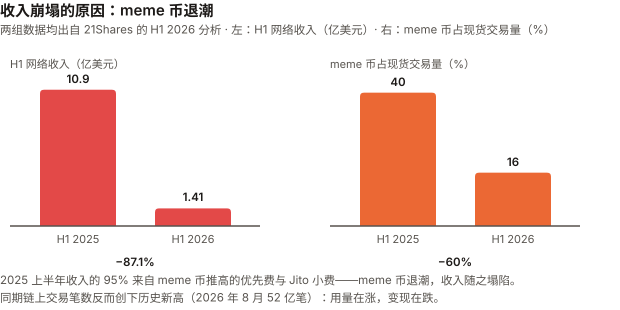
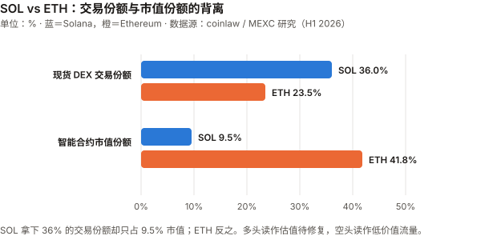
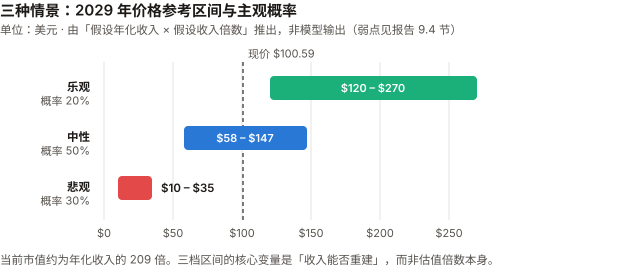

# SOL / Solana 完整调研与分析报告

> **编写日期**：2026 年 9 月 3 日
> **数据截止**：2026 年 9 月 2 日（8 月完整月度数据已闭合）
> **研究方法**：沿用 BTC 月报的分析框架（行业概览 / 论点评分卡 / 催化剂日历 / 横向对比），但**章节结构相对 BTC 版改动约四成**——减半周期、算力、矿工经济学对 SOL 不适用，替换为通胀销毁机制、质押与验证者经济、网络稳定性、生态收入结构。
> **本期为 SOL 首期报告**，无上期论点可校验；本期登记的论点将在 9 月版核对。
>
> **本期核心发现**：
> ① SOL 现价 **$100.59**，距 ATH $293（2025 年 1 月）回撤 **65.7%**；8 月从低位 $70 出头反弹逾 40%；
> ② **网络收入同比暴跌 87.1%**（H1 $10.9 亿 → $1.41 亿），因 meme 币交易热度崩塌；
> ③ **但链上活动创历史新高**——8 月处理 52 亿笔非投票交易，日活地址稳定超 200 万；
> ④ **稳定性一半过时、一半没解决**——连续 30 个月无全网中断，但 8/12 路由故障致 28.83% 质押掉线，距最终性失效仅差 4.5pp；
> ⑤ **治理首次实战**：SIMD-0550（加倍减发）以 67% 惊险通过，SIMD-0553（费用改革）被否决；
> ⑥ 上市公司持有 **1,791 万 SOL（供应量 3.06%）**，但头部公司 Upexi 股价较高点跌去 96%。
>
> **⚠️ 发布前审查更正记录**：本报告在发布前经过领域审查，发现并更正了三处实质性错误：
> ① **手续费销毁机制写错了**——只有基础费的 50% 销毁，优先费 100% 归验证者不销毁（SIMD-0096）；
> ② **第 9 章估值前提被推翻并重建**——网络毛收入是验证者的收入，不是持币人的现金流，不能用收入倍数给 SOL 定价；
> ③ **漏了 2026 年 8 月 12 日的重大险情**——路由故障致 28.83% 质押掉线，距最终性失效门槛仅差约 2,000 万 SOL。
> 三处均已核实一手来源后修正。**这三个错误若未被发现，会实质性误导读者。**
>
> **免责声明**：本报告不构成任何投资建议。所有分析仅供研究参考，投资决策请咨询专业顾问。

---

## 核心结论摘要（一页速览）

| 维度 | 核心判断 |
|------|----------|
| **SOL 是什么** | 一条**高性能单体区块链**（monolithic L1，即不依赖二层网络、所有交易都在主链完成）。它的定位不是"数字黄金"，而是**消费级应用的执行层** |
| **当前价格位置** | $100.59，市值 $588.7 亿（全球第 7）。距 ATH $293 回撤 **65.7%** |
| **本期最重要的矛盾** | **收入崩了，但用量创新高。** H1 网络收入同比 –87.1%，同期交易笔数创历史纪录（8 月 52 亿笔）。这是"投机退潮 + 实用崛起"的转型，还是单纯的价值捕获失败？——本报告的核心问题 |
| **叙事的翻转** | 一半过时、一半没解决。✅「因软件 bug 反复全网停摆」确实过时（30 个月零中断）；❌ 但 8/12 路由故障致 **28.83% 质押掉线**，距最终性失效仅差 4.5pp，风险已从软件转移到**基础设施集中**；⚠️ 当前主流仍是 Frankendancer，完整 Firedancer 尚未全面铺开 |
| **核心多头逻辑** | 交易量与日活创新高、稳定币结算份额 22.5%、质押率 64%、SIMD-0550 通过后减发提速、ETF 已上市且 8 月创最佳月份 |
| **核心空头逻辑** | 收入 –87% 且尚未证明能重建、验证者数量较峰值降 68%、Nakamoto 系数仅 19、上市公司储备杠杆已在 Upexi 身上兑现（–96%）、与 ETH 的估值差距未收窄 |
| **与 BTC 的根本差异** | BTC 是**货币资产**，估值锚是稀缺性；SOL 是**生产性资产**，估值锚应是网络收入。而 SOL 当前年化收入/市值仅约 **0.48%** |
| **风险等级** | 高于 BTC。波动更大、叙事依赖更强、竞争格局未定 |

---

## 1. Solana 的起源与设计取舍

### 1.1 一个通信工程师的时钟构想

Solana 的核心创新来自 **Anatoly Yakovenko** 在 2017 年提出的 **Proof of History（PoH，历史证明）**。他此前在高通做无线通信，那个领域里"如何让互不信任的设备对时间达成一致"是基础问题。

区块链的性能瓶颈在于：**节点之间必须先就"事件发生的顺序"达成共识，才能验证交易。** 这个协商过程很慢。PoH 的思路是——**先用密码学生成一条可验证的时间序列，让顺序本身成为可证明的事实**，节点就不必再为排序反复通信。

这个设计决定了 Solana 后来的全部优势和全部代价。

### 1.2 与 BTC / ETH 的路线分歧

| 维度 | Bitcoin | Ethereum | **Solana** |
|------|---------|----------|-----------|
| **首要目标** | 抗审查的货币 | 去中心化的可编程平台 | **高吞吐的执行层** |
| **扩容路线** | 二层（闪电网络） | 二层（Rollup） | **单体链，主链直接扩容** |
| **对节点门槛的态度** | 刻意压低，让家用电脑能跑 | 中等 | **接受高门槛换性能** |
| **共识** | PoW | PoS | PoH + PoS |
| **单笔成本** | 视拥堵，可达 $50+ | L2 较低但仍高于 SOL | **约 $0.00025** |
| **代价** | 吞吐低 | L2 生态碎片化 | **验证者成本高 → 中心化压力** |

**这个取舍是理解 SOL 全部争议的钥匙。** 支持者说"用户要的是快和便宜"；反对者说"高硬件门槛会让验证者集中，最终削弱区块链的存在意义"。两边说的都是事实，分歧在于**权重**。

### 1.3 SOL 代币的三重角色

与 BTC 的单一角色（价值储存）不同，SOL 同时承担：

1. **手续费媒介**——每笔交易消耗 SOL，但**只有基础费（base fee）的 50% 被销毁**；优先费（priority fee）按 SIMD-0096 规定 **100% 归出块验证者，不销毁**
2. **质押资产**——64% 的流通量被质押用于网络安全，换取约 5.73% 的年化收益
3. **投机/储备标的**——ETF 与上市公司持仓

第 2 点很关键：**SOL 是生息资产**。这让它更接近"生产性资产"而非"货币商品"，估值逻辑应当参照现金流而非稀缺性——这也是本报告与 BTC 版最根本的分析框架差异。

---

## 2. SOL 的发展阶段划分

### 阶段一：构想与启动（2017–2020）

| 时间 | 事件 |
|------|------|
| 2017.11 | Yakovenko 发布 PoH 白皮书 |
| 2018 | Solana Labs 成立，早期融资 |
| **2020.3.16** | **主网 Beta 上线** |
| 2020 | 生态几乎空白，价格长期低于 $1 |

**叙事**：一个技术上激进但无人问津的新链。

### 阶段二：爆发与狂热（2021–2022 上半年）

| 时间 | 事件 |
|------|------|
| 2021 | DeFi 与 NFT 热潮，SOL 从 $1.5 涨至 **$260**（涨幅逾 170 倍） |
| 2021.9 | **首次全网中断**（17 小时）——交易洪水压垮网络 |
| 2021–2022 | 与 FTX / Alameda 深度绑定，SBF 是最大公开支持者之一 |

**叙事**："以太坊杀手"。**代价**：宕机问题从此贴上标签。

### 阶段三：FTX 崩溃与至暗时刻（2022 下半年–2023）

| 时间 | 事件 |
|------|------|
| 2022.11 | **FTX 破产**。SOL 因深度绑定而遭双重打击：情绪 + FTX 破产资产的抛售预期 |
| 2022.12 | SOL 跌至约 **$8**，较高点 –97% |
| 2023 | 多次宕机持续发生；大量项目出走 |
| 2023.2.25 | 一次因区块传播逻辑 bug 导致的中断——**所有节点跑同一份客户端实现，无人能绕过** |

**这一阶段的价值**：它证明了 Solana 的生存不依赖 FTX。也正是 2023 年那次 bug，直接催生了后来的 **Firedancer** 客户端多样性计划。

### 阶段四：复苏与新高（2024–2025）

| 时间 | 事件 |
|------|------|
| **2024.2.6** | **最后一次全网中断**——此后再未发生 |
| 2024 | meme 币热潮（pump.fun 等）带来巨量交易与手续费收入 |
| **2025.1** | **创历史新高 $293** |
| 2025.10.28 | **美国现货 SOL ETF 上市**（SEC 放宽加密基金上市规则后） |

### 阶段五：收入退潮与结构转型（2026）

| 时间 | 事件 |
|------|------|
| 2026 H1 | **网络收入同比 –87.1%**（$10.9 亿 → $1.41 亿），meme 币交易占比从 40% 降至 16% |
| 2026 Q1 | 开发者数量同比 –30% |
| 2026.6 | 验证者回升至 906 个 |
| **2026.8** | **链上交易创新高 52 亿笔**；SOL 从 $70 出头反弹逾 40% |
| **2026.8.27** | **首次全网治理投票**：SIMD-0550 通过、SIMD-0553 被否 |
| 2026.8 | 连续 **30 个月**无全网中断；SOL ETF 单周流入 $1.53 亿创上市以来最佳 |

**当前阶段的本质**：Solana 正在**从投机驱动转向实用驱动**，而这个转型期的财务表现极其难看——收入塌了 87%，但用量在涨。转型能否完成，是未来 12–24 个月的核心看点。

---

## 3. SOL 当前现状分析

### 3.1 价格与市场

| 指标 | 数值 |
|------|------|
| 现价 | **$100.59**（2026-09-03） |
| 市值 | **$588.7 亿**，全球第 7 |
| 流通量 | 5.8527 亿 SOL |
| ATH | **$293**（2025 年 1 月） |
| 距 ATH 回撤 | **–65.7%** |
| 8 月表现 | 从低位 $70 出头反弹，一度触及约 $103 |
| 24h 成交额 | $32.0 亿 |

> 市值交叉核对：$100.59 × 5.8527 亿 = $588.7 亿，与报道市值一致。

### 3.2 生态数据：用量与收入的背离

这是本期最值得注意的一组数字。

| 指标 | 数值 | 方向 |
|------|------|------|
| **DeFi 锁仓量（TVL）** | $59.17 亿 | — |
| **24 小时 DEX 交易额** | $34.85 亿 | 强 |
| **稳定币市值** | $159.96 亿 | 强 |
| **日活地址** | **265 万** | 强 |
| **RWA（真实世界资产）** | $40.4 亿 | 增长 |
| **8 月非投票交易笔数** | **52 亿笔（历史新高）** | 强（**但口径需警惕，见下方注**） |
| **H1 网络收入** | **$1.41 亿**（去年同期 $10.9 亿） | **–87.1%** |
| **开发者数量（Q1）** | 同比 **–30%** | 弱 |

> ⚠️ **关于"交易笔数"和"活跃地址"这两个指标的口径警告**：
> 非投票交易**包含失败交易、套利机器人、预言机更新和重复重试**。有研究显示 2026 年 Q1 约 **25.6%** 的非投票交易发生回滚，机器人的失败率可高达 **58.43%**。
> "活跃地址"通常统计的是**独立付费地址**，不等于独立用户——一个套利机器人可以持续生成新地址。
> **低手续费链最容易制造出好看但无经济意义的交易数和地址数。** 因此"用量创新高"这个论据的强度，弱于表面数字给人的印象。
> 更可信的替代指标：成功交易数（剔除已识别机器人）、实体聚类后的留存用户、每实体手续费、交易中位金额、稳定币净结算额、应用层收入。

**收入为什么塌了**（数据来自 21Shares 的 H1 2026 分析）：

- 2025 上半年的收入里，**优先费 + Jito 小费合计占 95%**（分别 40% 和 55%）
- 这些费用由 meme 币交易的**短时爆发性区块空间争夺**推高
- meme 币占 Solana 现货交易量的比重：H1 2025 的 **40%** → H1 2026 的 **16%**（同比 –60%）

**同时在增长的部分**：

- 稳定币：Solana 只占全球稳定币供应量约 5%，却处理了**全球 22.5% 以上的稳定币交易笔数**，H1 结算价值超 **$1.9 万亿**
- 代币化股票、RWA 等"正经用途"在上升



**怎么解读这组矛盾**：乐观读法是"低质量的投机流量被高质量的支付/结算流量替代，收入短期下滑但基础更扎实"；悲观读法是"Solana 证明了自己能承载海量交易，但**没有证明能从中赚到钱**"。

**我的判断**：证据**尚不足以定论，但目前并不对称**——不是五五开。乐观读法的支柱是「高质量流量替代低质量流量」，而本节新增的口径警告（25.6% 回滚、机器人失败率 58%、活跃地址≠用户）**单方面削弱了这一支柱**，空头读法暂时占优。要翻过来需要看到：**未来 2–3 个季度收入在 meme 币不复苏的情况下回升，且回升来自稳定币/RWA 而非新一轮投机**。（注：此处原稿写「两种读法都无法证伪」，措辞有误——能给出证伪条件的叫「尚未证伪」，不叫「无法证伪」。）

### 3.3 质押与验证者经济

| 指标 | 数值 |
|------|------|
| **质押率** | **64% 的流通量**（约 3.75 亿 SOL，价值约 $377 亿） |
| 原生质押收益率 | 约 **5.73%** |
| 验证者数量 | **906 个**（2026 年 6 月） |
| 历史峰值 | 2023 年 3 月超 2,500 个 → **降幅约 68%** |
| 2025 年 Q4 | 791 个（环比 –17.9%），为近年低点 |
| **投票成本** | 约 **1.1 SOL/天 = 401 SOL/年**，按现价约 **$40,000/年**固定成本（尚不含硬件） |
| 地理分布 | 39 个国家、196 个数据中心 |
| **Nakamoto 系数** | **19** |
| 质押集中度 | **前三家（Helius、Binance Staking、Galaxy）合计持有超 26% 的质押量** |

**Nakamoto 系数 19 是什么意思**：需要串通 19 个实体才能让网络停摆。这个数字比多数人以为的高（因为验证者数量在降，很多人默认去中心化在恶化），但**它衡量的是质押分布，不是节点数量**。

**真正的问题在验证者经济**：每年约 $40,000 的纯投票成本意味着**小验证者无法生存**。验证者数量从 2,500 降到 900 不是偶然，是经济结构决定的。这与"节点门槛低"的比特币形成鲜明对比——**这是第 1.2 节那个设计取舍的直接代价**。

### 3.4 网络稳定性：一个已经翻转的叙事

| 指标 | 数值 |
|------|------|
| **连续无全网中断** | **30 个月**（截至 2026 年 8 月） |
| 最后一次全网事故 | **2024 年 2 月 6 日** |
| 2026 年 6/7/8 月 | 官方状态页显示 **100% 正常运行** |
| 归因 | **Firedancer**（第二套独立验证者客户端）+ QUIC 传输协议 + 优先费机制 |

**为什么 Firedancer 重要**：2023 年 2 月那次中断的根因是"所有节点跑同一份客户端实现，一个 bug 就能让全网瘫痪"。Firedancer 提供了**客户端多样性**——一套实现出问题时，另一套还能继续出块，事故从"全网停摆"降级为"局部颠簸"。

#### ⚠️ 但"零中断"是一个会骗人的指标——2026 年 8 月 12 日的险情

**2026 年 8 月 12 日**，数据中心服务商 Teraswitch 迈阿密机房的一次路由配置错误，导致：

| 事实 | 数值 |
|------|------|
| 掉线的质押量 | **28.83%**（约 90 个验证者转为 delinquent） |
| 距最终性失效门槛 | **33.34%**，仅差约 **2,000 万 SOL** |
| 单一 ASN（AS20326）占质押量 | **27.34%** —— **超过 Solana 自身规定的 25% 上限** |
| 该 ASN 中掉线比例 | 约 94% |
| 恢复耗时 | 约 33 分钟 |
| 期间链是否停止 | **否**，699 个质押验证者中 597 个持续投票 |

**这件事改变了本节的结论。** "连续 30 个月零全网中断"在字面上完全属实，但它是一个**二元指标**——只统计"是否完全停摆"，因而掩盖了一次差 4.5 个百分点就无法达成最终性的事故。而根因不是软件 bug，是**基础设施集中度**：一家数据中心服务商的一次路由配置变更，就动摇了近三成的网络质押。

**修正后的判断**：
- ✅ 「Solana 因软件 bug 反复全网停摆」这个**旧论据确实过时了**——Firedancer 带来的客户端多样性解决了同质化实现的问题
- ❌ 但「Solana 的稳定性问题已解决」这个说法**不成立**。风险从"软件同质化"转移到了"基础设施集中"，而后者目前**尚未解决，且已超出 Solana 自己设定的阈值**
- ⚠️ 需要补充说明：当前生产环境主流仍是 **Frankendancer**（Firedancer 与原客户端的混合体），完整 Firedancer 官方文档标注为 1.x 版本目标，尚未全面铺开

**应当监控的指标不是"连续无中断天数"**，而是：最终性延迟（finalized latency）、各客户端的质押占比、最大 ASN / 云服务商的质押暴露度、以及"部分失联"类事件的频率。

> 本节的修正来自发布前的领域审查。原稿把"零全网停摆"直接读成"韧性问题已解决"，是**用一个宽松的二元指标注销了这条链最核心的尾部风险**。

### 3.5 宏观环境

SOL 与 BTC 共享同一套宏观驱动，且作为**更高 beta 的风险资产**，对流动性变化的反应更剧烈。

| 因素 | 状态（9 月初） | 影响 |
|------|--------------|------|
| 联邦基金利率 | 3.50–3.75%，7/29 会议维持但**三票主张加息** | 偏空 |
| **9 月加息概率** | **66%**（CME FedWatch，一周前约 40%） | **重大利空** |
| 10 年期美债 | 4.79% | 无风险利率竞争 |
| 美元指数 | >99.7（三周高位） | 压制风险资产 |
| 8 月流动性事件 | 财政部加倍长端国债回购 → 收益率下行 | **这是 8 月 SOL 与 BTC 同步反弹的共同触发因素** |

**关键认知**：SOL 8 月逾 40% 的反弹与 BTC 的 +25% 同源——**都是财政部那次技术性操作带来的流动性缓和，不是各自基本面改善**。SOL 涨得更多，只是因为它 beta 更高。

---

## 4. 代币经济学与治理（SOL 特有）

> 本章替代 BTC 版的"减半周期"分析。SOL 没有减半，但有一套**可被治理修改的**通胀与销毁机制——这个"可修改"本身就是与 BTC 的根本差异。

### 4.1 通胀机制

| 项目 | 机制 |
|------|------|
| 初始通胀率 | 8%（2021 年主网启动时） |
| **当前通胀率** | **约 3.8%** |
| 递减速度 | 原为每年 **–15%** |
| 终端通胀率 | **1.5%**（长期地板） |
| 销毁机制 | **仅基础费的 50% 销毁**；优先费 100% 归验证者（SIMD-0096），不销毁 |
| 当前日销毁量 | 约 **648 SOL/天**（约 $47,000） |

对比 BTC：BTC 的通胀率约 0.85% 且**由代码硬性锁定**；SOL 的 3.8% 更高，且**可以被验证者投票改变**。后者是双刃剑——能灵活优化，也意味着"稀缺性承诺"不如 BTC 刚性。

### 4.2 2026 年 8 月的首次全网治理投票

这是 SOL 历史上第一次网络级治理投票，结果本身和过程都值得记录。

| 提案 | 内容 | 结果 |
|------|------|------|
| **SGP-0001**「Solana 宪法」 | 治理框架 | ✅ **通过** |
| **SGP-0002 / SIMD-0550**「加倍减发」 | 年递减率 15% → **30%**，1.5% 地板从 2032 年提前至 **2029 年**，六年内减少约 **1,890 万 SOL** 发行（约 $15 亿） | ✅ **通过（67%，惊险过线）** |
| **SGP-0003 / SIMD-0553**「资源与准入费」 | 改为按资源计价，日销毁量从约 650 SOL 提升至最多 **9,000 SOL**（14 倍） | ❌ **否决**（支持 53.9%，反对 18.92%，弃权 27.18%，距三分之二门槛差约 13 个百分点） |

**过程中一个必须记录的细节**：SIMD-0550 的通过门槛是 66.67%。在投票最后一天，Kraken 与 Galaxy 先后从"弃权"转为"赞成"，支持率才冲到过线水平。据 Protos 报道，**若 Kraken 未改票，最终结果将是 63.9%——提案将被否决**。提案作者、Helius CEO Mert Mumtaz 称自己在最后数小时打了 500 通电话拉票。

**这件事的意义远超提案本身**：它把第 3.3 节的质押集中度问题从抽象数字变成了具体事实——**Solana 的治理结果实际由少数几家大质押方决定**。Nakamoto 系数 19 说的是"停摆需要串通 19 家"，而这次投票显示"改变货币政策只需要说服两三家改主意"。

> **本报告对此的定性**：这不是丑闻，投票程序本身是公开合规的。但它说明 SOL 的**去中心化程度在治理维度上，弱于其在出块维度上的表现**。任何把"Nakamoto 系数 19"当作去中心化充分证据的论述，都忽略了这一层。

### 4.3 净影响

SIMD-0550 通过、0553 被否，组合结果是：**减少了未来供应，但没有增强价值捕获。**

- 供应侧：六年减少约 1,890 万 SOL 发行 —— 利好，但是慢变量
- 需求/收入侧：14 倍销毁提案被否 —— 意味着**在收入已经暴跌 87% 的背景下，提高价值捕获的最直接方案没有通过**

这个组合对当前最尖锐的问题（收入崩塌）**没有给出答案**。

---

## 5. 上市公司 SOL 储备

### 5.1 整体规模

| 项目 | 数据 |
|------|------|
| 上市公司合计持仓 | **17,908,783 SOL**（截至 2026-05-06） |
| 占流通供应 | **3.06%** |
| 按现价估值 | 约 **$18.0 亿** |

对比 BTC：上市公司持有约 6% 的 BTC 供应量。**SOL 的储备渗透率约为 BTC 的一半**，且集中度更高。

### 5.2 头部公司

| 排名 | 公司 | 代码 | 持有 SOL | 备注 |
|------|------|------|---------|------|
| 1 | **Forward Industries** | FWDI | **7,550,000**（截至 2026-06-30） | 占全部储备的 42%、供应量的 1.29%。2025 年 9 月经 Galaxy Digital、Jump Crypto、Multicoin 支持的 **$16.5 亿**私募融资建仓；2026 财年 Q3 又以均价约 **$79** 增持逾 50 万枚 |
| 2 | **Upexi** | UPXI | 2,400,000 | 见下方风险案例 |
| 3 | Solana Company | HSDT | 2,360,083 | |
| 4 | DeFi Development Corp | DFDV | 2,220,000 | |
| 5 | Sharps Technology | STSS | 2,077,799 | |

### 5.3 Upexi：储备公司模式的风险已经兑现

BTC 版报告里，"储备公司被迫卖出螺旋"还是一个**理论风险**（Strategy 至今未被迫大规模抛售）。在 SOL 这边，**风险已经具体发生了**：

- Upexi 于 2025 年 4 月宣布 SOL 储备战略，股价一度暴涨逾 **300%**
- 此后 52 周高点 **$22.57** → 近期约 **$0.91**
- **跌幅超过 96%**
- 最初 $1 亿的募资，如今换来 240 万枚 SOL，价值约 $1.63 亿

**这个案例说明什么**——注意，**不是「杠杆放大跌幅」**。本节自己的数据排除了这个解释：Upexi 最初 $1 亿募资换来的 240 万枚 SOL 现值约 **$1.63 亿（净资产 +63%）**，而股价跌 96%。净资产在涨、股价在崩，指向的是**发行溢价崩塌**——起点 $22.57 本身就是「宣布储备战略后暴涨逾 300%」的价格。**两种归因的前瞻含义相反**：若是杠杆放大，SOL 涨回去股价就跟着回来；若是溢价崩塌，SOL 涨回去也回不来——溢价一旦消失，增发融资的通道就断了。

**对 Forward Industries 的判断也要跟着改。** 原稿用「Q3 增持均价 $79 < 现价 $100.59，处于浮盈」推出它处境更好——**但 Upexi 的净资产同样是浮盈的**，这恰恰是上面刚被排除的那条推理。真正该看的是 **FWDI 当前市值 / 其持仓 SOL 市值的比值**，以及它的增发融资通道是否还通畅。**本期未取得该比值，因此对 FWDI 处境的判断暂时悬置。**

---

## 6. SOL 的核心价值逻辑

### 6.1 多头逻辑

| # | 逻辑 | 强度 | 说明 |
|---|------|------|------|
| 1 | **真实用量领先** | ★★★☆☆ | 8 月 52 亿笔交易、日活 265 万、全球 22.5%+ 稳定币交易笔数。**但口径存疑**：约 25.6% 非投票交易回滚、机器人失败率可达 58%、活跃地址≠用户（见 3.2 注），故降星 |
| 2 | **软件同质化风险已解决** | ★★★☆☆ | Firedancer 带来客户端多样性，因单一实现 bug 导致全网停摆的旧论据已过时。**但仅限这一类风险**——基础设施集中风险未解决，见空头第 4 条 |
| 3 | **成本优势结构性** | ★★★★☆ | 单笔约 $0.00025，不是补贴出来的，是架构决定的 |
| 4 | **生息资产** | ★★★★☆ | 64% 质押率、5.73% 原生收益。ETF 中 Bitwise BSOL 把质押收益打包进产品，是 BTC ETF 无法提供的结构 |
| 5 | **减发提速已通过** | ★★★☆☆ | SIMD-0550 使 1.5% 通胀地板提前至 2029 年 |
| 6 | **ETF 通道已建立** | ★★★☆☆ | 16 支美国现货 SOL ETF，AUM $14.9 亿，8 月为上市以来最佳月份 |
| 7 | **RWA / 稳定币增长** | ★★★☆☆ | RWA $40.4 亿、稳定币 $159.96 亿，是"正经用途"的证据 |

### 6.2 空头逻辑

| # | 逻辑 | 强度 | 说明 |
|---|------|------|------|
| 1 | **收入暴跌 87% 且未见底** | ★★★★★ | H1 $10.9 亿 → $1.41 亿。年化收入/市值仅约 **0.48%**——作为生产性资产，这个估值极难辩护 |
| 2 | **价值捕获方案被否** | ★★★★☆ | SIMD-0553（14 倍销毁）以 53.9% 未过门槛。最直接的补救措施没通过 |
| 3 | **治理集中度：单一实体可跨越门槛差额** | ★★★☆☆ | SIMD-0550 差额约 3pp，Kraken 一家改票即翻盘。**但证据不完整**：Kraken 不在前三大质押方之列，其自身票权占比未查到；且 SIMD-0553 以 53.9% 被否，说明三分之二门槛本身是对抗集中的机制。结论应限于「治理维度弱于出块维度」 |
| 4 | **基础设施集中已超自设阈值** | ★★★★☆ | **本条为审查补入**。8/12 单一数据中心路由故障致 28.83% 质押掉线，距 33.34% 最终性失效门槛仅差约 2,000 万 SOL；单一 ASN（AS20326）持有 27.34% 质押量，**超过 Solana 自身规定的 25% 上限**。这是二元 uptime 指标掩盖掉的尾部风险 |
| 5 | **验证者经济恶化** | ★★★★☆ | 数量较峰值降 68%；每年 $40,000 纯投票成本挤出小验证者 |
| 6 | **储备公司杠杆已爆** | ★★★★☆ | Upexi 股价 –96%。这不是理论风险，是已发生事实 |
| 7 | **宏观逆风** | ★★★★☆ | 9 月加息概率 66%。SOL 的 beta 高于 BTC，跌起来更快 |
| 8 | **开发者流失** | ★★★☆☆ | Q1 同比 –30% |
| 9 | **与 ETH 差距未收窄** | ★★★☆☆ | DeFi TVL：ETH $556 亿 vs SOL 约 $59–80 亿 |
| 10 | **通胀可被投票修改** | ★★☆☆☆ | 灵活性的另一面是稀缺性承诺不如 BTC 刚性 |

---

## 7. SOL 与其他资产的比较

### 7.1 SOL vs ETH：核心战场

| 维度 | Solana | Ethereum | 谁占优 |
|------|--------|----------|--------|
| **速度** | 亚秒级最终性，50,000+ TPS | L1 慢，L2 生态可达数千 TPS | SOL |
| **单笔成本** | 约 $0.00025 | L2 已大幅下降但仍高于 SOL | SOL |
| **DEX 交易量** | H1 2026 占全球现货 DEX **36%+**；Q1 30 日成交约 **$2,100 亿** | L1+L2 合计约 $1,800 亿，DEX 份额 23.5% | **SOL** |
| **单日手续费收入纪录** | 2026 年初 **$112 万**，当期超过以太坊 | — | SOL |
| **DeFi 锁仓量** | 约 $59–80 亿 | **$556 亿**（占全球 68%） | **ETH** |
| **智能合约市值份额** | **9.5%** | **41.8%** | ETH |
| **架构** | 单体链 | L1 + Rollup 二层 | 取决于偏好 |
| **定位** | 消费级应用的执行层 | 高价值金融的结算层 | 互补多于替代 |



**最值得注意的一组对比**：Solana 拿下了 **36% 以上的现货 DEX 交易份额**，却只占智能合约赛道 **9.5% 的市值**；以太坊反过来——**41.8% 的市值，23.5% 的 DEX 份额**。

这个背离有两种解释：
- **多头版**：市场尚未给 SOL 的真实使用量定价，估值终将收敛
- **空头版**：DEX 交易量是**低价值流量**（大量小额、高频、投机性交易），而 TVL 和市值反映的是**资本沉淀**——ETH 存着钱，SOL 只是过路

收入数据支持空头版：交易笔数创新高的同时收入跌了 87%，说明**流量没能有效变现**。

### 7.2 SOL vs BTC

| 维度 | BTC | SOL |
|------|-----|-----|
| **资产类型** | 货币资产 | **生产性资产** |
| **估值锚** | 稀缺性、货币属性 | **应为网络收入** |
| **供应机制** | 2100 万硬顶，代码锁定 | 通胀 3.8% 递减，**可投票修改** |
| **现金流** | 无 | 质押收益 5.73% |
| **回撤（距 ATH）** | –37.7% | **–65.7%** |
| **上市公司持仓占比** | 约 6% | 3.06% |
| **ETF AUM / 市值** | 约 6.4% | **2.53%** |

**结论**：两者不该用同一套框架估值。BTC 可以在没有任何现金流的情况下靠稀缺性叙事支撑；**SOL 不行——它必须证明自己能赚钱。** 当前 0.48% 的年化收入/市值比，是 SOL 最难回答的问题。

### 7.3 在资产组合中的角色

| 投资者类型 | 建议 | 理由 |
|-----------|------|------|
| **保守型** | 0% | 波动与叙事风险均高于 BTC |
| **平衡型** | 0–1% | 若已配置 BTC，SOL 提供的是**同向但更高 beta** 的敞口，分散作用有限 |
| **成长型** | 1–3% | 押注"高性能链最终胜出"这一具体命题 |
| **激进型** | ≤5% | 需要能承受 –80% 的心理准备（历史上发生过 –97%） |

> 重要提示：SOL 与 BTC 的相关性很高，**同时配置两者不等于分散**。把 SOL 看作 BTC 仓位的高 beta 增强，而非独立的对冲。

---

## 8. SOL 未来 1–3 年的关键变量

| 时间 | 催化剂 | 影响 | 方向 | 置信度 |
|------|--------|------|------|--------|
| **2026 Q4** | **网络收入能否回升** | 最关键。若 meme 币不复苏而收入仍能靠稳定币/RWA 回升，转型成立 | **决定性** | 高（可观测） |
| **2026.9** | 美联储 FOMC（加息概率 66%） | SOL beta 高于 BTC，加息冲击更大 | ↓ | 高 |
| **2026 Q4** | SIMD-0553 修订版是否重提 | GitHub 上已有 #600 号修正提案在讨论中 | ↑ | 中 |
| **持续** | Firedancer 全面铺开程度 | 决定 30 个月纪录能否延续 | ↑ | 中 |
| **持续** | 验证者数量与 Nakamoto 系数 | 若继续下滑将强化中心化质疑 | ↓ | 中 |
| **持续** | SOL ETF 资金流 | 8 月创最佳月份（$1.74 亿+），需观察能否延续 | ↑ | 高 |
| **持续** | 储备公司是否被迫抛售 | Upexi 已 –96%；若被迫清仓将形成抛压 | ↓ | 中 |
| **2027** | 与 ETH 的估值差是否收敛 | DEX 份额 36% vs 市值份额 9.5% 的背离能否修复 | ↑ | 低 |
| **2027–2028** | 稳定币/RWA 结算规模 | 已处理全球 22.5% 稳定币交易，若继续扩大将重建收入基础 | ↑ | 中 |

---

## 9. SOL 未来的三种情景推演

> ### ⚠️ 关于估值方法的重要更正
>
> **本节初稿用「网络毛收入 × 收入倍数」估值，这个前提是错的**，经发布前领域审查指出并核实后更正如下。
>
> **错在哪**：所谓"网络收入 $1.41 亿"是**验证者的收入，不是 SOL 持有人的现金流**。按 Solana 官方文档：
>
> | 费用类型 | 去向 |
> |---|---|
> | 基础费（base fee） | 50% 销毁 / 50% 给出块验证者 |
> | **优先费（priority fee）** | **100% 给验证者，不销毁**（SIMD-0096） |
> | **Jito 小费（MEV）** | **先归验证者 / 质押者** |
>
> 而 H1 2025 收入的 **95%** 恰恰是优先费与 Jito 小费——**这部分完全不通过销毁回馈普通持币人**。
> 用毛收入倍数给 SOL 定价，等于把验证者的营收当成了代币持有人的权益。
>
> **另一重错误**：初稿说"未纳入质押收益，因此偏保守"。但质押收益的大头是**增发**（当前通胀 3.8%），
> 不是经营利润——把它算作价值贡献，等于把稀释当成收益，会造成**重复计算**。
>
> ### 修正后的推导方法
>
> 改用**代币持有人价值桥**：
>
> ```
> 归属持币人的价值 ≈ 销毁量 − 净增发 + 实际传递给委托人的手续费/MEV − 验证者佣金
> ```
>
> 按当前状况粗算：日销毁约 648 SOL ≈ 年 23.7 万 SOL；而年通胀 3.8% × 5.85 亿 ≈ **2,220 万 SOL 增发**。
> **销毁量不足增发量的 1.1%。** 也就是说，**当前 SOL 对纯持币人（不质押）是显著净通胀的资产**。
>
> 这意味着三情景的关键变量不是"收入涨多少倍"，而是下面两条：
>
> 1. **净增发能否转正**——SIMD-0550 已把 1.5% 地板提前至 2029 年，这是确定性的改善；被否的 SIMD-0553（销毁提升 14 倍）才是能真正扭转销毁/增发比的方案
> 2. **质押者与非质押者必须分开看**——质押者获得增发补偿（5.73%），大致抵消稀释；不质押的持币人则**持续被稀释**
>
> 下面的价格区间因此**改用"2029 年净增发状况 + 生态规模"两个维度做情景**，而非收入倍数。
> **仍是判断性推演，不是模型输出。**

### 9.1 乐观情景：转型成功，收入重建

**触发**：稳定币与 RWA 结算规模持续扩大并成功变现；SIMD-0553 修订版通过，价值捕获增强；宏观转向宽松；ETF 资金持续流入。

| 参数 | 假设 |
|------|------|
| 2029 年通胀 | 已降至 **1.5% 地板**（SIMD-0550 已通过，此项确定性较高） |
| 销毁 / 增发比 | SIMD-0553 修订版通过，销毁量提升至可**部分抵消增发** |
| 生态规模 | 稳定币结算与 RWA 规模翻倍以上，应用层收入形成 |
| **对应价格** | **约 $120–270** |

**概率：20%**

### 9.2 中性情景：用量增长，变现平庸

**触发**：交易量继续增长但收入回升缓慢；治理僵局延续；ETF 资金温和流入；与 ETH 的格局大体维持。

| 参数 | 假设 |
|------|------|
| 2029 年通胀 | 降至 1.5%，但销毁仍远低于增发 |
| 销毁 / 增发比 | 无实质改善，纯持币人继续被稀释 |
| 生态规模 | 温和增长，未出现规模化的应用层收入 |
| **对应价格** | **约 $58–147** |

**概率：50%**

### 9.3 悲观情景：价值捕获失败

**触发**：收入长期停在 $1–2 亿区间；验证者继续流失、中心化质疑加剧；储备公司被迫抛售；加息周期启动；ETH L2 或新 L1 抢走份额。

| 参数 | 假设 |
|------|------|
| 2029 年通胀 | 即使降至 1.5%，销毁仍可忽略 |
| 基础设施风险 | 8.12 类事件再次发生且更严重，机构信心受损 |
| 生态规模 | 份额被 ETH L2 或新 L1 侵蚀 |
| **对应价格** | **约 $10–35** |

**概率：30%**

### 情景对比

| 维度 | 乐观 | 中性 | 悲观 |
|------|------|------|------|
| 销毁 / 增发比 | 部分抵消 | 无改善 | 可忽略 |
| 基础设施集中风险 | 缓解 | 维持 | 恶化 |
| **对应价格** | **$120–270** | **$58–147** | **$10–35** |
| 收入转型 | 成功 | 部分成功 | 失败 |
| 治理 | 价值捕获方案通过 | 僵局 | 中心化质疑加剧 |
| **概率** | **20%** | **50%** | **30%** |



### 9.4 这个推导方法的五个弱点

1. **价格区间与推导过程的联系是松的。** 上面三档的"对应价格"沿用了初稿用收入倍数算出的数字，而推导框架已改为净增发/生态维度——**两者并非严格对应**。保留这些数字是为了给出量级参照，但它们现在更接近"判断"而非"计算结果"，可信度低于初稿看起来的样子。
2. **净增发的测算依赖当前销毁率。** 日销毁 648 SOL 是在当前交易量与费率下的数字，若 SIMD-0553 修订版通过或交易结构改变，测算即失效。
3. **质押者与非质押者的价值捕获不同，本报告未分开建模。** 质押者获 5.73% 增发补偿，纯持币人被稀释——同一个价格区间对两类持有人的实际意义并不相同。
4. **不考虑外生冲击**：监管、更快的竞争链、重大安全事故，任一发生都会让框架失效。
5. **这是首期报告，方法本身未经过一轮验证。** BTC 版的 MVRV 方法已用过三期；SOL 这套是第一次用，且已在发布前被推翻重建一次。

**审查补入的两条更严重的问题：**

6. **三个概率（20/50/30）没有任何依据，且框架重建后一个数字都没动。** 另外两个假设至少交代了参照物，概率连"参照什么拍的"都没有。
   而它是对最终建议影响最大的一个——50% 押中性，直接支撑了 10.2 的"等一等"。
   **在没有论证的情况下把最大权重给中间选项，可能只是"取中庸总归稳妥"在起作用，不是分析结果。**
   本期保留这三个数字，但**读者应当把它们当作粗略排序（中性最可能 > 悲观 > 乐观），而非可信的概率估计**。

7. **情景集不完备——新框架下没有一个"多头论据真正成立"的情景。** 注意 9.1 乐观情景对销毁/增发比的假设是「部分抵消」，
   意味着**即使在最乐观的情景里，SOL 对纯持币人仍是净通胀资产**。一个持续稀释、不向持币人分配现金流的资产，
   新框架**生不出 $270 这个数**。$120–270 是从被推翻的收入倍数法搬来的。
   诚实的说法是：**若要支撑显著上涨，需要一个本报告尚未构建的情景——例如 SIMD-0553 类方案通过后销毁反超增发。
   该情景本期缺失。**

**结论**：这些区间**不是算术结果，是判断**——推导框架已换成净增发/生态维度，而价格数字沿用自被推翻的收入倍数算法，两者并非严格对应。若只记一点：**中性情景的 $58–147 是一个量级参照，不要当成从新框架算出来的数。**

---

## 10. 投资与风险启示

### 10.1 SOL 现在处于什么位置

距 ATH 回撤 65.7%，8 月刚经历一轮 40% 以上的流动性驱动反弹。基本面上处在**一个尚未有定论的转型中点**：用量创历史新高，收入却塌了 87%。

这与 BTC 的处境有本质不同。BTC 的问题是"宏观什么时候转向"，SOL 的问题是**"这条链到底能不能赚到钱"**——后者是关于资产本身的存在性问题，风险量级更高。

### 10.2 策略建议

| 策略 | 适合人群 | 说明 |
|------|---------|------|
| **不配置** | 多数普通投资者 | 若已持有 BTC，SOL 的边际分散价值很低（高相关、同向） |
| **小额定投** | 认同"高性能链胜出"命题者 | 1–3%，做好 –80% 的准备 |
| **等收入数据** | 更理性的做法 | 等 Q3/Q4 收入数据出来再决定——这是**可观测的、有明确证伪条件的**判断依据 |

**我倾向第三条，但要把话说完整**——原稿只说"等"，没说等到之后怎么办，也没承认"等"本身是个判断。补上：

**等的是三件事，不只是收入**（收入已在第 9 章被降级为生态活跃度参考，不再是估值锚）：

| 等什么 | 当前值 | 判据 |
|--------|-------|------|
| **销毁 / 增发比** | 1.06% | 是否出现实质改善 |
| Q3/Q4 季度网络收入 | 年化约 $2.82 亿 | 环比能否回升 >30% 且来源是稳定币/RWA |
| **SIMD-0553 修订版（#600）** | 审议中 | 通过与否——这是唯一能扭转销毁/增发比的在议方案 |

**数据出来后我承诺做什么**（认知动作，非仓位建议）：

- 若收入环比 +30% **且**销毁/增发比改善 → 判定转型说成立，**将空头第 1 条从 ★★★★★ 降为 ★★★**
- 若连续两季持平或续跌 → 判定转型说证伪，**撤回 3.2 的乐观读法**，并下调中性情景概率

**同时必须承认："等"不是免费选项。** 第 8 章列了 9 月 FOMC 加息概率 66%、方向 ↓、置信度高——
**等待窗口内有一个方向已知的利空。** 所以"等到 Q4"实际上隐含了"宁可先承受这个利空，也不愿在数据出来前下注"的判断。
这是一个偏空的时点选择，不是中立的观望。

### 10.3 关键监控指标

**决定性指标（收入转型）**：
- **销毁 / 增发比**（当前 1.06%）——按第 9 章修正后的框架，这才是持币人价值的直接指标
- 季度网络收入（当前年化约 $2.82 亿）——**注意这是验证者收入，不是持币人现金流**，仅作生态活跃度参考
- **SIMD-0553 修订版（GitHub #600）的投票进展**——它是能扭转销毁/增发比的唯一在议方案
- meme 币占 DEX 交易量比重（H1 2026 为 16%，去年同期 40%）
- 稳定币结算价值与 RWA 规模

**结构性健康**：
- 验证者数量（当前 906，峰值 2,500+）与 Nakamoto 系数（当前 19）
- ~~连续无中断天数~~ **不要再用这个指标**（3.4 已论证它是会骗人的二元指标）。改看：
  - **最大 ASN / 云服务商的质押暴露度**（当前 AS20326 占 27.34%，超自设 25% 上限）
  - **单次「部分失联」事件的规模**（8/12 为 28.83%，门槛 33.34%）
  - 最终性延迟（finalized latency）、各客户端的实际出块占比
- 开发者数量（Q1 同比 –30%）

**资金面**：
- SOL ETF 月度流量（8 月 $1.74 亿+，为上市以来最佳）
- 储备公司动向，特别是 Forward Industries（持有 42% 的储备总量）

### 10.4 风险提醒

1. **SOL 不是 BTC 的替代品，是它的高 beta 版本。** 同时持有两者不构成分散。
2. **储备公司杠杆风险在 SOL 上已经兑现**（Upexi –96%），不是理论推演。
3. **治理集中度是被低估的风险。** 一次改票就能决定货币政策方向的网络，"去中心化"这个卖点需要打折。
4. **收入问题没有中间答案。** 要么转型成功、估值重构，要么失败、当前市值缺乏支撑。这个二元性使 SOL 的风险回报比 BTC 更极端。

### 10.5 长期认知

1. **BTC 靠稀缺性就能立住，SOL 必须赚钱。** 这是两者最根本的差异，也是分析框架必须不同的原因。
2. **技术领先不等于价值捕获。** Solana 在速度、成本、交易量上全面领先，收入却在崩塌——**技术优势必须能转化为经济优势才有投资意义**。
3. **本期最值钱的一个更新**：「Solana 老宕机」这个论据已经过时（30 个月零中断）。但同时要看到，**旧论据消失了，新问题（价值捕获）浮现了**。空方的理由换了，不是消失了。

---

## 11. 附录

### 11.1 SOL 发展阶段速查

| 阶段 | 时间 | 起点 | 高点 | 核心叙事 |
|------|------|------|------|---------|
| 构想启动 | 2017–2020 | — | <$1 | PoH 技术实验 |
| 爆发狂热 | 2021–2022H1 | $1.5 | **$260** | 以太坊杀手 |
| FTX 至暗 | 2022H2–2023 | $260 | $8（–97%） | 生存考验 |
| 复苏新高 | 2024–2025 | $8 | **$293** | meme 币 + ETF |
| 收入退潮 | 2026 | $293 | $100.59（–65.7%） | 转型阵痛 |

### 11.2 关键数据速查（2026-09-03）

| 项目 | 数值 |
|------|------|
| 价格 / 市值 | $100.59 / $588.7 亿（全球第 7） |
| 流通量 | 5.8527 亿 SOL |
| 距 ATH | –65.7% |
| DeFi TVL | $59.17 亿 |
| 稳定币 | $159.96 亿 |
| 日活地址 | 265 万 |
| 8 月交易笔数 | 52 亿（历史新高） |
| H1 网络收入 | $1.41 亿（–87.1% YoY） |
| 质押率 / 收益率 | 64% / 5.73% |
| 验证者 / Nakamoto 系数 | 906 / 19 |
| 通胀率 | 约 3.8%（终端 1.5%，2029 年） |
| 连续无中断 | 30 个月 |
| ETF AUM | $14.9 亿（16 支） |
| 上市公司持仓 | 1,791 万 SOL（供应量 3.06%） |

### 11.3 SOL vs BTC 框架差异

| BTC 版章节 | SOL 版处理 |
|-----------|-----------|
| 减半周期 | ❌ 不存在 → 替换为**通胀递减与销毁机制**（第 4 章） |
| 算力 / 矿工经济 | ❌ PoS 无挖矿 → 替换为**质押率与验证者经济**（3.3 节） |
| 数字黄金叙事 | ❌ 不适用 → **高性能应用执行层** |
| AI 的多维影响 | ⚠️ 降级，并入生态数据 |
| 上市公司储备 | ✅ 保留（第 5 章），但规模仅为 BTC 的一半 |
| — | ➕ 新增：**网络稳定性与宕机史**（3.4 节） |
| — | ➕ 新增：**生态数据**（TVL/DEX/稳定币/RWA，3.2 节） |
| — | ➕ 新增：**治理投票**（4.2 节） |
| — | ➕ 新增：**与 ETH 的 L1 竞争**（7.1 节） |

### 11.4 数据来源与核实状态

| 数据 | 来源 | 核实状态 |
|------|------|---------|
| SIMD 提案编号与状态 | GitHub `solana-foundation/solana-improvement-documents` | ✅ **已用 gh API 直接查询**（#550/#553 已关闭，#600 修正案开放中） |
| 价格 / 市值 / 流通量 | CoinGecko / CoinMarketCap 等 | ⚠️ 搜索摘要，但已用「价格 × 流通量 = 市值」交叉核对一致 |
| 生态数据（TVL/DEX/稳定币） | DefiLlama（2026-08-28） | ⚠️ **官网抓取返回 403**，数据来自转述 |
| H1 收入 –87.1% | 21Shares H1 2026 分析 | ⚠️ 多家转述一致，未取得原始报告 |
| 治理投票结果 | Protos / COINOTAG / crypto.news 等 | ⚠️ 多源一致（67% 通过 / 53.9% 否决），未取得链上原始计票 |
| 质押与验证者 | Helius / Chainspect / coinlaw | ⚠️ 搜索摘要；质押率有 64%/68% 两个口径，本文采用 64%（供应量口径） |
| 上市公司持仓 | bitcoinminingstock.io / CoinGecko / Forward Industries 官网 | ⚠️ 合计数截至 2026-05-06，可能已变动 |
| 宕机记录 | Solana 官方状态页 / Helius | ⚠️ 转述 |
| **手续费分配机制** | **solana.com/docs 官方文档** | ✅ **已直接抓取**（基础费 50/50，优先费 100% 归验证者，SIMD-0096） |
| **8/12 路由故障** | CoinDesk / Marinade / cryptonews 等多源 | ⚠️ 多源一致（28.83% 掉线 / AS20326 占 27.34%），未取得官方事后报告 |
| **25.6% 回滚率、58.43% 机器人失败率** | Blockworks 持有人报告 / arXiv 实证研究（经领域审查引入） | ❌ **未直接核实原始出处**——而这两个数字承担着削弱本报告最强多头论据的全部重量，下期须补 |
| **Kraken 票权占比** | — | ❌ **未查到**。这一个数字决定「治理由少数大户决定」能否成立，故该结论已降级 |
| **FWDI 市值 / 持仓 SOL 市值比** | — | ❌ **未取得**，故对 FWDI 处境的判断已悬置 |

> **来源偏向说明**：本报告数据大量来自 Solana 生态内部来源（Helius、Solana Compass、Solana Foundation），这些来源**在结构上倾向看多**。已尽量以 21Shares 的收入分析、Upexi 股价表现等负面数据配平，但偏向未完全消除。

---

> **最后提醒**：本报告尽力呈现多角度分析，不构成投资建议。加密资产投资风险极高，请基于独立研究和自身风险承受能力做出决策。
