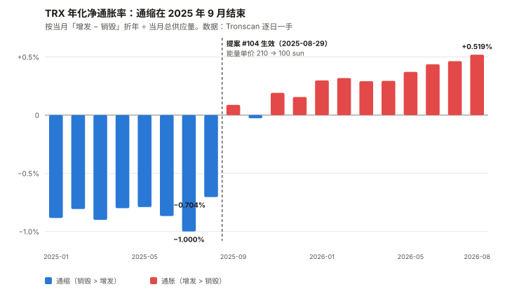
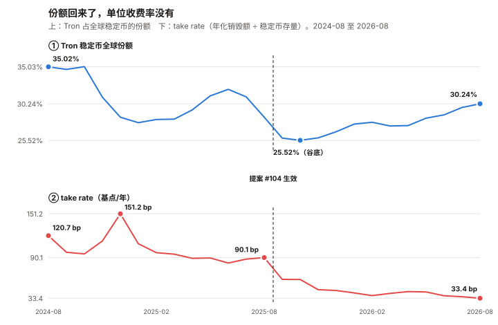
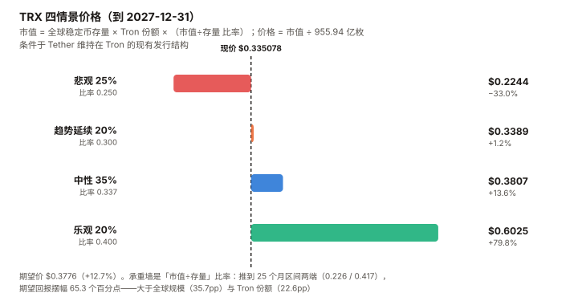

# TRX / Tron 完整调研与分析报告

> **编写日期**：2026 年 9 月 6 日
> **数据截止**：2026 年 9 月 6 日（8 月完整月度数据已闭合）
> **研究方法**：沿用本系列前七期框架（BTC / ETH / SOL / ADA / BNB / HYPE / UNI）。
> **本期的独特之处**：TRX 是本系列覆盖的第八个资产，也是**第一个「收入水平由一次治理投票直接决定」的资产**。
> 前七个资产的收入是需求的函数；TRX 的收入是**定价决策**的函数。这让它成为唯一一个可以把收入变化
> **干净地拆成「量」与「价」两部分**的样本。
> **本期为 TRX 首期报告。**
>
> **本期核心发现**：
> ① TRX 现价 **$0.335078**，市值 **$318.09 亿（全球第 8）**，距 ATH $0.431288（2024-12-03）**–22.31%**——
> **是八个资产里距离历史高点最近的一个**；
> ② **8 月涨幅 +3.14%，八个资产里最低**（第七名 ADA 是 +14.65%，第一名 HYPE 是 +52.40%）。
> **年化波动率 26.6%、相对 BTC 的 beta 0.247，两项都是八个里最低**，且低得不是一点点；
> ③ **业务在创历史新高**：Tron 上的稳定币存量 8 月末 **$934.2 亿**（历史最高），
> 承载全球 USDT 的 **50.3%**（$922.9 亿 / $1,833.9 亿）；
> ④ **而链上收入同比腰斩**：2026-08 销毁 **7,952 万枚 TRX（$2,651.7 万）**，
> 2025-08 是 **1.780 亿枚（$6,144.7 万）**，**同比 –55.3%**；
> ⑤ **原因有两个，都不是需求下降**——① 链上提案 **#104**（2025-08-26 发起、08-29 生效、25 个超级代表赞成）
> 把能量单价从 **210 sun 降到 100 sun（–52.4%）**；② **用户从「烧币付费」迁移到「质押/租能量」**，
> 烧币支付占能量的比重从 **15.3% 降到 10.0%**。
> **而总能量需求同期上升了 8.3%（185.0 → 200.3 十亿单位/日）**；
> ⑥ **最重要的一条，且与市场普遍认知相反**：**TRX 的通缩已经在 2025 年 9 月结束。**
> 2026-08 销毁 7,952 万枚、增发 **1.214 亿枚**，**净增 4,186 万枚**。
> 年化口径：销毁 **0.986%**、增发 **1.506%**、**净通胀 +0.519%**。
> **而这不是意外——提案 #104 的原文自己就写明了会「使链上 TRX 供应转入通胀趋势」。**
>
> **本期核心判断**：**TRX 是「网络越来越有用、代币越来越收不到钱」的第二个样本**（第一个是 ETH），
> **而它的价格在这个过程中几乎没有反应。**
> 过去 12 个月，每美元稳定币存量的年化收费从 **90.1 个基点降到 33.4 个基点（–62.9%）**，
> **而「市值 ÷ 稳定币存量」这个比率几乎没动**（0.400 → 0.341，仍在 25 个月历史的中位附近）。
> **敏感性测算显示，决定未来回报的正是这个比率**（区间两端摆幅 **65.3 个百分点**），
> 大于全球稳定币规模（35.7pp）与 Tron 份额（22.6pp）。
> **也就是说：TRX 的回报主要取决于市场愿意为它付几倍，而不是取决于它的业务或它的治理。**
>
> ⚠️ **本期是本系列发布前审查改动最大的一期。** 初稿的两处核心论断被推翻：
> ① 「销毁下降 55.3% 里只有 6 个点是量，需求基本没走」——**测错了对象**，
> 该残差测的是烧币支付的能量，而总需求实际上升 8.3%；
> ② 「承重墙是治理参数、估值倍数不承重」——**敏感性做法本身是错的**，
> 且整套「市值 = 销毁额 × 倍数」的推导在数学上会把价格约掉。**两处均已重做。**
>
> **免责声明**：本报告不构成任何投资建议。所有分析仅供研究参考，投资决策请咨询专业顾问。

---

## 核心结论摘要（一页速览）

| 维度 | 核心判断 |
|------|----------|
| **TRX 是什么** | **稳定币的清算网络。** Tron 承载全球 USDT 的 **50.3%**（$922.9 亿），占全部稳定币的 **30.2%**。它的链上活动 **98.4% 是 USDT**（Tron 上稳定币 $937.9 亿中 USDT 占 $922.9 亿） |
| **本期的独特之处** | **第一个「收入由治理定价决定」的资产。** 前七个资产的收入随需求波动；TRX 的收入在 2025-08-29 被一次投票砍掉一半 |
| **当前价格位置** | $0.335078，市值 $318.09 亿（第 8）。距 ATH **–22.31%**——**八个资产里最接近历史高点的一个**（第二名 BNB –44.7%） |
| **最反直觉的一项** | **风险特征。** 年化波动率 **26.6%**、beta **0.247**，双双为八个资产最低。BTC 是 44.2% / 1.000。**代价是 8 月只涨了 3.14%，八个里垫底** |
| **最强的一项** | **业务规模与稳定性。** 稳定币存量创历史新高 $934.2 亿；全球份额从 2025-10 的谷底 25.52% 回升到 30.24%；账户数 4.026 亿 |
| **最弱的一项** | **净供应已转为通胀。** 年化增发 1.506% vs 销毁 0.986%，**净 +0.519%**。**不质押的持有人每年被稀释 0.517%，且没有任何补偿** |
| **本期最重要的事实** | **通缩终结于一次治理投票，且是被预告的。** 提案 #104 原文写明降价会「使链上 TRX 供应转入通胀趋势」，链上数据在**下一个月**就验证了。⚠️ **但它对目标价的影响只有 0.69%**（见 10.6） |
| **销毁下降的三个来源** | ① 能量单价 210→100 sun（**–52.4%**，治理）② 烧币支付占比 15.3%→10.0%（**–25.9%**，用户迁移）③ 总能量需求 **+8.3%**（需求在涨）。**② 不需要治理做任何事就会继续** |
| **单位存量收费率** | **33.4 bp/年**（年化销毁 $3.122 亿 ÷ 稳定币存量 $934.2 亿）。2025-08 是 **90.1 bp**，**一年降了 62.9%**。⚠️ 这不是支付业的 take rate；按结算额的真实 take rate 是 **0.375 bp** |
| **估值锚** | **市值 ÷ 稳定币存量 = 0.341**（25 个月区间 0.226–0.417，中位 0.337）。⚠️ **本报告废弃了「市值 / 年化销毁 = 101.9 倍」这个结构**——它在数学上会把价格约掉（见 10.2） |
| **核心多头逻辑** | 总能量需求 +8.3%、稳定币存量创新高、份额触底回升 4.7pp；波动率与 beta 显著低于同类；SEC 未注册证券指控已带偏见驳回；免费能量池已贴住 1,800 亿/日上限，增量需求将被迫回到销毁路径 |
| **核心空头逻辑** | 净供应转正且趋势仍在恶化；**单位存量收费率在治理零动作的 11 个月里又跌了 44.1%**；单一稳定币发行方（Tether）依赖度 98.4%；21 家银行联盟拟 2027 年发行美元代币；ETF 至今未生效 |
| **风险等级** | 中等。**它的核心不确定性不是「业务会不会崩」（业务是八个资产里最稳的），而是「市场什么时候开始为价值捕获的下滑重新定价，以及会不会」** |

---

## 1. Tron 的起源与设计取舍

### 1.1 一条为「不收 gas 费」而设计的链

Tron 由孙宇晨（Justin Sun）于 2017 年创立，2018 年 6 月主网上线。它的技术选择在当时并不新颖——
DPoS（Delegated Proof of Stake，委托权益证明）共识、EVM 兼容的虚拟机（TVM）——但有一个设计
让它后来吃到了整个稳定币市场：**资源模型**。

以太坊的模型是「每笔交易烧 gas，gas 用 ETH 支付」。Tron 的模型是**双轨**：

| 资源 | 用途 | 获取方式 |
|------|------|---------|
| **带宽（Bandwidth）** | 按交易字节数收费 | ① 每账户每天免费 600 字节；② 质押 TRX 获得；③ **销毁 TRX 购买**（单价 1,000 sun/字节） |
| **能量（Energy）** | 智能合约执行（USDT 转账属于此类） | ① 质押 TRX 获得（全网每日上限 1,800 亿单位）；② **销毁 TRX 购买**（单价 100 sun/单位） |

> **注**：1 TRX = 1,000,000 sun。以上参数为 2026-09-06 从 Tron 主网节点
> `wallet/getchainparameters` 接口直接读取，**非二手转述**。

**这个设计的关键含义**：**质押 TRX 得到的资源是免费的，只有在资源不够时才销毁 TRX。**
因此一笔 USDT 转账既可以「烧掉几个 TRX」，也可以「一个 TRX 都不烧」——取决于付款方有没有质押。

### 1.2 这个取舍决定了后来的一切

| 取舍 | 得到 | 付出 |
|------|------|------|
| DPoS，27 个超级代表出块 | 3 秒出块、高吞吐、手续费可预测 | **中心化**。27 个节点，且候选人只有 445 个 |
| 资源模型（质押可免费） | 高频小额转账几乎零边际成本 | **代币价值捕获被削弱**——质押的人不烧币 |
| 参数由链上投票可改 | 能快速响应竞争 | **收入是可以被投票改掉的**（第 4 章的全部内容） |
| EVM 兼容但独立生态 | 迁移成本低 | 与以太坊生态的可组合性弱 |

### 1.3 TRX 代币的三重角色

1. **资源凭证**：质押换带宽/能量，或直接销毁购买
2. **治理票**：质押后可为超级代表投票（当前投票总数 **441.27 亿票**）
3. **收益权**：投票者按票数比例分享每区块 128 TRX 的投票奖励

> **必须先说清一件事**：TRX 的「收益」来自**增发**，不是来自手续费分成。
> 手续费是被**销毁**的，不分配给任何人。这两条现金流方向相反，第 5 章会把它们放在一起算。

---

## 2. TRX 的发展阶段划分

### 阶段一：ICO 与生态搬运（2017–2019）

2017 年 9 月 ICO 募资约 7,000 万美元，随后中国监管禁令下退款。2018 年 6 月主网上线，
2018 年 7 月收购 BitTorrent。这一阶段 Tron 的定位是「更快更便宜的以太坊」，
但生态乏善可陈。**这一阶段留下的最大遗产是 2023 年 SEC 的诉讼**（见 8.3）。

### 阶段二：USDT 的意外胜利（2019–2022）

Tether 在 2019 年 4 月于 Tron 上发行 TRC-20 USDT。当时以太坊 gas 费飙升，
一笔 USDT 转账成本经常超过 10 美元，而 Tron 上不到 1 美元。
**新兴市场的小额跨境汇款几乎整体迁移到了 Tron。** 这不是 Tron 争取来的，
是以太坊的拥堵把用户推过来的。

### 阶段三：份额巅峰与费率上调（2022–2024）

2022 年 12 月，提案 **#79** 把能量单价从 280 sun 上调到 **420 sun**。
2024 年 9 月，提案 **#95** 又下调到 **210 sun**。这一阶段 Tron 的稳定币全球份额在
**2024 年 8 月达到 35.02% 的高点**，链上销毁在 2024-08 达到单月 **4.209 亿枚 TRX**——
本报告数据窗口内的月度最高。

### 阶段四：份额流失与降价防守（2024-12 – 2025-08）

TRX 价格从 2024 年初的约 $0.12 涨到 2025 年三季度的约 $0.32，**把用户的美元计价手续费推高了一倍以上**。
与此同时，稳定币全球份额从 35.02% 一路跌到 **2025-10 的 25.52% 谷底**。

2025-06-10 提案 **#102** 先动供给端：出块奖励 16 → 8 TRX，投票奖励 160 → 128 TRX，
**合计每区块增发从 176 降到 136 TRX（–22.7%）**。

2025-08-26 提案 **#104** 动需求端：能量单价 **210 → 100 sun**，08-29 生效。

### 阶段五：低费率新常态（2025-09 – 至今）

**这是本报告的观察窗口。** 特征是：

- 稳定币存量与份额**双双回升**（份额 25.52% → 30.24%）
- 链上销毁**腰斩**（单月 1.78 亿枚 → 7,952 万枚）
- **净供应在 2025 年 9 月由负转正**——通缩叙事结束
- 2026-08-25 提案 **#107** 通过（两项虚拟机参数开关，25 个 SR 赞成）。
  ⚠️ **本报告未能确认参数键 95 / 96 对应的具体功能**，标为未核实

---

## 3. TRX 当前现状分析

### 3.1 价格与市场

| 指标 | 数值 | 口径 |
|------|------|------|
| 现价 | **$0.335078** | CoinGecko，2026-09-06 11:57 UTC |
| 市值 | **$318.09 亿** | 全球第 8 |
| FDV | $318.09 亿 | 与市值几乎相同（流通 949.36 亿 / 总量 949.38 亿枚） |
| 流通量 | 949.36 亿枚 | 无上限设计，见第 5 章 |
| 24h 成交额 | $2.482 亿 | 换手率 0.78%，八个资产里偏低 |
| ATH | **$0.431288**（2024-12-03） | **距今 –22.31%** |

**8 月的价格路径**：

| 时点 | 价格 |
|------|------|
| 8/1（开） | $0.3257 |
| 8/25（月内高） | **$0.3448** |
| 8/31（收） | $0.3360 |
| **8 月月度（8/1→8/31）** | **+3.14%** |
| 近 30 日 | +2.55% |
| 近 1 年 | +1.08% |

> **本期最该先解释的一件事：8 月八个资产普涨，TRX 几乎没动。**
>
> | 资产 | 8 月涨幅（8/1→8/31） |
> |---|---|
> | HYPE | +52.40% |
> | SOL | +39.68% |
> | ETH | +29.86% |
> | BTC | +23.62% |
> | UNI | +18.06% |
> | BNB | +16.71% |
> | ADA | +14.65% |
> | **TRX** | **+3.14%** |
>
> **口径声明**：全部为 8/1→8/31，CoinGecko 一手日线，同一次调用取得。
>
> **这不是本月的偶然，是 TRX 的稳定特征。** 见 3.2。

### 3.2 波动率与 beta：八个资产里的异类

**BNB 期的教训是「跌幅不是波动率」，本期直接把统计量算出来**——
过去 365 天（2025-09-06 至 2026-09-06）的日对数收益率，CoinGecko 一手日线：

| 资产 | 年化波动率 | beta（相对 BTC） |
|------|:---:|:---:|
| **TRX** | **26.6%** | **0.247** |
| BTC | 44.2% | 1.000 |
| BNB | 52.9% | 0.920 |
| ETH | 63.8% | 1.300 |
| SOL | 67.9% | 1.319 |
| ADA | 80.9% | 1.375 |
| HYPE | 93.6% | 1.076 |
| UNI | 97.1% | 1.329 |

> **TRX 的波动率是 BTC 的 60%，是 UNI 的 27%。beta 0.247 意味着 BTC 涨 10%，TRX 平均只跟涨 2.5%。**
>
> **为什么会这样？** 本报告的解释是：**TRX 的需求来自稳定币转账，而稳定币转账量不依赖加密行情。**
> 有人在阿根廷收 USDT 工资、在尼日利亚做跨境贸易，这些行为在牛市熊市里差别不大。
> **⚠️ 这是一个解释，不是一个已验证的因果结论**——本报告没有做转账量与行情的相关性检验，标为未验证。
>
> **它的代价必须同时说清**：低 beta 在八个资产同涨的月份里就是跑输。
> 8 月 TRX 跑输 BTC 20.5 个百分点。**低波动不是免费的。**

### 3.3 业务规模：稳定币赛道的实际赢家

| 指标 | 数值 | 来源 |
|------|------|------|
| Tron 上稳定币总额 | **$937.9 亿** | DefiLlama API，2026-09-06 |
| 同上（Tronscan 口径） | $956.8 亿 | Tronscan API，**两源相差 2.0%** |
| 其中 USDT | **$922.9 亿** | 占 Tron 稳定币的 **98.4%** |
| **占全球 USDT 的份额** | **50.3%**（$922.9 亿 / $1,833.9 亿） | DefiLlama |
| 占全部稳定币的份额 | **30.2%** | 全球 $3,106 亿 |
| Tron 上的 USDC | **$0.3 亿** | 几乎为零 |
| 账户总数 | **4.026 亿**（24h +128,954） | Tronscan API |
| USDT 转账笔数 | **205.9 万笔 / 24h** | Tronscan API |
| 链上 TVL | **$52.07 亿**（8 月末） | DefiLlama，峰值 $147.14 亿（2024-12-04），**–64.6%** |

> **两个数字放在一起看，是本报告最重要的一组对照**：
> **Tron 承载全球一半的 USDT，而它的 DeFi TVL 从峰值跌了 64.6%。**
> **这条链的价值不在 DeFi，在支付。** 用 TVL 给 Tron 估值是用错了尺子。

**一个必须点明的集中度**：Tron 上的稳定币 **98.4% 是 USDT，USDC 几乎为零**。
这意味着 **Tron 的业务量对单一发行方（Tether）的依赖，比 BNB 对币安的依赖更彻底**——
BNB 至少还有链本身的其他用途，而 Tron 一旦失去 USDT，业务基本清零。

### 3.4 宏观环境

| 因素 | 状态（9 月初） | 影响 |
|------|--------------|------|
| 联邦基金利率 | 3.50–3.75% | — |
| 9 月加息概率 | **65.9%**（CME FedWatch，8/31） | 利空 |
| PCE 通胀 | 3.7%（12 个月）/ 4.1%（6 个月） | 支持加息 |
| 10 年期美债 | 4.79% | — |
| 8 月流动性事件 | 财政部加倍长端国债回购 | 八个资产 8 月普涨的共同触发因素 |

> **本节沿用与本系列 UNI 期同一时点的宏观快照（同为 2026-09-06 编写）。**
>
> **但对 TRX 而言，宏观的解释力比其他七个资产都弱**——它 8 月只涨了 3.14%，
> 而这一轮普涨的共同触发因素（财政部回购）显然作用于所有资产。
> **beta 0.247 就是这个现象的定量表达**：TRX 对共同因子的暴露本来就低。

---

## 4. 一次可以被完整复盘的降价（本期核心章之一）

> **本系列前七期反复遇到的困难是：收入变了，但不知道为什么变。**
> SOL 的收入崩了 87%，ETH 的 L1 费用真同比 –73.8%，两者都无法把「需求下降」和「结构迁移」分开。
> **TRX 是第一个可以分开的**，因为它的价格变化是**一次有日期、有票数、有原文的链上事件**。

### 4.1 事件本身：提案 #104

以下全部来自 Tron 主网治理接口与提案原文，**非媒体转述**：

| 项目 | 内容 |
|------|------|
| 提案编号 | **#104** |
| 参数 | 键 11 = `ENERGY_FEE`（能量单价，单位 sun/能量） |
| 变更 | **210 → 100 sun** |
| 变更幅度 | **–52.4%** |
| 发起 | 2025-08-26 |
| 生效 | 2025-08-29 |
| 赞成 | **25 个超级代表**（27 席中的 25 席） |
| 状态 | `APPROVED` |
| 提案原文 | tronprotocol/tips Issue #789，投票指令 `createProposal 11 100` |

**提案原文里最重要的两句话**：

1. 理由：**「自 2024 年以来 TRX 价格大约翻倍，抵消了此前的降费效果」**——
   即降价是为了对冲币价上涨造成的美元手续费上升。
2. 后果：提案自己写明，50% 的能量降价会使链上 TRX 供应**「转入通胀趋势」**（shift into an inflationary trend）。

> ⚠️ **一处必须纠正的媒体口径**：多家媒体（含 Yahoo Finance / TradingView 转载）
> 把这次降价写成 **「削减 60%」**。**链上参数是 210 → 100 sun，即 –52.4%**，
> 提案原文自己写的也是 **52%**。**本报告使用 52.4%。**
>
> 这正是 ADA 期得到的教训：**多家媒体口径一致 ≠ 事实**，它们很可能引用同一份稿件。

### 4.2 分解：三个来源，而不是两个

> ⚠️ **本节是发布前审查改动最大的一节。**
> **初稿只做了「价 vs 量」两分法，用残差法得出「量只降了 6.2%，需求基本没走」。
> 两位审查者独立指出这个残差测的不是需求，本报告随后找到了官方的一手分项数据，证实他们是对的。**
> **初稿的分解已作废，以下是修正版。**

**新的一手来源**：Tron 官方治理讨论 **tronprotocol/tips Issue #910**（2026-07-16，《TRON 季度手续费复盘 — 2026 Q2》），
它给出了 Tronscan 官方图表的**能量分项序列**——本报告的残差法只能估计的东西，它直接给出了。

| 月份 | 总能量消耗（十亿单位/日） | **烧币支付占比** | 质押供应占比 | 年化净供应变化 |
|------|---:|---:|---:|---:|
| 2025-06（降价前） | 184.3 | 15.3% | 84.7% | –0.87% |
| 2025-07（降价前） | 184.8 | 15.0% | 85.0% | –1.00% |
| **2025-08（提案月）** | **185.0** | **13.5%** | **86.5%** | **–0.70%** |
| 2025-09 | 199.2 | 14.9% | 85.1% | +0.09% |
| 2025-10 | 208.9 | 15.5% | 84.5% | –0.03% |
| 2025-12 | 209.1 | 12.8% | 87.2% | +0.16% |
| 2026-02 | 190.0 | 12.5% | 87.5% | +0.32% |
| 2026-04 | 202.2 | 11.7% | 88.3% | +0.29% |
| **2026-06** | **200.3** | **10.0%** | **90.0%** | **+0.44%** |

> **先做一次交叉验证**：该表最后一列与本报告 5.2 从 Tronscan 逐日数据独立算出的序列
> **逐月吻合**（2025-06 −0.87 vs −0.867；2025-08 −0.70 vs −0.704；2025-09 +0.09 vs +0.088；
> 2026-06 +0.44 vs +0.437）。**两个独立计算路径一致，可以放心使用这张表的其余列。**

**正确的分解是三项，不是两项**：

| 来源 | 变化（2025-08 → 2026-06） | 性质 |
|------|:---:|------|
| ① **能量单价** | 210 → 100 sun，**–52.4%** | **治理决定** |
| ② **烧币支付占比** | 13.5% → 10.0%，**–25.9%** | **用户行为迁移**（转向质押/租赁） |
| ③ **总能量消耗** | 185.0 → 200.3 十亿单位/日，**+8.3%** | **需求增长** |

**验算**：0.476 × 0.741 × 1.083 = **0.382**，即销毁量应降 61.8%。
实测 2026-06 / 2025-08 销毁量比 = 83,395,455 / 177,966,193 = **0.469（–53.1%）**。
**差额来自带宽与固定费用销毁**——它们的单价没变，因此在总销毁里的占比被动上升，拖住了降幅。

> **修正后的结论，与初稿方向相反的地方**：
>
> **① 需求没有下降，它上升了 8.3%。** 初稿写的「消耗量 –6.2%」测的是**烧币支付的那部分能量**，
> 不是总需求。**这两者在本期恰好方向相反。**
>
> **② 降价不是唯一原因。** 在能量单价**完全没变**的 2025-09 至 2026-08 这 11 个月里，
> 销毁量仍从 1.106 亿枚降到 7,952 万枚（**–28.1%**）——这一段的下降与治理无关，
> **全部来自烧币占比的持续下滑（14.9% → 10.0%）。**
>
> **③ 因此对代币持有人而言，问题比初稿描述的更严重**：
> 价值捕获在**双重收缩**（单价砍半 + 烧币份额下滑），而**业务量在增长**。
> **这是 ETH 期「网络越来越有用、代币越来越收不到钱」的同一形态，只是机制不同**——
> ETH 是用量迁移到 L2，**TRX 是支付方式从「烧币」迁移到「质押」。**

**初稿的残差估计作为交叉检验保留**（用销毁量 ÷ 单价折算，单价恒 100 sun 期间口径干净）：

| 月份 | 隐含「烧币支付的能量」（十亿单位/日） |
|------|---:|
| 2025-09 | 36.87 |
| 2025-10 | 39.86（峰值） |
| 2026-01 | 31.40 |
| 2026-04 | 31.52 |
| **2026-08** | **25.65（距峰值 –35.6%）** |

> **这个序列的绝对水平偏高**（2026-06 本报告估 27.80，官方分项为 20.03，**高估 38.8%**），
> 原因正是初稿已经声明过的偏差：带宽与固定费用被按能量单价折算成了「虚拟能量」。
> **但趋势几乎一致**（本报告 2025-09→2026-08 为 –30.4%，官方 2025-09→2026-06 为 –32.6%）。
>
> ⚠️ **初稿在此处的偏差方向推导虽然结论对了，过程是不完整的**：
> 真正决定方向的不是「单价越低虚拟出的量越多」（1/p 对真实量与虚拟量同等放大，会约掉），
> **而是「非能量销毁的单价没变，因此它在总销毁中的占比被动上升」。**

### 4.3 一个被错误排除、又被重新确认的解释

> ⚠️ **初稿在这里犯了本期最严重的推理错误，完整记录如下。**

**初稿的假设**：销毁下降的另一个原因是交易迁移到了「租能量」模式——
质押 TRX 的人把闲置能量租给别人，用户付 USDT 给中介，**链上不销毁任何 TRX**。
这就是所谓「Gas Free / 免 TRX 转账」的真实机制。

**初稿的反证**：用 Tronscan 的 `freeze1Balance` / `freeze2Balance` 两个字段做了一张
「能量质押 vs 带宽质押」的时序表，发现总质押率三年稳定在 45–49%、增长发生在 2024 年，
据此判定**「这条渠道不能解释本期的销毁下降，降价是唯一的主因」**。

**这个反证有三处独立的错误**：

| # | 错误 | 证据 |
|---|------|------|
| **1** | **字段读错了。** `freeze1Balance` / `freeze2Balance` 不是「带宽 / 能量」，是 **Stake 1.0 / Stake 2.0** 两代质押机制 | 同一条记录里另有 `total_energy_weight` / `total_net_weight` 才是能量/带宽。2023-12 时 freeze1=316.0 亿、freeze2=144.6 亿，而 energy_weight 只有 62.4 亿——**若 freeze1 是带宽，两者应当接近，实际差 5 倍** |
| **2** | **即使用对了字段，质押权重也测不了这件事。** 全网每日免费能量总量由链参数 `getTotalEnergyLimit` **固定为 1,800 亿单位**，与质押总量无关——质押权重只决定「谁分到」，不决定「有多少」 | 参数值为本报告从主网 `wallet/getchainparameters` 直接读取 |
| **3** | **说了「不能完全排除」，却写了「唯一主因」。** 初稿自己承认利用率通道无法排除，结论却用了排他性表述 | — |

**用正确的字段重做**（`total_energy_weight` / `total_net_weight`，单位：亿枚 TRX）：

| 时点 | 能量质押 | 带宽质押 | 合计 |
|------|:---:|:---:|:---:|
| 2023-12 | 62.4 | 398.3 | 460.7 |
| 2024-07 | 78.2 | 386.7 | 464.9 |
| 2024-10 | **147.2** | 293.4 | 440.6 |
| 2025-08 | 180.1 | 276.8 | 456.9 |
| **2026-08** | **188.1** | **268.7** | **456.7** |

> **能量质押从 62.4 亿涨到 188.1 亿（+201%），而不是初稿写的「+41% 后走平」。**

**而决定性的证据是能量租赁市场的收入时序**（DefiLlama 一手，初稿把它标成了「未获取」，实际可得）：

| 月份 | CatFee | TRONSAVE | 合计 |
|------|---:|---:|---:|
| 2025-06 | $13.3 万 | $93.9 万 | $107.2 万 |
| **2025-08（降价当月）** | $120.5 万 | $69.6 万 | **$190.1 万** |
| 2025-12 | $320.2 万 | $87.2 万 | $407.4 万 |
| 2026-04 | $344.1 万 | $85.1 万 | $429.2 万 |
| **2026-08** | **$376.3 万** | **$89.5 万** | **$465.8 万** |

> **CatFee 一家在 14 个月里从 $13.3 万涨到 $376.3 万，28 倍。**
> **同期链上销毁从 1.780 亿枚降到 7,952 万枚。**
>
> **修正后的结论**：
> **能量租赁的迁移是真实的、大规模的、且仍在进行中。**
> **它与降价是并列的两个原因，不是被排除的替代解释。**
> 官方分项数据给出了它的量级：**烧币支付占比 15.3%（2025-06）→ 10.0%（2026-06）。**
>
> **一个前瞻性的推论**：免费能量池的上限是 1,800 亿单位/日。
> 按官方表，2026-06 质押供应的能量 = 200.3 × 90.0% = **180.3 十亿单位/日**——**已经贴住上限。**
> **这意味着此后任何增量需求都只能靠销毁 TRX 支付**，除非治理再次上调该上限
> （2024 年就调过三次：900 亿 → 1,200 亿 → 1,500 亿 → 1,800 亿）。
> ⚠️ **这个推论依赖「1,800 亿是硬上限且当前已饱和」，本报告已核实参数值，但未核实实际发放是否真的触顶**，标为部分验证。

## 5. 净供应：通缩在 2025 年 9 月结束（本期核心章之二）

> **ETH 期得到的教训是：销毁必须和增发放在一起看，否则「超声波货币」这类叙事会站不住。**
> **本章把同一把尺子用在 TRX 上，结论比 ETH 更干净——因为 TRX 的交叉点有确切日期。**



### 5.1 增发机制

Tron 每 3 秒出一个区块，每区块增发固定数量的 TRX，**没有上限**：

| 项目 | 当前值 | 变更历史 |
|------|:---:|------|
| 出块奖励（归出块的 SR） | **8 TRX/区块** | 提案 #102（2025-06-10）从 16 降至 8 |
| 投票奖励（按票数分给前 127 名） | **128 TRX/区块** | 提案 #102 从 160 降至 128 |
| **合计** | **136 TRX/区块** | **从 176 降至 136，–22.7%** |
| 日区块数 | 28,800 | 3 秒/块 |

> **一次独立交叉验证**：Tron Inc.（Nasdaq: TRON）在 2026-08-13 的 8-K 中披露，
> 2025 年全网出块奖励约 **1.22 亿 TRX**、投票奖励约 **15 亿 TRX**，合计 **16.22 亿**。
> **本报告从 Tronscan 逐日 `total_produce` 字段加总得到 2025 全年 16.172 亿 TRX。**
> **两个完全独立的来源相差 0.3%。** 增发口径可以确信。
>
> **第二次交叉验证（精度更高）**：TRON DAO 官方 2026 年二季度报告披露，
> Q2 2026 **增发 356.32M TRX、销毁 269.45M TRX、净增发 86.87M TRX**。
> 本报告从 Tronscan 逐日数据加总 2026 年 4/5/6 三个月：
> **增发 356,320,136、销毁 269,454,484——与官方数字完全一致（精确到披露的小数位）。**
> ⚠️ TRON DAO 是发行方，属利益相关来源；**但正因为它是发行方，它承认净通胀这件事的可信度更高，而非更低。**

### 5.2 交叉点

**2024-08 作为对照**：当月销毁 420,853,202 枚、增发 157,026,848 枚，净减 263,826,354 枚，年化通缩 **–3.243%**——这是本报告数据窗口内通缩最强的一个月。

| 月份 | 销毁（TRX） | 增发（TRX） | 净供应变化 | 年化净通胀 |
|------|---:|---:|---:|:---:|
| 2025-01 | 228,506,605 | 157,087,744 | -71,418,861 | -0.884% |
| 2025-02 | 200,715,765 | 141,879,056 | -58,836,709 | -0.807% |
| 2025-03 | 229,691,965 | 157,087,744 | -72,604,221 | -0.900% |
| 2025-04 | 214,350,742 | 151,955,760 | -62,394,982 | -0.800% |
| 2025-05 | 220,742,008 | 157,078,064 | -63,663,944 | -0.790% |
| 2025-06 | 199,094,890 | 131,526,376 | -67,568,514 | -0.867% |
| 2025-07 | 201,806,728 | 121,387,072 | -80,419,656 | -1.000% |
| **2025-08** | **177,966,193** | **121,386,800** | **-56,579,393** | **-0.704%** |
| **2025-09** | **110,613,012** | **117,467,552** | **+6,854,540** | **+0.088%** |
| 2025-10 | 123,560,741 | 121,385,848 | -2,174,893 | -0.027% |
| 2025-11 | 102,638,313 | 117,469,456 | +14,831,143 | +0.191% |
| 2025-12 | 108,886,486 | 121,371,568 | +12,485,082 | +0.155% |
| 2026-01 | 97,351,615 | 121,353,480 | +24,001,865 | +0.298% |
| 2026-02 | 86,497,066 | 109,624,568 | +23,127,502 | +0.318% |
| 2026-03 | 97,927,130 | 121,332,672 | +23,405,542 | +0.291% |
| 2026-04 | 94,561,671 | 117,470,952 | +22,909,281 | +0.294% |
| 2026-05 | 91,497,358 | 121,386,528 | +29,889,170 | +0.371% |
| 2026-06 | 83,395,455 | 117,462,656 | +34,067,201 | +0.437% |
| 2026-07 | 84,031,885 | 121,374,560 | +37,342,675 | +0.463% |
| **2026-08** | **79,523,696** | **121,384,760** | **+41,861,064** | **+0.519%** |

> **交叉点是 2025 年 9 月——提案 #104 生效后的第一个完整月。**
>
> **一处必须写准的细节**：**它不是一次性、单调的翻转。**
> 2025-09 转正到 +0.088% 后，**2025-10 又短暂回到 –0.027%**（当月销毁反弹至 1.236 亿枚），
> **此后连续 10 个月为正**，从 +0.191% 单调上行到 **+0.519%**。
>
> **说「2025 年 9 月之后 TRX 就一直在通胀」是不准确的；准确的说法是
> 「2025 年 10 月之后再没有回到通缩」。**
>
> **趋势的斜率也值得注意**：净通胀已经逼近 **0.5%** 的年化水平，
> 而它在 2026-01 还只有 0.298%——**八个月上升了 74%。**
>
> ⚠️ **但它有一个明确的上界，必须写出来**：增发端固定在每区块 136 TRX，
> **因此即使销毁完全归零，年化净通胀的上限也只有 1.506%。**
> **当前的 0.519% 走完了这段距离的约三分之一。**
> **初稿在此写「没有见顶迹象」，是把一个有界的量描述成了无界的量。**

**总供应量的实际路径**（Tronscan `total_turn_over` 字段，与 CoinGecko 的 949.38 亿枚相差 0.001%）：

| 时点 | 总供应量 |
|------|---:|
| 2023-12-11 | 97,316,799,955 |
| **2025-08-31（本轮低点）** | **94,660,949,604** |
| 2026-09-05 | **94,936,434,687** |

> **供应量在 2025 年 8 月末见底，此后 12 个月增加了 2.755 亿枚（+0.291%）。**
> **「TRX 是通缩资产」这句话，在 2025 年 8 月 29 日之后就不再成立。**

### 5.3 一处必须说清的口径陷阱

**DefiLlama 上 Tron 的「Fees」「Revenue」「HoldersRevenue」是同一个数字。**

本报告直接读了它的适配器源码（`dimension-adapters/fees/tron.ts`）：三个字段全部等于
Tronscan `turnover` 接口的 `total_trx_burn`，即**销毁量本身**。

> **这意味着「Tron 的捕获率是 100%」是一句同义反复，不是一个发现。**
> 它不是「Tron 把 100% 的费用给了持有人」，而是「DefiLlama 把销毁定义成了费用」。
>
> **真实的费用总额比这个数大**：所有用质押资源完成的交易，用户付出了资本占用成本
> （或付给了能量租赁中介，见 4.3 的 $463.8 万），**这些都不在分子里**。
>
> **本系列的第四个费用口径坑**：ADA 期是 L1 费 ≠ 生态合计；ETH 期是 blob ≠ L2 全部支出；
> UNI 期是 8 月单月 ≠ 最近 30 天；**TRX 期是「费用」被定义成了「销毁」。**

### 5.4 对持有人的实际处境

年化口径（2026-08 运行率 × 365/31）：

| 项目 | TRX | 占供应 |
|------|---:|:---:|
| 销毁 | 936,327,388 | **0.986%** |
| 增发 | 1,429,207,658 | **1.506%** |
| **净** | **+492,880,270** | **+0.519%** |

**增发的 128/136 = 94.1% 流向投票者**，按 441.27 亿总票数计算：

| 持有人类型 | 年化名义收益 | **实际份额变化** |
|------|:---:|:---:|
| 质押并投票 | **+3.048%**（未扣 SR 佣金） | **+2.516%** |
| **不质押** | **0** | **–0.517%** |

> **不质押的持有人每年被稀释 0.517%，且拿不到任何补偿——销毁的好处被增发吃掉有余。**
>
> ⚠️ **初稿在此写「TRX 是本系列第一个『不质押就是纯亏』的资产」，被本报告自己的 9.3 表证伪**：
> ETH（+0.863%）与 ADA（+1.47%）同样是净增发且增发流向质押者。
> **准确的表述是：TRX 是本系列第三个出现这一形态的资产，而它的净通胀率是三者中最低的。**
>
> **48.1% 的供应已经质押，说明市场大体已经知道这件事。**
> **而剩下 51.9% 未质押的部分，正在持续向质押者转移价值。**
>
> ⚠️ **BNB 期的教训在此适用且必须重申**：这条「+3.048%」**不是票息**。
> 质押者拿到的是更多的币，不是现金；**如果币价下跌，币数增加不构成收益**。
> 后文第 10 章的价格推导已经把供应增长放在**分母**里，**不会再把它当成一项收益加回去**。

---

## 6. 份额、单位收费率与竞争（本期核心章之三）

> **第 4 章证明了收入下降是主动降价的结果。本章问的是：这次降价买到了什么？**



### 6.1 份额：先跌后回，谷底在降价之后一个月

| 月份 | Tron 稳定币（亿美元） | 全球（亿美元） | **Tron 份额** |
|------|---:|---:|:---:|
| 2024-08 | 595.9 | 1,701.7 | **35.02%**（高点） |
| 2024-12 | 585.8 | 2,054.5 | 28.51% |
| 2025-04 | 709.8 | 2,410.1 | 29.45% |
| 2025-08（降价当月） | 803.0 | 2,816.6 | 28.51% |
| **2025-10（谷底）** | 780.9 | 3,059.4 | **25.52%** |
| 2026-04 | 870.2 | 3,173.0 | 27.43% |
| **2026-08** | **934.2** | 3,088.8 | **30.24%** |

**把份额拆成分子与分母两侧看，结论会变**：

| 期间 | **Tron 存量增速** | **非 Tron 存量增速** | 份额 |
|---|:---:|:---:|:---:|
| 2024-08 → 2025-08（降价前 12 个月） | +34.8% | **+82.1%** | 35.02% → 28.51% |
| 2025-10 → 2026-08（谷底后 10 个月） | **+19.6%（年化 23.9%）** | **–5.4%** | 25.52% → 30.24% |

> **份额回升是真实的，Tron 的绝对增长（+19.6%）也是真实的。**
> **但在同一段时间里，Tron 自身的增速从 34.8%/年 降到了 23.9%/年——慢了三分之一。**
> **份额的方向翻转，主要发生在分母一侧（非 Tron 从 +82%/年 变成 –5.4%）。**
>
> ⚠️ **初稿在此写「这是降价有没有用的最有力证据，而且是正面的」，已收窄为**：
> **这是时间上唯一吻合的证据，而同期可观测的用户侧指标方向相反**——
> Tron 自身增速减速三分之一，烧币支付的能量距峰值 –35.6%。
>
> **还有一个本报告自己给出的替代解释，初稿没有把它用在这里**：
> 3.2 用「稳定币转账不依赖加密行情」解释 TRX 的低 beta。
> **如果这条成立，那么当整个稳定币市场停止扩张时，Tron 的份额会机械性回升，与提案 #104 无关。**
> **本报告无法区分这两种解释。反事实不可观测。**

### 6.2 单位收费率（take rate）：一年降了 62.9%

> ⚠️ **命名先更正。** 初稿把下面这个比率叫「take rate」，**这个叫法是错的**：
> 支付网络的 take rate 是「费用 ÷ 结算额」（流量），而下式的分母是**存量**。
> **本报告以下统一称它为「单位存量收费率」**，保留 take rate 这个词给真正的流量口径。

**真正的 take rate（流量口径）**：TRON DAO 官方二季报披露 Q2 2026 稳定币结算额 **$2.08 万亿**，
年化约 **$8.32 万亿**。年化销毁 $3.122 亿 ÷ $8.32 万亿 = **0.375 个基点（0.00375%）**。
⚠️ **结算额来自发行方自己的季报，本报告未能独立验证。**
> **作为量级参照**：这个数字远低于传统卡组织的水平。**Tron 是一条极其廉价的结算通道，
> 而「廉价」正是它的护城河与它的问题的同一个来源。**

**下面这个「单位存量收费率」衡量的是另一件事：每承载一美元稳定币存量，一年收多少费。**

| 时点 | 年化销毁 | 稳定币存量 | **take rate** |
|------|---:|---:|:---:|
| 2025-08 | $7.235 亿 | $803.0 亿 | **90.1 bp/年** |
| **2026-08** | **$3.122 亿** | **$934.2 亿** | **33.4 bp/年** |
| 变化 | –56.9% | +16.3% | **–62.9%** |

**完整的月度序列**（年化销毁额 ÷ 当月稳定币存量，本报告自行计算）：

| 月份 | 份额 | take rate | 月份 | 份额 | take rate |
|---|:---:|:---:|---|:---:|:---:|
| 2024-08 | 35.02% | **120.7 bp** | 2025-09 | 25.81% | 59.8 bp |
| 2024-09 | 34.68% | 97.5 bp | 2025-10 | 25.52% | 59.6 bp |
| 2024-10 | 35.03% | 95.2 bp | 2025-11 | 25.84% | 45.4 bp |
| 2024-11 | 31.10% | 113.2 bp | 2025-12 | 26.63% | 44.2 bp |
| 2024-12 | 28.51% | 151.2 bp | 2026-01 | 27.62% | 40.8 bp |
| 2025-01 | 27.80% | 109.4 bp | 2026-02 | 27.86% | 37.1 bp |
| 2025-02 | 28.21% | 96.9 bp | 2026-03 | 27.37% | 40.2 bp |
| 2025-03 | 28.26% | 94.9 bp | 2026-04 | 27.43% | 42.7 bp |
| 2025-04 | 29.45% | 89.1 bp | 2026-05 | 28.39% | 42.2 bp |
| 2025-05 | 31.27% | 89.5 bp | 2026-06 | 28.81% | 36.9 bp |
| 2025-06 | 32.11% | 82.4 bp | 2026-07 | 29.77% | 35.5 bp |
| 2025-07 | 31.14% | 87.9 bp | **2026-08** | **30.24%** | **33.4 bp** |
| 2025-08 | 28.51% | 90.1 bp | | | |

> **序列里有一个容易被忽略的事实**：**take rate 在降价之前就已经在下行了**——
> 2024-08 的 120.7 bp 到 2025-08 的 90.1 bp，一年降了 25.4%，
> **原因是稳定币存量增长快于销毁增长**。
> **提案 #104 是把一个已经在发生的趋势加速了，不是开启了它。**
> （2024-12 的 151.2 bp 是异常值，对应当月 TRX 价格创 ATH，美元计价销毁额被推高。）

> ⚠️ **一处必须与第 4 章接上的事实**：
> **这条曲线在能量单价完全没变的 11 个月里（2025-09 的 59.8 bp → 2026-08 的 33.4 bp）
> 又跌了 44.1%。**
> **也就是说，单位存量收费率的下滑不需要治理再做任何事就会继续——
> 它由「烧币支付占比持续下滑」驱动（见 4.3），而那是用户行为，不是投票。**
> **初稿把这条风险写成了「取决于超级代表会不会再投一次票」，方向搞反了。**

> **这一年 Tron 做的事，可以一句话概括**：
> **用 62.9% 的单位收费率下降，换来 16.3% 的存量增长和 4.7pp 的份额回升。**
>
> **净效果对代币持有人是负的**——收入的绝对额从年化 $7.235 亿掉到 $3.122 亿，
> 而这正好是净供应由通缩转通胀的原因。
>
> **但对网络本身可能是正的**：份额守住了，用户没走，业务量创了新高。
> **这两个判断不矛盾，它们描述的是不同的受益人。**

### 6.3 竞争：被广泛预期的威胁，目前没有出现在数据里

2025 年以来，市场普遍预期专为稳定币设计的新链会分走 Tron 的份额。**截至 2026-09-06 的实际数字**：

| 链 | 稳定币存量 | 相对 Tron |
|------|---:|:---:|
| **Tron** | **$937.9 亿** | 100% |
| Ethereum | $1,472.3 亿 | 157% |
| Solana | $163.6 亿 | 17.4% |
| BSC | $133.0 亿 | 14.2% |
| Hyperliquid L1 | $70.3 亿 | 7.5% |
| **Plasma** | **$9.26 亿** | **1.0%** |
| Tempo | $0.82 亿 | 0.09% |
| **Stable** | **$0.23 亿** | **0.02%** |

> **Plasma、Stable、Tempo 三条「稳定币专用链」合计 $10.3 亿，是 Tron 的 1.1%。**
> **这条被讲了一年的空头逻辑，在链上数据里目前不成立。**

**但真正的威胁在别处，而且来自传统金融**：

| 机构 | 观点 / 动作 |
|------|------|
| **JPMorgan** | 明确不认为稳定币会在 2028 年达到万亿级，预测总市值 **$5,000–6,000 亿** |
| **Citi** | 2030 年基准 **$1.9 万亿**、乐观 **$4 万亿** |
| **Standard Chartered** | 2028 年 **$2 万亿** |
| **21 家银行联盟**（含 Citi、Goldman Sachs、UBS） | 计划 2026 下半年成立公司，**2027 上半年发行美元代币** |

> **对 Tron 而言，银行联盟的威胁性质与 Plasma 完全不同**：
> Plasma 争的是「在哪条链上转 USDT」；**银行联盟争的是「还用不用 USDT」。**
> 而 Tron 的业务 **98.4% 是 USDT**——**它的风险敞口是 Tether 的风险敞口。**
>
> **⚠️ 同时必须给出反向的量级感**：JPMorgan 最保守的 $5,000 亿仍比当前的 $3,106 亿高 61%。
> **即使按最空的机构预测，这个市场仍在增长。**

---

## 7. 上市公司储备、ETF 与关联方结构

### 7.1 Tron Inc.（Nasdaq: TRON）

**本系列第三个有上市公司储备的资产**（前两个是 BTC 的 Strategy 体系、SOL 的 Upexi 等）。

| 项目 | 数值 | 来源 |
|------|------|------|
| 持仓 | **7.112 亿枚 TRX**（2026-08-24） | 公司披露 |
| 市值 | 约 **$2.45 亿** | 同上 |
| **占 TRX 流通量** | **0.75%** | 本报告计算 |
| 总资产（2026-03-31） | $2.527 亿 | **SEC 8-K 原文** |
| 数字资产公允价值 | $2.251 亿 | 同上 |
| Q1 2026 净利润 | $2,163 万（含未实现浮盈 $2,070 万） | 同上 |
| Q1 2026 质押收入 | $300 万 | 同上 |
| **累计浮盈（截至 2026-06-30）** | **仅 $1,580 万** | **SEC 8-K 原文** |

> **一个必须点出的数字**：投入约 $2.4 亿、持有 14 个月，**累计浮盈只有 $1,580 万（约 +6.6%）**。
> **对照 BTC 期的 Strategy——同期资产价格波动大得多。TRX 的低波动在这里也表现出来了。**

**2026-08-13 的新动作**：公司宣布**计划竞选超级代表（SR）**，理由是要「直接参与 TRON 网络的成功」。
若当选，它将同时是：最大的公开市场持币方、验证节点、**以及治理投票方**。

### 7.2 关联方结构：这是本章最重要的部分

**以下全部来自 Tron Inc. 2026-08-11 提交的 10-Q 原文**，非媒体转述：

| 关系 | 内容 |
|------|------|
| 托管方 | **BiT Global Trust Limited（BGTL）**，香港持牌信托公司。**公司董事 Zhihong Liu 同时是 BGTL 的董事** |
| 董事会 | **Weike Sun 是董事，他是 Tron 创始人孙宇晨的父亲** |
| 董事会 | 董事 Zi Yang 在 **Tronscan**（Tron 官方区块浏览器）担任高管 |
| 董事会 | Zhihong Liu 自 2021 年起担任 **Tron DAO 高级顾问** |
| 资产存放 | TRX 全部质押在 **JustLend**（Tron 生态内的 DeFi 协议），换取衍生代币 **sTRX** |
| 收益构成 | 质押奖励 **＋ 能量租赁收入**（把质押得来的闲置能量租给其他用户） |

> **这段披露有两层信息**：
>
> **第一层（风险）**：**「机构采纳」这个多头论据在这里要打很大折扣。**
> 最大的公开市场 TRX 持有方，其董事会与创始人家族、官方浏览器、生态基金会均有人事重叠，
> 托管方与自己共用董事，资产全部押在同生态的单一 DeFi 协议里。
> **这不是独立第三方的资金流入，更接近生态内部资金的再配置。**
>
> **第二层（信息）**：**它反向验证了第 4.3 节。** 公司自己承认收益中包含「能量租赁收入」——
> **能量租赁市场是真实存在且被上市公司当作业务的**。

### 7.3 ETF：至今未生效

| 项目 | 状态 | 来源 |
|------|------|------|
| 产品 | Canary Staked TRX ETF（拟代码 **TRXS**） | SEC EDGAR |
| 首次提交 | 2025-04-18（S-1） | 同上 |
| 最新修订 | **2026-08-19（S-1/A）** | 同上 |
| 生效通知 | **无** | **本报告直接查询 EDGAR，CIK 0002064768，未见 EFFECT 或 424B** |

> **提交 17 个月、四次修订、仍未生效。** 对照 BTC / ETH / SOL 均已有现货 ETF。
> **「ETF 即将带来资金流入」目前没有任何证据支持。**

---

## 8. 治理与中心化

### 8.1 27 个人决定这条链的收入

**这是本报告最需要读者理解的结构事实**：

| 项目 | 数值 |
|------|:---:|
| 超级代表（SR）席位 | **27** |
| SR 候选人总数 | 445 |
| 投票总数 | 441.27 亿票（1 票 = 1 枚质押 TRX） |
| 提案通过门槛 | 27 席中需 **≥18 席**赞成 |
| 提案 #104（能量降价 52.4%）赞成数 | **25** |
| 提案 #102（增发减少 22.7%）赞成数 | **25** |
| 历史提案总数 | 68 |

> **提案 #104 把 TRX 的年化收入从 $7.235 亿降到 $3.122 亿，只需要 25 个节点点同意，三天生效。**
> **本系列前七个资产没有一个具备这种程度的收入可变性**：
> BTC 的减半写死在代码里；ETH 的销毁由需求决定；BNB 的销毁按公式；
> HYPE / UNI 的费率改动需要更广泛的代币持有人投票。
> **TRX 的收入是 27 个节点的一个整数参数。**

**这把双刃剑的两面都要写清**：

| 正面 | 负面 |
|------|------|
| 能在三天内响应竞争，这是 Plasma 至今没打进来的原因之一 | **同一个机制可以在三天内再砍一半，持有人没有否决权** |
| 决策快，不会陷入治理僵局 | **参数可以被为了非持有人利益而调整**（如为守份额而牺牲收入） |

### 8.2 中心化的其他维度

| 维度 | 状况 |
|------|------|
| 出块 | 27 个 SR 轮流出块，前十大 SR 得票占比合计约三成 |
| 稳定币发行 | **98.4% 是 USDT，单一发行方 Tether 可冻结任意地址** |
| 创始人影响力 | 孙宇晨对生态的影响力远超一般公链创始人；Tron Inc. 董事会有其家族成员 |
| 官方浏览器 | Tronscan——**本报告的多数一手链上数据来自它**，⚠️ 这本身是一个来源集中度问题（见 11.5） |

### 8.3 监管：SEC 的诉讼已经了结，且了结方式对 TRX 有利

**以下来自 SEC 官方诉讼公告 Litigation Release No. 26496（2026-03-05）原文**：

| 项目 | 内容 |
|------|------|
| 案件 | SEC v. Justin Sun 等，No. 1:23-cv-02433（S.D.N.Y.，2023-03-22 立案） |
| 和解方 | **仅 Rainberry, Inc.**（原 BitTorrent Inc.） |
| 和解内容 | 就 2018–2019 年 TRX **洗售交易**（违反 1933 年证券法 §17(a)(3)）支付 **$1,000 万**民事罚款，永久禁令 |
| **其余指控** | **对 Rainberry 的剩余指控、以及对 Justin Sun / Tron Foundation / BitTorrent Foundation 的全部指控，带偏见驳回（dismissed with prejudice）** |
| 认罪 | **不承认也不否认** |

> **「带偏见驳回」意味着 SEC 不能就同样的事实再起诉。**
>
> **媒体标题普遍写成「SEC 终止对孙宇晨的诉讼」，这是对的但不够精确。**
> **对 TRX 持有人真正重要的是：SEC 2023 年起诉状里「TRX 是未注册证券」这条指控，
> 是被带偏见驳回的那一部分。** 这实质性降低了 TRX 在美国的证券法风险。
>
> ⚠️ **两个必须同时说明的限定**：
> ① 该和解**仍需联邦法官批准**（截至本报告未查到批准记录，标为未核实）；
> ② SEC 在驳回通知中明确写道，撤诉「是其裁量权的行使，**不必然反映 SEC 对任何其他案件的立场**」——
> **它不是一个可以推广到其他代币的先例。**

**另一项政治关联**：孙宇晨在 2024 年美国大选后购入约 **$7,500 万**的 World Liberty Financial（WLFI）代币，
该项目由特朗普家族部分持有。⚠️ **本报告仅记录该事实，不对其与监管结果的关系做因果推断**——
这类推断没有证据支持，且方向可正可负。

---

## 9. TRX 与其他七个资产的比较

> **口径声明**：8 月月度涨幅统一为 8/1→8/31（CoinGecko 一手，同一次调用）；
> 波动率与 beta 为 2025-09-06 至 2026-09-06 的日对数收益率（同一数据集计算）；
> 费用为各资产 2026-08 或最近 30 天口径，已在表中注明。

### 9.1 八资产矩阵

| 指标 | **TRX** | UNI | HYPE | BNB | ETH | SOL | ADA | BTC |
|------|---|---|---|---|---|---|---|---|
| 市值 / 排名 | **$318.1 亿 / 8** | $44.0 亿 / 22 | $196.5 亿 / 10 | $1,009 亿 / 4 | $3,052 亿 / 2 | $622.7 亿 / 7 | $82.7 亿 / 18 | $16,047 亿 / 1 |
| 8 月涨幅 | **+3.14%** | +18.06% | +52.40% | +16.71% | +29.86% | +39.68% | +14.65% | +23.62% |
| 距 ATH | **–22.31%** | –84.30% | –0.26% | –44.66% | –49.43% | –63.73% | –92.86% | –36.62% |
| **年化波动率** | **26.6%** | 97.1% | 93.6% | 52.9% | 63.8% | 67.9% | 80.9% | 44.2% |
| **beta（vs BTC）** | **0.247** | 1.329 | 1.076 | 0.920 | 1.300 | 1.319 | 1.375 | 1.000 |
| **30 天归持有人** | **$2,483 万** | $1,110 万 | $5,535 万 | $173 万 | $255 万 | $220 万 | 极小 | 不适用 |
| **净供应方向** | **+0.519%（通胀）** | 总量减 / 流通增 | 待定 | –4.56% | +0.863% | 通胀递减 | +1.47% | 递减至上限 |

### 9.2 TRX vs BNB：两种「单点依赖」

**这是本期最有信息量的一组对照，因为两者的结构缺陷同形而不同源。**

| | **TRX** | **BNB** |
|---|---|---|
| 单点依赖对象 | **Tether**（业务量的 98.4%） | **币安**（需求、供应、链、通道四环） |
| 依赖方性质 | **外部**，不受 Tron 控制 | **内部**，与 BNB 同一利益体 |
| 净供应 | **+0.519%（通胀）** | **–4.56%（通缩）** |
| 波动率 / beta | **26.6% / 0.247** | 52.9% / 0.920 |
| 估值锚 | **市值 ÷ 稳定币存量 = 0.341** | 准股权（销毁≈回购） |
| 收入可变性 | **27 个 SR 投票即可改，且用户支付方式也在自发迁移** | 按公式，改动需更大共识 |

> **BNB 的单点依赖是「利益一致的内部方」——币安有动机维护 BNB。**
> **TRX 的单点依赖是「利益不一致的外部方」——Tether 没有任何义务留在 Tron。**
> **但反过来，Tether 也没有明显动机离开：Tron 上有它一半的流通量和最活跃的用户群。**
>
> **本报告认为这两种依赖不能简单排序**，它们的失效模式不同：
> BNB 的风险是「币安出事」（低概率、高损失）；
> **TRX 的风险是「Tether 逐步分散发行」（中概率、渐进损失）。**

### 9.3 一个跨期观察：本系列见过的四种供应机制

| | 供应变化来源 | 当前方向 | 谁受益 |
|---|---|---|---|
| **BTC** | 减半，写死在代码 | 递减至 2,100 万上限 | 全体持有人 |
| **BNB** | **预留供应销毁**（存量） | –4.56% | 全体持有人 |
| **ETH** | 质押增发 vs 费用销毁 | **+0.863%** | 质押者，稀释非质押者 |
| **TRX** | **区块增发 vs 费用销毁，两端都可投票改** | **+0.519%** | **质押者（+2.516%），稀释非质押者（–0.517%）** |

> **TRX 与 ETH 同形：都是「增发流向质押者、销毁来自使用者、净额为正」。**
> **区别在于 ETH 的两端都由需求决定，TRX 的两端都可以被 27 个节点投票改动。**
> **做到第八期才看得出：真正区分资产的不是「有没有销毁」，而是「谁能改变销毁」。**

---

## 10. 核心价值逻辑与情景推演

### 10.1 多空对照

**星级编码证据等级**（ETH 期的规则）：**完全建立在二手转述上的论据不得给到五星。**

**多头逻辑**：

| # | 论据 | 强度 | 说明与证据等级 |
|---|------|:---:|------|
| 1 | **业务量创历史新高且份额在回升** | ★★★★★ | 稳定币存量 $934.2 亿（8 月末，ATH）、全球份额 25.52% → 30.24%。✅ **DefiLlama + Tronscan 两源交叉，差 2.0%** |
| 2 | **风险特征显著优于同类** | ★★★★★ | 波动率 26.6%、beta 0.247，八个资产双料最低。✅ **本报告自行计算，非引用** |
| 3 | **距 ATH 仅 –22.31%，八个里最近** | ★★★★☆ | ✅ 一手。⚠️ 但「离高点近」是过去的强势，不是未来的理由 |
| 4 | **SEC 未注册证券指控已带偏见驳回** | ★★★★☆ | ✅ **SEC 官方诉讼公告原文**。⚠️ 和解仍待法官批准，未核实 |
| 5 | ~~估值倍数远低于 BNB 与 ETH~~ | **撤销** | **该论据已作废**：10.2 证明「市值 / 年化销毁」这个结构在数学上退化，**它不能用于跨资产比较，也不能用于定价** |
| 6 | **降价快速响应竞争的能力已被验证** | ★★☆☆☆ | ✅ 提案 #104 一手。⚠️ **从三星降为两星**：6.1 修订后显示同期 Tron 自身增速慢了三分之一，份额翻转主要发生在分母一侧 |
| 7 | **免费能量池已贴住 1,800 亿/日上限** | ★★★☆☆ | ✅ 链参数一手 + 官方分项数据推算（200.3 × 90.0% = 180.3）。⚠️ **未核实实际发放是否真的触顶**，且治理可上调上限（2024 年调过三次） |

**空头逻辑**：

| # | 论据 | 强度 | 说明与证据等级 |
|---|------|:---:|------|
| 1 | **净供应已转为通胀，且趋势在恶化** | ★★★★★ | +0.088%（2025-09）→ +0.519%（2026-08）。✅ **Tronscan 逐日一手，且与 Tron Inc. 的 8-K 披露交叉验证，差 0.3%** |
| 2 | **不质押的持有人每年被稀释 0.517%，无补偿** | ★★★★★ | ✅ 本报告自行计算，输入全部一手 |
| 3 | **单位存量收费率在治理零动作的 11 个月里又跌了 44.1%** | ★★★★★ | ✅ 一手计算。**这是本期审查后新增的头号空头论据**——它不需要任何治理事件就会继续 |
| 3b | 收入还可以被 27 个节点的一个参数投票再砍一次 | ★★★☆☆ | ✅ 链上治理接口一手，68 条提案全量拉取。⚠️ **从五星降为三星**：初稿把它当第一变量，敏感性证明它不是 |
| 4 | **单一稳定币发行方依赖 98.4%** | ★★★★☆ | ✅ DefiLlama 分链分币种一手。⚠️ Tether 离开的概率无法估计 |
| 5 | **21 家银行联盟 2027 上半年发行美元代币** | ★★★☆☆ | ⚠️ **二手转述，本报告未取得联盟的一手声明** |
| 6 | **ETF 提交 17 个月未生效** | ★★★☆☆ | ✅ **EDGAR 直接查询**。⚠️ 未生效不等于不会生效 |
| 7 | **最大上市公司持仓方与创始人家族有人事重叠** | ★★★★☆ | ✅ **10-Q 原文**。⚠️ 关联关系已合规披露，不等于存在不当行为 |

### 10.2 一个必须先废掉的估值结构

**先把最直观的数字给出来**：

| 口径 | 分母 | 倍数 |
|------|---|:---:|
| 8 月运行率年化 | $3.122 亿 | **101.9 倍** |
| 过去 12 个月（Tronscan 一手 `tron_revenue_one_year`） | $3.611 亿 | **88.1 倍** |

> **交叉验证**：把 DefiLlama 的 2025-09 至 2026-08 逐月销毁额加总得 **$3.636 亿**，
> 与 Tronscan 自己的 12 个月口径 $3.611 亿 **相差 0.7%**。两个独立聚合一致。

**但「市值 ÷ 年化销毁额 × 倍数」这个结构不能用来推价格，理由是它在数学上会退化。**

> ⚠️ **这是发布前审查抓到的最严重问题，两位审查者独立指出同一处。初稿的整套情景推导已作废。**

**推导**（初稿用的是这个结构）：

```
市值 = 年化销毁额(USD) × 倍数
年化销毁额(USD) = 年化销毁量(TRX) × 价格
市值 = 价格 × 流通量
```

三式连立：

```
价格 × 流通量 = 年化销毁量(TRX) × 价格 × 倍数
→ 流通量 = 年化销毁量(TRX) × 倍数        ← 价格被完全约掉
```

> **这个方程里没有价格。** 它只是把「倍数」和「物理销毁量」绑在一起，**不产生任何价格信息。**
>
> **后果比抽象的数学问题更具体**：把初稿的三个情景反解回销毁量，
> **悲观情景（70 倍）隐含年化销毁 13.66 亿枚 = 月均 1.138 亿枚，比 2026-08 实际的 7,952 万枚高 43%。**
> **也就是说，初稿的「悲观」情景在物理上要求销毁大幅上升——
> 与本报告全部空头论据的方向完全相反。**
>
> **根因是口径混用**：分母用 TRX 计价的流通量，分子用 USD 计价的收入乘倍数，
> **而这两个口径之间恰好差一个价格。**
>
> **这是 BNB 期「模型内部重复计算」的近亲，但更隐蔽**——
> BNB 期是把一个效应加了两遍，本期是让一个变量在等式两边约掉了。

### 10.3 改用一个不会退化的锚

**要求**：分子与分母都不能包含 TRX 价格。

**本报告选用「市值 ÷ Tron 上稳定币存量」**——它衡量的是
**市场愿意为「承载一美元稳定币的权利」付多少钱**，与 TRX 价格无关。

**这个比率的历史区间（25 个月，本报告自行计算，非引用）**：

| 统计量 | 值 |
|------|:---:|
| 最低（2024-09） | **0.226** |
| 25 分位 | 0.319 |
| **中位** | **0.337** |
| 均值 | 0.332 |
| 75 分位 | 0.356 |
| 最高（2025-09） | **0.417** |
| **当前（2026-08）** | **0.341** |

> **这个比率的行为本身是本期最值得注意的一个事实**：
>
> **过去 12 个月，单位存量收费率跌了 62.9%，而这个比率几乎没动**
> （2025-08 的 0.400 → 2026-08 的 0.341，仍在历史中位附近）。
>
> **两种读法，含义完全相反，本报告无法区分**：
> ① **市场根本不按销毁给 TRX 定价**，它买的是稳定币结算特许权本身 → 收费率下滑不重要；
> ② **市场还没有对收费率的崩塌重新定价** → 重定价还在前面。
>
> **本报告倾向于第一种**（因为 25 个月里比率与收费率没有可见的相关性），
> **但这是一个倾向，不是一个结论。**

### 10.4 先回答一个可检验的问题

**净流什么时候转正？** 用一手数据可以精确算：

| 路径 | 需要发生什么 |
|------|------|
| **靠量** | 烧币支付的能量需增加 **+52.6%** |
| **靠价** | 能量单价需从 100 回到 **153 sun**（等于撤回大半次降价） |
| **靠减发** | 每区块增发需从 136 降到 **89.1 TRX**（–34.5%，幅度大于 2025 年那次的 –22.7%） |
| **靠饱和** | **免费能量池已贴住 1,800 亿单位/日的上限**（见 4.3）——若治理不再上调该上限，增量需求将被迫回到销毁路径 |

> **前三条都不是当前的趋势；第四条是本期新发现的、唯一指向反方向的机制。**
> **本报告认为在 12 个月的视野内 TRX 大概率维持净通胀，但对第四条的力度没有把握。**

### 10.5 四情景推演（到 2027-12-31，约 16 个月）

**推导方式**：

```
市值 = 全球稳定币存量 × Tron 份额 × （市值 ÷ 存量 比率）
价格 = 市值 ÷ 未来流通量
未来流通量 = 949.36 亿 × (1 + 0.519%)^(16/12) = 955.94 亿枚
```



| 情景 | 概率 | 全球稳定币 | Tron 份额 | 存量 | 比率 | 市值 | **价格** | 相对现价 |
|------|:---:|---:|:---:|---:|:---:|---:|---:|:---:|
| **悲观** | **25%** | $3,300 亿 | 26% | $858 亿 | 0.250 | $214.5 亿 | **$0.2244** | **–33.0%** |
| **趋势延续** | **20%** | $3,600 亿 | 30% | $1,080 亿 | 0.300 | $324.0 亿 | **$0.3389** | **+1.2%** |
| **中性** | **35%** | $3,600 亿 | 30% | $1,080 亿 | 0.337 | $364.0 亿 | **$0.3807** | **+13.6%** |
| **乐观** | **20%** | $4,500 亿 | 32% | $1,440 亿 | 0.400 | $576.0 亿 | **$0.6025** | **+79.8%** |

**期望价 $0.3776，相对现价 +12.7%。**

> ⚠️ **这是一个条件期望，不是无条件期望。**
> 它成立的前提是 **Tether 维持在 Tron 的现有发行结构**——
> 该前提破裂时四个情景同时失效，**而本报告无法给这个事件赋概率**（见 10.7 第 4 条）。
> **全文出现 +12.7% 的地方都应当读作「条件于 Tether 不撤离」。**

**「趋势延续」这一档是审查后新增的，理由必须写清**：

> **初稿只有三档，而其中没有一档是「现状延续」。**
> 初稿把「什么都不变」定义成「单位存量收费率停止下跌」，
> **但 4.3 已经证明这条曲线在没有任何治理动作的情况下也在持续下滑。**
> **「停止下跌」不是零假设，它是趋势反转假设**，初稿却给了它最高概率。
>
> **新增的「趋势延续」档假设比率从 0.341 温和压缩到 0.300**（仍在历史 25 分位附近），
> 对应「市场开始部分反映收费率下滑，但不是重定价」。

**概率赋值的理由**：

- **悲观 25%**：对应 JPMorgan 的稳定币路径（2028 年 $5,000–6,000 亿）＋ 份额回落至接近谷底
  ＋ 比率压到接近 2024 年下沿。**注意这是四个条件的合取，因此概率不宜高**——初稿给了 30%，已下调。
- **趋势延续 20% ＋ 中性 35%**：两者合计 55%，对应「份额与存量按当前路径走，比率在历史区间中段」。
- **乐观 20%**：对应 Citi / Standard Chartered 的增长路径下沿 ＋ 份额继续回升 ＋ 比率回到历史高位附近。

### 10.6 敏感性：每个输入推到区间的两端

> ⚠️ **初稿的敏感性表是无效的，原因值得单独写出来。**
> 它对「收费率」用了区间下沿（悲观值），对「估值倍数」用了**概率加权均值**——
> **用均值替换一个分布，当然不动。** 初稿据此得出「倍数几乎不承重、治理参数才是承重墙」，
> **这个结论里没有任何 TRX 的信息，全部来自作者给两个输入选了不同宽度的扰动。**
> **HYPE 期的教训是「标注了风险 ≠ 标注对了风险」；本期是它的下一层：
> 「做了敏感性 ≠ 做对了敏感性」。**

**修正后的做法：每个输入都推到它自己区间的两端。**

| 把这个输入改成 | 期望价 | 相对现价 | 摆幅 |
|------|---:|:---:|:---:|
| **基准** | **$0.3776** | **+12.7%** | — |
| 比率 → 0.226（25 个月最低） | $0.2592 | –22.6% | **–35.3 pp** |
| 比率 → 0.417（25 个月最高） | $0.4783 | +42.7% | **+30.0 pp** |
| 全球稳定币 → $3,300 亿 | $0.3288 | –1.9% | –14.6 pp |
| 全球稳定币 → $4,500 亿 | $0.4483 | +33.8% | +21.1 pp |
| Tron 份额 → 26% | $0.3282 | –2.0% | –14.7 pp |
| Tron 份额 → 32% | $0.4040 | +20.6% | +7.9 pp |

> **承重墙是「市值 ÷ 存量」这个比率，总摆幅 65.3 个百分点**——
> 大于全球规模（35.7pp）与 Tron 份额（22.6pp）。
>
> **而这个比率是市场给的，不是基本面给的。**
> **诚实的表述是：TRX 未来 16 个月的回报，主要取决于市场愿意为它付几倍，
> 而不是取决于它的业务或它的治理。**
> **这与初稿「决定 TRX 估值的是 27 个超级代表」的结论正好相反。**

**还有一件事必须说明，因为它对读者的判断很重要**：

> **本报告称为「本期最重要发现」的「通缩终结」，在这个模型里几乎不承重。**
> 它的全部作用是把分母从 949.36 亿枚改成 955.94 亿枚——
> **对中性情景目标价的影响是 0.69%。**
>
> **两条五星空头论据（净供应转正、持有人被稀释）加起来在估值上值 0.69 个百分点。**
> **这不意味着它们不重要**——它们是理解 TRX 代币经济的关键，
> **但它们不是价格的主要驱动，本报告不应让读者以为它们是。**

### 10.7 这套推导的七个弱点（必读）

1. **「市值 ÷ 存量」比率是市场行为的观测，不是估值理论。** 25 个月的历史区间不保证未来仍在此区间内，
   **且这个比率在收费率崩塌 62.9% 的过程中没有反应，本报告无法解释为什么。**
2. **存量不是流量。** 稳定币余额不是转账额、笔数或活跃用户。**用存量做锚假设了三者同向变动**，
   ⚠️ 本报告只有 TRON DAO 自己披露的季度结算额（$2.08 万亿），**未能独立验证**。
3. **全球稳定币规模用的是机构预测，全部是二手。** JPMorgan / Citi / Standard Chartered 的数字
   来自媒体转述，本报告未打开原始研报。
4. **份额假设隐含了「Tether 继续留在 Tron」。** 这个前提如果破裂，所有情景同时失效，
   **而本报告无法给这个事件赋概率**——因此 10.5 的 +12.7% 是条件期望。
5. **16 个月的视野内没有考虑 ETF 生效的可能性。**
6. **免费能量池饱和这个机制（4.3 末）没有被放进模型。** 它指向销毁回升，方向与本报告主线相反，
   **本报告把它列为已识别但未量化的上行风险。**
7. **本报告是 TRX 首期，无过往论点可校验。** 本系列七期的记录是：
   BTC 已检验的 8 个论点只对 1 个；**ADA 期核心事实写反、ETH 期三处口径错误、
   BNB 期模型内部重复计算、HYPE 期核心结论方向错误、UNI 期把拟合报成了验证**。
   **而本期在发布前审查中被推翻了两处核心论断**（4.2/4.3 的归因、10 的整套估值结构）。
   **请以相应的怀疑程度对待本报告。**

---

## 11. 投资与风险启示

### 11.1 TRX 现在处于什么位置

| 维度 | 判断 |
|------|------|
| **业务周期** | **上行**。稳定币存量创历史新高，份额从谷底回升 4.7pp |
| **收入周期** | **下行，且只有一半是主动的**。年化收入从 $7.235 亿降到 $3.122 亿；其中单价（治理）与烧币占比下滑（用户迁移）各占一部分 |
| **需求周期** | **上行**。总能量消耗 185.0 → 200.3 十亿单位/日（**+8.3%**） |
| **供应周期** | **通胀且在加速**。+0.088%（2025-09）→ +0.519%（2026-08） |
| **估值** | 市值 ÷ 稳定币存量 = **0.341**，处于 25 个月区间（0.226–0.417）的中位附近——**既不便宜也不贵** |
| **价格位置** | 距 ATH –22.31%，八个资产里最接近高点 |

> **一句话概括：业务在变好，代币经济在变差，而市场至今没有对后者定价。**
>
> ⚠️ **初稿在此写「两者由同一个决策造成」，已修正**——
> 4.3 证明用户从烧币迁移到质押是并列的第二个原因，**它不是任何人的决策。**

### 11.2 策略含义

**本报告不给买卖建议，只给三条与决策直接相关的结构性事实**：

1. **如果持有 TRX，不质押是明确的负期望。** 每年 –0.517% 的份额稀释没有任何补偿，
   而质押并投票可得约 +2.516% 的实际份额增长。**这个差距 3.03 个百分点是确定的，不依赖任何价格假设。**
   ⚠️ 代价是解质押需 **14 天**（链参数 `getUnfreezeDelayDays = 14`，一手读取），以及 SR 佣金与智能合约风险。
2. **TRX 在组合里的作用与其他七个资产不同。** beta 0.247、波动率 26.6%——
   它更接近「加密资产里的低波动仓位」，而不是一个进攻性头寸。
   **8 月跑输 BTC 20.5 个百分点是这个特征的正常表现，不是异常。**
3. **要跟踪的既不是价格也不只是治理。** 单位存量收费率会在没有任何治理事件的情况下继续下滑
   （4.3 已证明机制），**而 11.3 的监控表第一行「能量单价：任何变动」在这个世界里会一直显示正常。**
   **正确的第一监控项是烧币支付占能量的比重。**

### 11.3 关键监控指标

| 指标 | 当前值 | 触发关注的阈值 | 查询方式 |
|------|---:|------|------|
| **烧币支付占能量的比重** | **10.0%**（2026-06，官方） | **跌破 8%**——这是不需要任何事件就会发生的那条路径 | Tronscan 官方图表 / tips issue 季度复盘 |
| **市值 ÷ 稳定币存量** | **0.341** | 跌破 0.30（25 分位 0.319 之下） | 本报告口径，可自行计算 |
| 能量单价（`ENERGY_FEE`） | 100 sun | 任何变动 | `wallet/getchainparameters` |
| 免费能量池是否上调 | 上限 1,800 亿/日 | 出现涉及键 19 的提案 | Tronscan `/api/proposal` |
| 新提案 | 最新 #107（2026-08-25） | 出现涉及键 11 / 5 / 31 的提案 | Tronscan `/api/proposal` |
| 月度净供应变化 | **+41,861,064 枚** | 转负（回到通缩） | Tronscan `/api/turnover` |
| Tron 稳定币全球份额 | **30.24%**（8 月末） | 跌破 27% | DefiLlama stablecoins API |
| Tron 上 USDT 占比 | **98.4%** | 跌破 90%（Tether 分散发行） | DefiLlama |
| Plasma + Stable + Tempo 合计 | **$10.3 亿** | 超过 $100 亿（Tron 的 10%） | DefiLlama |
| TRXS ETF 状态 | S-1/A，未生效 | 出现 EFFECT / 424B | SEC EDGAR CIK 0002064768 |
| Tron Inc. 持仓 | 7.112 亿枚 | **减持**（本系列 BTC 期的教训：最大买方转卖方是拐点信号） | SEC 8-K |

### 11.4 风险提醒

1. **价值捕获的持续渗漏是首要风险。** 烧币支付占比 15.3% → 10.0%，**不需要任何治理事件就会继续**。
   治理风险（27 个节点、三天生效、持有人无否决权）是并列的第二条，**不是第一条**——
   ⚠️ **初稿把这两条的次序搞反了。**
2. **单一发行方风险。** 业务量的 98.4% 是 USDT。Tether 的储备、监管、发行策略变化会直接传导。
3. **净通胀风险。** 当前趋势下，不质押的持有人处在持续稀释中。
4. **关联方集中风险。** 最大上市公司持仓方的董事会、托管方、质押协议均在同一生态内（见 7.2）。
5. **数据来源集中风险。** 本报告的链上数据高度依赖 Tronscan（官方浏览器）。
   ✅ 已用 DefiLlama、CoinGecko、SEC 文件做了三处交叉验证（差异分别为 2.0% / 0.001% / 0.3%），
   **但仍不构成完全独立的验证**——见 12.5。
6. **本报告自身的风险。** TRX 首期，无过往论点可校验，**且发布前审查推翻了初稿两处核心论断**。见 10.7 第 7 条。

### 11.5 长期认知

**第一，做到第八个资产，最该记住的是「价值捕获可以在没有任何人做决定的情况下渗漏」。**
本期初稿把 TRX 的问题归结为「27 个节点的一次投票」——**那是一个有主体、有日期、可监控的风险，
因此也是一个让人安心的框架。** 审查证明它是错的：
**在治理零动作的 11 个月里，单位存量收费率又跌了 44.1%。**
**最危险的那类风险恰恰是没有事件的那种，因为监控清单上不会有它的位置。**

**第二，「销毁」这个词已经在八个资产里出现了五次，而含义各不相同。**
BNB 是存量销毁、HYPE 是收入销毁、UNI 是收入销毁＋一次性国库销毁、ETH 是费用销毁、
**TRX 是费用销毁但被更大的增发抵消**。**看到「销毁」两个字就先问净额，是本系列最贵的一条经验。**

**第三，低波动是一个真实的、可测量的属性，而不是营销话术——但它有价格。**
TRX 的 26.6% 波动率和 0.247 beta 是本报告自己算出来的，不是引用的。
**同一组数字既解释了它的防御性，也解释了它 8 月为什么垫底。**

**第五，本期学到的方法论教训，比 TRX 本身更有价值：**
**「做了敏感性分析」和「做对了敏感性分析」是两回事。**
初稿对一个输入取了区间下沿、对另一个取了概率加权均值，然后把「后者不动」报成了发现。
**任何两个线性因子的重要性之比，等于作者给它们选的扰动宽度之比——
这个比值里可以一点标的信息都没有。**
**从本期起，敏感性表的每一行必须注明「该输入被推到了它区间的哪一端」。**

**第四，一个「看起来完美的政策实验」仍然会骗人。**
提案 #104 有确切日期、确切参数、确切票数，且提案原文自己预告了后果——
**初稿因此以为可以把收入变化干净地归因给它。**
**而真相是同期还在发生一个没有日期、没有公告的用户行为迁移，量级与它相当。**
**一个干净的处理组，不等于一个干净的对照组。**

---

## 12. 附录

### 12.1 TRX 发展阶段速查

| 阶段 | 时间 | 特征 | 标志性事件 |
|------|------|------|------|
| 一 | 2017–2019 | ICO 与生态搬运 | 2018-06 主网上线；2018-07 收购 BitTorrent |
| 二 | 2019–2022 | USDT 的意外胜利 | 2019-04 TRC-20 USDT 发行 |
| 三 | 2022–2024 | 份额巅峰与费率上调 | 提案 #79（能量 280→420 sun）；2024-08 份额达 35.02% |
| 四 | 2024-12–2025-08 | 份额流失与降价防守 | 提案 #102（增发 176→136）；**提案 #104（能量 210→100）** |
| 五 | 2025-09– 至今 | 低费率新常态 | **净供应转正**；份额回升至 30.24% |

### 12.2 关键数据速查（截至 2026-09-06）

| 类别 | 指标 | 数值 |
|------|------|---:|
| **市场** | 现价 | $0.335078 |
| | 市值 / 排名 | $318.09 亿 / 第 8 |
| | 距 ATH（$0.431288，2024-12-03） | –22.31% |
| | 8 月涨幅（8/1→8/31） | +3.14% |
| | 年化波动率 / beta | 26.6% / 0.247 |
| **业务** | Tron 稳定币存量 | $937.9 亿 |
| | 占全球 USDT | 50.3% |
| | 占全部稳定币 | 30.2% |
| | 账户总数 | 4.026 亿 |
| | USDT 转账 | 205.9 万笔 / 24h |
| | TVL | $52.07 亿（峰值 $147.14 亿，–64.6%） |
| **收入** | 2026-08 销毁 | 79,523,696 TRX / $2,651.7 万 |
| | 年化销毁 | $3.122 亿 |
| | 过去 12 个月销毁 | $3.611 亿 |
| | **单位存量收费率** | **33.4 bp/年** |
| | 真实 take rate（按结算额） | 0.375 bp |
| | 总能量消耗（2026-06，官方） | 200.3 十亿单位/日 |
| | 烧币支付占能量比重（2026-06，官方） | 10.0% |
| **供应** | 总供应量 | 949.36 亿枚 |
| | 年化增发 / 销毁 / 净 | 1.506% / 0.986% / **+0.519%** |
| | 累计销毁（全历史） | 268.59 亿枚（$85.97 亿） |
| | 质押率 | 48.1%（456.4 亿枚） |
| **治理** | SR 席位 / 候选人 | 27 / 445 |
| | 能量单价 | 100 sun |
| | 每区块增发 | 136 TRX |
| | 解质押等待期 | 14 天 |
| **估值** | **市值 ÷ 稳定币存量** | **0.341**（25 个月区间 0.226–0.417，中位 0.337） |
| | ~~市值 / 年化销毁~~ | ~~101.9 倍~~ ⚠️ **该结构已废弃，见 10.2** |

### 12.3 八个资产的关键指标对照

| | TRX | UNI | HYPE | BNB | ETH | SOL | ADA | BTC |
|---|---|---|---|---|---|---|---|---|
| 波动率 | **26.6%** | 97.1% | 93.6% | 52.9% | 63.8% | 67.9% | 80.9% | 44.2% |
| beta | **0.247** | 1.329 | 1.076 | 0.920 | 1.300 | 1.319 | 1.375 | 1.000 |
| 8 月涨幅 | **+3.14%** | +18.06% | +52.40% | +16.71% | +29.86% | +39.68% | +14.65% | +23.62% |
| 距 ATH | **–22.31%** | –84.30% | –0.26% | –44.66% | –49.43% | –63.73% | –92.86% | –36.62% |
| 净供应 | **+0.519%** | 总减流增 | 待定 | –4.56% | +0.863% | 递减 | +1.47% | 递减 |
| 谁能改变收入 | **27 个 SR ＋ 用户的支付方式选择** | 代币治理 | 代币治理 | 公式 | 需求 | 治理 | 治理 | **无人** |
| 价值捕获渗漏机制 | **烧币 → 质押/租赁** | LP 分成 | — | — | **L1 → L2** | — | — | 无 |

### 12.4 数据来源与核实状态

| 数据 | 来源 | 核实状态 |
|------|------|:---:|
| 价格 / 市值 / 供应量 / 8 月涨幅 | CoinGecko API | ✅ **直接调用**，八个资产同一次取得 |
| 波动率 / beta | 同上日线自行计算 | ✅ **本报告计算**，非引用 |
| 逐日销毁 / 增发 / 总供应 / 质押余额 | Tronscan `/api/turnover` | ✅ **直接调用**，1,000 天全量 |
| 链参数（能量单价、增发、解质押期） | Tron 主网 `wallet/getchainparameters` | ✅ **直接调用主网节点** |
| 治理提案全量（68 条） | Tronscan `/api/proposal` | ✅ **直接调用** |
| 提案 #104 原文与理由 | tronprotocol/tips Issue #789 | ✅ **直接打开原文** |
| **能量分项（总消耗 / 烧币占比 / 质押占比）月度序列** | **tronprotocol/tips Issue #910（官方季度复盘）** | ✅ **直接打开原文**，且其净供应列与本报告独立计算逐月吻合 |
| **能量租赁市场（CatFee / TRONSAVE）收入时序** | DefiLlama API | ✅ **直接调用**（⚠️ 初稿误标为「未获取」） |
| **Q2 2026 增发 / 销毁 / 结算额 / 交易笔数** | **TRON DAO 官方季报** | ✅ **直接打开原文**；增发与销毁与本报告完全一致。⚠️ 结算额与 TVL 属发行方口径，未独立验证 |
| 市值 ÷ 稳定币存量 比率的 25 个月序列 | CoinGecko 市值 × DefiLlama 存量 | ✅ **本报告计算** |
| 稳定币分链 / 分币种 / 历史份额 | DefiLlama stablecoins API | ✅ **直接调用** |
| Tron 月度 L1 费用（美元口径） | DefiLlama fees API | ✅ **直接调用**，并读了适配器源码确认口径 |
| 生态应用层费用（CatFee / TRONSAVE 等） | DefiLlama overview API | ✅ **直接调用** |
| TVL 历史 | DefiLlama API | ✅ **直接调用** |
| Tron Inc. Q1 2026 财务 / 2025 全网奖励 / 关联方 | **SEC EDGAR 8-K 与 10-Q 原文** | ✅ **直接抓取原文** |
| SEC 与孙宇晨的和解内容 | **SEC Litigation Release 26496 原文** | ✅ **直接抓取原文** |
| TRXS ETF 状态 | **SEC EDGAR CIK 0002064768 申报清单** | ✅ **直接查询** |
| Tron Inc. 2026-08 增持至 7.112 亿枚 | 媒体转述（TradingView / NewsBTC） | ⚠️ **仅搜索摘要**，未找到对应 8-K |
| 「降费 60%」的媒体说法 | 多家媒体 | ❌ **已证伪**，链上参数为 –52.4% |
| 机构稳定币规模预测（JPMorgan / Citi / 渣打） | 媒体转述 | ⚠️ **未打开原始研报** |
| 21 家银行联盟 2027 发币 | 媒体转述 | ⚠️ **未取得联盟一手声明** |
| 提案 #107 的参数键 95/96 含义 | — | ❌ **未能确认** |
| 能量 / 带宽的分项**销毁**（非分项消耗） | — | ❌ **未获取**。有分项消耗（issue #910）但无分项销毁，因此 4.2 的残差估计仍无法精确修正 |
| Tron 逐日交易笔数时序 | — | ❌ **多次尝试 Tronscan 图表接口均返回 404**；只有官方季度口径（Q2 2026 为 11 亿笔） |
| 免费能量池是否真的触及 1,800 亿/日上限 | — | ⚠️ **由官方分项推算得 180.3，未直接观测发放量** |
| 和解是否已获法官批准 | — | ❌ **未核实** |

### 12.5 来源偏向声明

| 侧 | 主要论据 | 证据等级 |
|---|------|:---:|
| **空头** | 净供应转正、稀释、治理可变性、USDT 集中度、ETF 未生效、关联方结构 | ✅ **全部一手**（Tronscan / 链节点 / SEC 原文 / EDGAR） |
| **多头** | 业务量与份额、波动率、距 ATH、SEC 驳回 | ✅ **全部一手**（DefiLlama / CoinGecko / SEC 原文） |
| **双方共有的缺口** | 转账笔数时序、能量分项、租赁成交量、机构研报原文 | ❌ / ⚠️ |

> **本期的证据结构与 UNI 期不同**：多空两侧的**核心**论据都拿到了一手来源，
> **但这不等于双方同等知情。**
>
> **本报告最不知情的地方，恰好是决定结论的地方**：
> **10.6 证明承重墙是「市值 ÷ 稳定币存量」这个比率（摆幅 65.3pp）——
> 而它是市场行为，本报告对它没有任何机制解释，只有 25 个月的历史区间。**
> **10.3 观察到一件本报告解释不了的事：单位存量收费率跌了 62.9%，而这个比率没动。**
> **对称的无知应当压缩双方的结论强度，这也是本报告只给出 +12.7% 期望、
> 而区间宽达 –33.0% 至 +79.8% 的原因。**

**传统金融机构视角的配平**：本期引用了 **JPMorgan**（稳定币规模最保守的预测，构成本报告
乐观情景的直接反证）、**Citi**、**Standard Chartered**、**Goldman Sachs** 与 **UBS**（银行联盟），
以及 **CME** FedWatch 与**美联储**的政策立场。
⚠️ **未找到传统金融机构对 TRX 本身的公开研究覆盖**——与 HYPE / UNI 期相同，**这本身是一个信息**。

**一处必须点明的来源集中风险**：本期新增的两个关键来源（tips issue #910 的能量分项、
TRON DAO 季报）**都是发行方生态内部的**。
✅ **本报告用它们与自己独立算出的序列做了逐月核对，净供应一列完全吻合**，
**但能量分项那一列没有第二个来源可以核对**——而 4.2/4.3 的修正结论正是建立在它上面。
**这是本期最重要的单点来源依赖。**

### 12.6 发布前审查记录（本期必读）

**第 1 层（脚本机械核查）**：通过（0 FAIL）。抓到两处并已修复：
图表 y 轴刻度出现了正文没有的数字；记分卡文件缺失。

**第 3 层（Codex，领域审查）抓到的三条，全部经本报告独立验证后采纳**：

| # | 问题 | 严重度 | 本报告的验证与处理 |
|---|------|:---:|---|
| 1 | **「市值 = 销毁额 × 倍数」在数学上会把价格约掉**；且敏感性测试用「统一为 101.9 倍」（一个中间值）做扰动，当然不动 | **极高** | ✅ **验证完全属实**。按区间端点重算：统一 70 倍 → 期望 **–23.6%**，统一 120 倍 → **+30.9%**，摆幅 54.6pp，**远大于初稿声称承重的 take rate（21.2pp）**。**整套估值结构已废弃并重建**（10.2 / 10.3 / 10.5 / 10.6） |
| 2 | **`freeze1Balance`/`freeze2Balance` 是 Stake 1.0 / Stake 2.0，不是能量/带宽**；且真实数据是总能量需求上升、烧币占比下降 | **极高** | ✅ **验证属实**。2023-12 时 freeze1=316.0 亿而 energy_weight 仅 62.4 亿，差 5 倍，字段确实标错。**并据此找到官方 tips issue #910，得到能量分项序列**——**4.2 的「量价两分法」与 4.3 的「排除租赁迁移」两个结论均已推翻重写** |
| 3 | **把稳定币存量偷换成了业务流量**；「销毁额 ÷ 存量」不是支付网络的 take rate | 高 | ✅ 采纳。6.2 已更名为「单位存量收费率」，并补上按结算额的真实 take rate（**0.375 bp**）。⚠️ 存量做锚的局限已列为 10.7 弱点 #2 |

**第 2 层（`_bian`，推理审查）抓到的十条，采纳九条**：

| # | 问题 | 严重度 | 处理 |
|---|------|:---:|---|
| 1 | 把三个情景反解回销毁量，**悲观情景隐含销毁上涨 43%**——与全部空头机制方向相反 | **极高** | ✅ 与 Codex #1 同源，估值结构已重建 |
| 2 | 敏感性是**不对称压力测试**：对一个输入取区间下沿、对另一个取加权均值 | **极高** | ✅ 10.6 全部重做，**每行注明该输入被推到区间的哪一端**；并写入 11.5 作为方法论教训 |
| 3 | **同单价的 11 个月里销毁降了 28%**，初稿却选了跨制度的 YoY 端点对比 | 高 | ✅ 采纳其算术。**但其「需求在走」的解释被官方分项数据否定**——降的是烧币支付的部分，总需求 +8.3%。**两位审查者在此指向同一个被漏掉的机制** |
| 4 | **take rate 在治理零动作的 11 个月里跌了 44.1%**，而三个情景全假设它停止下跌；缺「现状延续」档 | **极高** | ✅ **新增「趋势延续」情景（20%）**；11.3 监控表第一行改为烧币占比；11.4 风险次序对调；11.5 第一条重写 |
| 5 | 6.1 份额归因错位：翻转主要发生在分母侧，Tron 自身增速慢了三分之一 | 高 | ✅ 6.1 加入分子/分母拆解表，「最有力且正面」已收窄 |
| 6 | 10.2 拒绝了「市值/毛销毁」，10.4 又用了同一个结构 | 高 | ✅ 矛盾已消除——该结构整体废弃，改用「市值 ÷ 稳定币存量」 |
| 7 | 4.3 的反证结构性失效：免费能量总量由链参数固定，与质押权重无关 | **极高** | ✅ 与 Codex #2 同源，4.3 整节重写。**并补上了初稿标为「未获取」而实际可得的租赁市场时序** |
| 8 | 记分卡五条论点全押高先验一侧；三条门槛够不着；**核心主张一条没登记** | 高 | ✅ **记分卡全部重写，新增门槛 #8**（论点必须登记在作者认为可能输的一侧） |
| 9 | +12.7% 是**条件期望**（条件于 Tether 不撤离），却被无条件呈现 | 中 | ✅ 10.5 已加限定 |
| 10 | 三处小项：5.4「第一个不质押就是纯亏」与自己的 9.3 表矛盾；5.2「没有见顶迹象」有 1.506% 的上界；4.2 偏差方向推导不完整 | 中 | ✅ 三处均已修正 |

**未采纳的一条**：`_bian` 认为「6.1 的『反事实不可观测』与『最有力证据』逻辑矛盾」这一指控它自己也判定不成立，
本报告同意——问题在形容词「正面」，不在这对句子本身，已按此处理。

> **本期最该记住的一条**：
> **前七期的错误是「数据错」「口径错」「重复计算」「虚构数字」「把拟合报成验证」。
> 本期是新形态——本报告做了敏感性分析，做完之后比不做更自信，而那个分析是错的。**
>
> **更值得记的是它错在哪**：初稿对两个输入选了**不同宽度**的扰动，
> 然后把「窄扰动的那个不动」当成了「它不重要」的发现，
> **并据此写出了全篇的核心判断（「决定 TRX 估值的是 27 个超级代表」）。**
> **一个错误的敏感性分析比没有敏感性分析更危险，因为它自带一层严谨的外观。**
>
> **而最讽刺的是**：初稿设计 10.5 敏感性一节的初衷，
> 正是为了执行 HYPE 期「标注了风险 ≠ 标注对了风险」的教训。
> **动作补上了，扰动的宽度却挑了一个让结论好看的。**

---

> **配套文件**：`trx_questions_summary_202608.md`（简明速查）、`thesis_scorecard.md`（论点滚动记分卡）。
> 本报告不构成投资建议。
