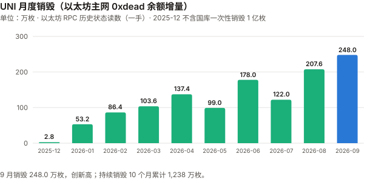
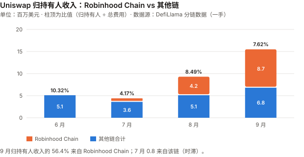
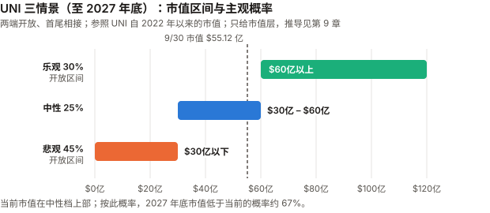

# UNI / Uniswap 完整调研与分析报告

> **编写日期**：2026 年 10 月 5 日
> **数据截止**：2026 年 9 月 30 日（9 月与 Q3 完整数据已闭合）；链上快照取到 10/4
> **版本**：2026 年 9 月版（第二期）**兼 Q3 季度回顾**
> **研究方法**：沿用 8 月首期框架。本期第一次有上期论点可核对（U8-1、U8-3、U8-4、U8-7，见 3.0）。
>
> **本版更新要点**：
>
> 1. **9 月 +69.76%，Q3 +219.73%**——收于 $8.882（币安日线），在本系列 BTC / ETH / SOL / UNI 四份 9 月版里涨幅最大（PONS 9 月版截至 9/27 为 +89.1%，窗口不同不比）。按对数收益计算的 beta 残差：9 月约 1.3 个标准差、Q3 约 1.6 个标准差——**大而不算确定**。与基本面**季度方向一致（费用翻倍）、月内背离**：9/1–9/23 价格 +111%，同期周日均持有人收入 −49%。
> 2. **本期最重要的发现：Uniswap 9 月的费用与销毁，大部分来自 Robinhood Chain。**
>    DefiLlama 分链数据：9 月 Uniswap 总费用 **$2.032 亿** 中 **$1.394 亿（68.6%）** 来自 Robinhood Chain；归持有人收入 **$1,549 万** 中 **56.4%** 来自该链。
>    该链上 Uniswap 费用的代币构成**本期未拆分**；**推断**其中相当部分是 meme 交易（本系列 PONS 9 月版记录了该链发射台收入从 9/5 峰值下跌 87.8%），但新链上线热度退潮、代币化股票等解释同样会产生同步下跌，**本期数据分不开**。
>    **Uniswap 的归持有人收入在 9 月内逐周下降**：周日均 $74.5 万 → $53.5 万 → $44.5 万 → $37.8 万 → 9/29–10/4 的 **$28.3 万**。
> 3. **销毁首次用链上一手数据逐月核实**：以太坊主网 `0xdead` 地址的 UNI 余额逐月读数显示，**2025-12 一次性增量 100,000,003 枚，与「国库销毁 1 亿枚」一致**（转出地址未查）、此后持续销毁至 10/1 累计 **1,238 万枚**；9 月销毁 **248.0 万枚**（8 月 207.6 万）。
>    **CoinGecko 的总供应量（8.874 亿）与「10 亿 − 0xdead 余额」只差 4,000 枚**——8 月版标为二手的「1 亿枚国库销毁」和「总供应量口径」都已一手确认。
> 4. **8 月版的三处更正**（见 11.5）：「PumpSwap 已达 Uniswap V4 的 96%」只在 8/7–9/5 这个窗口成立，**按自然月，7 月与 8 月 PumpSwap 都高于 V4**；DefiLlama 已把 8 月归持有人收入修订为 **$933 万**（8 月版为 $888 万）；DefiLlama 的 `uniswap-v4` 条目显示归持有人收入为 0，**v4 池的协议费被统一记在 v3 条目里**（共用 Firepit 合约，已读适配器源码确认）。
>
> **免责声明**：本报告不构成任何投资建议。所有分析仅供研究参考，投资决策请咨询专业顾问。

---

## 核心结论摘要（一页速览）

| 维度 | 核心判断 |
|------|----------|
| **UNI 是什么** | 去中心化交易所龙头 Uniswap 的治理代币；2025-12 起协议费用于销毁 UNI |
| **当前价格位置** | $8.882（9/30 币安收盘），市值 **$55.12 亿**（CoinGecko，第 23）、FDV 约 **$78.8 亿**。距 ATH（$45.00，币安 2021-05-03）**−80.3%** |
| **9 月 / Q3 表现** | **9 月 +69.76%、Q3 +219.73%**，YTD +57.48%。高于 BTC beta 预期：9 月约 1.3 个标准差、Q3 约 1.6 个（对数口径），**不能完全排除噪声** |
| **本期最重要的发现** | **9 月费用的 68.6%、归持有人收入的 56.4% 来自 Robinhood Chain**（推断以 meme 交易为主，代币构成未拆分）。**全协议持有人收入在 9 月内逐周下降**，最后 6 天日均只有月初一周的 38% |
| **业务** | 9 月总费用 **$2.032 亿**（8 月 $1.099 亿，+85%）；9 月成交额 $936 亿 |
| **价值捕获** | 9 月归持有人收入 **$1,549 万**、销毁 **248.0 万枚**（主网链上读数）；比值（归持有人 ÷ 总费用）**7.62%** |
| **估值（FDV 口径）** | 9 月年化 **42.4 倍**；Q3 年化 67.4 倍；9/22–28 一周 57.1 倍；9/29–10/4 六天 76.3 倍——**倍数随窗口在 42–76 倍之间变化，最后 6 天受批量释放噪声影响，不当作单一读数** |
| **核心多头逻辑** | 费用与销毁绝对额创新高；销毁链上一手可验证；9 月 V4 费用 $1.344 亿，高于 PumpSwap $1.061 亿；Robinhood Chain 上线两个月即成为 Uniswap 最大的单一费用来源 |
| **核心空头逻辑** | 收入高度集中于一条链，且已在衰减（一手）；比值仍只有约 7.6%；估值倍数对窗口高度敏感，最后 6 天折算高于 8 月版主口径 |
| **估值立场** | 市值层三情景**补上期限（至 2027 年底）并改为两端开放**；对照随机游走基线后概率由 25/45/30 改为 **乐观 30 / 中性 25 / 悲观 45**；**不给单一基准预期**（最高的悲观档未过半）；按此分布，2027 年底市值低于当前的概率约 67% |
| **风险等级** | 高。年化波动 9 月 129%、过去一年 100%；**收入集中风险是本期新增的主要风险** |

---

## 1. Uniswap 与 UNI

> 完整背景见 8 月首期第 1 章。本期只保留必要部分。

| 时期 | UNI 的经济属性 |
|------|------|
| 2020-09 – 2025-11 | 纯治理代币，交易费全部归流动性提供者（LP），持有人收入为零 |
| **2025-12 起** | UNIfication：部分协议费导入 Firepit 合约，累积到阈值后买入并销毁 UNI；国库一次性销毁 1 亿枚 |
| **2026-07-27 起** | 治理提案 100：v4 池在七条网络开启协议费（含 Robinhood Chain） |

**销毁机制的链上形态**（DefiLlama 适配器源码 + 以太坊 RPC，一手）：
- 各链有一个 Firepit 合约（以太坊主网 `0x0D5C…6721`），每当累积到阈值就触发一次 `Released` 事件；
- **主网 Firepit 的阈值（`threshold()`）为 4,000 UNI**；OP Stack L2 的 Firepit 阈值为 2,000 UNI，L2 销毁要经 L2→L1 桥的 **7 天挑战期**后才转入主网 `0xdead`（Uniswap `protocol-fees` 官方 README，一手）。主网 `0xdead` 持续销毁部分的月度增量都是 2,000 的整数倍（误差 ≤3 枚），**不全是 4,000 的整数倍**（如 5 月 990,000 枚），与「主网 + L2 桥接」两路来源一致；
- DefiLlama 的「归持有人收入」= `Released` 事件次数 × 阈值 × 当日 UNI 价格（源码第 47–55 行）。**它记的是「释放时的价值」，不是「交易发生时的费用」**，两者有时滞。

---

## 2. 发展阶段（追加本期）

| 时点 | 事件 |
|------|------|
| 2025-12 | UNIfication 生效；**主网 `0xdead` 余额 12 月增加 100,028,003 枚**（国库销毁 1 亿 + 持续销毁 2.8 万） |
| 2026-06-11 | 五年市值最低 **$14.91 亿**（CoinGecko） |
| 2026-07-27 | v4 协议费在七条网络上线，含 Robinhood Chain（适配器配置的 `feeSwitchDate`） |
| **2026-09-01 至 07** | Robinhood Chain 上的 Uniswap 日均费用 **$955 万**，占全协议 85% |
| **2026-09-18** | UNI 单日大涨；媒体归因于 SEC 允许代币化美股在许可制 AMM 上交易的框架（**转述，未核实**） |
| **2026-09-23** | 年内最高市值 **$63.43 亿**（CoinGecko）；币安盘中高点 $10.942 |
| **2026-09-29 至 10-04** | 归持有人收入日均降至 **$28.3 万** |

---

## 3. 当前现状

### 3.0 论点校验：8 月版登记的论点

> 8 月版登记 7 条，其中 U8-2、U8-5 已撤销、U8-6 判为不可检验。其余 4 条在 9 月都未到检验窗口；**本期审查把 U8-4 改判 ⊘**（检验失效），有效待验 3 条。

| # | 论点 | 检验条件（摘要） | 9 月读数 | 状态 |
|---|------|------|------|------|
| U8-1 | v4 协议费覆盖范围会继续扩大 | 2026-12 月度归持有人收入 ≤ $888 万则错 | 9 月 **$1,549 万**；9/22–28 一周折月约 $1,150 万，9/29–10/4 六天折月约 $860 万 | ⏳ 12 月核；**构念错位**：它测的是全协议收入水平，现在主要受 Robinhood Chain 热度驱动，而不是「覆盖范围」 |
| U8-3 | 销毁持续，CoinGecko 总供应量继续下降 | 12/31 总供应 ≥ 8.905 亿则错 | **8.874 亿**（10/4），且与链上「10 亿 − 0xdead」只差 4,000 枚 | ⏳ 方向成立 |
| U8-4 | DEX 龙头地位四个月内不被撼动 | 年底前连续两个月 PumpSwap 30 天费用 > Uniswap V4，则错 | 9 月 V4 **$1.344 亿** > PumpSwap $1.061 亿 | **⊘ 检验失效**：按自然月，7、8 月 PumpSwap 都高于 V4——**证伪条件在登记前就已满足**，论点前提（V4 领先）登记时即不成立；不计入正确率（11.5 第 1 条） |
| U8-7 | 8 月的 $888 万是新常态 | 9–12 月月均 < $700 万则错 | 9 月 $1,549 万；10–12 月平均低于 $417 万才会触发 | ⏳ 大概率不触发 |

**U8-1 最需要注意**：9 月整月远高于门槛，但收入在月内持续下降，**最后 6 天折月已落到 $888 万以下**（前一周还在门槛之上）。12 月是否触发，主要取决于 Robinhood Chain 的热度（见 5.1）——**U8-1 与 U9-1 都读同一股热度，计正确率时不当作两条独立样本**。

### 3.1 价格与市场

> 口径：币安 UNIUSDT 日线 UTC 收盘，与 BTC / ETH / SOL 9 月版统一。8 月版用 CoinGecko 零点快照，8 月涨幅按新口径为 +20.30%（原 +18.06%）。

| 指标 | 数值 |
|------|------|
| **9/30 收盘** | **$8.882** |
| 市值 / FDV | $55.12 亿（9/30，CoinGecko）/ 约 $78.8 亿（总供应 8.874 亿 × 收盘价） |
| 9 月区间 | 低 **$5.195**（9/1）/ 高 **$10.942**（9/23） |
| 距 ATH | −80.3%（币安 ATH $45.00） |

| 区间 | UNI | BTC | ETH |
|------|------|------|------|
| **9 月** | **+69.76%** | +6.42% | +8.85% |
| **Q3** | **+219.73%** | +42.64% | +70.86% |
| Q2 | −21.64% | −14.15% | −25.34% |
| YTD | +57.48% | −4.59% | −9.61% |
| 近 1 年 | +16.24% | −26.68% | −35.20% |

**beta、R² 与噪声带**（对数收益口径，ETH 9 月版审查后统一）：

| 窗口 | 年化波动 | 对 BTC beta | R² | 对数残差 | 1 个标准差 | **约几个标准差** |
|------|------|------|------|------|------|------|
| 9 月 | 129.4% | 1.40 | 0.20 | 0.442 | 0.332 | **约 1.3** |
| Q3 | 99.4% | 1.23 | 0.22 | 0.724 | 0.440 | **约 1.6** |

> **R² 只有 0.20–0.22**：BTC 只能解释 UNI 约五分之一的日波动。UNI 本季的上涨大部分是自身因素，但**1.3–1.6 个标准差不足以排除噪声**。
> 用简单收益算会得到 9 月约 1.8、Q3 约 3.8 个标准差——**简单收益在高波动、大涨幅下会夸大残差**，本报告采用对数口径。
> **同期的 UNI 专属事件**：费用翻倍、销毁创新高（第 4、5 章）；SEC 代币化股票框架（转述）。**这些是相关，不是已证明的原因**——而且月内方向相反：9/1–9/23 价格 +111%，周日均持有人收入 $74.5 万 → $37.8 万（−49%）。

### 3.2 业务：费用翻倍，大部分来自 Robinhood Chain

**Uniswap 月度总费用**（DefiLlama `summary/fees/uniswap`，一手）：

| 月份 | 总费用 | 其中 Robinhood Chain | 占比 | 其他链合计 |
|------|------|------|------|------|
| 2026-06 | $4,966 万 | $0 | 0% | $4,966 万 |
| 2026-07 | $1.059 亿 | $7,293 万 | 68.9% | $3,296 万 |
| 2026-08 | $1.099 亿 | $6,749 万 | 61.4% | $4,244 万 |
| **2026-09** | **$2.032 亿** | **$1.394 亿** | **68.6%** | **$6,380 万** |

**两个读法都成立**：
1. **扣掉 Robinhood Chain，其他链的费用 6 月到 9 月也增长了 28%**（$4,966 万 → $6,380 万），与 BTC、ETH 的 Q3 行情方向一致。
2. **但 9 月的翻倍主要是 Robinhood Chain 贡献的**：总费用增量 $9,330 万里，$7,190 万来自该链（77%）。

**分版本**（DefiLlama，9 月）：V4 **$1.344 亿**（其中 Robinhood $1.044 亿）、V3 $6,413 万、V2 $467 万。

**与 PumpSwap**（Solana meme 交易平台）对比：

| 月份 | Uniswap V4 | PumpSwap |
|------|------|------|
| 2026-07 | $3,232 万 | **$5,315 万** |
| 2026-08 | $5,757 万 | **$8,644 万** |
| **2026-09** | **$1.344 亿** | $1.061 亿 |

> **9 月 V4 首次在自然月口径上超过 PumpSwap**——而 V4 的 77.7% 来自 Robinhood Chain。
> **换句话说：Uniswap 9 月的反超主要靠 Robinhood Chain 一条链**（该链交易构成未拆分）。

### 3.3 Robinhood Chain：集中，且在衰减

**周度日均**（DefiLlama 分链，一手）：

| 周 | Uniswap 总费用/天 | Robinhood/天 | Robinhood 占比 | 归持有人收入/天 |
|------|------|------|------|------|
| 9/1–9/7 | $1,121 万 | $955 万 | 85% | **$74.5 万** |
| 9/8–9/14 | $640 万 | $447 万 | 70% | $53.5 万 |
| 9/15–9/21 | $535 万 | $272 万 | 51% | $44.5 万 |
| 9/22–9/28 | $462 万 | $237 万 | 51% | $37.8 万 |
| 9/29–10/4（6 天） | $445 万 | $223 万 | 50% | **$28.3 万** |

> **Robinhood Chain 上的 Uniswap 费用从月初到月底跌了 77%（该链的归持有人收入 $54.4 万/天 → $10.4 万/天，−81%）；全协议归持有人收入跌了 62%。**
> 这与 PONS 9 月版记录的现象同步：Robinhood Chain 上的 Pons 发射台收入从 9/5 峰值下跌 87.8%；**Pons V2 发行的代币「毕业」后进入 Uniswap V4 交易**（Pons 官方文档，见 PONS 9 月版第 1 章）。
> **推断**：两份报告读的可能是同一条链上的同一股 meme 热度。**这不是测量**——本报告没有逐池拆分 Robinhood Chain 上 Uniswap 费用的代币构成；PONS 毕业路径只证明这条交易路径存在，不证明它占该链费用的大部分。
> **同步下跌分不开几种解释**：meme 退潮、新链上线初期热度退潮、激励结束都会产生同样的形态。本期只把**集中度与衰减**当作一手事实。

### 3.4 宏观环境

> 与 BTC 9 月版共用（美联储 9/16 加息 25bp，10 年期美债 5.29%）。UNI 与 BTC 的 R² 只有约 0.2，**宏观对本季 UNI 的解释力很弱**。

### 3.5 Q3 季度回顾

| | Q2 2026 | **Q3 2026** |
|------|------|------|
| UNI 季度涨跌（币安） | −21.64% | **+219.73%** |
| Uniswap 总费用 | $1.406 亿 | **$4.190 亿** |
| 归持有人收入 | $1,349 万 | **$2,923 万** |
| 主网销毁（枚） | 414.4 万 | **577.6 万** |
| 季末总供应（CoinGecko） | 8.933 亿（推算：10 亿 − 6/30 前后 0xdead 余额） | **8.876 亿**（10/1 链上推算） |

**一句话**：**Q3 是 v4 协议费上线（7/27）与 Robinhood Chain meme 热潮叠加的一个季度**，两者在时间上无法拆开。

---

## 4. 销毁：本期首次逐月链上核实

> 8 月版 4.2 只能用「10 亿 − CoinGecko 总量 − 二手的 1 亿」做减法，并把结论限定为「量级相容」。
> **本期在每月第一个区块读取以太坊主网 `0xdead` 地址的 UNI 余额**（drpc 公共节点，历史状态 `eth_call`，一手），得到逐月销毁量。

| 月份 | 主网 `0xdead` 余额增量（枚） | DefiLlama 归持有人收入 | 按日价折算（枚） | 链上 ÷ 折算 |
|------|------|------|------|------|
| 2025-12 | 100,028,003（**国库 1 亿 + 持续 28,003**） | $16.4 万 | 27,956 | 1.00 |
| 2026-01 | 532,000 | $286.5 万 | 568,424 | 0.94 |
| 2026-02 | 864,000 | $320.9 万 | 906,351 | 0.95 |
| 2026-03 | 1,036,000 | $458.8 万 | 1,227,757 | 0.84 |
| 2026-04 | 1,374,000 | $450.1 万 | 1,387,334 | 0.99 |
| 2026-05 | 990,000 | $385.2 万 | 1,124,637 | 0.88 |
| 2026-06 | 1,780,000 | $512.5 万 | 1,857,498 | 0.96 |
| 2026-07 | 1,220,000 | $441.4 万 | 1,218,680 | 1.00 |
| 2026-08 | 2,076,000 | $933.1 万 | 2,268,974 | 0.92 |
| **2026-09** | **2,480,001** | **$1,548.8 万** | 2,167,298 | 1.14 |
| **合计（持续部分）** | **12,380,004** | $4,853 万 | 12,754,910 | **0.97** |

> 图中数字：月度销毁（万枚，取整）2.8 / 53.2 / 86.4 / 103.6 / 137.4 / 99.0 / 178.0 / 122.0 / 207.6 / 248.0（2025-12 至 2026-09，2025-12 不含国库 1 亿）；纵轴刻度 0 / 100 / 200 / 300。

**能确定的**：
1. **12 月增量扣掉持续部分后为 100,000,003 枚，与「国库一次性销毁 1 亿枚」一致**——8 月版标为二手的数字得到链上支持；**转出地址本期未查**，「来自国库」仍依赖 UNIfication 的公开说明。
2. **CoinGecko 的总供应量与「10 亿 − 0xdead 余额」只差 4,000 枚**：10/4 链上 10 亿 − 112,567,581 = 887,432,419，CoinGecko 887,436,419。这与 CoinGecko 扣除已销毁币的口径相符，但**不证明它逐笔、实时按这个地址计算**。8 月版 4.2 的「路径一」因此不是两个独立来源的减法，而很可能是同一个链上量的两种读法。
3. **持续销毁 10 个月累计 1,238 万枚**，是 DefiLlama 按日价折算值的 97%。

> ⚠️ **这不是两个独立测量的交叉验证**（CKB 期规则）：DefiLlama 的数字来自 Firepit 的 `Released` 事件，而 `0xdead` 余额的增加正是这些释放的结果——**两者读的是同一批链上动作**。
> 合计 0.97 只说明 DefiLlama 的「次数 × 阈值」算法与实际转入销毁地址的数量**量级吻合**。**逐月不能精确对账**：OP Stack L2 的销毁要经 7 天挑战期才落到主网，月界两侧天然错位。**9 月 1.14 的偏离原因未核实**——桥接时滞与价格换算都可能贡献，本期没有拆分（约 620 次释放的日内价格误差会大体抵消，单靠价格解释不了同一方向的 +14%）。
> **一处未解决的张力**：DefiLlama 把 9 月 56.4% 的持有人收入记在 Robinhood Chain，而主网 `0xdead` 9 月增量达到全链折算值的 114%。两者同时成立，需要 Robinhood Chain 的销毁也经桥落到主网，或者 DefiLlama 的分链归属不对应销毁实际落地的位置。**Robinhood Chain 的 Firepit 销毁路径本期未核实**，因此 56.4% 应读作「在该链上触发的释放价值占比」，不是「该链交易产生的收入占比」。

**流通量**：CoinGecko 流通量 9/6 为 6.232 亿、9/30 为 6.204 亿、10/3 为 6.252 亿（由市值 ÷ 价格反推），**一周内波动 0.5 亿枚，不是可用的测量**。8 月版结论（销毁减少总量、增长预算拨付增加流通量，两者大致抵消）本期没有新证据推翻，也没有新的一手数据。

---

## 5. 价值捕获

### 5.1 归持有人收入：新高，但在月内衰减

| 月份 | 归持有人收入 | 其中 Robinhood Chain | 其他链 |
|------|------|------|------|
| 2026-06 | $512.5 万 | 0 | $512.5 万 |
| 2026-07 | $441.4 万 | $77 万 | $364 万 |
| 2026-08 | $933.1 万 | $421 万 | $513 万 |
| **2026-09** | **$1,548.8 万** | **$874 万（56.4%）** | **$675 万** |

**扣掉 Robinhood Chain，其他链的归持有人收入 9 月为 $675 万**，比 6 月（v4 协议费上线前）高 32%——这一部分可以归到 v4 协议费上线与行业整体回暖。
**而 9 月新增的部分主要来自 Robinhood Chain，且该链的收入在月内持续下降**（3.3）。

> **DefiLlama 的 v4 / v3 归属**：`uniswap-v4` 条目的归持有人收入为 0，`uniswap-v3` 条目却包含 v4 池的协议费——
> 适配器源码显示两个版本共用同一个 Firepit 合约，**销毁只能按链统计、无法按版本拆分**，适配器统一记在 v3 名下。**按版本做捕获率对比会得到错误结论。**

### 5.2 比值：归持有人 ÷ 总费用

| 月份 | 比值 |
|------|------|
| 2026-06 | 10.32% |
| 2026-07 | 4.17% |
| 2026-08 | 8.49% |
| **2026-09** | **7.62%** |

> **8 月版指出的两处口径问题仍然存在**：分子是释放时的价值、分母是交易发生时的费用（时滞）；分母包含尚未开启协议费的池子。
> 7 月的 4.17% **主要因为 v4 协议费 7/27 才开启**：Robinhood Chain 7 月的 $7,293 万费用大部分产生在开启之前，本来就不产生协议费；释放时滞可能占一部分。

> 图中数字（百万美元）：Robinhood Chain 0 / 0.8 / 4.2 / 8.7；其他链 5.1 / 3.6 / 5.1 / 6.8（6–9 月）；柱顶比值 10.32% / 4.17% / 8.49% / 7.62%。纵轴刻度 0 / 5 / 10 / 15 / 20。

---

## 6. 与其他资产比较

> 口径：币安日线 UTC 收盘；费用为 DefiLlama 同一批 API。

| | **UNI** | ETH | SOL | BTC |
|------|------|------|------|------|
| 9 月 | **+69.76%** | +8.85% | +14.61% | +6.42% |
| Q3 | **+219.73%** | +70.86% | +60.34% | +42.64% |
| 对 BTC 的 R²（9 月） | **0.20** | 0.86 | 0.73 | — |
| 9 月归持有人 / 销毁（美元） | **$1,549 万** | 销毁约 $531 万（30 天） | 销毁约 $291 万 | 无 |
| FDV（或市值）/ 9 月年化持有人价值 | **42.4 倍** | — | — | — |

> **UNI 是这四个资产里唯一与 BTC 几乎脱钩的**（R² 0.2）。但 R² 低只说明 BTC 解释不了，**不说明价格在跟收入走**：9 月内价格与持有人收入反向（3.1）。**驱动因素本期不明。**

---

## 7. 核心价值逻辑

### 7.1 多头逻辑

| # | 论点 | 强度 | 说明 |
|---|------|:---:|------|
| 1 | **费用与销毁绝对额创新高** | ★★★★☆ | 9 月总费用 $2.032 亿、归持有人 $1,549 万、主网销毁 248.0 万枚（DefiLlama + 链上一手）。**扣掉 Robinhood 后仍比 6 月高 28–32%** |
| 2 | **销毁机制链上一手可验证** | ★★★★★ | **本期升为五星**（8 月三星）：逐月 `0xdead` 读数、国库 1 亿枚确认、CoinGecko 总量与链上差 4,000 枚 |
| 3 | **Robinhood Chain 上线两个月即成为 Uniswap 最大的单一费用来源** | ★★★☆☆ | **本月新增**。9 月贡献 Uniswap 68.6% 的费用。**Uniswap 在该链 DEX 交易中的份额本期未取得**；需求性质推断为 meme（未拆分），且在衰减 |
| 4 | **DEX 龙头** | ★★★☆☆ | 9 月 V4 $1.344 亿 > PumpSwap $1.061 亿。**由 8 月的五星降为三星**：7、8 月按自然月 PumpSwap 都高于 V4（8 月版窗口夸大了领先，11.5 第 1 条），9 月的反超来自 Robinhood Chain |
| 5 | **与 BTC 低相关** | ★★☆☆☆ | R² 约 0.2；可分散，但也意味着它的风险是自己的 |

### 7.2 空头逻辑

| # | 论点 | 强度 | 说明 |
|---|------|:---:|------|
| 1 | **收入集中于一条链，且在衰减** | ★★★★★ | **本月新增**。9 月费用 68.6%、持有人收入 56.4% 来自 Robinhood Chain；该链持有人收入周日均 $54.4 万 → $10.4 万（DefiLlama 分链，一手）。需求性质（meme）为推断，不计入星级 |
| 2 | **估值对窗口高度敏感** | ★★★☆☆ | **本月新增**。同一 FDV，9 月整月 42.4 倍、9/22–28 一周 57.1 倍、最后 6 天 76.3 倍；只有最后 6 天高于 8 月版主口径 58.3 倍，**而这 6 天受批量释放噪声影响**（见 9.1） |
| 3 | **捕获比值仍低** | ★★★☆☆ | 约 7.6%；AMM 模式下大部分费用必须归 LP（8 月版结构性论证不变） |

> **多空同源检查**：多头 1、3 与空头 1 都来自 Robinhood Chain 这一个事实——**本期把它在空头侧计为五星（集中与衰减都有一手数据），多头 3 只给三星，多头 1 的说明里扣除了该链的贡献**。
> 8 月版的「DEX 龙头被窗口夸大」已通过多头 4 降星计过一次，不再在空头侧重复计数；初稿空头的「价格三个月 3.2 倍」描述的是对称的波动，不是单边论据，审查后删除。

---

## 8. 关键变量

| 时间 | 事件 | 方向 | 重要性 |
|------|------|:---:|:---:|
| **每周** | **Robinhood Chain 上的 Uniswap 费用**（9/29–10/4 日均 $223 万） | 关键 | ★★★★★ |
| **每月** | 归持有人收入是否守住 $888 万（U8-1 门槛；最后 6 天折月约 $860 万、前一周约 $1,150 万） | 关键 | ★★★★★ |
| 持续 | 其他链（不含 Robinhood）的费用趋势（9 月 $6,380 万） | 观察 | ★★★★☆ |
| 未定 | 新的协议费治理提案 | 双向 | ★★★☆☆ |
| 未定 | SEC 代币化股票框架是否带来许可制 AMM 的实际交易量（转述） | ↑ | ★★☆☆☆ |

---

## 9. 估值与情景（市值层）

### 9.1 窗口决定倍数

| 年化口径 | 年化归持有人收入 | **FDV（约 $78.8 亿）÷ 年化** |
|------|------|------|
| 9 月 × 12 | $1.859 亿 | **42.4 倍** |
| Q3 × 4 | $1.169 亿 | 67.4 倍 |
| 9/22–28 一周日均 × 365 | $1.380 亿 | **57.1 倍** |
| 9/29–10/4 六天日均 × 365 | $1.033 亿 | **76.3 倍** |
| 8 月版主口径（8 月 × 12，当时 FDV） | — | 58.3 倍 |

> **同一天，倍数从 42.4 到 76.3。** 「最后 6 天已比 8 月版更贵」**只在这一个窗口成立**：换成前一个完整周（57.1 倍），结论反转。
> **最后 6 天的读数噪声大**：持有人收入是批量释放（主网每次 4,000 枚、约每天 8 次），10/3、10/4 两天只有 $10.9 万、$14.4 万，而同期总费用没有下降（每天约 $380 万–$400 万）。
> **分子的性质也要说清**：DefiLlama 的「归持有人收入」是搜寻者销毁 UNI、换取 TokenJar 资产时的价值（Uniswap `protocol-fees` README），**记录时点不等于收费时点，也不是持有人收到的现金**。上表的除法本身没有错，但不能把任何一行读成稳定的盈利倍数。本报告不选主口径，全部列出。

### 9.2 三种情景（期限：至 2027 年底）

**推导方式**：参照市值取自 UNI 自 2022 年以来实际交易过的水平（CoinGecko 一手）；只给市值层，不给单币价格——流通量路径不可靠（4 章）。
**本期两处结构更正**（审查后）：① 8 月版没有写情景期限，本期定为 **2027 年 12 月 31 日（约 15 个月）**；② 8 月版三档封闭在 $15 亿–$116 亿，等于默认价格不会离开这个区间，**本期把两端改为开放**，使三档覆盖全部结果。

| 年份 | 最低市值 | 最高市值 |
|------|------|------|
| 2022 | $16.35 亿 | $83.80 亿 |
| 2023 | $29.32 亿 | $58.86 亿 |
| 2024 | $40.42 亿 | **$115.92 亿** |
| 2025 | $28.62 亿 | $91.77 亿 |
| 2026（至 9/30） | **$14.91 亿** | $63.43 亿（9/23） |

**随机游走基线**（按过去一年年化波动 100%、15 个月、起点 $55.12 亿；两列分别为零对数漂移、扣除波动拖累）：

| 情景 | 市值区间（2027 年底） | 相对当前 $55.12 亿 | 随机游走基线 | **本期主观概率** | 8 月版 |
|------|---|---|:---:|:---:|:---:|
| **乐观** | **$60 亿以上**（参照 2024 年高点 $116 亿） | +9% 以上 | 47% / 26% | **30%** | 25% |
| **中性** | $30 亿 – $60 亿 | −46% ~ +9% | 24% / 23% | **25%** | 45% |
| **悲观** | **$30 亿以下**（参照 2026 年低点 $15 亿） | −46% 以下 | 29% / 51% | **45%** | 30% |

> 图中横轴刻度为 $0 / $20 / $40 / $60 / $80 / $100 / $120 亿；虚线为 9/30 市值 $55.12 亿；乐观、悲观两档为开放区间，图中画到 $120 亿与 $0 为止。

**概率变化的拆分**：
- **机械部分**：8 月版的中性 45% 没有和基线对照。按 UNI 自己的波动，15 个月后仍在 $30–60 亿的概率只有约 23%–24%——**中性 45% 高出基线近一倍，而 8 月版没有给出理由**。本期把中性降到 25%（接近基线），释放的概率按基线分到两端。
- **证据部分**：新增收入集中于一条正在衰减的链（3.3）、估值倍数对窗口高度敏感（9.1）——**作者把悲观放在基线区间（29%–51%）的上半部分、乐观放在基线区间（26%–47%）的下部**。这是本期唯一的观点性调整。

**这组概率的含义**（假设每档内部按对数均匀分布）：**2027 年底市值低于当前的概率约 67%**（45% + 中性档中低于 $55.12 亿的部分约 22%），**中位数约 $34.5 亿，相对当前约 −37%**。
**作者不给单一基准预期**：最高的悲观档为 45%，未过半；但分布整体偏向下方，**这是一个方向判断，不是框架误差**——8 月版「落在框架误差之内、不给方向判断」的说法本期不再沿用。

### 9.3 这套方法的弱点

1. **参照区间不是估值**，只是市场给过的价。
2. **情景按市值划分，与收入的来源无关**——Robinhood Chain 集中风险只通过主观概率进入，没有进入任何参数。
3. **概率是主观赋值**；随机游走基线本身对漂移假设很敏感（悲观档 29% 与 51% 之间），本期主观概率落在两列之间。
4. **情景没有对应的市值论点登记**：记分卡 U9-1、U9-2 测收入与销毁，不测市值。

---

## 10. 投资与风险启示

### 10.1 UNI 现在处于什么位置

**一个刚证明能收钱的行业龙头，在一个新增收入高度依赖单条新链的季度里涨了 3.2 倍。**
销毁机制已被链上一手证实；**但 9 月新增收入的大部分来自 Robinhood Chain，而该链上 Uniswap 的费用在 9 月内跌了 77%、持有人收入跌了 81%。**

### 10.2 策略框架

> 以下为研究性质的框架整理，**不构成投资建议**。

| 持有者类型 | 框架 |
|------|------|
| **未持有者** | 理由应当是「Uniswap 的协议费在 Robinhood 之外也能增长」——扣除该链后 9 月持有人收入 $675 万，比 6 月高 32%（其中多少来自行业周期性回暖，本期分不开）。**不要用 9 月整月的 42 倍当估值依据**，它包含一个已经消退的高峰 |
| **已持有者** | 关键跟踪项：**每周的归持有人收入与 Robinhood Chain 占比**（DefiLlama 免费可查）。若周日均持续低于 $29 万（约 $888 万/月），U8-1 将在 12 月判错。按 9.2 的概率，2027 年底市值低于当前的概率约 67% |
| **杠杆** | 年化波动 100%–129%；悲观档（30%）对应 −46% 至 −73% |

### 10.3 关键监控指标

| # | 指标 | 当前值 | 改变结论的阈值 | 观测方式 |
|---|------|------|------|------|
| 1 | **周日均归持有人收入** | $28.3 万（9/29–10/4，6 天，噪声大）/ $37.8 万（9/22–28） | <$29 万持续到 12 月 → U8-1 判错 | DefiLlama |
| 2 | **Robinhood Chain 上的 Uniswap 归持有人收入** | 日均 $10.4 万（9/29–10/4）；费用占比 50% | Q4 合计 ≥ $1,300 万 → U9-1 判错；占比降到 30% 以下且总费用不降 → 集中风险缓解 | DefiLlama 分链 |
| 3 | 其他链费用 | $6,380 万（9 月） | 连续两月下降 → 行业回暖结束 | DefiLlama |
| 4 | **主网 `0xdead` UNI 余额** | 112,567,581（10/4） | 停止增长 → 销毁中断 | 以太坊 RPC |
| 5 | CoinGecko 总供应 | 8.874 亿 | 应等于 10 亿 − 0xdead；不等即口径变化 | CoinGecko + RPC |
| 6 | V4 vs PumpSwap（自然月） | $1.344 亿 vs $1.061 亿 | U8-4 已判 ⊘，本项只作行业位置观察 | DefiLlama |

### 10.4 风险提醒

1. **收入集中风险（本期新增）**：一条链贡献近七成费用，且已在衰减（需求性质推断为 meme，未拆分）。
2. **窗口风险**：估值倍数随窗口在 42–76 倍之间变化；最后 6 天的读数受批量释放噪声影响。
3. **8 月版的「DEX 龙头」论据被窗口夸大过**（11.5）。
4. **本报告自身**：UNI 记分卡尚无已判定论点（U8-4 判 ⊘）；本系列 BTC 记分卡正确率 11%（1/9）。

### 10.5 长期认知

1. **读 DEX 的收入，要按链拆开读。** 一个协议级的「费用翻倍」，可能主要是一条新链上的一股热潮。
2. **批量释放型的收入，不能用几天的窗口折算年化。** 同一 FDV，相邻两个窗口给出 57 倍与 76 倍，结论相反。
3. **销毁类机制，能读链上余额就别做减法。** 8 月版花了一整节论证「量级相容」，一次历史状态 `eth_call` 就把它变成了逐月读数——**但跨链销毁有 7 天桥接时滞，逐月读数只能量级对账，不能逐月精确对账**。
4. **按月比较两个协议，先固定是自然月还是滚动窗口**——8 月版的「96%」换成自然月就是「150%–165%」，U8-4 因此在登记前就已失效。

---

## 11. 附录

### 11.1 关键数据速查（截至 2026-09-30）

| 类别 | 指标 | 数值 |
|------|------|------|
| **市场** | 9/30 收盘 / 市值 / FDV | $8.882 / $55.12 亿 / 约 $78.8 亿 |
| | 9 月 / Q3 / YTD | +69.76% / +219.73% / +57.48% |
| | 对 BTC R²（9 月 / Q3） | 0.20 / 0.22 |
| **业务** | 9 月总费用 / Robinhood 占比 | $2.032 亿 / 68.6% |
| | 9 月 V4 / PumpSwap | $1.344 亿 / $1.061 亿 |
| **捕获** | 9 月归持有人收入 / Robinhood 占比 | $1,548.8 万 / 56.4% |
| | 9/29–10/4 日均 | $28.3 万 |
| **销毁** | 9 月主网 `0xdead` 增量 | 2,480,001 枚 |
| | 持续销毁累计（至 10/1） | 12,380,004 枚 |
| | 12 月一次性增量（与国库销毁 1 亿一致） | 100,000,003 枚（转出地址未查） |
| | 0xdead 余额（10/4） | 112,567,581 |
| | Firepit 阈值（主网 / OP Stack L2） | 4,000 / 2,000 UNI |
| **估值** | FDV ÷ 年化持有人收入 | 42.4（9 月）/ 67.4（Q3）/ 57.1（9/22–28）/ 76.3（9/29–10/4） |
| **情景** | 乐观 / 中性 / 悲观（至 2027 年底） | 30% / 25% / 45%；低于当前市值的概率约 67% |

### 11.2 数据来源与核实状态

| 数据 | 来源 | 核实状态 |
|------|------|------|
| 价格、涨跌、波动率、beta、R² | 币安 API `klines` | ✅ 一手 API |
| 市值、FDV、总供应、流通量、历年市值区间 | CoinGecko API | ✅ 一手 API（流通量为反推，不可靠） |
| **主网 `0xdead` 余额逐月、`totalSupply()`** | 以太坊 RPC（drpc 历史状态 `eth_call`） | ✅ **一手** |
| **Firepit 阈值 4,000 UNI** | 以太坊 RPC `threshold()`（选择器用自写 keccak 计算并自检） | ✅ 一手 |
| L2 阈值 2,000 UNI、L2→L1 7 天挑战期、搜寻者销毁换取 TokenJar 资产的机制 | Uniswap `protocol-fees` 官方 GitHub README | ✅ 一手（Codex 审查提出，本期已打开原文核对） |
| Robinhood Chain Firepit 的销毁落地路径；Uniswap 在该链 DEX 中的份额 | — | ❌ 未核实 |
| 总费用、分版本、分链、归持有人收入 | DefiLlama API；**口径已读 `dexs/uniswap-v3.ts` 源码确认** | ✅ 一手 API |
| PumpSwap 费用 | DefiLlama API | ✅ 一手 API |
| Firepit `Released` 事件逐条 | 公共节点 `eth_getLogs` 均有区块范围或归档限制 | ❌ 未取得；改用 `0xdead` 余额逐月读数替代 |
| 9/18 大涨归因（SEC 代币化股票框架）、Hayden Adams 的「年化 $2.63 亿」 | 媒体转述 | ⚠️ 未核实 |
| Robinhood Chain 上 Uniswap 费用的代币构成 | — | ❌ 未拆分（与 Pons 的关联为推断） |
| 9 月治理提案 | — | ❌ **本期未查 Tally / Snapshot** |
| 传统金融机构观点 | — | ❌ 未找到 UNI 的覆盖 |
| 宏观 | 见 BTC 9 月版（美联储、美国财政部） | ✅ 一手 |

### 11.3 来源偏向声明

- 核心数据（价格、费用、销毁、供应）全部一手；销毁首次用链上余额逐月核实。
- **事件归因（9/18 大涨原因）来自加密原生媒体**，结构上偏多。
- **没有找到传统金融机构对 UNI 的覆盖**（与 8 月版相同）。本报告的宏观背景引用美联储与美国财政部一手数据，但它们不评价 UNI。

### 11.4 BTC / ETH / SOL / UNI 共用口径

四份 9 月报告的价格均为币安 UTC 收盘、宏观数据为同一批抓取。

### 11.5 本版对 8 月版的更正

| # | 8 月版写法 | 更正 | 发现方式 |
|------|------|------|------|
| 1 | 「PumpSwap 单协议月费用已达 Uniswap V4 的 96%」；U8-4「当前 96%」 | 只在 8/7–9/5 窗口成立（$8,963 万 vs $9,348 万）；**按自然月，7 月 PumpSwap 是 V4 的 164%、8 月 150%** | DefiLlama 日度数据按月聚合 |
| 2 | 2026-08 归持有人收入 $888.2 万 | DefiLlama 已修订为 **$933.1 万**（6 月 $511.6 万 → $512.5 万） | DefiLlama 本期重新调用 |
| 3 | 「国库一次性销毁 1 亿枚」标为 ⚠️ 二手 | **链上确认**：主网 0xdead 12 月增量扣除持续销毁后为 100,000,003 枚 | 以太坊 RPC |
| 4 | 4.2「路径一」= 10 亿 − CoinGecko 总量 − 1 亿，被当作独立测量 | CoinGecko 总量 = 10 亿 − 0xdead 余额（差 4,000 枚），**它与链上读数是同一个量** | RPC + CoinGecko |
| 5 | 「8 月 +18.06%」 | 币安 UTC 收盘口径 **+20.30%**（CoinGecko 零点快照口径差异） | 币安日线 |
| 6 | 「两条独立路径相差 4.1%」 | 8 月版审查已撤回此说法，**但 8 月版正文第 643、684、777、803 行仍保留**（已发布版本不改）；本期不再引用 | 本期推理审查 |
| 7 | 三情景无期限、区间封闭、中性 45% 未与随机游走基线对照 | 期限定为 2027 年底、两端开放、概率改为 30/25/45（9.2） | 本期推理审查 |
| 8 | U8-4「当前 96%，小幅变化即可触发」 | 按自然月口径证伪条件在登记前已满足，**改判 ⊘** | 本期推理审查 |

### 11.6 发布前审查记录

| 层 | 审查者 | 结果 |
|---|---|---|
| 1 | `tools/verify_report.py` 机械核查 | 修订后重跑，见下 |
| 2 | **_bian**（推理审查） | 15 条，全部采纳或部分采纳 |
| 3 | **Codex**（领域审查） | 5 条，4 条采纳、1 条部分不同意 |

**_bian 的主要发现（推理层）**：
1. 情景无期限、区间封闭、中性 45% 未对照随机游走基线（基线约 23%–24%）→ 9.2 重写，概率改为 30/25/45。
2. 「落在框架误差之内」沿用 8 月的敏感性跨度，但本期敏感性已几乎全在零以下 → 删除，改为明确写出方向（低于当前的概率约 67%）。
3. 「价格更像在反映自己的收入」与月内数据相反（价格 +111%、收入 −49%）→ 第 6 章、卷首、摘要改写。
4. 「已比 8 月更贵」只在 6 天窗口成立；前一完整周 57.1 倍反而更便宜 → 9.1 并列相邻窗口。
5. U8-4 的证伪条件在登记前已满足 → 改判 ⊘。
6. U9-1 原版测全协议收入（与「Robinhood 衰减」的论点统计量不同）、基准含旧制度的 7 月、排查只看单日 → **改为测 Robinhood Chain 单链、以最后一个完整周为基准、按季度累计排查**。
7. 「meme 主导」在承重位置被当成事实 → 全文改为推断并列出替代解释。
8. 7 月 4.17% 主要因为协议费 7/27 才开启，不是时滞。
9. 第 4 章「全部是 4,000 的整数倍」「链上读数略高」与表格矛盾；56.4% 与主网 114% 之间的张力未交代 → 已更正并列为未核实。
10. U9-2 用 Q3 数论证门槛 → 改用两种运行速率（约 293 万 / 423 万枚）重写，先验 70% → 55%。
11–15. 记分卡残留旧说法、U8-1 构念错位与 U9-1 不独立、多头 3 统计量不对题、摘要措辞强于正文、空头表重复计数 → 逐条清理。

**Codex 的主要发现（领域层）**：
1. 「归持有人收入」是搜寻者销毁换取 TokenJar 资产时的价值，批量、可延迟，不能把短窗口当稳定盈利速率 → **采纳**，9.1 补充说明。
2. Robinhood Chain 与 PONS 的关联只证明存在交易路径；56.4% 是释放时的价值占比 → **采纳**。
3. U9-1 可被分散多日的释放推至判错、U9-2 可被直接转入 `0xdead` 制造（300 万枚约 $2,665 万，低于市值 1%）→ **采纳**，两条的排查规则都已改写。
4. L2 销毁经 7 天挑战期才落到主网，逐月不能精确对账；「恰好 1 亿来自国库」需查转出地址 → **采纳**，已打开 Uniswap `protocol-fees` README 原文核对。
5. 低 R² 不等于基本面归因 → **采纳**（与 _bian 第 3 条一致）。
- **不同意的部分**：Codex 认为 U8-7 被 9 月高值锚定、已不足以检验「$888 万是常态」。**作者的判断**：门槛 7 针对的是登记时已实现的部分；U8-7 登记于 9/6，9 月当时尚未发生，9 月的高读数是新证据而非登记缺陷，因此保留 ⏳。

**ZEC 期清扫**：撤回的说法（「运行速率更接近现状」「落在框架误差之内」「交易主力是 meme 币」「全部是 4,000 的整数倍」「国库一次性销毁正好」「期望市值 $49.0 亿」）已在报告、摘要、记分卡中 grep 清扫。

---

> **配套文件**：`uni_questions_summary_202609.md`（简明速查）、`../thesis_scorecard.md`（论点滚动记分卡）。
> 本报告不构成投资建议。
