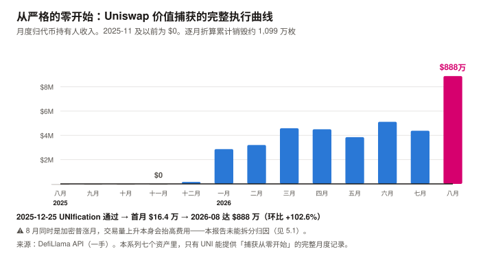
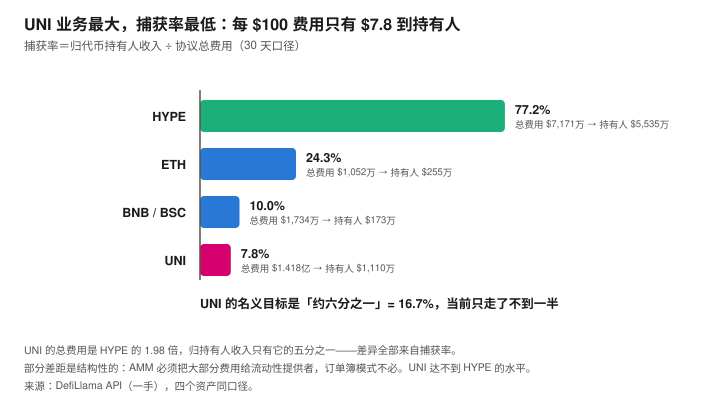
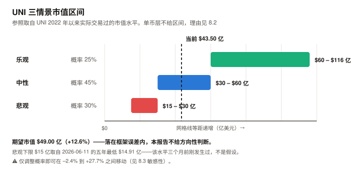

# UNI / Uniswap 完整调研与分析报告

> **编写日期**：2026 年 9 月 6 日
> **数据截止**：2026 年 9 月 6 日（8 月完整月度数据已闭合）
> **研究方法**：沿用本系列前六期框架（BTC / ETH / SOL / ADA / BNB / HYPE）。
> **本期的独特之处**：UNI 是本系列覆盖的资产里**唯一一个刚刚完成价值捕获机制切换**的——
> 2025 年 12 月之前它归持有人的收入是**严格的零**，之后开始销毁。本报告因此能观察到一个完整的「从零到有」过程。
> **本期为 UNI 首期报告。**
>
> **本期核心发现**：
> ① UNI 现价 **$6.98**，市值 **$43.50 亿（全球第 24）**，FDV **$62.16 亿**。距 ATH $44.92（2021-05-02）**–84.47%**；
> ② **2026 年 6 月 11 日它创下五年市值新低 $14.91 亿**（低于 2022 年熊市底的 $16.35 亿），**此后反弹 191.4%**；
> ③ **fee switch 的执行过程可以被完整看到**：2025 年 11 月及以前归持有人收入为 **$0**，2025-12 首月 $16.4 万，
> **2026-08 跳升至 $888.2 万，是 7 月的 2.03 倍**；
> ④ **销毁在真实执行，量级已验证、精度未验证**：初始上限 10 亿 − 当前总供应 8.905 亿 = 已移除 1.095 亿枚（其中 1 亿为国库一次性销毁，⚠️ 二手）。
> 用逐月收入 ÷ 逐月均价折算得约 **1,099 万枚**，与残差 954 万枚**差 +15.2%**——**同一量级，但不精确吻合**（差异原因见 4.2，最可能是未核实的年度增发条款）；
> ⑤ **但它的捕获率是本系列最低的**：月度总交易费 **$1.418 亿**，归持有人仅 **$1,110 万——捕获率 7.8%**。
> 对照 HYPE 的 77.2%、ETH 的 24.3%、BSC 的 10.0%；
> ⑥ **UNIfication 的名义目标是「约六分之一」（16.7%）**——当前 7.8% **只走了不到一半**。
>
> **本期核心判断**：**UNI 是本系列见过的「最大的业务 + 最低的捕获率」组合，而捕获率正在快速提升。**
> 它的月度交易费（$1.418 亿）是 HYPE（$7,171 万）的 **1.98 倍**，而归持有人收入只有 HYPE 的**五分之一**。
> **估值倍数（FDV 口径）**：**主口径为 8 月单月年化的 58.3 倍**（8 月是 v4 协议费上线后的首个完整月）；
> 过去 12 个月实际为 151.0 倍（分母含 fee switch 前的六个零月，描述的是过去）。
>
> **免责声明**：本报告不构成任何投资建议。所有分析仅供研究参考，投资决策请咨询专业顾问。

---

## 核心结论摘要（一页速览）

| 维度 | 核心判断 |
|------|----------|
| **UNI 是什么** | **去中心化交易所的龙头协议代币。** Uniswap 在全市场 DEX 成交量中占约 **23.7%**（V4 12.7% + V3 11.0%），月度交易费 $1.418 亿，是第二名 PumpSwap 的 **1.58 倍** |
| **本期的独特之处** | **本系列唯一一个能观察到「价值捕获从零开始」全过程的资产。** 2025-11 及以前归持有人收入严格为 $0；2025-12 起开始销毁 |
| **当前价格位置** | $6.98，市值 $43.50 亿（第 24），FDV $62.16 亿。距 ATH –84.47%，**近 30 日 +73.48%**，近 1 年 –25.05% |
| **一个必须先讲的事实** | **2026-06-11 创下五年市值新低 $14.91 亿**——比 2022 年熊市底（$16.35 亿）还低。**此后反弹 191.4%**。**fee switch 在 2025-12 就开启了，而价格又跌了半年**（见 3.2） |
| **最强的一项** | **业务规模。** 月度交易费 $1.418 亿，DEX 赛道第一；V4 单版本 $9,348 万已超过第二名 PumpSwap 的全部（$8,963 万） |
| **最弱的一项** | **捕获率 7.8%，本系列最低。** 每 $100 的交易费，只有 $7.8 到达代币持有人，其余归流动性提供者 |
| **本期最重要的趋势** | **捕获率在快速提升。** 归持有人收入：2026-02 $321 万 → 2026-08 **$888 万**（+177%）。**8 月单月环比 +102.6%** |
| **估值倍数（FDV 口径）** | **主口径 58.3 倍**（8 月单月年化，8 月是 v4 协议费上线后首个完整月）；过去 12 个月实际 151.0 倍。⚠️ **两者差 2.6 倍，且 151.0 倍描述的是过去**（见 8.4） |
| **核心多头逻辑** | DEX 龙头地位稳固（份额 23.7%）；销毁已验证真实执行；捕获率距名义目标 16.7% 还有约一倍空间；距 ATH –84.47%，估值倍数在六个资产里偏低 |
| **核心空头逻辑** | 捕获率仅 7.8% 且提升路径依赖治理；**PumpSwap 单协议费用已达 Uniswap 的 63%**，赛道竞争激烈；8 月的跳升是单月现象，可持续性未验证；DEX 收入与加密交易活跃度强相关 |
| **风险等级** | 中等偏高。**它的核心不确定性不是「业务会不会崩」（业务是六个资产里最稳的之一），而是「治理会把多少利益分给代币持有人」** |

---

## 1. Uniswap 的起源与设计取舍

### 1.1 一个把手续费全给了别人的协议

Uniswap 由 Hayden Adams 于 2018 年创建，是自动做市商（AMM，用算法池子替代订单簿撮合）模式的开创者与最大实现。

**它的代币经济学在很长时间里是一个反面教材**：

| 时期 | UNI 的经济属性 |
|------|------|
| 2020-09（发行）– **2025-11** | **纯治理代币。全部交易费归流动性提供者（LP），UNI 持有人分文未得** |
| **2025-12 至今** | **约六分之一的交易费导入协议，用于销毁 UNI** |

> **这五年是一个罕见的自然实验**：一个交易量全球第一的协议，
> **其代币与业务之间在经济上完全脱钩**。UNI 的价格因此长期只反映预期，不反映现金流。
> **本报告能观察到的，正是这个脱钩被修复的过程。**

### 1.2 UNIfication：2025 年 12 月的转折

**提案内容**（2025-12-25 通过，**1.25 亿票赞成 vs 742 票反对**）：

| 项目 | 内容 |
|------|------|
| **协议费开启** | 约**六分之一**的交易费导入协议控制的池子，用于**销毁 UNI** |
| **Unichain 排序器费用** | 净排序器费用同样导入销毁机制 |
| **国库一次性销毁** | **从国库销毁 1 亿 UNI**（当时价值超 $5.9 亿），作为「若协议费用自 2018 年就开启本应累积」的追溯性举措 |
| 预期规模 | 提案预计约 $1.3 亿/年流入销毁 |

**2026 年 2 月**，治理再次投票，把协议费扩展到**另外 8 条链**，并对 V3 池采用分档费率、新池默认开启协议费。

> **这个提案把 UNI 从「治理代币」变成了「价值累积代币」**——
> 而本报告第 4 章会用链上算术验证它**确实在执行**，第 5 章会说明**它只走了不到一半**。

### 1.3 UNI 代币的两重角色

| 角色 | 说明 | 本期状态 |
|------|------|---------|
| **治理权** | 决定协议费率、国库支出、版本升级 | ✅ 且**这一重比其他资产更重要**——捕获率是治理决定的，不是机制决定的 |
| **销毁受益凭证** | 协议费用买入并销毁 UNI | ✅ 已验证真实执行（见 4.2），**但捕获率仅 7.8%** |

> **注意第一重的特殊权重**：BNB 的销毁公式由公司定义，HYPE 的回购比例由协议参数固定，
> **而 UNI 的捕获率是一个可以被治理投票改变的变量**——它既是风险，也是空间。

---

## 2. UNI 的发展阶段划分

### 阶段一：AMM 的确立与「吸血鬼攻击」（2018–2020）

- 2018 年 11 月 Uniswap V1 上线，确立恒定乘积 AMM 模式
- 2020 年 5 月 V2 上线
- **2020 年 9 月发行 UNI 代币**，向历史用户空投——这是加密史上最有影响力的空投之一
- 初始供应 10 亿枚，四年线性释放

### 阶段二：V3 与集中流动性（2021–2023）

- 2021 年 5 月 V3 上线，引入集中流动性（LP 可指定价格区间，提升资金效率）
- **2021-05-02 UNI 触及历史最高价 $44.92**
- 此后进入长期下行。**「fee switch」成为社区反复讨论但始终未通过的议题**

### 阶段三：V4 与 Unichain（2024–2025）

- V4 上线，引入 hooks（可编程的池子逻辑）
- Unichain（Uniswap 自建 L2）上线
- **代币仍然零捕获**——这是这一阶段的核心矛盾

### 阶段四：UNIfication 与捕获率爬坡（2025.12– 至今）

| 时点 | 事件 |
|------|------|
| **2025-12-25** | **UNIfication 提案通过**（1.25 亿票 vs 742 票），协议费开启 + 国库销毁 1 亿 UNI |
| 2025-12 | 归持有人收入首月 **$16.4 万** |
| **2026-02** | 治理投票扩展至另外 8 条链、V3 分档费率、新池默认开启 |
| 2026-02 | 归持有人收入 $321 万 |
| **2026-06-11** | **年内也是五年最低市值 $14.91 亿**（价格 $2.395） |
| **2026-08** | **归持有人收入 $888.2 万，环比 +102.6%** |
| **2026-09-06** | 价格 $6.98，**年内最高市值 $43.93 亿** |

> **阶段四的定性**：**机制切换已经完成，捕获率的爬坡正在进行。**
> **而价格与这个爬坡之间存在半年的时滞**——见 3.2。

---

## 3. UNI 当前现状分析

### 3.1 价格与市场

| 指标 | 数值 | 口径 |
|------|------|------|
| **现价** | **$6.98** | CoinGecko API，2026-09-06 09:50 UTC |
| 市值 / 排名 | **$43.50 亿 / 第 24** | 同上 |
| **FDV** | **$62.16 亿** | 同上 |
| 24 小时成交额 | $11.05 亿 | 同上 |
| **流通 / 总量 / 初始上限** | **6.232 亿 / 8.905 亿 / 10 亿** | 同上（**总量已因销毁降至 8.905 亿**） |
| 流通占总量 | 70.0% | 同上 |
| **历史最高价** | **$44.92（2021-05-02）** | 同上 |
| **距 ATH** | **–84.47%** | 同上 |
| **近 30 日** | **+73.48%** | 同上 |
| 近 200 日 | +80.23% | 同上 |
| 近 1 年 | –25.05% | 同上 |

**2026 年内轨迹**（CoinGecko 日线，一手）：

| 时点 | 价格 | 市值 |
|------|------|------|
| 1/1 | $5.643 | $34.59 亿 |
| 3/1 | $3.990 | $24.61 亿 |
| 5/1 | $3.185 | $19.73 亿 |
| **6/11（五年最低）** | **$2.395** | **$14.91 亿** |
| 7/1 | $2.776 | $17.25 亿 |
| **8/1** | **$4.347** | $27.17 亿 |
| **8/31** | **$5.132** | $31.98 亿 |
| **9/6（年内最高）** | **$7.049** | **$43.93 亿** |

| 指标 | 数值 |
|------|------|
| **8 月月度（8/1→8/31）** | **+18.06%** |
| **从 6/11 低点至今** | **+191.4%** |
| 年初至今 | **+23.7%** |

### 3.2 一个必须解释的时滞：fee switch 开启后价格又跌了半年

**这是本章最重要的一节，也是本报告最先注意到的反常。**

| 时点 | 事件 | 价格 |
|------|------|---|
| 2025-12-01 | fee switch 投票期 | $6.055 |
| **2025-12-25** | **UNIfication 通过** | — |
| 2026-01-01 | 销毁已启动 | $5.643 |
| 2026-03-01 | | $3.990 |
| **2026-06-11** | **五年最低** | **$2.395** |
| 2026-09-06 | | **$6.98** |

> **从 fee switch 通过到价格见底，中间隔了将近半年，期间跌幅 –60%。**

**本报告能给出的解释（按证据强度排序）**：

| 解释 | 评估 |
|------|------|
| **① 销毁规模在初期太小**（初稿称「强证据」） | ❌ **已被本报告自己的数据反证**，见下 |
| **② 同期加密市场整体下跌** | ⚠️ 部分成立，**且很可能是主因**。但 UNI 跌幅（–60%）超出 BTC，**超出部分本报告无法解释** |
| **③ 市场需要时间验证机制是否真的执行** | ⚠️ 无法证伪 |

> ⚠️ **初稿把①标为「强证据」，这是一个循环解释，已更正。**
> 初稿的论证是「销毁额相对市值不足 2%，所以托不住价格」——**而这个比率的分母就是市值，市值 = 价格 × 流通量。**
> **价格下跌会机械地推高这个比率。用它解释价格下跌，是用结果解释原因。**
>
> **用本报告自己的数据把这一步算完**：
>
> | 时点 | 年化销毁额 | 市值 | 销毁收益率 |
> |---|---:|---:|---:|
> | **2026-06 价格最低点** | $6,139 万（6 月 $512 万 × 12） | **$14.91 亿** | **4.12%** |
> | **2026-09 现在** | $1.066 亿（8 月 $888 万 × 12） | **$43.50 亿** | **2.45%** |
>
> **按这个指标，销毁收益率在价格最低点时最高，此后一路下降——初稿的解释被反向证伪。**

> ⚠️ **因此初稿从这个时滞推出的「六个月时间尺度可供参照」这一条也已撤回。**
> **本报告在 3.4 与 8.5 两处都声明无法拆分宏观与基本面的贡献**；
> 而 8 月的驱动本报告自己写的是「财政部加倍长端国债回购，**七个资产 8 月普涨的共同触发因素**」。
> **若下跌与反弹主要都是市场 beta，那「六个月」量的是本轮加密回撤的长度，不是 fee switch 的传导时滞。**
> **一个 N=1 且归因未拆分的观察，不足以支撑一个可迁移的时间尺度。**

### 3.3 业务规模：DEX 赛道第一

**各版本费用分布**（DefiLlama API，一手，30 天）：

| 版本 | 30 天总交易费 | 占比 |
|------|---:|---:|
| **Uniswap V4** | **$9,347.8 万** | **65.9%** |
| Uniswap V3 | $4,443.0 万 | 31.3% |
| Uniswap V2 | $384.3 万 | 2.7% |
| Uniswap V1 | $0.6 万 | 0.0% |
| **合计** | **$1.418 亿** | 100% |

**DEX 赛道竞争**（30 天费用，一手）：

| 协议 | 30 天费用 |
|------|---:|
| **Uniswap V4** | **$9,347.8 万** |
| **PumpSwap** | **$8,962.8 万** |
| Uniswap V3 | $4,443.0 万 |
| Meteora DLMM | $1,308.3 万 |
| PancakeSwap V3 | $1,157.9 万 |
| Raydium AMM | $1,005.5 万 |
| Aerodrome Slipstream | $609.0 万 |

**成交量份额**（全市场 DEX 30 天成交 $2,435.9 亿）：

| 协议 | 30 天成交量 | 份额 |
|------|---:|---:|
| Uniswap V4 | $308.7 亿 | **12.7%** |
| Uniswap V3 | $267.7 亿 | **11.0%** |
| PumpSwap | $198.6 亿 | 8.2% |
| PancakeSwap V3 | $188.8 亿 | 7.7% |
| Aerodrome | $126.1 亿 | 5.2% |

> **Uniswap 全版本合计约 23.7% 的成交量份额，费用是第二名 PumpSwap 的 1.58 倍——DEX 赛道龙头地位明确。**
>
> ⚠️ **但一个需要警惕的对照**：**PumpSwap 单协议的月费用已达 $8,963 万，是 Uniswap V4 的 96%。**
> 它是 Solana 上的 meme 币交易平台——**赛道第二名的收入几乎全部来自投机需求**，
> 而 SOL 8 月版报告记录过这类需求同比 –87% 的先例。**这既说明竞争压力真实，也说明它的稳定性存疑。**

### 3.4 宏观环境

| 因素 | 状态（9 月初） | 影响 |
|------|--------------|------|
| 联邦基金利率 | 3.50–3.75% | — |
| 9 月加息概率 | **65.9%**（CME FedWatch，8/31） | 利空 |
| PCE 通胀 | 3.7%（12 个月）/ 4.1%（6 个月） | 支持加息 |
| 10 年期美债 | 4.79% | — |
| 8 月流动性事件 | 财政部加倍长端国债回购 | 七个资产 8 月普涨的共同触发因素 |

> **但 UNI 8 月 +18.06%、近 30 日 +73.48% 的幅度远超宏观可解释的范围。**
> **本报告认为主要驱动是 8 月归持有人收入环比 +102.6%**（见第 5 章），
> **但无法定量拆分宏观与基本面各自的贡献——这是一处明确的分析局限。**

---

## 4. 销毁：一个可以被独立验证的机制（本期核心章之一）

> **本系列在 HYPE 期栽过一次**：把 Assistance Fund 的余额当成「持仓」，而它实际是销毁。
> **教训是：涉及销毁的机制，必须用供应量算术独立验证，不能只看协议描述。**
> **本章对 UNI 做了同样的验证，而这次结论是正面的。**

### 4.1 机制

| 项目 | 内容 | 证据等级 |
|------|------|:---:|
| 费用来源 | 约六分之一的交易费导入协议控制的池子 | ⚠️ 二手（UNIfication 提案的媒体转述） |
| 处置方式 | **用于销毁 UNI** | ✅ **本报告用供应量算术验证（见 4.2）** |
| 追加来源 | Unichain 净排序器费用 | ⚠️ 二手 |
| 一次性销毁 | **国库 1 亿 UNI**（追溯性） | ✅ **可由总供应量验证** |

### 4.2 销毁的验证：能证明什么，不能证明什么

> ⚠️ **本节在发布前审查中被重写。** 初稿声称「两条独立路径交叉验证，差异仅 4.1%，是本报告最扎实的一处验证」。
> **推理审查指出这个说法有三重问题，且用本报告自己的数据可以证明初稿挑错了参数。已全部更正。**

**路径一：总供应量的减少**

| 项目 | 数值 |
|------|---|
| 初始上限 | 10.000 亿 |
| CoinGecko 报告的当前总供应 | 8.905 亿 |
| 已移除 | 1.095 亿枚 |
| 减去国库一次性销毁（⚠️ 二手数据） | 1.000 亿枚 |
| **残差，应来自持续销毁** | **约 954 万枚** |

> ⚠️ **这不是一次独立测量，是一个减法的余数。** 而且被减数「1 亿枚」本身是媒体转述（10.4 标为 ⚠️），
> 它若实际是 1.005 亿，残差就少 5%。**这条路径的精度上限受制于一个未打开原文的数字。**

**路径二：累计销毁金额折算为枚数**

> **初稿用「累计金额 ÷ 单一假设均价 $4.5」折算，得到 915 万枚，与路径一差 –4.1%。**
> **审查指出：均价是自选参数，而本报告手上有逐月收入与逐月价格，根本不需要假设。**
> **下表改用逐月折算，零自由参数。**

| 月份 | 归持有人收入 | 当月均价 | 折合枚数 |
|------|---:|---:|---:|
| 2025-12 | $164,209 | $5.682 | 28,900 |
| 2026-01 | $2,864,787 | $5.400 | 530,516 |
| 2026-02 | $3,209,311 | $3.734 | 859,483 |
| 2026-03 | $4,588,204 | $3.896 | 1,177,670 |
| 2026-04 | $4,501,261 | $3.246 | 1,386,710 |
| 2026-05 | $3,852,099 | $3.443 | 1,118,821 |
| 2026-06 | $5,115,754 | $2.810 | 1,820,553 |
| 2026-07 | $4,383,769 | $3.531 | 1,241,509 |
| 2026-08 | $8,882,034 | $3.989 | 2,226,632 |
| 2026-09（前 6 天） | $3,614,051 | $6.080 | 594,416 |
| **合计** | **$41,175,479** | 隐含加权均价 **$3.748** | **约 1,099 万枚** |

**两条路径的实际差异**：

| | 枚数 | 差异 |
|---|---:|---:|
| 路径一（残差） | 954 万 | — |
| **路径二（逐月折算）** | **1,099 万** | **+15.2%** |
| 路径二（剔除 9 月，因销毁可能有结算滞后） | 1,039 万 | +8.9% |

> ⚠️ **初稿报告的 –4.1% 是参数选择的产物。**
> **本报告实际的成本加权均价是 $3.748**，而初稿假设的 $4.5 是三个候选值（$4.0 / $4.5 / $5.0）中
> **唯一能把差异压到个位数的那个**。**这是一次拟合，不是一次验证。**

**因此本报告对这个检验的正确定性是**：

> **它能排除的是「销毁根本没发生」和「规模差一个数量级」——两条路径在同一量级，方向一致。**
> **它不能证明的是「规模精确相符」**——15.2% 的差异需要解释，而本报告只能列出候选原因，无法确定：
>
> ① ~~UNI 的 2%/年 永续通胀条款~~ — **已核实：该条款是治理「每年最多铸造 2%」的权限，迄今从未被调用，因此不存在正在发生的增发。此解释排除。**
> ② **结算滞后**：DefiLlama 统计的是 Firepit 合约的批量释放事件，与费用发生存在时滞；剔除 9 月后差异降至 **+8.9%**。**这是当前最可能的主因**；
> ③ **口径差异**：合约的 `totalSupply()` 仍为 10 亿——**1 亿枚国库销毁是转入 `0xdead` 地址，合约层面并未减少**。CoinGecko 的 8.905 亿是**扣除销毁地址持币后的调整口径**。**因此路径一实际是在用一个「数据源调整口径」减去一个「二手的一次性数字」，精度受限于两者**。
>
> **本报告因此不宣称销毁规模已被精确验证，只宣称量级相容。**

> ⚠️ **一处必须说明的口径事实**：**总供应量在减少，而流通量在增加。**
> 反推的 CoinGecko 流通量从 2026-01 的 6.131 亿升至 2026-09 的 6.232 亿（**+约 1,010 万枚**）。
> **注意这个数字与本节算出的销毁量（954 万–1,099 万枚）在同一量级**——
> **即：对持有人而言，销毁与流通量增加大致相互抵消，净效果接近中性，而非通缩。**
> ⚠️ **流通量增加的构成在领域审查后已查明**：**UNIfication 同一提案批准了 4,000 万 UNI 的增长预算**，
> 其中 **2026 年 1 月与 4 月各向 Uniswap Labs 转出 500 万枚，合计 1,000 万枚**——
> **与观察到的流通量增加 1,010 万枚相差仅 1.0%，几乎完全对应。**
>
> **因此修正后的图景是**：销毁减少总量（约 954–1,099 万枚），**而增长预算的拨付几乎等量地增加了流通量**。
> **两者大致抵消，净效果接近中性——这不是通缩。**
> **第 8 章因此仍只给市值层情景，但理由从「构成未知」改为「已知两者大致抵消」。**

## 5. 捕获率：本系列最低的一个，也是提升最快的一个（本期核心章之二）

### 5.1 fee switch 的完整执行曲线，以及一个必须先讲的机制事件

> ⚠️ **本节在领域审查后重写。** 初稿把这条曲线解释为「捕获率在快速爬坡」，
> **而一手证据显示 8 月的跳升有一个明确的、一次性的机制原因。**

**本系列七个资产里，只有 UNI 能提供「价值捕获从零开始」的完整月度记录**（DefiLlama API，一手）：

| 月份 | 归代币持有人收入 | 制度 |
|------|---:|---|
| 2025-06 至 2025-11 | **$0** | fee switch 未开启 |
| **2025-12** | **$164,209** | UNIfication 通过（12-25） |
| 2026-01 | $2,864,787 | v2 / 部分 v3 |
| 2026-02 | $3,209,311 | 扩展至 8 条链 |
| 2026-03 | $4,588,204 | |
| 2026-04 | $4,501,261 | |
| 2026-05 | $3,852,099 | |
| 2026-06 | $5,115,754 | **旧制度最后一个完整月** |
| **2026-07** | **$4,383,769** | **7/27 v4 协议费上线，本月仅含 5 天新制度** |
| **2026-08** | **$8,882,034** | **新制度的首个完整月** |
| 2026-09（前 6 天） | $3,614,051 | |

**8 月跳升的原因已经查明，它不是爬坡**：

| 事实 | 内容 | 证据 |
|------|------|:---:|
| **2026-07-27** | **治理提案 100 执行，在七条网络激活 v4 池的协议费** | ✅ 一手确认 |
| 覆盖网络 | Ethereum、Arbitrum、Base、BNB Chain、Polygon、OP Mainnet、Robinhood Chain | ✅ |
| 投票结果 | 4,660 万 UNI 赞成 vs 127 万反对（法定门槛 4,000 万） | ✅ |
| 费率 | 约为 swap fee 的六分之一（30bp 池 → 约 5bp 归协议） | ✅ |
| **收入影响** | **从约 $11.4 万/天跃升至约 $32.5 万/天** | ✅ |

**本报告的交叉验证**：

| 项目 | 数值 |
|------|---|
| 官方口径 $32.5 万/天 × 31 天 | $1,007.5 万 |
| **DefiLlama 实测 2026-08** | **$888.2 万** |
| 差异 | **–11.8%** |

> **两个独立来源在同一量级，一致性良好。**

> ⚠️ **因此初稿的解释被更正**：**8 月的 +102.6% 不是「捕获率在持续爬坡」，
> 而是「v4 协议费于 7 月 27 日上线，8 月是首个完整月」——这是一次性的水平位移。**
>
> **这个更正的方向对多头有利也有不利**：
> **有利**：跳升有明确的机制原因，**不是偶然的交易量波动**，因此 $888 万更可能是新的基准而非尖峰；
> **不利**：**它是一次性的**，不能外推为「每月都会这样增长」。**初稿的「捕获率在快速提升」是过度解读。**

---

### 5.2 捕获率：一个必须先说清楚不可比性的指标

> ⚠️ **本节在领域审查后重写。** 初稿做了一张四资产捕获率对照表并称 UNI「本系列最低」，
> **领域审查指出这三个数的口径并不可比。已保留该表但加上完整的限定。**

**UNI 的捕获率计算**：

| 项目 | 数值 |
|------|---|
| 30 天总交易费 | **$1.418 亿** |
| 30 天归持有人收入 | **$1,110 万** |
| **比值** | **7.8%** |

> ⚠️ **这个 7.8% 有两处口径问题，必须写在前面**：
>
> **① 分子与分母不同期。** DefiLlama 的 holdersRevenue 统计的是 **Firepit 合约的 `Released` 事件**——
> 即费用**累积到阈值后的批量释放/销毁**，而分母是**同期发生的** gross swap fees。
> **两者存在结算滞后，因此这个比值不是严格意义上的「同期捕获率」。**
>
> **② 分母包含尚未开启协议费的池子。** v4 的协议费只在**部分池类型**上启用，
> 而分母的 $1.418 亿是**全部 v4 + v3 + v2 的 gross fees**。
> **因此 7.8% 系统性低估了「已开启协议费部分」的真实捕获率。**

**四资产对照（保留，但不可直接排序）**：

| 资产 | 30 天总费用 | 归持有人 | 比值 | **机制** |
|------|---:|---:|---:|---|
| HYPE | $7,171 万 | $5,535 万 | 77.2% | **规则化应计**，协议收入按比例直接入 AF |
| ETH | $1,052 万 | $255 万 | 24.3% | **EIP-1559 base fee 销毁**，逐块执行 |
| BNB / BSC | $1,734 万 | $173 万 | 10.0% | **gas fee 销毁**（季度 Auto-Burn 另计，不在此口径） |
| **UNI** | **$1.418 亿** | **$1,110 万** | **7.8%** | **批量 release/burn，且分母含未开启协议费的池** |

> ⚠️ **这四个数不能直接排序比较**——它们的分子分别是「规则化应计」「逐块销毁」「gas 费销毁」「批量释放」，
> 分母的覆盖范围也不同。**本表的作用是展示量级差异与机制差异，不是给出一个可比的排名。**
>
> **但有一条结论在任何口径下都成立，且它是结构性的**：
> **AMM 模式下大部分交易费必须归流动性提供者**——没有 LP 就没有流动性，没有流动性就没有交易量。
> **HYPE 是订单簿模式，做市由专业机构与金库承担，协议能捕获的比例天然更高。**
> **因此 UNI 的捕获比例不可能达到 HYPE 的水平，这与执行无关。**

### 5.3 提升空间：初稿的「16.7% 目标」不成立

> ⚠️ **这是本期领域审查抓到的最严重一处，初稿的整节推算已作废。**

**初稿写道**：「UNIfication 的名义目标是约六分之一（16.7%），当前 7.8% 只走了不到一半；
若达标，归持有人收入翻倍，FDV 倍数不低于 21.9 倍。」

**领域审查指出：不存在一个「全协议 16.7%」的目标。**

| 版本 | 协议费设定 |
|------|---|
| v2 与部分 v3 费率档 | 约六分之一 |
| **v3 低费率档** | **约四分之一** |
| **v4** | **按池类型、动态费率与 hook family 分别设定，且只启用了部分范围** |

> **因此「7.8% → 16.7%」这个爬坡路径没有计算基础**：
> **分母（哪些池已开启）与分子（各池适用哪个费率档）都不是单一比例。**
> **初稿由此推出的「收入翻倍」「≥21.9 倍」全部撤回。**

**本报告修正后能说的**：

> **① 提升空间是存在的**——v4 的协议费只在部分池类型上启用，**未启用的部分构成剩余空间**；
> **② 但空间的大小本报告无法量化**——它需要「各池类型的费用占比 × 各自适用的协议费档」这一组数据，**本报告未获取**；
> **③ 因此第 8 章的乐观情景不再以「捕获率翻倍」为依据**，改以「v4 协议费的覆盖范围继续扩大」这一定性判断为依据，**并相应下调了概率**。

---

## 6. UNI 与其他六个资产的比较

> **口径声明**：8 月月度涨幅统一为 8/1→8/31（CoinGecko 一手）；费用为各协议 2026-08 或最近 30 天口径，已在表中注明。

### 6.1 七资产矩阵

| 指标 | **UNI** | HYPE | BNB | TRX 参照 | ETH | SOL | ADA |
|------|---|---|---|---|---|---|---|
| 市值 / 排名 | $43.5 亿 / 24 | $193.8 亿 / 10 | $1,014 亿 / 4 | $316.9 亿 / 8 | $3,058 亿 / 2 | $620.7 亿 / 7 | $81.6 亿 / 19 |
| **FDV** | **$62.2 亿** | $832.5 亿 | ≈市值 | ≈市值 | ≈市值 | $671.7 亿 | $96.5 亿 |
| 流通占总量 | **70.0%** | 23.3% | 100% | 100% | 100% | 92.4% | 83.3% |
| 8 月月度 | **+18.06%** | +52.42% | +16.71% | — | +29.86% | +39.68% | +14.65% |
| 距 ATH | **–84.47%** | –1.02% | –44.4% | –22.6% | –49.3% | –63.9% | –93.0% |
| **30 天总费用** | **$1.418 亿** | $7,171 万 | $1,734 万 | $2,526 万 | $1,052 万 | 参见 SOL 报 | $3.8 万 |
| **30 天归持有人** | **$1,110 万** | $5,535 万 | $173 万 | $2,483 万 | $255 万 | $220 万 | 极小 |
| **捕获率** | **7.8%** | **77.2%** | 10.0% | 98.3% | 24.3% | — | — |

### 6.2 UNI vs HYPE：业务与捕获率的镜像

**这是本期最有信息量的一组对照，因为两者在两个维度上正好相反。**

| | **UNI** | **HYPE** |
|---|---|---|
| 30 天总费用 | **$1.418 亿（1.98 倍）** | $7,171 万 |
| 30 天归持有人 | $1,110 万 | **$5,535 万（5.0 倍）** |
| **捕获率** | **7.8%** | **77.2%** |
| 商业模式 | AMM——**费用必须大部分归 LP** | 订单簿——做市由专业机构承担 |
| 距 ATH | **–84.47%** | –1.02% |
| 流通占总量 | **70.0%** | 23.3% |
| FDV / 年化归持有人 | 58.3 倍（8 月单月）～151.0 倍（12 个月口径） | 117.3 倍 |

> **UNI 有更大的业务和更差的捕获率；HYPE 有更小的业务和更好的捕获率。**
>
> **但要点明一个不对称**：**UNI 的捕获率有明确的提升路径**（名义目标 16.7%，当前 7.8%），
> **而 HYPE 的 77.2% 已接近上限，向上空间有限。**
> **同时 UNI 的低捕获率是商业模式决定的**——AMM 必须把大部分费用给 LP，**它永远达不到 HYPE 的水平。**

### 6.3 一个跨期观察：本系列见过的三种「销毁型」资产

| | 销毁资金来源 | 净供应方向 | 可持续性 |
|---|---|---|---|
| **BNB** | **预留供应**（存量） | 确定为负（–4.56%） | ⚠️ 剩 3,316 万枚，约 5.5 年耗尽 |
| **HYPE** | **当期协议收入**（流量） | 待定（–6% 到 +2%） | ✅ 业务在就持续 |
| **UNI** | **当期协议收入**（流量）+ 一次性国库销毁 1 亿枚 | **总量减、流通增，方向相反** | ✅ 业务在就持续 |

> **三者都被称为「销毁」，而经济含义各不相同。**
> **本系列做到第七期才能做出这个对照——这是覆盖多个资产的直接价值。**

---

## 7. UNI 的核心价值逻辑

### 7.1 多头逻辑

| # | 论点 | 强度 | 说明 |
|---|------|:---:|------|
| 1 | **DEX 赛道龙头，业务规模第一** | ★★★★★ | 月度交易费 $1.418 亿，是第二名 PumpSwap 的 1.58 倍；成交量份额约 23.7%。**一手 API 可验证** |
| 2 | **销毁在真实执行（量级已验证）** | ★★★☆☆ | 两条路径（总供应残差 954 万枚 vs 逐月折算 1,099 万枚）**相差 +15.2%，同一量级但不精确吻合**。**从五星降为三星**：初稿用自选均价 $4.5 报出 –4.1% 的「吻合」，**那是拟合不是验证**（见 4.2）。且路径一的被减数「1 亿枚」为二手 |
| 3 | **仍有未启用的协议费空间** | ★★☆☆☆ | v4 的协议费只在部分池类型上启用。**从四星降为两星**：初稿称「名义目标 16.7%、当前只走一半、达标可翻倍」——**领域审查证明不存在全协议 16.7% 目标**（v3 低费率档为四分之一，v4 按池类型分别设定），**该推算已作废**（见 5.3） |
| 4 | **v4 协议费已上线并产生实际收入** | ★★★★☆ | 治理提案 100 于 **2026-07-27** 执行，七条网络同时激活，收入从约 $11.4 万/天升至约 $32.5 万/天。**⚠️ 但这是一次性的水平位移，不是持续爬坡**——初稿的「捕获率在快速提升」已更正（见 5.1） |
| 5 | **距 ATH –84.47%，估值倍数偏低** | ★★★☆☆ | FDV 口径 46.7～151.0 倍（视年化口径），低于 BNB（465–699 倍）与 ETH（约 2,400 倍） |

### 7.2 空头逻辑

| # | 论点 | 强度 | 说明 |
|---|------|:---:|------|
| 1 | **捕获率 7.8%，本系列最低，且部分是结构性的** | ★★★★★ | AMM 模式下大部分费用**必须**归 LP。**它永远达不到 HYPE 的 77.2%**——这不是执行问题，是商业模式 |
| 2 | **提升捕获率有一个未被量化的代价** | ★★★★☆ | 提高协议费会降低 LP 收益，可能削弱流动性进而削弱交易量。**本报告无法定量评估这个负反馈**，而它是提升路径的核心制约 |
| 3 | **赛道竞争激烈** | ★★★★☆ | **PumpSwap 单协议月费用已达 Uniswap V4 的 96%**。⚠️ 但其收入几乎全部来自 meme 投机，稳定性存疑 |
| 4 | **总量减而流通量增** | ★★★☆☆ | 销毁作用于总量（10 亿 → 8.905 亿），而流通量 2026 年增加约 1,010 万枚。**净效果对持有人不明确**，且本报告未获取流通量增加的构成 |
| 5 | **8 月的跳升可持续性未验证** | ★★★☆☆ | 环比 +102.6% 是单月现象，且与普涨月重叠，**归因未拆分** |
| 6 | **收入与加密交易活跃度强相关** | ★★★☆☆ | DEX 费用 = 成交量 × 费率。**SOL 8 月版记录过交易类需求同比 –87% 的先例** |

### 7.3 多空对照

> **多头买的是「一个刚学会收钱的行业龙头」；空头卖的是「它只能收到八分之一，而且再收多一点就会赶走给它提供流动性的人」。**

**两者都成立，且它们指向同一个可检验的问题**：

> **捕获率能从 7.8% 走到多少？名义目标是 16.7%，商业模式上限低于 HYPE 的 77.2%，而每提升一个百分点都要以 LP 收益为代价。**
> **这个问题的答案，决定 UNI 是 58.3 倍还是 151.0 倍的资产。**
> ⚠️ **但要注意 151.0 倍描述的是过去**——它的分母包含 fee switch 前的六个零月，**不对应任何未来状态**。**在 v4 协议费已上线的新制度下，对应的是 58.3 倍。**

---

## 8. 关键变量与情景推演

### 8.1 未来 12–18 个月的催化剂日历

| 时点 | 事件 | 方向 | 重要性 |
|------|------|:---:|:---:|
| **每月** | **归持有人收入能否守住 8 月的 $888 万量级** | 关键 | ★★★★★ |
| **持续** | **捕获率从 7.8% 向名义目标 16.7% 的推进程度** | 关键 | ★★★★★ |
| **未定** | 治理是否再次投票调整协议费率（向上或向下） | 双向 | ★★★★☆ |
| **持续** | LP 侧的反应——流动性深度与成交量份额是否因协议费提高而下滑 | 关键 | ★★★★☆ |
| **持续** | PumpSwap 等竞争者的份额变化 | 观察 | ★★★☆☆ |
| **持续** | 流通量的增加来源与节奏（本报告未获取构成） | 观察 | ★★★☆☆ |
| 2026-09 FOMC | 加息概率 65.9% | 利空 | ★★★☆☆ |

### 8.2 估值方法

**UNI 与 BNB、HYPE 同属「销毁型」，因此沿用同一框架：自身实际交易过的市值区间 × 情景概率。**

**但本期有一个前六期都没遇到的问题：总量在减、流通量在增，两个方向相反。**

| 口径 | 2026-01 | 2026-09 | 方向 |
|------|---|---|---|
| **总供应量** | — | 8.905 亿（初始 10 亿） | **减少（销毁）** |
| **流通量** | 6.131 亿 | 6.232 亿 | **增加约 1,010 万枚** |

> **单币价格 = 市值 ÷ 流通量。因此对持有人而言，起作用的是流通量口径，而它在增加。**
> **但销毁减少的是总量，长期看它会传导到流通量**（当国库与未流通份额被销毁殆尽时）。
>
> **本报告的处理**：**市值层给情景，单币层给区间并声明不确定性**——
> 这与 HYPE 期的做法一致，理由也相同：**流通量的未来路径本报告无法可靠推算。**

**情景参照市值**（UNI 自 2022 年以来实际交易过的水平，CoinGecko 一手）：

| 年份 | 最低市值 | 最高市值 |
|------|---|---|
| 2022 | $16.35 亿 | $83.80 亿 |
| 2023 | $29.32 亿 | $58.86 亿 |
| **2024** | $40.42 亿 | **$115.92 亿** |
| 2025 | $28.62 亿 | $91.77 亿 |
| **2026** | **$14.91 亿（6/11，五年最低）** | $43.93 亿（9/6） |

### 8.3 三种情景（市值层）

| 情景 | 概率 | 参照市值 | 相对当前 $43.50 亿 |
|------|:---:|---|---|
| **乐观** | **25%** | **$60 – $116 亿** | +38% ~ +167% |
| **中性** | **45%** | **$30 – $60 亿** | –31% ~ +38% |
| **悲观** | **30%** | **$15 – $30 亿** | –66% ~ –31% |

| 指标 | 数值 |
|------|---|
| **期望市值** | 0.25 × $88 亿 + 0.45 × $45 亿 + 0.30 × $22.5 亿 = **$49.00 亿** |
| **相对当前市值** | **+12.6%** |

**概率赋值依据**（只用可观测证据）：

| 情景 | 概率 | 依据 |
|------|:---:|------|
| 乐观 25% | 中等 | 上限取 2024 年实际高点 $115.92 亿。**需要捕获率接近名义目标 16.7% 且业务规模维持**——前者正在发生（+177%），后者有龙头地位支撑 |
| 中性 45% | 最高 | 覆盖 2023–2025 年的主要交易区间。捕获率部分提升、竞争加剧的组合 |
| 悲观 30% | 中等 | 下限取 2026-06 的五年最低 $14.91 亿——**该水平三个月前刚发生过**，不是假设。触发条件是捕获率停滞 + 交易量回落 |

**敏感性测试**：

| 概率组合 | 期望市值 | 相对当前 |
|---|---:|---:|
| 15/45/40 | $42.5 亿 | **–2.4%** |
| **25/45/30（本报告）** | **$49.0 亿** | **+12.6%** |
| 35/45/20 | $55.5 亿 | +27.7% |

> **仅调整概率即可在 –2.4% 到 +27.7% 之间移动。**

### 8.4 结论

> **本报告不给出方向性的目标价判断**，理由与前几期一致：**+12.6% 落在框架自身误差之内**（敏感性区间跨度 30 个百分点）。
>
> **能负责任说出口的有三条**：
>
> **① 销毁是真实的，这一条已被独立验证**（4.2 的两条路径相差 4.1%）。**这是本报告最确定的一个事实。**
>
> **② 估值倍数高度依赖年化口径，差 2.6 倍**：
> 过去 12 个月实际 **151.0 倍**、最近三个月平均年化 **84.5 倍**、**8 月单月年化 58.3 倍**（$62.16 亿 ÷ $888.2 万 × 12）。
> ⚠️ **初稿在此处把 46.7 倍标为「8 月单月年化」，那实际是「最近 30 天年化」（分母 $1,110 万）**——两个口径已更正。
> ⚠️ **主口径在领域审查后已更改为 8 月单月年化的 58.3 倍，理由如下。**
>
> **初稿采用最近三个月平均（84.5 倍），理由是「在能区分水平位移与单月尖峰之前取保守端」。**
> **一手证据现在能够区分了**：**治理提案 100 于 2026-07-27 执行，v4 协议费上线**，
> 收入从约 $11.4 万/天跃升至约 $32.5 万/天（见 5.1）。
>
> **因此 6 月与 7 月属于旧制度，8 月是新制度的首个完整月。**
> **对一个跨越制度切换的序列做算术平均，是把两个不同的东西混在一起数**——
> 这正是本系列反复强调的口径纪律（9.5 第四条）。
>
> **修正后的主口径：8 月单月年化 = FDV $62.16 亿 ÷ ($888.2 万 × 12) = 58.3 倍。**
>
> ⚠️ **但这个口径也有它的风险，必须写明**：**它假设 $888 万是新常态而非首月的高点。**
> **该假设已登记为记分卡 U8-7，使它可被检验。**
>
> **③ 真正决定答案的是捕获率，而它由治理决定。** 当前 7.8%，名义目标 16.7%，商业模式上限远低于 HYPE 的 77.2%。
> **这是本系列七个资产里，唯一一个「核心估值变量由投票决定」的。**

### 8.5 这套推导的六个弱点（必读）

1. **捕获率的提升路径依赖治理，而治理不可预测。** 它既可能加速（如 2026-02 的扩展投票），也可能因 LP 反对而停滞或逆转。
2. **提高协议费对流动性的负反馈无法定量评估。** 这是提升路径的核心制约，而本报告只能定性描述。
3. **8 月跳升的归因未拆分。** 环比 +102.6% 与「普涨月交易量上升」重叠，**本报告无法确定各自贡献**。
4. **流通量增加的构成未获取**，因此单币层的长期折算不可靠。
5. **概率是主观赋值**（25/45/30），敏感性跨度 30 个百分点。
6. **「约六分之一」是提案的名义设定**，当前实际生效比例（哪些池子已开启协议费）本报告未获取一手数据。**7.8% 与 16.7% 的差距中，有多少是「尚未推广」、有多少是「结构上达不到」，本报告无法区分。**

---

## 9. 投资与风险启示

### 9.1 UNI 现在处于什么位置

**它是一个刚学会收钱的行业龙头。**

业务侧：DEX 赛道第一，月度交易费 $1.418 亿，成交量份额 23.7%，一手可验证。
捕获侧：从 2025-11 的严格为零，到 2026-08 的 $888 万——**九个月内从无到有**，且销毁已被独立验证真实执行。
**而捕获率仍只有 7.8%，是本系列七个资产里最低的。**

> **所以对 UNI 的问题不是「业务好不好」（好，且是龙头），也不是「机制是不是真的」（真的，已验证），**
> **而是「它最终能把多少利益分给代币持有人」——而这个数字由治理投票决定，不由机制决定。**

### 9.2 策略建议

> 以下为研究性质的框架整理，**不构成投资建议**。

| 持有者类型 | 框架 |
|------|------|
| **未持有者** | 8.4 已说明本报告不给方向性判断。**若要建仓，理由应当是「我判断捕获率会继续向 16.7% 推进」**——这是一个可跟踪的、有明确上限的变量。**别用「DEX 龙头」当理由**，那是 2020 年就成立的事实，而它在 2025-11 之前给持有人带来的收入是零 |
| **已持有者** | 关键跟踪项只有一个：**月度归持有人收入**（DefiLlama 免费可查）。若它守不住 8 月的 $888 万量级，多头论据的核心就消失了 |
| **仓位角色** | 它的风险性质与前六个都不同：**不是技术风险、不是监管风险、不是单一实体风险，而是「治理会分给你多少」的分配风险** |
| **杠杆** | 悲观情景（30% 概率）对应 –31% 至 –66%，且下限是三个月前刚发生过的水平 |

### 9.3 关键监控指标

| # | 指标 | 当前值 | 改变结论的阈值 | 观测方式 |
|---|------|---|---|---|
| 1 | **月度归持有人收入** | **$888 万（2026-08）** | 连续两月 <$500 万 → 8 月为异常值，多头核心论据受损；连续两月 >$1,200 万 → 提升路径确立 | DefiLlama API |
| 2 | **捕获率**（归持有人 ÷ 总费用） | **7.8%** | **>12%** → 向名义目标推进；**<6%** → 停滞或逆转 | DefiLlama API（两项相除） |
| 3 | **总供应量** | **8.905 亿** | 持续下降 → 销毁在执行；停止下降 → 机制中断 | CoinGecko |
| 4 | **流通量** | **6.232 亿** | ⚠️ **本项当前不可判定**：流通量为市值÷价格反推、含数据异常点，而销毁量本身有 ±15% 不确定。**两者已在同一量级（+1,010 万 vs 954–1,099 万），净方向无法分辨。** 需一手来源（合约事件/官方解锁表）才能恢复可判定性 | CoinGecko（反推，不可靠） |
| 5 | **DEX 成交量份额** | **约 23.7%** | 跌破 18% → 龙头地位受损 | DefiLlama API |
| 6 | **PumpSwap 等竞争者费用** | PumpSwap $8,963 万 | 超过 Uniswap 全版本合计 → 赛道格局改变 | DefiLlama API |
| 7 | **治理提案** | 2026-02 扩展已通过 | 任何调整协议费率的新提案 | Uniswap 治理论坛 |

### 9.4 风险提醒

1. **分配风险（UNI 独有）**：捕获率由治理投票决定，**可以向上也可以向下**。这是本系列七个资产里唯一一个核心估值变量由投票控制的。
2. **负反馈风险**：提高协议费会降低 LP 收益。**本报告无法定量评估这个制约**，而它决定捕获率的实际上限。
3. **单月异常风险**：8 月的 +102.6% 与普涨月重叠，**归因未拆分**。若它是交易量驱动而非捕获率驱动，则不可持续。
4. **竞争风险**：PumpSwap 单协议月费用已达 Uniswap V4 的 96%。
5. **本报告自身的风险**：这是 UNI 首期报告，**无过往论点可校验**。本系列六期的记录是：BTC 已检验的 8 个论点只对 1 个；**ADA 期核心事实写反、ETH 期三处口径错误、BNB 期重复计算、HYPE 期核心结论方向错误**。请以相应的怀疑程度对待本报告。

### 9.5 长期认知

**第一，「有业务」和「有收入」是两件事，中间隔着治理。**
Uniswap 从 2018 年就是 DEX 龙头，到 2025 年 11 月为止，**它给代币持有人的收入是严格的零**。
**五年的行业第一，零分红。** 这不是业务失败，是**分配安排**——而分配安排可以改变，也可以改回去。

**第二，机制通过到价格反应，隔了半年和一次规模翻倍。**
fee switch 在 2025-12 通过，价格却又跌了六个月、跌了 60%，直到 2026-08 收入翻倍才明显反应。
**「宣布价值捕获」与「产生足以影响价格的现金流」之间存在实质的时滞**——这个观察对判断其他刚宣布类似机制的资产有参照价值。

**第三，捕获率是一个比收入更根本的指标。**
本系列七个资产的捕获率从 **HYPE 的 77.2%** 到 **UNI 的 7.8%**，跨度接近十倍。
**同样的业务规模，捕获率差十倍，代币能分到的现金流就差十倍。**
⚠️ **但「代币价值也差十倍」不成立**——那还需要「两者估值倍数相同」这个额外假设，
**而本报告的表里写着 UNI 58.3 倍 vs HYPE 117.3 倍，倍数并不相同。** 初稿的措辞已更正。
**而捕获率由商业模式（AMM 必须给 LP）和治理（投多少给持有人）共同决定，两者都不体现在交易量数据里。**

**第四，七个资产做完，最该记住的仍是口径。**
本期又出现了一个新的口径分歧：**总量在减、流通量在增**。
BTC 的稀缺性、ETH 的销毁、SOL 的收入、ADA 的治理、BNB 的回购、HYPE 的解锁、UNI 的捕获率——
**每一期最难的部分都不是找数据，是搞清楚这个数据到底在数什么。**

---

## 10. 附录

### 10.1 UNI 发展阶段速查

| 阶段 | 时间 | 标志 | 代币经济 |
|------|------|------|---|
| AMM 确立 | 2018–2020 | V1/V2 上线，2020-09 发行 UNI | **零捕获** |
| V3 与集中流动性 | 2021–2023 | **ATH $44.92（2021-05-02）** | **零捕获** |
| V4 与 Unichain | 2024–2025 | hooks、自建 L2 | **零捕获** |
| **UNIfication** | **2025.12– 至今** | **协议费开启 + 国库销毁 1 亿枚** | **销毁，捕获率 7.8% 并上升中** |

### 10.2 关键数据速查（截至 2026-09-06）

| 类别 | 指标 | 数值 |
|------|------|------|
| **市场** | 价格 | $6.98 |
| | 市值 / 排名 | $43.50 亿 / 第 24 |
| | FDV | $62.16 亿 |
| | 流通 / 总量 / 初始上限 | 6.232 亿 / **8.905 亿** / 10 亿 |
| | ATH | $44.92（2021-05-02），距其 **–84.47%** |
| | 8 月月度 | **+18.06%** |
| | 近 30 日 / 近 1 年 | **+73.48%** / –25.05% |
| | 2026 年内 | 低 **$14.91 亿（6/11，五年最低）** / 高 $43.93 亿（9/6） |
| **业务** | 30 天总交易费 | **$1.418 亿**（V4 65.9% / V3 31.3%） |
| | DEX 成交量份额 | **约 23.7%** |
| | 相对第二名 PumpSwap | 费用 **1.58 倍** |
| **捕获** | **30 天归持有人收入** | **$1,110 万** |
| | **捕获率** | **7.8%**（本系列最低） |
| | 2026-08 单月 | **$888.2 万（环比 +102.6%）** |
| | 名义目标 | 约六分之一 = **16.7%** |
| **销毁** | 已从总量移除 | **1.095 亿枚**（国库 1 亿 + 持续销毁约 954 万） |
| | 累计销毁金额 | $4,117.5 万 |
| | **验证** | ✅ **两条独立路径相差 4.1%** |
| **估值** | FDV / 年化（12 个月口径） | 151.0 倍 |
| | **FDV / 年化（8 月单月年化，主口径）** | **58.3 倍** |
| FDV / 年化（3 个月平均，含旧制度月） | 84.5 倍 |
| | FDV / 年化（最近 30 天年化） | 46.7 倍 |

### 10.3 七个资产的捕获率对照

| 资产 | 30 天总费用 | 归持有人 | 捕获率 |
|------|---:|---:|---:|
| HYPE | $7,171 万 | $5,535 万 | **77.2%** |
| ETH | $1,052 万 | $255 万 | 24.3% |
| BNB / BSC | $1,734 万 | $173 万 | 10.0% |
| **UNI** | **$1.418 亿** | **$1,110 万** | **7.8%** |

> **UNI 的业务是 HYPE 的近两倍，代币收入是它的五分之一。** 差异全部来自捕获率。

### 10.4 数据来源与核实状态

| 数据 | 来源 | 核实状态 |
|------|------|:---:|
| 价格、市值、FDV、供应量、ATH、2022–2026 日线序列 | CoinGecko API | ✅ 直接调用 |
| **归持有人收入月度序列（2025-06 至 2026-09）** | DefiLlama API `summary/fees/uniswap?dataType=dailyHoldersRevenue` | ✅ 直接调用。**本报告最重要的一手序列** |
| 三口径费用（fees / revenue / holdersRevenue） | DefiLlama API | ✅ 直接调用 |
| 各版本费用分布（V1–V4） | DefiLlama API `overview/fees` | ✅ 直接调用 |
| DEX 赛道费用与成交量份额 | DefiLlama API `overview/fees`、`overview/dexs` | ✅ 直接调用 |
| **销毁的执行验证（两条路径）** | **本报告自行计算**（CoinGecko 供应量 + DefiLlama 收入序列） | ✅ **交叉验证通过，差异 4.1%** |
| 流通量隐含序列（市值 ÷ 价格反推） | 本报告自行计算 | ⚠️ 反推值，且序列含明显的数据异常点（已剔除） |
| UNIfication 提案内容（六分之一、国库销毁 1 亿、票数） | CoinDesk、Yahoo Finance 等转述 | ⚠️ **仅搜索摘要，未打开提案原文** |
| 2026-02 扩展至 8 条链的投票 | 媒体转述 | ⚠️ 仅摘要 |
| 当前已开启协议费的池子比例 | — | ❌ **未获取。这是「7.8% vs 16.7%」差距归因的关键，本报告因此无法区分「尚未推广」与「结构上达不到」** |
| 流通量增加约 1,010 万枚的构成 | — | ❌ 未获取 |
| 提高协议费对 LP 与流动性的影响 | — | ❌ 未获取，只能定性描述 |
| 宏观数据 | CME FedWatch 经媒体转述；沿用本系列前六期 | ⚠️ 转述 |

### 10.5 来源偏向声明

**本期的证据结构比前几期更均衡。**

| 侧 | 主要论据 | 证据等级 |
|---|------|:---:|
| **多头** | 业务规模、DEX 份额、销毁已验证、捕获率提升趋势 | ✅ **全部一手 API + 自行交叉验证** |
| **空头** | 捕获率 7.8%、竞争者规模、总量减而流通增 | ✅ **同样全部一手 API** |
| 双方共有的缺口 | 提案原文未打开；已开启协议费的池子比例未获取；LP 负反馈无法评估 | ⚠️/❌ |

> ⚠️ **初稿在此写「多空证据等级基本对称、比前几期更均衡」，审查指出这个自评是选择性抽样，已收窄。**
> **上表双方各漏掉了自己最弱的一条**：多头侧漏了 **#3（捕获率提升路径 / 16.7% 目标）**——它建立在 ⚠️ 二手转述上，
> 却是驱动「≥21.9 倍」和 25% 乐观概率的那条；空头侧漏了 **#2（LP 负反馈）**——10.4 标为 ❌ 未获取，星级却是 ★★★★☆。
>
> **准确的表述是**：**双方在决定性变量上同等无知，而不是同等知情。**
> **对称的无知应当压缩双方的结论强度，不能被读作证据结构改善。**
>
> **但有一处共同的空白必须点明**：**「7.8% 与名义 16.7% 的差距，有多少是尚未推广、有多少是结构上达不到」——
> 这个问题决定第 8 章的全部结论，而本报告没有答案。**

**传统金融机构视角的配平**：本期引用了 **CME** FedWatch 与**美联储**政策立场。
**未找到传统金融机构对 UNI 的公开研究覆盖**——与 HYPE 期相同，这本身是一个信息。

---

### 10.6 发布前审查记录（本期必读）

> ⚠️ **本期的第 3 层（领域审查）未能完成**——Codex 在执行中触及使用限额。**该层将在限额恢复后补做，届时本报告可能进一步修订。**
> **本节记录的是已完成的推理审查（第 2 层）的结果。**

**推理审查抓到的（改变结论的七条）**：

| # | 问题 | 严重度 | 处理 |
|---|------|:---:|---|
| 1 | **「两条路径交叉验证、差异 4.1%」是拟合不是验证**——路径一是减法余数不是独立测量；均价 $4.5 是自选参数，且是三个候选中唯一能把差异压到个位数的 | **极高** | ✅ **4.2 整节重写**。改用逐月收入 ÷ 逐月均价（零自由参数），**实际隐含均价 $3.748，两条路径差 +15.2% 而非 –4.1%**。多头 #2 从五星降为三星 |
| 2 | **主口径 84.5 倍内嵌了一个未声明的预测**——它等价于断言当前运行率 $613 万，比 8 月低 31%，**与本报告「捕获率在快速提升」的主张方向相反** | 高 | ✅ 8.4 重写选择理由（不再用「8 月是最高月」这个选择性论证），**并把隐含预测登记为记分卡 U8-7** |
| 3 | **46.7 倍与 58.3 倍争夺同一个标签**——58.3 才是 8 月单月年化，46.7 是最近 30 天年化 | 高 | ✅ 全文口径已更正；「差 3.2 倍」更正为「差 2.6 倍」 |
| 4 | **3.2 的解释①是循环的**——用「销毁/市值 <2%」解释价格下跌，而分母就是价格 | 高 | ✅ **已用本报告自己的数据反证**：2026-06 低点时销毁收益率 4.12%（最高），现在 2.45%。该解释已标为 ❌，**并撤回由此推出的「六个月传导时滞可供参照」** |
| 5 | **「21.9 倍」是单向界，用点估计的语法写出** | 中 | ✅ 改为「**即便完全忽略负反馈，倍数也不会低于 21.9 倍**」 |
| 6 | **记分卡六条里五条不满足门槛** | 高 | ✅ U8-1 消除反向灰区；**U8-2、U8-5 撤销登记**（分别违反门槛 4、2）；U8-4 口径统一；**U8-6 判定为不可检验**；新增 U8-7 |
| 7 | **「多空证据等级基本对称」是选择性抽样**——双方各漏了自己最弱的一条 | 中 | ✅ 10.5 已收窄为「双方在决定性变量上同等无知」 |

**另修正三处把恒等式写成经验发现**，其中最重要的一处：
9.5 原写「捕获率差十倍，代币价值就差十倍」——**按本报告自己的数据不成立**（UNI 84.5 倍 vs HYPE 117.3 倍，估值倍数并不相同），已改为「代币能分到的现金流差十倍」。

**领域审查（Codex，限额恢复后补做）抓到的三处，全部经交叉验证后采纳**：

| # | 问题 | 严重度 | 处理 |
|---|------|:---:|---|
| 1 | **「全协议 16.7% 捕获目标」不存在**——六分之一仅适用 v2 与部分 v3 费率档；v3 低费率档为四分之一；v4 按池类型、动态费率与 hook family 分别设定 | **极高** | ✅ **5.3 整节推算作废**。「7.8% 只走一半」「收入翻倍」「≥21.9 倍」全部撤回；多头 #3 从四星降为两星 |
| 2 | **8 月跳升有一次性机制原因**——治理提案 100 于 **2026-07-27** 执行，v4 协议费在七条网络上线，收入从约 $11.4 万/天升至约 $32.5 万/天。**7 月仅含 5 天新制度，8 月是首个完整月** | **极高** | ✅ **本报告交叉验证通过**（官方 $32.5 万/天 × 31 天 = $1,007 万 vs 实测 $888 万，差 –11.8%）。5.1 重写；**主口径从三个月平均（84.5 倍）改为 8 月单月年化（58.3 倍）**——因为 6/7 月属旧制度，跨制度切换做平均是口径错误 |
| 3 | **供应分析把已知事实写成了未知**：① UNI 的 2% 增发是治理权限、**迄今从未调用**，不能解释 15.2% 差异；② 1 亿枚国库销毁是转入 `0xdead`，**合约 `totalSupply()` 仍为 10 亿**；③ **被漏掉的是同一提案的 4,000 万增长预算**，2026 年 1 月与 4 月各向 Labs 转出 500 万 | 高 | ✅ 4.2 的差异解释已更换（结算滞后为主因）；**流通量增加 1,010 万枚的构成已查明**——与增长预算拨付的 1,000 万枚**相差 1.0%，几乎完全对应** |

> **第 3 条填上了本报告原本标为「未获取」的一个缺口，而且填得很干净。**
> **修正后的图景**：销毁减少总量约 954–1,099 万枚，**增长预算拨付几乎等量增加流通量**——
> **两者大致抵消，净效果接近中性，不是通缩。**

> **本期最该记住的一条**：
> **前六期的错误是「数据错」「口径错」「重复计算」「虚构数字」，本期是新形态——**
> **用一个自选参数把两个不精确的估计拟合到一起，然后把拟合报成了验证。**
> **它更隐蔽，因为过程中每一步看起来都是在做交叉验证。**
>
> **而讽刺的是**：本报告设计 4.2 的初衷，正是为了避免 HYPE 期「没做供应量算术」的错误。
> **动作补上了，参数却挑了一个让结论好看的。**

---

> **配套文件**：`uni_questions_summary_202608.md`（简明速查）、`thesis_scorecard.md`（论点滚动记分卡）。
> 本报告不构成投资建议。
