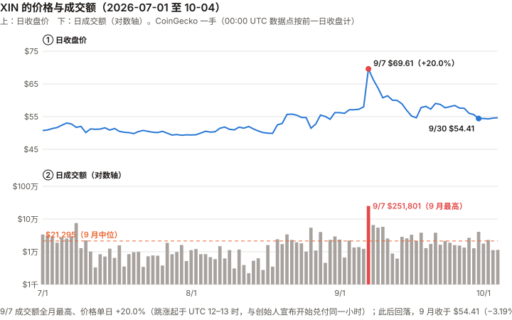
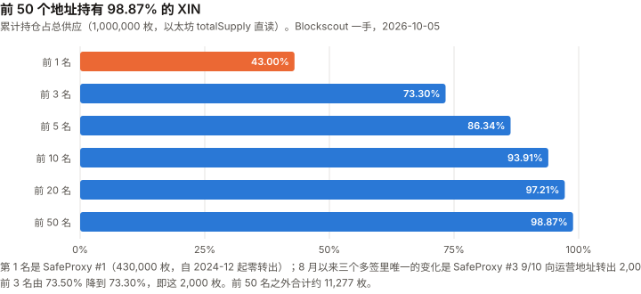
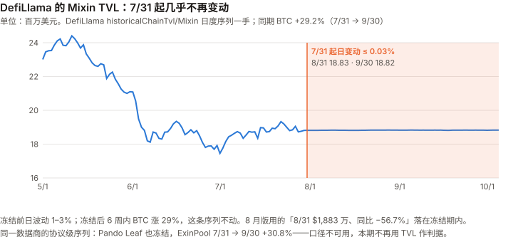

# XIN / Mixin 完整调研与分析报告

> **编写日期**：2026 年 10 月 5 日
> **数据截止**：2026 年 9 月 30 日（9 月与 Q3 完整数据已闭合）；链上快照取到 10/5
> **版本**：2026 年 9 月版（第二期）**兼 Q3 季度回顾**
> **研究方法**：沿用 8 月首期框架。**本期第一次有上期论点可核对，且第一次有论点到期**（X8-1，见 3.0）。
> **口径**：价格与成交额沿用 CoinGecko（币安未上架 XIN）。**CoinGecko 的 00:00 UTC 数据点代表前一日收盘**，本期全部按此对齐（8 月版的 8 月涨幅因此差了一天，见 12.5）。
>
> **本版更新要点**：
>
> 1. **X8-1 到期：✅（解释性判定，10/6 作出）。** 原论点「Mixin 会如期在 2026-09-23 前**公告** MDTu 已全额清偿」。**一手证据**：创始人 Cedric Fung 在其 Mixin 圈子「冯晓东的小迷圈」（7000100118）9/07 20:42 宣布开始全额偿还；**9/21 18:26 宣布「已经完成了……2300 万美元大部分 USDT 的赔付，所有已经提交的 MDTu 还款交易都已经审批处理完毕」**，早于 9/23（委托方截图，委托方处存档；发送者身份由委托方确认（委托方本人认识））。**「大部分」不是「全额」，判 ✅ 依赖一个读法**：债务代币兑付必有未领取的部分，若把「全额清偿」读成「每一枚都兑完」，本条从登记起就不可能 ✅（违反门槛 1）；唯一可满足的读法是「向全体持有人开放全额兑付，且所有已提交的兑付都已完成」。**这个读法是看到原文之后确定的**，如实记录。作者自评 40%，押错了方向（Brier 0.36）。
> 2. **本期最重要的发现：8 月版的 TVL 数字落在一个冻结的序列上。** DefiLlama 的 Mixin TVL 自 **2026-07-31** 起每日变动不超过 0.03%（此前日波动 1–3%），而同期 BTC 上涨 **29.2%**。**8 月版「8/31 TVL $1,883 万、同比 −56.7%」用的是冻结后的数字**；8 月版登记的 **X8-4（以 BTC 计的 TVL）因此失去检验能力，改判 ⊘**。Mixin 官方接口的「快照数」972,451,025 也与 8 月版逐位相同。
> 3. **9 月 −3.19%、Q3 +9.25%**（BTC 同期 +6.39%、+42.70%，CoinGecko 口径）。一年期对 BTC 的 R² 只有 **0.025**——价格仍然不是可用的测量。**9 月唯一一个单日涨跌超过 20% 的 UTC 交易日是 9/07（+20.0%，成交额 $25.2 万，全月最高）——跳涨起于 12:00–13:00 UTC，与创始人宣布开始兑付（北京时间 20:42，即 12:42 UTC；时区经委托方核实）在同一小时。**
> 4. **链上供应**：SafeProxy #1（430,000 枚）仍然零转出（X8-3 未触发）；SafeProxy #3 于 **9/10 向运营地址转出 2,000 枚**——恰好落在 8 月版「单月超过 2,000 枚」监控线上，未超过。
> 5. **成交额翻倍但仍在万元量级**：9 月日成交额中位数 **$21,295**（8 月 $10,878），距 X8-2 的 $100,000 门槛还差 4.7 倍。
>
> **免责声明**：本报告不构成任何投资建议。所有分析仅供研究参考，投资决策请咨询专业顾问。

---

## 核心结论摘要（一页速览）

| 维度 | 核心判断 |
|------|----------|
| **XIN 是什么** | 一家产品公司（Mixin）的网络代币，不是一条公链的燃料；**本报告未找到任何文件赋予 XIN 对公司利润的请求权**（8 月版 6.3，不变） |
| **当前价格位置** | **$54.41**（9/30 收盘，CoinGecko）；**FDV $5,441 万**；市值仍无法计算（CoinGecko 流通量字段为 0）；距 ATH（$2,095.67，2018-01-19）**−97.4%** |
| **9 月 / Q3 表现** | **9 月 −3.19%、Q3 +9.25%**；BTC 同期 +6.39%、+42.70%。一年 R² **0.025**、年化波动 **182.3%**——**这个价格不承载可解读的信息** |
| **本期最重要的发现** | **X8-1 到期判 ✅**（创始人 9/21 宣布「大部分赔付完成、所有已提交兑付处理完毕」；判定依赖对「全额」的读法，见 3.0）；**DefiLlama 的 Mixin TVL 不是市值**——Pando Leaf 一项用的是接口里的陈旧价格，8 月版的 TVL 结论与 X8-4 都建立在这条序列上 |
| **MDTu** | $2,300 万承诺于 9/23 前偿还；**9/07 晚开始兑付，9/21 创始人宣布大部分赔付完成、所有已提交兑付处理完毕**（创始人原话，委托方截图）；委托方称已兑付比例在 99% 以上（未核实）。相当于 9/30 FDV 的 42.3% |
| **剩余债务界** | MDTe / MDTb：官方「暂无明确时间表」。按 8 月版的区间（$5,200 万–$7,700 万，输入全为二手），**约为 9/30 FDV 的 0.96–1.42 倍**（FDV 下跌使倍数上升） |
| **链上供应** | 前 1 / 3 / 50 名 **43.00% / 73.30% / 98.87%**；SafeProxy #3 9/10 转出 2,000 枚；DEX 池 17,915.62 枚。**自由流通盘上界 236,000 枚，可观测交易盘约 29,193 枚** |
| **成交量** | 9 月日成交额中位数 **$21,295**（8 月 $10,878），最低 $6,192（9/13）；**9/07 一天 $251,801** |
| **核心多头逻辑** | **公开承诺已按期兑现**（MDTu，创始人原话；资金来源未披露）；产品持续交付（8 月版第 7 章）；总量硬顶 100 万枚 |
| **核心空头逻辑** | 业务经济性仍不可观测；剩余债务与 FDV 同量级（输入二手）；金库持续向运营地址转出（去向未查） |
| **估值立场** | **不给目标价**（理由同 8 月版：业务经济性不可观测）。MDTu 已兑付（8 月版清单第 3 项已发生），**但第 1、2、4 项仍未满足** |
| **风险等级** | 高。流动性、供应集中、数据基础设施三项风险都未改善 |

---

## 1. Mixin 是什么

> 完整内容见 8 月首期第 1 章（产品线、注册实体、XIN 的角色）。本期没有新的一手材料改变这些描述。

| 角色 | 本期核对 |
|------|------|
| 总量硬顶 1,000,000 枚 | ✅ 以太坊主网 RPC `totalSupply()` 本期复读，**仍为 1,000,000** |
| 节点抵押 10,000 XIN、100 个验证者 | ⚠️ 仍为二手；**mixin.space 本期对脚本访问返回 Cloudflare 验证页，未能复读** |
| XIN 对公司利润的请求权 | ❌ 仍未找到任何赋权文件 |

---

## 2. XIN 的发展阶段划分

> 阶段一至五见 8 月首期。本期追加：

| 日期 | 事件 | 核实等级 |
|------|------|:---:|
| 2025-10-27 | Mixin 中文公告：计划于 2026-09-23 前完成 MDTu 所代表 $2,300 万债务的全额偿还；MDTb / MDTe 暂无时间表 | ✅ 官方中文公告原文（8 月版已核实，本期复读一致） |
| **2026-07-31** | **DefiLlama 的 Mixin 链级 TVL 序列此后几乎不再变动** | ✅ DefiLlama API 逐日序列 |
| **2026-09-07（UTC）** | **XIN 单日 +20.0%（$57.99 → $69.61），成交额 $251,801，均为 9 月最高** | ✅ CoinGecko |
| **2026-09-07 20:42（北京时间，委托方核实）** | **创始人 Cedric Fung 在 Mixin 圈子宣布开始 MDTu 的 2,300 万美元全额偿还**，开放兑换机器人（比承诺提前 16 天；委托方 8 月版记为「9/08」） | ✅ 创始人原话（委托方截图，委托方处存档；发送者身份由委托方确认（委托方本人认识）） |
| 2026-09-10 20:08 | 创始人：所有已提交的兑付已处理完毕，「从金额上来看，大部分都处理完成了」 | ✅ 同上 |
| 2026-09-10 | SafeProxy #3 向运营地址转出 2,000 XIN | ✅ 链上 |
| **2026-09-21 18:26** | **创始人：「Mixin 已经完成了……2300 万美元大部分 USDT 的赔付，所有已经提交的 MDTu 还款交易都已经审批处理完毕」**；未领取者仍可去机器人兑换 | ✅ 同上；委托方确认 9/22–9/30 该圈子无后续消息 |
| 2026-09-23 | MDTu 承诺偿还截止日；同日运营地址转出 1,320.59 XIN | ✅ 承诺为官方原文；转账为链上 |
| **2026-09-30（快讯日期）** | **媒体转述 Mixin 称「已完成约 2,300 万 USDT 的兑付并开放全额兑换」** | ⚠️ 二手（KuCoin 快讯，文中把 923 事件误写成「2026 年 9 月的事件」）；**很可能转述的是 9/21 创始人消息，并把「大部分」写成了「已完成」（推断）** |

---

## 3. 当前现状

### 3.0 论点校验：8 月版登记的 6 条

| # | 论点 | 检验条件（摘要） | 9 月读数 | 判定 |
|---|------|------|------|------|
| **X8-1** | ⚑ 反向登记（约 40%）：**Mixin 会如期在 2026-09-23 前公告 MDTu 已全额清偿**（登记原文） | 若 2026-09-30 前没有出现「MDTu 已全额清偿」的官方公告，则本条错误（登记原文；9/08 曾改写为「未能兑付则错」，**本期不采用**） | 创始人 9/21 原话：「已经完成了……2300 万美元**大部分** USDT 的赔付，所有已经提交的 MDTu 还款交易都已经审批处理完毕」 | **✅**（解释性判定，见下） |
| X8-2 | XIN 的成交量不会实质改善 | 2026-12 日成交额中位数 ≥ $100,000 则错 | 9 月中位数 **$21,295**（8 月 $10,878，×1.96） | ⏳ |
| X8-3 | SafeProxy #1 不会在四个月内动用 | 2027-01-07 前出现任何 XIN 转出则错 | **430,000 枚，零转出**（全部 5 笔均为转入） | ⏳ |
| **X8-4** | ⚑ 反向登记（约 45%）：Mixin 的业务规模不会企稳 | 2026-12 末 TVL（以 BTC 计）高于 9 月末则错 | **序列不是市值（Pando 接口价格陈旧），且 7/31 起几乎不动** | **⊘ 检验失效**（检验条件有缺陷，见 6.1） |
| X8-5 | 低相关是测量失效，不是资产特征 | 12 月成交中位数 ≥ $10 万且 2027-09-07 的 R² 仍 <15%，则错 | 一年 R² 0.025；成交中位数 $21,295 | ⏳（前提未出现） |
| X8-6 | 业务经济性会持续不可观测 | 2027-03-07 前出现 MDTe/MDTb 余额、审计营收或 AUM、储备证明任一项，则错 | **9 月未出现任何一项**（中英文支持站检索） | ⏳ |

> **X8-1 怎么判的**：
> - **一手证据（10/6 取得）**：创始人 Cedric Fung 在 Mixin 圈子「冯晓东的小迷圈」（7000100118）的四天消息——9/07 20:42「现在开始进行 USDT 的 2300 万美金债务的全额偿还」；9/08 20:24 处理进度约 70%；9/10 20:08「所有已经提交的 MDTu 还款交易都已经审批处理完毕……从金额上来看，大部分都处理完成了，只有少量小额的」；**9/21 18:26「Mixin 已经完成了因为黑客攻击导致的 2300 万美元大部分 USDT 的赔付，所有已经提交的 MDTu 还款交易都已经审批处理完毕……可能还有少数小额度的用户没有收到消息，请到机器人进行兑换」**。委托方截图，并确认 9/22–9/30 该圈子无后续消息；截图由委托方存档（SHA-256 `2b4c087e…de3c955`）。**发送者身份由委托方确认（委托方本人认识）；截图为北京时间（委托方向截图提供者核实）。两项均为委托方确认，本报告未独立复核。**
> - **对照 10/5 补定的判法**：发布于 9/30 前 ✅；渠道属于「Messenger 公告」✅（创始人以个人圈子发布，比 Team Mixin 系统公告低一档，按公司公开表态计）；**内容是「大部分」，不是「全额」——补定判法没有覆盖这一档。**
> - **判 ✅ 依据的读法**：任何债务代币兑付都会剩下未领取的部分（离开 Mixin、遗忘、放弃）。若把「全额清偿」读成「每一枚都兑完」，**本条从登记那天起就不可能判 ✅，违反门槛 1**。唯一可满足的读法是「**向全体持有人开放全额兑付，且所有已提交的兑付都已完成**」——9/21 的消息逐字满足，且早于 9/23。登记原文「未发布的三个原因」里的「部分还」指公司只偿付一部分，不指持有人未来领取。
> - **必须如实记下的三点**：① **这个读法是 10/6 看到原文之后确定的**——它是门槛 1 推出的唯一可满足读法，但仍是解释性判定，不是机械判定；② 「已兑付比例 99% 以上」是委托方的说法，原文只有「大部分」，**未核实**；③ 证据由主张判 ✅ 的委托方提供，委托方可能持有 MDTu 或 XIN——截图里的兑换机器人 ID、支持站链接与官方一致，但本报告无法独立复现这几条消息。
> - **初稿判 ✅、二稿改待核的经过**见 12.6。初稿的 ✅ 用的是改写后的构念和「声明大概率存在」的推断；本稿的 ✅ 建立在原文上。**结论相同，依据不同——初稿那一版仍然是错的。**
> - 作者自评 40%，**押错了方向**，Brier (1 − 0.4)² = 0.36。

### 3.1 价格与市场

| 指标 | 数值 | 口径 |
|------|------|------|
| **9/30 收盘** | **$54.41** | CoinGecko（00:00 UTC 点按前一日收盘） |
| 10/5 价格（第二来源） | $54.70 | **Mixin 官方 ticker API 直接调用**，与 CoinGecko 一致 |
| FDV | **$5,441 万** | $54.41 × 1,000,000 |
| 市值 | **无法计算** | CoinGecko `circulating_supply` 与 `market_cap` 仍为 0 |
| 9 月收盘区间 | 高 **$69.61（9/07）** / 低 **$54.41（9/30）** | CoinGecko |

| 区间 | XIN | BTC（同口径） |
|------|---:|---:|
| **9 月**（8/31 → 9/30 收盘） | **−3.19%** | +6.39% |
| **Q3**（6/30 → 9/30） | **+9.25%** | +42.70% |
| 8 月（7/31 → 8/31，**更正 8 月版**） | +13.72% | +25.04% |
| YTD | −5.22% | −4.57% |

| 统计量（日对数收益，2025-10-06 至 2026-09-30） | XIN |
|------|:---:|
| 年化波动率 | **182.3%** |
| beta（vs BTC） | 0.646 |
| **R²** | **0.025** |
| 单日涨跌 >20% 的天数 | 17 天（9 月只有 9/07 一天） |

> **口径的原始数据点**（CoinGecko `market_chart`，365 天日度；每个点的时间戳为 00:00 UTC，价格为该时刻的报价，成交额为截至该时刻的 24 小时成交额——**因此 00:00 的点对应的是前一个 UTC 日**）：
>
> | 时间戳（UTC） | 价格 | 24 小时成交额 | 本报告归属 |
> |------|---:|---:|------|
> | 2026-08-01 00:00 | $49.43 | — | 7/31 收盘 |
> | 2026-09-01 00:00 | $56.21 | — | 8/31 收盘 |
> | 2026-09-07 00:00 | $57.99 | $12,272 | 9/06 |
> | **2026-09-08 00:00** | **$69.61** | **$251,801** | **9/07（UTC 日）** |
> | 2026-10-01 00:00 | $54.41 | — | 9/30 收盘 |
>
> ⚠️ CoinGecko 免费接口只开放最近 365 天，**一年期窗口起点是 2025-10-06**，与 8 月版（2025-09 起）不完全相同；R² 与 8 月版的 0.024 量级一致。
> **R² 0.025 的含义与 8 月版相同：BTC 解释不了 XIN 97.5% 的日波动——这个 beta 是拟合噪声得到的数，本报告不对 9 月或 Q3 的超额/落后做任何解读。**

### 3.2 成交量

> 图中数字：9/7 收盘 $69.61（+20.0%）、成交额 $251,801；9/30 收盘 $54.41；9 月成交中位数 $21,295；价格轴刻度 $45 / $55 / $65 / $75；成交额对数轴刻度 $1 千 / $1 万 / $10 万 / $100 万；横轴 7/1、8/1、9/1、10/1。

| 指标 | 9 月 | 8 月 |
|------|---:|---:|
| **日成交额中位数** | **$21,295** | $10,878 |
| 最低 | $6,192（9/13） | $2,207 |
| 最高 | **$251,801（9/07）** | — |
| 年化换手（中位数 × 365 ÷ FDV） | **14.3%** | 5.84% |

> **9/07（UTC）一天的成交额是 9 月中位数的 11.8 倍，同日价格 +20.0%。小时数据显示跳涨起于 12:00–13:00 UTC**（价格 12:00 $57.63 → 13:00 $60.68 → 14:00 $67.93；24 小时滚动成交额 $12,837 → $61,865 → $141,123，CoinGecko），**与创始人宣布开始兑付的 20:42 在同一小时**（北京时间，即 12:42 UTC；时区经委托方向截图提供者核实）。
> **时点吻合到小时，本报告据此认为跳涨很可能是对 MDTu 兑付公告的反应**——9 月有 720 个小时，随机落在同一小时的概率很低。⚠️ 两个限定：① 时区由委托方向截图提供者核实为北京时间，本报告未独立复核；② 日成交两万美元的市场里，一个参与者就能制造这样的一天，「反应」可能只来自很少几个人。次日起价格连跌，9 月收于 $54.41，低于 9/07 之前的水平。
> **8 月版写稿时看到当日成交约 $1.2–1.7 万**——小时数据里 24 小时滚动成交额在 06:00–12:00 UTC 为 $1.17–1.28 万，13:00 起才升到 $6 万以上。**8 月版记的写稿时点「14:40」因此应是北京时间（06:40 UTC），在公告之前**（推断；12.5 第 4 条一并更正）。

### 3.3 宏观环境

> 与 BTC 9 月版共用（美联储 9/16 加息 25bp 至 3.75–4.00%，一手）。**XIN 对 BTC 的 R² 只有 0.025，宏观通过 BTC 传导到 XIN 的路径测不出来**（与 8 月版相同）。

---

## 4. MDTu：一条判定，和它的证据等级（本期核心章之一）

### 4.1 证据清单

| 证据 | 内容 | 等级 |
|------|------|:---:|
| 承诺 | 「我们计划于 2026 年 9 月 23 日前，完成 MDTu 所代表 2300 万美元债务的全额偿还」（2025-10-27 公告） | ✅ 官方中文原文，本期复读一致 |
| 开始兑付 | 9/07 20:42 创始人宣布开始全额偿还，开放兑换机器人 7000105119 | ✅ **创始人原话**（委托方截图；发送者身份由委托方确认（委托方本人认识）） |
| 完成表态 | 9/21 18:26 创始人：「已经完成了……2300 万美元**大部分** USDT 的赔付，所有已经提交的 MDTu 还款交易都已经审批处理完毕」 | ✅ **创始人原话**（同上）；委托方称比例在 99% 以上，**未核实** |
| 完成声明 | 9/30 KuCoin 快讯：Mixin 称已完成约 2,300 万 USDT 兑付、开放全额兑换，可通过兑换机器人与钱包记录核对 | ⚠️ **二手转述**，且文中有明显错误（把 923 事件写成 2026 年 9 月）；很可能转述 9/21 消息并把「大部分」写成「已完成」（推断） |
| 官方完成公告 | 检索 Mixin 中文「重要公告」栏目（61 篇）与英文支持站首页 | ❌ **未找到**——中文栏目最新的 MDT 相关文章仍是 2025-10-27 的计划说明（Team Mixin 系统公告同样未见；创始人圈子消息见上） |
| 公开资产接口 | `api.mixin.one/network/assets/search/MDTu` | ❌ 返回空（与 8 月版相同；MDT 很可能不进公开资产表） |
| 二级市场 | BigONE 的 MDTu-USDT：**无卖单**，最近成交价 $0.70，近期无成交；同期 MDTe / MDTb 最近成交价均为 **$0.10** | ✅ 交易所 API 一手；⚠️ **市场极薄，只能说「没人以低于面值的价格卖」，证明力很弱** |

> **对 X8-1 的含义见 3.0**：创始人原话满足「如期公开表态」，判 ✅ 依赖对「全额」的读法。
> **作为关于 Mixin 的信息**：**MDTu 已按期兑付**，依据是创始人原话；「全额」的程度——委托方称 99% 以上——**未核实**。⚠️ 所有证据仍都源自 Mixin 自身，**资金来源未披露**。
> **MDTu 与 MDTe / MDTb 在 BigONE 上的价差**（无卖单 vs $0.10）与「先还 MDTu、MDTe / MDTb 暂无时间表」的官方次序一致——**但 MDTe / MDTb 的 $0.10 来自几笔零星成交（8/14–8/30，最大一笔 108.92 枚），不能读作市场定价。**

### 4.2 它改变了什么、没改变什么

| 8 月版的判断 | 本期 |
|------|------|
| 「业务经济性不可观测」是不给目标价的唯一充分理由 | **不变**。创始人原话表明公司在 24 个月内动用了约 $2,300 万，**没有**告诉我们营收、利润或资金来源 |
| 10.5 清单第 3 项「MDTu 如期清偿」 | **已发生**（创始人原话；「大部分」，比例未核实） |
| 清单第 1 项（营收 / AUM 可验证披露）、第 2 项（债务余额披露）、第 4 项（三个多签性质说明） | **仍无** |
| 下界：公司可动用资金至少 $2,300 万 | **相当于 9/30 FDV 的 42.3%**（8 月版写 33.8%，分母是当时的 FDV） |

> **一个值得写下的反差**：8 月版说这是「业务经济性上出现的第一个正面硬证据」。**它兑付的这个月，XIN 下跌 3.19%，Q3 跑输 BTC 33 个百分点。**
> ⚠️ **但这个反差不能用来推断「市场不在乎」**——R² 0.025、日成交两万美元，**价格本来就不承载可解读的信息**（3.1）。本报告只记录这个反差，不解读。

---

## 5. 链上供应取证（本期复核）

> 图中数字：前 1 / 3 / 5 / 10 / 20 / 50 名累计 43.00% / 73.30% / 86.34% / 93.91% / 97.21% / 98.87%（8 月版前 3 名为 73.50%）；横轴刻度 0% / 25% / 50% / 75% / 100%；前 50 名之外约 11,277 枚。

### 5.1 前十二大持有人（Blockscout，10/5）

| # | 地址 | XIN | 8 月版 | 变化 |
|:---:|------|---:|---:|---:|
| 1 | SafeProxy #1 0x20C03d89…fe52 | **430,000.00** | 430,000.00 | 0 |
| 2 | SafeProxy #2 0xe512EA4B…EA42 | 220,000.00 | 220,000.00 | 0 |
| 3 | SafeProxy #3 0xA82bCC5b…A4cb | **83,000.00** | 85,000.00 | **−2,000** |
| 4 | 0x4cee646e…999A | 76,593.28 | 76,593.28 | 0 |
| 5 | 0xC8e793E1…60E4 | 53,757.00 | 53,757.00 | 0 |
| 6 | 0x…0001（销毁） | 20,000.00 | 20,000.00 | 0 |
| 7 | DEX 池 0xcDe46A48…67B6 | **17,915.62** | 17,617.71 | +297.91 |
| 8 | 0xA2EC1844…3142 | 13,439.00 | 13,439.00 | 0 |
| 9 | 0x59F819af…419D | 13,439.00 | 13,439.00 | 0 |
| 10 | 0x…0002（销毁） | 11,000.00 | 11,000.00 | 0 |
| 11 | SafeProxy 0xef96A3a2…3C62 | 4,533.01 | （8 月版未列） | 2024-09 收到 4,563.01 枚，2025-01 转出 30 枚，此后不动 |
| 12 | 0x5d7801C9…6457 | 4,357.57 | （未列） | — |

> ⚠️ **持有人总数 20,897，与 8 月版逐位相同**——Blockscout 的计数器可能有缓存，**本报告不把它当作「持有人数没变」的证据**。

### 5.2 金库释放

**分页拉全三个多签的全部 XIN 转账**（#1 共 5 笔、#2 共 6 笔、#3 共 33 笔；三者 IN − OUT 都恰好等于当前余额，可确认已拉全）：

| 期间 | #3 → 运营地址 0x1616b057 |
|------|---:|
| 2025-10 至 2025-12 | 6,501 |
| 2026-01 至 2026-08 | 8,500 |
| **2026-09（9/10，单笔）** | **2,000** |
| **近 12 个月（2025-10 至 2026-09）** | **17,001 枚，约 $92.5 万（按 9/30 价格）** |

> **量级参照**：17,001 枚 / 365 天 ≈ 每天 46.6 枚 ≈ $2,534，**约为 9 月日成交中位数的 11.9%**（8 月版为 25.7%）。⚠️ **这只是量级参照，不是卖压占比**——17,001 枚证明的是「多签 → 运营地址」的转账，**它们有没有进入交易所、有没有卖出，本报告没有追踪到**。
> 运营地址 8 月以来向十余个地址转出合计约 3,450 枚，**最大一笔是 9/23 的 1,320.59 枚**（MDTu 承诺截止日当天，接收方 0x75bBDeD4…）。⚠️ **接收方性质未查**，本报告不把它与 MDTu 兑付联系起来。

### 5.3 自由流通盘

| 口径 | 推导 | 枚数 |
|------|------|---:|
| **上界** | 1,000,000 − 三个多签 733,000 − 销毁 31,000 | **236,000** |
| **可观测确在交易的** | DEX 池 17,915.62 + 前 50 名之外约 11,277 | **约 29,193** |

> 上界比 8 月版多 2,000 枚，正是 #3 释放的那一笔。销毁地址余额（0x…0001 为 20,000、0x…0002 为 11,000）本期以以太坊 RPC `balanceOf` 复读，**不变**——**XIN 仍没有可见的持续销毁**。

---

## 6. 数据基础设施：一个比价格更大的问题（本期核心章之二）

### 6.1 DefiLlama 的 Mixin TVL 自 7/31 起冻结

> 图中数字：8/31 为 18.83、9/30 为 18.82（百万美元）；纵轴刻度 16 / 18 / 20 / 22 / 24；横轴 5/1、6/1、7/1、8/1、9/1、10/1；同期 BTC +29.2%（图注取整为 29%）。

**逐日序列的月内日波动（标准差）**：

| 月份 | 日变动标准差 | 月末 TVL |
|------|---:|---:|
| 2026-05 | 1.23% | $2,110 万 |
| 2026-06 | 1.72% | $1,792 万 |
| 2026-07 | 1.28% | $1,882 万 |
| **2026-08** | **0.011%** | $1,883 万 |
| **2026-09** | **0.015%** | $1,882 万 |

**冻结的判据**：
1. **日波动降了两个数量级**（1–3% → 0.01%），从 7/31 前后开始；
2. **同期 BTC 上涨 29.2%**（7/31 $64,743 → 9/30 $83,640），而 8 月版说 Mixin TVL 以 BTC / ETH 为主——**若仍在按币价计值，它应当明显上升**；
3. **协议级序列分化**：同一数据商的 Pando Leaf（Mixin 上最大的协议，约 $1,139 万）**同样冻结**；ExinPool **却在变动**（7/31 $783 万 → 9/30 $1,024 万，+30.8%）。

**Pando Leaf 的水平口径（已一手查明，审查阶段补做；7/31 断点的原因仍未知）**：DefiLlama 的 Pando Leaf 适配器（GitHub `DefiLlama-Adapters/projects/pando-leaf/index.js`，已读源码）只做一件事——调用 Pando 官方接口 `leaf-api.pando.im/api/cats`，把每种抵押品的 `ink × price` 加总，且 `timetravel: false`（不能回溯）。**本报告 10/5 直接调用该接口**：

| 抵押品 | 接口给出的价格 | 同日市价（约） | 抵押数量 |
|------|---:|---:|---:|
| BTC | **$57,827** | $86,000 | 165.08 |
| ETH | **$571.14** | $2,700 | 1,114.77 |
| **XIN** | **$236.30** | **$54.70** | 3,742.83 |
| ZEC | $454.04 | $1,300 | 196.99 |
| 合计（13 种） | — | — | **$11,397,866** |

> **合计与 DefiLlama 的 Pando Leaf 数值逐位一致**——**DefiLlama 记的是「接口里的陈旧价格 × 抵押数量」，不是市值。** 接口价格与市价的偏离方向不一（XIN 高估 4.3 倍、ETH 低估约 4.7 倍），这些价格**不是当日市价**；它们是否对应某一个历史日期（接口里 ETH/BTC ≈ 0.0099）、`price` 字段的确切语义，本报告**未核实**。
> **能确定的是两件不同的事**：① **水平**——Pando Leaf 这一项的「TVL」是接口报价 × 抵押数量，不是市值；② **断点**——链级序列自 7/31 起几乎不动，**原因未知**（接口 BTC 报价 $57,827 也不等于 7/31 的 BTC 市价 $64,743，陈旧报价与 7/31 断点是两件事）。**结论只有一个：这条序列不能当作 Mixin 业务规模的测量**；8 月版引用的更早历史（峰值 $3.783 亿、923 前 $1.199 亿）是否受同一问题影响，**无法排除**。
> **按市价重算 Pando Leaf 的量级**（推断，按 10/5 市价：BTC 165.08 × $86,000 + ETH 1,114.77 × $2,700 + XIN 3,742.83 × $54.7 + ZEC 196.99 × $1,300 ≈ $1,767 万，再加其余 9 种约 $24 万）≈ **$1,790 万**，比接口口径高约 57%；**污染的方向是低估**（BTC、ETH 被低估）。ExinPool 的序列在变动，其机制本期未查。
>
> **对 8 月版的影响**：
> - **8 月版写「TVL 现在 $1,883 万（2026-08-31），距峰值 −95.0%，同比 −56.7%」——8/31 的读数已在冻结期内。** 「距峰值」与「同比」两个数字的终点都不可靠，**峰值端是否受同一问题污染也未知**——本期**不再引用**「距峰值 −95%」「同比 −56.7%」「事件后无回升」。若按市价粗算（上一段），终点约高 57%，距峰值约 −93%，**量级相近但这个粗算本身依赖一个未核实的峰值**。
> - **8 月版的监控指标「TVL 连续三个月回升」与记分卡 X8-4 都失去检验能力**：一个按美元冻结的序列，换算成 BTC 计价后只会随 BTC 价格反向变动——**X8-4 实际上变成了一个 BTC 价格的赌注。** 本期改判 ⊘：统计量在登记前就已失效（**当时未知**，所以不是违反门槛 9），落在「检验条件有缺陷」一档；**另外，即便 TVL 正常，「混合资产 TVL ÷ BTC 价格」也不能干净地检验「业务规模企稳」**。
> - 三个口径的分歧扩大为三个数：链级历史序列 $1,882 万、`/v2/chains` **$7,715 万**（与 8 月版逐位相同，同样可疑）、**协议级合计约 $2,907 万**。

### 6.2 其他失效的公开指标

| 指标 | 8 月版 | 本期 | 读法 |
|------|------|------|------|
| `api.mixin.one/network` 快照数 | 972,451,025 | **972,451,025** | **一个月逐位不变**——该计数可能对应已不再出块的旧网络层（8 月版已推测两套快照口径差 12.2 倍），**未确认** |
| 同上 峰值吞吐 | 229 TPS | 229 | 历史峰值，不变是正常的 |
| mixin.space 浏览器（验证者、销毁、交易数） | 直接抓取 | **返回 Cloudflare 验证页** | **本期无法复读** |
| Blockscout 持有人数 | 20,897 | 20,897 | 可能是缓存，未确认 |
| CoinGecko 流通量 / 市值 | 0 | 0 | 不变 |

> **8 月版的风险 #4 说「对同一个标的出现四处这种级别的分歧，本系列前八期没有遇到过」。本期又多了两处，而且性质更糟：不是两个口径对不上，而是数据源给的数不是它名义上的东西**（Pando 接口给的是陈旧价格；**7/31 断点的原因未知**）。
> **这对本报告的方法有直接含义**：XIN 的大部分「可观测」指标，本来就依赖第三方或公司自己的接口；**当这些接口不再反映实际时，它们不报错，只是给一个看起来正常的数**——与 DOT 期、ZEC 期的教训同一形态。**本期起，Mixin 的业务规模只用链上可直读的量（以太坊侧的多签、DEX 池、销毁地址）和官方公告，不再用聚合器的 TVL。**

---

## 7. 业务侧

> 8 月版第 7 章列出的产品交付记录（2026 年四到六项功能上线）本期没有新增的一手核对（官网更新列表未复读）。**MDTu 的兑现（第 4 章）是本期业务侧唯一的新证据。**
> **公司自述的规模**（$1B+ AUM、10M+ 客户）本期没有新的可验证材料，8 月版的判断（「无法独立验证；客户数口径七个月变 10 倍」）不变。

---

## 8. XIN 与其他资产的比较

> **口径**：XIN 为 CoinGecko（00:00 点按前一日收盘）；其他资产为币安日线 UTC 收盘（与本系列其他 9 月版相同）；**两种口径对其他资产的差异在 0.2pp 以内，对 XIN 的结论不构成影响**。

| 资产 | 9 月 | Q3 | 对 BTC R²（一年） |
|------|---:|---:|:---:|
| **XIN** | **−3.19%** | **+9.25%** | **0.025** |
| ZEC | +69.60% | +260.05% | 0.19 |
| UNI | +69.76% | +219.73% | 0.40 |
| BNB | +11.26% | +40.76% | 0.59 |
| SOL | +14.61% | +60.34% | 0.76 |
| ETH | +8.85% | +70.86% | 0.82 |
| BTC | +6.42% | +42.64% | — |

> **XIN 是本系列已做 9 月版的资产里唯一 9 月下跌的**；**Q3 跑输 BTC 的有两个——XIN（落后 33pp）与 BNB（落后 1.9pp）**；XIN 的 R² 也最低。**两件事放在一起读：它的价格既不跟 BTC 走，也没有被一条正面的偿债消息托住——但在这个流动性下，两者都不构成可解读的信号。**

---

## 9. 核心价值逻辑

**星级编码证据等级**：完全建立在二手转述上的论据不得给到五星。

### 9.1 多头逻辑

| # | 论据 | 强度 | 说明与证据等级 |
|---|------|:---:|------|
| 1 | **MDTu（$2,300 万）已按期兑付** | ★★★★☆ | **由三星升为四星**：依据从二手转述升级为创始人原话（9/21）；**不给五星**——仍是公司自述、经委托方截图取得（发送者身份由委托方确认（委托方本人认识）），「全额」只有「大部分」；资金来源未披露 |
| 2 | **总量硬顶 100 万枚，无增发** | ★★★★★ | ✅ 以太坊 RPC 本期复读 |
| 3 | 产品在持续交付 | ★★★★☆ | ✅ 8 月版官网抓取，本期未复核。（初稿以「未复核」降为三星，审查指出同样未复核的多头 #4、空头 #2 都未降星——**改为三条一致：都不因「未复核」改星**） |
| 4 | 持有公开的合规注册编号 | ★★★☆☆ | 8 月版不变（公司自述，核实失败） |
| 5 | 成交额翻倍 | ★☆☆☆☆ | ✅ 一手，但仍在两万美元量级；**一个参与者就能造出这种变化** |

### 9.2 空头逻辑

| # | 论据 | 强度 | 说明与证据等级 |
|---|------|:---:|------|
| 1 | **业务经济性仍不可观测** | ★★★★★ | ✅ 已核实的不可观测：无营收/AUM 披露、MDTe/MDTb 余额无披露、无审计或储备证明 |
| 2 | **剩余债务与 FDV 同量级（0.96–1.42 倍）** | ★★★☆☆ | ⚠️ 输入全为二手（8 月版 6.4）；**按 8 月版 6.3，这不构成对 XIN 的清偿次序主张** |
| 3 | **公开数据源在静默失效** | **不计入评级** | ✅ 本月新增的观察：TVL 不是市值、官方快照计数一个月不变、浏览器挂上反爬。**按 8 月版 9.2 #4 的先例（给信息缺席打星就是把不可观测读作空头证据），改记为「已核实的信息缺席」，不计入多空评级**——它削弱的是所有人观察这个业务的能力，不指向业务本身的好坏 |
| 4 | **供应集中，金库持续向运营地址转出（去向未查）** | ★★★☆☆ | ✅ 链上一手：近 12 个月 17,001 枚转到运营地址；**是否进入交易所或卖出未追踪**（初稿写「向市场释放」是推断，已改） |
| 5 | ~~价格不承载信息~~ | **移出空头表** | 它与 11.2 #1、11.4 #1 的「流动性对多空对称」是同一组事实（日成交 $21,295、R² 0.025）——**一处算对称、一处算五星空头不一致**，本期统一按对称风险处理（见 11.4） |
| — | ~~TVL 距峰值 −95%，事件后无回升~~ | **撤销** | 序列不是市值且 7/31 起几乎不动（6.1）。「距峰值 −95%」「无回升」「同比 −56.7%」均不再引用 |

> **多空同源检查**：多头 1（MDTu 兑付）与空头 1（业务经济性不可观测）**并不矛盾**——前者是创始人原话表明「拿出了约 $2,300 万」，后者说「不知道钱从哪来、还有多少」。**两条测的是不同的东西。**

---

## 10. 估值：仍不给目标价

**理由不变：业务经济性不可观测**（8 月版 4.4 的唯一充分条件）。MDTu 兑付（创始人原话）使 8 月版 10.5 清单的第 3 项变为「已发生」，**第 1、2、4 项仍未满足**。

**8 月版的反推按 9/30 价格更新**：

| 口径 | 8 月版（FDV $6,800.9 万） | **本期（FDV $5,441 万）** |
|------|---:|---:|
| 现金流口径：100 倍 / 50 倍 / 20 倍隐含的年化归属价值 | $68 万 / $136 万 / $340 万 | **$54.4 万 / $109 万 / $272 万** |
| 节点抵押口径：100 个节点 × 10% 回报 | $680 万 | **$544 万** |
| MDTu 之后的公司债务 ÷ FDV | 0.76–1.13 倍 | **0.96–1.42 倍** |
| 已兑付的 MDTu ÷ FDV | 33.8% | **42.3%** |

> **这些数字的变化全部来自分母（FDV 下跌 20%），不是新信息。** 本报告不据此给方向判断。
> **8 月版 10.6「可以说 / 不能说」的分界本期不变**，只把「MDTu 如期清偿」从「不能说」挪到「可以说」（依据为创始人原话，「全额」程度未核实，见 3.0 与第 4 章）。

---

## 11. 投资与风险启示

### 11.1 XIN 现在处于什么位置

| 维度 | 判断 |
|------|------|
| **偿债** | **MDTu 已按期兑付**（创始人原话；「大部分」，比例未核实）；MDTe / MDTb 无时间表 |
| **业务** | **不可观测**——连 8 月版用过的 TVL 序列都已冻结 |
| **流动性** | **实质缺失**，日成交中位数 $21,295 |
| **价格** | **不承载信息**（R² 0.025） |
| **估值** | **不给目标价**（业务经济性不可观测） |

> ⚠️ **更正 8 月版 11.1 的残留**：8 月版此处写「XIN 是三档债务之后的剩余索取权」——**这个说法 8 月版自己在 6.3 已经收回**（XIN 是网络代币，未找到赋权文件），**但 11.1 表格没改**。本期按 6.3 的结论表述。

### 11.2 策略含义

> 以下为研究性质的框架整理，**不构成投资建议**。

1. **仓位规模仍是第一约束**：日成交中位数 $21,295，一笔两万美元的单子就是当天全市场。**这一条对多空对称。**
2. **MDTu 已兑付，但它说明的只是公司会兑现公开承诺，不说明 XIN 能分享公司的价值**——XIN 与公司利润之间没有已知的法律连接（8 月版 6.3）。
3. **不要再用聚合器的 TVL 跟踪 Mixin**（6.1）。可用的跟踪项见下表。

### 11.3 关键监控指标

| 指标 | 当前值 | 改变结论的阈值 | 查询方式 |
|------|---:|------|------|
| **MDTe / MDTb 偿还时间表** | 「暂无明确时间表」 | 官方偿还安排原文（X9-1；只有二手、取不到原文记 ⊘） | Mixin 中英文支持站「重要公告」 |
| **SafeProxy #1 余额** | 430,000 | 出现任何转出（X8-3） | Blockscout |
| **#2 + #3 → 排除集以外**（X9-2 口径；目前全部去往运营地址，去向未查） | 9 月 2,000 枚；近 12 个月 17,001 | Q4 合计 ≥ 6,000 枚（X9-2） | Blockscout |
| 日成交额中位数 | $21,295 | 12 月 ≥ $100,000（X8-2） | CoinGecko |
| 官方完成公告 / 审计 / 储备证明 | 无 | 出现任一项（X8-6） | 官方公告 |
| ~~TVL~~ | ~~$1,883 万~~ | — | **已停用**：DefiLlama 序列自 7/31 冻结 |

### 11.4 风险提醒

1. **流动性风险**（对多空对称）。
2. **数据基础设施风险上升**：聚合器 TVL 冻结、官方计数器不动、浏览器反爬（6.1–6.2）。**本报告对这个业务的观察能力比 8 月更弱了。**
3. **剩余债务**：MDTe / MDTb 无时间表，量级与 FDV 相当（输入二手）。
4. **供应集中**：43% 在一个约 22 个月未动的多签里。
5. **本报告自身**：X8-1 的 ✅ 是解释性判定（依赖对「全额」的读法，见 3.0）；8 月版的 TVL 结论建立在一条不是市值的序列上；8 月涨幅的窗口差了一天（见 12.5）。

### 11.5 长期认知

**第一，「按原措辞判」要把论点、构念、条件三样一起恢复，而不只是条件句。** 本期初稿说「按原措辞判」，实际只恢复了条件句，论点与构念用的仍是 9/08 信息到达后改写的版本——于是一条「开放兑换」的观察被当成了「公告全额清偿」的证据。**恢复原措辞的检查方法：去 git 取登记当时的那一版，逐字对照三处。**

**第二，数据源可能在不报错的情况下停止反映实际，而这样的数看起来最「稳定」。** DefiLlama 的 Mixin TVL 从 7/31 起几乎不动（原因未知），且水平就不是市值，**8 月版看到的是一个平稳的 $1,883 万，并据此写了同比与监控阈值**。**检查方法很便宜：看月内日波动有没有突然降一两个数量级，再拿一个必然联动的量（BTC 价格）对照。**

**第三，CoinGecko 的 00:00 数据点是前一天的收盘。** 8 月版把它当成当天，8 月涨幅因此差了一天（+9.67% vs +13.72%），本期在 9/07 的跳涨上也差点犯同一个错。**按日期标注单日事件之前，先确认数据点代表的是哪一天。**

---

## 12. 附录

### 12.1 关键数据速查（截至 2026-09-30）

| 类别 | 指标 | 数值 |
|------|------|---:|
| **市场** | 9/30 收盘 / FDV | $54.41 / $5,441 万 |
| | 9 月 / Q3 / YTD | −3.19% / +9.25% / −5.22% |
| | 年化波动 / beta / R²（一年） | 182.3% / 0.646 / 0.025 |
| | 9 月日成交中位数 / 最高 | $21,295 / $251,801（9/07） |
| **供应** | 总量 | 1,000,000（RPC 复读） |
| | 前 1 / 3 / 50 名 | 43.00% / 73.30% / 98.87% |
| | 自由流通盘上界 / 可观测交易盘 | 236,000 / 约 29,193 |
| | 金库 → 运营地址（近 12 个月，去向未查） | 17,001 枚 |
| **债务** | MDTu | $2,300 万，**已按期兑付**（创始人原话，「大部分」；X8-1 ✅，见 3.0） |
| | MDTe / MDTb | 无时间表；剩余债务约 FDV 的 0.96–1.42 倍（输入二手） |
| **数据源** | DefiLlama Mixin TVL | **自 7/31 冻结**（约 $1,882 万） |

### 12.2 数据来源与核实状态

| 数据 | 来源 | 核实状态 |
|------|------|:---:|
| 总供应量 | 以太坊主网 RPC `totalSupply()` | ✅ 本期复读 |
| 持有人分布、三个多签的全部转账 | Blockscout API（分页拉全，IN − OUT = 余额） | ✅ 一手 |
| 销毁地址余额 | 以太坊 RPC `balanceOf` | ✅ 本期复读 |
| 价格、成交额、波动率、beta、R² | CoinGecko API（365 天） | ✅ 一手；00:00 点按前一日收盘 |
| XIN 官方报价 | `api.mixin.one/network/ticker` | ✅ 与 CoinGecko 一致 |
| **TVL 序列与冻结判定** | DefiLlama `historicalChainTvl/Mixin`、`/v2/chains`、`/protocols`、`/protocol/pando-leaf`、`/protocol/exinpool` | ✅ 一手 API |
| **Pando Leaf 水平口径** | DefiLlama 适配器源码 + Pando 官方接口 `leaf-api.pando.im/api/cats`（10/5 直接调用） | ✅ 一手：接口价格陈旧（XIN $236.30、ETH $571.14、BTC $57,827），合计与 DefiLlama 逐位一致 |
| MDTu 承诺原文 | Mixin 中文公告（2025-10-27） | ✅ 本期复读 |
| **MDTu 开始兑付（9/07）与完成表态（9/21）** | 创始人在 Mixin 圈子的原话（委托方截图，委托方处存档） | ✅ 原话；发送者身份与北京时间均由委托方确认 |
| **MDTu 完成声明（9/30）** | KuCoin 快讯（转述 Mixin） | ⚠️ 二手，文中有错误 |
| 官方完成公告 | Mixin 中文「重要公告」栏目、英文支持站 | ❌ **未找到** |
| MDT 公开资产 | `api.mixin.one/network/assets/search/MDTu` | ❌ 返回空 |
| MDTu / MDTe / MDTb 二级市场 | BigONE 公开 API | ✅ 一手；市场极薄 |
| 网络统计 | `api.mixin.one/network` | ✅ 直接调用；**快照数一个月不变，可能已停更** |
| mixin.space 浏览器 | — | ❌ 本期返回 Cloudflare 验证页 |
| 宏观 | 本系列 BTC 9 月版（美联储一手） | ✅ 内部引用 |
| 传统金融机构对 XIN 的研究 | 检索未找到 | ❌ |

### 12.3 来源偏向声明

- **本期唯一的正面证据（MDTu 兑付）来自委托方提供的截图**（创始人原话，发送者身份由委托方确认（委托方本人认识））；**而空头论据（数据失效、业务不可观测、价格噪声）全部来自一手接口**。8 月版 9.3 的提醒仍然适用：**这个不对称有一部分来自标的性质**——偿债这类公司行为本来就只能从公司公告得知，而 Mixin 没有发布可检索的完成公告。
- **X8-1 的判定证据由委托方提供**（创始人消息截图），委托方可能持有 MDTu 或 XIN，**并主张判 ✅**。本报告的处理：截图中可核对的部分（兑换机器人 ID、支持站链接）与官方一致；判 ✅ 的依据写明是门槛 1 推出的读法，不是委托方的主张；「99% 以上」不采信为事实。
- **传统金融机构**：本期引用了**美联储**（利率）。**没有找到任何传统金融机构对 XIN 或 Mixin 的研究覆盖。**

### 12.4 与本系列其他 9 月版共用的口径

宏观数据与 BTC 9 月版共用同一批抓取；其他资产的价格为币安日线（XIN 为 CoinGecko，见第 8 章口径说明）。

### 12.5 本版对 8 月版的更正

| # | 8 月版写法 | 更正 | 发现方式 |
|------|------|------|------|
| 1 | 「TVL 现在 $1,883 万（2026-08-31），同比 −56.7%、事件后无回升」 | **DefiLlama 序列自 7/31 起几乎不动**，且其 Pando Leaf 部分按陈旧接口价格计值、不是市值；8/31 读数不可用；「同比」「无回升」不再引用 | 逐日序列的日波动 + 同期 BTC 对照 |
| 2 | 8 月涨幅 +9.67%（$49.425 → $54.206） | 8 月版把 CoinGecko 8/31 00:00 的点（= 8/30 收盘）当成 8/31；**7/31 → 8/31 收盘为 +13.72%** | 本期按「00:00 点 = 前一日收盘」重算 |
| 3 | 11.1「XIN 是三档债务之后的剩余索取权」 | **8 月版 6.3 已收回此说法，但 11.1 表格未同步** | 本期回扫 |
| 4 | 9/07「当日成交额约 $1.2–1.7 万」 | 写稿时点的盘中值（8 月版记为「14:40 UTC」，按小时数据应为北京时间即 06:40 UTC，在 12:42 UTC 的兑付公告之前）；**全天最终为 $251,801** | CoinGecko 日度数据 |
| 5 | 11.5「长期认知」有两个「第四」 | 编号错误 | 本期回扫 |
| 6 | 监控指标「TVL 连续三个月回升」、记分卡 X8-4 | 序列不是市值且 7/31 起几乎不动，X8-4 判 ⊘（检验条件有缺陷，不是门槛 9） | 6.1 |
| 7 | X8-1 的论点、构念与检验条件（9/08 得知开放兑换后改写为「兑现 MDTu」「测会不会兑现承诺」「未能兑付则错」） | **恢复 8 月版首次提交的原文**（「公告已全额清偿」「测会不会公开发布」「无官方公告则错」），按原文判定（10/6 取得创始人原话后判 ✅，依赖对「全额」的读法） | git `e9d738f` 逐字对照 |

### 12.6 发布前审查记录

**第 1 层 `verify_report.py`**：初稿有 FAIL（图表刻度与图注数字 55 / 65 / 73.5 / 29.0 在正文无出处、价格图未嵌入），已补脚注并嵌入图表，复跑 0 FAIL。

**第 2 层 _bian（推理审查）与第 3 层 Codex（读原文复核）**——两边独立指出同一处硬伤：

| # | 意见 | 出处 | 处理 |
|---|------|:---:|------|
| 1 | **X8-1 判 ✅ 不成立**：只恢复了条件句，论点与构念仍用 9/08 改写版；委托方的「开放兑换」观察在原构念下是 ❌ 路径之一（「悄悄还了」）；唯一相关证据是含错误的媒体转述，「官方声明大概率存在」不能代替原文 | 两者 | ✅ 改为 **⏳ 待核**，不计入正确率；恢复 `e9d738f` 原文；写死 10 月版判法（3.0） |
| 2 | 记分卡 X8-1 的检验条件栏仍是改写版 | _bian | ✅ 改回原文，改写版移入脚注 |
| 3 | 摘要把「价格跑输 BTC」当核心空头，与「价格不承载信息」冲突 | _bian | ✅ 删除 |
| 4 | 6.1「机制已一手查明」过度：查明的只是水平口径，不解释 7/31 断点；「−95% 仍成立」与自认污染矛盾 | 两者 | ✅ 收窄；按市价复算约 +57%（偏低）；−95% 不再引用 |
| 5 | 金库「向市场释放」、11.9%「卖压」是推断 | 两者 | ✅ 改为「运营地址，去向未查」「规模参照」 |
| 6 | X8-4 的 ⊘ 挂错条款（门槛 9 指**已知**取不到） | 两者 | ✅ 改为「检验条件有缺陷」，并注明 BTC 计价的混合资产 TVL 本身也不是业务规模的好构念 |
| 7 | X9-1：观测渠道含取不到的社交媒体且「缺席即错」；「一手」前提不成立；35% 无推导 | 两者 | ✅ 重写（见记分卡） |
| 8 | X9-2：「不加速」与 6,000 线之间有灰区；70% 无推导；窗口已过 5 天未声明 | 两者 | ✅ 改写为「不回到 2025 Q4 节奏」，补推导与窗口声明 |
| 9 | X8-2 门槛 11 补注：排查条件无判别力，且 ⚠️ 档位用错 | _bian | ✅ 改记 ⊘，排查条件改为与 8–9 月同场所的笔数与单笔规模分布对比 |
| 10 | 「正确率 100%（1/1）」不度量作者判断（自评 40%） | _bian | ✅ 随 X8-1 改待核一并删除；记分卡加自评概率说明 |
| 11 | 空头 #3（数据源失效）是信息缺席，不应计星；空头 #5 与「对多空对称」重复 | _bian | ✅ #3 不计入评级；#5 移为对称风险 |
| 12 | 「未复核 → 降星」只用在多头一侧 | _bian | ✅ 删除该降级理由，多头 #3 维持四星 |
| 13 | 9/07 跳涨与委托方「9/08」未对齐时区 | _bian | ✅ 先改为「相邻或重叠」；10/6 取得截图后按小时数据确认同一小时（时区经委托方核实为北京时间） |
| 14 | CoinGecko 日界线需列原始时间戳以便复核 | Codex | ✅ 3.1 补原始时间戳表 |
| 15 | X9-2 初稿条件「两个多签以外」会把销毁算成释放（2026-01-06 #2 向 0x…0001 / 0x…0002 转出 31,000 枚） | 本报告复拉转账时自查 | ✅ 排除销毁地址 |

**分歧（未采纳）**：_bian 首轮倾向于把 X8-4 的统计量重设为 Pando「数量 × 固定价格」。本报告选 ⊘。**初稿给的理由（「价格语义未知」）在复审中被 _bian 驳倒**——固定价格只起权重作用，不影响涨跌方向。**成立的理由是**：在已知序列失效之后再换统计量，本身就是信息到达后改口径（X8-1、ZEC Z8-3 的同一教训）；且 Pando Leaf 只是一个协议，序列几乎不动也意味着数量可能同样陈旧。_bian 复审时同意这个理由。

**复审（第二轮修订后，_bian 与 Codex 再审一次）**：

| # | 意见 | 出处 | 处理 |
|---|------|:---:|------|
| R1 | X8-1 后续判法写于观测状态已知之后，不能叫「事前」；「取不到 → ⊘」关掉了原条件的 ❌ 路径 | 两者 | ✅ 改称「10/5 补定」；❌ 补回「追溯出处后确认非 Mixin 公告且列明渠道查无」；⊘ 限于有可信线索但核实不了，理由写「检验条件有缺陷」；补「有原文无日期」档 |
| R2 | 新加的 ⊘ 都落在对作者不利的一侧；X9-1 的 ❌ 仍是默认出口 | 两者 | ✅ ⊘ 定义补「观测不可完成」，每次判 ⊘ 须写落点；X9-1 / X8-1 加通则「≥ 2 家互不引用的二手 → 视同原文」；X9-1 的 ❌ 限于事先列明的渠道 |
| R3 | X9-2 的检验条件会把 2024Q3 那类转给四个 13,439 份额合约的转出算作释放，单笔即可翻转结论；基率与条件口径不一致 | _bian | ✅ 排除集改为全部已知 Mixin 多签 + 四个份额合约 + 销毁地址；监控表同步 |
| R4 | X8-2 排查条件无阈值，裁量只开在 ❌ 侧 | 两者 | ✅ 写死三项数字阈值；**取不到排查数据 → 按原条件判**；⊘ 落在 ❌ 侧，如实记录 |
| R5 | 「停的是价格」「冻结机制」「静默冻结」「停了」是被撤回的机制断言换了说法 | _bian | ✅ 四处改写 |
| R6 | 记分卡 9/08 中途记录未标「已被取代」 | 两者 | ✅ 标注；「下界」加「二手，若属实」 |
| R7 | 12.3「独立渠道」「硬证据」、4.2「兑现」残留 | _bian | ✅ 改写 |
| R8 | X9-1 与 X9-2 可能相关（运营地址首笔收款与 MDTu 时间表公告同日） | _bian | ✅ 补相关性声明 |
| R9 | X9-1 基率的事件类比 ✅ 条件窄；「×2 上调」像给已有数找理由 | _bian | ✅ 基率改为区间 15%–28%，自评改为 25%，不再做 ×2 |
| R10 | 「本表起都写自评」8 月期兑现不了；X9-1 与 X8-6「方向相反」会被读成对冲；9 月 ×3 是「恰在 ❌ 线上」 | _bian | ✅ 改写 |

**第 4 层 _dalin（10/6）**：

- 提供创始人 Cedric Fung 在 Mixin 圈子的消息截图（9/07–9/21），并确认 9/22–9/30 无后续消息 → **X8-1 由 ⏳ 待核改判 ✅**。
- 主张「大部分 = 99% 以上，零星小额是离开或遗忘的用户，不影响结果」。**本报告采纳 ✅，但不以这条理由为依据**：判 ✅ 的依据是门槛 1——「全额」若指每一枚都兑完，本条从登记起就不可能 ✅；「99% 以上」未核实。
- 截图同时更正了两处时间：开始兑付是 9/07 晚（不是 9/08）；8 月版写稿时点「14:40」应为北京时间。
- ⚠️ **这次改判未经 _bian 与 Codex 复审**——它推翻的正是两位审查者首轮否掉的 ✅（当时依据是推断，本次依据是原文）。

---

> **配套文件**：`xin_questions_summary_202609.md`（简明速查）、`../thesis_scorecard.md`（论点滚动记分卡）。
> 本报告不构成投资建议。
