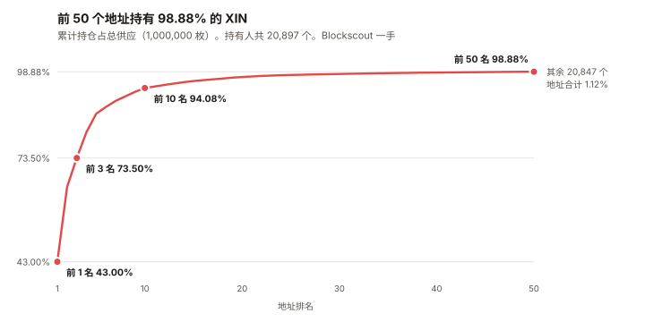
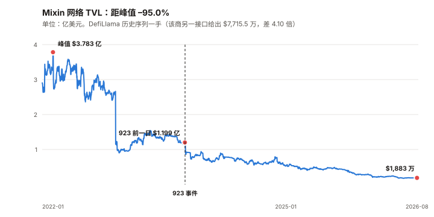

# XIN / Mixin 完整调研与分析报告

> **编写日期**：2026 年 9 月 7 日
> **数据截止**：2026 年 9 月 7 日（8 月完整月度数据已闭合）
> **研究方法**：沿用本系列前八期框架（BTC / ETH / SOL / ADA / BNB / HYPE / UNI / TRX）。
> **本期的独特之处**：XIN 是本系列覆盖的第九个资产，也是**第一个自始就判定「无法给出目标价」的资产**
> （HYPE 期是发布后撤回，性质不同）。
> **本报告不给目标价，理由收窄为一条：公司的业务经济性不可观测**（营收、AUM、债务余额均无可验证披露）。
> 自由流通盘未知与报价噪声是加重情节，**但它们阻止的是「可执行性」，不是「可估值性」**。
> **本期为 XIN 首期报告。**
>
> **本期核心发现**：
> ① **供应：自由流通盘未知，但有可辩护的边界。** CoinGecko 对 XIN 的市值与流通量都报 **0**。
> 链上（本报告直接调用以太坊主网 RPC）总量恰好 **1,000,000 枚**，
> 而**前 3 个多签地址持有 73.50%，前 50 个地址持有 98.88%**。
> **自由流通盘上界 234,000 枚，可观测确在交易的约 28,829 枚**（含一个 17,618 枚的 DEX 池）；
> ② **价格层：价格不是一个可用的测量。** 8 月日成交额**中位数 $10,878**、最低 $2,207；
> 过去一年有 **17 天单日涨跌超过 20%**，含 2026-02-11 的 **–57.8%** 与次日的 **+59.3%**。
> 年化波动率 **177.3%**（八资产最高的 UNI 是 97.1%），
> **而与 BTC 的相关系数只有 0.156——R² 仅 2.4%，beta 0.63 没有解释力**；
> ③ **业务经济性不可观测——这是不给目标价的唯一充分理由。** 2023-09-23 的 923 事件后，
> Mixin 发行了 **MDT 债务代币**（MDTu / MDTe / MDTb），官方文档写明清偿次序与还款来源
> （**「用持续业务发展的利润偿还债务」**）。
> **本报告未能取得任何一手的债务余额数字，也未找到营收或 AUM 的可验证披露。**
> ⚠️ **一处必须写在前面的更正**：**初稿把 XIN 描述成「排在三档债务之后的剩余索取权」，这是类别错误。**
> **XIN 是网络代币，本报告没有找到任何文件赋予它对公司利润或清算剩余的请求权**（见 6.3）；
> **但可以给出一个界：MDTu 之后的公司债务约为 XIN 全部 FDV 的 0.76–1.13 倍**（见 6.4）；
> ④ **两个必须写出来的口径分歧**：DefiLlama 的两个接口对同一条链给出 **$7,715.5 万** 与 **$1,883.1 万**，
> **相差 4.1 倍**；Mixin 官网今天写 **10M+ 客户**，而 2026 年 2 月媒体引述该公司的说法是「100 万+」；
> ⑤ **但业务不是死的，这一条必须给足分量**：Mixin 在 2026 年持续发布产品——
> 4 月 U 本位永续合约、4 月 Coinbase 法币通道、5 月闪电网络、8 月银行账户；
> 并在**美国（FinCEN MSB 31000294912795）与波兰（VASP 0001030006）持有公开可查的注册编号**。
>
> **本期核心判断**：**本报告不给 XIN 目标价，但给出了三条定价路径各自崩在哪一步，
> 以及当前价格反推出的隐含条件。**
> 剩余索取权法崩在「业务价值」那一侧，**在崩之前给出了债务的界（FDV 的 0.76–1.13 倍）**；
> 反推显示当前 $6,800.9 万的 FDV **隐含每年约 $68 万–$680 万的价值分配需求**，
> **而本报告找不到证据判断这个水平是否被满足**（见 10.4）。
>
> ⚠️ **本期审查改动为本系列之最，初稿有三处被推翻**：
> ① **「XIN 排在债务之后」是类别错误**，已收回；
> ② **「三层同时失效」把一个理由数成了三个**，且其中「报价噪声」阻止的是交易不是估值，已重构；
> ③ **链上追溯只拉了第一页却写成「全部历史」**——分页拉全后金库年流出从 5,000 枚更正为 **15,001 枚**。
>
> **一个 16 天后的检验点**：Mixin 承诺 **2026-09-23 前还清约 $2,300 万的 MDTu**。
> ⚠️ **本报告三条一手核实路径全部失败，该承诺只有二手来源。**
>
> **免责声明**：本报告不构成任何投资建议。所有分析仅供研究参考，投资决策请咨询专业顾问。

---

## 核心结论摘要（一页速览）

| 维度 | 核心判断 |
|------|----------|
| **XIN 是什么** | **一家产品公司的网络代币，不是一条公链的燃料。** Mixin 做的是钱包、比特币托管、跨链路由、法币通道；XIN 用于节点抵押与网络费用 |
| **本期的独特之处** | **本系列第一个自始判定「无法给出目标价」的资产**（HYPE 期是发布后撤回）。理由收窄为一条：**业务经济性不可观测** |
| **当前价格** | **$68.01**（CoinGecko 与 Mixin 官方 ticker 一致）。**FDV $6,800.9 万**。⚠️ **市值无法计算**——CoinGecko 的流通量字段为 0 |
| **距 ATH** | **–96.75%**（ATH $2,095.67，2018-01-19）。**九个资产里最深**（第二深是 ADA 的 –92.86%） |
| **一个必须先讲的事实** | **今天 XIN 上涨 18.5%，而当日成交额约 $1.2–1.7 万。** 这个价格不承载信息 |
| **8 月表现** | **+9.67%**（8/1 $49.43 → 8/31 $54.21）。⚠️ 在这个成交量下，该数字的可信度低于其他八个资产 |
| **成交量的量级** | 8 月日成交**中位数 $10,878**。倒数第二名 UNI 是 $2.456 亿——**XIN 是它的 1/22,580**，是 BTC 的约 **1/200 万** |
| **供应集中度** | 前 1 名 **43.00%**、前 3 名 **73.50%**、前 50 名 **98.88%**。持有人 20,897 个。**自由流通盘上界 234,000 枚，可观测交易盘约 28,829 枚** |
| **金库释放** | 已证明的金库（#2/#3）近 12 个月向运营地址转出 **15,001 枚（约 $102 万）**，**相当于 8 月日成交额中位数的 25.7%** |
| **销毁的真相** | 链上可见的 31,000 枚销毁**发生在 2026-01-06 单日，来自国库多签**，**不是持续的协议销毁机制**（浏览器口径 31,938.64 枚） |
| **业务轨迹** | TVL 从峰值 **$3.783 亿**（2022-01-20）→ 923 事件前一日 **$1.199 亿** → 现在 **$1,883 万**，**距峰值 –95.0%** |
| **债务结构** | MDTu → MDTe → MDTb 依次清偿，美元计价，还款来源是营业利润。⚠️ **XIN 不在这个次序里**——它是网络代币，不是公司资本结构的一层（见 6.3） |
| **可给出的债务界** | MDTu 之后的公司债务约 **$5,200 万–$7,700 万**，为 XIN 全部 FDV 的 **0.76–1.13 倍**（⚠️ 三个输入全为二手，但区间两端结论相同） |
| **当前价格隐含什么** | 按现金流口径需年化 **$68 万–$340 万**归属价值；按节点抵押口径需年化约 **$680 万**。**本报告找不到证据判断是否满足** |
| **核心多头逻辑** | 产品在持续交付（2026 年至少四项）；持有美国 MSB 与波兰 VASP 注册；比特币托管是真实业务；总量硬顶 100 万枚 |
| **核心空头逻辑** | 业务经济性不可观测；剩余债务与整个 FDV 同量级；TVL 距峰值 –95%；金库释放约占日成交的 1/4；黑客 2026-02 仍在洗钱；官方口径前后不一致 |
| **风险等级** | **高。** ⚠️ **初稿写「风险无法被有意义地量化」，已收窄**——本报告已经量化了其中数项（债务界、隐含条件、金库释放速率）。**未能量化的是业务价值那一项** |

---

## 1. Mixin 是什么

### 1.1 它不是一条公链，是一家产品公司

前八期的资产里，七个是链（BTC / ETH / SOL / ADA / BNB / TRX）或协议（HYPE / UNI）。
**Mixin 更接近一家做加密金融产品的公司，而 XIN 是它的网络代币。**

公司在官网底部披露了三个注册实体（本报告 2026-09-07 直接抓取）：

| 实体 | 注册地 | 编号 |
|------|------|------|
| Mixin Ltd | 香港，Santai Building, 137-139 Connaught Road | — |
| **Mixin Inc** | 美国特拉华州 Newark | **FinCEN MSB 31000294912795** |
| **Mixin Route sp. z o.o.** | 波兰华沙 | **VASP 0001030006** |

> ⚠️ **本报告尝试在 FinCEN 的 MSB 注册查询系统中核实该编号，未能完成**（查询表单需要交互式提交，
> 直接请求返回的是空白页面）。**这两个编号目前的核实等级是「公司自述」，不是「已验证」。**

### 1.2 产品线

| 产品 | 做什么 |
|------|------|
| **Mixin Messenger / 钱包** | 基于 Signal 协议的聊天 + 多币种钱包，MPC 自托管 |
| **Mixin Safe** | 比特币托管，用 Bitcoin Script 的时间锁做去中心化继承与恢复 |
| **Mixin Route** | 跨链交易路由 |
| **Mixin Cash** | 银行账户与稳定币之间的资金进出（2026 年 8 月发布） |

### 1.3 XIN 的角色

| 角色 | 说明 | 核实等级 |
|------|------|:---:|
| **节点抵押** | 加入网络成为全节点需抵押至少 **10,000 XIN** | ⚠️ 二手 |
| **网络费用** | 网络收取的 XIN 罚金与手续费回流至奖励池 | ⚠️ 二手 |
| **总量硬顶** | **1,000,000 枚**，无增发 | ✅ **本报告直接调用以太坊主网 RPC 读取 `totalSupply()`，返回恰好 1,000,000** |

> **一个需要在这里就点明的矛盾**：Mixin 的浏览器 mixin.space 显示 **100 个验证者**。
> **若每个节点抵押 10,000 XIN，100 个节点就是 1,000,000 枚——等于全部供应量。**
> **而第 5 章的链上取证显示，供应量并不在节点抵押里，而在三个多签地址里。**
> **本报告无法调和这两件事**，只能把两边的观测都摆出来（见 5.6）。

---

## 2. XIN 的发展阶段划分

### 阶段一：ICO 与早期（2017–2018）

2017 年发行，总量 100 万枚。**2018-01-19 创下历史最高价 $2,095.67**——
这个价格此后再也没有接近过，当前距它 **–96.75%**。

### 阶段二：产品建设期（2019–2021）

Mixin Messenger 与多链钱包成型。网络 TVL 在 **2022-01-20 达到峰值 $3.783 亿**。

### 阶段三：缓慢下行（2022–2023.9）

TVL 从 $3.783 亿降到 923 事件前一日（2023-09-22）的 **$1.199 亿**，跌幅 68.3%。
**注意：下行在事件之前就已经开始。**

### 阶段四：923 事件与债务化（2023.9–2024）

**2023 年 9 月 23 日**，攻击者通过 Mixin 依赖的云服务商数据库入侵，构造未授权提现。

| 口径 | 损失金额 |
|------|------|
| **Mixin 官方支持文档自述** | **约 $1.5 亿** |
| 媒体普遍报道 | 约 $2 亿 |

> ⚠️ **两个口径相差 33%，本报告无法判定哪个对**，两者都列出。

事件后：存提暂停 → 用户获赔 50% 稳定币，其余转为 **MDT 债务代币**（见第 6 章）。
TVL 在事件后一周内从 $1.199 亿掉到 **$9,256 万**，一个月后 **$7,701 万**。

### 阶段五：带债经营（2024–至今）

**这是本报告的观察窗口。** 特征是：

- TVL 继续单向下行至 **$1,883 万**（2026-08-31），距峰值 **–95.0%**
- **产品交付没有停**：2026 年至少四项新功能上线（见第 7 章）
- **2024 年 12 月，70 万枚 XIN（70% 的总供应）从一个地址转入多签体系**（见第 5 章）
- **2026-01-06，国库多签销毁 31,000 枚**
- **2026-02-12，黑客地址在沉寂约两年后移动 $385 万 ETH 至 Tornado Cash**（⚠️ 二手）
- **2026-02-05 创下历史最低价 $38.63**——**九个资产里唯一在本报告观察年内创出历史新低的**

---

## 3. 当前现状

### 3.1 价格与市场

| 指标 | 数值 | 口径 |
|------|------|------|
| 现价 | **$68.01** | CoinGecko，2026-09-07 14:40 UTC |
| 同上（第二来源） | **$68** | **Mixin 官方 ticker API，本报告直接调用** |
| **FDV** | **$6,800.9 万** | $68.01 × 1,000,000 |
| **市值** | **无法计算** | **CoinGecko 的 `circulating_supply` 与 `market_cap` 均返回 0** |
| ATH | **$2,095.67**（2018-01-19） | **–96.75%** |
| ATL | **$38.63**（2026-02-05） | 距今 +76.0% |
| 8 月月度（8/1→8/31） | **+9.67%** | $49.425 → $54.206 |
| 近 1 年 | 约 **–42%** | 2025-09-07 为 $101.01 |

### 3.2 成交量：本报告最重要的一张表

| 资产 | 8 月日成交额中位数 | 相对 XIN |
|------|---:|---:|
| BTC | $217.09 亿 | 1,995,700 倍 |
| ETH | $70.41 亿 | 647,300 倍 |
| SOL | $14.35 亿 | 131,900 倍 |
| BNB | $6.399 亿 | 58,800 倍 |
| ADA | $3.804 亿 | 34,970 倍 |
| TRX | $3.709 亿 | 34,100 倍 |
| HYPE | $3.062 亿 | 28,150 倍 |
| UNI | $2.456 亿 | **22,580 倍** |
| **XIN** | **$10,878** | **1 倍** |

> **口径声明**：全部为 2026 年 8 月日成交额的**中位数**（不是均值，避免被单日异常拉高），
> CoinGecko 一手，**九个资产在同一次调用、同一查询窗口内取得**。
>
> **XIN 8 月成交额最低的一天是 2026-08-14 的 $2,207。**

### 3.3 今天发生的事，就是这个问题的例子

**2026-09-07，XIN 上涨 18.5%。当日成交额约 $1.2–1.7 万。**

> **在一个日成交一万美元出头的市场里，一笔两千美元的买单就可以推动价格两位数。**
> **这不是「波动大」，这是「价格没有承载信息」。**

### 3.4 宏观环境

| 因素 | 状态（9 月初） | 影响 |
|------|--------------|------|
| 联邦基金利率 | 3.50–3.75% | — |
| 9 月加息概率 | **65.9%**（CME FedWatch，8/31） | 利空 |
| PCE 通胀 | 3.7%（12 个月）/ 4.1%（6 个月） | 支持加息 |
| 10 年期美债 | 4.79% | — |

> **本节沿用与本系列 TRX / UNI 期同一时点的宏观快照。**
>
> **但对 XIN 而言，宏观基本没有解释力**——第 4.2 节会给出定量证据：
> **XIN 与 BTC 的日收益相关系数只有 0.156，R² 仅 2.4%。**
> **宏观通过 BTC 传导到山寨币的这条常规路径，在 XIN 身上测不出来。**

---

## 4. 这个资产能不能被定价（本期核心章之一）

> **前八期都在回答「它值多少」。本章先回答「用来回答那个问题的工具还在不在」。**
> **结论是三样都不在，而且每一样都有定量证据，不是印象。**

### 4.1 第一层：流通量不可知

**任何估值的第一步是「市值 = 价格 × 流通量」。XIN 卡在这一步。**

| 观测 | 值 | 来源 |
|------|---|------|
| 总供应量 | **1,000,000 枚**（精确） | ✅ **以太坊主网 RPC `totalSupply()` 直读** |
| Solana 上的镜像供应 | 6,911.48 枚（0.69%） | ✅ **Solana RPC `getTokenSupply` 直读** |
| **CoinGecko 报告的流通量** | **0** | ❌ **该字段为空** |
| **CoinGecko 报告的市值** | **0** | ❌ 同上 |
| 持有人总数 | 20,897 | ✅ Blockscout |

**而分布让「流通量」这个概念本身变得可疑**（本报告直接调用 Blockscout 持有人接口）：

| 排名 | 累计占总供应 |
|:---:|:---:|
| 前 1 名 | **43.00%** |
| 前 3 名 | **73.50%** |
| 前 5 名 | 86.54% |
| 前 10 名 | 94.08% |
| 前 20 名 | 97.30% |
| **前 50 名** | **98.88%** |

> **剩下的 20,847 个地址合计持有 1.12%，约 11,212 枚。**

**第 5.4 节给出了自由流通盘的可辩护边界**：

| 口径 | 枚数 |
|------|---:|
| **上界**（总供应 − 三个多签 − 销毁地址） | **234,000** |
| 收窄（再减两年未动的 13,439 整份额持仓） | 153,365 |
| **可观测确在交易的**（DEX 池 + 前 50 名之外） | **28,829** |

> ⚠️ **初稿在这里写「三个答案相差两个数量级」（0 / 1–2 万 / 100 万），已删除。**
> **CoinGecko 的 0 是缺失值不是候选答案，而「1–2 万」是一个未标注推导的估计。**
> **可辩护的表述是：自由流通盘未知，上界 234,000 枚，可观测交易盘约 28,829 枚——
> 一个 8 倍的区间，不是 100 倍。**

### 4.2 第二层：价格不是一个可用的测量

**过去 365 天，XIN 有 17 天的单日涨跌幅超过 20%**（本报告用日对数收益率自行计算）：

| 日期 | 涨跌 | 日期 | 涨跌 |
|------|:---:|------|:---:|
| 2026-01-10 | +37.7% | 2026-03-11 | +25.3% |
| 2026-01-18 | +22.8% | **2026-03-12** | **–40.1%** |
| 2026-01-24 | –20.8% | **2026-03-13** | **+60.7%** |
| 2026-01-25 | +28.8% | 2026-03-21 | –33.3% |
| 2026-02-06 | –26.0% | 2026-03-22 | **+61.0%** |
| 2026-02-08 | +31.8% | 2026-03-23 | –17.0% |
| 2026-02-10 | +27.2% | 2026-03-26 | +26.4% |
| **2026-02-11** | **–57.8%** | 2026-03-28 | –28.4% |
| **2026-02-12** | **+59.3%** | | |

> **2026-02-11 跌 57.8%，第二天涨 59.3%；2026-03-12 跌 40.1%，第二天涨 60.7%。**
> **相邻两天方向相反且幅度接近，是报价噪声的典型特征，不是基本面。**

**把区间也放出来**：过去 365 天的日收盘价，最低 **$42.97**（2026-02-11）、最高 **$101.83**（2026-01-18）。

> **最高是最低的 2.37 倍，而这两天相隔只有 24 天。**
> **同一个资产、同一个季度、没有任何可对应的公司事件。**

**统计量**：

| 指标 | XIN | 前八期的最高/最低 |
|------|:---:|:---:|
| **年化波动率** | **177.3%** | 最高 UNI 97.1%，最低 TRX 26.6% |
| beta（相对 BTC） | 0.63 | 最高 ADA 1.375，最低 TRX 0.247 |
| **相关系数（相对 BTC）** | **0.156** | — |
| **R²** | **2.4%** | — |

> **这一行是本章最关键的一处，因为它和 TRX 期形成了一组必须区分的对照。**
>
> **TRX 的 beta 是 0.247，XIN 的 beta 是 0.63——单看 beta，XIN 更「正常」。**
> **但 TRX 的低 beta 是一个特征（业务不依赖加密行情），XIN 的 beta 是一个噪声**：
> **R² 只有 2.4%，意味着 BTC 的波动解释不了 XIN 的 97.6%。**
>
> **「低 beta」有两种来源：真的不相关，和测不出来。前八期没有遇到过第二种。**
> **报告若不区分它们，就会把「无法测量」写成「防御性资产」。**

### 4.3 第三个障碍：公司的业务经济性不可观测

详见第 6 章。这里只给结论：

**Mixin 未公开营收、未公开 AUM 的可验证证据、未公开 MDT 的未偿余额。**
**本报告在链上检索 MDT 系列全部返回空，官方的 923 披露页已下线。**

> ⚠️ **初稿在这里写的是「XIN 排在三档债务之后」，已在 6.3 收回**——
> **XIN 是网络代币，不是公司资本结构里的一层，本报告没有找到任何文件赋予它对公司利润的请求权。**
> **债务对 XIN 的影响是经营层面的传导（削弱公司投入网络的能力），不是法律上的清偿次序。**

### 4.4 三个障碍不是并列的：一个充分，两个加重

> ⚠️ **初稿在这里写「三层同时失效，因此不给目标价」。推理审查指出这是把一个理由数成了三个，
> 本报告经复核后同意，并按下面的结构重写。**

**关键的区分是：什么阻止「估值」，什么只是阻止「交易」。**

| 障碍 | 性质 | 它阻止的是 |
|------|------|------|
| **① 业务经济性不可观测**（营收、AUM、债务余额均无可验证披露） | **充分条件** | **估值本身** |
| ② 自由流通盘未知（上界 234,000 枚，可观测交易盘 28,829 枚） | 加重情节 | 从 FDV 换算到合理市值 |
| ③ 报价噪声（日成交中位数 $10,878、17 天 >20% 跳动、R² 2.4%） | **加重情节** | **可执行性，不是可估值性** |

> **③ 必须单独说明，因为初稿在这里犯了一个概念错误。**
> **市价是估值的比较对象，不是估值的输入。**
> **报价噪声意味着不能信任市场给出的数字，不意味着算不出价值。**
> **初稿把「不可交易」写成了「不可定价」。**
>
> **本报告自己在 11.2 第 1 条其实把它归类对了**（「这一条与看多看空无关」，是仓位约束）——
> **第 4 章却把同一件事升格成了定价障碍。同一份报告里两处分类不一致。**

**修正后的结论**：

> **只有 ① 是「不给目标价」的理由。** ② 和 ③ 加重了不确定性，但即使它们全部消失，
> **只要公司的营收与债务余额仍不可观测，XIN 就仍然无法被估值。**
>
> **反过来说也成立，而且这对读者更重要**：
> **只要 ① 被解决——债务余额与业务经济性出现可验证披露——XIN 就可以被估值，
> 哪怕成交量仍然只有一万美元。**
>
> ⚠️ **因此本报告收回初稿「结构性不可定价」的表述。**
> **准确的说法带时间戳：截至 2026-09-07，条件 ① 不可观测；
> 而它有一个 16 天后的既定检验点（见 6.5）。**
> **前者是一个状态，不是一个属性。**

---

## 5. 链上供应取证（本期核心章之二）

> **第 4.1 说「流通量不可知」。本章把可知的部分全部挖出来，让读者看到不可知的边界在哪。**
> **本章的每一条都来自本报告直接调用以太坊主网 RPC 与 Blockscout 接口，无二手转述。**



### 5.1 前十大持有人

| # | 地址 | XIN | 占比 | 类型 |
|:---:|------|---:|:---:|------|
| 1 | 0x20C03d89…fe52 | **430,000.00** | **43.00%** | **SafeProxy 多签** |
| 2 | 0xe512EA4B…EA42 | **220,000.00** | **22.00%** | **SafeProxy 多签** |
| 3 | 0xA82bCC5b…A4cb | **85,000.00** | **8.50%** | **SafeProxy 多签** |
| 4 | 0x4cee646e…999A | 76,593.28 | 7.66% | 未标注 |
| 5 | 0xC8e793E1…60E4 | 53,757.00 | 5.38% | 未标注 |
| 6 | 0x…0001 | 20,000.00 | 2.00% | **销毁地址** |
| 7 | 0xcDe46A48…67B6 | 17,617.71 | 1.76% | 未标注 |
| 8 | 0xA2EC1844…3142 | 13,439.00 | 1.34% | 未标注 |
| 9 | 0x59F819af…419D | 13,439.00 | 1.34% | 未标注 |
| 10 | 0x…0002 | 11,000.00 | 1.10% | **销毁地址** |

### 5.2 资金流向追溯

> ⚠️ **本节在发布前审查中被大幅更正。**
> **初稿只拉取了每个地址的第一页转账记录，却写成「即为全部历史」。**
> 对 SafeProxy #1 与 #2 这个说法碰巧成立（它们确实各只有 5–6 笔），
> **对 SafeProxy #3 完全不成立——它有 32 笔，初稿只看到了 6 笔。**
> **以下是分页拉全后的版本**（IN 252,627.41 − OUT 167,627.41 = 85,000，与当前余额完全吻合，可确认已拉全）。

**第一阶段（2024-07 至 2024-09）：初稿完全没有看到这一段**

| 日期 | 方向 | 数量 | 对手方 |
|------|:---:|---:|------|
| 2024-08-25 | **IN** | **147,626.31** | 0x1616b057…（后文的「运营地址」） |
| 2024-08-26 至 2024-09-17 | **OUT** | **11 笔 × 13,439 + 1 笔 13,236.41 = 161,065.41** | 四个合约地址 |

> **13,439 这个数字重复出现了 11 次。** 它是一个程序化的份额，不是随手转账。
> 接收方是 5.1 表中的 #4、#5、#8、#9 四个未标注合约。
> ⚠️ **本报告未能确定这些份额的性质**（候选：节点抵押、锁仓、归属计划）。
>
> **一处必须承认的方向性错误**：初稿把 0x1616b057 描述为「金库下游的运营地址」。
> **实际上它在 2024 年 8 月是资金的上游**——147,626 枚是从它流入多签的。**流向是双向的。**

**第二阶段（2024-11 至今）：金库向市场的持续释放**

| 期间 | 流向 0x1616b057 的数量 |
|------|---:|
| 2024-11-25 | 5,000 |
| 2025-10 至 2025-12 | 6,501 |
| **2026 年至今（8 个月）** | **8,500** |
| **近 12 个月合计** | **15,001 枚，约 $102.0 万** |

> ⚠️ **初稿在这里写的是「2026 年至今合计 5,000 枚，约 $34 万」——错了。**
> **正确的数字是 2026 年至今 8,500 枚；近 12 个月 15,001 枚。**
>
> **而更正后的量级改变了这条论据的意义**：
> **15,001 枚 / 365 天 ≈ 每天 41 枚 ≈ $2,795，
> 相当于 8 月日成交额中位数（$10,878）的 25.7%。**
> **初稿的 5,000 枚只有这个的三分之一，据此会低估金库对这个市场的影响。**

**第三阶段：源头地址仍在活动**

`0x03Ba854bAfC8…` 除了 2024-12 的 700,000 枚，还在 **2024-11 分两笔转出 16,000 枚**、
**2025-09-24 转出 70,000 枚**给 SafeProxy #3。**它不是一个已清空的历史地址。**

### 5.3 前十大持有人里，有一个是 DEX 流动性池

**本报告逐个查询了 5.1 表中五个「未标注」地址的转账对手方**：

| # | 地址 | XIN | 判定 | 依据 |
|:---:|------|---:|------|------|
| 4 | 0x4cee646e… | 76,593.28 | 接收 13,439 份额 + 零星流入 | 对手方为 SafeProxy #3 |
| 5 | 0xC8e793E1… | 53,757.00 | **4 × 13,439 份额，2024-09 后未动** | 同上 |
| **7** | **0xcDe46A48…** | **17,617.71** | **DEX 流动性池** | **对手方为 `DexRouter` 与 1inch `AggregationRouterV6`，2026-09-07 当天仍有交易** |
| 8 | 0xA2EC1844… | 13,439.00 | **1 × 13,439 份额，2024-08 后未动** | 单笔来自 SafeProxy #3 |
| 9 | 0x59F819af… | 13,439.00 | **1 × 13,439 份额，2024-09 后未动** | 同上 |

> **这一条推翻了初稿的一个隐含假设**：初稿把前 50 名一律当作「不可交易」，
> **而第 7 名是一个正在交易的 DEX 池。地址集中不等于锁仓。**

### 5.4 自由流通盘：一个可辩护的上界，取代初稿的估计

> ⚠️ **初稿写「实际可能进入市场的部分更接近 1–2 万枚」，并把它和 CoinGecko 的 0、总量 100 万
> 并列成「三个相差两个数量级的答案」。**
> **两位审查者独立指出这是人为制造的精确感，本报告同意并已删除该表述**，理由有三：
> ① **CoinGecko 的 0 是缺失值，不是一个候选答案**，把它列进去等于虚增了跨度；
> ② **1–2 万枚从未给出推导**，它需要假设 5.1 表里的五个未标注地址全部不可交易，
> **而 5.3 已证明其中一个是 DEX 池**；
> ③ 用一个自身不确定性超过一个数量级的估计，去指控别的方法分母不确定两个数量级，**量级不匹配**。

**改用可辩护的边界**：

| 口径 | 推导 | 枚数 | 约合美元 |
|------|------|---:|---:|
| **上界** | 总供应 1,000,000 − 三个多签 735,000 − 销毁地址 31,000 | **234,000** | $1,591 万 |
| 收窄 | 再减去两年未动的 13,439 整份额持仓 80,635 | 153,365 | $1,043 万 |
| **可观测确在交易的** | DEX 池 17,618 + 前 50 名之外 11,212 | **28,829** | **$196 万** |

> **可辩护的结论只有一句：自由流通盘未知，上界 234,000 枚，可观测的交易盘约 28,829 枚。**
> **不是「三个同等可信的答案相差两个数量级」。**

### 5.5 「销毁」的真相

**mixin.space 浏览器在首页显示「XIN Burned 31,938.64」，位置与「验证者」「交易数」等网络指标并列。**

**链上取证显示：其中 31,000 枚（97.1%）是 2026-01-06 单日、由国库多签发起的两笔转账。**

| 观测 | 值 |
|------|---|
| 0x…0001 余额 | 20,000 枚 |
| 0x…0002 余额 | 11,000 枚 |
| 合计 | **31,000 枚** |
| mixin.space 显示 | 31,938.64 枚 |
| 差额 | 938.64 枚（2.9%） |
| 转账日期 | **2026-01-06，两笔，同一天** |
| 零地址（0x…0000）余额 | **0** |
| 常规销毁地址（0x…dEaD）余额 | **0.002 枚** |

> **这意味着 XIN 没有持续运行的协议销毁机制**——至少在以太坊侧看不到。
> **把「31,938.64 枚已销毁」放在网络指标里展示，容易让读者以为它是一个费用销毁的累计值。**
> **它不是。它是一次国库决定。**
>
> ⚠️ XIN 原生存在于 Mixin Kernel，Kernel 侧的费用销毁未必反映到以太坊。
> **但以太坊 `totalSupply()` 恰好等于 1,000,000 这一点，说明 Kernel 侧至少没有销毁掉以太坊上的代币。**

### 5.6 三个多签是金库还是抵押：混合假设

| 观测 A | 观测 B |
|------|------|
| mixin.space 显示 **100 个验证者** | 链上 73.50% 的供应在三个多签里 |
| 文档称全节点需抵押 **10,000 XIN**（⚠️ 二手） | 100 × 10,000 = 1,000,000 = **全部供应量** |

> ⚠️ **初稿把这个问题写成二选一（「团队金库」vs「节点抵押」）并倾向前者。**
> **推理审查指出这是一个假二分，本报告同意。**
>
> **最贴合观测的是混合假设，而且它能解释初稿解释不了的部分**：

| 地址 | 行为 | 更像 |
|------|------|------|
| **SafeProxy #1（430,000 枚）** | **21 个月零转出** | **锁仓 / 抵押**——静止正是抵押品应有的形态 |
| SafeProxy #2（220,000 枚） | 2026-01 销毁 31,000；定期向 #3 补货 | **金库** |
| SafeProxy #3（85,000 枚） | 32 笔进出，持续向市场释放 | **运营金库** |
| 四个 13,439 份额合约（80,635 枚） | 收到后两年未动 | **锁仓 / 抵押 / 归属** |

> **初稿用「定期向运营地址发钱」这个行为，推断全部三个多签都是金库。**
> **而那个行为只出现在 #2 和 #3；#1 的行为特征（长期不动）恰恰指向相反的解释——
> 初稿自己在上一节还把它描述为「一个静止的金库」。同一个特征被用来支持两个相反的结论。**
>
> **观测到的流动量占三个多签总量的比例：15,001 / 735,000 = 2.0%（近 12 个月）。**
> **用 2% 的行为判定其余 98% 的性质，样本占比不足。**
>
> **本报告的修正后立场：#2 与 #3 的金库属性已由行为证明；#1 与四个份额合约的性质未知。**
> **这个区分很重要——因为它决定了 15,001 枚/年的释放是「金库在减持」还是「运营开支」。**

## 6. 923 债务与它对 XIN 的传导路径（本期核心章之三）

> ⚠️ **本章标题与核心论证在发布前审查中被更正。**
> **初稿的标题是「923 债务与 XIN 的清偿次序」，正文写「营业利润 → MDTu → MDTe → MDTb →
> 剩下的才轮到股东与代币持有人」，把 XIN 描述成排在三档债务之后的剩余索取权。**
> **领域审查指出这是一个类别错误，本报告经复核后同意——详见 6.3。**

### 6.1 事件

| 项目 | 内容 | 核实等级 |
|------|------|:---:|
| 日期 | **2023 年 9 月 23 日** | ✅ 官方文档 |
| 手法 | 攻击者入侵 Mixin 所依赖的云服务商数据库，构造未授权提现请求 | ⚠️ 二手 |
| 损失（官方口径） | **约 $1.5 亿** | ✅ **Mixin 官方支持文档** |
| 损失（媒体口径） | 约 $2 亿 | ⚠️ 二手，与官方差 33% |
| 赔付安排 | 用户获赔 **50%** 稳定币，其余转为 MDT | ⚠️ 二手 |

### 6.2 MDT 债务代币的结构

**以下来自 Mixin 官方支持文档原文，本报告直接打开**：

| 项目 | 内容 |
|------|------|
| MDT 是什么 | **「Mixin 发行的、锚定美元价值的债务代币」** |
| MDTu / MDTe / MDTb | 分别对应 **erc20-USDT / ETH / BTC** 债权 |
| **清偿次序** | **「按 erc20-usdt、ETH、BTC 的顺序偿还。即先还 MDTu，然后 MDTe，最后 MDTb」** |
| 还款来源 | **「用持续业务发展的利润偿还债务」** |
| 计价基准 | **「按 9 月 23 日零点的美元价格锚定」** |

> **注意这段文字定义的是三档 MDT 之间的次序，它没有提到 XIN。**

### 6.3 一个必须收回的说法：XIN 不是 MDT 之后的剩余索取权

**初稿的写法**：「营业利润 → 先还 MDTu → 再还 MDTe → 再还 MDTb → 剩下的才轮到股东与代币持有人。」

**这是错的，理由是三者在法律上不是同一个资本结构里的层级**：

| 工具 | 是什么 | 对什么有请求权 |
|------|------|------|
| **MDT** | Mixin 公司对用户的**债务** | 公司的资产与未来利润 |
| Mixin Ltd / Inc 的股权 | 公司所有权 | 债务清偿后的公司剩余 |
| **XIN** | **网络代币** | **节点抵押用途与网络费用；本报告未找到任何文件赋予它对公司利润或清算剩余的请求权** |

> **初稿把 XIN 当成了公司资本结构里的最劣后一层，而没有任何证据支持这一点。**
> **更讽刺的是，初稿自己在 11.2 就写过「XIN 在股权语境里的地位本报告没有查到定义」——
> 识别了这个空白，然后在另一章里当它不存在。**
> **这正是 ADA 期「识别风险 ≠ 处理风险」的同一形态。**

**收回之后，真实的传导路径是间接的，但它依然存在**：

```
923 债务  →  占用公司现金流  →  削弱公司持续投入网络与产品的能力
                                        ↓
                                 XIN 的价值依赖这个网络
```

> **这是一条经营层面的传导，不是一条法律层面的次序。**
> **两者的差别在实践中很大**：
> **法律次序意味着「债务不清偿，XIN 结构上一文不值」；
> 经营传导只意味着「债务负担越重，网络越可能投入不足」——后者弱得多，且可以被业务增长抵消。**
>
> **本报告因此把第 4 章的「层三」从「权利次序」改写为「公司的偿债能力与网络投入能力不可观测」。**

### 6.4 一个本报告先拒绝、审查后改为给出的上界

**初稿在此拒绝了一步算术**，理由是输入全为二手、且损失口径差 33%。

**推理审查指出这是对「求界」的问题施加了「求点估计」的精度标准，本报告同意。**
**在全部声明的不确定性下，定性结论并不改变，因此这个界是可辩护的**：

| 输入 | 低口径 | 高口径 |
|------|---:|---:|
| 923 损失 | $1.5 亿（官方） | $2 亿（媒体） |
| 即时赔付比例 | 50% | 50% |
| MDT 总额 | $7,500 万 | $1 亿 |
| 减 MDTu（约 $2,300 万） | **$5,200 万** | **$7,700 万** |
| 对照 FDV $6,800.9 万 | **0.76 倍** | **1.13 倍** |

> ⚠️ **初稿在这里把上界写成 $8,700 万，算错了**（$2 亿 × 50% − $2,300 万 = $7,700 万）。
> **在一段专门论证「这个算术不可靠」的文字里把算术做错，本报告把它记在这里而不是删掉。**
>
> **修正后可以说的一句话**：
> **MDTu 之后剩余的公司债务，与 XIN 的全部 FDV 处于同一量级（0.76–1.13 倍）。**
> **这个结论在区间两端都成立，因此它比「我不知道」信息量高得多。**
>
> ⚠️ **但必须同时保留三条限定**：
> ① 三个输入全部是二手，且损失口径本身差 33%；
> ② **按 6.3，公司债务与 XIN 之间没有法律上的清偿次序**，
> 所以这个比较**不能**读成「XIN 的剩余价值接近零」，只能读成「公司的债务负担相对于代币规模很重」；
> ③ 分母 FDV 用的是 100 万枚全流通，而 5.4 已说明自由流通盘上界只有 234,000 枚。

### 6.5 16 天后的检验

| 项目 | 内容 | 核实等级 |
|------|------|:---:|
| MDTu 规模 | **约 $2,300 万** | ⚠️ **二手** |
| 承诺 | **2026 年 9 月 23 日前全额偿还 MDTu** | ⚠️ **二手** |
| MDTe / MDTb | **无还款时间表** | ⚠️ 二手 |

> ⚠️ **本报告对这三行做了专门的核实尝试，全部失败**：
> ① Mixin 官方的 923 披露页（mixin.network/923/）现已重定向到官网首页，内容不再可访问；
> ② 官方支持文档只写了清偿次序，**没有写金额和期限**；
> ③ 在 Mixin 的资产接口中检索 MDT / MDTu / MDTb / MDTe，**全部返回空**——
> 本报告因此**无法在链上确认 MDT 的发行量与未偿余额**。
>
> **ADA 期的教训在这里必须重申：多家媒体口径一致 ≠ 事实。**
> ⚠️ **而且本报告没有做到那期要求的动作**——**没有逐家溯源，确认这些报道是否都引自同一份稿件。**
> **这是本期一处已知未完成的核实工作。**
>
> **它仍然是本期最有价值的检验点**，因为**它 16 天后就见分晓，且结果是二元的**。
> **已登记进记分卡（X8-1），并在那里写明了它的前提事实只有二手来源这个弱点。**

## 7. 业务侧：不能被前三章掩盖的事实

> **前三章的结论大多是负面的。如果就此收尾，这份报告会是不公平的。**
> **本章列出所有指向「这是一家在运转的公司」的证据，并给它们应有的分量。**

### 7.1 产品在持续交付

**本报告 2026-09-07 直接抓取 Mixin 官网的更新列表**：

| 日期 | 内容 |
|------|------|
| 2026-08 | **Mixin Cash 银行账户**——传统银行与稳定币之间的资金进出 |
| 2026-08-06 | 就 COLDCARD 熵源事件发布自托管风险提示 |
| **2026-05-22** | **闪电网络支持**，钱包内即时 BTC 支付 |
| 2026-04-29 | **Gasless**——跨链交易免原生 gas |
| **2026-04-19** | **U 本位永续合约**，在聊天界面内做衍生品交易 |
| 2026-04-15 | **集成 Coinbase 法币通道** |

> **一年内四到六项实质性功能上线，其中永续合约与银行账户都是需要合规与工程投入的重活。**
> **这不是一个停摆的项目。**

### 7.2 网络仍在运行

| 指标 | 值 | 来源 |
|------|---:|------|
| 运行时长 | **7 年 193 天** | mixin.space |
| 累计交易 | **80,033,416** | mixin.space |
| 快照数 | 79,776,656 | mixin.space |
| 存款 / 提款笔数 | 1,889,091 / 283,025 | mixin.space |
| 支持资产 | 3,974 | mixin.space |
| 支持链 | 53 | mixin.space |
| 验证者 | 100 | mixin.space |
| 峰值吞吐 | 229 TPS | ✅ **api.mixin.one 直接调用** |
| 快照数（另一口径） | **972,451,025** | ✅ **api.mixin.one 直接调用** |

> ⚠️ **两个官方来源的「快照数」相差 12.2 倍**（7,978 万 vs 9.72 亿）。
> 本报告推测二者分别对应 Mixin Kernel 与旧版 Mixin Network 两层，**但未能确认**。

### 7.3 TVL：真实但在萎缩



| 时点 | TVL | 说明 |
|------|---:|------|
| **2022-01-20** | **$3.783 亿** | 历史峰值 |
| 2023-09-22 | $1.199 亿 | **923 事件前一日**（已从峰值跌 68.3%） |
| 2023-09-30 | $9,256 万 | 事件后一周 |
| 2023-10-31 | $7,701 万 | 事件后一月 |
| 2025-08-31 | $4,347 万 | 一年前 |
| **2026-08-31** | **$1,883 万** | **距峰值 –95.0%，同比 –56.7%** |

> **两件事要分开说**：
> **① 下行在 923 之前就开始了**（峰值 → 事件前已跌 68.3%），所以不能全部归因于黑客事件；
> **② 但事件后没有任何一个月出现过实质性回升**，这一点和 TRX 期观察到的「份额触底回升」形成对照。

> ⚠️ **一处必须写出来的口径分歧**：**DefiLlama 的两个接口对同一条链给出不同的值。**
>
> | 接口 | 值 |
> |------|---:|
> | `/v2/historicalChainTvl/Mixin`（2026-09-06） | **$1,883.1 万** |
> | `/v2/chains`（同一时刻） | **$7,715.5 万** |
> | 倍数 | **4.10 倍** |
>
> **本报告全文使用历史序列口径（$1,883 万）**，理由是它有连续的时间序列可供交叉检查，
> 而 `/v2/chains` 只有一个快照值。**但本报告无法判定哪个是对的。**
> **同一个数据商的两个接口对同一条链差 4 倍，这本身就是「这个标的的数据基础设施不可靠」的又一个证据。**

### 7.4 公司自述的规模，与可观测数据的距离

| 公司自述（官网，2026-09-07 直接抓取） | 可观测数据 |
|------|------|
| **$1B+ AUM** | 链上 TVL **$1,883 万**（相差 53 倍） |
| **$1T+ 累计交易量** | 累计交易 8,003 万笔；无法独立验证金额 |
| **10M+ 客户** | 无法独立验证 |

> **对 AUM 这一项要给公司一个公平的解释**：Mixin Safe 是**比特币自托管**服务，
> 用户的 BTC 在用户自己控制的多签里，**这类资产本来就不会出现在 DefiLlama 的链上 TVL 里**。
> **所以 53 倍的差距不等于虚报**——两个数测的可能不是同一个东西。
> ⚠️ **但本报告也无法验证 $1B 这个数**，它没有可核对的链上足迹或审计报告。
>
> **客户数则是另一回事**：
> **2026 年 2 月，媒体引述该公司的说法是「超过 100 万客户」；
> 2026 年 9 月，官网写的是「10M+」。**
> **七个月，同一家公司的公开口径变成了 10 倍。**
> **本报告未能确认这是真实增长、口径变更，还是表述放大——三种可能都存在。**

---

## 8. XIN 与其他八个资产的比较

> **口径声明**：8 月月度涨幅统一为 8/1→8/31，成交额为 2026 年 8 月日成交额中位数，
> 波动率与 beta 为 2025-09 至 2026-09 的日对数收益率；
> **九个资产在同一次调用、同一查询窗口内取得。**

### 8.1 九资产矩阵

| 指标 | **XIN** | TRX | UNI | HYPE | BNB | ETH | SOL | ADA | BTC |
|------|---|---|---|---|---|---|---|---|---|
| 市值 | **无法计算** | $318.1 亿 | $44.0 亿 | $196.5 亿 | $1,009 亿 | $3,052 亿 | $622.7 亿 | $82.7 亿 | $16,047 亿 |
| **FDV** | **$0.68 亿** | $318.1 亿 | $62.8 亿 | $844.1 亿 | $1,009 亿 | $3,052 亿 | $673.9 亿 | $99.2 亿 | $16,047 亿 |
| 8 月涨幅 | **+9.67%** | +3.14% | +18.06% | +52.40% | +16.71% | +29.86% | +39.68% | +14.65% | +23.62% |
| 距 ATH | **–96.75%** | –22.31% | –84.30% | –0.26% | –44.66% | –49.43% | –63.73% | –92.86% | –36.62% |
| **8 月日成交中位数** | **$10,878** | $3.709 亿 | $2.456 亿 | $3.062 亿 | $6.399 亿 | $70.41 亿 | $14.35 亿 | $3.804 亿 | $217.09 亿 |
| 年化波动率 | **177.3%** | 26.6% | 97.1% | 93.6% | 52.9% | 63.8% | 67.9% | 80.9% | 44.2% |
| beta（vs BTC） | 0.63 | 0.247 | 1.329 | 1.076 | 0.920 | 1.300 | 1.319 | 1.375 | 1.000 |
| **R²（vs BTC）** | **2.4%** | 16.8% | 36.6% | 25.8% | 59.1% | 81.1% | 73.7% | 56.4% | 100% |

> **R² 的补齐方式**：R² =（β × σ_BTC ÷ σ_资产）²。**XIN 一列可作为恒等式的自检**——
> 代入 (0.63 × 44.2 ÷ 177.3)² = **2.5%**，与本报告实测的 2.4% 吻合。
> ⚠️ **其余八个由恒等式回填，不是独立回归**，因此保留一位小数即可，不宜作更细的解读。
>
> **补齐后可以看到：XIN 的 2.4% 是九个资产里唯一低于 16% 的，第二低的 TRX 是它的 7 倍。**
> **初稿只算了 XIN 一个，把其余八个写成「—」，读者无从判断那是「未测」还是「不可测」——
> 而它们只需要一行代数。**

### 8.2 XIN vs TRX：两个「低 beta」的对照

**这是本期最有信息量的一组对照，因为它区分了一个容易混淆的概念。**

| | **XIN** | **TRX** |
|---|---|---|
| beta | 0.63 | **0.247** |
| **年化波动率** | **177.3%** | **26.6%** |
| **R²（vs BTC）** | **2.4%** | **16.8%** |
| 8 月日成交中位数 | **$10,878** | $3.709 亿 |
| 低 beta 的来源 | **测不出关系**（噪声淹没了信号） | **真的不相关**（业务是稳定币转账，不依赖行情） |

> **两个资产的 beta 都低于 1，但含义完全相反。**
> **TRX 的低 beta 伴随着低波动率——它是真的稳。**
> **XIN 的低 beta 伴随着 177.3% 的波动率——它不是稳，是测量失效。**
>
> **本系列做到第九期才碰到这组对照，而它是可推广的**：
> **beta 必须和 R²（或相关系数）一起报，否则「低 beta」这个词会同时指两件相反的事。**
> **前八期报了八次 beta，一次 R² 都没有报——这是一处方法论疏漏，本期已用恒等式回填全部九个（见 8.1）。**

### 8.3 一个跨期观察：九个资产里的「不可定价」

| | 定价障碍 | 本系列的处理 |
|---|---|---|
| **ADA** | 分母（收入）在噪声量级 | 改用相对市值，**声明分辨率不足以判断低估/高估** |
| **HYPE** | 关键输入（解锁量）是二手机械平均 | **撤回目标价** |
| **TRX** | 估值结构在数学上退化 | 换锚（市值 ÷ 稳定币存量） |
| **XIN** | **业务经济性不可观测**（自由流通盘未知与报价噪声是加重情节，不是充分理由） | **不给目标价，改为写出三条路径各自崩在哪一步、以及当前价格的隐含条件** |

> **前三个都是某一个环节坏了，换个方法还能算。**
> **XIN 是三个环节同时坏了，而且互相不能替代。**

---

## 9. 核心价值逻辑

**星级编码证据等级**（ETH 期规则）：**完全建立在二手转述上的论据不得给到五星。**

### 9.1 多头逻辑

| # | 论据 | 强度 | 说明与证据等级 |
|---|------|:---:|------|
| 1 | **产品在持续交付** | ★★★★☆ | 2026 年四到六项功能上线。✅ **官网直接抓取**。⚠️ 无法验证使用量 |
| 2 | **总量硬顶 100 万枚，无增发** | ★★★★★ | ✅ **以太坊主网 RPC 直读 `totalSupply()`，精确等于 1,000,000** |
| 3 | **持有公开的合规注册编号** | ★★★☆☆ | 美国 MSB、波兰 VASP。⚠️ **本报告核实失败，等级为「公司自述」**，因此不给四星以上 |
| 4 | **比特币托管是真实业务** | ★★★☆☆ | Mixin Safe 用 Bitcoin Script 时间锁。⚠️ **规模无法独立验证**（$1B AUM 是公司自述） |
| 5 | **距 ATH –96.75%，FDV 仅 $6,800 万** | ★★☆☆☆ | ✅ 一手。⚠️ **降为两星**：在流通量不可知的前提下，「便宜」这个判断没有分母 |
| 6 | **MDTu 若如期清偿，将是一个强信号** | ★★★☆☆ | ⚠️ **承诺本身是二手**。**但 16 天后可验证**，是本期最有价值的观察点 |

### 9.2 空头逻辑

| # | 论据 | 强度 | 说明与证据等级 |
|---|------|:---:|------|
| 1 | **流通量不可知，三个候选答案相差两个数量级** | ★★★★★ | ✅ **全部一手**（以太坊 RPC + Blockscout 持有人接口） |
| 2 | **价格不承载信息** | ★★★★★ | ✅ **本报告自行计算**：日成交中位数 $10,878、17 天 >20% 跳动、R² 2.4% |
| 3 | ~~XIN 排在三档美元计价债务之后~~ | **撤销** | ⚠️ **该论据是类别错误，已在 6.3 收回**——XIN 是网络代币，本报告未找到任何文件赋予它对公司利润的请求权。**替换为下面的 3b** |
| 3b | **公司的业务经济性不可观测**（营收、AUM、MDT 未偿余额均无可验证披露） | ★★★★★ | ✅ 这是一个**已核实的不可观测**：链上检索 MDT 全部返回空、官方 923 披露页已下线、无审计或储备证明 |
| 4 | 债务余额未知 | **不计入评级** | ⚠️ **初稿给了五星，已撤销。** 给一个**信息缺席**打五星，就是把不可观测读作空头证据——**恰是 9.3 上一句刚禁止的动作**。改记为「已核实的信息缺席」，不计入证据评级 |
| 4b | **MDTu 之后的公司债务约为 FDV 的 0.76–1.13 倍** | ★★★☆☆ | ⚠️ 三个输入全为二手（见 6.4），但**区间两端结论相同**。⚠️ **按 6.3，这不构成对 XIN 的清偿次序主张** |
| 5 | **TVL 距峰值 –95.0%，且事件后无任何回升** | ★★★★☆ | ✅ DefiLlama 历史序列一手。⚠️ 该数据商两个接口差 4.1 倍 |
| 6 | **供应高度集中，且已证明的金库在向市场释放** | ★★★☆☆ | ✅ 转账记录一手追溯（**已修正：近 12 个月 15,001 枚，约当日成交额的 25.7%**）。⚠️ **从四星降为三星**：5.6 采用混合假设后，**只有 #2/#3 的金库属性被证明，占 735,000 枚中的 305,000 枚**；#1 的 430,000 枚性质未知 |
| 7 | **黑客 2026-02 仍在转移与洗钱** | ★★★☆☆ | ⚠️ 二手（Decrypt 等） |
| 8 | **公司口径前后不一致** | ★★★☆☆ | ✅ 两个时点的公开表述均可查。⚠️ 无法判定原因 |

### 9.3 一处必须自我检查的地方

> **本报告的空头论据全部是一手，多头论据有三条依赖公司自述。**
> **这看起来像是「证据结构支持空头」，但那个推论是错的。**
>
> **原因是不对称的**：**空头论据大多是「关于数据本身的观察」**（成交量、集中度、相关系数），
> 这类东西天然可以从公开接口一手取得；
> **多头论据大多是「关于业务的观察」**（AUM、客户数、托管规模），
> 这类东西对任何非上市公司都不可能从链上取得。
>
> **也就是说，证据等级的差距有一部分来自标的的性质，而不是标的的质量。**
> **UNI 期的教训在这里适用：对称的无知应当压缩双方的结论强度，
> 而不对称的可观测性不应当被读作对某一方有利。**

---

## 10. 三条定价路径各自崩在哪里，以及当前价格隐含了什么

> ⚠️ **本章在发布前审查中被重写。**
> **初稿的结构是「拒绝三条路径 + 给一份清单」，两位审查者都指出这不足以支撑「没有可辩护的估值区间」——
> 低成交量与高波动只证明市价噪声大，不证明基本价值不可估。本报告同意，并改为下面的结构：
> 每条路径写明崩在哪一步，能给界的就给界；然后做一次反推。**

### 10.1 路径一：FDV 倍数法 —— 崩在分母口径

**做法**：FDV ÷ 某个业务指标。

**崩在哪**：分子的 FDV 用 100 万枚全流通，而 5.4 已证明自由流通盘上界只有 **234,000 枚（23.4%）**。
**用全流通 FDV 与用可交易盘算出来的市值差 4.3 倍**，而本报告无法确定应该用哪一个。

**但它并非完全没有产出，一个可算的比值应当写出来**：

| 指标 | 值 |
|------|---:|
| FDV | $6,800.9 万 |
| 链上 TVL | $1,883 万 |
| **FDV / TVL** | **3.61 倍** |
| 年化换手率（8 月日成交中位数 × 365 ÷ FDV） | **5.84%** |

> ⚠️ **3.61 倍这个数不构成判断**：TVL 在不同链上含义不同，而 Mixin 的核心业务（比特币自托管）
> **按其性质本来就不进入链上 TVL**。本报告列出它是为了让读者有一个量级参照，不是为了得出结论。

### 10.2 路径二：相对市值法 —— 崩在没有可比对象

ADA 期用过这个方法并声明了分辨率不足。**这里连声明分辨率都做不到**：
市值字段为 0；且本报告未找到任何可比的「带债经营的加密钱包/托管公司」公开标的。

### 10.3 路径三：剩余索取权法 —— 崩在营收，但给出了一个界

**这是方向上最正确的方法。它需要两个输入**：

| 输入 | 状态 |
|------|:---:|
| 公司的业务价值（营收 / AUM / 利润） | ❌ **无可验证披露，本报告已确认取不到** |
| 债务余额 | ⚠️ **点估计取不到，但 6.4 给出了可辩护的界** |

**6.4 得到的界**：MDTu 之后的剩余公司债务约 **$5,200 万 – $7,700 万**，
相当于 XIN 全部 FDV 的 **0.76 – 1.13 倍**。

> **可以说的一句话**：**公司在 MDTu 之后仍背负着与整个代币 FDV 同量级的债务。**
> ⚠️ **不能说的一句话**：「因此 XIN 的剩余价值接近零」——
> **按 6.3，XIN 与公司债务之间没有法律上的清偿次序，这个推论不成立。**
>
> **这条路径崩在业务价值那一侧，不是债务那一侧。**

### 10.4 反过来问：$6,800.9 万的 FDV 隐含了什么

**本节不给目标价，而是问：当前价格要成立，什么必须为真。**
**这不需要任何不可得的输入，只需要报告已有的数字。**

**口径 A：把 XIN 当作现金流资产**

| 假设的估值倍数 | 隐含的年化归持有人收入 |
|:---:|---:|
| 20 倍 | **$340 万** |
| 50 倍 | $136 万 |
| 100 倍 | **$68.0 万** |

> **对照**：本系列其他资产的同口径倍数，HYPE 是 117.3 倍、UNI 是 58.3 倍、TRX 约 88–102 倍。
> **落在这个区间意味着 Mixin 网络需要每年产生约 $68 万 – $136 万归属于 XIN 的价值。**
> ⚠️ **本报告没有 Mixin 的网络费用数据**（DefiLlama 无该协议的费用条目），**无法判断这是否成立。**

**口径 B：把 XIN 当作抵押资产**

若「全节点抵押 10,000 XIN」（⚠️ 二手）与「100 个验证者」同时成立：

| 项目 | 值 |
|------|---:|
| 单节点抵押的美元价值 | **$680,100** |
| 100 个节点合计 | $6,800.9 万（**恰好等于全部 FDV**） |
| 若运营者要求 10% 的资本回报，单节点年收益需达到 | **$68,010** |
| 100 个节点合计年收益需求 | **$680 万** |

> **这个口径给出了一个可以被现实检验的问题**：
> **Mixin 网络每年需要向节点分配约 $680 万的价值，才能支撑当前价格。**
> **而它的链上 TVL 是 $1,883 万——需要相当于 TVL 36% 的年度费用率。**
>
> ⚠️ **这个测算的两个输入（10,000 XIN 抵押、100 个验证者）都是二手且互相矛盾**
> （见 5.6：两者相乘等于全部供应量）。**因此它是一个量级提示，不是一个结论。**
> **但它指出的方向值得写出来：在任何合理的费用率假设下，节点经济性都难以支撑当前价格。**

> **本报告的立场因此比初稿更明确，也更窄**：
> **不给目标价，是因为业务经济性不可观测；
> 而在可以反推的两个口径下，当前价格都需要一个本报告看不到证据的收入水平。**
> **这不等于「高估」——它等于「当前价格隐含的条件未被披露」。**

### 10.5 要能给出目标价，需要先出现什么

| # | 需要出现什么 | 如何验证 | 当前状态 |
|:---:|------|------|:---:|
| **1** | **公司营收或 AUM 的可验证披露**——审计报告、储备证明、或链上可核对的托管地址 | 第三方审计 / PoR | ❌ 无 |
| **2** | **债务余额的公开披露**——MDTu / MDTe / MDTb 各自的发行量与未偿量 | 官方公告，或 MDT 在链上可查询 | ❌ 本报告检索全部返回空 |
| **3** | **MDTu 如期清偿的证据** | 2026-09-23 前后的官方公告 | ⏳ **16 天后见分晓** |
| **4** | **三个多签性质的说明**——尤其 SafeProxy #1 的 430,000 枚是抵押还是金库 | 官方说明 + 链上地址标注 | ❌ 无（见 5.6） |
| 5 | 网络费用数据进入公开数据源 | DefiLlama / 官方披露 | ❌ 无 |

> ⚠️ **初稿把「日成交额进入六位数」列为第 4 项定价前提，已移出。**
> **成交量改善不会让 XIN 变得可定价，它只会让 XIN 变得可买卖**——
> 这一条属于第 11.2 的执行约束，不属于估值前提。**初稿在这里混淆了两件事。**

### 10.6 可以说的话，与不能说的话

| 可以说 | 不能说 |
|------|------|
| XIN 的总供应量精确是 1,000,000 枚 | XIN 的自由流通盘是多少（只知上界 234,000 枚） |
| 8 月日成交中位数是 $10,878 | 8 月 +9.67% 反映了什么 |
| MDTu 之后的公司债务约为 FDV 的 0.76–1.13 倍 | XIN 的剩余索取权值多少（**它是否存在都未确认**） |
| TVL 距峰值 –95.0% | 业务价值是多少（AUM 不可验证） |
| 公司在持续发布产品 | 这些产品是否盈利 |
| 前 50 个地址持有 98.88%，其中一个是 DEX 池 | SafeProxy #1 的 43% 是抵押还是金库 |
| 当前价格隐含每年约 $68 万–$680 万的价值分配 | 这个水平是否被满足 |

> **本报告认为，把左栏和右栏分清楚，比给一个数字更有用。**

## 11. 投资与风险启示

### 11.1 XIN 现在处于什么位置

| 维度 | 判断 |
|------|------|
| **业务** | **在运转但在萎缩。** 产品持续交付，TVL 同比 –56.7%、距峰值 –95.0% |
| **资产负债** | **带债经营。** XIN 是三档债务之后的剩余索取权，债务余额未知 |
| **流动性** | **实质缺失。** 日成交中位数 $10,878 |
| **价格** | **不承载信息。** 年化波动 177.3%，与 BTC 的 R² 仅 2.4% |
| **估值** | **不给目标价**（理由：业务经济性不可观测）。**可给出的界**：MDTu 之后的债务为 FDV 的 0.76–1.13 倍；当前价格隐含年化 $68 万–$680 万的价值分配需求。见第 10 章 |

### 11.2 策略含义

**本报告不给买卖建议，只给三条与决策直接相关的结构性事实**：

1. **在这个成交量下，仓位规模本身就是一个约束。** 8 月日成交中位数 $10,878 意味着
   **一笔一万美元的单子就是当天全市场的成交量**。买入容易，卖出的滑点无法事先估计。
   **这一条与看多看空无关，它对任何方向都成立。**
2. **XIN 不是「便宜的 Mixin 股权」。** 股权在债务之后，而 XIN 在股权语境里的地位本报告没有查到定义。
   **在 10.2 第 1 项和第 3 项成立之前，「买 XIN = 买 Mixin 这家公司」这个类比不成立。**
3. **16 天后有一个二元事件。** MDTu 是否如期清偿，会同时告诉市场两件事：
   公司有没有钱，以及公司说话算不算数。**这是本报告能识别的、信息含量最高的一个即将到来的观测。**

### 11.3 关键监控指标

| 指标 | 当前值 | 触发关注的阈值 | 查询方式 |
|------|---:|------|------|
| **MDTu 清偿公告** | 无 | **2026-09-23 前后** | Mixin 官方公告 |
| **SafeProxy #1 余额** | **430,000 枚** | **出现任何转出**（性质未知，见 5.6） | 以太坊 Blockscout |
| **已证明的金库（#2+#3）向运营地址的流出** | **近 12 个月 15,001 枚** | **单月超过 2,000 枚** | 同上 |
| DEX 流动性池余额（0xcDe46A48…） | 17,617.71 枚 | 下降超过 30% | 同上 |
| 日成交额中位数 | **$10,878** | 站上 $100,000 | CoinGecko |
| TVL | $1,883 万 | 连续三个月回升 | DefiLlama 历史序列接口 |
| 债务余额披露 | 无 | 出现任何官方数字 | 官方公告 |
| CoinGecko 流通量字段 | **0** | 出现非零值 | CoinGecko |

### 11.4 风险提醒

1. **流动性风险是首要风险，且它对多空双方对称。** 见 11.2 第 1 条。
2. **债务风险无法量化。** 本报告已确认取不到余额数字（6.3），这不是懒惰，是已尝试并失败。
3. **供应集中风险。** 43% 在一个 21 个月未动的多签里。它一旦动，市场没有深度承接。
4. **数据基础设施风险。** 本期发现的口径分歧包括：CoinGecko 市值为 0；
   DefiLlama 两接口差 4.1 倍；官方两个快照口径差 12.2 倍；公司客户数口径七个月变 10 倍。
   **对同一个标的出现四处这种级别的分歧，本系列前八期没有遇到过。**
   ⚠️ **本期还发现了一处方法层面的问题，与标的无关但影响全系列**：
   **CoinGecko 的 `market_chart/range` 接口，同一个日期在不同长度的查询窗口下返回不同的值**
   （窗口短则返回小时级数据）。**本报告的九资产对照表因此统一使用与 TRX 期相同的查询窗口。**
5. **本报告自身的风险。** XIN 首期，无过往论点可校验。本系列八期的记录是：
   BTC 已检验的 8 个论点只对 1 个；**ADA 期核心事实写反、ETH 期三处口径错误、
   BNB 期模型内部重复计算、HYPE 期核心结论方向错误、UNI 期把拟合报成验证、
   TRX 期敏感性分析做错且估值结构退化**。请以相应的怀疑程度对待本报告。

### 11.5 长期认知

**第一，做到第九个资产，最该记住的是「先检查工具还在不在」。**
前八期都默认了三件事：价格是可用的测量、流通量是已知的、代币持有人是剩余索取权人。
**XIN 同时打破了这三个默认。**
**从本期起，报告的第一章之后应当固定加一节：这三样在本标的上成立吗。**

**第二，beta 必须和 R² 一起报。**
XIN 的 beta 0.63 看起来比 TRX 的 0.247 更「正常」，
**而它的 R² 只有 2.4%——那个 beta 是拟合噪声得到的数字。**
**前八期报了八次 beta，一次 R² 都没报。这是一个方法论疏漏，本期补上。**

**第三，「不给数字」要成立，必须展示一次失败的定价尝试，而不是展示工作量。**

> ⚠️ **初稿在这里写「本期为了让这句话站得住，做了 A、B、C、D、E」，并在全文重复了五次。**
> **推理审查指出这是诉诸努力，而且列举的五项工作全部是在为「不可定价」取证，
> 没有一项是一次崩掉的估值。本报告同意，改为下面的写法。**

**三条路径各自崩在哪一步（详见第 10 章）**：

| 路径 | 崩在 | 崩之前拿到了什么 |
|------|------|------|
| FDV 倍数法 | 分母口径（全流通 vs 可交易盘差 4.3 倍） | FDV/TVL = 3.61 倍、年化换手 5.84% |
| 相对市值法 | 无可比对象，且市值字段为 0 | 无 |
| **剩余索取权法** | **业务价值那一侧（营收/AUM 无可验证披露）** | **债务界：FDV 的 0.76–1.13 倍** |

**而反推是可以做的，且本期做了**（10.4）：当前价格隐含每年约 **$68 万–$680 万**的价值分配需求。

> **区别在于**：「我做了很多工作，所以相信我算不出来」是诉诸努力；
> **「我试了三条路，第三条崩在这一步，但它在崩之前给出了一个界」才是证据。**

**第四，报出「未获取」之前，先确认自己真的拉完了。**
本期初稿写「已拉取全部转账记录，即为全部历史」，**而那只是接口的第一页。**
分页拉全后，SafeProxy #3 的记录从 6 笔变成 32 笔，
**金库年流出从 5,000 枚更正为 15,001 枚（3 倍），并新增了 2024 年一整段初稿完全没看到的历史。**
**「无分页」必须是检查过的结论，不是默认值。**

**第四，一份报告的公平性体现在它对反方证据的处理上。**
本期的空头论据全部一手、多头论据部分依赖公司自述，
**而 9.3 论证了这个差距有一部分来自标的性质而非标的质量。**
**如果不写那一段，这份报告会用一个结构性的观测偏差冒充证据优势。**

---

## 12. 附录

### 12.1 XIN 发展阶段速查

| 阶段 | 时间 | 特征 | 标志性事件 |
|------|------|------|------|
| 一 | 2017–2018 | ICO 与早期 | **2018-01-19 ATH $2,095.67** |
| 二 | 2019–2021 | 产品建设 | Messenger、多链钱包成型 |
| 三 | 2022–2023.9 | 缓慢下行 | **2022-01-20 TVL 峰值 $3.783 亿**；至事件前已跌 68.3% |
| 四 | 2023.9–2024 | **923 事件与债务化** | 损失 $1.5–2 亿；发行 MDT 债务代币 |
| 五 | 2024–至今 | 带债经营 | 70 万枚入多签（2024-12）；销毁 31,000 枚（2026-01-06）；**ATL $38.63（2026-02-05）** |

### 12.2 关键数据速查（截至 2026-09-07）

| 类别 | 指标 | 数值 |
|------|------|---:|
| **市场** | 现价 | $68.01 |
| | FDV | $6,800.9 万 |
| | **市值** | **无法计算（流通量字段为 0）** |
| | 距 ATH（$2,095.67，2018-01-19） | **–96.75%** |
| | ATL（2026-02-05） | $38.63 |
| | 8 月涨幅（8/1→8/31） | +9.67% |
| | **8 月日成交中位数** | **$10,878** |
| | 8 月日成交最低 | $2,207 |
| | 年化波动率 | **177.3%** |
| | beta / **R²**（vs BTC） | 0.63 / **2.4%** |
| | 单日 >20% 波动天数（近 365 天） | **17 天** |
| **供应** | 总供应（以太坊 `totalSupply()`） | **1,000,000 枚（精确）** |
| | Solana 镜像 | 6,911.48 枚 |
| | 持有人数 | 20,897 |
| | 前 1 / 3 / 10 / 50 名占比 | 43.00% / **73.50%** / 94.08% / **98.88%** |
| | 销毁地址余额（0x…0001 + 0x…0002） | 31,000 枚（**2026-01-06 单日**） |
| | 浏览器显示已销毁 | 31,938.64 枚 |
| **网络** | TVL | **$1,883 万**（另一接口 $7,715.5 万） |
| | TVL 距峰值 / 同比 | **–95.0% / –56.7%** |
| | 链上 TVL 排名 | 30 / 466 |
| | 累计交易 / 快照 | 80,033,416 / 79,776,656（另一口径 972,451,025） |
| | 资产 / 链 / 验证者 | 3,974 / 53 / 100 |
| | 峰值吞吐 | 229 TPS |
| **债务** | 清偿次序 | **MDTu → MDTe → MDTb**（美元计价） |
| | MDTu 规模 / 期限 | 约 $2,300 万 / 2026-09-23（⚠️ 均为二手） |
| | MDTe、MDTb | **无还款时间表** |
| **公司** | 自述 AUM / 交易量 / 客户 | $1B+ / $1T+ / 10M+（均为自述） |
| | 注册 | 香港、美国 MSB 31000294912795、波兰 VASP 0001030006 |

### 12.3 九个资产的关键指标对照

| | XIN | TRX | UNI | HYPE | BNB | ETH | SOL | ADA | BTC |
|---|---|---|---|---|---|---|---|---|---|
| 8 月日成交中位数 | **$10,878** | $3.709 亿 | $2.456 亿 | $3.062 亿 | $6.399 亿 | $70.41 亿 | $14.35 亿 | $3.804 亿 | $217.09 亿 |
| 年化波动率 | **177.3%** | 26.6% | 97.1% | 93.6% | 52.9% | 63.8% | 67.9% | 80.9% | 44.2% |
| beta | 0.63 | 0.247 | 1.329 | 1.076 | 0.920 | 1.300 | 1.319 | 1.375 | 1.000 |
| 8 月涨幅 | +9.67% | +3.14% | +18.06% | +52.40% | +16.71% | +29.86% | +39.68% | +14.65% | +23.62% |
| 距 ATH | **–96.75%** | –22.31% | –84.30% | –0.26% | –44.66% | –49.43% | –63.73% | –92.86% | –36.62% |
| **本报告是否给目标价** | **否** | 是 | 是 | **否** | 是 | 是 | 是 | 是 | 是 |

### 12.4 数据来源与核实状态

| 数据 | 来源 | 核实状态 |
|------|------|:---:|
| 总供应量 1,000,000 枚 | **以太坊主网 RPC `eth_call` / `totalSupply()`** | ✅ **直接调用主网节点** |
| Solana 镜像供应 | **Solana 主网 RPC `getTokenSupply`** | ✅ **直接调用** |
| 持有人分布（前 50 名） | Blockscout API | ✅ **直接调用** |
| 三个多签的全部 XIN 转账记录 | Blockscout API | ✅ **直接调用，无分页即全部历史** |
| 销毁地址余额 | **以太坊 RPC `balanceOf`** | ✅ **直接调用** |
| 价格 / 成交额 / 8 月涨幅（九资产） | CoinGecko API | ✅ **直接调用，同一窗口同一次取得** |
| 波动率 / beta / R² / 17 天异常波动 | 同上日线自行计算 | ✅ **本报告计算**，非引用 |
| 网络统计（吞吐、快照、资产、链） | **api.mixin.one** | ✅ **直接调用官方接口** |
| XIN 官方报价 | **api.mixin.one/network/ticker** | ✅ **直接调用** |
| 浏览器统计（交易、验证者、销毁） | mixin.space | ✅ 直接抓取 |
| TVL 历史序列 | DefiLlama API | ✅ **直接调用**。⚠️ **与该商 `/v2/chains` 接口差 4.1 倍** |
| MDT 结构与清偿次序 | **Mixin 官方支持文档** | ✅ **直接打开原文** |
| 产品发布记录、注册实体编号 | **Mixin 官网** | ✅ **直接抓取** |
| 923 损失 $1.5 亿 | **Mixin 官方支持文档** | ✅ 官方口径 |
| 923 损失 $2 亿 | 媒体 | ⚠️ **与官方差 33%** |
| **MDTu 约 $2,300 万、2026-09-23 期限** | 媒体（Decrypt 等） | ⚠️ **仅二手。已尝试三条一手路径均失败** |
| 50% 稳定币赔付比例 | 媒体 | ⚠️ 二手 |
| 节点抵押 10,000 XIN | 二手 | ⚠️ 未在官方文档中确认 |
| 黑客 2026-02-12 转移 $385 万 | 媒体 | ⚠️ 二手 |
| MDT 系列的链上发行量与未偿余额 | — | ❌ **Mixin 资产接口检索 MDT/MDTu/MDTb/MDTe 全部返回空** |
| mixin.network/923/ 官方披露页 | — | ❌ **已重定向至官网首页，内容不可访问** |
| FinCEN MSB 编号核实 | — | ❌ **查询表单需交互式提交，直接请求返回空白页** |
| 公司自述的 AUM / 客户数 | 公司官网 | ❌ **无法独立验证** |
| 100 个验证者与 10,000 XIN 抵押的矛盾 | — | ❌ **未能调和**（见 5.6） |
| 四个 13,439 整份额合约的性质 | — | ❌ **未能确定**（候选：节点抵押 / 锁仓 / 归属计划） |
| MDTu 报道是否各家溯源到同一份稿件 | — | ❌ **本期未做**，ADA 期要求的动作，记在记分卡 |

### 12.5 来源偏向声明

| 侧 | 主要论据 | 证据等级 |
|---|------|:---:|
| **空头** | 流通量不可知、价格不承载信息、清偿次序、债务余额未知、TVL 崩塌、供应集中 | ✅ **全部一手**（以太坊 RPC / Blockscout / CoinGecko / DefiLlama / Mixin 官方文档） |
| **多头** | 产品交付、总量硬顶、合规注册、托管业务 | 一条 ✅ 一手（总量），三条 ⚠️ **依赖公司自述** |

> ⚠️ **这个不对称不能被读作「证据支持空头」，理由见 9.3**：
> **空头论据大多是「关于数据的观察」，天然可从公开接口取得；
> 多头论据大多是「关于业务的观察」，对任何非上市公司都无法从链上取得。**
> **差距的一部分来自标的性质，不是标的质量。**

**传统金融机构视角的配平**：本期引用了 **CME** FedWatch 与**美联储**的政策立场。
⚠️ **本报告未找到任何传统金融机构对 XIN 的公开研究覆盖，也未找到任何加密原生研究机构的深度覆盖。**
**这与 HYPE / UNI / TRX 期「未找到传统机构覆盖」是不同程度的事**——
**那三个至少有加密原生的研究，XIN 连这个都没有。本报告能找到的全部内容是媒体的事件报道。**

### 12.6 发布前审查记录（本期必读）

**第 1 层（脚本机械核查）**：通过（0 FAIL）。抓到一处：图表 y 轴显示了正文没有的价格区间，已在 4.2 补入。

**第 3 层（Codex，领域审查）三条，全部经复核后采纳**：

| # | 问题 | 严重度 | 处理 |
|---|------|:---:|---|
| 1 | **把 XIN 当成 Mixin 的股权剩余索取权，是类别错误**——没有证据证明 XIN 对公司利润或清算剩余有请求权 | **极高** | ✅ **完全属实**。**第 6 章标题与核心论证已重写**（6.3 专门说明收回），第 4 章「层三」从「权利次序」改为「业务经济性不可观测」。**初稿自己在 11.2 就写过「XIN 的股权地位没查到定义」，然后在第 6 章当它不存在——ADA 期「识别风险 ≠ 处理风险」的同一形态** |
| 2 | **「没有可辩护的估值区间」不受证据支持**——低成交量与高波动只证明市价噪声大，不证明基本价值不可估 | **极高** | ✅ 采纳。**第 10 章整章重写**：三条路径各自崩在哪一步、崩前拿到了什么界、以及反推当前价格的隐含条件（10.4）。**「不给目标价」保留，「没有可辩护区间」收回** |
| 3 | **「流通量相差 100 倍」是人为制造的精确感**——CoinGecko 的 0 是缺失值不是候选答案；「1–2 万枚」未经证明 | 高 | ✅ 采纳。**改用可辩护边界**（上界 234,000 枚 / 可观测交易盘 28,829 枚），跨度从「100 倍」收窄为「8 倍」 |

**第 2 层（`_bian`，推理审查）九条，采纳八条**：

| # | 问题 | 严重度 | 处理 |
|---|------|:---:|---|
| 1 | **三个障碍不独立**，且报告自己承认第三个单独充分——「三层同时失效」把一个理由数成三个；**报价噪声阻止的是交易不是估值** | **极高** | ✅ **4.4 整节重写**为「一个充分条件 + 两个加重情节」。**10.5 把「日成交进六位数」移出定价前提**，归入执行约束 |
| 2 | **6.4 自己算出了区间，然后用「精度不足」丢弃它**——而区间两端结论相同 | **极高** | ✅ 与 Codex #2 同源。**6.4 已改为给出界**：FDV 的 0.76–1.13 倍 |
| 3 | **「1–2 万枚」出处引错、推导未标注**，却是否定 FDV 倍数法的唯一理由 | 高 | ✅ 与 Codex #3 同源，已换成上界推导 |
| 4 | **9.3 的辩护没有限制原则**，且同章给「债务余额未知」这个信息缺席打了五星 | 高 | ✅ **9.3 补入限制原则**（曾披露后撤回、或存在标准工具而未采用者不适用）；**空头 #4 从五星改为「不计入评级」** |
| 5 | **5.4 强制成二选一**，而支持被否定那侧的证据恰是最大的那个地址（#1 静止 21 个月） | 高 | ✅ **5.6 改为混合假设并逐地址判定**；空头 #6 从四星降为三星；监控阈值从「单月 5,000 枚」改为「2,000 枚」 |
| 6 | **TRX 的 R² 不是没有，是同表两个数一行代数就能算** | 中 | ✅ **8.1 已回填全部九个 R²**，并用 XIN 一列做恒等式自检（推算 2.5% vs 实测 2.4%） |
| 7 | **「付出了代价才敢说不可定价」是诉诸努力**，且代价全花在论证结论那一侧 | 高 | ✅ **11.5 第三点重写**为「三条路径各自崩在哪一步」；全文五处自我辩护已删减 |
| 8 | **记分卡核心主张无对应条目；X8-5 单向不可判；X8-4 被币价污染** | 高 | ✅ **记分卡重写**，新增门槛 #10，X8-4/X8-5 重写，新增测「业务经济性」的一条 |
| 9 | **速查说「九期里第一次不给目标价」，被报告自己 12.3 的表证伪**（HYPE 也没给） | 中 | ✅ 已改为「第二次；第一次自始判定」 |

**未采纳的一条**：`_bian` 认为「风险等级『无法被有意义地量化』与强不对称星级表并存，实际接近未标价的看空」，
并把它标为分歧而非错误。**本报告部分采纳**：已把该措辞收窄为「未能量化的是业务价值那一项」，
但**保留不给方向的立场**。

> **本期最该记住的两条**：
>
> **① 一个自己已经标注过的空白，仍然可能在另一章被当成不存在。**
> 初稿在 11.2 写「XIN 的股权地位没查到定义」，在第 6 章却建了一整套清偿次序。
> **章节之间的自洽检查，和单章内的严谨是两件事。**
>
> **② 「不给数字」这个结论，最容易掩盖的不是懒惰，是没做完的分析。**
> 初稿列举了五项工作来证明自己不是偷懒——**而那五项全部在为「不可定价」取证，
> 没有一项是一次崩掉的估值。** 审查后补上的 10.3 与 10.4，
> **恰恰是在「拒绝定价」的前提下仍然能产出的东西。**

---

> **配套文件**：`xin_questions_summary_202608.md`（简明速查）、`thesis_scorecard.md`（论点滚动记分卡）。
> 本报告不构成投资建议。
