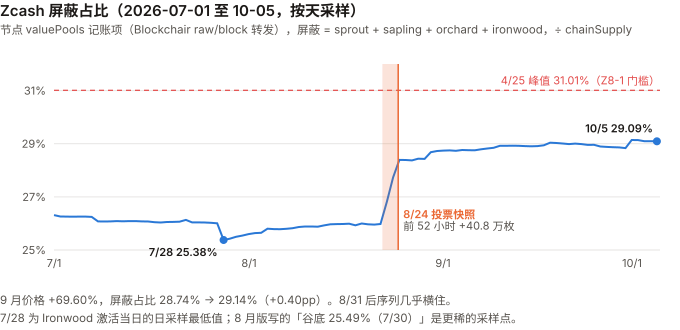
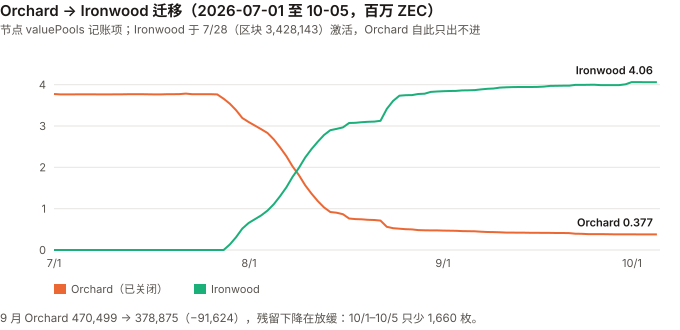

# ZEC / Zcash 完整调研与分析报告

> **编写日期**：2026 年 10 月 5 日
> **数据截止**：2026 年 9 月 30 日（9 月与 Q3 完整数据已闭合）；链上快照取到 10/5
> **版本**：2026 年 9 月版（第二期）**兼 Q3 季度回顾**
> **研究方法**：沿用 8 月首期框架（屏蔽池占比为核心测量对象）。**本期第一次有上期论点可核对**（Z8-1 至 Z8-5，见 3.0）。
> **口径**：本期起价格统一用**币安日线 UTC 收盘**（与本系列其他 9 月版相同）；8 月首期用 CoinGecko 快照，8 月涨幅按新口径为 **+85.30%**（原 +82.88%）。链上数据全部来自节点 `valuePools` / `chainSupply` 记账项（Blockchair `raw/block` 原样转发）。
>
> ⚠️ **利益相关声明（沿用 8 月版）**：本系列核心事件——Orchard 电路漏洞——由安全研究员借助 Anthropic 的模型发现，而本报告也由 Anthropic 的模型撰写。**本期该事件已不是主线**，但 4.2 与 10.4 #2 重新解读了漏洞后的「恢复」。**偏向的方向**：若本报告倾向于放大漏洞冲击、贬低恢复，读者应向反方向调整——这两处是需要额外怀疑的地方。
>
> **本版更新要点**：
>
> 1. **9 月 +69.60%、Q3 +260.05%**（$399.50 → $1,438.41）。**Q3 涨幅是本系列 9 月版里最大的**（UNI +219.73% 次之）；9 月与 UNI（+69.76%）几乎并列。按对数收益扣掉 BTC 的 beta 后，9 月约 **1.1 个标准差**、Q3 约 **1.4 个标准差**——**不能排除噪声**。
> 2. **本期最重要的发现：8 月版说的屏蔽占比「恢复」，大部分发生在一个 52 小时窗口里，而这个窗口紧挨着一次持币人投票的资格快照。**
>    NU7 持币人投票按 **区块 3,459,350（8/24 19:18 UTC）** 时的 Ironwood 余额确定资格——**快照区块 8/05 就已公布，规则写明快照后资金可以立刻转走**（社区论坛与投票组织方原文，一手）。本报告逐块读取：**8/22 07:28 → 8/24 11:55，屏蔽总量 +40.8 万枚，屏蔽占比 25.99% → 28.39%**；快照之后流入停止，也没有回流。
>    **8 月版写的「从谷底恢复 +3.36pp」，其中约 2.4pp 来自这 52 小时**，而且约 40 万枚是从透明池新转入的。**这 2.4pp 不是无触发的逐步恢复**（其余约 1.4pp 是平缓回升）；**时点精确对准快照、而不是一天后的 ETF 上市**——最可能与投票资格相关，**但资金来源与持有人动机不可知**。
> 3. **9 月价格 +69.60%，屏蔽占比只从 28.74% 升到 29.14%（+0.40pp）**；距 4 月峰值 31.01% 仍差 1.87pp。**周度同期相关很弱**：减半以来 97 个周度观测里，屏蔽占比周变化与价格周收益的相关系数只有 **0.13**（不显著）；**但「上周价格 → 本周屏蔽占比」的滞后相关 0.22（t≈2.2）与 4 周窗口的 0.53，与 8 月版的读法②（采用度跟随价格）也相容——本期数据不能区分读法①与②**（第 7 章）。
> 4. **机构通道：Grayscale 的 Zcash ETF（ZCSH）8/25 在 NYSE Arca 上市**——**8 月版漏记**。SEC 一手文件显示：6/30 持有 **388,673.68 ZEC**；9/8 DCG 以 **85,705.33 ZEC** 换购约 $1 亿份额；9/29 拆股前 7,989,300 股 × 每股净值 $111.41 ≈ **$8.90 亿**，折合约 **63–64 万 ZEC（约 3.7% 的总供应）**。
> 5. **一手核实了 8 月版标为二手的三件事**：ZIP 271 原文确认 78,750 ZEC 是 **NU6.1 激活时的一次性拨付**（打到 2-of-3 多签地址）；ZIP 208 确认**下次减半在区块 4,406,400**（约 2028 年 11 月）；8 月版「1,046,399 → 1,046,400 补贴 6.25 → 3.125 机制未确认」的答案是——**那就是第一次减半**（Blossom 把出块从 150 秒改为 75 秒，每块补贴先折半成 6.25）。
> 6. **NU7（25 秒出块）**：ZIP 218 原文写明每块补贴同时除以 3，**单位时间发行不变**——与 GRAM 期「提速即放水」的情形相反。持币人投票 99.9% 支持（二手），测试网 10/4 激活，主网计划 11/5（二手，激活高度 10/20 才定）。
> 7. **监管（8 月版完全缺失，本期补上）**：交易所 API 一手核对——ZEC 在币安、OKX、Coinbase（ZEC-USD）、Kraken 仍可交易；**Coinbase 已下架 ZEC-USDC 与 ZEC-BTC**；**币安的 XMR 交易对状态为 BREAK（停止交易）**。欧盟 AMLR 2027-07-10 起的限制本报告**未能打开 EUR-Lex 原文**（网站对脚本返回空页），标为二手。
>
> **免责声明**：本报告不构成任何投资建议。所有分析仅供研究参考，投资决策请咨询专业顾问。

---

## 核心结论摘要（一页速览）

| 维度 | 核心判断 |
|------|----------|
| **ZEC 是什么** | 一条把「隐私」做成产品的 PoW 链，21,000,000 枚硬顶、约四年减半，与 BTC 同构；差别是透明池与屏蔽池两套账 |
| **当前价格位置** | **$1,438.41**（9/30 币安收盘），市值约 **$244.0 亿**（9/30 链上总供应 16,961,500 × 收盘价；CoinGecko 10/5 排名第 10） |
| **9 月 / Q3 表现** | **9 月 +69.60%、Q3 +260.05%**，YTD +180.77%。超出 BTC beta 预期：9 月约 1.1 个标准差、Q3 约 1.4 个，**不能排除噪声** |
| **本期最重要的发现** | **8 月版的「恢复」大半来自（事先公布的）投票快照前 52 小时的集中屏蔽**（+40.8 万枚，+2.4pp，约 40 万来自透明池）；资金来源与动机不可知；9 月价格 +69.60%，屏蔽占比只 +0.40pp |
| **屏蔽占比** | **29.14%**（9/30，4,942,688 ZEC ≈ $71.1 亿）。4 月峰值 31.01% 仍未收复；**日采样的最低点是 7/28 的 25.38%**（8 月版写 7/30 的 25.49%，采样更稀） |
| **价格与屏蔽占比** | 周度同期相关 **0.13**（97 周，不显著）；滞后（价格领先一周）0.22、4 周 0.53——**同期几乎无关，但与「采用跟随价格」也相容；本期不能区分** |
| **机构通道** | ZCSH 持有约 **63–64 万 ZEC（约 3.7% 供应）**，Q3 增加约 25 万枚，其中 DCG 一笔 85,705 枚（SEC 一手） |
| **发行** | 区块补贴 **1.5625 ZEC**，年增发约 **3.87%**；下次减半区块 **4,406,400**（约 2028-11）；NU7 若按 ZIP 218 激活，**每块补贴变为约 0.5208、单位时间发行不变** |
| **开发基金** | `lockbox` **66,674.25 ZEC**（9/30，≈ $9,590 万），**78,750 枚一次性拨付后没有新的拨付机制**（ZIP 271 只列备选方案） |
| **链上费用** | 9 月 **109.28 ZEC**（≈ $14.4 万），交易笔数是 8 月的 2.7 倍；**只占当月区块补贴的 0.20%** |
| **核心多头逻辑** | ETF 通道打开且有大额实物申购；减半与 NU7 发行规则透明且有原文；Orchard 迁移已完成约 90%；屏蔽占比在快照后维持在 29% 左右（判别力弱） |
| **核心空头逻辑** | 屏蔽占比不能用作短期价格信号（周度同期相关 0.13）；它可被投票激励、托管等非「采用」因素移动；年增发 3.87%；Coinbase 已下架 ZEC 两个交易对、XMR 在币安停止交易（同类先例）；ZCSH 关联方 DCG 的矿池约占全网算力 15.4% |
| **估值立场** | **不给目标价**（同 8 月版）；本期尝试了屏蔽池「净流入加权价格」（约 $157），**它不是成本基准**，原因见 8.3 |
| **风险等级** | 高。年化波动 9 月 153.0%、过去一年 156.2%；beta 1.5，R² 只有 0.19 |

---

## 1. Zcash 是什么

> 完整背景见 8 月首期第 1 章。本期只保留理解新内容所需的部分，并补上 8 月版遗留的两处原文核对。

### 1.1 与 BTC 同构的货币政策，加上两套账

| 维度 | ZEC | BTC |
|------|------|------|
| 供应上限 | 21,000,000 | 21,000,000 |
| 共识 | PoW（Equihash） | PoW（SHA-256） |
| 当前区块补贴 | **1.5625 ZEC**（75 秒一块） | 3.125 BTC（10 分钟一块） |
| 账本 | **透明池 + 屏蔽池** | 单一透明账本 |
| 开发基金 | **有**（补贴的 12% 进 `lockbox`，8% 给社区资助 ZCG） | 无 |

### 1.2 减半规则：8 月版的两个空白，本期用协议原文补上

**ZIP 208 原文**（GitHub `zcash/zips`，一手）：Blossom 升级把出块间隔从 150 秒改为 75 秒，`PostBlossomHalvingInterval = floor(840,000 × 2) = 1,680,000` 区块，每块补贴同时除以 2，**以保持单位时间发行与减半日期不变**。

| 区块 | 发生了什么 | 每块补贴 |
|---:|------|:---:|
| 653,600（2019-12） | Blossom：出块 150 秒 → 75 秒 | 12.5 → **6.25**（单位时间发行不变） |
| **1,046,400**（2020-11） | **第一次减半** | 6.25 → **3.125** |
| **2,726,400**（2024-11-23） | 第二次减半 | 3.125 → **1.5625** |
| **4,406,400**（约 2028-11，**仅在 NU7 不激活时成立**） | **第三次减半**（2,726,400 + 1,680,000） | → 0.78125 |

> **8 月版写「1,046,399 → 1,046,400 补贴 6.25 → 3.125，机制未确认」——它就是第一次减半。** 8 月版的 12.5 来自 Blossom 之前的采样点，而 Blossom 把每块补贴先折半成 6.25，8 月版没有采到中间这一段。
> **下次减半的日期按 75 秒推算**：从 9/30 的区块 3,501,995 起还有 904,405 块，约 785 天，**约 2028 年 11 月下旬**。⚠️ **NU7 若激活，减半的区块高度会变**（激活后剩余区块按 25 秒、间隔 5,040,000 重算），**但 ZIP 218 的设计使日期大致不变**（1.4）——**「4,406,400」只在 NU7 不激活时是减半高度**（Codex 审查指出）。

### 1.3 开发基金：ZIP 271 原文

**ZIP 271《Dev Fund Extension and One-Time Disbursement》原文**（一手）：

- NU6.1 激活时，把 lockbox 的**全部余额一次性**支付到一个 **2-of-3 P2SH 多签地址**（持钥方为 Zcash Foundation、Electric Coin Company 等）；
- 原文写明该金额**在主网必须为 78,750 ZEC**——与 8 月版二分法定位到区块 3,146,400 的 78,750.00 枚完全一致；
- **激活之后继续累积进 lockbox 的资金，ZIP 271 只列出「多种可选的分配机制」，没有定下任何一种**；该 ZIP 状态仍为 Proposed。

**链上读数**：9/30 lockbox **66,674.25 ZEC** = (3,501,995 − 3,146,400) × 0.1875 + 0.19，与「每块 0.1875、期间无拨付」完全吻合。

> **含义**：8 月版撤回「420,000 区块周期」是对的——**它不是周期，是一次性的**。现在这 6.67 万枚（≈ $9,590 万）**没有已定义的拨付时点和机制**；它在协议里锁着，直到有新的 ZIP 定下规则。

### 1.4 NU7：25 秒出块，但发行不变

**ZIP 218《25-second Block Target Spacing》原文**（一手，状态 Draft）：

- 出块目标从 75 秒改为 **25 秒**；
- **每块补贴再除以 3**（公式中加入 `NU7PoWTargetSpacingRatio`），原文：使「**单位挂钟时间的总发行保持不变**」；
- 减半间隔放大为 **5,040,000 块**，减半日期不变；取整带来的发行差异为亿分之一 ZEC 量级。

> **与 GRAM 期的对照（本系列最直接的一次）**：TON 在 2026-04 把出块从 2.4 秒提到 0.4 秒，**每块奖励没改**，年化发行因此放大 5.85 倍，且没有出现在任何货币政策讨论里。
> **Zcash 的 ZIP 218 把「出块速度」和「每块补贴」写在同一份规范里一起改**——这正是 GRAM 期那条规则（「按块发放的链，提速就是一次货币政策变更」）要求的做法。
> ⚠️ **但它目前只是规范文本**。主网是否按此执行，要等激活后读 `chainSupply.valueDelta` 才知道——本期登记为 Z9-1。

---

## 2. ZEC 的发展阶段划分

> 阶段一至四见 8 月首期。阶段五追加本期事件。

### 阶段五：漏洞、迁移、投票与 ETF（2026-05– 至今）

| 日期 | 事件 | 核实等级 |
|------|------|:---:|
| 2026-06-04 | Orchard 电路伪造漏洞公开披露 | ⚠️ 二手 |
| 2026-06-26 起 | Grayscale Zcash Trust 申请转为 ETF（S-3 及修订，SEC） | ✅ SEC 一手 |
| **2026-07-28** | **Ironwood（NU6.3）激活，区块 3,428,143；当日屏蔽占比日采样最低 25.38%** | ✅ 链上 |
| **2026-08-22 07:28 → 08-24 11:55** | **屏蔽总量 +40.8 万枚（25.99% → 28.39%）** | ✅ 链上 |
| **2026-08-05** | **NU7 持币人投票公告：快照区块 3,459,350，按 Ironwood 余额定资格，快照后资金可立即转走** | ✅ 社区论坛发起帖原文 |
| **2026-08-24 19:18** | **快照区块 3,459,350** | ✅ 链上 |
| **2026-08-25** | **ZCSH 在 NYSE Arca 上市**（S-3 8/24 生效） | ✅ SEC 一手 |
| **2026-09-08** | DCG 以 85,705.33 ZEC 换购约 $1 亿 ZCSH 份额 | ✅ SEC 8-K |
| 2026-09-14 | NU7 投票截止：约 240 万 ZEC 参与，99.9% 支持 25 秒出块、98.9% 支持保留减半时间表、约 97% 支持 2031-02 开始 NSM 再发行 | ⚠️ 二手 |
| 2026-09-16 | ZEC 单日 **+20.5%**（9 月唯一一个超过 20% 的交易日） | ✅ 币安 |
| 2026-09-24 | Bitget 被盗约 $3.875 亿；据报道部分资金（约 2,746 ZEC）9/30 转入 Ironwood | ⚠️ 二手，**屏蔽转入无法在链上归属** |
| **2026-09-26** | 9 月收盘高点 **$1,653.12**（盘中 $1,698.00） | ✅ 币安 |
| 2026-09-30 | ZCSH 1 拆 3 生效；当日据报单日赎回约 $3,025 万 | ✅ 拆股为 SEC 一手；赎回额二手 |
| 2026-10-04 | NU7 在测试网激活（晚于本期数据截止） | ⚠️ 二手 |

---

## 3. ZEC 当前现状

### 3.0 论点校验：8 月版登记的 5 条

> 8 月版登记的 Z8-1 至 Z8-5 **都未到检验窗口**（最早 2027-03-08）。下表记录中期读数，**不做判定**。

| # | 论点 | 检验条件（摘要） | 9 月读数 | 状态 |
|---|------|------|------|------|
| Z8-1 | ⚑ 屏蔽占比会恢复到 31.01% 之上 | 2027-03-08 前未站上 31.01% 且无单个 4 小时窗口净流入 >20 万枚，则错 | **9 月最高 29.14%（9/30）**；登记后最大单日净流入 +5.2 万（9/30） | ⏳。⚠️ **构念警示（两侧对称）**：屏蔽占比可被投票资格快照推动（4.2），**若靠下一次快照站上 31.01% 或靠 4 小时脉冲豁免，须注明窗口内有无快照**；若 ETF 净申购 >17 万枚且以透明方式托管，可能压低占比，**判 ❌ 时同样须注明**。快照前窗口实测最大 4 小时净流入 13.7 万枚（未达 20 万，且早于登记日） |
| Z8-2 | Orchard 残留会被基本清空 | 2027-03-08 时 Orchard > 100,000 则错 | **378,875**（9/30）；10/1–10/5 只少 1,660 枚 | ⏳ **方向不利**：下降明显放缓 |
| Z8-3 | 区块补贴维持 1.5625 | 2027-03-08 时 `valueDelta` ≠ 1.5625 则错 | **1.5625**（9/30） | ⏳。⚠️ **NU7 若在检验日前激活，被测量的参数会按协议计划改变**——记分卡改为：激活则 **⊘**（不计入正确率），未激活则按字面判；发行是否不变由 Z9-1 单独检验 |
| Z8-4 | ⚑ 不会再发现同类电路漏洞（条件式） | 有独立审计且无严重问题则 ✅；再披露严重漏洞则 ❌；否则不判 | **9 月未见新的屏蔽池完整性漏洞披露**（检索范围：Zcash 社区与主要加密媒体，WebSearch）；也未见完成的独立第三方电路审计 | ⏳ |
| Z8-5 | 波动主要来自自身事件 | 2027-09-09 时一年 R² > 40% 且年化波动未跌破 110%，则错 | **一年 R² 0.193、年化波动 156.2%**（币安） | ⏳ 远离门槛 |

### 3.1 价格与市场

| 指标 | 数值 | 口径 |
|------|------|------|
| **9/30 收盘** | **$1,438.41** | 币安 ZECUSDT 日线 |
| 市值 | **约 $244.0 亿** | 链上总供应 16,961,500 × 收盘价 |
| CoinGecko 排名 | 第 10（10/5） | CoinGecko API |
| 9 月区间 | 低 **$788.15**（9/2 盘中）/ 高 **$1,698.00**（9/26 盘中）；收盘低 $815.53（9/2）、高 $1,653.12（9/26） | 币安 |
| 9 月日成交额中位数 | **$3.09 亿**（8 月版 $2.09 亿为 CoinGecko 口径） | 币安 quote volume |
| 历史最高 | $3,191.93（2016-10-28，上线当日，流动性极薄） | CoinGecko |

| 区间 | ZEC | BTC | DASH（另一隐私类资产） |
|------|------|------|------|
| **9 月**（8/31 → 9/30） | **+69.60%** | +6.42% | +34.95% |
| **Q3**（6/30 → 9/30） | **+260.05%** | +42.64% | +86.17% |
| 8 月（币安口径，更正 8 月版） | +85.30% | +24.95% | +45.46% |
| YTD | +180.77% | −4.59% | +45.42% |
| 近 1 年（2025-09-30 起） | **+1,835%** | −26.68% | +170.45% |

**beta、R² 与噪声带**（对数收益）：

| 窗口 | 年化波动 | 对 BTC beta | R² | 对数残差 | 1 个标准差 | **约几个标准差** |
|------|------|------|------|------|------|------|
| 9 月 | 153.0% | 1.496 | 0.162 | +0.435 | 0.402 | **约 1.1** |
| Q3 | 118.9% | 1.702 | 0.297 | +0.677 | 0.500 | **约 1.4** |
| 近 1 年 | 156.2% | 1.523 | 0.193 | +3.435 | 1.403 | 约 2.4 |

> **读法**：R² 只有 0.16–0.30，BTC 只能解释 ZEC 两成左右的日波动；**9 月和 Q3 的超额都在 1.5 个标准差以内，不能断言是 ZEC 自己的行情**。近一年的 2.4 个标准差是本系列少见的量级，但它包含 2025-10 的单月暴涨（7.2 的 2025-09-27 窗口）——**该窗口贡献了一年残差的约四成（39%）**。
> 9 月单日涨跌超过 20% 的只有 **9/16（+20.5%）**——NU7 投票结果公布的同一天（二手报道）。**本报告不做归因**：同日还有美联储议息，且 ZEC 近一年有 13 天单日涨跌超过 20%。

### 3.2 发行与链上费用

| 指标 | 9 月 | 来源 |
|------|------|------|
| 区块补贴 | **1.5625 ZEC**（9/30 `valueDelta`） | ✅ 链上 |
| 9 月出块 | 34,405 块（区块 3,467,591 → 3,501,995） | ✅ 链上 |
| 9 月新发行 | **53,757.8 ZEC**（= 34,405 × 1.5625，与 `chainSupply` 增量一致） | ✅ 链上 |
| 年增发 | 约 657,000 ZEC = **3.87%** | 计算 |
| **9 月链上手续费** | **109.28 ZEC**（≈ $14.4 万） | Coin Metrics `FeeTotNtv`（DefiLlama 适配器即读此字段，已读源码确认） |
| 9 月交易笔数 | **363,167**（日均 12,105；8 月 140,220、日均 4,523） | Coin Metrics `TxCnt` |
| 平均每笔手续费 | 0.000301 ZEC（8 月 0.000426） | 计算 |
| **手续费 ÷ 区块补贴** | **0.20%** | 计算 |

> **交易笔数 9 月是 8 月的 2.7 倍，手续费只是 1.8 倍**——每笔费用在下降，说明增量主要是低费用交易。**增量的来源本报告没有拆分**（不知道是支付、交易所归集、投票相关操作还是刷量），不做解读。
> ⚠️ **口径提醒**：8 月版引用的「全网约 12,690 笔/日」来自 Blockchair `/stats`，与 Coin Metrics 的口径不同（8 月 Coin Metrics 日均 4,523），**两者不可混用**。
> **量级**：手续费只有区块补贴的 0.2%。**矿工收入几乎全部来自发行**，8 月版「持币人对费用没有索取权」这个论证在量级上也无关紧要——**费用本身可以忽略**。NU7 的 NSM（网络可持续机制，把部分手续费移出流通、2031 年起再发行）**按当前费用量级，对供应的影响也可以忽略**。

### 3.3 屏蔽池：9 月的读数

**六个池的余额**（节点 `valuePools`，区块 3,501,995，9/30 23:59 UTC）：

| 池 | 9/30 | 8/31（区块 3,467,590） | 9 月变化 |
|------|---:|---:|---:|
| transparent | 11,952,137.71（70.47%） | 11,988,216.80 | −36,079 |
| sprout | 22,310.78 | 22,591.46 | **−280.68** |
| sapling | 478,714.53 | 524,781.69 | −46,067 |
| orchard（已关闭） | **378,875.32** | 470,499.48 | **−91,624** |
| **ironwood** | **4,062,787.58** | 3,841,429.62 | **+221,358** |
| lockbox | 66,674.25 | 60,223.31 | +6,451 |
| **合计 = chainSupply** | **16,961,500.17** | 16,907,742.35 | +53,758 |
| **屏蔽合计** | **4,942,688.21 = 29.14%** | 4,859,302.24 = 28.74% | **+83,386 / +0.40pp** |

> **两项内部一致性检验均通过**：六池合计与 `chainSupply` 差 0.000000（8/31、9/30、6/30 三个时点）；9 月供应增量 53,758 = 出块数 × 1.5625。
> ⚠️ 全部池数据仍来自同一个接口（Blockchair 转发的节点字段），**不是独立节点验证**。
>
> **两处值得记录的小变化**：① **Sprout（2016 年第一代池，8 月版称「搁浅资金」）9 月流出 280.68 枚**——搁浅了多年的资金在被取出，说明「搁浅」不等于「永久丢失」，这与 Z8-2 的判断有关；② Sapling 9 月流出 46,067 枚，Ironwood 的增量里有一部分来自 Sapling 迁移，**不全是新屏蔽的资金**。

### 3.4 宏观环境

> 与 BTC 9 月版共用（美联储 9/16 加息 25bp 至 3.75–4.00%，10 年期美债 5.29%，一手）。**ZEC 对 BTC 的 R² 只有约 0.19，宏观经 BTC 传导的解释力很弱。**

### 3.5 机构通道与监管（本期新增；8 月版完全缺失）

**① ETF：Grayscale 的 Zcash ETF（ZCSH）**（SEC EDGAR，一手）

| 时点 | 事件 / 数据 | 文件 |
|------|------|------|
| 6/30 | 持有 **388,673.68 ZEC**，成本 $4,732 万，公允价值 $1.553 亿；4,829,300 股，每股净值 $32.15 | 10-Q |
| 8/24 | S-3 生效（EFFECT），NYSE Arca 上市登记（8-A12B） | SEC |
| **8/25** | **在 NYSE Arca 上市交易**（此前在 OTCQX） | 424B3 |
| **9/8** | **DCG 通过授权参与人以 85,705.33 ZEC 换购约 $1 亿份额**（原意向约 20 万枚） | 8-K |
| 9/30 | 1 拆 3 生效：**拆股前 7,989,300 股、每股净值 $111.41**；拆股后 23,967,900 股、每股 $37.14 | 8-K |

**由此推算 9/29 的持仓（粗估，不是 SEC 披露的持币数）**：每股含币量 6/30 为 0.080483 ZEC，**按年化 2.5%、以 ZEC 支付的管理费（10-Q 一手）**扣减一个季度后约 0.0800 → 约 63.9 万；按每股净值 $111.41 ÷ 9/29 币安收盘 $1,417.36 反推约 62.8 万（定价时点与口径不同）。→ **约 63–64 万 ZEC，约占总供应 3.7%**；Q3 增加约 24–25 万枚，其中 DCG 一笔占三分之一以上。**实际持仓以 Q3 10-Q 为准。**

> **托管**（424B3、10-Q 一手）：托管人为 **Coinbase Custody Trust Company**，私钥冷存储。⚠️ **以透明还是屏蔽地址持币，申报文件没有写**。**若以透明方式托管，ETF 每申购 17 万枚就会把屏蔽占比压低约 1 个百分点**——这是 8 月版 1.2 所说「交易所/托管方持仓会扭曲比率」的一个具体、可观测的来源。

**② 交易所渠道**（各交易所公开 API，**10/5 单一时点**一手实测；下架发生的时间本报告未查，**不能据此说「正在收窄」**）

| 交易所 | ZEC | 其他隐私类资产 |
|------|------|------|
| 币安 | ZEC/USDT、ZEC/BTC **TRADING** | **XMR/USDT 状态 BREAK**（币安日线止于 2024-02-20）；DASH TRADING |
| OKX | ZEC-USDT、ZEC-USDC、**ZEC-EUR** live | DASH live；无 XMR |
| Coinbase | **ZEC-USD online；ZEC-USDC、ZEC-BTC 已下架（delisted）** | DASH online |
| Kraken | ZEC-EUR online | XMR 多个交易对 online |

> **能说的**：ZEC 在主要交易所仍可交易；**Coinbase 上 ZEC 只剩 ZEC-USD**（另两对已下架，时点未查）；XMR 在币安已停止交易——**同类资产的下架先例是存在的**。
> ⚠️ 媒体报道「OKX 收紧 ZEC 支持」——**OKX API 显示 ZEC 三个交易对均 live，本报告不采信该说法**。

**③ 欧盟 AMLR**：多家媒体称欧盟反洗钱条例（Regulation (EU) 2024/1624）自 **2027-07-10** 起禁止加密资产服务商处理「增强匿名性」的资产。**本报告尝试打开 EUR-Lex 原文三次（HTML、PDF、出版局地址），网站均返回空页或 404**，因此**该条款的确切措辞与适用范围标为 ⚠️ 二手**。⚠️ **领域审查（Codex）称已读到原文**：定义**明确包括可选匿名功能**的资产，但第 79 条针对的是服务商**维持允许匿名或增加交易模糊性的账户**，**不能简写成「全面禁止处理 ZEC」**——本报告未能独立打开原文核对，**按这个更窄的读法写入**。

**④ 矿工集中度（424B3 一手，8 月版列为缺口）**：招募书写明，**ZCSH 发起人的关联方 DCG 经营的 ZEC 矿池约占 2026 年 7 月 Zcash 全网算力的 15.4%**，并提示 DCG 可能优先考虑自身利益。**同一集团既是最大的 ETF 申购方之一（9/8 的 85,705 枚）、又经营约六分之一的算力**——这是一个需要跟踪的集中度与利益冲突点。

**⑤ 美国**：ZCSH 的 S-3 已生效并在交易所上市——**美国注册公开发行的通道已经打开**（SEC 一手）。媒体称 SEC 对 Zcash Foundation 的调查已结束未采取行动（**二手**）。

### 3.6 Q3 季度回顾

| | Q2 2026 | **Q3 2026** |
|------|------|------|
| ZEC 季度涨跌（币安） | — | **+260.05%** |
| 季末屏蔽占比 | 26.31%（6/30） | **29.14%**（9/30），+2.83pp |
| 其中投票快照前 52 小时 | — | **+2.40pp**（8/22–8/24） |
| 季内最低（日采样） | — | 25.38%（7/28） |
| Orchard → Ironwood | Orchard 3,773,138 | Orchard 378,875 / Ironwood 4,062,788 |
| ZCSH 持仓 | 388,674 ZEC | 约 63–64 万 ZEC |
| 链上手续费（ZEC） | — | 7 月 50.8 / 8 月 59.8 / 9 月 109.3 |

**一句话**：**Q3 是 ZEC 价格涨了 3.6 倍、屏蔽占比回升 2.8pp 的季度——但回升的大部分集中在一次投票资格快照之前，价格的大部分涨幅与屏蔽占比的变化在时间上对不上。**

---

## 4. 屏蔽池：从「恢复」到「快照」（本期核心章）

### 4.1 日采样的屏蔽占比

> 图中数字：7/28 日采样最低 25.38%；8/24 投票快照，前 52 小时 +40.8 万枚；10/5 为 29.09%；红虚线为 4/25 峰值 31.01%（Z8-1 门槛）；纵轴刻度 25% / 27% / 29% / 31%；横轴 7/1、8/1、9/1、10/1。

**本期把采样从 8 月版的 8–27 天一个点加密到每天一个点**（7/1–10/5，97 个点）：

| 时点（UTC） | 区块 | 屏蔽合计 | 屏蔽占比 |
|------|---:|---:|:---:|
| 6/30 23:58 | 3,396,508 | 4,419,574 | 26.31% |
| **7/28 00:03**（Ironwood 激活当日） | 3,427,467 | 4,274,960 | **25.38%（日采样最低）** |
| 8/20 03:15 | 3,454,000 | 4,384,863 | 25.97% |
| 8/22 07:28 | 3,456,500 | 4,389,215 | 25.99% |
| 8/23 15:00 | 3,458,000 | 4,680,359 | 27.71% |
| 8/24 11:55 | 3,459,000 | 4,797,201 | 28.40% |
| **8/24 19:18（投票快照区块）** | **3,459,350** | **4,796,835** | **28.39%** |
| 8/27 02:54 | 3,462,000 | 4,803,435 | 28.42% |
| 8/31 23:59 | 3,467,590 | 4,859,302 | 28.74% |
| 9/30 23:59 | 3,501,995 | 4,942,688 | **29.14%（9 月日采样最高）** |
| 10/5 00:02 | 3,506,581 | 4,936,328 | 29.09% |

> ⚠️ **更正 8 月版的谷底**：8 月版写「谷底 25.49%（7/30）」——**日采样显示 7/28 为 25.38%，更低**。8 月版的采样点在 7/12 和 7/30，跨过了这一天。**真实的最低值可能更低**（日采样仍会漏掉日内低点），本报告只能说「日采样最低 25.38%」。
> 这是 ZEC 首期「极值断言必须回到数据复算」教训的又一次：**这次不是读错了表，是表的采样太稀。**

### 4.2 52 小时、40.8 万枚：一次与投票快照重合的集中屏蔽

| 区间 | 屏蔽总量变化 | 占比变化 |
|------|---:|:---:|
| 8/22 07:28 → 8/24 11:55（约 52 小时） | **+407,986** | 25.99% → 28.40% |
| 8/24 11:55 → 19:18（快照前约 7 小时） | −366 | 不变 |
| **8/24 19:18 → 8/31 23:59（快照后一周）** | +62,467 | 28.39% → 28.74% |

**投票的规则**（**一手**：Zcash 社区论坛 8/05 的发起帖、投票组织方 zcashlabs.org/voting 页面原文）：
- 「eligible voters need spendable shielded funds in **Ironwood** at Mainnet block height **3459350**, approximately August 24, 2026 at 19:00 UTC」——**快照区块提前 19 天公布**；
- 「**Funds can be moved immediately after the snapshot**」——**快照后可以立刻转走**；
- 透明池、Orchard、Sapling 里的 ZEC 和交易所里的 ZEC **都没有资格**，必须先转进 Ironwood 自托管。

**本报告的链上印证**：快照区块的 Ironwood 余额为 **3,731,959**，约 240 万投票量（二手）约占 **64%**，与报道的「约 66%」相符。

**52 小时里资金从哪来**（同一组区块读数）：

| 池 | 8/22 07:28 → 8/24 11:55 |
|------|---:|
| Orchard | −151,512 |
| **Ironwood** | **+561,748** |
| 屏蔽合计 | **+407,986** |
| transparent（含期间新发行） | 约 −404,000 |

> **Ironwood 的增量里约 15 万来自 Orchard 迁移，约 40 万来自透明池**——也就是从交易所或透明地址**新转入屏蔽状态**的资金。

**这条证据能区分什么、不能区分什么**（ZEC 期「不判别的证据不能用来表态」规则）：

| 假设 | 它预测的形态 | 实测 | 本期判别力 |
|------|------|------|:---:|
| A：无触发的逐步恢复 | 数周内较平缓的回升 | 这 2.4pp 集中在 52 小时 | **对这 2.4pp 基本排除**；其余约 1.4pp（7/28→8/22 +0.61pp、快照后→9/30 +0.75pp）是平缓回升，**A 对它们仍然成立** |
| B：为取得投票资格而屏蔽 | 快照（8/05 已公布）前集中流入，快照后停止 | ✅ 流入止于快照前约 7 小时 | 时点证据**偏向 B** |
| D：ETF 上市（8/25）带来的托管调整 | 与上市日对齐的大额屏蔽 | 流入止于**快照**前 7 小时，不是对准上市日；Q3 ETF 新增约 24–25 万枚、且 DCG 的 8.6 万枚在 9/8，**新增量撑不起 40 万** | 只剩一个版本未被排除：**托管人把既有约 39 万枚改为屏蔽托管**——量级恰好吻合，**列为需要核实** |
| E：单一大额持有人或交易所的运营性归集 | 少数几个时段的大额跳升 | 52 小时里有三个 4 小时窗口占大部分（+13.7 万、+9.6 万、+9.1 万） | 不能排除——**8 月版测到的流出也是时间集中的，这是它的镜像** |
| 注：「6–7 月撤出的资金回流」 | — | 新屏蔽只能来自透明池，**B、D、E 都预测同样的来源**；ZEC 同质、无交易级流向数据 | **不可观测**，不作为独立假设（初稿写作「最可能是 B+C」，审查后撤回） |
| 注：Orchard → Ironwood 池间迁移 | — | 只解释约 15 万 | 初稿写成「合计必然不变」的稻草人，Codex 审查后改为按池拆分 |

> **能说的**：8 月版写的「屏蔽占比从谷底恢复了约一半」，**其中约 2.4pp 发生在一个紧贴（事先公布的）投票快照的 52 小时窗口内**；**时点对准快照而不是 ETF 上市**，最可能与投票资格相关。
> **不能说的**：资金来源与持有人动机；B 与 E、以及 D 的托管变更版本之间没有判别证据。
> **「快照后没有回流」没有判别力**：留在屏蔽池对 B（惯性、手续费、保留下次投票资格）、D、E 都同样自然，**它只能排除「临时借来、事后必须归还」这一个窄版本**。初稿据此写「不是虚假回升」，审查后撤回——**本期数据无法判断这 40 万枚是否反映采用**。
> **对 8 月版的影响**：8 月版以「恢复约一半」列为多头 #1（四星）；8 月 7.2 已声明这段回升「对信心零信息量」。本期据时点证据把多头 #1 改写并降为两星。

### 4.3 9 月：价格 +69.60%，屏蔽占比 +0.40pp

| 9 月 | 值 |
|------|---|
| 价格 | $848.10 → $1,438.41（**+69.60%**） |
| 屏蔽占比 | 28.74% → 29.14%（**+0.40pp**） |
| 屏蔽合计 | +83,386 枚，其中 9/30 一天 +52,201 |
| 最大单日流出 | 9/26 −10,686 |

> **9 月全月的屏蔽增量里有六成来自月末最后一天**；其余 29 天几乎横住。**价格在同一个月涨了七成。**
> 8 月版 9.3 的说明段落指出：**「比率横住、价格自行其是」不触发 8 月版的任何阈值**。本期 9 月单月正是这个形态；本期在 9.3 补上对应的监控行。

### 4.4 迁移：Orchard 残留在放缓

> 图中数字：10/5 Ironwood 4.06、Orchard 0.377（百万 ZEC）；纵轴刻度 0 / 1 / 2 / 3 / 4；横轴 7/1、8/1、9/1、10/1。

| 日期 | Orchard | Ironwood | Orchard 当期流出 |
|------|---:|---:|---:|
| 7/28 | 3,660,101 | 0 | — |
| 8/31 | 470,499 | 3,841,430 | — |
| 9/30 | **378,875** | **4,062,788** | 9 月 −91,624 |
| 10/5 | 377,215 | 4,059,868 | 5 天 −1,660 |

> **以 7/28 的 366 万枚为基数，迁移已完成约 89.7%**；但**最后 5 天只迁出 1,660 枚，日均 332 枚**——按这个速度，降到 Z8-2 的 10 万枚门槛需要两年以上。
> Sprout 至今仍有 22,311 枚（八年前的池），但本期也看到它在流出（3.3）。**残留会不会像 Sprout 一样长期搁浅，是 Z8-2 真正在赌的东西。**

---

## 5. 发行与供应

> 8 月版第 5 章的同构/不同构分析不变。本期新增的一手核对见 1.2–1.4。

| 维度 | ZEC | BTC |
|------|---:|---:|
| 当前流通（链上总供应） | 16,961,500（**80.77%**） | 约 95.6% |
| 当前区块补贴 | 1.5625（75 秒） | 3.125（10 分钟） |
| 年增发率 | **3.87%** | 约 0.83% |
| 下次减半 | **约 2028-11**（NU7 不激活时为区块 4,406,400） | 约 2028-04 |
| 开发基金累积 | 每块 0.1875（12%）进 lockbox；另 8% 给 ZCG | 无 |

> **ZIP 218 若激活**：每块 1.5625 → 约 0.5208，出块 75 秒 → 25 秒，**年增发率仍是 3.87%**；减半日期不变。
> **开发基金每年流入 lockbox 约 78,840 枚（≈ $1.13 亿，按 9/30 价格）**，而**这些钱目前没有已定义的使用机制**（1.3）。

---

## 6. ZEC 与其他资产的比较

> **口径**：币安日线 UTC 收盘，同一次 API 调用取得；8/31 → 9/30、6/30 → 9/30；R² 统一为 2025-09-30 → 2026-09-30 日对数收益（**与各资产 9 月版里的窗口不同，不可混比**）。

| 资产 | **9 月** | **Q3** | 近 1 年 | 对 BTC R²（一年，统一窗口） | 持有人回报来源 |
|------|---:|---:|---:|:---:|------|
| **ZEC** | **+69.60%** | **+260.05%** | **+1,835%** | **0.19** | 无（PoW，发行归矿工与开发基金） |
| UNI | +69.76% | +219.73% | +16.24% | 0.40 | 销毁 |
| DASH | +34.95% | +86.17% | +170.45% | **0.18** | — |
| ADA | +24.67% | +70.78% | −69.45% | 0.65 | 质押 |
| SOL | +14.61% | +60.34% | −43.40% | 0.76 | 质押 |
| BNB | +11.26% | +40.76% | −23.72% | 0.59 | 销毁 |
| ETH | +8.85% | +70.86% | −35.20% | 0.82 | 质押 |
| BTC | +6.42% | +42.64% | −26.68% | — | 无 |

> **Q3 ZEC 是这八个里最高的**；9 月与 UNI 几乎并列（UNI 高 0.16pp）。
> **R² 最低的两个是两个隐私类资产：DASH（0.18）与 ZEC（0.19）**——BTC 只能解释它们不到两成的日波动。⚠️ 初稿写成「ZEC 与 UNI」，统一窗口重算后 UNI 是 0.40，已更正。
> **ZEC 的价格不仅和 BTC 关系弱，和它自己的核心指标（屏蔽占比）在周度上也几乎无关**（第 7 章）——**它的价格驱动因素，本报告目前没有一个可测的候选。**

---

## 7. 价格与屏蔽占比：8 月版问的问题，本期给出数据

### 7.1 8 月版留下的问题

8 月版 7.2 提出两种读法，并说「无法区分」：

| 读法 | 含义 |
|------|------|
| ① 价格反映的是别的东西 | 屏蔽占比不是估值锚，报告第 4、7 章的框架用错了 |
| ② 采用度会跟上 | 屏蔽占比会继续回升，直至超过 31.01% |

8 月版的记分卡写明：「**下期必须单独设计一条真正检验框架的论点**（例如直接测屏蔽占比与价格的滚动相关性）」。

### 7.2 周度相关性（本期新做）

**数据**：2024-11-23（减半日）到 2026-10-05，**98 个周度点**（6 月前为每周一次的节点读数，7 月起取自日采样）；价格为币安日线收盘。

| 检验 | 结果 |
|------|------|
| **屏蔽占比周变化 vs 价格周对数收益** | **相关系数 0.13**（n = 97，t ≈ 1.3，**不显著**） |
| 只剔除已知非采用事件周（8/24 投票快照那一周） | **0.08**（n = 95） |
| 屏蔽占比单周变化 ≥ 1pp 的 10 周**单独**计算 | 0.25（n = 10）。⚠️ 初稿写「剔除这 10 周后约 0.00」——**按自变量幅度剔除会机械压低相关**，且删掉的正是最可能有信号的周，**该数字撤回、不作证据** |
| 屏蔽占比周变化 vs **上一周**的价格收益 | **0.22（t ≈ 2.2，本表唯一在 5% 水平显著的周度结果）** |
| 价格周收益 vs **上一周**的屏蔽占比变化 | 0.07 |
| 4 周窗口（n = 24） | 0.53（t ≈ 2.9）；剔除变动 ≥ 1.5pp 的 6 个窗口后 0.21（n = 18，t ≈ 0.9，同样受幅度剔除影响，信息量很低） |
| 水平值（屏蔽占比 vs 对数价格） | 0.83——⚠️ **两条都是长期上行的序列，水平相关不说明任何关系** |

**4 周窗口里屏蔽占比变动最大的五个**：

| 窗口起点 | 屏蔽占比变化 | 同期价格 |
|------|:---:|:---:|
| 2025-09-27 | **+6.60pp** | **+396%** |
| 2025-02-15 | +3.67pp | 0% |
| 2025-08-02 | +3.16pp | +13% |
| 2026-06-06 | **−3.10pp** | **+27%** |
| 2026-08-01 | +3.09pp | +84% |

> **读法**：
> ① **周度同期相关弱且不显著**（0.13；只剔除快照周后 0.08）——**屏蔽占比不能用作短期价格信号**。
> ② **但有两组数字偏向读法②**：滞后相关（价格领先一周）0.22、t≈2.2；4 周窗口 0.53（其中 2025-10 窗口影响很大，而 2026-06 窗口方向相反）。**「价格先动、屏蔽跟进」正是②（采用度跟随价格）的形态。**
> ③ **本期数据不能区分读法①与②。** 初稿写「这支持读法①」，审查（_bian）指出：②原本就是一个按月计、有滞后的预测，周度同期相关对它没有判别力；而且屏蔽占比本身「脏」（会被快照、托管移动），**测量噪声会系统性压低相关**——空头 #2 本身就能解释空头 #1 的低相关。已撤回。
>
> ⚠️ **三处限制**：① 周度相关低，也可能是因为屏蔽占比是**慢变量**，而价格是快变量——它们可以在更长的尺度上相关，而一年半只有约 6 个不重叠的季度，**样本不足以检验季度尺度**；② 屏蔽占比本身会被非「采用」因素移动（投票快照、ETF 托管方式），**它作为「采用度」的测量比 8 月版设想的更脏**；③ **这不证明「屏蔽占比不重要」**——它只说明「用屏蔽占比解释价格的短期变化」这条路走不通。

### 7.3 由此修订的本报告框架

| 8 月版 | 本期 |
|------|------|
| 屏蔽占比是「最干净的产品采用度指标」 | **它是最干净的「有多少 ZEC 处于屏蔽状态」的测量**；但它会被投票资格、托管方式等非采用因素移动，**作为采用度的代理比 8 月版设想的更脏** |
| 价格与采用度「背离」是本期最想让读者注意的事 | **保留为描述**：9 月「价格大幅变动而屏蔽占比横住」；**但周度同期相关本来就弱，单月的「背离」不构成证据**（初稿撤回「背离」并改用「脱钩」，审查指出两者预设相同，已统一为中性描述） |
| 读法①②无法区分 | **仍无法区分**：同期周度相关弱（不利于把屏蔽占比当短期信号），滞后与 4 周相关与②相容；季度尺度样本不足 |

---

## 8. 核心价值逻辑与估值

**星级编码证据等级**：完全建立在二手转述上的论据不得给到五星。

### 8.1 多头逻辑

| # | 论据 | 强度 | 说明与证据等级 |
|---|------|:---:|------|
| 1 | **屏蔽占比在快照后维持在 29% 左右** | ★★☆☆☆ | ✅ 链上一手。**由 8 月版的「恢复约一半」（四星）改写并降为两星**：回升的大半紧贴事先公布的投票快照（4.2）；**快照后维持对「是否反映采用」没有判别力**（4.2），与记分卡 Z9-x2 的拒绝理由一致 |
| 2 | **机构通道打开：ETF 上市、大额实物申购** | ★★★★☆ | ✅ SEC 一手：ZCSH 约 63–64 万 ZEC、DCG 一笔 85,705 枚。**本月新增**。⚠️ 9/30 起出现赎回（二手） |
| 3 | **货币规则透明且有原文** | ★★★★☆ | ✅ ZIP 208 / 218 / 271 原文：减半区块、NU7 发行等价、开发基金一次性拨付全部可查。**由 8 月版「21M 硬顶 + 减半」改写**，加入了 NU7 的「提速不放水」 |
| 4 | **Orchard 迁移已完成约 90%** | ★★★☆☆ | ✅ 链上一手。**由四星降为三星**：最后 5 天只迁出 1,660 枚，残留下降明显放缓 |
| 5 | **持币人治理参与度高** | ★★☆☆☆ | ⚠️ **二手**（约 240 万 ZEC 参与、约三分之二有资格余额）。快照时点已在链上印证，但票数本身未一手核实 |
| 6 | Q3 +260%、近一年 +1,835% | ★☆☆☆☆ | ✅ 一手。**「涨得多」不是论据** |

### 8.2 空头逻辑

| # | 论据 | 强度 | 说明与证据等级 |
|---|------|:---:|------|
| 1 | **屏蔽占比不能用作短期价格信号** | ★★★☆☆ | ✅ 本报告计算（97 周同期相关 0.13，只剔除快照周后 0.08）。**本月新增**。**三星**：滞后与 4 周相关与「采用跟随价格」相容（7.2），本条不等于「价格与采用度无关」；且与空头 #2 同源（见下） |
| 2 | **屏蔽占比会被非采用因素移动** | ★★★☆☆ | ✅ 链上一手（快照前 52 小时 +40.8 万枚）+ ✅ 投票规则原文（快照区块事先公布）。**本月新增**。含义是：**本报告的核心指标比首期设想的脏** |
| 3 | **年增发 3.87%，是 BTC 的 4.7 倍** | ★★★★★ | ✅ 链上 + ZIP 208（NU7 不改变这一点） |
| 4 | **开发基金 6.67 万枚、每年再进约 7.9 万枚，没有已定义的使用机制** | ★★★★☆ | ✅ 链上 + ZIP 271 原文。**由 8 月版的「每年抽走约 $9,515 万」改写**：问题不只是抽成，而是**抽出来的钱规则未定** |
| 5 | **交易所与监管渠道有下架先例** | ★★★☆☆ | ✅ 交易所 API（10/5 单一时点）：Coinbase 上 ZEC 只剩 ZEC-USD；XMR 在币安停止交易（同类先例）。下架时点未查，不能说「正在收窄」。⚠️ 欧盟 AMLR 原文未能取得（按更窄读法：针对允许匿名的账户）。**本月新增，替代 8 月版的「监管风险（未调研）」** |
| 6 | **波动率 153%–156%、beta 1.5** | ★★★★☆ | ✅ 本报告计算 |

> **多空同源检查**（DOT 期规则）：① 多头 1 与空头 2 来自同一组链上数据（快照前后的屏蔽量），是同一件事的两面；② **空头 2 是空头 1 低相关的一个替代解释**——代理变量越「脏」，它与价格的相关就越会被系统性压低。**两条空头互相解释，不能当成两条独立证据。**
> 多头 2（ETF）与空头 2 也有交叉：**ETF 托管方式未知，它可能正在压低屏蔽占比**（3.5）。

### 8.3 估值：本报告给什么、不给什么

**不给目标价**——**理由是缺乏可信的估值模型与参数**：本系列给 BTC 用的「已实现价格 × MVRV」依赖透明账本的成本基准，**在 ZEC 上因约 29% 的供应处于屏蔽状态而失效**（本期已尝试，见下）。另外，现金流法也不适用（持币人对费用无索取权，且费用只占区块补贴的 0.2%）——**但这一条不是承重理由**：BTC 同样没有费用索取权，本系列照样给出了估值框架。

**8 月版承诺的「屏蔽池总量成本基准」——本期做了，结论是它不是成本基准**：

| 区间 | 屏蔽池净变化 | 按区间均价加权 |
|------|---:|---:|
| 2024-11-23 → 2025-09-30 | +211.0 万 | 约 $40 |
| 2025-09-30 → 2026-04-25 | +136.7 万 | 约 $229 |
| 2026-04-25 → 2026-07-30 | −78.8 万 | 约 $417 |
| 2026-07-30 → 2026-10-05 | +61.6 万 | 约 $763 |
| **减半以来合计** | **净 +321.3 万**（总流入 476.0 万、总流出 154.7 万） | **净流入加权约 $157；总流入加权约 $247** |

> 方法：周度屏蔽合计的差分 × 区间首尾收盘均价（币安），减半日起的存量 172.3 万枚不计入（成本未知）。现价 $1,438.41。
>
> **为什么这不是成本基准**：① **屏蔽池内部的转手完全不可见**——一枚 2025 年屏蔽的 ZEC 可能已在池内换过多次手；② 净流入把「A 进、B 出」相抵，**进出的不是同一批人**；③ 减半前已在池里的 172 万枚成本未知。
> **能说的只有**：**按流入时的价格算，净流入加权价约 $157，远低于现价**。⚠️ **这对任何 ZEC 都成立**（近一年 +1,835%，样本期内几乎所有价格都远低于现价），**不是屏蔽池特有的信息**；它也**不能推出持有人有浮盈**——池内转手不可见，2025 年以 $40 屏蔽的币可能已被人以 $1,000 买走（初稿写「无论持有人是谁，普遍有大幅浮盈」，与上面的理由①矛盾，审查后撤回）。
> **它不能像 BTC 的已实现价格那样用作支撑位或估值锚**——8 月版「BTC 那套框架因隐私而失效」的判断，**本期尝试后确认**：不是「未尝试」，是「尝试了、只能得到一个弱得多的量」。

### 8.4 这套判断的弱点

1. **4.2 的「与投票资格相关」是时点吻合，不是动机证明。** 快照规则是一手；**持有人动机与资金来源不可知**；ETF 托管变更版本未核实。
2. **7.2 的相关性检验只覆盖周度与 4 周尺度**，季度尺度样本不足。
3. **ETF 的托管方式未知**，它对屏蔽占比的影响方向与量级都未测。
4. **监管部分的关键原文（欧盟 AMLR）未能取得**；交易所状态是 10/5 一个时点的快照。
5. **本系列的记录**：截至本期，本系列已检验论点的正确率很低（BTC 1/9、ADA 0/1），**ZEC 尚无已判定论点**。请以相应的怀疑程度对待本报告。

---

## 9. 投资与风险启示

### 9.1 ZEC 现在处于什么位置

| 维度 | 判断 |
|------|------|
| **屏蔽占比** | **29.14%，横住。** 8 月版的「恢复」大半与投票快照重合 |
| **价格** | **Q3 +260%，本系列最高**；与屏蔽占比周度几乎无关 |
| **技术执行** | Ironwood 迁移约 90%；NU7 测试网已激活、规范写明发行不变 |
| **机构** | ETF 持有约 3.7% 供应（粗估）；Coinbase 上 ZEC 只剩 ZEC-USD；DCG 矿池约占全网算力 15.4% |
| **估值** | 不给目标价 |

### 9.2 策略含义

> 以下为研究性质的框架整理，**不构成投资建议**。

1. **不要用屏蔽占比做 ZEC 的短期交易信号。** 本期的周度同期相关只有 0.13（7.2）；它与价格的滞后关系也很弱。
2. **看屏蔽占比时，先排除治理与托管事件。** 投票资格快照、ETF 申购赎回、交易所归集都能在几天内移动它 1–3 个百分点。
3. **NU7 是一次可以被链上精确核对的货币政策事件。** 激活后读 `chainSupply.valueDelta` 与出块间隔，**若每块补贴没有除以 3，年增发会变成 3 倍**——这是本期唯一一个「错了后果很大、而且立刻可查」的变量。

### 9.3 关键监控指标

| 指标 | 当前值 | 改变结论的阈值 | 查询方式 |
|------|---:|------|------|
| **屏蔽占比** | **29.14%** | 站上 31.01%（Z8-1）；跌破 26% | 节点 `valuePools` |
| **屏蔽占比与价格的周度同期相关** | 0.13（97 周） | 2026-10 至 2027-04 的 26 周 \|r\| ≥ 0.25 → Z9-2 判错 | 本报告复算 |
| **NU7 激活后的每块补贴** | 1.5625 | 11/30 前未变为 0.52083333 → Z9-1 判错 | `chainSupply.valueDelta` |
| Orchard 残留 | 378,875 | 2027-03-08 仍 > 100,000 → Z8-2 判错 | `valuePools` |
| ZCSH 持仓与托管方式 | 约 63–64 万 ZEC（粗估）；托管 Coinbase Custody，地址类型未知 | 季度净赎回 > 17 万枚（约市值 1%）；托管人披露屏蔽托管 | SEC 10-Q / 8-K |
| `lockbox` | 66,674.25 | 出现新的拨付 ZIP 或整池清空 | `valuePools` + ZIP 仓库 |
| 交易所渠道 | ZEC 四大所可交易 | 任一大所 ZEC 法币对下架 | 交易所 API |
| **价格大幅变动而屏蔽占比横住** | **9 月单月符合**（价格 +69.6%、屏蔽占比 +0.4pp）；8 月屏蔽占比 +3.1pp（25.60% → 28.74%），**两个月条件未满足** | 连续两个月价格变动 > 30% 而屏蔽占比变动 < 0.5pp | 同上 |

### 9.4 风险提醒

1. **NU7 的发行参数**：规范写明发行不变，**但激活前它只是文本**（Z9-1）。
2. **核心指标被污染**：屏蔽占比会被治理与托管事件移动（4.2、3.5）。
3. **年增发 3.87%**，开发基金累积的资金规则未定。
4. **交易所与欧盟监管**：Coinbase 上 ZEC 只剩 ZEC-USD、XMR 在币安停止交易（同类先例）；欧盟 2027-07 的限制原文未核实（按更窄读法：针对允许匿名的账户）。
5. **零知识电路的审计难度**（8 月版风险 1，不变）。
6. **本报告自身**：4.2 的核心发现建立在「时点吻合」上；监管原文缺失；且仍有利益相关（卷首）。

### 9.5 长期认知

**第一，「恢复」要先问是谁、在什么时候恢复的。** 8 月版看到屏蔽占比从 25.49% 回到 28.85%，把它读成「恢复了一半」。**日采样之后发现，七成的回升挤在一次投票快照前的 52 小时里。** 一个比率的变化，先拆时间分布，再谈含义。

**第二，一个指标「干净」指的是测量干净，不是含义干净。** 屏蔽池余额是节点记账项，测量上无可挑剔；**但「多少 ZEC 处于屏蔽状态」会被投票资格、ETF 托管、交易所归集推动**——它离「多少人在用隐私」比首期设想的更远。

**第三，提速不一定放水，要看规范有没有把两个参数写在一起。** GRAM 改了出块、没改奖励，发行放大 5.85 倍；**Zcash 的 ZIP 218 把两者写在同一个公式里**。下一次遇到「出块提速」，第一件事是找到规范里每块奖励那一行。

**第四，8 月版说「下期必须做」的事，本期都做了，但没有一件做成决定性的**：成本基准（只能得到一个对任何 ZEC 都成立的加权价）、框架检验（周度同期相关弱，但不能区分读法①②）、监管（交易所与 SEC 一手已补，欧盟原文未取得）。

---

## 10. 附录

### 10.1 关键数据速查（截至 2026-09-30）

| 类别 | 指标 | 数值 |
|------|------|---:|
| **市场** | 9/30 收盘 / 市值 | $1,438.41 / 约 $244.0 亿 |
| | 9 月 / Q3 / YTD / 近 1 年 | **+69.60% / +260.05% / +180.77% / +1,835%** |
| | 年化波动 / beta / R²（一年） | 156.2% / 1.523 / 0.193 |
| | 9 月日成交额中位数 | $3.09 亿 |
| **屏蔽池** | 屏蔽合计 / 占比（9/30） | 4,942,688 / **29.14%** |
| | ironwood / orchard / sapling / sprout | 4,062,787.58 / 378,875.32 / 478,714.53 / 22,310.78 |
| | 日采样最低（Q3） | 25.38%（7/28） |
| | 投票快照前 52 小时 | +407,986 枚，25.99% → 28.40% |
| | 周度相关（屏蔽占比变化 vs 价格收益） | 同期 0.13（97 周）；只剔除快照周 0.08；滞后（价格领先）0.22 |
| | 净流入加权价格（减半以来） | 约 $157（**不是成本基准**） |
| **供应** | 链上总供应 / 已发行占比 | 16,961,500.17 / 80.77% |
| | 区块补贴 / 年增发 | 1.5625 / 3.87% |
| | 下次减半 | 约 2028-11（NU7 不激活时为区块 4,406,400） |
| **开发基金** | lockbox（9/30） | 66,674.25 ZEC（无已定义的拨付机制） |
| **费用** | 9 月手续费 / 交易笔数 | 109.28 ZEC / 363,167 |
| **机构** | ZCSH 持仓（9/29，推算） | 约 62.8–64.3 万 ZEC（约 3.7%） |
| | 6/30 持仓 / DCG 申购 | 388,673.68 / 85,705.33 ZEC |

### 10.2 数据来源与核实状态

| 数据 | 来源 | 核实状态 |
|------|------|:---:|
| 六池余额、`chainSupply`、区块补贴 | Blockchair `raw/block` 转发的节点记账项 | ✅ 一手：日采样 97 点 + 周采样 84 点 + 快照前后 10 点；六池合计 = `chainSupply` |
| 价格、涨跌、波动率、beta、R²、成交额 | 币安 API `klines`（ZEC / BTC / ETH / SOL / BNB / ADA / UNI / DASH） | ✅ 一手 API |
| 市值排名 | CoinGecko API | ✅ |
| **减半规则、下次减半区块** | **ZIP 208 原文**（GitHub `zcash/zips`） | ✅ 一手（8 月版为「未核实」） |
| **78,750 ZEC 一次性拨付、后续机制未定** | **ZIP 271 原文** | ✅ 一手（8 月版为二手） |
| **NU7 发行等价、减半间隔 5,040,000** | **ZIP 218 原文**（Draft） | ✅ 一手 |
| **ZCSH 持仓、DCG 申购、拆股、上市** | **SEC EDGAR：10-Q、8-K（9/8、9/18、9/30）、424B3、EFFECT** | ✅ 一手 |
| 手续费、交易笔数 | Coin Metrics `FeeTotNtv` / `TxCnt`（DefiLlama 适配器源码确认同源） | ✅ 一手 API |
| 交易所上架状态 | 币安 `exchangeInfo`、OKX `instruments`、Coinbase `products`、Kraken `AssetPairs` | ✅ 一手 API（10/5 时点） |
| **NU7 投票规则（快照区块、Ironwood 资格、快照后可转走）** | **Zcash 社区论坛 8/05 发起帖、zcashlabs.org/voting 原文** | ✅ 一手（Codex 审查提示，已打开原文） |
| NU7 投票结果（参与量、支持率） | 媒体报道（多家一致） | ⚠️ 二手；参与量与快照时 Ironwood 余额比例吻合 |
| NU7 主网计划 11/5、测试网 10/4 激活 | 媒体报道 | ⚠️ 二手 |
| ZCSH 9 月流入、9/30 与 10/2 单日赎回 | 媒体报道 | ⚠️ 二手 |
| Bitget 被盗资金转入 Ironwood | 媒体报道 | ⚠️ 二手；**屏蔽转入在链上无法归属** |
| **欧盟 AMLR 2027-07-10 的隐私资产限制** | 媒体报道 | ⚠️ 二手；**EUR-Lex 原文三次尝试失败**（HTML / PDF 返回空页，出版局地址 404） |
| SEC 对 Zcash Foundation 调查结束 | 媒体报道 | ⚠️ 二手 |
| ZCSH 托管人与管理费 | 424B3、10-Q | ✅ 一手：Coinbase Custody、冷存储；管理费年化 2.5%、以 ZEC 支付 |
| **DCG 矿池约占全网算力 15.4%（2026 年 7 月）** | **424B3** | ✅ 一手（发起人自述） |
| ZCSH 托管的地址类型（透明 / 屏蔽） | 申报文件未写明 | ❌ 未获取 |
| 9 月交易笔数增量的构成 | — | ❌ 未拆分 |
| 传统金融机构对 ZEC 的研究覆盖 | 检索未找到 | ❌ |

### 10.3 来源偏向声明

- **核心测量（屏蔽池、供应、价格、ETF 持仓、协议规则）全部一手**，本期还把 8 月版三处二手（ZIP 271、减半区块、补贴变化机制）升为一手。
- **仍为二手的集中在「事件叙事」**：投票结果、NU7 主网日期、ETF 资金流、监管条款——**本报告的多头 5（治理参与度）与空头 5 的欧盟部分因此限星**。
- **传统金融机构**：本期引用了 **SEC 申报文件**（Grayscale、DCG）与**美联储**利率。**没有找到传统金融机构对 ZEC 的研究覆盖。**
- **利益相关**：见卷首。本期主线已从漏洞事件移到投票与 ETF，**但 4.2 改写了 8 月版对漏洞后「恢复」的解读**，读者应留意本报告是否在这一点上过度修正。

### 10.4 本版对 8 月版的更正

| # | 8 月版写法 | 更正 | 发现方式 |
|------|------|------|------|
| 1 | 谷底 25.49%（2026-07-30） | **日采样最低 25.38%（7/28，Ironwood 激活当日）**；真实最低可能更低 | 日采样 |
| 2 | 「屏蔽占比从谷底恢复了约一半」列为多头 #1（四星）；8 月 7.2 已声明它对信心零信息量 | **约 2.4pp 集中在事先公布的投票快照前 52 小时**；时点对准快照而非 ETF 上市；**资金来源与动机不可知** | 逐块读取快照前后 |
| 3 | 8 月涨幅 +82.88%（CoinGecko 快照） | 币安 UTC 收盘口径 **+85.30%** | 币安日线 |
| 4 | 「1,046,399 → 1,046,400 补贴变化机制未确认」 | **第一次减半**（Blossom 后每块 6.25 → 3.125） | ZIP 208 原文 |
| 5 | 「下次减半约 2028，未核实具体区块」 | **约 2028-11**；NU7 不激活时为区块 4,406,400 | ZIP 208 原文 |
| 6 | ZIP 271 的一次性拨付「本报告未打开原文，标为二手」 | **原文确认**：NU6.1 激活时一次性拨付 78,750 ZEC 至 2-of-3 多签；后续机制未定 | ZIP 271 原文 |
| 7 | 未提 Grayscale ETF | **ZCSH 8/25 已在 NYSE Arca 上市**（早于 8 月版数据截止 9/8） | SEC EDGAR |
| 8 | 价格与采用度「背离」是核心观察 | 周度同期相关 0.13（弱），但滞后与 4 周相关与「采用跟随价格」相容——**8 月的读法①②本期仍不能区分**；「背离」保留为单月形态描述 | 本报告计算 |
| 9 | 「监管风险本报告完全未覆盖」 | 本期补上交易所 API 一手与 SEC 通道；欧盟原文未取得 | 3.5 |
| 10 | 「矿工结构 / 算力集中度：未做」 | **DCG 矿池约占全网算力 15.4%**（424B3） | SEC 一手 |

### 10.5 发布前审查记录

| 层 | 审查者 | 结果 |
|---|---|---|
| 1 | `tools/verify_report.py` | 修订后重跑，0 FAIL / 1 WARN（传统机构配平：ZEC 无传统机构研究覆盖） |
| 2 | **_bian**（推理） | 第一次因额度中断；重跑后 14 条，全部采纳或部分采纳 |
| 3 | **Codex**（领域） | 第一次因本地代理 502 中断，留下 3 条阶段性意见（已采纳）；重跑后 5 条，全部采纳 |

**_bian 的主要发现**：
1. **7.2「支持读法①」是尺度错配**：读法②本身是按月计、有滞后的预测，周度同期相关对它没有判别力；滞后相关 0.22（t≈2.2，表中唯一显著）与 4 周 0.53 反而像②；屏蔽占比的测量噪声会系统性压低相关 → **改为「本期不能区分①②」，空头 #1 降为三星并改为「不能用作短期信号」**。
2. **「剔除事件周后约 0.00」是按自变量幅度截断样本，机械压低相关** → 撤回，改报「只剔除快照周 0.08」与「那 10 周单独 0.25」。
3. **「快照后没转走」在三处有三种用法**，且对各假设没有判别力 → 撤回「不是虚假回升」，多头 #1 降为两星，与记分卡 Z9-x2 统一。
4. **「最可能 B+C」**：C（6–7 月资金回流）不可观测；真正有判别力的证据（流入止于快照前 7 小时、ETF 新增量撑不起 40 万）没用上；假设集漏了单一实体 → 4.2 假设表重写。
5. **「无触发恢复基本可排除」范围过大**：只对这 2.4pp 成立，其余约 1.4pp 是平缓回升 → 已限定。
6. **Z8-3 的「事前细则」写于信息到达之后**，且与 Z9-1 重复计分 → 改为 NU7 激活则 ⊘。
7. **对 8 月版的引用失真**：8 月版没有把回升「读作信心恢复」（它在 7.2 已声明零信息量）；利益声明没说明偏向方向 → 已更正，卷首写明方向。
8. **8.3「无论持有人是谁，普遍浮盈」与本节理由①矛盾**，且前半句对任何 ZEC 都成立 → 撤回后半句。
9. **撤回「背离」后改用「脱钩」，预设相同**；4.3 引用了 8 月版并不存在的「脱钩」监控行；9.3 写「本期出现」而两个月条件未满足 → 统一为中性描述，已更正。
10. **Z9-2**：灰区大、出口只在 ❌ 一侧、不是框架检验 → 改为两侧对称 |r| ≥ 0.25、无出口、只称「短期信号检验」。
11–14. 已升为一手的快照规则仍写「二手」两处；不给目标价的承重理由排成了「无现金流」；Z8-1 构念注释只在 ✅ 一侧；章节交叉引用错（4.4 → 4.2 / 7.2）；「一个窗口贡献大部分」实测只有 39% → 逐条更正。

**Codex 的主要发现**：
1. 池余额净变化不能读成同一批人的行为；「没有回流」只是净额没下降 → **采纳**（与 _bian 第 3、4 条一致）。
2. 屏蔽占比的经济口径混杂（Sprout、lockbox、托管、迁移、投票）→ **采纳**，多头 #1 降星。
3. ZCSH 持仓要扣 2.5% 管理费、NAV 不能直接除以不同口径的价格 → **采纳**，已打开 10-Q 核对费率，改标「粗估」；顺带在 424B3 找到 **DCG 矿池约占全网算力 15.4%**（一手），补入 3.5。
4. 0.13 被赋予超过检验能力的结论；Z9-2 只在正相关一侧判错 → **采纳**。
5. 欧盟 AMLR 第 79 条针对的是「允许匿名的账户」，不能简写成全面禁止；交易所单时点状态不能说明「正在收窄」；Z9-1 的出块间隔受算力影响 → **采纳**（AMLR 措辞本报告仍未能独立打开，按 Codex 的更窄读法写入并标注）。
- **阶段性意见**（第一次中断前）：4.2 把迁移写成「合计不变」的稻草人；快照规则有一手来源；NU7 激活后 4,406,400 不再是减半高度 → 全部采纳。

**ZEC 期清扫**：撤回的说法（「支持读法①」「剔除事件周后为零 / 约 0.00」「价格在反映别的东西」「基本可以排除」作为全段结论、「最可能 B+C」「不是虚假回升」「普遍有大幅浮盈」「脱钩」「4.4」误引、「快照区块二手」「一个窗口贡献了大部分」「交易所渠道在收窄」）已在报告、摘要、记分卡中 grep 清扫。

> **本期最该记住的一条**：**一个对两种假设都成立的统计量，不能用来支持其中一种——哪怕它看起来像一次「真正的检验」。** 本期初稿把周度同期相关当成了 8 月版「框架检验」的答案；而 8 月版的读法②本来就是滞后、按月计的，周度同期相关对它天然没有判别力。**设计检验时，先写下每个假设对这个统计量的预测，再去算。**

---

> **配套文件**：`zec_questions_summary_202609.md`（简明速查）、`../thesis_scorecard.md`（论点滚动记分卡）。
> 本报告不构成投资建议。
